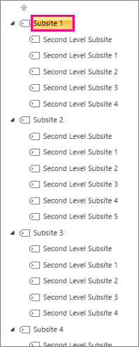

# <a name="navigation-options-for-sharepoint-online"></a>SharePoint Online에 대 한 탐색 옵션

이 문서에서는 sharepoint Online에서 SharePoint 게시를 사용 하는 탐색 옵션 사이트에 대해 설명 합니다. 탐색을 선택 하 고 구성 하는 것은 SharePoint Online의 사이트 성능 및 확장성에 큰 영향을 줍니다. SharePoint 게시 사이트 서식 파일은 중앙 포털에 필요한 경우에만 사용 해야 하며, 게시 기능은 특정 사이트 에서만 사용 하도록 설정 해야 하며, 제대로 사용 되지 않는 경우에는 절대적으로 필요한 경우에만 사용할 수 있습니다.

>[!NOTE]
>메가 메뉴, 연속 탐색 또는 허브 탐색 같은 최신 SharePoint 탐색 옵션을 사용 중인 경우이 문서는 사이트에 적용 되지 않습니다. 최신 SharePoint 사이트 아키텍처는 보다 평면화 된 사이트 계층 구조와 허브 및 스포크 모델을 활용 합니다. 이렇게 하면 SharePoint 게시 기능을 사용할 필요가 없는 많은 시나리오가 실현 될 수 있습니다.

## <a name="overview"></a>개요

탐색 공급자 구성은 전체 사이트에 대 한 성능을 크게 향상 시킬 수 있으며, SharePoint 사이트의 요구 사항에 맞게 효율적으로 확장 되는 탐색 공급자 및 구성을 선택 하기 위해 신중 하 게 고려해 야 합니다. 두 가지 기본 탐색 공급자와 사용자 지정 탐색 구현도 있습니다.

**사이트에 대 한 구조적 탐색 캐싱을 설정 하는 경우**첫 번째 옵션인 [**구조적 탐색**](#using-structural-navigation-in-sharepoint-online)은 sharepoint Online에서 권장 되는 탐색 옵션입니다. 이 탐색 공급자는 현재 사이트 아래에 있는 탐색 항목과 선택적으로 현재 사이트와 형제를 표시 합니다. 보안 트리밍 및 사이트 구조 열거와 같은 추가 기능을 제공 합니다. 캐싱이 사용 하지 않도록 설정 되어 있으면 성능 및 확장성이 저하 되 고 제한 사항이 적용 될 수 있습니다.

두 번째 옵션인 [**관리 (메타 데이터) 탐색**](#using-managed-navigation-and-metadata-in-sharepoint-online)은 관리 되는 메타 데이터 용어 집합을 사용 하는 탐색 항목을 나타냅니다. 보안 조정이 필요 하지 않은 경우에는 사용 하지 않도록 설정 하는 것이 좋습니다. 보안 트리밍이이 탐색 공급자의 기본 설정으로 사용 하도록 설정 됩니다. 그러나 대부분의 사이트에서는 사이트의 모든 사용자에 대해 탐색 요소가 대개 일치 하므로 보안 트리밍이 오버 헤드가 발생 하지 않습니다. 보안 조정을 사용 하지 않도록 설정 하기 위한 권장 구성을 사용 하는 경우에는이 탐색 공급자가 사이트 구조를 열거할 필요가 없으며 적절 한 성능 영향을 통해 확장성이 뛰어납니다.

기본 탐색 공급자 외에도 많은 고객이 대체 사용자 지정 탐색 구현을 성공적으로 구현 했습니다. 이 문서의 [검색 기반 클라이언트 쪽 스크립팅을](#using-search-driven-client-side-scripting) 참조 하십시오.
  
## <a name="pros-and-cons-of-sharepoint-online-navigation-options"></a>SharePoint Online 탐색 옵션의 장단점

다음 표에는 각 옵션의 장단점을 요약 하 여 설명 합니다.

|구조적 탐색  |관리 탐색  |검색 기반 탐색  |사용자 지정 탐색 공급자  |
|---------|---------|---------|---------|
|들은<br/><br/>쉬운 유지 관리<br/>보안 트리밍<br/>콘텐츠가 변경 될 때 24 시간 내에 자동으로 업데이트<br/>     |들은<br/><br/>쉬운 유지 관리<br/>|들은<br/><br/>보안 트리밍<br/>사이트가 추가 될 때 자동으로 업데이트 됩니다.<br/>빠른 로드 시간 및 로컬로 캐시 된 탐색 구조<br/>|들은<br/><br/>사용 가능한 옵션의 폭넓은 선택<br/>캐싱이 올바르게 사용 되는 경우의 빠른 로드<br/>대부분의 옵션은 응답성이 뛰어난 페이지 디자인에서 제대로 작동 합니다.<br/>|
|장단점이<br/><br/>**캐싱이 사용 되지 않는 경우 성능에 영향을 줍니다.**<br/>제한 주체<br/>|장단점이<br/><br/>사이트 구조를 반영 하도록 자동으로 업데이트 되지 않음<br/>**보안 트리밍이 사용 하도록 설정** 되었거나 탐색 구조가 복잡 한 경우 성능에 영향을 줍니다.<br/>|장단점이<br/><br/>사이트를 쉽게 정렬 하는 기능이 없음<br/>마스터 페이지의 사용자 지정 필요 (기술 필요)<br/>|장단점이<br/><br/>사용자 지정 개발 필요<br/>외부 데이터 원본/캐시가 저장 됨 (예: Azure)이 필요 합니다.<br/>|

사이트에 가장 적합 한 옵션은 사이트 요구 사항과 기술 기능에 따라 달라 집니다. 콘텐츠 변경 시 자동으로 업데이트 되는 탐색 공급자를 쉽게 구성할 수 있도록 하려면 [캐싱을 사용 하](https://support.office.com/article/structural-navigation-and-performance-f163053f-8eca-4b9c-b973-36b395093b43) 는 구조적 탐색이 적절 한 옵션입니다.

>[!NOTE]
>전체 사이트 구조를 flatter으로 단순화 하 여 최신 SharePoint 사이트와 동일한 원칙을 적용 하면 계층 구조가 아닌 구조로 인해 성능이 향상 되 고 최신 SharePoint 사이트로 쉽게 전환할 수 있습니다. 즉, 수백 개의 사이트 (하위 웹)에 단일 사이트 모음을 사용 하는 대신 여러 하위 사이트 (하위 웹)를 사용 하 여 많은 사이트가 있는 경우이 방법을 사용 하는 것이 더 좋습니다.

## <a name="analyzing-navigation-performance-in-sharepoint-online"></a>SharePoint Online의 탐색 성능 분석

[Sharepoint 용 페이지 진단 도구](https://aka.ms/perftool) 는 sharepoint Online 최신 포털 및 클래식 게시 사이트 페이지를 모두 분석 하는 Microsoft Edge 및 Chrome 브라우저의 브라우저 확장입니다. 이 도구는 SharePoint Online 에서만 작동 하며 SharePoint 시스템 페이지에서는 사용할 수 없습니다.

이 도구는 분석 된 각 페이지에 대 한 보고서를 생성 하 고, 테스트 결과가 기준 값 외부에 있을 때 해당 페이지에 대 한 자세한 정보를 표시 합니다. SharePoint Online 관리자 및 디자이너는 도구를 사용 하 여 성능 문제를 해결 하 고, 게시 하기 전에 새 페이지를 최적화할 수 있습니다.

**Sprequestduration** 특히 SharePoint에서 페이지를 처리 하는 데 소요 되는 시간입니다. 탐색에 페이지를 포함 하는 등의 고급 탐색, 복잡 한 사이트 계층 구조 및 기타 구성 및 토폴로지 옵션이 더 긴 기간에 크게 기여할 수 있습니다.

## <a name="using-structural-navigation-in-sharepoint-online"></a>SharePoint Online에서 구조적 탐색 사용

기본적으로 사용 되는 기본 탐색 이며 가장 간단한 솔루션입니다. 또한 사용자 지정이 필요 하지 않으며, 기술 외의 사용자는 설정 페이지에서 쉽게 항목을 추가 하 고 항목을 숨기고 탐색을 관리할 수 있습니다. [캐싱을 사용 하도록 설정](https://support.office.com/article/structural-navigation-and-performance-f163053f-8eca-4b9c-b973-36b395093b43)하는 것이 좋지만, 그렇지 않은 경우에는 성능이 많이 저하 됩니다.

### <a name="how-to-implement-structural-navigation-caching"></a>구조적 탐색 캐싱을 구현 하는 방법

**사이트 설정** > **Look and Feel** > **탐색**의 디자인에서 전역 탐색 또는 현재 탐색에 대해 구조적 탐색이 선택 되어 있는지 확인할 수 있습니다. **페이지 표시** 를 선택 하면 성능에 부정적인 영향을 줄 수 있습니다.


캐싱은 사이트 모음 수준과 사이트 수준에서 사용 하거나 사용 하지 않도록 설정할 수 있으며 기본적으로는 둘 다 사용 하도록 설정 됩니다. 사이트 모음 수준에서 사용 하도록 설정 하려면 사이트 **설정** > **사이트 모음 관리** > **사이트 모음 탐색**에서 **캐싱 사용**확인란을 선택 합니다.


사이트 수준에서 사용 하도록 설정 하려면 **사이트 설정** > **탐색**에서 **캐싱 사용**확인란을 선택 합니다.


## <a name="using-managed-navigation-and-metadata-in-sharepoint-online"></a>SharePoint Online에서 관리 탐색 및 메타 데이터 사용

관리 탐색은 구조적 탐색과 동일한 기능을 대부분 다시 만드는 데 사용할 수 있는 또 다른 기본 옵션입니다. 보안 트리밍이 사용 하거나 사용 하지 않도록 설정 되도록 관리 되는 메타 데이터를 구성할 수 있습니다. 보안 트리밍이 사용 하지 않도록 설정 된 경우 관리 되는 탐색은 일정 한 수의 서버 호출을 사용 하 여 모든 탐색 링크를 로드 하는 것과 매우 효율적으로 수행 됩니다. 그러나 보안 조정을 사용 하도록 설정 하면 관리 되는 탐색의 성능 이점을 일부 무효화 됩니다.

보안 조정을 사용 하도록 설정 해야 하는 경우 다음을 수행 하는 것이 좋습니다.

- 단순 링크에 대 한 모든 URL 링크 업데이트
- 친숙 한 Url로 필요한 보안 트리밍 노드 추가
- 탐색 항목 수를 최대 100 개 이하로 제한 합니다.

사이트의 모든 사용자가 탐색 구조를 일관 되 게 유지 하는 경우가 많으므로 대부분의 사이트에서는 보안 조정이 필요 하지 않습니다. 보안 트리밍이 사용 하지 않도록 설정 되 고 모든 사용자에 게 액세스 권한이 없는 탐색에 링크가 추가 된 경우에도 링크가 계속 나타나지만 액세스 거부 메시지가 표시 됩니다. 콘텐츠에 실수로 액세스 하는 위험은 없습니다.

### <a name="how-to-implement-managed-navigation-and-the-results"></a>관리 탐색 및 결과를 구현 하는 방법

Docs.microsoft.com에는 관리 되는 탐색 세부 정보에 대 한 몇 가지 문서가 있습니다. 예를 들어 [SharePoint Server의 관리 탐색 개요](https://docs.microsoft.com/sharepoint/administration/overview-of-managed-navigation)를 참조 하세요.

관리 되는 탐색을 구현 하려면 사이트의 탐색 구조에 해당 하는 Url을 사용 하 여 용어를 설정 합니다. 관리 탐색은 대부분의 경우 구조적 탐색을 대체 하기 위해 수동으로 맞게 조정 된 수도 있습니다. 예를 들면 다음과 같습니다.

)

## <a name="using-search-driven-client-side-scripting"></a>검색 기반 클라이언트 쪽 스크립팅 사용

사용자 지정 탐색 구현의 한 가지 일반적인 클래스는 탐색 노드의 로컬 캐시를 저장 하는 클라이언트 렌더링 디자인 패턴을 사용 합니다.

이러한 탐색 공급자에는 다음과 같은 몇 가지 주요 이점이 있습니다.

- 일반적으로 페이지 디자인이 정상적으로 작동 합니다.
- 리소스 비용 없이 렌더링할 수 있으며 시간 초과 후 백그라운드에서 새로 고침을 통해 성능이 크게 향상 되 고 성능이 뛰어납니다.
- 이러한 탐색 공급자는 간단한 정적 구성에서 다양 한 동적 데이터 공급자에 이르기까지 다양 한 전략을 사용 하 여 탐색 데이터를 검색할 수 있습니다.

**검색 기반 탐색 기능**을 사용 하 여 탐색 노드를 열거 하 고 보안 조정을 효율적으로 처리할 수 있도록 하는 데이터 공급자의 예입니다.

**사용자 지정 탐색 공급자**를 빌드하기 위한 기타 옵션이 많이 있습니다. 사용자 지정 탐색 공급자를 작성 하는 방법에 대 한 자세한 내용은 [SharePoint Online 포털에 대 한 탐색 솔루션](https://docs.microsoft.com/sharepoint/dev/solution-guidance/portal-navigation) 을 검토 하십시오.

검색을 사용 하면 연속 크롤링을 사용 하 여 백그라운드로 작성 되는 인덱스를 활용할 수 있습니다. 검색 결과가 검색 인덱스에서 추출 되 고 결과가 보안 트리밍 됩니다. 이는 보안 조정이 필요한 경우 일반적으로 기본 탐색 공급자 보다 빠릅니다. 구조적 탐색에 대해 검색 사용 (특히 사이트 구조가 복잡 한 경우) 페이지 로드 시간이 크게 단축 됩니다. 이에 대 한 관리 방식의 주요 이점은 보안 트리밍이 향상 된다는 것입니다.

이 방법에는 사용자 지정 마스터 페이지를 만들고 기본 탐색 코드를 사용자 지정 HTML로 바꾸는 작업이 포함 됩니다. 다음 예제에 나와 있는이 절차에 따라 파일 `seattle.html`의 탐색 코드를 바꿉니다. 이 예제에서는 `seattle.html` 파일을 열고 전체 요소 `id="DeltaTopNavigation"` 를 사용자 지정 HTML 코드로 바꿉니다.

### <a name="example-replace-the-out-of-the-box-navigation-code-in-a-master-page"></a>예: 마스터 페이지에서 기본 탐색 코드 교체

1. 사이트 설정 페이지로 이동 합니다.
2. **마스터 페이지**를 클릭 하 여 마스터 페이지 갤러리를 엽니다.
3. 여기에서 라이브러리를 탐색 하 고 파일 `seattle.master`을 다운로드할 수 있습니다.
4. 텍스트 편집기를 사용 하 여 코드를 편집 하 고 다음 스크린 샷에서 코드 블록을 삭제 합니다.<br/><br/>
5. `<SharePoint:AjaxDelta id="DeltaTopNavigation">` 와 `<\SharePoint:AjaxDelta>` 태그 사이에 있는 코드를 제거 하 고 다음 코드 조각으로 바꿉니다.<br/>

```javascript
<div id="loading">
  <!--Replace with path to loading image.-->
  <div style="background-image: url(''); height: 22px; width: 22px; ">
  </div>
</div>
<!-- Main Content-->
<div id="navContainer" style="display:none">
    <div data-bind="foreach: hierarchy" class="noindex ms-core-listMenu-horizontalBox">
        <a class="dynamic menu-item ms-core-listMenu-item ms-displayInline ms-navedit-linkNode" data-bind="attr: { href: item.Url, title: item.Title }">
            <span class="menu-item-text" data-bind="text: item.Title">
            </span>
        </a>
        <ul id="menu" data-bind="foreach: $data.children" style="padding-left:20px">
            <li class="static dynamic-children level1">
                <a class="static dynamic-children menu-item ms-core-listMenu-item ms-displayInline ms-navedit-linkNode" data-bind="attr: { href: item.Url, title: item.Title }">

                 <!-- ko if: children.length > 0-->
                    <span aria-haspopup="true" class="additional-background ms-navedit-flyoutArrow dynamic-children">
                        <span class="menu-item-text" data-bind="text: item.Title">
                        </span>
                    </span>
                <!-- /ko -->
                <!-- ko if: children.length == 0-->
                    <span aria-haspopup="true" class="ms-navedit-flyoutArrow dynamic-children">
                        <span class="menu-item-text" data-bind="text: item.Title">
                        </span>
                    </span>
                <!-- /ko -->
                </a>

                <!-- ko if: children.length > 0-->
                <ul id="menu"  data-bind="foreach: children;" class="dynamic  level2" >
                    <li class="dynamic level2">
                        <a class="dynamic menu-item ms-core-listMenu-item ms-displayInline  ms-navedit-linkNode" data-bind="attr: { href: item.Url, title: item.Title }">

          <!-- ko if: children.length > 0-->
          <span aria-haspopup="true" class="additional-background ms-navedit-flyoutArrow dynamic-children">
           <span class="menu-item-text" data-bind="text: item.Title">
           </span>
          </span>
           <!-- /ko -->
          <!-- ko if: children.length == 0-->
          <span aria-haspopup="true" class="ms-navedit-flyoutArrow dynamic-children">
           <span class="menu-item-text" data-bind="text: item.Title">
           </span>
          </span>
          <!-- /ko -->
                        </a>
          <!-- ko if: children.length > 0-->
         <ul id="menu" data-bind="foreach: children;" class="dynamic level3" >
          <li class="dynamic level3">
           <a class="dynamic menu-item ms-core-listMenu-item ms-displayInline ms-navedit-linkNode" data-bind="attr: { href: item.Url, title: item.Title }">
            <span class="menu-item-text" data-bind="text: item.Title">
            </span>
           </a>
          </li>
         </ul>
           <!-- /ko -->
                    </li>
                </ul>
                <!-- /ko -->
            </li>
        </ul>
    </div>
</div>
```

<br/>
6. 로드 이미지 앵커 태그의 URL을 사이트 모음의 로드 이미지에 연결 하 여 처음에 바꿉니다. 변경 작업을 수행한 후 파일의 이름을 바꾸고 마스터 페이지 갤러리에 업로드 합니다. 이렇게 하면 새 .master 파일이 생성 됩니다.<br/>
7. 이 HTML은 JavaScript 코드에서 반환 되는 검색 결과로 채워지는 기본 태그입니다. 다음 코드 조각에서와 같이 var root = "site collection URL"에 대 한 값을 변경 하려면 다음과 같은 코드로 편집 해야 합니다.<br/>

```javascript
var root = "https://spperformance.sharepoint.com/sites/NavigationBySearch";
```

<br/>
8. 결과가 자체 nodes 배열에 할당 되 고 계층 구조는 배열형을 사용 하 여 배열 자체에 출력을 할당 하는 개체를 기반으로 작성 됩니다. 이 배열은 HTML에 바인딩된 개체입니다. 이 작업은 자체 개체를 ko-kr Binding () 함수에 전달 하 여 toggleView () 함수에서 수행 됩니다.<br/>이렇게 하면 계층 구조 배열이 다음 HTML에 바인딩됩니다.<br/>

```javascript
<div data-bind="foreach: hierarchy" class="noindex ms-core-listMenu-horizontalBox">
```

And `mouseenter` `mouseexit` 에 대 한 이벤트 처리기는 `addEventsToElements()` 함수에서 수행 되는 하위 사이트 드롭다운 메뉴를 처리 하기 위해 최상위 탐색에 추가 됩니다.

복잡 한 탐색 예제에서 로컬 캐싱을 사용 하지 않고 새로운 페이지 로드를 수행 하면 서버에 소요 된 시간이 벤치 마크 구조적 탐색에서 아래로 세분화 되어 관리 되는 탐색 방법과 비슷한 결과가 표시 됩니다.

### <a name="about-the-javascript-file"></a>JavaScript 파일 정보 ...

>[!NOTE]
>사용자 지정 JavaScript를 사용 하는 경우에는 공용 CDN이 사용 하도록 설정 되어 있고 파일이 CDN 위치에 있는지 확인 합니다.

전체 JavaScript 파일은 다음과 같습니다.

```javascript
//Models and Namespaces
var SPOCustom = SPOCustom || {};
SPOCustom.Models = SPOCustom.Models || {}
SPOCustom.Models.NavigationNode = function () {

    this.Url = ko.observable("");
    this.Title = ko.observable("");
    this.Parent = ko.observable("");

};

var root = "https://spperformance.sharepoint.com/sites/NavigationBySearch";
var baseUrl = root + "/_api/search/query?querytext=";
var query = baseUrl + "'contentClass=\"STS_Web\"+path:" + root + "'&trimduplicates=false&rowlimit=300";

var baseRequest = {
    url: "",
    type: ""
};


//Parses a local object from JSON search result.
function getNavigationFromDto(dto) {
    var item = new SPOCustom.Models.NavigationNode();
    if (dto != undefined) {

        var webTemplate = getSearchResultsValue(dto.Cells.results, 'WebTemplate');

        if (webTemplate != "APP") {
            item.Title(getSearchResultsValue(dto.Cells.results, 'Title')); //Key = Title
            item.Url(getSearchResultsValue(dto.Cells.results, 'Path')); //Key = Path
            item.Parent(getSearchResultsValue(dto.Cells.results, 'ParentLink')); //Key = ParentLink
        }

    }
    return item;
}

function getSearchResultsValue(results, key) {

    for (i = 0; i < results.length; i++) {
        if (results[i].Key == key) {
            return results[i].Value;
        }
    }
    return null;
}

//Parse a local object from the serialized cache.
function getNavigationFromCache(dto) {
    var item = new SPOCustom.Models.NavigationNode();

    if (dto != undefined) {

        item.Title(dto.Title);
        item.Url(dto.Url);
        item.Parent(dto.Parent);
    }

    return item;
}

/* create a new OData request for JSON response */
function getRequest(endpoint) {
    var request = baseRequest;
    request.type = "GET";
    request.url = endpoint;
    request.headers = { ACCEPT: "application/json;odata=verbose" };
    return request;
};

/* Navigation Module*/
function NavigationViewModel() {
    "use strict";
    var self = this;
    self.nodes = ko.observableArray([]);
    self.hierarchy = ko.observableArray([]);;
    self.loadNavigatioNodes = function () {
        //Check local storage for cached navigation datasource.
        var fromStorage = localStorage["nodesCache"];
        if (false) {
            var cachedNodes = JSON.parse(localStorage["nodesCache"]);

            if (cachedNodes && timeStamp) {
                //Check for cache expiration. Currently set to 3 hrs.
                var now = new Date();
                var diff = now.getTime() - timeStamp;
                if (Math.round(diff / (1000 * 60 * 60)) < 3) {

                    //return from cache.
                    var cacheResults = [];
                    $.each(cachedNodes, function (i, item) {
                        var nodeitem = getNavigationFromCache(item, true);
                        cacheResults.push(nodeitem);
                    });

                    self.buildHierarchy(cacheResults);
                    self.toggleView();
                    addEventsToElements();
                    return;
                }
            }
        }
        //No cache hit, REST call required.
        self.queryRemoteInterface();
    };

    //Executes a REST call and builds the navigation hierarchy.
    self.queryRemoteInterface = function () {
        var oDataRequest = getRequest(query);
        $.ajax(oDataRequest).done(function (data) {
            var results = [];
            $.each(data.d.query.PrimaryQueryResult.RelevantResults.Table.Rows.results, function (i, item) {

                if (i == 0) {
                    //Add root element.
                    var rootItem = new SPOCustom.Models.NavigationNode();
                    rootItem.Title("Root");
                    rootItem.Url(root);
                    rootItem.Parent(null);
                    results.push(rootItem);
                }
                var navItem = getNavigationFromDto(item);
                results.push(navItem);
            });
            //Add to local cache
            localStorage["nodesCache"] = ko.toJSON(results);

            localStorage["nodesCachedAt"] = new Date().getTime();
            self.nodes(results);
            if (self.nodes().length > 0) {
                var unsortedArray = self.nodes();
                var sortedArray = unsortedArray.sort(self.sortObjectsInArray);

                self.buildHierarchy(sortedArray);
                self.toggleView();
                addEventsToElements();
            }
        }).fail(function () {
            //Handle error here!!
            $("#loading").hide();
            $("#error").show();
        });
    };
    self.toggleView = function () {
        var navContainer = document.getElementById("navContainer");
        ko.applyBindings(self, navContainer);
        $("#loading").hide();
        $("#navContainer").show();

    };
    //Uses linq.js to build the navigation tree.
    self.buildHierarchy = function (enumerable) {
        self.hierarchy(Enumerable.From(enumerable).ByHierarchy(function (d) {
            return d.Parent() == null;
        }, function (parent, child) {
            if (parent.Url() == null || child.Parent() == null)
                return false;
            return parent.Url().toUpperCase() == child.Parent().toUpperCase();
        }).ToArray());

        self.sortChildren(self.hierarchy()[0]);
    };


    self.sortChildren = function (parent) {

        // sjip processing if no children
        if (!parent || !parent.children || parent.children.length === 0) {
            return;
        }

        parent.children = parent.children.sort(self.sortObjectsInArray2);

        for (var i = 0; i < parent.children.length; i++) {
            var elem = parent.children[i];

            if (elem.children && elem.children.length > 0) {
                self.sortChildren(elem);
            }
        }
    };

    // ByHierarchy method breaks the sorting in chrome and firefox
    // we need to resort  as ascending
    self.sortObjectsInArray2 = function (a, b) {
        if (a.item.Title() > b.item.Title())
            return 1;
        if (a.item.Title() < b.item.Title())
            return -1;
        return 0;
    };


    self.sortObjectsInArray = function (a, b) {
        if (a.Title() > b.Title())
            return -1;
        if (a.Title() < b.Title())
            return 1;
        return 0;
    }
}

//Loads the navigation on load and binds the event handlers for mouse interaction.
function InitCustomNav() {
    var viewModel = new NavigationViewModel();
    viewModel.loadNavigatioNodes();
}

function addEventsToElements() {
    //events.
      $("li.level1").mouseover(function () {
          var position = $(this).position();
          $(this).find("ul.level2").css({ width: 100, left: position.left + 10, top: 50 });
      })
   .mouseout(function () {
     $(this).find("ul.level2").css({  left: -99999, top: 0 });
   
    });
   
     $("li.level2").mouseover(function () {
          var position = $(this).position();
          console.log(JSON.stringify(position));
          $(this).find("ul.level3").css({ width: 100, left: position.left + 95, top:  position.top});
      })
   .mouseout(function () {
     $(this).find("ul.level3").css({  left: -99999, top: 0 });
    });
} _spBodyOnLoadFunctionNames.push("InitCustomNav");

```

위에 표시 된 코드를 요약 하려면이 `jQuery $(document).ready` 함수를 `viewModel object` 만든 다음 해당 개체에 대 `loadNavigationNodes()` 한 함수를 호출 합니다. 이 함수는 클라이언트 브라우저의 HTML5 로컬 저장소에 저장 된 이전에 작성 된 탐색 계층 구조를 로드 하거나 함수 `queryRemoteInterface()`를 호출 합니다.

`QueryRemoteInterface()`스크립트 앞부분에서 정의한 쿼리 `getRequest()` 매개 변수와 함께 함수를 사용 하 여 요청을 작성 하 고 서버에서 데이터를 반환 합니다. 이 데이터는 기본적으로 사이트 모음에서 다양 한 속성과 함께 데이터 전송 개체로 표시 되는 모든 사이트의 배열입니다.

이 데이터는 이전에 정의한 HTML에 값 `SPO.Models.NavigationNode` 을 데이터 바인딩할 `Knockout.js` 때 사용할 예측 가능한 속성을 만들기 위해 사용 하는 이전에 정의 된 개체로 구문 분석 됩니다.

그런 다음 개체를 결과 배열에 추가 합니다. 이 배열은 나중에 페이지를 로드할 때 성능을 개선 하기 위해 녹아웃을 사용 하 여 JSON으로 구문 분석 되며 로컬 브라우저 저장소에 저장 됩니다.

### <a name="benefits-of-this-approach"></a>이 방법의 장점

[이 방법](#example-replace-the-out-of-the-box-navigation-code-in-a-master-page) 의 주요 이점 중 하나는 HTML5 로컬 저장소를 사용 하 여 다음에 페이지를 로드할 때 탐색이 로컬로 저장 된다는 것입니다. 구조적 탐색에는 검색 API를 사용 하는 것과 관련 하 여 성능을 크게 향상 시킬 수 있습니다. 그러나이 기능을 실행 하 고 사용자 지정 하는 데는 몇 가지 기술적인 기능이 있습니다.

[예제 구현](#example-replace-the-out-of-the-box-navigation-code-in-a-master-page)에서 사이트는 기본 구조적 탐색과 동일한 방식으로 정렬 됩니다. 사전순 이 순서를 그대로 유지 하려는 경우에는 개발 및 관리가 훨씬 복잡해 집니다. 또한이 방법을 사용 하려면 지원 되는 마스터 페이지에서 벗어난 사항을 충족 해야 합니다. 사용자 지정 마스터 페이지가 유지 관리 되지 않으면 사이트에서 마스터 페이지에 대 한 업데이트 및 향상 된 기능을 놓치지 않습니다.

[위의 코드](#about-the-javascript-file) 에는 다음과 같은 종속성이 있습니다.

- jQueryhttps://jquery.com/
- KnockoutJS -https://knockoutjs.com/
- Linq .js- https://linqjs.codeplex.com/또는 github.com/neuecc/linq.js

현재 버전의 LinqJS에는 위의 코드에서 사용 된 ByHierarchy 메서드가 포함 되지 않으며 탐색 코드가 손상 됩니다. 이 문제를 해결 하려면 명령줄 `Flatten: function ()`앞에 있는 Linq .js 파일에 다음 메서드를 추가 합니다.

```javascript
ByHierarchy: function(firstLevel, connectBy, orderBy, ascending, parent) {
     ascending = ascending == undefined ? true : ascending;
     var orderMethod = ascending == true ? 'OrderBy' : 'OrderByDescending';
     var source = this;
     firstLevel = Utils.CreateLambda(firstLevel);
     connectBy = Utils.CreateLambda(connectBy);
     orderBy = Utils.CreateLambda(orderBy);

     //Initiate or increase level
     var level = parent === undefined ? 1 : parent.level + 1;

    return new Enumerable(function() {
         var enumerator;
         var index = 0;

        var createLevel = function() {
                 var obj = {
                     item: enumerator.Current(),
                     level : level
                 };
                 obj.children = Enumerable.From(source).ByHierarchy(firstLevel, connectBy, orderBy, ascending, obj);
                 if (orderBy !== undefined) {
                     obj.children = obj.children[orderMethod](function(d) {
                         return orderBy(d.item); //unwrap the actual item for sort to work
                     });
                 }
                 obj.children = obj.children.ToArray();
                 Enumerable.From(obj.children).ForEach(function(child) {
                     child.getParent = function() {
                         return obj;
                     };
                 });
                 return obj;
             };

        return new IEnumerator(

        function() {
             enumerator = source.GetEnumerator();
         }, function() {
             while (enumerator.MoveNext()) {
                 var returnArr;
                 if (!parent) {
                     if (firstLevel(enumerator.Current(), index++)) {
                         return this.Yield(createLevel());
                     }

                } else {
                     if (connectBy(parent.item, enumerator.Current(), index++)) {
                         return this.Yield(createLevel());
                     }
                 }
             }
             return false;
         }, function() {
             Utils.Dispose(enumerator);
         })
     });
 },

```
  
## <a name="related-topics"></a>관련 항목

[SharePoint Server의 관리 탐색 개요](https://docs.microsoft.com/sharepoint/administration/overview-of-managed-navigation)

[구조적 탐색 캐싱 및 성능](https://support.office.com/article/structural-navigation-and-performance-f163053f-8eca-4b9c-b973-36b395093b43)
