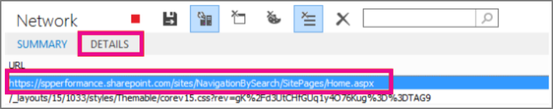

# <a name="navigation-options-for-sharepoint-online"></a><span data-ttu-id="b996b-103">SharePoint Online에 대한 탐색 옵션</span><span class="sxs-lookup"><span data-stu-id="b996b-103">Navigation options for SharePoint Online</span></span>

<span data-ttu-id="b996b-104">이 문서에서는 클래식 게시에서 관리 되는 탐색 또는 검색 기반 탐색을 사용 하 여 SharePoint Online에 대 한 페이지 로드 시간을 개선 하는 방법에 설명 합니다.</span><span class="sxs-lookup"><span data-stu-id="b996b-104">This article describes how to improve page load times for SharePoint Online by using managed navigation or search-driven navigation in Classic publishing.</span></span>
  
<span data-ttu-id="b996b-105">클래식 게시를 사용할 수 있는 SharePoint Online에 두 탐색 영역이 있습니다. 전역 탐색 및 현재 탐색 합니다.</span><span class="sxs-lookup"><span data-stu-id="b996b-105">SharePoint Online with classic publishing enabled has two navigation areas; Global Navigation and Current Navigation.</span></span>
  
<span data-ttu-id="b996b-106">전역 탐색에는 위쪽 탐색 메뉴를 현재 탐색은 측면 또는에서 상황에 맞는 왼쪽/오른쪽 탐색 언어 구성 및 사용 하는 마스터 페이지에 따라 다릅니다.</span><span class="sxs-lookup"><span data-stu-id="b996b-106">Global navigation is the top navigation menu while Current Navigation is the side or in-context left/right navigation dependent on the language configuration and master page utilized.</span></span>
  
<span data-ttu-id="b996b-107">탐색 포털 수준 사용에 대 한 자주 구성 하 고 이와 같이 SharePoint 사이트의 중요 한 요소는 전체 포털에 대 한 성능에 부정적인 영향 수 있습니다.</span><span class="sxs-lookup"><span data-stu-id="b996b-107">Navigation can negatively impact performance for the entire Portal as it is often configured for portal-wide use and as such is an important element of any SharePoint site.</span></span>
  
<span data-ttu-id="b996b-108">구조적 탐색은 해당 보안 조정 사용 하는 온-프레미스 토폴로지를 디자인 하 고이 디자인 과도 한 서버 통화 하도록 지정 하 고 사용 하는 경우 성능에 영향을 줍니다으로 SharePoint Online에서 권장된 탐색 옵션은 없습니다.</span><span class="sxs-lookup"><span data-stu-id="b996b-108">Structural navigation is not the recommended navigation option in SharePoint Online as it was designed for an On-premise topology with security trimming and this design causes excessive server calls and impacts performance when it is used.</span></span>
  
<span data-ttu-id="b996b-p101">간소화 된 플랫된 사이트 계층을 구조가 현대 여기서 도입 현대 SharePoint 사이트의 디자인 변경 되었습니다. 이러한 방식이 탐색 관련 된 성능 문제는 제거 하는 간소화 된 계층 구조를 사용 하 여 탐색을 간소화 합니다.</span><span class="sxs-lookup"><span data-stu-id="b996b-p101">That design has changed with the introduction of Modern SharePoint sites where Modern has a simplified flattened site hierarchy. This has simplified navigation with a simplified hierarchy that has eliminated performance issues related to navigation.</span></span>
  
<span data-ttu-id="b996b-p102">세번째 사용자 지정, 검색 기반 접근 방식, SharePoint에서 두 주의 기본 탐색 옵션 가지가 있습니다. 또는 4 번째 및 아주 유명한 옵션 사용자 지정 탐색 공급자를 구축 하는입니다. 사용자 정의 탐색 공급자에 대 한 지침에 대 한 [SharePoint 온라인 포털에 대 한 탐색 솔루션](https://docs.microsoft.com/en-us/sharepoint/dev/solution-guidance/portal-navigation) 을 검토 하십시오.</span><span class="sxs-lookup"><span data-stu-id="b996b-p102">There are two main out-of-the-box navigation options in SharePoint as well as a third, custom, search-driven approach. Alternatively, a fourth and fairly popular option is to build a Custom Navigation Provider. Please review [Navigation solutions for SharePoint Online portals](https://docs.microsoft.com/en-us/sharepoint/dev/solution-guidance/portal-navigation) for guidance on a Custom navigation provider.</span></span> 
  
<span data-ttu-id="b996b-114">각 옵션에는 장단점이 다음 표에 요약 된 대로 합니다.</span><span class="sxs-lookup"><span data-stu-id="b996b-114">Each option has pros and cons as outlined in the following table.</span></span>
  
|<span data-ttu-id="b996b-115">**구조적 탐색**</span><span class="sxs-lookup"><span data-stu-id="b996b-115">**Structural navigation**</span></span>|<span data-ttu-id="b996b-116">**관리 탐색**</span><span class="sxs-lookup"><span data-stu-id="b996b-116">**Managed navigation**</span></span>|<span data-ttu-id="b996b-117">**검색 기반 탐색**</span><span class="sxs-lookup"><span data-stu-id="b996b-117">**Search-driven navigation**</span></span>||<span data-ttu-id="b996b-118">**사용자 지정 탐색 공급자**</span><span class="sxs-lookup"><span data-stu-id="b996b-118">**Custom Navigation Provider**</span></span>|
|:-----|:-----|:-----|:-----|:-----|
| <span data-ttu-id="b996b-119">장점:</span><span class="sxs-lookup"><span data-stu-id="b996b-119">Pros:</span></span>  <br/>  <span data-ttu-id="b996b-120">쉬운 구성</span><span class="sxs-lookup"><span data-stu-id="b996b-120">Easy to configure</span></span>  <br/>  <span data-ttu-id="b996b-121">보안 조정</span><span class="sxs-lookup"><span data-stu-id="b996b-121">Security-trimmed</span></span>  <br/>  <span data-ttu-id="b996b-122">사이트를 추가할 때 자동으로 업데이트</span><span class="sxs-lookup"><span data-stu-id="b996b-122">Automatically updates as sites are added</span></span>  <br/> | <span data-ttu-id="b996b-123">장점:</span><span class="sxs-lookup"><span data-stu-id="b996b-123">Pros:</span></span>  <br/>  <span data-ttu-id="b996b-124">쉬운 유지 관리</span><span class="sxs-lookup"><span data-stu-id="b996b-124">Easy to maintain</span></span>  <br/>  <span data-ttu-id="b996b-125">권장 되는 옵션</span><span class="sxs-lookup"><span data-stu-id="b996b-125">Recommended option</span></span>  <br/> | <span data-ttu-id="b996b-126">장점:</span><span class="sxs-lookup"><span data-stu-id="b996b-126">Pros:</span></span>  <br/>  <span data-ttu-id="b996b-127">보안 조정</span><span class="sxs-lookup"><span data-stu-id="b996b-127">Security-trimmed</span></span>  <br/>  <span data-ttu-id="b996b-128">사이트를 추가할 때 자동으로 업데이트</span><span class="sxs-lookup"><span data-stu-id="b996b-128">Automatically updates as sites are added</span></span>  <br/>  <span data-ttu-id="b996b-129">빠른 로드 시간 및 로컬로 캐시된 탐색 구조</span><span class="sxs-lookup"><span data-stu-id="b996b-129">Fast loading time and locally cached navigation structure</span></span>  <br/> || <span data-ttu-id="b996b-130">장점:</span><span class="sxs-lookup"><span data-stu-id="b996b-130">Pros:</span></span>  <br/>    <br/>  <span data-ttu-id="b996b-131">넓은 선택의 / 사용할 수 있는 옵션</span><span class="sxs-lookup"><span data-stu-id="b996b-131">Wider choice / options available</span></span>  <br/>  <span data-ttu-id="b996b-132">Fast 캐싱 때 로드 되는 올바르게</span><span class="sxs-lookup"><span data-stu-id="b996b-132">Fast loading when caching is used correctly</span></span>  <br/> |
| <span data-ttu-id="b996b-133">단점:</span><span class="sxs-lookup"><span data-stu-id="b996b-133">Cons:</span></span>  <br/> <span data-ttu-id="b996b-134">**권장하지 않음**</span><span class="sxs-lookup"><span data-stu-id="b996b-134">**Not recommended**</span></span> <br/> <span data-ttu-id="b996b-135">**성능에 미치는 영향**</span><span class="sxs-lookup"><span data-stu-id="b996b-135">**Impacts performance**</span></span> <br/> | <span data-ttu-id="b996b-136">단점:</span><span class="sxs-lookup"><span data-stu-id="b996b-136">Cons:</span></span>  <br/>  <span data-ttu-id="b996b-137">사이트 구조를 반영하도록 자동으로 업데이트되지 않음</span><span class="sxs-lookup"><span data-stu-id="b996b-137">Not automatically updated to reflect site structure</span></span>  <br/>  <span data-ttu-id="b996b-138">보안 조정을 사용 하도록 설정 하는 경우 성능에 미치는</span><span class="sxs-lookup"><span data-stu-id="b996b-138">Impacts performance if security trimming is enabled</span></span>  <br/> | <span data-ttu-id="b996b-139">단점:</span><span class="sxs-lookup"><span data-stu-id="b996b-139">Cons:</span></span>  <br/>  <span data-ttu-id="b996b-140">사이트를 쉽게 정렬하는 기능이 없음</span><span class="sxs-lookup"><span data-stu-id="b996b-140">No ability to easily order sites</span></span>  <br/>  <span data-ttu-id="b996b-141">마스터 페이지의 사용자 지정 필요(기술 필요)</span><span class="sxs-lookup"><span data-stu-id="b996b-141">Requires customization of the master page (technical skills required)</span></span>  <br/> || <span data-ttu-id="b996b-142">단점:</span><span class="sxs-lookup"><span data-stu-id="b996b-142">Cons:</span></span>  <br/>  <span data-ttu-id="b996b-143">사용자 지정 개발이 필요</span><span class="sxs-lookup"><span data-stu-id="b996b-143">Custom development is required</span></span>  <br/>  <span data-ttu-id="b996b-144">외부 데이터 원본을 저장 캐시 필요한 / 예: Azure</span><span class="sxs-lookup"><span data-stu-id="b996b-144">External data source / cache stored is needed e.g. Azure</span></span>  <br/> |
   
<span data-ttu-id="b996b-p103">사이트에 대 한 가장 적절 한 옵션에는 사이트 요구 사항 및 기술 사용자 기능에 따라 달라 집니다. 사용자 지정 마스터 페이지를 사용 하 여 만족 하 고 SharePoint Online에 대 한 기본 마스터 페이지에서 발생할 수 있는 변경 내용을 유지 관리 하기 위해 조직에서 일부 기능이 있어야 하는 경우 검색 기반 옵션에서 최상의 사용자 환경을 생성 합니다. 구조적 탐색의 상자와 검색 간에 간단한 중간 밑면을 하려는 경우 관리 되는 탐색 매우 유용한 옵션입니다. 관리 되는 탐색 옵션을 통해 유지할 수 구성, 코드 사용자 지정 파일을 포함 하지 않는 한의 기본 구조적 탐색 보다 훨씬 빠릅니다.</span><span class="sxs-lookup"><span data-stu-id="b996b-p103">The most appropriate option for your site will depend on your site requirements and on your technical capability. If you are comfortable using a custom master page and have some capability in the organization to maintain the changes that may occur in the default master page for SharePoint Online, then the search-driven option will produce the best user experience. If you want a simple middle ground between the out-of-the-box structural navigation and search, then the managed navigation is a very good option. The managed navigation option can be maintained through configuration, does not involve code customization files, and it is significantly faster than the out-of-the-box structural navigation.</span></span>
  
<span data-ttu-id="b996b-p104">현대 형 비슷하게 클래식 포털의 전체 구조를 간소화, 전반적인 성능 및 확장에도 도움이 됩니다. 이 통해 단일 사이트 모음을 대신 하는 것을 의미/극히 일부 하위 사이트 (하위 웹) 포함 하는 여러 사이트 모음을 수천 개의 사이트 (하위 웹) 더 나은 접근 방식입니다.</span><span class="sxs-lookup"><span data-stu-id="b996b-p104">Simplifying the overall structure of your Classic Portal much like Modern, helps with overall performance and scale as well. What this means is that instead of having a single Site Collection with hundreds / thousands of sites (subwebs), a better approach is to have many site collections with very few subsites (subwebs).</span></span>
  
<span data-ttu-id="b996b-151">이 서비스의 추가 크기 조정 옵션을 제공, 하나의 큰 데이터베이스로 모든 콘텐츠를 넣는 것을 방지 하 고 궁극적으로 탐색 하 고 더 중요 한 점은 보안에 대 한 큰 유연성을 허용 합니다.</span><span class="sxs-lookup"><span data-stu-id="b996b-151">This provides additional scaling options in the service, avoids putting all content into one big database and ultimately allows greater flexibility for navigation and more importantly security.</span></span>
  
## <a name="using-structural-navigation-in-sharepoint-online"></a><span data-ttu-id="b996b-152">SharePoint Online에서 구조적 탐색 사용</span><span class="sxs-lookup"><span data-stu-id="b996b-152">Using structural navigation in SharePoint Online</span></span>

<span data-ttu-id="b996b-p105">이것은 기본적으로 사용의 기본 탐색 하 고는 가장 간단한 솔루션 했으나 이와 같이 비용이 많이 드는 성능이 떨어질 있습니다. 모든 사용자 지정이 필요 하지 않습니다 및 비 기술적인 사용자 수도 쉽게 항목을 추가, 항목을 숨기려면 설정 페이지에서 탐색을 관리 합니다. True 되므로 수 있는으로 관리 되는 탐색을 사용 하는 것이 좋습니다. 관리 되는 탐색에 대 한 쉽게 될 수도 있지만 이것은 관리 하 고도 제어 합니다.</span><span class="sxs-lookup"><span data-stu-id="b996b-p105">This is the out-of-the-box navigation used by default and is the most straightforward solution but as such has an expensive performance trade-off. It does not require any customization and a non-technical user can also easily add items, hide items, and manage the navigation from the settings page. This is however also true for Managed Navigation so it is recommended to use Managed Navigation as that can also be easily managed and controlled as well.</span></span>
  
### <a name="turning-on-structural-navigation-in-sharepoint-online"></a><span data-ttu-id="b996b-156">SharePoint Online에서 구조적 탐색 설정</span><span class="sxs-lookup"><span data-stu-id="b996b-156">Turning on structural navigation in SharePoint Online</span></span>

<span data-ttu-id="b996b-p106">구조적 탐색 하 고 표시 된 표준 SharePoint Online 솔루션에서 성능 옵션을 하위 하는 방법을 설명 하기 위해 설정 합니다. 다음은 한 스크린샷 **사이트 설정** 페이지에서 발견 된 설정을 \> **탐색**합니다.</span><span class="sxs-lookup"><span data-stu-id="b996b-p106">To illustrate how the performance in a standard SharePoint Online solution with structural navigation and the show subsites option turned on. Below is a screen shot settings found on the page **Site Settings** \> **Navigation**.</span></span>
  

  
### <a name="analyzing-structural-navigation-performance-in-sharepoint-online"></a><span data-ttu-id="b996b-160">SharePoint Online의 구조적 탐색 성능 분석</span><span class="sxs-lookup"><span data-stu-id="b996b-160">Analyzing structural navigation performance in SharePoint Online</span></span>

<span data-ttu-id="b996b-161">SharePoint 페이지의 성능을 분석하려면 Internet Explorer에서 F12 개발자 도구의 **네트워크** 탭을 사용합니다.</span><span class="sxs-lookup"><span data-stu-id="b996b-161">To analyze the performance of a SharePoint page use the **Network** tab of the F12 developer tools in Internet Explorer.</span></span> 
  

  
<span data-ttu-id="b996b-163">**네트워크** 탭에서 로드할 .aspx 페이지와 **세부 정보** 탭을 차례로 클릭합니다.</span><span class="sxs-lookup"><span data-stu-id="b996b-163">On the **Network** tab, click on the .aspx page that is being loaded and then click on the **Details** tab.</span></span> 
  

  
<span data-ttu-id="b996b-165">**응답 헤더**를 클릭합니다.</span><span class="sxs-lookup"><span data-stu-id="b996b-165">Click **Response headers**.</span></span>
  

  
<span data-ttu-id="b996b-p107">SharePoint는 유용한 일부 진단 정보를 응답 헤더에 반환합니다. 매우 유용한 정보 중 하나는 서버에서 요청을 처리하는 데 걸린 시간(밀리초) 값을 나타내는 **SPRequestDuration**입니다.</span><span class="sxs-lookup"><span data-stu-id="b996b-p107">SharePoint returns some useful diagnostic information in its response headers. One of the most useful is **SPRequestDuration** which is the value, in milliseconds, of how long a request took to process on the server.</span></span> 
  
<span data-ttu-id="b996b-p108">다음 스크린샷에 **표시 하위 사이트를** 구조적 탐색에 대 한 checked 아닙니다. 전역 탐색에서 사이트 모음 링크는 것을 의미 합니다.</span><span class="sxs-lookup"><span data-stu-id="b996b-p108">In the following screen shot **show subsites** is unchecked for the structural navigation. This means that there is only the site collection link in the global navigation:</span></span> 
  

  
<span data-ttu-id="b996b-p109">**SPRequestDuration** 키 245 시간 (밀리초)의 값을 갖습니다. 요청을 반환 하는데 걸린 시간을 나타냅니다. 사이트 탐색 항목을 하나만 이므로 SharePoint Online 수행 되는 방법을 굵은 탐색 하지 않고에 대 한 좋은 벤치 마크입니다. 다음 스크린샷은 추가 (영문)의 하위 사이트에서이 키에 주는 영향을 보여줍니다.</span><span class="sxs-lookup"><span data-stu-id="b996b-p109">The **SPRequestDuration** key has a value of 245 milliseconds. This represents the time it took to return the request. Since there is only one navigation item on the site, this is a good benchmark for how SharePoint Online performs without heavy navigation. The next screen shot shows how adding in the subsites affects this key.</span></span> 
  

  
<span data-ttu-id="b996b-177">하위 사이트를 추가하면 페이지 요청을 반환하는 데 걸리는 시간이 크게 증가했습니다.</span><span class="sxs-lookup"><span data-stu-id="b996b-177">Adding the subsites has significantly increased the time it takes to return the page request.</span></span>
  
<span data-ttu-id="b996b-178">일반 구조적된 탐색을 사용 하는 이점은 있습니다 수 쉽게 순서를 구성, 사이트를 숨기고, 페이지 추가, 결과 보안 조정이 적용이 고 하지 SharePoint Online에서 사용 되는 지원 되는 마스터 페이지에서 벗어난 하 게 됩니다.</span><span class="sxs-lookup"><span data-stu-id="b996b-178">The advantages of using the regular structured navigation is that you can easily organize the order, hide sites, add pages, the results are security-trimmed, and you are not deviating from the supported master pages used in SharePoint Online.</span></span>
  
## <a name="using-managed-navigation-and-managed-metadata-in-sharepoint-online"></a><span data-ttu-id="b996b-179">SharePoint Online에서 관리 탐색 및 관리되는 메타데이터 사용</span><span class="sxs-lookup"><span data-stu-id="b996b-179">Using managed navigation and managed metadata in SharePoint Online</span></span>

<span data-ttu-id="b996b-180">관리 탐색은 구조적 탐색과 동일한 정렬 기능을 다시 만드는 데 사용할 수 있는 기본 옵션 중 하나입니다.</span><span class="sxs-lookup"><span data-stu-id="b996b-180">Managed navigation is another out-of-the-box option that you can use to recreate the same sort of functionality as structural navigation.</span></span>
  
<span data-ttu-id="b996b-p110">관리 되는 메타 데이터를 사용할 경우의 장점은 쿼리 하 여 콘텐츠를 사용 하 여 사이트 탐색을 작성 하는 보다 데이터를 검색 하려면 훨씬 더 빠르게 있다는 것입니다. 훨씬 더 빠르게 하는 방법은 없습니다 보안 trim 결과 수도 있지만 하므로 사용자 지정된 된 사이트에 액세스할 수 없는 경우 링크에는 여전히 표시 되지만 오류 메시지가 발생 시킬 됩니다.</span><span class="sxs-lookup"><span data-stu-id="b996b-p110">The advantage of using managed metadata is that it is much faster to retrieve the data than using content by query to build the site navigation. Although it is much faster there is no way to security trim the results so if a user doesn't have access to a given site, the link will still show but will lead to an error message.</span></span>
  
 <span data-ttu-id="b996b-183">**관리 탐색 및 결과의 구현 방법**</span><span class="sxs-lookup"><span data-stu-id="b996b-183">**How to implement managed navigation and the results**</span></span>
  
<span data-ttu-id="b996b-184">여러 문서에는 TechNet 관리 되는 탐색의 세부 정보에 대 한 예 [SharePoint Server 2013의 관리 탐색 개요 (영문)를](https://go.microsoft.com/fwlink/?LinkId=708689)참조 하십시오.</span><span class="sxs-lookup"><span data-stu-id="b996b-184">There are several articles on TechNet about the details of managed navigation, for example, see [Overview of managed navigation in SharePoint Server 2013](https://go.microsoft.com/fwlink/?LinkId=708689).</span></span>
  
<span data-ttu-id="b996b-p111">관리 탐색을 구현하려면 용어 저장소 관리자 권한이 필요합니다. 사이트 모음의 구조와 일치하는 URL이 포함된 용어를 설정하여 구조적 탐색 대신 관리 탐색을 사용할 수 있습니다. 예를 들면 다음과 같습니다.</span><span class="sxs-lookup"><span data-stu-id="b996b-p111">In order to implement managed navigation, you need to have term store administrator permissions. By setting up terms with URLs that match the structure of a site collection, managed navigation can be used to replace structural navigation. For example:</span></span>
  

  
<span data-ttu-id="b996b-189">아래 예에서는 관리 탐색을 사용한 경우의 복잡한 탐색의 성능을 보여 줍니다.</span><span class="sxs-lookup"><span data-stu-id="b996b-189">The following example shows the performance of the complex navigation using managed navigation.</span></span>
  

  
<span data-ttu-id="b996b-191">관리 탐색을 일관되게 사용하면 쿼리된 콘텐츠 구조적 탐색 접근 방식보다 성능이 향상됩니다.</span><span class="sxs-lookup"><span data-stu-id="b996b-191">Using managed navigation consistently improves performance compared to the content by query structural navigation approach.</span></span>
  
## <a name="using-search-driven-client-side-scripting"></a><span data-ttu-id="b996b-192">검색 기반 클라이언트 쪽 스크립팅 사용</span><span class="sxs-lookup"><span data-stu-id="b996b-192">Using Search-driven client-side scripting</span></span>

<span data-ttu-id="b996b-p112">검색을 사용하면 연속 크롤링을 통해 백그라운드에서 작성된 인덱스를 사용할 수 있습니다. 즉, 과도한 콘텐츠 쿼리가 진행되지 않습니다. 검색 결과를 검색 인덱스에서 가져오고 결과의 보안이 조정됩니다. 이 방식은 일반적인 콘텐츠 쿼리를 사용하는 경우보다 더 빠릅니다. 구조적 탐색에 검색을 사용하면(특히 사이트 구조가 복잡한 경우) 페이지 로드 시간이 매우 빨라집니다. 이 방식이 관리 탐색보다 나은 점은 보안 조정의 이점을 얻을 수 있다는 것입니다.</span><span class="sxs-lookup"><span data-stu-id="b996b-p112">Using search you can leverage the indexes that are built up in the background using continuous crawl. This means there are no heavy content queries. The search results are pulled from the search index and the results are security-trimmed. This is faster than using regular content queries. Using search for structural navigation, especially if you have a complex site structure, will speed up page loading time considerably. The main advantage of this over managed navigation is that you benefit from security trimming.</span></span>
  
<span data-ttu-id="b996b-p113">이 과정에서 사용자 지정 마스터 페이지가 생성되고 기본 탐색 코드가 사용자 지정 HTML로 바뀝니다. 파일 seattle.html의 탐색 코드를 바꾸려면 아래의 절차를 따릅니다.</span><span class="sxs-lookup"><span data-stu-id="b996b-p113">This approach involves creating a custom master page and replacing the out-of-the-box navigation code with custom HTML. Follow this procedure to replace the navigation code in the file seattle.html.</span></span>
  
<span data-ttu-id="b996b-201">이 예제에서는 seattle.html 파일을 열 및 전체 요소는 **id = "DeltaTopNavigation"** 사용자 지정 HTML 코드를 사용 합니다.</span><span class="sxs-lookup"><span data-stu-id="b996b-201">In this example, you will open the seattle.html file and replace the whole element **id="DeltaTopNavigation"** with the custom HTML code.</span></span> 
  
 <span data-ttu-id="b996b-202">**예: 마스터 페이지에서 기본 탐색 코드를 바꾸려면**</span><span class="sxs-lookup"><span data-stu-id="b996b-202">**Example: To replace the out-of-the-box navigation code in a master page**</span></span>
  
1. <span data-ttu-id="b996b-203">**사이트 설정** 페이지로 이동합니다.</span><span class="sxs-lookup"><span data-stu-id="b996b-203">Navigate to the **Site Settings** page.</span></span> 
    
2. <span data-ttu-id="b996b-204">**마스터 페이지**를 클릭하여 마스터 페이지 갤러리를 엽니다.</span><span class="sxs-lookup"><span data-stu-id="b996b-204">Open the master page gallery by clicking **Master Pages**.</span></span>
    
3. <span data-ttu-id="b996b-205">여기에서 라이브러리를 탐색하고 **seattle.master** 파일을 다운로드할 수 있습니다.</span><span class="sxs-lookup"><span data-stu-id="b996b-205">From here you can navigate through the library and download the file **seattle.master**.</span></span>
    
4. <span data-ttu-id="b996b-206">텍스트 편집기를 사용하여 코드를 편집하고 아래의 스크린샷과 같이 코드 블록을 삭제합니다.</span><span class="sxs-lookup"><span data-stu-id="b996b-206">Edit the code using a text editor and delete the code block in the following screen shot.</span></span>
    
    
  
5. <span data-ttu-id="b996b-208">사이 코드를 제거는 \<SharePoint:AjaxDelta id = "DeltaTopNavigation"\> 및 \<\SharePoint:AjaxDelta\> 태그를 지정 하 고 다음 코드 조각으로 대체 합니다.</span><span class="sxs-lookup"><span data-stu-id="b996b-208">Remove the code between the \<SharePoint:AjaxDelta id="DeltaTopNavigation"\> and \<\SharePoint:AjaxDelta\> tags and replace it with the following snippet:</span></span>
    
  ```
  <div id="loading">
    <!--Replace with path to loading image.-->
    <div style="background-image: url(''); height: 22px; width: 22px; ">
    </div>
  </div>
  <!-- Main Content-->
  <div id="navContainer" style="display:none">
      <div data-bind="foreach: hierarchy" class="noindex ms-core-listMenu-horizontalBox">
          <a class="dynamic menu-item ms-core-listMenu-item ms-displayInline ms-navedit-linkNode" data-bind="attr: { href: item.Url, title: item.Title }">
              <span class="menu-item-text" data-bind="text: item.Title">
              </span>
          </a>
          <ul id="menu" data-bind="foreach: $data.children" style="padding-left:20px">
              <li class="static dynamic-children level1">
                  <a class="static dynamic-children menu-item ms-core-listMenu-item ms-displayInline ms-navedit-linkNode" data-bind="attr: { href: item.Url, title: item.Title }">
                 
                   <!-- ko if: children.length > 0-->
                      <span aria-haspopup="true" class="additional-background ms-navedit-flyoutArrow dynamic-children">
                          <span class="menu-item-text" data-bind="text: item.Title">
                          </span>
                      </span>
                  <!-- /ko -->
                  <!-- ko if: children.length == 0-->   
                      <span aria-haspopup="true" class="ms-navedit-flyoutArrow dynamic-children">
                          <span class="menu-item-text" data-bind="text: item.Title">
                          </span>
                      </span>
                  <!-- /ko -->   
                  </a>
                 
                  <!-- ko if: children.length > 0-->                                                       
                  <ul id="menu"  data-bind="foreach: children;" class="dynamic  level2" >
                      <li class="dynamic level2">
                          <a class="dynamic menu-item ms-core-listMenu-item ms-displayInline  ms-navedit-linkNode" data-bind="attr: { href: item.Url, title: item.Title }">
           
            <!-- ko if: children.length > 0-->
            <span aria-haspopup="true" class="additional-background ms-navedit-flyoutArrow dynamic-children">
             <span class="menu-item-text" data-bind="text: item.Title">
             </span>
            </span>
             <!-- /ko -->
            <!-- ko if: children.length == 0-->
            <span aria-haspopup="true" class="ms-navedit-flyoutArrow dynamic-children">
             <span class="menu-item-text" data-bind="text: item.Title">
             </span>
            </span>                 
            <!-- /ko -->   
                          </a>
            <!-- ko if: children.length > 0-->
           <ul id="menu" data-bind="foreach: children;" class="dynamic level3" >
            <li class="dynamic level3">
             <a class="dynamic menu-item ms-core-listMenu-item ms-displayInline ms-navedit-linkNode" data-bind="attr: { href: item.Url, title: item.Title }">
              <span class="menu-item-text" data-bind="text: item.Title">
              </span>
             </a>
            </li>
           </ul>
             <!-- /ko -->
                      </li>
                  </ul>
                  <!-- /ko -->
              </li>
          </ul>
      </div>
  </div>
  ```

6. <span data-ttu-id="b996b-p114">대체 URL을 로드 하는 사이트 모음에 로드 이미지에 대 한 링크와 시작 부분에 앵커 태그 이미지입니다. 변경 된 내용을 변경한 파일 이름을 바꾼 다음 마스터 페이지 갤러리에 업로드 합니다. 새.master 파일을 생성 합니다.</span><span class="sxs-lookup"><span data-stu-id="b996b-p114">Replace the URL in the loading image anchor tag at the beginning, with a link to a loading image in your site collection. After you have made the changes, rename the file and then upload it to the master page gallery. This generates a new .master file.</span></span>
    
7. <span data-ttu-id="b996b-p115">이 HTML은 JavaScript 코드에서 반환 하는 검색 결과에서 채울 하는 기본 태그입니다. 에 대 한 값을 변경 하려면 다음 코드를 편집 해야하는 `var root = "site collection URL"` 다음 코드 조각에서 볼 수 있듯이:</span><span class="sxs-lookup"><span data-stu-id="b996b-p115">This HTML is the basic markup that will be populated by the search results returned from JavaScript code. You will need to edit the following code to change the value for the  `var root = "site collection URL"` as demonstrated in the following snippet:</span></span> 
    
  ```
  var root = "https://spperformance.sharepoint.com/sites/NavigationBySearch";
  ```

    <span data-ttu-id="b996b-214">전체 JavaScript 파일은 다음과 같습니다.</span><span class="sxs-lookup"><span data-stu-id="b996b-214">The entire JavaScript file is as follows:</span></span>
    
  ```
  //Models and Namespaces
  var SPOCustom = SPOCustom || {};
  SPOCustom.Models = SPOCustom.Models || {}
  SPOCustom.Models.NavigationNode = function () {
      this.Url = ko.observable("");
      this.Title = ko.observable("");
      this.Parent = ko.observable("");
  };
  var root = "https://spperformance.sharepoint.com/sites/NavigationBySearch";
  var baseUrl = root + "/_api/search/query?querytext=";
  var query = baseUrl + "'contentClass=\"STS_Web\"+path:" + root + "'&amp;trimduplicates=false&amp;rowlimit=300";
  var baseRequest = {
      url: "",
      type: ""
  };
  //Parses a local object from JSON search result.
  function getNavigationFromDto(dto) {
      var item = new SPOCustom.Models.NavigationNode();
      if (dto != undefined) {
          var webTemplate = getSearchResultsValue(dto.Cells.results, 'WebTemplate');
          if (webTemplate != "APP") {
              item.Title(getSearchResultsValue(dto.Cells.results, 'Title')); //Key = Title
              item.Url(getSearchResultsValue(dto.Cells.results, 'Path')); //Key = Path
              item.Parent(getSearchResultsValue(dto.Cells.results, 'ParentLink')); //Key = ParentLink
          }
      }
      return item;
  }
  function getSearchResultsValue(results, key) {
      for (i = 0; i < results.length; i++) {
          if (results[i].Key == key) {
              return results[i].Value;
          }
      }
      return null;
  }
  //Parse a local object from the serialized cache.
  function getNavigationFromCache(dto) {
      var item = new SPOCustom.Models.NavigationNode();
      if (dto != undefined) {
          item.Title(dto.Title);
          item.Url(dto.Url);
          item.Parent(dto.Parent);
      }
      return item;
  }
  /* create a new OData request for JSON response */
  function getRequest(endpoint) {
      var request = baseRequest;
      request.type = "GET";
      request.url = endpoint;
      request.headers = { ACCEPT: "application/json;odata=verbose" };
      return request;
  };
  /* Navigation Module*/
  function NavigationViewModel() {
      "use strict";
      var self = this;
      self.nodes = ko.observableArray([]);
      self.hierarchy = ko.observableArray([]);;
      self.loadNavigatioNodes = function () {
          //Check local storage for cached navigation datasource.
          var fromStorage = localStorage["nodesCache"];
          if (false) {
              var cachedNodes = JSON.parse(localStorage["nodesCache"]);
              if (cachedNodes &amp;&amp; timeStamp) {
                  //Check for cache expiration. Currently set to 3 hrs.
                  var now = new Date();
                  var diff = now.getTime() - timeStamp;
                  if (Math.round(diff / (1000 * 60 * 60)) < 3) {
                      //return from cache.
                      var cacheResults = [];
                      $.each(cachedNodes, function (i, item) {
                          var nodeitem = getNavigationFromCache(item, true);
                          cacheResults.push(nodeitem);
                      });
                      self.buildHierarchy(cacheResults);
                      self.toggleView();
                      addEventsToElements();
                      return;
                  }
              }
          }
          //No cache hit, REST call required.
          self.queryRemoteInterface();
      };
      //Executes a REST call and builds the navigation hierarchy.
      self.queryRemoteInterface = function () {
          var oDataRequest = getRequest(query);
          $.ajax(oDataRequest).done(function (data) {
              var results = [];
              $.each(data.d.query.PrimaryQueryResult.RelevantResults.Table.Rows.results, function (i, item) {
                  if (i == 0) {
                      //Add root element.
                      var rootItem = new SPOCustom.Models.NavigationNode();
                      rootItem.Title("Root");
                      rootItem.Url(root);
                      rootItem.Parent(null);
                      results.push(rootItem);
                  }
                  var navItem = getNavigationFromDto(item);
                  results.push(navItem);
              });
              //Add to local cache
              localStorage["nodesCache"] = ko.toJSON(results);
              localStorage["nodesCachedAt"] = new Date().getTime();
              self.nodes(results);
              if (self.nodes().length > 0) {
                  var unsortedArray = self.nodes();
                  var sortedArray = unsortedArray.sort(self.sortObjectsInArray);
                  self.buildHierarchy(sortedArray);
                  self.toggleView();
                  addEventsToElements();
              }
          }).fail(function () {
              //Handle error here!!
              $("#loading").hide();
              $("#error").show();
          });
      };
      self.toggleView = function () {
          var navContainer = document.getElementById("navContainer");
          ko.applyBindings(self, navContainer);
          $("#loading").hide();
          $("#navContainer").show();
      };
      //Uses linq.js to build the navigation tree.
      self.buildHierarchy = function (enumerable) {
          self.hierarchy(Enumerable.From(enumerable).ByHierarchy(function (d) {
              return d.Parent() == null;
          }, function (parent, child) {
              if (parent.Url() == null || child.Parent() == null)
                  return false;
              return parent.Url().toUpperCase() == child.Parent().toUpperCase();
          }).ToArray());
          self.sortChildren(self.hierarchy()[0]);
      };
      self.sortChildren = function (parent) {
          // sjip processing if no children
          if (!parent || !parent.children || parent.children.length === 0) {
              return;
          }
          parent.children = parent.children.sort(self.sortObjectsInArray2);
          for (var i = 0; i < parent.children.length; i++) {
              var elem = parent.children[i];
              if (elem.children &amp;&amp; elem.children.length > 0) {
                  self.sortChildren(elem);
              }
          }
      };
      // ByHierarchy method breaks the sorting in chrome and firefix 
      // we need to resort  as ascending
      self.sortObjectsInArray2 = function (a, b) {
          if (a.item.Title() > b.item.Title())
              return 1;
          if (a.item.Title() < b.item.Title())
              return -1;
          return 0;
      };
      self.sortObjectsInArray = function (a, b) {
          if (a.Title() > b.Title())
              return -1;
          if (a.Title() < b.Title())
              return 1;
          return 0;
      }
  }
  //Loads the navigation on load and binds the event handlers for mouse interaction.
  function InitCustomNav() {
      var viewModel = new NavigationViewModel();
      viewModel.loadNavigatioNodes();
  }
  function addEventsToElements() {
      //events.
  
  ```

     <span data-ttu-id="b996b-215">$("li.level1").mouseover (함수 () {</span><span class="sxs-lookup"><span data-stu-id="b996b-215">$("li.level1").mouseover(function () {</span></span> 
  
<span data-ttu-id="b996b-216">var 위치 = $(this).position();</span><span class="sxs-lookup"><span data-stu-id="b996b-216">var position = $(this).position();</span></span>
  
<span data-ttu-id="b996b-217">(이) $.find("ul.level2").css ({너비: 100, 왼쪽: position.left + 10 가지 주요: 50});</span><span class="sxs-lookup"><span data-stu-id="b996b-217">$(this).find("ul.level2").css({ width: 100, left: position.left + 10, top: 50 });</span></span>
    
     }) 
  
<span data-ttu-id="b996b-218">.mouseout (함수 () {</span><span class="sxs-lookup"><span data-stu-id="b996b-218">.mouseout(function () {</span></span>
  
<span data-ttu-id="b996b-219">(이) $.find("ul.level2").css ({왼쪽:-99999, 위쪽: 0을 (를));</span><span class="sxs-lookup"><span data-stu-id="b996b-219">$(this).find("ul.level2").css({ left: -99999, top: 0 });</span></span>
  
<span data-ttu-id="b996b-220">});</span><span class="sxs-lookup"><span data-stu-id="b996b-220"></span></span>
  
<span data-ttu-id="b996b-221">$("li.level2").mouseover (함수 () {</span><span class="sxs-lookup"><span data-stu-id="b996b-221">$("li.level2").mouseover(function () {</span></span>
  
<span data-ttu-id="b996b-222">var 위치 = $(this).position();</span><span class="sxs-lookup"><span data-stu-id="b996b-222">var position = $(this).position();</span></span>
  
<span data-ttu-id="b996b-223">console.log(JSON.stringify(position));</span><span class="sxs-lookup"><span data-stu-id="b996b-223">console.log(JSON.stringify(position));</span></span>
  
<span data-ttu-id="b996b-224">(이) $.find("ul.level3").css ({너비: 100, 왼쪽: position.left + 95, 위쪽: position.top});</span><span class="sxs-lookup"><span data-stu-id="b996b-224">$(this).find("ul.level3").css({ width: 100, left: position.left + 95, top: position.top});</span></span>
    
     }) 
  
<span data-ttu-id="b996b-225">.mouseout (함수 () {</span><span class="sxs-lookup"><span data-stu-id="b996b-225">.mouseout(function () {</span></span>
  
<span data-ttu-id="b996b-226">(이) $.find("ul.level3").css ({왼쪽:-99999, 위쪽: 0을 (를));</span><span class="sxs-lookup"><span data-stu-id="b996b-226">$(this).find("ul.level3").css({ left: -99999, top: 0 });</span></span>
  
<span data-ttu-id="b996b-227">});</span><span class="sxs-lookup"><span data-stu-id="b996b-227"></span></span>
    
    } _spBodyOnLoadFunctionNames.push("InitCustomNav");
    
    To summarize the code shown above in the jQuery **[$(document).ready]** function there is a **[viewModel]** object created and then the **[loadNavigationNodes()]** function on that object is called. This function either loads the previously built navigation hierarchy stored in the HTML5 local storage of the client browser or it calls the function **[queryRemoteInterface()]**. 
    
    **[QueryRemoteInterface()]** builds a request using the **[getRequest()]** function with the query parameter defined earlier in the script and then returns data from the server. This data is essentially an array of all the sites in the site collection represented as data transfer objects with various properties. This data is then parsed into the previously defined **[SPO.Models.NavigationNode]** objects which use Knockout.js to create observable properties for use by data binding the values into the HTML that we defined earlier. The objects are then put into a results array. This array is parsed into JSON using Knockout and stored in the local browser storage for improved performance on future page loads. 
    
8. <span data-ttu-id="b996b-p116">다음으로, 결과 **[self.nodes]** 배열에 할당 된 및 계층 구조를 배열 **[self.heirarchy]** 에 출력을 할당 하는 linq.js를 사용 하 여 개체에서 기반으로 구축 됩니다. 이 배열에는 HTML에 바인딩된 개체입니다. 이 작업은 **[toggleView()]** 함수에서 **[ko.applyBinding()]** 함수에는 자체 개체를 전달 하 여 수행 됩니다. 그런 다음이 위치를 선택 하면 계층 구조 배열의 다음 HTML에 바인딩할 수 있습니다:</span><span class="sxs-lookup"><span data-stu-id="b996b-p116">Next, the results are assigned to the **[self.nodes]** array and a hierarchy is built out of the objects using linq.js assigning the output to an array **[self.heirarchy]**. This array is the object that is bound to the HTML. This is done in the **[toggleView()]** function by passing the self object to the **[ko.applyBinding()]** function. This then causes the hierarchy array to be bound to the following HTML:</span></span> 
    
  ```
  <div data-bind="foreach: hierarchy" class="noindex ms-core-listMenu-horizontalBox">
  ```

    <span data-ttu-id="b996b-232">마지막으로, **[mouseenter]** 및 **[mouseexit]** 에 대 한 이벤트 처리기 **[addEventsToElements()]** 함수에서 작업을 수행 하는 하위 사이트 드롭다운 메뉴를 처리 하는 최상위 탐색에 추가 됩니다.</span><span class="sxs-lookup"><span data-stu-id="b996b-232">Finally, the event handlers for **[mouseenter]** and **[mouseexit]** are added to the top-level navigation to handle the subsite drop-down menus which is done in the **[addEventsToElements()]** function.</span></span> 
    
    <span data-ttu-id="b996b-233">아래 화면에는 탐색의 결과 볼 수 있습니다.</span><span class="sxs-lookup"><span data-stu-id="b996b-233">The results of the navigation can be seen in the screen shot below:</span></span>
    
    
  
    <span data-ttu-id="b996b-235">복잡한 탐색의 로컬 캐싱이 없는 새로운 페이지 로드의 예는 서버에서 소요된 시간이 벤치마크 구조적 탐색보다 감소하여 관리 탐색 방법과 비슷한 결과를 보였습니다.</span><span class="sxs-lookup"><span data-stu-id="b996b-235">In our complex navigation example a fresh page load without the local caching shows the time spent on the server has been cut down from the benchmark structural navigation to get a similar result as the managed navigation approach.</span></span>
    
    
  
    <span data-ttu-id="b996b-237">이 방법의 주요 이점 중 하나는 사용자가 다음에 페이지를 로드할 때를 대비해 HTML5 로컬 저장소를 사용하여 탐색이 로컬로 저장된다는 것입니다.</span><span class="sxs-lookup"><span data-stu-id="b996b-237">One major benefit of this approach is that by using HTML5 local storage, the navigation is stored locally for the user the next time they load the page.</span></span>
    
<span data-ttu-id="b996b-p117">구조적 탐색에 검색 API를 사용하여 주요 성능을 향상시킬 수 있지만 이 기능을 실행하고 사용자 지정하기 위한 기술이 어느 정도 필요합니다. 이 예제 구현에서는 사이트가 기본 구조적 탐색과 동일하게 사전 순서에 따라 정렬됩니다. 이 순서로 수행하지 않으려는 경우 개발과 유지 관리가 더 복잡해집니다. 또한 이 방법을 사용하려면 지원되는 마스터 페이지를 수정해야 합니다. 사용자 지정 마스터 페이지를 유지 관리하지 않으면 Microsoft가 마스터 페이지에 제공하는 업데이트 및 향상된 기능을 사이트에서 사용할 수 없습니다.</span><span class="sxs-lookup"><span data-stu-id="b996b-p117">We get major performance improvements from using the search API for structural navigation; however, it takes some technical capability to execute and customize this functionality. In the example implementation, the sites are ordered in the same way as the out-of-the-box structural navigation; alphabetical order. If you wanted to deviate from this order, it would be more complicated to develop and maintain. Also, this approach requires you to deviate from the supported master pages. If the custom master page is not maintained, your site will miss out on updates and improvements that Microsoft makes to the master pages.</span></span>
  
<span data-ttu-id="b996b-243">위의 코드는 다음과 같은 종속성에 있습니다.</span><span class="sxs-lookup"><span data-stu-id="b996b-243">The above code has the following dependencies:</span></span>
  
- <span data-ttu-id="b996b-244">jQuery-[http://jquery.com/](http://jquery.com/)</span><span class="sxs-lookup"><span data-stu-id="b996b-244">jQuery - [http://jquery.com/](http://jquery.com/)</span></span>
    
- <span data-ttu-id="b996b-245">KnockoutJS-[http://knockoutjs.com/](http://knockoutjs.com/)</span><span class="sxs-lookup"><span data-stu-id="b996b-245">KnockoutJS - [http://knockoutjs.com/](http://knockoutjs.com/)</span></span>
    
- <span data-ttu-id="b996b-246">Linq.js- [http://linqjs.codeplex.com/](http://linqjs.codeplex.com/), 또는 [github.com/neuecc/linq.js](https://github.com/neuecc/linq.js/)</span><span class="sxs-lookup"><span data-stu-id="b996b-246">Linq.js - [http://linqjs.codeplex.com/](http://linqjs.codeplex.com/), or [github.com/neuecc/linq.js](https://github.com/neuecc/linq.js/)</span></span>
    
<span data-ttu-id="b996b-p118">LinqJS의 현재 버전 위의 코드에 사용 되는 ByHierarchy 메서드를 포함 하지 않는 및 탐색 코드의 연결이 끊어집니다. 이 문제를 해결 하려면 다음 메서드를 줄 앞 Linq.js 파일에 추가 "결합: () 함수" 합니다.</span><span class="sxs-lookup"><span data-stu-id="b996b-p118">The current version of LinqJS does not contain the ByHierarchy method used in the above code and will break the navigation code. To fix this, add the following method to the Linq.js file before the line "Flatten: function ()".</span></span>
  
```
ByHierarchy: function(firstLevel, connectBy, orderBy, ascending, parent) {
     ascending = ascending == undefined ? true : ascending;
     var orderMethod = ascending == true ? 'OrderBy' : 'OrderByDescending';
     var source = this;
     firstLevel = Utils.CreateLambda(firstLevel);
     connectBy = Utils.CreateLambda(connectBy);
     orderBy = Utils.CreateLambda(orderBy);
    
     //Initiate or increase level
     var level = parent === undefined ? 1 : parent.level + 1;
    return new Enumerable(function() {
         var enumerator;
         var index = 0;
        var createLevel = function() {
                 var obj = {
                     item: enumerator.Current(),
                     level : level
                 };
                 obj.children = Enumerable.From(source).ByHierarchy(firstLevel, connectBy, orderBy, ascending, obj);
                 if (orderBy !== undefined) {
                     obj.children = obj.children[orderMethod](function(d) {
                         return orderBy(d.item); //unwrap the actual item for sort to work
                     });
                 }
                 obj.children = obj.children.ToArray();
                 Enumerable.From(obj.children).ForEach(function(child) {
                     child.getParent = function() {
                         return obj;
                     };
                 });
                 return obj;
             };
        return new IEnumerator(
        function() {
             enumerator = source.GetEnumerator();
         }, function() {
             while (enumerator.MoveNext()) {
                 var returnArr;
                 if (!parent) {
                     if (firstLevel(enumerator.Current(), index++)) {
                         return this.Yield(createLevel());
                     }
                } else {
                     if (connectBy(parent.item, enumerator.Current(), index++)) {
                         return this.Yield(createLevel());
                     }
                 }
             }
             return false;
         }, function() {
             Utils.Dispose(enumerator);
         })
     });
 },

```


