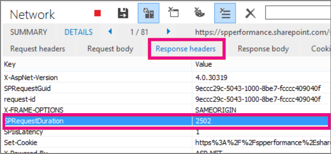

# <a name="navigation-options-for-sharepoint-online"></a>SharePoint Online에 대한 탐색 옵션

이 문서에서는 클래식 게시에서 관리 되는 탐색 또는 검색 기반 탐색을 사용 하 여 SharePoint Online에 대 한 페이지 로드 시간을 개선 하는 방법에 설명 합니다.
  
클래식 게시를 사용할 수 있는 SharePoint Online에 두 탐색 영역이 있습니다. 전역 탐색 및 현재 탐색 합니다.
  
전역 탐색에는 위쪽 탐색 메뉴를 현재 탐색은 측면 또는에서 상황에 맞는 왼쪽/오른쪽 탐색 언어 구성 및 사용 하는 마스터 페이지에 따라 다릅니다.
  
탐색 포털 수준 사용에 대 한 자주 구성 하 고 이와 같이 SharePoint 사이트의 중요 한 요소는 전체 포털에 대 한 성능에 부정적인 영향 수 있습니다.
  
구조적 탐색은 해당 보안 조정 사용 하는 온-프레미스 토폴로지를 디자인 하 고이 디자인 과도 한 서버 통화 하도록 지정 하 고 사용 하는 경우 성능에 영향을 줍니다으로 SharePoint Online에서 권장된 탐색 옵션은 없습니다.
  
간소화 된 플랫된 사이트 계층을 구조가 현대 여기서 도입 현대 SharePoint 사이트의 디자인 변경 되었습니다. 이러한 방식이 탐색 관련 된 성능 문제는 제거 하는 간소화 된 계층 구조를 사용 하 여 탐색을 간소화 합니다.
  
세번째 사용자 지정, 검색 기반 접근 방식, SharePoint에서 두 주의 기본 탐색 옵션 가지가 있습니다. 또는 4 번째 및 아주 유명한 옵션 사용자 지정 탐색 공급자를 구축 하는입니다. 사용자 정의 탐색 공급자에 대 한 지침에 대 한 [SharePoint 온라인 포털에 대 한 탐색 솔루션](https://docs.microsoft.com/en-us/sharepoint/dev/solution-guidance/portal-navigation) 을 검토 하십시오. 
  
각 옵션에는 장단점이 다음 표에 요약 된 대로 합니다.
  
|**구조적 탐색**|**관리 탐색**|**검색 기반 탐색**||**사용자 지정 탐색 공급자**|
|:-----|:-----|:-----|:-----|:-----|
| 장점:  <br/>  쉬운 구성  <br/>  보안 조정  <br/>  사이트를 추가할 때 자동으로 업데이트  <br/> | 장점:  <br/>  쉬운 유지 관리  <br/>  권장 되는 옵션  <br/> | 장점:  <br/>  보안 조정  <br/>  사이트를 추가할 때 자동으로 업데이트  <br/>  빠른 로드 시간 및 로컬로 캐시된 탐색 구조  <br/> || 장점:  <br/>    <br/>  넓은 선택의 / 사용할 수 있는 옵션  <br/>  Fast 캐싱 때 로드 되는 올바르게  <br/> |
| 단점:  <br/> **권장하지 않음** <br/> **성능에 미치는 영향** <br/> | 단점:  <br/>  사이트 구조를 반영하도록 자동으로 업데이트되지 않음  <br/>  보안 조정을 사용 하도록 설정 하는 경우 성능에 미치는  <br/> | 단점:  <br/>  사이트를 쉽게 정렬하는 기능이 없음  <br/>  마스터 페이지의 사용자 지정 필요(기술 필요)  <br/> || 단점:  <br/>  사용자 지정 개발이 필요  <br/>  외부 데이터 원본을 저장 캐시 필요한 / 예: Azure  <br/> |
   
사이트에 대 한 가장 적절 한 옵션에는 사이트 요구 사항 및 기술 사용자 기능에 따라 달라 집니다. 사용자 지정 마스터 페이지를 사용 하 여 만족 하 고 SharePoint Online에 대 한 기본 마스터 페이지에서 발생할 수 있는 변경 내용을 유지 관리 하기 위해 조직에서 일부 기능이 있어야 하는 경우 검색 기반 옵션에서 최상의 사용자 환경을 생성 합니다. 구조적 탐색의 상자와 검색 간에 간단한 중간 밑면을 하려는 경우 관리 되는 탐색 매우 유용한 옵션입니다. 관리 되는 탐색 옵션을 통해 유지할 수 구성, 코드 사용자 지정 파일을 포함 하지 않는 한의 기본 구조적 탐색 보다 훨씬 빠릅니다.
  
현대 형 비슷하게 클래식 포털의 전체 구조를 간소화, 전반적인 성능 및 확장에도 도움이 됩니다. 이 통해 단일 사이트 모음을 대신 하는 것을 의미/극히 일부 하위 사이트 (하위 웹) 포함 하는 여러 사이트 모음을 수천 개의 사이트 (하위 웹) 더 나은 접근 방식입니다.
  
이 서비스의 추가 크기 조정 옵션을 제공, 하나의 큰 데이터베이스로 모든 콘텐츠를 넣는 것을 방지 하 고 궁극적으로 탐색 하 고 더 중요 한 점은 보안에 대 한 큰 유연성을 허용 합니다.
  
## <a name="using-structural-navigation-in-sharepoint-online"></a>SharePoint Online에서 구조적 탐색 사용

이것은 기본적으로 사용의 기본 탐색 하 고는 가장 간단한 솔루션 했으나 이와 같이 비용이 많이 드는 성능이 떨어질 있습니다. 모든 사용자 지정이 필요 하지 않습니다 및 비 기술적인 사용자 수도 쉽게 항목을 추가, 항목을 숨기려면 설정 페이지에서 탐색을 관리 합니다. True 되므로 수 있는으로 관리 되는 탐색을 사용 하는 것이 좋습니다. 관리 되는 탐색에 대 한 쉽게 될 수도 있지만 이것은 관리 하 고도 제어 합니다.
  
### <a name="turning-on-structural-navigation-in-sharepoint-online"></a>SharePoint Online에서 구조적 탐색 설정

구조적 탐색 하 고 표시 된 표준 SharePoint Online 솔루션에서 성능 옵션을 하위 하는 방법을 설명 하기 위해 설정 합니다. 다음은 한 스크린샷 **사이트 설정** 페이지에서 발견 된 설정을 \> **탐색**합니다.
  

  
### <a name="analyzing-structural-navigation-performance-in-sharepoint-online"></a>SharePoint Online의 구조적 탐색 성능 분석

SharePoint 페이지의 성능을 분석하려면 Internet Explorer에서 F12 개발자 도구의 **네트워크** 탭을 사용합니다. 
  

  
**네트워크** 탭에서 로드할 .aspx 페이지와 **세부 정보** 탭을 차례로 클릭합니다. 
  

  
**응답 헤더**를 클릭합니다.
  

  
SharePoint는 유용한 일부 진단 정보를 응답 헤더에 반환합니다. 매우 유용한 정보 중 하나는 서버에서 요청을 처리하는 데 걸린 시간(밀리초) 값을 나타내는 **SPRequestDuration**입니다. 
  
다음 스크린샷에 **표시 하위 사이트를** 구조적 탐색에 대 한 checked 아닙니다. 전역 탐색에서 사이트 모음 링크는 것을 의미 합니다. 
  

  
**SPRequestDuration** 키 245 시간 (밀리초)의 값을 갖습니다. 요청을 반환 하는데 걸린 시간을 나타냅니다. 사이트 탐색 항목을 하나만 이므로 SharePoint Online 수행 되는 방법을 굵은 탐색 하지 않고에 대 한 좋은 벤치 마크입니다. 다음 스크린샷은 추가 (영문)의 하위 사이트에서이 키에 주는 영향을 보여줍니다. 
  

  
하위 사이트를 추가하면 페이지 요청을 반환하는 데 걸리는 시간이 크게 증가했습니다.
  
일반 구조적된 탐색을 사용 하는 이점은 있습니다 수 쉽게 순서를 구성, 사이트를 숨기고, 페이지 추가, 결과 보안 조정이 적용이 고 하지 SharePoint Online에서 사용 되는 지원 되는 마스터 페이지에서 벗어난 하 게 됩니다.
  
## <a name="using-managed-navigation-and-managed-metadata-in-sharepoint-online"></a>SharePoint Online에서 관리 탐색 및 관리되는 메타데이터 사용

관리 탐색은 구조적 탐색과 동일한 정렬 기능을 다시 만드는 데 사용할 수 있는 기본 옵션 중 하나입니다.
  
관리 되는 메타 데이터를 사용할 경우의 장점은 쿼리 하 여 콘텐츠를 사용 하 여 사이트 탐색을 작성 하는 보다 데이터를 검색 하려면 훨씬 더 빠르게 있다는 것입니다. 훨씬 더 빠르게 하는 방법은 없습니다 보안 trim 결과 수도 있지만 하므로 사용자 지정된 된 사이트에 액세스할 수 없는 경우 링크에는 여전히 표시 되지만 오류 메시지가 발생 시킬 됩니다.
  
 **관리 탐색 및 결과의 구현 방법**
  
여러 문서에는 TechNet 관리 되는 탐색의 세부 정보에 대 한 예 [SharePoint Server 2013의 관리 탐색 개요 (영문)를](https://go.microsoft.com/fwlink/?LinkId=708689)참조 하십시오.
  
관리 탐색을 구현하려면 용어 저장소 관리자 권한이 필요합니다. 사이트 모음의 구조와 일치하는 URL이 포함된 용어를 설정하여 구조적 탐색 대신 관리 탐색을 사용할 수 있습니다. 예를 들면 다음과 같습니다.
  

  
아래 예에서는 관리 탐색을 사용한 경우의 복잡한 탐색의 성능을 보여 줍니다.
  

  
관리 탐색을 일관되게 사용하면 쿼리된 콘텐츠 구조적 탐색 접근 방식보다 성능이 향상됩니다.
  
## <a name="using-search-driven-client-side-scripting"></a>검색 기반 클라이언트 쪽 스크립팅 사용

검색을 사용하면 연속 크롤링을 통해 백그라운드에서 작성된 인덱스를 사용할 수 있습니다. 즉, 과도한 콘텐츠 쿼리가 진행되지 않습니다. 검색 결과를 검색 인덱스에서 가져오고 결과의 보안이 조정됩니다. 이 방식은 일반적인 콘텐츠 쿼리를 사용하는 경우보다 더 빠릅니다. 구조적 탐색에 검색을 사용하면(특히 사이트 구조가 복잡한 경우) 페이지 로드 시간이 매우 빨라집니다. 이 방식이 관리 탐색보다 나은 점은 보안 조정의 이점을 얻을 수 있다는 것입니다.
  
이 과정에서 사용자 지정 마스터 페이지가 생성되고 기본 탐색 코드가 사용자 지정 HTML로 바뀝니다. 파일 seattle.html의 탐색 코드를 바꾸려면 아래의 절차를 따릅니다.
  
이 예제에서는 seattle.html 파일을 열 및 전체 요소는 **id = "DeltaTopNavigation"** 사용자 지정 HTML 코드를 사용 합니다. 
  
 **예: 마스터 페이지에서 기본 탐색 코드를 바꾸려면**
  
1. **사이트 설정** 페이지로 이동합니다. 
    
2. **마스터 페이지**를 클릭하여 마스터 페이지 갤러리를 엽니다.
    
3. 여기에서 라이브러리를 탐색하고 **seattle.master** 파일을 다운로드할 수 있습니다.
    
4. 텍스트 편집기를 사용하여 코드를 편집하고 아래의 스크린샷과 같이 코드 블록을 삭제합니다.
    
    
  
5. 사이 코드를 제거는 \<SharePoint:AjaxDelta id = "DeltaTopNavigation"\> 및 \<\SharePoint:AjaxDelta\> 태그를 지정 하 고 다음 코드 조각으로 대체 합니다.
    
  ```
  <div id="loading">
    <!--Replace with path to loading image.-->
    <div style="background-image: url(''); height: 22px; width: 22px; ">
    </div>
  </div>
  <!-- Main Content-->
  <div id="navContainer" style="display:none">
      <div data-bind="foreach: hierarchy" class="noindex ms-core-listMenu-horizontalBox">
          <a class="dynamic menu-item ms-core-listMenu-item ms-displayInline ms-navedit-linkNode" data-bind="attr: { href: item.Url, title: item.Title }">
              <span class="menu-item-text" data-bind="text: item.Title">
              </span>
          </a>
          <ul id="menu" data-bind="foreach: $data.children" style="padding-left:20px">
              <li class="static dynamic-children level1">
                  <a class="static dynamic-children menu-item ms-core-listMenu-item ms-displayInline ms-navedit-linkNode" data-bind="attr: { href: item.Url, title: item.Title }">
                 
                   <!-- ko if: children.length > 0-->
                      <span aria-haspopup="true" class="additional-background ms-navedit-flyoutArrow dynamic-children">
                          <span class="menu-item-text" data-bind="text: item.Title">
                          </span>
                      </span>
                  <!-- /ko -->
                  <!-- ko if: children.length == 0-->   
                      <span aria-haspopup="true" class="ms-navedit-flyoutArrow dynamic-children">
                          <span class="menu-item-text" data-bind="text: item.Title">
                          </span>
                      </span>
                  <!-- /ko -->   
                  </a>
                 
                  <!-- ko if: children.length > 0-->                                                       
                  <ul id="menu"  data-bind="foreach: children;" class="dynamic  level2" >
                      <li class="dynamic level2">
                          <a class="dynamic menu-item ms-core-listMenu-item ms-displayInline  ms-navedit-linkNode" data-bind="attr: { href: item.Url, title: item.Title }">
           
            <!-- ko if: children.length > 0-->
            <span aria-haspopup="true" class="additional-background ms-navedit-flyoutArrow dynamic-children">
             <span class="menu-item-text" data-bind="text: item.Title">
             </span>
            </span>
             <!-- /ko -->
            <!-- ko if: children.length == 0-->
            <span aria-haspopup="true" class="ms-navedit-flyoutArrow dynamic-children">
             <span class="menu-item-text" data-bind="text: item.Title">
             </span>
            </span>                 
            <!-- /ko -->   
                          </a>
            <!-- ko if: children.length > 0-->
           <ul id="menu" data-bind="foreach: children;" class="dynamic level3" >
            <li class="dynamic level3">
             <a class="dynamic menu-item ms-core-listMenu-item ms-displayInline ms-navedit-linkNode" data-bind="attr: { href: item.Url, title: item.Title }">
              <span class="menu-item-text" data-bind="text: item.Title">
              </span>
             </a>
            </li>
           </ul>
             <!-- /ko -->
                      </li>
                  </ul>
                  <!-- /ko -->
              </li>
          </ul>
      </div>
  </div>
  ```

6. 대체 URL을 로드 하는 사이트 모음에 로드 이미지에 대 한 링크와 시작 부분에 앵커 태그 이미지입니다. 변경 된 내용을 변경한 파일 이름을 바꾼 다음 마스터 페이지 갤러리에 업로드 합니다. 새.master 파일을 생성 합니다.
    
7. 이 HTML은 JavaScript 코드에서 반환 하는 검색 결과에서 채울 하는 기본 태그입니다. 에 대 한 값을 변경 하려면 다음 코드를 편집 해야하는 `var root = "site collection URL"` 다음 코드 조각에서 볼 수 있듯이: 
    
  ```
  var root = "https://spperformance.sharepoint.com/sites/NavigationBySearch";
  ```

    전체 JavaScript 파일은 다음과 같습니다.
    
  ```
  //Models and Namespaces
  var SPOCustom = SPOCustom || {};
  SPOCustom.Models = SPOCustom.Models || {}
  SPOCustom.Models.NavigationNode = function () {
      this.Url = ko.observable("");
      this.Title = ko.observable("");
      this.Parent = ko.observable("");
  };
  var root = "https://spperformance.sharepoint.com/sites/NavigationBySearch";
  var baseUrl = root + "/_api/search/query?querytext=";
  var query = baseUrl + "'contentClass=\"STS_Web\"+path:" + root + "'&amp;trimduplicates=false&amp;rowlimit=300";
  var baseRequest = {
      url: "",
      type: ""
  };
  //Parses a local object from JSON search result.
  function getNavigationFromDto(dto) {
      var item = new SPOCustom.Models.NavigationNode();
      if (dto != undefined) {
          var webTemplate = getSearchResultsValue(dto.Cells.results, 'WebTemplate');
          if (webTemplate != "APP") {
              item.Title(getSearchResultsValue(dto.Cells.results, 'Title')); //Key = Title
              item.Url(getSearchResultsValue(dto.Cells.results, 'Path')); //Key = Path
              item.Parent(getSearchResultsValue(dto.Cells.results, 'ParentLink')); //Key = ParentLink
          }
      }
      return item;
  }
  function getSearchResultsValue(results, key) {
      for (i = 0; i < results.length; i++) {
          if (results[i].Key == key) {
              return results[i].Value;
          }
      }
      return null;
  }
  //Parse a local object from the serialized cache.
  function getNavigationFromCache(dto) {
      var item = new SPOCustom.Models.NavigationNode();
      if (dto != undefined) {
          item.Title(dto.Title);
          item.Url(dto.Url);
          item.Parent(dto.Parent);
      }
      return item;
  }
  /* create a new OData request for JSON response */
  function getRequest(endpoint) {
      var request = baseRequest;
      request.type = "GET";
      request.url = endpoint;
      request.headers = { ACCEPT: "application/json;odata=verbose" };
      return request;
  };
  /* Navigation Module*/
  function NavigationViewModel() {
      "use strict";
      var self = this;
      self.nodes = ko.observableArray([]);
      self.hierarchy = ko.observableArray([]);;
      self.loadNavigatioNodes = function () {
          //Check local storage for cached navigation datasource.
          var fromStorage = localStorage["nodesCache"];
          if (false) {
              var cachedNodes = JSON.parse(localStorage["nodesCache"]);
              if (cachedNodes &amp;&amp; timeStamp) {
                  //Check for cache expiration. Currently set to 3 hrs.
                  var now = new Date();
                  var diff = now.getTime() - timeStamp;
                  if (Math.round(diff / (1000 * 60 * 60)) < 3) {
                      //return from cache.
                      var cacheResults = [];
                      $.each(cachedNodes, function (i, item) {
                          var nodeitem = getNavigationFromCache(item, true);
                          cacheResults.push(nodeitem);
                      });
                      self.buildHierarchy(cacheResults);
                      self.toggleView();
                      addEventsToElements();
                      return;
                  }
              }
          }
          //No cache hit, REST call required.
          self.queryRemoteInterface();
      };
      //Executes a REST call and builds the navigation hierarchy.
      self.queryRemoteInterface = function () {
          var oDataRequest = getRequest(query);
          $.ajax(oDataRequest).done(function (data) {
              var results = [];
              $.each(data.d.query.PrimaryQueryResult.RelevantResults.Table.Rows.results, function (i, item) {
                  if (i == 0) {
                      //Add root element.
                      var rootItem = new SPOCustom.Models.NavigationNode();
                      rootItem.Title("Root");
                      rootItem.Url(root);
                      rootItem.Parent(null);
                      results.push(rootItem);
                  }
                  var navItem = getNavigationFromDto(item);
                  results.push(navItem);
              });
              //Add to local cache
              localStorage["nodesCache"] = ko.toJSON(results);
              localStorage["nodesCachedAt"] = new Date().getTime();
              self.nodes(results);
              if (self.nodes().length > 0) {
                  var unsortedArray = self.nodes();
                  var sortedArray = unsortedArray.sort(self.sortObjectsInArray);
                  self.buildHierarchy(sortedArray);
                  self.toggleView();
                  addEventsToElements();
              }
          }).fail(function () {
              //Handle error here!!
              $("#loading").hide();
              $("#error").show();
          });
      };
      self.toggleView = function () {
          var navContainer = document.getElementById("navContainer");
          ko.applyBindings(self, navContainer);
          $("#loading").hide();
          $("#navContainer").show();
      };
      //Uses linq.js to build the navigation tree.
      self.buildHierarchy = function (enumerable) {
          self.hierarchy(Enumerable.From(enumerable).ByHierarchy(function (d) {
              return d.Parent() == null;
          }, function (parent, child) {
              if (parent.Url() == null || child.Parent() == null)
                  return false;
              return parent.Url().toUpperCase() == child.Parent().toUpperCase();
          }).ToArray());
          self.sortChildren(self.hierarchy()[0]);
      };
      self.sortChildren = function (parent) {
          // sjip processing if no children
          if (!parent || !parent.children || parent.children.length === 0) {
              return;
          }
          parent.children = parent.children.sort(self.sortObjectsInArray2);
          for (var i = 0; i < parent.children.length; i++) {
              var elem = parent.children[i];
              if (elem.children &amp;&amp; elem.children.length > 0) {
                  self.sortChildren(elem);
              }
          }
      };
      // ByHierarchy method breaks the sorting in chrome and firefix 
      // we need to resort  as ascending
      self.sortObjectsInArray2 = function (a, b) {
          if (a.item.Title() > b.item.Title())
              return 1;
          if (a.item.Title() < b.item.Title())
              return -1;
          return 0;
      };
      self.sortObjectsInArray = function (a, b) {
          if (a.Title() > b.Title())
              return -1;
          if (a.Title() < b.Title())
              return 1;
          return 0;
      }
  }
  //Loads the navigation on load and binds the event handlers for mouse interaction.
  function InitCustomNav() {
      var viewModel = new NavigationViewModel();
      viewModel.loadNavigatioNodes();
  }
  function addEventsToElements() {
      //events.
  
  ```

     $("li.level1").mouseover (함수 () { 
  
var 위치 = $(this).position();
  
(이) $.find("ul.level2").css ({너비: 100, 왼쪽: position.left + 10 가지 주요: 50});
    
     }) 
  
.mouseout (함수 () {
  
(이) $.find("ul.level2").css ({왼쪽:-99999, 위쪽: 0을 (를));
  
});
  
$("li.level2").mouseover (함수 () {
  
var 위치 = $(this).position();
  
console.log(JSON.stringify(position));
  
(이) $.find("ul.level3").css ({너비: 100, 왼쪽: position.left + 95, 위쪽: position.top});
    
     }) 
  
.mouseout (함수 () {
  
(이) $.find("ul.level3").css ({왼쪽:-99999, 위쪽: 0을 (를));
  
});
    
    } _spBodyOnLoadFunctionNames.push("InitCustomNav");
    
    To summarize the code shown above in the jQuery **[$(document).ready]** function there is a **[viewModel]** object created and then the **[loadNavigationNodes()]** function on that object is called. This function either loads the previously built navigation hierarchy stored in the HTML5 local storage of the client browser or it calls the function **[queryRemoteInterface()]**. 
    
    **[QueryRemoteInterface()]** builds a request using the **[getRequest()]** function with the query parameter defined earlier in the script and then returns data from the server. This data is essentially an array of all the sites in the site collection represented as data transfer objects with various properties. This data is then parsed into the previously defined **[SPO.Models.NavigationNode]** objects which use Knockout.js to create observable properties for use by data binding the values into the HTML that we defined earlier. The objects are then put into a results array. This array is parsed into JSON using Knockout and stored in the local browser storage for improved performance on future page loads. 
    
8. 다음으로, 결과 **[self.nodes]** 배열에 할당 된 및 계층 구조를 배열 **[self.heirarchy]** 에 출력을 할당 하는 linq.js를 사용 하 여 개체에서 기반으로 구축 됩니다. 이 배열에는 HTML에 바인딩된 개체입니다. 이 작업은 **[toggleView()]** 함수에서 **[ko.applyBinding()]** 함수에는 자체 개체를 전달 하 여 수행 됩니다. 그런 다음이 위치를 선택 하면 계층 구조 배열의 다음 HTML에 바인딩할 수 있습니다: 
    
  ```
  <div data-bind="foreach: hierarchy" class="noindex ms-core-listMenu-horizontalBox">
  ```

    마지막으로, **[mouseenter]** 및 **[mouseexit]** 에 대 한 이벤트 처리기 **[addEventsToElements()]** 함수에서 작업을 수행 하는 하위 사이트 드롭다운 메뉴를 처리 하는 최상위 탐색에 추가 됩니다. 
    
    아래 화면에는 탐색의 결과 볼 수 있습니다.
    
    
  
    복잡한 탐색의 로컬 캐싱이 없는 새로운 페이지 로드의 예는 서버에서 소요된 시간이 벤치마크 구조적 탐색보다 감소하여 관리 탐색 방법과 비슷한 결과를 보였습니다.
    
    
  
    이 방법의 주요 이점 중 하나는 사용자가 다음에 페이지를 로드할 때를 대비해 HTML5 로컬 저장소를 사용하여 탐색이 로컬로 저장된다는 것입니다.
    
구조적 탐색에 검색 API를 사용하여 주요 성능을 향상시킬 수 있지만 이 기능을 실행하고 사용자 지정하기 위한 기술이 어느 정도 필요합니다. 이 예제 구현에서는 사이트가 기본 구조적 탐색과 동일하게 사전 순서에 따라 정렬됩니다. 이 순서로 수행하지 않으려는 경우 개발과 유지 관리가 더 복잡해집니다. 또한 이 방법을 사용하려면 지원되는 마스터 페이지를 수정해야 합니다. 사용자 지정 마스터 페이지를 유지 관리하지 않으면 Microsoft가 마스터 페이지에 제공하는 업데이트 및 향상된 기능을 사이트에서 사용할 수 없습니다.
  
위의 코드는 다음과 같은 종속성에 있습니다.
  
- jQuery-[http://jquery.com/](http://jquery.com/)
    
- KnockoutJS-[http://knockoutjs.com/](http://knockoutjs.com/)
    
- Linq.js- [http://linqjs.codeplex.com/](http://linqjs.codeplex.com/), 또는 [github.com/neuecc/linq.js](https://github.com/neuecc/linq.js/)
    
LinqJS의 현재 버전 위의 코드에 사용 되는 ByHierarchy 메서드를 포함 하지 않는 및 탐색 코드의 연결이 끊어집니다. 이 문제를 해결 하려면 다음 메서드를 줄 앞 Linq.js 파일에 추가 "결합: () 함수" 합니다.
  
```
ByHierarchy: function(firstLevel, connectBy, orderBy, ascending, parent) {
     ascending = ascending == undefined ? true : ascending;
     var orderMethod = ascending == true ? 'OrderBy' : 'OrderByDescending';
     var source = this;
     firstLevel = Utils.CreateLambda(firstLevel);
     connectBy = Utils.CreateLambda(connectBy);
     orderBy = Utils.CreateLambda(orderBy);
    
     //Initiate or increase level
     var level = parent === undefined ? 1 : parent.level + 1;
    return new Enumerable(function() {
         var enumerator;
         var index = 0;
        var createLevel = function() {
                 var obj = {
                     item: enumerator.Current(),
                     level : level
                 };
                 obj.children = Enumerable.From(source).ByHierarchy(firstLevel, connectBy, orderBy, ascending, obj);
                 if (orderBy !== undefined) {
                     obj.children = obj.children[orderMethod](function(d) {
                         return orderBy(d.item); //unwrap the actual item for sort to work
                     });
                 }
                 obj.children = obj.children.ToArray();
                 Enumerable.From(obj.children).ForEach(function(child) {
                     child.getParent = function() {
                         return obj;
                     };
                 });
                 return obj;
             };
        return new IEnumerator(
        function() {
             enumerator = source.GetEnumerator();
         }, function() {
             while (enumerator.MoveNext()) {
                 var returnArr;
                 if (!parent) {
                     if (firstLevel(enumerator.Current(), index++)) {
                         return this.Yield(createLevel());
                     }
                } else {
                     if (connectBy(parent.item, enumerator.Current(), index++)) {
                         return this.Yield(createLevel());
                     }
                 }
             }
             return false;
         }, function() {
             Utils.Dispose(enumerator);
         })
     });
 },

```


