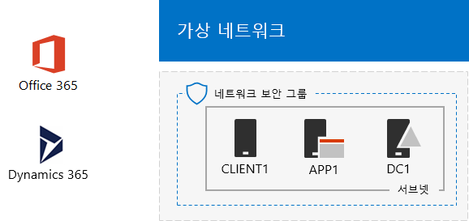

# Office 365 및 Dynamics 365 개발/테스트 환경

 **요약:** 이 테스트 랩 가이드를 사용 하 여 Office 365 개발/테스트 환경에 Dynamics 365 추가 합니다.
  
이 문서의 지침을 사용 하면 추가 Dynamics 365 평가판 구독 Office 365 개발/테스트 환경와 같은 조직에는 Office 365 및 Dynamics 365 개발/테스트 환경 만들기 (영문).

  
  
Dynamics 365 기능 및 특징을 설명 하기 위해 Dynamics 365 평가판 구독을 사용할 수 있습니다. 다음과 같은 솔루션을 Dynamics 365 계획 1, Enterprise Edition 평가판 포함 됩니다.
  
- [Microsoft Dynamics 365 Sales에 대 한](https://www.microsoft.com/dynamics365/sales)합니다. 자동화 및 판매원 집중할 수 및 현명 작동을 내리도록 지원 되는 디지털 인텔리전스 영업을 늘립니다.
    
- [Microsoft Dynamics 365 고객 서비스에 대 한](https://www.microsoft.com/dynamics365/customer-service)합니다. 전체 정보 및 디지털 인텔리전스 원활 하 게 서비스를 제공 하는데 필요한 사용자 에이전트에 게 제공 하 여 충성도 획득 합니다.
    
- [Microsoft Dynamics 365 필드 서비스에 대 한](https://www.microsoft.com/dynamics365/field-service)합니다. 하면 일정을 최적화 하 고, 직원, 착용 하기, 수익을 높일 수 예측 도구를 사용 하 여 마스터 서비스를 호출 합니다.
    
- [Microsoft Dynamics 365 프로젝트 서비스 자동화에 대 한](https://www.microsoft.com/en-us/dynamics365/project-service-automation)합니다. 프로젝트를 성공적으로 완료 하 고 생산성을 직원 및 지능형 도구와 많은 이익을 관계를 만듭니다.
    
Dynamics 365 평가판 구독에 대 한 위의 중 하나 이상을 탐색할 수 있습니다.
  

  
> [!TIP]
> [여기](http://aka.ms/catlgstack)를 클릭하여 One Microsoft 클라우드 테스트 랩 가이드 스택의 모든 문서에 대한 가상 맵을 확인할 수 있습니다.
  
## 1단계: 경량 또는 시뮬레이트된 엔터프라이즈 Office 365 개발/테스트 환경을 구축합니다.

최소 요구 사항을 경량 방식으로 Office 365 및 Dynamics 365 테스트 하려면 2와 [Office 365 개발/테스트 환경](office-365-dev-test-environment.md)의 3 단계에서 지침을 따릅니다.
  
Office 365 및 Dynamics 365 시뮬레이션 된 enterprise에 대 한 테스트 하려는 경우 [Office 365 개발/테스트 환경에 대 한 디렉터리 동기화](dirsync-for-your-office-365-dev-test-environment.md)의 지시를 따릅니다.

  
> [!NOTE]
> 이 문서의 구성 인터넷에 연결 하는 시뮬레이션 된 인트라넷을 포함 하는 시뮬레이션 된 엔터프라이즈 개발/테스트 환경에 원하지 않는 및 Windows Server AD 포리스트에 대 한 디렉터리 동기화 합니다. 제공은 일반적인 조직을 대표 하는 환경에서 Office 365와 Dynamics 365 테스트할 수 있도록 하는 옵션으로 여기 합니다. 
  
## 2 단계: Dynamics 365 평가판 구독 추가

이 단계에서 Dynamics 365 평가판 구독에 대 한 등록 하 여 Office 365 평가판 구독와 같은 조직에 추가 합니다.
  
### Dynamics 365 평가판 구독에 등록

1. 브라우저를 사용 하는 중 하나에서 데스크톱 컴퓨터 (lightweight) 나 CLIENT1 (enterprise 시뮬레이션)에서 Office 365 포털에 로그인 [https://portal.office.com](https://portal.office.com) 전역 관리자 계정의 자격 증명을 사용 합니다.
    
2. **관리** 타일을 클릭합니다.
    
3. 왼쪽 탐색 영역에서 **Office 관리 센터** 탭을 클릭 **대금 청구 > 구매 서비스**합니다.
    
4. **서비스 구매** 페이지 **Dynamics 365 계획 1 Enterprise Edition** 항목을 찾습니다. 마우스 포인터를 올려 하 고 **무료 평가판을 시작**을 클릭 합니다.
    
5. **주문 확인** 페이지에서 **지금 평가판 사용**을 클릭합니다.
    
6. **주문 접수** 페이지에서 **계속**을 클릭합니다.

    
> [!NOTE]
> Dynamics 365 계획 1 Enterprise Edition 평가판 구독은 30 일입니다. 다른 30 일에 대 한 내역 구독을 쉽게 확장할 수 있습니다. 영구 개발/테스트 환경에 대 한 만들기 새 적은 수의 라이선스를 사용 하 여 구독을 지불 합니다. 
  
## 3 단계: Dynamics 365 라이선스 및 시스템 관리자를 할당 합니다.

이 단계에서 전역 관리자, 사용자 2 및 3 사용자 계정에 Dynamics 365 라이선스를 할당 하 고 시스템 관리자가 하 게 합니다.
  
Dynamics 365 라이선스를 할당 하려면 다음이 단계를 사용 합니다.
  
1. **Office 관리 센터** 탭을 클릭 **사용자 > 활성 사용자**합니다.
    
2. 활성 사용자 목록에서 전역 관리자 계정을 클릭 하 고 **제품 라이선스**에 대 한 **편집** 을 클릭 합니다.
    
3. **제품 라이선스** 창에서 **전환** **Dynamics 365 계획 1 Enterprise Edition** 대 한 제품 라이선스 설정, **저장** 을 클릭 하 고 두번 **닫기** 를 클릭 합니다.
    
4. 사용자 2 및 3 사용자 계정에 대해 2-3 단계를 수행 합니다.
    
5. **Office 관리 센터** 탭을 닫습니다.
    
Dynamics 365 시스템 관리자는 사용자 2 및 3 사용자 계정을 구성 하려면 다음이 단계를 사용 합니다.
  
1. **Microsoft Office 홈** 탭에서 **관리**를 클릭 합니다.
    
2. **Office 관리 센터** 탭의 왼쪽된 탐색 영역에서 **관리 센터**를 클릭 하 고 **Dynamics 365**를 클릭 합니다.
    
    Dynamics 365 Dynamics 365 메뉴에 표시 되기 전에 프로 비전을 완료할 때까지 대기 해야할 수 있습니다.
    
3. Dynamics 365 탭에서 **대부분의**를 클릭 하 고 다음을 클릭 **설치를 완료 합니다.**
    
    설치가 완료 될 때까지 기다립니다.
    
    설치가 완료 되 면 내역 구독의 일부인 샘플 데이터를 기반으로 영업 활동 대시보드를 표시 합니다. **평가판 시작** 보려면 잠시 비디오를 수행 합니다. 완료 되 면 비디오 창을 닫습니다.
    
4. 위쪽 도구 모음에서 **Sales**옆에 있는 아래쪽 화살표를 클릭 하 고 **설정**, **보안**을 클릭 한 다음 합니다.
    
5. **보안** 페이지에서 **사용자**를 클릭 합니다.
    
6. 사용자의 목록에서 **사용자 2**를 클릭 합니다.
    
7. 도구 모음에서 **관리 역할**을 클릭 합니다.
    
8. **역할 관리** **시스템 관리자**클릭 한 다음 **확인**을 클릭 합니다.
    
9. 맨 위쪽에 있는 도구 모음에서 **보안**을 클릭 합니다.
    
10. 3 사용자 계정에 대해 5-8 단계를 반복 합니다.
    
11. 닫기는 **사용자: User3** 탭 합니다.
    
> [!NOTE]
> Office 365 전역 관리자 계정 Dynamics 365 시스템 관리자 역할을 자동으로 할당 되었습니다. 
  
Office 365 및 Dynamics 365 개발/테스트 환경을 현재가지고 있습니다.
  
- Office 365 e 5 엔터프라이즈 및 Dynamics 365 평가판 구독 사용자 계정의 대화 목록와 같은 조직 및 동일한 Azure AD 테 넌 트를 공유 합니다.
    
- 사용자 글로벌 엔터프라이즈 관리자, 사용자 2 및 3 사용자 계정을 Office 365 e 5 엔터프라이즈 사용자와 Dynamics 365 모두 사용 하도록 설정 된 및 Dynamics 365 시스템 관리자가 있습니다.
    
## 다음 단계

Office 365 및 Dynamics 365 작동 하는 방법을 [Office 365 및 Dynamics 365 개발/테스트 환경에 대 한 Exchange Online 통합](exchange-online-integration-for-your-office-365-and-dynamics-365-dev-test-enviro.md)된 Exchange Online 사서함을 설명 하 고 구성 합니다.
  
## 참고 항목

[클라우드 도입 TLG(테스트 랩 가이드)](cloud-adoption-test-lab-guides-tlgs.md)
  
[기본 구성 개발/테스트 환경](base-configuration-dev-test-environment.md)
  
[Office 365 개발/테스트 환경](office-365-dev-test-environment.md)
  
[Office 365 개발/테스트 환경용 DirSync](dirsync-for-your-office-365-dev-test-environment.md)

[Dynamics 365용 구독 관리(온라인)](https://technet.microsoft.com/library/jj679903.aspx)
  
[Dynamics 365 관리](https://technet.microsoft.com/library/dn531101.aspx)

