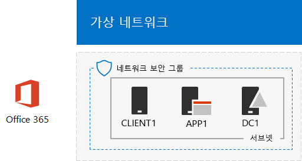

# <a name="office-365-devtest-environment"></a>Office 365 개발/테스트 환경

 **요약:** 이 테스트 랩 가이드를 사용 하 여 평가 또는 개발/테스트는 Office 365 평가판 구독을 만듭니다.
  
Office 365 평가판 구독을 사용할 수 있으며 응용 프로그램 또는 Office 365의 기능 및 특징을 설명 하기 위해 Office 365 개발/테스트 환경을 만들 수 있습니다. 두 버전 가지가 있습니다.
  
- Office 365 개발/테스트 환경 lightweight 주 컴퓨터에서 액세스 하는 Office 365 평가판 구독으로 이루어져 있습니다.
    
    이 환경을 사용 하 여 신속 하 게 하는 기능을 시연 하려는 경우. 간편한 Office 365 개발/테스트 환경에 대 한 2 및 3이 문서의 단계를 완료 합니다.
    
- Office 365 평가판 구독 및 Microsoft Azure 인프라 서비스에서 호스팅되는 인터넷에 연결 하는 간소화 된 조직 인트라넷의 시뮬레이션 된 엔터프라이즈 Office 365 개발/테스트 환경 구성 됩니다. Microsoft 클라우드에서 완전히이 구성을 만들 수 있습니다.
    
    기능 또는 유사한 일반적인 조직 네트워크에서 인터넷 또는이 유형의 환경을 필요로 하는 기능에 대 한 연결 하는 환경에서 앱을 설명 하기 위해이 환경을 사용 합니다. 시뮬레이션 된 엔터프라이즈 Office 365 개발/테스트 환경에 대 한 1, 2 및 3이 문서의 단계를 완료 합니다.
    
> [!NOTE]
> Office 365 평가판 구독 30 일 동안의이 환경에 대 한 해야 하는 특정 값을 기록 하려면이 문서를 인쇄 하려면 될 수 있습니다. 다른 30 일에 대 한 내역 구독을 쉽게 확장할 수 있습니다. 영구 개발/테스트 환경에 대 한 만들기 새 적은 수의 라이선스를 사용 하 여 구독을 지불 합니다. 
  

  
> [!TIP]
> 클릭 [여기](http://aka.ms/catlgstack) 에 한 맵이 하나의 Microsoft 클라우드 테스트 랩 가이드 스택의 모든 문서를 시각적으로 표시 합니다.
  
## <a name="phase-1-create-the-base-configuration-in-azure"></a>1 단계: Azure의 기본 구성 만들기

[기본 구성 개발/테스트 환경](base-configuration-dev-test-environment.md)에 대 한 지침을 따릅니다.
  
Azure에 구독을 해야 합니다. 이 구성에 대 한 [Azure 무료 평가판](https://azure.microsoft.com/pricing/free-trial/) 을 사용할 수 있습니다. MSDN 또는 Visual Studio 구독이 있는 경우 [Visual Studio 구독자에 대 한 월별 Azure 신용](https://azure.microsoft.com/pricing/member-offers/msdn-benefits-details/)를 참조 하십시오.
  
결과 구성은 다음과 같습니다.
  

  
이 구성은 Azure 가상 네트워크의 서브넷에서 d c 1, a p p 1을 및 CLIENT1 가상 컴퓨터의 구성 됩니다.
  
## <a name="phase-2-create-an-office-365-trial-subscription"></a>2 단계: Office 365 평가판 구독 만들기

Office 365 E5 평가판 구독을 시작 하려면 먼저 가상의 회사 이름 및 새 Microsoft 계정을 필요 합니다.
  
1. 하는 Microsoft 샘플 콘텐츠에서 사용 되는 가상의 회사, 회사 이름에 대 한 회사 이름 Contoso의 variant를 사용 하지만 필요 하지 않습니다 하는 것이 좋습니다. 여기에 가상의 회사 이름을 기록: ___
    
2. 새 Microsoft 계정을 등록 하려면 [https://outlook.com](https://outlook.com) 로 이동 하 고 새 전자 메일 계정 및 주소와 계정을 만듭니다. 이 계정을 사용 하 여 Office 365에 등록 됩니다.
    
  - 여기에 새 계정의 성과 이름을 기록: ___
    
  - 여기서 새 전자 메일 계정 주소를 기록: ___@outlook.com
    
### <a name="sign-up-for-an-office-365-e5-trial-subscription"></a>Office 365 E5 평가판 구독에 등록

1. 간편한 Office 365 개발/테스트 환경에 대 한 사용자의 컴퓨터에서 인터넷 브라우저를 열고 및 [https://aka.ms/e5trial](https://aka.ms/e5trial)로 이동 합니다. 
    
    시뮬레이션 된 엔터프라이즈 Office 365 개발/테스트 환경용:
    
  - [Azure 포털](https://portal.azure.com)연결 하는 회사와 CLIENT1\\User1 계정을 합니다.
    
  - 관리자 수준 Windows PowerShell 명령 프롬프트를 열고 하 고 이러한 명령을 실행 합니다.
    
  ```
  Set-ItemProperty -Path "HKLM:\\SOFTWARE\\Microsoft\\Active Setup\\Installed Components\\{A509B1A7-37EF-4b3f-8CFC-4F3A74704073}" -Name "IsInstalled" -Value 0
Set-ItemProperty -Path "HKLM:\\SOFTWARE\\Microsoft\\Active Setup\\Installed Components\\{A509B1A8-37EF-4b3f-8CFC-4F3A74704073}" -Name "IsInstalled" -Value 0
Stop-Process -Name Explorer -Force
  ```

    > [!TIP]
    > 클릭 [여기](https://gallery.technet.microsoft.com/PowerShell-commands-for-fe3d7a34) 이 문서의 모든 PowerShell 명령을 포함 된 텍스트 파일을 가져오도록 합니다.
  
  - 시작 화면에서 **Internet Explorer** 를 클릭 하 고 [https://aka.ms/e5trial](https://aka.ms/e5trial)로 이동 합니다.
    
2. **알고 있습니다 하기 시작** 페이지에서 다음을 지정 합니다.
    
  - 실제 위치
    
  - 새 Microsoft 계정의 성과 이름
    
  - 새 전자 메일 계정 주소
    
  - 회사 전화 번호
    
  - 가상의 회사 이름
    
  - 250-999 사용자의 조직 크기는
    
3. **방금 하나 더 큰 단계**를 클릭 합니다.
    
4. **사용자 ID 만들기** 페이지에서 새 전자 메일 주소 후 가상의 회사를 기반으로 사용자 이름을 입력은 @ 기호 (이름 간격을 모두 제거), 다음 암호 (두번클릭)이 새로운 Office 365에 대 한 계정입니다.
    
    안전한 위치에 입력 한 암호를 기록 합니다.
    
    여기에서 **조직 이름**, 라고 하 여 가상의 회사 이름을 기록: ___
    
5. **내 계정 만들기**를 클릭 합니다.
    
6. **에서 다음을 확인 합니다. 것입니다. 하지 않습니다. A. 로봇.** 페이지, 텍스트 지원 전화기의 전화번호를 입력 하 고 **텍스트 하기**를 클릭 합니다.
    
7. 수신 된 텍스트 메시지에서 확인 코드를 입력 하 고 ****을 클릭 합니다.
    
8. URL을 기록 로그인 페이지 여기 (선택한 복사본): ___
    
9. ID를 기록 사용자 여기 (선택한 복사본): ___.onmicrosoft.com
    
    이 값은 **Office 365 전역 관리자의 이름**으로 참조할 수 됩니다.
    
10. **이동 준비가 되었습니다.**표시 되 면이 클릭 합니다.
    
11. 다음 페이지에서 Office 365를 설정을 완료 하 고 모든 타일을 사용할 수 있을 때까지 기다립니다.
    
Office Online 서비스 및 Office 365 관리 센터를 액세스할 수 있는 주요 Office 365 포털 페이지를 표시 합니다.
  
시뮬레이션 된 엔터프라이즈 Office 365 개발/테스트 환경에 대 한 결과 구성을 다음과 같습니다.
  

  
이 구성은 다음으로 이루어집니다. 
  
- D c 1, a p p 1을 및 CLIENT1 가상 컴퓨터는 Azure 가상 네트워크의 서브넷에 있습니다.
    
- Office 365 e 5 평가판 구독 합니다.
    
## <a name="phase-3-configure-your-office-365-trial-subscription"></a>3 단계: Office 365 평가판 구독 구성

이 단계에서 추가 사용자 및 SharePoint Online 팀 사이트와 함께 Office 365 구독을 구성합니다.
  
첫째, 4 개의 새로운 사용자 추가 및 e 5 라이선스를 할당 합니다.
  
[Office 365 PowerShell 연결](https://technet.microsoft.com/library/dn975125.aspx) 에 지침을 사용 하 여 PowerShell 모듈을 설치 하 고에서 새로운 Office 365 구독에 연결 합니다.
  
- 사용하는 컴퓨터(경량 Office 365 개발/테스트 환경)
    
- (시뮬레이션 된 엔터프라이즈 Office 365 개발/테스트 환경)에 대 한 CLIENT1 가상 컴퓨터로 합니다.
    
 Windows PowerShell 자격 증명 요청 대화 상자에서 Office 365 전역 관리자 이름을 입력 합니다 (예: jdoe@contosotoycompany.onmicrosoft.com) 및 암호입니다.
  
조직 이름(예: contosotoycompany), 위치에 대한 2자리 국가 코드를 입력한 후 Windows PowerShell 프롬프트에 대한 Microsoft Azure Active Directory 모듈에서 다음 명령을 실행합니다.
  
```
$orgName="<organization name>"
$loc="<two-character country code, such as US>"
$licAssignment= $orgName + ":ENTERPRISEPREMIUM"
$userName= "user2@" + $orgName + ".onmicrosoft.com"
New-MsolUser -DisplayName "User 2" -FirstName User -LastName 2 -UserPrincipalName $userName -UsageLocation $loc -LicenseAssignment $licAssignment
```

**New-msoluser** 명령의 디스플레이에서 사용자 2 계정에 대해 생성 된 암호를 확인 하 고 안전한 위치에 기록 합니다.
  
Windows PowerShell 프롬프트에 대한 Microsoft Azure Active Directory 모듈에서 다음 명령을 실행합니다.
  
```
$userName= "user3@" + $orgName + ".onmicrosoft.com"
New-MsolUser -DisplayName "User 3" -FirstName User -LastName 3 -UserPrincipalName $userName -UsageLocation $loc -LicenseAssignment $licAssignment
```

**New-msoluser** 명령의 디스플레이에서 사용자 3 계정에 대해 생성 된 암호를 확인 하 고 안전한 위치에 기록 합니다.
  
Windows PowerShell 프롬프트에 대한 Microsoft Azure Active Directory 모듈에서 다음 명령을 실행합니다.
  
```
$userName= "user4@" + $orgName + ".onmicrosoft.com"
New-MsolUser -DisplayName "User 4" -FirstName User -LastName 4 -UserPrincipalName $userName -UsageLocation $loc -LicenseAssignment $licAssignment
```

**New-msoluser** 명령의 디스플레이에서 사용자 4 계정에 대해 생성 된 암호를 확인 하 고 안전한 위치에 기록 합니다.
  
Windows PowerShell 프롬프트에 대한 Microsoft Azure Active Directory 모듈에서 다음 명령을 실행합니다.
  
```
$userName= "user5@" + $orgName + ".onmicrosoft.com"
New-MsolUser -DisplayName "User 5" -FirstName User -LastName 5 -UserPrincipalName $userName -UsageLocation $loc -LicenseAssignment $licAssignment
```

**New-msoluser** 명령의 디스플레이에서 사용자 5 계정에 대해 생성 된 암호를 확인 하 고 안전한 위치에 기록 합니다.
  
다음으로 판매를 프로덕션에 대 한 3 개의 새 SharePoint Online 팀 사이트 만들기 및 부서를 지원 합니다.
  
### <a name="create-three-new-sharepoint-online-team-sites"></a>3 개의 새 SharePoint Online 팀 사이트 만들기

1. [SharePoint Online 관리 셸](https://go.microsoft.com/fwlink/p/?LinkId=255251) 설치 (은 x64 버전).
    
2. **시작**을 클릭 하 고 **sharepoint**입력 **SharePoint Online 관리 셸**을 차례로 클릭 합니다.
    
3. 조직 이름을 입력 (예: contosotoycompany), 다음 SharePoint Online 서비스에 연결 하는 SharePoint Online 관리 셸 프롬프트에서 다음 명령을 실행 하 고
```
$orgName="<organization name>"
$spURL="https://" + $orgName + "-admin.sharepoint.com"
Connect-SPOService -Url $spURL
```

4. **Microsoft SharePoint Online 관리 셸** 대화 상자에서 Office 365 전역 관리자 이름을 입력 합니다 (예: jdoe@contosotoycompany.onmicrosoft.com) 및 암호를 한 다음 **로그인**을 클릭 합니다.
    
5. 세 새 팀 사이트를 만드는 (판매, 프로덕션 및 지원)는 Office 365 전역 관리자 이름을 입력 하 고 SharePoint Online 관리 셸 프롬프트에서 다음 명령을 실행 하는 다음:
    
  ```
  $owner = "<global administrator account name>"
$siteURL = "https://" + $orgName + ".sharepoint.com/sites/sales"
New-SPOSite -Url $siteURL -Owner $owner -StorageQuota 1000 -Title "Sales site collection" -Template "STS#0"
$siteURL = "https://" + $orgName + ".sharepoint.com/sites/production"
New-SPOSite -Url $siteURL -Owner $owner -StorageQuota 1000 -Title "Production site collection" -Template "STS#0"
$siteURL = "https://" + $orgName + ".sharepoint.com/sites/support"
New-SPOSite -Url $siteURL -Owner $owner -StorageQuota 1000 -Title "Support site collection" -Template "STS#0"
  ```

6. 이러한 새 사이트의 Url을 나열 하려면이 명령을 실행 합니다.
    
  ```
  Get-SPOSite | Where URL -like "*/sites/*" | Sort URL | Select URL
  ```

7. Internet Explorer에서 프로덕션 부서에 대 한 기본 SharePoint Online 팀 사이트를 참조 하는 프로덕션 사이트의 URL을 입력 합니다.
    
## <a name="record-values-for-future-reference"></a>나중에 참조할 수에 대 한 레코드 값

(영문) 또는이 테스트 환경에 있는 추가 테스트 랩 가이드를 배포에 대 한 이러한 값을 기록 합니다.
  
- Office 365 전역 관리자 이름: ___.onmicrosoft.com (에서 9 단계 중 2 단계)
    
    또한 안전한 위치에이 계정에 대 한 암호를 기록 합니다.
    
- 평가판 구독 조직 이름: ___ (에서 4 단계 중 2 단계)
    
- 사용자 2에 대 한 계정을 나열 하려면 사용자 3, 4 사용자 및 사용자 5 Windows Azure Active Directory 모듈에 대 한 Windows PowerShell 프롬프트에서 다음 명령을 실행 합니다.
    
  ```
  Get-MSolUser | Sort UserPrincipalName | Select UserPrincipalName
  ```

    여기에 계정 이름을 기록 합니다.
    
  - 2 사용자 계정 이름: user2@___.onmicrosoft.com
    
  - 3 사용자 계정 이름: user3@___.onmicrosoft.com
    
  - 4 사용자 계정 이름: user4@___.onmicrosoft.com
    
  - 5 사용자 계정 이름: user5@___.onmicrosoft.com
    
    또한 안전한 위치에 이러한 계정에 대 한 암호를 기록 합니다.
    
- 판매를 프로덕션에 대 한 Url을 나열 하 고 팀 사이트를 지원 하려면 SharePoint Online 관리 셸 프롬프트에서 다음 명령을 실행 합니다.
    
  ```
  Get-SPOSite | Where URL -like "*/sites/*" | Sort URL | Select URL
  ```

  - 프로덕션 사이트 URL: https://___.sharepoint.com/sites/production
    
  - 판매 사이트 URL: https://___.sharepoint.com/sites/sales
    
  - 사이트 URL을 지원: https://___.sharepoint.com/sites/support
    
## <a name="next-steps"></a>다음 단계

이러한 추가 문서를 사용 하 여 Office 365 개발/테스트 환경에서:
  
- [Office 365 개발/테스트 환경용 DirSync](dirsync-for-your-office-365-dev-test-environment.md)
    
- [Office 365 개발/테스트 환경에 대해 다단계 인증](multi-factor-authentication-for-your-office-365-dev-test-environment.md)
    
- [Office 365 개발/테스트 환경에 대 한 페더레이션된 id](federated-identity-for-your-office-365-dev-test-environment.md)
    
- [Office 365 개발/테스트 환경에 대 한 클라우드 응용 프로그램 보안](cloud-app-security-for-your-office-365-dev-test-environment.md)
    
- [Office 365 개발/테스트 환경에 대 한 위협 보호 고급](advanced-threat-protection-for-your-office-365-dev-test-environment.md)
    
- [Office 365 개발/테스트 환경에 대 한 고급 eDiscovery](advanced-ediscovery-for-your-office-365-dev-test-environment.md)
    
- [Office 365 개발/테스트 환경에서 중요 한 파일 보호](sensitive-file-protection-in-the-office-365-dev-test-environment.md)
    
- [격리 된 SharePoint Online 팀 사이트 개발/테스트 환경](isolated-sharepoint-online-team-site-dev-test-environment.md)
    
- [데이터 분류 및 Office 365 개발/테스트 환경에서 레이블 지정](data-classification-and-labeling-in-the-office-365-dev-test-environment.md)
    
Office 365 개발/테스트 환경을 추가로 Microsoft 클라우드 서비스를 포함 하도록 확장:
  
- [Microsoft 365 엔터프라이즈 개발/테스트 환경](the-microsoft-365-enterprise-dev-test-environment.md)
    
- [Office 365 및 Dynamics 365 개발/테스트 환경](office-365-and-dynamics-365-dev-test-environment.md)
    
## <a name="see-also"></a>참고 항목

[클라우드 도입 TLG(테스트 랩 가이드)](cloud-adoption-test-lab-guides-tlgs.md)
  
[Office 365 및 Dynamics 365 개발/테스트 환경](office-365-and-dynamics-365-dev-test-environment.md)
  
[클라우드 채택 및 하이브리드 솔루션](cloud-adoption-and-hybrid-solutions.md)


