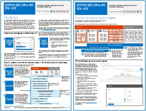

# GDPR에 대 한 office 365 정보 보호

 **요약:** 이 솔루션에는 Office 365 서비스에 저장 된 중요 한 데이터를 보호 하는 방법을 보여줍니다.
  
이 솔루션에는 검색, 분류, 보호, 및 개인 데이터를 모니터링에 대 한 규정 권장 사항이 포함 됩니다. 이 솔루션을 예로, 일반적인 데이터 보호 규정 (GDPR)를 사용 하지만 다른 많은 규정 준수를 달성 하기 위해 동일한 프로세스를 적용할 수 있습니다.

  
[PDF](http://download.microsoft.com/download/E/C/D/ECD5A339-EF10-4420-B3A9-99098884D716/MSFT_Cloud_architecture_information protection for GDPR.pdf)  | [Visio](http://download.microsoft.com/download/E/C/D/ECD5A339-EF10-4420-B3A9-99098884D716/MSFT_Cloud_architecture_information protection for GDPR.vsdx)
  

## See Also

[보안 솔루션](security-solutions.md)
  
[정치적 캠페인, 비영리, 및 기타 민첩 한 조직에 대 한 Microsoft 보안 지침](microsoft-security-guidance-for-political-campaigns-nonprofits-and-other-agile-o.md)

