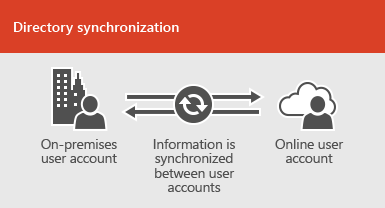
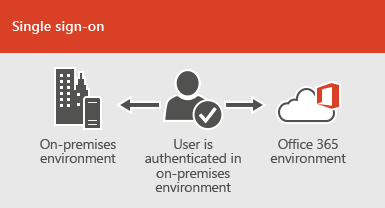

# 온-프레미스 환경과 Office 365 통합

*이 문서는 Office 365 Enterprise 및 Microsoft 365 Enterprise에 모두 적용 됩니다.*

Office 365을 기존 디렉터리 서비스와 통합 하 고 Exchange Server의 온-프레미스 설치, 비즈니스용 Skype 서버 2015 또는 SharePoint Server와 통합할 수 있습니다.
  
 - 디렉터리 서비스와 통합 하는 경우 두 환경의 사용자 계정을 동기화 하 고 관리할 수 있습니다. 또한 사용자가 온-프레미스 자격 증명을 사용 하 여 두 환경에 로그온 할 수 있도록 암호 해시 동기화 또는 SSO (single sign-on)를 추가할 수 있습니다.
 - 온-프레미스 서버 제품과 통합 하는 경우 하이브리드 환경을 만듭니다. 하이브리드 환경은 사용자 또는 정보를 Office 365로 마이그레이션하는 데 도움이 되거나, 일부 사용자 또는 일부 정보를 온-프레미스와 클라우드에서 계속 사용할 수 있습니다. 하이브리드 환경에 대 한 자세한 내용은 [하이브리드 클라우드 개요](https://docs.microsoft.com/Office365/Enterprise/hybrid-cloud-overview)를 참조 하세요.

사용자 지정 된 설치 지침에 대 한 azure Active Directory (Azure AD) 관리자를 사용할 수도 있습니다 (Office 365에 로그인 해야 함).

- [Azure AD Connect advisor](https://aka.ms/aadconnectpwsync)
- [AD FS 배포 관리자](https://aka.ms/adfsguidance)
- [Azure AD Premium 설치 지침](https://aka.ms/aadpguidance)
   
## 시작하기 전에

Office 365 및 온-프레미스 환경을 통합 하기 전에 [네트워크 계획 및 성능 조정](network-planning-and-performance.md)에도 참석 해야 합니다. 사용 가능한 [id 모델](about-office-365-identity.md)을 이해 하 고 싶을 수도 있습니다. 

Office 365 사용자 및 계정을 관리 하는 데 사용할 수 있는 도구 목록은 [office 365 계정을 관리](manage-office-365-accounts.md) 하는 위치를 참조 하세요. 
  
## 디렉터리 서비스와 Office 365 통합
온-프레미스 디렉터리에 기존 사용자 계정이 있는 경우 Office 365에서 이러한 계정을 모두 다시 만들지 않고 환경 간에 차이점이 나 오류가 발생 하는 위험을 방지할 수 있습니다. 디렉터리 동기화를 사용 하면 온라인 및 온-프레미스 환경 간에 이러한 계정을 미러링할 수 있습니다. 디렉터리 동기화를 사용 하면 사용자가 각 환경에 대 한 새로운 정보를 저장할 필요가 없으며 계정을 두 번 만들거나 업데이트할 필요가 없습니다. 디렉터리 동기화를 위해 [온-프레미스 디렉터리를 준비](prepare-for-directory-synchronization.md) 해야 하는 경우이를 수동으로 수행 하거나 [idfix 도구](install-and-run-idfix.md) (Idfix 도구는 Active DIRECTORY 도메인 서비스 [AD DS] 에서만 작동)를 사용할 수 있습니다. 
  

  
사용자가 온-프레미스 자격 증명을 사용 하 여 Office 365에 로그온 할 수 있게 하려면 SSO를 구성할 수도 있습니다. SSO를 사용 하는 경우 Office 365은 사용자 인증을 위해 온-프레미스 환경을 신뢰 하도록 구성 됩니다.
  

  
다음 표에 나와 있는 것 처럼 사용자 계정 관리 기법에 따라 사용자에 게 다음과 같은 다양 한 환경이 제공 됩니다.
 
### 암호 해시 동기화 또는 통과 인증을 포함 하거나 사용 하지 않고 디렉터리 동기화

사용자가 자신의 사용자 계정 (domain\username)을 사용 하 여 온-프레미스 환경에 로그온 합니다. Office 365로 이동 하면 회사 또는 학교 계정 (user@domain.com)을 사용 하 여 다시 로그온 해야 합니다. 사용자 이름은 두 환경에서 동일 합니다. 암호 해시 동기화 또는 통과 인증을 추가 하는 경우 사용자는 두 환경 모두에 대해 동일한 암호를 사용 하지만 Office 365에 로그온 할 때 이러한 자격 증명을 다시 제공 해야 합니다. 암호 해시 동기화를 사용한 디렉터리 동기화는 가장 일반적으로 사용 되는 디렉터리 동기화 시나리오입니다.

디렉터리 동기화를 설정 하려면 Azure Active Directory Connect를 사용 합니다. 자세한 내용은 [Office 365에 대 한 디렉터리 동기화 설정](set-up-directory-synchronization.md)및 [express 설정을 사용 하 여 Azure AD Connect](https://go.microsoft.com/fwlink/p/?LinkId=698537)를 참조 하세요.

[Office 365에 대 한 디렉터리 동기화 준비](prepare-for-directory-synchronization.md) 및 [Azure Active directory에 온-프레미스 식별을 통합](https://go.microsoft.com/fwlink/?LinkId=518101)하는 방법에 대해 자세히 알아보세요.

### SSO를 사용한 디렉터리 동기화

사용자가 자신의 사용자 계정을 사용 하 여 온-프레미스 환경에 로그온 합니다. Office 365로 이동 하면 자동으로 로그온 되거나 온-프레미스 환경 (domain\username)에 사용 하는 것과 동일한 자격 증명을 사용 하 여 로그온 됩니다.

SSO를 설정 하려면 Azure AD Connect도 사용 합니다. 자세한 내용은 [AZURE AD Connect의 사용자 지정 설치](https://go.microsoft.com/fwlink/p/?LinkID=698430)를 참조 하세요.

[Azure Active Directory에서 응용 프로그램에 대 한 single sign-on](https://go.microsoft.com/fwlink/p/?LinkId=698604)에 대해 자세히 알아보세요.

## Azure AD Connect

Azure AD Connect는 DirSync 및 Azure AD Sync와 같은 이전 버전의 id 통합 도구를 대체 합니다. 자세한 내용은 [Azure Active Directory를 사용한 하이브리드 id 란?](https://go.microsoft.com/fwlink/p/?LinkId=527969)를 참조 하세요. Azure Active Directory 동기화에서 Azure AD Connect로의 업데이트를 하려면 [업그레이드 지침](https://go.microsoft.com/fwlink/p/?LinkId=733240)을 참조 하세요. 

또한 [Microsoft Azure에서 Office 365 디렉터리 동기화 배포를](https://go.microsoft.com/fwlink/?LinkId=517887)참조 하세요.

## 참고 항목

[Microsoft 365 Enterprise 개요](https://docs.microsoft.com/microsoft-365/enterprise/microsoft-365-overview)
