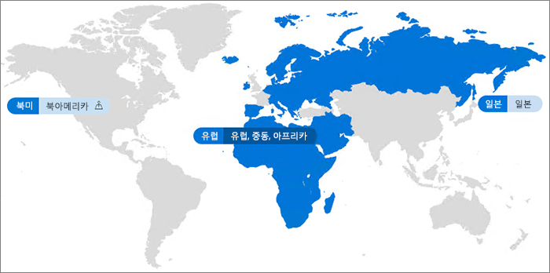

# Office 365 Multi-GeoOffice 365 Multi-Geo

Office 365 Multi-Geo를 사용하면 Office 365 범위를 기존 지사의 여러 지리적 지역 및 / 또는 국가로 확장할 수 있습니다.With Office 365 Multi-Geo, your organization can expand its Office 365 presence to multiple geographic regions and/or countries within your existing tenant. Microsoft 계정 팀에 연락하여 다국적 기업용 Office 365 Multi-Geo에 가입합니다.Reach out to your Microsoft Account Team to sign up your Multi-National Company for Office 365 Multi-Geo.
  
Office 365 Multi-Geo를 사용하여 데이터 상주 요구 사항을 충족하기 위해 선택한 지리적 위치에서 미사용 데이터를 프로비저닝 및 저장하고, 동시에 귀하의 전 세계 작업자들이 최신 생산선 환경을 활용하도록 할 수 있습니다.With Office 365 Multi-Geo, you can provision and store data at rest in the geo locations that you've chosen to meet data residency requirements, and at the same time unlock your global roll out of modern productivity experiences to your workforce.

#### 비디오: Office 365 Multi-Geo 소개Video: Introducing Office 365 Multi-Geo

> [!VIDEO https://www.microsoft.com/en-us/videoplayer/embed/RE1Yk6B?autoplay=false]

Multi-Geo 환경에서 Office 365 테넌트는 중앙 위치(Office 365 구독이 원래 제공되는 위치)와 하나 이상의 위성 위치로 구성됩니다.In a Multi-Geo environment, your Office 365 tenant consists of a central location (where your Office 365 subscription was originally provisioned) and one or more satellite locations. Multi-Geo 테넌트의 경우 지리적 위치, 그룹 및 사용자 정보에 대한 정보는 Azure Active Directory(AAD)에서 관리됩니다.In a multi-geo tenant, the information about geo locations, groups, and user information, is mastered in Azure Active Directory (AAD). 테넌트 정보가 중앙에서 관리되고 각 지리적 위치와 동기화되기 때문에 회사의 모든 사람과 관련된 공유 및 경험은 전역 세계적으로 인식됩니다.Because your tenant information is mastered centrally and synchronized into each geo location, sharing and experiences involving anyone from your company contain global awareness.

Office 365 Multi-Geo는 주로 성능 최적화를 위해 설계되지 않았고 데이터 거주 요구 사항을 충족하도록 설계되었습니다.Note that Office 365 Multi-Geo is not primarily designed for performance optimization, it is designed to meet data residency requirements. Office 365의 성능 최적화에 대한 자세한 내용은 [Office 365의 네트워크 계획 및 성능 조정](https://support.office.com/article/e5f1228c-da3c-4654-bf16-d163daee8848)을 참조하거나 지원 그룹에 문의하세요.For information about performance optimization for Office 365, see [Network planning and performance tuning for Office 365](https://support.office.com/article/e5f1228c-da3c-4654-bf16-d163daee8848) or contact your support group.

## 용어Terminology

다음은 Office 365 Multi-Geo를 설명하는 데 사용되는 주요 용어입니다.Here are the key terms used in describing Office 365 Multi-Geo:

- **중앙 위치** - 테넌트가 원래 프로비저닝된 지리적 위치**Central location** - the geo location where your tenant was originally provisioned.
- **지역 관리자** - 하나 이상의 지정된 위성 위치를 관리할 수 있는 관리자**Geo administrator** - An administrator who can administer one or more specified satellite locations.
- **지역 코드** - 주어직 지리적 위치에 대한 세 자리 코드**Geo code** - a three-letter code for a given geo location.
- **지리적 위치** – Exchange 우편함 및 OneDrive 및 SharePoint 사이트를 포함하여 데이터를 호스팅하기 위해 Multi-Geo 테넌트에서 사용할 수있는 지리적 위치**Geo location** – A geographic location that can be used in a multi-geo tenant to host data, including Exchange mailboxes and OneDrive and SharePoint sites.
- **선호 하는 데이터 위치 (PDL)** - 사용자가 Exchange 사서함과 OneDrive를 프로비저닝하는 위치를 나타내는 관리자가 설정한 사용자 속성**Preferred Data Location (PDL)** – A user property set by the administrator that indicates where the geo location where the users Exchange mailbox and OneDrive should be provisioned. 또한 PDL은 사용자가 만든 SharePoint 사이트가 프로비저닝되는 위치를 결정합니다.The PDL also determines where SharePoint sites that are created by the user are provisioned.
- **위성 위치** - 지리적 인식 Office 365 작업(SharePoint, OneDrive 및 Exchange)이 Multi-Geo 테넌트에서 활성화된 지리적 위치입니다.**Satellite location** – The geo locations where the geo-aware Office 365 workloads (SharePoint, OneDrive, and Exchange) are enabled in a multi-geo tenant.
- **테넌트** – Office 365에서 일반적으로 하나 이상의 도메인에 연결되어 있는 조직을 나타내는 표현입니다(예: contoso.com).**Tenant** – An organization's representation in Office 365 which typically has one or more domains associated with it (for example, contoso.com).

## Office 365 Multi-Geo 사용 가능 여부Office 365 Multi-Geo availability

Office 365 Multi-Geo는 현재 다음 지역 및 국가에서 제공됩니다.Office 365 Multi-Geo is currently offered in these regions and countries:

[!INCLUDE [Office 365 Multi-Geo locations](includes/office-365-multi-geo-locations.md)]

## 시작하기Getting started

Multi-Geo를 시작하려면 이러한 단계를 따르세요.Follow these steps to get started with multi-geo:

1. 계정 팀과 협의하여 _Office 365의 Multi-Geo 기능_ 서비스 계획을 추가합니다.Work with your account team to add the _Multi-Geo Capabilities in Office 365_ service plan. 계정 팀이 필요한 라이센스 수를 추가할 수 있도록 안내합니다.They will guide you to add the number of licenses needed. 현재 Multi-Geo 기능은 Office 365 구독을 2,500개 이상 보유한 고객에게 제공됩니다.Multi-Geo feature is available to customers with a minimum of 2,500 Office 365 subscriptions.

   Office 365 Multi-Geo를 사용하려면 먼저 Microsoft에서 Multi-Geo 지원을 위해 Exchange Online 테넌트를 구성해야 합니다.Before you can start using Office 365 Multi-Geo, Microsoft needs to configure your Exchange Online tenant for multi-geo support. 이 일회성 구성 프로세스는 *Office 365의 Multi-Geo 기능* 서비스 계획을 주문하고 테넌트에 라이선스가 표시된 후에 실행됩니다.This one-time configuration process is triggered after you order the *Multi-Geo Capabilities in Office 365* service plan and the licenses show up in your tenant. Multi-Geo 라이선스가 적용되면 [Office 365 메시지 센터](https://support.office.com/article/38FB3333-BFCC-4340-A37B-DEDA509C2093)에서 알림을 받게 되며 Office 365 Multi-Geo 기능을 구성하고 사용하기 시작할 수 있습니다.You'll receive notifications in the [Office 365 message center](https://support.office.com/article/38FB3333-BFCC-4340-A37B-DEDA509C2093) once your Multi-Geo licenses are applied and you then may begin configuring and using your Office 365 Multi-Geo capabilities.

2. [Multi-Geo 환경 계획](plan-for-multi-geo.md)을 읽으세요.Read [Plan your multi-geo environment](plan-for-multi-geo.md).

3. [Multi-Geo 환경 관리](administering-a-multi-geo-environment.md) 및 [사용자가 환경을 경험하는 방법](multi-geo-user-experience.md)에 대해 알아봅니다.Learn about [administering a multi-geo environment](administering-a-multi-geo-environment.md) and [how your users will experience the environment](multi-geo-user-experience.md).

4. Office 365 Multi-Geo를 설치할 준비가 되면 [Multi-Geo의 테넌트를 구성합니다.](multi-geo-tenant-configuration.md)When you are ready to set up Office 365 Multi-Geo, [configure your tenant for multi-geo](multi-geo-tenant-configuration.md).

5. [검색 설정](configure-search-for-multi-geo.md)[Set up search](configure-search-for-multi-geo.md).

## 참고 항목See also

[Exchange Online 및 OneDrive의 Multi-GeoMulti-Geo in Exchange Online and OneDrive](https://Aka.ms/GoMultiGeo)

[OneDrive 및 SharePoint Online의 Multi-Geo 기능Multi-Geo Capabilities in OneDrive and SharePoint Online](https://docs.microsoft.com/office365/enterprise/multi-geo-capabilities-in-onedrive-and-sharepoint-online-in-office-365)

[Exchange Online의 Multi-Geo 기능Multi-Geo Capabilities in Exchange Online](https://docs.microsoft.com/office365/enterprise/multi-geo-capabilities-in-exchange-online)
