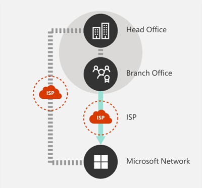

# Office 365 네트워크 연결 원칙Office 365 Network Connectivity Principles

Office 365 네트워크 연결에 대 한 네트워크 계획을 시작 하기 전에 Office 365 트래픽을 안전 하 게 관리 하 고 가능한 최상의 성능을 얻기 위한 연결 원리를 이해 하는 것이 중요 합니다.Before you begin planning your network for Office 365 network connectivity, it is important to understand the connectivity principles for securely managing Office 365 traffic and getting the best possible performance. 이 문서는 Office 365 네트워크 연결을 안전 하 게 최적화 하기 위한 가장 최근 지침을 이해 하는 데 도움이 됩니다.This article will help you understand the most recent guidance for securely optimizing Office 365 network connectivity.
  
전통적인 엔터프라이즈 네트워크는 기본적으로 사용자에 게 강력한 경계 보안을 통해 운영 되는 회사 데이터 센터에서 호스트 되는 응용 프로그램 및 데이터로의 액세스를 제공 하도록 설계 되었습니다Traditional enterprise networks are designed primarily to provide users access to applications and data hosted in company operated datacenters with strong perimeter security. 전통적인 모델에서는 사용자가 회사 네트워크 경계 내부, 지사의 WAN 링크 또는 VPN 연결을 통해 원격으로 응용 프로그램 및 데이터에 액세스 하는 것으로 가정 합니다.The traditional model assumes that users will access applications and data from inside the corporate network perimeter, over WAN links from branch offices, or remotely over VPN connections.
  
Office 365와 같은 SaaS 응용 프로그램을 채택 하면 네트워크 경계 밖의 서비스 및 데이터 조합이 이동 합니다.Adoption of SaaS applications like Office 365 moves some combination of services and data outside the network perimeter. 최적화를 사용 하지 않고 사용자와 SaaS 응용 프로그램 간의 트래픽은 패킷 검사, 네트워크 헤어핀 방지, 지리적으로 멀리 떨어진 끝점 및 기타 요인에 대 한 실수로의 연결에 의해 도입 된 대기 시간을 따릅니다.Without optimization, traffic between users and SaaS applications is subject to latency introduced by packet inspection, network hairpins, inadvertent connections to geographically distant endpoints and other factors. 주요 최적화 지침을 이해 하 고 구현 하 여 최상의 Office 365 성능 및 안정성을 확보할 수 있습니다.You can ensure the best Office 365 performance and reliability by understanding and implementing key optimization guidelines.
  
이 문서에서는 다음에 대해 설명 합니다.In this article, you will learn about:
  
- 클라우드로의 고객 연결에 [Office 365 아키텍처](office-365-network-connectivity-principles.md#BKMK_Architecture) 적용[Office 365 architecture](office-365-network-connectivity-principles.md#BKMK_Architecture) as it applies to customer connectivity to the cloud
- 네트워크 트래픽 최적화 및 최종 사용자 환경에 대 한 [Office 365 연결 원리](office-365-network-connectivity-principles.md#BKMK_Principles) 및 전략 업데이트Updated [Office 365 connectivity principles](office-365-network-connectivity-principles.md#BKMK_Principles) and strategies for optimizing network traffic and the end user experience
- 네트워크 관리자가 네트워크 최적화에서 사용 하기 위해 구조화 된 끝점 목록을 사용할 수 있도록 하는 [Office 365 Endpoints 웹 서비스](office-365-network-connectivity-principles.md#BKMK_WebSvc)The [Office 365 Endpoints web service](office-365-network-connectivity-principles.md#BKMK_WebSvc), which allows network administrators to consume a structured list of endpoints for use in network optimization
- [새 Office 365 끝점 범주](office-365-network-connectivity-principles.md#BKMK_Categories) 및 최적화 지침[New Office 365 endpoint categories](office-365-network-connectivity-principles.md#BKMK_Categories) and optimization guidance
- [네트워크 경계 보안과 끝점 보안 비교Comparing network perimeter security with endpoint security](office-365-network-connectivity-principles.md#BKMK_SecurityComparison)
- Office 365 트래픽에 대 한 [증분 최적화](office-365-network-connectivity-principles.md#BKMK_IncOpt) 옵션[Incremental optimization](office-365-network-connectivity-principles.md#BKMK_IncOpt) options for Office 365 traffic
- Office [365 네트워크 온 보 딩 도구](https://aka.ms/netonboard), office 365에 대 한 기본 연결을 테스트 하기 위한 새로운 도구The [Office 365 Network Onboarding tool](https://aka.ms/netonboard), a new tool for testing basic connectivity to Office 365

## Office 365 아키텍처Office 365 architecture

Office 365은 Exchange Online, SharePoint Online, 비즈니스용 Skype Online 등 다양 한 마이크로 서비스 및 응용 프로그램 집합을 통해 생산성 및 공동 작업 시나리오를 제공 하는 분산 소프트웨어 서비스 (SaaS) 클라우드입니다. 팀, Exchange Online Protection, Office (브라우저의 경우) 및 기타 다양 한 기능Office 365 is a distributed Software-as-a-Service (SaaS) cloud that provides productivity and collaboration scenarios through a diverse set of micro-services and applications, such as Exchange Online, SharePoint Online, Skype for Business Online, Microsoft Teams, Exchange Online Protection, Office in a browser, and many others. 특정 Office 365 응용 프로그램은 고객 네트워크에 적용 되 고 클라우드에 연결 되는 고유한 기능을 가질 수 있으며, 모든 주요 주체, 목표 및 아키텍처 패턴을 공유 합니다.While specific Office 365 applications may have their unique features as it applies to customer network and connectivity to the cloud, they all share some key principals, goals and architecture patterns. 연결에 대 한 이러한 보안 주체 및 아키텍처 패턴은 대부분의 다른 SaaS 클라우드에서 일반적인 것 이며, Microsoft와 같은 플랫폼 수준의 서비스 및 인프라와 동일한 일반 배포 모델과는 매우 차이가 있습니다. Microsoft.These principals and architecture patterns for connectivity are typical for many other SaaS clouds and at the same time being quite different from the typical deployment models of Platform-as-a-Service and Infrastructure-as-a-Service clouds, such as Microsoft Azure.
  
Office 365에서 가장 중요 한 아키텍처 기능 중 하나 (네트워크 기획자가 자주 누락 하거나 잘못 해석 하는 것)는 it가 사용자 연결 방법에 대 한 맥락에서 실제 글로벌 분산 서비스입니다.One of the most significant architectural features of Office 365 (that is often missed or misinterpreted by network planners) is that it is a truly global distributed service, in the context of how users connect to it. 대상 Office 365 테 넌 트의 위치는 클라우드 내에서 고객 데이터가 저장 되는 위치를 이해 하는 데 중요 하지만, Office 365 사용자 환경에서는 데이터를 포함 하는 디스크에 직접 연결 하지 않습니다.The location of the target Office 365 tenant is important to understand the locality of where customer data is stored within the cloud, but the user experience with Office 365 doesn't involve connecting directly to disks containing the data. 성능, 안정성 및 기타 중요 한 품질 특성을 비롯 한 Office 365의 사용자 환경에는 전 세계 수많은 Microsoft 위치에서 확장 된 고도로 분산 서비스 전면 도어를 통한 연결이 포함 됩니다.The user experience with Office 365 (including performance, reliability and other important quality characteristics) involves connectivity through a highly distributed service front doors that are scaled out across hundreds of Microsoft locations worldwide. 대부분의 경우에는 고객 네트워크에서 중앙 위치나 지역의 egress 지점을 통해 Office 365에 연결 하는 대신 사용자 요청을 가장 가까운 Office 365 서비스 진입점으로 라우팅할 수 있도록 하 여 최상의 사용자 환경을 구현 합니다.In the majority of cases, the best user experience is achieved by allowing the customer network to route user requests to the closest Office 365 service entry point, rather than connecting to Office 365 through an egress point in a central location or region.
  
대부분의 고객에 게는 Office 365 사용자가 여러 위치에 분산 되어 있습니다.For most customers, Office 365 users are distributed across many locations. 최상의 결과를 얻으려면이 문서에서 설명 하는 원칙을 사용 하 여 지리적이 지 않은 Microsoft 글로벌 네트워크의 가장 가까운 지점에 대 한 연결 최적화에 초점을 맞추어 보기의 수평 확장 시점을 확인 해야 합니다. Office 365 테 넌 트의 위치입니다.To achieve the best results, the principles outlined in this document should be looked at from the scale-out (not scale-up) point of view, focusing on optimizing connectivity to the nearest point of presence in the Microsoft Global Network, not to the geographic location of the Office 365 tenant. 본질적으로 Office 365 테 넌 트 데이터를 특정 지리적 위치에 저장할 수 있지만 해당 테 넌 트에 대 한 Office 365 경험은 배포 된 상태로 유지 되며 테 넌 트에 있는 모든 최종 사용자 위치와 근접 하 게 근접해 있을 수 있음을 의미 합니다. .In essence, this means that even though Office 365 tenant data may be stored in a specific geographic location, Office 365 experience for that tenant remains distributed and can be present in very close (network) proximity to every end user location that the tenant has.
  
## Office 365 연결 원리Office 365 connectivity principles

Microsoft는 최적의 Office 365 연결 및 성능을 달성 하기 위해 다음과 같은 원칙을 권장 합니다.Microsoft recommends the following principles to achieve optimal Office 365 connectivity and performance. 이러한 Office 365 연결 원칙을 사용 하 여 트래픽을 관리 하 고 Office 365에 연결 하는 경우 최상의 성능을 얻을 수 있습니다.Use these Office 365 connectivity principles to manage your traffic and get the best performance when connecting to Office 365.
  
네트워크 설계의 기본 목표는 네트워크의 RTT (왕복 시간)를 Microsoft 글로벌 네트워크로 줄이고 microsoft의 공용 네트워크 백본을 사용 하 여 모든 Microsoft의 데이터 센터를 낮은 대기 시간으로 상호 연결할 수 있도록 하 여 지연을 최소화 하는 것입니다. 그리고 클라우드 응용 프로그램 진입점은 전 세계에 확산 됩니다.The primary goal in the network design should be to minimize latency by reducing the round-trip time (RTT) from your network into the Microsoft Global Network, Microsoft's public network backbone that interconnects all of Microsoft's datacenters with low latency and cloud application entry points spread around the world. Microsoft 글로벌 네트워크에 대 한 자세한 내용은 마이크로소프트에서 [빠르고 안정적인 글로벌 네트워크를 구축 하는 방법을](https://azure.microsoft.com/blog/how-microsoft-builds-its-fast-and-reliable-global-network/)확인할 수 있습니다.You can learn more about the Microsoft Global Network at [How Microsoft builds its fast and reliable global network](https://azure.microsoft.com/blog/how-microsoft-builds-its-fast-and-reliable-global-network/).
  

### Office 365 트래픽을 식별 하 고 차별화 합니다.Identify and differentiate Office 365 traffic

  
Office 365 네트워크 트래픽은 일반 인터넷 바인딩 네트워크 트래픽과의 트래픽을 구별할 수 있는 첫 번째 단계입니다.Identifying Office 365 network traffic is the first step in being able to differentiate that traffic from generic Internet-bound network traffic. Office 365 연결을 최적화 하려면 네트워크 경로 최적화, 방화벽 규칙, 브라우저 프록시 설정 및 특정 끝점에 대 한 네트워크 검사 장치 바이패스와 같은 접근 방식을 구현 해야 합니다.Office 365 connectivity can be optimized by implementing a combination of approaches like network route optimization, firewall rules, browser proxy settings, and bypass of network inspection devices for certain endpoints.
  
이전 Office 365 최적화 지침은 Office 365 끝점을 **필수** 및 **선택적**두 범주로 나눕니다.Previous Office 365 optimization guidance divided Office 365 endpoints into two categories, **Required** and **Optional**. 새 Office 365 서비스 및 기능을 지원 하기 위해 끝점이 추가 됨에 따라 Office 365 끝점이 **최적화**, **허용** 및 **기본값**의 세 가지 범주로 재구성 되었습니다.As endpoints have been added to support new Office 365 services and features, we have reorganized Office 365 endpoints into three categories: **Optimize**, **Allow** and **Default**. 각 범주에 대 한 지침은 범주의 모든 끝점에 적용 되므로 최적화를 보다 쉽게 이해 하 고 구현할 수 있습니다.Guidelines for each category applies to all endpoints in the category, making optimizations easier to understand and implement.
  
Office 365 끝점 범주 및 최적화 방법에 대 한 자세한 내용은 [새 Office 365 끝점 범주](office-365-network-connectivity-principles.md#BKMK_Categories) 섹션을 참조 하십시오.For more details on Office 365 endpoint categories and optimization methods, see the [New Office 365 endpoint categories](office-365-network-connectivity-principles.md#BKMK_Categories) section.
  
이제 Microsoft는 모든 Office 365 끝점을 웹 서비스로 게시 하 고이 데이터를 사용 하는 가장 좋은 방법에 대 한 지침을 제공 합니다.Microsoft now publishes all Office 365 endpoints as a web service and provides guidance on how best to use this data. Office 365 끝점을 페치하고 사용 하는 방법에 대 한 자세한 내용은 [office 365 url 및 IP 주소 범위](https://support.office.com/article/office-365-urls-and-ip-address-ranges-8548a211-3fe7-47cb-abb1-355ea5aa88a2?ui=en-US&amp;rs=en-US&amp;ad=US)문서를 참조 하세요.For more information on how to fetch and work with Office 365 endpoints, see the article [Office 365 URLs and IP address ranges](https://support.office.com/article/office-365-urls-and-ip-address-ranges-8548a211-3fe7-47cb-abb1-355ea5aa88a2?ui=en-US&amp;rs=en-US&amp;ad=US).
  

### 네트워크 연결을 로컬로 송신Egress network connections locally

  
로컬 DNS 및 인터넷 송신은 연결 대기 시간을 줄이고 사용자 연결이 Office 365 서비스에 가장 가까운 항목에 적용 되도록 하는 데 중요 한 중요성을 갖습니다.Local DNS and Internet egress is of critical importance for reducing connection latency and ensuring that user connections are made to the nearest point of entry to Office 365 services. 복잡 한 네트워크 토폴로지에서 로컬 DNS와 로컬 인터넷 송신을 함께 구현 하는 것이 중요 합니다.In a complex network topology, it is important to implement both local DNS and local Internet egress together. Office 365에서 클라이언트 연결을 가장 가까운 항목 지점에 라우팅하는 방법에 대 한 자세한 내용은 [클라이언트 연결](https://support.office.com/article/client-connectivity-4232abcf-4ae5-43aa-bfa1-9a078a99c78b)문서를 참조 하십시오.For more information about how Office 365 routes client connections to the nearest point of entry, see the article [Client Connectivity](https://support.office.com/article/client-connectivity-4232abcf-4ae5-43aa-bfa1-9a078a99c78b).
  
Office 365와 같은 클라우드 서비스의 출현 이전에는 네트워크 아키텍처의 디자인 요인에 따라 최종 사용자 인터넷 연결이 비교적 단순 했습니다.Prior to the advent of cloud services such as Office 365, end user Internet connectivity as a design factor in network architecture was relatively simple. 인터넷 서비스와 웹 사이트가 전 세계적으로 분산 되 면 회사 송신 지점과 지정 된 모든 대상 끝점 간의 대기 시간은 대부분 지리적 거리의 기능입니다.When Internet services and web sites are distributed around the globe, latency between corporate egress points and any given destination endpoint is largely a function of geographical distance.
  
전통적인 네트워크 아키텍처에서 모든 아웃 바운드 인터넷 연결은 회사 네트워크를 통과 하 고 중앙 위치에서 송신 합니다.In a traditional network architecture, all outbound Internet connections traverse the corporate network, and egress from a central location. Microsoft의 클라우드 서비스가 발전 함에 따라 분산 인터넷 연결 네트워크 아키텍처는 대기 시간에 민감한 클라우드 서비스를 지 원하는 데 중요 한 역할을 하 게 됩니다.As Microsoft's cloud offerings have matured, a distributed Internet-facing network architecture has become critical for supporting latency-sensitive cloud services. Microsoft 글로벌 네트워크는 들어오는 클라우드 서비스 연결을 가장 가까운 진입점으로 라우팅하는 전역 진입점의 동적 패브릭을 분산 서비스 전면 도어 인프라에 대 한 대기 시간 요구 사항을 수용할 수 있도록 설계 되었습니다.The Microsoft Global Network was designed to accommodate latency requirements with the Distributed Service Front Door infrastructure, a dynamic fabric of global entry points that routes incoming cloud service connections to the closest entry point. 이는 고객과 클라우드 간의 경로를 효과적으로 줄여 Microsoft 클라우드 고객의 "지난 마일"의 길이를 줄이기 위한 것입니다.This is intended to reduce the length of the "last mile" for Microsoft cloud customers by effectively shortening the route between the customer and the cloud.
  
엔터프라이즈 Wan은 대개 하나 이상의 프록시 서버를 통해 인터넷으로 egress 전에 검사를 위해 중앙 회사 헤드 사무실로 네트워크 트래픽을 전송 하도록 설계 되었습니다.Enterprise WANs are often designed to backhaul network traffic to a central company head office for inspection before egress to the Internet, usually through one or more proxy servers. 아래 다이어그램에서는 이러한 네트워크 토폴로지를 보여 줍니다.The diagram below illustrates such a network topology.
  

  
Office 365은 전 세계의 프런트 엔드 서버를 포함 하는 Microsoft 전역 네트워크에서 실행 되므로 사용자 위치에 근접 한 프런트 엔드 서버를 사용 하는 경우가 많습니다.Because Office 365 runs on the Microsoft Global Network, which includes front end servers around the world, there will often be a front-end server close to the user's location. 로컬 인터넷 송신을 제공 하 고 Office 365 끝점에 대해 로컬 이름 확인을 제공 하도록 내부 DNS 서버를 구성 하 여 office 365로 향하는 네트워크 트래픽은 사용자에 게 가까이 있는 Office 365 프런트 엔드 서버에 연결할 수 있습니다.By providing local Internet egress and by configuring internal DNS servers to provide local name resolution for Office 365 endpoints, network traffic destined for Office 365 can connect to Office 365 front end servers as close as possible to the user. 아래 다이어그램에서는 본사, 지사 및 원격 위치에서 연결 하는 사용자가 가장 가까운 Office 365 진입점에 대해 가장 짧은 경로를 팔 로우 하는 데 사용할 수 있는 네트워크 토폴로지의 예를 보여 줍니다.The diagram below shows an example of a network topology that allows users connecting from main office, branch office and remote locations to follow the shortest route to the closest Office 365 entry point.
  

  
네트워크 경로를 사용 하 여 Office 365 진입점을 이러한 방식으로 줄이면 Office 365의 연결 성능 및 최종 사용자 환경이 개선 될 수 있으며, 향후 변경 사항이 Office 365 성능에 미치는 영향을 줄이고 향상.Shortening the network path to Office 365 entry points in this way can improve connectivity performance and the end user experience in Office 365, and can also help to reduce the impact of future changes to the network architecture on Office 365 performance and reliability.
  
또한 응답 하는 DNS 서버가 멀리 있거나 사용량이 많은 경우 DNS 요청이 대기 시간을 포함할 수 있습니다.Also, DNS requests can introduce latency if the responding DNS server is distant or busy. 로컬 DNS 서버를 분기 위치에 프로 비전 하 고 DNS 레코드를 적절 하 게 캐시 하도록 구성 하 여 이름 확인 대기 시간을 최소화할 수 있습니다.You can minimize name resolution latency by provisioning local DNS servers in branch locations and making sure they are configured to cache DNS records appropriately.
  
지역 송신은 Office 365에서 정상적으로 작동할 수 있는 반면 최적의 연결 모델은 회사 네트워크에 있든, 홈, 호텔, 커피숍 등의 원격 위치에 관계 없이 항상 사용자 위치에 네트워크 egress를 제공 하는 것입니다. 공항.While regional egress can work well for Office 365, the optimum connectivity model would be to always provide network egress at the user's location, regardless of whether this is on the corporate network or remote locations such as home, hotels, coffee shops and airports. 이 로컬 직접 egress 모델은 아래 다이어그램에 표시 됩니다.This local direct egress model is represented in the diagram below.
  

  
Office 365을 채택한 기업에서는 Office 365에 대 한 사용자 연결에서 가장 가까운 Microsoft 글로벌 네트워크 항목으로의 가능한 가장 짧은 경로를 사용 하도록 하 여 Microsoft 글로벌 네트워크의 분산 서비스 전면 도어 아키텍처를 활용할 수 있습니다. 조절점.Enterprises who have adopted Office 365 can take advantage of the Microsoft Global Network's Distributed Service Front Door architecture by ensuring that user connections to Office 365 take the shortest possible route to the nearest Microsoft Global Network entry point. 로컬 egress 네트워크 아키텍처는 사용자 위치에 관계 없이 Office 365 트래픽을 가장 가까운 송신을 통해 라우팅할 수 있도록 하 여이를 수행 합니다.The local egress network architecture does this by allowing Office 365 traffic to be routed over the nearest egress, regardless of user location.
  
기존 모델에 비해 로컬 egress 아키텍처에는 다음과 같은 이점이 있습니다.The local egress architecture has the following benefits over the traditional model:
  
- 경로 길이를 최적화 하 여 최적의 Office 365 성능을 제공 합니다.Provides optimal Office 365 performance by optimizing route length. 최종 사용자 연결은 분산 서비스 전면 도어 인프라에 의해 가장 가까운 Office 365 진입점으로 동적 라우팅됩니다.End user connections are dynamically routed to the nearest Office 365 entry point by the Distributed Service Front Door infrastructure.
- 로컬 송신을 허용 하 여 회사 네트워크 인프라에 대 한 부하를 줄입니다.Reduces the load on corporate network infrastructure by allowing local egress.
- 클라이언트 끝점 보안 및 클라우드 보안 기능을 활용 하 여 양쪽 끝에서 연결의 보안을 설정 합니다.Secures connections on both ends by leveraging client endpoint security and cloud security features.

### 네트워크 헤어핀 방지Avoid network hairpins

  
일반적으로 사용자와 가장 가까운 Office 365 끝점 간의 가장 짧은 바로 경로를 사용 하는 것이 최적의 성능을 제공 합니다.As a general rule of thumb, the shortest, most direct route between user and closest Office 365 endpoint will offer the best performance. 특정 대상에 바인딩된 WAN 또는 VPN 트래픽이 처음으로 다른 중간 위치 (예: 보안 스택, 클라우드 액세스 브로커, 클라우드 기반 웹 게이트웨이)로 전송 되는 경우에는 대기 시간 및 잠재적인 리디렉션을 도입 하는 헤어핀 지리적으로 멀리 떨어진 끝점A network hairpin happens when WAN or VPN traffic bound for a particular destination is first directed to another intermediate location (such as security stack, cloud access broker, of cloud based web gateway), introducing latency and potential redirection to a geographically distant endpoint. 네트워크 헤어핀 방지 라우팅/피어 링 비효율성 또는 최적 (원격) DNS 조회로 인해 발생할 수도 있습니다.Network hairpins can also be caused by routing/peering inefficiencies or suboptimal (remote) DNS lookups.
  
로컬 송신 케이스 에서도 Office 365 연결이 네트워크 헤어핀 방지 되지 않도록 하려면 사용자 위치에 인터넷 송신을 제공 하는 데 사용 되는 ISP에 Microsoft 글로벌 네트워크와의 직접 피어 링 관계가 있는지 여부를 확인 합니다. 해당 위치와 근접 합니다.To ensure that Office 365 connectivity is not subject to network hairpins even in the local egress case, check whether the ISP that is used to provide Internet egress for the user location has a direct peering relationship with the Microsoft Global Network in close proximity to that location. 인터넷 바운드 트래픽을 처리 하는 타사 클라우드 또는 클라우드 기반 네트워크 보안 공급 업체를 통해 프록시 또는 터널링과 반대로, 신뢰할 수 있는 Office 365 트래픽을 직접 보내도록 송신 라우팅을 구성할 수도 있습니다.You may also want to configure egress routing to send trusted Office 365 traffic directly, as opposed to proxying or tunneling through a third-party cloud or cloud-based network security vendor that processes your Internet-bound traffic. 로컬 DNS 이름 확인-Office 365 끝점의 경우 직접 라우팅 외에도 사용자 연결에 가장 가까운 Office 365 진입점이 사용 되도록 하는 데 도움이 됩니다.Local DNS name resolution of Office 365 endpoints helps to ensure that in addition to direct routing, the closest Office 365 entry points are being used for user connections.
  
Office 365 트래픽에 대해 클라우드 기반 네트워크 또는 보안 서비스를 사용 하는 경우 헤어핀 효과가 평가 되 고 Office 365 성능에 대 한 영향을 이해 하 고 있어야 합니다.If you use cloud-based network or security services for your Office 365 traffic, ensure that the hairpinning effect is evaluated and its impact on Office 365 performance is understood. 이 작업은 트래픽을 조직의 수 및 Microsoft 전역 네트워크 피어 링 지점과 관계에 따라 전달 되는 서비스 공급자 위치의 수와 위치를 확인 하 여 수행할 수 있으며, 네트워크 피어 링 관계의 품질은 다음과 같습니다. ISP 및 Microsoft와 서비스 공급자 및 서비스 공급자 인프라의 백홀이 성능에 미치는 영향This can be done by examining the number and locations of service provider locations through which the traffic is forwarded in relationship to number of your branch offices and Microsoft Global Network peering points, quality of the network peering relationship of the service provider with your ISP and Microsoft, and the performance impact of backhauling in the service provider infrastructure.
  
Office 365 진입점과 최종 사용자에 게 근접 한 분산 위치를 사용 하 여 Office 365 트래픽을 타사 네트워크 또는 보안 공급자에 게 라우팅하는 경우 공급자 네트워크가 Office 365 연결에 부정적인 영향을 줄 수 있습니다. 최적의 Office 365 피어 링에 맞게 구성 됩니다.Due to the large number of distributed locations with Office 365 entry points and their proximity to end users, routing Office 365 traffic to any third party network or security provider can have an adverse impact on Office 365 connections if the provider network is not configured for optimal Office 365 peering.
  

### 우회 프록시, 트래픽 검사 장치 및 중복 되는 보안 기술 평가Assess bypassing proxies, traffic inspection devices and duplicate security technologies

  
기업 고객은 네트워크 보안 및 위험 감소 방법 특히 Office 365 바운드 트래픽을 검토 하 고 Office 365 보안 기능을 사용 하 여 간섭, 성능에 영향을 주는 네트워크 보안에 대 한 의존도를 줄입니다. Office 365 네트워크 트래픽에 대 한 기술Enterprise customers should review their network security and risk reduction methods specifically for Office 365 bound traffic and use Office 365 security features to reduce their reliance on intrusive, performance impacting, and expensive network security technologies for Office 365 network traffic.
  
대부분의 엔터프라이즈 네트워크에서는 프록시, SSL 검사, 패킷 검사 및 데이터 손실 방지 시스템과 같은 기술을 사용 하 여 인터넷 트래픽에 대해 네트워크 보안을 적용 합니다.Most enterprise networks enforce network security for Internet traffic using technologies like proxies, SSL inspection, packet inspection, and data loss prevention systems. 이러한 기술은 일반 인터넷 요청에 대 한 중요 한 위험 완화를 제공 하지만 Office 365 끝점에 적용 될 때의 성능, 확장성 및 최종 사용자 환경의 품질을 대폭 떨어뜨릴 수 있습니다.These technologies provide important risk mitigation for generic Internet requests but can dramatically reduce performance, scalability and the quality of end user experience when applied to Office 365 endpoints.
  

#### Office 365 끝점 웹 서비스Office 365 Endpoints web service

Office 365 관리자는 스크립트나 REST 호출을 사용 하 여 Office 365 끝점 웹 서비스에서 구조화 된 끝점 목록을 소비 하 고 경계 방화벽 및 기타 네트워크 장치의 구성을 업데이트할 수 있습니다.Office 365 administrators can use a script or REST call to consume a structured list of endpoints from the Office 365 Endpoints web service and update the configurations of perimeter firewalls and other network devices. 이렇게 하면 Office 365에 대 한 트래픽 바운드가 식별 되며, 적절 하 게 처리 되 고, 일반적이 고 알려지지 않은 인터넷 웹 사이트에 바인딩된 네트워크 트래픽과 다르게 관리 됩니다.This will ensure that traffic bound for Office 365 is identified, treated appropriately and managed differently from network traffic bound for generic and often unknown Internet web sites. Office 365 Endpoints 웹 서비스를 사용 하는 방법에 대 한 자세한 내용은 [office 365 url 및 IP 주소 범위](https://support.office.com/article/office-365-urls-and-ip-address-ranges-8548a211-3fe7-47cb-abb1-355ea5aa88a2?ui=en-US&amp;rs=en-US&amp;ad=US)문서를 참조 하십시오.For more information on how to use the Office 365 Endpoints web service, see the article [Office 365 URLs and IP address ranges](https://support.office.com/article/office-365-urls-and-ip-address-ranges-8548a211-3fe7-47cb-abb1-355ea5aa88a2?ui=en-US&amp;rs=en-US&amp;ad=US).
  
#### PAC (프록시 자동 구성) 스크립트PAC (Proxy Automatic Configuration) scripts

Office 365 관리자는 WPAD 또는 GPO를 통해 사용자 컴퓨터로 배달 될 수 있는 PAC (프록시 자동 구성) 스크립트를 만들 수 있습니다.Office 365 administrators can create PAC (Proxy Automatic Configuration) scripts that can be delivered to user computers via WPAD or GPO. PAC 스크립트를 사용 하 여 WAN 또는 VPN 사용자의 Office 365 요청에 대 한 프록시를 우회 하 여 Office 365 트래픽이 회사 네트워크를 통과 하지 않고 직접 인터넷 연결을 사용 하도록 할 수 있습니다.PAC scripts can be used to bypass proxies for Office 365 requests from WAN or VPN users, allowing Office 365 traffic to use direct Internet connections rather than traversing the corporate network.
  
#### Office 365 보안 기능Office 365 security features

Microsoft는 데이터 센터 보안, 운영 보안 및 위험 감소와 함께 Office 365 서버 및 해당 서버가 나타내는 네트워크 끝점에 대 한 정보를 명확 하 게 살펴봅니다.Microsoft is transparent about datacenter security, operational security and risk reduction around Office 365 servers and the network endpoints that they represent. Office 365 기본 제공 되는 보안 기능을 사용 하 여 데이터 손실 방지, 바이러스 백신, 다단계 인증, 고객 잠금 상자, Advanced Threat Protection, Office 365 위협 인텔리전스, office 365 보안 등의 네트워크 보안 위험을 줄일 수 있습니다. 점수, Exchange Online Protection 및 네트워크 DDOS 보안Office 365 built-in security features are available for reducing network security risk, such as Data Loss Prevention, Anti-Virus, Multi-Factor Authentication, Customer Lock Box, Advanced Threat Protection, Office 365 Threat Intelligence, Office 365 Secure Score, Exchange Online Protection, and Network DDOS Security.
  
Microsoft 데이터 센터 및 글로벌 네트워크 보안에 대 한 자세한 내용은 [Microsoft 보안 센터](https://www.microsoft.com/trustcenter/security)를 참조 하세요.For more information on Microsoft datacenter and Global Network security, see the [Microsoft Trust Center](https://www.microsoft.com/trustcenter/security).
  
## 새 Office 365 끝점 범주New Office 365 endpoint categories

Office 365 끝점은 다양 한 네트워크 주소 및 서브넷 집합을 나타냅니다.Office 365 endpoints represent a varied set of network addresses and subnets. 끝점은 Url, IP 주소 또는 IP 범위 일 수 있으며 일부 끝점은 특정 TCP/UDP 포트와 함께 나열 됩니다.Endpoints may be URLs, IP addresses or IP ranges, and some endpoints are listed with specific TCP/UDP ports. Url은 *account.office.net* 같은 FQDN 이거나 \* \*office365.com\*와 같은 와일드 카드 url 일 수 있습니다.URLs can either be a FQDN like  *account.office.net*  , or a wildcard URL like  *\*.office365.com*.
  
> [!NOTE]
> 네트워크 내의 Office 365 끝점 위치는 Office 365 테 넌 트 데이터의 위치와 직접 연결 되지 않습니다.The locations of Office 365 endpoints within the network are not directly related to the location of the Office 365 tenant data. 따라서 고객은 Office 365에서 분산 및 글로벌 서비스로 확인 해야 하며 지역 기준에 따라 Office 365 끝점에 대 한 네트워크 연결을 차단 해서는 안 됩니다.For this reason, customers should look at Office 365 as a distributed and global service and should not attempt to block network connections to Office 365 endpoints based on geographical criteria.
  
이전에 Office 365 트래픽을 관리 하기 위한 지침에서 끝점은 **필수** 및 **선택**항목 두 범주로 구성 되었습니다.In our previous guidance for managing Office 365 traffic, endpoints were organized into two categories, **Required** and **Optional**. 각 범주 내의 끝점은 서비스의 중요도에 따라 각각 다른 최적화를 필요로 하며, 대부분의 고객은 동일한 네트워크 최적화 응용 프로그램을 Office 365 Url 및 IP 주소의 전체 목록에 정당화 하기 위해 직면 하 게 됩니다.Endpoints within each category required different optimizations depending on the criticality of the service, and many customers faced challenges in justifying the application of the same network optimizations to the full list of Office 365 URLs and IP addresses.
  
새 모델에서는 끝점이 최적의 성능을 개선 하 고 투자를 실현할 수 있도록 네트워크 최적화 작업에 집중할 수 있도록 **최적화**, **허용** 및 **기본값으로**세 범주로 분리 됩니다.In the new model, endpoints are segregated into three categories, **Optimize**, **Allow** and **Default**, providing a priority-based pivot on where to focus network optimization efforts to realize the best performance improvements and return on investment. 끝점은 실제 사용자 환경의 네트워크 품질, 볼륨 및 성능 봉투, 구현 용이성에 따라 위의 범주에서 통합 됩니다.The endpoints are consolidated in the above categories based on the sensitivity of the effective user experience to network quality, volume and performance envelope of scenarios and ease of implementation. 권장 최적화는 지정 된 범주의 모든 끝점에 동일한 방식으로 적용할 수 있습니다.Recommended optimizations can be applied the same way to all endpoints in a given category.
  
- 끝점 **최적화** 는 모든 office 365 서비스에 연결 하는 데 필요 하며 75% over office 365 대역폭, 연결 및 데이터 볼륨을 나타냅니다.**Optimize** endpoints are required for connectivity to every Office 365 service and represent over 75% of Office 365 bandwidth, connections and volume of data. 이러한 끝점은 네트워크 성능, 대기 시간 및 가용성에 가장 중요 한 Office 365 시나리오를 나타냅니다.These endpoints represent Office 365 scenarios that are the most sensitive to network performance, latency and availability. 모든 끝점이 Microsoft 데이터 센터에서 호스팅됩니다.All endpoints are hosted in Microsoft datacenters. 이 범주에서 끝점에 대 한 변경 속도는 다른 두 범주의 끝점에 비해 훨씬 낮을 것으로 예상 됩니다.The rate of change to the endpoints in this category is expected to be much lower than for the endpoints in the other two categories. 이 범주에는 키 Url 및 Exchange Online, SharePoint Online, 비즈니스용 Skype Online 및 Microsoft 팀과 같은 핵심 Office 365 작업에 전용으로 정의 된 IP 서브넷 집합을 아주 작게 (~ 10 개) 포함 합니다.This category includes a very small (on the order of ~10) set of key URLs and a defined set of IP subnets dedicated to core Office 365 workloads such as Exchange Online, SharePoint Online, Skype for Business Online and Microsoft Teams.

    적절 하 게 정의 된 중요 끝점의 압축 목록에서는 이러한 대상에 대 한 높은 가치 네트워크 최적화를 보다 빠르고 쉽게 계획 하 고 구현 하는 데 도움이 됩니다.A condensed list of well defined critical endpoints should help you to plan and implement high value network optimizations for these destinations faster and easier.

    끝점 *https://outlook.office365.com* *최적화* 의 예로는 sharepoint.com 및 *\<https://테 넌 트\>-my.sharepoint.com* 등의 https:// *\<있습니다.\>*Examples of  *Optimize*  endpoints include  *https://outlook.office365.com*  ,  *https://\<tenant\>.sharepoint.com*  and  *https://\<tenant\>-my.sharepoint.com*  .

    최적화 방법에는 다음이 포함 됩니다.Optimization methods include:

  - 우회 또는 허용 목록 트래픽을 차단, SSL 암호 해독, 딥 패킷 검사 및 콘텐츠 필터링을 수행 하는 네트워크 장치 및 서비스에서 끝점을 *최적화* 합니다.Bypass or whitelist  *Optimize*  endpoints on network devices and services that perform traffic interception, SSL decryption, deep packet inspection and content filtering.
  - 일반 인터넷 브라우징에 일반적으로 사용 되는 온-프레미스 프록시 장치 및 클라우드 기반 프록시 서비스 바이패스Bypass on-premises proxy devices and cloud-based proxy services commonly used for generic Internet browsing.
  - 네트워크 인프라 및 경계 시스템에서 해당 끝점의 평가를 완전히 신뢰 하는 것으로 우선 순위를 지정 합니다.Prioritize the evaluation of these endpoints as fully trusted by your network infrastructure and perimeter systems.
  - WAN 백홀이의 우선 순위를 지정 하 고, 가능한 경우 사용자/분기 위치에 근접 하 게 이러한 끝점에 대 한 인터넷 기반 egress를 직접 배포 합니다.Prioritize reduction or elimination of WAN backhauling, and facilitate direct distributed Internet based egress for these endpoints as close to users/branch locations as possible.
  - 분할 터널링을 구현 하 여 VPN 사용자에 게 이러한 클라우드 끝점에 대 한 직접 연결을 용이 하 게 합니다.Facilitate direct connectivity to these cloud endpoints for VPN users by implementing split tunneling.
  - DNS 이름 확인에서 반환 된 IP 주소가 이러한 끝점에 대 한 라우팅 송신 경로와 일치 하는지 확인 합니다.Ensure that IP addresses returned by DNS name resolution match the routing egress path for these endpoints.
  - Microsoft 글로벌 네트워크의 가장 가까운 인터넷 피어 링 지점으로의 직접 SD-WAN 통합을 위해 이러한 끝점의 우선 순위를 지정 합니다.Prioritize these endpoints for SD-WAN integration for direct, minimal latency routing into the nearest Internet peering point of the Microsoft global network.

- **허용** 끝점은 특정 Office 365 서비스 및 기능에 연결 하는 데 필요 하지만 *최적화* 범주에 있는 것 처럼 네트워크 성능 및 대기 시간에는 중요 하지 않습니다.**Allow** endpoints are required for connectivity to specific Office 365 services and features, but are not as sensitive to network performance and latency as those in the  *Optimize*  category. 대역폭 및 연결 수 측면에서 이러한 끝점의 전반적인 네트워크 공간 역시 상당히 작습니다.The overall network footprint of these endpoints from the standpoint of bandwidth and connection count is also significantly smaller. 이러한 끝점은 Office 365 전용 이며 Microsoft 데이터 센터에서 호스팅됩니다.These endpoints are dedicated to Office 365 and are hosted in Microsoft datacenters. 이러한 사용자는 광범위 한 Office 365 마이크로 서비스와 해당 종속성 (~ 100 Url 순)을 나타내고 *최적화* 범주에 비해 속도가 더 높은 비율로 변경 될 것으로 예상 됩니다.They represent a broad set of Office 365 micro-services and their dependencies (on the order of ~100 URLs) and are expected to change at a higher rate than those in the  *Optimize*  category. 이 범주의 모든 끝점이 정의 된 전용 IP 서브넷에 연결 되어 있는 것은 아닙니다.Not all endpoints in this category are associated with defined dedicated IP subnets.

    *허용* 끝점에 대 한 네트워크 최적화는 Office 365 사용자 환경을 향상 시킬 수 있지만, 일부 고객은 이러한 최적화 범위를 더 좁은 방법으로 선택 하 여 네트워크 변경을 최소화할 수 있습니다.Network optimizations for  *Allow*  endpoints can improve the Office 365 user experience, but some customers may choose to scope those optimizations more narrowly to minimize changes to their network.

    *허용* 끝점의 예에 *는\*https://. protection.outlook.com* 및 *https://accounts.accesscontrol.windows.net*가 포함 됩니다.Examples of *Allow* endpoints include *https://\*.protection.outlook.com* and *https://accounts.accesscontrol.windows.net*.

    최적화 방법에는 다음이 포함 됩니다.Optimization methods include:

  - 우회 또는 허용 목록 트래픽을 차단, SSL 암호 해독, 심층 패킷 검사 및 콘텐츠 필터링을 수행 하는 네트워크 장치 및 서비스의 끝점을 *허용* 합니다.Bypass or whitelist  *Allow*  endpoints on network devices and services that perform traffic interception, SSL decryption, deep packet inspection and content filtering.
  - 네트워크 인프라 및 경계 시스템에서 해당 끝점의 평가를 완전히 신뢰 하는 것으로 우선 순위를 지정 합니다.Prioritize the evaluation of these endpoints as fully trusted by your network infrastructure and perimeter systems.
  - WAN 백홀이의 우선 순위를 지정 하 고, 가능한 경우 사용자/분기 위치에 근접 하 게 이러한 끝점에 대 한 인터넷 기반 egress를 직접 배포 합니다.Prioritize reduction or elimination of WAN backhauling, and facilitate direct distributed Internet based egress for these endpoints as close to users/branch locations as possible.
  - DNS 이름 확인에서 반환 된 IP 주소가 이러한 끝점에 대 한 라우팅 송신 경로와 일치 하는지 확인 합니다.Ensure that IP addresses returned by DNS name resolution match the routing egress path for these endpoints.
  - Microsoft 글로벌 네트워크의 가장 가까운 인터넷 피어 링 지점으로의 직접 SD-WAN 통합을 위해 이러한 끝점의 우선 순위를 지정 합니다.Prioritize these endpoints for SD-WAN integration for direct, minimal latency routing into the nearest Internet peering point of the Microsoft global network.

- **기본** 종점은 최적화가 필요 하지 않은 Office 365 서비스 및 종속성을 나타내며, 고객 네트워크에서 일반 인터넷 바운드 트래픽으로 취급할 수 있습니다.**Default** endpoints represent Office 365 services and dependencies that do not require any optimization, and can be treated by customer networks as normal Internet bound traffic. 이 범주의 일부 끝점은 Microsoft 데이터 센터에서 호스팅되지 않을 수 있습니다.Note that some endpoints in this category may not be hosted in Microsoft datacenters. 예 *https://odc.officeapps.live.com* 를 들면 *https://appexsin.stb.s-msn.com*and입니다.Examples include  *https://odc.officeapps.live.com*  and  *https://appexsin.stb.s-msn.com*.

Office 365 네트워크 최적화 기술에 대 한 자세한 내용은 [office 365 끝점 관리](https://support.office.com/article/managing-office-365-endpoints-99cab9d4-ef59-4207-9f2b-3728eb46bf9a#ID0EAEAAA=0._Overview)문서를 참조 하십시오.For more information about Office 365 network optimization techniques, see the article [Managing Office 365 endpoints](https://support.office.com/article/managing-office-365-endpoints-99cab9d4-ef59-4207-9f2b-3728eb46bf9a#ID0EAEAAA=0._Overview).
  
## 네트워크 경계 보안과 끝점 보안 비교Comparing network perimeter security with endpoint security

전통적인 네트워크 보안의 목표는 침입 및 악의적인 악용을 방지 하기 위해 회사 네트워크 경계를 강화 하는 것입니다.The goal of traditional network security is to harden the corporate network perimeter against intrusion and malicious exploits. 조직에서 Office 365을 채택 하는 동안 일부 네트워크 서비스 및 데이터는 부분적으로 또는 클라우드로 완전히 마이그레이션됩니다.As organizations adopt Office 365, some network services and data are partly or completely migrated to the cloud. 네트워크 아키텍처를 근본적으로 변경 하는 경우에도이 프로세스를 수행 하려면 다음과 같은 새로운 요인을 고려 하 여 네트워크 보안을 재확인 해야 합니다.As does any fundamental change to network architecture, this process requires a reevaluation of network security that takes emerging factors into account:
  
- 클라우드 서비스가 도입 됨에 따라 네트워크 서비스와 데이터는 온-프레미스 데이터 센터와 클라우드 사이에 분산 되 고 경계 보안은 더 이상 자체 적합 하지 않습니다.As cloud services are adopted, network services and data are distributed between on-premises datacenters and the cloud, and perimeter security is no longer adequate on its own.
- 원격 사용자는 온-프레미스 데이터 센터 및 주택, 호텔, 커피숍 등의 미제어 위치에 있는 클라우드에서 회사 리소스에 연결 합니다.Remote users connect to corporate resources both in on-premises datacenters and in the cloud from uncontrolled locations such as homes, hotels and coffee shops.
- 용도에 기반을 구축한 보안 기능은 클라우드 서비스에 점차 기본적으로 제공 되며 기존 보안 시스템을 보완 하거나 대체할 수 있습니다.Purpose-built security features are increasingly built into cloud services and can potentially supplement or replace existing security systems.

Microsoft는 광범위 한 Office 365 보안 기능을 제공 하며, Office 365의 데이터 및 네트워크 보안을 보장 하는 데 도움이 되는 보안 모범 사례를 도입 하는 지침을 제공 합니다.Microsoft offers a wide range of Office 365 security features and provides prescriptive guidance for employing security best practices that can help you to ensure data and network security for Office 365. 권장 되는 모범 사례는 다음과 같습니다.Recommended best practices include the following:
  
- **MFA (multi-factor authentication) 사용** MFA는 사용자가 자신의 암호를 올바르게 입력 한 후 전화 통화, 문자 메시지 또는 스마트 전화에서 앱 알림을 승인 하도록 요구 하 여 강력한 암호 전략에 추가 보호 계층을 추가 합니다.**Use multi-factor authentication (MFA)** MFA adds an additional layer of protection to a strong password strategy by requiring users to acknowledge a phone call, text message, or an app notification on their smart phone after correctly entering their password.

- **Microsoft Cloud App Security 사용** 비정상적인 작업을 추적 하 고 작동 하도록 정책을 설정 합니다.**Use Microsoft Cloud App Security** Set up policies to track anomalous activity and act on it. 관리자가 많은 양의 데이터를 다운로드 하거나, 로그인을 여러 번 수행 하거나, 알 수 없는 또는 위험한 IP 주소에서 연결 하는 것과 같은 비정상적 이거나 위험한 사용자 활동을 검토 하도록 Microsoft Cloud App Security를 사용 하 여 알림을 설정 합니다.Set up alerts with Microsoft Cloud App Security so that admins can review unusual or risky user activity, such as downloading large amounts of data, multiple failed sign-in attempts, or connections from a unknown or dangerous IP addresses.

- **DLP (데이터 손실 방지) 구성** DLP를 사용 하면 중요 한 데이터를 식별 하 고 사용자가 실수로 또는 의도적으로 데이터를 공유 하지 못하게 하는 정책을 만들 수 있습니다.**Configure Data Loss Prevention (DLP)** DLP allows you to identify sensitive data and create policies that help prevent your users from accidentally or intentionally sharing the data. DLP는 Exchange Online, SharePoint Online 및 OneDrive를 포함 하는 Office 365에서 작동 하 여 사용자가 워크플로를 중단 하지 않고 준수 상태를 유지할 수 있도록 합니다.DLP works across Office 365 including Exchange Online, SharePoint Online, and OneDrive so that your users can stay compliant without interrupting their workflow.

- **고객 Lockbox 사용** Office 365 관리자는 고객 Lockbox를 사용 하 여 Microsoft 기술 지원 엔지니어가 도움말 세션 중에 데이터에 액세스 하는 방법을 제어할 수 있습니다.**Use Customer Lockbox** As an Office 365 admin, you can use Customer Lockbox to control how a Microsoft support engineer accesses your data during a help session. 엔지니어가 문제를 해결하기 위해 사용자 데이터에 대한 액세스 권한을 요구하는 경우 Customer Lockbox를 사용하여 액세스 요청을 승인하거나 거부할 수 있습니다.In cases where the engineer requires access to your data to troubleshoot and fix an issue, Customer Lockbox allows you to approve or reject the access request.

- **Office 365 보안 점수 사용** 보안 점수는 위험을 더 완화 하기 위해 수행할 수 있는 작업을 권장 하는 보안 분석 도구입니다.**Use Office 365 Secure Score** Secure Score is a security analytics tool that recommends what you can do to further reduce risk. 보안 점수가 Office 365 설정 및 활동을 살펴보고 Microsoft에서 설정한 기준과 비교 합니다.Secure Score looks at your Office 365 settings and activities and compares them to a baseline established by Microsoft. 최선의 보안 관례에 따라 정렬 된 방식을 기준으로 점수를 얻게 됩니다.You'll get a score based on how aligned you are with best security practices.

보안 강화를 위한 전체적 방법에는 다음 사항이 포함 되어야 합니다.A holistic approach to enhanced security should include consideration of the following:
  
- 클라우드 기반 및 Office 클라이언트 보안 기능을 적용 하 여 경계 보안에서 끝점 보안으로 강조 합니다.Shift emphasis from perimeter security towards endpoint security by applying cloud-based and Office client security features.
  - 데이터 센터에 대 한 보안 경계 축소Shrink the security perimeter to the datacenter
  - Office 또는 원격 위치 내의 사용자 장치에 대해 동등한 트러스트 사용Enable equivalent trust for user devices inside the office or at remote locations
  - 데이터 위치 및 사용자 위치의 보안 유지에 중점을 둔 경우Focus on securing the data location and the user location
  - 관리 되는 사용자 컴퓨터의 신뢰 수준 (끝점 보안)Managed user machines have higher trust with endpoint security
- 경계에만 집중 하지 않고 모든 정보 보안 holistically 관리Manage all information security holistically, not focusing solely on the perimeter
  - 신뢰할 수 있는 트래픽이 보안 장치를 우회 하 고 관리 되지 않는 장치를 게스트 Wi-fi 네트워크로 분리 하도록 하 여 경계 네트워크 보안을 다시 정의할 수 있습니다.Redefine WAN and building perimeter network security by allowing trusted traffic to bypass security devices and separating unmanaged devices to guest Wi-Fi networks.
  - 회사 WAN에 지에 대 한 네트워크 보안 요구 사항을 줄입니다.Reduces network security requirements of the corporate WAN edge
  - 방화벽 등의 일부 네트워크 경계 보안 장치도 여전히 필요 하지만 부하가 감소 함Some network perimeter security devices such as firewalls are still required, but load is decreased
  - 로컬 송신에서 Office 365 트래픽을 보증 합니다.Ensures local egress for Office 365 traffic
- 향상 된 기능은 [증분 최적화](office-365-network-connectivity-principles.md#BKMK_IncOpt) 섹션의 설명에 따라 점진적으로 처리할 수 있습니다.Improvements can be addressed incrementally as described in the [Incremental optimization](office-365-network-connectivity-principles.md#BKMK_IncOpt) section. 일부 최적화 기술은 네트워크 아키텍처에 따라 보다 나은 비용/이익 비율을 제공할 수 있으며, 조직에 가장 적합 한 최적화를 선택 해야 합니다.Some optimization techniques may offer better cost/benefit ratios depending on your network architecture, and you should choose optimizations that make the most sense for your organization.

Office 365 보안 및 규정 준수에 대 한 자세한 내용은 [office 365의 보안 및 준수 개요](https://support.office.com/article/overview-of-security-and-compliance-in-office-365-dcb83b2c-ac66-4ced-925d-50eb9698a0b2?ui=en-US&amp;rs=en-US&amp;ad=US)문서를 참조 하세요.For more information on Office 365 security and compliance, see the article [Overview of security and compliance in Office 365](https://support.office.com/article/overview-of-security-and-compliance-in-office-365-dcb83b2c-ac66-4ced-925d-50eb9698a0b2?ui=en-US&amp;rs=en-US&amp;ad=US).
  
## 증분 최적화Incremental optimization

이 문서 앞부분에서 SaaS에 대 한 이상적인 네트워크 연결 모델을 나타내지만 복잡 한 네트워크 아키텍처를 포함 하는 많은 대규모 조직에서는 이러한 변경을 직접 수행 하는 것이 실용적이 지 않습니다.We have represented the ideal network connectivity model for SaaS earlier in this article, but for many large organizations with historically complex network architectures, it will not be practical to directly make all of these changes. 이 섹션에서는 Office 365 성능 및 안정성을 개선 하는 데 도움이 되는 다양 한 증분 변경 사항에 대해 설명 합니다.In this section, we discuss a number of incremental changes that can help to improve Office 365 performance and reliability.
  
Office 365 트래픽을 최적화 하는 데 사용할 방법은 네트워크 토폴로지와 구현 된 네트워크 장치에 따라 달라 집니다.The methods you will use to optimize Office 365 traffic will vary depending on your network topology and the network devices you have implemented. 여러 위치 및 복잡 한 네트워크 보안 관행을 가진 대규모 기업에서는 [Office 365 연결 원리](office-365-network-connectivity-principles.md#BKMK_Principles) 섹션에 나열 된 원칙을 대부분 또는 모두 포함 하는 전략을 개발 해야 하지만 소규모 조직에서는 하나 또는 두 개만 고려해 야 할 수 있습니다.Large enterprises with many locations and complex network security practices will need to develop a strategy that includes most or all of the principles listed in the [Office 365 connectivity principles](office-365-network-connectivity-principles.md#BKMK_Principles) section, while smaller organizations might only need to consider one or two.
  
각 메서드를 연속 해 서 적용 하 여 증분 프로세스로 최적화를 효과적으로 적용할 수 있습니다.You can approach optimization as an incremental process, applying each method successively. 다음 표에는 가장 많은 사용자 수에 대 한 대기 시간 및 안정성에 대 한 영향을 순서 대로 보여 주는 주요 최적화 방법이 나와 있습니다.The following table lists key optimization methods in order of their impact on latency and reliability for the largest number of users.
  
|**최적화 방법****Optimization method**|**설명****Description**|**영향****Impact**|
|:-----|:-----|:-----|
|로컬 DNS 확인 및 인터넷 송신Local DNS resolution and Internet egress    |각 위치에서 로컬 DNS 서버를 프로 비전 하 고 사용자 위치에 최대한 근접 하 게 인터넷으로 Office 365 연결을 egress 확인 합니다.Provision local DNS servers in each location and ensure that Office 365 connections egress to the Internet as close as possible to the user's location.    | 대기 시간 최소화Minimize latency     가장 가까운 Office 365 진입점에 대 한 신뢰할 수 있는 연결 개선Improve reliable connectivity to the closest Office 365 entry point    |
|지역 송신 지점 추가Add regional egress points    |회사 네트워크에 여러 개의 위치가 있지만 하나의 egress 지점만 있으면 사용자가 가까운 Office 365 진입점에 연결할 수 있도록 지역 송신 지점을 추가 합니다.If your corporate network has multiple locations but only one egress point, add regional egress points to enable users to connect to the closest Office 365 entry point.    | 대기 시간 최소화Minimize latency     가장 가까운 Office 365 진입점에 대 한 신뢰할 수 있는 연결 개선Improve reliable connectivity to the closest Office 365 entry point    |
|우회 프록시 및 검사 장치Bypass proxies and inspection devices    |Office 365 요청을 egress 지점에 직접 전송 하는 PAC 파일을 사용 하 여 브라우저를 구성 합니다.Configure browsers with PAC files that send Office 365 requests directly to egress points.    검사 없이 Office 365 트래픽을 허용 하도록에 지 라우터와 방화벽을 구성 합니다.Configure edge routers and firewalls to permit Office 365 traffic without inspection.    | 대기 시간 최소화Minimize latency     네트워크 장치에 대 한 부하 감소Reduce load on network devices    |
|VPN 사용자에 대해 직접 연결 사용Enable direct connection for VPN users    |VPN 사용자의 경우에는 분할 터널링을 구현 하 여 Office 365 연결이 VPN 터널을 통하지 않고 사용자 네트워크에서 직접 연결 하도록 설정 합니다.For VPN users, enable Office 365 connections to connect directly from the user's network rather than over the VPN tunnel by implementing split tunneling.    | 대기 시간 최소화Minimize latency     가장 가까운 Office 365 진입점에 대 한 신뢰할 수 있는 연결 개선Improve reliable connectivity to the closest Office 365 entry point    |
|기존 WAN에서 SD-WAN으로 마이그레이션Migrate from traditional WAN to SD-WAN    |SD-Wan (소프트웨어 정의 광역 네트워크)에서는 Vm (가상 컴퓨터)을 사용 하 여 계산 리소스를 가상화 하는 것과 비슷한 방식으로 기존 WAN 라우터를 가상 기기로 교체 하 여 WAN 관리를 단순화 하 고 성능을 향상 시킵니다.SD-WANs (Software Defined Wide Area Networks) simplify WAN management and improve performance by replacing traditional WAN routers with virtual appliances, similar to the virtualization of compute resources using virtual machines (VMs).    | WAN 트래픽의 성능 및 관리 효율성 개선Improve performance and manageability of WAN traffic     네트워크 장치에 대 한 부하 감소Reduce load on network devices    |

## 관련 항목Related Topics

[Office 365 네트워크 연결 개요Office 365 Network Connectivity Overview](office-365-networking-overview.md)

[Office 365 끝점 관리Managing Office 365 endpoints](managing-office-365-endpoints.md)

[Office 365 URL 및 IP 주소 범위Office 365 URLs and IP address ranges](urls-and-ip-address-ranges.md)

[Office 365 IP 주소 및 URL 웹 서비스Office 365 IP Address and URL Web service](office-365-ip-web-service.md)

[Office 365 네트워크 연결 평가](assessing-network-connectivity.md) [Assessing Office 365 network connectivity](assessing-network-connectivity.md)

[Office 365 네트워크 및 성능 조정Office 365 network and performance tuning](network-planning-and-performance.md)

[Office 365 네트워크 연결 평가](assessing-network-connectivity.md) [Assessing Office 365 network connectivity](assessing-network-connectivity.md)

[초기 계획 및 성능 기록을 사용하여 Office 365 성능 조정Office 365 performance tuning using baselines and performance history](performance-tuning-using-baselines-and-history.md)

[Office 365 성능 문제 해결 계획Performance troubleshooting plan for Office 365](performance-troubleshooting-plan.md)

[콘텐츠 배달 네트워크Content Delivery Networks](content-delivery-networks.md)

[Office 365 네트워크 온 보 딩 도구Office 365 Network Onboarding tool](https://aka.ms/netonboard)

[Microsoft가 빠르고 안정적인 글로벌 네트워크를 구축 하는 방법How Microsoft builds its fast and reliable global network](https://azure.microsoft.com/blog/how-microsoft-builds-its-fast-and-reliable-global-network/)

[Office 365 네트워킹 블로그Office 365 Networking blog](https://techcommunity.microsoft.com/t5/Office-365-Networking/bd-p/Office365Networking)
