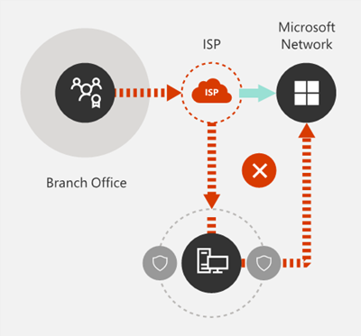

# Office 365 네트워크 연결 원칙

Office 365 네트워크 연결에 대 한 네트워크 계획을 시작 하기 전에 Office 365 트래픽을 안전 하 게 관리 하 고 가능한 최상의 성능을 얻기 위한 연결 원리를 이해 하는 것이 중요 합니다. 이 문서는 Office 365 네트워크 연결을 안전 하 게 최적화 하기 위한 가장 최근 지침을 이해 하는 데 도움이 됩니다.
  
전통적인 엔터프라이즈 네트워크는 기본적으로 사용자에 게 강력한 경계 보안을 통해 운영 되는 회사 데이터 센터에서 호스트 되는 응용 프로그램 및 데이터로의 액세스를 제공 하도록 설계 되었습니다 전통적인 모델에서는 사용자가 회사 네트워크 경계 내부, 지사의 WAN 링크 또는 VPN 연결을 통해 원격으로 응용 프로그램 및 데이터에 액세스 하는 것으로 가정 합니다.
  
Office 365와 같은 SaaS 응용 프로그램을 채택 하면 네트워크 경계 밖의 서비스 및 데이터 조합이 이동 합니다. 최적화를 사용 하지 않고 사용자와 SaaS 응용 프로그램 간의 트래픽은 패킷 검사, 네트워크 헤어핀 방지, 지리적으로 멀리 떨어진 끝점 및 기타 요인에 대 한 실수로의 연결에 의해 도입 된 대기 시간을 따릅니다. 주요 최적화 지침을 이해 하 고 구현 하 여 최상의 Office 365 성능 및 안정성을 확보할 수 있습니다.
  
이 문서에서는 다음에 대해 설명 합니다.
  
- 클라우드로의 고객 연결에 [Office 365 아키텍처](office-365-network-connectivity-principles.md#BKMK_Architecture) 적용
- 네트워크 트래픽 최적화 및 최종 사용자 환경에 대 한 [Office 365 연결 원리](office-365-network-connectivity-principles.md#BKMK_Principles) 및 전략 업데이트
- 네트워크 관리자가 네트워크 최적화에서 사용 하기 위해 구조화 된 끝점 목록을 사용할 수 있도록 하는 [Office 365 Endpoints 웹 서비스](office-365-network-connectivity-principles.md#BKMK_WebSvc)
- [새 Office 365 끝점 범주](office-365-network-connectivity-principles.md#BKMK_Categories) 및 최적화 지침
- [네트워크 경계 보안과 끝점 보안 비교](office-365-network-connectivity-principles.md#BKMK_SecurityComparison)
- Office 365 트래픽에 대 한 [증분 최적화](office-365-network-connectivity-principles.md#BKMK_IncOpt) 옵션
- Office [365 네트워크 온 보 딩 도구](https://aka.ms/netonboard), office 365에 대 한 기본 연결을 테스트 하기 위한 새로운 도구

## Office 365 아키텍처

Office 365은 Exchange Online, SharePoint Online, 비즈니스용 Skype Online 등 다양 한 마이크로 서비스 및 응용 프로그램 집합을 통해 생산성 및 공동 작업 시나리오를 제공 하는 분산 소프트웨어 서비스 (SaaS) 클라우드입니다. 팀, Exchange Online Protection, Office (브라우저의 경우) 및 기타 다양 한 기능 특정 Office 365 응용 프로그램은 고객 네트워크에 적용 되 고 클라우드에 연결 되는 고유한 기능을 가질 수 있으며, 모든 주요 주체, 목표 및 아키텍처 패턴을 공유 합니다. 연결에 대 한 이러한 보안 주체 및 아키텍처 패턴은 대부분의 다른 SaaS 클라우드에서 일반적인 것 이며, Microsoft와 같은 플랫폼 수준의 서비스 및 인프라와 동일한 일반 배포 모델과는 매우 차이가 있습니다. Microsoft.
  
Office 365에서 가장 중요 한 아키텍처 기능 중 하나 (네트워크 기획자가 자주 누락 하거나 잘못 해석 하는 것)는 it가 사용자 연결 방법에 대 한 맥락에서 실제 글로벌 분산 서비스입니다. 대상 Office 365 테 넌 트의 위치는 클라우드 내에서 고객 데이터가 저장 되는 위치를 이해 하는 데 중요 하지만, Office 365 사용자 환경에서는 데이터를 포함 하는 디스크에 직접 연결 하지 않습니다. 성능, 안정성 및 기타 중요 한 품질 특성을 비롯 한 Office 365의 사용자 환경에는 전 세계 수많은 Microsoft 위치에서 확장 된 고도로 분산 서비스 전면 도어를 통한 연결이 포함 됩니다. 대부분의 경우에는 고객 네트워크에서 중앙 위치나 지역의 egress 지점을 통해 Office 365에 연결 하는 대신 사용자 요청을 가장 가까운 Office 365 서비스 진입점으로 라우팅할 수 있도록 하 여 최상의 사용자 환경을 구현 합니다.
  
대부분의 고객에 게는 Office 365 사용자가 여러 위치에 분산 되어 있습니다. 최상의 결과를 얻으려면이 문서에서 설명 하는 원칙을 사용 하 여 지리적이 지 않은 Microsoft 글로벌 네트워크의 가장 가까운 지점에 대 한 연결 최적화에 초점을 맞추어 보기의 수평 확장 시점을 확인 해야 합니다. Office 365 테 넌 트의 위치입니다. 본질적으로 Office 365 테 넌 트 데이터를 특정 지리적 위치에 저장할 수 있지만 해당 테 넌 트에 대 한 Office 365 경험은 배포 된 상태로 유지 되며 테 넌 트에 있는 모든 최종 사용자 위치와 근접 하 게 근접해 있을 수 있음을 의미 합니다. .
  
## Office 365 연결 원리

Microsoft는 최적의 Office 365 연결 및 성능을 달성 하기 위해 다음과 같은 원칙을 권장 합니다. 이러한 Office 365 연결 원칙을 사용 하 여 트래픽을 관리 하 고 Office 365에 연결 하는 경우 최상의 성능을 얻을 수 있습니다.
  
네트워크 설계의 기본 목표는 네트워크의 RTT (왕복 시간)를 Microsoft 글로벌 네트워크로 줄이고 microsoft의 공용 네트워크 백본을 사용 하 여 모든 Microsoft의 데이터 센터를 낮은 대기 시간으로 상호 연결할 수 있도록 하 여 지연을 최소화 하는 것입니다. 그리고 클라우드 응용 프로그램 진입점은 전 세계에 확산 됩니다. Microsoft 글로벌 네트워크에 대 한 자세한 내용은 마이크로소프트에서 [빠르고 안정적인 글로벌 네트워크를 구축 하는 방법을](https://azure.microsoft.com/blog/how-microsoft-builds-its-fast-and-reliable-global-network/)확인할 수 있습니다.
  

### Office 365 트래픽을 식별 하 고 차별화 합니다.

  
Office 365 네트워크 트래픽은 일반 인터넷 바인딩 네트워크 트래픽과의 트래픽을 구별할 수 있는 첫 번째 단계입니다. Office 365 연결을 최적화 하려면 네트워크 경로 최적화, 방화벽 규칙, 브라우저 프록시 설정 및 특정 끝점에 대 한 네트워크 검사 장치 바이패스와 같은 접근 방식을 구현 해야 합니다.
  
이전 Office 365 최적화 지침은 Office 365 끝점을 **필수** 및 **선택적**두 범주로 나눕니다. 새 Office 365 서비스 및 기능을 지원 하기 위해 끝점이 추가 됨에 따라 Office 365 끝점이 **최적화**, **허용** 및 **기본값**의 세 가지 범주로 재구성 되었습니다. 각 범주에 대 한 지침은 범주의 모든 끝점에 적용 되므로 최적화를 보다 쉽게 이해 하 고 구현할 수 있습니다.
  
Office 365 끝점 범주 및 최적화 방법에 대 한 자세한 내용은 [새 Office 365 끝점 범주](office-365-network-connectivity-principles.md#BKMK_Categories) 섹션을 참조 하십시오.
  
이제 Microsoft는 모든 Office 365 끝점을 웹 서비스로 게시 하 고이 데이터를 사용 하는 가장 좋은 방법에 대 한 지침을 제공 합니다. Office 365 끝점을 페치하고 사용 하는 방법에 대 한 자세한 내용은 [office 365 url 및 IP 주소 범위](https://support.office.com/article/office-365-urls-and-ip-address-ranges-8548a211-3fe7-47cb-abb1-355ea5aa88a2?ui=en-US&amp;rs=en-US&amp;ad=US)문서를 참조 하세요.
  

### 네트워크 연결을 로컬로 송신

  
로컬 DNS 및 인터넷 송신은 연결 대기 시간을 줄이고 사용자 연결이 Office 365 서비스에 가장 가까운 항목에 적용 되도록 하는 데 중요 한 중요성을 갖습니다. 복잡 한 네트워크 토폴로지에서 로컬 DNS와 로컬 인터넷 송신을 함께 구현 하는 것이 중요 합니다. Office 365에서 클라이언트 연결을 가장 가까운 항목 지점에 라우팅하는 방법에 대 한 자세한 내용은 [클라이언트 연결](https://support.office.com/article/client-connectivity-4232abcf-4ae5-43aa-bfa1-9a078a99c78b)문서를 참조 하십시오.
  
Office 365와 같은 클라우드 서비스의 출현 이전에는 네트워크 아키텍처의 디자인 요인에 따라 최종 사용자 인터넷 연결이 비교적 단순 했습니다. 인터넷 서비스와 웹 사이트가 전 세계적으로 분산 되 면 회사 송신 지점과 지정 된 모든 대상 끝점 간의 대기 시간은 대부분 지리적 거리의 기능입니다.
  
전통적인 네트워크 아키텍처에서 모든 아웃 바운드 인터넷 연결은 회사 네트워크를 통과 하 고 중앙 위치에서 송신 합니다. Microsoft의 클라우드 서비스가 발전 함에 따라 분산 인터넷 연결 네트워크 아키텍처는 대기 시간에 민감한 클라우드 서비스를 지 원하는 데 중요 한 역할을 하 게 됩니다. Microsoft 글로벌 네트워크는 들어오는 클라우드 서비스 연결을 가장 가까운 진입점으로 라우팅하는 전역 진입점의 동적 패브릭을 분산 서비스 전면 도어 인프라에 대 한 대기 시간 요구 사항을 수용할 수 있도록 설계 되었습니다. 이는 고객과 클라우드 간의 경로를 효과적으로 줄여 Microsoft 클라우드 고객의 "지난 마일"의 길이를 줄이기 위한 것입니다.
  
엔터프라이즈 Wan은 대개 하나 이상의 프록시 서버를 통해 인터넷으로 egress 전에 검사를 위해 중앙 회사 헤드 사무실로 네트워크 트래픽을 전송 하도록 설계 되었습니다. 아래 다이어그램에서는 이러한 네트워크 토폴로지를 보여 줍니다.
  

  
Office 365은 전 세계의 프런트 엔드 서버를 포함 하는 Microsoft 전역 네트워크에서 실행 되므로 사용자 위치에 근접 한 프런트 엔드 서버를 사용 하는 경우가 많습니다. 로컬 인터넷 송신을 제공 하 고 Office 365 끝점에 대해 로컬 이름 확인을 제공 하도록 내부 DNS 서버를 구성 하 여 office 365로 향하는 네트워크 트래픽은 사용자에 게 가까이 있는 Office 365 프런트 엔드 서버에 연결할 수 있습니다. 아래 다이어그램에서는 본사, 지사 및 원격 위치에서 연결 하는 사용자가 가장 가까운 Office 365 진입점에 대해 가장 짧은 경로를 팔 로우 하는 데 사용할 수 있는 네트워크 토폴로지의 예를 보여 줍니다.
  

  
네트워크 경로를 사용 하 여 Office 365 진입점을 이러한 방식으로 줄이면 Office 365의 연결 성능 및 최종 사용자 환경이 개선 될 수 있으며, 향후 변경 사항이 Office 365 성능에 미치는 영향을 줄이고 향상.
  
또한 응답 하는 DNS 서버가 멀리 있거나 사용량이 많은 경우 DNS 요청이 대기 시간을 포함할 수 있습니다. 로컬 DNS 서버를 분기 위치에 프로 비전 하 고 DNS 레코드를 적절 하 게 캐시 하도록 구성 하 여 이름 확인 대기 시간을 최소화할 수 있습니다.
  
지역 송신은 Office 365에서 정상적으로 작동할 수 있는 반면 최적의 연결 모델은 회사 네트워크에 있든, 홈, 호텔, 커피숍 등의 원격 위치에 관계 없이 항상 사용자 위치에 네트워크 egress를 제공 하는 것입니다. 공항. 이 로컬 직접 egress 모델은 아래 다이어그램에 표시 됩니다.
  

  
Office 365을 채택한 기업에서는 Office 365에 대 한 사용자 연결에서 가장 가까운 Microsoft 글로벌 네트워크 항목으로의 가능한 가장 짧은 경로를 사용 하도록 하 여 Microsoft 글로벌 네트워크의 분산 서비스 전면 도어 아키텍처를 활용할 수 있습니다. 조절점. 로컬 egress 네트워크 아키텍처는 사용자 위치에 관계 없이 Office 365 트래픽을 가장 가까운 송신을 통해 라우팅할 수 있도록 하 여이를 수행 합니다.
  
기존 모델에 비해 로컬 egress 아키텍처에는 다음과 같은 이점이 있습니다.
  
- 경로 길이를 최적화 하 여 최적의 Office 365 성능을 제공 합니다. 최종 사용자 연결은 분산 서비스 전면 도어 인프라에 의해 가장 가까운 Office 365 진입점으로 동적 라우팅됩니다.
- 로컬 송신을 허용 하 여 회사 네트워크 인프라에 대 한 부하를 줄입니다.
- 클라이언트 끝점 보안 및 클라우드 보안 기능을 활용 하 여 양쪽 끝에서 연결의 보안을 설정 합니다.

### 네트워크 헤어핀 방지

  
일반적으로 사용자와 가장 가까운 Office 365 끝점 간의 가장 짧은 바로 경로를 사용 하는 것이 최적의 성능을 제공 합니다. 특정 대상에 바인딩된 WAN 또는 VPN 트래픽이 처음으로 다른 중간 위치 (예: 보안 스택, 클라우드 액세스 브로커, 클라우드 기반 웹 게이트웨이)로 전송 되는 경우에는 대기 시간 및 잠재적인 리디렉션을 도입 하는 헤어핀 지리적으로 멀리 떨어진 끝점 네트워크 헤어핀 방지 라우팅/피어 링 비효율성 또는 최적 (원격) DNS 조회로 인해 발생할 수도 있습니다.
  
로컬 송신 케이스 에서도 Office 365 연결이 네트워크 헤어핀 방지 되지 않도록 하려면 사용자 위치에 인터넷 송신을 제공 하는 데 사용 되는 ISP에 Microsoft 글로벌 네트워크와의 직접 피어 링 관계가 있는지 여부를 확인 합니다. 해당 위치와 근접 합니다. 인터넷 바운드 트래픽을 처리 하는 타사 클라우드 또는 클라우드 기반 네트워크 보안 공급 업체를 통해 프록시 또는 터널링과 반대로, 신뢰할 수 있는 Office 365 트래픽을 직접 보내도록 송신 라우팅을 구성할 수도 있습니다. 로컬 DNS 이름 확인-Office 365 끝점의 경우 직접 라우팅 외에도 사용자 연결에 가장 가까운 Office 365 진입점이 사용 되도록 하는 데 도움이 됩니다.
  
Office 365 트래픽에 대해 클라우드 기반 네트워크 또는 보안 서비스를 사용 하는 경우 헤어핀 효과가 평가 되 고 Office 365 성능에 대 한 영향을 이해 하 고 있어야 합니다. 이 작업은 트래픽을 조직의 수 및 Microsoft 전역 네트워크 피어 링 지점과 관계에 따라 전달 되는 서비스 공급자 위치의 수와 위치를 확인 하 여 수행할 수 있으며, 네트워크 피어 링 관계의 품질은 다음과 같습니다. ISP 및 Microsoft와 서비스 공급자 및 서비스 공급자 인프라의 백홀이 성능에 미치는 영향
  
Office 365 진입점과 최종 사용자에 게 근접 한 분산 위치를 사용 하 여 Office 365 트래픽을 타사 네트워크 또는 보안 공급자에 게 라우팅하는 경우 공급자 네트워크가 Office 365 연결에 부정적인 영향을 줄 수 있습니다. 최적의 Office 365 피어 링에 맞게 구성 됩니다.
  

### 우회 프록시, 트래픽 검사 장치 및 중복 되는 보안 기술 평가

  
기업 고객은 네트워크 보안 및 위험 감소 방법 특히 Office 365 바운드 트래픽을 검토 하 고 Office 365 보안 기능을 사용 하 여 간섭, 성능에 영향을 주는 네트워크 보안에 대 한 의존도를 줄입니다. Office 365 네트워크 트래픽에 대 한 기술
  
대부분의 엔터프라이즈 네트워크에서는 프록시, SSL 검사, 패킷 검사 및 데이터 손실 방지 시스템과 같은 기술을 사용 하 여 인터넷 트래픽에 대해 네트워크 보안을 적용 합니다. 이러한 기술은 일반 인터넷 요청에 대 한 중요 한 위험 완화를 제공 하지만 Office 365 끝점에 적용 될 때의 성능, 확장성 및 최종 사용자 환경의 품질을 대폭 떨어뜨릴 수 있습니다.
  

#### Office 365 끝점 웹 서비스

Office 365 관리자는 스크립트나 REST 호출을 사용 하 여 Office 365 끝점 웹 서비스에서 구조화 된 끝점 목록을 소비 하 고 경계 방화벽 및 기타 네트워크 장치의 구성을 업데이트할 수 있습니다. 이렇게 하면 Office 365에 대 한 트래픽 바운드가 식별 되며, 적절 하 게 처리 되 고, 일반적이 고 알려지지 않은 인터넷 웹 사이트에 바인딩된 네트워크 트래픽과 다르게 관리 됩니다. Office 365 Endpoints 웹 서비스를 사용 하는 방법에 대 한 자세한 내용은 [office 365 url 및 IP 주소 범위](https://support.office.com/article/office-365-urls-and-ip-address-ranges-8548a211-3fe7-47cb-abb1-355ea5aa88a2?ui=en-US&amp;rs=en-US&amp;ad=US)문서를 참조 하십시오.
  
#### PAC (프록시 자동 구성) 스크립트

Office 365 관리자는 WPAD 또는 GPO를 통해 사용자 컴퓨터로 배달 될 수 있는 PAC (프록시 자동 구성) 스크립트를 만들 수 있습니다. PAC 스크립트를 사용 하 여 WAN 또는 VPN 사용자의 Office 365 요청에 대 한 프록시를 우회 하 여 Office 365 트래픽이 회사 네트워크를 통과 하지 않고 직접 인터넷 연결을 사용 하도록 할 수 있습니다.
  
#### Office 365 보안 기능

Microsoft는 데이터 센터 보안, 운영 보안 및 위험 감소와 함께 Office 365 서버 및 해당 서버가 나타내는 네트워크 끝점에 대 한 정보를 명확 하 게 살펴봅니다. Office 365 기본 제공 되는 보안 기능을 사용 하 여 데이터 손실 방지, 바이러스 백신, 다단계 인증, 고객 잠금 상자, Advanced Threat Protection, Office 365 위협 인텔리전스, office 365 보안 등의 네트워크 보안 위험을 줄일 수 있습니다. 점수, Exchange Online Protection 및 네트워크 DDOS 보안
  
Microsoft 데이터 센터 및 글로벌 네트워크 보안에 대 한 자세한 내용은 [Microsoft 보안 센터](https://www.microsoft.com/trustcenter/security)를 참조 하세요.
  
## 새 Office 365 끝점 범주

Office 365 끝점은 다양 한 네트워크 주소 및 서브넷 집합을 나타냅니다. 끝점은 Url, IP 주소 또는 IP 범위 일 수 있으며 일부 끝점은 특정 TCP/UDP 포트와 함께 나열 됩니다. Url은 *account.office.net* 같은 FQDN 이거나 * \*office365.com*와 같은 와일드 카드 url 일 수 있습니다.
  
> [!NOTE]
> 네트워크 내의 Office 365 끝점 위치는 Office 365 테 넌 트 데이터의 위치와 직접 연결 되지 않습니다. 따라서 고객은 Office 365에서 분산 및 글로벌 서비스로 확인 해야 하며 지역 기준에 따라 Office 365 끝점에 대 한 네트워크 연결을 차단 해서는 안 됩니다.
  
이전에 Office 365 트래픽을 관리 하기 위한 지침에서 끝점은 **필수** 및 **선택**항목 두 범주로 구성 되었습니다. 각 범주 내의 끝점은 서비스의 중요도에 따라 각각 다른 최적화를 필요로 하며, 대부분의 고객은 동일한 네트워크 최적화 응용 프로그램을 Office 365 Url 및 IP 주소의 전체 목록에 정당화 하기 위해 직면 하 게 됩니다.
  
새 모델에서는 끝점이 최적의 성능을 개선 하 고 투자를 실현할 수 있도록 네트워크 최적화 작업에 집중할 수 있도록 **최적화**, **허용** 및 **기본값으로**세 범주로 분리 됩니다. 끝점은 실제 사용자 환경의 네트워크 품질, 볼륨 및 성능 봉투, 구현 용이성에 따라 위의 범주에서 통합 됩니다. 권장 최적화는 지정 된 범주의 모든 끝점에 동일한 방식으로 적용할 수 있습니다.
  
- 끝점 **최적화** 는 모든 office 365 서비스에 연결 하는 데 필요 하며 75% over office 365 대역폭, 연결 및 데이터 볼륨을 나타냅니다. 이러한 끝점은 네트워크 성능, 대기 시간 및 가용성에 가장 중요 한 Office 365 시나리오를 나타냅니다. 모든 끝점이 Microsoft 데이터 센터에서 호스팅됩니다. 이 범주에서 끝점에 대 한 변경 속도는 다른 두 범주의 끝점에 비해 훨씬 낮을 것으로 예상 됩니다. 이 범주에는 키 Url 및 Exchange Online, SharePoint Online, 비즈니스용 Skype Online 및 Microsoft 팀과 같은 핵심 Office 365 작업에 전용으로 정의 된 IP 서브넷 집합을 아주 작게 (~ 10 개) 포함 합니다.

    적절 하 게 정의 된 중요 끝점의 압축 목록에서는 이러한 대상에 대 한 높은 가치 네트워크 최적화를 보다 빠르고 쉽게 계획 하 고 구현 하는 데 도움이 됩니다.

    끝점 *https://outlook.office365.com* *최적화* 의 예로는 sharepoint.com 및 *\<https://테 넌 트\>-my.sharepoint.com* 등의 https:// *\<있습니다.\>*

    최적화 방법에는 다음이 포함 됩니다.

  - 우회 또는 허용 목록 트래픽을 차단, SSL 암호 해독, 딥 패킷 검사 및 콘텐츠 필터링을 수행 하는 네트워크 장치 및 서비스에서 끝점을 *최적화* 합니다.
  - 일반 인터넷 브라우징에 일반적으로 사용 되는 온-프레미스 프록시 장치 및 클라우드 기반 프록시 서비스 바이패스
  - 네트워크 인프라 및 경계 시스템에서 해당 끝점의 평가를 완전히 신뢰 하는 것으로 우선 순위를 지정 합니다.
  - WAN 백홀이의 우선 순위를 지정 하 고, 가능한 경우 사용자/분기 위치에 근접 하 게 이러한 끝점에 대 한 인터넷 기반 egress를 직접 배포 합니다.
  - 분할 터널링을 구현 하 여 VPN 사용자에 게 이러한 클라우드 끝점에 대 한 직접 연결을 용이 하 게 합니다.
  - DNS 이름 확인에서 반환 된 IP 주소가 이러한 끝점에 대 한 라우팅 송신 경로와 일치 하는지 확인 합니다.
  - Microsoft 글로벌 네트워크의 가장 가까운 인터넷 피어 링 지점으로의 직접 SD-WAN 통합을 위해 이러한 끝점의 우선 순위를 지정 합니다.

- **허용** 끝점은 특정 Office 365 서비스 및 기능에 연결 하는 데 필요 하지만 *최적화* 범주에 있는 것 처럼 네트워크 성능 및 대기 시간에는 중요 하지 않습니다. 대역폭 및 연결 수 측면에서 이러한 끝점의 전반적인 네트워크 공간 역시 상당히 작습니다. 이러한 끝점은 Office 365 전용 이며 Microsoft 데이터 센터에서 호스팅됩니다. 이러한 사용자는 광범위 한 Office 365 마이크로 서비스와 해당 종속성 (~ 100 Url 순)을 나타내고 *최적화* 범주에 비해 속도가 더 높은 비율로 변경 될 것으로 예상 됩니다. 이 범주의 모든 끝점이 정의 된 전용 IP 서브넷에 연결 되어 있는 것은 아닙니다.

    *허용* 끝점에 대 한 네트워크 최적화는 Office 365 사용자 환경을 향상 시킬 수 있지만, 일부 고객은 이러한 최적화 범위를 더 좁은 방법으로 선택 하 여 네트워크 변경을 최소화할 수 있습니다.

    *허용* 끝점의 예에 *는\*https://. protection.outlook.com* 및 *https://accounts.accesscontrol.windows.net*가 포함 됩니다.

    최적화 방법에는 다음이 포함 됩니다.

  - 우회 또는 허용 목록 트래픽을 차단, SSL 암호 해독, 심층 패킷 검사 및 콘텐츠 필터링을 수행 하는 네트워크 장치 및 서비스의 끝점을 *허용* 합니다.
  - 네트워크 인프라 및 경계 시스템에서 해당 끝점의 평가를 완전히 신뢰 하는 것으로 우선 순위를 지정 합니다.
  - WAN 백홀이의 우선 순위를 지정 하 고, 가능한 경우 사용자/분기 위치에 근접 하 게 이러한 끝점에 대 한 인터넷 기반 egress를 직접 배포 합니다.
  - DNS 이름 확인에서 반환 된 IP 주소가 이러한 끝점에 대 한 라우팅 송신 경로와 일치 하는지 확인 합니다.
  - Microsoft 글로벌 네트워크의 가장 가까운 인터넷 피어 링 지점으로의 직접 SD-WAN 통합을 위해 이러한 끝점의 우선 순위를 지정 합니다.

- **기본** 종점은 최적화가 필요 하지 않은 Office 365 서비스 및 종속성을 나타내며, 고객 네트워크에서 일반 인터넷 바운드 트래픽으로 취급할 수 있습니다. 이 범주의 일부 끝점은 Microsoft 데이터 센터에서 호스팅되지 않을 수 있습니다. 예 *https://odc.officeapps.live.com* 를 들면 *https://appexsin.stb.s-msn.com*and입니다.

Office 365 네트워크 최적화 기술에 대 한 자세한 내용은 [office 365 끝점 관리](https://support.office.com/article/managing-office-365-endpoints-99cab9d4-ef59-4207-9f2b-3728eb46bf9a#ID0EAEAAA=0._Overview)문서를 참조 하십시오.
  
## 네트워크 경계 보안과 끝점 보안 비교

전통적인 네트워크 보안의 목표는 침입 및 악의적인 악용을 방지 하기 위해 회사 네트워크 경계를 강화 하는 것입니다. 조직에서 Office 365을 채택 하는 동안 일부 네트워크 서비스 및 데이터는 부분적으로 또는 클라우드로 완전히 마이그레이션됩니다. 네트워크 아키텍처를 근본적으로 변경 하는 경우에도이 프로세스를 수행 하려면 다음과 같은 새로운 요인을 고려 하 여 네트워크 보안을 재확인 해야 합니다.
  
- 클라우드 서비스가 도입 됨에 따라 네트워크 서비스와 데이터는 온-프레미스 데이터 센터와 클라우드 사이에 분산 되 고 경계 보안은 더 이상 자체 적합 하지 않습니다.
- 원격 사용자는 온-프레미스 데이터 센터 및 주택, 호텔, 커피숍 등의 미제어 위치에 있는 클라우드에서 회사 리소스에 연결 합니다.
- 용도에 기반을 구축한 보안 기능은 클라우드 서비스에 점차 기본적으로 제공 되며 기존 보안 시스템을 보완 하거나 대체할 수 있습니다.

Microsoft는 광범위 한 Office 365 보안 기능을 제공 하며, Office 365의 데이터 및 네트워크 보안을 보장 하는 데 도움이 되는 보안 모범 사례를 도입 하는 지침을 제공 합니다. 권장 되는 모범 사례는 다음과 같습니다.
  
- **MFA (multi-factor authentication) 사용** MFA는 사용자가 자신의 암호를 올바르게 입력 한 후 전화 통화, 문자 메시지 또는 스마트 전화에서 앱 알림을 승인 하도록 요구 하 여 강력한 암호 전략에 추가 보호 계층을 추가 합니다.

- **Microsoft Cloud App Security 사용** 비정상적인 작업을 추적 하 고 작동 하도록 정책을 설정 합니다. 관리자가 많은 양의 데이터를 다운로드 하거나, 로그인을 여러 번 수행 하거나, 알 수 없는 또는 위험한 IP 주소에서 연결 하는 것과 같은 비정상적 이거나 위험한 사용자 활동을 검토 하도록 Microsoft Cloud App Security를 사용 하 여 알림을 설정 합니다.

- **DLP (데이터 손실 방지) 구성** DLP를 사용 하면 중요 한 데이터를 식별 하 고 사용자가 실수로 또는 의도적으로 데이터를 공유 하지 못하게 하는 정책을 만들 수 있습니다. DLP는 Exchange Online, SharePoint Online 및 OneDrive를 포함 하는 Office 365에서 작동 하 여 사용자가 워크플로를 중단 하지 않고 준수 상태를 유지할 수 있도록 합니다.

- **고객 Lockbox 사용** Office 365 관리자는 고객 Lockbox를 사용 하 여 Microsoft 기술 지원 엔지니어가 도움말 세션 중에 데이터에 액세스 하는 방법을 제어할 수 있습니다. 엔지니어가 문제를 해결하기 위해 사용자 데이터에 대한 액세스 권한을 요구하는 경우 Customer Lockbox를 사용하여 액세스 요청을 승인하거나 거부할 수 있습니다.

- **Office 365 보안 점수 사용** 보안 점수는 위험을 더 완화 하기 위해 수행할 수 있는 작업을 권장 하는 보안 분석 도구입니다. 보안 점수가 Office 365 설정 및 활동을 살펴보고 Microsoft에서 설정한 기준과 비교 합니다. 최선의 보안 관례에 따라 정렬 된 방식을 기준으로 점수를 얻게 됩니다.

보안 강화를 위한 전체적 방법에는 다음 사항이 포함 되어야 합니다.
  
- 클라우드 기반 및 Office 클라이언트 보안 기능을 적용 하 여 경계 보안에서 끝점 보안으로 강조 합니다.
  - 데이터 센터에 대 한 보안 경계 축소
  - Office 또는 원격 위치 내의 사용자 장치에 대해 동등한 트러스트 사용
  - 데이터 위치 및 사용자 위치의 보안 유지에 중점을 둔 경우
  - 관리 되는 사용자 컴퓨터의 신뢰 수준 (끝점 보안)
- 경계에만 집중 하지 않고 모든 정보 보안 holistically 관리
  - 신뢰할 수 있는 트래픽이 보안 장치를 우회 하 고 관리 되지 않는 장치를 게스트 Wi-fi 네트워크로 분리 하도록 하 여 경계 네트워크 보안을 다시 정의할 수 있습니다.
  - 회사 WAN에 지에 대 한 네트워크 보안 요구 사항을 줄입니다.
  - 방화벽 등의 일부 네트워크 경계 보안 장치도 여전히 필요 하지만 부하가 감소 함
  - 로컬 송신에서 Office 365 트래픽을 보증 합니다.
- 향상 된 기능은 [증분 최적화](office-365-network-connectivity-principles.md#BKMK_IncOpt) 섹션의 설명에 따라 점진적으로 처리할 수 있습니다. 일부 최적화 기술은 네트워크 아키텍처에 따라 보다 나은 비용/이익 비율을 제공할 수 있으며, 조직에 가장 적합 한 최적화를 선택 해야 합니다.

Office 365 보안 및 규정 준수에 대 한 자세한 내용은 [office 365의 보안 및 준수 개요](https://support.office.com/article/overview-of-security-and-compliance-in-office-365-dcb83b2c-ac66-4ced-925d-50eb9698a0b2?ui=en-US&amp;rs=en-US&amp;ad=US)문서를 참조 하세요.
  
## 증분 최적화

이 문서 앞부분에서 SaaS에 대 한 이상적인 네트워크 연결 모델을 나타내지만 복잡 한 네트워크 아키텍처를 포함 하는 많은 대규모 조직에서는 이러한 변경을 직접 수행 하는 것이 실용적이 지 않습니다. 이 섹션에서는 Office 365 성능 및 안정성을 개선 하는 데 도움이 되는 다양 한 증분 변경 사항에 대해 설명 합니다.
  
Office 365 트래픽을 최적화 하는 데 사용할 방법은 네트워크 토폴로지와 구현 된 네트워크 장치에 따라 달라 집니다. 여러 위치 및 복잡 한 네트워크 보안 관행을 가진 대규모 기업에서는 [Office 365 연결 원리](office-365-network-connectivity-principles.md#BKMK_Principles) 섹션에 나열 된 원칙을 대부분 또는 모두 포함 하는 전략을 개발 해야 하지만 소규모 조직에서는 하나 또는 두 개만 고려해 야 할 수 있습니다.
  
각 메서드를 연속 해 서 적용 하 여 증분 프로세스로 최적화를 효과적으로 적용할 수 있습니다. 다음 표에는 가장 많은 사용자 수에 대 한 대기 시간 및 안정성에 대 한 영향을 순서 대로 보여 주는 주요 최적화 방법이 나와 있습니다.
  
|**최적화 방법**|**설명**|**영향**|
|:-----|:-----|:-----|
|로컬 DNS 확인 및 인터넷 송신    |각 위치에서 로컬 DNS 서버를 프로 비전 하 고 사용자 위치에 최대한 근접 하 게 인터넷으로 Office 365 연결을 egress 확인 합니다.    | 대기 시간 최소화     가장 가까운 Office 365 진입점에 대 한 신뢰할 수 있는 연결 개선    |
|지역 송신 지점 추가    |회사 네트워크에 여러 개의 위치가 있지만 하나의 egress 지점만 있으면 사용자가 가까운 Office 365 진입점에 연결할 수 있도록 지역 송신 지점을 추가 합니다.    | 대기 시간 최소화     가장 가까운 Office 365 진입점에 대 한 신뢰할 수 있는 연결 개선    |
|우회 프록시 및 검사 장치    |Office 365 요청을 egress 지점에 직접 전송 하는 PAC 파일을 사용 하 여 브라우저를 구성 합니다.    검사 없이 Office 365 트래픽을 허용 하도록에 지 라우터와 방화벽을 구성 합니다.    | 대기 시간 최소화     네트워크 장치에 대 한 부하 감소    |
|VPN 사용자에 대해 직접 연결 사용    |VPN 사용자의 경우에는 분할 터널링을 구현 하 여 Office 365 연결이 VPN 터널을 통하지 않고 사용자 네트워크에서 직접 연결 하도록 설정 합니다.    | 대기 시간 최소화     가장 가까운 Office 365 진입점에 대 한 신뢰할 수 있는 연결 개선    |
|기존 WAN에서 SD-WAN으로 마이그레이션    |SD-Wan (소프트웨어 정의 광역 네트워크)에서는 Vm (가상 컴퓨터)을 사용 하 여 계산 리소스를 가상화 하는 것과 비슷한 방식으로 기존 WAN 라우터를 가상 기기로 교체 하 여 WAN 관리를 단순화 하 고 성능을 향상 시킵니다.    | WAN 트래픽의 성능 및 관리 효율성 개선     네트워크 장치에 대 한 부하 감소    |

## 관련 항목

[Office 365 네트워크 연결 개요](office-365-networking-overview.md)

[Office 365 끝점 관리](managing-office-365-endpoints.md)

[Office 365 URL 및 IP 주소 범위](urls-and-ip-address-ranges.md)

[Office 365 IP 주소 및 URL 웹 서비스](office-365-ip-web-service.md)

[Office 365 네트워크 연결 평가](assessing-network-connectivity.md) 

[Office 365 네트워크 및 성능 조정](network-planning-and-performance.md)

[Office 365 네트워크 연결 평가](assessing-network-connectivity.md) 

[초기 계획 및 성능 기록을 사용하여 Office 365 성능 조정](performance-tuning-using-baselines-and-history.md)

[Office 365 성능 문제 해결 계획](performance-troubleshooting-plan.md)

[콘텐츠 배달 네트워크](content-delivery-networks.md)

[Office 365 네트워크 온 보 딩 도구](https://aka.ms/netonboard)

[Microsoft가 빠르고 안정적인 글로벌 네트워크를 구축 하는 방법](https://azure.microsoft.com/blog/how-microsoft-builds-its-fast-and-reliable-global-network/)

[Office 365 네트워킹 블로그](https://techcommunity.microsoft.com/t5/Office-365-Networking/bd-p/Office365Networking)
