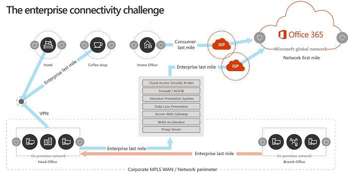

# Microsoft 365 네트워크 연결 원칙Microsoft 365 Network Connectivity Principles

*이 문서는 Microsoft 365 Enterprise와 Office 365 Enterprise에 모두 적용됩니다.**This article applies to both Microsoft 365 Enterprise and Office 365 Enterprise.*

Microsoft 365 네트워크 연결에 대한 네트워크 계획을 시작하기 전에 먼저 Microsoft 365 트래픽을 안전하게 관리하고 최상의 성능을 얻을 수 있는 연결 원칙을 이해하는 것이 중요합니다.Before you begin planning your network for Microsoft 365 network connectivity, it is important to understand the connectivity principles for securely managing Microsoft 365 traffic and getting the best possible performance. 이 문서는 Microsoft 365 네트워크 연결을 안전하게 최적화하기 위한 최신 가이드를 이해하는 데 도움이 됩니다.This article will help you understand the most recent guidance for securely optimizing Microsoft 365 network connectivity.
  
기존의 엔터프라이즈 네트워크는 주로 강력한 경계 보안으로 사용자에게 회사 운영 데이터 센터에서 호스팅되는 응용 프로그램 및 데이터에 액세스를 제공하도록 설계되었습니다.Traditional enterprise networks are designed primarily to provide users access to applications and data hosted in company operated datacenters with strong perimeter security. 기존 모델은 사용자가 회사 네트워크 경계 내부, 지사의 WAN 링크 또는 VPN 연결을 통해 응용 프로그램 및 데이터에 액세스하는 것으로 가정합니다.The traditional model assumes that users will access applications and data from inside the corporate network perimeter, over WAN links from branch offices, or remotely over VPN connections.
  
Microsoft 365와 같은 SaaS 응용 프로그램을 채택하면 일부 서비스와 데이터의 조합이 네트워크 경계 외부로 이동합니다.Adoption of SaaS applications like Microsoft 365 moves some combination of services and data outside the network perimeter. 최적화를 하지 않으면 사용자와 SaaS 응용 프로그램 간의 트래픽에는 패킷 검사, 네트워크 헤어핀, 지리적으로 먼 엔드포인트에 의도하지 않은 연결 및 기타 요인으로 생긴 대기 시간이 발생합니다.Without optimization, traffic between users and SaaS applications is subject to latency introduced by packet inspection, network hairpins, inadvertent connections to geographically distant endpoints and other factors. 주요 최적화 지침을 이해하고 구현하면 최상의 Microsoft 365 성능과 안정성을 보장할 수 있습니다.You can ensure the best Microsoft 365 performance and reliability by understanding and implementing key optimization guidelines.
  
이 문서에서는 다음에 대해 설명합니다.In this article, you will learn about:
  
- 클라우드에 대한 고객 연결에 적용되는 [Microsoft 365 아키텍처](office-365-network-connectivity-principles.md#BKMK_Architecture)[Microsoft 365 architecture](office-365-network-connectivity-principles.md#BKMK_Architecture) as it applies to customer connectivity to the cloud
- 업데이트된 [Microsoft 365 connectivity 원칙](office-365-network-connectivity-principles.md#BKMK_Principles)과 네트워크 트래픽과 최종 사용자 환경을 최적화하기 위한 전략Updated [Microsoft 365 connectivity principles](office-365-network-connectivity-principles.md#BKMK_Principles) and strategies for optimizing network traffic and the end-user experience
- 네트워크 관리자가 네트워크 최적화에 사용하기 위해 구조화된 엔드포인트 목록을 사용할 수 있도록 하는 [Office 365 엔드포인트 웹 서비스](office-365-network-connectivity-principles.md#BKMK_WebSvc)The [Office 365 Endpoints web service](office-365-network-connectivity-principles.md#BKMK_WebSvc), which allows network administrators to consume a structured list of endpoints for use in network optimization
- [새 Office 365 엔드포인트 범주](office-365-network-connectivity-principles.md#BKMK_Categories) 및 최적화 지침[New Office 365 endpoint categories](office-365-network-connectivity-principles.md#BKMK_Categories) and optimization guidance
- [엔드포인트 보안과 네트워크 경계 보안 비교Comparing network perimeter security with endpoint security](office-365-network-connectivity-principles.md#BKMK_SecurityComparison)
- Microsoft 365 트래픽에 대한 [증분 최적화](office-365-network-connectivity-principles.md#BKMK_IncOpt) 옵션[Incremental optimization](office-365-network-connectivity-principles.md#BKMK_IncOpt) options for Microsoft 365 traffic
- Microsoft 365에 대한 기본 연결을 테스트하기 위한 새로운 도구인 [Microsoft 365 연결 테스트](https://aka.ms/netonboard)The [Microsoft 365 connectivity test](https://aka.ms/netonboard), a new tool for testing basic connectivity to Microsoft 365

## Microsoft 365 아키텍처Microsoft 365 architecture

Microsoft 365는 Exchange Online, SharePoint Online, 비즈니스용 Skype Online, Microsoft Teams, Exchange Online Protection, 브라우저의 Office 등 다양한 마이크로 서비스와 응용 프로그램을 통해 생산성 및 협업 시나리오를 제공하는 분산 SaaS(Software-as-a-Service) 클라우드입니다.Microsoft 365 is a distributed Software-as-a-Service (SaaS) cloud that provides productivity and collaboration scenarios through a diverse set of micro-services and applications, such as Exchange Online, SharePoint Online, Skype for Business Online, Microsoft Teams, Exchange Online Protection, Office in a browser, and many others. 특정 Microsoft 365 응용 프로그램에는 고객 네트워크와 클라우드에 대한 연결에 적용되는 고유한 기능이 있을 수 있지만, 해당 응용 프로그램은 모두 몇 가지 주요 원칙, 목표 및 아키텍처 패턴을 공유합니다.While specific Microsoft 365 applications may have their unique features as it applies to customer network and connectivity to the cloud, they all share some key principals, goals, and architecture patterns. 연결에 대한 이러한 원칙과 아키텍처 패턴은 다른 여러 SaaS 클라우드의 경우에 일반적이며, 동시에 Microsoft Azure와 같은 Platform-as-a-Service 및 Infrastructure-as-a-Service 클라우드의 일반적인 배포 모델과는 다릅니다.These principles and architecture patterns for connectivity are typical for many other SaaS clouds and at the same time being different from the typical deployment models of Platform-as-a-Service and Infrastructure-as-a-Service clouds, such as Microsoft Azure.
  
Microsoft 365의 주요 아키텍처 기능 중 하나(종종 네트워크 설계자가 누락하거나 잘못 해석하는)는 사용자가 연결하는 방식의 맥락에서 진정한 글로벌 분산 서비스라는 것입니다.One of the most significant architectural features of Microsoft 365 (that is often missed or misinterpreted by network architects) is that it is a truly global distributed service, in the context of how users connect to it. 대상 Microsoft 365 테넌트의 위치는 클라우드에 있는 고객 데이터가 저장되는 위치를 파악하는 데 중요하지만, Microsoft 365에 대한 사용자 환경에는 데이터가 있는 디스크에 직접 연결하는 것이 포함되지 않습니다.The location of the target Microsoft 365 tenant is important to understand the locality of where customer data is stored within the cloud, but the user experience with Microsoft 365 doesn't involve connecting directly to disks containing the data. Microsoft 365(성능, 안정성 및 기타 중요한 품질 특성 포함)에 대한 사용자 환경에는 전 세계 많은 Microsoft 위치에서 확장된 고도로 분산된 서비스 Front Door를 통한 연결이 포함됩니다.The user experience with Microsoft 365 (including performance, reliability, and other important quality characteristics) involves connectivity through highly distributed service front doors that are scaled out across hundreds of Microsoft locations worldwide. 대부분의 경우 고객 네트워크에서 중앙 위치나 지역의 송신 지점을 통해 Microsoft 365에 연결하지 않고 사용자 요청을 가장 가까운 Microsoft 365 서비스 진입점으로 라우팅할 수 있도록 함으로써 최상의 사용자 환경을 제공할 수 있습니다.In the majority of cases, the best user experience is achieved by allowing the customer network to route user requests to the closest Microsoft 365 service entry point, rather than connecting to Microsoft 365 through an egress point in a central location or region.
  
대부분의 고객의 경우 Microsoft 365 사용자는 여러 위치에 분산되어 있습니다.For most customers, Microsoft 365 users are distributed across many locations. 최상의 결과를 얻으려면 이 문서에서 설명하는 원칙을 Microsoft 365 테넌트의 지리적 위치가 아닌 Microsoft 글로벌 네트워크에서 가장 가까운 지점에 대한 연결을 최적화하는 데 중점을 두면서 수평 확장(수직 확장이 아닌)으로 봐야 합니다.To achieve the best results, the principles outlined in this document should be looked at from the scale-out (not scale-up) point of view, focusing on optimizing connectivity to the nearest point of presence in the Microsoft Global Network, not to the geographic location of the Microsoft 365 tenant. 본질적으로 이는 Microsoft 365 테넌트 데이터가 특정 지리적 위치에 저장되어 있더라도 해당 테넌트에 대한 Microsoft 365 환경은 계속 분산된 상태로 유지되며 테넌트에 있는 모든 최종 사용자 위치와 아주 근접한 (네트워크) 위치에 존재할 수 있다는 것을 의미합니다.In essence, this means that even though Microsoft 365 tenant data may be stored in a specific geographic location, Microsoft 365 experience for that tenant remains distributed, and can be present in very close (network) proximity to every end-user location that the tenant has.
  
## Microsoft 365 연결 원칙Microsoft 365 connectivity principles

Microsoft는 최적의 Microsoft 365 연결과 성능을 실현하기 위해 다음 원칙을 권장합니다.Microsoft recommends the following principles to achieve optimal Microsoft 365 connectivity and performance. 이 Microsoft 365 연결 원칙을 사용하여 트래픽을 관리하고 Microsoft 365에 연결할 때 최상의 성능을 얻을 수 있습니다.Use these Microsoft 365 connectivity principles to manage your traffic and get the best performance when connecting to Microsoft 365.
  
네트워크 설계의 주요 목표는 대기 시간이 짧은 마이크로소프트의 모든 데이터 센터와 전 세계에 퍼져 있는 클라우드 응용 프로그램 진입점을 상호 연결하는 Microsoft의 공개 네트워크 백본인 Microsoft 글로벌 네트워크로 네트워크의 왕복 시간(RTT)을 줄여 대기 시간을 최소화하는 것이어야 합니다.The primary goal in the network design should be to minimize latency by reducing the round-trip time (RTT) from your network into the Microsoft Global Network, Microsoft's public network backbone that interconnects all of Microsoft's datacenters with low latency and cloud application entry points spread around the world. [Microsoft가 빠르고 안정적인 글로벌 네트워크를 구축하는 방법](https://azure.microsoft.com/blog/how-microsoft-builds-its-fast-and-reliable-global-network/)에서 Microsoft 글로벌 네트워크에 대해 자세히 알아볼 수 있습니다.You can learn more about the Microsoft Global Network at [How Microsoft builds its fast and reliable global network](https://azure.microsoft.com/blog/how-microsoft-builds-its-fast-and-reliable-global-network/).
  

### Microsoft 365 트래픽 식별 및 차별화하기Identify and differentiate Microsoft 365 traffic

  
Microsoft 365 네트워크 트래픽을 식별하는 것이 일반적인 인터넷 바운드 네트워크 트래픽을 구분할 수 있는 첫 번째 단계입니다.Identifying Microsoft 365 network traffic is the first step in being able to differentiate that traffic from generic Internet-bound network traffic. Microsoft 365 연결은 네트워크 경로 최적화, 방화벽 규칙, 브라우저 프록시 설정 및 특정 엔드포인트에 대한 네트워크 검사 장치를 우회하여 최적화할 수 있습니다.Microsoft 365 connectivity can be optimized by implementing a combination of approaches like network route optimization, firewall rules, browser proxy settings, and bypass of network inspection devices for certain endpoints.
  
이전의 Microsoft 365 최적화 지침에서는 Microsoft 365 엔드포인트를 **필수**와 **선택**의 두 개 범주로 나누었습니다.Previous Microsoft 365 optimization guidance divided Microsoft 365 endpoints into two categories, **Required** and **Optional**. 새 Microsoft 365 서비스 및 기능을 지원하기 위해 엔드포인트가 추가되면서 **최적화**, **허용**, **기본**의 세 범주로 Microsoft 365 엔드포인트를 재구성했습니다.As endpoints have been added to support new Microsoft 365 services and features, we have reorganized Microsoft 365 endpoints into three categories: **Optimize**, **Allow**, and **Default**. 각 범주에 대한 지침은 범주의 모든 엔드포인트에 적용되므로 최적화를 더 쉽게 이해하고 구현할 수 있습니다.Guidelines for each category applies to all endpoints in the category, making optimizations easier to understand and implement.
  
Microsoft 365 엔드포인트 범주 및 최적화 방법에 대한 자세한 내용은 [새 Office 365 엔드포인트 범주](office-365-network-connectivity-principles.md#BKMK_Categories) 섹션을 참조하세요.For more information on Microsoft 365 endpoint categories and optimization methods, see the [New Office 365 endpoint categories](office-365-network-connectivity-principles.md#BKMK_Categories) section.
  
이제 Microsoft는 모든 Microsoft 365 엔드포인트를 웹 서비스로 게시하며 이 데이터를 사용하는 가장 좋은 방법에 대한 지침을 제공합니다.Microsoft now publishes all Microsoft 365 endpoints as a web service and provides guidance on how best to use this data. Microsoft 365 엔드포인트를 가져오고 사용하는 방법에 대한 자세한 내용은 [Office 365 URL 및 IP 주소 범위](https://support.office.com/article/office-365-urls-and-ip-address-ranges-8548a211-3fe7-47cb-abb1-355ea5aa88a2?ui=en-US&amp;rs=en-US&amp;ad=US) 문서를 참조하세요.For more information on how to fetch and work with Microsoft 365 endpoints, see the article [Office 365 URLs and IP address ranges](https://support.office.com/article/office-365-urls-and-ip-address-ranges-8548a211-3fe7-47cb-abb1-355ea5aa88a2?ui=en-US&amp;rs=en-US&amp;ad=US).
  

### 네트워크 연결을 로컬로 송신하기Egress network connections locally

  
로컬 DNS와 인터넷 송신은 연결 대기 시간을 줄이고 사용자 연결이 Microsoft 365 서비스에 가장 가까운 진입점에서 이루어지도록 하는 데 매우 중요합니다.Local DNS and Internet egress is of critical importance for reducing connection latency and ensuring that user connections are made to the nearest point of entry to Microsoft 365 services. 복잡한 네트워크 토폴로지에서는 로컬 DNS와 로컬 인터넷 송신을 함께 구현하는 것이 중요합니다.In a complex network topology, it is important to implement both local DNS and local Internet egress together. Microsoft 365에서 가장 가까운 진입점으로 클라이언트 연결을 라우팅하는 방법에 대한 자세한 내용은 [클라이언트 연결](https://support.office.com/article/client-connectivity-4232abcf-4ae5-43aa-bfa1-9a078a99c78b) 문서를 참조하세요.For more information about how Microsoft 365 routes client connections to the nearest point of entry, see the article [Client Connectivity](https://support.office.com/article/client-connectivity-4232abcf-4ae5-43aa-bfa1-9a078a99c78b).
  
Microsoft 365와 같은 클라우드 서비스의 출현 이전에는 네트워크 아키텍처의 설계 요소로 최종 사용자 인터넷 연결이 비교적 간단했습니다.Prior to the advent of cloud services such as Microsoft 365, end-user Internet connectivity as a design factor in network architecture was relatively simple. 인터넷 서비스와 웹 사이트가 전 세계에 분산되어 있는 경우 회사 송신 지점과 지정된 대상 엔드포인트 사이의 대기 시간은 대체로 지리적 거리의 함수입니다.When Internet services and web sites are distributed around the globe, latency between corporate egress points and any given destination endpoint is largely a function of geographical distance.
  
기존 네트워크 아키텍처에서는 모든 아웃바운드 인터넷 연결이 회사 네트워크를 통과하고 중앙 위치에서 나갑니다.In a traditional network architecture, all outbound Internet connections traverse the corporate network, and egress from a central location. Microsoft의 클라우드 제공이 발전함에 따라 분산 인터넷 연결 네트워크 아키텍처는 대기 시간에 민감한 클라우드 서비스를 지원하는 데 중요해졌습니다.As Microsoft's cloud offerings have matured, a distributed Internet-facing network architecture has become critical for supporting latency-sensitive cloud services. Microsoft 글로벌 네트워크는 들어오는 클라우드 서비스 연결을 가장 가까운 진입점에 라우팅하는 글로벌 진입점의 동적 패브릭인 분산 서비스 Front Door 인프라를 사용하여 대기 시간 요구 사항을 수용하도록 설계되었습니다.The Microsoft Global Network was designed to accommodate latency requirements with the Distributed Service Front Door infrastructure, a dynamic fabric of global entry points that routes incoming cloud service connections to the closest entry point. 이는 고객과 클라우드 사이의 경로를 효과적으로 단축하여 Microsoft 클라우드 고객의 "마지막 마일"의 길이를 줄이기 위한 것입니다.This is intended to reduce the length of the "last mile" for Microsoft cloud customers by effectively shortening the route between the customer and the cloud.
  
엔터프라이즈 WAN은 대개 하나 이상의 프록시 서버를 통해 인터넷에 송신하기 전에 중앙에 있는 회사 본사로 네트워크 트래픽을 백홀하도록 설계되었습니다.Enterprise WANs are often designed to backhaul network traffic to a central company head office for inspection before egress to the Internet, usually through one or more proxy servers. 아래 다이어그램에서는 이러한 네트워크 토폴로지를 보여 줍니다.The diagram below illustrates such a network topology.
  

  
Microsoft 365는 전 세계의 프런트 엔드 서버를 포함하는 Microsoft 글로벌 네트워크에서 실행되므로 사용자의 위치에 가까운 프런트 엔드 서버가 있는 경우가 많습니다.Because Microsoft 365 runs on the Microsoft Global Network, which includes front-end servers around the world, there will often be a front-end server close to the user's location. 로컬 인터넷 송신을 제공하고 Microsoft 365 엔드포인트에 대한 로컬 이름 확인을 제공하도록 내부 DNS 서버를 구성하여 Microsoft 365로 향하는 네트워크 트래픽을 사용자에게 최대한 가까운 Microsoft 365 프런트 엔드 서버에 연결할 수 있습니다.By providing local Internet egress and by configuring internal DNS servers to provide local name resolution for Microsoft 365 endpoints, network traffic destined for Microsoft 365 can connect to Microsoft 365 front end servers as close as possible to the user. 아래 다이어그램에서는 주 사무실, 지사 및 원격 위치에서 연결하는 사용자가 가장 가까운 Microsoft 365 진입점으로 가장 짧은 경로를 따라 이동할 수 있는 네트워크 토폴로지의 예를 보여 줍니다.The diagram below shows an example of a network topology that allows users connecting from main office, branch office, and remote locations to follow the shortest route to the closest Microsoft 365 entry point.
  

  
이러한 방식으로 Microsoft 365 진입점에 대한 네트워크 경로를 단축하면 Microsoft 365의 연결 성능 및 최종 사용자 환경을 개선하는 데 도움이 될 수 있으며, Microsoft 365 성능 및 안정성에 대한 향후 네트워크 아키텍처 변경의 영향을 줄이는 데도 도움이 될 수 있습니다.Shortening the network path to Microsoft 365 entry points in this way can improve connectivity performance and the end-user experience in Microsoft 365, and can also help to reduce the impact of future changes to the network architecture on Microsoft 365 performance and reliability.
  
또한, 응답하는 DNS 서버가 멀리 있거나 사용량이 많은 경우 DNS 요청으로 대기 시간이 발생할 수 있습니다.Also, DNS requests can introduce latency if the responding DNS server is distant or busy. 지점에 로컬 DNS 서버를 프로비전하고 적절하게 DNS 레코드를 캐시하도록 구성되어 있는지 확인하여 이름 확인 대기 시간을 최소화할 수 있습니다.You can minimize name resolution latency by provisioning local DNS servers in branch locations and making sure they are configured to cache DNS records appropriately.
  
지역 송신은 Microsoft 365에서 잘 작동할 수 있지만, 최적의 연결 모델은 회사 네트워크 또는 집, 호텔, 커피숍 및 공항과 같은 원격 위치와 관계없이 항상 사용자 위치에서 네트워크 송신을 제공하는 것입니다.While regional egress can work well for Microsoft 365, the optimum connectivity model would be to always provide network egress at the user's location, regardless of whether this is on the corporate network or remote locations such as homes, hotels, coffee shops, and airports. 이 로컬 직접 송신 모델은 아래 다이어그램에 표시되어 있습니다.This local direct egress model is represented in the diagram below.
  

  
Microsoft 365를 채택한 기업에서는 Microsoft 365에 대한 사용자 연결이 가장 가까운 Microsoft 글로벌 네트워크 진입점으로 가능한 가장 짧은 경로를 사용하도록 하여 Microsoft 글로벌 네트워크의 분산 서비스 Front Door 아키텍처를 활용할 수 있습니다.Enterprises who have adopted Microsoft 365 can take advantage of the Microsoft Global Network's Distributed Service Front Door architecture by ensuring that user connections to Microsoft 365 take the shortest possible route to the nearest Microsoft Global Network entry point. 로컬 송신 네트워크 아키텍처는 사용자 위치와 상관없이 Microsoft 365 트래픽을 가장 가까운 송신으로 라우팅할 수 있게 해 줍니다.The local egress network architecture does this by allowing Microsoft 365 traffic to be routed over the nearest egress, regardless of user location.
  
기존 모델에 비해 로컬 송신 아키텍처의 이점은 다음과 같습니다.The local egress architecture has the following benefits over the traditional model:
  
- 경로 길이를 최적화하여 최적의 Microsoft 365 성능을 제공합니다.Provides optimal Microsoft 365 performance by optimizing route length. 최종 사용자 연결은 분산 서비스 Front Door 인프라에 의해 가장 가까운 Microsoft 365 진입점으로 동적으로 라우팅됩니다.end-user connections are dynamically routed to the nearest Microsoft 365 entry point by the Distributed Service Front Door infrastructure.
- 로컬 송신을 허용하여 회사 네트워크 인프라에 대한 부하를 줄입니다.Reduces the load on corporate network infrastructure by allowing local egress.
- 클라이언트 엔드포인트 보안 및 클라우드 보안 기능을 활용하여 양 끝에서 연결을 보호합니다.Secures connections on both ends by leveraging client endpoint security and cloud security features.

### 네트워크 헤어핀 방지하기Avoid network hairpins

  
일반적으로 사용자와 가장 가까운 Microsoft 365 엔드포인트 사이의 가장 짧고 직접적인 경로는 최상의 성능을 제공합니다.As a general rule of thumb, the shortest, most direct route between user and closest Microsoft 365 endpoint will offer the best performance. 네트워크 헤어핀은 특정 대상을 향한 WAN 또는 VPN 트래픽이 다른 중간 위치(예: 보안 스택, 클라우드 액세스 브로커, 클라우드 기반 웹 게이트웨이)로 향하는 경우 대기 시간이나 지리적으로 먼 엔드포인트로의 잠재적인 리디렉션을 도입하며 발생합니다.A network hairpin happens when WAN or VPN traffic bound for a particular destination is first directed to another intermediate location (such as security stack, cloud access broker, of cloud-based web gateway), introducing latency and potential redirection to a geographically distant endpoint. 네트워크 헤어핀은 라우팅/피어링 비효율성 또는 하위 최적화(원격) DNS 조회 때문에 발생할 수도 있습니다.Network hairpins can also be caused by routing/peering inefficiencies or suboptimal (remote) DNS lookups.
  
로컬 송신 사례에서도 Microsoft 365 연결에 네트워크 헤어핀이 적용되지 않도록 하려면 사용자 위치에 인터넷 송신을 제공하는 데 사용되는 ISP가 해당 위치와 가까운 Microsoft 글로벌 네트워크와 직접 피어링 관계가 있는지 확인합니다.To ensure that Microsoft 365 connectivity is not subject to network hairpins even in the local egress case, check whether the ISP that is used to provide Internet egress for the user location has a direct peering relationship with the Microsoft Global Network in close proximity to that location. 또한, 인터넷 바운드 트래픽을 처리하는 타사 클라우드 또는 클라우드 기반 네트워크 보안 공급업체를 통한 프록시 또는 터널링이 아니라, 신뢰할 수 있는 Microsoft 365 트래픽을 직접 보내도록 에지 라우터를 구성하는 것이 좋습니다.You may also want to configure egress routing to send trusted Microsoft 365 traffic directly, as opposed to proxying or tunneling through a third-party cloud or cloud-based network security vendor that processes your Internet-bound traffic. Microsoft 365 엔드포인트의 로컬 DNS 이름 확인은 직접 라우팅 외에도 사용자 연결에 가장 가까운 Microsoft 365 진입점이 사용되고 있는지 확인하는 데 도움이 됩니다.Local DNS name resolution of Microsoft 365 endpoints helps to ensure that in addition to direct routing, the closest Microsoft 365 entry points are being used for user connections.
  
Microsoft 365 트래픽을 위해 클라우드 기반 네트워크 또는 보안 서비스를 사용하는 경우 헤어핀의 결과를 평가하고 Microsoft 365 성능에 미치는 영향을 이해해야 합니다.If you use cloud-based network or security services for your Microsoft 365 traffic, ensure that the result of the hairpin is evaluated and its impact on Microsoft 365 performance is understood. 이 작업은 지사 및 Microsoft 전역 네트워크 피어링 지점과 관련해서 트래픽이 전달되는 서비스 공급자의 수 및 위치, ISP 및 Microsoft와 서비스 공급자의 네트워크 피어링 관계 품질, 서비스 공급자 인프라의 백홀이 성능에 미치는 영향을 검사하여 수행할 수 있습니다.This can be done by examining the number and locations of service provider locations through which the traffic is forwarded in relationship to number of your branch offices and Microsoft Global Network peering points, quality of the network peering relationship of the service provider with your ISP and Microsoft, and the performance impact of backhauling in the service provider infrastructure.
  
Microsoft 365 진입점이 있는 분산된 위치가 많고 최종 사용자와의 근접성으로 인해, 공급자 네트워크가 최적의 Microsoft 365 피어링을 위해 구성되지 않은 경우 Microsoft 365 트래픽을 타사 네트워크 또는 보안 공급자로 라우팅하면 Microsoft 365 연결에 부정적인 영향을 줄 수 있습니다.Due to the large number of distributed locations with Microsoft 365 entry points and their proximity to end-users, routing Microsoft 365 traffic to any third-party network or security provider can have an adverse impact on Microsoft 365 connections if the provider network is not configured for optimal Microsoft 365 peering.
  

### 프록시 우회, 트래픽 검사 장치 및 중복되는 보안 기술 평가하기Assess bypassing proxies, traffic inspection devices, and duplicate security technologies

  
기업 고객은 Microsoft 365 바운드 트래픽에 대한 네트워크 보안과 위험을 줄이는 방법을 검토하고, Microsoft 365 보안 기능을 사용하여 Microsoft 365 네트워크 트래픽에 대해 침범하며 성능에 영향을 주는 고가의 네트워크 보안 기술에 대한 의존도를 줄여야 합니다.Enterprise customers should review their network security and risk reduction methods specifically for Microsoft 365 bound traffic and use Microsoft 365 security features to reduce their reliance on intrusive, performance impacting, and expensive network security technologies for Microsoft 365 network traffic.
  
대부분의 엔터프라이즈 네트워크는 프록시, SSL 검사, 패킷 검사 및 데이터 손실 방지 시스템과 같은 기술을 사용하여 인터넷 트래픽에 대한 네트워크 보안을 강화합니다.Most enterprise networks enforce network security for Internet traffic using technologies like proxies, SSL inspection, packet inspection, and data loss prevention systems. 이러한 기술은 일반적인 인터넷 요청에 대한 중요한 위험을 완화하지만, Microsoft 365 엔드포인트에 적용되는 경우 성능, 확장성 및 최종 사용자 환경의 질을 크게 저하시킬 수 있습니다.These technologies provide important risk mitigation for generic Internet requests but can dramatically reduce performance, scalability, and the quality of end user experience when applied to Microsoft 365 endpoints.
  

#### Office 365 엔드포인트 웹 서비스Office 365 Endpoints web service

Microsoft 365 관리자는 스크립트나 REST 호출을 사용하여 Office 365 엔드포인트 웹 서비스에서 엔드포인트의 구조화된 목록을 사용하고 경계 방화벽 및 기타 네트워크 장치의 구성을 업데이트할 수 있습니다.Microsoft 365 administrators can use a script or REST call to consume a structured list of endpoints from the Office 365 Endpoints web service and update the configurations of perimeter firewalls and other network devices. 이를 통해 Microsoft 365를 향한 트래픽이 식별되고 적절하게 처리되며, 일반적이고 종종 알려지지 않은 인터넷 웹 사이트를 향한 네트워크 트래픽과 다르게 관리됩니다.This will ensure that traffic bound for Microsoft 365 is identified, treated appropriately and managed differently from network traffic bound for generic and often unknown Internet web sites. Office 365 엔드포인트 웹 서비스를 사용하는 방법에 대한 자세한 내용은 [Office 365 URL 및 IP 주소 범위](https://support.office.com/article/office-365-urls-and-ip-address-ranges-8548a211-3fe7-47cb-abb1-355ea5aa88a2?ui=en-US&amp;rs=en-US&amp;ad=US) 문서를 참조하세요.For more information on how to use the Office 365 Endpoints web service, see the article [Office 365 URLs and IP address ranges](https://support.office.com/article/office-365-urls-and-ip-address-ranges-8548a211-3fe7-47cb-abb1-355ea5aa88a2?ui=en-US&amp;rs=en-US&amp;ad=US).
  
#### PAC(프록시 자동 구성) 스크립트PAC (Proxy Automatic Configuration) scripts

Microsoft 365 관리자는 WPAD나 GPO를 통해 사용자 컴퓨터에 제공할 수 있는 PAC(프록시 자동 구성) 스크립트를 만들 수 있습니다.Microsoft 365 administrators can create PAC (Proxy Automatic Configuration) scripts that can be delivered to user computers via WPAD or GPO. PAC 스크립트를 사용하여 WAN 또는 VPN 사용자의 Microsoft 365 요청에 대한 프록시를 우회하는 데 사용할 수 있어 Microsoft 365 트래픽이 회사 네트워크를 통과하는 대신 다이렉트 인터넷 연결을 사용할 수 있습니다.PAC scripts can be used to bypass proxies for Microsoft 365 requests from WAN or VPN users, allowing Microsoft 365 traffic to use direct Internet connections rather than traversing the corporate network.
  
#### Microsoft 365 보안 기능Microsoft 365 security features

Microsoft는 데이터 센터 보안, 운영 보안 및 Microsoft 365 서버와 해당 서버가 나타내는 네트워크 엔드포인트에 대한 위험 줄이기에 대해 투명합니다.Microsoft is transparent about datacenter security, operational security, and risk reduction around Microsoft 365 servers and the network endpoints that they represent. 데이터 손실 방지, 바이러스 백신, 다단계 인증, Customer Lock Box, Advanced Threat Protection, Microsoft 365 위협 인텔리전스, Microsoft 365 보안 점수, Exchange Online Protection 및 Network DDOS Security와 같은 Microsoft 365 기본 제공 보안 기능을 사용하여 네트워크 보안 위험을 줄일 수 있습니다.Microsoft 365 built-in security features are available for reducing network security risk, such as Data Loss Prevention, Anti-Virus, Multi-Factor Authentication, Customer Lock Box, Advanced Threat Protection, Microsoft 365 Threat Intelligence, Microsoft 365 Secure Score, Exchange Online Protection, and Network DDOS Security.
  
Microsoft 데이터 센터 및 글로벌 네트워크 보안에 대한 자세한 내용은 [Microsoft 보안 센터](https://www.microsoft.com/trustcenter/security)를 참조하세요.For more information on Microsoft datacenter and Global Network security, see the [Microsoft Trust Center](https://www.microsoft.com/trustcenter/security).
  
## 새 Office 365 엔드포인트 범주New Office 365 endpoint categories

Office 365 엔드포인트는 다양한 네트워크 주소와 서브넷 집합을 나타냅니다.Office 365 endpoints represent a varied set of network addresses and subnets. 엔드포인트는 URL, IP 주소 또는 IP 범위일 수 있으며, 일부 엔드포인트는 특정 TCP/UDP 포트와 함께 나열됩니다.Endpoints may be URLs, IP addresses or IP ranges, and some endpoints are listed with specific TCP/UDP ports. URL은 *account.office.net*과 같은 FQDN이거나 *\*.office365.com*과 같은 와일드카드 URL일 수 있습니다.URLs can either be an FQDN like *account.office.net*, or a wildcard URL like *\*.office365.com*.
  
> [!NOTE]
> 네트워크 내의 Office 365 엔드포인트 위치는 Microsoft 365 테넌트 데이터의 위치와 직접적인 관련이 없습니다.The locations of Office 365 endpoints within the network are not directly related to the location of the Microsoft 365 tenant data. 따라서 고객은 Microsoft 365를 분산 및 글로벌 서비스로 봐야 하며 지리적 기준에 따라 Office 365 엔드포인트에 대한 네트워크 연결을 차단해서는 안 됩니다.For this reason, customers should look at Microsoft 365 as a distributed and global service and should not attempt to block network connections to Office 365 endpoints based on geographical criteria.
  
Microsoft 365 트래픽 관리를 위한 이전 가이드에서 엔드포인트는 **필수**와 **선택**의 두 개 범주로 구성되었습니다.In our previous guidance for managing Microsoft 365 traffic, endpoints were organized into two categories, **Required** and **Optional**. 각 범주 내의 엔드포인트에는 서비스의 중요도에 따라 다른 최적화가 필요했으며, 많은 고객이 동일한 네트워크 최적화 응용 프로그램을 Office 365 URL 및 IP 주소의 전체 목록에 적용하는 데 어려움을 겪었습니다.Endpoints within each category required different optimizations depending on the criticality of the service, and many customers faced challenges in justifying the application of the same network optimizations to the full list of Office 365 URLs and IP addresses.
  
새 모델에서 엔드포인트는 **최적화**, **허용**, **기본**의 세 개 범주로 분리되어 최상의 성능 개선과 투자 수익을 실현할 수 있도록 어디에 네트워크 최적화 노력을 집중해야 할지 우선순위 기반 피벗을 제공합니다.In the new model, endpoints are segregated into three categories, **Optimize**, **Allow**, and **Default**, providing a priority-based pivot on where to focus network optimization efforts to realize the best performance improvements and return on investment. 엔드포인트는 시나리오와 구현 용이성에 대한 네트워크 품질, 볼륨 및 성능 범위에 대한 효과적인 사용자 환경의 민감도에 따라 위의 범주로 통합됩니다.The endpoints are consolidated in the above categories based on the sensitivity of the effective user experience to network quality, volume, and performance envelope of scenarios and ease of implementation. 권장 최적화는 지정된 범주의 모든 엔드포인트에 동일한 방식으로 적용할 수 있습니다.Recommended optimizations can be applied the same way to all endpoints in a given category.
  
- **최적화** 엔드포인트는 모든 Office 365 서비스에 연결이 필요하며 Office 365 대역폭, 연결, 데이터 볼륨의 75%를 초과하여 표시합니다.**Optimize** endpoints are required for connectivity to every Office 365 service and represent over 75% of Office 365 bandwidth, connections, and volume of data. 이러한 엔드포인트는 네트워크 성능, 대기 시간 및 가용성에 가장 중요한 Office 365 시나리오를 나타냅니다.These endpoints represent Office 365 scenarios that are the most sensitive to network performance, latency, and availability. 모든 엔드포인트는 Microsoft 데이터 센터에서 호스팅됩니다.All endpoints are hosted in Microsoft datacenters. 이 범주의 엔드포인트에 대한 변경률은 다른 두 범주의 엔드포인트보다 훨씬 낮습니다.The rate of change to the endpoints in this category is expected to be much lower than for the endpoints in the other two categories. 이 범주에는 Exchange Online, SharePoint Online, 비즈니스용 Skype Online 및 Microsoft Teams와 같은 핵심 Office 365 워크로드 전용의 작은(대략 ~10) 주요 URL 집합과 정의된 IP 서브넷 집합이 포함됩니다.This category includes a small (on the order of ~10) set of key URLs and a defined set of IP subnets dedicated to core Office 365 workloads such as Exchange Online, SharePoint Online, Skype for Business Online, and Microsoft Teams.

    제대로 정의된 중요한 엔드포인트 목록은 이러한 대상에 대한 고부가가치 네트워크 최적화를 더 빠르고 쉽게 계획하고 구현하는 데 도움이 됩니다.A condensed list of well-defined critical endpoints should help you to plan and implement high value network optimizations for these destinations faster and easier.

    *최적화* 엔드포인트의 예제에는  *https://outlook.office365.com*, *https://\<tenant\>.sharepoint.com*, *https://\<tenant\>-my.sharepoint.com*이 포함됩니다.Examples of  *Optimize*  endpoints include *https://outlook.office365.com*, *https://\<tenant\>.sharepoint.com*, and *https://\<tenant\>-my.sharepoint.com*.

    최적화 방법에는 다음이 포함됩니다.Optimization methods include:

  - 트래픽 가로채기, SSL 암호 해독, 심층 패킷 검사 및 컨텐츠 필터링을 수행하는 네트워크 장치 및 서비스에서 *최적화* 엔드포인트를 우회합니다.Bypass  *Optimize*  endpoints on network devices and services that perform traffic interception, SSL decryption, deep packet inspection, and content filtering.
  - 일반 인터넷 검색에 일반적으로 사용되는 온-프레미스 프록시 장치 및 클라우드 기반 프록시 서비스를 우회합니다.Bypass on-premises proxy devices and cloud-based proxy services commonly used for generic Internet browsing.
  - 네트워크 인프라 및 경계 시스템에서 완전히 신뢰할 수 있는 것으로 이러한 엔드포인트의 평가 우선순위를 지정합니다.Prioritize the evaluation of these endpoints as fully trusted by your network infrastructure and perimeter systems.
  - WAN 백홀링 줄이기 또는 제거 우선순위를 정하고, 최대한 사용자/지점 위치에 근접한 이러한 엔드포인트에 대한 직접 분산 인터넷 기반 송신을 촉진합니다.Prioritize reduction or elimination of WAN backhauling, and facilitate direct distributed Internet-based egress for these endpoints as close to users/branch locations as possible.
  - 분할 터널링을 구현하여 VPN 사용자에 대해 이러한 클라우드 엔드포인트에 직접 연결을 촉진합니다.Facilitate direct connectivity to these cloud endpoints for VPN users by implementing split tunneling.
  - DNS 이름 확인에서 반환되는 IP 주소가 이러한 엔드포인트에 대한 라우팅 송신 경로와 일치하는지 확인합니다.Ensure that IP addresses returned by DNS name resolution match the routing egress path for these endpoints.
  - Microsoft 글로벌 네트워크의 가장 가까운 인터넷 피어링 지점으로 직접적인 최소 대기 시간 라우팅을 위해 SD-WAN 통합에 대한 이러한 엔드포인트의 우선순위를 지정합니다.Prioritize these endpoints for SD-WAN integration for direct, minimal latency routing into the nearest Internet peering point of the Microsoft global network.

- **허용** 엔드포인트는 특정 Office 365 서비스 및 기능에 연결하는 데 필요하지만, *최적화* 범주의 경우만큼 네트워크 성능 및 대기 시간에 민감하지 않습니다.**Allow** endpoints are required for connectivity to specific Office 365 services and features, but are not as sensitive to network performance and latency as those in the *Optimize* category. 대역폭 및 연결 카운트의 관점에서 이러한 엔드포인트의 전체 네트워크 공간은 또한 더 작습니다.The overall network footprint of these endpoints from the standpoint of bandwidth and connection count is also smaller. 이러한 엔드포인트는 Office 365 전용으로 Microsoft 데이터 센터에서 호스팅됩니다.These endpoints are dedicated to Office 365 and are hosted in Microsoft datacenters. 이는 광범위한 Office 365 마이크로 서비스와 종속성(대략 ~100 URL)을 나타내고 *최적화* 범주보다 더 높은 속도로 변경될 것으로 예상됩니다.They represent a broad set of Office 365 micro-services and their dependencies (on the order of ~100 URLs) and are expected to change at a higher rate than those in the  *Optimize*  category. 이 범주의 모든 엔드포인트가 정의된 전용 IP 서브넷과 연결된 것은 아닙니다.Not all endpoints in this category are associated with defined dedicated IP subnets.

    *허용* 엔드포인트에 대한 네트워크 최적화는 Office 365 사용자 환경을 개선할 수 있지만, 일부 고객은 네트워크에 대한 변경을 최소화하기 위해 최적화 범위를 좁히도록 선택할 수 있습니다.Network optimizations for  *Allow*  endpoints can improve the Office 365 user experience, but some customers may choose to scope those optimizations more narrowly to minimize changes to their network.

    *허용* 엔드포인트에 대한 예제는 *https://\*.protection.outlook.com*과 *https://accounts.accesscontrol.windows.net*을 포함합니다.Examples of *Allow* endpoints include *https://\*.protection.outlook.com* and *https://accounts.accesscontrol.windows.net*.

    최적화 방법에는 다음이 포함됩니다.Optimization methods include:

  - 트래픽 가로채기, SSL 암호 해독, 심층 패킷 검사 및 컨텐츠 필터링을 수행하는 네트워크 장치 및 서비스에서 *허용* 엔드포인트를 우회합니다.Bypass *Allow*  endpoints on network devices and services that perform traffic interception, SSL decryption, deep packet inspection, and content filtering.
  - 네트워크 인프라 및 경계 시스템에서 완전히 신뢰할 수 있는 것으로 이러한 엔드포인트의 평가 우선순위를 지정합니다.Prioritize the evaluation of these endpoints as fully trusted by your network infrastructure and perimeter systems.
  - WAN 백홀링 줄이기 또는 제거 우선순위를 정하고, 최대한 사용자/지점 위치에 근접한 이러한 엔드포인트에 대한 직접 분산 인터넷 기반 송신을 촉진합니다.Prioritize reduction or elimination of WAN backhauling, and facilitate direct distributed Internet-based egress for these endpoints as close to users/branch locations as possible.
  - DNS 이름 확인에서 반환되는 IP 주소가 이러한 엔드포인트에 대한 라우팅 송신 경로와 일치하는지 확인합니다.Ensure that IP addresses returned by DNS name resolution match the routing egress path for these endpoints.
  - Microsoft 글로벌 네트워크의 가장 가까운 인터넷 피어링 지점으로 직접적인 최소 대기 시간 라우팅을 위해 SD-WAN 통합에 대한 이러한 엔드포인트의 우선순위를 지정합니다.Prioritize these endpoints for SD-WAN integration for direct, minimal latency routing into the nearest Internet peering point of the Microsoft global network.

- **기본** 엔드포인트는 최적화가 필요하지 않은 Office 365 서비스와 종속성을 나타내며, 고객 네트워크에서 일반적인 인터넷 바운드 트래픽으로 취급될 수 있습니다.**Default** endpoints represent Office 365 services and dependencies that do not require any optimization, and can be treated by customer networks as normal Internet bound traffic. 이 범주의 일부 엔드포인트는 Microsoft 데이터 센터에서 호스팅되지 않을 수 있습니다.Some endpoints in this category may not be hosted in Microsoft datacenters. 예제에는 *https://odc.officeapps.live.com*  및  *https://appexsin.stb.s-msn.com*이 포함됩닏나.Examples include  *https://odc.officeapps.live.com*  and  *https://appexsin.stb.s-msn.com*.

Office 365 네트워크 최적화 기술에 대한 자세한 내용은 [Office 365 엔드포인트 관리](managing-office-365-endpoints.md) 문서를 참조하세요.For more information about Office 365 network optimization techniques, see the article [Managing Office 365 endpoints](managing-office-365-endpoints.md).
  
## 엔드포인트 보안과 네트워크 경계 보안 비교Comparing network perimeter security with endpoint security

기존 네트워크 보안의 목표는 침입과 악의적인 악용으로부터 회사 네트워크 경계를 강화하는 것입니다.The goal of traditional network security is to harden the corporate network perimeter against intrusion and malicious exploits. 조직에서 Microsoft 365를 채택함에 따라 일부 네트워크 서비스와 데이터가 클라우드로 부분적으로 또는 완전히 마이그레이션됩니다.As organizations adopt Microsoft 365, some network services and data are partly or completely migrated to the cloud. 네트워크 아키텍처에 대한 근본적인 변화에 대해서 이 프로세스에서는 다음과 같은 새로운 요인을 고려하여 네트워크 보안을 재평가해야 합니다.As for any fundamental change to network architecture, this process requires a reevaluation of network security that takes emerging factors into account:
  
- 클라우드 서비스가 채택하면 네트워크 서비스와 데이터가 온-프레미스 데이터 센터와 클라우드에 분산되며 경계 보안은 더 이상 자체적으로 적합하지 않습니다.As cloud services are adopted, network services and data are distributed between on-premises datacenters and the cloud, and perimeter security is no longer adequate on its own.
- 원격 사용자는 집, 호텔, 커피숍과 같은 제어되지 않는 위치에서 온-프레미스 데이터 센터와 클라우드 모두에서 회사 리소스에 연결할 수 있습니다.Remote users connect to corporate resources both in on-premises datacenters and in the cloud from uncontrolled locations such as homes, hotels, and coffee shops.
- 목적에 맞게 구축된 보안 기능은 점점 더 클라우드 서비스에 구축되고 있으며 기존 보안 시스템을 보완하거나 대체할 수 있습니다.Purpose-built security features are increasingly built into cloud services and can potentially supplement or replace existing security systems.

Microsoft는 광범위한 Microsoft 365 보안 기능을 제공하며, Microsoft 365의 데이터 및 네트워크 보안을 보장하는 데 도움이 되는 보안 모범 사례를 활용하기 위한 규정 지침을 제공합니다.Microsoft offers a wide range of Microsoft 365 security features and provides prescriptive guidance for employing security best practices that can help you to ensure data and network security for Microsoft 365. 권장되는 모범 사례는 다음을 포함합니다.Recommended best practices include the following:
  
- **MFA(다단계 인증) 사용** MFA는 사용자가 암호를 올바르게 입력한 후 전화 통화, 문자 메시지 또는 휴대폰에서 앱 알림을 승인할 수 있도록 요구하여 강력한 암호 전략에 추가 보호 계층을 추가합니다.**Use multi-factor authentication (MFA)** MFA adds an additional layer of protection to a strong password strategy by requiring users to acknowledge a phone call, text message, or an app notification on their smart phone after correctly entering their password.

- **Microsoft Cloud App Security 사용** 비정상 활동을 추적하여 조치를 할 수 있는 정책을 구성합니다.**Use Microsoft Cloud App Security** Configure policies to track anomalous activity and act on it. Microsoft Cloud App Security를 사용하여 알림을 설정하면 관리자가 많은 양의 데이터 다운로드, 여러 번의 로그인 시도 실패 또는 알 수 없거나 위험한 IP 주소에서 연결과 같은 비정상적이거나 위험한 사용자 활동을 검토할 수 있습니다.Set up alerts with Microsoft Cloud App Security so that admins can review unusual or risky user activity, such as downloading large amounts of data, multiple failed sign-in attempts, or connections from a unknown or dangerous IP addresses.

- **DLP(데이터 손실 방지) 구성** DLP를 사용하면 중요한 데이터를 식별하고 사용자가 데이터를 실수로 또는 고의로 공유하는 것을 방지하는 정책을 만들 수 있습니다.**Configure Data Loss Prevention (DLP)** DLP allows you to identify sensitive data and create policies that help prevent your users from accidentally or intentionally sharing the data. DLP는 Exchange Online, SharePoint Online 및 OneDrive를 포함하여 Microsoft 365 전반에서 작동하므로 사용자가 워크플로를 중단하지 않고도 규정을 준수할 수 있습니다.DLP works across Microsoft 365 including Exchange Online, SharePoint Online, and OneDrive so that your users can stay compliant without interrupting their workflow.

- **Customer Lockbox 사용** Microsoft 365 관리자는 Customer Lockbox를 사용하여 Microsoft 기술 지원 엔지니어가 도움말 세션 동안 사용자의 데이터에 액세스하는 방법을 제어할 수 있습니다.**Use Customer Lockbox** As a Microsoft 365 admin, you can use Customer Lockbox to control how a Microsoft support engineer accesses your data during a help session. 엔지니어가 문제를 해결하기 위해 사용자 데이터에 대한 액세스 권한을 요구하는 경우 Customer Lockbox를 사용하여 액세스 요청을 승인하거나 거부할 수 있습니다.In cases where the engineer requires access to your data to troubleshoot and fix an issue, Customer Lockbox allows you to approve or reject the access request.

- **Office 365 보안 점수 사용** 위험을 더 줄이기 위해 수행할 수 있는 작업을 권장하는 보안 분석 도구입니다.**Use Office 365 Secure Score** A security analytics tool that recommends what you can do to further reduce risk. 보안 점수는 Microsoft 365 설정 및 활동을 확인하고 Microsoft에서 설정한 기준과 비교합니다.Secure Score looks at your Microsoft 365 settings and activities and compares them to a baseline established by Microsoft. 보안 모범 사례에 얼마나 잘 부합하는지에 따라 점수를 얻게 됩니다.You'll get a score based on how aligned you are with best security practices.

보안 강화에 대한 전체적인 접근 방식에는 다음 사항을 고려해야 합니다.A holistic approach to enhanced security should include consideration of the following:
  
- 클라우드 기반 및 Office 클라이언트 보안 기능을 적용하여 경계 보안에서 엔드포인트 보안으로 중점을 두도록 전환합니다.Shift emphasis from perimeter security towards endpoint security by applying cloud-based and Office client security features.
  - 보안 경계를 데이터 센터로 축소합니다.Shrink the security perimeter to the datacenter
  - 사무실이나 원격 위치 내부의 사용자 장치에 대해 동등한 신뢰를 사용합니다.Enable equivalent trust for user devices inside the office or at remote locations
  - 데이터 위치 및 사용자 위치 보안에 중점을 둡니다.Focus on securing the data location and the user location
  - 관리되는 사용자 컴퓨터는 엔드포인트 보안에 대한 신뢰가 더 높습니다.Managed user machines have higher trust with endpoint security
- 경계에만 집중하는 것이 아니라 모든 정보 보안을 전체적으로 관리합니다.Manage all information security holistically, not focusing solely on the perimeter
  - 신뢰할 수 있는 트래픽이 보안 장치를 우회하도록 허용하고 관리되지 않는 장치를 게스트 Wi-Fi 네트워크로 분리하여 경계 네트워크 보안을 재정의합니다.Redefine WAN and building perimeter network security by allowing trusted traffic to bypass security devices and separating unmanaged devices to guest Wi-Fi networks
  - 회사 WAN 에지의 네트워크 보안 요구 사항을 줄입니다.Reduce network security requirements of the corporate WAN edge
  - 방화벽과 같은 일부 네트워크 경계 보안 장치는 여전히 필요하지만 부하는 감소되었습니다.Some network perimeter security devices such as firewalls are still required, but load is decreased
  - Microsoft 365 트래픽의 로컬 송신을 보장합니다.Ensures local egress for Microsoft 365 traffic
- 개선 사항은 [증분 최적화](office-365-network-connectivity-principles.md#BKMK_IncOpt) 섹션에 설명된 대로 단계적으로 처리될 수 있습니다.Improvements can be addressed incrementally as described in the [Incremental optimization](office-365-network-connectivity-principles.md#BKMK_IncOpt) section. 일부 최적화 기술에서는 네트워크 아키텍처에 따라 더 나은 비용/이익 비율을 제공할 수 있으므로 사용자는 조직에 가장 적합한 최적화를 선택해야 합니다.Some optimization techniques may offer better cost/benefit ratios depending on your network architecture, and you should choose optimizations that make the most sense for your organization.

Microsoft 365 보안 및 규정 준수에 대한 자세한 내용은 [Microsoft 365 보안](https://docs.microsoft.com/microsoft-365/security) 및 [Microsoft 365 규정 준수](https://docs.microsoft.com/microsoft-365/compliance) 문서를 참조 하세요.For more information on Microsoft 365 security and compliance, see the article [Microsoft 365 security](https://docs.microsoft.com/microsoft-365/security) and [Microsoft 365 security](https://docs.microsoft.com/microsoft-365/compliance).
  
## 증분 최적화Incremental optimization

이 문서의 초반부에 SaaS에 대한 이상적인 네트워크 연결 모델을 소개했지만, 역사적으로 복잡한 네트워크 아키텍처가 있는 대규모 조직의 경우에는 이러한 모든 변경을 직접 하는 것은 실용적이지 않습니다.We have represented the ideal network connectivity model for SaaS earlier in this article, but for many large organizations with historically complex network architectures, it will not be practical to directly make all of these changes. 이 섹션에서는 Microsoft 365 성능과 안정성을 개선하는 데 도움이 되는 몇 가지 증분 변경 내용을 논의합니다.In this section, we discuss a number of incremental changes that can help to improve Microsoft 365 performance and reliability.
  
Microsoft 365 트래픽을 최적화하는 데 사용하는 방법은 네트워크 토폴로지와 사용자가 구현한 네트워크 장치에 따라 다릅니다.The methods you will use to optimize Microsoft 365 traffic will vary depending on your network topology and the network devices you have implemented. 다양한 위치와 복잡한 네트워크 보안 관행이 있는 대기업의 경우 [Microsoft 365 연결 원칙](office-365-network-connectivity-principles.md#BKMK_Principles) 섹션에 나열된 대부분 또는 모든 원칙을 포함하는 전략을 개발해야 하지만 소규모 조직은 한두 가지만 고려하면 됩니다.Large enterprises with many locations and complex network security practices will need to develop a strategy that includes most or all of the principles listed in the [Microsoft 365 connectivity principles](office-365-network-connectivity-principles.md#BKMK_Principles) section, while smaller organizations might only need to consider one or two.
  
각 방법을 연속적으로 적용하며 최적화를 증분 프로세스로 접근할 수 있습니다.You can approach optimization as an incremental process, applying each method successively. 다음 표에서는 가장 많은 사용자에 대한 대기 시간 및 안정성에 영향을 미치는 순서로 주요 최적화 방법을 보여 줍니다.The following table lists key optimization methods in order of their impact on latency and reliability for the largest number of users.
  
|**최적화 방법****Optimization method**|**설명****Description**|**영향****Impact**|
|:-----|:-----|:-----|
|로컬 DNS 확인과 인터넷 송신Local DNS resolution and Internet egress    |각 위치에서 로컬 DNS 서버를 프로비전하고 Microsoft 365 연결이 사용자의 위치에 최대한 가깝게 인터넷으로 나가도록 합니다.Provision local DNS servers in each location and ensure that Microsoft 365 connections egress to the Internet as close as possible to the user's location.    | 대기 시간 최소화Minimize latency     가장 가까운 Microsoft 365 진입점에 대한 안정적인 연결 개선Improve reliable connectivity to the closest Microsoft 365 entry point    |
|지역 송신 지점 추가Add regional egress points    |회사 네트워크에 여러 위치가 있지만 송신 지점이 하나만 있는 경우, 지역 송신 지점을 추가하여 사용자가 가장 가까운 Microsoft 365 진입점에 연결할 수 있도록 합니다.If your corporate network has multiple locations but only one egress point, add regional egress points to enable users to connect to the closest Microsoft 365 entry point.    | 대기 시간 최소화Minimize latency     가장 가까운 Microsoft 365 진입점에 대한 안정적인 연결 개선Improve reliable connectivity to the closest Microsoft 365 entry point    |
|프록시 및 검사 장치 우회Bypass proxies and inspection devices    |송신 지점에 Microsoft 365 요청을 직접 보내는 PAC 파일로 브라우저를 구성합니다.Configure browsers with PAC files that send Microsoft 365 requests directly to egress points.    검사하지 않고 Microsoft 365 트래픽을 허용하도록 에지 라우터 및 방화벽을 구성합니다.Configure edge routers and firewalls to permit Microsoft 365 traffic without inspection.    | 대기 시간 최소화Minimize latency     네트워크 장치에서 부하 절감Reduce load on network devices    |
|VPN 사용자에 대한 직접 연결 사용Enable direct connection for VPN users    |VPN 사용자의 경우 분할 터널링을 구현하여 Microsoft 365 연결을 VPN 터널이 아니라 사용자의 네트워크에서 직접 연결하도록 합니다.For VPN users, enable Microsoft 365 connections to connect directly from the user's network rather than over the VPN tunnel by implementing split tunneling.    | 대기 시간 최소화Minimize latency     가장 가까운 Microsoft 365 진입점에 대한 안정적인 연결 개선Improve reliable connectivity to the closest Microsoft 365 entry point    |
|기존 WAN에서 SD-WAN으로 마이그레이션Migrate from traditional WAN to SD-WAN    |SD-WAN (Software Defined Wide Area Networks)은 VM(가상 머신)을 사용한 컴퓨팅 리소스 가상화와 유사한 방식으로 기존 WAN 라우터를 가상 어플라이언스로 대체하여 WAN 관리를 간소화하고 성능을 개선합니다.SD-WANs (Software Defined Wide Area Networks) simplify WAN management and improve performance by replacing traditional WAN routers with virtual appliances, similar to the virtualization of compute resources using virtual machines (VMs).    | WAN 트래픽 성능 및 관리 효율성 개선Improve performance and manageability of WAN traffic     네트워크 장치에서 부하 절감Reduce load on network devices    |

## 관련 항목Related topics

[Microsoft 365 네트워크 연결 개요Microsoft 365 Network Connectivity Overview](office-365-networking-overview.md)

[Office 365 엔드포인트 관리Managing Office 365 endpoints](managing-office-365-endpoints.md)

[Office 365 URL 및 IP 주소 범위Office 365 URLs and IP address ranges](urls-and-ip-address-ranges.md)

[Office 365 IP 주소 및 URL 웹 서비스Office 365 IP Address and URL Web service](office-365-ip-web-service.md)

[Microsoft 365 네트워크 연결 평가Assessing Microsoft 365 network connectivity](assessing-network-connectivity.md)

[Microsoft 365의 네트워크 계획 및 성능 조정Network planning and performance tuning for Microsoft 365](network-planning-and-performance.md)

[초기 계획 및 성능 기록을 사용하여 Office 365 성능 조정Office 365 performance tuning using baselines and performance history](performance-tuning-using-baselines-and-history.md)

[Office 365 성능 문제 해결 계획Performance troubleshooting plan for Office 365](performance-troubleshooting-plan.md)

[콘텐츠 배달 네트워크Content Delivery Networks](content-delivery-networks.md)

[Microsoft 365 연결 테스트Microsoft 365 connectivity test](https://aka.ms/netonboard)

[Microsoft가 빠르고 안정적인 글로벌 네트워크를 구축하는 방법How Microsoft builds its fast and reliable global network](https://azure.microsoft.com/blog/how-microsoft-builds-its-fast-and-reliable-global-network/)

[Office 365 네트워킹 블로그Office 365 Networking blog](https://techcommunity.microsoft.com/t5/Office-365-Networking/bd-p/Office365Networking)
