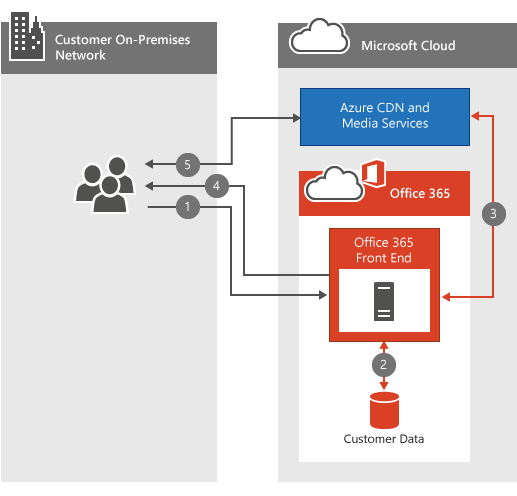

# Office 365 비디오 네트워킹에 대 한 질문과 대답Office 365 Video networking Frequently Asked Questions

Office 365 비디오 리포지토리와 스트리밍 서비스는 조직 내에서 비디오를 간단 하 게 저장 하 고 스트리밍하는 작업을 수행 합니다.The Office 365 Video repository and streaming services make storing and streaming videos within your organization simple. [Office 365 비디오에 대 한](https://support.office.com/article/Find-help-about-Office-365-Video-b435f99a-f47e-4ebd-a946-f5c965844f50)많은 유용한 정보가 있습니다. 이 네트워킹 FAQ는 대역폭 계획, 암호화 및 서비스가 cdns ( [콘텐츠 배달 네트워크](content-delivery-networks.md) )를 활용 하는 방법에 대 한 가장 일반적인 질문에 대 한 답변을 제공 하도록 설계 되었습니다.There's a lot of great [information about Office 365 Video](https://support.office.com/article/Find-help-about-Office-365-Video-b435f99a-f47e-4ebd-a946-f5c965844f50); this networking FAQ is designed to answer the most common questions around bandwidth planning, encryption, and how the service leverages [Content Delivery Networks](content-delivery-networks.md) (CDNs).
  
비디오를 업로드 하거나 재생할 때 수행 되는 작업을 완전히 이해 하지 못한 경우에는이 비디오를 함께 살펴보고 [Office 365 비디오에 업로드할 때 비디오 파일](https://www.youtube.com/watch?v=HXSZ0jYBKlM)을 확인 하세요.If you don't already have a thorough understanding of what happens when a video is uploaded or played back, have a look at this video we put together, [What happens to a video file when uploaded to Office 365 Video](https://www.youtube.com/watch?v=HXSZ0jYBKlM).
  
## Office 365 비디오 대역폭 요구 사항은 무엇 인가요?What are the Office 365 Video bandwidth requirements?

Office 365에 업로드할 수 있는 지원 되는 다양 한 [비디오 형식이](https://support.office.com/article/dd1af01c-fd8e-4640-b17b-93ee02b9b817) 있습니다.There are a numerous [supported video formats](https://support.office.com/article/dd1af01c-fd8e-4640-b17b-93ee02b9b817) that can be uploaded to Office 365. 각 비디오 파일은 재생을 위해 다양 한 비디오 품질을 사용 하 여 표준 형식으로 인코딩됩니다.Each video file is then encoded to a standard format with several different video qualities for playback. Office 365 Video에서는 적응 비트 전송률 스트리밍을 사용 하 여 비디오 플레이어의 사용 가능한 네트워크 대역폭과 크기에 따라 가장 적합 한 비디오 재생 품질을 선택 합니다.Office 365 Video uses adaptive bitrate streaming to select the best video playback quality based on the available network bandwidth and size of the video player. 이를 위해 플레이어는 처음에는 가장 낮은 재생 품질을 요청 합니다.To do this, the player initially requests the lowest playback quality. 그런 다음 서비스는 비디오 플레이어에 2 초 비디오 세그먼트를 전송 하기 시작 합니다.The service then begins sending 2-second video segments to the video player. 그러면 플레이어에서 각 세그먼트가 배달 되는 속도에 따라 재생 품질이 높거나 낮게 설정할 수 있습니다.The player can then request higher or lower playback quality based on how quickly each segment is delivered.
  
적응 비트 전송률 스트리밍은 최소 중단 또는 버퍼링을 통해 비디오를 재생 하는 동안 백그라운드에서이 모든 시간을 사용 합니다.The adaptive bitrate streaming does all this in the background while the video plays with the least amount of disruption or buffering. 비디오 재생 중에 비디오 플레이어에서 자동 재생 품질을 수동으로 재정의 하 여 특정 비디오 재생 품질을 선택할 수 있습니다.During video playback, the video player allows the viewer to manually override the automatic playback quality, to select a specific video playback quality.
  
다음은 각 비디오 재생 품질에 대 한 네트워크 요구 사항을 설명 하는 간단한 표입니다.Here's a quick table that outlines the network requirements for each of the video playback qualities. 비디오를 재생 하는 데 필요한 사용자 당 최소 대역폭은 802Kbps입니다.The minimum bandwidth per person needed to play a video is 802Kbps.
  
|||
|:-----|:-----|
|**재생 품질****Playback Quality**   |**네트워크 속도****Network Speed**   |
|288p288p    |802Kbps802Kbps    |
|360p360p    |1.2 Mbps1.2 Mbps    |
|576p576p    |2.5 Mbps2.5 Mbps    |
|720p720p    |3.8 Mbps3.8 Mbps    |

([맨 위로](office-365-video-networking-faq.md)이동)([Back to top](office-365-video-networking-faq.md))
  
## CDNs (콘텐츠 배달 네트워크)에서 비디오 재생을 지원 하나요?How do Content Delivery Networks (CDNs) help video playback?

동일한 지리적 위치에 있는 동일한 조직에서 여러 사용자가 동일한 비디오를 스트리밍하는 경우 CDNs는 해당 지역에 가까운 위치에 이러한 비디오의 복사본을 저장 합니다.If several people from the same organization within the same geographic location are streaming the same video(s), CDNs will store a copy of these videos in a location closer to that geographic region. 비디오가 저장 되거나 가장 가까운 위치에 캐시 되 면 각 사용자는 위치에 상관 없이 비디오를 더 멀리 떨어진 위치에서 스트리밍합니다.With the video stored, or cached at the closest location, each person streams the video from the location closest to them instead of a location further away. Office 365 Video는 Azure Media Services를 사용 하 여 Azure CDNs에 캐시 된 항목과 기간을 관리 합니다.Office 365 Video uses Azure Media Services to manage what is cached in the Azure CDNs, and for how long. Azure 미디어 서비스는 [AZURE CDN 위치](https://azure.microsoft.com/documentation/articles/cdn-pop-locations/) 중 하나를 사용 하 여 며칠 동안 비디오 조각과 매니페스트를 캐시할 수 있습니다.Azure Media Services can use any of the [Azure CDN locations](https://azure.microsoft.com/documentation/articles/cdn-pop-locations/) to cache video fragments and manifests for a few days. 조직의 사용자가 계속 해 서 캐시에 저장 되 면 캐시에 유지 됩니다.If people in your organization continue to watch the cached videos they'll stay in the cache. 며칠 동안 비디오에 액세스 하는 사람이 없는 경우에는 결국 비디오가 캐시에서 삭제 됩니다.If no one accesses the video for several days, the video will eventually drop be dropped from the cache. 다음 번에 누군가 비디오 시청을 시도할 때 가장 가까운 CDN 위치에 다시 캐시 됩니다.The next time someone attempts to watch the video it's once again cached at the nearest CDN location.
  
콘텐츠가 근처의 CDN에서 캐시 되는 동안 비디오를 시청 하려는 모든 사용자는 비디오가 더 가까이 있고, 대부분의 경우 홉의 수가 줄어듭니다.Everyone who attempts to watch the video while the content is cached at a nearby CDN benefits from the video being closer, and in most cases less hops, away. 이렇게 하면 비디오 재생 속도가 향상 됩니다. 그러나 비디오 재생을 위한 네트워크 요구 사항은 변경 되지 않습니다.This improves video playback speed; however, it doesn't change the network requirement to play the video.
  
> [!NOTE]
> 용량 제한에 도달 하 여 3 일 전에 비디오를 제거할 수 있는 몇 가지 경우가 있습니다.There are some circumstances, such as our capacity limit being reached, where the video may be removed before the three days has been reached.
  
([맨 위로](office-365-video-networking-faq.md)이동)([Back to top](office-365-video-networking-faq.md))
  
## 보다 빠른 재생을 위해 비디오를 로컬로 캐시할 수 있나요?Can I cache the videos locally for faster playback?

예.Yes. Office 365에서는 로컬 CDN 또는 캐싱 프록시를 사용 하 여 비디오 또는 기타 Office 365 콘텐츠를 빠른 액세스를 위해 로컬 네트워크로 가져올 수 없습니다.Office 365 won't prevent you from using a local CDN or a caching proxy to bring video or other Office 365 content into your local network for faster access. 네트워크에서 로컬 캐싱 솔루션을 구현 하는 방법에는 여러 가지가 있으며, 가장 일반적인 방법은 콘텐츠를 로컬로 캐시 하는 프록시 솔루션을 사용 하는 것입니다.There are several ways to implement a local caching solution on your network, the most common method is to use a proxy solution that caches content locally. 프록시 또는 개인 CDN에서 비디오 조각 및 매니페스트를 캐시 하면 프록시 또는 개인 CDN을 통해 라우팅되는 파일에 대 한 후속 요청이 로컬 캐시에서 추출 되 고 인터넷 위치에서 추출 되지 않습니다.Once a proxy or private CDN has cached the video fragments and manifests, future requests for those files that route through the proxy or private CDN are pulled from the local cache and not pulled from an internet location. 이와 같은 솔루션을 계획 하는 동안 네트워크 대역폭, 용량 및 비디오 재생 병행성을 고려해 야 합니다.Consider network bandwidth, capacity, and video playback concurrency during the planning of a solution like this.
  
([맨 위로](office-365-video-networking-faq.md)이동)([Back to top](office-365-video-networking-faq.md))
  
## 비디오를 암호화 하 고 보호 하는 방법How videos are encrypted and secured?

Office 365 비디오에서는 데이터를 안전 하 고 개인적으로 유지 하는 것이 얼마나 중요 한지를 알고 있습니다.Office 365 Video knows how important it is to keep your data secure and private. [Microsoft 보안 센터](https://products.office.com/business/office-365-trust-center-welcome) 는 콘텐츠의 개인 정보 및 보안에 대 한 약정을 설명 합니다.[Microsoft Trust Center](https://products.office.com/business/office-365-trust-center-welcome) describes our commitment to the privacy and security of your content. 비디오 재생을 사용 하면 속도가 매우 중요 한 환경을 경험할 수 있습니다. 그러나 exchange에서 속도를 높이기 위해 보안 또는 개인 정보를 손상 시 키 지는 않습니다.With video playback, speed is important for a good experience; however, we don't compromise your security or privacy in exchange for speed. 속도, 보안 및 개인 정보를 처리 하는 방법은 다음과 같습니다.Here's how we accommodate speed, security and privacy.
  
사용자나 조직의 다른 사람이 새 비디오를 업로드 하면 해당 비디오는 트랜스 코딩 되 고, AES-128 암호화로 암호화 되며, Azure Media Services에 저장 됩니다.When you or someone in your organization uploads a new video, that video is transcoded, encrypted with AES-128 encryption, and stored in Azure Media Services. 즉, 비디오는 전송 및 휴지에서 모두 암호화 됩니다.This means the videos are encrypted both in transit and at rest.
  
조직의 누군가가 새 비디오를 시청 하려고 하면 다음 단계를 수행 합니다.When someone in your organization attempts to watch a new video, they follow these steps:
  
1. SharePoint Online에 비디오를 볼 수 있는 권한이 있는지 확인 하세요.Ask SharePoint Online if they have permission to view the video.

2. SharePoint Online은 파일 사용 권한을 사용 하 여 사용자가 비디오를 시청할 수 있는지 여부를 결정 합니다.SharePoint Online uses the file permissions to determine if the person can watch the video.

3. 허용 되는 경우 SharePoint Online은 비디오 플레이어에 게 제공할 Azure에서 토큰을 검색 합니다.If they're allowed, SharePoint Online retrieves a token from Azure to give to the video player.

4. 그런 다음 비디오 플레이어에서 토큰을 사용 하 여 Azure에서 암호 해독 키를 요청 합니다.The video player then uses the token to request the decryption key from Azure.

5. 암호 해독 키가 있으면 비디오 재생기에서 비디오를 스트리밍할 수 있습니다.With the decryption key in hand, the video player is able to stream the video.

  
([맨 위로](office-365-video-networking-faq.md)이동)([Back to top](office-365-video-networking-faq.md))
  
## Office 365 동영상을 재생 하는 데 필요한 요구 사항은 무엇 인가요?What are the requirements to playback Office 365 Video?

Office 365 비디오 지원 운영 체제 및 웹 브라우저는 [office 365 시스템 요구 사항](https://support.office.com/article/Office-365-system-requirements-719254c0-2671-4648-9c84-c6a3d4f3be45)에 대 한 SharePoint Online 요구 사항과 동일 합니다.Office 365 Video supported operating systems and web browsers are the same as the SharePoint Online requirements in [Office 365 system requirements](https://support.office.com/article/Office-365-system-requirements-719254c0-2671-4648-9c84-c6a3d4f3be45). 보유 하 고 있는 운영 체제 및 웹 브라우저 구성에 따라 비디오 플레이어의 특정 요구 사항을 결정 해야 합니다.Depending on which operating system and web browser configuration you have will determine the specific needs of the video player. [비디오 재생 요구 사항](https://support.office.com/article/ca1cc1a9-a615-46e1-b6a3-40dbd99939a6)에 대 한 자세한 내용은 다음과 같습니다.Here's more information on [video playback requirements](https://support.office.com/article/ca1cc1a9-a615-46e1-b6a3-40dbd99939a6).
  
([맨 위로](office-365-video-networking-faq.md)이동)([Back to top](office-365-video-networking-faq.md))
  
## Office 365 비디오를 사용할 수 없음 (시작 해야 하는 경우)I can't get Office 365 video to work, where should I start?

Office 365의 연결 문제 해결 비디오에는 네트워크, ISP 및 Office 365 구성에 대 한 문제 해결이 포함 되어 있습니다.Troubleshooting connectivity to Office 365 Video involves troubleshooting your network, your ISP(s), and your configuration of Office 365. 시작 하는 첫 번째 위치는 서비스 상태 대시보드입니다.The first place to start is the service health dashboard. 이를 통해 Office 365 비디오에 문제가 있거나 그렇지 않을 수 있습니다.This will tell you of Office 365 Video is having a problem or not. 여기에 모든 내용이 표시 되 면 도움이 되는 몇 가지 추가 리소스가 있습니다.If everything looks great there, here's some additional resources to help you.
  
- [Office 365 비디오에 필요한 네트워크 끝점](https://support.office.com/article/Office-365-URLs-and-IP-address-ranges-8548a211-3fe7-47cb-abb1-355ea5aa88a2)에 연결할 수 있는지 확인 합니다.Make sure you can connect to the [network endpoints required for Office 365 Video](https://support.office.com/article/Office-365-URLs-and-IP-address-ranges-8548a211-3fe7-47cb-abb1-355ea5aa88a2).

- [Office 365 네트워크 문제 해결 가이드](https://support.office.com/article/Office-365-performance-tuning-and-troubleshooting-Admin-and-IT-Pro-1492cb94-bd62-43e6-b8d0-2a61ed88ebae)를 사용 하 여 네트워크 연결을 확인 합니다.Check your network connectivity using our [Office 365 network troubleshooting guide](https://support.office.com/article/Office-365-performance-tuning-and-troubleshooting-Admin-and-IT-Pro-1492cb94-bd62-43e6-b8d0-2a61ed88ebae).

- [저속 네트워크에서 Office 365 사용에 대 한 모범 사례](https://support.office.com/article/Best-practices-for-using-Office-365-on-a-slow-network-fd16c8d2-4799-4c39-8fd7-045f06640166)를 참조 하세요.See our [best practices for using Office 365 on a slow network](https://support.office.com/article/Best-practices-for-using-Office-365-on-a-slow-network-fd16c8d2-4799-4c39-8fd7-045f06640166).

- [Office 365 비디오 구성에 대 한 도움말을 찾아봅니다](https://support.office.com/article/Find-help-about-Office-365-Video-b435f99a-f47e-4ebd-a946-f5c965844f50).[Find help about Office 365 Video configuration](https://support.office.com/article/Find-help-about-Office-365-Video-b435f99a-f47e-4ebd-a946-f5c965844f50).

([맨 위로](office-365-video-networking-faq.md)이동)([Back to top](office-365-video-networking-faq.md))
  
## Office 365 비디오 리소스Office 365 Video resources

다음은 Office 365 비디오를 성공적으로 배포 및 사용 하는 데 도움이 되는 몇 가지 기타 리소스입니다.Here's a few other resources to help you successfully deploy and use Office 365 Video:
  
[Office 365 비디오 구성에 대 한 도움말 찾기Find help about Office 365 Video configuration](https://support.office.com/article/Find-help-about-Office-365-Video-b435f99a-f47e-4ebd-a946-f5c965844f50)
  
[Office 365 비디오에 맞추기Meet Office 365 Video](https://support.office.com/article/Meet-Office-365-Video-ca1cc1a9-a615-46e1-b6a3-40dbd99939a6)
  
[Office 365 동영상에서 채널 만들기 및 관리Create and manage a channel in Office 365 Video](https://support.office.com/article/Create-and-manage-a-channel-in-Office-365-Video-1fede4cc-13c0-435a-b585-e7fbf1c83bb2)
  
[Office 365 비디오 포털 관리Manage your Office 365 Video portal](https://support.office.com/article/Manage-your-Office-365-Video-portal-c059465b-eba9-44e1-b8c7-8ff7793ff5da)
  
[Office 365 비디오에서 작동 하는 비디오 형식Video formats that work in Office 365 Video](https://support.office.com/article/Video-formats-that-work-in-Office-365-Video-dd1af01c-fd8e-4640-b17b-93ee02b9b817)
  
([맨 위로](office-365-video-networking-faq.md)이동)([Back to top](office-365-video-networking-faq.md))
  
다음의 간단한 링크를 사용할 수 있습니다. [https://aka.ms/video365networkfaq](https://aka.ms/video365networkfaq)Here's a short link you can use to come back: [https://aka.ms/video365networkfaq](https://aka.ms/video365networkfaq)
