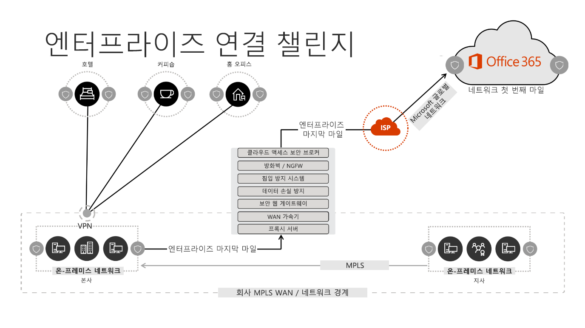
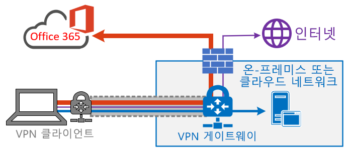
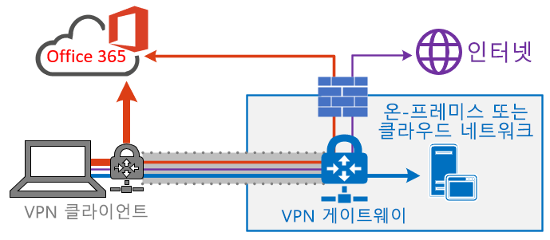
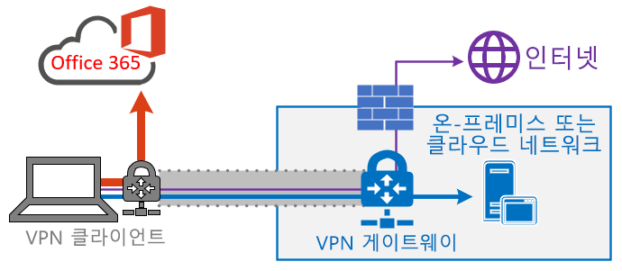
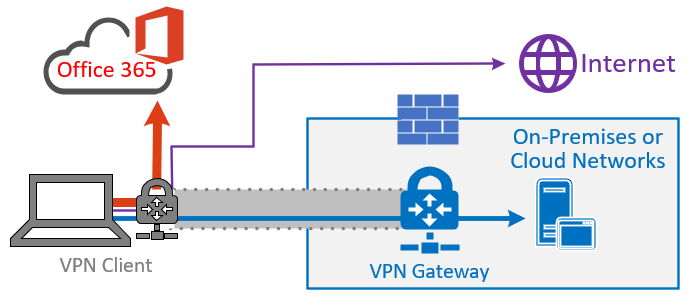
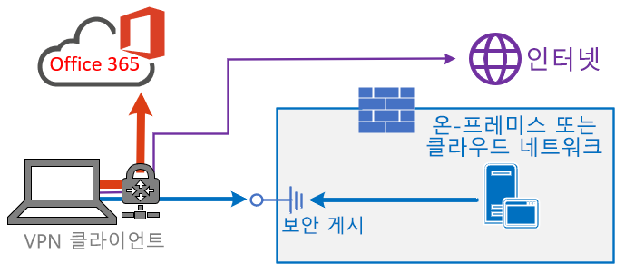
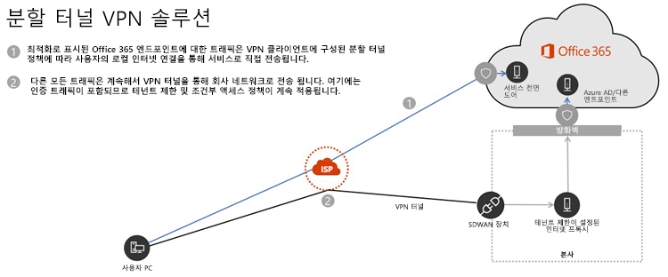

# <a name="implementing-vpn-split-tunnelling-for-office-365"></a><span data-ttu-id="826bb-103">Office 365 VPN 분할 터널링 구현</span><span class="sxs-lookup"><span data-stu-id="826bb-103">Implementing VPN split tunnelling for Office 365</span></span>

>[!NOTE]
><span data-ttu-id="826bb-104">이 항목은 원격 사용자의 Office 365 최적화를 다루는 항목 모음의 일부입니다.</span><span class="sxs-lookup"><span data-stu-id="826bb-104">This topic is part of a set of topics that address Office 365 optimization for remote users.</span></span>
>- <span data-ttu-id="826bb-105">원격 사용자의 Office 365 연결을 최적화하는 VPN 분할 터널링을 사용하는 방법에 대한 개요는 [개요: VOffice 365 VPN 분할 터널링](office-365-vpn-split-tunnel.md)을 참조하세요.</span><span class="sxs-lookup"><span data-stu-id="826bb-105">For an overview of using VPN split tunnelling to optimize Office 365 connectivity for remote users, see [Overview: VPN split tunnelling for Office 365](office-365-vpn-split-tunnel.md).</span></span>
>- <span data-ttu-id="826bb-106">중국 사용자를 위한 Office 365 월드와이드 테넌트 성능을 최적화하는 방법에 대한 자세한 내용은 [중국 사용자를 위한 Office 365 성능 최적화](office-365-networking-china.md)를 참조하세요.</span><span class="sxs-lookup"><span data-stu-id="826bb-106">For information about optimizing Office 365 worldwide tenant performance for users in China, see [Office 365 performance optimization for China users](office-365-networking-china.md).</span></span>

<span data-ttu-id="826bb-107">몇 년 동안 기업은 VPN을 사용하여 사용자의 원격 환경을 지원하고 있습니다.</span><span class="sxs-lookup"><span data-stu-id="826bb-107">For many years enterprises have been using VPNs to support remote experiences for their users.</span></span> <span data-ttu-id="826bb-108">핵심 작업은 온-프레미스로 유지되었지만, 회사 네트워크의 데이터 센터를 통해 라우팅된 원격 클라이언트의 VPN은 원격 사용자가 회사 리소스에 액세스하는 기본 방법이었습니다.</span><span class="sxs-lookup"><span data-stu-id="826bb-108">Whilst core workloads remained on-premises, a VPN from the remote client routed through a datacenter on the corporate network was the primary method for remote users to access corporate resources.</span></span> <span data-ttu-id="826bb-109">이러한 연결을 보호하기 위해 기업은 VPN 경로를 따라 네트워크 보안 솔루션 계층을 구축합니다.</span><span class="sxs-lookup"><span data-stu-id="826bb-109">To safeguard these connections, enterprises build layers of network security solutions along the VPN paths.</span></span> <span data-ttu-id="826bb-110">이는 내부 인프라를 보호하는 것은 물론, 트래픽을 VPN으로 다시 라우팅한 다음 온-프레미스 인터넷 경계로 라우팅하여 외부 웹 사이트의 모바일 브라우징을 보호하기 위해 수행되었습니다.</span><span class="sxs-lookup"><span data-stu-id="826bb-110">This was done to protect internal infrastructure as well as to safeguard mobile browsing of external web sites by rerouting traffic into the VPN and then out through the on-premises Internet perimeter.</span></span> <span data-ttu-id="826bb-111">VPN, 네트워크 경계 및 관련 보안 인프라는 정의된 트래픽 용량에 맞춘 용도로 개발되고 크기가 조정되는 경우가 많으며, 회사 네트워크 내에서 대부분의 연결이 시작되고 대부분의 내부 네트워크 경계 내에 유지됩니다.</span><span class="sxs-lookup"><span data-stu-id="826bb-111">VPNs, network perimeters and associated security infrastructure were often purpose built and scaled for a defined volume of traffic, typically with the majority of connectivity being initiated from within the corporate network, and most of it staying withing the internal network boundaries.</span></span>

<span data-ttu-id="826bb-112">원격 사용자의 동시 규모가 적당하고 VPN을 통과하는 트래픽 양이 적은 경우에만 꽤 오랫동안 원격 사용자 장치의 모든 연결이 온-프레미스 네트워크로 라우팅되는 VPN 모델(**강제 터널링**으로 알려짐)을 지속할 수 있습니다.</span><span class="sxs-lookup"><span data-stu-id="826bb-112">For quite some time, VPN models where all connections from the remote user device are routed back into the on-premises network (known as **forced tunnelling**) were largely sustainable as long as the concurrent scale of remote users was modest and the traffic volumes traversing VPN were low.</span></span>  <span data-ttu-id="826bb-113">일부 고객은 응용 프로그램이 회사 경계 내부에서 Office 365와 같은 공용 SaaS 클라우드로 이동한 후에도 VPN 강제 터널링을 계속 유지하였습니다.</span><span class="sxs-lookup"><span data-stu-id="826bb-113">Some customers continued to use VPN force tunnelling as the status quo even after their applications moved from inside the corporate perimeter to public SaaS clouds, Office 365 being a prime example.</span></span>

<span data-ttu-id="826bb-114">분산되고 성능에 민감한 클라우드 응용 프로그램에 연결하기 위해 강제 터널된 VPN을 사용하는 것은 최적의 선택은 아니지만, 일부 기업에서 보안 측면에서 현상을 유지하기 위해 이 방식의 부정적인 영향을 수용할 수 있었습니다.</span><span class="sxs-lookup"><span data-stu-id="826bb-114">The use of forced tunneled VPNs for connecting to distributed and performance sensitive cloud applications is extremely suboptimal, but the negative impact of that may have been accepted by some enterprises so as to maintain the status quo from a security perspective.</span></span> <span data-ttu-id="826bb-115">이 시나리오의 예제 다이어그램은 다음과 같습니다.</span><span class="sxs-lookup"><span data-stu-id="826bb-115">An example diagram of this scenario can be seen below:</span></span>



<span data-ttu-id="826bb-117">이 문제는 수년간 계속 커졌으며 많은 고객들이 네트워크 트래픽 패턴의 큰 변화를 보고했습니다.</span><span class="sxs-lookup"><span data-stu-id="826bb-117">This problem has been growing for a number of years, with many customers reporting a significant shift of network traffic patterns.</span></span> <span data-ttu-id="826bb-118">온-프레미스에 유지되었던 트래픽은 이제 외부 클라우드 끝점에 연결됩니다.</span><span class="sxs-lookup"><span data-stu-id="826bb-118">Traffic which used to stay on premises now connects to external cloud endpoints.</span></span> <span data-ttu-id="826bb-119">많은 Microsoft 고객이 이전에 네트워크 트래픽의 약 80%가 내부 원본(위의 다이어그램에서 점선으로 표시됨)에 대한 것이라고 보고했습니다.</span><span class="sxs-lookup"><span data-stu-id="826bb-119">Numerous Microsoft customers report that previously, around 80% of their network traffic was to some internal source (represented by the dotted line in the above diagram).</span></span> <span data-ttu-id="826bb-120">2020년에 주요 작업을 클라우드로 이동시킴에 따라 이 수치가 현재 약20 % 이하로 떨어졌으며, 이러한 추세는 다른 기업에서는 드문 일이 아닙니다.</span><span class="sxs-lookup"><span data-stu-id="826bb-120">In 2020 that number is now around 20% or lower as they have shifted major workloads to the cloud, these trends are not uncommon with other enterprises.</span></span> <span data-ttu-id="826bb-121">시간이 지나며 클라우드 마이그레이션이 진행됨에 따라 위의 모델은 점점 번거롭고 지속하기 어려워졌으며, 조직이 클라우드 우선 환경으로 진입하는 상황에서 조직의 민첩성에 방해가 되었습니다.</span><span class="sxs-lookup"><span data-stu-id="826bb-121">Over time, as the cloud journey progresses, the above model becomes increasingly cumbersome and unsustainable, preventing an organization from being agile as they move into a cloud first world.</span></span>

<span data-ttu-id="826bb-122">이 문제는 전 세계 COVID-19 팬데믹으로 인해 즉시 해결해야 하는 사항으로 떠올랐습니다.</span><span class="sxs-lookup"><span data-stu-id="826bb-122">The worldwide COVID-19 pandemic has escalated this problem to require immediate remediation.</span></span> <span data-ttu-id="826bb-123">직원의 안전을 보장하기 위해 대규모의 재택 근무 생산성을 지원하기 위한 기업 IT에 전례없는 대한 수요가 발생했습니다.</span><span class="sxs-lookup"><span data-stu-id="826bb-123">The need to ensure employee safety has generated unprecedented demands on enterprise IT to support work-from-home productivity at a massive scale.</span></span> <span data-ttu-id="826bb-124">Microsoft Office 365는 고객이 이러한 요구를 충족하도록 지원하는 데 적합한 위치에 있지만, 집에서 작업하는 사용자의 동시성이 높으면 강제 터널 VPN 및 온-프레미스 네트워크 경계를 통해 라우팅되는 경우 빠르게 포화시키고 VPN 인프라의 용량이 부족하게 하는 대량의 Office 365 트래픽이 생성됩니다.</span><span class="sxs-lookup"><span data-stu-id="826bb-124">Microsoft Office 365 is well positioned to help customers fulfil that demand, but high concurrency of users working from home generates a large volume of Office 365 traffic which, if routed through forced tunnel VPN and on-premises network perimeters, causes rapid saturation and runs VPN infrastructure out of capacity.</span></span> <span data-ttu-id="826bb-125">이렇게 새롭게 변한 현실에서 VPN을 사용하여 Office 365에 액세스하는 것은 더 이상 성능 장애를 일으키는 것이 아니라, Office 365뿐만 아니라 운영을 위해 VPN에 계속 의존해야 하는 중요한 비즈니스 활동에 영향을 주는 중요한 요소가 되었습니다.</span><span class="sxs-lookup"><span data-stu-id="826bb-125">In this new reality, using VPN to access Office 365 is no longer just a performance impediment, but a hard wall which not only impacts Office 365 but critical business operations which still have to rely on the VPN to operate.</span></span>

<span data-ttu-id="826bb-126">Microsoft는 자체 서비스 내에서 이러한 문제에 대한 효과적인 최신 솔루션을 제공하고 업계 모범 사례에 맞추기 위해 수년간 고객 및 더 다양한 업계와 긴밀히 협력하고 있습니다.</span><span class="sxs-lookup"><span data-stu-id="826bb-126">Microsoft has been working closely with customers and the wider industry for many years to provide effective, modern solutions to these problems from within our own services, and to align with industry best practice.</span></span> <span data-ttu-id="826bb-127">Office 365 서비스의 [연결 원칙](https://aka.ms/pnc)은 조직이 원격 사용자의 연결에 대한 보안과 제어를 계속 유지할 수 있도록 하는 동시에 원격 사용자에게 효과적으로 작동하도록 설계되었습니다.</span><span class="sxs-lookup"><span data-stu-id="826bb-127">[Connectivity principles](https://aka.ms/pnc) for the Office 365 service have been designed to work efficiently for remote users whilst still allowing an organization to maintain security and control over their connectivity.</span></span> <span data-ttu-id="826bb-128">이러한 솔루션은 제한된 작업으로 매우 빠르게 구현할 수 있으며, 위에서 설명한 문제에 상당히 긍정적인 영향을 미칩니다.</span><span class="sxs-lookup"><span data-stu-id="826bb-128">These solutions can also be implemented very quickly with limited work yet achieve a significant positive impact on the problems outlined above.</span></span>

<span data-ttu-id="826bb-129">Microsoft에서 원격 작업자의 연결을 최적화에 권장하는 전략은 전통적인 접근 방식의 문제를 신속하게 완화하고 몇 가지 간단한 단계를 통해 높은 성능을 제공하는 데 초점을 맞춥니다.</span><span class="sxs-lookup"><span data-stu-id="826bb-129">Microsoft's recommended strategy for optimizing remote worker's connectivity is focused on rapidly alleviating the problems with the traditional approach and also providing high performance with a few simple steps.</span></span> <span data-ttu-id="826bb-130">다음 단계는 병목 현상이 일어난 VPN 서버를 우회하는 소수의 정의된 끝점에 대한 기존 VPN 접근 방식을 조정합니다.</span><span class="sxs-lookup"><span data-stu-id="826bb-130">These steps adjust the legacy VPN approach for a small number of defined endpoints which bypass bottlenecked VPN servers.</span></span> <span data-ttu-id="826bb-131">동등하거나 우수한 보안 모델을 다양한 계층에 적용할 수 있으므로 회사 네트워크 송신에서 모든 트래픽을 보호할 필요가 없습니다.</span><span class="sxs-lookup"><span data-stu-id="826bb-131">An equivalent or even superior security model can be applied at different layers to remove the need to secure all traffic at the egress of the corporate network.</span></span> <span data-ttu-id="826bb-132">대부분의 경우 이를 몇 시간 내에 효과적으로 실현할 수 있으며 요구 사항 및 시간이 허용되면 다른 작업으로 확장할 수 있습니다.</span><span class="sxs-lookup"><span data-stu-id="826bb-132">In most cases this can be effectively achieved within hours and is then scalable to other workloads as requirements demand and time allows.</span></span>

## <a name="common-vpn-scenarios"></a><span data-ttu-id="826bb-133">일반적인 VPN 시나리오</span><span class="sxs-lookup"><span data-stu-id="826bb-133">Common VPN scenarios</span></span>

<span data-ttu-id="826bb-134">아래 목록에는 엔터프라이즈 환경의 가장 일반적인 VPN 시나리오가 표시됩니다.</span><span class="sxs-lookup"><span data-stu-id="826bb-134">In the list below you'll see the most common VPN scenarios seen in enterprise environments.</span></span> <span data-ttu-id="826bb-135">대부분의 고객은 일반적으로 모델 1(VPN 강제 터널)을 사용합니다.</span><span class="sxs-lookup"><span data-stu-id="826bb-135">Most customers traditionally operate model 1 (VPN Forced Tunnel).</span></span> <span data-ttu-id="826bb-136">이 섹션은 비교적 적은 노력으로 달성할 수 있고 네트워크 성능 및 사용자 환경에 큰 이점을 제공하는 **모델 2**로 빠르고 안전하게 전환하는 데 도움이 됩니다.</span><span class="sxs-lookup"><span data-stu-id="826bb-136">This section will help you to quickly and securely transition to **model 2**, which is achievable with relatively little effort, and which has enormous benefits to network performance and user experience.</span></span>

| <span data-ttu-id="826bb-137">**모델**</span><span class="sxs-lookup"><span data-stu-id="826bb-137">**Model**</span></span> | <span data-ttu-id="826bb-138">**설명**</span><span class="sxs-lookup"><span data-stu-id="826bb-138">**Description**</span></span> |
| --- | --- |
| [<span data-ttu-id="826bb-139">1. VPN 강제 터널</span><span class="sxs-lookup"><span data-stu-id="826bb-139">1. VPN Forced Tunnel</span></span>](#1-vpn-forced-tunnel) | <span data-ttu-id="826bb-140">온-프레미스, 인터넷 및 모든 O365/M365를 포함한 트래픽의 100%를 VPN 터널로 전송</span><span class="sxs-lookup"><span data-stu-id="826bb-140">100% of traffic goes into VPN tunnel, including on-premise, Internet and all O365/M365</span></span> |
| [<span data-ttu-id="826bb-141">2. VPN 강제 터널(일부 예외 포함)</span><span class="sxs-lookup"><span data-stu-id="826bb-141">2. VPN Forced Tunnel with few exceptions</span></span>](#2-vpn-forced-tunnel-with-a-small-number-of-trusted-exceptions) | <span data-ttu-id="826bb-142">VPN 터널이 기본적으로 사용되며 (VPN로의 기본 라우팅 포인트) 직접 전송하도록 허용된 가장 중요한 몇 가지 예외 시나리오가 있음</span><span class="sxs-lookup"><span data-stu-id="826bb-142">VPN tunnel is used by default (default route points to VPN), with few, most important exempt scenarios that are allowed to go direct</span></span> |
| [<span data-ttu-id="826bb-143">3. VPN 강제 터널(광범위한 예외 포함)</span><span class="sxs-lookup"><span data-stu-id="826bb-143">3. VPN Forced Tunnel with broad exceptions</span></span>](#3-vpn-forced-tunnel-with-broad-exceptions) | <span data-ttu-id="826bb-144">VPN 터널이 기본적으로 사용되며 (VPN로의 기본 라우팅 포인트) 직접 전송하도록 허용된 광범위한 예외가 있음(예: 모든 Office 365, 모든 Salesforce, 모든 Zoom)</span><span class="sxs-lookup"><span data-stu-id="826bb-144">VPN tunnel is used by default (default route points to VPN), with broad exceptions that are allowed to go direct (such as all Office 365, All Salesforce, All Zoom)</span></span> |
| [<span data-ttu-id="826bb-145">4. VPN 선택적 터널</span><span class="sxs-lookup"><span data-stu-id="826bb-145">4. VPN Selective Tunnel</span></span>](#4-vpn-selective-tunnel) | <span data-ttu-id="826bb-146">VPN 터널은 Corpnet 기반 서비스에서만 사용됩니다.</span><span class="sxs-lookup"><span data-stu-id="826bb-146">VPN tunnel is used only for corpnet based services.</span></span> <span data-ttu-id="826bb-147">기본 경로(인터넷 및 모든 인터넷 기반 서비스)가 직접 이동합니다.</span><span class="sxs-lookup"><span data-stu-id="826bb-147">Default route (Internet and all Internet based services) goes direct.</span></span> |
| [<span data-ttu-id="826bb-148">5. VPN 없음</span><span class="sxs-lookup"><span data-stu-id="826bb-148">5. No VPN</span></span>](#5-no-vpn) | <span data-ttu-id="826bb-149">2번의 변형으로, 모든 Corpnet 서비스가 기존 VPN 대신 최신 보안 방식(예: Zscaler ZPA, AAD Proxy/MCAS)을 통해 게시됨</span><span class="sxs-lookup"><span data-stu-id="826bb-149">A variation of #2, where instead of legacy VPN, all corpnet services are published through modern security approaches (like Zscaler ZPA, AAD Proxy/MCAS, etc)</span></span> |

### <a name="1-vpn-forced-tunnel"></a><span data-ttu-id="826bb-150">1. VPN 강제 터널</span><span class="sxs-lookup"><span data-stu-id="826bb-150">1. VPN Forced Tunnel</span></span>

<span data-ttu-id="826bb-151">대부분의 엔터프라이즈 고객에게 가장 일반적인 시작 시나리오입니다.</span><span class="sxs-lookup"><span data-stu-id="826bb-151">This is the most common starting scenario for most enterprise customers.</span></span> <span data-ttu-id="826bb-152">강제 VPN이 사용됩니다. 즉, 끝점이 회사 네트워크 내에 존재하는지와 상관없이 트래픽의 100%가 회사 네트워크로 전송됩니다.</span><span class="sxs-lookup"><span data-stu-id="826bb-152">A forced VPN is used which means 100% of traffic is directed into the corporate network regardless of the fact the endpoint resides within the corporate network or not.</span></span> <span data-ttu-id="826bb-153">그런 다음 Office 365 또는 인터넷 브라우징과 같은 외부 (인터넷) 바운드 트래픽은 프록시와 같은 온-프레미스 보안 장비에서 헤어핀됩니다.</span><span class="sxs-lookup"><span data-stu-id="826bb-153">Any external (Internet) bound traffic such as Office 365 or Internet browsing is then hairpinned back out of the on premises security equipment such as proxies.</span></span> <span data-ttu-id="826bb-154">이 모델은 사용자의 약 100%가 원격으로 작업하고 있는 현재 환경에서 VPN 인프라에 상당한 부하를 가하고 모든 기업 트래픽의 성능을 크게 저해하여 기업이 위기 상황에서 효율적으로 운영되기 어렵게 합니다.</span><span class="sxs-lookup"><span data-stu-id="826bb-154">In the current climate with nearly 100% of users working remotely, this model therefore puts extremely high load on the VPN infrastructure and is likely to significantly hinder performance of all corporate traffic and thus the enterprise to operate efficiently at a time of crisis.</span></span>



### <a name="2-vpn-forced-tunnel-with-a-small-number-of-trusted-exceptions"></a><span data-ttu-id="826bb-156">2. 소수의 신뢰할 수 있는 예외가 있는 VPN 강제 터널</span><span class="sxs-lookup"><span data-stu-id="826bb-156">2. VPN Forced Tunnel with a small number of trusted exceptions</span></span>

<span data-ttu-id="826bb-157">이 모델은 부하가 많고 대기 시간에 민감하며 제어되고 정의된 소수의 끝점이 VPN 터널을 우회하고 이 예제의 Office 365 서비스로 직접 전달할 수 있도록 허용하므로 기업에서 운영하기에 훨씬 더 효율적입니다.</span><span class="sxs-lookup"><span data-stu-id="826bb-157">This model is significantly more efficient for an enterprise to operate under as it allows a small number of controlled and defined endpoints which are very high load and latency sensitive to bypass the VPN tunnel and go direct to the Office 365 service in this example.</span></span> <span data-ttu-id="826bb-158">이렇게 하면 오프로드된 서비스의 성능이 크게 향상되고 VPN 인프라에 가해지는 부하가 줄기 때문에, 작동에 리소스 경합성이 적은 요소를 허용할 수 있습니다.</span><span class="sxs-lookup"><span data-stu-id="826bb-158">This significantly improves the performance for the offloaded services, and also decreases the load on the VPN infrastructure, thus allowing elements which still require it to operate with lower contention for resources.</span></span> <span data-ttu-id="826bb-159">이 모델은 이 문서에서 매우 신속하게 간단하고 정의된 작업을 수행할 수 있도록 하며 여러 긍정적인 결과를 제공하는 전환을 지원하기 위해 집중적으로 설명하는 모델입니다.</span><span class="sxs-lookup"><span data-stu-id="826bb-159">It is this model which this article concentrates on assisting with the transition to as it allows for simple, defined actions to be taken very quickly with numerous positive outcomes.</span></span>



### <a name="3-vpn-forced-tunnel-with-broad-exceptions"></a><span data-ttu-id="826bb-161">3. VPN 강제 터널(광범위한 예외 포함)</span><span class="sxs-lookup"><span data-stu-id="826bb-161">3. VPN Forced Tunnel with broad exceptions</span></span>

<span data-ttu-id="826bb-162">세 번째 모델은 정의된 끝점의 작은 그룹을 직접 보내는 것이 아니라 모델 2의 범위를 넓히며, 대신 Office 365, SalesForce 등의 신뢰할 수있는 서비스에 모든 트래픽을 직접 보냅니다.</span><span class="sxs-lookup"><span data-stu-id="826bb-162">The third model broadens the scope of model two as rather than just sending a small group of defined endpoints direct, it instead sends all traffic to trusted services such Office 365, SalesForce etc. direct.</span></span> <span data-ttu-id="826bb-163">따라서 회사 VPN 인프라의 부하가 줄어들며 정의된 서비스의 성능이 향상됩니다.</span><span class="sxs-lookup"><span data-stu-id="826bb-163">This further reduces the load on the corporate VPN infrastructure and improves the performance of the services defined.</span></span> <span data-ttu-id="826bb-164">이 모델은 실행 가능성을 평가하고 구현하는 데 시간이 오래 걸릴 수 있으므로 모델 2가 성공적으로 적용된 이후에 반복적으로 수행할 수 있는 단계가 될 가능성이 높습니다.</span><span class="sxs-lookup"><span data-stu-id="826bb-164">As this model is likely to take more time to assess the feasibility of and implement, it is likely a step which can be taken iteratively at a later date once model two is successfully in place.</span></span>



### <a name="4-vpn-selective-tunnel"></a><span data-ttu-id="826bb-166">4. VPN 선택적 터널</span><span class="sxs-lookup"><span data-stu-id="826bb-166">4. VPN selective Tunnel</span></span>

<span data-ttu-id="826bb-167">이 모델은 회사 IP 주소를 포함하는 것으로 식별된 트래픽만 VPN 터널로 전송되므로 인터넷 경로가 그 밖의 모든 항목의 기본 경로라는 점에서 세 번째 모델과 반대입니다.</span><span class="sxs-lookup"><span data-stu-id="826bb-167">This model reverses the third model in that only traffic identified as having a corporate IP address is sent down the VPN tunnel and thus the Internet path is the default route for everything else.</span></span> <span data-ttu-id="826bb-168">이 모델을 안전하게 구현하려면 조직에서 [제로 트러스트](https://www.microsoft.com/security/zero-trust?rtc=1) 경로를 제대로 따라야 하빈다.</span><span class="sxs-lookup"><span data-stu-id="826bb-168">This model requires an organization to be well on the path to [Zero Trust](https://www.microsoft.com/security/zero-trust?rtc=1) in able to safely implement this model.</span></span> <span data-ttu-id="826bb-169">점점 더 많은 서비스가 회사 네트워크에서 클라우드로 이동함에 따라 이 모델이나 이 모델의 일부 변형은 시간이 지남에 따라 필수적인 기본값이 될 수 있다는 점에 유의해야 합니다.</span><span class="sxs-lookup"><span data-stu-id="826bb-169">It should be noted that this model or some variation thereof will likely become the necessary default over time as more and more services move away from the corporate network and into the cloud.</span></span> <span data-ttu-id="826bb-170">Microsoft는 내부적으로 이 모델을 사용합니다. Microsoft의 VPN 분할 터널링 구현에 대한 자세한 내용은 [VPN에서 실행: Microsoft가 원격 인력을 연결 상태로 유지하는 방법](https://www.microsoft.com/itshowcase/blog/running-on-vpn-how-microsoft-is-keeping-its-remote-workforce-connected/?elevate-lv)을 참조하세요.</span><span class="sxs-lookup"><span data-stu-id="826bb-170">Microsoft uses this model internally; you can find more information on Microsoft's implementation of VPN split tunnelling at [Running on VPN: How Microsoft is keeping its remote workforce connected](https://www.microsoft.com/itshowcase/blog/running-on-vpn-how-microsoft-is-keeping-its-remote-workforce-connected/?elevate-lv).</span></span>



### <a name="5-no-vpn"></a><span data-ttu-id="826bb-172">5. VPN 없음</span><span class="sxs-lookup"><span data-stu-id="826bb-172">5. No VPN</span></span>

<span data-ttu-id="826bb-173">모델 2을 더 개선한 버전이며, 모든 내부 서비스를 Azure AD 프록시, MCAS, Zscaler ZPA 등과 같은 SDWAN 솔루션 또는 최신 보안 방식을 통해 게시하는 모델</span><span class="sxs-lookup"><span data-stu-id="826bb-173">A more advanced version of model number two, whereby any internal services are published through a modern security approach or SDWAN solution such as Azure AD Proxy, MCAS, Zscaler ZPA etc.</span></span>



## <a name="implement-vpn-split-tunnelling"></a><span data-ttu-id="826bb-175">VPN 분할 터널링 구현</span><span class="sxs-lookup"><span data-stu-id="826bb-175">Implement VPN split tunnelling</span></span>

<span data-ttu-id="826bb-176">이 섹션에서는 VPN 클라이언트 아키텍처를 [일반적인 VPN 시나리오](#common-vpn-scenarios) 섹션의 _VPN 강제 터널_에서 _소수의 신뢰할 수 있는 예외가 있는 VPN 강제 터널_, [분할 터널 VPN 모델 2](#2-vpn-forced-tunnel-with-a-small-number-of-trusted-exceptions)까지 마이그레이션하는 데 필요한 몇 가지 간단한 단계가 나와 있습니다.</span><span class="sxs-lookup"><span data-stu-id="826bb-176">In this section, you'll find the simple steps required to migrate your VPN client architecture from a _VPN forced tunnel_ to a _VPN forced tunnel with a small number of trusted exceptions_, [VPN split tunnel model #2](#2-vpn-forced-tunnel-with-a-small-number-of-trusted-exceptions) in the [Common VPN scenarios](#common-vpn-scenarios) section.</span></span>

<span data-ttu-id="826bb-177">다음 다이어그램은 권장 VPN 분할 터널 솔루션이 어떻게 진행되는지 보여줍니다.</span><span class="sxs-lookup"><span data-stu-id="826bb-177">The diagram below illustrates how the recommended VPN split tunnel solution works:</span></span>



### <a name="1-identify-the-endpoints-to-optimize"></a><span data-ttu-id="826bb-179">1. 최적화할 끝점 식별</span><span class="sxs-lookup"><span data-stu-id="826bb-179">1. Identify the endpoints to optimize</span></span>

<span data-ttu-id="826bb-180">Microsoft는 [Office 365 URL 및 IP 주소 범위](https://docs.microsoft.com/office365/enterprise/urls-and-ip-address-ranges) 항목에서 최적화해야 하는 주요 끝점을 명확하게 식별하고 이를 \*\* 최적화\*\*로 분류합니다.</span><span class="sxs-lookup"><span data-stu-id="826bb-180">In the [Office 365 URLs and IP address ranges](https://docs.microsoft.com/office365/enterprise/urls-and-ip-address-ranges) topic, Microsoft clearly identifies the key endpoints you need to optimize and categorizes them as **Optimize**.</span></span> <span data-ttu-id="826bb-181">현재 4개의 URL과 20개의 IP 서브넷을 최적화해야 합니다.</span><span class="sxs-lookup"><span data-stu-id="826bb-181">There are currently just four URLS which need to be optimized and twenty IP subnets.</span></span> <span data-ttu-id="826bb-182">이 작은 끝점 그룹은 Teams 미디어와 같은 대기 시간에 민감한 끝점을 포함하여 Office 365 서비스에 대한 트래픽 양의 약 70% - 80%에 해당합니다.</span><span class="sxs-lookup"><span data-stu-id="826bb-182">This small group of endpoints accounts for around 70% - 80% of the volume of traffic to the Office 365 service including the latency sensitive endpoints such as those for Teams media.</span></span> <span data-ttu-id="826bb-183">본질적으로 이 트래픽은 특별한 주의를 기울여야 하는 트래픽이며 기존 네트워크 경로 및 VPN 인프라에 엄청난 압력을 가하는 트래픽이기도 합니다.</span><span class="sxs-lookup"><span data-stu-id="826bb-183">Essentially this is the traffic that we need to take special care of and is also the traffic which will put incredible pressure on traditional network paths and VPN infrastructure.</span></span>

<span data-ttu-id="826bb-184">이 범주의 URL의 특징은 다음과 같습니다.</span><span class="sxs-lookup"><span data-stu-id="826bb-184">URLs in this category have the following characteristics:</span></span>

- <span data-ttu-id="826bb-185">Microsoft 인프라에서 호스트되며 Microsoft에서 소유 및 관리하는 끝점</span><span class="sxs-lookup"><span data-stu-id="826bb-185">Are Microsoft owned and managed endpoints, hosted on Microsoft infrastructure</span></span>
- <span data-ttu-id="826bb-186">IP 제공</span><span class="sxs-lookup"><span data-stu-id="826bb-186">Have IPs provided</span></span>
- <span data-ttu-id="826bb-187">낮은 변경률 및 적은 수로 유지될 것으로 예상됨(현재 IP 서브넷 20개)</span><span class="sxs-lookup"><span data-stu-id="826bb-187">Low rate of change and are expected to remain small in number (currently 20 IP subnets)</span></span>
- <span data-ttu-id="826bb-188">대역폭 및/또는 대기 시간에 민감</span><span class="sxs-lookup"><span data-stu-id="826bb-188">Are bandwidth and/or latency sensitive</span></span>
- <span data-ttu-id="826bb-189">네트워크의 인라인 대신, 서비스에서 제공되는 필수 보안 요소가 제공될 수 있음</span><span class="sxs-lookup"><span data-stu-id="826bb-189">Are able to have required security elements provided in the service rather than inline on the network</span></span>
- <span data-ttu-id="826bb-190">Office 365 서비스에 대한 트래픽 양의 약 70-80% 차지</span><span class="sxs-lookup"><span data-stu-id="826bb-190">Account for around 70-80% of the volume of traffic to the Office 365 service</span></span>

>[!NOTE]
><span data-ttu-id="826bb-191">Microsoft는 **2020년 6월 30일**까지 Office 365에 대한 **최적화** 끝점 변경을 중단하여, 고객이 처음 구현된 끝점 허용 목록을 유지하는 대신 다른 문제에 집중할 수 있도록 노력하고 있습니다.</span><span class="sxs-lookup"><span data-stu-id="826bb-191">Microsoft has committed to suspending changes to **Optimize** endpoints for Office 365 until at least **June 30 2020**, allowing customers to focus on other challenges rather than maintaining the endpoint whitelist once initially implemented.</span></span> <span data-ttu-id="826bb-192">이 문서는 이후의 변경 사항을 반영하여 업데이트됩니다.</span><span class="sxs-lookup"><span data-stu-id="826bb-192">This article will be updated to reflect any future changes.</span></span>

<span data-ttu-id="826bb-193">Office 365 끝점과 이를 분류 및 관리 방법에 대한 자세한 내용은 [Office 365 끝점 관리](managing-office-365-endpoints.md) 문서를 참조하세요.</span><span class="sxs-lookup"><span data-stu-id="826bb-193">For more information about Office 365 endpoints and how they are categorized and managed, see the article [Managing Office 365 endpoints](managing-office-365-endpoints.md).</span></span>

#### <a name="optimize-urls"></a><span data-ttu-id="826bb-194">URL 최적화</span><span class="sxs-lookup"><span data-stu-id="826bb-194">Optimize URLs</span></span>

<span data-ttu-id="826bb-195">현재 최적화 URL은 아래 표에서 확인할 수 있습니다.</span><span class="sxs-lookup"><span data-stu-id="826bb-195">The current Optimize URLs can be found in the table below.</span></span> <span data-ttu-id="826bb-196">대부분의 경우 사용자는 프록시가 아니라 직접 전송되도록 구성된 [브라우저 PAC 파일](managing-office-365-endpoints.md#use-a-pac-file-for-direct-routing-of-vital-office-365-traffic)의 URL 끝점만 사용해야 합니다.</span><span class="sxs-lookup"><span data-stu-id="826bb-196">Under most circumstances, you should only need to use URL endpoints in a [browser PAC file](managing-office-365-endpoints.md#use-a-pac-file-for-direct-routing-of-vital-office-365-traffic) where the endpoints are configured to be sent direct, rather than to the proxy.</span></span>

| <span data-ttu-id="826bb-197">URL 최적화</span><span class="sxs-lookup"><span data-stu-id="826bb-197">Optimize URLs</span></span> | <span data-ttu-id="826bb-198">포트/프로토콜</span><span class="sxs-lookup"><span data-stu-id="826bb-198">Port/Protocol</span></span> | <span data-ttu-id="826bb-199">용도</span><span class="sxs-lookup"><span data-stu-id="826bb-199">Purpose</span></span> |
| --- | --- | --- |
| <https://outlook.office365.com> | <span data-ttu-id="826bb-200">TCP 443</span><span class="sxs-lookup"><span data-stu-id="826bb-200">TCP 443</span></span> | <span data-ttu-id="826bb-201">이는 Outlook이 Exchange Online 서버에 연결하는 데 사용하는 기본 URL 중 하나이며 대역폭 사용량 및 연결 수가 많습니다.</span><span class="sxs-lookup"><span data-stu-id="826bb-201">This is one of the primary URLs Outlook uses to connect to its Exchange Online server and has a high volume of bandwidth usage and connection count.</span></span> <span data-ttu-id="826bb-202">빠른 검색, 다른 사서함 일정, 약속 있음/없음 조회, 규칙 및 알림 관리, Exchange Online Archive, 보낼 편지함에서 보내는 전자 메일과 같은 온라인 기능을 사용하려면 네트워크 대기 시간이 짧아야 합니다.</span><span class="sxs-lookup"><span data-stu-id="826bb-202">Low network latency is required for online features including: instant search, other mailbox calendars, free / busy lookup, manage rules and alerts, Exchange online archive, emails departing the outbox.</span></span> |
| <https://outlook.office.com> | <span data-ttu-id="826bb-203">TCP 443</span><span class="sxs-lookup"><span data-stu-id="826bb-203">TCP 443</span></span> | <span data-ttu-id="826bb-204">이 URL은 Outlook Online 웹 액세스에서 Exchange Online 서버에 연결하는 데 사용되며 네트워크 대기 시간에 민감합니다.</span><span class="sxs-lookup"><span data-stu-id="826bb-204">This URL is used for Outlook Online Web Access to connect to Exchange Online server, and is sensitive to network latency.</span></span> <span data-ttu-id="826bb-205">SharePoint Online을 통한 대용량 파일 업로드 및 다운로드에는 연결이 특히 필요합니다.</span><span class="sxs-lookup"><span data-stu-id="826bb-205">Connectivity is particularly required for large file upload and download with SharePoint Online.</span></span> |
| <span data-ttu-id="826bb-206">https://\<tenant\>.sharepoint.com</span><span class="sxs-lookup"><span data-stu-id="826bb-206">https://\<tenant\>.sharepoint.com</span></span> | <span data-ttu-id="826bb-207">TCP 443</span><span class="sxs-lookup"><span data-stu-id="826bb-207">TCP 443</span></span> | <span data-ttu-id="826bb-208">이는 SharePoint Online의 기본 URL이며 대역폭 사용량이 높습니다.</span><span class="sxs-lookup"><span data-stu-id="826bb-208">This is the primary URL for SharePoint Online and has high bandwidth usage.</span></span> |
| <span data-ttu-id="826bb-209">https://\<tenant\>-my.sharepoint.com</span><span class="sxs-lookup"><span data-stu-id="826bb-209">https://\<tenant\>-my.sharepoint.com</span></span> | <span data-ttu-id="826bb-210">TCP 443</span><span class="sxs-lookup"><span data-stu-id="826bb-210">TCP 443</span></span> | <span data-ttu-id="826bb-211">이는 비즈니스용 OneDrive의 기본 URL이며 비즈니스용 OneDrive 동기화 도구에서 대역폭 사용량 및 연결 수가 많을 수 있습니다.</span><span class="sxs-lookup"><span data-stu-id="826bb-211">This is the primary URL for OneDrive for Business and has high bandwidth usage and possibly high connection count from the OneDrive for Business Sync tool.</span></span> |
| <span data-ttu-id="826bb-212">Teams 미디어 IP(URL 없음)</span><span class="sxs-lookup"><span data-stu-id="826bb-212">Teams Media IPs (no URL)</span></span> | <span data-ttu-id="826bb-213">UDP 3478, 3479, 3480 및 3481</span><span class="sxs-lookup"><span data-stu-id="826bb-213">UDP 3478, 3479, 3480, and 3481</span></span> | <span data-ttu-id="826bb-214">릴레이 검색 할당 및 실시간 트래픽(3478), 오디오(3479), 비디오(3480) 및 비디오 화면 공유(3481).</span><span class="sxs-lookup"><span data-stu-id="826bb-214">Relay Discovery allocation and real time traffic (3478), Audio (3479), Video (3480), and Video Screen Sharing (3481).</span></span> <span data-ttu-id="826bb-215">비즈니스용 Skype 및 Microsoft Teams 미디어 트래픽(통화, 모임 등)에 사용되는 끝점입니다.</span><span class="sxs-lookup"><span data-stu-id="826bb-215">These are the endpoints used for Skype for Business and Microsoft Teams Media traffic (calls, meetings etc).</span></span> <span data-ttu-id="826bb-216">대부분의 끝점은 Microsoft Teams 클라이언트에서 호출을 설정할 때 제공됩니다. (또한 서비스에 대해 나열된 필수 IP에 포함됩니다)</span><span class="sxs-lookup"><span data-stu-id="826bb-216">Most endpoints are provided when the Microsoft Teams client establishes a call (and are contained within the required IPs listed for the service).</span></span> <span data-ttu-id="826bb-217">최적의 미디어 품질을 위해서는 UDP 프로토콜을 사용해야 합니다.</span><span class="sxs-lookup"><span data-stu-id="826bb-217">Use of the UDP protocol is required for optimal media quality.</span></span>   |

<span data-ttu-id="826bb-218">위 예제에서 **테넌트**는 Office 365 테넌트 이름으로 바꿔야 합니다.</span><span class="sxs-lookup"><span data-stu-id="826bb-218">In the above examples, **tenant** should be replaced with your Office 365 tenant name.</span></span> <span data-ttu-id="826bb-219">예를 들어 **contoso.onmicrosoft.com**은 _contoso.sharepoint.com_ 및 _constoso-my.sharepoint.com_을 사용합니다.</span><span class="sxs-lookup"><span data-stu-id="826bb-219">For example, **contoso.onmicrosoft.com** would use _contoso.sharepoint.com_ and _constoso-my.sharepoint.com_.</span></span>

#### <a name="optimize-ip-address-ranges"></a><span data-ttu-id="826bb-220">IP 주소 범위 최적화</span><span class="sxs-lookup"><span data-stu-id="826bb-220">Optimize IP address ranges</span></span>

<span data-ttu-id="826bb-221">이 문서를 작성하는 현재 이러한 끝점에 해당하는 IP 범위는 다음과 같습니다.</span><span class="sxs-lookup"><span data-stu-id="826bb-221">At the time of writing the IP ranges which these endpoints correspond to are as follows.</span></span> <span data-ttu-id="826bb-222">구성을 적용할 때 이 예제, [Office 365 IP 및 URL 웹 서비스](https://docs.microsoft.com/office365/enterprise/office-365-ip-web-service) 또는 [URL/IP 페이지](https://docs.microsoft.com/office365/enterprise/urls-and-ip-address-ranges)와 같은 [스크립트](https://github.com/microsoft/Office365NetworkTools/tree/master/Scripts/Display%20URL-IPs-Ports%20per%20Category)를 사용하여 업데이트를 확인하고 정기적으로 이 작업을 수행하는 데 필요한 정책을 설정할 것을 **권장**합니다.</span><span class="sxs-lookup"><span data-stu-id="826bb-222">It is **very strongly** advised you use a [script such as this](https://github.com/microsoft/Office365NetworkTools/tree/master/Scripts/Display%20URL-IPs-Ports%20per%20Category) example, the [Office 365 IP and URL web service](https://docs.microsoft.com/office365/enterprise/office-365-ip-web-service) or the [URL/IP page](https://docs.microsoft.com/office365/enterprise/urls-and-ip-address-ranges) to check for any updates when applying the configuration, and put a policy in place to do so on a regular basis.</span></span>

```
104.146.128.0/17
13.107.128.0/22
13.107.136.0/22
13.107.18.10/31
13.107.6.152/31
13.107.64.0/18
131.253.33.215/32
132.245.0.0/16
150.171.32.0/22
150.171.40.0/22
191.234.140.0/22
204.79.197.215/32
23.103.160.0/20
40.104.0.0/15
40.108.128.0/17
40.96.0.0/13
52.104.0.0/14
52.112.0.0/14
52.96.0.0/14
52.120.0.0/14
```

### <a name="2-optimize-access-to-these-endpoints-via-the-vpn"></a><span data-ttu-id="826bb-223">2. VPN을 통해 이러한 끝점에 대한 액세스 최적화</span><span class="sxs-lookup"><span data-stu-id="826bb-223">2. Optimize access to these endpoints via the VPN</span></span>

<span data-ttu-id="826bb-224">이제 주요 끝점을 식별했으므로 VPN 터널에서 끝점을 전환하고 사용자의 로컬 인터넷 연결을 사용하여 서비스에 직접 연결할 수 있도록 허용해야 합니다.</span><span class="sxs-lookup"><span data-stu-id="826bb-224">Now that we have identified these critical endpoints, we need to divert them away from the VPN tunnel and allow them to use the user's local Internet connection to connect directly to the service.</span></span> <span data-ttu-id="826bb-225">이 작업을 수행하는 방법은 사용하는 VPN 제품 및 컴퓨터 플랫폼에 따라 다르지만, 대부분의 VPN 솔루션은 이 논리를 적용하는 간단한 정책 구성을 허용합니다.</span><span class="sxs-lookup"><span data-stu-id="826bb-225">The manner in which this is accomplished will vary depending on the VPN product and machine platform used but most VPN solutions will allow some simple configuration of policy to apply this logic.</span></span> <span data-ttu-id="826bb-226">VPN 플랫폼별 분할 터널 안내에 대한 자세한 내용은 [공통 VPN 플랫폼 사용 방법 가이드](#howto-guides-for-common-vpn-platforms)를 참조하세요.</span><span class="sxs-lookup"><span data-stu-id="826bb-226">For information VPN platform-specific split tunnel guidance, see [HOWTO guides for common VPN platforms](#howto-guides-for-common-vpn-platforms).</span></span>

<span data-ttu-id="826bb-227">솔루션을 수동으로 테스트하려는 경우 다음 PowerShell 예제를 실행하여 경로 테이블 수준에서 솔루션을 에뮬레이션할 수 있습니다.</span><span class="sxs-lookup"><span data-stu-id="826bb-227">If you wish to test the solution manually, you can execute the following PowerShell example to emulate the solution at the route table level.</span></span> <span data-ttu-id="826bb-228">이 예제에서는 경로 테이블에 각 Teams 미디어 IP 서브넷의 경로를 추가합니다.</span><span class="sxs-lookup"><span data-stu-id="826bb-228">This example adds a route for each of the Teams Media IP subnets into the route table.</span></span> <span data-ttu-id="826bb-229">전후의 Teams 미디어 성능을 테스트하고 지정된 끝점에 대한 경로 차이를 확인할 수 있습니다.</span><span class="sxs-lookup"><span data-stu-id="826bb-229">You can test Teams media performance before and after, and observe the difference in routes for the specified endpoints.</span></span>

#### <a name="example-add-teams-media-ip-subnets-into-the-route-table"></a><span data-ttu-id="826bb-230">예제: 경로 테이블에 Teams 미디어 IP 서브넷 추가</span><span class="sxs-lookup"><span data-stu-id="826bb-230">Example: Add Teams Media IP subnets into the route table</span></span>

```powershell
$intIndex = "" # index of the interface connected to the internet
$gateway = "" # default gateway of that interface
$destPrefix = "52.120.0.0/14", "52.112.0.0/14", "13.107.64.0/18" # Teams Media endpoints
# Add routes to the route table
foreach ($prefix in $destPrefix) {New-NetRoute -DestinationPrefix $prefix -InterfaceIndex $intIndex -NextHop $gateway}
```

<span data-ttu-id="826bb-231">위 스크립트에서 _$intIndex_는 인터넷에 연결된 인터페이스의 색인(PowerShell에서 **get-netadapter**를 실행하여 찾고 _ifIndex_ 값 확인)이며 _$gateway_는 해당 인터페이스의 기본 게이트웨이(명령 프롬프트에서 **ipconfig**나 PowerShell에서 **(Get-NetIPConfiguration | Foreach IPv4DefaultGateway).NextHop**를 실행하여 찾기)입니다.</span><span class="sxs-lookup"><span data-stu-id="826bb-231">In the above script, _$intIndex_ is the index of the interface connected to the internet (find by running **get-netadapter** in PowerShell; look for the value of _ifIndex_) and _$gateway_ is the default gateway of that interface (find by running **ipconfig** in a command prompt or **(Get-NetIPConfiguration | Foreach IPv4DefaultGateway).NextHop** in PowerShell).</span></span>

<span data-ttu-id="826bb-232">경로를 추가 한 후 명령 프롬프트 또는 PowerShell에서 **route print**를 실행하여 경로 테이블이 올바른지 확인할 수 있습니다.</span><span class="sxs-lookup"><span data-stu-id="826bb-232">Once you have added the routes, you can confirm that the route table is correct by running **route print** in a command prompt or PowerShell.</span></span> <span data-ttu-id="826bb-233">출력에는 인터페이스 색인(이 예제의 경우 _22_)과 해당 인터페이스의 게이트웨이(이 예제의 경우 _192.168.1.1_)를 표시하는 추가된 경로가 포함되어야 합니다.</span><span class="sxs-lookup"><span data-stu-id="826bb-233">The output should contain the routes you added, showing the interface index (_22_ in this example) and the gateway for that interface (_192.168.1.1_ in this example):</span></span>


<span data-ttu-id="826bb-235">최적화 범주에서 **모든** 현재 IP 주소 범위에 대한 경로를 추가하려면 다음 스크립트 변형을 사용하여 현재 최적화 IP 서브넷 집합에 대해 [Office 365 IP 및 URL 웹 서비스](https://docs.microsoft.com/office365/enterprise/office-365-ip-web-service)를 쿼리하고 이를 라우팅 테이블에 추가할 수 있습니다.</span><span class="sxs-lookup"><span data-stu-id="826bb-235">To add routes for **all** current IP address ranges in the Optimize category, you can use the following script variation to query the [Office 365 IP and URL web service](https://docs.microsoft.com/office365/enterprise/office-365-ip-web-service) for the current set of Optimize IP subnets and add them to the route table.</span></span>

#### <a name="example-add-all-optimize-subnets-into-the-route-table"></a><span data-ttu-id="826bb-236">예제: 경로 테이블에 모든 최적화 서브넷 추가</span><span class="sxs-lookup"><span data-stu-id="826bb-236">Example: Add all Optimize subnets into the route table</span></span>

```powershell
$intIndex = "" # index of the interface connected to the internet
$gateway = "" # default gateway of that interface
# Query the web service for IPs in the Optimize category
$ep = Invoke-RestMethod ("https://endpoints.office.com/endpoints/worldwide?clientrequestid=" + ([GUID]::NewGuid()).Guid)
# Output only IPv4 Optimize IPs to $optimizeIps
$destPrefix = $ep | where {$_.category -eq "Optimize"} | Select-Object -ExpandProperty ips | Where-Object { $_ -like '*.*' }
# Add routes to the route table
foreach ($prefix in $destPrefix) {New-NetRoute -DestinationPrefix $prefix -InterfaceIndex $intIndex -NextHop $gateway}
```

<span data-ttu-id="826bb-237">실수로 잘못된 매개 변수를 사용하여 경로를 추가했거나 변경 사항을 되돌리려는 경우 다음 명령을 사용하여 방금 추가한 경로를 제거할 수 있습니다.</span><span class="sxs-lookup"><span data-stu-id="826bb-237">If you inadvertently added routes with incorrect parameters or simply wish to revert your changes, you can remove the routes you just added with the following command:</span></span>

```powershell
foreach ($prefix in $destPrefix) {Remove-NetRoute -DestinationPrefix $prefix -InterfaceIndex $intIndex -NextHop $gateway}
```

<!--- remmed until we add more reliable interface selection logic
#### Example script to add Teams Media subnets to the route table

```powershell
$adapter = get-netadapter | ? {$_.Status -eq "Up"}
$adapterIndex = $adapter.ifIndex
$gateway = (Get-NetIPConfiguration | Foreach IPv4DefaultGateway).NextHop

$destPrefix = "52.120.0.0/14", "52.112.0.0/14", "13.107.64.0/18"
foreach ($prefix in $destPrefix) {New-NetRoute -DestinationPrefix $prefix -InterfaceIndex $intIndex -NextHop $gateway}
```
-->

<span data-ttu-id="826bb-238">**최적화** IP에 대한 트래픽이 이 방식으로 라우팅되도록 VPN 클라이언트를 구성해야 합니다.</span><span class="sxs-lookup"><span data-stu-id="826bb-238">The VPN client should be configured so that traffic to the **Optimize** IPs are routed in this way.</span></span> <span data-ttu-id="826bb-239">이를 통해 트래픽은 사용자에게 최대한 근접한 연결 끝점 및 Office 365 서비스를 제공하는 [ Azure Front Door](https://azure.microsoft.com/blog/azure-front-door-service-is-now-generally-available/) 등 Office 365 Service Front Door와 같은 로컬 Microsoft 리소스를 이용할 수 있습니다.</span><span class="sxs-lookup"><span data-stu-id="826bb-239">This allows the traffic to utilize local Microsoft resources such as Office 365 Service Front Doors [such as the Azure Front Door](https://azure.microsoft.com/blog/azure-front-door-service-is-now-generally-available/) which deliver Office 365 services and connectivity endpoints as close to your users as possible.</span></span> <span data-ttu-id="826bb-240">따라서 전 세계 사용자에게 매우 뛰어난 성능을 제공할 수 있으며, 사용자가 직접 송신하는 데 시간이 거의 걸리지 않는 경우 [Microsoft의 세계적인 글로벌 네트워크](https://azure.microsoft.com/blog/how-microsoft-builds-its-fast-and-reliable-global-network/)를 최대한 활용할 수 있습니다.</span><span class="sxs-lookup"><span data-stu-id="826bb-240">This allows us to deliver extremely high performance levels to users wherever they are in the world and takes full advantage of [Microsoft's world class global network](https://azure.microsoft.com/blog/how-microsoft-builds-its-fast-and-reliable-global-network/), which is very likely within a small number of milliseconds of your users' direct egress.</span></span>

## <a name="configuring-and-securing-teams-media-traffic"></a><span data-ttu-id="826bb-241">Teams 미디어 트래픽 구성 및 보안</span><span class="sxs-lookup"><span data-stu-id="826bb-241">Configuring and securing Teams media traffic</span></span>

<span data-ttu-id="826bb-242">일부 관리자는 분할 터널링 모델을 사용하여 Teams에서 호출 흐름이 작동하는 방식과 연결 보안을 설정하는 방법에 대한 자세한 정보가 필요할 수 있습니다.</span><span class="sxs-lookup"><span data-stu-id="826bb-242">Some administrators may require more detailed information on how call flows operate in Teams using a split tunnelling model and how connections are secured.</span></span>

### <a name="configuration"></a><span data-ttu-id="826bb-243">구성</span><span class="sxs-lookup"><span data-stu-id="826bb-243">Configuration</span></span>

<span data-ttu-id="826bb-244">호출 및 모임의 경우 Teams 미디어의 필수 최적화 IP 서브넷이 라우팅 테이블에 제대로 포함되어 있는 경우에는 Teams가 _GetBestRoute_ 메서드를 호출하여 특정 대상에 어떤 인터페이스를 사용해야 하는지 결정하면, 위에 나열된 Microsoft IP 블록의 Microsoft 대상에 대해 로컬 인터페이스가 반환됩니다.</span><span class="sxs-lookup"><span data-stu-id="826bb-244">For both calls and meetings, as long as the required Optimize IP subnets for Teams media are correctly in place in the route table, when Teams calls the _GetBestRoute_ method to determine which interface it should use for a particular destination, the local interface will be returned for Microsoft destinations in the Microsoft IP blocks listed above.</span></span>

<span data-ttu-id="826bb-245">일부 VPN 클라이언트 소프트웨어는 URL을 기반으로 경로를 조작할 수 있습니다.</span><span class="sxs-lookup"><span data-stu-id="826bb-245">Some VPN client software allows routing manipulation based on URL.</span></span> <span data-ttu-id="826bb-246">그러나 Teams 미디어 트래픽에는 연결된 URL이 없으므로 이 트래픽에 대한 경로 제어는 IP 서브넷을 사용하여 수행해야 합니다.</span><span class="sxs-lookup"><span data-stu-id="826bb-246">However, Teams media traffic has no URL associated with it, so control of routing for this traffic must be done using IP subnets.</span></span>

<span data-ttu-id="826bb-247">특정 시나리오에서 Teams 클라이언트 구성과 관련이 없는 경우가 많지만, 미디어 트래픽은 올바른 경로를 사용하는 경우에도 계속 VPN 터널을 통과합니다.</span><span class="sxs-lookup"><span data-stu-id="826bb-247">In certain scenarios, often unrelated to Teams client configuration, media traffic still traverses the VPN tunnel even with the correct routes in place.</span></span> <span data-ttu-id="826bb-248">이 시나리오가 발생하는 경우 방화벽 규칙을 사용하여 Teams IP 서브넷 또는 포트에서 VPN을 사용하지 못하도록 차단하면 됩니다.</span><span class="sxs-lookup"><span data-stu-id="826bb-248">If you encounter this scenario then using a firewall rule to block the Teams IP subnets or ports from using the VPN should suffice.</span></span>

<span data-ttu-id="826bb-249">현재 이 작업이 100%의 모든 시나리오에서 작동하도록 하려면 IP 범위 **13.107.60.1/32**를 추가해야 합니다.</span><span class="sxs-lookup"><span data-stu-id="826bb-249">A current requirement for this to work in 100% of scenarios is to also add the IP range **13.107.60.1/32**.</span></span> <span data-ttu-id="826bb-250">**2020년 4월** 초 릴리스의 최신 Teams 클라이언트 업데이트로 인해 이 작업은 더 이상 필요하지 않을 것입니다.</span><span class="sxs-lookup"><span data-stu-id="826bb-250">This should not be necessary very shortly due to an update in the latest Teams client due for release in early **April 2020**.</span></span> <span data-ttu-id="826bb-251">향후 더 상세한 내용이 추가되면 이 문서에 빌드 세부 정보를 업데이트하겠습니다.</span><span class="sxs-lookup"><span data-stu-id="826bb-251">We will update this article with the build details as soon as this information is available.</span></span>

<span data-ttu-id="826bb-252">신호 트래픽은 HTTPS를 통해 수행되고 미디어 트래픽만큼 대기 시간에 민감하지 않으며 URL/IP 데이터에서 **허용**으로 표시되므로 원하는 경우 VPN 클라이언트를 통해 안전하게 라우팅할 수 있습니다.</span><span class="sxs-lookup"><span data-stu-id="826bb-252">Signalling traffic is performed over HTTPS and is not as latency sensitive as the media traffic and is marked as **Allow** in the URL/IP data and thus can safely be routed through the VPN client if desired.</span></span>

### <a name="security"></a><span data-ttu-id="826bb-253">보안</span><span class="sxs-lookup"><span data-stu-id="826bb-253">Security</span></span>

<span data-ttu-id="826bb-254">분할 터널 방지를 찬성하는 일반적인 주장 중 분할 터널의 안정성 수준이 낮다는 것입니다. 즉</span><span class="sxs-lookup"><span data-stu-id="826bb-254">One common argument for avoiding split tunnels is that it is less secure to do so, i.e</span></span> <span data-ttu-id="826bb-255">VPN 터널을 통과하지 않는 트래픽은 VPN 터널에 적용되는 암호화 구성표를 활용할 수 없으므로, 보안성이 떨어진다는 것입니다.</span><span class="sxs-lookup"><span data-stu-id="826bb-255">any traffic that does not go through the VPN tunnel will not benefit from whatever encryption scheme is applied to the VPN tunnel, and is therefore less secure.</span></span>

<span data-ttu-id="826bb-256">이에 대한 주요 반론은 미디어 트래픽이 RTP(Real-Time Transport Protocol) 트래픽에 기밀유지, 인증 및 재생 공격으로부터 보호 기능을 제공하는 RTP 프로필인 _보안 RTP(SRTP)_ 를 사용하여 이미 암호화되어 있다는 것입니다.</span><span class="sxs-lookup"><span data-stu-id="826bb-256">The main counter-argument to this is that media traffic is already encrypted via _Secure Real-Time Transport Protocol (SRTP)_, a profile of Real-Time Transport Protocol (RTP) that provides confidentiality, authentication, and replay attack protection to RTP traffic.</span></span> <span data-ttu-id="826bb-257">SRTP 자체는 TLS 보안 신호 채널을 통해 교환되는 임의로 생성된 세션 키에 의존합니다.</span><span class="sxs-lookup"><span data-stu-id="826bb-257">SRTP itself relies on a randomly generated session key, which is exchanged via the TLS secured signaling channel.</span></span> <span data-ttu-id="826bb-258">이에 대한 자세한 내용은 [이 보안 가이드](https://docs.microsoft.com/skypeforbusiness/optimizing-your-network/security-guide-for-skype-for-business-online)에 자세히 설명되어 있지만, 주된 관심 분야은 미디어 암호화입니다.</span><span class="sxs-lookup"><span data-stu-id="826bb-258">This is covered in great detail within [this security guide](https://docs.microsoft.com/skypeforbusiness/optimizing-your-network/security-guide-for-skype-for-business-online), but the primary section of interest is media encryption.</span></span>

<span data-ttu-id="826bb-259">미디어 트래픽은 안전한 난수 생성기를 사용하여 생성되고 신호 TLS 채널을 사용하여 교환되는 세션 키를 사용하는 SRTP를 사용하여 암호화됩니다.</span><span class="sxs-lookup"><span data-stu-id="826bb-259">Media traffic is encrypted using SRTP, which uses a session key generated by a secure random number generator and exchanged using the signaling TLS channel.</span></span> <span data-ttu-id="826bb-260">또한 중재 서버와 내부 다음 홉 사이에 양방향으로 흐르는 미디어도 SRTP를 사용하여 암호화됩니다.</span><span class="sxs-lookup"><span data-stu-id="826bb-260">In addition, media flowing in both directions between the Mediation Server and its internal next hop is also encrypted using SRTP.</span></span>

<span data-ttu-id="826bb-261">비즈니스용 Skype 온라인은 _ TURN(NAT 주변의 릴레이를 사용한 트래버스)_ 을 통해 미디어 릴레이에 안전하게 액세스할 수 있도록 사용자 이름/암호를 생성합니다.</span><span class="sxs-lookup"><span data-stu-id="826bb-261">Skype for Business Online generates username/passwords for secure access to media relays over _Traversal Using Relays around NAT (TURN)_.</span></span> <span data-ttu-id="826bb-262">미디어 릴레이는 TLS 보안 SIP 채널을 통해 사용자 이름/암호를 교환합니다.</span><span class="sxs-lookup"><span data-stu-id="826bb-262">Media relays exchange the username/password over a TLS-secured SIP channel.</span></span> <span data-ttu-id="826bb-263">VPN 터널을 사용하여 클라이언트를 회사 네트워크에 연결하는 경우에도 트래픽이 회사 네트워크를 떠나 서비스에 도달할 때 계속 SRTP 형식으로 흘러야 합니다.</span><span class="sxs-lookup"><span data-stu-id="826bb-263">It is worth noting that even though a VPN tunnel may be used to connect the client to the corporate network, the traffic still needs to flow in its SRTP form when it leaves the corporate network to reach the service.</span></span>

<span data-ttu-id="826bb-264">Teams가 음성 또는 _STUN(NAT의 세션 탐색 유틸리티)_ 증폭 공격과 같은 일반적인 보안 문제를 완화하는 방법에 대한 정보는 [이 문서](https://docs.microsoft.com/openspecs/office_protocols/ms-ice2/69525351-8c68-4864-b8a6-04bfbc87785c)에 나와 있습니다.</span><span class="sxs-lookup"><span data-stu-id="826bb-264">Information on how Teams mitigates common security concerns such as voice or _Session Traversal Utilities for NAT (STUN)_ amplification attacks can be [found in this article](https://docs.microsoft.com/openspecs/office_protocols/ms-ice2/69525351-8c68-4864-b8a6-04bfbc87785c).</span></span>

<span data-ttu-id="826bb-265">원격 작업 시나리오에서 최신 보안 제어에 대한 자세한 내용은 [보안 전문가와 IT가 오늘날의 고유한 원격 작업 시나리오에서 최신 보안 제어를 달성할 수 있는 다른 방법(Microsoft 보안팀 블로그)](https://www.microsoft.com/security/blog/2020/03/26/alternative-security-professionals-it-achieve-modern-security-controls-todays-unique-remote-work-scenarios/)에서 알아볼 수 있습니다.</span><span class="sxs-lookup"><span data-stu-id="826bb-265">You can also read about modern security controls in remote work scenarios at [Alternative ways for security professionals and IT to achieve modern security controls in today's unique remote work scenarios (Microsoft Security Team blog)](https://www.microsoft.com/security/blog/2020/03/26/alternative-security-professionals-it-achieve-modern-security-controls-todays-unique-remote-work-scenarios/).</span></span>

## <a name="testing"></a><span data-ttu-id="826bb-266">테스트</span><span class="sxs-lookup"><span data-stu-id="826bb-266">Testing</span></span>

<span data-ttu-id="826bb-267">정책이 적용되면 정책이 제대로 작동하는지 확인해야 합니다.</span><span class="sxs-lookup"><span data-stu-id="826bb-267">Once the policy is in place, you should confirm it is working as expected.</span></span> <span data-ttu-id="826bb-268">경로가 로컬 인터넷 연결을 사용하도록 올바르게 설정되었는지 테스트하는 방법에는 여러 가지가 있습니다.</span><span class="sxs-lookup"><span data-stu-id="826bb-268">There are multiple ways of testing the path is correctly set to use the local Internet connection:</span></span>

- <span data-ttu-id="826bb-269">위와 같이 추적 경로를 포함하여 연결 테스트를 실행하는 [Office 365 네트워크 온보딩 도구](https://aka.ms/netonboard)를 실행합니다.</span><span class="sxs-lookup"><span data-stu-id="826bb-269">Run the [Office 365 Network Onboarding tool](https://aka.ms/netonboard) which will run connectivity tests for you including trace routes as above.</span></span> <span data-ttu-id="826bb-270">또한 이 도구에 추가적인 정보를 제공할 수 있는 VPN 테스트를 추가하고 있습니다.</span><span class="sxs-lookup"><span data-stu-id="826bb-270">We're also adding in VPN tests into this tooling which should also provide some additional insight.</span></span>

- <span data-ttu-id="826bb-271">분할 터널 범위 내 끝점에 대한 간단한 tracert는 경로를 표시합니다. 예를 들면 다음과 같습니다.</span><span class="sxs-lookup"><span data-stu-id="826bb-271">A simple tracert to an endpoint within scope of the split tunnel should show the path taken, for example:</span></span>

  ```powershell
  tracert worldaz.tr.teams.microsoft.com
  ```

  <span data-ttu-id="826bb-272">그런 다음 이 끝점에 대한 로컬 ISP를 통해 경로를 확인해야합니다. 이 경로는 분할 터널링에 대해 구성한 Teams 범위의 IP로 확인되어야 합니다.</span><span class="sxs-lookup"><span data-stu-id="826bb-272">You should then see a path via the local ISP to this endpoint which should resolve to an IP in the Teams ranges we have configured for split tunnelling.</span></span>

- <span data-ttu-id="826bb-273">Wireshark와 같은 도구를 사용하여 네트워크 캡처를 수행합니다.</span><span class="sxs-lookup"><span data-stu-id="826bb-273">Take a network capture using a tool such as Wireshark.</span></span> <span data-ttu-id="826bb-274">호출 동안 UDP를 필터링하면 Teams **최적화** 범위에서 트래픽이 IP로 흐르는 것을 볼 수 있습니다.</span><span class="sxs-lookup"><span data-stu-id="826bb-274">Filter on UDP during a call and you should see traffic flowing to an IP in the Teams **Optimize** range.</span></span> <span data-ttu-id="826bb-275">이 트래픽에 VPN 터널을 사용하는 경우 미디어 트래픽이 추적에 표시되지 않습니다.</span><span class="sxs-lookup"><span data-stu-id="826bb-275">If the VPN tunnel is being used for this traffic, then the media traffic will not be visible in the trace.</span></span>

### <a name="additional-support-logs"></a><span data-ttu-id="826bb-276">추가 지원 로그</span><span class="sxs-lookup"><span data-stu-id="826bb-276">Additional support logs</span></span>

<span data-ttu-id="826bb-277">문제를 해결하기 위해 더 많은 데이터가 필요하거나 Microsoft 지원 서비스에 도움을 요청하는 경우 다음 정보를 확인하여 신속하게 해결 방법을 찾을 수 있습니다.</span><span class="sxs-lookup"><span data-stu-id="826bb-277">If you need further data to troubleshoot, or are requesting assistance from Microsoft support, obtaining the following information should allow you to expedite finding a solution.</span></span> <span data-ttu-id="826bb-278">Microsoft 지원 서비스의 **TSS Windows CMD 기반 범용 문제 해결 스크립트 도구 집합**을 사용하면 간단한 방법으로 관련 로그를 수집할 수 있습니다.</span><span class="sxs-lookup"><span data-stu-id="826bb-278">Microsoft support's **TSS Windows CMD based universal TroubleShooting Script toolset** can help you to collect the relevant logs in a simple manner.</span></span> <span data-ttu-id="826bb-279">도구 및 사용 지침은 <https://aka.ms/TssTools.>에서 찾을 확인할 수 있습니다.</span><span class="sxs-lookup"><span data-stu-id="826bb-279">The tool and instructions on use can be found at <https://aka.ms/TssTools.></span></span>

## <a name="howto-guides-for-common-vpn-platforms"></a><span data-ttu-id="826bb-280">공통 VPN 플랫폼 사용 방법 가이드</span><span class="sxs-lookup"><span data-stu-id="826bb-280">HOWTO guides for common VPN platforms</span></span>

<span data-ttu-id="826bb-281">이 섹션에서는 이 공간에서 가장 일반적인 파트너로부터 Office 365 트래픽에 대해 분할 터널링을 구현하기 위한 자세한 가이드에 대한 링크를 제공합니다.</span><span class="sxs-lookup"><span data-stu-id="826bb-281">This section provides links to detailed guides for implementing split tunnelling for Office 365 traffic from the most common partners in this space.</span></span> <span data-ttu-id="826bb-282">추가 가이드는 사용 가능해지는 대로 추가될 예정입니다.</span><span class="sxs-lookup"><span data-stu-id="826bb-282">We'll add additional guides as they become available.</span></span>

- <span data-ttu-id="826bb-283">**Windows 10 VPN 클라이언트**: [기본 Windows 10 VPN 클라이언트를 사용하여 원격 작업자를 위한 Office 365 트래픽 최적화](https://docs.microsoft.com/windows/security/identity-protection/vpn/vpn-office-365-optimization)</span><span class="sxs-lookup"><span data-stu-id="826bb-283">**Windows 10 VPN client**: [Optimizing Office 365 traffic for remote workers with the native Windows 10 VPN client](https://docs.microsoft.com/windows/security/identity-protection/vpn/vpn-office-365-optimization)</span></span>
- <span data-ttu-id="826bb-284">**Cisco Anyconnect**: [Office365의 Anyconnect 분할 터널 최적화](https://www.cisco.com/c/en/us/support/docs/security/anyconnect-secure-mobility-client/215343-optimize-anyconnect-split-tunnel-for-off.html)</span><span class="sxs-lookup"><span data-stu-id="826bb-284">**Cisco Anyconnect**: [Optimize Anyconnect Split Tunnel for Office365](https://www.cisco.com/c/en/us/support/docs/security/anyconnect-secure-mobility-client/215343-optimize-anyconnect-split-tunnel-for-off.html)</span></span>
- <span data-ttu-id="826bb-285">**Palo Alto GlobalProtect**: [VPN 분할 터널을 통한 Office 365 트래픽 최적화 액세스 경로 제외](https://live.paloaltonetworks.com/t5/Prisma-Access-Articles/GlobalProtect-Optimizing-Office-365-Traffic/ta-p/319669)</span><span class="sxs-lookup"><span data-stu-id="826bb-285">**Palo Alto GlobalProtect**: [Optimizing Office 365 Traffic via VPN Split Tunnel Exclude Access Route](https://live.paloaltonetworks.com/t5/Prisma-Access-Articles/GlobalProtect-Optimizing-Office-365-Traffic/ta-p/319669)</span></span>
- <span data-ttu-id="826bb-286">**F5 Networks BIG-IP APM**: [BIG-IP APM을 사용하는 경우 VPN을 통한 원격 액세스의 Office 365 트래픽 최적화](https://devcentral.f5.com/s/articles/SSL-VPN-Split-Tunneling-and-Office-365)</span><span class="sxs-lookup"><span data-stu-id="826bb-286">**F5 Networks BIG-IP APM**: [Optimizing Office 365 traffic on Remote Access through VPNs when using BIG-IP APM](https://devcentral.f5.com/s/articles/SSL-VPN-Split-Tunneling-and-Office-365)</span></span>

## <a name="faq"></a><span data-ttu-id="826bb-287">FAQ</span><span class="sxs-lookup"><span data-stu-id="826bb-287">FAQ</span></span>

<span data-ttu-id="826bb-288">Microsoft 보안팀은 보안 전문가와 IT가 오늘날의 고유한 원격 작업 시나리오에서 최신 보안 제어를 달성할 수 있는 주요 방법을 간략하게 설명하는 [문서](https://www.microsoft.com/security/blog/2020/03/26/alternative-security-professionals-it-achieve-modern-security-controls-todays-unique-remote-work-scenarios/)를 게시했습니다.</span><span class="sxs-lookup"><span data-stu-id="826bb-288">The Microsoft Security Team have published [an article](https://www.microsoft.com/security/blog/2020/03/26/alternative-security-professionals-it-achieve-modern-security-controls-todays-unique-remote-work-scenarios/) which outlines key ways for security professionals and IT can achieve modern security controls in today's unique remote work scenarios.</span></span> <span data-ttu-id="826bb-289">또한 다음은 이 주제에 대한 일반적인 고객 질문과 대답입니다.</span><span class="sxs-lookup"><span data-stu-id="826bb-289">In addition, below are some of the common customer questions and answers on this subject.</span></span>

### <a name="how-do-i-stop-users-accessing-other-tenants-i-do-not-trust-where-they-could-exfiltrate-data"></a><span data-ttu-id="826bb-290">사용자가 신뢰할 수 없고 데이터를 유출할 수 있는 다른 테넌트에 대한 사용자 액세스를 중지하려면 어떻게 해야 하나요?</span><span class="sxs-lookup"><span data-stu-id="826bb-290">How do I stop users accessing other tenants I do not trust where they could exfiltrate data?</span></span>

<span data-ttu-id="826bb-291">해답은 [테넌트 제한이라는 기능](https://docs.microsoft.com/azure/active-directory/manage-apps/tenant-restrictions)입니다.</span><span class="sxs-lookup"><span data-stu-id="826bb-291">The answer is a [feature called tenant restrictions](https://docs.microsoft.com/azure/active-directory/manage-apps/tenant-restrictions).</span></span> <span data-ttu-id="826bb-292">인증 트래픽은 용량이 크지 않고 대기 시간에 민감하지 않으므로 VPN 솔루션을 통해 기능이 적용되는 온-프레미스 프록시로 보낼 수 있습니다.</span><span class="sxs-lookup"><span data-stu-id="826bb-292">Authentication traffic is not high volume nor especially latency sensitive so can be sent through the VPN solution to the on-premises proxy where the feature is applied.</span></span> <span data-ttu-id="826bb-293">여기에 신뢰할 수있는 테넌트의 허용 목록이 유지되며 클라이언트가 신뢰할 수 없는 테넌트에 대한 토큰을 얻으려고 시도하면 프록시가 요청을 거부합니다.</span><span class="sxs-lookup"><span data-stu-id="826bb-293">An allow list of trusted tenants is maintained here and if the client attempts to obtain a token to a tenant which is not trusted, the proxy simply denies the request.</span></span> <span data-ttu-id="826bb-294">테넌트를 신뢰할 수 있는 경우 사용자에게 올바른 자격 증명과 권한이 있으면 토큰에 액세스할 수 있습니다.</span><span class="sxs-lookup"><span data-stu-id="826bb-294">If the tenant is trusted, then a token is accessible if the user has the right credentials and rights.</span></span>

<span data-ttu-id="826bb-295">따라서 사용자가 위의 최적화 표시된 끝점에 TCP/UDP 연결을 하더라도 해당 테넌트에 액세스하기 위한 유효한 토큰이 없으면 로그인 및 데이터 액세스/이동할 수 없습니다.</span><span class="sxs-lookup"><span data-stu-id="826bb-295">So even though a user can make a TCP/UDP connection to the Optimize marked endpoints above, without a valid token to access the tenant in question, they simply cannot login and access/move any data.</span></span>

### <a name="does-this-model-allow-access-to-consumer-services-such-as-personal-onedrive-accounts"></a><span data-ttu-id="826bb-296">이 모델은 개인 OneDrive 계정과 같은 소비자 서비스에 대한 액세스를 허용하나요?</span><span class="sxs-lookup"><span data-stu-id="826bb-296">Does this model allow access to consumer services such as personal OneDrive accounts?</span></span>

<span data-ttu-id="826bb-297">아니요, 허용하지 않습니다. Office 365 끝점은 소비자 서비스(예: Onedrive.live.com)와 동일하지 않으므로 분할 터널은 사용자가 소비자 서비스에 직접 액세스하는 것을 허용하지 않습니다.</span><span class="sxs-lookup"><span data-stu-id="826bb-297">No, it does not, the Office 365 endpoints are not the same as the consumer services (Onedrive.live.com as an example) so the split tunnel will not allow a user to directly access consumer services.</span></span> <span data-ttu-id="826bb-298">소비자 끝점으로의 트래픽은 계속 VPN 터널을 사용하며 기존 정책이 계속 적용됩니다.</span><span class="sxs-lookup"><span data-stu-id="826bb-298">Traffic to consumer endpoints will continue to use the VPN tunnel and existing policies will continue to apply.</span></span>

### <a name="how-do-i-apply-dlp-and-protect-my-sensitive-data-when-the-traffic-no-longer-flows-through-my-on-premises-solution"></a><span data-ttu-id="826bb-299">트래픽이 더 이상 온-프레미스 솔루션을 통해 전달되지 않는 경우 DLP를 적용하고 중요한 데이터를 보호하려면 어떻게 해야 하나요?</span><span class="sxs-lookup"><span data-stu-id="826bb-299">How do I apply DLP and protect my sensitive data when the traffic no longer flows through my on-premises solution?</span></span>

<span data-ttu-id="826bb-300">Office 365에는 중요한 정보가 실수로 노출되는 것을 방지하기 위한 다양한 [기본 제공 도구](https://docs.microsoft.com/microsoft-365/compliance/data-loss-prevention-policies?view=o365-worldwide)가 있습니다.</span><span class="sxs-lookup"><span data-stu-id="826bb-300">To help you prevent the accidental disclosure of sensitive information, Office 365 has a rich set of [built-in tools](https://docs.microsoft.com/microsoft-365/compliance/data-loss-prevention-policies?view=o365-worldwide).</span></span> <span data-ttu-id="826bb-301">Teams 및 SharePoint의 기본 제공 [DLP 기능](https://docs.microsoft.com/microsoft-365/compliance/data-loss-prevention-policies?view=o365-worldwide)을 사용하여 부적절하게 저장되거나 공유된 중요한 정보를 감지할 수 있습니다.</span><span class="sxs-lookup"><span data-stu-id="826bb-301">You can use the built-in [DLP capabilities](https://docs.microsoft.com/microsoft-365/compliance/data-loss-prevention-policies?view=o365-worldwide) of Teams and SharePoint to detect inappropriately stored or shared sensitive information.</span></span> <span data-ttu-id="826bb-302">원격 작업 전략에 BYOD(Bring Your Own Device) 정책이 포함된 경우에는 [조건부 액세스 앱 제어](https://docs.microsoft.com/azure/active-directory/conditional-access/app-based-conditional-access)를 사용하여 중요한 데이터가 사용자의 개인 장치에 다운로드되지 않도록 차단할 수 있습니다</span><span class="sxs-lookup"><span data-stu-id="826bb-302">If part of your remote work strategy involves a bring-your-own-device (BYOD) policy, you can use [Conditional Access App Control](https://docs.microsoft.com/azure/active-directory/conditional-access/app-based-conditional-access) to prevent sensitive data from being downloaded to users' personal devices</span></span>

### <a name="how-do-i-evaluate-and-maintain-control-of-the-users-authentication-when-they-are-connecting-directly"></a><span data-ttu-id="826bb-303">사용자가 직접 연결할 때 사용자 인증을 평가하고 제어하는 방법은 무엇인가요?</span><span class="sxs-lookup"><span data-stu-id="826bb-303">How do I evaluate and maintain control of the user's authentication when they are connecting directly?</span></span>

<span data-ttu-id="826bb-304">Q1에 나와있는 테넌트 제한 기능 외에도 [조건부 액세스 정책](https://docs.microsoft.com/azure/active-directory/conditional-access/overview)을 적용하여 인증 요청의 위험을 동적으로 평가하고 적절하게 대응할 수 있습니다.</span><span class="sxs-lookup"><span data-stu-id="826bb-304">In addition to the tenant restrictions feature noted in Q1, [conditional access policies](https://docs.microsoft.com/azure/active-directory/conditional-access/overview) can be applied to dynamically assess the risk of an authentication request and react appropriately.</span></span> <span data-ttu-id="826bb-305">Microsoft는 시간이 지남에 따라 [제로 트러스트 모델](https://www.microsoft.com/security/zero-trust?rtc=1)을 구현할 것을 권장하며 Azure AD 조건부 액세스 정책을 사용하여 모바일 및 클라우드 우선 환경에서 제어를 유지할 수 있습니다.</span><span class="sxs-lookup"><span data-stu-id="826bb-305">Microsoft recommends the [Zero Trust model](https://www.microsoft.com/security/zero-trust?rtc=1) is implemented over time and we can use Azure AD conditional access policies to maintain control in a mobile and cloud first world.</span></span> <span data-ttu-id="826bb-306">조건부 액세스 정책을 사용하면 다음과 같은 다양한 요인을 기반으로 인증 요청의 성공 여부를 실시간으로 결정할 수 있습니다.</span><span class="sxs-lookup"><span data-stu-id="826bb-306">Conditional access policies can be used to make a real-time decision on whether an authentication request is successful based on numerous factors such as:</span></span>

- <span data-ttu-id="826bb-307">장치가 알려진/신뢰할 수 있는/도메인에 가입된 장치입니까?</span><span class="sxs-lookup"><span data-stu-id="826bb-307">Device, is the device known/trusted/Domain joined?</span></span>
- <span data-ttu-id="826bb-308">IP – 알려진 회사 IP 주소에서 온 인증 요청입니까?</span><span class="sxs-lookup"><span data-stu-id="826bb-308">IP – is the authentication request coming from a known corporate IP address?</span></span> <span data-ttu-id="826bb-309">또는 신뢰할 수 없는 나라에서 온 요청입니까?</span><span class="sxs-lookup"><span data-stu-id="826bb-309">Or from a country we do not trust?</span></span>
- <span data-ttu-id="826bb-310">응용 프로그램 - 사용자에게 이 응용 프로그램을 사용할 권한이 있습니까?</span><span class="sxs-lookup"><span data-stu-id="826bb-310">Application – Is the user authorized to use this application?</span></span>

<span data-ttu-id="826bb-311">그런 다음 이러한 정책을 기반으로 승인, MFA 트리거 또는 인증 차단과 같은 정책을 트리거할 수 있습니다.</span><span class="sxs-lookup"><span data-stu-id="826bb-311">We can then trigger policy such as approve, trigger MFA or block authentication based on these policies.</span></span>

### <a name="how-do-i-protect-against-viruses-and-malware"></a><span data-ttu-id="826bb-312">바이러스 및 맬웨어를 방지하려면 어떻게 해야 하나요?</span><span class="sxs-lookup"><span data-stu-id="826bb-312">How do I protect against viruses and malware?</span></span>

<span data-ttu-id="826bb-313">Office 365는 [이 문서에서 설명하는](https://docs.microsoft.com/office365/Enterprise/office-365-malware-and-ransomware-protection) 서비스 자체의 다양한 계층에서 최적화 표시된 끝점에 대한 보호를 제공합니다.</span><span class="sxs-lookup"><span data-stu-id="826bb-313">Again, Office 365 provides protection for the Optimize marked endpoints in various layers in the service itself, [outlined in this document](https://docs.microsoft.com/office365/Enterprise/office-365-malware-and-ransomware-protection).</span></span> <span data-ttu-id="826bb-314">앞서 설명한 것처럼 이러한 보안 요소는 프로토콜/트래픽을 완전히 이해하지 못할 수 있는 장치와 함께 사용하는 것보다 서비스 자체에 제공하는 것이 훨씬 더 효율적입니다. 기본적으로 SharePoint Online은 알려진 맬웨어에 대해 [파일 업로드를 자동으로 검색](https://docs.microsoft.com/microsoft-365/security/office-365-security/virus-detection-in-spo?view=o365-worldwide)합니다.</span><span class="sxs-lookup"><span data-stu-id="826bb-314">As noted, it is vastly more efficient to provide these security elements in the service itself rather than try and do it in line with devices which may not fully understand the protocols/traffic.By default, SharePoint Online [automatically scans file uploads](https://docs.microsoft.com/microsoft-365/security/office-365-security/virus-detection-in-spo?view=o365-worldwide) for known malware</span></span>

<span data-ttu-id="826bb-315">위에 나열된 Exchange 끝점의 경우 [Exchange Online Protection](https://docs.microsoft.com/office365/servicedescriptions/exchange-online-protection-service-description/exchange-online-protection-service-description) 및 [Office 365 Advanced Threat Protection](https://docs.microsoft.com/office365/servicedescriptions/office-365-advanced-threat-protection-service-description)이 서비스에 대해 탁월한 트래픽 보안을 제공합니다.</span><span class="sxs-lookup"><span data-stu-id="826bb-315">For the Exchange endpoints listed above, [Exchange Online Protection](https://docs.microsoft.com/office365/servicedescriptions/exchange-online-protection-service-description/exchange-online-protection-service-description) and [Office 365 Advanced Threat Protection](https://docs.microsoft.com/office365/servicedescriptions/office-365-advanced-threat-protection-service-description) do an excellent job of providing security of the traffic to the service.</span></span>

### <a name="can-i-send-more-than-just-the-optimize-traffic-direct"></a><span data-ttu-id="826bb-316">직접 최적화 트래픽보다 더 많이 보낼 수 있나요?</span><span class="sxs-lookup"><span data-stu-id="826bb-316">Can I send more than just the Optimize traffic direct?</span></span>

<span data-ttu-id="826bb-317">**최적화** 표시된 끝점이 낮은 수준의 작업을 최대한 활용할 수 있으므로 여기에 우선 순위를 부여해야 합니다.</span><span class="sxs-lookup"><span data-stu-id="826bb-317">Priority should be given to the **Optimize** marked endpoints as these will give maximum benefit for a low level of work.</span></span> <span data-ttu-id="826bb-318">그러나 원하는 경우 서비스가 작동하고 필요한 경우 끝점에 사용할 수 있는 IP를 제공하려면 허용 표시된 끝점이 필요합니다.</span><span class="sxs-lookup"><span data-stu-id="826bb-318">However, if you wish, the Allow marked endpoints are required for the service to work and have IPs provided for the endpoints which can be used if required.</span></span>

<span data-ttu-id="826bb-319">또한 일반적인 웹 브라우징에 대한 중앙 보안, 제어 및 회사 정책 응용 프로그램을 제공하는 보안 웹 게이트웨이라는 클라우드 기반 프록시/보안 솔루션을 제공하는 다양한 공급 업체가 있습니다.</span><span class="sxs-lookup"><span data-stu-id="826bb-319">There are also various vendors who offer cloud based proxy/security solutions called secure web gateways which provide central security, control and corporate policy application for general web browsing.</span></span> <span data-ttu-id="826bb-320">이러한 솔루션은 사용자와 가까운 클라우드 기반 위치에서 안전한 인터넷 액세스를 제공하여 가용성이 높고 성능이 뛰어나며 사용자와 가깝게 프로비저닝된 경우 클라우드 우선 환경에서 제대로 작동할 수 있습니다.</span><span class="sxs-lookup"><span data-stu-id="826bb-320">These solutions can work well in a cloud first world, if highly available, performant, and provisioned close to your users by allowing secure Internet access to be delivered from a cloud based location close to the user.</span></span> <span data-ttu-id="826bb-321">일반적인 브라우징 트래픽을 위한 VPN/기업 네트워크를 통한 헤어핀의 필요성이 사라지며 중앙 보안 제어가 계속 가능합니다.</span><span class="sxs-lookup"><span data-stu-id="826bb-321">This removes the need for a hairpin through the VPN/corporate network for general browsing traffic, whilst still allowing central security control.</span></span>

<span data-ttu-id="826bb-322">그러나 Microsoft는 이러한 솔루션을 사용하더라도 최적화 표시된 Office 365 트래픽을 서비스로 직접 보내는 것을 권장합니다.</span><span class="sxs-lookup"><span data-stu-id="826bb-322">Even with these solutions in place however, Microsoft still strongly recommends that Optimize marked Office 365 traffic is sent direct to the service.</span></span>

<span data-ttu-id="826bb-323">Azure Virtual Network에 대한 직접 액세스를 허용하는 방법에 대한 지침은 기사 [Azure VPN 게이트웨이 지점-사이트를 사용하여 원격 작업](https://docs.microsoft.com/azure/vpn-gateway/work-remotely-support) 문서를 참조하세요.</span><span class="sxs-lookup"><span data-stu-id="826bb-323">For guidance on allowing direct access to an Azure Virtual Network, see the article [Remote work using Azure VPN Gateway Point-to-site](https://docs.microsoft.com/azure/vpn-gateway/work-remotely-support).</span></span>

### <a name="why-is-port-80-required-is-traffic-sent-in-the-clear"></a><span data-ttu-id="826bb-324">포트 80이 필요한 이유는 무엇인가요?</span><span class="sxs-lookup"><span data-stu-id="826bb-324">Why is port 80 required?</span></span> <span data-ttu-id="826bb-325">트래픽이 보안되지 않은 상태로 전송되나요?</span><span class="sxs-lookup"><span data-stu-id="826bb-325">Is traffic sent in the clear?</span></span>

<span data-ttu-id="826bb-326">포트 80은 포트 443 세션으로의 리디렉션과 같은 용도로만 사용되며 고객 데이터는 포트 80을 통해 보내거나 액세스될 수 없습니다.</span><span class="sxs-lookup"><span data-stu-id="826bb-326">Port 80 is only used for things like redirect to a port 443 session, no customer data is sent or is accessible over port 80.</span></span> <span data-ttu-id="826bb-327">[이 문서](https://docs.microsoft.com/microsoft-365/compliance/encryption?view=o365-worldwide)에서는 Office 365의 전송 중인 데이터와 미사용 데이터의 암호화에 대해 간략하게 설명하고, [이 문서](https://docs.microsoft.com/microsoftteams/microsoft-teams-online-call-flows#types-of-traffic)에서는 SRTP를 사용하여 Teams 미디어 트래픽을 보호하는 방법에 대해 설명합니다.</span><span class="sxs-lookup"><span data-stu-id="826bb-327">[This article](https://docs.microsoft.com/microsoft-365/compliance/encryption?view=o365-worldwide) outlines encryption for data in transit and at rest for Office 365, and [this article](https://docs.microsoft.com/microsoftteams/microsoft-teams-online-call-flows#types-of-traffic) outlines how we use SRTP to protect Teams media traffic.</span></span>

### <a name="does-this-advice-apply-to-users-in-china-using-a-worldwide-instance-of-office-365"></a><span data-ttu-id="826bb-328">이 권고는 Office 365 월드와이드 인스턴스를 사용하는 중국 사용자에게 적용되나요?</span><span class="sxs-lookup"><span data-stu-id="826bb-328">Does this advice apply to users in China using a worldwide instance of Office 365?</span></span>

<span data-ttu-id="826bb-329">**아니요**, 적용되지 않습니다.</span><span class="sxs-lookup"><span data-stu-id="826bb-329">**No**, it does not.</span></span> <span data-ttu-id="826bb-330">위 권고가 해당되는 대상은 Office 365 월드와이드 인스턴스에 연결하는 PRC 사용자입니다.</span><span class="sxs-lookup"><span data-stu-id="826bb-330">The one caveat to the above advice is users in the PRC who are connecting to a worldwide instance of Office 365.</span></span> <span data-ttu-id="826bb-331">이 지역은 국경 간 네트워크 혼잡이 자주 발생하기 때문에 직접 인터넷 송신 성능이 변할 수 있습니다.</span><span class="sxs-lookup"><span data-stu-id="826bb-331">Due to the common occurrence of cross border network congestion in the region, direct Internet egress performance can be variable.</span></span> <span data-ttu-id="826bb-332">이 지역의 대부분의 고객은 VPN을 사용하여 트래픽을 회사 네트워크로 가져오고 승인된 MPLS 회로 등을 사용하여 최적화된 경로를 통해 국가 외부로 송신합니다.</span><span class="sxs-lookup"><span data-stu-id="826bb-332">Most customers in the region operate using a VPN to bring the traffic into the corporate network and utilize their authorized MPLS circuit or similar to egress outside the country via an optimized path.</span></span> <span data-ttu-id="826bb-333">이에 대한 자세한 내용은 [중국 사용자를 위한 Office 365 성능 최적화](office-365-networking-china.md) 문서에 나와 있습니다.</span><span class="sxs-lookup"><span data-stu-id="826bb-333">This is outlined further in the article [Office 365 performance optimization for China users](office-365-networking-china.md).</span></span>

## <a name="related-topics"></a><span data-ttu-id="826bb-334">관련 항목</span><span class="sxs-lookup"><span data-stu-id="826bb-334">Related topics</span></span>

[<span data-ttu-id="826bb-335">개요: Office 365 VPN 분할 터널링</span><span class="sxs-lookup"><span data-stu-id="826bb-335">Overview: VPN split tunnelling for Office 365</span></span>](office-365-vpn-split-tunnel.md)

[<span data-ttu-id="826bb-336">중국 사용자를 위한 Office 365 성능 최적화</span><span class="sxs-lookup"><span data-stu-id="826bb-336">Office 365 performance optimization for China users</span></span>](office-365-networking-china.md)

[<span data-ttu-id="826bb-337">보안 전문가와 IT가 오늘날의 고유한 원격 작업 시나리오에서 최신 보안 제어를 달성할 수 있는 다른 방법(Microsoft 보안팀 블로그)</span><span class="sxs-lookup"><span data-stu-id="826bb-337">Alternative ways for security professionals and IT to achieve modern security controls in today's unique remote work scenarios (Microsoft Security Team blog)</span></span>](https://www.microsoft.com/security/blog/2020/03/26/alternative-security-professionals-it-achieve-modern-security-controls-todays-unique-remote-work-scenarios/)

[<span data-ttu-id="826bb-338">Microsoft에서 VPN 성능 향상: Windows 10 VPN 프로필을 사용하여 자동 연결 허용</span><span class="sxs-lookup"><span data-stu-id="826bb-338">Enhancing VPN performance at Microsoft: using Windows 10 VPN profiles to allow auto-on connections</span></span>](https://www.microsoft.com/itshowcase/enhancing-remote-access-in-windows-10-with-an-automatic-vpn-profile)

[<span data-ttu-id="826bb-339">VPN에서 실행: Microsoft가 원격 인력을 연결 상태로 유지하는 방법</span><span class="sxs-lookup"><span data-stu-id="826bb-339">Running on VPN: How Microsoft is keeping its remote workforce connected</span></span>](https://www.microsoft.com/itshowcase/blog/running-on-vpn-how-microsoft-is-keeping-its-remote-workforce-connected/?elevate-lv)

[<span data-ttu-id="826bb-340">Office 365 네트워크 연결 원칙</span><span class="sxs-lookup"><span data-stu-id="826bb-340">Office 365 Network Connectivity Principles</span></span>](office-365-network-connectivity-principles.md)

<span data-ttu-id="826bb-341">[Office 365 네트워크 연결 평가](assessing-network-connectivity.md) </span><span class="sxs-lookup"><span data-stu-id="826bb-341">[Assessing Office 365 network connectivity](assessing-network-connectivity.md)</span></span>

[<span data-ttu-id="826bb-342">Office 365 네트워크 및 성능 조정</span><span class="sxs-lookup"><span data-stu-id="826bb-342">Office 365 network and performance tuning</span></span>](network-planning-and-performance.md)
