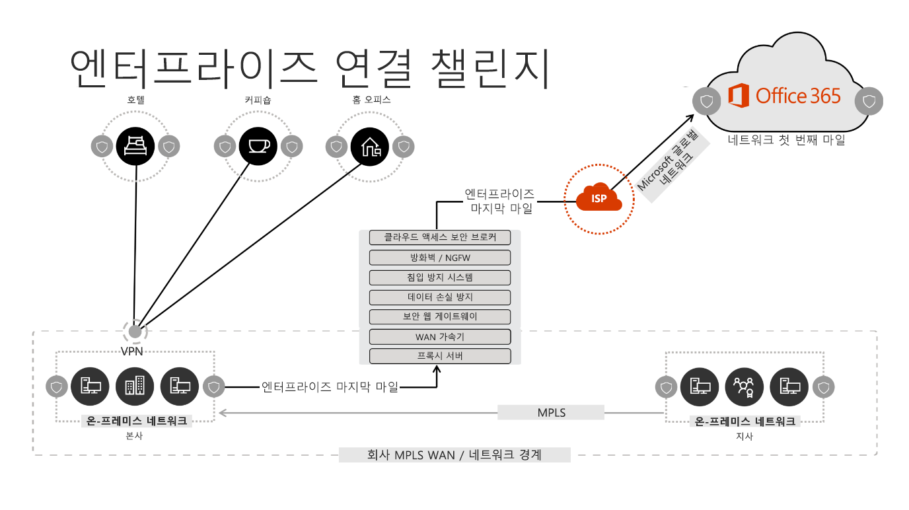
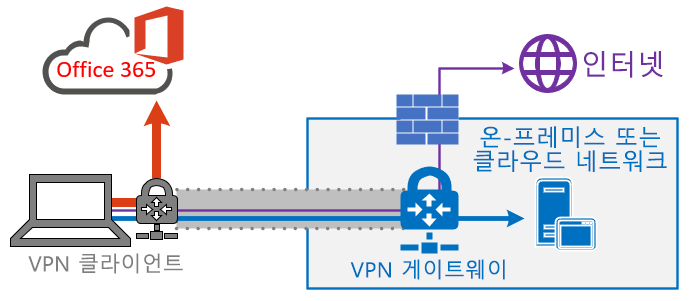
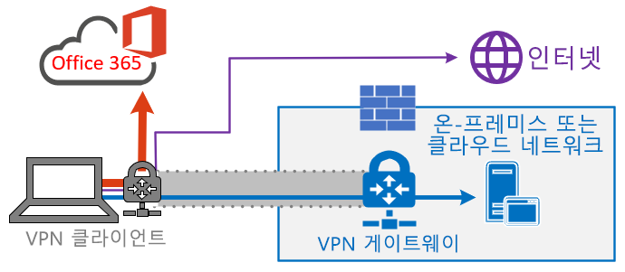
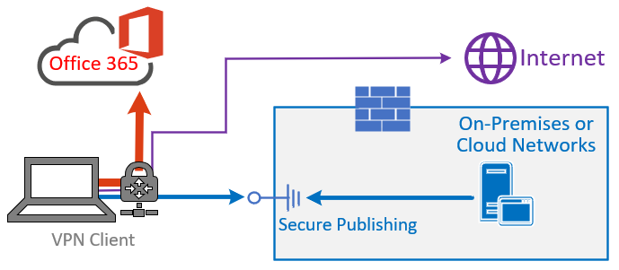
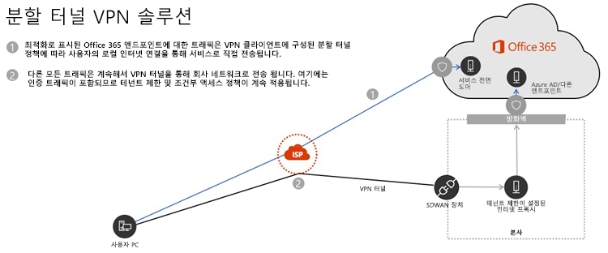

# <a name="implementing-vpn-split-tunneling-for-office-365"></a>Office 365 VPN 분할 터널링 구현

>[!NOTE]
>이 항목은 원격 사용자의 Office 365 최적화를 다루는 항목 모음의 일부입니다.
>- 원격 사용자의 Office 365 연결성을 최적화하는 VPN 분할 터널링을 사용하는 방법에 대한 개요는 [개요: Office 365 VPN 분할 터널링](office-365-vpn-split-tunnel.md)을 참조하세요.
>- 중국 사용자를 위한 Office 365 월드와이드 테넌트 성능을 최적화하는 방법에 대한 자세한 내용은 [중국 사용자를 위한 Office 365 성능 최적화](office-365-networking-china.md)를 참조하세요.

몇 년 동안 기업은 VPN을 사용하여 사용자의 원격 환경을 지원하고 있습니다. 핵심 작업은 온-프레미스로 유지되었지만, 회사 네트워크의 데이터 센터를 통해 라우팅된 원격 클라이언트의 VPN은 원격 사용자가 회사 리소스에 액세스하는 기본 방법이었습니다. 이러한 연결을 보호하기 위해 기업은 VPN 경로를 따라 네트워크 보안 솔루션 계층을 구축합니다. 이는 내부 인프라를 보호하는 것은 물론, 트래픽을 VPN으로 다시 라우팅한 다음 온-프레미스 인터넷 경계로 라우팅하여 외부 웹 사이트의 모바일 브라우징을 보호하기 위해 수행되었습니다. VPN, 네트워크 경계 및 관련 보안 인프라는 정의된 트래픽 용량에 맞춘 용도로 개발되고 크기가 조정되는 경우가 많으며, 회사 네트워크 내에서 대부분의 연결이 시작되고 대부분의 내부 네트워크 경계 내에 유지됩니다.

상당 기간, 동시적 원격 사용자의 규모가 적당하고 VPN을 통과하는 트래픽 양이 적은 경우에는원격 사용자 장치의 모든 연결이 온-프레미스 네트워크로 라우팅되는 VPN 모델(**강제 터널링**으로 알려짐)을 지속할 수 있었습니다.  일부 고객은 응용 프로그램이 회사 경계 내부에서 Office 365와 같은 공용 SaaS 클라우드로 이동한 후에도 VPN 강제 터널링을 계속 사용하였습니다.

분산되고 성능에 민감한 클라우드 응용 프로그램에 연결하기 위해 강제 터널된 VPN을 사용하는 것은 최적의 선택은 아니지만, 일부 기업에서 보안 측면에서 현상을 유지하기 위해 이 방식의 부정적인 영향을 수용할 수 있었습니다. 이 시나리오의 예제 다이어그램은 다음과 같습니다.



이 문제는 수년간 계속 커졌으며 많은 고객들이 네트워크 트래픽 패턴의 큰 변화를 보고했습니다. 온-프레미스에 유지되었던 트래픽은 이제 외부 클라우드 끝점에 연결됩니다. 많은 Microsoft 고객이 이전에 네트워크 트래픽의 약 80%가 내부 원본(위의 다이어그램에서 점선으로 표시됨)에 대한 것이라고 보고했습니다. 2020년에 주요 작업을 클라우드로 이동시킴에 따라 이 수치가 현재 약20 % 이하로 떨어졌으며, 이러한 추세는 다른 기업에서는 드문 일이 아닙니다. 시간이 지나며 클라우드 마이그레이션이 진행됨에 따라 위의 모델은 점점 번거롭고 지속하기 어려워졌으며, 조직이 클라우드 우선 환경으로 진입하는 상황에서 조직의 민첩성에 방해가 되었습니다.

이 위기는 전 세계 COVID-19 팬데믹으로 인해 즉시 해결해야 하는 사항으로 떠올랐습니다. 직원의 안전을 보장하기 위해 대규모의 재택 근무 생산성을 지원하기 위한 기업 IT에 전례없는 대한 수요가 발생했습니다. Microsoft Office 365는 고객이 이러한 요구를 충족하도록 지원하는 데 적합한 위치에 있지만, 집에서 작업하는 사용자의 동시성이 높으면 강제 터널 VPN 및 온-프레미스 네트워크 경계를 통해 라우팅되는 경우 빠르게 포화시키고 VPN 인프라의 용량이 부족하게 하는 대량의 Office 365 트래픽이 생성됩니다. 이렇게 새롭게 변한 현실에서 VPN을 사용하여 Office 365에 액세스하는 것은 더 이상 성능 장애를 일으키는 것이 아니라, Office 365뿐만 아니라 운영을 위해 VPN에 계속 의존해야 하는 중요한 비즈니스 활동에 영향을 주는 중요한 요소가 되었습니다.

Microsoft는 자체 서비스 내에서 이러한 문제에 대한 효과적인 최신 솔루션을 제공하고 업계 모범 사례에 맞추기 위해 수년간 고객 및 더 다양한 업계와 긴밀히 협력하고 있습니다. Office 365 서비스의 [연결 원칙](https://aka.ms/pnc)은 조직이 원격 사용자의 연결에 대한 보안과 제어를 계속 유지할 수 있도록 하는 동시에 원격 사용자에게 효과적으로 작동하도록 설계되었습니다. 이러한 솔루션은 제한된 작업으로 매우 빠르게 구현할 수 있으며, 위에서 설명한 문제에 상당히 긍정적인 영향을 미칩니다.

Microsoft에서 원격 작업자의 연결을 최적화에 권장하는 전략은 전통적인 접근 방식의 문제를 신속하게 완화하고 몇 가지 간단한 단계를 통해 높은 성능을 제공하는 데 초점을 맞춥니다. 다음 단계는 병목 현상이 일어난 VPN 서버를 우회하는 소수의 정의된 끝점에 대한 기존 VPN 접근 방식을 조정합니다. 동등하거나 우수한 보안 모델을 다양한 계층에 적용할 수 있으므로 회사 네트워크 송신에서 모든 트래픽을 보호할 필요가 없습니다. 대부분의 경우 이를 몇 시간 내에 효과적으로 실현할 수 있으며 요구 사항 및 시간이 허용되면 다른 작업으로 확장할 수 있습니다.

## <a name="common-vpn-scenarios"></a>일반적인 VPN 시나리오

아래 목록에는 엔터프라이즈 환경의 가장 일반적인 VPN 시나리오가 표시됩니다. 대부분의 고객은 일반적으로 모델 1(VPN 강제 터널)을 사용합니다. 이 섹션은 비교적 적은 노력으로 달성할 수 있고 네트워크 성능 및 사용자 환경에 큰 이점을 제공하는 **모델 2**로 빠르고 안전하게 전환하는 데 도움이 됩니다.

| **모델** | **설명** |
| --- | --- |
| [1. VPN 강제 터널](#1-vpn-forced-tunnel) | 온-프레미스, 인터넷 및 모든 O365/M365를 포함한 트래픽의 100%를 VPN 터널로 전송 |
| [2. VPN 강제 터널(일부 예외 포함)](#2-vpn-forced-tunnel-with-a-small-number-of-trusted-exceptions) | VPN 터널이 기본적으로 사용되며 (VPN로의 기본 라우팅 포인트) 직접 전송하도록 허용된 가장 중요한 몇 가지 예외 시나리오가 있음 |
| [3. VPN 강제 터널(광범위한 예외 포함)](#3-vpn-forced-tunnel-with-broad-exceptions) | VPN 터널이 기본적으로 사용되며 (VPN로의 기본 라우팅 포인트) 직접 전송하도록 허용된 광범위한 예외가 있음(예: 모든 Office 365, 모든 Salesforce, 모든 Zoom) |
| [4. VPN 선택적 터널](#4-vpn-selective-tunnel) | VPN 터널은 Corpnet 기반 서비스에서만 사용됩니다. 기본 경로(인터넷 및 모든 인터넷 기반 서비스)가 직접 이동합니다. |
| [5. VPN 없음](#5-no-vpn) | 2번의 변형으로, 모든 Corpnet 서비스가 기존 VPN 대신 최신 보안 방식(예: Zscaler ZPA, AAD Proxy/MCAS)을 통해 게시됨 |

### <a name="1-vpn-forced-tunnel"></a>1. VPN 강제 터널

대부분의 엔터프라이즈 고객에게 가장 일반적인 시작 시나리오입니다. 강제 VPN이 사용됩니다. 즉, 끝점이 회사 네트워크 내에 존재하는지와 상관없이 트래픽의 100%가 회사 네트워크로 전송됩니다. 그런 다음 Office 365 또는 인터넷 브라우징과 같은 외부 (인터넷) 바운드 트래픽은 프록시와 같은 온-프레미스 보안 장비에서 헤어핀됩니다. 이 모델은 사용자의 약 100%가 원격으로 작업하고 있는 현재 환경에서 VPN 인프라에 상당한 부하를 가하고 모든 기업 트래픽의 성능을 크게 저해하여 기업이 위기 상황에서 효율적으로 운영되기 어렵게 합니다.


### <a name="2-vpn-forced-tunnel-with-a-small-number-of-trusted-exceptions"></a>2. 소수의 신뢰할 수 있는 예외가 있는 VPN 강제 터널

이 모델은 부하가 많고 대기 시간에 민감하며 제어되고 정의된 소수의 끝점이 VPN 터널을 우회하고 이 예제의 Office 365 서비스로 직접 전달할 수 있도록 허용하므로 기업에서 운영하기에 훨씬 더 효율적입니다. 이렇게 하면 오프로드된 서비스의 성능이 크게 향상되고 VPN 인프라에 가해지는 부하가 줄기 때문에, 작동에 리소스 경합성이 적은 요소를 허용할 수 있습니다. 이 모델은 이 문서에서 매우 신속하게 간단하고 정의된 작업을 수행할 수 있도록 하며 여러 긍정적인 결과를 제공하는 전환을 지원하기 위해 집중적으로 설명하는 모델입니다.


### <a name="3-vpn-forced-tunnel-with-broad-exceptions"></a>3. VPN 강제 터널(광범위한 예외 포함)

세 번째 모델은 정의된 끝점의 작은 그룹을 직접 보내는 것이 아니라 모델 2의 범위를 넓히며, 대신 Office 365, SalesForce 등의 신뢰할 수있는 서비스에 모든 트래픽을 직접 보냅니다. 따라서 회사 VPN 인프라의 부하가 줄어들며 정의된 서비스의 성능이 향상됩니다. 이 모델은 실행 가능성을 평가하고 구현하는 데 시간이 오래 걸릴 수 있으므로 모델 2가 성공적으로 적용된 이후에 반복적으로 수행할 수 있는 단계가 될 가능성이 높습니다.



### <a name="4-vpn-selective-tunnel"></a>4. VPN 선택적 터널

이 모델은 회사 IP 주소를 포함하는 것으로 식별된 트래픽만 VPN 터널로 전송되므로 인터넷 경로가 그 밖의 모든 항목의 기본 경로라는 점에서 세 번째 모델과 반대입니다. 이 모델을 안전하게 구현하려면 조직에서 [제로 트러스트](https://www.microsoft.com/security/zero-trust?rtc=1) 경로를 제대로 따라야 하빈다. 점점 더 많은 서비스가 회사 네트워크에서 클라우드로 이동함에 따라 이 모델이나 이 모델의 일부 변형은 시간이 지남에 따라 필수적인 기본값이 될 수 있다는 점에 유의해야 합니다. Microsoft는 내부적으로 이 모델을 사용합니다. Microsoft의 VPN 분할 터널링 구현에 대한 자세한 내용은 [VPN에서 실행: Microsoft가 원격 인력을 연결 상태로 유지하는 방법](https://www.microsoft.com/itshowcase/blog/running-on-vpn-how-microsoft-is-keeping-its-remote-workforce-connected/?elevate-lv)을 참조하세요.



### <a name="5-no-vpn"></a>5. VPN 없음

모델 2을 더 개선한 버전이며, 모든 내부 서비스를 Azure AD 프록시, MCAS, Zscaler ZPA 등과 같은 SDWAN 솔루션 또는 최신 보안 방식을 통해 게시하는 모델



## <a name="implement-vpn-split-tunneling"></a>VPN 분할 터널링 구현

이 섹션에서는 VPN 클라이언트 아키텍처를 [일반적인 VPN 시나리오](#common-vpn-scenarios) 섹션의 _VPN 강제 터널_에서 _소수의 신뢰할 수 있는 예외가 있는 VPN 강제 터널_, [분할 터널 VPN 모델 2](#2-vpn-forced-tunnel-with-a-small-number-of-trusted-exceptions)까지 마이그레이션하는 데 필요한 몇 가지 간단한 단계가 나와 있습니다.

다음 다이어그램은 권장 VPN 분할 터널 솔루션이 어떻게 진행되는지 보여줍니다.



### <a name="1-identify-the-endpoints-to-optimize"></a>1. 최적화할 끝점 식별

Microsoft는 [Office 365 URL 및 IP 주소 범위](https://docs.microsoft.com/office365/enterprise/urls-and-ip-address-ranges) 항목에서 최적화해야 하는 주요 끝점을 명확하게 식별하고 이를 ** 최적화**로 분류합니다. 현재 4개의 URL과 20개의 IP 서브넷을 최적화해야 합니다. 이 작은 끝점 그룹은 Teams 미디어와 같은 대기 시간에 민감한 끝점을 포함하여 Office 365 서비스에 대한 트래픽 양의 약 70% - 80%에 해당합니다. 본질적으로 이 트래픽은 특별한 주의를 기울여야 하는 트래픽이며 기존 네트워크 경로 및 VPN 인프라에 엄청난 압력을 가하는 트래픽이기도 합니다.

이 범주의 URL의 특징은 다음과 같습니다.

- Microsoft 인프라에서 호스트되며 Microsoft에서 소유 및 관리하는 끝점
- IP 제공
- 낮은 변경률 및 적은 수로 유지될 것으로 예상됨(현재 IP 서브넷 20개)
- 대역폭 및/또는 대기 시간에 민감
- 네트워크의 인라인 대신, 서비스에서 제공되는 필수 보안 요소가 제공될 수 있음
- Office 365 서비스에 대한 트래픽 양의 약 70-80% 차지

>[!NOTE]
>Microsoft는 **2020년 6월 30일**까지 Office 365에 대한 **최적화** 끝점 변경을 중단하여, 고객이 처음 구현된 끝점 허용 목록을 유지하는 대신 다른 문제에 집중할 수 있도록 노력하고 있습니다. 이 문서는 이후의 변경 사항을 반영하여 업데이트됩니다.

Office 365 끝점과 이를 분류 및 관리 방법에 대한 자세한 내용은 [Office 365 끝점 관리](managing-office-365-endpoints.md) 문서를 참조하세요.

#### <a name="optimize-urls"></a>URL 최적화

현재 최적화 URL은 아래 표에서 확인할 수 있습니다. 대부분의 경우 사용자는 프록시가 아니라 직접 전송되도록 구성된 [브라우저 PAC 파일](managing-office-365-endpoints.md#use-a-pac-file-for-direct-routing-of-vital-office-365-traffic)의 URL 끝점만 사용해야 합니다.

| URL 최적화 | 포트/프로토콜 | 용도 |
| --- | --- | --- |
| <https://outlook.office365.com> | TCP 443 | 이는 Outlook이 Exchange Online 서버에 연결하는 데 사용하는 기본 URL 중 하나이며 대역폭 사용량 및 연결 수가 많습니다. 빠른 검색, 다른 사서함 일정, 약속 있음/없음 조회, 규칙 및 알림 관리, Exchange Online Archive, 보낼 편지함에서 보내는 전자 메일과 같은 온라인 기능을 사용하려면 네트워크 대기 시간이 짧아야 합니다. |
| <https://outlook.office.com> | TCP 443 | 이 URL은 Outlook Online 웹 액세스에서 Exchange Online 서버에 연결하는 데 사용되며 네트워크 대기 시간에 민감합니다. SharePoint Online을 통한 대용량 파일 업로드 및 다운로드에는 연결이 특히 필요합니다. |
| https://\<tenant\>.sharepoint.com | TCP 443 | 이는 SharePoint Online의 기본 URL이며 대역폭 사용량이 높습니다. |
| https://\<tenant\>-my.sharepoint.com | TCP 443 | 이는 비즈니스용 OneDrive의 기본 URL이며 비즈니스용 OneDrive 동기화 도구에서 대역폭 사용량 및 연결 수가 많을 수 있습니다. |
| Teams 미디어 IP(URL 없음) | UDP 3478, 3479, 3480 및 3481 | 릴레이 검색 할당 및 실시간 트래픽(3478), 오디오(3479), 비디오(3480) 및 비디오 화면 공유(3481). 비즈니스용 Skype 및 Microsoft Teams 미디어 트래픽(통화, 모임 등)에 사용되는 끝점입니다. 대부분의 끝점은 Microsoft Teams 클라이언트에서 호출을 설정할 때 제공됩니다. (또한 서비스에 대해 나열된 필수 IP에 포함됩니다) 최적의 미디어 품질을 위해서는 UDP 프로토콜을 사용해야 합니다.   |

위 예제에서 **테넌트**는 Office 365 테넌트 이름으로 바꿔야 합니다. 예를 들어 **contoso.onmicrosoft.com**은 _contoso.sharepoint.com_ 및 _constoso-my.sharepoint.com_을 사용합니다.

#### <a name="optimize-ip-address-ranges"></a>IP 주소 범위 최적화

이 문서를 작성하는 현재 이러한 끝점에 해당하는 IP 범위는 다음과 같습니다. 구성을 적용할 때 이 예제, [Office 365 IP 및 URL 웹 서비스](https://docs.microsoft.com/office365/enterprise/office-365-ip-web-service) 또는 [URL/IP 페이지](https://docs.microsoft.com/office365/enterprise/urls-and-ip-address-ranges)와 같은 [스크립트](https://github.com/microsoft/Office365NetworkTools/tree/master/Scripts/Display%20URL-IPs-Ports%20per%20Category)를 사용하여 업데이트를 확인하고 정기적으로 이 작업을 수행하는 데 필요한 정책을 설정할 것을 **권장**합니다.

```
104.146.128.0/17
13.107.128.0/22
13.107.136.0/22
13.107.18.10/31
13.107.6.152/31
13.107.64.0/18
131.253.33.215/32
132.245.0.0/16
150.171.32.0/22
150.171.40.0/22
191.234.140.0/22
204.79.197.215/32
23.103.160.0/20
40.104.0.0/15
40.108.128.0/17
40.96.0.0/13
52.104.0.0/14
52.112.0.0/14
52.96.0.0/14
52.120.0.0/14
```

### <a name="2-optimize-access-to-these-endpoints-via-the-vpn"></a>2. VPN을 통해 이러한 끝점에 대한 액세스 최적화

이제 주요 끝점을 식별했으므로 VPN 터널에서 끝점을 전환하고 사용자의 로컬 인터넷 연결을 사용하여 서비스에 직접 연결할 수 있도록 허용해야 합니다. 이 작업을 수행하는 방법은 사용하는 VPN 제품 및 컴퓨터 플랫폼에 따라 다르지만, 대부분의 VPN 솔루션은 이 논리를 적용하는 간단한 정책 구성을 허용합니다. VPN 플랫폼별 분할 터널 안내에 대한 자세한 내용은 [공통 VPN 플랫폼 사용 방법 가이드](#howto-guides-for-common-vpn-platforms)를 참조하세요.

솔루션을 수동으로 테스트하려는 경우 다음 PowerShell 예제를 실행하여 경로 테이블 수준에서 솔루션을 에뮬레이션할 수 있습니다. 이 예제에서는 경로 테이블에 각 Teams 미디어 IP 서브넷의 경로를 추가합니다. 전후의 Teams 미디어 성능을 테스트하고 지정된 끝점에 대한 경로 차이를 확인할 수 있습니다.

#### <a name="example-add-teams-media-ip-subnets-into-the-route-table"></a>예제: 경로 테이블에 Teams 미디어 IP 서브넷 추가

```powershell
$intIndex = "" # index of the interface connected to the internet
$gateway = "" # default gateway of that interface
$destPrefix = "52.120.0.0/14", "52.112.0.0/14", "13.107.64.0/18" # Teams Media endpoints
# Add routes to the route table
foreach ($prefix in $destPrefix) {New-NetRoute -DestinationPrefix $prefix -InterfaceIndex $intIndex -NextHop $gateway}
```

위 스크립트에서 _$intIndex_는 인터넷에 연결된 인터페이스의 색인(PowerShell에서 **get-netadapter**를 실행하여 찾고 _ifIndex_ 값 확인)이며 _$gateway_는 해당 인터페이스의 기본 게이트웨이(명령 프롬프트에서 **ipconfig**나 PowerShell에서 **(Get-NetIPConfiguration | Foreach IPv4DefaultGateway).NextHop**를 실행하여 찾기)입니다.

경로를 추가 한 후 명령 프롬프트 또는 PowerShell에서 **route print**를 실행하여 경로 테이블이 올바른지 확인할 수 있습니다. 출력에는 인터페이스 색인(이 예제의 경우 _22_)과 해당 인터페이스의 게이트웨이(이 예제의 경우 _192.168.1.1_)를 표시하는 추가된 경로가 포함되어야 합니다.


최적화 범주에서 **모든** 현재 IP 주소 범위에 대한 경로를 추가하려면 다음 스크립트 변형을 사용하여 현재 최적화 IP 서브넷 집합에 대해 [Office 365 IP 및 URL 웹 서비스](https://docs.microsoft.com/office365/enterprise/office-365-ip-web-service)를 쿼리하고 이를 라우팅 테이블에 추가할 수 있습니다.

#### <a name="example-add-all-optimize-subnets-into-the-route-table"></a>예제: 경로 테이블에 모든 최적화 서브넷 추가

```powershell
$intIndex = "" # index of the interface connected to the internet
$gateway = "" # default gateway of that interface
# Query the web service for IPs in the Optimize category
$ep = Invoke-RestMethod ("https://endpoints.office.com/endpoints/worldwide?clientrequestid=" + ([GUID]::NewGuid()).Guid)
# Output only IPv4 Optimize IPs to $optimizeIps
$destPrefix = $ep | where {$_.category -eq "Optimize"} | Select-Object -ExpandProperty ips | Where-Object { $_ -like '*.*' }
# Add routes to the route table
foreach ($prefix in $destPrefix) {New-NetRoute -DestinationPrefix $prefix -InterfaceIndex $intIndex -NextHop $gateway}
```

실수로 잘못된 매개 변수를 사용하여 경로를 추가했거나 변경 사항을 되돌리려는 경우 다음 명령을 사용하여 방금 추가한 경로를 제거할 수 있습니다.

```powershell
foreach ($prefix in $destPrefix) {Remove-NetRoute -DestinationPrefix $prefix -InterfaceIndex $intIndex -NextHop $gateway}
```

<!--- remmed until we add more reliable interface selection logic
#### Example script to add Teams Media subnets to the route table

```powershell
$adapter = get-netadapter | ? {$_.Status -eq "Up"}
$adapterIndex = $adapter.ifIndex
$gateway = (Get-NetIPConfiguration | Foreach IPv4DefaultGateway).NextHop

$destPrefix = "52.120.0.0/14", "52.112.0.0/14", "13.107.64.0/18"
foreach ($prefix in $destPrefix) {New-NetRoute -DestinationPrefix $prefix -InterfaceIndex $intIndex -NextHop $gateway}
```
-->

**최적화** IP에 대한 트래픽이 이 방식으로 라우팅되도록 VPN 클라이언트를 구성해야 합니다. 이를 통해 트래픽은 사용자에게 최대한 근접한 연결 끝점 및 Office 365 서비스를 제공하는 [ Azure Front Door](https://azure.microsoft.com/blog/azure-front-door-service-is-now-generally-available/) 등 Office 365 Service Front Door와 같은 로컬 Microsoft 리소스를 이용할 수 있습니다. 따라서 전 세계 사용자에게 매우 뛰어난 성능을 제공할 수 있으며, 사용자가 직접 송신하는 데 시간이 거의 걸리지 않는 경우 [Microsoft의 세계적인 글로벌 네트워크](https://azure.microsoft.com/blog/how-microsoft-builds-its-fast-and-reliable-global-network/)를 최대한 활용할 수 있습니다.

## <a name="configuring-and-securing-teams-media-traffic"></a>Teams 미디어 트래픽 구성 및 보안

일부 관리자는 분할 터널링 모델을 사용하여 Teams에서 호출 흐름이 작동하는 방식과 연결 보안을 설정하는 방법에 대한 자세한 정보가 필요할 수 있습니다.

### <a name="configuration"></a>구성

호출 및 모임의 경우 Teams 미디어의 필수 최적화 IP 서브넷이 라우팅 테이블에 제대로 포함되어 있는 경우에는 Teams가 _GetBestRoute_ 메서드를 호출하여 특정 대상에 어떤 인터페이스를 사용해야 하는지 결정하면, 위에 나열된 Microsoft IP 블록의 Microsoft 대상에 대해 로컬 인터페이스가 반환됩니다.

일부 VPN 클라이언트 소프트웨어는 URL을 기반으로 경로를 조작할 수 있습니다. 그러나 Teams 미디어 트래픽에는 연결된 URL이 없으므로 이 트래픽에 대한 경로 제어는 IP 서브넷을 사용하여 수행해야 합니다.

특정 시나리오에서 Teams 클라이언트 구성과 관련이 없는 경우가 많지만, 미디어 트래픽은 올바른 경로를 사용하는 경우에도 계속 VPN 터널을 통과합니다. 이 시나리오가 발생하는 경우 방화벽 규칙을 사용하여 Teams IP 서브넷 또는 포트에서 VPN을 사용하지 못하도록 차단하면 됩니다.

>[!NOTE]
>현재 이 작업이 100%의 모든 시나리오에서 작동하도록 하려면 IP 범위 **13.107.60.1/32**를 추가해야 합니다. **2020년 6월**까지 릴리스 예정인 Teams 클라이언트 업데이트로 인해 이 작업은 더 이상 필요하지 않을 것입니다. 향후 더 상세한 내용이 추가되면 이 문서에 빌드 세부 정보를 업데이트하겠습니다.

<!--
>[!IMPORTANT]
>To ensure Teams media traffic is routed via the desired method in all VPN scenarios please ensure you are running at least the following client version number or greater, as these versions have improvements in how the client detects available network paths.<br>Windows version number:  **1.3.00.9267**<br>Mac version number: **1.3.00.9221**
-->

신호 트래픽은 HTTPS를 통해 수행되고 미디어 트래픽만큼 대기 시간에 민감하지 않으며 URL/IP 데이터에서 **허용**으로 표시되므로 원하는 경우 VPN 클라이언트를 통해 안전하게 라우팅할 수 있습니다.

### <a name="security"></a>보안

분할 터널 방지를 찬성하는 일반적인 주장 중 분할 터널의 안정성 수준이 낮다는 것입니다. 즉 VPN 터널을 통과하지 않는 트래픽은 VPN 터널에 적용되는 암호화 구성표를 활용할 수 없으므로, 보안성이 떨어진다는 것입니다.

이에 대한 주요 반론은 미디어 트래픽이 RTP(Real-Time Transport Protocol) 트래픽에 기밀유지, 인증 및 재생 공격으로부터 보호 기능을 제공하는 RTP 프로필인 _보안 RTP(SRTP)_ 를 사용하여 이미 암호화되어 있다는 것입니다. SRTP 자체는 TLS 보안 신호 채널을 통해 교환되는 임의로 생성된 세션 키에 의존합니다. 이에 대한 자세한 내용은 [이 보안 가이드](https://docs.microsoft.com/skypeforbusiness/optimizing-your-network/security-guide-for-skype-for-business-online)에 자세히 설명되어 있지만, 주된 관심 분야은 미디어 암호화입니다.

미디어 트래픽은 안전한 난수 생성기를 사용하여 생성되고 신호 TLS 채널을 사용하여 교환되는 세션 키를 사용하는 SRTP를 사용하여 암호화됩니다. 또한 중재 서버와 내부 다음 홉 사이에 양방향으로 흐르는 미디어도 SRTP를 사용하여 암호화됩니다.

비즈니스용 Skype 온라인은 _ TURN(NAT 주변의 릴레이를 사용한 트래버스)_ 을 통해 미디어 릴레이에 안전하게 액세스할 수 있도록 사용자 이름/암호를 생성합니다. 미디어 릴레이는 TLS 보안 SIP 채널을 통해 사용자 이름/암호를 교환합니다. VPN 터널을 사용하여 클라이언트를 회사 네트워크에 연결하는 경우에도 트래픽이 회사 네트워크를 떠나 서비스에 도달할 때 계속 SRTP 형식으로 흘러야 합니다.

Teams가 음성 또는 _STUN(NAT의 세션 탐색 유틸리티)_ 증폭 공격과 같은 일반적인 보안 문제를 완화하는 방법에 대한 정보는 [이 문서](https://docs.microsoft.com/openspecs/office_protocols/ms-ice2/69525351-8c68-4864-b8a6-04bfbc87785c)에 나와 있습니다.

원격 작업 시나리오에서 최신 보안 제어에 대한 자세한 내용은 [보안 전문가와 IT가 오늘날의 고유한 원격 작업 시나리오에서 최신 보안 제어를 달성할 수 있는 다른 방법(Microsoft 보안팀 블로그)](https://www.microsoft.com/security/blog/2020/03/26/alternative-security-professionals-it-achieve-modern-security-controls-todays-unique-remote-work-scenarios/)에서 알아볼 수 있습니다.

## <a name="testing"></a>테스트

정책이 적용되면 정책이 제대로 작동하는지 확인해야 합니다. 경로가 로컬 인터넷 연결을 사용하도록 올바르게 설정되었는지 테스트하는 방법에는 여러 가지가 있습니다.

- 위와 같이 추적 경로를 포함하여 연결 테스트를 실행하는 [Microsoft 365 연결성 테스트](https://aka.ms/netonboard)를 실행합니다. 또한 이 도구에 추가적인 정보를 제공할 수 있는 VPN 테스트를 추가하고 있습니다.

- 분할 터널 범위 내 끝점에 대한 간단한 tracert는 경로를 표시합니다. 예를 들면 다음과 같습니다.

  ```powershell
  tracert worldaz.tr.teams.microsoft.com
  ```

  그런 다음 로컬 ISP를 통해 당사가 분할 터널링을 위해 구성한 Teams 범위에 있는 IP로 향하는 이 끝점으로의 경로를 확인합니다.

- Wireshark와 같은 도구를 사용하여 네트워크 캡처를 수행합니다. 호출 동안 UDP를 필터링하면 Teams **최적화** 범위에서 트래픽이 IP로 흐르는 것을 볼 수 있습니다. 이 트래픽에 VPN 터널을 사용하는 경우 미디어 트래픽이 추적에 표시되지 않습니다.

### <a name="additional-support-logs"></a>추가 지원 로그

문제를 해결하기 위해 더 많은 데이터가 필요하거나 Microsoft 지원 서비스에 도움을 요청하는 경우 다음 정보를 확인하여 신속하게 해결 방법을 찾을 수 있습니다. Microsoft 지원 서비스의 **TSS Windows CMD 기반 범용 문제 해결 스크립트 도구 집합**을 사용하면 간단한 방법으로 관련 로그를 수집할 수 있습니다. 도구 및 사용 지침은 <https://aka.ms/TssTools.>에서 찾을 확인할 수 있습니다.

## <a name="howto-guides-for-common-vpn-platforms"></a>공통 VPN 플랫폼 사용 방법 가이드

이 섹션에서는 이 공간에서 가장 일반적인 파트너로부터 Office 365 트래픽에 대해 분할 터널링을 구현하기 위한 자세한 가이드에 대한 링크를 제공합니다. 추가 가이드는 사용 가능해지는 대로 추가될 예정입니다.

- **Windows 10 VPN 클라이언트**: [기본 Windows 10 VPN 클라이언트를 사용하여 원격 작업자를 위한 Office 365 트래픽 최적화](https://docs.microsoft.com/windows/security/identity-protection/vpn/vpn-office-365-optimization)
- **Cisco Anyconnect**: [Office365의 Anyconnect 분할 터널 최적화](https://www.cisco.com/c/en/us/support/docs/security/anyconnect-secure-mobility-client/215343-optimize-anyconnect-split-tunnel-for-off.html)
- **Palo Alto GlobalProtect**: [VPN 분할 터널을 통한 Office 365 트래픽 최적화 액세스 경로 제외](https://live.paloaltonetworks.com/t5/Prisma-Access-Articles/GlobalProtect-Optimizing-Office-365-Traffic/ta-p/319669)
- **F5 Networks BIG-IP APM**: [BIG-IP APM을 사용하는 경우 VPN을 통한 원격 액세스의 Office 365 트래픽 최적화](https://devcentral.f5.com/s/articles/SSL-VPN-Split-Tunneling-and-Office-365)
- **Citrix 게이트웨이**: [Office 365용 Citrix 게이트웨이 VPN 분할 터널 최적화](https://docs.citrix.com/ko-KR/citrix-gateway/13/optimizing-citrix-gateway-vpn-split-tunnel-for-office365.html)
- **Pulse Secure**: [VPN 터널링: 분할 터널링을 구성하 여 Office365 응용 프로그램을 제외하는 방법](https://kb.pulsesecure.net/articles/Pulse_Secure_Article/KB44417)

## <a name="faq"></a>FAQ

Microsoft 보안팀은 보안 전문가와 IT가 오늘날의 고유한 원격 작업 시나리오에서 최신 보안 제어를 달성할 수 있는 주요 방법을 간략하게 설명하는 [문서](https://www.microsoft.com/security/blog/2020/03/26/alternative-security-professionals-it-achieve-modern-security-controls-todays-unique-remote-work-scenarios/)를 게시했습니다. 또한 다음은 이 주제에 대한 일반적인 고객 질문과 대답입니다.

### <a name="how-do-i-stop-users-accessing-other-tenants-i-do-not-trust-where-they-could-exfiltrate-data"></a>사용자가 신뢰할 수 없고 데이터를 유출할 수 있는 다른 테넌트에 대한 사용자 액세스를 중지하려면 어떻게 해야 하나요?

해답은 [테넌트 제한이라는 기능](https://docs.microsoft.com/azure/active-directory/manage-apps/tenant-restrictions)입니다. 인증 트래픽은 용량이 크지 않고 대기 시간에 민감하지 않으므로 VPN 솔루션을 통해 기능이 적용되는 온-프레미스 프록시로 보낼 수 있습니다. 여기에 신뢰할 수있는 테넌트의 허용 목록이 유지되며 클라이언트가 신뢰할 수 없는 테넌트에 대한 토큰을 얻으려고 시도하면 프록시가 요청을 거부합니다. 테넌트를 신뢰할 수 있는 경우 사용자에게 올바른 자격 증명과 권한이 있으면 토큰에 액세스할 수 있습니다.

따라서 사용자가 위의 최적화 표시된 끝점에 TCP/UDP 연결을 하더라도 해당 테넌트에 액세스하기 위한 유효한 토큰이 없으면 로그인 및 데이터 액세스/이동할 수 없습니다.

### <a name="does-this-model-allow-access-to-consumer-services-such-as-personal-onedrive-accounts"></a>이 모델은 개인 OneDrive 계정과 같은 소비자 서비스에 대한 액세스를 허용하나요?

아니요, 허용하지 않습니다. Office 365 끝점은 소비자 서비스(예: Onedrive.live.com)와 동일하지 않으므로 분할 터널은 사용자가 소비자 서비스에 직접 액세스하는 것을 허용하지 않습니다. 소비자 끝점으로의 트래픽은 계속 VPN 터널을 사용하며 기존 정책이 계속 적용됩니다.

### <a name="how-do-i-apply-dlp-and-protect-my-sensitive-data-when-the-traffic-no-longer-flows-through-my-on-premises-solution"></a>트래픽이 더 이상 온-프레미스 솔루션을 통해 전달되지 않는 경우 DLP를 적용하고 중요한 데이터를 보호하려면 어떻게 해야 하나요?

Office 365에는 중요한 정보가 실수로 노출되는 것을 방지하기 위한 다양한 [기본 제공 도구](https://docs.microsoft.com/microsoft-365/compliance/data-loss-prevention-policies?view=o365-worldwide)가 있습니다. Teams 및 SharePoint의 기본 제공 [DLP 기능](https://docs.microsoft.com/microsoft-365/compliance/data-loss-prevention-policies?view=o365-worldwide)을 사용하여 부적절하게 저장되거나 공유된 중요한 정보를 감지할 수 있습니다. 원격 작업 전략에 BYOD(Bring Your Own Device) 정책이 포함된 경우에는 [조건부 액세스 앱 제어](https://docs.microsoft.com/azure/active-directory/conditional-access/app-based-conditional-access)를 사용하여 중요한 데이터가 사용자의 개인 장치에 다운로드되지 않도록 차단할 수 있습니다

### <a name="how-do-i-evaluate-and-maintain-control-of-the-users-authentication-when-they-are-connecting-directly"></a>사용자가 직접 연결할 때 사용자 인증을 평가하고 제어하는 방법은 무엇인가요?

Q1에 나와있는 테넌트 제한 기능 외에도 [조건부 액세스 정책](https://docs.microsoft.com/azure/active-directory/conditional-access/overview)을 적용하여 인증 요청의 위험을 동적으로 평가하고 적절하게 대응할 수 있습니다. Microsoft는 시간이 지남에 따라 [제로 트러스트 모델](https://www.microsoft.com/security/zero-trust?rtc=1)을 구현할 것을 권장하며 Azure AD 조건부 액세스 정책을 사용하여 모바일 및 클라우드 우선 환경에서 제어를 유지할 수 있습니다. 조건부 액세스 정책을 사용하면 다음과 같은 다양한 요인을 기반으로 인증 요청의 성공 여부를 실시간으로 결정할 수 있습니다.

- 장치가 알려진/신뢰할 수 있는/도메인에 가입된 장치입니까?
- IP – 알려진 회사 IP 주소에서 온 인증 요청입니까? 또는 신뢰할 수 없는 나라에서 온 요청입니까?
- 응용 프로그램 - 사용자에게 이 응용 프로그램을 사용할 권한이 있습니까?

그런 다음 이러한 정책을 기반으로 승인, MFA 트리거 또는 인증 차단과 같은 정책을 트리거할 수 있습니다.

### <a name="how-do-i-protect-against-viruses-and-malware"></a>바이러스 및 맬웨어를 방지하려면 어떻게 해야 하나요?

Office 365는 [이 문서에서 설명하는](https://docs.microsoft.com/office365/Enterprise/office-365-malware-and-ransomware-protection) 서비스 자체의 다양한 계층에서 최적화 표시된 끝점에 대한 보호를 제공합니다. 앞서 설명한 것처럼 이러한 보안 요소는 프로토콜/트래픽을 완전히 이해하지 못할 수 있는 장치와 함께 사용하는 것보다 서비스 자체에 제공하는 것이 훨씬 더 효율적입니다. 기본적으로 SharePoint Online은 알려진 맬웨어에 대해 [파일 업로드를 자동으로 검색](https://docs.microsoft.com/microsoft-365/security/office-365-security/virus-detection-in-spo?view=o365-worldwide)합니다.

위에 나열된 Exchange 끝점의 경우 [Exchange Online Protection](https://docs.microsoft.com/office365/servicedescriptions/exchange-online-protection-service-description/exchange-online-protection-service-description) 및 [Office 365 Advanced Threat Protection](https://docs.microsoft.com/office365/servicedescriptions/office-365-advanced-threat-protection-service-description)이 서비스에 대해 탁월한 트래픽 보안을 제공합니다.

### <a name="can-i-send-more-than-just-the-optimize-traffic-direct"></a>직접 최적화 트래픽보다 더 많이 보낼 수 있나요?

**최적화** 표시된 끝점이 낮은 수준의 작업을 최대한 활용할 수 있으므로 여기에 우선 순위를 부여해야 합니다. 그러나 원하는 경우 서비스가 작동하고 필요한 경우 끝점에 사용할 수 있는 IP를 제공하려면 허용 표시된 끝점이 필요합니다.

또한 일반적인 웹 브라우징에 대한 중앙 보안, 제어 및 회사 정책 응용 프로그램을 제공하는 보안 웹 게이트웨이라는 클라우드 기반 프록시/보안 솔루션을 제공하는 다양한 공급 업체가 있습니다. 이러한 솔루션은 사용자와 가까운 클라우드 기반 위치에서 안전한 인터넷 액세스를 제공하여 가용성이 높고 성능이 뛰어나며 사용자와 가깝게 프로비저닝된 경우 클라우드 우선 환경에서 제대로 작동할 수 있습니다. 일반적인 브라우징 트래픽을 위한 VPN/기업 네트워크를 통한 헤어핀의 필요성이 사라지며 중앙 보안 제어가 계속 가능합니다.

그러나 Microsoft는 이러한 솔루션을 사용하더라도 최적화 표시된 Office 365 트래픽을 서비스로 직접 보내는 것을 권장합니다.

Azure Virtual Network에 대한 직접 액세스를 허용하는 방법에 대한 지침은 기사 [Azure VPN 게이트웨이 지점-사이트를 사용하여 원격 작업](https://docs.microsoft.com/azure/vpn-gateway/work-remotely-support) 문서를 참조하세요.

### <a name="why-is-port-80-required-is-traffic-sent-in-the-clear"></a>포트 80이 필요한 이유는 무엇인가요? 트래픽이 보안되지 않은 상태로 전송되나요?

포트 80은 포트 443 세션으로의 리디렉션과 같은 용도로만 사용되며 고객 데이터는 포트 80을 통해 보내거나 액세스될 수 없습니다. [이 문서](https://docs.microsoft.com/microsoft-365/compliance/encryption?view=o365-worldwide)에서는 Office 365의 전송 중인 데이터와 미사용 데이터의 암호화에 대해 간략하게 설명하고, [이 문서](https://docs.microsoft.com/microsoftteams/microsoft-teams-online-call-flows#types-of-traffic)에서는 SRTP를 사용하여 Teams 미디어 트래픽을 보호하는 방법에 대해 설명합니다.

### <a name="does-this-advice-apply-to-users-in-china-using-a-worldwide-instance-of-office-365"></a>이 권고는 Office 365 월드와이드 인스턴스를 사용하는 중국 사용자에게 적용되나요?

**아니요**, 적용되지 않습니다. 위 권고가 해당되는 대상은 Office 365 월드와이드 인스턴스에 연결하는 PRC 사용자입니다. 이 지역은 국경 간 네트워크 혼잡이 자주 발생하기 때문에 직접 인터넷 송신 성능이 변할 수 있습니다. 이 지역의 대부분의 고객은 VPN을 사용하여 트래픽을 회사 네트워크로 가져오고 승인된 MPLS 회로 등을 사용하여 최적화된 경로를 통해 국가 외부로 송신합니다. 이에 대한 자세한 내용은 [중국 사용자를 위한 Office 365 성능 최적화](office-365-networking-china.md) 문서에 나와 있습니다.

## <a name="related-topics"></a>관련 항목

[개요: Office 365 VPN 분할 터널링](office-365-vpn-split-tunnel.md)

[중국 사용자를 위한 Office 365 성능 최적화](office-365-networking-china.md)

[보안 전문가와 IT가 오늘날의 고유한 원격 작업 시나리오에서 최신 보안 제어를 달성할 수 있는 다른 방법(Microsoft 보안팀 블로그)](https://www.microsoft.com/security/blog/2020/03/26/alternative-security-professionals-it-achieve-modern-security-controls-todays-unique-remote-work-scenarios/)

[Microsoft에서 VPN 성능 향상: Windows 10 VPN 프로필을 사용하여 자동 연결 허용](https://www.microsoft.com/itshowcase/enhancing-remote-access-in-windows-10-with-an-automatic-vpn-profile)

[VPN에서 실행: Microsoft가 원격 인력을 연결 상태로 유지하는 방법](https://www.microsoft.com/itshowcase/blog/running-on-vpn-how-microsoft-is-keeping-its-remote-workforce-connected/?elevate-lv)

[Office 365 네트워크 연결 원칙](office-365-network-connectivity-principles.md)

[Office 365 네트워크 연결 평가](assessing-network-connectivity.md) 

[Office 365 네트워크 및 성능 조정](network-planning-and-performance.md)
