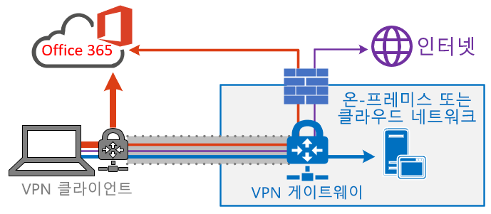
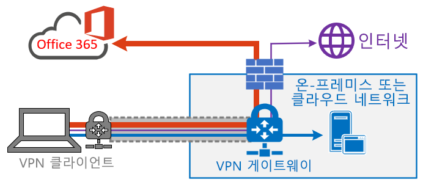

# VPN 분할 터널링을 사용하여 원격 사용자에게 맞도록 Office 365 연결 최적화
<!---
>[!NOTE]
>This topic is part of a set of topics that address Office 365 optimization for remote users.
>- For VPN split tunnel implementation guidance, see [Implementing VPN split tunneling for Office 365](office-365-vpn-implement-split-tunnel.md).
>- For information about optimizing Office 365 worldwide tenant performance for users in China, see [Office 365 performance optimization for China users](office-365-networking-china.md).
-->

원격 작업자 디바이스를 VPN을 통해 회사 네트워크 또는 클라우드 인프라에 연결하는 고객의 경우 주요 Office 365 시나리오 **Microsoft Teams**, **SharePoint Online** 및 **Exchange Online**이 _VPN 분할 터널_ 구성을 통해 라우팅되도록 하는 것이 좋습니다. 이것은 COVID-19 위기와 같은 대규모 회사-집 이벤트 동안 지속적인 직원 생산성을 지원하기 위한 최전방 전략으로 특히 중요합니다.

_그림 1: Office 365 예외가 정의된 VPN 분할 터널 솔루션이 서비스에 직접 전송됩니다. 다른 모든 트래픽은 대상에 관계없이 VPN 터널을 트래버스합니다._

이 방법의 핵심은 엔터프라이즈에서 VPN 인프라가 포화할 위험을 완화하고 최대한 짧은 기간에 Office 365 성능을 크게 향상시키는 간단한 방법을 제공한다는 것입니다. 가장 중요한 고용량 Office 365 트래픽이 VPN 터널을 우회할 수 있도록 VPN 클라이언트를 구성하면 다음과 같은 이점을 얻을 수 있습니다.

- Office 365 사용자 환경에 영향을 미치는 엔터프라이즈 VPN 아키텍처에서 고객에게 보고되는 대부분의 성능 및 네트워크 용량 문제에 대한 근본적인 원인을 즉시 완화
  
  권장되는 솔루션은 구체적으로 [Office 365 URL 및 IP 주소 범위 ](https://aka.ms/o365ips) 항목에서 **최적화**로 분류되는 Office 365 서비스 끝점을 대상으로 합니다. 이러한 끝점에 대한 트래픽은 대기 시간 및 대역폭 제한에 매우 중요하며, VPN 터널을 우회하도록 하면 최종 사용자 환경을 크게 개선하고 회사 네트워크 부하를 줄일 수 있습니다. 대부분의 대역폭이나 사용자 환경 공간에 포함되지 않는 Office 365 연결과 나머지 인터넷 바인딩 트래픽은 계속해서 VPN 터널을 통해 라우팅될 수 있습니다. 자세한 내용은 [VPN 분할 터널 전략](#the-vpn-split-tunnel-strategy)을 참조하세요.

- 추가 인프라 또는 응용 프로그램 요구 사항 없이 고객이 빠르게 구성, 테스트 및 구현 가능

  VPN 플랫폼 및 네트워크 아키텍처에 따라 구현에 몇 시간 정도 걸릴 수 있습니다. 자세한 내용은 [VPN 분할 터널링 구현](office-365-vpn-implement-split-tunnel.md#implement-vpn-split-tunneling)을 참조하세요.

- 인터넷 트래픽을 포함하여 다른 연결이 라우팅되는 방식을 변경하지 않도록 하여 고객 VPN 구현의 보안 상태를 유지합니다.

  권장되는 구성은 VPN 트래픽 예외에 대한 **최소 권한** 원칙을 따르고, 고객이 사용자나 인프라를 추가적인 보안 위험에 노출하지 않으면서 분할 터널 VPN을 구현할 수 있게 하는 것입니다. Office 365 끝점으로 직접 라우팅되는 네트워크 트래픽은 암호화되고, Office 클라이언트 응용 프로그램 스택의 무결성이 확인되고, 응용 프로그램 및 네트워크 수준에서 모두 강화되는 Office 365 서비스 전용 IP 주소로 범위가 지정됩니다. 자세한 내용은 [보안 전문가와 IT가 오늘날의 고유한 원격 작업 시나리오에서 최신 보안 제어를 달성할 수 있는 다른 방법(Microsoft 보안팀 블로그)](https://www.microsoft.com/security/blog/2020/03/26/alternative-security-professionals-it-achieve-modern-security-controls-todays-unique-remote-work-scenarios/)을 참조하세요.

- 대부분의 엔터프라이즈 VPN 플랫폼에서 기본적으로 지원

  Microsoft는 상업용 VPN 솔루션을 생성하는 산업 파트너와 계속 협력하면서 위에 설명된 권장 사항과 맞는 솔루션을 위한 구성 템플릿과 목표 지침을 개발하도록 지원합니다. 자세한 내용은 [공통 VPN 플랫폼 사용 방법 가이드](office-365-vpn-implement-split-tunnel.md#howto-guides-for-common-vpn-platforms)를 참조하세요.

>[!TIP]
>Office 365 서비스에 대해 문서화된 전용 IP 범위에 맞는 분할 터널 VPN 구성을 구현하는 것이 좋습니다. 특정 VPN 클라이언트 플랫폼에서 사용할 수 있는 FQDN 또는 AppID 기반 분할 구성에서 주요 Office 365 시나리오를 모두 해결하지는 못할 수 있으며 IP 기반 VPN 라우팅 규칙과 충돌할 수도 있습니다. 따라서 Office 365 FQDN을 사용하여 분할 터널 VPN을 구성하지 않는 것이 좋습니다. FQDN 구성을 사용하는 것은 .pac 파일을 사용자 지정하거나 프록시 무시를 구현하는 경우 등의 기타 관련 시나리오에서 유용할 수 있습니다.

전체 구현 지침은 [Office 365 VPN 분할 터널링 구현](office-365-vpn-implement-split-tunnel.md)을 참조하세요.

## VPN 분할 터널 전략

기존의 회사 네트워크는 대부분의 중요한 데이터, 서비스, 응용 프로그램이 온-프레미스에서 호스트되고, 대부분의 사용자가 그런 것처럼 내부 회사 네트워크에 직접 연결되는 클라우드 이전 환경에서 안전하게 작동하도록 디자인되어 있습니다. 따라서 네트워크 인프라는 이러한 요소를 기준으로 작성되어 있습니다. _MPLS(Multiprotocol Label Switching)_ 네트워크를 통해 본사에 연결되어 있으며 원격 사용자는 온-프레미스 끝점과 인터넷에 액세스하기 위해 VPN을 통해 회사 네트워크에 연결해야 합니다. 이 모델에서 원격 사용자가 보낸 모든 트래픽은 회사 네트워크를 트래버스하며, 일반적인 송신 지점을 통해 클라우드 서비스로 라우팅됩니다.

_그림 2: 대상에 관계없이 모든 트래픽이 강제로 회사 네트워크로 다시 이동되는 경우 원격 사용자에 대한 일반적인 VPN 솔루션_

조직에서 데이터 및 응용 프로그램을 클라우드로 이동하게 되면서 이 모델은 빠르게 번거로워지고, 비용이 많이 들고, 확장 불가능해지므로 효율성이 떨어지기 시작했습니다. 따라서 네트워크 성능과 사용자의 효율성에 심각한 영향을 미치고, 변화하는 필요에 적응하는 조직의 능력도 제한됩니다. 많은 Microsoft 고객은 수년 전에 네트워크 트래픽의 80%가 내부 대상으로 이동되고 있다고 보고했지만 2020년에는 80%가 넘는 트래픽이 외부 클라우드 기반 리소스에 연결됩니다.

COVID-19 위기로 이 문제가 악화되면서 대다수의 조직을 위한 즉각적인 솔루션이 필요하게 되었습니다. 많은 고객들은 강제 VPN 모델을 확장할 수 없거나 100%의 원격 작업 시나리오에 충분한 성능을 제공하지 못하며 이러한 위기가 불가피하다는 사실을 확인했습니다. 이러한 조직이 계속 효율적인 방식으로 운영되기 위해서는 신속한 솔루션이 필요합니다.

Office 365 서비스를 위해 Microsoft는 이 문제를 직시하면서 서비스의 연결 요구 사항을 디자인했으며, 집중적으로 견고히 제어되며 비교적 고정되어 있는 서비스 끝점 집합을 아주 간단하고 빠르게 최적화하여 서비스에 액세스하는 사용자에게 고성능을 제공하고 VPN 인프라의 부담을 줄여 트래픽에서 사용될 수 있게 합니다.

Office 365에서는 Office 365의 필수 끝점을 **최적화**, **허용** 및 **기본값**의 세 범주로 구분합니다. 여기서는 **최적화** 끝점을 주로 다루며 이 끝점은 다음과 같은 특성을 갖습니다.

- Microsoft 인프라에서 호스트되며 Microsoft에서 소유 및 관리하는 끝점
- Exchange Online, SharePoint Online, Skype for Business Online 및 Microsoft Teams와 같은 핵심 Office 365 워크로드 전용입니다.
- IP 제공
- 낮은 변경률 및 적은 수로 유지될 것으로 예상됨(현재 IP 서브넷 20개)
- 대용량 및/또는 대기 시간에 민감
- 네트워크의 인라인 대신, 서비스에서 제공되는 필수 보안 요소가 제공될 수 있음
- Office 365 서비스에 대한 트래픽 양의 약 70-80% 차지

엄격하게 범위가 지정된 이 끝점은 강제 VPN 터널에서 분할되며, 사용자의 로컬 인터페이스를 통해 안전하고 직접적으로 Office 365 서비스로 전송될 수 있습니다. 이것을 **분할 터널링**이라고 합니다.

DLP, AV 보호, 인증 및 액세스 제어와 같은 보안 요소는 서비스 내의 여러 계층에서 이러한 끝점에 대해 훨씬 더 효율적으로 전달될 수 있습니다. 또한 대량의 트래픽을 VPN 솔루션에서 멀리 분산시키므로 이러한 솔루션에 아직 의존하는 중요 업무용 트래픽을 위한 VPN 용량이 확보됩니다. 또한 이러한 운영 방식을 위해 오랫 동안 많은 비용을 들여서 업그레이드를 진행할 필요도 없어집니다.

_그림 3: Office 365 예외가 정의된 VPN 분할 터널 솔루션이 서비스에 직접 전송됩니다. 다른 모든 트래픽은 대상에 관계없이 회사 네트워크로 강제로 전송됩니다._

보안 측면에서 Microsoft는 온-프레미스 보안 스택의 인라인 검사에서 제공하는 것과 비슷하거나 더 개선된 보안을 제공하는 데 사용할 수 있는 보안 기능 배열을 제공합니다. Microsoft 보안 팀의 블로그 게시물인 [보안 전문가와 IT 부서가 오늘날의 고유 원격 작업 시나리오에서 최신 보안 제어를 달성하는 대체 방법](https://www.microsoft.com/security/blog/2020/03/26/alternative-security-professionals-it-achieve-modern-security-controls-todays-unique-remote-work-scenarios/)에서는 사용 가능한 기능 요약을 제공하며, 이 문서에서 좀 더 자세한 지침을 찾을 수 있습니다. [VPN에서 실행: Microsoft가 원격 인력을 연결 상태로 유지하는 방법](https://www.microsoft.com/itshowcase/blog/running-on-vpn-how-microsoft-is-keeping-its-remote-workforce-connected/?elevate-lv)에서 Microsoft에서 구현된 VPN 분할 터널링에 대해 자세히 알아볼 수 있습니다.

대부분의 경우 이러한 구현은 몇 시간 만에 달성할 수 있으며, 조직에서 최대 규모의 원격 작업으로 빠르게 전환할 때 직면하는 문제를 빠르게 해결할 수 있습니다. VPN 분할 터널 구현 지침은 [Office 365 VPN 분할 터널링 구현](office-365-vpn-implement-split-tunnel.md)을 참조하세요.

>[!NOTE]
>Microsoft는 **2020년 6월 30일**까지 Office 365에 대한 **최적화** 끝점 변경을 중단하여, 고객이 처음 구현된 끝점 허용 목록을 유지하는 대신 다른 문제에 집중할 수 있도록 노력하고 있습니다.

## 관련 항목

[Office 365 VPN 분할 터널링 구현](office-365-vpn-implement-split-tunnel.md)

[중국 사용자를 위한 Office 365 성능 최적화](office-365-networking-china.md)

[보안 전문가와 IT가 오늘날의 고유한 원격 작업 시나리오에서 최신 보안 제어를 달성할 수 있는 다른 방법(Microsoft 보안팀 블로그)](https://www.microsoft.com/security/blog/2020/03/26/alternative-security-professionals-it-achieve-modern-security-controls-todays-unique-remote-work-scenarios/)

[Microsoft에서 VPN 성능 향상: Windows 10 VPN 프로필을 사용하여 자동 연결 허용](https://www.microsoft.com/itshowcase/enhancing-remote-access-in-windows-10-with-an-automatic-vpn-profile)

[VPN에서 실행: Microsoft가 원격 인력을 연결 상태로 유지하는 방법](https://www.microsoft.com/itshowcase/blog/running-on-vpn-how-microsoft-is-keeping-its-remote-workforce-connected/?elevate-lv)

[Office 365 네트워크 연결 원칙](office-365-network-connectivity-principles.md)

[Office 365 네트워크 연결 평가](assessing-network-connectivity.md) 

[Microsoft 365 연결성 테스트](https://aka.ms/netonboard)
