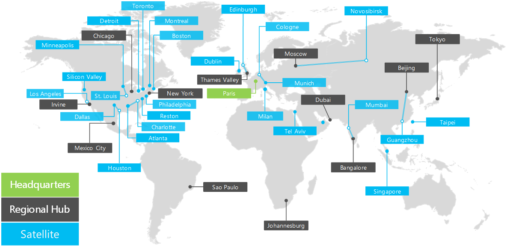

# Contoso Corporation 개요

 **요약:** Contoso Corporation 기업 및 전세계 사무소의 계층된 구조를 이해 합니다.
  
Contoso Corporation은 파리, 프랑스에 본사와 글로벌 비즈니스입니다. 이것이 conglomerate 제조, 판매 및 100000 제품과 지원 조직입니다. 
  
## Contoso Corporation

Contoso의 전세계 지사가 다음 위치에서:
  
**전세계의 그림 1: Contoso의 사무실**

  
그림 1 다양 한 대륙에 파리 및 지역 허브에 본사 및 위성 사무실을 보여줍니다.
  
전세계의 Contoso의 사무실 3 계층 디자인을 따릅니다.
  
- 본사
    
    Contoso Corporation 본사 관리 하 고, 엔지니어링, 제조 시설에 대 한 건물 수십와 Paris 외곽에서 대규모 기업 캠퍼스입니다. 모든 Contoso의 데이터 센터 및 인터넷 소개 파리 본사에 보관 됩니다.
    
    본사 15, 000 작업자에 있습니다.
    
- 지역 허브
    
    지역 허브 사무실 서비스 60% 판매 및 지원 담당자와 세계의 특정 지역입니다. 각 지역 허브 고대역폭 WAN 링크를 사용 하 여 파리 본사에 연결 됩니다. 
    
    각 지역 허브에 2, 000 작업자의 평균입니다.
    
- 위성 사무실
    
    위성 사무실 80 %sales 포함 하 고 및 지원 직원, 주요 도시 또는 하위 지역에서 Contoso 고객에 대 한 실제 환경과 현장 현재 상태를 제공 합니다. 각 위성 사무실 고대역폭 WAN 링크와 함께 지역 허브에 연결 됩니다.
    
    각 위성 사무실에는 250 작업자의 평균입니다.
    
Contoso의 직원의 25%에는 모바일 전용, 지역 허브 및 위성 사무실에서 모바일 전용 작업자의 높은 비율입니다. 모바일 전용 작업자에 대 한 더 나은 지원을 제공 하는 Contoso에 대 한 중요 한 비즈니스 목표는입니다.
  
## Contoso의 구현 하는 Microsoft의 요소 클라우드

Contoso의 IT 설계자는 Microsoft의 클라우드 서비스의 채택을 계획할 때는 다음 요소를 파악 한 합니다.
  
- 네트워킹
    
    네트워킹은 Microsoft의 클라우드 서비스 및 최고 부하에서 성능이 수 있을 만큼 충분 한 대역폭에 대 한 연결을 포함 합니다. 로컬 인터넷 연결을 통해 일부 연결 될 및 일부 Contoso의 개인 네트워크 인프라 간에 됩니다.
    
    자세한 내용은 [엔터프라이즈 설계자에 대 한 Microsoft 클라우드 네트워킹](microsoft-cloud-networking-for-enterprise-architects.md) 포스터를 참조 합니다.
   
- Identity
    
    Contoso는 Windows Server AD 포리스트를 사용 하 여 해당 내부 id 공급자에 대 한 및 고객 및 파트너에 대 한 타사 공급자와 페더레이션도 합니다. Contoso는 내부 Microsoft의 클라우드 서비스에 대 한 계정 집합을 활용 해야 합니다. 고객 및 파트너에 대 한 클라우드 기반 앱에 대 한 액세스를 타사 id 공급자도 활용 해야 합니다.
    
    자세한 내용은 [엔터프라이즈 설계자에 대 한 Microsoft 클라우드 Id](microsoft-cloud-identity-for-enterprise-architects.md) 포스터를 참조 합니다.
    
- 보안
    
    클라우드 기반 id 및 데이터에 대 한 보안 데이터 보호, 관리 권한 관리, 위협 인식 및 데이터 관리 및 보안 정책 구현에 포함 되어야 합니다.
    
    자세한 내용은 [엔터프라이즈 설계자에 대 한 Microsoft 클라우드 보안](http://aka.ms/cloudarchsecurity) 포스터를 참조 합니다.
    
- 관리
    
    클라우드 기반 앱 및 SaaS 작업 부하에 대 한 관리 설정, 데이터, 계정, 정책 및 사용 권한 유지 관리 하 고 계속 해 서 상태 및 성능 모니터링 하는 기능을 해야 합니다. 기존 서버 관리 도구는 Azure IaaS에 가상 컴퓨터를 관리 하는데 사용 됩니다.
    
## 참고 항목

[Microsoft 클라우드의 Contoso](contoso-in-the-microsoft-cloud.md)
  
[Microsoft 클라우드 IT 아키텍처 리소스](microsoft-cloud-it-architecture-resources.md)

[Microsoft의 엔터프라이즈 클라우드 로드맵: IT 의사 결정권자를 위한 리소스](https://sway.com/FJ2xsyWtkJc2taRD)
 

