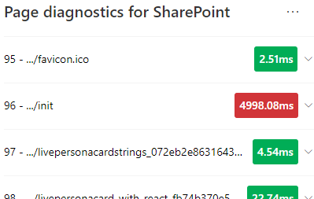

# SharePoint 용 페이지 진단 도구 사용Use the Page Diagnostics for SharePoint tool

이 문서에서는 **sharepoint 용 페이지 진단 도구** 를 사용 하 여 미리 정의 된 성능 기준 집합에 대해 sharepoint Online 현대 및 클래식 사이트 페이지를 분석 하는 방법에 대해 설명 합니다.This article describes how to use the **Page Diagnostics for SharePoint tool** to analyze SharePoint Online modern and classic site pages against a pre-defined set of performance criteria.  

>[!TIP]
>버전 **2.0.0** 이상에는 클래식 사이트 페이지 외에도 최신 페이지에 대 한 지원이 포함 됩니다.Version **2.0.0** and later includes support for modern pages in addition to classic site pages. 사용 중인 도구의 버전을 잘 모를 경우 **정보** 링크 또는 줄임표 (...)를 선택 하 여 버전을 확인할 수 있습니다.If you are unsure which version of the tool you are using, you can select the **About** link or the ellipses (...) to verify your version. 도구를 사용할 때 **항상 최신 버전으로 업데이트** 합니다.**Always update to the latest version** when using the tool.

SharePoint 용 페이지 진단 도구는 새 Microsoft Edge (및 SharePoint Online 최신 포털 및https://www.microsoft.com/edge) 클래식 게시 사이트 페이지 모두를 분석 하는 크롬 브라우저)에 대 한 브라우저 확장입니다.The Page Diagnostics for SharePoint tool is a browser extension for the new Microsoft Edge (https://www.microsoft.com/edge) and Chrome browsers that analyzes both SharePoint Online modern portal and classic publishing site pages. 이 도구는 SharePoint Online 에서만 작동 하며 SharePoint 시스템 페이지에서는 사용할 수 없습니다.This tool only works for SharePoint Online, and cannot be used on a SharePoint system page.

이 도구는 분석 된 각 페이지에 대 한 보고서를 생성 하 고, 테스트 결과가 기준 값 외부에 있을 때 해당 페이지에 대 한 자세한 정보를 표시 합니다.The tool generates a report for each analyzed page showing how the page performs against a pre-defined set of rules and displays detailed information when results for a test fall outside the baseline value. SharePoint Online 관리자 및 디자이너는이 도구를 사용 하 여 성능 문제를 해결 하 고, 게시 하기 전에 새 페이지가 최적화 되도록 할 수 있습니다.SharePoint Online administrators and designers can use the tool to troubleshoot performance issues and to ensure that new pages are optimized prior to publishing.

페이지 진단 도구는 *allitems.aspx* 또는 *sharepoint .aspx*와 같은 시스템 페이지가 아니라 sharepoint 사이트 페이지만 분석 하도록 디자인 되었습니다.The Page Diagnostics tool is designed to analyze SharePoint site pages only, not system pages such as *allitems.aspx* or *sharepoint.aspx*. 시스템 페이지 또는 다른 사이트 이외의 페이지에서 도구를 실행 하려고 하면 해당 페이지 유형에 대해 도구를 실행할 수 없다는 오류 메시지가 표시 됩니다.If you attempt to run the tool on a system page or any other non-site page, you will receive an error message advising that the tool cannot be run for that type of page.

라이브러리 또는 시스템 페이지를 평가 하는 데 값이 없으므로 도구에서 오류가 발생 하지 않습니다.This is not an error in the tool as there is no value in assessing libraries or system pages. 도구를 사용 하려면 SharePoint 사이트 페이지로 이동 하세요.Please navigate to a SharePoint site page to use the tool. SharePoint 페이지에서이 오류가 발생 하는 경우 마스터 페이지를 확인 하 여 SharePoint metatags 제거 되지 않았는지 확인 하십시오.If this error occurs on a SharePoint page, please check the master page to ensure that the SharePoint metatags have not been removed.

도구에 대 한 의견을 제공 하려면 도구의 오른쪽 위 모서리에 있는 줄임표를 선택 하 고 [의견 제공](https://go.microsoft.com/fwlink/?linkid=874109)을 선택 합니다.To provide feedback about the tool, select the ellipsis at the top right corner of the tool and then select [Give feedback](https://go.microsoft.com/fwlink/?linkid=874109).

  
## SharePoint 용 페이지 진단 도구 설치Install the Page Diagnostics for SharePoint tool

이 섹션의 설치 절차는 Chrome 및 Microsoft Edge 브라우저에서 모두 작동 합니다.The installation procedure in this section will work for both the Chrome and Microsoft Edge browsers.

> [!IMPORTANT]
> Microsoft는 SharePoint 용 페이지 진단 도구를 통해 분석 되는 데이터 나 페이지 콘텐츠를 읽지 않으며, 개인 정보, 웹 사이트 또는 다운로드 정보를 캡처하지 않습니다.Microsoft does not read data or page content that is analyzed by the Page Diagnostics for SharePoint tool, and we do not capture any personal information, website or download information. 도구를 통해 Microsoft에 기록 되는 유일한 식별 가능한 정보는 테 넌 트 이름, 실패 한 규칙의 수 및 도구를 실행 한 날짜와 시간입니다.The only identifiable information logged to Microsoft by the tool is the tenant name, counts of rules that have failed and the date and time the tool was run. 이 정보는 Microsoft에서 최신 포털 및 게시 사이트 사용 추세와 일반적인 성능 문제를 보다 잘 이해 하기 위해 사용 합니다.This information is used by Microsoft to better understand modern portal and publishing site usage trends and common performance issues.

1. **Microsoft edge** 용 페이지 진단 도구 [(edge 확장)](https://microsoftedge.microsoft.com/addons/detail/ocemkolpnamjcacndljdfmhlpcaoipji) 또는 **chrome** [(chrome 확장)](https://chrome.google.com/webstore/detail/inahogkhlkbkjkkaleonemeijihmfagi)을 설치 합니다.Install the Page Diagnostics for SharePoint tool for **Microsoft Edge** [(Edge extension)](https://microsoftedge.microsoft.com/addons/detail/ocemkolpnamjcacndljdfmhlpcaoipji) or **Chrome** [(Chrome extension)](https://chrome.google.com/webstore/detail/inahogkhlkbkjkkaleonemeijihmfagi). 스토어의 설명 페이지에서 제공 되는 사용자 개인 정보 보호 정책을 확인 하세요.Please review the User Privacy Policy provided on the description page in the store. 브라우저에 도구를 추가할 때 다음과 같은 사용 권한 표시가 나타납니다.When adding the tool to your browser, you will see the following permissions notice.

    

    페이지의 웹 파트 및 사용자 지정 내용에 따라 페이지에 SharePoint 외부 위치의 콘텐츠가 포함 될 수 있기 때문에이 알림 메시지가 표시 됩니다.This notice is in place because a page may contain content from locations outside of SharePoint depending on the web parts and customizations on the page. 즉, 도구는 시작 단추를 클릭 하 고 도구를 실행 하는 활성 SharePoint 탭에 대해서만 요청 및 응답을 읽습니다.This means that the tool will read the requests and responses when the start button is clicked and only for the active SharePoint tab where the tool is running. 이 **정보는 웹** 브라우저에 의해 로컬로 캡처되고, 도구의 _네트워크 추적_ 탭에 있는 **JSON으로 내보내기** 또는 **HAR로 내보내기** 단추를 통해 사용할 수 있습니다.This information is captured locally by the web browser and is available to you via the **Export to JSON** or **Export to HAR** button in the tool's _Network trace_ tab. **The information is not sent to or captured by Microsoft.** (이 도구는 [여기](https://go.microsoft.com/fwlink/p/?linkid=857875)에서 액세스할 수 있는 Microsoft 개인 정보 취급 방침을 고려 합니다.)(The tool respects the Microsoft privacy policy accessible [here](https://go.microsoft.com/fwlink/p/?linkid=857875).)

    _다운로드 관리_ 사용 권한은 도구에서 **JSON으로의 내보내기를** 사용 하는 기능을 포함 합니다.The _Manage your downloads_ permission covers use of the tool's **Export to JSON** functionality. 결과에 Url이 포함 되 고 PII (개인 식별이 가능한 정보)로 분류 될 수 있으므로 조직 외부의 JSON 파일을 공유 하기 전에 회사에서 제공 하는 개인 정보 보호 지침을 따르세요.Please follow your company's own privacy guidelines before sharing the JSON file outside of your organization, as the results contain URLs and that can be classified as PII (Personally Identifiable Information).
1. Incognito 또는 InPrivate 모드에서이 도구를 사용 하려면 브라우저에 대 한 절차를 따르세요.If you want to use the tool in Incognito or InPrivate mode, follow the procedure for your browser:
    1. Microsoft Edge에서 **확장** 으로 이동 하거나 URL 표시줄에 _edge://extensions_ 을 입력 하 고 내선 번호에 대 한 **세부 정보** 를 선택 합니다.In Microsoft Edge, navigate to **Extensions** or type _edge://extensions_ in the URL bar and select **Details** for the extension. 확장 설정에서 **InPrivate에 허용**에 대 한 확인란을 선택 합니다.In the extension settings, select the checkbox for **allow in InPrivate**.
    1. Chrome의 경우 **내선** 번호로 이동 하거나 URL 표시줄에 _chrome://extensions_ 을 입력 하 고 내선 번호에 대 한 **세부 정보** 를 선택 합니다.In Chrome, navigate to **Extensions** or type _chrome://extensions_ in the URL bar and select **Details** for the extension. 확장 설정에서 **Incognito에 허용**에 대 한 슬라이더를 선택 합니다.In the extension settings, select the slider for **allow in Incognito**.
1. 검토할 SharePoint Online의 SharePoint 사이트 페이지로 이동 합니다.Navigate to the SharePoint site page on SharePoint Online that you would like to review. 페이지에 있는 항목의 "지연 로드"가 허용 됩니다. 따라서이 도구는 자동으로 중지 되지 않습니다 (이는 모든 페이지 로드 시나리오에 맞게 디자인 됨).We have allowed for "delay loading" of items on pages; therefore, the tool will not stop automatically (this is by design to accommodate all page load scenarios). 수집을 중지 하려면 **중지**를 선택 합니다.To stop collection, select **Stop**. 데이터 수집을 중지 하기 전에 페이지 로드가 완료 되었는지 확인 하거나 부분 추적만 캡처합니다.Make sure that the page load has completed before you stop data collection or you will only capture a partial trace.
1. 확장 도구 모음 단추를 클릭 합니다.Click on the extension's toolbar button  도구를 로드 하려면 다음과 같은 확장 팝업 창이 표시 됩니다.to load the tool and you will be presented with the following extension popup window:

    

**시작** 을 선택 하 여 분석할 데이터 수집을 시작 합니다.Select **Start** to begin collecting data for analysis.

## SharePoint 용 페이지 진단 도구에 표시 되는 항목What you'll see in the Page Diagnostics for SharePoint tool

1. 도구 오른쪽 위 모서리에 있는 줄임표 (...)를 클릭 하 여 다음 링크를 찾습니다.Click the ellipses (...) in the top right corner of the tool to find the following links:
   1. **추가 리소스** 링크에서는이 문서에 대 한 링크를 포함 하 여 도구에 대 한 일반적인 지침 및 세부 정보를 제공 합니다.The **Additional resources** link provides general guidance and details regarding the tool including a link back to this article.
   1. **의견 제공** 링크를 통해 _SharePoint 사이트 및 공동 작업 사용자 음성_ 사이트에 대 한 링크가 제공 됩니다.The **Give feedback** link provides a link to the _SharePoint Sites and Collaboration User Voice_ site.
   1. **정보** 링크에는 현재 설치 되어 있는 도구 버전과 공구의 타사 공지에 대 한 직접 링크가 포함 되어 있습니다.The **About** link includes the currently installed version of the tool and a direct link to the tool's third party notice.  
1. **상관 관계 ID, SPRequestDuration, SPIISLatency**, **페이지 로드 시간**및 **URL** 세부 정보는 정보 제공 용으로, 몇 가지 용도로 사용할 수 있습니다.The **Correlation ID, SPRequestDuration, SPIISLatency**, **Page load time**, and **URL** details are informational and can be used for a few purposes.

    

   - **CorrelationID** 는 Microsoft 지원으로 작업할 때 특정 페이지에 대 한 추가 진단 데이터를 수집할 수 있도록 하는 중요 한 요소입니다.**CorrelationID** is an important element when working with Microsoft Support as it allows them to gather additional diagnostic data for the specific page.
   - **Sprequestduration** 은 SharePoint에서 페이지를 처리 하는 데 소요 되는 시간입니다.**SPRequestDuration** is the time taken for SharePoint to process the page. 구조적 탐색, 대규모 이미지, 수많은 API 호출이 더 긴 기간에 기여할 수 있습니다.Structural navigation, large images, lots of API calls could all contribute to longer durations.
   - **SPIISLatency** 는 SharePoint Online에 페이지 로드를 시작 하는 데 걸리는 시간 (밀리초)입니다.**SPIISLatency** is the time in milliseconds taken for SharePoint Online begin loading the page. 이 값에는 웹 응용 프로그램에서 응답 하는 데 소요 되는 시간이 포함 되지 않습니다.This value does not include the time taken for the web application to respond.
   - **페이지 로드 시간은** 요청이 요청을 받은 시간부터 브라우저에서 응답을 받아서 렌더링할 때까지 페이지에서 기록한 총 시간입니다.**Page load time** is the total time recorded by the page from the time of the request to the time the response was received and rendered in the browser. 이 값은 네트워크 대기 시간, 컴퓨터의 성능 및 브라우저가 페이지를 로드 하는 데 걸리는 시간을 비롯 한 다양 한 요인의 영향을 받습니다.This value is affected by a variety of factors including network latency, the performance of the computer and the time it takes for the browser to load the page.
   - **페이지 URL** (Uniform resource Locator)은 현재 페이지의 웹 주소입니다.The **Page URL** (Uniform Resource Locator) is the web address of the current page.

1. [**진단 테스트**](#how-to-use-the-diagnostic-tests-tab) 탭에는 세 가지 범주의 분석 결과가 표시 됩니다. **필요한 작업**, **개선 기회** 및 **주의가 필요**하지 않습니다.The [**Diagnostic tests**](#how-to-use-the-diagnostic-tests-tab) tab displays the analysis results in three categories; **No action required**, **Improvement opportunities** and **Attention required**. 각 테스트 결과는 다음 표에 설명 된 대로 이러한 범주 중 하나의 항목으로 표시 됩니다.Each test result is represented by an item in one of these categories as described in the following table:

    |범주Category  |색Color  |설명Description  |
    |---------|---------|---------|
    |**주의 필요****Attention required** |빨강Red |테스트 결과가 초기 계획 값을 벗어나므로 페이지 성능에 영향을 줍니다.Test result falls outside the baseline value and is affecting page performance. 수정 지침을 따릅니다.Follow remediation guidance.|
    |**개선 기회****Improvement opportunities** |노랑Yellow |테스트 결과가 초기 계획 값을 벗어나므로 성능 문제에 영향을 받을 수 있습니다.Test result falls outside the baseline value and could be contributing to performance issues. 테스트 관련 조건이 적용 될 수 있습니다.Test-specific criteria may apply.|
    |**필요한 작업 없음****No action required** |친환경Green |테스트 결과가 테스트의 초기 계획 값에 포함 됩니다.Test result falls within the test's baseline value.|

    

1. [**네트워크 추적**](#how-to-use-the-network-trace-tab) 탭에는 페이지 빌드 요청 및 응답에 대 한 세부 정보가 제공 됩니다.A [**Network trace**](#how-to-use-the-network-trace-tab) tab provides details about page build requests and responses.

## 진단 테스트 탭을 사용 하는 방법How to use the Diagnostic tests tab

Sharepoint 용 페이지 진단 도구를 사용 하 여 SharePoint 최신 포털 페이지 또는 클래식 게시 사이트 페이지를 분석할 때 결과는 기준 값에 대 한 결과를 비교 하 여 **진단 테스트** 탭에 표시 되는 미리 정의 된 규칙을 사용 하 여 분석 됩니다.When you analyze a SharePoint modern portal page or classic publishing site page with the Page Diagnostics for SharePoint tool, results are analyzed using pre-defined rules that compare results against baseline values and displayed in the **Diagnostic tests** tab. Rules for certain tests may use different baseline values for modern portal and classic publishing sites depending on how specific performance characteristics differ between the two.

**개선 영업 기회** 또는 **주의 필수** 범주에 표시 되는 테스트 결과는 권장 되는 방법에 따라 검토 해야 하는 영역을 나타내고 결과에 대 한 추가 정보를 표시 하도록 선택할 수 있습니다.Test results that appear in the **Improvement opportunities** or **Attention required** categories indicate areas that should be reviewed against recommended practices, and can be selected to display additional information about the result. 각 항목에 대 한 자세한 내용은 테스트와 관련 된 지침으로 바로 이동 하는 _자세한_ 정보 링크를 포함 합니다.Details for each item include a _Learn more_ link which will take you directly to the appropriate guidance related to the test. **없음 작업 필수** 범주에 표시 되는 테스트 결과는 관련 규칙을 준수 하며,이 항목을 선택 하면 추가 세부 정보를 표시 하지 않습니다.Test results that appear in the **No action required** category indicate compliance with the relevant rule and do not display additional details when selected.

진단 테스트 탭의 정보는 페이지를 디자인 하는 방법을 알려주지 않으며 페이지 성능에 영향을 줄 수 있는 요인을 강조 표시 합니다.The information in the Diagnostics tests tab will not tell you how to design pages, but will highlight factors that may impact page performance. 일부 페이지 기능 및 사용자 지정은 페이지 성능에 피할 수 없는 영향을 주므로, 해당 영향이 큰 경우에는 페이지에서의 잠재적 수정 또는 누락을 검토 해야 합니다.Some page functionality and customizations have an unavoidable impact on page performance, and should be reviewed for potential remediation or omission from the page if their impact is substantial.

빨간색 또는 노란색 결과를 통해 데이터를 너무 자주 새로 고치는 웹 파트가 표시 될 수도 있습니다.Red or yellow results may also indicate web parts that refresh data too frequently. 예를 들어 회사 뉴스는 매 초 마다 업데이트 되지 않지만, 사용자 지정 웹 파트는 전체 사용자 환경을 향상 시킬 수 있는 캐싱 요소를 구현 하는 대신 항상 최신 뉴스를 페치 (fetch) 하기 위해 작성 됩니다.For example, corporate news is not updated every second but custom web parts are often built to fetch the latest news every second instead of implementing caching elements that could improve the overall user experience. 페이지에 웹 파트를 포함 하는 경우 사용 가능한 각 매개 변수의 값을 평가 하 여 해당 목적에 맞게 적절 하 게 설정 되었는지 확인 하 여 성능 영향을 줄이는 간단한 방법이 있는 경우가 있습니다.Keep in mind when including web parts on a page that there are often simple ways to reduce their performance impact by evaluating the value of each available parameter to ensure it is set appropriately for its intended purpose.

>[!NOTE]
>게시 기능이 사용 되지 않는 클래식 팀 사이트는 CDNs를 사용할 수 없습니다.Classic team sites that don't have the publishing feature enabled cannot make use of CDNs. 이러한 사이트에서 도구를 실행 하면 CDN 테스트가 실패 하 고 무시 될 수 있지만 나머지 테스트는 모두 해당 됩니다.When you run the tool on these sites, the CDN test is expected to fail and can be ignored, but all of the remaining tests are applicable. SharePoint 게시 기능의 추가 기능은 페이지 로드 시간을 늘릴 수 있으므로 CDN 기능을 허용 하기 위해 사용 하도록 설정 해서는 안 됩니다.The additional functionality of the SharePoint publishing feature can increase page load times, so it should not be enabled just to allow CDN functionality.

>[!IMPORTANT]
>테스트 규칙은 정기적으로 추가 및 업데이트 되므로 최신 버전의 도구를 참조 하 여 테스트 결과에 포함 된 특정 정보 및 현재 규칙에 대 한 자세한 내용을 확인 하세요.Test rules are added and updated regularly so please refer to the latest version of the tool for details about current rules and specific information included in test results. 확장을 관리 하 여 버전을 확인할 수 있으며, 확장은 업데이트를 사용할 수 있는지 여부를 알려 주어 야 합니다.You can verify the version by managing your extensions and the extension will advise whether an update is available.

## 네트워크 추적 탭을 사용 하는 방법How to use the Network Trace tab

**Network Trace (네트워크 추적** ) 탭에는 페이지를 작성 하기 위한 요청과 SharePoint에서 받은 응답에 대 한 자세한 정보가 제공 됩니다.The **Network Trace** tab provides detailed information about both requests to build the page and the responses received from SharePoint.

1. **빨간색으로 플래그가 지정 된 항목 로드 시간을 찾습니다**.**Look for item load times flagged as red**. 각 요청 및 응답은 다음과 같은 대기 시간 메트릭을 사용 하 여 전체 페이지 성능에 미치는 영향을 나타내기 위해 색으로 구분 됩니다.Each request and response is color coded to indicate its impact on overall page performance using the following latency metrics:
    - 녹색: \< 500msGreen: \< 500ms
    - 노랑: 500-1000msYellow: 500-1000ms
    - 빨강: \> 1000msRed: \> 1000ms

    

    위에 표시 된 이미지에서 빨간색 항목은 기본 페이지와 관련이 있습니다.In the image shown above, the red item pertains to the default page. 페이지가 1000ms (1 초 미만)로 로드 \< 되지 않으면 항상 빨간색으로 표시 됩니다.It will always show red unless the page loads in \< 1000ms (less than 1 second).

2. **항목 로드 시간을 테스트**합니다.**Test item load times**. 일부 경우에는 항목이 이미 브라우저에 의해 캐시 되었기 때문에 시간 또는 색 지표가 나타나지 않을 수 있습니다.In some cases there will be no time or color indicator because the items have already been cached by the browser. 이를 올바르게 테스트 하려면 페이지를 열고 브라우저 캐시를 지운 다음 **시작** 을 클릭 하 여 "콜드" 페이지를 로드 하 고 초기 페이지 로드를 true로 반사 해야 합니다.To test this correctly, open the page, clear browser cache, and then click **Start** as that will force a "cold" page load and be a true reflection of the initial page load. 이 경우 페이지에 캐시 되는 항목을 확인 하는 데 도움이 되는 것 처럼 "웜" 페이지 로드와 비교 해야 합니다.This should then be compared to the "warm" page load as that will also help determine what items are being cached on the page.

3. **문제를 조사 하는 데 도움이 되는 다른 사용자와 관련 세부 정보를 공유**합니다.**Share relevant details with others who can help investigate issues**. 도구에서 제공 하는 세부 정보 또는 정보를 개발자나 기술 지원 담당자와 공유 하려면 위의 이미지에 표시 된 **JSON으로 내보내기를** 클릭 합니다.To share the details or information provided in the tool with your developers or a technical support person, click **Export to JSON** (as shown in the image above). 이를 통해 결과를 다운로드할 수 있으며,이를 통해 JSON 파일 뷰어가 표시 됩니다.That will enable you to download the results, viewable with a JSON file viewer.

    미리 보기 기능을 사용 하 여 *HAR로 내보내기를* 사용 하도록 설정한 경우 내보내기 유형이 **HAR에 내보내기**로 표시 됩니다.If you have opted to use the preview feature *enable Export to HAR* then the export type will show as **Export to HAR**.

    

> [!IMPORTANT]
> 이러한 결과에는 Url이 포함 되며 PII (개인 식별이 가능한 정보)로 분류 될 수 있습니다.These results contain URLs and that can be classified as PII (Personally Identifiable Information). 해당 정보를 배포 하기 전에 조직의 지침을 따라야 합니다.Make sure to follow your organization's guidelines before distributing that information.

## Microsoft 지원 제공Engaging with Microsoft Support

지원 사례를 직접 사용 하는 경우에만 사용할 수 있는 **Microsoft 지원 수준 기능이** 포함 되어 있습니다.We have included a **Microsoft Support level feature** that should only be utilized when working directly on a support case. 이 기능을 사용 하면 팀 참여를 지원 하지 않고을 사용할 때 도움이 되지 않으며 페이지 속도를 크게 높일 수 있습니다.Utilizing this feature will provide no benefit to you when used without support team engagement, and can make the page perform significantly slower. 추가 정보가 서비스의 로깅에 추가 될 때 도구에서이 기능을 사용 하는 경우 추가 정보가 제공 되지 않습니다.There is no additional information when using this feature in the tool as the additional information is added to the logging in the service.

변경 내용이 표시 되지 않으며, 사용 하도록 설정 하 고 페이지 성능이 사용 하도록 설정 된 경우에는 2-3 배 더 느린 성능 보다 성능이 크게 저하 된다는 점을 제외 하 고는 아무런 변화가 없습니다.No change is visible except that you will be notified that you have enabled it and your page performance will be significantly degraded by 2-3 times slower performance whilst enabled. 특정 페이지와 해당 활성 세션에만 해당 됩니다.It will only be relevant for the particular page and that active session. 따라서이는 실제로 지원 서비스를 받을 때에만 사용 해야 합니다.For this reason, this should be used sparingly and only when actively engaged with support.

### Microsoft 지원 수준 기능을 사용 하도록 설정 하려면To enable the Microsoft Support level feature

1. SharePoint 용 페이지 진단 도구를 엽니다.Open the Page Diagnostics for SharePoint tool.
2. 키보드에서 ALT + e- **L**을 누릅니다.On your keyboard, press **ALT-Shift-L**. 그러면 **지원 로깅 사용** 확인란이 표시 됩니다.This will display the **Enable support logging** check box.
3. 확인란을 선택한 다음 **시작** 을 클릭 하 여 페이지를 다시 로드 하 고 자세한 정보 표시 로깅을 생성 합니다.Select the check box, and then click **Start** to reload the page and generate verbose logging.

    
  
    상관 관계 (도구 맨 위에 표시 됨)를 확인 하 고 지원 담당자에 게 진단 세션에 대 한 추가 정보를 수집할 수 있도록 제공 합니다.You should note the CorrelationID (displayed at the top of the tool) and provide it to your support representative to enable them to gather additional information about the diagnostic session.

## 관련 항목Related topics

[SharePoint Online 성능 조정Tune SharePoint Online performance](tune-sharepoint-online-performance.md)

[Office 365 성능 조정Tune Office 365 performance](tune-office-365-performance.md)

[최신 SharePoint 환경의 성능Performance in the modern SharePoint experience](https://docs.microsoft.com/sharepoint/modern-experience-performance)

[콘텐츠 배달 네트워크Content delivery networks](content-delivery-networks.md)

[sharepoint Online을 활용해 Office 365 콘텐츠 배달 네트워크(CDN) 사용하기Use the Office 365 Content Delivery Network (CDN) with SharePoint Online](use-office-365-cdn-with-spo.md)
