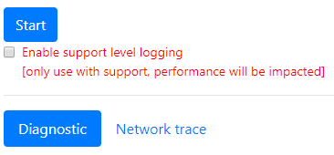

# SharePoint Online에 대 한 페이지 진단 도구를 사용 하 여Use the Page Diagnostics tool for SharePoint Online

이 문서에서는 페이지 진단 도구를 사용 하 여 클래식 게시 페이지 및 **SharePoint Online**에서 권장 되는 방법의 하위 집합에 대해 클래식 팀 사이트의 페이지를 분석 하는 방법을 설명 합니다.This article describes how you can use the Page Diagnostic tool to analyze your classic publishing pages and pages on classic team sites, against a subset of recommended practices in **SharePoint Online**. 
  
팀 사이트 게시를 사용할 수 없는 Cdn의 사용 하 여 만들 수 없습니다 하지만 나머지 규칙 모두에 해당 합니다. 게시는 페이지 로드 시간에 부정적인 영향는 것 처럼 CDN 기능을 가져오기 위해 게시 설정 하지 않도록 하므로 추가 오버 헤드를 추가 합니다.Team sites that don't have Publishing enabled cannot make use of CDNs but all of the remaining rules are applicable. Publishing adds additional overhead so do not turn on Publishing just to get the CDN functionality as it will negatively impact page load times.

**참고 V1.05에 릴리스된 업데이트 보십시오 이미 설치 된 경우 확장**합니다. 확실 하지 않은 경우 있는 버전을 다음 링크를 클릭 하십시오는 "에 대 한 정보" 것을 확인 합니다.**Please note that V1.05 has been released so please update your extension if you have it installed already**. If you are unsure which version you have then please click the "About" link to verify it.
  
> [!IMPORTANT]
> SharePoint 사이트 페이지를 검토 하는 도구는 정상적으로 시스템 페이지 또는 문서 라이브러리에 대해 페이지 진단 도구 실행 되지 않습니다. *Allitems.aspx* 페이지는 시스템 페이지입니다. 시스템 페이지에서 도구를 실행 하려고 하면 읽는 메시지가, "이 응용이 프로그램의 SharePoint 페이지에만 적용 됩니다."The Page Diagnostics tool will not run against document libraries or system pages, as the tool is designed to review SharePoint site pages. An  *allitems.aspx*  page is a system page. If you attempt to run the tool on a system page, you will get a message that reads, "This application should only be run on SharePoint pages."    라이브러리 또는 시스템 페이지 평가에 값이 없는 그대로 도구에서 오류가 아닙니다. 이 도구를 사용 하 여 비 시스템 SharePoint 페이지로 이동 하십시오. SharePoint 페이지에서이 발생 하는 경우 다음 확인 하십시오는 MasterPage 고객 SharePoint 메타 태그를 제거 하 고 다음 페이지는 더이상 SharePoint 페이지 살펴본 것 처럼. 에 대 한 피드백을 제공 하려는 도구 정보 탭을 클릭을 따라 하십시오 [피드백 링크를 제공](https://go.microsoft.com/fwlink/?linkid=874109)합니다.This is not an error in the tool as there is no value in assessing libraries or system pages. Please navigate to a non-system SharePoint page to use the tool. If this occurs on a SharePoint page then please check the MasterPage as we have seen Customers remove the SharePoint MetaTags and then the page is no longer a SharePoint page. Should you wish to give feedback about the tool please click the About tab and follow the [give feedback link](https://go.microsoft.com/fwlink/?linkid=874109). 
  
## 페이지 진단 도구를 설치 합니다.Install the Page Diagnostic tool

> [!IMPORTANT]
> Microsoft 웹사이트를 방문 하면 확인 하는 데이터를 읽지 못합니다 하 고 모든 개인 정보,이 도구로 웹사이트 또는 다운로드 정보는 접수 하지 않습니다. 이 도구에 의해 기록 되는 유일한 정보는 테 넌 트 이름 규칙 수 및 도구를 실행 하는 경우 지원 로깅 옵션이 사용 되었는지 여부입니다. 이 정보는 Microsoft 고객 하 여 어떤 문제를 발생 되는 분석 하 고 지원 로깅 기능을 악용 되는 확인 하기 위한 합니다.Microsoft does not read the data or websites you visit, and we do not capture any personal information, website or download information with this tool. The only information logged by the tool is the Tenant name, Rule count and whether the support logging option has been utilized when the tool is run. This information is for Microsoft to analyze what challenges are being experienced by our Customers and to ensure the Support logging capability is not being misused.

1. Chrome 브라우저를 사용 하 [도구에 대 한 링크](https://chrome.google.com/webstore/detail/inahogkhlkbkjkkaleonemeijihmfagi) 를 직접 엽니다 또는 검색에서 [Chrome 브라우저 웹 저장](https://chrome.google.com/webstore/search/page%20diagnostics%20for%20sharepoint) 열고 브라우저 확장을 설치 합니다. 저장소의 설명 페이지에 제공 된 사용자 개인정보 보호 정책을 검토 하십시오. 다음 표시는 도구에 브라우저를 추가할 때 사용 권한을 확인할 수 있습니다.Using a Chrome browser, open the [link to the tool](https://chrome.google.com/webstore/detail/inahogkhlkbkjkkaleonemeijihmfagi) directly or open the Search in the [Chrome Browser WebStore](https://chrome.google.com/webstore/search/page%20diagnostics%20for%20sharepoint) and install the browser extension. Please review the User Privacy Policy provided on the description page in the store. When adding the tool to your browser, you will see the following permissions notice.     페이지의 웹 파트 및 페이지 사용자 지정 내용에 따라 SharePoint 외부의 위치에서 콘텐츠를 포함할 수 있으므로이 공지 마련 되었습니다. 즉,이 도구는 읽을 요청 및 응답 시작 단추를 클릭할 때와 현재 SharePoint 탭에 대해서만 도구가 실행 되 고 있습니다. 해당 정보는 웹 브라우저에서 로컬로 캡처됩니다 및 내보내기 도구에서 JSON 링크를 통해 사용할 수 있습니다. **정보를 전송 하지 되었거나 Microsoft에 의해 캡처.** (이 도구에서는는 Microsoft 개인정보 보호 정책 액세스할 수 있는 [여기](https://go.microsoft.com/fwlink/p/?linkid=857875)됩니다.)This notice is in place because a page may contain content from locations outside of SharePoint depending on the webparts and customizations on the page. This means that the tool will read the requests and responses when the start button is clicked and only for the active SharePoint tab where the tool is running. That information is captured locally by the web browser and is available to you via the Export to JSON link in the tool. **The information is not sent to or captured by Microsoft.** (The tool respects the Microsoft Privacy policy accessible [here](https://go.microsoft.com/fwlink/p/?linkid=857875).)  이 도구를 통해 "JSON에 내보내기" 기능 "다운로드 관리" 권한이 필요한 이유 이기도 합니다. 결과 Url과를 포함 하 고 조직 외부의 JSON 파일 공유 PII (개인 식별 정보)으로 분류할 수 전에 사용자 회사의 개인정보 보호 지침을 수행 하십시오.The "Export to JSON" functionality in the tool is also why the "Manage your downloads" permission is needed. Please follow your Company's own Privacy guidelines before sharing the JSON file outside of your organization, as the results contain URLs and that can be classified as PII (Personally Identifiable Information).
    
2. (선택 사항 임) 크롬 incognito 모드에서 도구를 사용 하려는 경우 이동 하 고 확장 하 고 **incognito에서 허용**을 클릭 합니다.(This is optional) If you want to use the tool in Chrome incognito mode, navigate to the extension and click **allow in incognito**.
    
3. SharePoint online 검토 하 려 하는 SharePoint 클래식 게시 페이지로 이동 합니다. "지연 로드"가 허용 되는 페이지;에 있는 항목의 따라서 **도구를 자동으로 중지 하지 것입니다**. 컬렉션을 중지 하려는 경우, **중지**를 클릭할 수 있습니다. (이 페이지에서 제공 하는 모든 부하 시나리오에 맞게를 디자인 합니다.) **중지**를 클릭 하기 전에 네트워크 추적 데이터 완료 되었는지 확인 합니다. 그렇지 않은 경우, 부분 추적을 해야 합니다. 또한이 도구는 브라우저 확장 및 여러 탭 또는 windows 열기 하나의 활성 인스턴스의 도구를 한번에 실행할 수만 허용 됩니다. 브라우저에서 확장의 제한 사항입니다.Navigate to the SharePoint classic publishing page on SharePoint Online that you would like to review. We have allowed for "delay loading" of items on pages; therefore, the **tool will not stop automatically**. Should you wish to stop collection, you can click **Stop**. (This is by design to cater for all page load scenarios.) Before you click **Stop**, make sure that the network trace data is complete. Otherwise, you will have a partial trace. Additionally, the tool is a Browser Extension, and opening multiple tabs or windows will only allow one active instance of the tool to be run at one time. This is a limitation of extensions in the browser. 
  
4. 확장 로고를 클릭Click on the Extension logo  도구 및 경우를 로드 하려면 나타납니다 다음 확장 팝업 창의:to load the tool and you will be presented with the following extension popup window:   시작 및 중지 작업 수행을 클릭할 때 시작 페이지를 다시 로드 하 고 컬렉션의 기본 개념을 시작 합니다.Start and stop operations follow the basic concept of when you click start the page will reload and collection will begin.

도구에서 제공 되는 정보에 대 한 자세한 내용은 다음 섹션을 읽습니다.Read the following sections to learn more about the information provided in the tool.

## 페이지 진단 도구에 표시 됩니다What you'll see in the Page Diagnostics tool
    
1. **에 대 한** 링크를 제공할 일반적인 지침을 제공 하 고 링크를 포함 하는 도구에 대 한 자세한 내용은이 문서를 다시 키를 누릅니다. 또한 SharePoint 성능 권장 사항, 제 3 자 공지 및 도구에 대 한 의견을 제공 하는 옵션에 대 한 직접 링크를 포함 합니다.The **About** link will provide general guidance and details regarding the tool including a link back to this article. It also includes a direct link to SharePoint Performance recommendations, a Third Party notice and an option to provide feedback about the tool. 
    
2. **상관관계 ID, SPRequestDuration, SPIISLatency**, **페이지 로드 시간**및 **URL** 세부 정보 되며 몇 목적을 위해 사용할 수 있습니다.The **Correlation ID, SPRequestDuration, SPIISLatency**, **Page load time**, and **URL** details are informational and can be used for a few purposes. 
    
  - **CorrelationID** 는 추가 진단 데이터를 가져올 수 있도록으로 Microsoft 지원 팀과 함께 작동 하는 경우에 중요 한 요소입니다.**CorrelationID** is an important element when working with the Microsoft Support Teams as it allows them to pull additional diagnostic data. 
    
  - **SPRequestDuration** 에 페이지를 처리 하는데 걸리는 서버 시간입니다. 이 시간이 긴 경우 반드시 아닙니다 서버 잘못 수행 되 고 있던 하지만 통화 수를 반영 하 고 불러올 수 사용 하 여 푸시됩니다 페이지의 서버에 예: 구조적 탐색, 큰 이미지 없습니다., 많은 API 호출의 모든 긴 서버 시간으로 참가 수 없습니다. .**SPRequestDuration** is the server time taken to process the page. If this time is long, it does not necessarily mean that the server was performing badly but can also reflect the number of calls and load pushed by the page to the server e.g. Structural Navigation, large images, lots of API calls could all contribute to longer server time. 
    
  - **SPIISLatency** 에 페이지를 로드 하는 요청을 받을 때 웹 프런트엔드 서버에서 수행 하는 시간 (밀리초)의 시간입니다. 페이지의 처리를 시작 하려면 대기 시간의 표시기 이며 응답 하는 웹 응용 프로그램에 대 한 걸린 시간을 포함 하지 않습니다.**SPIISLatency** is the time in milliseconds taken on the Web Front End Server when it receives the request to load the page. This is an indicator of latency to start processing the page and does not include the time taken for the web application to respond. 
    
  - **페이지 로드 시간** 에 대 한 응답을 받은 메일 및 브라우저에서 읽을 시간을 요청 시간에서 페이지에 의해 기록 되는 시간이 됩니다. 추가 때마다 부하를 브라우저에 대 한 걸리는 시간과 컴퓨터의 성능 영향을 받습니다.**Page load time** is the time recorded by the page from the time of the request to the time the response was received and read by the browser. Any additional time is affected by the performance of the computer and the time it takes for the browser to load. 
    
  - **URL** (Uniform Resource Locator)는 현재 페이지의 웹 주소입니다.The **URL** (Uniform Resource Locator) is the web address of the current page. 
    
3. [ **진단** 탭](#how-to-use-the-diagnostic-tab) 하면 규칙을 나열 하 고 중 어느 경우에 빨간색으로 표시 되도록 하 , 다음 페이지에서 확인 된 문제가 있습니다.The [**Diagnostic** tab](#how-to-use-the-diagnostic-tab) will list the rules and if any of them are marked with a red , then there are issues identified on the page. 각 규칙에 있는 항목은 빨강 하는 경우를 클릭 하 여 자체 "자세한 정보" 링크가 있습니다. 하는 문제를 수정 하는 방법과 해당 규칙 뒤에 세부 정보로 이동 합니다.Each rule has its own "more information" link that you click if an item is red. That will take you to the details behind that rule and how to remediate the issue. 

4. [ **네트워크 추적** 탭](#how-to-use-the-network-trace-tab) 페이지에 대 한 자세한 내용은 빌드 요청 및 응답을 제공 합니다.A [**Network trace** tab](#how-to-use-the-network-trace-tab) provides details about page build requests and responses.

## 진단 탭을 사용 하는 방법How to use the Diagnostic tab

1. **표준 사용자로 실행 하는 검사**  페이지 성능 검사 수행 해야 서비스 계정, 관리자 또는 사이트 모음 관리자 또는 상승 된 권한으로 모든 계정으로 로그인 할 때. 결과 페이지 성능의 true 표시 되지 않도록 추가 스크립트 및 기능 이러한 유형의 계정에 대 한 구체적으로 로드 됩니다.**Check Running as Standard User**  Checking page performance should not be performed when logged in as a Service Account, Administrator or Site Collection Administrator, or any account with elevated privileges. Additional scripts and functionality are loaded specifically for those types of accounts, so the results will not be a true representation of page performance.
    
2. **SharePoint에 대 한 요청 확인**  오버 로드 된 페이지는 저하 성능의 경험 하는 것 처럼 서버에 대 한 요청 및 데이터의 양을 제한 해야 합니다. 이 검사 SharePoint에 적용 되는 요청의 수를 확인 하 고 6 요청을 초과 하는 요청에 게 알려줍니다 됩니다. 대부분의 요청 캐시 하 고 모든 페이지 부하에 대 한 호출 되지 않으므로 해야 합니다. 캐시 설치 해야 하 고 각각의 모든 사용자가 페이지에 대 한 호출을 단축 하 15 분 이상에 활용 합니다. 이것은 일반적인 문제 및 대부분의 경우에서 데이터만 변경 매일 하지만 페이지 확인 하 고 자주 필요 하지 않는 각 사용자에 대 한 각 페이지에 대 한 각 시간에 데이터를 반입.**Check Requests to SharePoint**  The amount of data and requests made to the server should be limited as an overloaded page will experience poor performance. This check verifies the number of requests being made to SharePoint and will advise when the requests exceed 6 requests. Most requests should be cached and therefore not called for every page load. Cache should be setup and utilized for at least 15 minutes to reduce the amount of calls to a page by each and every User. This is a common problem and in most cases data only changes daily but the page checks and fetches data each time for each page for each user which is often unnecessary.
    
3. **Cdn를 사용 하 여 확인 합니다.**  콘텐츠 배달 네트워크 (Cdn)에서 제공한 Microsoft 요소와 참조 하는 SharePoint Online 콘텐츠 배달 네트워크 다음과 같습니다. SharePoint Cdn 및 Azure에서 Cdn 같은 다른 CDN 서비스와 사용할 수 있는 여러 유형이 있습니다. [다음 지침을 사용](https://go.microsoft.com/fwlink/?linkid=873250)합니다.**Check using CDNs**  Content Delivery networks (CDNs) have been provided by Microsoft and the ones referred to here are the SharePoint Online Content Delivery Networks. There are multiple types available as well as different CDN services like SharePoint CDNs and then CDNs in Azure. [Use the following guidance](https://go.microsoft.com/fwlink/?linkid=873250).
    
4. **큰 이미지 크기에 대 한 확인**  이미지는 PNG 같은 더 나은 웹 종류를 활용 하 여 웹에 대 한 최적화 해야 합니다. 이미지 변환 활용 되도 및를 직접 SharePoint에서 사용할 수 있습니다. 이미지 / 100kb 강조 표시 된 것 보다 더 큰 이미지 변환 되지 않은 것으로 웹에 최적화 합니다. [최적화 이미지에 대 한 다음 지침을 사용](https://go.microsoft.com/fwlink/?linkid=873251)합니다.**Check for Large Image Sizes**  Images should be optimized for web by utilizing better web types like PNG. Image renditions should also be utilized and is available in SharePoint directly. Images / image renditions larger than 100kb will be highlighted as not optimized for web. [Use the following guidance for optimizing images](https://go.microsoft.com/fwlink/?linkid=873251).
    
5. **구조적 탐색에 대 한 확인**  구조적 탐색 원래 SharePoint 온-프레미스 개체 캐시 수 활용 하는 위치에서 사용 하도록 설계 되었습니다. 구조적 탐색 SharePoint Online에서 사용 하기 위해 하지 않기 및 관리 하는 탐색 또는 사용자 지정 공급자를 변경 해야 합니다. [탐색을 최적화 하기 위한 다음 지침을 사용 하 여.](https://go.microsoft.com/fwlink/?linkid=873247)**Check for Structural Navigation**  Structural Navigation was originally designed for use in SharePoint on-Premises where object cache could be utilized. Structural Navigation is not recommended for use in SharePoint Online and should be changed to Managed Navigation or a Custom Provider. [Use the following guidance for optimizing navigation.](https://go.microsoft.com/fwlink/?linkid=873247)
    
6. **옮기는 웹 파트에 대 한 확인** (옮기는-콘텐츠 쿼리 웹 파트에서)  콘텐츠 쿼리 웹 파트 하 여 각 사용자에 대 한 모든 항목에서 각 페이지 부하에 대 한 쿼리를 통과할 때 높은 SQL 부하를 생성 합니다. 온-프레미스 설치와는 달리 사용 가능한 캐시가 웹이 파트를 채우는 데 필요한 쿼리의 수를 제한 하는 사용할 수 있습니다. 이와 같이 옮기는 느리게 수행 하 고 이용할 수 있어야 하는 이유는 전체 페이지 성능에 영향을 줍니다. 콘텐츠 쿼리 웹 파트에 대 한 대체 콘텐츠 검색 웹 파트 (CSWP)을 사용 하십시오. [콘텐츠 검색 웹 파트와 관련 된 다음과 같은 지침을 사용](https://go.microsoft.com/fwlink/?linkid=873245)합니다.**Check for CBQ WebPart** (CBQ - Content by Query WebPart)  The Content by Query WebPart generates a high SQL load as it traverses all items in the query for each and every page load, for each User. Unlike an on-Premises installation, there is no cache available to limit the number of queries needed to populate this WebPart. As such CBQ performs slowly and impacts overall page performance which is why it should not be utilized. Please use the Content Search WebPart (CSWP) as the replacement for the Content Query WebPart. [Use the following guidance related to the Content Search WebPart](https://go.microsoft.com/fwlink/?linkid=873245).

## 네트워크 추적 탭을 사용 하는 방법How to use the Network Trace tab
    
**네트워크 추적** 탭의 페이지는 물론 받은 응답 작성에 대 한 요청에 대 한 자세한 정보를 제공 합니다.The **Network Trace** tab provides detailed information about the requests to build the page as well as the responses received. 

1. **빨간색으로 플래그가 지정 된 항목 로드 시간을 찾아보십시오**. 각 요청 및 응답의 성능을 색으로 구분 된를 기반으로 전체 페이지 성능에 미치는 영향을 다음과 같이 합니다.**Look for item load times flagged as red**. The performance of each request and response are color coded, based on their impact on the overall page performance  as follows:
- 녹색: \< 500msGreen: \< 500ms
- 노란색: 500-1000ms가Yellow: 500-1000ms
- 빨간색: \> 1000ms가Red: \> 1000ms
  위에 표시 된 이미지에 빨간색 항목의 기본 페이지와 관련이 있습니다. 항상 나타납니다 빨간색에서 페이지를 로드 하는 경우가 아니면 \< 1000ms가 (1 초 미만). In the image shown above, the red item pertains to the default page. It will always show red unless the page loads in \< 1000ms (less than 1 second).

2. **테스트 항목 로드 시간**입니다. 일부 경우에 없을 것 시간 또는 색 표시기가 없습니다 브라우저에 의해 이미 캐시 된 항목 때문입니다. 이 올바르게 테스트 페이지를 열고, 브라우저 캐시 선택을 취소 하 고 "정지" 페이지 부하를 강제로 및 초기 페이지 부하의 true 리플렉션 될 **시작** 을 클릭 합니다. 이 다음 비교 해야 "웜" 페이지를 로드 하는 항목의 페이지에 캐시 하는 결정도 도움이 되는 대로 합니다.**Test item load times**. In some cases there will be no time or color indicator because the items have already been cached by the browser. To test this correctly, open the page, clear browser cache, and then click **Start** as that will force a "cold" page load and be a true reflection of the initial page load. This should then be compared to the "warm" page load as that will also help determine what items are being cached on the page. 
    
3. **문제를 파악 도움이 되는 다른 사용자와 관련 된 정보를 공유**합니다. 세부 정보 또는 개발자에 게 또는 기술 지원 담당자는 도구에 제공 된 정보를 공유 하려면 **JSON로 내보내기** (에서처럼 위의 이미지) 클릭 합니다. 하는 JSON 파일 뷰어로 볼 수 있는 결과 다운로드할 수 있습니다.**Share relevant details with others who can help investigate issues**. To share the details or information provided in the tool with your developers or a technical support person, click **Export to JSON** (as shown in the image above). That will enable you to download the results, viewable with a JSON file viewer.

> [!IMPORTANT]
> 이러한 결과 Url을 포함 하 고 PII (개인 식별 정보)로 분류 될 수 있습니다. 해당 정보를 배포 하기 전에 조직의 지침을 따르는에 있는지 확인 합니다.These results contain URLs and that can be classified as PII (Personally Identifiable Information). Make sure to follow your organization's guidelines before distributing that information. 

## Microsoft 기술 지원 서비스에 연락Engaging with Microsoft Support
   
성능에 대 한 지원 사례에서 직접 작업 하는 경우에 사용 해야 하는 **Microsoft 지원 수준 기능이** 포함 되어 있습니다. 이 기능을 활용 하 여 이점을 누릴 수를 없으므로 또는 지원팀 없이 사용할 경우에 나옵니다. 속도가 크게 저하를 수행 하는 페이지를 좀더 실제로 해당 하 고 "오용" 서비스의 기능을 계속된 사용을 간주 될 수 있습니다. 추가 정보는 서비스의 로깅에 추가 되는 도구에서이 기능을 사용 하는 경우 추가 정보가 없는 합니다.We have included a **Microsoft Support level feature** that should only be utilized when working directly on a Support Case for performance. Utilizing this feature will provide no benefit to you when used without our Support team. It will in fact make the page perform significantly slower and continued use of the feature may be considered "misuse" of the service. There is no additional information when using this feature in the tool as the additional information is added to the logging in the service. 

변경 되지 않음는 표시 제외 하 고 해당 사용 하도록 설정한 하 고 하 여 페이지 성능이 크게 저하 됩니다 알림을 받게 됩니다 2-3 회 사용 되는 동안 성능이 저하 됩니다. 특정 페이지 및 해당 현재 세션에 대 한 관련 수만 있습니다. 이러한 이유로 신중 하 게 사용할 수 있어야 하 고 또는 지원팀와 적극적으로 경우에 사용 한다고 합니다.No change is visible except that you will be notified that you have enabled it and your page performance will be significantly degraded by 2-3 times slower performance whilst that is enabled. It will only be relevant for the particular page and that active session. For this reason, this should be used sparingly and only when actively engaged with our Support Team.

### Microsoft 지원 수준 기능을 사용 하도록 설정 하려면To enable the Microsoft Support level feature

1. 페이지 진단 도구를 엽니다.Open the Page Diagnostics tool.
2. 하거나 키보드에서 ALT-Shift-L을 누릅니다. 이 **지원 수준 로깅을 사용 하도록 설정**표시 됩니다.On your keyboard, press ALT-Shift-L. This will display **Enable support level logging**. 
3. 확인란을 선택 하 고 페이지를 다시 로드 하 고 지원 분석에 대 한 자세한 로깅을 생성 하려면 **시작** 을 클릭 합니다.Select the checkbox, and then click **start** to reload the page and generate verbose logging for Support to analyze. 
  
이 대 한 중요 한 요소는 CorrelationID는 지원팀은 필요한 정보를 추출 하는 번호를 활용 합니다. CorrelationID (위쪽의 페이지 진단 도구)를 복사 하 고 정보를 제공 하는 지원 하기 위한 전체 ID 없이 필요한 작업을 수행할 수 없는 하십시오An important element for this is the CorrelationID as the Support team will then utilize that number to extract the information needed. Please copy the CorrelationID (at the top of the Page Diagnostics tool) and provide that to Support as they cannot perform the required work without the complete ID.
    
## 관련 항목Related topics

[SharePoint Online 성능 조정Tune SharePoint Online performance](tune-sharepoint-online-performance.md)

[Office 365 성능 조정Tune Office 365 performance](tune-office-365-performance.md)

[콘텐츠 배달 네트워크Content delivery networks](content-delivery-networks.md)
