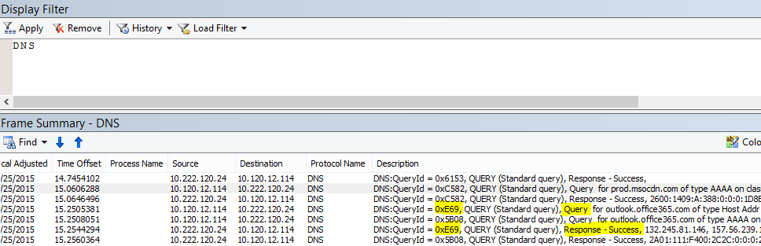

# <a name="performance-troubleshooting-plan-for-office-365"></a><span data-ttu-id="b3a58-104">Office 365 성능 문제 해결 계획</span><span class="sxs-lookup"><span data-stu-id="b3a58-104">Performance troubleshooting plan for Office 365</span></span>

<span data-ttu-id="b3a58-105">SharePoint Online, 비즈니스용 OneDrive, Exchange Online, 비즈니스용 Skype Online, 클라이언트 컴퓨터 간의 지연, 중단 및 성능 저하를 식별 하 고 해결 하기 위해 수행 해야 하는 단계를 알아야 합니까?</span><span class="sxs-lookup"><span data-stu-id="b3a58-105">Do you need to know the steps to take to identify and fix lags, hangs, and slow performance between SharePoint Online, OneDrive for Business, Exchange Online, or Skype for Business Online, and your client computer?</span></span> <span data-ttu-id="b3a58-106">지원을 요청 하기 전에이 문서를 통해 Office 365 성능 문제를 해결 하 고 일반적인 몇 가지 문제를 해결 하는 데 도움이 될 수 있습니다.</span><span class="sxs-lookup"><span data-stu-id="b3a58-106">Before you call support, this article can help you troubleshoot Office 365 performance issues and even fix some of the most common issues.</span></span>
  
<span data-ttu-id="b3a58-107">이 문서는 실제 성능 문제에 대 한 중요 한 데이터를 캡처하는 데 사용할 수 있는 예제 작업 계획입니다.</span><span class="sxs-lookup"><span data-stu-id="b3a58-107">This article is actually a sample action plan that you can use to capture valuable data about your performance issue as it's happening.</span></span> <span data-ttu-id="b3a58-108">이 문서에는 몇 가지 주요 문제에도 포함 되어 있습니다.</span><span class="sxs-lookup"><span data-stu-id="b3a58-108">Some top issues are also included in this article.</span></span>

<span data-ttu-id="b3a58-109">네트워크 성능을 처음 사용 하는 경우 클라이언트 컴퓨터와 Office 365 간의 성능을 장기간 모니터링 하려면 [office 365 성능 조정 및 문제 해결-관리자 및 IT 전문가](performance-tuning-using-baselines-and-history.md)를 확인 하세요.</span><span class="sxs-lookup"><span data-stu-id="b3a58-109">If you're new to network performance and want to make a long term plan to monitor performance between your client machines and Office 365, take a look at [Office 365 performance tuning and troubleshooting - Admin and IT Pro](performance-tuning-using-baselines-and-history.md).</span></span>
  
## <a name="sample-performance-troubleshooting-action-plan"></a><span data-ttu-id="b3a58-110">샘플 성능 문제 해결 작업 계획</span><span class="sxs-lookup"><span data-stu-id="b3a58-110">Sample performance troubleshooting action plan</span></span>

<span data-ttu-id="b3a58-111">이 작업 계획에는 두 부분이 포함 되어 있습니다. 준비 단계 및 로깅 단계</span><span class="sxs-lookup"><span data-stu-id="b3a58-111">This action plan contains two parts; a preparation phase, and a logging phase.</span></span> <span data-ttu-id="b3a58-112">지금 성능 문제가 발생 하 여 데이터 수집을 수행 해야 하는 경우이 계획을 즉시 사용 하 여 시작할 수 있습니다.</span><span class="sxs-lookup"><span data-stu-id="b3a58-112">If you have a performance problem right now, and you need to do data collection, you can start using this plan right away.</span></span>
  
### <a name="prepare-the-client-computer"></a><span data-ttu-id="b3a58-113">클라이언트 컴퓨터 준비</span><span class="sxs-lookup"><span data-stu-id="b3a58-113">Prepare the client computer</span></span>
  
- <span data-ttu-id="b3a58-114">성능 문제를 재현할 수 있는 클라이언트 컴퓨터를 찾습니다.</span><span class="sxs-lookup"><span data-stu-id="b3a58-114">Find a client computer that can reproduce the performance problem.</span></span> <span data-ttu-id="b3a58-115">이 컴퓨터는 문제 해결 과정 중에 사용 됩니다.</span><span class="sxs-lookup"><span data-stu-id="b3a58-115">This computer will be used during the course of troubleshooting.</span></span>
- <span data-ttu-id="b3a58-116">성능 문제가 발생 하는 단계를 기록 하 여 테스트 시간이 걸릴 때 준비가 완료 되었는지 확인 합니다.</span><span class="sxs-lookup"><span data-stu-id="b3a58-116">Write down the steps that cause the performance problem to happen so you're ready when it comes time to test.</span></span>
- <span data-ttu-id="b3a58-117">정보 수집 및 녹음 도구를 설치 합니다.</span><span class="sxs-lookup"><span data-stu-id="b3a58-117">Install tools for gathering and recording information:</span></span>
  - <span data-ttu-id="b3a58-118">[Netmon 3.4](https://www.microsoft.com/download/details.aspx?id=4865) 을 설치 하거나 해당 하는 네트워크 추적 도구를 사용 합니다.</span><span class="sxs-lookup"><span data-stu-id="b3a58-118">Install [Netmon 3.4](https://www.microsoft.com/download/details.aspx?id=4865) (or use an equivalent network tracing tool).</span></span>
  - <span data-ttu-id="b3a58-119">무료 기본 버전의 [HTTPWatch](https://www.httpwatch.com/download/) 를 설치 하거나 해당 하는 네트워크 추적 도구를 사용 합니다.</span><span class="sxs-lookup"><span data-stu-id="b3a58-119">Install the free Basic Edition of [HTTPWatch](https://www.httpwatch.com/download/) (or use an equivalent network Tracing tool).</span></span>
  - <span data-ttu-id="b3a58-120">테스트 중에 수행 하는 단계에 대 한 기록을 유지 하려면 화면 레코더를 사용 하거나 Windows Vista 이상에서 제공 하는 단계 레코더 (PSR)를 실행 합니다.</span><span class="sxs-lookup"><span data-stu-id="b3a58-120">Use a screen recorder or run the Steps Recorder (PSR.exe) that comes with Windows Vista and later, in order to keep a record of the steps you take during testing.</span></span>

### <a name="log-the-performance-issue"></a><span data-ttu-id="b3a58-121">성능 문제 기록</span><span class="sxs-lookup"><span data-stu-id="b3a58-121">Log the performance issue</span></span>
  
- <span data-ttu-id="b3a58-122">불필요 한 모든 인터넷 브라우저를 닫습니다.</span><span class="sxs-lookup"><span data-stu-id="b3a58-122">Close all extraneous Internet browsers.</span></span>
- <span data-ttu-id="b3a58-123">단계 레코더 또는 다른 화면 레코더를 시작 합니다.</span><span class="sxs-lookup"><span data-stu-id="b3a58-123">Start the Steps Recorder, or another screen recorder.</span></span>
- <span data-ttu-id="b3a58-124">Netmon 캡처 (또는 네트워크 추적 도구)를 시작 합니다.</span><span class="sxs-lookup"><span data-stu-id="b3a58-124">Start your Netmon capture (or network tracing tool).</span></span>
- <span data-ttu-id="b3a58-125">명령줄에서 ipconfig/flushdns를 입력 하 여 클라이언트 컴퓨터에서 DNS 캐시를 지웁니다.</span><span class="sxs-lookup"><span data-stu-id="b3a58-125">Clear your DNS cache on the client computer from the command line by typing ipconfig /flushdns.</span></span>
- <span data-ttu-id="b3a58-126">새 브라우저 세션을 시작 하 고 HTTPWatch를 켭니다.</span><span class="sxs-lookup"><span data-stu-id="b3a58-126">Start a new browser session and turn on HTTPWatch.</span></span>
- <span data-ttu-id="b3a58-127">선택 사항: Exchange Online을 테스트 하는 경우 Office 365 관리 콘솔에서 Exchange 클라이언트 성능 분석기 도구를 실행 합니다.</span><span class="sxs-lookup"><span data-stu-id="b3a58-127">Optional: If you are testing Exchange Online, run the Exchange Client Performance Analyzer tool from the Office 365 admin console.</span></span>
- <span data-ttu-id="b3a58-128">성능 문제를 일으키는 정확한 단계를 재현 합니다.</span><span class="sxs-lookup"><span data-stu-id="b3a58-128">Reproduce the exact steps that cause the performance issue.</span></span>
- <span data-ttu-id="b3a58-129">Netmon 또는 다른 도구의 추적을 중지 합니다.</span><span class="sxs-lookup"><span data-stu-id="b3a58-129">Stop your Netmon or other tool's trace.</span></span>
- <span data-ttu-id="b3a58-130">명령줄에서 다음 명령을 입력 하 여 Office 365 구독에 대 한 추적 경로를 실행 하 고 ENTER 키를 누릅니다.</span><span class="sxs-lookup"><span data-stu-id="b3a58-130">At the command line, run a trace route to your Office 365 subscription by typing the following command and then pressing ENTER:</span></span>

  ``` cmd
  tracert <subscriptionname>.onmicrosoft.com
  ```

- <span data-ttu-id="b3a58-131">단계 레코더를 중지 하 고 비디오를 저장 합니다.</span><span class="sxs-lookup"><span data-stu-id="b3a58-131">Stop the Steps Recorder and save the video.</span></span> <span data-ttu-id="b3a58-132">캡처의 날짜 및 시간을 포함 하 고이를 통해 양호한 지 또는 불량 성능을 보여 줍니다.</span><span class="sxs-lookup"><span data-stu-id="b3a58-132">Be sure to include the date and time of the capture and whether it demonstrates good or bad performance.</span></span>
- <span data-ttu-id="b3a58-133">추적 파일을 저장 합니다.</span><span class="sxs-lookup"><span data-stu-id="b3a58-133">Save the trace files.</span></span> <span data-ttu-id="b3a58-134">다시 한 번, 캡처의 날짜 및 시간을 포함 하 고,이로 인해 성능이 양호한 지 또는 불량 한지를 보여 줍니다.</span><span class="sxs-lookup"><span data-stu-id="b3a58-134">Again, be sure to include the date and time of the capture and whether it demonstrates good or bad performance.</span></span>

<span data-ttu-id="b3a58-135">이 문서에서 언급 한 도구를 실행 하는 데 익숙하지 않은 경우 다음 단계를 제공 하기 때문에 걱정할 필요가 없습니다.</span><span class="sxs-lookup"><span data-stu-id="b3a58-135">If you're not familiar with running the tools mentioned in this article, don't worry because we provide those steps next.</span></span> <span data-ttu-id="b3a58-136">이러한 종류의 네트워크 캡처를 수행 하는 데 익숙한 경우에는 로그를 필터링 하 고 읽는 방법을 설명 하는 [기준을 모으는 방법](performance-tuning-using-baselines-and-history.md#how-to-collect-baselines)으로 건너뛸 수 있습니다.</span><span class="sxs-lookup"><span data-stu-id="b3a58-136">If you're accustomed to doing this kind of network capturing, you can skip to [How to collect baselines](performance-tuning-using-baselines-and-history.md#how-to-collect-baselines), which describes filtering and reading the logs.</span></span>
  
### <a name="flush-the-dns-cache-first"></a><span data-ttu-id="b3a58-137">먼저 DNS 캐시 플러시</span><span class="sxs-lookup"><span data-stu-id="b3a58-137">Flush the DNS Cache first</span></span>

<span data-ttu-id="b3a58-138">다음과 같은 이유 때문입니다.</span><span class="sxs-lookup"><span data-stu-id="b3a58-138">Why?</span></span> <span data-ttu-id="b3a58-139">DNS 캐시를 플러시하고 정상 슬레이트로 테스트를 시작 하는 것입니다.</span><span class="sxs-lookup"><span data-stu-id="b3a58-139">By flushing out the DNS cache you're starting your tests with a clean slate.</span></span> <span data-ttu-id="b3a58-140">캐시를 지우면 DNS 확인자 콘텐츠가 최신 항목으로 다시 설정 됩니다.</span><span class="sxs-lookup"><span data-stu-id="b3a58-140">By clearing the cache, you're resetting the DNS resolver contents to the most up-to-date entries.</span></span> <span data-ttu-id="b3a58-141">Flush는 호스트 파일 항목을 제거 하지 않습니다.</span><span class="sxs-lookup"><span data-stu-id="b3a58-141">Remember that a flush does not remove HOSTs file entries.</span></span> <span data-ttu-id="b3a58-142">호스트 파일 항목을 광범위 하 게 사용 하는 경우 해당 항목을 다른 디렉터리의 파일로 복사한 다음 호스트 파일을 비워야 합니다.</span><span class="sxs-lookup"><span data-stu-id="b3a58-142">If you use HOST file entries extensively, you should copy those entries out to a file in another directory and then empty the HOST file.</span></span>
  
#### <a name="flush-your-dns-resolver-cache"></a><span data-ttu-id="b3a58-143">DNS 확인자 캐시 플러시</span><span class="sxs-lookup"><span data-stu-id="b3a58-143">Flush your DNS resolver cache</span></span>
  
1. <span data-ttu-id="b3a58-144">\*\*\*\* \> 명령 프롬프트 ( **cmd** **Run** \> 또는 **Windows 키** \> **cmd**)를 엽니다.</span><span class="sxs-lookup"><span data-stu-id="b3a58-144">Open the command prompt, (either **Start** \> **Run** \> **cmd** or **Windows key** \> **cmd**).</span></span>
2. <span data-ttu-id="b3a58-145">다음 명령을 입력한 후 Enter 키를 누릅니다.</span><span class="sxs-lookup"><span data-stu-id="b3a58-145">Type the following command and press ENTER:</span></span>

    ``` cmd
    ipconfig /flushdns
    ```

## <a name="netmon"></a><span data-ttu-id="b3a58-146">Netmon</span><span class="sxs-lookup"><span data-stu-id="b3a58-146">Netmon</span></span>

<span data-ttu-id="b3a58-147">Microsoft의 네트워크 모니터링 도구 ([Netmon](https://www.microsoft.com/download/details.aspx?id=4865))는 네트워크의 컴퓨터 간에 전달 되는 패킷 (트래픽)을 분석 합니다.</span><span class="sxs-lookup"><span data-stu-id="b3a58-147">Microsoft's Network Monitoring tool ([Netmon](https://www.microsoft.com/download/details.aspx?id=4865)) analyzes packets, that is traffic, that passes between computers on networks.</span></span> <span data-ttu-id="b3a58-148">Netmon을 사용 하 여 Office 365에서 트래픽을 추적 하 고, 다른 디바이스를 식별 하 고, 네트워크 하드웨어의 중요 설정을 확인 하 고, 손실 된 패킷을 찾고, 회사의 컴퓨터 간 트래픽 흐름을 따르도록 설정할 수 있습니다. 네트워크 및 Office 365</span><span class="sxs-lookup"><span data-stu-id="b3a58-148">By using Netmon to trace traffic with Office 365 you can capture, view, and read packet headers, identify intervening devices, check important settings on network hardware, look for dropped packets, and follow the flow of traffic between computers on your corporate network and Office 365.</span></span> <span data-ttu-id="b3a58-149">트래픽의 실제 본문은 암호화 되므로, 즉 SSL/TLS를 통해 포트 443에서 이동 하면 전송 되는 파일을 읽을 수 없습니다.</span><span class="sxs-lookup"><span data-stu-id="b3a58-149">Because the actual body of the traffic is encrypted, that is, it(travels on port 443 via SSL/TLS, you can't read the files being sent.</span></span> <span data-ttu-id="b3a58-150">대신 패킷에 사용 되는 경로를 필터링 하지 않고 확인 하 여 문제를 추적 하는 데 도움을 받을 수 있습니다.</span><span class="sxs-lookup"><span data-stu-id="b3a58-150">Instead, you get an unfiltered trace of the path that the packet takes which can help you track down the problem behavior.</span></span>
  
<span data-ttu-id="b3a58-151">지금은 필터를 적용 하지 않도록 합니다.</span><span class="sxs-lookup"><span data-stu-id="b3a58-151">Be sure you don't apply a filter at this time.</span></span> <span data-ttu-id="b3a58-152">대신 단계를 실행 하 고 문제를 시연 한 후 추적을 중지 하 고 저장 합니다.</span><span class="sxs-lookup"><span data-stu-id="b3a58-152">Instead, run through the steps and demonstrate the problem before stopping the trace and saving.</span></span>
  
<span data-ttu-id="b3a58-153">Netmon 3.4을 설치한 후 도구를 열고 다음 단계를 수행 합니다.</span><span class="sxs-lookup"><span data-stu-id="b3a58-153">After you install Netmon 3.4, open the tool and take these steps:</span></span>
  
### <a name="take-a-netmon-trace-and-reproduce-the-issue"></a><span data-ttu-id="b3a58-154">Netmon 추적을 사용 하 여 문제 재현</span><span class="sxs-lookup"><span data-stu-id="b3a58-154">Take a Netmon trace and reproduce the issue</span></span>
  
1. <span data-ttu-id="b3a58-155">Netmon 3.4을 시작 합니다.</span><span class="sxs-lookup"><span data-stu-id="b3a58-155">Launch Netmon 3.4.</span></span>
<span data-ttu-id="b3a58-156">**시작** 페이지에는 **최신 캡처**, **네트워크 선택**및 **Microsoft 네트워크 3.4 모니터 시작을 위한 세 개의 창이 있습니다. 알림을**표시 합니다.</span><span class="sxs-lookup"><span data-stu-id="b3a58-156">There are three panes on the **Start** page: **Recent Captures**, **Select Networks**, and the **Getting Started with Microsoft Network Monitor 3.4. Notice**.</span></span> <span data-ttu-id="b3a58-157">또한 네트워크 선택 패널에는 캡처할 수 있는 기본 네트워크의 목록도 제공 됩니다.</span><span class="sxs-lookup"><span data-stu-id="b3a58-157">The Select Networks panel will also give you a list of the default networks from which you can capture.</span></span> <span data-ttu-id="b3a58-158">여기에서 네트워크 카드를 선택 해야 합니다.</span><span class="sxs-lookup"><span data-stu-id="b3a58-158">Be sure that network cards are selected here.</span></span>

2. <span data-ttu-id="b3a58-159">**시작** 페이지 위쪽에서 **새 캡처** 를 클릭 합니다.</span><span class="sxs-lookup"><span data-stu-id="b3a58-159">Click **New Capture** at the top of the **Start** page.</span></span> <span data-ttu-id="b3a58-160">그러면 **캡처 1**이라는 **시작** 페이지 탭 옆에 새 탭이 추가 됩니다.</span><span class="sxs-lookup"><span data-stu-id="b3a58-160">This adds a new tab beside the **Start** page tab called **Capture 1**.</span></span>
<span data-ttu-id="b3a58-161"></span><span class="sxs-lookup"><span data-stu-id="b3a58-161"></span></span>

3. <span data-ttu-id="b3a58-162">간단한 캡처를 수행 하려면 도구 모음에서 **시작** 을 클릭 합니다.</span><span class="sxs-lookup"><span data-stu-id="b3a58-162">To take a simple capture, click **Start** on the toolbar.</span></span>

4. <span data-ttu-id="b3a58-163">성능 문제가 있는 단계를 재현 합니다.</span><span class="sxs-lookup"><span data-stu-id="b3a58-163">Reproduce the steps that present a performance issue.</span></span>

5. <span data-ttu-id="b3a58-164">**중지** \> \*\*\*\* 파일 \> **다른 이름으로 저장**을 클릭 합니다.</span><span class="sxs-lookup"><span data-stu-id="b3a58-164">Click **Stop** \> **File** \> **Save As**.</span></span> <span data-ttu-id="b3a58-165">날짜 및 시간을 표준 시간대에 제공 하 고,이로 인 한 잘못 된 성능 인지 좋은 지를 보여 줍니다.</span><span class="sxs-lookup"><span data-stu-id="b3a58-165">Remember to give the date and time with the time zone and to mention if it demonstrates bad or good performance.</span></span>

## <a name="httpwatch"></a><span data-ttu-id="b3a58-166">HTTPWatch</span><span class="sxs-lookup"><span data-stu-id="b3a58-166">HTTPWatch</span></span>

<span data-ttu-id="b3a58-167">[HTTPWatch](https://www.httpwatch.com/download/) 에는 요금이 부과 되 고 무료 버전이 제공 됩니다.</span><span class="sxs-lookup"><span data-stu-id="b3a58-167">[HTTPWatch](https://www.httpwatch.com/download/) comes in charged, and a free edition.</span></span> <span data-ttu-id="b3a58-168">무료 기본 버전에는이 테스트에 필요한 모든 내용이 포함 되어 있습니다.</span><span class="sxs-lookup"><span data-stu-id="b3a58-168">The free Basic Edition covers everything you need for this test.</span></span> <span data-ttu-id="b3a58-169">HTTPWatch는 브라우저 창에서 네트워크 트래픽과 페이지 로드 시간을 모니터링 합니다.</span><span class="sxs-lookup"><span data-stu-id="b3a58-169">HTTPWatch monitors network traffic and page load time right from your browser window.</span></span> <span data-ttu-id="b3a58-170">HTTPWatch은 성능을 그래픽으로 설명 하는 Internet Explorer의 플러그 인입니다.</span><span class="sxs-lookup"><span data-stu-id="b3a58-170">HTTPWatch is a plug-in to Internet Explorer that graphically describes performance.</span></span> <span data-ttu-id="b3a58-171">분석을 저장 하 고 HTTPWatch Studio에 볼 수 있습니다.</span><span class="sxs-lookup"><span data-stu-id="b3a58-171">The analysis can be saved and viewed in HTTPWatch Studio.</span></span>
  
> [!NOTE]
> <span data-ttu-id="b3a58-172">Firefox, Google Chrome과 같은 다른 브라우저를 사용 하거나 Internet Explorer에 HTTPWatch을 설치할 수 없으면 새 브라우저 창을 열고 키보드에서 F12 키를 누릅니다.</span><span class="sxs-lookup"><span data-stu-id="b3a58-172">If you use another browser, such as Firefox, Google Chrome, or if you can't install HTTPWatch in Internet Explorer, open a new browser window and press F12 on your keyboard.</span></span> <span data-ttu-id="b3a58-173">브라우저 아래쪽에 개발자 도구 팝업이 표시 됩니다.</span><span class="sxs-lookup"><span data-stu-id="b3a58-173">You should see the Developer Tool pop-up at the bottom of your browser.</span></span> <span data-ttu-id="b3a58-174">Opera을 사용 하는 경우에는 CTRL + SHIFT + I for Web Inspector을 누른 다음 **네트워크** 탭을 클릭 하 고 아래에 나와 있는 테스트를 완료 합니다.</span><span class="sxs-lookup"><span data-stu-id="b3a58-174">If you use Opera, press CTRL+SHIFT+I for Web Inspector, then click the **Network** tab and complete the testing outlined below.</span></span> <span data-ttu-id="b3a58-175">정보는 약간 다르지만 로드 시간은 여전히 밀리초로 표시 됩니다.</span><span class="sxs-lookup"><span data-stu-id="b3a58-175">The information will be slightly different, but load times will still be displayed in milliseconds.</span></span> <span data-ttu-id="b3a58-176">> HTTPWatch은 SharePoint Online 페이지 로드 시간과 관련 된 문제에도 매우 유용 합니다.</span><span class="sxs-lookup"><span data-stu-id="b3a58-176">> HTTPWatch is also very useful for issues with SharePoint Online page load times.</span></span>
  
### <a name="run-httpwatch-and-reproduce-the-issue"></a><span data-ttu-id="b3a58-177">HTTPWatch를 실행 하 여 문제 재현</span><span class="sxs-lookup"><span data-stu-id="b3a58-177">Run HTTPWatch and reproduce the issue</span></span>
  
<span data-ttu-id="b3a58-178">HTTPWatch는 브라우저 플러그 인 이므로 브라우저에서 도구를 표시 하는 기능은 Internet Explorer 버전 마다 약간씩 다릅니다.</span><span class="sxs-lookup"><span data-stu-id="b3a58-178">HTTPWatch is a browser plug-in, so exposing the tool in the browser is slightly different for each version of Internet Explorer.</span></span> <span data-ttu-id="b3a58-179">일반적으로 Internet Explorer 브라우저의 명령 표시줄 아래에서 HTTPWatch를 찾을 수 있습니다.</span><span class="sxs-lookup"><span data-stu-id="b3a58-179">Typically, you can find HTTPWatch under the Commands bar in the Internet Explorer browser.</span></span> <span data-ttu-id="b3a58-180">브라우저 창에 HTTPWatch 플러그 인이 표시 되지 않으면 **도움말** \> **을 클릭**하거나 나중 버전의 internet explorer에서 기어 기호 및 **정보 internet explorer**를 클릭 하 여 브라우저 버전을 확인 합니다.</span><span class="sxs-lookup"><span data-stu-id="b3a58-180">If you don't see the HTTPWatch plug-in in your browser window, check the version of your browser by clicking **Help** \> **About**, or in later versions of Internet Explorer, click the gear symbol and **About Internet Explorer**.</span></span> <span data-ttu-id="b3a58-181">**명령** 모음을 실행 하려면 Internet Explorer에서 메뉴 모음을 마우스 오른쪽 단추로 클릭 하 고 **명령 표시줄**을 클릭 합니다.</span><span class="sxs-lookup"><span data-stu-id="b3a58-181">To launch the **Commands** bar, right-click the menu bar in Internet Explorer and click **Commands bar**.</span></span>

<span data-ttu-id="b3a58-182">지난에 HTTPWatch는 명령과 탐색기 모음에 모두 연결 되어 있으므로, 다시 부팅 후에도 아이콘을 즉시 표시 하지 않고 아이콘에 대 한 도구 **모음을 바로**볼 수 있습니다.</span><span class="sxs-lookup"><span data-stu-id="b3a58-182">In the past, HTTPWatch has been associated with both the Commands and the Explorer bars, so once you install, if you don't immediately see the icon (even after reboot) check **Tools**, and your toolbars for the icon.</span></span> <span data-ttu-id="b3a58-183">도구 모음을 사용자 지정할 수 있으며 옵션을 추가할 수 있습니다.</span><span class="sxs-lookup"><span data-stu-id="b3a58-183">Remember that toolbars can be customized and options can be added to them.</span></span>


  
1. <span data-ttu-id="b3a58-185">Internet Explorer 브라우저 창에서 HTTPWatch를 시작 합니다.</span><span class="sxs-lookup"><span data-stu-id="b3a58-185">Launch HTTPWatch in an Internet Explorer browser window.</span></span> <span data-ttu-id="b3a58-186">해당 창의 아래쪽에 브라우저에 고정 되어 표시 됩니다.</span><span class="sxs-lookup"><span data-stu-id="b3a58-186">It will appear docked to the browser at the bottom of that window.</span></span> <span data-ttu-id="b3a58-187">**녹음**을 클릭 합니다.</span><span class="sxs-lookup"><span data-stu-id="b3a58-187">Click **Record**.</span></span>

2. <span data-ttu-id="b3a58-188">성능 문제에 관련 된 단계를 정확히 재현 합니다.</span><span class="sxs-lookup"><span data-stu-id="b3a58-188">Reproduce the exact steps involved in the performance issue.</span></span> <span data-ttu-id="b3a58-189">HTTPWatch에서 **중지** 단추를 클릭 합니다.</span><span class="sxs-lookup"><span data-stu-id="b3a58-189">Click the **Stop** button in HTTPWatch.</span></span>

3. <span data-ttu-id="b3a58-190">HTTPWatch를 **저장** 하거나 **전자 메일로 보냅니다**.</span><span class="sxs-lookup"><span data-stu-id="b3a58-190">**Save** the HTTPWatch or **Send by Email**.</span></span> <span data-ttu-id="b3a58-191">날짜 및 시간 정보를 포함 하도록 파일의 이름을 지정 하 고 보기에 적합 한 성능 또는 불량 성능의 예가 포함 되도록 해야 합니다.</span><span class="sxs-lookup"><span data-stu-id="b3a58-191">Remember to name the file so that it includes date and time information and an indication of whether your Watch contains a demonstration of good or bad performance.</span></span>


<span data-ttu-id="b3a58-193">이 스크린샷은 HTTPWatch Professional 버전에서 가져온 것입니다.</span><span class="sxs-lookup"><span data-stu-id="b3a58-193">This screen shot is from the Professional version of HTTPWatch.</span></span> <span data-ttu-id="b3a58-194">전문 버전을 사용 하 여 컴퓨터의 기본 버전에서 가져온 추적을 열고이 파일을 읽을 수 있습니다.</span><span class="sxs-lookup"><span data-stu-id="b3a58-194">You can open traces taken in the Basic Version on a computer with a Professional version and read it there.</span></span> <span data-ttu-id="b3a58-195">이 방법을 통해 추적에서 추가 정보를 확인할 수 있습니다.</span><span class="sxs-lookup"><span data-stu-id="b3a58-195">Extra information may be available from the trace through that method.</span></span>

## <a name="problem-steps-recorder"></a><span data-ttu-id="b3a58-196">문제 단계 레코더</span><span class="sxs-lookup"><span data-stu-id="b3a58-196">Problem Steps Recorder</span></span>

<span data-ttu-id="b3a58-197">단계 레코더 또는 PSR을 사용 하면 발생 하는 문제를 기록할 수 있습니다.</span><span class="sxs-lookup"><span data-stu-id="b3a58-197">Steps Recorder, or PSR.exe, allows you to record issues as they are occurring.</span></span> <span data-ttu-id="b3a58-198">매우 유용한 도구 이며 실행 하는 것이 아주 간단 합니다.</span><span class="sxs-lookup"><span data-stu-id="b3a58-198">It's a very useful tool and very simple to run.</span></span>
  
### <a name="run-problem-steps-recorder-psrexe-to-record-your-work"></a><span data-ttu-id="b3a58-199">작업을 기록 하기 위해 문제 단계 레코더 (PSR .exe)를 실행 합니다.</span><span class="sxs-lookup"><span data-stu-id="b3a58-199">Run Problem Steps Recorder (PSR.exe) to record your work</span></span>
  
1. <span data-ttu-id="b3a58-200">\> **시작** \> **실행** 유형 **psr** \> **를 사용**하거나, **Windows 키** \> 유형 **psr .exe** \> 를 클릭 한 다음 enter 키를 누릅니다.</span><span class="sxs-lookup"><span data-stu-id="b3a58-200">Either use **Start** \> **Run** \> type **PSR.exe** \> **OK**, or, click the **Windows Key** \> type **PSR.exe** \> and then press ENTER.</span></span>

2. <span data-ttu-id="b3a58-201">Small PSR .exe 창이 나타나면 **녹음 시작** 을 클릭 하 고 성능 문제를 재현 하는 단계를 재현 합니다.</span><span class="sxs-lookup"><span data-stu-id="b3a58-201">When the small PSR.exe window appears, click **Start Record** and reproduce the steps that reproduce the performance issue.</span></span> <span data-ttu-id="b3a58-202">필요에 따라 의견 **추가**를 클릭 하 여 설명을 추가할 수 있습니다.</span><span class="sxs-lookup"><span data-stu-id="b3a58-202">You can add comments as needed, by clicking **Add Comments**.</span></span>

3. <span data-ttu-id="b3a58-203">단계를 완료 한 후 **녹음 중지** 를 클릭 합니다.</span><span class="sxs-lookup"><span data-stu-id="b3a58-203">Click **Stop Record** when you have completed the steps.</span></span> <span data-ttu-id="b3a58-204">성능 문제가 페이지 렌더링 인 경우 기록을 중지 하기 전에 페이지가 렌더링 될 때까지 기다립니다.</span><span class="sxs-lookup"><span data-stu-id="b3a58-204">If the performance issue is a page render, wait for the page to render before you stop the recording.</span></span>

4. <span data-ttu-id="b3a58-205">**저장**을 클릭합니다.</span><span class="sxs-lookup"><span data-stu-id="b3a58-205">Click **Save**.</span></span>


  
<span data-ttu-id="b3a58-207">날짜와 시간이 기록 됩니다.</span><span class="sxs-lookup"><span data-stu-id="b3a58-207">The date and time is recorded for you.</span></span> <span data-ttu-id="b3a58-208">이를 통해 PSR을 Netmon 추적 및 HTTPWatch에 연결 하 고 정밀도 문제 해결을 지원 합니다.</span><span class="sxs-lookup"><span data-stu-id="b3a58-208">This links your PSR to your Netmon trace and HTTPWatch in time, and helps with precision troubleshooting.</span></span> <span data-ttu-id="b3a58-209">PSR 레코드의 날짜 및 시간에는 URL의 로그인 및 검색과 관리 사이트의 부분 렌더링 간에 경과 된 시간이 표시 됩니다.</span><span class="sxs-lookup"><span data-stu-id="b3a58-209">The date and time in the PSR record can show that a minute passed between the login and browsing of the URL and the partial render of the admin site, for example.</span></span>
  
## <a name="read-your-traces"></a><span data-ttu-id="b3a58-210">추적 읽기</span><span class="sxs-lookup"><span data-stu-id="b3a58-210">Read your traces</span></span>

<span data-ttu-id="b3a58-211">문서를 통해 다른 사람이 알아야 할 네트워크 및 성능 문제 해결에 대 한 모든 정보를 배울 수는 없습니다.</span><span class="sxs-lookup"><span data-stu-id="b3a58-211">It isn't possible to teach everything about network and performance troubleshooting that someone would need to know via an article.</span></span> <span data-ttu-id="b3a58-212">성능이 양호 하 고 네트워크가 작동 하 고 일반적으로 수행 되는 방식에 대 한 지식이 향상 되었습니다.</span><span class="sxs-lookup"><span data-stu-id="b3a58-212">Getting good at performance takes experience, and knowledge of how your network works and usually performs.</span></span> <span data-ttu-id="b3a58-213">그러나 주요 문제 목록을 반올림 하 고 도구를 통해 가장 일반적인 문제를 방지 하는 데 도움이 되는 방법을 표시할 수 있습니다.</span><span class="sxs-lookup"><span data-stu-id="b3a58-213">But it is possible to round up a list of top issues and show how tools can make it easier for you to eliminate the most common problems.</span></span>
  
<span data-ttu-id="b3a58-214">Office 365 사이트에 대 한 네트워크 추적을 읽는 기술을 선택 하려는 경우에는 페이지 로드 추적을 정기적으로 만드는 것 보다 더 나은 교사를 선정 하 여이를 읽어 보세요.</span><span class="sxs-lookup"><span data-stu-id="b3a58-214">If you want to pick up skills reading network traces for your Office 365 sites, there is no better teacher than creating traces of page loads regularly and gaining experience reading them.</span></span> <span data-ttu-id="b3a58-215">예를 들어, Office 365 서비스를 로드 하 고 프로세스를 추적 하는 경우를 예로 들 수 있습니다.</span><span class="sxs-lookup"><span data-stu-id="b3a58-215">For example, when you have a chance, load an Office 365 service and trace the process.</span></span> <span data-ttu-id="b3a58-216">추적을 DNS 트래픽에 대해 필터링 하거나, 검색 한 서비스의 이름에 대 한 프레임 데이터를 검색할 수 있습니다.</span><span class="sxs-lookup"><span data-stu-id="b3a58-216">Filter the trace for DNS traffic, or search the FrameData for the name of the service you browsed.</span></span> <span data-ttu-id="b3a58-217">추적을 검색 하 여 서비스가 로드 될 때 발생 하는 단계를 파악 합니다.</span><span class="sxs-lookup"><span data-stu-id="b3a58-217">Scan the trace to get an idea of the steps that occur when the service loads.</span></span> <span data-ttu-id="b3a58-218">이렇게 하면 일반적인 페이지 로드 모양, 문제를 해결 하는 경우 (특히 성능 저하), 잘못 된 추적과 비교 하 여 많은 정보를 얻을 수 있습니다.</span><span class="sxs-lookup"><span data-stu-id="b3a58-218">This will help you learn what normal page load should look like, and in the case of troubleshooting, particularly around performance, comparing good to bad traces can teach you a lot.</span></span>
  
<span data-ttu-id="b3a58-219">Netmon은 표시 필터 필드에 Microsoft Intellisense를 사용 합니다.</span><span class="sxs-lookup"><span data-stu-id="b3a58-219">Netmon uses Microsoft Intellisense in the Display filter field.</span></span> <span data-ttu-id="b3a58-220">Intellisense 또는 지능형 코드 완성은 사용자가 마침표를 입력 하는 방법을 속이는 반면 드롭다운 선택 상자에 사용 가능한 모든 옵션을 표시 합니다.</span><span class="sxs-lookup"><span data-stu-id="b3a58-220">Intellisense, or intelligent code completion, is that trick where you type in a period and all available options are displayed in a drop-down selection box.</span></span> <span data-ttu-id="b3a58-221">예를 들어, TCP 창 크기 조정에 대 한 걱정을 하는 경우에는 필터 (예: `.protocol.tcp.window < 100`)를 사용 하 여이 방법으로 필터링 할 수 있습니다.</span><span class="sxs-lookup"><span data-stu-id="b3a58-221">If, for example, you are worried about TCP window scaling, you can find your way to a filter (such as  `.protocol.tcp.window < 100`) by this means.</span></span>
  

  
<span data-ttu-id="b3a58-223">Netmon 추적에는 트래픽이 많이 있을 수 있습니다.</span><span class="sxs-lookup"><span data-stu-id="b3a58-223">Netmon traces can have a lot of traffic in them.</span></span> <span data-ttu-id="b3a58-224">이러한 정보를 읽지 않은 경우 처음에 추적을 여는 것이 더 오래 걸릴 가능성이 높습니다.</span><span class="sxs-lookup"><span data-stu-id="b3a58-224">If you aren't experienced with reading them, it's likely you will be overwhelmed opening the trace the first time.</span></span> <span data-ttu-id="b3a58-225">가장 먼저 수행할 작업은 신호를 추적의 배경 노이즈와 구분 하는 것입니다.</span><span class="sxs-lookup"><span data-stu-id="b3a58-225">The first thing to do is separate the signal from the background noise in the trace.</span></span> <span data-ttu-id="b3a58-226">Office 365에 대 한 테스트를 거쳤으며 필요한 트래픽입니다.</span><span class="sxs-lookup"><span data-stu-id="b3a58-226">You tested against Office 365, and that's the traffic you want to see.</span></span> <span data-ttu-id="b3a58-227">추적을 탐색 하는 데 사용 되는 경우에는이 목록이 필요 하지 않을 수 있습니다.</span><span class="sxs-lookup"><span data-stu-id="b3a58-227">If you are used to navigating through traces, you may not need this list.</span></span>
  
<span data-ttu-id="b3a58-228">클라이언트와 Office 365 간의 트래픽은 TLS를 통해 전송 되는데,이는 트래픽의 본문이 암호화 되 고 일반 Netmon 추적에서 읽을 수 없게 된다는 것을 의미 합니다.</span><span class="sxs-lookup"><span data-stu-id="b3a58-228">Traffic between your client and Office 365 travels via TLS, which means that the body of the traffic will be encrypted and not readable in a generic Netmon trace.</span></span> <span data-ttu-id="b3a58-229">성능 분석에서는 패킷의 정보에 대 한 세부 사항을 파악 하지 않아도 됩니다.</span><span class="sxs-lookup"><span data-stu-id="b3a58-229">Your performance analysis doesn't need to know the specifics of the information in the packet.</span></span> <span data-ttu-id="b3a58-230">그러나 패킷 헤더와 여기에 포함 된 정보에 매우 관심이 있습니다.</span><span class="sxs-lookup"><span data-stu-id="b3a58-230">It is, however, very interested in packet headers and the information that they contain.</span></span>
  
### <a name="tips-to-get-a-good-trace"></a><span data-ttu-id="b3a58-231">좋은 추적을 얻기 위한 팁</span><span class="sxs-lookup"><span data-stu-id="b3a58-231">Tips to get a good trace</span></span>
  
- <span data-ttu-id="b3a58-232">클라이언트 컴퓨터의 IPv4 또는 IPv6 주소 값을 확인 합니다.</span><span class="sxs-lookup"><span data-stu-id="b3a58-232">Know the value of the IPv4 or IPv6 address of your client computer.</span></span> <span data-ttu-id="b3a58-233">**IPConfig** 를 입력 하 고 enter 키를 눌러 명령 프롬프트에서이를 가져올 수 있습니다.</span><span class="sxs-lookup"><span data-stu-id="b3a58-233">You can get this from the command prompt by typing **IPConfig** and then pressing ENTER.</span></span> <span data-ttu-id="b3a58-234">이 주소를 알고 있으면 추적의 트래픽에 클라이언트 컴퓨터가 직접 포함 되는지 여부를 한눈에 파악할 수 있습니다.</span><span class="sxs-lookup"><span data-stu-id="b3a58-234">Knowing this address will let you tell at a glance whether the traffic in the trace directly involves your client computer.</span></span> <span data-ttu-id="b3a58-235">알려진 프록시가 있으면 ping 하 여 해당 IP 주소도 가져옵니다.</span><span class="sxs-lookup"><span data-stu-id="b3a58-235">If there is a known proxy, ping it and get its IP address as well.</span></span>

- <span data-ttu-id="b3a58-236">DNS 확인자 캐시를 플러시하고 가능한 경우 테스트를 실행 하는 모든 브라우저를 제외 하 고 모두 닫습니다.</span><span class="sxs-lookup"><span data-stu-id="b3a58-236">Flush your DNS resolver cache and, if possible, close all browsers except the one in which you are running your tests.</span></span> <span data-ttu-id="b3a58-237">예를 들어 지원에서 일부 브라우저 기반 도구를 사용 하 여 클라이언트 컴퓨터의 데스크톱을 확인 하는 경우 추적을 필터링 할 준비가 된 것입니다.</span><span class="sxs-lookup"><span data-stu-id="b3a58-237">If you are not able to do this, for instance, if support is using some browser-based tool to see your client computer's desktop, be prepared to filter your trace.</span></span>

- <span data-ttu-id="b3a58-238">사용량이 많은 추적에서 사용 중인 Office 365 서비스를 찾습니다.</span><span class="sxs-lookup"><span data-stu-id="b3a58-238">In a busy trace, locate the Office 365 service that you're using.</span></span> <span data-ttu-id="b3a58-239">이전에 트래픽이 전혀 또는 거의 본 적이 없는 경우에는 다른 네트워크 소음 으로부터 성능 문제를 구분 하는 데 도움이 됩니다.</span><span class="sxs-lookup"><span data-stu-id="b3a58-239">If you've never or seldom seen your traffic before, this is a helpful step in separating the performance issue from other network noise.</span></span> <span data-ttu-id="b3a58-240">몇 가지 방법을 통해이 작업을 수행할 수 있습니다.</span><span class="sxs-lookup"><span data-stu-id="b3a58-240">There are a few ways to do this.</span></span> <span data-ttu-id="b3a58-241">테스트 바로 전에 특정 서비스의 URL에 대 한 _ping_ 또는 _psping_ 을 사용할 수 있습니다 (`ping outlook.office365.com` 예: `psping -4 microsoft-my.sharepoint.com:443`또는).</span><span class="sxs-lookup"><span data-stu-id="b3a58-241">Directly before your test, you can use _ping_ or _PsPing_ against the URL of the specific service (`ping outlook.office365.com` or `psping -4 microsoft-my.sharepoint.com:443`, for example).</span></span> <span data-ttu-id="b3a58-242">또한 Netmon 추적에서 ping 또는 PsPing을 쉽게 찾을 수 있습니다 (프로세스 이름).</span><span class="sxs-lookup"><span data-stu-id="b3a58-242">You can also easily find that ping or PsPing in a Netmon trace (by its process name).</span></span> <span data-ttu-id="b3a58-243">이를 통해 확인을 시작할 수 있습니다.</span><span class="sxs-lookup"><span data-stu-id="b3a58-243">That will give you a place to start looking.</span></span>

<span data-ttu-id="b3a58-244">문제가 발생할 때에만 Netmon 추적을 사용 하는 경우에도 해당 됩니다.</span><span class="sxs-lookup"><span data-stu-id="b3a58-244">If you're only using Netmon tracing at the time of the problem, that's okay too.</span></span> <span data-ttu-id="b3a58-245">직접 방향을 하려면 or `ContainsBin(FrameData, ASCII, "office")` `ContainsBin(FrameData, ASCII, "outlook")`와 같은 필터를 사용 합니다.</span><span class="sxs-lookup"><span data-stu-id="b3a58-245">To orient yourself, use a filter like `ContainsBin(FrameData, ASCII, "office")` or `ContainsBin(FrameData, ASCII, "outlook")`.</span></span> <span data-ttu-id="b3a58-246">추적 파일에서 프레임 번호를 기록할 수 있습니다.</span><span class="sxs-lookup"><span data-stu-id="b3a58-246">You can record your frame number from the trace file.</span></span> <span data-ttu-id="b3a58-247">_프레임 요약_ 창에서 오른쪽으로 스크롤하여 대화 ID 열을 찾을 수도 있습니다.</span><span class="sxs-lookup"><span data-stu-id="b3a58-247">You may also want to scroll the _Frame Summary_ pane all the way to the right and look for the Conversation ID column.</span></span> <span data-ttu-id="b3a58-248">이 특정 대화의 ID에 대 한 번호를 표시 하는 번호가 있으며 나중에 격리에서이를 기록 하 고 확인할 수도 있습니다.</span><span class="sxs-lookup"><span data-stu-id="b3a58-248">There is a number indicated there for the ID of this specific conversation that you can also record and look at in isolation later.</span></span> <span data-ttu-id="b3a58-249">다른 필터링을 적용 하기 전에이 필터를 제거 해야 합니다.</span><span class="sxs-lookup"><span data-stu-id="b3a58-249">Remember to remove this filter before applying any other filtering.</span></span>

> [!TIP]
> <span data-ttu-id="b3a58-250">Netmon에는 유용한 기본 제공 필터가 많이 있습니다.</span><span class="sxs-lookup"><span data-stu-id="b3a58-250">Netmon has a lot of helpful built-in filters.</span></span> <span data-ttu-id="b3a58-251">_표시_ 필터 창 맨 위에 있는 **필터 로드** 단추를 실행 합니다.</span><span class="sxs-lookup"><span data-stu-id="b3a58-251">Try the **Load Filter** button at the top of the _Display_ filter pane.</span></span>
  

  

  
<span data-ttu-id="b3a58-254">트래픽에 대해 자세히 알아보고 필요한 정보를 찾는 방법을 알아보세요.</span><span class="sxs-lookup"><span data-stu-id="b3a58-254">Get familiar with your traffic, and learn to locate the information you need.</span></span> <span data-ttu-id="b3a58-255">예를 들어 "Outlook"과 같이 사용 중인 Office 365 서비스에 대 한 첫 번째 참조가 추적의 패킷에 있는지 확인 하는 방법을 설명 합니다.</span><span class="sxs-lookup"><span data-stu-id="b3a58-255">For example, learn to determine which packet in the trace has the first reference to the Office 365 service you're using (like "Outlook").</span></span>

<span data-ttu-id="b3a58-256">Office 365 Outlook Online을 예로 들면 다음과 같이 트래픽이 시작 됩니다.</span><span class="sxs-lookup"><span data-stu-id="b3a58-256">Taking Office 365 Outlook Online as an example, the traffic begins something like this:</span></span>
  
- <span data-ttu-id="b3a58-257">일치 하는 QueryIDs가 있는 outlook.office365.com에 대 한 DNS 표준 쿼리 및 DNS 응답입니다.</span><span class="sxs-lookup"><span data-stu-id="b3a58-257">DNS Standard Query and DNS Response for outlook.office365.com with matching QueryIDs.</span></span> <span data-ttu-id="b3a58-258">이 정도에 대 한 시간 오프셋을 확인 하 고, 전 세계에서 Office 365 글로벌 DNS가 이름 확인 요청을 보내는 위치를 기록해 야 합니다.</span><span class="sxs-lookup"><span data-stu-id="b3a58-258">It's important to note the time offset for this turn-around, as well as where in the world the Office 365 Global DNS sends the request for name resolution.</span></span> <span data-ttu-id="b3a58-259">가능 하면 전 세계의 중간에 해당 하는 것이 이상적입니다.</span><span class="sxs-lookup"><span data-stu-id="b3a58-259">Ideally, as locally as possible, rather than halfway across the world.</span></span>

- <span data-ttu-id="b3a58-260">상황 보고서가 영구적으로 이동 된 (301) HTTP GET 요청입니다.</span><span class="sxs-lookup"><span data-stu-id="b3a58-260">A HTTP GET Request whose status report Moved Permanently (301)</span></span>

- <span data-ttu-id="b3a58-261">RWS 연결 요청 및 연결 회신을 포함 한 RWS 트래픽</span><span class="sxs-lookup"><span data-stu-id="b3a58-261">RWS Traffic including RWS Connect requests and Connect replies.</span></span> <span data-ttu-id="b3a58-262">(원격 Winsock 연결을 설정 합니다.)</span><span class="sxs-lookup"><span data-stu-id="b3a58-262">(This is Remote Winsock making a connection for you.)</span></span>

- <span data-ttu-id="b3a58-263">TCP SYN 및 TCP SYN/ACK 대화입니다.</span><span class="sxs-lookup"><span data-stu-id="b3a58-263">A TCP SYN and TCP SYN/ACK conversation.</span></span> <span data-ttu-id="b3a58-264">이 대화의 많은 설정이 성능에 영향을 줍니다.</span><span class="sxs-lookup"><span data-stu-id="b3a58-264">A lot of the settings in this conversation impact your performance.</span></span>

- <span data-ttu-id="b3a58-265">Tls 핸드셰이크 및 TLS 인증서를 사용 하는 대화가 발생 하는 tls 트래픽입니다.</span><span class="sxs-lookup"><span data-stu-id="b3a58-265">Then a series of TLS:TLS traffic which is where the TLS handshake and TLS certificate conversations take place.</span></span> <span data-ttu-id="b3a58-266">(SSL/TLS를 통해 데이터를 암호화 합니다.)</span><span class="sxs-lookup"><span data-stu-id="b3a58-266">(Remember the data is encrypted via SSL/TLS.)</span></span>

<span data-ttu-id="b3a58-267">트래픽의 모든 부분이 중요 하 고 연결 되지만, 추적의 작은 부분에는 성능 문제 해결 측면에서 특히 중요 한 정보가 포함 되어 있으므로 이러한 영역에 중점을 두는 것이 좋습니다.</span><span class="sxs-lookup"><span data-stu-id="b3a58-267">All parts of the traffic are important and connected, but small portions of the trace contain information particularly important in terms of performance troubleshooting, so we'll focus on those areas.</span></span> <span data-ttu-id="b3a58-268">또한 Microsoft에서 Office 365 성능 문제 해결에 대 한 충분 한 문제가 발생 하 여 일반적인 10 가지 문제를 컴파일 했기 때문에 이러한 문제에 중점을 둔 것 이며, 다음에이를 수행 하는 데 필요한 도구를 사용 하는 방법을 중점적으로 설명 합니다.</span><span class="sxs-lookup"><span data-stu-id="b3a58-268">Also, since we've done enough Office 365 performance troubleshooting at Microsoft to compile a Top Ten list of common problems, we'll focus on those issues and how to use the tools we have to root them out next.</span></span>
  
<span data-ttu-id="b3a58-269">모든 준비가 완료 되지 않은 경우 아래 매트릭스를 통해 몇 가지 도구를 사용할 수 있습니다.</span><span class="sxs-lookup"><span data-stu-id="b3a58-269">If you haven't installed them all ready, the matrix below makes use of several tools.</span></span> <span data-ttu-id="b3a58-270">가능한 경우</span><span class="sxs-lookup"><span data-stu-id="b3a58-270">Where possible.</span></span> <span data-ttu-id="b3a58-271">설치 지점에 링크가 제공 됩니다.</span><span class="sxs-lookup"><span data-stu-id="b3a58-271">Links are provided to the installation points.</span></span> <span data-ttu-id="b3a58-272">이 목록에는 [Netmon](https://www.microsoft.com/download/details.aspx?id=4865) 및 [Wireshark](https://www.wireshark.org/)과 같은 일반적인 네트워크 추적 도구가 포함 되어 있지만, 익숙한 모든 추적 도구를 사용 하며, 네트워크 트래픽을 필터링 하는 데 익숙한 사용자에 게 제공 됩니다.</span><span class="sxs-lookup"><span data-stu-id="b3a58-272">The list includes common network tracing tools like [Netmon](https://www.microsoft.com/download/details.aspx?id=4865) and [Wireshark](https://www.wireshark.org/), but use any tracing tool you are comfortable with, and in which you're accustomed to filtering network traffic.</span></span> <span data-ttu-id="b3a58-273">테스트할 때는 다음을 염두에 두어야 합니다.</span><span class="sxs-lookup"><span data-stu-id="b3a58-273">When you're testing, remember:</span></span>
  
- <span data-ttu-id="b3a58-274">브라우저 *를 닫고 실행 하는 브라우저 하나만 사용 하 여 테스트* -이 경우 캡처한 전체 트래픽을 줄일 수 있습니다.</span><span class="sxs-lookup"><span data-stu-id="b3a58-274">*Close your browsers, and test with only one browser running*  - This will reduce the overall traffic you capture.</span></span> <span data-ttu-id="b3a58-275">이를 통해 사용량이 적은 추적을 사용할 수 있습니다.</span><span class="sxs-lookup"><span data-stu-id="b3a58-275">It makes for a less busy trace.</span></span>
- <span data-ttu-id="b3a58-276">*클라이언트 컴퓨터에서 DNS 확인자 캐시 플러시* -이 작업은 깨끗 한 추적을 위해 캡처를 시작할 때 깨끗 한 슬레이트를 제공 합니다.</span><span class="sxs-lookup"><span data-stu-id="b3a58-276">*Flush your DNS resolver cache on the client computer*  - This will give you a clean slate when you start to take your capture, for a cleaner trace.</span></span>

## <a name="common-issues"></a><span data-ttu-id="b3a58-277">일반적인 문제</span><span class="sxs-lookup"><span data-stu-id="b3a58-277">Common issues</span></span>

<span data-ttu-id="b3a58-278">직면 하 게 되는 일반적인 문제점과 네트워크 추적에서 이러한 문제를 찾는 방법</span><span class="sxs-lookup"><span data-stu-id="b3a58-278">Some common issues you may face and how to find them in your Network trace.</span></span>

### <a name="tcp-windows-scaling"></a><span data-ttu-id="b3a58-279">TCP Windows 확장</span><span class="sxs-lookup"><span data-stu-id="b3a58-279">TCP Windows Scaling</span></span>

<span data-ttu-id="b3a58-280">SYN-SYN/ACK에서 찾을 수 있습니다.</span><span class="sxs-lookup"><span data-stu-id="b3a58-280">Found in the SYN - SYN/ACK.</span></span> <span data-ttu-id="b3a58-281">레거시 또는 에이징 하드웨어가 TCP windows 확장을 활용 하지 못할 수 있습니다.</span><span class="sxs-lookup"><span data-stu-id="b3a58-281">Legacy or aging hardware may not take advantage of TCP windows scaling.</span></span>  <span data-ttu-id="b3a58-282">적절 한 TCP windows 확장 설정이 없는 경우 TCP 헤더의 기본 16 비트 버퍼는 밀리초 단위로 채워집니다.</span><span class="sxs-lookup"><span data-stu-id="b3a58-282">Without proper TCP windows scaling settings, the default 16-bit buffer in TCP headers fills in milliseconds.</span></span>  <span data-ttu-id="b3a58-283">클라이언트가 원래 데이터를 수신 했다는 승인을 수신 하 여 지연이 발생 하기 전 까지는 트래픽을 계속 보낼 수 없습니다.</span><span class="sxs-lookup"><span data-stu-id="b3a58-283">Traffic cannot continue to send until the client receives an acknowledgment that the original data has been received, causing delays.</span></span>

#### <a name="tools"></a><span data-ttu-id="b3a58-284">도구</span><span class="sxs-lookup"><span data-stu-id="b3a58-284">Tools</span></span>

- <span data-ttu-id="b3a58-285">Netmon</span><span class="sxs-lookup"><span data-stu-id="b3a58-285">Netmon</span></span>
- <span data-ttu-id="b3a58-286">Wireshark</span><span class="sxs-lookup"><span data-stu-id="b3a58-286">Wireshark</span></span>

#### <a name="what-to-look-for"></a><span data-ttu-id="b3a58-287">찾을 대상</span><span class="sxs-lookup"><span data-stu-id="b3a58-287">What to look for</span></span>

<span data-ttu-id="b3a58-288">네트워크 추적에서 SYN-SYN/ACK 트래픽을 찾습니다.</span><span class="sxs-lookup"><span data-stu-id="b3a58-288">Look for the SYN - SYN/ACK traffic in your network trace.</span></span>  <span data-ttu-id="b3a58-289">Netmon에서와 같은 `tcp.flags.syn == 1`필터를 사용 합니다.</span><span class="sxs-lookup"><span data-stu-id="b3a58-289">In Netmon, use a filter like  `tcp.flags.syn == 1`.</span></span> <span data-ttu-id="b3a58-290">이 필터는 Wireshark에서 동일 합니다.</span><span class="sxs-lookup"><span data-stu-id="b3a58-290">This filter is the same in Wireshark.</span></span>  


<span data-ttu-id="b3a58-292">모든 SYN에는 관련 승인 (SYN/ACK)의 대상 포트 (DstPort)에서 일치 하는 원본 포트 (SrcPort) 번호가 있습니다.</span><span class="sxs-lookup"><span data-stu-id="b3a58-292">Notice that for every SYN there is a source port (SrcPort) number that is matched in the destination port (DstPort) of the related Acknowledgment (SYN/ACK).</span></span>

<span data-ttu-id="b3a58-293">네트워크 연결에서 사용 되는 Windows 확장 값을 확인 하려면 먼저 SYN을 확장 한 다음 관련 SYN/ACK를 확대 합니다.</span><span class="sxs-lookup"><span data-stu-id="b3a58-293">To see the Windows Scaling value that is used by your network connection, expand first the SYN, and then the related SYN/ACK.</span></span>  

  

### <a name="tcp-idle-time-settings"></a><span data-ttu-id="b3a58-295">TCP 유휴 시간 설정</span><span class="sxs-lookup"><span data-stu-id="b3a58-295">TCP Idle Time Settings</span></span>

<span data-ttu-id="b3a58-296">전통적으로 대부분의 경계 네트워크는 일시적 연결에 맞게 구성 되어 있으며, 일반적으로 유휴 연결이 종료 됩니다.</span><span class="sxs-lookup"><span data-stu-id="b3a58-296">Historically, most perimeter networks are configured for transient connections, meaning idle connections are generally terminated.</span></span> <span data-ttu-id="b3a58-297">유휴 TCP 세션은 프록시 및 방화벽이 100 보다 큰 경우 300 초까지 종료 될 수 있습니다.</span><span class="sxs-lookup"><span data-stu-id="b3a58-297">Idle TCP sessions can be terminated by proxies and firewalls at greater than 100 to 300 seconds.</span></span> <span data-ttu-id="b3a58-298">이는 유휴 상태 인지 여부에 관계 없이 장기간 연결을 만들고 사용 하기 때문에 Outlook Online에 문제가 있는 것입니다.</span><span class="sxs-lookup"><span data-stu-id="b3a58-298">This is problematic for Outlook Online because it creates and uses long-term connections, whether they are idle or not.</span></span>  

<span data-ttu-id="b3a58-299">프록시 또는 방화벽 장치에 의해 연결이 종료 되 면 클라이언트에 게 알림이 제공 되지 않으며, Outlook Online을 사용 하려는 시도는 클라이언트 컴퓨터에서 새 연결을 만들기 전에 revive를 계속 시도 합니다.</span><span class="sxs-lookup"><span data-stu-id="b3a58-299">When connections are terminated by proxy or firewall devices, the client is not informed, and an attempt to use Outlook Online will mean a client computer will try, repeatedly, to revive the connection before making a new one.</span></span> <span data-ttu-id="b3a58-300">페이지 로드 시 제품이 중단 되거나, 메시지가 표시 되거나, 성능이 저하 되는 것을 볼 수 있습니다.</span><span class="sxs-lookup"><span data-stu-id="b3a58-300">You may see hangs in the product, prompts, or slow performance on page load.</span></span>

#### <a name="tools"></a><span data-ttu-id="b3a58-301">도구</span><span class="sxs-lookup"><span data-stu-id="b3a58-301">Tools</span></span>

- <span data-ttu-id="b3a58-302">Netmon</span><span class="sxs-lookup"><span data-stu-id="b3a58-302">Netmon</span></span>
- <span data-ttu-id="b3a58-303">Wireshark</span><span class="sxs-lookup"><span data-stu-id="b3a58-303">Wireshark</span></span>

#### <a name="what-to-look-for"></a><span data-ttu-id="b3a58-304">찾을 대상</span><span class="sxs-lookup"><span data-stu-id="b3a58-304">What to look for</span></span>

<span data-ttu-id="b3a58-305">Netmon에서 라운드트립에 대 한 시간 오프셋 필드를 확인 합니다.</span><span class="sxs-lookup"><span data-stu-id="b3a58-305">In Netmon, look at the Time Offset field for a round-trip.</span></span> <span data-ttu-id="b3a58-306">클라이언트는 서버에 요청을 전송 하 고 응답을 다시 수신 하는 간의 시간을 라운드트립 합니다.</span><span class="sxs-lookup"><span data-stu-id="b3a58-306">A round-trip is the time between client sending a request to the server and receiving a response back.</span></span> <span data-ttu-id="b3a58-307">클라이언트와 송신 지점 사이에 확인 합니다 (예:</span><span class="sxs-lookup"><span data-stu-id="b3a58-307">Check between the Client and the egress point (ex.</span></span> <span data-ttu-id="b3a58-308">클라이언트--\> 프록시) 또는 클라이언트에서 office 365 (클라이언트--\> Office 365)까지 사용 합니다.</span><span class="sxs-lookup"><span data-stu-id="b3a58-308">Client --\> Proxy), or the Client to Office 365 (Client --\> Office 365).</span></span> <span data-ttu-id="b3a58-309">다양 한 유형의 패킷으로이를 볼 수 있습니다.</span><span class="sxs-lookup"><span data-stu-id="b3a58-309">You can see this in many types of packets.</span></span>

<span data-ttu-id="b3a58-310">예를 들어 Netmon의 필터는 또는 Wireshark에서와 `.Protocol.IPv4.Address == 10.102.14.112 AND .Protocol.IPv4.Address == 10.201.114.12`같이 표시 될 수 있습니다 `ip.addr == 10.102.14.112 &amp;&amp; ip.addr == 10.201.114.12`.</span><span class="sxs-lookup"><span data-stu-id="b3a58-310">As an example, the filter in Netmon may look like  `.Protocol.IPv4.Address == 10.102.14.112 AND .Protocol.IPv4.Address == 10.201.114.12`, or, in Wireshark,  `ip.addr == 10.102.14.112 &amp;&amp; ip.addr == 10.201.114.12`.</span></span>  

> [!TIP]
> <span data-ttu-id="b3a58-311">추적의 IP 주소가 DNS 서버에 속하는지 여부를 알 수 없습니까?</span><span class="sxs-lookup"><span data-stu-id="b3a58-311">Don't know if the IP address in your trace belongs to your DNS server?</span></span> <span data-ttu-id="b3a58-312">명령줄에서 조회 해 봅니다.</span><span class="sxs-lookup"><span data-stu-id="b3a58-312">Try looking it up at the command line.</span></span> <span data-ttu-id="b3a58-313">실행 \*\*\*\* \> \*\*\*\* \*\*\*\* \*\*\*\* \> \*\*\*\* 시작을 클릭 하 고 cmd를 입력 하거나 Windows 키를 누르고 cmd를 입력 합니다. \></span><span class="sxs-lookup"><span data-stu-id="b3a58-313">Click **Start** \> **Run** \> and type **cmd**, or press **Windows Key** \> and type **cmd**.</span></span> <span data-ttu-id="b3a58-314">프롬프트에을 입력 `nslookup <the IP address from the network trace>`합니다.</span><span class="sxs-lookup"><span data-stu-id="b3a58-314">At the prompt, type  `nslookup <the IP address from the network trace>`.</span></span> <span data-ttu-id="b3a58-315">테스트 하려면 사용자 컴퓨터의 IP 주소에 대해 nslookup을 사용 합니다.</span><span class="sxs-lookup"><span data-stu-id="b3a58-315">To test, use nslookup against your own computer's IP address.</span></span> <span data-ttu-id="b3a58-316">Microsoft IP 범위 목록을 보려면 > [Office 365 url 및 IP 주소 범위](https://technet.microsoft.com/library/hh373144.aspx)를 참조 하세요.</span><span class="sxs-lookup"><span data-stu-id="b3a58-316">> To see a list of Microsoft's IP ranges, see [Office 365 URLs and IP address ranges](https://technet.microsoft.com/library/hh373144.aspx).</span></span>

<span data-ttu-id="b3a58-317">문제가 있는 경우, 특히 TLS에서는 응용 프로그램 데이터의 위치를 표시 하는 TLS 패킷 (예: Netmon에서 제공 하는 응용 프로그램 데이터 패킷을 찾을 수 있음 `.Protocol.TLS AND Description == "TLS:TLS Rec Layer-1 SSL Application Data"`)에 표시 되는 긴 시간 오프셋 (이 경우 Outlook Online)이 나타날 것으로 예상 합니다.</span><span class="sxs-lookup"><span data-stu-id="b3a58-317">If there is a problem, expect long Time Offsets to appear, in this case (Outlook Online), particularly in TLS:TLS packets that show the passage of Application Data (for example, in Netmon you can find application data packets via  `.Protocol.TLS AND Description == "TLS:TLS Rec Layer-1 SSL Application Data"`).</span></span> <span data-ttu-id="b3a58-318">세션 전체에서 시간이 순조롭게 진행 되 고 있는 것을 볼 수 있습니다.</span><span class="sxs-lookup"><span data-stu-id="b3a58-318">You should see a smooth progression in the time across the session.</span></span> <span data-ttu-id="b3a58-319">Outlook Online을 새로 고칠 때 시간이 오래 걸리는 경우 전송 되는 재설정으로 인해 발생할 수 있습니다.</span><span class="sxs-lookup"><span data-stu-id="b3a58-319">If you see long delays when refreshing your Outlook Online, this could be caused by a high degree of resets being sent.</span></span>

### <a name="latencyround-trip-time"></a><span data-ttu-id="b3a58-320">대기 시간/라운드트립에서</span><span class="sxs-lookup"><span data-stu-id="b3a58-320">Latency/Round Trip Time</span></span>

<span data-ttu-id="b3a58-321">대기 시간 이란 많은 변수에 따라 에이징 장치 업그레이드, 네트워크에 다 수의 사용자 추가, 네트워크 연결에서 다른 작업에 의해 사용 되는 전체 대역폭 비율 등을 기준으로 로트을 변경할 수 있는 척도입니다.</span><span class="sxs-lookup"><span data-stu-id="b3a58-321">Latency is a measure that can change a lot depending on many variables, such upgrading aging devices, adding a large number of users to a network, and the percentage of overall bandwidth consumed by other tasks on a network connection.</span></span>

<span data-ttu-id="b3a58-322">이 네트워크 계획에서 사용할 수 있는 Office 365에 대 한 대역폭 계산기 [와 office 365의 성능 조정](network-planning-and-performance.md) 페이지를 제공 합니다.</span><span class="sxs-lookup"><span data-stu-id="b3a58-322">There are bandwidth calculators for Office 365 available from this [Network planning and performance tuning for Office 365](network-planning-and-performance.md) page.</span></span>  

<span data-ttu-id="b3a58-323">연결 속도 또는 ISP 연결의 대역폭을 측정 해야 하나요?</span><span class="sxs-lookup"><span data-stu-id="b3a58-323">Need to measure the speed of your connection, or your ISP connection's bandwidth?</span></span> <span data-ttu-id="b3a58-324">이 사이트 (또는 이와 같은 사이트): [Speedtest.nethttp 공식 사이트](https://www.speedtest.net/)를 선택 하거나, 구 **속도 테스트**를 위해 즐겨찾기 검색 엔진을 쿼리 합니다.</span><span class="sxs-lookup"><span data-stu-id="b3a58-324">Try this site (or sites like it): [Speedtest Official Site](https://www.speedtest.net/), or query your favorite search engine for the phrase **speed test**.</span></span>

#### <a name="tools"></a><span data-ttu-id="b3a58-325">도구</span><span class="sxs-lookup"><span data-stu-id="b3a58-325">Tools</span></span>

- <span data-ttu-id="b3a58-326">Ping.exe</span><span class="sxs-lookup"><span data-stu-id="b3a58-326">Ping</span></span>
- <span data-ttu-id="b3a58-327">PsPing</span><span class="sxs-lookup"><span data-stu-id="b3a58-327">PsPing</span></span>
- <span data-ttu-id="b3a58-328">Netmon</span><span class="sxs-lookup"><span data-stu-id="b3a58-328">Netmon</span></span>
- <span data-ttu-id="b3a58-329">Wireshark</span><span class="sxs-lookup"><span data-stu-id="b3a58-329">Wireshark</span></span>

#### <a name="what-to-look-for"></a><span data-ttu-id="b3a58-330">찾을 대상</span><span class="sxs-lookup"><span data-stu-id="b3a58-330">What to look for</span></span>

<span data-ttu-id="b3a58-331">추적에서 대기 시간을 추적 하려면 클라이언트 컴퓨터 IP 주소와 Office 365에서 DNS 서버의 IP 주소를 기록 하면 도움이 됩니다.</span><span class="sxs-lookup"><span data-stu-id="b3a58-331">To track latency in a trace, you will benefit from having recorded the client computer IP address and the IP address of the DNS server in Office 365.</span></span> <span data-ttu-id="b3a58-332">이는 추적 필터링을 용이 하 게 하기 위한 것입니다.</span><span class="sxs-lookup"><span data-stu-id="b3a58-332">This is for the purpose of easier trace filtering.</span></span> <span data-ttu-id="b3a58-333">프록시를 통해 연결 하는 경우에는 클라이언트 컴퓨터의 IP 주소, 프록시/송신 IP 주소 및 Office 365 DNS IP 주소를 사용 하 여 작업을 보다 쉽게 수행 해야 합니다.</span><span class="sxs-lookup"><span data-stu-id="b3a58-333">If you connect through a proxy, you will need your client computer IP address, the proxy/egress IP address, and the Office 365 DNS IP address, to make the work easier.</span></span>  

<span data-ttu-id="b3a58-334">Ping 요청은 outlook.office365.com에 게 전송 되어 ping에서 상표 연속 ICMP 패킷을 전송 하기 위해 연결할 수 없는 경우에도 요청을 수신 하는 데이터 센터의 이름을 *확인할 수 있습니다* .</span><span class="sxs-lookup"><span data-stu-id="b3a58-334">A ping request sent to outlook.office365.com will tell you the name of the datacenter receiving the request, even if ping  *may*  not be able to connect to send the trademark consecutive ICMP packets.</span></span> <span data-ttu-id="b3a58-335">PsPing (다운로드에 무료 도구)를 사용 하 고 특정 포트 (443) 및 IPv4를 사용 하는 경우 (-4)는 전송 되는 패킷의 평균 왕복 시간을 얻게 됩니다.</span><span class="sxs-lookup"><span data-stu-id="b3a58-335">If you use PsPing (a free tool for download), and specific the port (443) and perhaps to use IPv4 (-4) you will get an average round-trip-time for packets sent.</span></span> <span data-ttu-id="b3a58-336">이렇게 하면와 같은 `psping -4 yourSite.sharepoint.com:443`Office 365 서비스의 다른 url에서이 작업을 수행할 수 있습니다.</span><span class="sxs-lookup"><span data-stu-id="b3a58-336">This will work this for other URLs in the Office 365 services, like `psping -4 yourSite.sharepoint.com:443`.</span></span> <span data-ttu-id="b3a58-337">실제로 여러 ping을 지정 하 여 평균에 대 한 더 큰 샘플을 가져올 수 있습니다 `psping -4 -n 20 yourSite-my.sharepoint.com:443`.</span><span class="sxs-lookup"><span data-stu-id="b3a58-337">In fact, you can specify a number of pings to get a larger sample for your average, try something like `psping -4 -n 20 yourSite-my.sharepoint.com:443`.</span></span>  

> [!NOTE]
> <span data-ttu-id="b3a58-338">PsPing에서는 ICMP 패킷을 보내지 않습니다.</span><span class="sxs-lookup"><span data-stu-id="b3a58-338">PsPing doesn't send ICMP packets.</span></span> <span data-ttu-id="b3a58-339">특정 포트를 통해 TCP 패킷으로 ping을 수행 하 여 열려 있는 것으로 확인 된 것을 사용할 수 있습니다.</span><span class="sxs-lookup"><span data-stu-id="b3a58-339">It pings with TCP packets over a specific port, so you can use any one you know to be open.</span></span> <span data-ttu-id="b3a58-340">SSL/TLS를 사용 하는 Office 365에서 포트: 443을 PsPing에 연결 해 봅니다.</span><span class="sxs-lookup"><span data-stu-id="b3a58-340">In Office 365, which uses SSL/TLS, try attaching port :443 to your PsPing.</span></span>


<span data-ttu-id="b3a58-342">네트워크 추적을 수행 하는 동안 Office 365 페이지 실행을 느리게 로드 한 경우에 `DNS`는 Netmon 또는 Wireshark trace를 필터링 해야 합니다.</span><span class="sxs-lookup"><span data-stu-id="b3a58-342">If you loaded the slow performing Office 365 page while doing a network trace, you should filter a Netmon or Wireshark trace for `DNS`.</span></span> <span data-ttu-id="b3a58-343">이 항목은 찾고자 하는 Ip 중 하나입니다.</span><span class="sxs-lookup"><span data-stu-id="b3a58-343">This is one of the IPs we're looking for.</span></span>  

<span data-ttu-id="b3a58-344">IP 주소를 가져오기 위해 Netmon을 필터링 하 고 DNS 대기 시간을 확인 하기 위해 수행 해야 하는 단계는 다음과 같습니다.</span><span class="sxs-lookup"><span data-stu-id="b3a58-344">Here are the steps to take to filter your Netmon to get the IP address (and take a look at DNS Latency).</span></span> <span data-ttu-id="b3a58-345">이 예에서는 outlook.office365.com를 사용 하지만 SharePoint Online 테 넌 트의 URL (예: hithere.sharepoint.com)을 사용할 수도 있습니다.</span><span class="sxs-lookup"><span data-stu-id="b3a58-345">This example uses outlook.office365.com, but may also use the URL of a SharePoint Online tenant (hithere.sharepoint.com for example).</span></span>  

1. <span data-ttu-id="b3a58-346">URL `ping outlook.office365.com` 에 대해 ping을 수행 하 고 결과에 ping 요청이 전송 된 DNS 서버의 이름과 IP 주소를 기록 합니다.</span><span class="sxs-lookup"><span data-stu-id="b3a58-346">Ping the URL `ping outlook.office365.com` and, in the results, record the name and IP address of the DNS server the ping request was sent to.</span></span>
2. <span data-ttu-id="b3a58-347">네트워크 추적 페이지를 열거나, 성능 문제를 제공 하는 작업을 수행 하거나, ping에 높은 대기 시간이 표시 되 면 네트워크를 추적 합니다.</span><span class="sxs-lookup"><span data-stu-id="b3a58-347">Network trace opening the page, or doing the action that gives you the performance problem, or, if you see a high latency on the ping, itself, network trace it.</span></span>
3. <span data-ttu-id="b3a58-348">Netmon에서 추적을 열고 DNS에 대해 필터를 적용 합니다 (이 필터는 Wireshark 에서도 작동 하지만 대/ `-- dns`소문자를 구분 함).</span><span class="sxs-lookup"><span data-stu-id="b3a58-348">Open the trace in Netmon and filter for DNS (this filter also works in Wireshark, but is sensitive to case `-- dns`).</span></span> <span data-ttu-id="b3a58-349">Ping에서 DNS 서버의 이름을 알고 있으므로 다음과 `DNS AND ContainsBin(FrameData, ASCII, "namnorthwest")`같이 Netmon에서 더 많은 speedily를 필터링 할 수 있으며,이는 Wireshark DNS 및 프레임에 "namnorthwest"가 포함 된 것 처럼 보입니다.</span><span class="sxs-lookup"><span data-stu-id="b3a58-349">Since you know the name of the DNS server from your ping you may also filter more speedily in Netmon like this: `DNS AND ContainsBin(FrameData, ASCII, "namnorthwest")`, which looks like this in Wireshark dns and frame contains "namnorthwest".</span></span><br/><span data-ttu-id="b3a58-350">응답 패킷을 열고 Netmon **프레임 세부 정보** 창에서 **DNS** 를 클릭 하 여 추가 정보를 확장 합니다.</span><span class="sxs-lookup"><span data-stu-id="b3a58-350">Open the response packet and, in the Netmon **Frame Details** window, click **DNS** to expand for more information.</span></span> <span data-ttu-id="b3a58-351">DNS 정보에서 요청이 Office 365에 있는 DNS 서버의 IP 주소를 찾습니다.</span><span class="sxs-lookup"><span data-stu-id="b3a58-351">In the DNS information you'll find the IP address of the DNS server the request went to in Office 365.</span></span> <span data-ttu-id="b3a58-352">다음 단계인 PsPing 도구에 대해이 IP 주소가 필요 합니다.</span><span class="sxs-lookup"><span data-stu-id="b3a58-352">You'll need this IP address for the next step (the PsPing tool).</span></span> <span data-ttu-id="b3a58-353">필터를 제거 하 고 Netmon (**Frame Summary** \> **Find 대화** \> **DNS**)의 DNS 응답을 마우스 오른쪽 단추로 클릭 하 여 dns 쿼리 및 응답을 나란히 확인 합니다.</span><span class="sxs-lookup"><span data-stu-id="b3a58-353">Remove the filter, right-click on the DNS Response in Netmon (**Frame Summary** \> **Find Conversations** \> **DNS**) to see the DNS Query and Response side-by-side.</span></span>
4. <span data-ttu-id="b3a58-354">또한 Netmon에서는 DNS 요청과 응답 사이의 시간 오프셋 열을 기록 합니다.</span><span class="sxs-lookup"><span data-stu-id="b3a58-354">In Netmon, also note the Time Offset  column between the DNS Request and Response.</span></span> <span data-ttu-id="b3a58-355">다음 단계에서는 ICMP가 방화벽에서 종종 차단 되는 경우 및 PsPing가 대기 시간 (밀리초)을 추적 하기 때문에 간편 하 게 설치할 수 있으며 [psping](https://technet.microsoft.com/sysinternals/jj729731.aspx) 도구를 사용 하는 것이 매우 편리 합니다.</span><span class="sxs-lookup"><span data-stu-id="b3a58-355">In the next step, the easy-to-install and use [PsPing](https://technet.microsoft.com/sysinternals/jj729731.aspx) tool comes in very handy, both because ICMP is often blocked on Firewalls, and because PsPing elegantly tracks latency in milliseconds.</span></span> <span data-ttu-id="b3a58-356">PsPing 주소 및 포트에 대 한 TCP 연결을 완료 합니다 (이 경우 오픈 포트 443).</span><span class="sxs-lookup"><span data-stu-id="b3a58-356">PsPing completes a TCP connection to an address and port (in our case open port 443).</span></span>
5. <span data-ttu-id="b3a58-357">PsPing를 설치 합니다.</span><span class="sxs-lookup"><span data-stu-id="b3a58-357">Install PsPing.</span></span>
6. <span data-ttu-id="b3a58-358">명령 프롬프트 (cmd Run \> \> , Windows 키 \> 유형 cmd 시작)를 열고 디렉터리를 psping 명령을 실행 하도록 설치한 디렉터리로 변경 합니다.</span><span class="sxs-lookup"><span data-stu-id="b3a58-358">Open a command prompt (Start \> Run \> type cmd, or Windows Key \> type cmd) and change directory to the directory where you installed PsPing to run the PsPing command.</span></span> <span data-ttu-id="b3a58-359">이 예에서는 C의 루트에 ' Perf ' 폴더를 만든 것을 확인할 수 있습니다. 이 작업은 빠른 액세스에 대해 동일 하 게 수행할 수 있습니다.</span><span class="sxs-lookup"><span data-stu-id="b3a58-359">In my examples you can see I made a 'Perf' folder on the root of C. You can do the same for quick access.</span></span>
7. <span data-ttu-id="b3a58-360">이전 Netmon 추적에서 (예 `psping -n 20 132.245.24.82:445`를 들어) 포트 번호를 포함 하 여 OFFICE 365 DNS 서버의 IP 주소에 대해 PsPing를 수행 하도록 명령을 입력 합니다.</span><span class="sxs-lookup"><span data-stu-id="b3a58-360">Type the command so that you're making your PsPing against the IP address of the Office 365 DNS server from your earlier Netmon trace, including the port number, like `psping -n 20 132.245.24.82:445`.</span></span> <span data-ttu-id="b3a58-361">이를 통해 20 개의 ping에 대 한 표본을 제공 하 고 PsPing가 중지 될 때의 대기 시간을 평균 합니다.</span><span class="sxs-lookup"><span data-stu-id="b3a58-361">This will give you a sampling of 20 pings and average the latency when PsPing stops.</span></span>

<span data-ttu-id="b3a58-362">프록시 서버를 통해 Office 365로 이동 하는 경우 단계는 약간 다릅니다.</span><span class="sxs-lookup"><span data-stu-id="b3a58-362">If you're going to Office 365 through a proxy server, the steps are a little different.</span></span> <span data-ttu-id="b3a58-363">프록시 서버에 처음으로 프록시/송신 및 백업에 대 한 평균 대기 시간 값을 표시 한 다음 프록시 또는 직접 인터넷 연결을 사용 하는 컴퓨터에서 PsPing를 실행 하 여 누락 된 값 (예를 들어, Office 365 및 뒷면)을 가져옵니다.</span><span class="sxs-lookup"><span data-stu-id="b3a58-363">You would first PsPing to your proxy server to get an average latency value in milliseconds to proxy/egress and back, and then either run PsPing on the proxy, or on a computer with a direct Internet connection to get the missing value (the one to Office 365 and back).</span></span>  

<span data-ttu-id="b3a58-364">프록시에서 PsPing를 실행 하는 경우 클라이언트 컴퓨터에서 프록시 서버 또는 egress 지점으로, 그리고 Office 365에 프록시 서버를 두는 밀리초 값을 사용할 수 있습니다.</span><span class="sxs-lookup"><span data-stu-id="b3a58-364">If you choose to run PsPing from the proxy, you'll have two millisecond values: Client computer to proxy server or egress point, and proxy server to Office 365.</span></span> <span data-ttu-id="b3a58-365">완료 되었습니다!</span><span class="sxs-lookup"><span data-stu-id="b3a58-365">And you're done!</span></span> <span data-ttu-id="b3a58-366">값을 기록 하는 것이 효과적입니다.</span><span class="sxs-lookup"><span data-stu-id="b3a58-366">Well, recording values, anyway.</span></span>  

<span data-ttu-id="b3a58-367">인터넷에 직접 연결 된 다른 클라이언트 컴퓨터에서 PsPing를 실행 하는 경우 즉, 프록시 없이는 클라이언트 컴퓨터에서 프록시 서버 또는 egress 지점으로, 클라이언트 컴퓨터를 Office 365로 2 밀리초 값을 갖게 됩니다.</span><span class="sxs-lookup"><span data-stu-id="b3a58-367">If you run PsPing on another client computer that has a direct connection to the Internet, that is, without a proxy, you will have two millisecond values: Client computer to proxy server or egress point, and client computer to Office 365.</span></span> <span data-ttu-id="b3a58-368">이 경우 클라이언트 컴퓨터의 값을 프록시 서버나 클라이언트 컴퓨터의 값에서 Office 365로 뺀 후 클라이언트 컴퓨터에서 프록시 서버 또는 송신 지점으로의 RTT 번호와 프록시 서버 또는 송신 지점에서 Offi를 차례로 갖게 됩니다. ce 365</span><span class="sxs-lookup"><span data-stu-id="b3a58-368">In this case, subtract the value of client computer to proxy server or egress point from the value of client computer to Office 365, and you will have the RTT numbers from your client computer to the proxy server or egress point, and from proxy server or egress point to Office 365.</span></span>

<span data-ttu-id="b3a58-369">그러나 연결 된 영향을 받는 위치에서 클라이언트 컴퓨터를 찾을 수 있거나 프록시를 사용 하지 않는 경우에는 문제가 reproduces 후에 다시 테스트를 수행 해야 하는지 여부를 선택할 수 있습니다.</span><span class="sxs-lookup"><span data-stu-id="b3a58-369">However, if you can find a client computer in the impacted location that is directly connected, or bypasses the proxy, you may choose to see if the issue reproduces there to begin with, and test using it thereafter.</span></span>

<span data-ttu-id="b3a58-370">Netmon 추적에 표시 되는 대기 시간 (추가 밀리초)은 주어진 세션에 추가 될 수 있습니다.</span><span class="sxs-lookup"><span data-stu-id="b3a58-370">Latency, as seen in a Netmon trace, those extra milliseconds can add up, if there are enough of them in any given session.</span></span>  


> [!NOTE]
> <span data-ttu-id="b3a58-372">IP 주소가 여기에 표시 된 ip와 다를 수 있습니다 예를 들어 ping은 157.56.0.0/16 또는 이와 비슷한 범위를 반환할 수 있습니다.</span><span class="sxs-lookup"><span data-stu-id="b3a58-372">Your IP address may be different than the IPs shown here, for example, your ping may return something more like 157.56.0.0/16 or a similar range.</span></span> <span data-ttu-id="b3a58-373">Office 365에서 사용 되는 범위 목록은 [office 365 url 및 IP 주소 범위](https://technet.microsoft.com/library/hh373144.aspx)를 확인 하세요.</span><span class="sxs-lookup"><span data-stu-id="b3a58-373">For a list of ranges used by Office 365, check out [Office 365 URLs and IP address ranges](https://technet.microsoft.com/library/hh373144.aspx).</span></span>

<span data-ttu-id="b3a58-374">예를 들어, 132.245 등을 검색 하려면 모든 노드 (맨 위에 단추가 있습니다)를 확장 해야 합니다.</span><span class="sxs-lookup"><span data-stu-id="b3a58-374">Remember to expand all the nodes (there's a button at the top for this) if you want to search for, for example, 132.245.</span></span>

### <a name="proxy-authentication"></a><span data-ttu-id="b3a58-375">프록시 인증</span><span class="sxs-lookup"><span data-stu-id="b3a58-375">Proxy Authentication</span></span>

<span data-ttu-id="b3a58-376">이는 프록시 서버를 통해 진행 중인 경우에만 적용 됩니다.</span><span class="sxs-lookup"><span data-stu-id="b3a58-376">This only applies to you if you're going through a proxy server.</span></span> <span data-ttu-id="b3a58-377">그렇지 않은 경우에는 이러한 단계를 건너뛸 수 있습니다.</span><span class="sxs-lookup"><span data-stu-id="b3a58-377">If not, you can skip these steps.</span></span> <span data-ttu-id="b3a58-378">정상적으로 작동 하는 경우 프록시 인증이 지속적으로 수행 되어야 합니다.</span><span class="sxs-lookup"><span data-stu-id="b3a58-378">When working properly, proxy authentication should take place in milliseconds, consistently.</span></span> <span data-ttu-id="b3a58-379">최대 사용 기간 중에는 간헐적인 잘못 된 성능이 표시 되지 않습니다 (예:).</span><span class="sxs-lookup"><span data-stu-id="b3a58-379">You shouldn't see intermittent bad performance during peak usage periods (for example).</span></span>  

<span data-ttu-id="b3a58-380">프록시 인증이 설정 된 경우 Office 365에 대 한 새 TCP 연결을 만들어 정보를 가져올 때마다 배후에서 인증 프로세스를 통과 해야 합니다.</span><span class="sxs-lookup"><span data-stu-id="b3a58-380">If Proxy authentication is on, each time you make a new TCP connection to Office 365 to get information, you need to pass through an authentication process behind the scenes.</span></span> <span data-ttu-id="b3a58-381">예를 들어 Outlook Online에서 일정을 메일로 전환 하는 경우 인증을 받게 됩니다.</span><span class="sxs-lookup"><span data-stu-id="b3a58-381">So, for example, when switching from Calendar to Mail in Outlook Online, you will authenticate.</span></span> <span data-ttu-id="b3a58-382">SharePoint Online에서 페이지에 여러 사이트 또는 위치의 미디어 나 데이터가 표시 되는 경우에는 데이터를 렌더링 하는 데 필요한 각 TCP 연결에 대해 인증을 받게 됩니다.</span><span class="sxs-lookup"><span data-stu-id="b3a58-382">And in SharePoint Online, if a page displays media or data from multiple sites or locations, you will authenticate for each different TCP connection that is needed in order to render the data.</span></span>  

<span data-ttu-id="b3a58-383">Outlook Online에서는 일정과 사서함 간을 전환할 때마다 로드 시간이 느리고 SharePoint Online의 페이지 부하가 느려질 수 있습니다.</span><span class="sxs-lookup"><span data-stu-id="b3a58-383">In Outlook Online, you may experience slow load times whenever you switch between Calendar and your mailbox, or slow page loads in SharePoint Online.</span></span> <span data-ttu-id="b3a58-384">그러나 여기에 나열 되지 않은 다른 증상이 있습니다.</span><span class="sxs-lookup"><span data-stu-id="b3a58-384">However, there are other symptoms not listed here.</span></span>

<span data-ttu-id="b3a58-385">프록시 인증은 egress 프록시 서버에 대 한 설정입니다.</span><span class="sxs-lookup"><span data-stu-id="b3a58-385">Proxy authentication is a setting on your egress proxy server.</span></span> <span data-ttu-id="b3a58-386">Office 365의 성능 문제가 발생 하는 경우 네트워킹 팀에 문의 해야 합니다.</span><span class="sxs-lookup"><span data-stu-id="b3a58-386">If it is causing a performance issue with Office 365, you must consult your networking team.</span></span>  

#### <a name="tools"></a><span data-ttu-id="b3a58-387">도구</span><span class="sxs-lookup"><span data-stu-id="b3a58-387">Tools</span></span>

- <span data-ttu-id="b3a58-388">Netmon</span><span class="sxs-lookup"><span data-stu-id="b3a58-388">Netmon</span></span>
- <span data-ttu-id="b3a58-389">Wireshark</span><span class="sxs-lookup"><span data-stu-id="b3a58-389">Wireshark</span></span>

#### <a name="what-to-look-for"></a><span data-ttu-id="b3a58-390">찾을 대상</span><span class="sxs-lookup"><span data-stu-id="b3a58-390">What to look for</span></span>

<span data-ttu-id="b3a58-391">프록시 인증은 서버에서 파일 또는 정보를 요청 하거나 정보를 제공 하기 위해 새 TCP 세션을 spun 해야 할 때마다 발생 합니다.</span><span class="sxs-lookup"><span data-stu-id="b3a58-391">Proxy authentication takes place whenever a new TCP session must be spun up, commonly to request files or info from the server, or to supply info.</span></span> <span data-ttu-id="b3a58-392">예를 들어 HTTP GET 또는 HTTP POST 요청에 대 한 프록시 인증을 볼 수 있습니다.</span><span class="sxs-lookup"><span data-stu-id="b3a58-392">For example, you may see proxy authentication around HTTP GET or HTTP POST requests.</span></span> <span data-ttu-id="b3a58-393">추적에서 요청을 인증 하는 프레임을 표시 하려면 Netmon에 ' NTLMSSP 요약 ' 열을 추가 하 고에 대해 `.property.NTLMSSPSummary`필터링 합니다.</span><span class="sxs-lookup"><span data-stu-id="b3a58-393">If you want to see the frames where you are authenticating requests in your trace, add the 'NTLMSSP Summary' column to Netmon and filter for  `.property.NTLMSSPSummary`.</span></span> <span data-ttu-id="b3a58-394">시간 변화량 열을 추가 하 여 인증에 소요 되는 기간을 확인할 수 있습니다.</span><span class="sxs-lookup"><span data-stu-id="b3a58-394">To see how long the authentication is taking, add the Time Delta column.</span></span>

<span data-ttu-id="b3a58-395">Netmon에 열을 추가 하려면 다음을 수행 합니다.</span><span class="sxs-lookup"><span data-stu-id="b3a58-395">To add a column to Netmon:</span></span>

1. <span data-ttu-id="b3a58-396">**설명과**같은 열을 마우스 오른쪽 단추로 클릭 합니다.</span><span class="sxs-lookup"><span data-stu-id="b3a58-396">Right-click on a column such as **Description**.</span></span>
2. <span data-ttu-id="b3a58-397">**열 선택을**클릭 합니다.</span><span class="sxs-lookup"><span data-stu-id="b3a58-397">Click **Choose Columns**.</span></span>
3. <span data-ttu-id="b3a58-398">목록에서 _NTLMSSP 요약_ 및 _시간 변화량_ 을 찾은 다음 **추가**를 클릭 합니다.</span><span class="sxs-lookup"><span data-stu-id="b3a58-398">Locate _NTLMSSP Summary_ and _Time Delta_ in the list and click **Add**.</span></span>
4. <span data-ttu-id="b3a58-399">열을 나란히 읽을 수 있도록 _설명_ 열의 앞 이나 뒤에 있는 위치로 새 열을 이동 합니다.</span><span class="sxs-lookup"><span data-stu-id="b3a58-399">Move the new columns into place before or behind the _Description_ column so you can read them side-by-side.</span></span>
5. <span data-ttu-id="b3a58-400">**확인**을 클릭합니다.</span><span class="sxs-lookup"><span data-stu-id="b3a58-400">Click **OK**.</span></span>

<span data-ttu-id="b3a58-401">열을 추가 하지 않은 경우에도 Netmon 필터는 사용할 수 있습니다.</span><span class="sxs-lookup"><span data-stu-id="b3a58-401">Even if you don't add the column, the Netmon filter will work.</span></span> <span data-ttu-id="b3a58-402">하지만 현재 인증 단계를 볼 수 있다면 문제 해결이 훨씬 더 쉽습니다.</span><span class="sxs-lookup"><span data-stu-id="b3a58-402">But your troubleshooting will be much easier if you can see what stage of authentication you're in.</span></span>

<span data-ttu-id="b3a58-403">프록시 인증 인스턴스를 찾는 경우에는 NTLM 문제가 있는 모든 프레임을 조사 하거나 인증 메시지가 있는지 확인 해야 합니다.</span><span class="sxs-lookup"><span data-stu-id="b3a58-403">When looking for instances of Proxy Authentication, be sure to study all frames where there is an NTLM Challenge, or an Authenticate Message is present.</span></span> <span data-ttu-id="b3a58-404">필요한 경우 특정 트래픽 조각을 마우스 오른쪽 단추로 클릭 하 고 대화 \> TCP를 찾습니다.</span><span class="sxs-lookup"><span data-stu-id="b3a58-404">If necessary, right-click the specific piece of traffic and Find Conversations \> TCP.</span></span> <span data-ttu-id="b3a58-405">이러한 대화의 시간 델타 값을 확인 해야 합니다.</span><span class="sxs-lookup"><span data-stu-id="b3a58-405">Be aware of the Time Delta values in these Conversations.</span></span>


<span data-ttu-id="b3a58-407">Wireshark에 표시 된 대로 프록시 인증의 4 초 지연</span><span class="sxs-lookup"><span data-stu-id="b3a58-407">A four second delay in proxy authentication as seen in Wireshark.</span></span> <span data-ttu-id="b3a58-408">프레임 세부 정보에서 같은 이름의 필드를 마우스 오른쪽 단추로 클릭 하 고 열 다른 이름으로 추가를 선택 하 여 **이전에 표시 된 프레임 열의 시간 변화량** 이 적용 되었습니다.</span><span class="sxs-lookup"><span data-stu-id="b3a58-408">The **Time delta from previous displayed frame** column was made via right-clicking the field of the same name in the frame details and selecting Add as Column.</span></span>  <br/> <span data-ttu-id="b3a58-409"></span><span class="sxs-lookup"><span data-stu-id="b3a58-409"></span></span>

### <a name="dns-performance"></a><span data-ttu-id="b3a58-410">DNS 성능</span><span class="sxs-lookup"><span data-stu-id="b3a58-410">DNS Performance</span></span>

<span data-ttu-id="b3a58-411">이름 확인은 가능한 한 클라이언트의 국가에 가깝게 발생 하는 가장 빠른 속도로 작동 합니다.</span><span class="sxs-lookup"><span data-stu-id="b3a58-411">Name resolution works best and most quickly when it takes place as close to the client's country as possible.</span></span>

<span data-ttu-id="b3a58-412">DNS 이름 확인이 overseas를 수행 하는 경우 페이지 로드에 초를 추가할 수 있습니다.</span><span class="sxs-lookup"><span data-stu-id="b3a58-412">If DNS name resolution is taking place overseas, it can add seconds to page loads.</span></span> <span data-ttu-id="b3a58-413">이상적으로는 적고 100 밀리초에서 이름 확인이 수행 됩니다.</span><span class="sxs-lookup"><span data-stu-id="b3a58-413">Ideally, name resolution happens in under 100ms.</span></span> <span data-ttu-id="b3a58-414">그렇지 않은 경우에는 추가 조사를 수행 해야 합니다.</span><span class="sxs-lookup"><span data-stu-id="b3a58-414">If not, you should do further investigation.</span></span>

> [!TIP]
> <span data-ttu-id="b3a58-415">Office 365에서 클라이언트 연결이 작동 하는지 확실히 확인 해야 하나요?</span><span class="sxs-lookup"><span data-stu-id="b3a58-415">Not sure how Client Connectivity works in Office 365?</span></span> <span data-ttu-id="b3a58-416">[여기](https://technet.microsoft.com/library/dn741250.aspx)에서 클라이언트 연결 참조 문서를 확인 하세요.</span><span class="sxs-lookup"><span data-stu-id="b3a58-416">Take a look at the Client Connectivity Reference document [here](https://technet.microsoft.com/library/dn741250.aspx).</span></span>

#### <a name="tools"></a><span data-ttu-id="b3a58-417">도구</span><span class="sxs-lookup"><span data-stu-id="b3a58-417">Tools</span></span>

- <span data-ttu-id="b3a58-418">Netmon</span><span class="sxs-lookup"><span data-stu-id="b3a58-418">Netmon</span></span>
- <span data-ttu-id="b3a58-419">Wireshark</span><span class="sxs-lookup"><span data-stu-id="b3a58-419">Wireshark</span></span>
- <span data-ttu-id="b3a58-420">PsPing</span><span class="sxs-lookup"><span data-stu-id="b3a58-420">PsPing</span></span>

#### <a name="what-to-look-for"></a><span data-ttu-id="b3a58-421">찾을 대상</span><span class="sxs-lookup"><span data-stu-id="b3a58-421">What to look for</span></span>

<span data-ttu-id="b3a58-422">DNS 성능 분석은 일반적으로 네트워크 추적을 위한 다른 작업입니다.</span><span class="sxs-lookup"><span data-stu-id="b3a58-422">Analyzing DNS performance is typically another job for a network trace.</span></span> <span data-ttu-id="b3a58-423">그러나 PsPing는 가능한 원인인 경우에도 유용 합니다.</span><span class="sxs-lookup"><span data-stu-id="b3a58-423">However, PsPing is also helpful in ruling in, or out, a possible cause.</span></span>

<span data-ttu-id="b3a58-424">DNS 트래픽은 TCP 및 UDP 요청에 기반을 둔 것 이며 응답은 특정 요청과 해당 응답을 일치 시키는 데 도움이 되는 ID로 명확 하 게 표시 됩니다.</span><span class="sxs-lookup"><span data-stu-id="b3a58-424">DNS traffic is based on TCP and UDP requests and responses are clearly marked with an ID that will help to match a specific request with its specific response.</span></span> <span data-ttu-id="b3a58-425">예를 들어 SharePoint Online은 웹 페이지의 URL 이나 네트워크 이름을 사용 하는 경우 DNS 트래픽을 볼 수 있습니다.</span><span class="sxs-lookup"><span data-stu-id="b3a58-425">You'll see DNS traffic when, for example, SharePoint Online uses a network name or URL on a web page.</span></span> <span data-ttu-id="b3a58-426">이에 대 한 규칙으로, 영역 전송을 제외한 대부분의 트래픽은 UDP를 통해 실행 됩니다.</span><span class="sxs-lookup"><span data-stu-id="b3a58-426">As a rule of thumb, most of this traffic, except when transferring Zones, runs over UDP.</span></span>

<span data-ttu-id="b3a58-427">Netmon 및 Wireshark 둘 다에서 DNS 트래픽을 확인할 수 있는 가장 기본적인 필터는 단순히 `dns`사용 하는 것입니다.</span><span class="sxs-lookup"><span data-stu-id="b3a58-427">In both Netmon and Wireshark, the most basic filter that will let you look at DNS traffic is simply `dns`.</span></span> <span data-ttu-id="b3a58-428">필터를 지정할 때 소문자를 사용 해야 합니다.</span><span class="sxs-lookup"><span data-stu-id="b3a58-428">Be sure to use lower case when specifying the filter.</span></span> <span data-ttu-id="b3a58-429">클라이언트 컴퓨터에서 문제를 재현해 시작 하기 전에 DNS 확인자 캐시를 플러시합니다.</span><span class="sxs-lookup"><span data-stu-id="b3a58-429">Remember to flush your DNS resolver cache before you begin to reproduce the issue on your client computer.</span></span> <span data-ttu-id="b3a58-430">예를 들어 홈 페이지에 대 한 SharePoint Online 페이지 로드가 느린 경우에는 모든 브라우저를 닫고, 새 브라우저를 열고, 추적을 시작 하 고, DNS 확인자 캐시를 플러시하고, SharePoint Online 사이트를 탐색 해야 합니다.</span><span class="sxs-lookup"><span data-stu-id="b3a58-430">For example, if you have a slow SharePoint Online page load for the Home page, you should close all browsers, open a new browser, start tracing, flush your DNS resolver cache, and browse to your SharePoint Online site.</span></span> <span data-ttu-id="b3a58-431">전체 페이지가 확인 되 면 추적을 중지 하 고 저장 해야 합니다.</span><span class="sxs-lookup"><span data-stu-id="b3a58-431">Once the entire page resolves, you should stop and save the trace.</span></span>



<span data-ttu-id="b3a58-433">여기에서 시간 오프셋을 확인 하려고 합니다.</span><span class="sxs-lookup"><span data-stu-id="b3a58-433">You want to look at the time offset here.</span></span> <span data-ttu-id="b3a58-434">그리고 다음 단계를 완료 하 여 사용할 수 있는 Netmon에 **시간 델타** 열을 추가 하는 것이 유용할 수 있습니다.</span><span class="sxs-lookup"><span data-stu-id="b3a58-434">And it may be helpful to add the **Time Delta** column to Netmon which you can do by completing these steps:</span></span>

1. <span data-ttu-id="b3a58-435">**설명과**같은 열을 마우스 오른쪽 단추로 클릭 합니다.</span><span class="sxs-lookup"><span data-stu-id="b3a58-435">Right-click on a column such as **Description**.</span></span>
2. <span data-ttu-id="b3a58-436">**열 선택을**클릭 합니다.</span><span class="sxs-lookup"><span data-stu-id="b3a58-436">Click **Choose Columns**.</span></span>
3. <span data-ttu-id="b3a58-437">목록에서 _시간 변화량_ 을 찾은 다음 **추가**를 클릭 합니다.</span><span class="sxs-lookup"><span data-stu-id="b3a58-437">Locate _Time Delta_ in the list and click **Add**.</span></span>
4. <span data-ttu-id="b3a58-438">_설명_ 열 앞 이나 뒤의 위치로 새 열을 이동 하 여 내용을 나란히 읽을 수 있도록 합니다.</span><span class="sxs-lookup"><span data-stu-id="b3a58-438">Move the new column into place before or behind the _Description_ column so you can read them side-by-side.</span></span>
5. <span data-ttu-id="b3a58-439">**확인**을 클릭합니다.</span><span class="sxs-lookup"><span data-stu-id="b3a58-439">Click **OK**.</span></span>

<span data-ttu-id="b3a58-440">관심 있는 쿼리를 찾은 경우 프레임 세부 정보 패널에서 쿼리를 마우스 오른쪽 단추로 클릭 하 고 **대화** \> **DNS**찾기를 선택 하 여 격리를 고려 합니다.</span><span class="sxs-lookup"><span data-stu-id="b3a58-440">If you find a query of interest, consider isolating it by right-clicking that query in the frame details panel, choosing **Find Conversations** \> **DNS**.</span></span> <span data-ttu-id="b3a58-441">네트워크 대화 패널은 UDP 트래픽 로그에서 특정 대화로 이동 됩니다.</span><span class="sxs-lookup"><span data-stu-id="b3a58-441">Notice that the Network Conversations panel jumps right to the specific conversation in its log of UDP traffic.</span></span>


<span data-ttu-id="b3a58-443">Wireshark에서는 DNS 시간에 대 한 열을 만들 수 있습니다.</span><span class="sxs-lookup"><span data-stu-id="b3a58-443">In Wireshark you can make a column for DNS time.</span></span> <span data-ttu-id="b3a58-444">Wireshark 및 filter by `dns`또는 more helpfully에서 추적을 수행 하거나 추적을 엽니다. `dns.time`</span><span class="sxs-lookup"><span data-stu-id="b3a58-444">Take your trace (or open a trace) in Wireshark and filter by `dns`, or, more helpfully,  `dns.time`.</span></span> <span data-ttu-id="b3a58-445">임의의 DNS 쿼리를 클릭 하 고 자세한 정보가 표시 된 패널에서 `Domain Name System (response)` 세부 정보를 확장 합니다.</span><span class="sxs-lookup"><span data-stu-id="b3a58-445">Click on any DNS query, and, in the panel showing details, expand the  `Domain Name System (response)` details.</span></span> <span data-ttu-id="b3a58-446">예를 `[Time: 0.001111100 seconds]`들어 시간 필드를 볼 수 있습니다.</span><span class="sxs-lookup"><span data-stu-id="b3a58-446">You'll see a field for time (for example, `[Time: 0.001111100 seconds]`.</span></span> <span data-ttu-id="b3a58-447">이 시간을 마우스 오른쪽 단추로 클릭 하 고 **열로 적용**을 선택 합니다.</span><span class="sxs-lookup"><span data-stu-id="b3a58-447">Right-click this time and select **Apply as Column**.</span></span> <span data-ttu-id="b3a58-448">이렇게 하면 추적을 보다 빠르게 정렬할 수 있는 **시간** 열이 제공 됩니다.</span><span class="sxs-lookup"><span data-stu-id="b3a58-448">This will give you a **Time** column for quicker sorting of your trace.</span></span> <span data-ttu-id="b3a58-449">새 열을 클릭 하 여 내림차순 값으로 정렬 하면 가장 오래 걸린 DNS 호출을 확인할 수 있습니다.</span><span class="sxs-lookup"><span data-stu-id="b3a58-449">Click on the new column to sort by descending values to see which DNS call took the longest to resolve.</span></span>

[<span data-ttu-id="b3a58-450">dns.time(소문자)에 의해 Wireshark에서 필터링되며 열에 적용된 세부 수준의 시간을 사용하고 오름차순으로 정렬되는 SharePoint Online 찾아보기입니다.</span><span class="sxs-lookup"><span data-stu-id="b3a58-450">A browse of SharePoint Online filtered in Wireshark by (lowercase) dns.time, with the time from the details made into a column and sorted ascending.</span></span>](media/1439dcc2-12ff-4ee2-9ef3-1484cf79c384.PNG)

<span data-ttu-id="b3a58-451">DNS 확인 시간에 대 한 자세한 조사를 하려면 TCP에서 사용 하는 DNS 포트 (예: `psping <IP address of DNS server>:53`)에 대해 PsPing를 시도 합니다.</span><span class="sxs-lookup"><span data-stu-id="b3a58-451">If you would like to do more investigation of the DNS resolution time, try a PsPing against the DNS port used by TCP (for example,  `psping <IP address of DNS server>:53`) .</span></span> <span data-ttu-id="b3a58-452">여전히 성능 문제가 표시 됩니까?</span><span class="sxs-lookup"><span data-stu-id="b3a58-452">Do you still see a performance issue?</span></span> <span data-ttu-id="b3a58-453">이 경우 문제는 해결을 수행 하는 특정 DNS 응용 프로그램의 문제 보다 더 광범위 한 네트워크 문제로 인 한 것일 수 있습니다.</span><span class="sxs-lookup"><span data-stu-id="b3a58-453">If you do, then the problem is more likely to be a broader network issue than an issue of specific the DNS application you're hitting to do resolution.</span></span> <span data-ttu-id="b3a58-454">또한 outlook.office365.com에 대 한 ping을 통해 Outlook Online에 대 한 DNS 이름 확인이 수행 되는 위치 (예: outlook-namnorthwest.office365.com)를 확인할 수 있습니다.</span><span class="sxs-lookup"><span data-stu-id="b3a58-454">It's also worth mentioning, again, that a ping to outlook.office365.com will tell you where DNS name resolution for Outlook Online is taking place (for example, outlook-namnorthwest.office365.com).</span></span>

<span data-ttu-id="b3a58-455">문제가 DNS와 관련 된 것으로 확인 되 면 IT 부서에 문의 하 여 DNS 구성 및 DNS 전달자에 연락 하 여이 문제를 자세히 조사 해야 할 수 있습니다.</span><span class="sxs-lookup"><span data-stu-id="b3a58-455">If the issue looks to be DNS specific, it may be necessary to contact your IT department to look at DNS configurations and DNS Forwarders to further investigate this issue.</span></span>

### <a name="proxy-scalability"></a><span data-ttu-id="b3a58-456">프록시 확장성</span><span class="sxs-lookup"><span data-stu-id="b3a58-456">Proxy Scalability</span></span>

<span data-ttu-id="b3a58-457">Office 365의 Outlook Online과 같은 서비스에서는 클라이언트에 여러 장기 연결을 허용 합니다.</span><span class="sxs-lookup"><span data-stu-id="b3a58-457">Services like Outlook Online in Office 365 grant clients multiple long-term connections.</span></span> <span data-ttu-id="b3a58-458">따라서 각 사용자는 더 긴 기간을 필요로 하는 더 많은 연결을 사용할 수 있습니다.</span><span class="sxs-lookup"><span data-stu-id="b3a58-458">Therefore, each user may use more connections that require a longer life.</span></span>  

#### <a name="tools"></a><span data-ttu-id="b3a58-459">도구</span><span class="sxs-lookup"><span data-stu-id="b3a58-459">Tools</span></span>

<span data-ttu-id="b3a58-460">수학</span><span class="sxs-lookup"><span data-stu-id="b3a58-460">Math</span></span>  

#### <a name="what-to-look-for"></a><span data-ttu-id="b3a58-461">찾을 대상</span><span class="sxs-lookup"><span data-stu-id="b3a58-461">What to look for</span></span>

<span data-ttu-id="b3a58-462">이에 해당 하는 네트워크 추적 또는 문제 해결 도구는 없습니다.</span><span class="sxs-lookup"><span data-stu-id="b3a58-462">There is no network trace or troubleshooting tool specific to this.</span></span> <span data-ttu-id="b3a58-463">대신 제한 사항 및 기타 변수를 사용 하 여 대역폭 계산에 따라 달라 집니다.</span><span class="sxs-lookup"><span data-stu-id="b3a58-463">Instead, it's based upon bandwidth calculations given limitations and other variables.</span></span>  

### <a name="tcp-max-segment-size"></a><span data-ttu-id="b3a58-464">TCP 최대 세그먼트 크기</span><span class="sxs-lookup"><span data-stu-id="b3a58-464">TCP Max Segment Size</span></span>

<span data-ttu-id="b3a58-465">SYN-SYN/ACK에서 찾을 수 있습니다.</span><span class="sxs-lookup"><span data-stu-id="b3a58-465">Found in the SYN - SYN/ACK.</span></span>  <span data-ttu-id="b3a58-466">TCP 패킷이 가능한 최대 데이터 양을 전송 하도록 구성 되었는지 확인 하기 위해 수행한 성능 네트워크 추적을이 검사를 수행 합니다.</span><span class="sxs-lookup"><span data-stu-id="b3a58-466">Do this check in any performance network trace you've taken to ensure that TCP packets are configured to carry the maximum amount of data possible.</span></span>

<span data-ttu-id="b3a58-467">데이터 전송에 1460 바이트의 MSS를 확인 하는 것이 목표입니다.</span><span class="sxs-lookup"><span data-stu-id="b3a58-467">The goal is to see a MSS of 1460 bytes for transmission of data.</span></span> <span data-ttu-id="b3a58-468">프록시를 사용 중이거나 NAT를 사용할 경우에는 클라이언트에서 프록시/송신/nat로이 테스트를 실행 하 고, 프록시/송신/NAT에서 Office 365까지 최상의 결과를 얻을 수 있도록 해야 합니다.</span><span class="sxs-lookup"><span data-stu-id="b3a58-468">If you're behind a proxy, or you are using a NAT, remember to run this test from client to proxy/egress/NAT, and from proxy/egress/NAT to Office 365 for best results!</span></span> <span data-ttu-id="b3a58-469">이러한 TCP 세션은 서로 다릅니다.</span><span class="sxs-lookup"><span data-stu-id="b3a58-469">These are different TCP sessions.</span></span>

#### <a name="tools"></a><span data-ttu-id="b3a58-470">도구</span><span class="sxs-lookup"><span data-stu-id="b3a58-470">Tools</span></span>

<span data-ttu-id="b3a58-471">Netmon</span><span class="sxs-lookup"><span data-stu-id="b3a58-471">Netmon</span></span>

#### <a name="what-to-look-for"></a><span data-ttu-id="b3a58-472">찾을 대상</span><span class="sxs-lookup"><span data-stu-id="b3a58-472">What to look for</span></span>

<span data-ttu-id="b3a58-473">TCP MSS (최대 세그먼트 크기)는 네트워크 추적에서 세 방향 핸드셰이크의 또 다른 매개 변수 이며,이는 SYN-SYN/ACK 패킷에 필요한 데이터를 찾을 수 있다는 것을 의미 합니다.</span><span class="sxs-lookup"><span data-stu-id="b3a58-473">TCP Max Segment Size (MSS) is another parameter of the three-way handshake in your network trace, that means you'll find the data you need in the SYN - SYN/ACK packet.</span></span> <span data-ttu-id="b3a58-474">MSS는 실제로 쉽게 볼 수 있습니다.</span><span class="sxs-lookup"><span data-stu-id="b3a58-474">MSS is actually pretty simple to see.</span></span>

<span data-ttu-id="b3a58-475">보유 한 성능 네트워크 추적을 열고 관심 있는 연결을 찾거나 성능 문제를 보여 줍니다.</span><span class="sxs-lookup"><span data-stu-id="b3a58-475">Open any performance network trace you have and find the connection you're curious about, or that demonstrates the performance problem.</span></span>

> [!NOTE]
> <span data-ttu-id="b3a58-476">추적을 보고 있는 경우 대화와 관련 된 트래픽을 확인 하려면 클라이언트의 IP 또는 프록시 서버 또는 egress의 IP 또는 둘 다를 기준으로 필터링 합니다.</span><span class="sxs-lookup"><span data-stu-id="b3a58-476">If you are looking at a trace and need to find the traffic relevant to your conversation, filter by the IP of the Client, or the IP of the proxy server or egress point, or both.</span></span> <span data-ttu-id="b3a58-477">직접 이동 하는 경우 추적에서 Office 365의 IP 주소를 테스트 하는 URL에 대해 ping을 수행 하 고이를 기준으로 필터링 해야 합니다.</span><span class="sxs-lookup"><span data-stu-id="b3a58-477">Going directly, you will need to ping the URL that you're testing for the IP address of Office 365 in the trace, and filter by it.</span></span>

<span data-ttu-id="b3a58-478">제 2 시 추적을 찾으십니까?</span><span class="sxs-lookup"><span data-stu-id="b3a58-478">Looking at the trace second-hand?</span></span> <span data-ttu-id="b3a58-479">필터를 사용 하 여 직접 정위 해 봅니다.</span><span class="sxs-lookup"><span data-stu-id="b3a58-479">Try using filters to orient yourself.</span></span> <span data-ttu-id="b3a58-480">Netmon에서 URL을 기반으로 `Containsbin(framedata, ascii, "sphybridExample")`하는 검색을 실행 합니다 (예: 프레임 번호를 기록해 둡니다.).</span><span class="sxs-lookup"><span data-stu-id="b3a58-480">In Netmon, run a search based on the URL, such as `Containsbin(framedata, ascii, "sphybridExample")`, take note of the frame number.</span></span>

<span data-ttu-id="b3a58-481">Wireshark에서는 다음과 같은 `frame contains "sphybridExample"`방법을 사용 합니다.</span><span class="sxs-lookup"><span data-stu-id="b3a58-481">In Wireshark use something like  `frame contains "sphybridExample"`.</span></span> <span data-ttu-id="b3a58-482">RWS (원격 Winsock) 트래픽을 찾은 경우 (Wireshark에서 [PSH, ACK]로 표시 될 수 있음) RWS 연결은 앞에서 설명한 것 처럼 관련 SYN-SYN/Ack 바로 전에 볼 수 있습니다.</span><span class="sxs-lookup"><span data-stu-id="b3a58-482">If you notice that you've found Remote Winsock (RWS) traffic (it may appear as a [PSH, ACK] in Wireshark), remember that RWS connects can be seen shortly before relevant SYN - SYN/ACKs, as discussed earlier.</span></span>

<span data-ttu-id="b3a58-483">이제 프레임 번호를 기록 하 고, 필터를 삭제 하 고, Netmon의 네트워크 대화 창에서 **모든 트래픽을** 클릭 하 여 가장 가까운 SYN을 확인할 수 있습니다.</span><span class="sxs-lookup"><span data-stu-id="b3a58-483">At this point, you can record the frame number, drop the filter, click **All Traffic** in the Network Conversations window in Netmon to look at the nearest SYN.</span></span>

<span data-ttu-id="b3a58-484">중요 한 사실은 추적 시에 IP 주소 정보를 받지 못한 경우 추적에서 URL (예: 일부 `sphybridExample-my.sharepoint.com`)을 검색 하면 필터링 기준으로 사용할 ip 주소가 제공 됩니다.</span><span class="sxs-lookup"><span data-stu-id="b3a58-484">Importantly, if you didn't receive any of the IP address information at the time of the trace, finding your URL in the trace (part of `sphybridExample-my.sharepoint.com`, for example), will give you IP addresses to filter by.</span></span>

<span data-ttu-id="b3a58-485">원하는 추적에서 연결을 찾습니다.</span><span class="sxs-lookup"><span data-stu-id="b3a58-485">Locate the connection in the trace that you're interested in seeing.</span></span> <span data-ttu-id="b3a58-486">추적을 검색 하거나, IP 주소를 기준으로 필터링 하거나, Netmon의 네트워크 대화 창을 사용 하 여 특정 대화 Id를 선택 하 여이 작업을 수행할 수 있습니다.</span><span class="sxs-lookup"><span data-stu-id="b3a58-486">You may do this by either scanning the trace, by filtering by IP addresses, or by selecting specific Conversation IDs using the Network Conversations window in Netmon.</span></span> <span data-ttu-id="b3a58-487">SYN 패킷을 찾은 후에는 TCP (Netmon) 또는 프레임 세부 정보 패널의 전송 제어 프로토콜 (Wireshark)을 확장 합니다.</span><span class="sxs-lookup"><span data-stu-id="b3a58-487">Once you've found the SYN packet, expand TCP (in Netmon), or Transmission Control Protocol (in Wireshark) in the Frame Details panel.</span></span> <span data-ttu-id="b3a58-488">TCP 옵션 및 MaxSegmentSize를 확장 합니다.</span><span class="sxs-lookup"><span data-stu-id="b3a58-488">Expand TCP Options and MaxSegmentSize.</span></span> <span data-ttu-id="b3a58-489">관련 SYN-ACK 프레임을 찾아 TCP 옵션 및 MaxSegmentSize를 확장 합니다.</span><span class="sxs-lookup"><span data-stu-id="b3a58-489">Locate the related SYN-ACK frame and Expand TCP Options and MaxSegmentSize.</span></span> <span data-ttu-id="b3a58-490">두 값 중 작으면 최대 세그먼트 크기가 됩니다.</span><span class="sxs-lookup"><span data-stu-id="b3a58-490">The smaller of the two values will be your Maximum Segment Size.</span></span> <span data-ttu-id="b3a58-491">이 그림에서는 TCP 문제 해결 이라는 Netmon의 기본 제공 열을 사용 합니다.</span><span class="sxs-lookup"><span data-stu-id="b3a58-491">In this picture, I make use of the built-in Column in Netmon called TCP Troubleshoot.</span></span>  


<span data-ttu-id="b3a58-493">기본 제공 열은 **프레임 세부 정보** 패널의 맨 위에 있습니다.</span><span class="sxs-lookup"><span data-stu-id="b3a58-493">The built-in column is at the top of the **Frame Details** panel.</span></span> <span data-ttu-id="b3a58-494">기본 보기로 다시 전환 하려면 **열** 을 다시 클릭 한 다음 **표준 시간대**를 선택 합니다.</span><span class="sxs-lookup"><span data-stu-id="b3a58-494">(To switch back to your normal view, click **Columns** again, and then choose **Time Zone**.)</span></span>


<span data-ttu-id="b3a58-496">다음은 Wireshark의 필터링 된 추적입니다.</span><span class="sxs-lookup"><span data-stu-id="b3a58-496">Here's a filtered trace in Wireshark.</span></span> <span data-ttu-id="b3a58-497">MSS 값 ( `tcp.options.mss`)에만 해당 하는 필터가 있습니다.</span><span class="sxs-lookup"><span data-stu-id="b3a58-497">There is a filter specific to the MSS value ( `tcp.options.mss`).</span></span> <span data-ttu-id="b3a58-498">SYN, SYN/ACK, ACK 핸드셰이크의 프레임은 프레임 세부 정보 (frame 47 ACK, 46 SYN/ACK에 대 한 링크, 43 SYN 링크)에 해당 하는 Wireshark의 아래쪽에 연결 되어 이러한 종류의 작업을 보다 쉽게 수행할 수 있습니다.</span><span class="sxs-lookup"><span data-stu-id="b3a58-498">The frames of a SYN, SYN/ACK, ACK handshake are linked at the bottom of the Wireshark equivalent to Frame Details (so frame 47 ACK, links to 46 SYN/ACK, links to 43 SYN) to make this kind of work easier.</span></span>


<span data-ttu-id="b3a58-500">**선택 승인** (이 행렬의 다음 항목)을 확인 해야 하는 경우에는 추적을 닫지 마세요!</span><span class="sxs-lookup"><span data-stu-id="b3a58-500">If you need to check **Selective Acknowledgment** (next topic in this matrix), don't close your trace!</span></span>

### <a name="selective-acknowledgment"></a><span data-ttu-id="b3a58-501">선택적 승인</span><span class="sxs-lookup"><span data-stu-id="b3a58-501">Selective Acknowledgment</span></span>

<span data-ttu-id="b3a58-502">SYN-SYN/ACK에서 찾을 수 있습니다.</span><span class="sxs-lookup"><span data-stu-id="b3a58-502">Found in the SYN - SYN/ACK.</span></span> <span data-ttu-id="b3a58-503">SYN 및 SYN/ACK에서 허용 되는 대로 보고 해야 합니다.</span><span class="sxs-lookup"><span data-stu-id="b3a58-503">Must be reported as Permitted in both SYN and SYN/ACK.</span></span> <span data-ttu-id="b3a58-504">선택 승인 (SACK)을 사용 하면 패킷 또는 패킷이 손실 될 때 데이터를 보다 원활 하 게 재전송 합니다.</span><span class="sxs-lookup"><span data-stu-id="b3a58-504">Selective Acknowledgment (SACK) allows for smoother retransmission of data when a packet or packets go missing.</span></span> <span data-ttu-id="b3a58-505">장치는이 기능을 사용 하지 않도록 설정할 수 있으며,이로 인해 성능 문제가 발생할 수 있습니다.</span><span class="sxs-lookup"><span data-stu-id="b3a58-505">Devices can disable this feature, which can lead to performance problems.</span></span>

<span data-ttu-id="b3a58-506">프록시를 사용 중이거나 NAT를 사용할 경우에는 클라이언트에서 프록시/송신/nat로이 테스트를 실행 하 고, 프록시/송신/NAT에서 Office 365까지 최상의 결과를 얻을 수 있도록 해야 합니다.</span><span class="sxs-lookup"><span data-stu-id="b3a58-506">If you're behind a proxy, or you are using a NAT, remember to run this test from client to proxy/egress/NAT, and from proxy/egress/NAT to Office 365 for best results!</span></span> <span data-ttu-id="b3a58-507">이러한 TCP 세션은 서로 다릅니다.</span><span class="sxs-lookup"><span data-stu-id="b3a58-507">These are different TCP sessions.</span></span>

#### <a name="tools"></a><span data-ttu-id="b3a58-508">도구</span><span class="sxs-lookup"><span data-stu-id="b3a58-508">Tools</span></span>

<span data-ttu-id="b3a58-509">Netmon</span><span class="sxs-lookup"><span data-stu-id="b3a58-509">Netmon</span></span>

#### <a name="what-to-look-for"></a><span data-ttu-id="b3a58-510">찾을 대상</span><span class="sxs-lookup"><span data-stu-id="b3a58-510">What to look for</span></span>

<span data-ttu-id="b3a58-511">선택 승인 (SACK)은 SYN-SYN/ACK 핸드셰이크의 다른 매개 변수입니다.</span><span class="sxs-lookup"><span data-stu-id="b3a58-511">Selective Acknowledgment (SACK) is another parameter in the SYN-SYN/ACK handshake.</span></span> <span data-ttu-id="b3a58-512">SYN-SYN/ACK에 대 한 추적을 다양 한 방식으로 필터링 할 수 있습니다.</span><span class="sxs-lookup"><span data-stu-id="b3a58-512">You can filter your trace for SYN - SYN/ACK many ways.</span></span>

<span data-ttu-id="b3a58-513">추적을 검색 하거나, IP 주소를 기준으로 필터링 하거나, Netmon의 네트워크 대화 창을 사용 하 여 대화 ID를 클릭 하 여 원하는 추적에서 연결을 찾습니다.</span><span class="sxs-lookup"><span data-stu-id="b3a58-513">Locate the connection in the trace that you're interested in seeing either by scanning the trace, filtering by IP addresses, or by clicking a Conversation ID using the Network Conversations window in Netmon.</span></span> <span data-ttu-id="b3a58-514">SYN 패킷을 찾았으면 프레임 세부 정보 섹션의 Wireshark에서 TCP 또는 전송 제어 프로토콜을 확장 합니다.</span><span class="sxs-lookup"><span data-stu-id="b3a58-514">Once you've found the SYN packet, expand TCP in Netmon, or Transmission Control Protocol in Wireshark in the Frame Details section.</span></span> <span data-ttu-id="b3a58-515">TCP 옵션 및 SACK를 차례로 확장 합니다.</span><span class="sxs-lookup"><span data-stu-id="b3a58-515">Expand TCP Options and then SACK.</span></span> <span data-ttu-id="b3a58-516">관련 SYN-ACK 프레임을 찾아 TCP 옵션 및 해당 SACK 필드를 확장 합니다.</span><span class="sxs-lookup"><span data-stu-id="b3a58-516">Locate the related SYN-ACK frame and Expand TCP Options and its SACK field.</span></span> <span data-ttu-id="b3a58-517">SYN 및 SYN/ACK 둘 다에서 특정 SACK를 허용 하도록 설정 합니다.</span><span class="sxs-lookup"><span data-stu-id="b3a58-517">Make certain SACK is permitted in both SYN and SYN/ACK.</span></span> <span data-ttu-id="b3a58-518">다음은 Netmon과 Wireshark에 모두 표시 되는 SACK 값입니다.</span><span class="sxs-lookup"><span data-stu-id="b3a58-518">Here are SACK values as seen in both Netmon and Wireshark.</span></span>


### <a name="dns-geolocation"></a><span data-ttu-id="b3a58-521">DNS 지리적 위치</span><span class="sxs-lookup"><span data-stu-id="b3a58-521">DNS Geolocation</span></span>

<span data-ttu-id="b3a58-522">전 세계 Office 365에서 DNS 통화 영향을 해결 하려고 하면 연결 속도가 빨라집니다.</span><span class="sxs-lookup"><span data-stu-id="b3a58-522">Where in the world Office 365 tries to resolve your DNS call effects your connection speed.</span></span>

<span data-ttu-id="b3a58-523">Outlook Online에서 첫 번째 DNS 조회가 완료 되 면 해당 DNS의 위치는 가장 가까운 데이터 센터에 연결 하는 데 사용 됩니다.</span><span class="sxs-lookup"><span data-stu-id="b3a58-523">In Outlook Online, after the first DNS lookup is completed, the location of that DNS will be used to connect to your nearest datacenter.</span></span> <span data-ttu-id="b3a58-524">이 경우에는 백본 네트워크를 사용 하 여 데이터가 저장 되어 있는 데이터 센터 (dC)에 연결 하는 Outlook Online CAS 서버에 연결 됩니다.</span><span class="sxs-lookup"><span data-stu-id="b3a58-524">You will be connected to an Outlook Online CAS server, which will use the backbone network to connect to the datacenter (dC) where your data is stored.</span></span> <span data-ttu-id="b3a58-525">이 방법이 더 빠릅니다.</span><span class="sxs-lookup"><span data-stu-id="b3a58-525">This is faster.</span></span>

<span data-ttu-id="b3a58-526">SharePoint Online에 액세스 하는 경우 abroad을 이동 하는 사용자는 해당 SPO 테 넌 트의 home 기반을 기준으로 하는 dC (사용자가 미국 기반 인 경우 미국 dC)로 전송 됩니다.</span><span class="sxs-lookup"><span data-stu-id="b3a58-526">When accessing SharePoint Online, a user traveling abroad will be directed to their active datacenter -- that's the dC whose location is based on their SPO tenant's home-base (so, a dC in the USA if the user if USA-based).</span></span>

<span data-ttu-id="b3a58-527">Lync online에는 한 번에 두 개 이상의 dC에 능동 노드가 있습니다.</span><span class="sxs-lookup"><span data-stu-id="b3a58-527">Lync online has active nodes in more than one dC at a time.</span></span> <span data-ttu-id="b3a58-528">Lync online 인스턴스에 대 한 요청을 보낼 경우 Microsoft의 DNS는 요청을 보낸 위치를 확인 하 고 Lync online이 활성 상태인 가장 가까운 지역 dC의 IP 주소를 반환 합니다.</span><span class="sxs-lookup"><span data-stu-id="b3a58-528">When requests are sent for Lync online instances, Microsoft's DNS will determine where in the world the request came from, and return IP addresses from the nearest regional dC where Lync online is active.</span></span>

> [!TIP]
> <span data-ttu-id="b3a58-529">클라이언트가 Office 365에 연결 하는 방법에 대 한 자세한 정보를 확인 해야 하나요?</span><span class="sxs-lookup"><span data-stu-id="b3a58-529">Need to know more about how clients connect to Office 365?</span></span> <span data-ttu-id="b3a58-530">[클라이언트 연결](https://technet.microsoft.com/library/dn741250.aspx) 참조 문서와 유용한 그래픽을 살펴봅니다.</span><span class="sxs-lookup"><span data-stu-id="b3a58-530">Take a look at the [Client Connectivity](https://technet.microsoft.com/library/dn741250.aspx) reference article (and its helpful graphics).</span></span>

#### <a name="tools"></a><span data-ttu-id="b3a58-531">도구</span><span class="sxs-lookup"><span data-stu-id="b3a58-531">Tools</span></span>

- <span data-ttu-id="b3a58-532">Ping.exe</span><span class="sxs-lookup"><span data-stu-id="b3a58-532">Ping</span></span>
- <span data-ttu-id="b3a58-533">PsPing</span><span class="sxs-lookup"><span data-stu-id="b3a58-533">PsPing</span></span>

#### <a name="what-to-look-for"></a><span data-ttu-id="b3a58-534">찾을 대상</span><span class="sxs-lookup"><span data-stu-id="b3a58-534">What to look for</span></span>

<span data-ttu-id="b3a58-535">클라이언트의 DNS 서버에서 Microsoft의 DNS 서버로 이름 확인을 요청 하면 대부분의 경우 Microsoft DNS에서 지역별 데이터 센터의 IP 주소를 반환 합니다.</span><span class="sxs-lookup"><span data-stu-id="b3a58-535">Requests for name resolution from the client's DNS servers to Microsoft's DNS servers should in most cases result in Microsoft DNS returning the IP address of a regional datacenter (dC).</span></span> <span data-ttu-id="b3a58-536">이는 무엇을 의미 하나요?</span><span class="sxs-lookup"><span data-stu-id="b3a58-536">What does this mean for you?</span></span> <span data-ttu-id="b3a58-537">본부가 Bangalore에 있지만 미국에서 여행 중인 경우, 브라우저에서 Outlook Online에 대 한 요청을 하면 Microsoft의 DNS 서버에서 국가별 데이터 센터의 미국에 있는 데이터 센터에 IP 주소를 전달 해야 합니다.</span><span class="sxs-lookup"><span data-stu-id="b3a58-537">If your headquarters are in Bangalore, India, but you are traveling in the United States, when your browser makes a request for Outlook Online, Microsoft's DNS servers should hand you IP addresses to datacenters in the United States -- a regional datacenter.</span></span> <span data-ttu-id="b3a58-538">Outlook에서 메일을 필요로 하는 경우 데이터 센터 간에 Microsoft의 빠른 백본 네트워크를 통해 데이터가 이동 됩니다.</span><span class="sxs-lookup"><span data-stu-id="b3a58-538">If mail is needed from Outlook, that data will travel across Microsoft's quick backbone network between the datacenters.</span></span>

<span data-ttu-id="b3a58-539">가능한 경우 사용자 위치에 근접 하 게 이름 확인이 수행 되 면 DNS는 가장 빠른 속도로 작동 합니다.</span><span class="sxs-lookup"><span data-stu-id="b3a58-539">DNS works fastest when name resolution is done as close to the user location as possible.</span></span> <span data-ttu-id="b3a58-540">유럽에 있는 경우 유럽의 Microsoft DNS로 이동 하려고 하며, 유럽의 데이터 센터를 처리 하는 것이 이상적입니다.</span><span class="sxs-lookup"><span data-stu-id="b3a58-540">If you're in Europe, you want to go to a Microsoft DNS in Europe, and (ideally) deal with a datacenter in Europe.</span></span> <span data-ttu-id="b3a58-541">유럽에서 DNS로 이동 하는 클라이언트와 북미의 데이터 센터가 더 느리게 진행 됩니다.</span><span class="sxs-lookup"><span data-stu-id="b3a58-541">Performance from a client in Europe going to DNS and a datacenter in America will be slower.</span></span>

<span data-ttu-id="b3a58-542">Outlook.office365.com에 대해 Ping 도구를 실행 하 여 DNS 요청이 라우팅되는 위치를 확인 합니다.</span><span class="sxs-lookup"><span data-stu-id="b3a58-542">Run the Ping tool against outlook.office365.com to determine where in the world your DNS request is being routed.</span></span> <span data-ttu-id="b3a58-543">유럽에 있는 경우 outlook-emeawest.office365.com와 같은 응답을 확인 해야 합니다.</span><span class="sxs-lookup"><span data-stu-id="b3a58-543">If you are in Europe, you should see a reply from something like outlook-emeawest.office365.com.</span></span> <span data-ttu-id="b3a58-544">미주에서는 outlook-namnorthwest.office365.com와 같은 것으로 예상 됩니다.</span><span class="sxs-lookup"><span data-stu-id="b3a58-544">In the Americas, expect something like outlook-namnorthwest.office365.com.</span></span>

<span data-ttu-id="b3a58-545">클라이언트 컴퓨터에서 명령 프롬프트를 엽니다 (시작 \> \> cmd 또는 Windows 키 \> 유형 cmd를 통해).</span><span class="sxs-lookup"><span data-stu-id="b3a58-545">Open the command prompt on the client computer (via Start \> Run \> cmd or Windows key \> type cmd).</span></span> <span data-ttu-id="b3a58-546">Ping outlook.office365.com를 입력 하 고 enter 키를 누릅니다.</span><span class="sxs-lookup"><span data-stu-id="b3a58-546">Type ping outlook.office365.com and press ENTER.</span></span> <span data-ttu-id="b3a58-547">IPv4를 통해 ping을 지정 하려는 경우-4를 지정 합니다.</span><span class="sxs-lookup"><span data-stu-id="b3a58-547">Remember, to specify -4 if you want to specify to ping via IPv4.</span></span> <span data-ttu-id="b3a58-548">ICMP 패킷에서 응답을 받지 못할 수 있지만 요청이 라우팅된 DNS의 이름을 확인 해야 합니다.</span><span class="sxs-lookup"><span data-stu-id="b3a58-548">You may fail to get a reply from the ICMP packets, but you should see the name of the DNS to which the request was routed.</span></span> <span data-ttu-id="b3a58-549">이 연결에 대 한 대기 시간 번호를 보려면 ping을 통해 반환 되는 서버의 IP 주소에 PsPing을 시도 합니다.</span><span class="sxs-lookup"><span data-stu-id="b3a58-549">If you want to see the latency numbers for this connection try PsPing to the IP address of the server that is returned by ping.</span></span>  


### <a name="office-365-application-troubleshooting"></a><span data-ttu-id="b3a58-552">Office 365 응용 프로그램 문제 해결</span><span class="sxs-lookup"><span data-stu-id="b3a58-552">Office 365 Application Troubleshooting</span></span>

#### <a name="tools"></a><span data-ttu-id="b3a58-553">도구</span><span class="sxs-lookup"><span data-stu-id="b3a58-553">Tools</span></span>

- <span data-ttu-id="b3a58-554">Netmon</span><span class="sxs-lookup"><span data-stu-id="b3a58-554">Netmon</span></span>
- <span data-ttu-id="b3a58-555">HTTPWatch</span><span class="sxs-lookup"><span data-stu-id="b3a58-555">HTTPWatch</span></span>
- <span data-ttu-id="b3a58-556">브라우저의 F12 콘솔</span><span class="sxs-lookup"><span data-stu-id="b3a58-556">F12 Console in the browser</span></span>

<span data-ttu-id="b3a58-557">이 네트워크 관련 문서에서 응용 프로그램별 문제 해결에 사용 되는 도구는 다루지 않습니다.</span><span class="sxs-lookup"><span data-stu-id="b3a58-557">We don't cover tools used in application-specific troubleshooting in this network-specific article.</span></span> <span data-ttu-id="b3a58-558">하지만 [이 페이지에서는](https://support.office.com/article/Network-planning-and-performance-tuning-for-Office-365-e5f1228c-da3c-4654-bf16-d163daee8848)리소스를 사용할 *수* 있습니다.</span><span class="sxs-lookup"><span data-stu-id="b3a58-558">But you'll find resources you  *can*  use [on this page](https://support.office.com/article/Network-planning-and-performance-tuning-for-Office-365-e5f1228c-da3c-4654-bf16-d163daee8848).</span></span>

## <a name="related-topics"></a><span data-ttu-id="b3a58-559">관련 주제</span><span class="sxs-lookup"><span data-stu-id="b3a58-559">Related Topics</span></span>

[<span data-ttu-id="b3a58-560">Office 365 끝점 관리</span><span class="sxs-lookup"><span data-stu-id="b3a58-560">Managing Office 365 endpoints</span></span>](https://support.office.com/article/99cab9d4-ef59-4207-9f2b-3728eb46bf9a)
  
[<span data-ttu-id="b3a58-561">Office 365 끝점 FAQ</span><span class="sxs-lookup"><span data-stu-id="b3a58-561">Office 365 endpoints FAQ</span></span>](https://support.office.com/article/d4088321-1c89-4b96-9c99-54c75cae2e6d)
