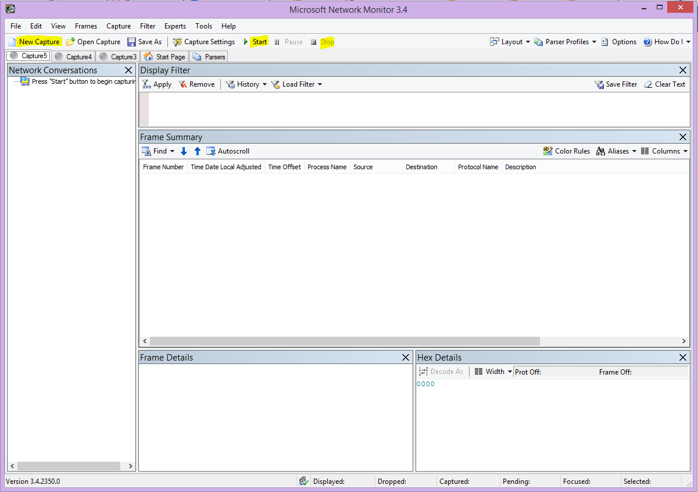
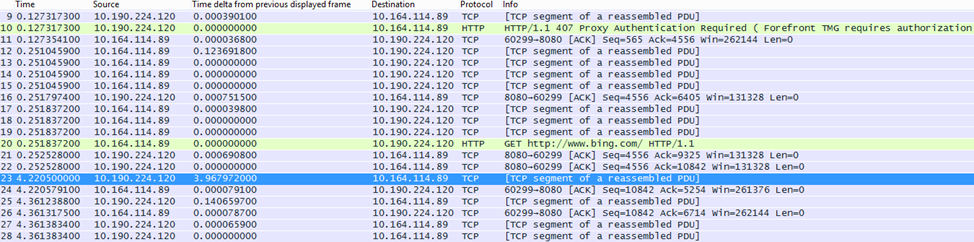

# Office 365 성능 문제 해결 계획Performance troubleshooting plan for Office 365

식별 하 고 시퀀스 번호 보다 낮은, 중단, 및 SharePoint Online, 비즈니스, Exchange Online 또는 비즈니스 온라인 용 Skype 비즈니스용 OneDrive 및 클라이언트 컴퓨터 간의 성능 저하를 수정 하기 위해 수행 하는 단계를 파악 해야 합니까? 지원을 호출 하기 전에이 문서의 Office 365 성능 문제를 해결 하 고도 일부 가장 일반적인 문제를 해결할 수 있습니다.Do you need to know the steps to take to identify and fix lags, hangs, and slow performance between SharePoint Online, OneDrive for Business, Exchange Online, or Skype for Business Online, and your client computer? Before you call support, this article can help you troubleshoot Office 365 performance issues and even fix some of the most common issues.
  
이 문서는 성능 문제에 대 한 중요 한 데이터를 캡처하는 것 처럼를 사용할 수 있는 샘플 작업 계획 실제로 수행 합니다. 일부 주요 문제는이 문서에도 포함 됩니다.This article is actually a sample action plan that you can use to capture valuable data about your performance issue as it's happening. Some top issues are also included in this article.
    
새로운 기능 네트워크 성능을 하 고 클라이언트 컴퓨터와 Office 365 간의 성능을 모니터링 하려면 장기적인 계획을 확인 하려는 경우 [Office 365 성능 조정 및 관리자 및 IT 전문가-문제해결](performance-tuning-using-baselines-and-history.md)에 대 한 정보를 수행 합니다.If you're new to network performance and want to make a long term plan to monitor performance between your client machines and Office 365, take a look at [Office 365 performance tuning and troubleshooting - Admin and IT Pro](performance-tuning-using-baselines-and-history.md).
  
## 샘플 성능 문제 해결 작업 계획Sample performance troubleshooting action plan

이 작업 계획 포함 두 부분으로 구성 합니다. 준비 단계 및 로깅 단계입니다. 지금 바로 성능 문제가 있는 경우 데이터 수집을 수행 해야 귀하가이 계획을 사용 하 여 시작할 수 있습니다.This action plan contains two parts; a preparation phase, and a logging phase. If you have a performance problem right now, and you need to do data collection, you can start using this plan right away.
  
 **클라이언트 컴퓨터를 준비 합니다.****Prepare the client computer**
  
- 성능 문제를 재현할 수 있는 클라이언트 컴퓨터를 소개 합니다. 이 컴퓨터의 문제를 해결 하는 동안 사용 됩니다.Find a client computer that can reproduce the performance problem. This computer will be used during the course of troubleshooting.
    
- 준비가 되 테스트할 때는 되므로 될 수행 되는 성능 문제를 발생 하는 단계를 기록 합니다.Write down the steps that cause the performance problem to happen so you're ready when it comes time to test.
    
- 수집 하 고 정보를 기록 하기 위한 도구를 설치 합니다.Install tools for gathering and recording information:
    
  - [Netmon 3.4](https://www.microsoft.com/en-us/download/details.aspx?id=4865) 설치 (또는 해당 하는 네트워크 추적 도구를 사용).Install [Netmon 3.4](https://www.microsoft.com/en-us/download/details.aspx?id=4865) (or use an equivalent network tracing tool). 
    
  - [HTTPWatch](https://www.httpwatch.com/download/) 의 무료 기본 버전을 설치 합니다 (또는 해당 하는 네트워크 추적 도구를 사용).Install the free Basic Edition of [HTTPWatch](https://www.httpwatch.com/download/) (or use an equivalent network Tracing tool). 
    
  - 화면 레코더를 사용 하 여 또는 Windows Vista 및 나중에 테스트 하는 동안 수행 하는 단계에 대 한 레코드를 유지 하기 위해 제공 되는 단계 레코더 (PSR.exe)를 실행 합니다.Use a screen recorder or run the Steps Recorder (PSR.exe) that comes with Windows Vista and later, in order to keep a record of the steps you take during testing.
    
 **로그 성능 문제****Log the performance issue**
  
- 불필요 한 모든 인터넷 브라우저를 닫습니다.Close all extraneous Internet browsers.
    
- 단계 레코더 또는 다른 화면 레코더를 시작 합니다.Start the Steps Recorder, or another screen recorder.
    
- 네트워크 모니터 캡처 (또는 네트워크 추적 도구)를 시작 합니다.Start your Netmon capture (or network tracing tool).
    
- Ipconfig /flushdns를 입력 하 여 명령줄에서 클라이언트 컴퓨터에서 DNS 캐시의 선택을 취소 합니다.Clear your DNS cache on the client computer from the command line by typing ipconfig /flushdns.
    
- 새 브라우저 세션을 시작 하 고 HTTPWatch 설정 합니다.Start a new browser session and turn on HTTPWatch.
    
- 선택 사항: 테스트 하는 경우 Exchange Online, Exchange 클라이언트 성능 분석 도구를 실행 Office 365 관리 콘솔에서 합니다.Optional: If you are testing Exchange Online, run the Exchange Client Performance Analyzer tool from the Office 365 admin console.
    
- 성능 문제가 발생 하는 정확한 단계를 재현 합니다.Reproduce the exact steps that cause the performance issue.
    
- 프로그램 Netmon 또는 다른 도구 추적을 중지 합니다.Stop your Netmon or other tool's trace.
    
- 명령줄에서 다음 명령을 입력 하 고 ENTER 키를 눌러 하 여 Office 365 구독 추적 경로 실행 합니다.At the command line, run a trace route to your Office 365 subscription by typing the following command and then pressing ENTER:
    
    `tracert \< *subscriptionname*  \>.onmicrosoft.com` 
    
- 단계 레코더를 중지 하 고 비디오를 저장 합니다. 날짜 및 시간 캡처 및 좋은 또는 잘못 된 성능을 보여주는 있는지 여부를 포함 해야 합니다.Stop the Steps Recorder and save the video. Be sure to include the date and time of the capture and whether it demonstrates good or bad performance.
    
- 추적 파일을 저장 합니다. 다시 캡처 및 좋은 또는 잘못 된 성능을 보여주는 여부의 시간과 날짜를 포함 해야 합니다.Save the trace files. Again, be sure to include the date and time of the capture and whether it demonstrates good or bad performance.
    
이 문서에서 언급 한 도구를 실행 하는 일을 숙지 모르는 경우 다음 이러한 단계가 제공 하므로 걱정 하지 마십시오. 이러한 유형의 네트워크 캡처를 수행 하에 익숙한 경우 [는 기준을 수집 하는 방법](performance-tuning-using-baselines-and-history.md#how-to-collect-baselines), 필터링 및 로그 읽기에 대해 설명 하는 건너뛸 수 있습니다.If you're not familiar with running the tools mentioned in this article, don't worry because we provide those steps next. If you're accustomed to doing this kind of network capturing, you can skip to [How to collect baselines](performance-tuning-using-baselines-and-history.md#how-to-collect-baselines), which describes filtering and reading the logs. 
  
## 처음에 DNS 캐시를 플러시하십시오.Flush the DNS Cache first

이유는 무엇입니까? DNS 캐시 플러시 하 여 새로 슬레이트 상태 테스트에서 시작 합니다. 캐시를 지우면 DNS 확인자 내용을 최신 항목을 다시 설정 중인 있습니다. 기억 플러시 호스트 파일 항목을 제거 하지 않습니다. 호스트 파일 항목을 광범위 하 게 사용 하는 경우 이러한 항목을 다른 디렉터리에 파일을 복사 해야 하며 다음 호스트 파일을 비웁니다.Why? By flushing out the DNS cache you're starting your tests with a clean slate. By clearing the cache, you're resetting the DNS resolver contents to the most up-to-date entries. Remember that a flush does not remove HOSTs file entries. If you use HOST file entries extensively, you should copy those entries out to a file in another directory and then empty the HOST file.
  
 **DNS 확인자 캐시를 플러시하십시오.****Flush your DNS resolver cache**
  
1. 명령 프롬프트를 엽니다 ( **시작** 이나 \> **실행** \> **cmd** 또는 **Windows 키** \> **cmd**).Open the command prompt, (either **Start** \> **Run** \> **cmd** or **Windows key** \> **cmd**).
    
2. 다음 명령을 입력 하 고 ENTER 키를 누릅니다.`ipconfig /flushdns`Type the following command and press ENTER: `ipconfig /flushdns`
    
## NetmonNetmon

Microsoft의 네트워크 모니터링 도구 ([Netmon](https://www.microsoft.com/download/details.aspx?id=4865))에 트래픽 네트워크에 있는 컴퓨터 간에 전달 되는 패킷을 분석 합니다. Office 365를 캡처할 수 있습니다, 보기를 사용 하 여 트래픽을 추적 하 고 패킷 헤더를 읽고, 중간에 다른 장치를 식별, 네트워크 하드웨어에 중요 한 설정을 확인 하려면 Netmon을 사용 하 여 삭제 된 패킷 찾아 회사에 있는 컴퓨터 간의 트래픽 흐름에 따라 네트워크 및 Office 365 합니다. 실제 본문의 트래픽 암호화 하기 때문에, 즉 해당 (SSL/TLS를 통해 포트 443에서 여행을 읽을 수 없습니다 전송 되 고 파일입니다. 대신, 필터링 되지 않은 추적 하는데 도움이 되는 패킷 수행 되는 문제 동작을 추적 하는 경로 얻을 수 있습니다.Microsoft's Network Monitoring tool ([Netmon](https://www.microsoft.com/download/details.aspx?id=4865)) analyzes packets, that is traffic, that passes between computers on networks. By using Netmon to trace traffic with Office 365 you can capture, view, and read packet headers, identify intervening devices, check important settings on network hardware, look for dropped packets, and follow the flow of traffic between computers on your corporate network and Office 365. Because the actual body of the traffic is encrypted, that is, it(travels on port 443 via SSL/TLS, you can't read the files being sent. Instead, you get an unfiltered trace of the path that the packet takes which can help you track down the problem behavior.
  
이 이번에는 필터를 적용 하지 않으면 확인 해야 합니다. 대신 하는 단계를 실행 하 고 추적을 중지 하 고 저장 하기 전에 문제를 보여줍니다.Be sure you don't apply a filter at this time. Instead, run through the steps and demonstrate the problem before stopping the trace and saving.
  
Netmon 3.4를 설치한 후 도구를 열고이 단계를 수행 합니다.After you install Netmon 3.4, open the tool and take these steps:
  
 **Netmon 추적을 수행 하 고 문제를 재현****Take a Netmon trace and reproduce the issue**
  
1. Netmon 3.4를 시작 합니다.Launch Netmon 3.4.
    
    **시작** 페이지에서 세개의 창 가지: **최근 캡처하**, **네트워크 선택**및 **Microsoft 네트워크 모니터 3.4를 시작 합니다. 공지**합니다. 네트워크 선택 패널을 캡처할 수 있는 기본 네트워크의 목록도 제공 합니다. 네트워크 카드 여기 선택 되었는지 확인 해야 합니다.There are three panes on the **Start** page: **Recent Captures**, **Select Networks**, and the **Getting Started with Microsoft Network Monitor 3.4. Notice**. The Select Networks panel will also give you a list of the default networks from which you can capture. Be sure that network cards are selected here.
    
2. **시작** 페이지의 위쪽에 **새 캡처** 를 클릭 합니다. 이렇게 하면 **캡처 1**이라는 **시작** 페이지 탭 옆에 있는 새 탭을 추가 합니다.Click **New Capture** at the top of the **Start** page. This adds a new tab beside the **Start** page tab called **Capture 1**.
    
    
  
3. 간단한 캡처에서 하려면 도구 모음에서 **시작** 을 클릭 합니다.To take a simple capture, click **Start** on the toolbar. 
    
4. 성능 문제를 제공 하는 단계를 재현 합니다.Reproduce the steps that present a performance issue.
    
5. **중지** 를 클릭 \> **파일** \> **로 저장**합니다. 날짜 및 시간을 표준 시간대를 지정 하 고 잘못 된 또는 우수한 성능을 보여주는 경우 검토 하 여 해야 합니다.Click **Stop** \> **File** \> **Save As**. Remember to give the date and time with the time zone and to mention if it demonstrates bad or good performance.
    
## HTTPWatchHTTPWatch

[HTTPWatch](https://www.httpwatch.com/download/) 에 비용 부과 대상 및 무료 버전입니다. 무료 기본 버전에서는이 테스트에 필요한 모든에 대해 설명 합니다. HTTPWatch 모니터 브라우저 창에서 바로 트래픽 및 페이지 로드 시간을 네트워크입니다. HTTPWatch는 그래픽으로 성능에 설명 하는 Internet Explorer에 플러그인입니다. 분석을 저장 하 고 HTTPWatch Studio에서 볼 수 있습니다.[HTTPWatch](https://www.httpwatch.com/download/) comes in charged, and a free edition. The free Basic Edition covers everything you need for this test. HTTPWatch monitors network traffic and page load time right from your browser window. HTTPWatch is a plug-in to Internet Explorer that graphically describes performance. The analysis can be saved and viewed in HTTPWatch Studio. 
  
> [!NOTE]
> Firefox, Google Chrome 등의 다른 브라우저를 사용 하는 경우 또는 Internet Explorer에서 HTTPWatch를 설치할 수 없는 경우 새 브라우저 창을 열고 키보드에서 F12 키를 누릅니다. 브라우저의 맨 아래에 개발자 도구 팝업 표시 되어야 합니다. Opera를 사용 하는 경우 웹 검사기에 대 한 CTRL + SHIFT + I를 눌러, 다음 **네트워크** 탭을 클릭 하 고 아래에 설명 된 테스트를 완료 합니다. 정보는 약간 다를 수는 있지만 로드 시간 (밀리초)에 계속 표시 됩니다. > SharePoint Online 페이지 로드 시간 관련 문제에 대 한 매우 HTTPWatch 유용합니다.If you use another browser, such as Firefox, Google Chrome, or if you can't install HTTPWatch in Internet Explorer, open a new browser window and press F12 on your keyboard. You should see the Developer Tool pop-up at the bottom of your browser. If you use Opera, press CTRL+SHIFT+I for Web Inspector, then click the **Network** tab and complete the testing outlined below. The information will be slightly different, but load times will still be displayed in milliseconds. > HTTPWatch is also very useful for issues with SharePoint Online page load times. 
  
 **HTTPWatch를 실행 하 고 문제를 재현****Run HTTPWatch and reproduce the issue**
  
1. HTTPWatch 브라우저 플러그인 이므로 브라우저에서 도구를 표시 하는 것은 각 버전의 Internet Explorer에 대 한 약간 다릅니다. 일반적으로 Internet Explorer 브라우저에서 HTTPWatch 명령 표시줄 아래에서 찾을 수 있습니다.HTTPWatch is a browser plug-in, so exposing the tool in the browser is slightly different for each version of Internet Explorer. Typically, you can find HTTPWatch under the Commands bar in the Internet Explorer browser.  브라우저 버전을 확인 클릭 도움말 플러그인 HTTPWatch 보이지 않으면 브라우저 창에서 \> 기어 기호 및 Internet Explorer에 대 한,에 대 한 또는 이후 버전의 Internet Explorer를 클릭 합니다. **명령** 모음을 시작 하려면 Internet Explorer의 메뉴 표시줄을 마우스 오른쪽 단추로 클릭 하 고 **명령 표시줄**을 클릭 합니다. 과거에는 HTTPWatch 연결 하는 명령 및 탐색기 막대를 한 번씩를 설치 하면 **도구**및 도구 모음 아이콘에 대 한 확인 (후에 다시 부팅) 아이콘을 즉시 표시 되지 않으면 합니다. 반드시 도구 모음을 사용자 지정할 수 있는 하 고 옵션을 추가할 수 있습니다.If you don't see the HTTPWatch plug-in in your browser window, check the version of your browser by click Help \> About, or, in later versions of Internet Explorer, click the gear symbol and About Internet Explorer. To launch the **Commands** bar, right-click the menu bar in Internet Explorer and click **Commands bar**. In the past, HTTPWatch has been associated with both the Commands and the Explorer bars, so once you install, if you don't immediately see the icon (even after reboot) check **Tools**, and your toolbars for the icon. Remember that toolbars can be customized and options can be added to them. 
    
  
2. Internet Explorer 브라우저 창에서 HTTPWatch를 시작 합니다. 해당 창 맨아래에 있는 브라우저에 도킹 된 표시 됩니다. **레코드**를 클릭 합니다.Launch HTTPWatch in an Internet Explorer browser window. It will appear docked to the browser at the bottom of that window. Click **Record**.
    
3. 정확한 단계와 관련 된 성능 문제를 재현 합니다. HTTPWatch에서 **중지** 단추를 클릭 합니다.Reproduce the exact steps involved in the performance issue. Click the **Stop** button in HTTPWatch. 
    
4. HTTPWatch 또는 **전자 메일을 보낼** **저장** 합니다. 날짜 및 시간 정보 및 사용자 조사 좋은 또는 잘못 된 성능의 데모를 포함 하는 여부를 나타내는 값을 포함 되도록 파일 이름을 지정 해야 합니다.**Save** the HTTPWatch or **Send by Email**. Remember to name the file so that it includes date and time information and an indication of whether your Watch contains a demonstration of good or bad performance.  
    이 스크린샷은 HTTPWatch의 전문 버전에서 시작 됩니다. 전문 버전을 사용 하는 컴퓨터에서 기본 버전에서 추적을 열고 읽을 수 수 있습니다. 추가 정보는 해당 메서드를 통해 추적에서 사용할 수 있습니다.This screen shot is from the Professional version of HTTPWatch. You can open traces taken in the Basic Version on a computer with a Professional version and read it there. Extra information may be available from the trace through that method.
    
## 문제 단계 레코더Problem Steps Recorder

단계 레코더 또는 PSR.exe, 발생 하는 대로 문제를 기록할 수 있습니다. 매우 유용한 도구를 실행 하려면 매우 간단 하 고 있습니다.Steps Recorder, or PSR.exe, allows you to record issues as they are occurring. It's a very useful tool and very simple to run.
  
 **문제 단계 레코더를 진행 중인 작업 기록 (PSR.exe)를 실행 합니다.****Run Problem Steps Recorder (PSR.exe) to record your work**
  
1. **시작** 을 사용 하거나 \> **실행** \> **PSR.exe** 입력 \> **확인**을 **Windows 키** 를 클릭 하거나 \> **PSR.exe** 입력 \> 하 고 enter 키를 누른 다음 합니다.Either use **Start** \> **Run** \> type **PSR.exe** \> **OK**, or, click the **Windows Key** \> type **PSR.exe** \> and then press ENTER. 
    
2. 작은 PSR.exe 창에 표시 되 면 **시작 레코드** 를 클릭 하 고 성능 문제를 재현 하는 단계를 재현 합니다. **추가 메모**를 클릭 하 여 필요에 따라 메모를 추가할 수 있습니다.When the small PSR.exe window appears, click **Start Record** and reproduce the steps that reproduce the performance issue. You can add comments as needed, by clicking **Add Comments**.
    
3. 단계를 완료 한 경우에 **레코드를 중지** 를 클릭 합니다. 성능 문제는 페이지 렌더링을 하는 경우 페이지를 녹음/녹화를 중지 하기 전에 렌더링 될 때까지 기다립니다.Click **Stop Record** when you have completed the steps. If the performance issue is a page render, wait for the page to render before you stop the recording. 
    
4. **저장**을 클릭합니다.Click **Save**.
    

  
날짜 및 시간 하기 위해 기록 됩니다. 시간 내에 프로그램 PSR Netmon 추적 및 HTTPWatch에 연결 하 고 정밀도 문제를 해결 하는데 도움이 됩니다. 날짜 및 시간 PSR 레코드에 전달 되는 분을 표시할 수는 로그인과 같은 URL 및 관리 사이트의 부분 렌더링 탐색 사이입니다.The date and time is recorded for you. This links your PSR to your Netmon trace and HTTPWatch in time, and helps with precision troubleshooting. The date and time in the PSR record can show that a minute passed between the login and browsing of the URL and the partial render of the admin site, for example.
  
## 사용자 추적 읽기Read your traces

모든 네트워크 및 성능 문제를 해결 하는 방법에 대 한 다른 사용자를 소개 하는 문서를 통해 알고 있어야 하는 설명 하기는 것이 불가능 합니다. 성능 좋은 시작 경험과 네트워크 작동 하 고 일반적으로 수행 하는 방법에 대 한 지식 걸립니다. 하지만 중요 문제 목록은 올림할 어떻게 도구 더 쉽게는 가장 일반적인 문제를 해결할 수를 표시 하는 것과 같습니다.It isn't possible to teach everything about network and performance troubleshooting that someone would need to know via an article. Getting good at performance takes experience, and knowledge of how your network works and usually performs. But it is possible to round up a list of top issues and show how tools can make it easier for you to eliminate the most common problems.
  
Office 365 사이트에 대 한 네트워크 추적을 읽는 기술 선택 하려는 경우 페이지 로드의 추적을 정기적으로 만들기 및 해당 읽기 경험을 사용할 수 있는 보다 더 나은 없는 교사 방법이 있습니다. 예, 되려고를 사용 하는 Office 365 서비스를 로드 하 고 프로세스를 추적 합니다. DNS 트래픽에 대 한 추적을 필터링 하거나 찾은 서비스의 이름에 대 한 FrameData를 검색 합니다. 가져올 서비스를 로드 하는 경우에 발생 하는 단계의 추적을 검색 합니다. 이 어떤 normal 배울 수 있도록 도와줍니다 페이지 부하 같습니다 고, 성능, 특히 중심으로 문제를 해결 하는 경우에 잘못 된 좋은 추적 비교 (영문) 수 알려줄 수 많은 합니다.If you want to pick up skills reading network traces for your Office 365 sites, there is no better teacher than creating traces of page loads regularly and gaining experience reading them. For example, when you have a chance, load an Office 365 service and trace the process. Filter the trace for DNS traffic, or search the FrameData for the name of the service you browsed. Scan the trace to get an idea of the steps that occur when the service loads. This will help you learn what normal page load should look like, and in the case of troubleshooting, particularly around performance, comparing good to bad traces can teach you a lot.
  
Netmon 표시 필터 필드에 Microsoft Intellisense를 사용합니다. Intellisense, 또는 지능형 코드 완성 기능을 해당 전체를 일정 기간 동안에 입력 하 고 드롭다운 선택 상자에서 사용할 수 있는 옵션을 모두 표시 됩니다. 예 인 경우 TCP 창 크기 조정 하는 방법에 대 한 걱정 하는 경우에 필터를 잘을 찾을 수 있습니다 (예: `.protocol.tcp.window < 100`)이이 방법으로 합니다.Netmon uses Microsoft Intellisense in the Display filter field. Intellisense, or intelligent code completion, is that trick where you type in a period and all available options are displayed in a drop-down selection box. If, for example, you are worried about TCP window scaling, you can find your way to a filter (such as  `.protocol.tcp.window < 100`) by this means.
  

  
Netmon 추적에 있는 많은 양의 트래픽을 가질 수 있습니다. 읽기와 숙련 된 하지 않은 경우 될 무력화 추적을 처음으로 열 수 있습니다. 가장 먼저 할 일은 추적에서 잡음이에서 신호를 구분 합니다. Office 365에 대해 테스트 하 고 보려는 트래픽입니다. 추적을 통해 탐색을 사용 하는 경우에이 목록이 필요 하지 않을 수 있습니다.Netmon traces can have a lot of traffic in them. If you aren't experienced with reading them, it's likely you will be overwhelmed opening the trace the first time. The first thing to do is separate the signal from the background noise in the trace. You tested against Office 365, and that's the traffic you want to see. If you are used to navigating through traces, you may not need this list.
  
클라이언트와 Office 365 간의 트래픽을 암호화 하 고 일반 Netmon 추적에서 읽을 수 없습니다는 트래픽의 본문 된다는 것을 의미 하는 TLS를 통해 전달 됩니다. 성능 분석 패킷에서 정보의 세부 사항을 알 필요가 없습니다. 그러나 것이 매우 패킷 헤더와 여기에 포함 된 정보에 관심이 합니다.Traffic between your client and Office 365 travels via TLS, which means that the body of the traffic will be encrypted and not readable in a generic Netmon trace. Your performance analysis doesn't need to know the specifics of the information in the packet. It is, however, very interested in packet headers and the information that they contain.
  
 **좋은 추적 하기 위한 팁****Tips to get a good trace**
  
- 클라이언트 컴퓨터의 IPv4 또는 IPv6 주소 값을 알고 있어야 합니다. **IPConfig** 를 입력 하 고 ENTER 키를 눌러 명령 프롬프트에서 얻을 수 있습니다. 이 주소를 알고 있으면 추적에 트래픽을 클라이언트 컴퓨터를 직접 수행 하는지 여부를 한눈에 알 수 있습니다. 알려진된 프록시 있으면 ping을 사용 하 고 해당 IP 주소를 가져올 합니다.Know the value of the IPv4 or IPv6 address of your client computer. You can get this from the command prompt by typing **IPConfig** and then pressing ENTER. Knowing this address will let you tell at a glance whether the traffic in the trace directly involves your client computer. If there is a known proxy, ping it and get its IP address as well. 
    
- DNS 확인자 캐시를 플러시합니다. 하 고 가능한 경우에 테스트를 실행 하는 것을 제외 하 고 모든 브라우저를 닫습니다. 이 작업을 수행할 수 없는 경우 예를 지원 일부 브라우저 기반 도구를 사용 하 여 클라이언트 컴퓨터의 데스크톱을 참조 하는 경우 준비가 되어 대화 추적을 필터링 합니다.Flush your DNS resolver cache and, if possible, close all browsers except the one in which you are running your tests. If you are not able to do this, for instance, if support is using some browser-based tool to see your client computer's desktop, be prepared to filter your trace.
    
- 다른 용무 중 추적을 사용 하는 Office 365 서비스를 찾습니다. Never 또는 거의 살펴본 하기 전에 트래픽, 하는 경우 다른 네트워크 노이즈에서 성능 문제를 분리 하에 유용한 단계입니다. 이 작업을 수행 하는 몇가지 방법이 있습니다. 직접 테스트를 하기 전에 사용할 수 있습니다 ping 또는 특정 서비스의 URL에 PsPing ( `ping outlook.office365.com` 및/또는 `psping -4 microsoft-my.sharepoint.com:443`, 예제를 보려면). 또한 쉽게 찾을 수 있습니다 (프로세스 이름) 사용 하 여 Netmon 추적에는 PsPing 합니다. 검색을 시작 하려면 전체를 제공 합니다.In a busy trace, locate the Office 365 service that you're using. If you've never or seldom seen your traffic before, this is a helpful step in separating the performance issue from other network noise. There are a few ways to do this. Directly before your test, you can use ping or, PsPing, to the URL of the specific service ( `ping outlook.office365.com` and/or  `psping -4 microsoft-my.sharepoint.com:443`, for examples) . You can also easily find that PsPing in a Netmon trace (by its process name). That will give you a place to start looking.
    
    Netmon 추적을 사용 하는 문제의 시간에만 하는 경우 하는 방법을 배우게 너무 합니다. 방향을 설정 하려면 같은 필터를 사용 하 여 `ContainsBin(FrameData, ASCII, "office")` 또는 `ContainsBin(FrameData, ASCII, "outlook")`합니다. 추적 파일에서 사용자 프레임의 번호를 기록할 수 있습니다. 대화 ID 열에 대 한 찾아보고 프레임 요약 창 오른쪽으로 스크롤할 원하는 메시지가 표시 될 수 있습니다. 또한 기록 하 고 격리 나중에 살펴봅니다 수 있는 특정이 대화의 ID에 대 한 다음과 같은 지정 된 수입니다. 다른 필터링을 적용 하기 전에이 필터를 제거 해야 합니다.If you're only using Netmon tracing at the time of the problem, that's okay too. To orient yourself, use a filter like  `ContainsBin(FrameData, ASCII, "office")` or  `ContainsBin(FrameData, ASCII, "outlook")`. You can record your frame number from the trace file. You may also want to scroll the Frame Summary pane all the way to the right and look for the Conversation ID column. There is a number indicated there for the ID of this specific conversation that you can also record and look at in isolation later. Remember to remove this filter before applying any other filtering.
    
> [!TIP]
> Netmon에 유용한 기본 제공 필터를 많이 있습니다. **표시** 필터 창 맨 위에서 "부하 필터" 단추를 시도 합니다.Netmon has a lot of helpful built-in filters. Try the "Load Filter" button at the top of the **Display** filter pane. 
  

  

  
사용자 트래픽의 숙지 하 고 필요한 정보를 찾을 수 하는 방법을 알아봅니다. 추적에는 패킷에 (예: "Outlook")는 사용 하는 Office 365 서비스에 대 한 첫번째 참조를 확인 하려면 예에 대해 알아봅니다.Get familiar with your traffic, and learn to locate the information you need. For example, learn to determine which packet in the trace has the first reference to the Office 365 service you're using (like "Outlook").
    
Office 365 Outlook 온라인을 작성 한 예로, 트래픽이 시작 다음과 같이 합니다.Taking Office 365 Outlook Online as an example, the traffic begins something like this:
  
- DNS 표준 쿼리 및 QueryIDs 일치 하는 outlook.office365.com에 대 한 DNS 응답 합니다. 참고 이름 확인에 대 한 요청을 보내는이 순환, 뿐 where 세계에서 Office 365 전역 DNS에 대 한 시간 오프셋을 고려해 야 합니다. 원칙적으로, 전세계 절반 방향 아닌 가능한 경우 로컬로 합니다. (일부가 팔 로우 할 수 있습니다이 DNS 트래픽을 온라인 로그인 합니다.)DNS Standard Query and DNS Response for outlook.office365.com with matching QueryIDs. It's important to note the Time Offset for this turn-around, as well as where in the world the Office 365 Global DNS sends the request for name resolution. Ideally, as locally as possible, rather than half-way across the world. (This may be followed by some DNS traffic the online login.)
    
- HTTP 가져오기 요청을 영구적으로 이동 (301)의 상태를 보고A HTTP GET Request whose status report Moved Permanently (301)
    
- 요청 하 고 회신을 연결 하는 RWS 트래픽 RWS 연결을 포함 합니다. (수에 대 한 연결 만들기를 참조 하는 원격 Winsock입니다.)RWS Traffic including RWS Connect requests and Connect replies. (This is Remote Winsock making a connection for you.)
    
- TCP SYN 및 TCP SYN/응답 대화 합니다. 이 대화의 설정 사용 하면 많은 사용자 성능에 영향을 합니다.A TCP SYN and TCP SYN/ACK conversation. A lot of the settings in this conversation impact your performance.
    
- 다음 TLS 핸드셰이크 및 TLS 인증서 대화 일어나는 TLS:TLS 트래픽의 시리즈입니다. (SSL/TLS를 통해 데이터를 암호화 해야 합니다.)Then a series of TLS:TLS traffic which is where the TLS handshake and TLS certificate conversations take place. (Remember the data is encrypted via SSL/TLS.)
    
트래픽의 모든 부분 중요 하 고, 연결 된 하지만 있으므로 이러한 영역에 초점을 맞출 수는 추적 코드의 일부 성능 문제를 해결 하는 것 이라는 측면에서 특히 중요 한 정보를 포함 합니다. 또한 일반적인 문제의 상위 10 개 목록을 컴파일할 수는 Microsoft에서 문제를 해결 하는 충분 한 Office 365 성능을 수행한 이후 설명 하겠습니다 다음 아웃 해당 루트에 있다고 도구를 사용 하는 방법과 이러한 문제에 있습니다.All parts of the traffic are important and connected, but small portions of the trace contain information particularly important in terms of performance troubleshooting, so we'll focus on those areas. Also, since we've done enough Office 365 performance troubleshooting at Microsoft to compile a Top Ten list of common problems, we'll focus on those issues and how to use the tools we have to root them out next.
  
설치한 하지 않은 경우 모든 준비 아래 행렬을 사용 하면 다양 한 도구를 사용 합니다. 가능한 경우. 설치 지점에 대 한 링크가 제공 됩니다. 목록에 포함 된 [Netmon](https://www.microsoft.com/en-us/download/details.aspx?id=4865) 및 [Wireshark](https://www.wireshark.org/)같은 일반적인 네트워크 추적 도구 하지만와 및 네트워크 트래픽 필터링에 익숙한 하는 능숙 하 게 하는 모든 추적 도구를 사용 합니다. 을 테스트 하는 경우에 유의 하십시오.If you haven't installed them all ready, the matrix below makes use of several tools. Where possible. Links are provided to the installation points. The list includes common network tracing tools like [Netmon](https://www.microsoft.com/en-us/download/details.aspx?id=4865) and [Wireshark](https://www.wireshark.org/), but use any tracing tool you are comfortable with, and in which you're accustomed to filtering network traffic. When you're testing, remember:
  
-  *브라우저를 닫고 테스트를 실행 하는 하나의 브라우저 함께* -이렇게 하면 캡처하는 전반적인 트래픽을 줄일 수 있습니다. 덜 혼잡 추적에 대 한 쉽습니다.*Close your browsers, and test with only one browser running*  - This will reduce the overall traffic you capture. It makes for a less busy trace. 
    
-  *클라이언트 컴퓨터에서 DNS 확인자 캐시 플러시* -이렇게 하면 새로 슬레이트 끔 해지고 추적에 대 한 사용자 캡처를 시작 합니다.*Flush your DNS resolver cache on the client computer*  - This will give you a clean slate when you start to take your capture, for a cleaner trace. 
    
## 일부 주요 문제Some Top Issues

발생할 수 몇가지 일반적인 문제 및 네트워크 추적에서 확인할 하는 방법입니다.Some common issues you may face and how to find them in your Network trace.

### TCP Windows 배율TCP Windows Scaling

SYN-에서 찾을 수 SYN/승인 레거시 또는 보관 하드웨어 수 활용 하지 TCP windows 확장 합니다.  적절 한 TCP windows 설정을 확장, 없이 TCP 헤더의 기본 16 비트 버퍼 시간 (밀리초)을 채웁니다.  트래픽은 클라이언트를으로 인해 지연이 발생할 원래 데이터 수신 된 승인의 받을 때까지 보낼 계속할 수 없습니다.Found in the SYN - SYN/ACK. Legacy or aging hardware may not take advantage of TCP windows scaling.  Without proper TCP windows scaling settings, the default 16-bit buffer in TCP headers fills in milliseconds.  Traffic cannot continue to send until the client receives an acknowledgment that the original data has been received, causing delays.

#### 도구:Tools:

- NetmonNetmon
- WiresharkWireshark 

#### 원하는 항목에 대 한:What you're looking for:

네트워크 추적에 트래픽을 SYN-SYN/응답에 대 한 찾습니다.  Netmon을에서 같은 필터를 사용 하 여 `tcp.flags.syn == 1`합니다. 이 필터는 Wireshark에서 동일 합니다.Look for the SYN - SYN/ACK traffic in your network trace.  In Netmon, use a filter like  `tcp.flags.syn == 1`. This filter is the same in Wireshark.  

         
모든 SYN에 대 한 관련된 의무 (SYN/응답)의 대상 포트 (포트 대상 포트)에 일치 하는 원본 (원본) 포트 번호를 것을 볼 수 있습니다.Notice that for every SYN there is a source port (SrcPort) number that is matched in the destination port (DstPort) of the related Acknowledgment (SYN/ACK). 

네트워크 연결에서 사용 되는 Windows 배율 값을 보려면 먼저 SYN을 확장 한 다음 확장 관련된 SYN/승인To see the Windows Scaling value that is used by your network connection, expand first the SYN, and then the related SYN/ACK.  

  

### TCP 유휴 시간 설정TCP Idle Time Settings

과거에 대부분의 경계 네트워크는 유휴 연결을 해지 일반적으로 의미 하는 일시적인 연결에 대해 구성 됩니다. 프록시 및 방화벽 100을 300 초 보다 큰에 의해 유휴 TCP 세션을 종료할 수 있습니다. 이 문제가 발생할 Outlook 온라인에 대 한 만들고 장기 연결을 사용 하는 또는 하지 유휴 여부입니다.Historically, most perimeter networks are configured for transient connections, meaning idle connections are generally terminated. Idle TCP sessions can be terminated by proxies and firewalls at greater than 100 to 300 seconds. This is problematic for Outlook Online because it creates and uses long-term connections, whether they are idle or not.  

프록시에 의해 연결이 종료 됩니다 또는 방화벽 장치, 클라이언트, 정보를 제공 하지 않습니다. 시점과 Outlook 온라인 사용 하려고 하는 클라이언트 컴퓨터는 의미 하려고 합니다, 반복적으로, 새 하기 전에 연결 재개 합니다. 페이지를 로드 하에서 끊습니다 제품 프롬프트나 성능이 저하에 표시 될 수 있습니다.When connections are terminated by proxy or firewall devices, the client is not informed, and an attempt to use Outlook Online will mean a client computer will try, repeatedly, to revive the connection before making a new one. You may see hangs in the product, prompts, or slow performance on page load.

#### 도구:Tools:

- NetmonNetmon
- WiresharkWireshark

#### 찾을 대상을 지정 합니다.What to look for:

Netmon을에 대 한 왕복에 대 한 시간 오프셋 필드를 살펴봅니다. 왕복에는 서버에 요청을 전송 하 고 다시 응답을 수신 하는 클라이언트 간의 시간입니다. 클라이언트와 탈출 포인트 사이의 확인 (예: 클라이언트-\> 프록시), 또는 Office 365에 클라이언트 (클라이언트-\> Office 365). 다양 한 유형의 패킷에서이 볼 수 있습니다.In Netmon, look at the Time Offset field for a round-trip. A round-trip is the time between client sending a request to the server and receiving a response back. Check between the Client and the egress point (ex. Client --\> Proxy), or the Client to Office 365 (Client --\> Office 365). You can see this in many types of packets. 

한 예로 Netmon의 필터 다음과 같을 수 있습니다 `.Protocol.IPv4.Address == 10.102.14.112 AND .Protocol.IPv4.Address == 10.201.114.12`, 또는 Wireshark, `ip.addr == 10.102.14.112 &amp;&amp; ip.addr == 10.201.114.12`합니다.As an example, the filter in Netmon may look like  `.Protocol.IPv4.Address == 10.102.14.112 AND .Protocol.IPv4.Address == 10.201.114.12`, or, in Wireshark,  `ip.addr == 10.102.14.112 &amp;&amp; ip.addr == 10.201.114.12`.  

> [!TIP]
> 사용자 추적에 IP 주소 DNS 서버에 속하는 경우 모르는? 명령줄에서 조회를 시도 합니다. **시작** 을 클릭 \> **실행** \> 하 고 **cmd**를 입력 하거나 **Windows 키** 를 눌러 \> 하 고 **cmd**를 입력 합니다. 프롬프트에서 다음을 입력 `nslookup <the IP address from the network trace>`합니다. 테스트를 자신의 컴퓨터의 IP 주소에 대해 nslookup을 사용 합니다. > Microsoft의 IP 범위 목록을 보려면를 [Office 365 Url 및 IP 주소 범위를](https://technet.microsoft.com/en-us/library/hh373144.aspx)참조 하십시오.Don't know if the IP address in your trace belongs to your DNS server? Try looking it up at the command line. Click **Start** \> **Run** \> and type **cmd**, or press **Windows Key** \> and type **cmd**. At the prompt, type  `nslookup <the IP address from the network trace>`. To test, use nslookup against your own computer's IP address. > To see a list of Microsoft's IP ranges, see [Office 365 URLs and IP address ranges](https://technet.microsoft.com/en-us/library/hh373144.aspx). 

문제가 발생 하는 경우 예상 되는 긴 시간이 오프셋 하는 (Outlook 온라인),이 경우에 표시할 응용 프로그램 데이터의 흐름이 표시 하는 TLS:TLS 패킷을에 특히 (등 Netmon에서 찾을 수 있습니다를 통해 응용 프로그램 데이터 패킷을 `.Protocol.TLS AND Description == "TLS:TLS Rec Layer-1 SSL Application Data"`). 세션 간에 시간에 원활 하 게 진행이 표시 됩니다. Outlook 온라인을 새로 고칠 때 긴 지연 표시 되 면이 때문일 수는 높은 수준의 전송 되 고 다시 설정 합니다.If there is a problem, expect long Time Offsets to appear, in this case (Outlook Online), particularly in TLS:TLS packets that show the passage of Application Data (for example, in Netmon you can find application data packets via  `.Protocol.TLS AND Description == "TLS:TLS Rec Layer-1 SSL Application Data"`). You should see a smooth progression in the time across the session. If you see long delays when refreshing your Outlook Online, this could be caused by a high degree of resets being sent. 

### 대기 시간/라운드 여행 시간Latency/Round Trip Time 

대기 시간이 훨씬 많은 변수, 이러한 업그레이드 보관 장치, 네트워크 및 네트워크 연결에 있는 다른 작업을 차지 하는 전체 대역폭의 백분율을 많은 수의 사용자 추가 (영문)에 따라 변경 될 수 있는 측정값입니다.Latency is a measure that can change a lot depending on many variables, such upgrading aging devices, adding a large number of users to a network, and the percentage of overall bandwidth consumed by other tasks on a network connection. 

이 [네트워크 계획 및 Office 365에 대 한 성능 조정](network-planning-and-performance.md) 페이지에서 사용할 수 있는 Office 365에 대 한 대역폭 계산기 있습니다.There are bandwidth calculators for Office 365 available from this [Network planning and performance tuning for Office 365](network-planning-and-performance.md) page.  

사용자의 연결 또는 ISP에 대 한 연결의 대역폭의 속도를 측정 해야 합니까? 이 사이트 (또는 것과 같은 사이트)을 시도: [Speedtest 공식 사이트](https://www.speedtest.net/)및 [Pingtest](http://www.pingtest.net/)합니다.Need to measure the speed of your connection, or your ISP connection's bandwidth? Try this site (or sites like it): [Speedtest Official Site](https://www.speedtest.net/), and [Pingtest](http://www.pingtest.net/).

#### 도구:Tools:

- PingPing
- PsPingPsPing
- NetmonNetmon
- WiresharkWireshark

#### 찾을 대상을 지정 합니다.What to look for:

를 추적의 대기 시간을 추적 하려면 Office 365의 클라이언트 컴퓨터 IP 주소와 DNS 서버의 IP 주소 기록 필요에서 도움이 됩니다. 쉽게 추적 필터링 하기 위해입니다. 프록시를 통해 연결 하는 경우에 사용자 클라이언트 컴퓨터의 IP 주소, 프록시/탈출 IP 주소 및 Office 365 DNS IP 주소는 작업을 쉽게 수행할 수 있도록 해야 합니다.To track latency in a trace, you will benefit from having recorded the client computer IP address and the IP address of the DNS server in Office 365. This is for the purpose of easier trace filtering. If you connect through a proxy, you will need your client computer IP address, the proxy/egress IP address, and the Office 365 DNS IP address, to make the work easier.  

Outlook.office365.com 전송 된 ping 요청 \rtc 요청을 수신 하는 데이터 센터의 이름을 상표 연속 된 ICMP 패킷을 보낼 연결할 못할 *수 있습니다* ping 하는 경우에 있습니다. PsPing (다운로드에 대 한 무료 도구) 및 특정 포트 (443)를 사용 하 고 아마도 i p v 4를 사용 하 여 (-4)를 받게 됩니다는 평균 round 왕복 시간 패킷을 전송에 대 한 키를 누릅니다. 이 기능은 작동이 Office 365 서비스에서 다른 Url에 대 한과 같은 `psping -4 yourSite.sharepoint.com:443`합니다. Ping 테스트를 다음과 같이 평균, 시도 대 한 보다 큰 샘플을 가져올 수를 지정할 수는 실제로: `psping -4 -n 20 yourSite-my.sharepoint.com:443`합니다.A ping request sent to outlook.office365.com will tell you the name of the datacenter receiving the request, even if ping  *may*  not be able to connect to send the trademark consecutive ICMP packets. If you use PsPing (a free tool for download), and specific the port (443) and perhaps to use IPv4 (-4) you will get an average round-trip-time for packets sent. This will work this for other URLs in the Office 365 services, like  `psping -4 yourSite.sharepoint.com:443`. In fact, you can specify a number of pings to get a larger sample for your average, try something like:  `psping -4 -n 20 yourSite-my.sharepoint.com:443`.  

> [!NOTE]
> PsPing은 ICMP 패킷을 보낼 하지 않습니다. 해당 ping TCP 패킷을 사용한 특정 포트를 통해 열어야 알면 하나를 사용할 수 있도록 합니다. SSL/TLS를 사용 하는 Office 365 포트 연결을 시도: 프로그램 PsPing에는 443입니다.PsPing doesn't send ICMP packets. It pings with TCP packets over a specific port, so you can use any one you know to be open. In Office 365, which uses SSL/TLS, try attaching port :443 to your PsPing.

        

네트워크 추적을 수행 하는 동안 저속 성능의 Office 365 페이지를 로드 하는 경우에 대 한 Netmon 또는 Wireshark 추적을 필터링 해야 `DNS`합니다. 이 Ip 중 하나입니다.If you loaded the slow performing Office 365 page while doing a network trace, you should filter a Netmon or Wireshark trace for  `DNS`. This is one of the IPs we're looking for.  

IP 주소를 가져올 (및 DNS 대기 시간을 확인)를 사용자 Netmon을 필터링 하기 위해 수행 하는 단계는 다음과 같습니다. 이 예제에서는 outlook.office365.com를 사용 하 여 있지만 SharePoint Online 테 넌 트 (예: hithere.sharepoint.com)의 URL을 사용할 수도 있습니다.Here are the steps to take to filter your Netmon to get the IP address (and take a look at DNS Latency). This example uses outlook.office365.com, but may also use the URL of a SharePoint Online tenant (hithere.sharepoint.com for example).  

1. Ping을 사용 하는 URL `ping outlook.office365.com` 및 결과에서 이름 및 ping 요청이 전송 된 DNS 서버의 IP 주소를 기록 합니다.Ping the URL `ping outlook.office365.com` and, in the results, record the name and IP address of the DNS server the ping request was sent to. 
2. 네트워크 해당 페이지를 열고 추적 또는 성능 문제를 제공 하는 작업을 수행 하 또는, 네트워크 추적 것 자체를 ping에 높은 대기 시간을 표시 합니다.Network trace opening the page, or doing the action that gives you the performance problem, or, if you see a high latency on the ping, itself, network trace it. 
3. DNS를 위한 Netmon 및 필터에서 추적을 엽니다 (이 필터는 또한 Wireshark를에서 작동 하는 하지만 사례에 대/소문자를 구분 `-- dns`). 다음과 같이 더 많은 문제에 Netmon 필터링 하 고도 수 ping에서 DNS 서버의 이름을 알고 있는 이후: `DNS AND ContainsBin(FrameData, ASCII, "namnorthwest")` , 다음과 같은 Wireshark dns에서 및 프레임 "namnorthwest"를 포함 합니다.Open the trace in Netmon and filter for DNS (this filter also works in Wireshark, but is sensitive to case `-- dns`). Since you know the name of the DNS server from your ping you may also filter more speedily in Netmon like this: `DNS AND ContainsBin(FrameData, ASCII, "namnorthwest")` , which looks like this in Wireshark dns and frame contains "namnorthwest". 응답 패킷 열고 Netmon의 프레임 세부 정보 창에서 자세한 정보를 확장 하는 DNS를 클릭 합니다. Office 365-에서 요청을 제공 하기 위해 DNS 서버의 IP 주소를 찾을 수 DNS 정보에서 다음 단계 (PsPing 도구)에 대 한이 IP 주소를 필요 합니다. 필터를 제거, Netmon의 프레임 요약에 대 한 DNS 응답을 마우스 오른쪽 단추로 클릭 \> 대화 찾기 \> DNS는 DNS 쿼리 및 응답--나란히 볼 수 있습니다.Open the response packet and, in Frame Details window of Netmon, click DNS to expand for more information. In the DNS information you'll find the IP address of the DNS server the request went to in Office 365 -- you'll need this IP address for the next step (the PsPing tool). Remove the filter, right-click on the DNS Response in Netmon's Frame Summary \> Find Conversations \> DNS to see the DNS Query and Response side-by-side. 
4. Netmon에서 DNS 요청 및 응답 사이의 시간 오프셋 열을 note도 있습니다. 다음 단계에서는, 간단한 설치 및 사용 [PsPing](https://technet.microsoft.com/en-us/sysinternals/jj729731.aspx) 도구에는 매우 간편 하 게 방화벽에서 ICMP이 차단 종종와 PsPing 세련 되 대기 시간 (밀리초) 추적 합니다. PsPing에 주소와 포트 (사용해의 사례 열린 포트 443의)에 대 한 TCP 연결을 완료합니다.In Netmon, also note the Time Offset  column between the DNS Request and Response. In the next step, the easy-to-install and use [PsPing](https://technet.microsoft.com/en-us/sysinternals/jj729731.aspx) tool comes in very handy, both because ICMP is often blocked on Firewalls, and because PsPing elegantly tracks latency in milliseconds. PsPing completes a TCP connection to an address and port (in our case open port 443). 
5. PsPing를 설치 합니다.Install PsPing. 
6. 명령 프롬프트를 엽니다 (시작 \> 실행 \> cmd 또는 Windows 키를 입력 \> 에 cmd를 입력) 디렉터리 PsPing 명령을 실행 하는 PsPing 설치한 디렉터리를 변경 합니다. 내 예제에서 볼 수 있습니다 C.의 루트에 있는 'Perf' 폴더를 만든 I 빠른 실행에 대해 동일 하 게 수행할 수 있습니다.Open a command prompt (Start \> Run \> type cmd, or Windows Key \> type cmd) and change directory to the directory where you installed PsPing to run the PsPing command. In my examples you can see I made a 'Perf' folder on the root of C. You can do the same for quick access. 
7. Netmon 추적에 이전 버전에서 Office 365 DNS 서버의 IP 주소에 대해 사용자 PsPing 대신 걸 수 있도록 명령은 입력--포트 번호를 추가 해야 합니다.Type the command so that you're making your PsPing against the IP address of the Office 365 DNS server from your earlier Netmon trace -- remember to add the port number.  즉, `psping -n 20 132.245.24.82:445`합니다. 이의 20 ping 샘플링을 제공 되며, PsPing를 중지 하는 경우 대기 시간을 평균.In other words, `psping -n 20 132.245.24.82:445`. This will give you a sampling of 20 pings and average the latency when PsPing stops. 

Office 365에서 프록시 서버를 통해 야 하는 경우이 단계는 약간 달라 집니다. 프록시/탈출 및 뒤로, 시간 (밀리초)의 평균 대기 시간 값을 가져올 프록시 서버에 처음 PsPing 것 하 고 또는 (한 Office 365 및 뒤로) 누락 된 값을 가져오려면 인터넷에 직접 연결 된 컴퓨터는 프록시에 PsPing 실행 중 하나는 다음 키를 누릅니다.If you're going to Office 365 through a proxy server, the steps are a little different. You would first PsPing to your proxy server to get an average latency value in milliseconds to proxy/egress and back, and then either run PsPing on the proxy, or on a computer with a direct Internet connection to get the missing value (the one to Office 365 and back).  

두 밀리초 값 해야 프록시에서 PsPing를 실행 하는 경우: 프록시 서버 또는 탈출 지점 및 Office 365에 프록시 서버에 클라이언트 컴퓨터. 및 삭제 하 고 나면! 물론 녹음/녹화 값, 엔터티입니다.If you choose to run PsPing from the proxy, you'll have two millisecond values: Client computer to proxy server or egress point, and proxy server to Office 365. And you're done! Well, recording values, anyway.  

인터넷에 직접 연결 된 다른 클라이언트 컴퓨터에서 PsPing를 실행 하는 경우, 즉 프록시를 없이 해야 두 밀리초 값: 프록시 서버 또는 탈출 지점 및 Office 365에 클라이언트 컴퓨터에 클라이언트 컴퓨터. 이 경우 Office 365에 클라이언트 컴퓨터의 값에서 프록시 서버 또는 탈출 지점에 클라이언트 컴퓨터의 값을 뺍니다. 및 됩니다 RTT 번호 클라이언트 컴퓨터에서 프록시 서버 또는 탈출 지점에 있고에서 프록시 서버 또는 탈출을 가리키고 및 ce 365 합니다.If you run PsPing on another client computer that has a direct connection to the Internet, that is, without a proxy, you will have two millisecond values: Client computer to proxy server or egress point, and client computer to Office 365. In this case, subtract the value of client computer to proxy server or egress point from the value of client computer to Office 365, and you will have the RTT numbers from your client computer to the proxy server or egress point, and from proxy server or egress point to Office 365. 

그러나 직접 연결 또는 해당 프록시를 무시 하는 영향을 받는 위치에서 클라이언트 컴퓨터를 찾을 수 있습니다를 참조 하는 경우 문제 재현 다음과 같은으로 시작 하도록 선택 및 사용 하 여 테스트, 이후부터 수 있습니다.However, if you can find a client computer in the impacted location that is directly connected, or bypasses the proxy, you may choose to see if the issue reproduces there to begin with, and test using it, thereafter. 

대기 시간, Netmon 추적에 표시 된 대로 이러한 추가 시간 (밀리초) 추가할 수 위쪽, 쿼리하고 충분히에 있으면 지정된 된 세션입니다.Latency, as seen in a Netmon trace, those extra milliseconds can add up, if there are enough of them in any given session.  

> [!NOTE]
> 사용자의 IP 주소는 여기에 표시 된, 예에 ping을 같이 더 많은 157.56.0.0/16 또는 유사한 범위를 반환할 수 있습니다 Ip 보다 달라질 수 있습니다. Office 365에서 사용 하는 범위 목록에 대 한 [Office 365 Url 및 IP 주소 범위](https://technet.microsoft.com/en-us/library/hh373144.aspx)체크아웃 합니다.Your IP address may be different than the IPs shown here, for example, your ping may return something more like 157.56.0.0/16 or a similar range. For a list of ranges used by Office 365, check out [Office 365 URLs and IP address ranges](https://technet.microsoft.com/en-us/library/hh373144.aspx). 

검색할 등 132.245 하려는 경우 (단추에 있으면이 대 한 상위) 모든 노드를 확장 해야 합니다.Remember to expand all the nodes (there's a button at the top for this) if you want to search for, for example, 132.245.

### 프록시 인증Proxy Authentication

에 적용 하면 프록시 서버를 통해 거는 경우. 그렇지 않은 경우에 다음이 단계를 건너뛸 수 있습니다. 제대로 작동 하는 경우 프록시 인증 전체 시간을 밀리초 단위로 일관 되 게 수행 해야 합니다. 최대 사용 기간 동안 간헐적으로 잘못 된 성능은 (예) 참조 하면 안됩니다.This only applies to you if you're going through a proxy server. If not, you can skip these steps. When working properly, proxy authentication should take place in milliseconds, consistently. You shouldn't see intermittent bad performance during peak usage periods (for example).  

프록시 인증 켜져, 각 시간 정보를 보려면 Office 365에 새 TCP 연결을 설정 하는 경우 백그라운드에서 인증 프로세스를 통해 전달 해야 합니다. 따라서 등 일정에서 온라인 Outlook에서 메일을 전환 하는 경우 있습니다를 인증 합니다. 하 고 SharePoint Online에서 페이지 미디어 또는 여러 사이트 또는 위치, 데이터를 표시 하는 경우 하면가 인증 데이터를 렌더링 하기 위해 필요한 각 다른 TCP 연결에 대 한.If Proxy authentication is on, each time you make a new TCP connection to Office 365 to get information, you need to pass through an authentication process behind the scenes. So, for example, when switching from Calendar to Mail in Outlook Online, you will authenticate. And in SharePoint Online, if a page displays media or data from multiple sites or locations, you will authenticate for each different TCP connection that is needed in order to render the data.  

온라인 Outlook에서 일정 하 고 사서함, 사이 전환할 또는 SharePoint Online에서 느린 페이지를 로드 하는 때마다 저속 로드 시간이 발생할 수 있습니다. 그러나 여기에 나와있지 않은 다른 증상 있습니다.In Outlook Online, you may experience slow load times whenever you switch between Calendar and your mailbox, or slow page loads in SharePoint Online. However, there are other symptoms not listed here. 

프록시 인증이 탈출 프록시 서버에서 설정 합니다. Office 365와 성능 문제가 발생 하는지, 하는 경우 네트워킹 팀에 문의 해야 합니다.Proxy authentication is a setting on your egress proxy server. If it is causing a performance issue with Office 365, you must consult your networking team.  

#### 도구:Tool: 

- NetmonNetmon
- WiresharkWireshark 

#### 찾을 대상을 지정 합니다.What to look for:

프록시 인증 작업에는 새 TCP 세션을 서버에서 파일 또는 정보를 요청 하거나 정보를 입력 하 게 일반적으로 위쪽, 된 해야 때마다 발생 합니다. 예, HTTP GET 또는 HTTP POST 요청 주위 프록시 인증을 표시 될 수 있습니다. Netmon에 ' NTLMSSP 요약 ' 열을 추가 하 고 필터링에 대 한 요청을 인증 하는 프로그램 추적에는 여기서 프레임을 참조 하려면 `.property.NTLMSSPSummary`합니다. 기간 인증이 수행 됨을 보려면 시간 델타 열을 추가 합니다.Proxy authentication takes place whenever a new TCP session must be spun up, commonly to request files or info from the server, or to supply info. For example, you may see proxy authentication around HTTP GET or HTTP POST requests. If you want to see the frames where you are authenticating requests in your trace, add the 'NTLMSSP Summary' column to Netmon and filter for  `.property.NTLMSSPSummary`. To see how long the authentication is taking, add the Time Delta column. 

Netmon에 열을 추가 합니다.To add a column to Netmon: 
1. 설명 등 열을 마우스 오른쪽 단추로 클릭 합니다.Right-click on a column such as Description. 
2. 열 선택을 클릭 합니다.Click Choose Columns. 
3. 목록에서 찾은 후 NTLMSSP 요약 하 고 시간 델타 하 고 추가 클릭 합니다.Locate NTLMSSP Summary and Time Delta in the list and click Add. 
4. 새 열 전체에 앞 이나 뒤로 이동 설명 열-나란히 읽을 수 있도록 합니다.Move the new columns into place before or behind the Description column so you can read them side-by-side.
5. 확인을 클릭합니다.Click OK. 

열을 추가 하지 하는 경우에 Netmon 필터 작동 합니다. 하지만 문제해결 과정에 어떤 단계 인증을 볼 수 있으면 훨씬 더 쉽게 됩니다.Even if you don't add the column, the Netmon filter will work. But your troubleshooting will be much easier if you can see what stage of authentication you're in. 

프록시 인증의 인스턴스는 NTLM 시도 하는 또는 메시지를 인증 한 모든 프레임을 연구 해야에 대 한 자세한 내용은 경우이 매개 변수입니다. 필요한 경우 트래픽과 대화 찾기의 특정 부분을 마우스 오른쪽 단추로 \> TCP 합니다. 이러한 대화에서 시간 델타 값 알고 있어야 합니다.When looking for instances of Proxy Authentication, be sure to study all frames where there is an NTLM Challenge, or an Authenticate Message is present. If necessary, right-click the specific piece of traffic and Find Conversations \> TCP. Be aware of the Time Delta values in these Conversations. 

        

Wireshark에 표시 된 대로 프록시 인증 4 초 지연 됩니다. 프레임 세부 정보에 같은 이름의 필드를 마우스 오른쪽 단추로 클릭 하 고 열으로 추가 선택 하를 통해 **표시 되는 이전 프레임에서 시간 델타** 열 것 이었습니다.A four second delay in proxy authentication as seen in Wireshark. The **Time delta from previous displayed frame** column was made via right-clicking the field of the same name in the frame details and selecting Add as Column.            

### DNS 성능DNS Performance

이름 확인 works 최상의 및 가장 신속 하 게 가능한 클라이언트의 국가 근접 전체에 소요 되는 경우.Name resolution works best and most quickly when it takes place as close to the client's country as possible. 

DNS 이름 확인 수행 중이면 해외에서 하는 경우 페이지 로드를 초를 추가할 수 것입니다. 원칙적으로, 이름 확인 100ms 아래에서 발생합니다. 그렇지 않은 작업을 수행 해야 하는 경우 추가 조사 합니다.If DNS name resolution is taking place overseas, it can add seconds to page loads. Ideally, name resolution happens in under 100ms. If not, you should do further investigation. 

> [!TIP]
> Office 365에서 작동 하는 클라이언트 연결 하는 방법 확실 하지 않은 경우? 클라이언트 연결 참조 문서를 자세하게 살펴보겠습니다 [여기](https://technet.microsoft.com/en-us/library/dn741250.aspx)합니다.Not sure how Client Connectivity works in Office 365? Take a look at the Client Connectivity Reference document [here](https://technet.microsoft.com/en-us/library/dn741250.aspx).           

#### 도구:Tools: 

- NetmonNetmon
- WiresharkWireshark
- PsPingPsPing

#### 찾을 대상을 지정 합니다.What to look for:
DNS 성과 분석 하는 것은 네트워크 추적에 대 한 일반적으로 다른 작업입니다. 그러나 PsPing 가로선, 체크인 또는 체크아웃, 가능한 원인에에서 도움이 됩니다.Analyzing DNS performance is typically another job for a network trace. However, PsPing is also helpful in ruling in, or out, a possible cause. 

TCP 및 UDP 요청을 기반으로 DNS 트래픽을 및 응답 해당 특정 응답으로 특정 요청에 일치 하는 데 도움이 되는 ID를 가진 명확 하 게 표시 됩니다. DNS를 볼 수 있습니다, 등 SharePoint Online 사용 하는 경우 네트워크 이름 또는 URL을 웹 페이지에서 트래픽 합니다. 규칙의 축소판 그림으로 영역을 전송 하는 경우 인 경우는 제외이 트래픽의 대부분 UDP를 통한 실행 합니다.DNS traffic is based on TCP and UDP requests and responses are clearly marked with an ID that will help to match a specific request with its specific response. You'll see DNS traffic when, for example, SharePoint Online uses a network name or URL on a web page. As a rule of thumb, most of this traffic, excepting when transferring Zones, runs over UDP. 

Netmon 및 Wireshark 모두 DNS 트래픽을 확인 수 있는 가장 기본적인 필터는 단순히 `dns`합니다. 필터를 지정 하는 경우 소문자를 사용 해야 합니다. 클라이언트 컴퓨터에 문제를 재현 하기 전에 DNS 확인자 캐시를 플러시하려면 해야 합니다. 예 홈 페이지에 대 한 SharePoint Online 느린 페이지 부하를 사용 하는 경우 모든 브라우저, 새 브라우저를 열고, 추적을 시작, 프로그램 DNS 확인자 캐시를 플러시합니다.를 닫은 SharePoint Online 사이트로 이동 합니다. 전체 페이지를 확인 한 후에 중지 하 고 추적을 저장 해야 합니다.In both Netmon and Wireshark, the most basic filter that will let you look at DNS traffic is simply  `dns`. Be sure to use lower case when specifying the filter. Remember to flush your DNS resolver cache before you begin to reproduce the issue on your client computer. For example, if you have a slow SharePoint Online page load for the Home page, you should close all browsers, open a new browser, start tracing, flush your DNS resolver cache, and browse to your SharePoint Online site. Once the entire page resolves, you should stop and save the trace.

여기서 오프셋 시간을 확인 하려고 합니다. 및 다음이 단계를 완료 하 여 수행할 수 있는 Netmon을 **시간 델타** 열을 추가 하는 것이 좋습니다.You want to look at the time offset here. And it may be helpful to add the **Time Delta** column to Netmon which you can do by completing these steps: 
1. 설명 등 열을 마우스 오른쪽 단추로 클릭 합니다.Right-click on a column such as Description. 
2. 열 선택을 클릭 합니다.Click Choose Columns. 
3. 시간 델타 서비스 목록에서 찾은 하 고 추가 클릭 합니다.Locate Time Delta in the list and click Add. 
4. 새 열 전체에 앞 이나 뒤로 이동 설명 열-나란히 읽을 수 있도록 합니다.Move the new column into place before or behind the Description column so you can read them side-by-side.
5. 확인을 클릭합니다.Click OK. 

관심 쿼리를 찾을 경우 고려 **대화 찾기** 선택 프레임 세부 정보 창에서 해당 쿼리를 마우스 오른쪽 단추로 클릭 하 여 격리 \> **DNS**합니다. 네트워크 대화 패널 점프 오른쪽 UDP 트래픽의 해당 로그에 특정 대화에 있는지 확인 합니다.If you find a query of interest, consider isolating it by right-clicking that query in the frame details panel, choosing **Find Conversations** \> **DNS**. Notice that the Network Conversations panel jumps right to the specific conversation in its log of UDP traffic. 

        

Wireshark에서 DNS 시간에 대 한 열을 만들 수 있습니다. 추적에 수행 (또는 추적을 열고) Wireshark 및 필터에서 `dns`, 또는 더를 끌기만 `dns.time`합니다. 모든 DNS 쿼리를 클릭 하 고 세부 정보를 보여주는 패널을 확장 하 고는 `Domain Name System (response)` 세부 정보입니다. 시간에 대 한 필드를 표시 됩니다 (예 ` [Time: 0.001111100 seconds] `합니다. 이 시간을 마우스 오른쪽 단추로 클릭 하 고 **열으로 적용**을 선택 합니다. 이렇게 하면 **시간** 열에 추적 빠르게 정렬 하는 것에 대 한 합니다. DNS를 호출 하는 확인 하기 위해 값을 내림차순으로 정렬 하려면 새 열을 클릭 가장 긴 문제를 해결 하는 작성 합니다.In Wireshark you can make a column for DNS time. Take your trace (or open a trace) in Wireshark and filter by  `dns`, or, more helpfully,  `dns.time`. Click on any DNS query, and, in the panel showing details, expand the  `Domain Name System (response)` details. You'll see a field for time (for example,  ` [Time: 0.001111100 seconds] `. Right-click this time and select **Apply as Column**. This will give you a **Time** column for quicker sorting of your trace. Click on the new column to sort by descending values to see which DNS call took the longest to resolve. 

[dns.time(소문자)에 의해 Wireshark에서 필터링되며 열에 적용된 세부 수준의 시간을 사용하고 오름차순으로 정렬되는 SharePoint Online 찾아보기입니다.A browse of SharePoint Online filtered in Wireshark by (lowercase) dns.time, with the time from the details made into a column and sorted ascending.](media/1439dcc2-12ff-4ee2-9ef3-1484cf79c384.PNG)

DNS 해결 시간에 대 한 더 많은 확인을 수행 하려는 경우에 TCP가 사용 되는 DNS 포트에 대해 PsPing 사용해 보기 (등 `psping <IP address of DNS server>:53`). 성능 문제를 계속 표시 수 있습니까? 이렇게 하면 문제는을 해상도 수행 하기 위해 방문 하 여 DNS 응용 프로그램의 특정 문제 보다 광범위 한 네트워크 문제 될 가능성이 높습니다. 또한 알아낸, 다시는 outlook.office365.com ping \rtc Outlook 온라인에 대 한 DNS 이름 확인 위치 (예: outlook-namnorthwest.office365.com)를 수행 하는 것입니다.If you would like to do more investigation of the DNS resolution time, try a PsPing against the DNS port used by TCP (for example,  `psping <IP address of DNS server>:53`) . Do you still see a performance issue? If you do, then the problem is more likely to be a broader network issue than an issue of specific the DNS application you're hitting to do resolution. It's also worth mentioning, again, that a ping to outlook.office365.com will tell you where DNS name resolution for Outlook Online is taking place (for example, outlook-namnorthwest.office365.com).    문제를 특정 DNS 조회, DNS 구성 하 고 DNS 전달 자가이 문제를 더 자세히 조사를 살펴보는 IT 부서에 문의 해야 할 수도 있습니다.If the issue looks to be DNS specific, it may be necessary to contact your IT department to look at DNS configurations and DNS Forwarders to further investigate this issue. 

### 프록시 확장성Proxy Scalability

Office 365에서 Outlook 온라인 같은 서비스 여러 장기 연결 클라이언트에 권한을 부여 합니다. 따라서 각 사용자 긴 수명을 필요로 하는 더 많은 연결을 사용할 수 있습니다.Services like Outlook Online in Office 365 grant clients multiple long-term connections. Therefore, each user may use more connections that require a longer life.  

> [!TIP]
> Office 365에 많은 사용자를 추가 하려고 하기 때문에 대역폭 사용에 대 한 계획을 세워야? [Office 365에 대 한 인터넷 대역폭 사용에 대 한 계획](https://technet.microsoft.com/en-us/library/hh852542.aspx)을 시도 합니다. 있습니다 대역폭 계산기 사용할 수 있습니다.Need to plan for bandwidth use because you're about to add a lot users to Office 365? Try [Plan for Internet bandwidth usage for Office 365](https://technet.microsoft.com/en-us/library/hh852542.aspx). There are bandwidth calculators available there.

#### 도구:Tool:
 
수학Math  

#### 찾을 대상을 지정 합니다.What to look for: 

네트워크 추적 또는 없을 문제해결 도구가 특정 합니다. 대신, 기준으로 제한 사항 및 기타 변수를 지정 하는 대역폭 계산 합니다.There is no network trace or troubleshooting tool specific to this. Instead, it's based upon bandwidth calculations given limitations and other variables.  

### TCP 최대 세그먼트 크기TCP Max Segment Size

SYN-SYN/승인에서 발견  모든 성능 네트워크 추적을 사용할 수 있는 데이터의 최대 크기를 하기 위해 TCP 패킷을 구성 되었는지 확인 하려면 수행 했을 때의이 검사를 수행 합니다.Found in the SYN - SYN/ACK.  Do this check in any performance network trace you've taken to ensure that TCP packets are configured to carry the maximum amount of data possible. 

목표는 데이터 전송에 대 한 1460 바이트의 MSS를 참조 하는 것입니다. 프록시/탈출/Office 365에 대 한 NAT 최상의 결과 얻으려면 및 NAT, 프록시/탈출 하는 클라이언트에서이 테스트를 실행 하는 프록시 뒤에 NAT를 사용 하는 경우 기억! 다음은 서로 다른 TCP 세션입니다.The goal is to see a MSS of 1460 bytes for transmission of data. If you're behind a proxy, or you are using a NAT, remember to run this test from client to proxy/egress/NAT, and from proxy/egress/NAT to Office 365 for best results! These are different TCP sessions.

#### 도구:Tool: 

NetmonNetmon

#### 찾을 대상을 지정 합니다.What to look for:

TCP 최대 세그먼트 크기 (MSS)는 SYN-SYN/응답 패킷에에서 필요한 데이터를 찾을 수를 의미 하 여 네트워크 추적에는 3 방향 핸드셰이크의 다른 매개 변수입니다. MSS는 실제로 매우 간단 하 게 참조 하십시오.TCP Max Segment Size (MSS) is another parameter of the three-way handshake in your network trace, that means you'll find the data you need in the SYN - SYN/ACK packet. MSS is actually pretty simple to see. 

성능 문제를 설명 하 나 있고에 대 한 궁금한 연결을 찾을 모든 성능 네트워크 추적을 엽니다.Open any performance network trace you have and find the connection you're curious about, or that demonstrates the performance problem. 

> [!NOTE]
> 추적을 볼 하 고 트래픽을 통해 대화에 관련 된 찾아야 하는 경우는 클라이언트의 IP 또는 프록시 서버 또는 탈출 지점의 IP으로 필터링 합니다. 직접 이동, 그에 따른 추적 및 필터에서 Office 365의 IP 주소에 대 한 테스트 하는 URL ping을 사용 해야 합니다.If you are looking at a trace and need to find the traffic relevant to your conversation, filter by the IP of the Client, or the IP of the proxy server or egress point, or both. Going directly, you will need to ping the URL that you're testing for the IP address of Office 365 in the trace, and filter by it. 

중 추적을 찾고 있습니까? 본인의 방향을 지정 하려면 필터를 사용 하십시오. Netmon을 실행와 같은 URL을 기준으로 검색 `Containsbin(framedata, ascii, "sphybridExample")`, 프레임 번호를 기록해둡니다.Looking at the trace second-hand? Try using filters to orient yourself. In Netmon, run a search based on the URL, such as  `Containsbin(framedata, ascii, "sphybridExample")`, take note of the frame number. 

Wireshark 사용 하 여 다음과 같이 `frame contains "sphybridExample"`합니다. 원격 Winsock (RWS) 트래픽 (나타날 수 있습니다를 [PSH, 응답]으로 Wireshark)를 찾은, 발견 되 면 기억 RWS 연결 하는 앞서 설명한 것 처럼 관련 SYN-SYN/응답 되기 바로 전에 볼 수 있습니다.In Wireshark use something like  `frame contains "sphybridExample"`. If you notice that you've found Remote Winsock (RWS) traffic (it may appear as a [PSH, ACK] in Wireshark), remember that RWS connects can be seen shortly before relevant SYN - SYN/ACKs, as discussed earlier. 

이 시점 있습니다 수 프레임 번호를 기록, 필터를 삭제, 가장 가까운 SYN. 살펴보는 Netmon의 네트워크 대화 창에서 모든 트래픽을 클릭 합니다.At this point, you can record the frame number, drop the filter, click All Traffic in the Network Conversations window in Netmon to look at the nearest SYN. 

중요 한 점은 추적의 시간에 IP 주소 정보를 받을 하지 않은 경우 찾기 (영문) URL 추적에 (의 일부 `sphybridExample-my.sharepoint.com`, 예)를 기준으로 필터링 하려면 IP 주소에서 제공 합니다.Importantly, if you didn't receive any of the IP address information at the time of the trace, finding your URL in the trace (part of `sphybridExample-my.sharepoint.com`, for example), will give you IP addresses to filter by. 

특정인에 관심이 추적에서 연결을 찾습니다. 이 중 하나를 검색 하 여 추적, IP 주소를 통해 또는 Netmon에 네트워크 대화 창을 사용 하 여 특정 대화 Id를 선택 하 여 필터링 하 여 수행할 수 있습니다. SYN 패킷 찾았으면 (Netmon)에서 TCP 또는 프레임 세부 정보 패널에서 (Wireshark)에서 전송 제어 프로토콜을 확장 합니다. TCP 옵션 및 MaxSegementSize를 확장 합니다. 관련된 SYN-ACK 프레임 및 TCP 옵션을 확장 및 MaxSegmentSize를 찾습니다. 두 값 중 더 작은 숫자는 최대 세그먼트 크기에를 수 있습니다. 이 그림에서 I는 사용 하 여 TCP 문제를 해결 호출 Netmon의 기본 제공 열입니다.Locate the connection in the trace that you're interested in seeing. You may do this by either scanning the trace, by filtering by IP addresses, or by selecting specific Conversation IDs using the Network Conversations window in Netmon. Once you've found the SYN packet, expand TCP (in Netmon), or Transmission Control Protocol (in Wireshark) in the Frame Details panel. Expand TCP Options and MaxSegementSize. Locate the related SYN-ACK frame and Expand TCP Options and MaxSegmentSize. The smaller of the two values will be your Maximum Segment Size. In this picture, I make use of the built-in Column in Netmon called TCP Troubleshoot.  

기본 제공 열은 **프레임 세부 정보** 패널의 맨위에 합니다. (기본 보기로 다시 전환할 열을 다시 클릭 하 고 표준 시간대를 선택 합니다.)The built-in column is at the top of the **Frame Details** panel. (To switch back to your normal view, click Columns again, and then choose Time Zone.) 

                    
Wireshark에서 필터링 된 추적 다음과 같습니다. MSS 값으로 특정 필터 ( `tcp.options.mss`). SYN, SYN/응답, 응답 핸드셰이크 프레임 프레임 세부 정보에 해당 Wireshark의 맨 아래에 연결 된 (47 응답, 46 SYN/응답에 대 한 링크, 43 SYN에 대 한 링크에 있으므로 프레임) 이러한 종류의 작업을 쉽게 수행할 수 있도록 합니다.Here's a filtered trace in Wireshark. There is a filter specific to the MSS value ( `tcp.options.mss`). The frames of a SYN, SYN/ACK, ACK handshake are linked at the bottom of the Wireshark equivalent to Frame Details (so frame 47 ACK, links to 46 SYN/ACK, links to 43 SYN) to make this kind of work easier. 

         
선택 승인 확인 해야하는 경우 (이 행렬에 다음 항목)에 추적을 닫지 마십시오!If you need to check Selective Acknowledgment (next topic in this matrix), don't close your trace!

### 선택 승인Selective Acknowledgment

SYN-에서 발견 SYN 및 SYN/승인 선택 승인 (SACK) 모두에서 허가 된 데이터는 패킷 때의 원활 하 게 재전송을 허용 또는 패킷을 이동 누락으로 보고 SYN/승인 해야 합니다. 장치 성능 문제가 발생할 수 있는이 기능을 사용 하지 않도록 설정할 수 있습니다.Found in the SYN - SYN/ACK. Must be reported as Permitted in both SYN and SYN/ACK. Selective Acknowledgment (SACK) allows for smoother retransmission of data when a packet or packets go missing. Devices can disable this feature, which can lead to performance problems. 

프록시/탈출/Office 365에 대 한 NAT 최상의 결과 얻으려면 및 NAT, 프록시/탈출 하는 클라이언트에서이 테스트를 실행 하는 프록시 뒤에 NAT를 사용 하는 경우 기억! 다음은 서로 다른 TCP 세션입니다.If you're behind a proxy, or you are using a NAT, remember to run this test from client to proxy/egress/NAT, and from proxy/egress/NAT to Office 365 for best results! These are different TCP sessions.

#### 도구:Tool: 

NetmonNetmon 

#### 찾을 대상을 지정 합니다.What to look for:

선택적 승인 (SACK)은 SYN/SYN-ACK 핸드셰이크에 다른 매개 변수입니다. SYN-SYN/응답 다양 한 방법에 대 한 추적을 필터링 할 수 있습니다.Selective Acknowledgment (SACK) is another parameter in the SYN-SYN/ACK handshake. You can filter your trace for SYN - SYN/ACK many ways. 

추적 하 고 있는 추적을 검사 하 여 특정인에 관심이 IP 주소를 통해 또는 Netmon에 네트워크 대화 창을 사용 하 여 대화 ID를 클릭 하 여 필터링에서 연결을 찾습니다. SYN 패킷 찾았으면 Netmon에서 TCP 또는 Wireshark 프레임 세부 정보 섹션에서에서 전송 제어 프로토콜을 확장 합니다. TCP 옵션을 확장 하 고 SACK 합니다. 관련된 SYN-ACK 프레임 및 확장 하 고 TCP 옵션 및 해당 SACK 필드를 찾습니다. SACK SYN 및 SYN/승인 모두 허용 확인 다음은 Netmon 및 Wireshark 모두에 표시 된 대로 SACK 값입니다.Locate the connection in the trace that you're interested in seeing either by scanning the trace, filtering by IP addresses, or by clicking a Conversation ID using the Network Conversations window in Netmon. Once you've found the SYN packet, expand TCP in Netmon, or Transmission Control Protocol in Wireshark in the Frame Details section. Expand TCP Options and then SACK. Locate the related SYN-ACK frame and Expand TCP Options and its SACK field. Make certain SACK is permitted in both SYN and SYN/ACK. Here are SACK values as seen in both Netmon and Wireshark.

                     

### DNS 지리적 위치DNS Geolocation 

세계에서 Office 365를 확인 하려고 하는 경우 DNS 호출 효과 연결 속도Where in the world Office 365 tries to resolve your DNS call effects your connection speed. 

Outlook 온라인에서 첫번째 DNS 조회를 완료 한 후 해당 DNS의 위치 하는데 사용할 가장 가까운 데이터 센터에 연결 합니다. 백본 네트워크를 사용 하 여 데이터가 저장 되는 데이터 센터 (dC)에 연결 하는 Outlook 온라인 CAS 서버를에 연결 됩니다. 이 빠릅니다.In Outlook Online, after the first DNS lookup is completed, the location of that DNS will be used to connect to your nearest datacenter. You will be connected to an Outlook Online CAS server, which will use the backbone network to connect to the datacenter (dC) where your data is stored. This is faster.

홈 자료의 해당 활성 데이터 센터-는 해당 위치를 자신의 SPO 테 넌 트에 기반 하는 dC는으로 전달 SharePoint Online, 해외 이동 하는 사용자에 액세스할 때 (미국의 경우 dC 있을 경우 미국 기반 하는 경우 사용자).When accessing SharePoint Online, a user traveling abroad will be directed to their active datacenter -- that's the dC whose location is based on their SPO tenant's home-base (so, a dC in the USA if the user if USA-based).     Lync online의 한번에 둘 이상의 dC 활성 노드 합니다. 요청은 때 인스턴스에 대 한 Lync online, Microsoft의 전송 DNS 됩니다 세계에서 요청 원본 위치를 결정 하 고 Lync 온라인 활성화 되어 가장 가까운 지역 dC에서 IP 주소를 반환 합니다.Lync online has active nodes in more than one dC at a time. When requests are sent for Lync online instances, Microsoft's DNS will determine where in the world the request came from, and return IP addresses from the nearest regional dC where Lync online is active. 

> [!TIP]
> 클라이언트가 Office 365에 연결 하는 방법에 대 한 상세 필요 합니까? [클라이언트 연결](https://technet.microsoft.com/en-us/library/dn741250.aspx) 참조 문서 (및 해당 유용한 그래픽)에 대 한 정보를 수행 합니다.Need to know more about how clients connect to Office 365? Take a look at the [Client Connectivity](https://technet.microsoft.com/en-us/library/dn741250.aspx) reference article (and its helpful graphics).           
#### 도구:Tools:

- PingPing
- PsPingPsPing

#### 찾을 대상을 지정 합니다.What to look for:

Microsoft의 DNS 서버에 클라이언트의 DNS 서버에서 이름 확인에 대 한 요청 (dC) 지역 데이터 센터의 IP 주소를 반환 하는 Microsoft DNS에서 대부분의 경우 결과에 해야 합니다. 이 의미 있습니다 경우에 본사 Bangalore, 인도 있지만 이동 중에 미국의 경우 Outlook 온라인에 대 한 브라우저에서는 요청 하는 경우, Microsoft의 DNS 서버 해야 하면 IP 주소를 전달할 미국, 대한민국-지역 데이터 센터에서에서 데이터 센터입니다. Outlook에서 메일이 필요 하는 경우 해당 데이터는 데이터 센터 간의 Microsoft의 빠른 백본 네트워크를 통해 출장 됩니다.Requests for name resolution from the client's DNS servers to Microsoft's DNS servers should in most cases result in Microsoft DNS returning the IP address of a regional datacenter (dC). What does this mean for you? If your headquarters are in Bangalore, India, but you are traveling in the United States, when your browser makes a request for Outlook Online, Microsoft's DNS servers should hand you IP addresses to datacenters in the United States -- a regional datacenter. If mail is needed from Outlook, that data will travel across Microsoft's quick backbone network between the datacenters.

DNS 이름 확인 가능한 사용자 위치에 근접 작업을 수행 하는 경우 가장 빠른 작동 합니다. 유럽의 경우 유럽에서 Microsoft DNS로 이동 하 고 (정상) 유럽의 데이터 센터를 처리 하는 것이 원하는 합니다. DNS 및 미국 내에서 데이터 센터 하려고 유럽의 클라이언트에서 성능 저하 됩니다.DNS works fastest when name resolution is done as close to the user location as possible. If you're in Europe, you want to go to a Microsoft DNS in Europe, and (ideally) deal with a datacenter in Europe. Performance from a client in Europe going to DNS and a datacenter in America will be slower.

Outlook.office365.com 세계에서 DNS 요청 되 고 라우팅되 결정에 대해 Ping 도구를 실행 합니다. 유럽의 경우에 다음과 같이 outlook emeawest.office365.com에서 회신을 표시 됩니다. (아메리카), 예상 되는 다음과 같이 outlook namnorthwest.office365.com 합니다.Run the Ping tool against outlook.office365.com to determine where in the world your DNS request is being routed. If you are in Europe, you should see a reply from something like outlook-emeawest.office365.com. In the Americas, expect something like outlook-namnorthwest.office365.com. 

클라이언트 컴퓨터에서 명령 프롬프트를 엽니다 (시작을 통해 \> 실행 \> cmd 또는 Windows 키 \> 에 cmd를 입력). Ping outlook.office365.com를 입력 하 고 ENTER 키를 누릅니다. I p v 4를 통해 ping을 사용 하도록 지정 하려면-4를 지정 해야 합니다. ICMP 패킷을에서 응답을 받지 못할 수 있습니다 하지만 요청 라우팅 되었습니다 DNS의 이름이 표시 되어야 합니다. 표시 하려는 경우이 연결에 대 한 대기 시간 번호 PsPing ping 하 여 반환 되는 서버의 IP 주소를 시도 합니다.Open the command prompt on the client computer (via Start \> Run \> cmd or Windows key \> type cmd). Type ping outlook.office365.com and press ENTER. Remember, to specify -4 if you want to specify to ping via IPv4. You may fail to get a reply from the ICMP packets, but you should see the name of the DNS to which the request was routed. If you want to see the latency numbers for this connection try PsPing to the IP address of the server that is returned by ping.  

           
           
### Office 365 응용 프로그램 문제해결Office 365 Application Troubleshooting

#### 도구:Tools: 

- NetmonNetmon
- HTTPWatchHTTPWatch
- 브라우저에서 F12 콘솔F12 Console in the browser

응용 프로그램별이 네트워크 관련 문서에 문제를 해결에 사용 되는 도구에 다루는 하지 않습니다. 리소스를 찾을 수 있지만 [이 페이지에서](https://support.office.com/en-us/article/Network-planning-and-performance-tuning-for-Office-365-e5f1228c-da3c-4654-bf16-d163daee8848)사용할 *수* 있습니다.We don't cover tools used in application-specific troubleshooting in this network-specific article. But you'll find resources you  *can*  use [on this page](https://support.office.com/en-us/article/Network-planning-and-performance-tuning-for-Office-365-e5f1228c-da3c-4654-bf16-d163daee8848).
   
## 관련 항목Related Topics

[Office 365 끝점 관리Managing Office 365 endpoints](https://support.office.com/article/99cab9d4-ef59-4207-9f2b-3728eb46bf9a)
  
[Office 365 끝점 FAQOffice 365 endpoints FAQ](https://support.office.com/article/d4088321-1c89-4b96-9c99-54c75cae2e6d)
  

