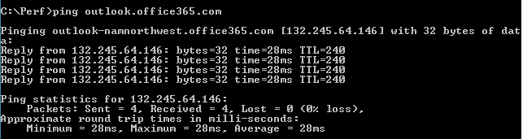

# Office 365 성능 문제 해결 계획

식별 하 고 시퀀스 번호 보다 낮은, 중단, 및 SharePoint Online, 비즈니스, Exchange Online 또는 비즈니스 온라인 용 Skype 비즈니스용 OneDrive 및 클라이언트 컴퓨터 간의 성능 저하를 수정 하기 위해 수행 하는 단계를 파악 해야 합니까? 지원을 호출 하기 전에이 문서의 Office 365 성능 문제를 해결 하 고도 일부 가장 일반적인 문제를 해결할 수 있습니다.
  
이 문서는 성능 문제에 대 한 중요 한 데이터를 캡처하는 것 처럼를 사용할 수 있는 샘플 작업 계획 실제로 수행 합니다. 일부 주요 문제는이 문서에도 포함 됩니다.
    
새로운 기능 네트워크 성능을 하 고 클라이언트 컴퓨터와 Office 365 간의 성능을 모니터링 하려면 장기적인 계획을 확인 하려는 경우 [Office 365 성능 조정 및 관리자 및 IT 전문가-문제해결](performance-tuning-using-baselines-and-history.md)에 대 한 정보를 수행 합니다.
  
## 샘플 성능 문제 해결 작업 계획

이 작업 계획 포함 두 부분으로 구성 합니다. 준비 단계 및 로깅 단계입니다. 지금 바로 성능 문제가 있는 경우 데이터 수집을 수행 해야 귀하가이 계획을 사용 하 여 시작할 수 있습니다.
  
 **클라이언트 컴퓨터를 준비 합니다.**
  
- 성능 문제를 재현할 수 있는 클라이언트 컴퓨터를 소개 합니다. 이 컴퓨터의 문제를 해결 하는 동안 사용 됩니다.
    
- 준비가 되 테스트할 때는 되므로 될 수행 되는 성능 문제를 발생 하는 단계를 기록 합니다.
    
- 수집 하 고 정보를 기록 하기 위한 도구를 설치 합니다.
    
  - [Netmon 3.4](https://www.microsoft.com/en-us/download/details.aspx?id=4865) 설치 (또는 해당 하는 네트워크 추적 도구를 사용). 
    
  - [HTTPWatch](https://www.httpwatch.com/download/) 의 무료 기본 버전을 설치 합니다 (또는 해당 하는 네트워크 추적 도구를 사용). 
    
  - 화면 레코더를 사용 하 여 또는 Windows Vista 및 나중에 테스트 하는 동안 수행 하는 단계에 대 한 레코드를 유지 하기 위해 제공 되는 단계 레코더 (PSR.exe)를 실행 합니다.
    
 **로그 성능 문제**
  
- 불필요 한 모든 인터넷 브라우저를 닫습니다.
    
- 단계 레코더 또는 다른 화면 레코더를 시작 합니다.
    
- 네트워크 모니터 캡처 (또는 네트워크 추적 도구)를 시작 합니다.
    
- Ipconfig /flushdns를 입력 하 여 명령줄에서 클라이언트 컴퓨터에서 DNS 캐시의 선택을 취소 합니다.
    
- 새 브라우저 세션을 시작 하 고 HTTPWatch 설정 합니다.
    
- 선택 사항: 테스트 하는 경우 Exchange Online, Exchange 클라이언트 성능 분석 도구를 실행 Office 365 관리 콘솔에서 합니다.
    
- 성능 문제가 발생 하는 정확한 단계를 재현 합니다.
    
- 프로그램 Netmon 또는 다른 도구 추적을 중지 합니다.
    
- 명령줄에서 다음 명령을 입력 하 고 ENTER 키를 눌러 하 여 Office 365 구독 추적 경로 실행 합니다.
    
    `tracert \< *subscriptionname*  \>.onmicrosoft.com` 
    
- 단계 레코더를 중지 하 고 비디오를 저장 합니다. 날짜 및 시간 캡처 및 좋은 또는 잘못 된 성능을 보여주는 있는지 여부를 포함 해야 합니다.
    
- 추적 파일을 저장 합니다. 다시 캡처 및 좋은 또는 잘못 된 성능을 보여주는 여부의 시간과 날짜를 포함 해야 합니다.
    
이 문서에서 언급 한 도구를 실행 하는 일을 숙지 모르는 경우 다음 이러한 단계가 제공 하므로 걱정 하지 마십시오. 이러한 유형의 네트워크 캡처를 수행 하에 익숙한 경우 [는 기준을 수집 하는 방법](performance-tuning-using-baselines-and-history.md#how-to-collect-baselines), 필터링 및 로그 읽기에 대해 설명 하는 건너뛸 수 있습니다. 
  
## 처음에 DNS 캐시를 플러시하십시오.

이유는 무엇입니까? DNS 캐시 플러시 하 여 새로 슬레이트 상태 테스트에서 시작 합니다. 캐시를 지우면 DNS 확인자 내용을 최신 항목을 다시 설정 중인 있습니다. 기억 플러시 호스트 파일 항목을 제거 하지 않습니다. 호스트 파일 항목을 광범위 하 게 사용 하는 경우 이러한 항목을 다른 디렉터리에 파일을 복사 해야 하며 다음 호스트 파일을 비웁니다.
  
 **DNS 확인자 캐시를 플러시하십시오.**
  
1. 명령 프롬프트를 엽니다 ( **시작** 이나 \> **실행** \> **cmd** 또는 **Windows 키** \> **cmd**).
    
2. 다음 명령을 입력 하 고 ENTER 키를 누릅니다.`ipconfig /flushdns`
    
## Netmon

Microsoft의 네트워크 모니터링 도구 ([Netmon](https://www.microsoft.com/download/details.aspx?id=4865))에 트래픽 네트워크에 있는 컴퓨터 간에 전달 되는 패킷을 분석 합니다. Office 365를 캡처할 수 있습니다, 보기를 사용 하 여 트래픽을 추적 하 고 패킷 헤더를 읽고, 중간에 다른 장치를 식별, 네트워크 하드웨어에 중요 한 설정을 확인 하려면 Netmon을 사용 하 여 삭제 된 패킷 찾아 회사에 있는 컴퓨터 간의 트래픽 흐름에 따라 네트워크 및 Office 365 합니다. 실제 본문의 트래픽 암호화 하기 때문에, 즉 해당 (SSL/TLS를 통해 포트 443에서 여행을 읽을 수 없습니다 전송 되 고 파일입니다. 대신, 필터링 되지 않은 추적 하는데 도움이 되는 패킷 수행 되는 문제 동작을 추적 하는 경로 얻을 수 있습니다.
  
이 이번에는 필터를 적용 하지 않으면 확인 해야 합니다. 대신 하는 단계를 실행 하 고 추적을 중지 하 고 저장 하기 전에 문제를 보여줍니다.
  
Netmon 3.4를 설치한 후 도구를 열고이 단계를 수행 합니다.
  
 **Netmon 추적을 수행 하 고 문제를 재현**
  
1. Netmon 3.4를 시작 합니다.
    
    **시작** 페이지에서 세개의 창 가지: **최근 캡처하**, **네트워크 선택**및 **Microsoft 네트워크 모니터 3.4를 시작 합니다. 공지**합니다. 네트워크 선택 패널을 캡처할 수 있는 기본 네트워크의 목록도 제공 합니다. 네트워크 카드 여기 선택 되었는지 확인 해야 합니다.
    
2. **시작** 페이지의 위쪽에 **새 캡처** 를 클릭 합니다. 이렇게 하면 **캡처 1**이라는 **시작** 페이지 탭 옆에 있는 새 탭을 추가 합니다.
    
    
  
3. 간단한 캡처에서 하려면 도구 모음에서 **시작** 을 클릭 합니다. 
    
4. 성능 문제를 제공 하는 단계를 재현 합니다.
    
5. **중지** 를 클릭 \> **파일** \> **로 저장**합니다. 날짜 및 시간을 표준 시간대를 지정 하 고 잘못 된 또는 우수한 성능을 보여주는 경우 검토 하 여 해야 합니다.
    
## HTTPWatch

[HTTPWatch](https://www.httpwatch.com/download/) 에 비용 부과 대상 및 무료 버전입니다. 무료 기본 버전에서는이 테스트에 필요한 모든에 대해 설명 합니다. HTTPWatch 모니터 브라우저 창에서 바로 트래픽 및 페이지 로드 시간을 네트워크입니다. HTTPWatch는 그래픽으로 성능에 설명 하는 Internet Explorer에 플러그인입니다. 분석을 저장 하 고 HTTPWatch Studio에서 볼 수 있습니다. 
  
> [!NOTE]
> Firefox, Google Chrome 등의 다른 브라우저를 사용 하는 경우 또는 Internet Explorer에서 HTTPWatch를 설치할 수 없는 경우 새 브라우저 창을 열고 키보드에서 F12 키를 누릅니다. 브라우저의 맨 아래에 개발자 도구 팝업 표시 되어야 합니다. Opera를 사용 하는 경우 웹 검사기에 대 한 CTRL + SHIFT + I를 눌러, 다음 **네트워크** 탭을 클릭 하 고 아래에 설명 된 테스트를 완료 합니다. 정보는 약간 다를 수는 있지만 로드 시간 (밀리초)에 계속 표시 됩니다. > SharePoint Online 페이지 로드 시간 관련 문제에 대 한 매우 HTTPWatch 유용합니다. 
  
 **HTTPWatch를 실행 하 고 문제를 재현**
  
1. HTTPWatch 브라우저 플러그인 이므로 브라우저에서 도구를 표시 하는 것은 각 버전의 Internet Explorer에 대 한 약간 다릅니다. 일반적으로 Internet Explorer 브라우저에서 HTTPWatch 명령 표시줄 아래에서 찾을 수 있습니다.  브라우저 버전을 확인 클릭 도움말 플러그인 HTTPWatch 보이지 않으면 브라우저 창에서 \> 기어 기호 및 Internet Explorer에 대 한,에 대 한 또는 이후 버전의 Internet Explorer를 클릭 합니다. **명령** 모음을 시작 하려면 Internet Explorer의 메뉴 표시줄을 마우스 오른쪽 단추로 클릭 하 고 **명령 표시줄**을 클릭 합니다. 과거에는 HTTPWatch 연결 하는 명령 및 탐색기 막대를 한 번씩를 설치 하면 **도구**및 도구 모음 아이콘에 대 한 확인 (후에 다시 부팅) 아이콘을 즉시 표시 되지 않으면 합니다. 반드시 도구 모음을 사용자 지정할 수 있는 하 고 옵션을 추가할 수 있습니다. 
    
  
2. Internet Explorer 브라우저 창에서 HTTPWatch를 시작 합니다. 해당 창 맨아래에 있는 브라우저에 도킹 된 표시 됩니다. **레코드**를 클릭 합니다.
    
3. 정확한 단계와 관련 된 성능 문제를 재현 합니다. HTTPWatch에서 **중지** 단추를 클릭 합니다. 
    
4. HTTPWatch 또는 **전자 메일을 보낼** **저장** 합니다. 날짜 및 시간 정보 및 사용자 조사 좋은 또는 잘못 된 성능의 데모를 포함 하는 여부를 나타내는 값을 포함 되도록 파일 이름을 지정 해야 합니다.    
    이 스크린샷은 HTTPWatch의 전문 버전에서 시작 됩니다. 전문 버전을 사용 하는 컴퓨터에서 기본 버전에서 추적을 열고 읽을 수 수 있습니다. 추가 정보는 해당 메서드를 통해 추적에서 사용할 수 있습니다.
    
## 문제 단계 레코더

단계 레코더 또는 PSR.exe, 발생 하는 대로 문제를 기록할 수 있습니다. 매우 유용한 도구를 실행 하려면 매우 간단 하 고 있습니다.
  
 **문제 단계 레코더를 진행 중인 작업 기록 (PSR.exe)를 실행 합니다.**
  
1. **시작** 을 사용 하거나 \> **실행** \> **PSR.exe** 입력 \> **확인**을 **Windows 키** 를 클릭 하거나 \> **PSR.exe** 입력 \> 하 고 enter 키를 누른 다음 합니다. 
    
2. 작은 PSR.exe 창에 표시 되 면 **시작 레코드** 를 클릭 하 고 성능 문제를 재현 하는 단계를 재현 합니다. **추가 메모**를 클릭 하 여 필요에 따라 메모를 추가할 수 있습니다.
    
3. 단계를 완료 한 경우에 **레코드를 중지** 를 클릭 합니다. 성능 문제는 페이지 렌더링을 하는 경우 페이지를 녹음/녹화를 중지 하기 전에 렌더링 될 때까지 기다립니다. 
    
4. **저장**을 클릭합니다.
    

  
날짜 및 시간 하기 위해 기록 됩니다. 시간 내에 프로그램 PSR Netmon 추적 및 HTTPWatch에 연결 하 고 정밀도 문제를 해결 하는데 도움이 됩니다. 날짜 및 시간 PSR 레코드에 전달 되는 분을 표시할 수는 로그인과 같은 URL 및 관리 사이트의 부분 렌더링 탐색 사이입니다.
  
## 사용자 추적 읽기

모든 네트워크 및 성능 문제를 해결 하는 방법에 대 한 다른 사용자를 소개 하는 문서를 통해 알고 있어야 하는 설명 하기는 것이 불가능 합니다. 성능 좋은 시작 경험과 네트워크 작동 하 고 일반적으로 수행 하는 방법에 대 한 지식 걸립니다. 하지만 중요 문제 목록은 올림할 어떻게 도구 더 쉽게는 가장 일반적인 문제를 해결할 수를 표시 하는 것과 같습니다.
  
Office 365 사이트에 대 한 네트워크 추적을 읽는 기술 선택 하려는 경우 페이지 로드의 추적을 정기적으로 만들기 및 해당 읽기 경험을 사용할 수 있는 보다 더 나은 없는 교사 방법이 있습니다. 예, 되려고를 사용 하는 Office 365 서비스를 로드 하 고 프로세스를 추적 합니다. DNS 트래픽에 대 한 추적을 필터링 하거나 찾은 서비스의 이름에 대 한 FrameData를 검색 합니다. 가져올 서비스를 로드 하는 경우에 발생 하는 단계의 추적을 검색 합니다. 이 어떤 normal 배울 수 있도록 도와줍니다 페이지 부하 같습니다 고, 성능, 특히 중심으로 문제를 해결 하는 경우에 잘못 된 좋은 추적 비교 (영문) 수 알려줄 수 많은 합니다.
  
Netmon 표시 필터 필드에 Microsoft Intellisense를 사용합니다. Intellisense, 또는 지능형 코드 완성 기능을 해당 전체를 일정 기간 동안에 입력 하 고 드롭다운 선택 상자에서 사용할 수 있는 옵션을 모두 표시 됩니다. 예 인 경우 TCP 창 크기 조정 하는 방법에 대 한 걱정 하는 경우에 필터를 잘을 찾을 수 있습니다 (예: `.protocol.tcp.window < 100`)이이 방법으로 합니다.
  

  
Netmon 추적에 있는 많은 양의 트래픽을 가질 수 있습니다. 읽기와 숙련 된 하지 않은 경우 될 무력화 추적을 처음으로 열 수 있습니다. 가장 먼저 할 일은 추적에서 잡음이에서 신호를 구분 합니다. Office 365에 대해 테스트 하 고 보려는 트래픽입니다. 추적을 통해 탐색을 사용 하는 경우에이 목록이 필요 하지 않을 수 있습니다.
  
클라이언트와 Office 365 간의 트래픽을 암호화 하 고 일반 Netmon 추적에서 읽을 수 없습니다는 트래픽의 본문 된다는 것을 의미 하는 TLS를 통해 전달 됩니다. 성능 분석 패킷에서 정보의 세부 사항을 알 필요가 없습니다. 그러나 것이 매우 패킷 헤더와 여기에 포함 된 정보에 관심이 합니다.
  
 **좋은 추적 하기 위한 팁**
  
- 클라이언트 컴퓨터의 IPv4 또는 IPv6 주소 값을 알고 있어야 합니다. **IPConfig** 를 입력 하 고 ENTER 키를 눌러 명령 프롬프트에서 얻을 수 있습니다. 이 주소를 알고 있으면 추적에 트래픽을 클라이언트 컴퓨터를 직접 수행 하는지 여부를 한눈에 알 수 있습니다. 알려진된 프록시 있으면 ping을 사용 하 고 해당 IP 주소를 가져올 합니다. 
    
- DNS 확인자 캐시를 플러시합니다. 하 고 가능한 경우에 테스트를 실행 하는 것을 제외 하 고 모든 브라우저를 닫습니다. 이 작업을 수행할 수 없는 경우 예를 지원 일부 브라우저 기반 도구를 사용 하 여 클라이언트 컴퓨터의 데스크톱을 참조 하는 경우 준비가 되어 대화 추적을 필터링 합니다.
    
- 다른 용무 중 추적을 사용 하는 Office 365 서비스를 찾습니다. Never 또는 거의 살펴본 하기 전에 트래픽, 하는 경우 다른 네트워크 노이즈에서 성능 문제를 분리 하에 유용한 단계입니다. 이 작업을 수행 하는 몇가지 방법이 있습니다. 직접 테스트를 하기 전에 사용할 수 있습니다 ping 또는 특정 서비스의 URL에 PsPing ( `ping outlook.office365.com` 및/또는 `psping -4 microsoft-my.sharepoint.com:443`, 예제를 보려면). 또한 쉽게 찾을 수 있습니다 (프로세스 이름) 사용 하 여 Netmon 추적에는 PsPing 합니다. 검색을 시작 하려면 전체를 제공 합니다.
    
    Netmon 추적을 사용 하는 문제의 시간에만 하는 경우 하는 방법을 배우게 너무 합니다. 방향을 설정 하려면 같은 필터를 사용 하 여 `ContainsBin(FrameData, ASCII, "office")` 또는 `ContainsBin(FrameData, ASCII, "outlook")`합니다. 추적 파일에서 사용자 프레임의 번호를 기록할 수 있습니다. 대화 ID 열에 대 한 찾아보고 프레임 요약 창 오른쪽으로 스크롤할 원하는 메시지가 표시 될 수 있습니다. 또한 기록 하 고 격리 나중에 살펴봅니다 수 있는 특정이 대화의 ID에 대 한 다음과 같은 지정 된 수입니다. 다른 필터링을 적용 하기 전에이 필터를 제거 해야 합니다.
    
> [!TIP]
> Netmon에 유용한 기본 제공 필터를 많이 있습니다. **표시** 필터 창 맨 위에서 "부하 필터" 단추를 시도 합니다. 
  

  

  
사용자 트래픽의 숙지 하 고 필요한 정보를 찾을 수 하는 방법을 알아봅니다. 추적에는 패킷에 (예: "Outlook")는 사용 하는 Office 365 서비스에 대 한 첫번째 참조를 확인 하려면 예에 대해 알아봅니다.
    
Office 365 Outlook 온라인을 작성 한 예로, 트래픽이 시작 다음과 같이 합니다.
  
- DNS 표준 쿼리 및 QueryIDs 일치 하는 outlook.office365.com에 대 한 DNS 응답 합니다. 참고 이름 확인에 대 한 요청을 보내는이 순환, 뿐 where 세계에서 Office 365 전역 DNS에 대 한 시간 오프셋을 고려해 야 합니다. 원칙적으로, 전세계 절반 방향 아닌 가능한 경우 로컬로 합니다. (일부가 팔 로우 할 수 있습니다이 DNS 트래픽을 온라인 로그인 합니다.)
    
- HTTP 가져오기 요청을 영구적으로 이동 (301)의 상태를 보고
    
- 요청 하 고 회신을 연결 하는 RWS 트래픽 RWS 연결을 포함 합니다. (수에 대 한 연결 만들기를 참조 하는 원격 Winsock입니다.)
    
- TCP SYN 및 TCP SYN/응답 대화 합니다. 이 대화의 설정 사용 하면 많은 사용자 성능에 영향을 합니다.
    
- 다음 TLS 핸드셰이크 및 TLS 인증서 대화 일어나는 TLS:TLS 트래픽의 시리즈입니다. (SSL/TLS를 통해 데이터를 암호화 해야 합니다.)
    
트래픽의 모든 부분 중요 하 고, 연결 된 하지만 있으므로 이러한 영역에 초점을 맞출 수는 추적 코드의 일부 성능 문제를 해결 하는 것 이라는 측면에서 특히 중요 한 정보를 포함 합니다. 또한 일반적인 문제의 상위 10 개 목록을 컴파일할 수는 Microsoft에서 문제를 해결 하는 충분 한 Office 365 성능을 수행한 이후 설명 하겠습니다 다음 아웃 해당 루트에 있다고 도구를 사용 하는 방법과 이러한 문제에 있습니다.
  
설치한 하지 않은 경우 모든 준비 아래 행렬을 사용 하면 다양 한 도구를 사용 합니다. 가능한 경우. 설치 지점에 대 한 링크가 제공 됩니다. 목록에 포함 된 [Netmon](https://www.microsoft.com/en-us/download/details.aspx?id=4865) 및 [Wireshark](https://www.wireshark.org/)같은 일반적인 네트워크 추적 도구 하지만와 및 네트워크 트래픽 필터링에 익숙한 하는 능숙 하 게 하는 모든 추적 도구를 사용 합니다. 을 테스트 하는 경우에 유의 하십시오.
  
-  *브라우저를 닫고 테스트를 실행 하는 하나의 브라우저 함께* -이렇게 하면 캡처하는 전반적인 트래픽을 줄일 수 있습니다. 덜 혼잡 추적에 대 한 쉽습니다. 
    
-  *클라이언트 컴퓨터에서 DNS 확인자 캐시 플러시* -이렇게 하면 새로 슬레이트 끔 해지고 추적에 대 한 사용자 캡처를 시작 합니다. 
    
## 일부 주요 문제

발생할 수 몇가지 일반적인 문제 및 네트워크 추적에서 확인할 하는 방법입니다.

### TCP Windows 배율

SYN-에서 찾을 수 SYN/승인 레거시 또는 보관 하드웨어 수 활용 하지 TCP windows 확장 합니다.  적절 한 TCP windows 설정을 확장, 없이 TCP 헤더의 기본 16 비트 버퍼 시간 (밀리초)을 채웁니다.  트래픽은 클라이언트를으로 인해 지연이 발생할 원래 데이터 수신 된 승인의 받을 때까지 보낼 계속할 수 없습니다.

#### 도구:

- Netmon
- Wireshark 

#### 원하는 항목에 대 한:

네트워크 추적에 트래픽을 SYN-SYN/응답에 대 한 찾습니다.  Netmon을에서 같은 필터를 사용 하 여 `tcp.flags.syn == 1`합니다. 이 필터는 Wireshark에서 동일 합니다.  

         
모든 SYN에 대 한 관련된 의무 (SYN/응답)의 대상 포트 (포트 대상 포트)에 일치 하는 원본 (원본) 포트 번호를 것을 볼 수 있습니다. 

네트워크 연결에서 사용 되는 Windows 배율 값을 보려면 먼저 SYN을 확장 한 다음 확장 관련된 SYN/승인  

  

### TCP 유휴 시간 설정

과거에 대부분의 경계 네트워크는 유휴 연결을 해지 일반적으로 의미 하는 일시적인 연결에 대해 구성 됩니다. 프록시 및 방화벽 100을 300 초 보다 큰에 의해 유휴 TCP 세션을 종료할 수 있습니다. 이 문제가 발생할 Outlook 온라인에 대 한 만들고 장기 연결을 사용 하는 또는 하지 유휴 여부입니다.  

프록시에 의해 연결이 종료 됩니다 또는 방화벽 장치, 클라이언트, 정보를 제공 하지 않습니다. 시점과 Outlook 온라인 사용 하려고 하는 클라이언트 컴퓨터는 의미 하려고 합니다, 반복적으로, 새 하기 전에 연결 재개 합니다. 페이지를 로드 하에서 끊습니다 제품 프롬프트나 성능이 저하에 표시 될 수 있습니다.

#### 도구:

- Netmon
- Wireshark

#### 찾을 대상을 지정 합니다.

Netmon을에 대 한 왕복에 대 한 시간 오프셋 필드를 살펴봅니다. 왕복에는 서버에 요청을 전송 하 고 다시 응답을 수신 하는 클라이언트 간의 시간입니다. 클라이언트와 탈출 포인트 사이의 확인 (예: 클라이언트-\> 프록시), 또는 Office 365에 클라이언트 (클라이언트-\> Office 365). 다양 한 유형의 패킷에서이 볼 수 있습니다. 

한 예로 Netmon의 필터 다음과 같을 수 있습니다 `.Protocol.IPv4.Address == 10.102.14.112 AND .Protocol.IPv4.Address == 10.201.114.12`, 또는 Wireshark, `ip.addr == 10.102.14.112 &amp;&amp; ip.addr == 10.201.114.12`합니다.  

> [!TIP]
> 사용자 추적에 IP 주소 DNS 서버에 속하는 경우 모르는? 명령줄에서 조회를 시도 합니다. **시작** 을 클릭 \> **실행** \> 하 고 **cmd**를 입력 하거나 **Windows 키** 를 눌러 \> 하 고 **cmd**를 입력 합니다. 프롬프트에서 다음을 입력 `nslookup <the IP address from the network trace>`합니다. 테스트를 자신의 컴퓨터의 IP 주소에 대해 nslookup을 사용 합니다. > Microsoft의 IP 범위 목록을 보려면를 [Office 365 Url 및 IP 주소 범위를](https://technet.microsoft.com/en-us/library/hh373144.aspx)참조 하십시오. 

문제가 발생 하는 경우 예상 되는 긴 시간이 오프셋 하는 (Outlook 온라인),이 경우에 표시할 응용 프로그램 데이터의 흐름이 표시 하는 TLS:TLS 패킷을에 특히 (등 Netmon에서 찾을 수 있습니다를 통해 응용 프로그램 데이터 패킷을 `.Protocol.TLS AND Description == "TLS:TLS Rec Layer-1 SSL Application Data"`). 세션 간에 시간에 원활 하 게 진행이 표시 됩니다. Outlook 온라인을 새로 고칠 때 긴 지연 표시 되 면이 때문일 수는 높은 수준의 전송 되 고 다시 설정 합니다. 

### 대기 시간/라운드 여행 시간 

대기 시간이 훨씬 많은 변수, 이러한 업그레이드 보관 장치, 네트워크 및 네트워크 연결에 있는 다른 작업을 차지 하는 전체 대역폭의 백분율을 많은 수의 사용자 추가 (영문)에 따라 변경 될 수 있는 측정값입니다. 

이 [네트워크 계획 및 Office 365에 대 한 성능 조정](network-planning-and-performance.md) 페이지에서 사용할 수 있는 Office 365에 대 한 대역폭 계산기 있습니다.  

사용자의 연결 또는 ISP에 대 한 연결의 대역폭의 속도를 측정 해야 합니까? 이 사이트 (또는 것과 같은 사이트)을 시도: [Speedtest 공식 사이트](https://www.speedtest.net/)및 [Pingtest](http://www.pingtest.net/)합니다.

#### 도구:

- Ping
- PsPing
- Netmon
- Wireshark

#### 찾을 대상을 지정 합니다.

를 추적의 대기 시간을 추적 하려면 Office 365의 클라이언트 컴퓨터 IP 주소와 DNS 서버의 IP 주소 기록 필요에서 도움이 됩니다. 쉽게 추적 필터링 하기 위해입니다. 프록시를 통해 연결 하는 경우에 사용자 클라이언트 컴퓨터의 IP 주소, 프록시/탈출 IP 주소 및 Office 365 DNS IP 주소는 작업을 쉽게 수행할 수 있도록 해야 합니다.  

Outlook.office365.com 전송 된 ping 요청 \rtc 요청을 수신 하는 데이터 센터의 이름을 상표 연속 된 ICMP 패킷을 보낼 연결할 못할 *수 있습니다* ping 하는 경우에 있습니다. PsPing (다운로드에 대 한 무료 도구) 및 특정 포트 (443)를 사용 하 고 아마도 i p v 4를 사용 하 여 (-4)를 받게 됩니다는 평균 round 왕복 시간 패킷을 전송에 대 한 키를 누릅니다. 이 기능은 작동이 Office 365 서비스에서 다른 Url에 대 한과 같은 `psping -4 yourSite.sharepoint.com:443`합니다. Ping 테스트를 다음과 같이 평균, 시도 대 한 보다 큰 샘플을 가져올 수를 지정할 수는 실제로: `psping -4 -n 20 yourSite-my.sharepoint.com:443`합니다.  

> [!NOTE]
> PsPing은 ICMP 패킷을 보낼 하지 않습니다. 해당 ping TCP 패킷을 사용한 특정 포트를 통해 열어야 알면 하나를 사용할 수 있도록 합니다. SSL/TLS를 사용 하는 Office 365 포트 연결을 시도: 프로그램 PsPing에는 443입니다.

        

네트워크 추적을 수행 하는 동안 저속 성능의 Office 365 페이지를 로드 하는 경우에 대 한 Netmon 또는 Wireshark 추적을 필터링 해야 `DNS`합니다. 이 Ip 중 하나입니다.  

IP 주소를 가져올 (및 DNS 대기 시간을 확인)를 사용자 Netmon을 필터링 하기 위해 수행 하는 단계는 다음과 같습니다. 이 예제에서는 outlook.office365.com를 사용 하 여 있지만 SharePoint Online 테 넌 트 (예: hithere.sharepoint.com)의 URL을 사용할 수도 있습니다.  

1. Ping을 사용 하는 URL `ping outlook.office365.com` 및 결과에서 이름 및 ping 요청이 전송 된 DNS 서버의 IP 주소를 기록 합니다. 
2. 네트워크 해당 페이지를 열고 추적 또는 성능 문제를 제공 하는 작업을 수행 하 또는, 네트워크 추적 것 자체를 ping에 높은 대기 시간을 표시 합니다. 
3. DNS를 위한 Netmon 및 필터에서 추적을 엽니다 (이 필터는 또한 Wireshark를에서 작동 하는 하지만 사례에 대/소문자를 구분 `-- dns`). 다음과 같이 더 많은 문제에 Netmon 필터링 하 고도 수 ping에서 DNS 서버의 이름을 알고 있는 이후: `DNS AND ContainsBin(FrameData, ASCII, "namnorthwest")` , 다음과 같은 Wireshark dns에서 및 프레임 "namnorthwest"를 포함 합니다. 응답 패킷 열고 Netmon의 프레임 세부 정보 창에서 자세한 정보를 확장 하는 DNS를 클릭 합니다. Office 365-에서 요청을 제공 하기 위해 DNS 서버의 IP 주소를 찾을 수 DNS 정보에서 다음 단계 (PsPing 도구)에 대 한이 IP 주소를 필요 합니다. 필터를 제거, Netmon의 프레임 요약에 대 한 DNS 응답을 마우스 오른쪽 단추로 클릭 \> 대화 찾기 \> DNS는 DNS 쿼리 및 응답--나란히 볼 수 있습니다. 
4. Netmon에서 DNS 요청 및 응답 사이의 시간 오프셋 열을 note도 있습니다. 다음 단계에서는, 간단한 설치 및 사용 [PsPing](https://technet.microsoft.com/en-us/sysinternals/jj729731.aspx) 도구에는 매우 간편 하 게 방화벽에서 ICMP이 차단 종종와 PsPing 세련 되 대기 시간 (밀리초) 추적 합니다. PsPing에 주소와 포트 (사용해의 사례 열린 포트 443의)에 대 한 TCP 연결을 완료합니다. 
5. PsPing를 설치 합니다. 
6. 명령 프롬프트를 엽니다 (시작 \> 실행 \> cmd 또는 Windows 키를 입력 \> 에 cmd를 입력) 디렉터리 PsPing 명령을 실행 하는 PsPing 설치한 디렉터리를 변경 합니다. 내 예제에서 볼 수 있습니다 C.의 루트에 있는 'Perf' 폴더를 만든 I 빠른 실행에 대해 동일 하 게 수행할 수 있습니다. 
7. Netmon 추적에 이전 버전에서 Office 365 DNS 서버의 IP 주소에 대해 사용자 PsPing 대신 걸 수 있도록 명령은 입력--포트 번호를 추가 해야 합니다.  즉, `psping -n 20 132.245.24.82:445`합니다. 이의 20 ping 샘플링을 제공 되며, PsPing를 중지 하는 경우 대기 시간을 평균. 

Office 365에서 프록시 서버를 통해 야 하는 경우이 단계는 약간 달라 집니다. 프록시/탈출 및 뒤로, 시간 (밀리초)의 평균 대기 시간 값을 가져올 프록시 서버에 처음 PsPing 것 하 고 또는 (한 Office 365 및 뒤로) 누락 된 값을 가져오려면 인터넷에 직접 연결 된 컴퓨터는 프록시에 PsPing 실행 중 하나는 다음 키를 누릅니다.  

두 밀리초 값 해야 프록시에서 PsPing를 실행 하는 경우: 프록시 서버 또는 탈출 지점 및 Office 365에 프록시 서버에 클라이언트 컴퓨터. 및 삭제 하 고 나면! 물론 녹음/녹화 값, 엔터티입니다.  

인터넷에 직접 연결 된 다른 클라이언트 컴퓨터에서 PsPing를 실행 하는 경우, 즉 프록시를 없이 해야 두 밀리초 값: 프록시 서버 또는 탈출 지점 및 Office 365에 클라이언트 컴퓨터에 클라이언트 컴퓨터. 이 경우 Office 365에 클라이언트 컴퓨터의 값에서 프록시 서버 또는 탈출 지점에 클라이언트 컴퓨터의 값을 뺍니다. 및 됩니다 RTT 번호 클라이언트 컴퓨터에서 프록시 서버 또는 탈출 지점에 있고에서 프록시 서버 또는 탈출을 가리키고 및 ce 365 합니다. 

그러나 직접 연결 또는 해당 프록시를 무시 하는 영향을 받는 위치에서 클라이언트 컴퓨터를 찾을 수 있습니다를 참조 하는 경우 문제 재현 다음과 같은으로 시작 하도록 선택 및 사용 하 여 테스트, 이후부터 수 있습니다. 

대기 시간, Netmon 추적에 표시 된 대로 이러한 추가 시간 (밀리초) 추가할 수 위쪽, 쿼리하고 충분히에 있으면 지정된 된 세션입니다.  

> [!NOTE]
> 사용자의 IP 주소는 여기에 표시 된, 예에 ping을 같이 더 많은 157.56.0.0/16 또는 유사한 범위를 반환할 수 있습니다 Ip 보다 달라질 수 있습니다. Office 365에서 사용 하는 범위 목록에 대 한 [Office 365 Url 및 IP 주소 범위](https://technet.microsoft.com/en-us/library/hh373144.aspx)체크아웃 합니다. 

검색할 등 132.245 하려는 경우 (단추에 있으면이 대 한 상위) 모든 노드를 확장 해야 합니다.

### 프록시 인증

에 적용 하면 프록시 서버를 통해 거는 경우. 그렇지 않은 경우에 다음이 단계를 건너뛸 수 있습니다. 제대로 작동 하는 경우 프록시 인증 전체 시간을 밀리초 단위로 일관 되 게 수행 해야 합니다. 최대 사용 기간 동안 간헐적으로 잘못 된 성능은 (예) 참조 하면 안됩니다.  

프록시 인증 켜져, 각 시간 정보를 보려면 Office 365에 새 TCP 연결을 설정 하는 경우 백그라운드에서 인증 프로세스를 통해 전달 해야 합니다. 따라서 등 일정에서 온라인 Outlook에서 메일을 전환 하는 경우 있습니다를 인증 합니다. 하 고 SharePoint Online에서 페이지 미디어 또는 여러 사이트 또는 위치, 데이터를 표시 하는 경우 하면가 인증 데이터를 렌더링 하기 위해 필요한 각 다른 TCP 연결에 대 한.  

온라인 Outlook에서 일정 하 고 사서함, 사이 전환할 또는 SharePoint Online에서 느린 페이지를 로드 하는 때마다 저속 로드 시간이 발생할 수 있습니다. 그러나 여기에 나와있지 않은 다른 증상 있습니다. 

프록시 인증이 탈출 프록시 서버에서 설정 합니다. Office 365와 성능 문제가 발생 하는지, 하는 경우 네트워킹 팀에 문의 해야 합니다.  

#### 도구: 

- Netmon
- Wireshark 

#### 찾을 대상을 지정 합니다.

프록시 인증 작업에는 새 TCP 세션을 서버에서 파일 또는 정보를 요청 하거나 정보를 입력 하 게 일반적으로 위쪽, 된 해야 때마다 발생 합니다. 예, HTTP GET 또는 HTTP POST 요청 주위 프록시 인증을 표시 될 수 있습니다. Netmon에 ' NTLMSSP 요약 ' 열을 추가 하 고 필터링에 대 한 요청을 인증 하는 프로그램 추적에는 여기서 프레임을 참조 하려면 `.property.NTLMSSPSummary`합니다. 기간 인증이 수행 됨을 보려면 시간 델타 열을 추가 합니다. 

Netmon에 열을 추가 합니다. 
1. 설명 등 열을 마우스 오른쪽 단추로 클릭 합니다. 
2. 열 선택을 클릭 합니다. 
3. 목록에서 찾은 후 NTLMSSP 요약 하 고 시간 델타 하 고 추가 클릭 합니다. 
4. 새 열 전체에 앞 이나 뒤로 이동 설명 열-나란히 읽을 수 있도록 합니다.
5. 확인을 클릭합니다. 

열을 추가 하지 하는 경우에 Netmon 필터 작동 합니다. 하지만 문제해결 과정에 어떤 단계 인증을 볼 수 있으면 훨씬 더 쉽게 됩니다. 

프록시 인증의 인스턴스는 NTLM 시도 하는 또는 메시지를 인증 한 모든 프레임을 연구 해야에 대 한 자세한 내용은 경우이 매개 변수입니다. 필요한 경우 트래픽과 대화 찾기의 특정 부분을 마우스 오른쪽 단추로 \> TCP 합니다. 이러한 대화에서 시간 델타 값 알고 있어야 합니다. 

        

Wireshark에 표시 된 대로 프록시 인증 4 초 지연 됩니다. 프레임 세부 정보에 같은 이름의 필드를 마우스 오른쪽 단추로 클릭 하 고 열으로 추가 선택 하를 통해 **표시 되는 이전 프레임에서 시간 델타** 열 것 이었습니다.          

### DNS 성능

이름 확인 works 최상의 및 가장 신속 하 게 가능한 클라이언트의 국가 근접 전체에 소요 되는 경우. 

DNS 이름 확인 수행 중이면 해외에서 하는 경우 페이지 로드를 초를 추가할 수 것입니다. 원칙적으로, 이름 확인 100ms 아래에서 발생합니다. 그렇지 않은 작업을 수행 해야 하는 경우 추가 조사 합니다. 

> [!TIP]
> Office 365에서 작동 하는 클라이언트 연결 하는 방법 확실 하지 않은 경우? 클라이언트 연결 참조 문서를 자세하게 살펴보겠습니다 [여기](https://technet.microsoft.com/en-us/library/dn741250.aspx)합니다.           

#### 도구: 

- Netmon
- Wireshark
- PsPing

#### 찾을 대상을 지정 합니다.
DNS 성과 분석 하는 것은 네트워크 추적에 대 한 일반적으로 다른 작업입니다. 그러나 PsPing 가로선, 체크인 또는 체크아웃, 가능한 원인에에서 도움이 됩니다. 

TCP 및 UDP 요청을 기반으로 DNS 트래픽을 및 응답 해당 특정 응답으로 특정 요청에 일치 하는 데 도움이 되는 ID를 가진 명확 하 게 표시 됩니다. DNS를 볼 수 있습니다, 등 SharePoint Online 사용 하는 경우 네트워크 이름 또는 URL을 웹 페이지에서 트래픽 합니다. 규칙의 축소판 그림으로 영역을 전송 하는 경우 인 경우는 제외이 트래픽의 대부분 UDP를 통한 실행 합니다. 

Netmon 및 Wireshark 모두 DNS 트래픽을 확인 수 있는 가장 기본적인 필터는 단순히 `dns`합니다. 필터를 지정 하는 경우 소문자를 사용 해야 합니다. 클라이언트 컴퓨터에 문제를 재현 하기 전에 DNS 확인자 캐시를 플러시하려면 해야 합니다. 예 홈 페이지에 대 한 SharePoint Online 느린 페이지 부하를 사용 하는 경우 모든 브라우저, 새 브라우저를 열고, 추적을 시작, 프로그램 DNS 확인자 캐시를 플러시합니다.를 닫은 SharePoint Online 사이트로 이동 합니다. 전체 페이지를 확인 한 후에 중지 하 고 추적을 저장 해야 합니다.

여기서 오프셋 시간을 확인 하려고 합니다. 및 다음이 단계를 완료 하 여 수행할 수 있는 Netmon을 **시간 델타** 열을 추가 하는 것이 좋습니다. 
1. 설명 등 열을 마우스 오른쪽 단추로 클릭 합니다. 
2. 열 선택을 클릭 합니다. 
3. 시간 델타 서비스 목록에서 찾은 하 고 추가 클릭 합니다. 
4. 새 열 전체에 앞 이나 뒤로 이동 설명 열-나란히 읽을 수 있도록 합니다.
5. 확인을 클릭합니다. 

관심 쿼리를 찾을 경우 고려 **대화 찾기** 선택 프레임 세부 정보 창에서 해당 쿼리를 마우스 오른쪽 단추로 클릭 하 여 격리 \> **DNS**합니다. 네트워크 대화 패널 점프 오른쪽 UDP 트래픽의 해당 로그에 특정 대화에 있는지 확인 합니다. 

        

Wireshark에서 DNS 시간에 대 한 열을 만들 수 있습니다. 추적에 수행 (또는 추적을 열고) Wireshark 및 필터에서 `dns`, 또는 더를 끌기만 `dns.time`합니다. 모든 DNS 쿼리를 클릭 하 고 세부 정보를 보여주는 패널을 확장 하 고는 `Domain Name System (response)` 세부 정보입니다. 시간에 대 한 필드를 표시 됩니다 (예 ` [Time: 0.001111100 seconds] `합니다. 이 시간을 마우스 오른쪽 단추로 클릭 하 고 **열으로 적용**을 선택 합니다. 이렇게 하면 **시간** 열에 추적 빠르게 정렬 하는 것에 대 한 합니다. DNS를 호출 하는 확인 하기 위해 값을 내림차순으로 정렬 하려면 새 열을 클릭 가장 긴 문제를 해결 하는 작성 합니다. 

[dns.time(소문자)에 의해 Wireshark에서 필터링되며 열에 적용된 세부 수준의 시간을 사용하고 오름차순으로 정렬되는 SharePoint Online 찾아보기입니다.](media/1439dcc2-12ff-4ee2-9ef3-1484cf79c384.PNG)

DNS 해결 시간에 대 한 더 많은 확인을 수행 하려는 경우에 TCP가 사용 되는 DNS 포트에 대해 PsPing 사용해 보기 (등 `psping <IP address of DNS server>:53`). 성능 문제를 계속 표시 수 있습니까? 이렇게 하면 문제는을 해상도 수행 하기 위해 방문 하 여 DNS 응용 프로그램의 특정 문제 보다 광범위 한 네트워크 문제 될 가능성이 높습니다. 또한 알아낸, 다시는 outlook.office365.com ping \rtc Outlook 온라인에 대 한 DNS 이름 확인 위치 (예: outlook-namnorthwest.office365.com)를 수행 하는 것입니다.  문제를 특정 DNS 조회, DNS 구성 하 고 DNS 전달 자가이 문제를 더 자세히 조사를 살펴보는 IT 부서에 문의 해야 할 수도 있습니다. 

### 프록시 확장성

Office 365에서 Outlook 온라인 같은 서비스 여러 장기 연결 클라이언트에 권한을 부여 합니다. 따라서 각 사용자 긴 수명을 필요로 하는 더 많은 연결을 사용할 수 있습니다.  

> [!TIP]
> Office 365에 많은 사용자를 추가 하려고 하기 때문에 대역폭 사용에 대 한 계획을 세워야? [Office 365에 대 한 인터넷 대역폭 사용에 대 한 계획](https://technet.microsoft.com/en-us/library/hh852542.aspx)을 시도 합니다. 있습니다 대역폭 계산기 사용할 수 있습니다.

#### 도구:
 
수학  

#### 찾을 대상을 지정 합니다. 

네트워크 추적 또는 없을 문제해결 도구가 특정 합니다. 대신, 기준으로 제한 사항 및 기타 변수를 지정 하는 대역폭 계산 합니다.  

### TCP 최대 세그먼트 크기

SYN-SYN/승인에서 발견  모든 성능 네트워크 추적을 사용할 수 있는 데이터의 최대 크기를 하기 위해 TCP 패킷을 구성 되었는지 확인 하려면 수행 했을 때의이 검사를 수행 합니다. 

목표는 데이터 전송에 대 한 1460 바이트의 MSS를 참조 하는 것입니다. 프록시/탈출/Office 365에 대 한 NAT 최상의 결과 얻으려면 및 NAT, 프록시/탈출 하는 클라이언트에서이 테스트를 실행 하는 프록시 뒤에 NAT를 사용 하는 경우 기억! 다음은 서로 다른 TCP 세션입니다.

#### 도구: 

Netmon

#### 찾을 대상을 지정 합니다.

TCP 최대 세그먼트 크기 (MSS)는 SYN-SYN/응답 패킷에에서 필요한 데이터를 찾을 수를 의미 하 여 네트워크 추적에는 3 방향 핸드셰이크의 다른 매개 변수입니다. MSS는 실제로 매우 간단 하 게 참조 하십시오. 

성능 문제를 설명 하 나 있고에 대 한 궁금한 연결을 찾을 모든 성능 네트워크 추적을 엽니다. 

> [!NOTE]
> 추적을 볼 하 고 트래픽을 통해 대화에 관련 된 찾아야 하는 경우는 클라이언트의 IP 또는 프록시 서버 또는 탈출 지점의 IP으로 필터링 합니다. 직접 이동, 그에 따른 추적 및 필터에서 Office 365의 IP 주소에 대 한 테스트 하는 URL ping을 사용 해야 합니다. 

중 추적을 찾고 있습니까? 본인의 방향을 지정 하려면 필터를 사용 하십시오. Netmon을 실행와 같은 URL을 기준으로 검색 `Containsbin(framedata, ascii, "sphybridExample")`, 프레임 번호를 기록해둡니다. 

Wireshark 사용 하 여 다음과 같이 `frame contains "sphybridExample"`합니다. 원격 Winsock (RWS) 트래픽 (나타날 수 있습니다를 [PSH, 응답]으로 Wireshark)를 찾은, 발견 되 면 기억 RWS 연결 하는 앞서 설명한 것 처럼 관련 SYN-SYN/응답 되기 바로 전에 볼 수 있습니다. 

이 시점 있습니다 수 프레임 번호를 기록, 필터를 삭제, 가장 가까운 SYN. 살펴보는 Netmon의 네트워크 대화 창에서 모든 트래픽을 클릭 합니다. 

중요 한 점은 추적의 시간에 IP 주소 정보를 받을 하지 않은 경우 찾기 (영문) URL 추적에 (의 일부 `sphybridExample-my.sharepoint.com`, 예)를 기준으로 필터링 하려면 IP 주소에서 제공 합니다. 

특정인에 관심이 추적에서 연결을 찾습니다. 이 중 하나를 검색 하 여 추적, IP 주소를 통해 또는 Netmon에 네트워크 대화 창을 사용 하 여 특정 대화 Id를 선택 하 여 필터링 하 여 수행할 수 있습니다. SYN 패킷 찾았으면 (Netmon)에서 TCP 또는 프레임 세부 정보 패널에서 (Wireshark)에서 전송 제어 프로토콜을 확장 합니다. TCP 옵션 및 MaxSegementSize를 확장 합니다. 관련된 SYN-ACK 프레임 및 TCP 옵션을 확장 및 MaxSegmentSize를 찾습니다. 두 값 중 더 작은 숫자는 최대 세그먼트 크기에를 수 있습니다. 이 그림에서 I는 사용 하 여 TCP 문제를 해결 호출 Netmon의 기본 제공 열입니다.  

기본 제공 열은 **프레임 세부 정보** 패널의 맨위에 합니다. (기본 보기로 다시 전환할 열을 다시 클릭 하 고 표준 시간대를 선택 합니다.) 

           
Wireshark에서 필터링 된 추적 다음과 같습니다. MSS 값으로 특정 필터 ( `tcp.options.mss`). SYN, SYN/응답, 응답 핸드셰이크 프레임 프레임 세부 정보에 해당 Wireshark의 맨 아래에 연결 된 (47 응답, 46 SYN/응답에 대 한 링크, 43 SYN에 대 한 링크에 있으므로 프레임) 이러한 종류의 작업을 쉽게 수행할 수 있도록 합니다. 

         
선택 승인 확인 해야하는 경우 (이 행렬에 다음 항목)에 추적을 닫지 마십시오!

### 선택 승인

SYN-에서 발견 SYN 및 SYN/승인 선택 승인 (SACK) 모두에서 허가 된 데이터는 패킷 때의 원활 하 게 재전송을 허용 또는 패킷을 이동 누락으로 보고 SYN/승인 해야 합니다. 장치 성능 문제가 발생할 수 있는이 기능을 사용 하지 않도록 설정할 수 있습니다. 

프록시/탈출/Office 365에 대 한 NAT 최상의 결과 얻으려면 및 NAT, 프록시/탈출 하는 클라이언트에서이 테스트를 실행 하는 프록시 뒤에 NAT를 사용 하는 경우 기억! 다음은 서로 다른 TCP 세션입니다.

#### 도구: 

Netmon 

#### 찾을 대상을 지정 합니다.

선택적 승인 (SACK)은 SYN/SYN-ACK 핸드셰이크에 다른 매개 변수입니다. SYN-SYN/응답 다양 한 방법에 대 한 추적을 필터링 할 수 있습니다. 

추적 하 고 있는 추적을 검사 하 여 특정인에 관심이 IP 주소를 통해 또는 Netmon에 네트워크 대화 창을 사용 하 여 대화 ID를 클릭 하 여 필터링에서 연결을 찾습니다. SYN 패킷 찾았으면 Netmon에서 TCP 또는 Wireshark 프레임 세부 정보 섹션에서에서 전송 제어 프로토콜을 확장 합니다. TCP 옵션을 확장 하 고 SACK 합니다. 관련된 SYN-ACK 프레임 및 확장 하 고 TCP 옵션 및 해당 SACK 필드를 찾습니다. SACK SYN 및 SYN/승인 모두 허용 확인 다음은 Netmon 및 Wireshark 모두에 표시 된 대로 SACK 값입니다.

                     

### DNS 지리적 위치 

세계에서 Office 365를 확인 하려고 하는 경우 DNS 호출 효과 연결 속도 

Outlook 온라인에서 첫번째 DNS 조회를 완료 한 후 해당 DNS의 위치 하는데 사용할 가장 가까운 데이터 센터에 연결 합니다. 백본 네트워크를 사용 하 여 데이터가 저장 되는 데이터 센터 (dC)에 연결 하는 Outlook 온라인 CAS 서버를에 연결 됩니다. 이 빠릅니다.

홈 자료의 해당 활성 데이터 센터-는 해당 위치를 자신의 SPO 테 넌 트에 기반 하는 dC는으로 전달 SharePoint Online, 해외 이동 하는 사용자에 액세스할 때 (미국의 경우 dC 있을 경우 미국 기반 하는 경우 사용자).     Lync online의 한번에 둘 이상의 dC 활성 노드 합니다. 요청은 때 인스턴스에 대 한 Lync online, Microsoft의 전송 DNS 됩니다 세계에서 요청 원본 위치를 결정 하 고 Lync 온라인 활성화 되어 가장 가까운 지역 dC에서 IP 주소를 반환 합니다. 

> [!TIP]
> 클라이언트가 Office 365에 연결 하는 방법에 대 한 상세 필요 합니까? [클라이언트 연결](https://technet.microsoft.com/en-us/library/dn741250.aspx) 참조 문서 (및 해당 유용한 그래픽)에 대 한 정보를 수행 합니다.           
#### 도구:

- Ping
- PsPing

#### 찾을 대상을 지정 합니다.

Microsoft의 DNS 서버에 클라이언트의 DNS 서버에서 이름 확인에 대 한 요청 (dC) 지역 데이터 센터의 IP 주소를 반환 하는 Microsoft DNS에서 대부분의 경우 결과에 해야 합니다. 이 의미 있습니다 경우에 본사 Bangalore, 인도 있지만 이동 중에 미국의 경우 Outlook 온라인에 대 한 브라우저에서는 요청 하는 경우, Microsoft의 DNS 서버 해야 하면 IP 주소를 전달할 미국, 대한민국-지역 데이터 센터에서에서 데이터 센터입니다. Outlook에서 메일이 필요 하는 경우 해당 데이터는 데이터 센터 간의 Microsoft의 빠른 백본 네트워크를 통해 출장 됩니다.

DNS 이름 확인 가능한 사용자 위치에 근접 작업을 수행 하는 경우 가장 빠른 작동 합니다. 유럽의 경우 유럽에서 Microsoft DNS로 이동 하 고 (정상) 유럽의 데이터 센터를 처리 하는 것이 원하는 합니다. DNS 및 미국 내에서 데이터 센터 하려고 유럽의 클라이언트에서 성능 저하 됩니다.

Outlook.office365.com 세계에서 DNS 요청 되 고 라우팅되 결정에 대해 Ping 도구를 실행 합니다. 유럽의 경우에 다음과 같이 outlook emeawest.office365.com에서 회신을 표시 됩니다. (아메리카), 예상 되는 다음과 같이 outlook namnorthwest.office365.com 합니다. 

클라이언트 컴퓨터에서 명령 프롬프트를 엽니다 (시작을 통해 \> 실행 \> cmd 또는 Windows 키 \> 에 cmd를 입력). Ping outlook.office365.com를 입력 하 고 ENTER 키를 누릅니다. I p v 4를 통해 ping을 사용 하도록 지정 하려면-4를 지정 해야 합니다. ICMP 패킷을에서 응답을 받지 못할 수 있습니다 하지만 요청 라우팅 되었습니다 DNS의 이름이 표시 되어야 합니다. 표시 하려는 경우이 연결에 대 한 대기 시간 번호 PsPing ping 하 여 반환 되는 서버의 IP 주소를 시도 합니다.  

           
           
### Office 365 응용 프로그램 문제해결

#### 도구: 

- Netmon
- HTTPWatch
- 브라우저에서 F12 콘솔

응용 프로그램별이 네트워크 관련 문서에 문제를 해결에 사용 되는 도구에 다루는 하지 않습니다. 리소스를 찾을 수 있지만 [이 페이지에서](https://support.office.com/en-us/article/Network-planning-and-performance-tuning-for-Office-365-e5f1228c-da3c-4654-bf16-d163daee8848)사용할 *수* 있습니다.
   
## 관련 항목

[Office 365 끝점 관리](https://support.office.com/article/99cab9d4-ef59-4207-9f2b-3728eb46bf9a)
  
[Office 365 끝점 FAQ](https://support.office.com/article/d4088321-1c89-4b96-9c99-54c75cae2e6d)
  

