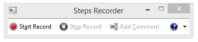

# <a name="performance-troubleshooting-plan-for-office-365"></a>Office 365 성능 문제 해결 계획

SharePoint Online, 비즈니스용 OneDrive, Exchange Online, 비즈니스용 Skype Online, 클라이언트 컴퓨터 간의 지연, 중단 및 성능 저하를 식별 하 고 해결 하기 위해 수행 해야 하는 단계를 알아야 합니까? 지원을 요청 하기 전에이 문서를 통해 Office 365 성능 문제를 해결 하 고 일반적인 몇 가지 문제를 해결 하는 데 도움이 될 수 있습니다.
  
이 문서는 실제 성능 문제에 대 한 중요 한 데이터를 캡처하는 데 사용할 수 있는 예제 작업 계획입니다. 이 문서에는 몇 가지 주요 문제에도 포함 되어 있습니다.

네트워크 성능을 처음 사용 하는 경우 클라이언트 컴퓨터와 Office 365 간의 성능을 장기간 모니터링 하려면 [office 365 성능 조정 및 문제 해결-관리자 및 IT 전문가](performance-tuning-using-baselines-and-history.md)를 확인 하세요.
  
## <a name="sample-performance-troubleshooting-action-plan"></a>샘플 성능 문제 해결 작업 계획

이 작업 계획에는 두 부분이 포함 되어 있습니다. 준비 단계 및 로깅 단계 지금 성능 문제가 발생 하 여 데이터 수집을 수행 해야 하는 경우이 계획을 즉시 사용 하 여 시작할 수 있습니다.
  
### <a name="prepare-the-client-computer"></a>클라이언트 컴퓨터 준비
  
- 성능 문제를 재현할 수 있는 클라이언트 컴퓨터를 찾습니다. 이 컴퓨터는 문제 해결 과정 중에 사용 됩니다.
- 성능 문제가 발생 하는 단계를 기록 하 여 테스트 시간이 걸릴 때 준비가 완료 되었는지 확인 합니다.
- 정보 수집 및 녹음 도구를 설치 합니다.
  - [Netmon 3.4](https://www.microsoft.com/download/details.aspx?id=4865) 을 설치 하거나 해당 하는 네트워크 추적 도구를 사용 합니다.
  - 무료 기본 버전의 [HTTPWatch](https://www.httpwatch.com/download/) 를 설치 하거나 해당 하는 네트워크 추적 도구를 사용 합니다.
  - 테스트 중에 수행 하는 단계에 대 한 기록을 유지 하기 위해 화면 레코더를 사용 하거나 Windows Vista 이상에서 제공 하는 단계 레코더 (PSR.exe)를 실행 합니다.

### <a name="log-the-performance-issue"></a>성능 문제 기록
  
- 불필요 한 모든 인터넷 브라우저를 닫습니다.
- 단계 레코더 또는 다른 화면 레코더를 시작 합니다.
- Netmon 캡처 (또는 네트워크 추적 도구)를 시작 합니다.
- 명령줄에서 ipconfig/flushdns를 입력 하 여 클라이언트 컴퓨터에서 DNS 캐시를 지웁니다.
- 새 브라우저 세션을 시작 하 고 HTTPWatch를 켭니다.
- 선택 사항: Exchange Online을 테스트 하는 경우 Office 365 관리 콘솔에서 Exchange 클라이언트 성능 분석기 도구를 실행 합니다.
- 성능 문제를 일으키는 정확한 단계를 재현 합니다.
- Netmon 또는 다른 도구의 추적을 중지 합니다.
- 명령줄에서 다음 명령을 입력 하 여 Office 365 구독에 대 한 추적 경로를 실행 하 고 ENTER 키를 누릅니다.

  ``` cmd
  tracert <subscriptionname>.onmicrosoft.com
  ```

- 단계 레코더를 중지 하 고 비디오를 저장 합니다. 캡처의 날짜 및 시간을 포함 하 고이를 통해 양호한 지 또는 불량 성능을 보여 줍니다.
- 추적 파일을 저장 합니다. 다시 한 번, 캡처의 날짜 및 시간을 포함 하 고,이로 인해 성능이 양호한 지 또는 불량 한지를 보여 줍니다.

이 문서에서 언급 한 도구를 실행 하는 데 익숙하지 않은 경우 다음 단계를 제공 하기 때문에 걱정할 필요가 없습니다. 이러한 종류의 네트워크 캡처를 수행 하는 데 익숙한 경우에는 로그를 필터링 하 고 읽는 방법을 설명 하는 [기준을 모으는 방법](performance-tuning-using-baselines-and-history.md#how-to-collect-baselines)으로 건너뛸 수 있습니다.
  
### <a name="flush-the-dns-cache-first"></a>먼저 DNS 캐시 플러시

다음과 같은 이유 때문입니다. DNS 캐시를 플러시하고 정상 슬레이트로 테스트를 시작 하는 것입니다. 캐시를 지우면 DNS 확인자 콘텐츠가 최신 항목으로 다시 설정 됩니다. Flush는 호스트 파일 항목을 제거 하지 않습니다. 호스트 파일 항목을 광범위 하 게 사용 하는 경우 해당 항목을 다른 디렉터리의 파일로 복사한 다음 호스트 파일을 비워야 합니다.
  
#### <a name="flush-your-dns-resolver-cache"></a>DNS 확인자 캐시 플러시
  
1. 명령 프롬프트 ( **Start** \> **Run** \> **cmd** Run 또는 **Windows 키** \> **cmd**)를 엽니다.
2. 다음 명령을 입력한 후 Enter 키를 누릅니다.

    ``` cmd
    ipconfig /flushdns
    ```

## <a name="netmon"></a>Netmon

Microsoft의 네트워크 모니터링 도구 ([Netmon](https://www.microsoft.com/download/details.aspx?id=4865))는 네트워크의 컴퓨터 간에 전달 되는 패킷 (트래픽)을 분석 합니다. Netmon을 사용 하 여 Office 365에서 트래픽을 추적 하면 패킷 헤더를 캡처 및 확인 하 고 읽을 수 있으며, 다른 장치를 식별 하 고, 네트워크 하드웨어의 중요 설정을 확인 하 고, 손실 된 패킷을 찾고, 회사 네트워크 및 Office 365에서 컴퓨터 간의 트래픽 흐름을 추적할 수도 있습니다. 트래픽의 실제 본문은 암호화 되므로, 즉 SSL/TLS를 통해 포트 443에서 이동 하면 전송 되는 파일을 읽을 수 없습니다. 대신 패킷에 사용 되는 경로를 필터링 하지 않고 확인 하 여 문제를 추적 하는 데 도움을 받을 수 있습니다.
  
지금은 필터를 적용 하지 않도록 합니다. 대신 단계를 실행 하 고 문제를 시연 한 후 추적을 중지 하 고 저장 합니다.
  
Netmon 3.4을 설치한 후 도구를 열고 다음 단계를 수행 합니다.
  
### <a name="take-a-netmon-trace-and-reproduce-the-issue"></a>Netmon 추적을 사용 하 여 문제 재현
  
1. Netmon 3.4을 시작 합니다.
**시작** 페이지에는 **최신 캡처**, **네트워크 선택**및 **Microsoft 네트워크 3.4 모니터 시작을 위한 세 개의 창이 있습니다. 알림을**표시 합니다. 또한 네트워크 선택 패널에는 캡처할 수 있는 기본 네트워크의 목록도 제공 됩니다. 여기에서 네트워크 카드를 선택 해야 합니다.

2. **시작** 페이지 위쪽에서 **새 캡처** 를 클릭 합니다. 그러면 **캡처 1**이라는 **시작** 페이지 탭 옆에 새 탭이 추가 됩니다.


3. 간단한 캡처를 수행 하려면 도구 모음에서 **시작** 을 클릭 합니다.

4. 성능 문제가 있는 단계를 재현 합니다.

5. **중지** \> **파일** \> **다른 이름으로 저장**을 클릭 합니다. 날짜 및 시간을 표준 시간대에 제공 하 고,이로 인 한 잘못 된 성능 인지 좋은 지를 보여 줍니다.

## <a name="httpwatch"></a>HTTPWatch

[HTTPWatch](https://www.httpwatch.com/download/) 에는 요금이 부과 되 고 무료 버전이 제공 됩니다. 무료 기본 버전에는이 테스트에 필요한 모든 내용이 포함 되어 있습니다. HTTPWatch는 브라우저 창에서 네트워크 트래픽과 페이지 로드 시간을 모니터링 합니다. HTTPWatch은 성능을 그래픽으로 설명 하는 Internet Explorer의 플러그 인입니다. 분석을 저장 하 고 HTTPWatch Studio에 볼 수 있습니다.
  
> [!NOTE]
> Firefox, Google Chrome과 같은 다른 브라우저를 사용 하거나 Internet Explorer에 HTTPWatch을 설치할 수 없으면 새 브라우저 창을 열고 키보드에서 F12 키를 누릅니다. 브라우저 아래쪽에 개발자 도구 팝업이 표시 됩니다. Opera을 사용 하는 경우에는 CTRL + SHIFT + I for Web Inspector을 누른 다음 **네트워크** 탭을 클릭 하 고 아래에 나와 있는 테스트를 완료 합니다. 정보는 약간 다르지만 로드 시간은 여전히 밀리초로 표시 됩니다. > HTTPWatch은 SharePoint Online 페이지 로드 시간과 관련 된 문제에도 매우 유용 합니다.
  
### <a name="run-httpwatch-and-reproduce-the-issue"></a>HTTPWatch를 실행 하 여 문제 재현
  
HTTPWatch는 브라우저 플러그 인 이므로 브라우저에서 도구를 표시 하는 기능은 Internet Explorer 버전 마다 약간씩 다릅니다. 일반적으로 Internet Explorer 브라우저의 명령 표시줄 아래에서 HTTPWatch를 찾을 수 있습니다. 브라우저 창에 HTTPWatch 플러그 인이 표시 되지 않으면 **도움말** \> **About**을 클릭 하거나 나중 버전의 internet explorer에서 기어 기호 및 **정보 internet explorer**를 클릭 하 여 브라우저 버전을 확인 합니다. **명령** 모음을 실행 하려면 Internet Explorer에서 메뉴 모음을 마우스 오른쪽 단추로 클릭 하 고 **명령 표시줄**을 클릭 합니다.

지난에 HTTPWatch는 명령과 탐색기 모음에 모두 연결 되어 있으므로, 다시 부팅 후에도 아이콘을 즉시 표시 하지 않고 아이콘에 대 한 도구 **모음을 바로**볼 수 있습니다. 도구 모음을 사용자 지정할 수 있으며 옵션을 추가할 수 있습니다.


  
1. Internet Explorer 브라우저 창에서 HTTPWatch를 시작 합니다. 해당 창의 아래쪽에 브라우저에 고정 되어 표시 됩니다. **녹음**을 클릭 합니다.

2. 성능 문제에 관련 된 단계를 정확히 재현 합니다. HTTPWatch에서 **중지** 단추를 클릭 합니다.

3. HTTPWatch를 **저장** 하거나 **전자 메일로 보냅니다**. 날짜 및 시간 정보를 포함 하도록 파일의 이름을 지정 하 고 보기에 적합 한 성능 또는 불량 성능의 예가 포함 되도록 해야 합니다.


이 스크린샷은 HTTPWatch Professional 버전에서 가져온 것입니다. 전문 버전을 사용 하 여 컴퓨터의 기본 버전에서 가져온 추적을 열고이 파일을 읽을 수 있습니다. 이 방법을 통해 추적에서 추가 정보를 확인할 수 있습니다.

## <a name="problem-steps-recorder"></a>문제 단계 레코더

단계 레코더 또는 PSR.exe를 사용 하면 발생 하는 문제를 기록할 수 있습니다. 매우 유용한 도구 이며 실행 하는 것이 아주 간단 합니다.
  
### <a name="run-problem-steps-recorder-psrexe-to-record-your-work"></a>작업을 기록 하기 위해 문제 단계 레코더 (PSR.exe)를 실행 합니다.
  
1. **Start** \> **실행** \> 유형 시작 **PSR.exe** \> **확인**을 사용 하거나 **Windows 키** \> 유형 **PSR.exe** 을 클릭 \> 하 고 enter 키를 누릅니다.

2. Small PSR.exe 창이 나타나면 **녹음 시작** 을 클릭 하 고 성능 문제를 재현 하는 단계를 재현 합니다. 필요에 따라 의견 **추가**를 클릭 하 여 설명을 추가할 수 있습니다.

3. 단계를 완료 한 후 **녹음 중지** 를 클릭 합니다. 성능 문제가 페이지 렌더링 인 경우 기록을 중지 하기 전에 페이지가 렌더링 될 때까지 기다립니다.

4. **저장**을 클릭합니다.


  
날짜와 시간이 기록 됩니다. 이를 통해 PSR을 Netmon 추적 및 HTTPWatch에 연결 하 고 정밀도 문제 해결을 지원 합니다. PSR 레코드의 날짜 및 시간에는 URL의 로그인 및 검색과 관리 사이트의 부분 렌더링 간에 경과 된 시간이 표시 됩니다.
  
## <a name="read-your-traces"></a>추적 읽기

문서를 통해 다른 사람이 알아야 할 네트워크 및 성능 문제 해결에 대 한 모든 정보를 배울 수는 없습니다. 성능이 양호 하 고 네트워크가 작동 하 고 일반적으로 수행 되는 방식에 대 한 지식이 향상 되었습니다. 그러나 주요 문제 목록을 반올림 하 고 도구를 통해 가장 일반적인 문제를 방지 하는 데 도움이 되는 방법을 표시할 수 있습니다.
  
Office 365 사이트에 대 한 네트워크 추적을 읽는 기술을 선택 하려는 경우에는 페이지 로드 추적을 정기적으로 만드는 것 보다 더 나은 교사를 선정 하 여이를 읽어 보세요. 예를 들어, Office 365 서비스를 로드 하 고 프로세스를 추적 하는 경우를 예로 들 수 있습니다. 추적을 DNS 트래픽에 대해 필터링 하거나, 검색 한 서비스의 이름에 대 한 프레임 데이터를 검색할 수 있습니다. 추적을 검색 하 여 서비스가 로드 될 때 발생 하는 단계를 파악 합니다. 이렇게 하면 일반적인 페이지 로드 모양, 문제를 해결 하는 경우 (특히 성능 저하), 잘못 된 추적과 비교 하 여 많은 정보를 얻을 수 있습니다.
  
Netmon은 표시 필터 필드에 Microsoft Intellisense를 사용 합니다. Intellisense 또는 지능형 코드 완성은 사용자가 마침표를 입력 하는 방법을 속이는 반면 드롭다운 선택 상자에 사용 가능한 모든 옵션을 표시 합니다. 예를 들어, TCP 창 크기 조정에 대 한 걱정을 하는 경우에는 필터 (예:)를 사용 하 여이 방법으로 필터링 할 수 있습니다 `.protocol.tcp.window < 100` .
  

  
Netmon 추적에는 트래픽이 많이 있을 수 있습니다. 이러한 정보를 읽지 않은 경우 처음에 추적을 여는 것이 더 오래 걸릴 가능성이 높습니다. 가장 먼저 수행할 작업은 신호를 추적의 배경 노이즈와 구분 하는 것입니다. Office 365에 대 한 테스트를 거쳤으며 필요한 트래픽입니다. 추적을 탐색 하는 데 사용 되는 경우에는이 목록이 필요 하지 않을 수 있습니다.
  
클라이언트와 Office 365 간의 트래픽은 TLS를 통해 전송 되는데,이는 트래픽의 본문이 암호화 되 고 일반 Netmon 추적에서 읽을 수 없게 된다는 것을 의미 합니다. 성능 분석에서는 패킷의 정보에 대 한 세부 사항을 파악 하지 않아도 됩니다. 그러나 패킷 헤더와 여기에 포함 된 정보에 매우 관심이 있습니다.
  
### <a name="tips-to-get-a-good-trace"></a>좋은 추적을 얻기 위한 팁
  
- 클라이언트 컴퓨터의 IPv4 또는 IPv6 주소 값을 확인 합니다. **IPConfig** 를 입력 하 고 enter 키를 눌러 명령 프롬프트에서이를 가져올 수 있습니다. 이 주소를 알고 있으면 추적의 트래픽에 클라이언트 컴퓨터가 직접 포함 되는지 여부를 한눈에 파악할 수 있습니다. 알려진 프록시가 있으면 ping 하 여 해당 IP 주소도 가져옵니다.

- DNS 확인자 캐시를 플러시하고 가능한 경우 테스트를 실행 하는 모든 브라우저를 제외 하 고 모두 닫습니다. 예를 들어 지원에서 일부 브라우저 기반 도구를 사용 하 여 클라이언트 컴퓨터의 데스크톱을 확인 하는 경우 추적을 필터링 할 준비가 된 것입니다.

- 사용량이 많은 추적에서 사용 중인 Office 365 서비스를 찾습니다. 이전에 트래픽이 전혀 또는 거의 본 적이 없는 경우에는 다른 네트워크 소음 으로부터 성능 문제를 구분 하는 데 도움이 됩니다. 몇 가지 방법을 통해이 작업을 수행할 수 있습니다. 테스트 바로 전에 특정 서비스의 URL에 대 한 _ping_ 또는 _psping_ 을 사용할 수 있습니다 ( `ping outlook.office365.com` `psping -4 microsoft-my.sharepoint.com:443` 예: 또는). 또한 Netmon 추적에서 ping 또는 PsPing을 쉽게 찾을 수 있습니다 (프로세스 이름). 이를 통해 확인을 시작할 수 있습니다.

문제가 발생할 때에만 Netmon 추적을 사용 하는 경우에도 해당 됩니다. 직접 방향을 하려면 or와 같은 필터를 `ContainsBin(FrameData, ASCII, "office")` 사용 `ContainsBin(FrameData, ASCII, "outlook")` 합니다. 추적 파일에서 프레임 번호를 기록할 수 있습니다. _프레임 요약_ 창에서 오른쪽으로 스크롤하여 대화 ID 열을 찾을 수도 있습니다. 이 특정 대화의 ID에 대 한 번호를 표시 하는 번호가 있으며 나중에 격리에서이를 기록 하 고 확인할 수도 있습니다. 다른 필터링을 적용 하기 전에이 필터를 제거 해야 합니다.

> [!TIP]
> Netmon에는 유용한 기본 제공 필터가 많이 있습니다. _표시_ 필터 창 맨 위에 있는 **필터 로드** 단추를 실행 합니다.
  

  

  
트래픽에 대해 자세히 알아보고 필요한 정보를 찾는 방법을 알아보세요. 예를 들어 "Outlook"과 같이 사용 중인 Office 365 서비스에 대 한 첫 번째 참조가 추적의 패킷에 있는지 확인 하는 방법을 설명 합니다.

Office 365 Outlook Online을 예로 들면 다음과 같이 트래픽이 시작 됩니다.
  
- 일치 하는 QueryIDs가 있는 outlook.office365.com에 대 한 DNS 표준 쿼리 및 DNS 응답입니다. 이 정도에 대 한 시간 오프셋을 확인 하 고, 전 세계에서 Office 365 글로벌 DNS가 이름 확인 요청을 보내는 위치를 기록해 야 합니다. 가능 하면 전 세계의 중간에 해당 하는 것이 이상적입니다.

- 상황 보고서가 영구적으로 이동 된 (301) HTTP GET 요청입니다.

- RWS 연결 요청 및 연결 회신을 포함 한 RWS 트래픽 (원격 Winsock 연결을 설정 합니다.)

- TCP SYN 및 TCP SYN/ACK 대화입니다. 이 대화의 많은 설정이 성능에 영향을 줍니다.

- Tls 핸드셰이크 및 TLS 인증서를 사용 하는 대화가 발생 하는 tls 트래픽입니다. (SSL/TLS를 통해 데이터를 암호화 합니다.)

트래픽의 모든 부분이 중요 하 고 연결 되지만, 추적의 작은 부분에는 성능 문제 해결 측면에서 특히 중요 한 정보가 포함 되어 있으므로 이러한 영역에 중점을 두는 것이 좋습니다. 또한 Microsoft에서 Office 365 성능 문제 해결에 대 한 충분 한 문제가 발생 하 여 일반적인 10 가지 문제를 컴파일 했기 때문에 이러한 문제에 중점을 둔 것 이며, 다음에이를 수행 하는 데 필요한 도구를 사용 하는 방법을 중점적으로 설명 합니다.
  
모든 준비가 완료 되지 않은 경우 아래 매트릭스를 통해 몇 가지 도구를 사용할 수 있습니다. 가능한 경우 설치 지점에 링크가 제공 됩니다. 이 목록에는 [Netmon](https://www.microsoft.com/download/details.aspx?id=4865) 및 [Wireshark](https://www.wireshark.org/)과 같은 일반적인 네트워크 추적 도구가 포함 되어 있지만, 익숙한 모든 추적 도구를 사용 하며, 네트워크 트래픽을 필터링 하는 데 익숙한 사용자에 게 제공 됩니다. 테스트할 때는 다음을 염두에 두어야 합니다.
  
- 브라우저 *를 닫고 실행 하는 브라우저 하나만 사용 하 여 테스트* -이 경우 캡처한 전체 트래픽을 줄일 수 있습니다. 이를 통해 사용량이 적은 추적을 사용할 수 있습니다.
- *클라이언트 컴퓨터에서 DNS 확인자 캐시 플러시* -이 작업은 깨끗 한 추적을 위해 캡처를 시작할 때 깨끗 한 슬레이트를 제공 합니다.

## <a name="common-issues"></a>일반적인 문제

직면 하 게 되는 일반적인 문제점과 네트워크 추적에서 이러한 문제를 찾는 방법

### <a name="tcp-windows-scaling"></a>TCP Windows 확장

SYN-SYN/ACK에서 찾을 수 있습니다. 레거시 또는 에이징 하드웨어가 TCP windows 확장을 활용 하지 못할 수 있습니다.  적절 한 TCP windows 확장 설정이 없는 경우 TCP 헤더의 기본 16 비트 버퍼는 밀리초 단위로 채워집니다.  클라이언트가 원래 데이터를 수신 했다는 승인을 수신 하 여 지연이 발생 하기 전 까지는 트래픽을 계속 보낼 수 없습니다.

#### <a name="tools"></a>도구

- Netmon
- Wireshark

#### <a name="what-to-look-for"></a>찾을 대상

네트워크 추적에서 SYN-SYN/ACK 트래픽을 찾습니다.  Netmon에서와 같은 필터를 사용 `tcp.flags.syn == 1` 합니다. 이 필터는 Wireshark에서 동일 합니다.  


모든 SYN에는 관련 승인 (SYN/ACK)의 대상 포트 (DstPort)에서 일치 하는 원본 포트 (SrcPort) 번호가 있습니다.

네트워크 연결에서 사용 되는 Windows 확장 값을 확인 하려면 먼저 SYN을 확장 한 다음 관련 SYN/ACK를 확대 합니다.  

  

### <a name="tcp-idle-time-settings"></a>TCP 유휴 시간 설정

전통적으로 대부분의 경계 네트워크는 일시적 연결에 맞게 구성 되어 있으며, 일반적으로 유휴 연결이 종료 됩니다. 유휴 TCP 세션은 프록시 및 방화벽이 100 보다 큰 경우 300 초까지 종료 될 수 있습니다. 이는 유휴 상태 인지 여부에 관계 없이 장기간 연결을 만들고 사용 하기 때문에 Outlook Online에 문제가 있는 것입니다.  

프록시 또는 방화벽 장치에 의해 연결이 종료 되 면 클라이언트에 게 알림이 제공 되지 않으며, Outlook Online을 사용 하려는 시도는 클라이언트 컴퓨터에서 새 연결을 만들기 전에 revive를 계속 시도 합니다. 페이지 로드 시 제품이 중단 되거나, 메시지가 표시 되거나, 성능이 저하 되는 것을 볼 수 있습니다.

#### <a name="tools"></a>도구

- Netmon
- Wireshark

#### <a name="what-to-look-for"></a>찾을 대상

Netmon에서 라운드트립에 대 한 시간 오프셋 필드를 확인 합니다. 클라이언트는 서버에 요청을 전송 하 고 응답을 다시 수신 하는 간의 시간을 라운드트립 합니다. 클라이언트와 송신 지점 사이에 확인 합니다 (예: 클라이언트-- \> 프록시) 또는 클라이언트에서 office 365 (클라이언트-- \> Office 365)까지 사용 합니다. 다양 한 유형의 패킷으로이를 볼 수 있습니다.

예를 들어 Netmon의 필터는 또는 Wireshark에서와 같이 표시 될 수 있습니다 `.Protocol.IPv4.Address == 10.102.14.112 AND .Protocol.IPv4.Address == 10.201.114.12` `ip.addr == 10.102.14.112 &amp;&amp; ip.addr == 10.201.114.12` .  

> [!TIP]
> 추적의 IP 주소가 DNS 서버에 속하는지 여부를 알 수 없습니까? 명령줄에서 조회 해 봅니다. 실행 **시작** \> **Run** \> 을 클릭 하 고 **cmd**를 입력 하거나 **Windows 키** 를 누르고 \> **cmd**를 입력 합니다. 프롬프트에을 입력 `nslookup <the IP address from the network trace>` 합니다. 테스트 하려면 사용자 컴퓨터의 IP 주소에 대해 nslookup을 사용 합니다. Microsoft IP 범위 목록을 보려면 > [Office 365 url 및 IP 주소 범위](https://technet.microsoft.com/library/hh373144.aspx)를 참조 하세요.

문제가 있는 경우, 특히 TLS에서는 응용 프로그램 데이터의 위치를 표시 하는 TLS 패킷 (예: Netmon에서 제공 하는 응용 프로그램 데이터 패킷을 찾을 수 있음)에 표시 되는 긴 시간 오프셋 (이 경우 Outlook Online)이 나타날 것으로 예상 합니다 `.Protocol.TLS AND Description == "TLS:TLS Rec Layer-1 SSL Application Data"` . 세션 전체에서 시간이 순조롭게 진행 되 고 있는 것을 볼 수 있습니다. Outlook Online을 새로 고칠 때 시간이 오래 걸리는 경우 전송 되는 재설정으로 인해 발생할 수 있습니다.

### <a name="latencyround-trip-time"></a>대기 시간/라운드트립에서

대기 시간 이란 많은 변수에 따라 에이징 장치 업그레이드, 네트워크에 다 수의 사용자 추가, 네트워크 연결에서 다른 작업에 의해 사용 되는 전체 대역폭 비율 등을 기준으로 로트을 변경할 수 있는 척도입니다.

이 네트워크 계획에서 사용할 수 있는 Office 365에 대 한 대역폭 계산기 [와 office 365의 성능 조정](network-planning-and-performance.md) 페이지를 제공 합니다.  

연결 속도 또는 ISP 연결의 대역폭을 측정 해야 하나요? 이 사이트 (또는 이와 같은 사이트): [Speedtest.nethttp 공식 사이트](https://www.speedtest.net/)를 선택 하거나, 구 **속도 테스트**를 위해 즐겨찾기 검색 엔진을 쿼리 합니다.

#### <a name="tools"></a>도구

- Ping.exe
- PsPing
- Netmon
- Wireshark

#### <a name="what-to-look-for"></a>찾을 대상

추적에서 대기 시간을 추적 하려면 클라이언트 컴퓨터 IP 주소와 Office 365에서 DNS 서버의 IP 주소를 기록 하면 도움이 됩니다. 이는 추적 필터링을 용이 하 게 하기 위한 것입니다. 프록시를 통해 연결 하는 경우에는 클라이언트 컴퓨터의 IP 주소, 프록시/송신 IP 주소 및 Office 365 DNS IP 주소를 사용 하 여 작업을 보다 쉽게 수행 해야 합니다.  

Ping 요청은 outlook.office365.com에 게 전송 되어 ping에서 상표 연속 ICMP 패킷을 전송 하기 위해 연결할 수 없는 경우에도 요청을 수신 하는 데이터 센터의 이름을 *확인할 수 있습니다* . PsPing (다운로드에 무료 도구)를 사용 하 고 특정 포트 (443) 및 IPv4를 사용 하는 경우 (-4)는 전송 되는 패킷의 평균 왕복 시간을 얻게 됩니다. 이렇게 하면와 같은 Office 365 서비스의 다른 Url에서이 작업을 수행할 수 `psping -4 yourSite.sharepoint.com:443` 있습니다. 실제로 여러 ping을 지정 하 여 평균에 대 한 더 큰 샘플을 가져올 수 있습니다 `psping -4 -n 20 yourSite-my.sharepoint.com:443` .  

> [!NOTE]
> PsPing에서는 ICMP 패킷을 보내지 않습니다. 특정 포트를 통해 TCP 패킷으로 ping을 수행 하 여 열려 있는 것으로 확인 된 것을 사용할 수 있습니다. SSL/TLS를 사용 하는 Office 365에서 포트: 443을 PsPing에 연결 해 봅니다.


네트워크 추적을 수행 하는 동안 Office 365 페이지 실행을 느리게 로드 한 경우에는 Netmon 또는 Wireshark trace를 필터링 해야 `DNS` 합니다. 이 항목은 찾고자 하는 Ip 중 하나입니다.  

IP 주소를 가져오기 위해 Netmon을 필터링 하 고 DNS 대기 시간을 확인 하기 위해 수행 해야 하는 단계는 다음과 같습니다. 이 예에서는 outlook.office365.com를 사용 하지만 SharePoint Online 테 넌 트의 URL (예: hithere.sharepoint.com)을 사용할 수도 있습니다.  

1. URL에 대해 ping을 수행 하 `ping outlook.office365.com` 고 결과에 ping 요청이 전송 된 DNS 서버의 이름과 IP 주소를 기록 합니다.
2. 네트워크 추적 페이지를 열거나, 성능 문제를 제공 하는 작업을 수행 하거나, ping에 높은 대기 시간이 표시 되 면 네트워크를 추적 합니다.
3. Netmon에서 추적을 열고 DNS에 대해 필터를 적용 합니다 (이 필터는 Wireshark 에서도 작동 하지만 대/소문자를 구분 함 `-- dns` ). Ping에서 DNS 서버의 이름을 알고 있으므로 다음과 같이 Netmon에서 더 많은 speedily를 필터링 할 수 있으며 `DNS AND ContainsBin(FrameData, ASCII, "namnorthwest")` ,이는 Wireshark DNS 및 프레임에 "namnorthwest"가 포함 된 것 처럼 보입니다.<br/>응답 패킷을 열고 Netmon **프레임 세부 정보** 창에서 **DNS** 를 클릭 하 여 추가 정보를 확장 합니다. DNS 정보에서 요청이 Office 365에 있는 DNS 서버의 IP 주소를 찾습니다. 다음 단계인 PsPing 도구에 대해이 IP 주소가 필요 합니다. 필터를 제거 하 고 Netmon (**Frame Summary** Find 대화 DNS)의 DNS 응답을 마우스 오른쪽 단추로 클릭 \> **Find Conversations** \> **DNS**하 여 dns 쿼리 및 응답을 나란히 확인 합니다.
4. 또한 Netmon에서는 DNS 요청과 응답 사이의 시간 오프셋 열을 기록 합니다. 다음 단계에서는 ICMP가 방화벽에서 종종 차단 되는 경우 및 PsPing가 대기 시간 (밀리초)을 추적 하기 때문에 간편 하 게 설치할 수 있으며 [psping](https://technet.microsoft.com/sysinternals/jj729731.aspx) 도구를 사용 하는 것이 매우 편리 합니다. PsPing 주소 및 포트에 대 한 TCP 연결을 완료 합니다 (이 경우 오픈 포트 443).
5. PsPing를 설치 합니다.
6. 명령 프롬프트 ( \> \> cmd Run, Windows 키 \> 유형 cmd 시작)를 열고 디렉터리를 psping 명령을 실행 하도록 설치한 디렉터리로 변경 합니다. 이 예에서는 C의 루트에 ' Perf ' 폴더를 만든 것을 확인할 수 있습니다. 이 작업은 빠른 액세스에 대해 동일 하 게 수행할 수 있습니다.
7. 이전 Netmon 추적에서 (예를 들어) 포트 번호를 포함 하 여 Office 365 DNS 서버의 IP 주소에 대해 PsPing를 수행 하도록 명령을 입력 `psping -n 20 132.245.24.82:445` 합니다. 이를 통해 20 개의 ping에 대 한 표본을 제공 하 고 PsPing가 중지 될 때의 대기 시간을 평균 합니다.

프록시 서버를 통해 Office 365로 이동 하는 경우 단계는 약간 다릅니다. 프록시 서버에 처음으로 프록시/송신 및 백업에 대 한 평균 대기 시간 값을 표시 한 다음 프록시 또는 직접 인터넷 연결을 사용 하는 컴퓨터에서 PsPing를 실행 하 여 누락 된 값 (예를 들어, Office 365 및 뒷면)을 가져옵니다.  

프록시에서 PsPing를 실행 하는 경우 클라이언트 컴퓨터에서 프록시 서버 또는 egress 지점으로, 그리고 Office 365에 프록시 서버를 두는 밀리초 값을 사용할 수 있습니다. 완료 되었습니다! 값을 기록 하는 것이 효과적입니다.  

인터넷에 직접 연결 된 다른 클라이언트 컴퓨터에서 PsPing를 실행 하는 경우 즉, 프록시 없이는 클라이언트 컴퓨터에서 프록시 서버 또는 egress 지점으로, 클라이언트 컴퓨터를 Office 365로 2 밀리초 값을 갖게 됩니다. 이 경우 클라이언트 컴퓨터의 값을 프록시 서버나 클라이언트 컴퓨터 값에서 Office 365로 뺀 다음 클라이언트 컴퓨터에서 프록시 서버나 송신 지점으로의 RTT 번호와 프록시 서버 또는 egress 지점에서 Office 365을 받습니다.

그러나 연결 된 영향을 받는 위치에서 클라이언트 컴퓨터를 찾을 수 있거나 프록시를 사용 하지 않는 경우에는 문제가 reproduces 후에 다시 테스트를 수행 해야 하는지 여부를 선택할 수 있습니다.

Netmon 추적에 표시 되는 대기 시간 (추가 밀리초)은 주어진 세션에 추가 될 수 있습니다.  


> [!NOTE]
> IP 주소가 여기에 표시 된 ip와 다를 수 있습니다 예를 들어 ping은 157.56.0.0/16 또는 이와 비슷한 범위를 반환할 수 있습니다. Office 365에서 사용 되는 범위 목록은 [office 365 url 및 IP 주소 범위](https://technet.microsoft.com/library/hh373144.aspx)를 확인 하세요.

예를 들어, 132.245 등을 검색 하려면 모든 노드 (맨 위에 단추가 있습니다)를 확장 해야 합니다.

### <a name="proxy-authentication"></a>프록시 인증

이는 프록시 서버를 통해 진행 중인 경우에만 적용 됩니다. 그렇지 않은 경우에는 이러한 단계를 건너뛸 수 있습니다. 정상적으로 작동 하는 경우 프록시 인증이 지속적으로 수행 되어야 합니다. 최대 사용 기간 중에는 간헐적인 잘못 된 성능이 표시 되지 않습니다 (예:).  

프록시 인증이 설정 된 경우 Office 365에 대 한 새 TCP 연결을 만들어 정보를 가져올 때마다 배후에서 인증 프로세스를 통과 해야 합니다. 예를 들어 Outlook Online에서 일정을 메일로 전환 하는 경우 인증을 받게 됩니다. SharePoint Online에서 페이지에 여러 사이트 또는 위치의 미디어 나 데이터가 표시 되는 경우에는 데이터를 렌더링 하는 데 필요한 각 TCP 연결에 대해 인증을 받게 됩니다.  

Outlook Online에서는 일정과 사서함 간을 전환할 때마다 로드 시간이 느리고 SharePoint Online의 페이지 부하가 느려질 수 있습니다. 그러나 여기에 나열 되지 않은 다른 증상이 있습니다.

프록시 인증은 egress 프록시 서버에 대 한 설정입니다. Office 365의 성능 문제가 발생 하는 경우 네트워킹 팀에 문의 해야 합니다.  

#### <a name="tools"></a>도구

- Netmon
- Wireshark

#### <a name="what-to-look-for"></a>찾을 대상

프록시 인증은 서버에서 파일 또는 정보를 요청 하거나 정보를 제공 하기 위해 새 TCP 세션을 spun 해야 할 때마다 발생 합니다. 예를 들어 HTTP GET 또는 HTTP POST 요청에 대 한 프록시 인증을 볼 수 있습니다. 추적에서 요청을 인증 하는 프레임을 표시 하려면 Netmon에 ' NTLMSSP 요약 ' 열을 추가 하 고에 대해 필터링 `.property.NTLMSSPSummary` 합니다. 시간 변화량 열을 추가 하 여 인증에 소요 되는 기간을 확인할 수 있습니다.

Netmon에 열을 추가 하려면 다음을 수행 합니다.

1. **설명과**같은 열을 마우스 오른쪽 단추로 클릭 합니다.
2. **열 선택을**클릭 합니다.
3. 목록에서 _NTLMSSP 요약_ 및 _시간 변화량_ 을 찾은 다음 **추가**를 클릭 합니다.
4. 열을 나란히 읽을 수 있도록 _설명_ 열의 앞 이나 뒤에 있는 위치로 새 열을 이동 합니다.
5. **확인**을 클릭합니다.

열을 추가 하지 않은 경우에도 Netmon 필터는 사용할 수 있습니다. 하지만 현재 인증 단계를 볼 수 있다면 문제 해결이 훨씬 더 쉽습니다.

프록시 인증 인스턴스를 찾는 경우에는 NTLM 문제가 있는 모든 프레임을 조사 하거나 인증 메시지가 있는지 확인 해야 합니다. 필요한 경우 특정 트래픽 조각을 마우스 오른쪽 단추로 클릭 하 고 대화 TCP를 찾습니다 \> . 이러한 대화의 시간 델타 값을 확인 해야 합니다.


Wireshark에 표시 된 대로 프록시 인증의 4 초 지연 프레임 세부 정보에서 같은 이름의 필드를 마우스 오른쪽 단추로 클릭 하 고 열 다른 이름으로 추가를 선택 하 여 **이전에 표시 된 프레임 열의 시간 변화량** 이 적용 되었습니다.  <br/> 

### <a name="dns-performance"></a>DNS 성능

이름 확인은 가능한 한 클라이언트의 국가에 가깝게 발생 하는 가장 빠른 속도로 작동 합니다.

DNS 이름 확인이 overseas를 수행 하는 경우 페이지 로드에 초를 추가할 수 있습니다. 이상적으로는 적고 100 밀리초에서 이름 확인이 수행 됩니다. 그렇지 않은 경우에는 추가 조사를 수행 해야 합니다.

> [!TIP]
> Office 365에서 클라이언트 연결이 작동 하는지 확실히 확인 해야 하나요? [여기](https://technet.microsoft.com/library/dn741250.aspx)에서 클라이언트 연결 참조 문서를 확인 하세요.

#### <a name="tools"></a>도구

- Netmon
- Wireshark
- PsPing

#### <a name="what-to-look-for"></a>찾을 대상

DNS 성능 분석은 일반적으로 네트워크 추적을 위한 다른 작업입니다. 그러나 PsPing는 가능한 원인인 경우에도 유용 합니다.

DNS 트래픽은 TCP 및 UDP 요청에 기반을 둔 것 이며 응답은 특정 요청과 해당 응답을 일치 시키는 데 도움이 되는 ID로 명확 하 게 표시 됩니다. 예를 들어 SharePoint Online은 웹 페이지의 URL 이나 네트워크 이름을 사용 하는 경우 DNS 트래픽을 볼 수 있습니다. 이에 대 한 규칙으로, 영역 전송을 제외한 대부분의 트래픽은 UDP를 통해 실행 됩니다.

Netmon 및 Wireshark 둘 다에서 DNS 트래픽을 확인할 수 있는 가장 기본적인 필터는 단순히 사용 하는 것입니다 `dns` . 필터를 지정할 때 소문자를 사용 해야 합니다. 클라이언트 컴퓨터에서 문제를 재현해 시작 하기 전에 DNS 확인자 캐시를 플러시합니다. 예를 들어 홈 페이지에 대 한 SharePoint Online 페이지 로드가 느린 경우에는 모든 브라우저를 닫고, 새 브라우저를 열고, 추적을 시작 하 고, DNS 확인자 캐시를 플러시하고, SharePoint Online 사이트를 탐색 해야 합니다. 전체 페이지가 확인 되 면 추적을 중지 하 고 저장 해야 합니다.


여기에서 시간 오프셋을 확인 하려고 합니다. 그리고 다음 단계를 완료 하 여 사용할 수 있는 Netmon에 **시간 델타** 열을 추가 하는 것이 유용할 수 있습니다.

1. **설명과**같은 열을 마우스 오른쪽 단추로 클릭 합니다.
2. **열 선택을**클릭 합니다.
3. 목록에서 _시간 변화량_ 을 찾은 다음 **추가**를 클릭 합니다.
4. _설명_ 열 앞 이나 뒤의 위치로 새 열을 이동 하 여 내용을 나란히 읽을 수 있도록 합니다.
5. **확인**을 클릭합니다.

관심 있는 쿼리를 찾은 경우 프레임 세부 정보 패널에서 쿼리를 마우스 오른쪽 단추로 클릭 하 고 **대화 DNS 찾기를** 선택 하 여 격리를 고려 \> **DNS**합니다. 네트워크 대화 패널은 UDP 트래픽 로그에서 특정 대화로 이동 됩니다.


Wireshark에서는 DNS 시간에 대 한 열을 만들 수 있습니다. Wireshark 및 filter by 또는 more helpfully에서 추적을 수행 하거나 추적을 엽니다 `dns` `dns.time` . 임의의 DNS 쿼리를 클릭 하 고 자세한 정보가 표시 된 패널에서 세부 정보를 확장 합니다 `Domain Name System (response)` . 예를 들어 시간 필드를 볼 수 있습니다 `[Time: 0.001111100 seconds]` . 이 시간을 마우스 오른쪽 단추로 클릭 하 고 **열로 적용**을 선택 합니다. 이렇게 하면 추적을 보다 빠르게 정렬할 수 있는 **시간** 열이 제공 됩니다. 새 열을 클릭 하 여 내림차순 값으로 정렬 하면 가장 오래 걸린 DNS 호출을 확인할 수 있습니다.

[dns.time(소문자)에 의해 Wireshark에서 필터링되며 열에 적용된 세부 수준의 시간을 사용하고 오름차순으로 정렬되는 SharePoint Online 찾아보기입니다.](media/1439dcc2-12ff-4ee2-9ef3-1484cf79c384.PNG)

DNS 확인 시간에 대 한 자세한 조사를 하려면 TCP에서 사용 하는 DNS 포트 (예:)에 대해 PsPing를 시도 `psping <IP address of DNS server>:53` 합니다. 여전히 성능 문제가 표시 됩니까? 이 경우 문제는 해결을 수행 하는 특정 DNS 응용 프로그램의 문제 보다 더 광범위 한 네트워크 문제로 인 한 것일 수 있습니다. 또한 outlook.office365.com에 대 한 ping을 통해 Outlook Online에 대 한 DNS 이름 확인이 수행 되는 위치 (예: outlook-namnorthwest.office365.com)를 확인할 수 있습니다.

문제가 DNS와 관련 된 것으로 확인 되 면 IT 부서에 문의 하 여 DNS 구성 및 DNS 전달자에 연락 하 여이 문제를 자세히 조사 해야 할 수 있습니다.

### <a name="proxy-scalability"></a>프록시 확장성

Office 365의 Outlook Online과 같은 서비스에서는 클라이언트에 여러 장기 연결을 허용 합니다. 따라서 각 사용자는 더 긴 기간을 필요로 하는 더 많은 연결을 사용할 수 있습니다.  

#### <a name="tools"></a>도구

수학  

#### <a name="what-to-look-for"></a>찾을 대상

이에 해당 하는 네트워크 추적 또는 문제 해결 도구는 없습니다. 대신 제한 사항 및 기타 변수를 사용 하 여 대역폭 계산에 따라 달라 집니다.  

### <a name="tcp-max-segment-size"></a>TCP 최대 세그먼트 크기

SYN-SYN/ACK에서 찾을 수 있습니다.  TCP 패킷이 가능한 최대 데이터 양을 전송 하도록 구성 되었는지 확인 하기 위해 수행한 성능 네트워크 추적을이 검사를 수행 합니다.

데이터 전송에 1460 바이트의 MSS를 확인 하는 것이 목표입니다. 프록시를 사용 중이거나 NAT를 사용할 경우에는 클라이언트에서 프록시/송신/nat로이 테스트를 실행 하 고, 프록시/송신/NAT에서 Office 365까지 최상의 결과를 얻을 수 있도록 해야 합니다. 이러한 TCP 세션은 서로 다릅니다.

#### <a name="tools"></a>도구

Netmon

#### <a name="what-to-look-for"></a>찾을 대상

TCP MSS (최대 세그먼트 크기)는 네트워크 추적에서 세 방향 핸드셰이크의 또 다른 매개 변수 이며,이는 SYN-SYN/ACK 패킷에 필요한 데이터를 찾을 수 있다는 것을 의미 합니다. MSS는 실제로 쉽게 볼 수 있습니다.

보유 한 성능 네트워크 추적을 열고 관심 있는 연결을 찾거나 성능 문제를 보여 줍니다.

> [!NOTE]
> 추적을 보고 있는 경우 대화와 관련 된 트래픽을 확인 하려면 클라이언트의 IP 또는 프록시 서버 또는 egress의 IP 또는 둘 다를 기준으로 필터링 합니다. 직접 이동 하는 경우 추적에서 Office 365의 IP 주소를 테스트 하는 URL에 대해 ping을 수행 하 고이를 기준으로 필터링 해야 합니다.

제 2 시 추적을 찾으십니까? 필터를 사용 하 여 직접 정위 해 봅니다. Netmon에서 URL을 기반으로 하는 검색을 실행 합니다 (예: `Containsbin(framedata, ascii, "sphybridExample")` 프레임 번호를 기록해 둡니다.).

Wireshark에서는 다음과 같은 방법을 사용 `frame contains "sphybridExample"` 합니다. RWS (원격 Winsock) 트래픽을 찾은 경우 (Wireshark에서 [PSH, ACK]로 표시 될 수 있음) RWS 연결은 앞에서 설명한 것 처럼 관련 SYN-SYN/Ack 바로 전에 볼 수 있습니다.

이제 프레임 번호를 기록 하 고, 필터를 삭제 하 고, Netmon의 네트워크 대화 창에서 **모든 트래픽을** 클릭 하 여 가장 가까운 SYN을 확인할 수 있습니다.

중요 한 사실은 추적 시에 IP 주소 정보를 받지 못한 경우 추적에서 URL ( `sphybridExample-my.sharepoint.com` 예: 일부)을 검색 하면 필터링 기준으로 사용할 ip 주소가 제공 됩니다.

원하는 추적에서 연결을 찾습니다. 추적을 검색 하거나, IP 주소를 기준으로 필터링 하거나, Netmon의 네트워크 대화 창을 사용 하 여 특정 대화 Id를 선택 하 여이 작업을 수행할 수 있습니다. SYN 패킷을 찾은 후에는 TCP (Netmon) 또는 프레임 세부 정보 패널의 전송 제어 프로토콜 (Wireshark)을 확장 합니다. TCP 옵션 및 MaxSegmentSize를 확장 합니다. 관련 SYN-ACK 프레임을 찾아 TCP 옵션 및 MaxSegmentSize를 확장 합니다. 두 값 중 작으면 최대 세그먼트 크기가 됩니다. 이 그림에서는 TCP 문제 해결 이라는 Netmon의 기본 제공 열을 사용 합니다.  


기본 제공 열은 **프레임 세부 정보** 패널의 맨 위에 있습니다. 기본 보기로 다시 전환 하려면 **열** 을 다시 클릭 한 다음 **표준 시간대**를 선택 합니다.


다음은 Wireshark의 필터링 된 추적입니다. MSS 값 ()에만 해당 하는 필터가 있습니다 `tcp.options.mss` . SYN, SYN/ACK, ACK 핸드셰이크의 프레임은 프레임 세부 정보 (frame 47 ACK, 46 SYN/ACK에 대 한 링크, 43 SYN 링크)에 해당 하는 Wireshark의 아래쪽에 연결 되어 이러한 종류의 작업을 보다 쉽게 수행할 수 있습니다.


**선택 승인** (이 행렬의 다음 항목)을 확인 해야 하는 경우에는 추적을 닫지 마세요!

### <a name="selective-acknowledgment"></a>선택적 승인

SYN-SYN/ACK에서 찾을 수 있습니다. SYN 및 SYN/ACK에서 허용 되는 대로 보고 해야 합니다. 선택 승인 (SACK)을 사용 하면 패킷 또는 패킷이 손실 될 때 데이터를 보다 원활 하 게 재전송 합니다. 장치는이 기능을 사용 하지 않도록 설정할 수 있으며,이로 인해 성능 문제가 발생할 수 있습니다.

프록시를 사용 중이거나 NAT를 사용할 경우에는 클라이언트에서 프록시/송신/nat로이 테스트를 실행 하 고, 프록시/송신/NAT에서 Office 365까지 최상의 결과를 얻을 수 있도록 해야 합니다. 이러한 TCP 세션은 서로 다릅니다.

#### <a name="tools"></a>도구

Netmon

#### <a name="what-to-look-for"></a>찾을 대상

선택 승인 (SACK)은 SYN-SYN/ACK 핸드셰이크의 다른 매개 변수입니다. SYN-SYN/ACK에 대 한 추적을 다양 한 방식으로 필터링 할 수 있습니다.

추적을 검색 하거나, IP 주소를 기준으로 필터링 하거나, Netmon의 네트워크 대화 창을 사용 하 여 대화 ID를 클릭 하 여 원하는 추적에서 연결을 찾습니다. SYN 패킷을 찾았으면 프레임 세부 정보 섹션의 Wireshark에서 TCP 또는 전송 제어 프로토콜을 확장 합니다. TCP 옵션 및 SACK를 차례로 확장 합니다. 관련 SYN-ACK 프레임을 찾아 TCP 옵션 및 해당 SACK 필드를 확장 합니다. SYN 및 SYN/ACK 둘 다에서 특정 SACK를 허용 하도록 설정 합니다. 다음은 Netmon과 Wireshark에 모두 표시 되는 SACK 값입니다.


### <a name="dns-geolocation"></a>DNS 지리적 위치

전 세계 Office 365에서 DNS 통화 영향을 해결 하려고 하면 연결 속도가 빨라집니다.

Outlook Online에서 첫 번째 DNS 조회가 완료 되 면 해당 DNS의 위치는 가장 가까운 데이터 센터에 연결 하는 데 사용 됩니다. 이 경우에는 백본 네트워크를 사용 하 여 데이터가 저장 되어 있는 데이터 센터 (dC)에 연결 하는 Outlook Online CAS 서버에 연결 됩니다. 이 방법이 더 빠릅니다.

SharePoint Online에 액세스 하는 경우 abroad을 이동 하는 사용자는 해당 SPO 테 넌 트의 home 기반을 기준으로 하는 dC (사용자가 미국 기반 인 경우 미국 dC)로 전송 됩니다.

Lync online에는 한 번에 두 개 이상의 dC에 능동 노드가 있습니다. Lync online 인스턴스에 대 한 요청을 보낼 경우 Microsoft의 DNS는 요청을 보낸 위치를 확인 하 고 Lync online이 활성 상태인 가장 가까운 지역 dC의 IP 주소를 반환 합니다.

> [!TIP]
> 클라이언트가 Office 365에 연결 하는 방법에 대 한 자세한 정보를 확인 해야 하나요? [클라이언트 연결](https://technet.microsoft.com/library/dn741250.aspx) 참조 문서와 유용한 그래픽을 살펴봅니다.

#### <a name="tools"></a>도구

- Ping.exe
- PsPing

#### <a name="what-to-look-for"></a>찾을 대상

클라이언트의 DNS 서버에서 Microsoft의 DNS 서버로 이름 확인을 요청 하면 대부분의 경우 Microsoft DNS에서 지역별 데이터 센터의 IP 주소를 반환 합니다. 이는 무엇을 의미 하나요? 본부가 Bangalore에 있지만 미국에서 여행 중인 경우, 브라우저에서 Outlook Online에 대 한 요청을 하면 Microsoft의 DNS 서버에서 국가별 데이터 센터의 미국에 있는 데이터 센터에 IP 주소를 전달 해야 합니다. Outlook에서 메일을 필요로 하는 경우 데이터 센터 간에 Microsoft의 빠른 백본 네트워크를 통해 데이터가 이동 됩니다.

가능한 경우 사용자 위치에 근접 하 게 이름 확인이 수행 되 면 DNS는 가장 빠른 속도로 작동 합니다. 유럽에 있는 경우 유럽의 Microsoft DNS로 이동 하려고 하며, 유럽의 데이터 센터를 처리 하는 것이 이상적입니다. 유럽에서 DNS로 이동 하는 클라이언트와 북미의 데이터 센터가 더 느리게 진행 됩니다.

Outlook.office365.com에 대해 Ping 도구를 실행 하 여 DNS 요청이 라우팅되는 위치를 확인 합니다. 유럽에 있는 경우 outlook-emeawest.office365.com와 같은 응답을 확인 해야 합니다. 미주에서는 outlook-namnorthwest.office365.com와 같은 것으로 예상 됩니다.

클라이언트 컴퓨터에서 명령 프롬프트를 엽니다 (시작 \> \> Cmd 또는 Windows 키 \> 유형 cmd를 통해). Ping outlook.office365.com를 입력 하 고 enter 키를 누릅니다. IPv4를 통해 ping을 지정 하려는 경우-4를 지정 합니다. ICMP 패킷에서 응답을 받지 못할 수 있지만 요청이 라우팅된 DNS의 이름을 확인 해야 합니다. 이 연결에 대 한 대기 시간 번호를 보려면 ping을 통해 반환 되는 서버의 IP 주소에 PsPing을 시도 합니다.  


### <a name="office-365-application-troubleshooting"></a>Office 365 응용 프로그램 문제 해결

#### <a name="tools"></a>도구

- Netmon
- HTTPWatch
- 브라우저의 F12 콘솔

이 네트워크 관련 문서에서 응용 프로그램별 문제 해결에 사용 되는 도구는 다루지 않습니다. 하지만 [이 페이지에서는](https://support.office.com/article/Network-planning-and-performance-tuning-for-Office-365-e5f1228c-da3c-4654-bf16-d163daee8848)리소스를 사용할 *수* 있습니다.

## <a name="related-topics"></a>관련 주제

[Office 365 끝점 관리](https://support.office.com/article/99cab9d4-ef59-4207-9f2b-3728eb46bf9a)
  
[Office 365 끝점 FAQ](https://support.office.com/article/d4088321-1c89-4b96-9c99-54c75cae2e6d)
