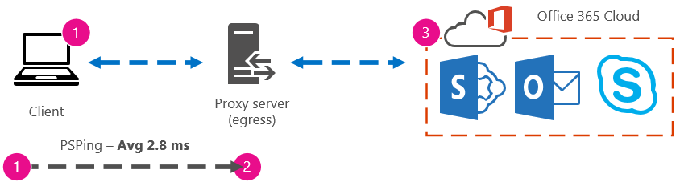

# 초기 계획 및 성능 기록을 사용하여 Office 365 성능 조정Office 365 performance tuning using baselines and performance history

Office 365와 비즈니스 간의 연결 성능을 확인 하는 몇 가지 간단한 방법은 연결의 대략적인 기준선을 설정 하는 데 사용할 수 있습니다.There are some simple ways to check the connection performance between Office 365 and your business that will let you establish a rough baseline of your connectivity. 클라이언트 컴퓨터 연결의 성능 기록을 알면 초기에 문제를 검색 하 고 문제를 예측 하는 데 도움이 될 수 있습니다.Knowing the performance history of your client computer connections can help you detect emerging issues early, identify, and predict problems.
  
성능 문제를 해결 하는 데 사용 되지 않는 경우이 문서는 어떤 문제를 보고 하 고 있는지 확인 하는 것과 같은 일반적인 질문을 고려 하는 것이 좋습니다 (예: Office 365 서비스 인시던트가 아님).If you're not used to working on performance issues, this article is designed to help you consider some common questions, like How do you know the problem you're seeing is a performance issue and not an Office 365 service incident? 적절 한 성능을 계획 하는 방법은 무엇 인가요?How can you plan for good performance, long term? 성능을 눈으로 지속적으로 유지 하려면 어떻게 해야 합니까?How can you keep an eye on performance? Office 365을 사용 하는 동안 팀 이나 클라이언트의 성능이 저하 되는 경우 이러한 질문에 대해 자세히 궁금 합니다.If your team or clients are seeing slow performance while using Office 365, and you wonder about any of these questions, read on.
  
> [!IMPORTANT]
> **현재 클라이언트와 Office 365 간에 성능 문제가 있나요?****Have a performance issue between your client and Office 365 right now?** [Office 365에 대 한 성능 문제 해결 계획](performance-troubleshooting-plan.md)에 설명 된 단계를 수행 합니다.Follow the steps outlined in the [Performance troubleshooting plan for Office 365](performance-troubleshooting-plan.md). 
    
## Office 365 성능에 대해 알아야 할 사항Something you should know about Office 365 performance

Office 365는 자동화 뿐 아니라 실제 사용자가 지속적으로 모니터링 하는 고용량 전용 Microsoft 네트워크 내에 살고 있습니다.Office 365 lives inside a high-capacity, dedicated Microsoft network that is steadily monitored not just by automation, but by real people. Office 365 클라우드를 유지 관리 하는 역할의 일부분에는 성능 조정 및 가능한 위치에서의 개발이 가능 합니다.Part of the role of maintaining the Office 365 cloud is building-in performance tuning and streamlining where it's possible. Office 365 클라우드의 클라이언트는 인터넷을 통해 연결 해야 하므로 Office 365 서비스 간의 성능도 미세 조정 하는 데에도 지속적인 노력이 제공 됩니다.Since clients of the Office 365 cloud have to connect across the Internet, there is a continuous effort to fine-tune the performance across Office 365 services too. 성능 향상은 클라우드에서 실제로 중지 되지 않으며, 클라우드를 정상 및 빠르게 유지 하는 데 많은 경험이 있습니다.Performance improvements never really stop in the cloud, and there is a lot of accumulated experience with keeping the cloud healthy and quick. 위치에서 Office 365로 연결 되는 성능 문제가 발생 하는 경우, 지원 사례를 처음부터 시작 하 여 대기 하는 것이 가장 좋습니다.Should you experience a performance issue connecting from your location to Office 365, it's best not to start with, and wait on, a Support case. 대신 ' 내부 끄기 '에서 문제 조사를 시작 해야 합니다.Instead, you should begin investigating the problem from 'the inside out'. 즉, 네트워크 내부를 시작 하 고 Office 365에서 작업을 수행 하는 방법을 알아봅니다.That is, start inside of your network, and work your way out to Office 365. Office 365을 지 원하는 사례를 열기 전에 데이터를 수집 하 고 문제를 해결 하는 데 도움이 되는 작업을 수행할 수 있습니다.Before you open a case with Office 365 Support, you can gather data and take actions that will explore, and may resolve, your problem.
  
> [!IMPORTANT]
> Office 365의 용량 계획 및 제한 사항에 대해 숙지 해야 합니다.Be aware of capacity planning and limits in Office 365. 이 정보는 성능 문제를 해결 하려고 할 때 곡선의 앞에 놓이게 됩니다.That information will put you ahead of the curve when trying to resolve a performance issue. 다음은 [Microsoft 365 및 Office 365 서비스 설명](https://docs.microsoft.com/office365/servicedescriptions/office-365-service-descriptions-technet-library)에 대 한 링크입니다.Here's a link to the [Microsoft 365 and Office 365 service descriptions](https://docs.microsoft.com/office365/servicedescriptions/office-365-service-descriptions-technet-library). 이는 중앙 허브이 고, Office 365에서 제공 하는 모든 서비스에 대 한 링크는 여기에서 자체 서비스 설명으로 전달 됩니다.This is a central hub, and all the services offered by Office 365 have a link that goes to their own Service Descriptions from here. 즉, sharepoint online [서비스 설명을](https://technet.microsoft.com/library/sharepoint-online-service-description.aspx) 클릭 하 고 Sharepoint online [제한 섹션](https://go.microsoft.com/fwlink/p/?LinkID=856113)을 검색 하는 것과 같은 사용자에 대 한 표준 제한 사항을 확인 해야 합니다.That means, should you need to see the standard limits for SharePoint Online, for example, you would click [SharePoint Online Service Description](https://technet.microsoft.com/library/sharepoint-online-service-description.aspx) and locate its [SharePoint Online Limits section](https://go.microsoft.com/fwlink/p/?LinkID=856113). 
  
문제를 해결 하려면 성능이 슬라이딩 확장 이라는 점을 이해 해야 하며, idealized 값을 획득 하 고 영구적으로 유지 관리 하는 것이 아니라, 이러한 경우에는 많은 수의 사용자를 다시 탑재 하거나 대규모 데이터 마이그레이션을 수행 하는 것과 같은 높은 대역폭 작업을 실행 하는 것이 매우 stressful, 따라서 성능에 미치는 영향을 계획 하는 것이 좋습니다.Make sure you go into your troubleshooting with the understanding that performance is a sliding scale, it's not about achieving an idealized value and maintaining it permanently (if you believe this is so, then occasional high-bandwidth tasks like on-boarding a large number of users, or doing large data migrations will be very stressful -- so do plan for performance impacts then). 성능 목표를 대략적으로 파악 해야 하지만 많은 변수가 성능에 맞게 작동 하기 때문에 성능이 달라 집니다.You can, and should, have a rough idea of your performance targets, but a lot of variables play into performance, therefore, performance varies. 이는 성능에 대 한 특성입니다.That's the nature of performance. 
  
성능 문제 해결에서는 특정 목표를 충족 하지 않고 해당 숫자를 무기한 유지 관리 하는 것이 아니라 모든 변수가 제공 되는 기존 작업을 개선 하는 것입니다.Performance troubleshooting isn't about meeting specific goals and maintaining those numbers indefinitely, it's about improving existing activities, given all the variables. 
  
## 성능 문제가 어떤 모습 인가요?Okay, what does a performance problem look like?

먼저 발생 하는 작업은 실제로 서비스 인시던트가 아니라 성능 문제 인지 확인 해야 합니다.First, you need to make sure that what you are experiencing is indeed a performance issue and not a service incident. 성능 문제는 Office 365의 서비스 문제와는 다릅니다.A performance problem is different from a service incident in Office 365. 서로 구별 하는 방법은 다음과 같습니다.Here's how to tell them apart.
  
Office 365 서비스에 문제가 있는 경우 해당 문제는 서비스 인시던트입니다.If the Office 365 service is having issues, that's a service incident. Microsoft 365 관리 센터의 **현재 상태** 에 빨간색 또는 노란색 아이콘이 표시 되며, Office 365에 연결 하는 클라이언트 컴퓨터의 성능도 저하 될 수도 있습니다.You will see red or yellow icons under **Current health** in the Microsoft 365 admin center, you may also notice slow performance on client computers connecting to Office 365. 예를 들어 현재 상태가 빨간색 아이콘과 Exchange 옆의 **조사** 를 볼 수 있는 경우 exchange Online을 사용 하는 클라이언트 사서함이 잘못 수행 되는 경우 조직의 여러 사용자가 전화를 받을 수도 있습니다.For example, if Current health reports a red icon and you see **Investigating** beside Exchange, you might then also receive a bunch of calls from people in your organization who complain that client mailboxes that use Exchange Online are performing badly. 이 경우 Exchange Online 성능이 서비스 내에서 문제가 발생 한 것으로 가정 하는 것이 합리적입니다.In that case, it's reasonable to assume that your Exchange Online performance just became a victim of issues within the Service. 
  

  
이 시점에서 Office 365 admin은 **현재 상태** 를 확인 한 다음, 시스템에서 수행 하는 유지 관리 작업을 최신 상태로 유지 하기 위해 **자세한 내용과 기록을**자주 확인 해야 합니다.At this point, you, the Office 365 admin, should check **Current health** and then **View details and history**, frequently, to keep up to date on maintenance we perform on the system. **현재 상태** 대시보드는 서비스에 대 한 변경 내용 및 문제 해결을 위해 업데이트 되었습니다.The **Current health** dashboard was made to update you about changes to, and problems in, the service. 상태 기록, 관리자 관리자에 게 기록 되는 메모 및 설명은 영향을 측정 하 고 진행 중인 작업에 대 한 게시를 유지 하는 데 도움이 됩니다.The notes and explanations written to health history, admin to admin, are there to help you gauge your impact, and to keep you posted about ongoing work. 
  

  
문제는 성능 저하의 원인이 될 수 있지만 성능 문제는 서비스 인시던트가 아닙니다.A performance issue isn't a service incident, even though incidents can cause slow performance. 성능 문제는 다음과 같습니다.A performance issue looks like this:
  
- 관리 센터의 **현재 상태** 에서 서비스를 보고 하는 기능에 관계 없이 성능 문제가 발생 합니다.A performance issue occurs no matter what the admin center **Current health** is reporting for the service. 
    
-  비교적 원활한 작업을 수행 하는 데는 시간이 오래 걸리고 완료 되지 않습니다.A behavior that used to be relatively seamless takes a long time to complete or never completes. 
    
- 문제를 복제 하거나, 최소한 일련의 단계를 수행 하는 경우에는이 문제가 발생 하는 것을 알 수 있습니다.You can replicate the problem too, or, at least, you know it will happen if you do the right series of steps.
    
-  문제가 간헐적으로 발생 하는 경우에는 여전히 패턴 (예: 10:00이 있음)은 Office 365에 안정적으로 액세스할 수 없는 사용자 로부터 전화를 걸고 전화를 건 후에 통화가 중단 되는 것을 알 수 있습니다.If the problem is intermittent, there is still a pattern, for example, you know that by 10:00 AM you will have calls from users who can't reliably access Office 365, and that the calls will die down around noon. 
    
이로 인해 익숙한 것 처럼 느껴질 수 있습니다. 너무 많이 사용해 서는 안 됩니다.This probably sounds familiar; maybe too familiar. 성능 문제가 확인 되 면 해당 질문은 "다음 작업을 수행 하 시겠습니까?"가 됩니다.Once you know it's a performance problem, the question becomes, "What do you do next?" 이 문서의 나머지 부분에서는이를 정확히 결정 하는 데 도움이 됩니다.The rest of this article helps you determine exactly that.
  
## 성능 문제를 정의 하 고 테스트 하는 방법How to define and test the performance problem

성능 문제는 시간에 따라 종종 발생 하므로 실제 문제를 정의 하기가 어려울 수 있습니다.Performance issues often emerge over time, so it can be challenging to define the actual problem. 적절 한 문제 명세를 만들고 문제 컨텍스트를 파악 한 다음에는 하루 종일 승리 하도록 단계를 반복 해 서 테스트 해야 합니다.You need to create a good problem statement and a good idea of issue context, and then you need to repeatable testing steps to win the day. 그렇지 않은 경우에는 오류가 발생 하지 않고 손실 될 수 있습니다.Otherwise, through no fault of your own, you may be lost. 다음과 같은 이유 때문입니다.Why? 여기에는 충분 한 정보를 제공 하지 않는 문제 문의 몇 가지 예가 나와 있습니다.Well, here are some examples of problems statements that don't provide enough information:
  
- 받은 편지함에서 내가 알지 못하는 것으로 전환 하는 것은 이제 휴식입니다.Switching from my Inbox to my Calendar used to be something I didn't notice, and now it's a coffee-break. 이 기능을 사용 하는 것과 동일 하 게 작동할 수 있습니까?Can you make it act like it used to?
    
- SharePoint Online에 파일을 업로드 하는 것은 계속 해 서 수행 하는 것입니다.Uploading my files to SharePoint Online is taking forever. 오후에는 시간이 오래 걸릴 수 있지만 그 외에는 속도가 빠르지 않습니까?Why is it slow in the afternoon, but any other time, it's fast? 이 작업을 빠르게 수행할 수 없습니까?Can't it just be fast?
    
위의 문제 문으로 인해 몇 가지 큰 문제가 발생 합니다.There are several large challenges posed by the problem statements above. 특히, 처리할 모호성이 많이 있습니다.Specifically, there are a lot of ambiguities to deal with. 예를 들어:for example:
  
- 랩톱에서 작동 하는 데 사용 되는 받은 편지함과 일정 간을 전환 하는 방법은 명확 합니다.It's unclear how switching between Inbox and Calendar used to act on the laptop.
    
- 사용자에 게 "빠르게" 할 수는 없지만 "빠른" 것은 무엇 인가요?When the user says, "Can't it just be fast", what's "fast"?
    
- 시간이 "영구적" 입니까?How long is "forever"? 몇 초 또는 몇 초가 든, 시간이 경과 하거나 사용자가 점심 시간으로 이동 하 여 사용자가 돌아온 후 10 분까지 완료 됩니까?Is that several seconds, or minutes, or could the user go to lunch and it would finish up ten minutes after the user got back?
    
이러한 모든 기능은 관리자 및 문제 해결사가 다음과 같은 문제 설명에서 다양 한 세부 정보를 파악할 수 없음을 고려 하지 않습니다.All of this is without considering that the admin and troubleshooter can't be aware of many details from problem statements like these. 예를 들어 문제가 시작 되 면 사용자가 집에서 작업 하 고 홈 네트워크를 진행 하는 동안에만 느린 전환을 볼 수 있습니다. 사용자가 로컬 클라이언트에서 여러 가지 RAM 집약적 응용 프로그램을 실행 해야 하거나, 사용자가 이전 운영 체제를 실행 하 고 있거나 최근 업데이트를 실행 하지 않은 경우For example, when the problem started happening; That the user works from home and only ever sees slow switching while on a home network; That the user must run several other RAM intensive applications on the local client, or the user is running an older operating system or hasn't run recent updates.
  
사용자가 성능 문제를 보고 하는 경우 수집할 정보가 많이 있습니다.When users report a performance problem, there's a lot of information to collect. 이 정보를 수집 하는 프로세스의 일환으로, 문제를 범위 지정 하거나 조사 합니다.Collecting this information is part of a process called scoping the issue, or investigating it. 다음은 성능 문제에 대 한 정보를 수집 하는 데 사용할 수 있는 기본 범위 지정 목록입니다.The following is a basic scoping list you can use to collect information about your performance issue. 이 목록은 포괄적이 아니지만 다음 중 하나를 시작 하는 것입니다.This list is not exhaustive, but it's a place to start one of your own: 
  
- 문제가 발생 한 날짜와 하루 또는 야간 시간에 대 한 해결 방법On what date did the issue happen, and around what time of day or night?
    
- 사용 하는 클라이언트 컴퓨터의 종류 및 회사 네트워크 (VPN, 유선, 무선)에 연결 하는 방법What kind of client computer were you using, and how does it connect to the business network (VPN, Wired, Wireless)?
    
- 원격으로 작업 중이거나 사용자가 사무실에 있었습니까?Were you working remotely or were you in the office?
    
- 다른 컴퓨터에서 같은 작업을 수행 하 고 동일한 동작을 확인 했습니까?Did you try the same actions on another computer and see the same behavior?
    
- 수행 하는 작업을 작성할 수 있도록 문제를 제공 하는 단계를 안내 합니다.Walk through the steps that are giving you the trouble so that you can write the actions you take down.
    
- 속도가 몇 초 또는 몇 분 입니까?How slow in seconds or minutes is the performance?
    
- 세상에 거주 하는 곳은 어디에 있나요?Where in the world are you located?
    
일부 질문은 다른 방법 보다 더 명백 합니다.Some of these questions are more obvious than others. 대부분의 사용자는 문제 해결사를 이해 하기 위한 정확한 단계가 필요 합니다.Most everyone will understand a troubleshooter needs the exact steps to reproduce the issue. 어떤 경우에 잘못 된 문제를 기록 하 고, 문제가 해결 되었는지 어떻게 테스트할 수 있나요?After all, how else can you record what's wrong, and how else can you test if the issue is fixed? "이 문제가 발생 하는 날짜 및 시간" 및 "전 세계 위치" 및 함께 사용할 수 있는 정보를 파악 하는 것이 더 명백 합니다.Less obvious are things like "What date and time did you see the issue?", and "Where in the world are you located?", information that can be used in tandem. 사용자가 작업 했을 때의 시간 차이에 따라 유지 관리가 회사 네트워크의 일부에서 이미 진행 되 고 있다는 것을 의미할 수 있습니다.Depending on when the user was working, a few hours of time difference may mean maintenance is already underway on parts of your company's network. 예를 들어 회사에서 SharePoint Online과 온-프레미스 SharePoint Server 2013 인스턴스에 모두 검색 인덱스를 쿼리할 수 있는 하이브리드 SharePoint 검색과 같은 하이브리드 구현이 있는 경우 온-프레미스 팜에서 업데이트가 진행 중일 수 있습니다.If, for example, your company has a hybrid implementation, like a hybrid SharePoint Search, which can query search indexes in both SharePoint Online and an On-premises SharePoint Server 2013 instance, updates may be underway in the on-premises farm. 회사가 모두 클라우드에서 사용 되는 경우 시스템 유지 관리에는 네트워크 하드웨어 추가 또는 제거, 회사 전체에서 업데이트 롤링 또는 DNS 또는 기타 핵심 인프라에 대 한 변경 작업 등이 포함 될 수 있습니다.If your company is all in the cloud, system maintenance may include adding or removing network hardware, rolling out updates that are company-wide, or making changes to DNS, or other core infrastructure.
  
성능 문제를 해결 하는 경우이는 범죄와 마찬가지로, 증거에서 모든 결론을 observant 정확 하 고 명확 해야 합니다.When you're troubleshooting a performance problem, it's a bit like a crime scene, you need to be precise and observant to draw any conclusions from the evidence. 이렇게 하려면 증거를 수집 하 여 좋은 문제 설명을 얻어야 합니다.In order to do this, you must get a good problem statement by gathering evidence. 여기에는 컴퓨터의 컨텍스트, 사용자의 컨텍스트, 문제가 시작 된 시기 및 성능 문제를 제공 하는 정확한 단계가 포함 되어야 합니다.It should include the computer's context, the user's context, when the problem began, and the exact steps that exposed the performance issue. 이 문제 설명은 다음에는 노트의 맨 위 페이지를 유지 해야 합니다.This problem statement should be, and stay, the topmost page in your notes. 해결 방법을 수행한 후에 문제 설명을 다시 확인 하면 수행한 작업을 테스트 하 고 문제를 해결 했는지 여부를 증명 하는 단계를 수행 하 게 됩니다.By walking through the problem statement again after you work on the resolution, you are taking the steps to test and prove whether the actions you take have resolved the issue. 이는 작업을 수행 하는 시기를 파악 하는 데 매우 중요 합니다.This is critical to knowing when your work, there, is done.
  
## 성능이 적절 한 시점을 확인 하는 데 얼마나 사용 되는지 알고 있습니까?Do you know how performance used to look when it was good?

Unlucky 라면 아무도 알 수 없습니다.If you're unlucky, nobody knows. 숫자를 아무도 갖고 있지 않습니다.Nobody had numbers. 즉, 아무도 Office 365에서 받은 편지함을 표시 하는 데 소요 된 시간 (초)을 확인 하는 간단한 질문에 답할 수 있으며, "임원에는 어떤 일이 발생 했습니까?"와 같이 대부분의 회사에서는 일반적인 시나리오입니다.That means nobody can answer the simple question "About how many seconds did it used to take to bring up an Inbox in Office 365?", or "How long did it used to take when the Executives had a Lync Online meeting?", which is a common scenario for many companies.
  
여기에서 누락 된 작업은 성능 기준입니다.What's missing here is a performance baseline.
  
기준 사용자의 성과에 맞는 컨텍스트를 제공 합니다.Baselines give you a context for your performance. 회사의 요구 사항에 따라 가끔씩 초기 계획을 자주 사용 해야 합니다.You should take a baseline occasionally to frequently, depending on the needs of your company. 회사 규모가 큰 경우 운영 팀에서 온-프레미스 환경에 대 한 초기 계획을 이미 사용 하 고 있을 수 있습니다.If you are a larger company, your Operations team may take baselines for your on-premises environment already. 예를 들어 모든 Exchange 서버를 해당 월의 첫 번째 월요일과 세 번째 월요일에 모든 SharePoint 서버를 패치 하는 경우 운영 팀은 중요 한 기능이 작동 하는지 증명 하기 위해 사후 패치가 실행 되는 작업 및 시나리오 목록을 갖고 있을 것입니다.For example, if you patch all the Exchange servers on the first Monday of the month, and all your SharePoint servers on the third Monday, your Operations team probably has a list of tasks and scenarios it runs post-patching, to prove that critical functions are operational. 예를 들어 받은 편지함을 열고 보내기/받기를 클릭 한 후 폴더가 업데이트 되는지 확인 하 고, SharePoint에서 사이트의 기본 페이지를 찾아보고 엔터프라이즈 검색 페이지로 이동 하 여 결과를 반환 하는 검색을 수행 합니다.For example, opening the Inbox, clicking Send/Receive, and making sure the folders update, or, in SharePoint, browsing the main page of the site, going into the enterprise Search page, and doing a search that returns results.
  
응용 프로그램이 Office 365에 있는 경우 가장 기본적인 초기 계획 중 일부는 네트워크 내부의 클라이언트 컴퓨터에서 송신 지점으로 또는 네트워크를 떠나 Office 365로 이동 하는 지점까지 시간 (밀리초)을 측정 하는 데 사용할 수 있습니다.If your applications are in Office 365, some of the most fundamental baselines you can take measure the time (in milliseconds) from a client computer inside your network, to an egress point, or the point where you leave your network and go out to Office 365. 다음은 조사 및 기록할 수 있는 몇 가지 유용한 초기 계획입니다.Here are some helpful baselines that you can investigate and record:
  
- 클라이언트 컴퓨터와 egress 지점 사이의 장치 (예: 프록시 서버)를 확인 합니다.Identify the devices between your client computer and your egress point, for example, your proxy server.
    
  - 발생 하는 성능 문제에 대 한 컨텍스트 (IP 주소, 장치 유형, et cetera)가 포함 되도록 장치를 알고 있어야 합니다.You need to know your devices so that you have context (IP addresses, type of device, et cetera) for performance problems that arise.
    
  - 프록시 서버는 일반적인 송신 지점 이므로 웹 브라우저에서 사용 하도록 설정 된 프록시 서버 (있는 경우)를 확인할 수 있습니다.Proxy servers are common egress points, so you can check your web browser to see what proxy server it is set to use, if any.
    
  - 네트워크를 검색 하 고 매핑할 수 있는 타사 도구가 있지만 장치를 확인 하는 가장 안전한 방법은 네트워크 팀 구성원에 게 요청 하는 것입니다.There are third party tools that can discover and map your network, but the safest way to know your devices is to ask a member of your network team.
    
- ISP (인터넷 서비스 공급자)를 식별 하 고, 해당 연락처 정보를 기록 하 고, 보유 한 대역폭의 회로 수를 확인 합니다.Identify your Internet service provider (ISP), write down their contact information, and ask how many circuits how much bandwidth you have.
    
- 회사 내부에서 클라이언트와 egress 지점 사이의 장치에 대 한 리소스를 식별 하거나, 비상 연락망을 식별 하 여 네트워킹 문제에 대해 설명 합니다.Inside your company, identify resources for the devices between your client and the egress point, or identify an emergency contact to talk to about networking issues.
    
다음은 도구를 사용한 간단한 테스트를 통해 계산할 수 있는 몇 가지 초기 계획입니다.Here are some baselines that simple testing with tools can calculate for you:
  
- 클라이언트 컴퓨터에서 송신 지점 까지의 시간 (밀리초)Time from your client computer to your egress point in milliseconds
    
- 송신 지점에서 Office 365 까지의 시간 (밀리초)Time from your egress point to Office 365 in milliseconds
    
- 검색할 때 Office 365의 URL을 확인 하는 서버 세계의 위치Location in the world of the server that resolves the URLS for Office 365 when you browse
    
- ISP의 DNS 확인 속도 (밀리초), 패킷 도착 (네트워크 지터)의 불일치, 업로드 및 다운로드 시간 (밀리초)The speed of your ISP's DNS resolution in milliseconds, inconsistencies in packet arrival (network jitter), upload and download times in milliseconds
    
이러한 단계를 수행 하는 방법에 익숙하지 않은 경우이 문서에서 보다 자세히 설명 하겠습니다.If you're unfamiliar with how to carry out these steps, we'll go into more detail in this article. 
  
## 초기 계획What is a baseline?

문제가 발생할 경우 미치는 영향을 알 수 있지만, 실제 성능 데이터를 모르는 경우에는 잘못 된 상황 및 시기에 대 한 컨텍스트를 가질 수 없습니다.You'll know the impact when it goes bad, but if you don't know your historical performance data, it's not possible to have a context for how bad it may have become, and when. 따라서 초기 계획을 제외 하 고는 퍼즐을 해결 하기 위한 주요 단서가 누락 되었습니다.So without a baseline, you're missing the key clue to solve the puzzle: the picture on the puzzle box. 성능 문제 해결에서는 *비교* 지점이 필요 합니다.In performance troubleshooting, you need a point of  *comparison*  . 간단한 성능 기준선을 사용 하는 것은 어렵지 않습니다.Simple performance baselines aren't difficult to take. 운영 팀은 일정에 따라 이러한 작업을 수행 하는 일을 담당할 수 있습니다.Your Operations team can be tasked with carrying these out on a schedule. 예를 들어 다음과 같이 연결을 가정해 보겠습니다.For example, let's say your connection looks like this: 
  

  
즉, 네트워크 팀에서 프록시 서버를 통해 인터넷을 사용 하는 것을 확인 했으며,이 프록시는 클라이언트 컴퓨터에서 클라우드로 보내는 모든 요청을 처리 합니다.That means you've checked with your network team and found out that you leave your company for the Internet through a proxy server, and that proxy handles all the requests your client computer sends to the cloud. 이 경우 모든 중간 장치를 나열 하는 간단한 버전의 연결을 그려야 합니다.In this case, you should draw a simplified version of your connection that lists all the intervening devices. 이제 클라이언트, 송신 지점 (인터넷에 대 한 네트워크에서 나갈 위치) 및 Office 365 클라우드 간의 성능을 테스트 하는 데 사용할 수 있는 도구를 삽입 합니다.Now, insert tools that you can use to test the performance between the client, the egress point (where you leave your network for the Internet), and the Office 365 cloud.
  

  
이러한 옵션은 성능 데이터를 찾는 데 필요한 전문 지식의 양으로 인해 **단순** 하 고 **고급** 으로 나열 됩니다.The options are listed as **Simple** and **Advanced** because of the amount of expertise you need in order to find the performance data. 네트워크 추적은 PsPing 및 TraceTCP와 같은 명령줄 도구를 실행 하는 것과 비교 하 여 시간이 많이 소요 됩니다.A network trace will take a lot of time, compared to running command-line tools like PsPing and TraceTCP. 이러한 두 명령줄 도구는 ICMP 패킷을 사용 하지 않기 때문에, 즉 Office 365에서 차단 되며 클라이언트 컴퓨터 또는 프록시 서버 (액세스 권한이 있는 경우)를 유지 하 고 Office 365에 도착 하는 데 걸리는 시간 (밀리초)을 제공 하기 때문에 선택 했습니다.These two command-line tools were chosen because they don't use ICMP packets, which will be blocked by Office 365, and because they give the time in milliseconds that it takes to leave the client computer, or proxy server (if you have access) and arrive at Office 365. 한 컴퓨터에서 다른 컴퓨터로의 개별 홉 마다 시간 값이 사용 되며, 초기 계획에도 유용 합니다.Each individual hop from one computer to another will end up with a time value, and that's great for baselines! 이러한 명령줄 도구를 사용 하면 명령에 포트 번호를 추가할 수 있으며,이는 Office 365이 보안 소켓 계층 및 전송 계층 보안 (SSL 및 TLS)에서 사용 하는 포트인 포트 443를 통해 통신 하기 때문에 유용 합니다.Just as importantly, these command-line tools allow you to add a port number onto the command, this is useful because Office 365 communicates over port 443, which is the port used by Secure Sockets Layer and Transport Layer Security (SSL and TLS). 그러나 다른 타사 도구를 사용 하는 것이 더 나은 솔루션입니다.However, other third-party tools may be better solutions for your situation. Microsoft는 이러한 도구를 모두 지원 하지 않으므로 어떤 이유로 PsPing 및 TraceTCP 작업을 수행할 수 없는 경우 Netmon과 같은 도구로 네트워크 추적으로 이동 합니다.Microsoft doesn't support all of these tools, so if, for some reason, you can't get PsPing and TraceTCP working, move on to a network trace with a tool like Netmon. 
  
업무 시간 전에 초기 계획을 사용 하 고, 사용량이 많은 시간 후에 다시 사용할 수 있습니다.You can take a baseline before business hours, again during heavy use, and then again after hours. 즉, 끝에 다음과 같은 비트를 보이는 폴더 구조가 있을 수 있습니다.This means you may have a folder structure that looks a bit like this in the end:
  

  
또한 파일에 대 한 명명 규칙을 선택 해야 합니다.You should also pick a naming convention your files. 그 예는 다음과 같습니다.Here are some examples:
  
- Feb_09_2015_9amPST_PerfBaseline_Netmon_ClientToEgress_NormalFeb_09_2015_9amPST_PerfBaseline_Netmon_ClientToEgress_Normal
    
- Jan_10_2015_3pmCST_PerfBaseline_PsPing_ClientToO365_bypassProxy_SLOWJan_10_2015_3pmCST_PerfBaseline_PsPing_ClientToO365_bypassProxy_SLOW
    
- Feb_08_2015_2pmEST_PerfBaseline_BADPerfFeb_08_2015_2pmEST_PerfBaseline_BADPerf
    
- Feb_08_2015_8-30amEST_PerfBaseline_GoodPerfFeb_08_2015_8-30amEST_PerfBaseline_GoodPerf
    
이 작업을 수행 하는 방법에는 여러 가지가 있지만이 형식은 사용 하는 **\<dateTime\>\<what's happening in the test\>** 것이 좋습니다.There are lots of different ways to do this, but using the format **\<dateTime\>\<what's happening in the test\>** is a good place to start. 이에 대 한 유심히 나중에 문제를 해결 하려고 할 때 많은 도움이 될 것입니다.Being diligent about this will help a lot when you are trying to troubleshoot issues later. 나중에 "2 월에 두 개의 추적을 했으며, 그 중에는 좋은 성능을 보여 주었습니다.Later, you'll be able to say "I took two traces on February 8th, one showed good performance and one showed bad, so we can compare them". 이 기능은 문제 해결에 매우 유용 합니다.This is extremely helpful for troubleshooting. 
  
이전 계획 기준을 유지 하려면 체계적인 방법을 구성 해야 합니다.You need to have an organized way to keep your historical baselines. 이 예에서 간단한 방법은 세 개의 명령줄 출력을 생성 했으며 결과가 스크린샷으로 수집 되었지만 대신 네트워크 캡처 파일이 있을 수 있습니다.In this example, the simple methods produced three command line outputs and the results were collected as screen shots, but you may have network capture files instead. 가장 적합 한 방법을 사용 합니다.Use the method that works best for you. 이전 기준을 저장 하 고 온라인 서비스 동작이 변경 되는 시점에서이를 참조 합니다.Store your historical baselines and refer to them at points where you notice changes in the behavior of online services. 
  
## 파일럿 중에 성능 데이터를 수집 하는 이유Why collect performance data during a pilot?

Office 365 서비스의 파일럿에서 보다 초기 계획을 시작 하는 데 걸리는 시간은 더 이상 없습니다.There is no better time to start making baselines than during a pilot of the Office 365 service. Office에는 수천 명의 사용자가 있거나, 수십만 개까지 있거나, 5 개가 있을 수 있지만, 사용자 수가 적은 경우에도 테스트를 수행 하 여 성능 변화를 측정할 수 있습니다.Your office may have thousands of users, hundreds of thousands, or it may have five, but even with a small number of users, you can perform tests to measure fluctuations in performance. 대규모 회사의 경우 Office 365을 몇 명의 사용자에 게 파일럿 할 수 있는 대표적인 샘플은 여러 수천 명에 게 프로젝션 하 여 문제가 발생 하기 전까지 발생할 수 있는 문제를 파악 하 게 됩니다.In the case of a large company, a representative sample of several hundred users piloting Office 365 can be projected outward to several thousands so you know where issues might arise before they happen.
  
소규모 회사의 경우에는 모든 사용자가 동시에 서비스로 이동 하 고 파일럿이 제공 되지 않는 경우에는 성능 측정을 사용 하 여 작업을 잘못 수행 해야 하는 사용자에 게 표시할 데이터를 유지 해야 합니다.In the case of a small company, where on-boarding means that all users go to the service at the same time and there is no pilot, keep performance measures so that you have data to show to anyone who may have to troubleshoot a badly performing operation. 예를 들어 중간 규모의 그래픽을 아주 빠르게 업로드 하는 데 소요 되는 시간에 모든 갑작스러운이 건물을 탐색할 수 있습니다.For example, if you notice that all of a sudden you can walk around your building in the time it takes to upload a medium-sized graphic where it used to happen very quickly.
  
## 초기 계획을 수집 하는 방법How to collect baselines

모든 문제 해결 계획에 대해 최소한 다음 항목을 파악 해야 합니다.For all troubleshooting plans you need to identify these things at a minimum:
  
- 사용 중인 클라이언트 컴퓨터 (컴퓨터 또는 장치 유형, IP 주소, 문제를 일으킨 작업)The client computer you're using (the type of computer or device, an IP address, and the actions that caused the issue)
    
- 클라이언트 컴퓨터가 세계에 있는 위치 (예: 네트워크에 대 한 VPN에서이 사용자가 원격으로 또는 회사 인트라넷에서 작업 하 고 있는지 여부)Where the client computer is located in the world (for example, whether this user on a VPN to the network, working remotely, or on the company intranet)
    
- 네트워크에서 클라이언트 컴퓨터가 사용 하는 송신 지점 (ISP 또는 인터넷을 위해 트래픽이 회사에서 나간 지점)The egress point the client computer uses from your network (the point at which traffic leaves your business for an ISP or the Internet)
    
 네트워크 관리자 로부터 네트워크 레이아웃을 확인할 수 있습니다.You can find out the layout of your network from the network administrator. 소규모 네트워크에 있는 경우 인터넷에 연결 된 장치를 살펴보고 해당 레이아웃에 대 한 질문이 있는 경우 ISP에 전화를 걸어 보세요.If you're on a small network, take a look at the devices connecting you to the Internet, and call your ISP if you have questions about the layout. 참조의 최종 레이아웃에 대 한 그래픽을 만듭니다.Create a graphic of the final layout for your reference. 
  
이 섹션은 간단한 명령줄 도구와 방법 및 고급 도구 옵션으로 구분 됩니다.This section is broken into simple command-line tools and methods, and more advanced tools options. 먼저 간단한 방법을 살펴보겠습니다.We'll cover simple methods first. 그러나 지금 성능 문제가 발생 한 경우에는 고급 방법으로 이동 하 여 샘플 성능-문제 해결 작업 계획을 테스트해 보는 것이 좋습니다.But if you've got a performance problem right now, you should jump to advanced methods and try out the sample performance-troubleshooting action plan.
  
### 간단한 메서드Simple methods

이러한 간단한 방법은 Office 365 성능에 대 한 정보를 확인할 수 있도록 시간에 따른 간단한 성능 기준을 수행 하 고 이해 하 고 적절히 저장 하는 방법을 설명 하기 위한 것입니다.The objective of these simple methods is to learn to take, understand, and properly store simple performance baselines over time so that you are informed about Office 365 performance. 다음은 앞에서 설명한 것 처럼 간단한 다이어그램입니다.Here's the very simple diagram for simple, as you've seen before:
  

  
> [!NOTE]
> TraceTCP는 요청이 처리 되는 데 걸리는 시간, 밀리초, 네트워크 홉 수 또는 한 컴퓨터에서 다음 컴퓨터로의 연결, 즉 요청이 대상에 도달 하는 데 걸리는 시간을 표시 하는 데 유용한 도구 이기 때문에이 스크린샷에 포함 되어 있습니다.TraceTCP is included in this screen shot because it's a useful tool for showing, in milliseconds, how long a request takes to process, and how many network hops, or connections from one computer to the next, that the request takes to reach a destination. 또한 TraceTCP에서는 홉 중에 사용 되는 서버의 이름도 제공할 수 있으며, 지원에서 Microsoft Office 365 문제 해결사에 유용할 수 있습니다.TraceTCP can also give the names of servers used during hops, which can be useful to a Microsoft Office 365 troubleshooter in Support. > TraceTCP 명령은 다음과 같이 매우 간단할 수 있는데, > `tracetcp.exe outlook.office365.com:443`> 명령에 포트 번호를 포함 해야 합니다.> TraceTCP commands can be very simple, such as: >  `tracetcp.exe outlook.office365.com:443`> Remember to include the port number in the command! > [TraceTCP](https://simulatedsimian.github.io/tracetcp_download.html) 은 무료로 다운로드할 수 있지만 wincap에 의존 합니다. > [TraceTCP](https://simulatedsimian.github.io/tracetcp_download.html) is a free download, but relies on Wincap. Wincap는 Netmon 에서도 사용 되 고 설치 되는 도구입니다.Wincap is a tool that is also used and installed by Netmon. 고급 방법 섹션 에서도 Netmon을 사용 합니다.We also use Netmon in the advanced methods section. 
  
 여러 개의 사무실이 있는 경우에는 이러한 각 위치에 있는 클라이언트의 데이터 집합도 유지 해야 합니다.If you have multiple offices, you'll need to keep a set of data from a client in each of those locations as well. 이 테스트에서는 클라이언트에서 Office 365에 대 한 요청을 보내는 시간과 요청에 응답 하는 Office 365 사이의 시간을 설명 하는 숫자 값을 측정 하 여 대기 시간을 계산 합니다.This test measures latency, which, in this case, is a number value that describes the amount of time between a client sending a request to Office 365, and Office 365 responding to the request. 이 테스트는 클라이언트 컴퓨터의 도메인 내에서 시작 되며, 365 인터넷을 통해 네트워크 내부에서 들어오는 왕복을 측정 하는 방법을 확인 합니다.The testing originates inside your domain on a client computer, and looks to measure a round trip from inside your network, out through an egress point, across the Internet to Office 365, and back. 
  
Egress 지점 (이 경우에는 프록시 서버)을 처리 하는 몇 가지 방법이 있습니다.There are a few ways to deal with the egress point, in this case, the proxy server. 1에서 2로, 2에서 3으로 추적 한 다음 숫자를 밀리초 단위로 추가 하 여 네트워크에 대 한 최종 합계를 구할 수 있습니다.You can either trace from 1 to 2 and then 2 to 3, and then add the numbers in milliseconds to get a final total to the edge of your network. 또는 Office 365 주소에 대 한 프록시를 사용 하지 않도록 연결을 구성할 수 있습니다.Or, you can configure the connection to bypass the proxy for Office 365 addresses. 방화벽, 역방향 프록시 또는 두 가지 조합이 포함 된 대규모 네트워크에서는 많은 Url에 대해 트래픽을 허용 하는 프록시 서버에 대해 예외를 수행 해야 할 수 있습니다.In a larger network with a firewall, reverse proxy, or some combination of the two, you may need to make exceptions on the proxy server that will allow traffic to pass for a lot of URLs. Office 365에서 사용 하는 끝점 목록은 [office 365 url 및 IP 주소 범위](https://support.office.com/article/8548a211-3fe7-47cb-abb1-355ea5aa88a2)를 참조 하세요.For the list of endpoints used by Office 365, see [Office 365 URLs and IP address ranges](https://support.office.com/article/8548a211-3fe7-47cb-abb1-355ea5aa88a2). 인증 프록시가 있는 경우 먼저 다음에 대 한 예외를 테스트 합니다.If you have an authenticating proxy, begin by testing exceptions for the following:
  
- 포트 80 및 443Ports 80 and 443
    
- TCP 및 HTTPsTCP and HTTPs
    
- 다음 Url로 아웃 바운드 된 연결:Connections that are outbound to any of these URLs:
    
- \*. microsoftonline.com\*.microsoftonline.com
    
- \*. microsoftonline-p.com\*.microsoftonline-p.com
    
- \*.sharepoint.com\*.sharepoint.com
    
- \*. outlook.com\*.outlook.com
    
- \*. lync.com\*.lync.com
    
- osub.microsoft.comosub.microsoft.com
    
모든 사용자는 프록시 간섭 또는 인증 없이 이러한 주소에 액세스할 수 있어야 합니다.All users need to be allowed to get to these addresses without any proxy interference or authentication. 소규모 네트워크에서는이를 웹 브라우저의 프록시 바이패스 목록에 추가 해야 합니다.On a smaller network, you should add these to your proxy bypass list in your web browser. 
  
Internet Explorer에서 프록시 바이패스 목록에이를 추가 하려면 **도구** \> **인터넷 옵션** \> **연결** \> **LAN 설정** \> **고급**으로 이동 합니다.To add these to your proxy bypass list in Internet Explorer, go to **Tools** \> **Internet Options** \> **Connections** \> **LAN settings** \> **Advanced**. 고급 탭에는 프록시 서버 및 프록시 서버 포트도 나와 있습니다.The advanced tab is also where you will find your proxy server and proxy server port. **사용자 LAN에 프록시 서버 사용**확인란을 클릭 하 여 **고급** 단추에 액세스 해야 할 수 있습니다.You may need to click the checkbox **Use a proxy server for your LAN**, to access the **Advanced** button. **로컬 주소에 대해 프록시 서버 사용 안 함** 이 선택 되어 있는지 확인 하는 것이 좋습니다.You'll want to make sure that **Bypass proxy server for local addresses** is checked. **고급**을 클릭 하면 예외를 입력할 수 있는 텍스트 상자가 표시 됩니다.Once you click **Advanced**, you'll see a text box where you can enter exceptions. 위에 나열 된 와일드 카드 Url을 세미콜론으로 구분 하 여 다음과 같이 합니다.Separate the wildcard URLs listed above with semi-colons, for example:
  
\*. microsoftonline.com; \*. sharepoint.com\*.microsoftonline.com; \*.sharepoint.com
  
프록시를 우회 한 후에는 Office 365 URL에서 ping 또는 PsPing를 직접 사용할 수 있습니다.Once you bypass your proxy, you should be able to use ping or PsPing directly on an Office 365 URL. 다음 단계에서는 ping **outlook.office365.com**를 테스트 합니다.The next step will be to test ping **outlook.office365.com**. 또는 명령에 포트 번호를 제공 하는 데 사용할 수 있는 PsPing 또는 다른 도구를 사용 하는 경우 평균 왕복 시간 (밀리초)을 확인 하기 위해 **portal.microsoftonline.com:443** 에 대 한 동기화를 수행 합니다.Or, if you're using PsPing or another tool that will let you supply a port number to the command, PsPing against **portal.microsoftonline.com:443** to see the average round trip time in milliseconds. 
  
왕복 시간 (RTT)은 HTTP 요청을 outlook.office365.com와 같은 서버로 보내는 데 걸리는 시간을 측정 하 고 서버에서 사용자가 수행한 작업을 확인 하는 응답을 반환 하는 숫자 값입니다.The round trip time, or RTT, is a number value that measures how long it takes to send a HTTP request to a server like outlook.office365.com and get a response back that acknowledges the server knows that you did it. 때로는이 약어를 RTT로 볼 수 있습니다.You'll sometimes see this abbreviated as RTT. 이 값은 비교적 짧은 시간 이어야 합니다.This should be a relatively short amount of time.
  
이 테스트를 수행 하려면 [Psping](https://technet.microsoft.com/sysinternals/jj729731.aspx) 또는 Office 365에서 차단 되는 ICMP 패킷을 사용 하지 않는 다른 도구를 사용 해야 합니다.You have to use [PSPing](https://technet.microsoft.com/sysinternals/jj729731.aspx) or another tool that does not use ICMP packets which are blocked by Office 365 in order to do this test. 
  
 **PsPing을 사용 하 여 Office 365 URL에서 직접 전체 왕복 시간 (밀리초) 가져오기****How to use PsPing to get an overall round trip time in milliseconds directly from an Office 365 URL**
  
1. 다음 단계를 완료 하 여 관리자 권한 명령 프롬프트를 실행 합니다.Run an elevated command prompt by completing these steps:
    
1. **시작**을 클릭합니다.Click **Start**.
    
2. **검색 시작** 상자에 cmd를 입력 하 고 CTRL + SHIFT + enter를 누릅니다.In the **Start Search** box, type cmd, and then press CTRL+SHIFT+ENTER.
    
3. **사용자 계정 컨트롤** 대화 상자가 표시 되 면 표시 되는 동작이 원하는 동작 인지 확인 하 고 **계속**을 클릭 합니다.If the **User Account Control** dialog box appears, confirm that the action it displays is what you want, and then click **Continue**.
    
2. 도구 (이 경우 PsPing)가 설치 된 폴더로 이동 하 여 이러한 Office 365 Url을 테스트 합니다.Navigate to the folder where the tool (in this case PsPing) is installed and test these Office 365 URLs:
    
  - psping portal.office.com:443psping portal.office.com:443
    
  - psping microsoft-my.sharepoint.com:443psping microsoft-my.sharepoint.com:443
    
  - psping outlook.office365.com:443psping outlook.office365.com:443
    
  - psping www.yammer.com:443psping www.yammer.com:443
    
    
  
443의 포트 번호를 포함 해야 합니다.Be sure to include the port number of 443. Office 365는 암호화 된 채널에서 작동 합니다.Remember that Office 365 works on an encrypted channel. 포트 번호 없이 PsPing가 없으면 요청이 실패 합니다.If you PsPing without the port number, your request will fail. 짧은 목록에 대해 ping을 수행한 후 평균 시간 (밀리초)을 확인 합니다.Once you've pinged your short list, look for the Average time in milliseconds (ms). 녹화 하려는 내용이 여기에 해당 됩니다.That is what you want to record!
  

  
프록시 바이패스에 익숙하지 않으며, 단계별로 작업을 수행 하려면 먼저 프록시 서버의 이름을 확인 해야 합니다를 사용할 수 있습니다.If you're not familiar with proxy bypass, and prefer to take things step-by-step, you need to first find out the name of your proxy server. Internet Explorer에서 **도구** \> **인터넷 옵션** \> **연결** \> **LAN 설정** \> **고급**으로 이동 합니다.In Internet Explorer go to **Tools** \> **Internet Options** \> **Connections** \> **LAN settings** \> **Advanced**. **고급** 탭에 프록시 서버가 표시 됩니다.The **Advanced** tab is where you will see your proxy server listed. 이 작업을 완료 하 여 명령 프롬프트에서 프록시 서버에 Ping을 실행 합니다.Ping that proxy server at a command prompt by completing this task: 
  
 **프록시 서버에 대해 ping을 수행 하 고 1 단계에서 2 단계의 반올림 값을 밀리초 단위로 가져오려면****To ping the proxy server and get a round trip value in milliseconds for stage 1 to 2**
  
1. 다음 단계를 완료 하 여 관리자 권한 명령 프롬프트를 실행 합니다.Run an elevated command prompt by completing these steps:
    
1. **시작**을 클릭합니다.Click **Start**.
    
2. **검색 시작** 상자에 cmd를 입력 하 고 CTRL + SHIFT + enter를 누릅니다.In the **Start Search** box, type cmd, and then press CTRL+SHIFT+ENTER.
    
3. **사용자 계정 컨트롤** 대화 상자가 표시 되 면 표시 되는 동작이 원하는 동작 인지 확인 하 고 **계속**을 클릭 합니다.If the **User Account Control** dialog box appears, confirm that the action it displays is what you want, and then click **Continue**.
    
2. Ping을 입력 한 \<the name of the proxy server your browser uses, or the IP address of the proxy server\> 다음 enter 키를 누릅니다.Type ping \<the name of the proxy server your browser uses, or the IP address of the proxy server\> and then press ENTER. PsPing 또는 다른 도구가 설치 되어 있는 경우 해당 도구를 대신 사용 하도록 선택할 수 있습니다.If you have PsPing, or some other tool, installed, you can choose to use that tool instead. 
    
    명령에는 다음 예제와 같이 표시 될 수 있습니다.Your command may look like any of these examples: 
    
  - ping ourproxy.ourdomain.industry.business.comping ourproxy.ourdomain.industry.business.com
    
  - ping 155.55.121.55ping 155.55.121.55
    
  - ping ourproxyping ourproxy
    
  - psping ourproxy.ourdomain.industry.business.com:80psping ourproxy.ourdomain.industry.business.com:80
    
  - psping 155.55.121.55:80psping 155.55.121.55:80
    
  - psping ourproxy: 80psping ourproxy:80
    
3. 추적에서 테스트 패킷을 보내지 못하면 평균 (밀리초)을 나열 하 고 그 이후 값을 나타내는 간단한 요약을 얻게 됩니다.When the trace stops sending test packets, you'll get a small summary that lists an average, in milliseconds, and that's the value you're after. 음성 안내를 안내 하 고 명명 규칙을 사용 하 여 저장 합니다.Take a screen shot of the prompt and save it using your naming convention. 이때 다이어그램에서 값을 채우는 것도 도움이 될 수 있습니다.At this point it may also help to fill in the diagram with the value.
    
이전 아침에 추적을 수행 했 고 클라이언트에서 프록시 (또는 임의의 송신 서버를 인터넷으로 종료)가 빠르게 이동할 수 있습니다.Maybe you've taken a trace in the early morning, and your client can get to the proxy (or whatever egress server exits to the Internet) quickly. 이 경우 숫자는 다음과 같이 표시 될 수 있습니다.In this case, your numbers may look like this:
  

  
클라이언트 컴퓨터에 프록시 (또는 egress) 서버에 대 한 액세스 권한 중 하나를 선택 하는 경우에는 해당 컴퓨터에 원격으로 연결 하 여 테스트의 다음 다리를 실행 하 고 명령 프롬프트를 실행 하 여 Office 365 URL로 PsPing로 이동할 수 있습니다.If your client computer is one of the select few with access to the proxy (or egress) server, you can run the next leg of the test by remotely connecting to that computer, running the command prompt to PsPing to an Office 365 URL from there. 해당 컴퓨터에 대 한 액세스 권한이 없는 경우 네트워크 리소스에 연락 하 여 다음 레그에 대 한 도움말을 확인 하 고 정확한 수치를 얻을 수 있습니다.If you don't have access to that computer, you can contact your network resources for help with the next leg and get exact numbers that way. 이러한 경우가 불가능할 경우 Office 365 URL에 대해 PsPing를 사용 하 여 프록시 서버에 대 한 PsPing 또는 Ping 시간과 비교 합니다.If that's not possible, take a PsPing against the Office 365 URL in question and compare it to the PsPing or Ping time against your proxy server. 
  
예를 들어 클라이언트에서 Office 365 URL로 51.84 밀리초가 있고 클라이언트에서 프록시 (또는 송신 지점)로의 2.8 밀리초가 있는 경우에는 egress에서 Office 365까지 49.04 밀리초가 됩니다.For example, if you have 51.84 milliseconds from the client to the Office 365 URL, and you have 2.8 milliseconds from the client to the proxy (or egress point), then you have 49.04 milliseconds from the egress to Office 365. 마찬가지로, 날짜의 높이를 클라이언트에서 프록시에 이르기까지, 62.01 밀리초의 값을 클라이언트에서 Office 365 URL로 보내는 것이 최대 12.25 밀리초 인 경우에는 Office 365 URL로의 프록시 송신에 대 한 평균값은 49.76 밀리초가 됩니다.Likewise, if you have a PsPing of 12.25 milliseconds from the client to the proxy during the height of the day, and 62.01 milliseconds from the client to the Office 365 URL, then your average value for the proxy egress to the Office 365 URL is 49.76 milliseconds.
  

  
문제 해결 측면에서 이러한 초기 계획을 유지 하는 것 외에도 흥미로운 사항이 있을 수 있습니다.In terms of troubleshooting, you may find something interesting just from keeping these baselines. 예를 들어 프록시 또는 송신 지점에서 Office 365 URL로의 대기 시간이 59 밀리초에서 약 40이 되는 것을 확인할 수 있습니다. 클라이언트에 프록시 또는 송신 지점 대기 시간이 약 3 ~ 7 밀리초 인 경우 (해당 시간에 표시 되는 네트워크 트래픽 수에 따라 다름), 프록시 또는 egress 초기 계획에 대 한 마지막 세 클라이언트에 대기 시간이 45 밀리초로 표시 되는 경우 문제가 있음을 알 수 있습니다.For example, if you find that you generally have about 40 to 59 milliseconds of latency from the proxy or egress point to the Office 365 URL, and have a client to proxy or egress point latency of about 3 to 7 milliseconds (depending on the amount network traffic you're seeing during that time of day) then you will surely know something is problematic if your last three client to proxy or egress baselines show a latency of 45 milliseconds.
  
### 고급 방법Advanced methods

Office 365에 대 한 인터넷 요청에 따라 수행 되는 작업을 실제로 확인 하려는 경우에는 네트워크 추적에 익숙해지는 데 익숙해져야 합니다.If you really want to know what is happening with your Internet requests to Office 365, you need to become familiar with network traces. 이러한 추적, HTTPWatch, Netmon, Message Analyzer, Wireshark, Fiddler, 개발자 대시보드 도구 중 어떤 도구를 선호 하든지 관계 없이 도구에서 네트워크 트래픽을 캡처 및 필터링 할 수 있는 경우에는이 작업을 수행 하는 것이 좋습니다.It does not matter which tools you prefer for these traces, HTTPWatch, Netmon, Message Analyzer, Wireshark, Fiddler, Developer Dashboard tool or any other will do as long as that tool can capture and filter network traffic. 이 섹션에서는 이러한 도구 중 둘 이상을 실행 하 여 문제에 대 한 자세한 그림을 보는 것이 좋습니다.You'll see in this section that it's beneficial to run more than one of these tools to get a more complete picture of the problem. 테스트 중인 경우 이러한 도구 중 일부는 자체 권한으로 프록시 역할을 합니다.When you're testing, some of these tools also act as proxies in their own right. 보조 문서에서 사용 되는 도구인 [Office 365의 성능 문제 해결 계획](performance-troubleshooting-plan.md)에는 [Netmon 3.4](https://www.microsoft.com/download/details.aspx?id=4865), [HTTPWatch](https://www.httpwatch.com/download/)또는 [WireShark](https://www.wireshark.org/)가 포함 되어 있습니다.Tools used in the companion article, [Performance troubleshooting plan for Office 365](performance-troubleshooting-plan.md), include [Netmon 3.4](https://www.microsoft.com/download/details.aspx?id=4865), [HTTPWatch](https://www.httpwatch.com/download/), or [WireShark](https://www.wireshark.org/).
  
이 방법의 간단한 부분은 성능 기준을 수행 하는 것 이며, 대부분의 단계는 성능 문제를 해결할 때와 동일 합니다.Taking a performance baseline is the simple part of this method, and many of the steps are the same as when you troubleshoot a performance issue. 더 높은 성능을 위해 기준을 만드는 방법은 네트워크 추적을 수행 하 고 저장 해야 합니다.The more advanced methods of creating baselines for performance requires you to take and store network traces. 이 문서에 나오는 대부분의 예에서는 SharePoint Online을 사용 하지만 테스트 및 기록을 구독 하는 Office 365 서비스에서 일반적인 작업 목록을 개발 해야 합니다.Most of the examples in this article use SharePoint Online, but you should develop a list of common actions across the Office 365 services to which you subscribe to test and record. 다음은 기본 예제입니다.Here is a baseline example:
  
- SPO의 기준 목록-\* \* 1 단계: \* \* SPO 웹 사이트의 홈 페이지를 찾아보고 네트워크 추적을 수행 합니다.Baseline list for SPO - \*\* Step 1: \*\* Browse the home page of the SPO website and do a network trace. 추적을 저장 합니다.Save the trace. 
    
- SPO의 기준 목록- **2 단계:** 엔터프라이즈 검색을 통해 용어 (예: 회사 이름)를 검색 하 고 네트워크 추적을 수행 합니다.Baseline list for SPO - **Step 2:** Search for a term (such as your company name) via Enterprise Search and do a network trace. 추적을 저장 합니다.Save the trace. 
    
- SPO의 기준 목록- **3 단계:** SharePoint Online 문서 라이브러리에 큰 파일을 업로드 하 고 네트워크 추적을 수행 합니다.Baseline list for SPO - **Step 3:** Upload a large file to a SharePoint Online document library and do a network trace. 추적을 저장 합니다.Save the trace. 
    
- SPO의 기준 목록- **4 단계:** OneDrive 웹 사이트의 홈 페이지를 찾아보고 네트워크 추적을 수행 합니다.Baseline list for SPO - **Step 4:** Browse the home page of the OneDrive website and do a network trace. 추적을 저장 합니다.Save the trace. 
    
이 목록에는 사용자가 SharePoint Online에 대해 수행 하는 가장 중요 한 공통 작업이 포함 되어 있어야 합니다.This list should include the most important common actions that users take against SharePoint Online. 마지막 단계로 비즈니스용 OneDrive로 이동 하는 경우 SharePoint Online 홈 페이지의 부하 (자주 사용자 지정 되는 회사) 및 비즈니스용 OneDrive 홈페이지 (사용자 지정 되지 않음)를 비교 하 여 구축 합니다.Notice that the last step, to trace going to OneDrive for Business, builds-in a comparison between the load of the SharePoint Online home page (which is often customized by companies) and OneDrive for Business home page, which is seldom customized. 이는 느린 로드 SharePoint Online 사이트에 대 한 기본 테스트입니다.This is a very basic test when it comes to a slow-loading SharePoint Online site. 이러한 차이점에 대 한 기록을 테스트에 작성할 수 있습니다.You can build a record of this difference into your testing.
  
성능 문제가 발생 하는 경우 대부분의 단계는 초기 계획을 가져올 때와 동일 합니다.If you are in the middle of a performance problem, many of the steps are the same as when taking a baseline. 네트워크 추적은 중요 한 역할을 하므로 다음에 중요 한 추적을 수행 하 *는 방법을* 처리 합니다.Network traces become critical, so we'll handle  *how*  to take the important traces next. 
  
성능 문제를 해결 하기 위해 *지금* 까지 성능 문제가 발생 했을 때 추적을 수행 해야 합니다.To tackle a performance problem,  *right now*  , you need to be taking a trace at the time you are experiencing the performance issue. 로그를 수집 하는 데 사용할 수 있는 적절 한 도구를 사용 해야 하며, 작업 계획 (즉, 가장 적합 한 정보를 수집 하기 위해 수행할 문제 해결 작업 목록)이 필요 합니다.You need to have the proper tools available to gather logs, and you need an action plan, that is, a list of troubleshooting actions to take to gather the best information that you can. 가장 먼저 수행할 작업은 시간을 반영 하는 폴더에 파일을 저장할 수 있도록 테스트의 날짜 및 시간을 기록 하는 것입니다.The first thing to do is record the date and time of the test so that the files can be saved in a folder that reflect the timing. 다음으로, 문제 단계 자체로 세분화 합니다.Next, narrow down to the problem steps themselves. 다음은 테스트에 사용 하는 정확한 단계입니다.These are the exact steps you will use for testing. 기본 사항을 잊지 마십시오. Outlook 에서만 문제가 발생 하는 경우 문제 동작이 하나의 Office 365 서비스 에서만 수행 되는지 기록해 야 합니다.Don't forget the basics: if the issue is only with Outlook, make sure to record that the problem behavior happens in only one Office 365 service. 이 문제의 범위를 좁혀 해결할 수 있는 문제를 중점적으로 파악 하는 데 도움이 됩니다.Narrowing down the scope of this issue will help you to focus on something you can resolve. 
  
## 참고 항목See also

[Office 365 끝점 관리Managing Office 365 endpoints](https://support.office.com/article/99cab9d4-ef59-4207-9f2b-3728eb46bf9a)

