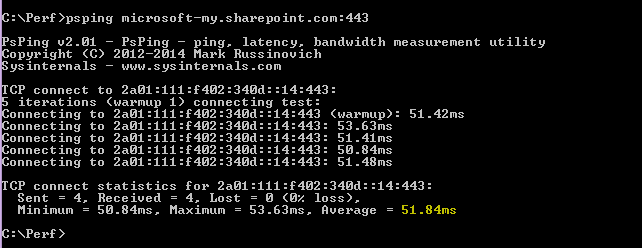

# 초기 계획 및 성능 기록을 사용하여 Office 365 성능 조정

Office 365와 비즈니스 간의 연결 성능을 확인 하는 몇 가지 간단한 방법은 연결의 대략적인 기준선을 설정 하는 데 사용할 수 있습니다. 클라이언트 컴퓨터 연결의 성능 기록을 알면 초기에 문제를 검색 하 고 문제를 예측 하는 데 도움이 될 수 있습니다.
  
성능 문제를 해결 하는 데 사용 되지 않는 경우이 문서는 어떤 문제를 보고 하 고 있는지 확인 하는 것과 같은 일반적인 질문을 고려 하는 것이 좋습니다 (예: Office 365 서비스 인시던트가 아님). 적절 한 성능을 계획 하는 방법은 무엇 인가요? 성능을 눈으로 지속적으로 유지 하려면 어떻게 해야 합니까? Office 365을 사용 하는 동안 팀 이나 클라이언트의 성능이 저하 되는 경우 이러한 질문에 대해 자세히 궁금 합니다.
  
> [!IMPORTANT]
> **현재 클라이언트와 Office 365 간에 성능 문제가 있나요?** [Office 365에 대 한 성능 문제 해결 계획](performance-troubleshooting-plan.md)에 설명 된 단계를 수행 합니다. 
    
## Office 365 성능에 대해 알아야 할 사항

Office 365는 자동화 뿐 아니라 실제 사용자가 지속적으로 모니터링 하는 고용량 전용 Microsoft 네트워크 내에 살고 있습니다. Office 365 클라우드를 유지 관리 하는 역할의 일부분에는 성능 조정 및 가능한 위치에서의 개발이 가능 합니다. Office 365 클라우드의 클라이언트는 인터넷을 통해 연결 해야 하므로 Office 365 서비스 간의 성능도 미세 조정 하는 데에도 지속적인 노력이 제공 됩니다. 성능 향상은 클라우드에서 실제로 중지 되지 않으며, 클라우드를 정상 및 빠르게 유지 하는 데 많은 경험이 있습니다. 위치에서 Office 365로 연결 되는 성능 문제가 발생 하는 경우, 지원 사례를 처음부터 시작 하 여 대기 하는 것이 가장 좋습니다. 대신 ' 내부 끄기 '에서 문제 조사를 시작 해야 합니다. 즉, 네트워크 내부를 시작 하 고 Office 365에서 작업을 수행 하는 방법을 알아봅니다. Office 365을 지 원하는 사례를 열기 전에 데이터를 수집 하 고 문제를 해결 하는 데 도움이 되는 작업을 수행할 수 있습니다.
  
> [!IMPORTANT]
> Office 365의 용량 계획 및 제한 사항에 대해 숙지 해야 합니다. 이 정보는 성능 문제를 해결 하려고 할 때 곡선의 앞에 놓이게 됩니다. 다음은 [Microsoft 365 및 Office 365 서비스 설명](https://docs.microsoft.com/office365/servicedescriptions/office-365-service-descriptions-technet-library)에 대 한 링크입니다. 이는 중앙 허브이 고, Office 365에서 제공 하는 모든 서비스에 대 한 링크는 여기에서 자체 서비스 설명으로 전달 됩니다. 즉, sharepoint online [서비스 설명을](https://technet.microsoft.com/library/sharepoint-online-service-description.aspx) 클릭 하 고 Sharepoint online [제한 섹션](https://go.microsoft.com/fwlink/p/?LinkID=856113)을 검색 하는 것과 같은 사용자에 대 한 표준 제한 사항을 확인 해야 합니다. 
  
문제를 해결 하려면 성능이 슬라이딩 확장 이라는 점을 이해 해야 하며, idealized 값을 획득 하 고 영구적으로 유지 관리 하는 것이 아니라, 이러한 경우에는 많은 수의 사용자를 다시 탑재 하거나 대규모 데이터 마이그레이션을 수행 하는 것과 같은 높은 대역폭 작업을 실행 하는 것이 매우 stressful, 따라서 성능에 미치는 영향을 계획 하는 것이 좋습니다. 성능 목표를 대략적으로 파악 해야 하지만 많은 변수가 성능에 맞게 작동 하기 때문에 성능이 달라 집니다. 이는 성능에 대 한 특성입니다. 
  
성능 문제 해결에서는 특정 목표를 충족 하지 않고 해당 숫자를 무기한 유지 관리 하는 것이 아니라 모든 변수가 제공 되는 기존 작업을 개선 하는 것입니다. 
  
## 성능 문제가 어떤 모습 인가요?

먼저 발생 하는 작업은 실제로 서비스 인시던트가 아니라 성능 문제 인지 확인 해야 합니다. 성능 문제는 Office 365의 서비스 문제와는 다릅니다. 서로 구별 하는 방법은 다음과 같습니다.
  
Office 365 서비스에 문제가 있는 경우 해당 문제는 서비스 인시던트입니다. Microsoft 365 관리 센터의 **현재 상태** 에 빨간색 또는 노란색 아이콘이 표시 되며, Office 365에 연결 하는 클라이언트 컴퓨터의 성능도 저하 될 수도 있습니다. 예를 들어 현재 상태가 빨간색 아이콘과 Exchange 옆의 **조사** 를 볼 수 있는 경우 exchange Online을 사용 하는 클라이언트 사서함이 잘못 수행 되는 경우 조직의 여러 사용자가 전화를 받을 수도 있습니다. 이 경우 Exchange Online 성능이 서비스 내에서 문제가 발생 한 것으로 가정 하는 것이 합리적입니다. 
  

  
이 시점에서 Office 365 admin은 **현재 상태** 를 확인 한 다음, 시스템에서 수행 하는 유지 관리 작업을 최신 상태로 유지 하기 위해 **자세한 내용과 기록을**자주 확인 해야 합니다. **현재 상태** 대시보드는 서비스에 대 한 변경 내용 및 문제 해결을 위해 업데이트 되었습니다. 상태 기록, 관리자 관리자에 게 기록 되는 메모 및 설명은 영향을 측정 하 고 진행 중인 작업에 대 한 게시를 유지 하는 데 도움이 됩니다. 
  

  
문제는 성능 저하의 원인이 될 수 있지만 성능 문제는 서비스 인시던트가 아닙니다. 성능 문제는 다음과 같습니다.
  
- 관리 센터의 **현재 상태** 에서 서비스를 보고 하는 기능에 관계 없이 성능 문제가 발생 합니다. 
    
-  비교적 원활한 작업을 수행 하는 데는 시간이 오래 걸리고 완료 되지 않습니다. 
    
- 문제를 복제 하거나, 최소한 일련의 단계를 수행 하는 경우에는이 문제가 발생 하는 것을 알 수 있습니다.
    
-  문제가 간헐적으로 발생 하는 경우에는 여전히 패턴 (예: 10:00이 있음)은 Office 365에 안정적으로 액세스할 수 없는 사용자 로부터 전화를 걸고 전화를 건 후에 통화가 중단 되는 것을 알 수 있습니다. 
    
이로 인해 익숙한 것 처럼 느껴질 수 있습니다. 너무 많이 사용해 서는 안 됩니다. 성능 문제가 확인 되 면 해당 질문은 "다음 작업을 수행 하 시겠습니까?"가 됩니다. 이 문서의 나머지 부분에서는이를 정확히 결정 하는 데 도움이 됩니다.
  
## 성능 문제를 정의 하 고 테스트 하는 방법

성능 문제는 시간에 따라 종종 발생 하므로 실제 문제를 정의 하기가 어려울 수 있습니다. 적절 한 문제 명세를 만들고 문제 컨텍스트를 파악 한 다음에는 하루 종일 승리 하도록 단계를 반복 해 서 테스트 해야 합니다. 그렇지 않은 경우에는 오류가 발생 하지 않고 손실 될 수 있습니다. 다음과 같은 이유 때문입니다. 여기에는 충분 한 정보를 제공 하지 않는 문제 문의 몇 가지 예가 나와 있습니다.
  
- 받은 편지함에서 내가 알지 못하는 것으로 전환 하는 것은 이제 휴식입니다. 이 기능을 사용 하는 것과 동일 하 게 작동할 수 있습니까?
    
- SharePoint Online에 파일을 업로드 하는 것은 계속 해 서 수행 하는 것입니다. 오후에는 시간이 오래 걸릴 수 있지만 그 외에는 속도가 빠르지 않습니까? 이 작업을 빠르게 수행할 수 없습니까?
    
위의 문제 문으로 인해 몇 가지 큰 문제가 발생 합니다. 특히, 처리할 모호성이 많이 있습니다. 예를 들어:
  
- 랩톱에서 작동 하는 데 사용 되는 받은 편지함과 일정 간을 전환 하는 방법은 명확 합니다.
    
- 사용자에 게 "빠르게" 할 수는 없지만 "빠른" 것은 무엇 인가요?
    
- 시간이 "영구적" 입니까? 몇 초 또는 몇 초가 든, 시간이 경과 하거나 사용자가 점심 시간으로 이동 하 여 사용자가 돌아온 후 10 분까지 완료 됩니까?
    
이러한 모든 기능은 관리자 및 문제 해결사가 다음과 같은 문제 설명에서 다양 한 세부 정보를 파악할 수 없음을 고려 하지 않습니다. 예를 들어 문제가 시작 되 면 사용자가 집에서 작업 하 고 홈 네트워크를 진행 하는 동안에만 느린 전환을 볼 수 있습니다. 사용자가 로컬 클라이언트에서 여러 가지 RAM 집약적 응용 프로그램을 실행 해야 하거나, 사용자가 이전 운영 체제를 실행 하 고 있거나 최근 업데이트를 실행 하지 않은 경우
  
사용자가 성능 문제를 보고 하는 경우 수집할 정보가 많이 있습니다. 이 정보를 수집 하는 프로세스의 일환으로, 문제를 범위 지정 하거나 조사 합니다. 다음은 성능 문제에 대 한 정보를 수집 하는 데 사용할 수 있는 기본 범위 지정 목록입니다. 이 목록은 포괄적이 아니지만 다음 중 하나를 시작 하는 것입니다. 
  
- 문제가 발생 한 날짜와 하루 또는 야간 시간에 대 한 해결 방법
    
- 사용 하는 클라이언트 컴퓨터의 종류 및 회사 네트워크 (VPN, 유선, 무선)에 연결 하는 방법
    
- 원격으로 작업 중이거나 사용자가 사무실에 있었습니까?
    
- 다른 컴퓨터에서 같은 작업을 수행 하 고 동일한 동작을 확인 했습니까?
    
- 수행 하는 작업을 작성할 수 있도록 문제를 제공 하는 단계를 안내 합니다.
    
- 속도가 몇 초 또는 몇 분 입니까?
    
- 세상에 거주 하는 곳은 어디에 있나요?
    
일부 질문은 다른 방법 보다 더 명백 합니다. 대부분의 사용자는 문제 해결사를 이해 하기 위한 정확한 단계가 필요 합니다. 어떤 경우에 잘못 된 문제를 기록 하 고, 문제가 해결 되었는지 어떻게 테스트할 수 있나요? "이 문제가 발생 하는 날짜 및 시간" 및 "전 세계 위치" 및 함께 사용할 수 있는 정보를 파악 하는 것이 더 명백 합니다. 사용자가 작업 했을 때의 시간 차이에 따라 유지 관리가 회사 네트워크의 일부에서 이미 진행 되 고 있다는 것을 의미할 수 있습니다. 예를 들어 회사에서 SharePoint Online과 온-프레미스 SharePoint Server 2013 인스턴스에 모두 검색 인덱스를 쿼리할 수 있는 하이브리드 SharePoint 검색과 같은 하이브리드 구현이 있는 경우 온-프레미스 팜에서 업데이트가 진행 중일 수 있습니다. 회사가 모두 클라우드에서 사용 되는 경우 시스템 유지 관리에는 네트워크 하드웨어 추가 또는 제거, 회사 전체에서 업데이트 롤링 또는 DNS 또는 기타 핵심 인프라에 대 한 변경 작업 등이 포함 될 수 있습니다.
  
성능 문제를 해결 하는 경우이는 범죄와 마찬가지로, 증거에서 모든 결론을 observant 정확 하 고 명확 해야 합니다. 이렇게 하려면 증거를 수집 하 여 좋은 문제 설명을 얻어야 합니다. 여기에는 컴퓨터의 컨텍스트, 사용자의 컨텍스트, 문제가 시작 된 시기 및 성능 문제를 제공 하는 정확한 단계가 포함 되어야 합니다. 이 문제 설명은 다음에는 노트의 맨 위 페이지를 유지 해야 합니다. 해결 방법을 수행한 후에 문제 설명을 다시 확인 하면 수행한 작업을 테스트 하 고 문제를 해결 했는지 여부를 증명 하는 단계를 수행 하 게 됩니다. 이는 작업을 수행 하는 시기를 파악 하는 데 매우 중요 합니다.
  
## 성능이 적절 한 시점을 확인 하는 데 얼마나 사용 되는지 알고 있습니까?

Unlucky 라면 아무도 알 수 없습니다. 숫자를 아무도 갖고 있지 않습니다. 즉, 아무도 Office 365에서 받은 편지함을 표시 하는 데 소요 된 시간 (초)을 확인 하는 간단한 질문에 답할 수 있으며, "임원에는 어떤 일이 발생 했습니까?"와 같이 대부분의 회사에서는 일반적인 시나리오입니다.
  
여기에서 누락 된 작업은 성능 기준입니다.
  
기준 사용자의 성과에 맞는 컨텍스트를 제공 합니다. 회사의 요구 사항에 따라 가끔씩 초기 계획을 자주 사용 해야 합니다. 회사 규모가 큰 경우 운영 팀에서 온-프레미스 환경에 대 한 초기 계획을 이미 사용 하 고 있을 수 있습니다. 예를 들어 모든 Exchange 서버를 해당 월의 첫 번째 월요일과 세 번째 월요일에 모든 SharePoint 서버를 패치 하는 경우 운영 팀은 중요 한 기능이 작동 하는지 증명 하기 위해 사후 패치가 실행 되는 작업 및 시나리오 목록을 갖고 있을 것입니다. 예를 들어 받은 편지함을 열고 보내기/받기를 클릭 한 후 폴더가 업데이트 되는지 확인 하 고, SharePoint에서 사이트의 기본 페이지를 찾아보고 엔터프라이즈 검색 페이지로 이동 하 여 결과를 반환 하는 검색을 수행 합니다.
  
응용 프로그램이 Office 365에 있는 경우 가장 기본적인 초기 계획 중 일부는 네트워크 내부의 클라이언트 컴퓨터에서 송신 지점으로 또는 네트워크를 떠나 Office 365로 이동 하는 지점까지 시간 (밀리초)을 측정 하는 데 사용할 수 있습니다. 다음은 조사 및 기록할 수 있는 몇 가지 유용한 초기 계획입니다.
  
- 클라이언트 컴퓨터와 egress 지점 사이의 장치 (예: 프록시 서버)를 확인 합니다.
    
  - 발생 하는 성능 문제에 대 한 컨텍스트 (IP 주소, 장치 유형, et cetera)가 포함 되도록 장치를 알고 있어야 합니다.
    
  - 프록시 서버는 일반적인 송신 지점 이므로 웹 브라우저에서 사용 하도록 설정 된 프록시 서버 (있는 경우)를 확인할 수 있습니다.
    
  - 네트워크를 검색 하 고 매핑할 수 있는 타사 도구가 있지만 장치를 확인 하는 가장 안전한 방법은 네트워크 팀 구성원에 게 요청 하는 것입니다.
    
- ISP (인터넷 서비스 공급자)를 식별 하 고, 해당 연락처 정보를 기록 하 고, 보유 한 대역폭의 회로 수를 확인 합니다.
    
- 회사 내부에서 클라이언트와 egress 지점 사이의 장치에 대 한 리소스를 식별 하거나, 비상 연락망을 식별 하 여 네트워킹 문제에 대해 설명 합니다.
    
다음은 도구를 사용한 간단한 테스트를 통해 계산할 수 있는 몇 가지 초기 계획입니다.
  
- 클라이언트 컴퓨터에서 송신 지점 까지의 시간 (밀리초)
    
- 송신 지점에서 Office 365 까지의 시간 (밀리초)
    
- 검색할 때 Office 365의 URL을 확인 하는 서버 세계의 위치
    
- ISP의 DNS 확인 속도 (밀리초), 패킷 도착 (네트워크 지터)의 불일치, 업로드 및 다운로드 시간 (밀리초)
    
이러한 단계를 수행 하는 방법에 익숙하지 않은 경우이 문서에서 보다 자세히 설명 하겠습니다. 
  
## 초기 계획

문제가 발생할 경우 미치는 영향을 알 수 있지만, 실제 성능 데이터를 모르는 경우에는 잘못 된 상황 및 시기에 대 한 컨텍스트를 가질 수 없습니다. 따라서 초기 계획을 제외 하 고는 퍼즐을 해결 하기 위한 주요 단서가 누락 되었습니다. 성능 문제 해결에서는 *비교* 지점이 필요 합니다. 간단한 성능 기준선을 사용 하는 것은 어렵지 않습니다. 운영 팀은 일정에 따라 이러한 작업을 수행 하는 일을 담당할 수 있습니다. 예를 들어 다음과 같이 연결을 가정해 보겠습니다. 
  

  
즉, 네트워크 팀에서 프록시 서버를 통해 인터넷을 사용 하는 것을 확인 했으며,이 프록시는 클라이언트 컴퓨터에서 클라우드로 보내는 모든 요청을 처리 합니다. 이 경우 모든 중간 장치를 나열 하는 간단한 버전의 연결을 그려야 합니다. 이제 클라이언트, 송신 지점 (인터넷에 대 한 네트워크에서 나갈 위치) 및 Office 365 클라우드 간의 성능을 테스트 하는 데 사용할 수 있는 도구를 삽입 합니다.
  

  
이러한 옵션은 성능 데이터를 찾는 데 필요한 전문 지식의 양으로 인해 **단순** 하 고 **고급** 으로 나열 됩니다. 네트워크 추적은 PsPing 및 TraceTCP와 같은 명령줄 도구를 실행 하는 것과 비교 하 여 시간이 많이 소요 됩니다. 이러한 두 명령줄 도구는 ICMP 패킷을 사용 하지 않기 때문에, 즉 Office 365에서 차단 되며 클라이언트 컴퓨터 또는 프록시 서버 (액세스 권한이 있는 경우)를 유지 하 고 Office 365에 도착 하는 데 걸리는 시간 (밀리초)을 제공 하기 때문에 선택 했습니다. 한 컴퓨터에서 다른 컴퓨터로의 개별 홉 마다 시간 값이 사용 되며, 초기 계획에도 유용 합니다. 이러한 명령줄 도구를 사용 하면 명령에 포트 번호를 추가할 수 있으며,이는 Office 365이 보안 소켓 계층 및 전송 계층 보안 (SSL 및 TLS)에서 사용 하는 포트인 포트 443를 통해 통신 하기 때문에 유용 합니다. 그러나 다른 타사 도구를 사용 하는 것이 더 나은 솔루션입니다. Microsoft는 이러한 도구를 모두 지원 하지 않으므로 어떤 이유로 PsPing 및 TraceTCP 작업을 수행할 수 없는 경우 Netmon과 같은 도구로 네트워크 추적으로 이동 합니다. 
  
업무 시간 전에 초기 계획을 사용 하 고, 사용량이 많은 시간 후에 다시 사용할 수 있습니다. 즉, 끝에 다음과 같은 비트를 보이는 폴더 구조가 있을 수 있습니다.
  

  
또한 파일에 대 한 명명 규칙을 선택 해야 합니다. 그 예는 다음과 같습니다.
  
- Feb_09_2015_9amPST_PerfBaseline_Netmon_ClientToEgress_Normal
    
- Jan_10_2015_3pmCST_PerfBaseline_PsPing_ClientToO365_bypassProxy_SLOW
    
- Feb_08_2015_2pmEST_PerfBaseline_BADPerf
    
- Feb_08_2015_8-30amEST_PerfBaseline_GoodPerf
    
이 작업을 수행 하는 방법에는 여러 가지가 있지만이 형식은 사용 하는 **\<dateTime\>\<what's happening in the test\>** 것이 좋습니다. 이에 대 한 유심히 나중에 문제를 해결 하려고 할 때 많은 도움이 될 것입니다. 나중에 "2 월에 두 개의 추적을 했으며, 그 중에는 좋은 성능을 보여 주었습니다. 이 기능은 문제 해결에 매우 유용 합니다. 
  
이전 계획 기준을 유지 하려면 체계적인 방법을 구성 해야 합니다. 이 예에서 간단한 방법은 세 개의 명령줄 출력을 생성 했으며 결과가 스크린샷으로 수집 되었지만 대신 네트워크 캡처 파일이 있을 수 있습니다. 가장 적합 한 방법을 사용 합니다. 이전 기준을 저장 하 고 온라인 서비스 동작이 변경 되는 시점에서이를 참조 합니다. 
  
## 파일럿 중에 성능 데이터를 수집 하는 이유

Office 365 서비스의 파일럿에서 보다 초기 계획을 시작 하는 데 걸리는 시간은 더 이상 없습니다. Office에는 수천 명의 사용자가 있거나, 수십만 개까지 있거나, 5 개가 있을 수 있지만, 사용자 수가 적은 경우에도 테스트를 수행 하 여 성능 변화를 측정할 수 있습니다. 대규모 회사의 경우 Office 365을 몇 명의 사용자에 게 파일럿 할 수 있는 대표적인 샘플은 여러 수천 명에 게 프로젝션 하 여 문제가 발생 하기 전까지 발생할 수 있는 문제를 파악 하 게 됩니다.
  
소규모 회사의 경우에는 모든 사용자가 동시에 서비스로 이동 하 고 파일럿이 제공 되지 않는 경우에는 성능 측정을 사용 하 여 작업을 잘못 수행 해야 하는 사용자에 게 표시할 데이터를 유지 해야 합니다. 예를 들어 중간 규모의 그래픽을 아주 빠르게 업로드 하는 데 소요 되는 시간에 모든 갑작스러운이 건물을 탐색할 수 있습니다.
  
## 초기 계획을 수집 하는 방법

모든 문제 해결 계획에 대해 최소한 다음 항목을 파악 해야 합니다.
  
- 사용 중인 클라이언트 컴퓨터 (컴퓨터 또는 장치 유형, IP 주소, 문제를 일으킨 작업)
    
- 클라이언트 컴퓨터가 세계에 있는 위치 (예: 네트워크에 대 한 VPN에서이 사용자가 원격으로 또는 회사 인트라넷에서 작업 하 고 있는지 여부)
    
- 네트워크에서 클라이언트 컴퓨터가 사용 하는 송신 지점 (ISP 또는 인터넷을 위해 트래픽이 회사에서 나간 지점)
    
 네트워크 관리자 로부터 네트워크 레이아웃을 확인할 수 있습니다. 소규모 네트워크에 있는 경우 인터넷에 연결 된 장치를 살펴보고 해당 레이아웃에 대 한 질문이 있는 경우 ISP에 전화를 걸어 보세요. 참조의 최종 레이아웃에 대 한 그래픽을 만듭니다. 
  
이 섹션은 간단한 명령줄 도구와 방법 및 고급 도구 옵션으로 구분 됩니다. 먼저 간단한 방법을 살펴보겠습니다. 그러나 지금 성능 문제가 발생 한 경우에는 고급 방법으로 이동 하 여 샘플 성능-문제 해결 작업 계획을 테스트해 보는 것이 좋습니다.
  
### 간단한 메서드

이러한 간단한 방법은 Office 365 성능에 대 한 정보를 확인할 수 있도록 시간에 따른 간단한 성능 기준을 수행 하 고 이해 하 고 적절히 저장 하는 방법을 설명 하기 위한 것입니다. 다음은 앞에서 설명한 것 처럼 간단한 다이어그램입니다.
  

  
> [!NOTE]
> TraceTCP는 요청이 처리 되는 데 걸리는 시간, 밀리초, 네트워크 홉 수 또는 한 컴퓨터에서 다음 컴퓨터로의 연결, 즉 요청이 대상에 도달 하는 데 걸리는 시간을 표시 하는 데 유용한 도구 이기 때문에이 스크린샷에 포함 되어 있습니다. 또한 TraceTCP에서는 홉 중에 사용 되는 서버의 이름도 제공할 수 있으며, 지원에서 Microsoft Office 365 문제 해결사에 유용할 수 있습니다. > TraceTCP 명령은 다음과 같이 매우 간단할 수 있는데, > `tracetcp.exe outlook.office365.com:443`> 명령에 포트 번호를 포함 해야 합니다. > [TraceTCP](https://simulatedsimian.github.io/tracetcp_download.html) 은 무료로 다운로드할 수 있지만 wincap에 의존 합니다. Wincap는 Netmon 에서도 사용 되 고 설치 되는 도구입니다. 고급 방법 섹션 에서도 Netmon을 사용 합니다. 
  
 여러 개의 사무실이 있는 경우에는 이러한 각 위치에 있는 클라이언트의 데이터 집합도 유지 해야 합니다. 이 테스트에서는 클라이언트에서 Office 365에 대 한 요청을 보내는 시간과 요청에 응답 하는 Office 365 사이의 시간을 설명 하는 숫자 값을 측정 하 여 대기 시간을 계산 합니다. 이 테스트는 클라이언트 컴퓨터의 도메인 내에서 시작 되며, 365 인터넷을 통해 네트워크 내부에서 들어오는 왕복을 측정 하는 방법을 확인 합니다. 
  
Egress 지점 (이 경우에는 프록시 서버)을 처리 하는 몇 가지 방법이 있습니다. 1에서 2로, 2에서 3으로 추적 한 다음 숫자를 밀리초 단위로 추가 하 여 네트워크에 대 한 최종 합계를 구할 수 있습니다. 또는 Office 365 주소에 대 한 프록시를 사용 하지 않도록 연결을 구성할 수 있습니다. 방화벽, 역방향 프록시 또는 두 가지 조합이 포함 된 대규모 네트워크에서는 많은 Url에 대해 트래픽을 허용 하는 프록시 서버에 대해 예외를 수행 해야 할 수 있습니다. Office 365에서 사용 하는 끝점 목록은 [office 365 url 및 IP 주소 범위](https://support.office.com/article/8548a211-3fe7-47cb-abb1-355ea5aa88a2)를 참조 하세요. 인증 프록시가 있는 경우 먼저 다음에 대 한 예외를 테스트 합니다.
  
- 포트 80 및 443
    
- TCP 및 HTTPs
    
- 다음 Url로 아웃 바운드 된 연결:
    
- \*. microsoftonline.com
    
- \*. microsoftonline-p.com
    
- \*.sharepoint.com
    
- \*. outlook.com
    
- \*. lync.com
    
- osub.microsoft.com
    
모든 사용자는 프록시 간섭 또는 인증 없이 이러한 주소에 액세스할 수 있어야 합니다. 소규모 네트워크에서는이를 웹 브라우저의 프록시 바이패스 목록에 추가 해야 합니다. 
  
Internet Explorer에서 프록시 바이패스 목록에이를 추가 하려면 **도구** \> **인터넷 옵션** \> **연결** \> **LAN 설정** \> **고급**으로 이동 합니다. 고급 탭에는 프록시 서버 및 프록시 서버 포트도 나와 있습니다. **사용자 LAN에 프록시 서버 사용**확인란을 클릭 하 여 **고급** 단추에 액세스 해야 할 수 있습니다. **로컬 주소에 대해 프록시 서버 사용 안 함** 이 선택 되어 있는지 확인 하는 것이 좋습니다. **고급**을 클릭 하면 예외를 입력할 수 있는 텍스트 상자가 표시 됩니다. 위에 나열 된 와일드 카드 Url을 세미콜론으로 구분 하 여 다음과 같이 합니다.
  
\*. microsoftonline.com; \*. sharepoint.com
  
프록시를 우회 한 후에는 Office 365 URL에서 ping 또는 PsPing를 직접 사용할 수 있습니다. 다음 단계에서는 ping **outlook.office365.com**를 테스트 합니다. 또는 명령에 포트 번호를 제공 하는 데 사용할 수 있는 PsPing 또는 다른 도구를 사용 하는 경우 평균 왕복 시간 (밀리초)을 확인 하기 위해 **portal.microsoftonline.com:443** 에 대 한 동기화를 수행 합니다. 
  
왕복 시간 (RTT)은 HTTP 요청을 outlook.office365.com와 같은 서버로 보내는 데 걸리는 시간을 측정 하 고 서버에서 사용자가 수행한 작업을 확인 하는 응답을 반환 하는 숫자 값입니다. 때로는이 약어를 RTT로 볼 수 있습니다. 이 값은 비교적 짧은 시간 이어야 합니다.
  
이 테스트를 수행 하려면 [Psping](https://technet.microsoft.com/sysinternals/jj729731.aspx) 또는 Office 365에서 차단 되는 ICMP 패킷을 사용 하지 않는 다른 도구를 사용 해야 합니다. 
  
 **PsPing을 사용 하 여 Office 365 URL에서 직접 전체 왕복 시간 (밀리초) 가져오기**
  
1. 다음 단계를 완료 하 여 관리자 권한 명령 프롬프트를 실행 합니다.
    
1. **시작**을 클릭합니다.
    
2. **검색 시작** 상자에 cmd를 입력 하 고 CTRL + SHIFT + enter를 누릅니다.
    
3. **사용자 계정 컨트롤** 대화 상자가 표시 되 면 표시 되는 동작이 원하는 동작 인지 확인 하 고 **계속**을 클릭 합니다.
    
2. 도구 (이 경우 PsPing)가 설치 된 폴더로 이동 하 여 이러한 Office 365 Url을 테스트 합니다.
    
  - psping portal.office.com:443
    
  - psping microsoft-my.sharepoint.com:443
    
  - psping outlook.office365.com:443
    
  - psping www.yammer.com:443
    
    
  
443의 포트 번호를 포함 해야 합니다. Office 365는 암호화 된 채널에서 작동 합니다. 포트 번호 없이 PsPing가 없으면 요청이 실패 합니다. 짧은 목록에 대해 ping을 수행한 후 평균 시간 (밀리초)을 확인 합니다. 녹화 하려는 내용이 여기에 해당 됩니다.
  

  
프록시 바이패스에 익숙하지 않으며, 단계별로 작업을 수행 하려면 먼저 프록시 서버의 이름을 확인 해야 합니다를 사용할 수 있습니다. Internet Explorer에서 **도구** \> **인터넷 옵션** \> **연결** \> **LAN 설정** \> **고급**으로 이동 합니다. **고급** 탭에 프록시 서버가 표시 됩니다. 이 작업을 완료 하 여 명령 프롬프트에서 프록시 서버에 Ping을 실행 합니다. 
  
 **프록시 서버에 대해 ping을 수행 하 고 1 단계에서 2 단계의 반올림 값을 밀리초 단위로 가져오려면**
  
1. 다음 단계를 완료 하 여 관리자 권한 명령 프롬프트를 실행 합니다.
    
1. **시작**을 클릭합니다.
    
2. **검색 시작** 상자에 cmd를 입력 하 고 CTRL + SHIFT + enter를 누릅니다.
    
3. **사용자 계정 컨트롤** 대화 상자가 표시 되 면 표시 되는 동작이 원하는 동작 인지 확인 하 고 **계속**을 클릭 합니다.
    
2. Ping을 입력 한 \<the name of the proxy server your browser uses, or the IP address of the proxy server\> 다음 enter 키를 누릅니다. PsPing 또는 다른 도구가 설치 되어 있는 경우 해당 도구를 대신 사용 하도록 선택할 수 있습니다. 
    
    명령에는 다음 예제와 같이 표시 될 수 있습니다. 
    
  - ping ourproxy.ourdomain.industry.business.com
    
  - ping 155.55.121.55
    
  - ping ourproxy
    
  - psping ourproxy.ourdomain.industry.business.com:80
    
  - psping 155.55.121.55:80
    
  - psping ourproxy: 80
    
3. 추적에서 테스트 패킷을 보내지 못하면 평균 (밀리초)을 나열 하 고 그 이후 값을 나타내는 간단한 요약을 얻게 됩니다. 음성 안내를 안내 하 고 명명 규칙을 사용 하 여 저장 합니다. 이때 다이어그램에서 값을 채우는 것도 도움이 될 수 있습니다.
    
이전 아침에 추적을 수행 했 고 클라이언트에서 프록시 (또는 임의의 송신 서버를 인터넷으로 종료)가 빠르게 이동할 수 있습니다. 이 경우 숫자는 다음과 같이 표시 될 수 있습니다.
  

  
클라이언트 컴퓨터에 프록시 (또는 egress) 서버에 대 한 액세스 권한 중 하나를 선택 하는 경우에는 해당 컴퓨터에 원격으로 연결 하 여 테스트의 다음 다리를 실행 하 고 명령 프롬프트를 실행 하 여 Office 365 URL로 PsPing로 이동할 수 있습니다. 해당 컴퓨터에 대 한 액세스 권한이 없는 경우 네트워크 리소스에 연락 하 여 다음 레그에 대 한 도움말을 확인 하 고 정확한 수치를 얻을 수 있습니다. 이러한 경우가 불가능할 경우 Office 365 URL에 대해 PsPing를 사용 하 여 프록시 서버에 대 한 PsPing 또는 Ping 시간과 비교 합니다. 
  
예를 들어 클라이언트에서 Office 365 URL로 51.84 밀리초가 있고 클라이언트에서 프록시 (또는 송신 지점)로의 2.8 밀리초가 있는 경우에는 egress에서 Office 365까지 49.04 밀리초가 됩니다. 마찬가지로, 날짜의 높이를 클라이언트에서 프록시에 이르기까지, 62.01 밀리초의 값을 클라이언트에서 Office 365 URL로 보내는 것이 최대 12.25 밀리초 인 경우에는 Office 365 URL로의 프록시 송신에 대 한 평균값은 49.76 밀리초가 됩니다.
  

  
문제 해결 측면에서 이러한 초기 계획을 유지 하는 것 외에도 흥미로운 사항이 있을 수 있습니다. 예를 들어 프록시 또는 송신 지점에서 Office 365 URL로의 대기 시간이 59 밀리초에서 약 40이 되는 것을 확인할 수 있습니다. 클라이언트에 프록시 또는 송신 지점 대기 시간이 약 3 ~ 7 밀리초 인 경우 (해당 시간에 표시 되는 네트워크 트래픽 수에 따라 다름), 프록시 또는 egress 초기 계획에 대 한 마지막 세 클라이언트에 대기 시간이 45 밀리초로 표시 되는 경우 문제가 있음을 알 수 있습니다.
  
### 고급 방법

Office 365에 대 한 인터넷 요청에 따라 수행 되는 작업을 실제로 확인 하려는 경우에는 네트워크 추적에 익숙해지는 데 익숙해져야 합니다. 이러한 추적, HTTPWatch, Netmon, Message Analyzer, Wireshark, Fiddler, 개발자 대시보드 도구 중 어떤 도구를 선호 하든지 관계 없이 도구에서 네트워크 트래픽을 캡처 및 필터링 할 수 있는 경우에는이 작업을 수행 하는 것이 좋습니다. 이 섹션에서는 이러한 도구 중 둘 이상을 실행 하 여 문제에 대 한 자세한 그림을 보는 것이 좋습니다. 테스트 중인 경우 이러한 도구 중 일부는 자체 권한으로 프록시 역할을 합니다. 보조 문서에서 사용 되는 도구인 [Office 365의 성능 문제 해결 계획](performance-troubleshooting-plan.md)에는 [Netmon 3.4](https://www.microsoft.com/download/details.aspx?id=4865), [HTTPWatch](https://www.httpwatch.com/download/)또는 [WireShark](https://www.wireshark.org/)가 포함 되어 있습니다.
  
이 방법의 간단한 부분은 성능 기준을 수행 하는 것 이며, 대부분의 단계는 성능 문제를 해결할 때와 동일 합니다. 더 높은 성능을 위해 기준을 만드는 방법은 네트워크 추적을 수행 하 고 저장 해야 합니다. 이 문서에 나오는 대부분의 예에서는 SharePoint Online을 사용 하지만 테스트 및 기록을 구독 하는 Office 365 서비스에서 일반적인 작업 목록을 개발 해야 합니다. 다음은 기본 예제입니다.
  
- SPO의 기준 목록-* * 1 단계: * * SPO 웹 사이트의 홈 페이지를 찾아보고 네트워크 추적을 수행 합니다. 추적을 저장 합니다. 
    
- SPO의 기준 목록- **2 단계:** 엔터프라이즈 검색을 통해 용어 (예: 회사 이름)를 검색 하 고 네트워크 추적을 수행 합니다. 추적을 저장 합니다. 
    
- SPO의 기준 목록- **3 단계:** SharePoint Online 문서 라이브러리에 큰 파일을 업로드 하 고 네트워크 추적을 수행 합니다. 추적을 저장 합니다. 
    
- SPO의 기준 목록- **4 단계:** OneDrive 웹 사이트의 홈 페이지를 찾아보고 네트워크 추적을 수행 합니다. 추적을 저장 합니다. 
    
이 목록에는 사용자가 SharePoint Online에 대해 수행 하는 가장 중요 한 공통 작업이 포함 되어 있어야 합니다. 마지막 단계로 비즈니스용 OneDrive로 이동 하는 경우 SharePoint Online 홈 페이지의 부하 (자주 사용자 지정 되는 회사) 및 비즈니스용 OneDrive 홈페이지 (사용자 지정 되지 않음)를 비교 하 여 구축 합니다. 이는 느린 로드 SharePoint Online 사이트에 대 한 기본 테스트입니다. 이러한 차이점에 대 한 기록을 테스트에 작성할 수 있습니다.
  
성능 문제가 발생 하는 경우 대부분의 단계는 초기 계획을 가져올 때와 동일 합니다. 네트워크 추적은 중요 한 역할을 하므로 다음에 중요 한 추적을 수행 하 *는 방법을* 처리 합니다. 
  
성능 문제를 해결 하기 위해 *지금* 까지 성능 문제가 발생 했을 때 추적을 수행 해야 합니다. 로그를 수집 하는 데 사용할 수 있는 적절 한 도구를 사용 해야 하며, 작업 계획 (즉, 가장 적합 한 정보를 수집 하기 위해 수행할 문제 해결 작업 목록)이 필요 합니다. 가장 먼저 수행할 작업은 시간을 반영 하는 폴더에 파일을 저장할 수 있도록 테스트의 날짜 및 시간을 기록 하는 것입니다. 다음으로, 문제 단계 자체로 세분화 합니다. 다음은 테스트에 사용 하는 정확한 단계입니다. 기본 사항을 잊지 마십시오. Outlook 에서만 문제가 발생 하는 경우 문제 동작이 하나의 Office 365 서비스 에서만 수행 되는지 기록해 야 합니다. 이 문제의 범위를 좁혀 해결할 수 있는 문제를 중점적으로 파악 하는 데 도움이 됩니다. 
  
## 참고 항목

[Office 365 끝점 관리](https://support.office.com/article/99cab9d4-ef59-4207-9f2b-3728eb46bf9a)

