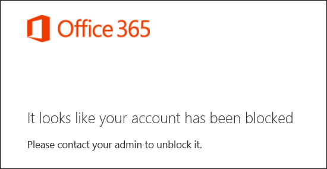

# <a name="block-user-accounts-with-office-365-powershell"></a><span data-ttu-id="22fef-103">블록 사용자 계정 Office 365 PowerShell을 사용 하 여</span><span class="sxs-lookup"><span data-stu-id="22fef-103">Block user accounts with Office 365 PowerShell</span></span>

<span data-ttu-id="22fef-104">**요약:**  Office 365 PowerShell을 사용 하 여 차단 하 고 Office 365 계정에 대 한 액세스를 차단 해제 하는 방법에 설명 합니다.</span><span class="sxs-lookup"><span data-stu-id="22fef-104">**Summary:**  Explains how to use Office 365 PowerShell to block and unblock access to Office 365 accounts.</span></span>
  
<span data-ttu-id="22fef-p101">Office 365 계정에 대 한 액세스를 차단에 로그인 하 고 서비스 및 Office 365 조직에서 데이터에 액세스 하는 계정을 사용 하 여에서 시킬 수 없습니다. 계정에 대 한 액세스를 차단 하면 차단 하는 경우 사용자는 다음과 같은 오류 메시지가에 로그인 하려고 할 때:</span><span class="sxs-lookup"><span data-stu-id="22fef-p101">Blocking access to an Office 365 account prevents anyone from using the account to sign in and access the services and data in your Office 365 organization. When you block access to the account, the user receives the following error message when they attempt to sign in:</span></span>
  

  
<span data-ttu-id="22fef-108">Office 365 PowerShell을 사용 하 여 여러 사용자 계정 및 개별에 대 한 액세스를 차단 하 수 있습니다.</span><span class="sxs-lookup"><span data-stu-id="22fef-108">You can use Office 365 PowerShell to block access to individual and multiple user accounts.</span></span>
  
## <a name="before-you-begin"></a><span data-ttu-id="22fef-109">시작하기 전에</span><span class="sxs-lookup"><span data-stu-id="22fef-109">Before you begin</span></span>

- <span data-ttu-id="22fef-p102">이 항목의 절차를 수행하려면 Office 365 PowerShell에 연결되어 있어야 합니다. 지침을 보려면 [PowerShell Office 365에 연결](connect-to-office-365-powershell.md)을 참조하세요.</span><span class="sxs-lookup"><span data-stu-id="22fef-p102">The procedures in this topic require you to connect to Office 365 PowerShell. For instructions, see [Connect to Office 365 PowerShell](connect-to-office-365-powershell.md).</span></span>
    
- <span data-ttu-id="22fef-112">사용자 계정, 차단 하는 경우에 모든 사용자의 장치 및 클라이언트에 영향을 24 시간 까지도 걸릴 수 있습니다.</span><span class="sxs-lookup"><span data-stu-id="22fef-112">When you block a user account, it might take as long as 24 hours to take effect on all the user's devices and clients.</span></span>
    
## <a name="use-office-365-powershell-to-block-access-to-individual-user-accounts"></a><span data-ttu-id="22fef-113">사용 하 여 Office 365 PowerShell 개별 사용자 계정에 대 한 액세스를 차단 하려면</span><span class="sxs-lookup"><span data-stu-id="22fef-113">Use Office 365 PowerShell to block access to individual user accounts</span></span>

<span data-ttu-id="22fef-114">개별 사용자 계정에 대 한 액세스를 차단 하려면 다음 구문을 사용 합니다.</span><span class="sxs-lookup"><span data-stu-id="22fef-114">Use the following syntax to block access to an individual user account:</span></span>
  
```
Set-MsolUser -UserPrincipalName <UPN of user account>  -BlockCredential $true
```

<span data-ttu-id="22fef-115">이 예제에서는 사용할 수 없게 해당 사용자 계정이 fabricec@litwareinc.com.</span><span class="sxs-lookup"><span data-stu-id="22fef-115">This example blocks access to the user account fabricec@litwareinc.com.</span></span>
  
```
Set-MsolUser -UserPrincipalName fabricec@litwareinc.com -BlockCredential $true
```

<span data-ttu-id="22fef-116">사용자 계정 차단 해제 하려면 다음 명령을 실행 합니다.</span><span class="sxs-lookup"><span data-stu-id="22fef-116">To unblock the user account, run the following command:</span></span>
  
```
Set-MsolUser -UserPrincipalName <UPN of user account>  -BlockCredential $false
```

<span data-ttu-id="22fef-117">언제 든 지 다음 명령 사용 하 여 사용자 계정의 차단 된 상태를 확인할 수 있습니다.</span><span class="sxs-lookup"><span data-stu-id="22fef-117">At any time, you can check the blocked status of a user account with the following command:</span></span>
  
```
Get-MolUser -UserPrincipalName <UPN of user account> | Select DisplayName,BlockCredential
```

## <a name="use-office-365-powershell-to-block-access-to-multiple-user-accounts"></a><span data-ttu-id="22fef-118">Office 365 PowerShell을 사용 하 여 여러 사용자 계정에 대 한 액세스를 차단 하려면</span><span class="sxs-lookup"><span data-stu-id="22fef-118">Use Office 365 PowerShell to block access to multiple user accounts</span></span>

<span data-ttu-id="22fef-119">먼저, 다음과 같이 각 줄에 하나의 계정이 포함 된 텍스트 파일을 만듭니다.</span><span class="sxs-lookup"><span data-stu-id="22fef-119">First, create a text file that contains one account on each line like this:</span></span>
    
  ```
akol@contoso.com
tjohnston@contoso.com
kakers@contoso.com
  ```
<span data-ttu-id="22fef-p103">다음 명령 예제 텍스트 파일 C:\My Documents\Accounts.txt를입니다. 텍스트 파일의 경로 파일 이름으로 대체 합니다.</span><span class="sxs-lookup"><span data-stu-id="22fef-p103">In the following commands, the example text file is C:\My Documents\Accounts.txt. Replace this with the path and file name of your text file.</span></span>
    
<span data-ttu-id="22fef-122">텍스트 파일에 나열 된 계정에 대 한 액세스를 차단 하려면 다음 명령을 실행 합니다.</span><span class="sxs-lookup"><span data-stu-id="22fef-122">To block access to the accounts listed in the text file, run the following command:</span></span>
    
  ```
  Get-Content Accounts.txt | ForEach { Set-MsolUser -UserPrincipalName $_ -BlockCredential $true }
  ```
<span data-ttu-id="22fef-123">텍스트 파일에 나열 된 계정 차단 해제 하려면 다음 명령을 실행 합니다.</span><span class="sxs-lookup"><span data-stu-id="22fef-123">To unblock the accounts listed in the text file, run the following command:</span></span>
    
  ```
  Get-Content Accounts.txt | ForEach { Set-MsolUser -UserPrincipalName $_ -BlockCredential $false }
  ```

## <a name="use-the-azure-active-directory-v2-powershell-module-to-block-access-to-user-accounts"></a><span data-ttu-id="22fef-124">Azure Active Directory V2 PowerShell 모듈을 사용하여 사용자 계정 액세스 차단</span><span class="sxs-lookup"><span data-stu-id="22fef-124">Use the Azure Active Directory V2 PowerShell module to block access to user accounts</span></span>

<span data-ttu-id="22fef-p104">Azure Active Directory V2 PowerShell 모듈에서 **New-AzureADUser** cmdlet을 사용하려면 먼저 구독에 연결해야 합니다. 지침은[Azure Active Directory V2 PowerShell 모듈을 사용하여 연결](https://go.microsoft.com/fwlink/?linkid=842218)을 참조하세요.</span><span class="sxs-lookup"><span data-stu-id="22fef-p104">To use the **New-AzureADUser** cmdlet from the Azure Active Directory V2 PowerShell module, you must first connect to your subscription. For the instructions, see[Connect with the Azure Active Directory V2 PowerShell module](https://go.microsoft.com/fwlink/?linkid=842218).</span></span>
  
<span data-ttu-id="22fef-127">연결한 후 다음 구문을 사용하여 개별 사용자 계정을 차단합니다.</span><span class="sxs-lookup"><span data-stu-id="22fef-127">After you have connected, use the following syntax to block an individual user account:</span></span>
  
```
Set-AzureADUser -ObjectID <UPN of user account> -AccountEnabled $false
```

> [!NOTE]
> <span data-ttu-id="22fef-128">Set-AzureAD cmdlet의 -ObjectID 매개 변수는 사용자 계정 이름으로도 알려진 계정 이름이나 계정의 개체 ID를 허용합니다.</span><span class="sxs-lookup"><span data-stu-id="22fef-128">The -ObjectID parameter in the Set-AzureAD cmdlet accepts either the account name, also known as the User Principal Name, or the account's object ID.</span></span> 
  
<span data-ttu-id="22fef-129">이 예제에서는 사용할 수 없게 해당 사용자 계정이 fabricec@litwareinc.com.</span><span class="sxs-lookup"><span data-stu-id="22fef-129">This example blocks access to the user account fabricec@litwareinc.com.</span></span>
  
```
Set-AzureADUser -ObjectID fabricec@litwareinc.com -AccountEnabled $false
```

<span data-ttu-id="22fef-130">사용자 계정을 차단 해제하려면 다음 명령을 실행합니다.</span><span class="sxs-lookup"><span data-stu-id="22fef-130">To unblock this user account, run the following command:</span></span>
  
```
Set-AzureADUser -ObjectID fabricec@litwareinc.com -AccountEnabled $true
```

<span data-ttu-id="22fef-131">UPN 사용자의 표시 이름에 따라 사용자 계정으로 표시 하려면 다음 명령을 사용 합니다.</span><span class="sxs-lookup"><span data-stu-id="22fef-131">To display the user account UPN based on the user's display name, use the following commands:</span></span>
  
```
$userName="<user account display name>"
Write-Host (Get-AzureADUser | where {$_.DisplayName -eq $userName}).UserPrincipalName

```

<span data-ttu-id="22fef-132">Caleb Sills 라는 사용자에 대 한 사용자 계정의 UPN을 표시 하는이 예제입니다.</span><span class="sxs-lookup"><span data-stu-id="22fef-132">This example displays the user account UPN for the user named Caleb Sills.</span></span>
  
```
$userName="Caleb Sills"
Write-Host (Get-AzureADUser | where {$_.DisplayName -eq $userName}).UserPrincipalName
```

<span data-ttu-id="22fef-133">사용자 이름을 기준으로 계정을 차단하려면 다음 명령을 사용합니다.</span><span class="sxs-lookup"><span data-stu-id="22fef-133">To block an account based on the user's name, use the following commands:</span></span>
  
```
$userName="<user account display name>"
Set-AzureADUser -ObjectID (Get-AzureADUser | where {$_.DisplayName -eq $userName}).UserPrincipalName -AccountEnabled $false

```

<span data-ttu-id="22fef-134">언제 든 지 다음 명령 사용 하 여 사용자 계정의 차단 된 상태를 확인할 수 있습니다.</span><span class="sxs-lookup"><span data-stu-id="22fef-134">At any time, you can check the blocked status of a user account with the following command:</span></span>
  
```
Get-AzureADUser -UserPrincipalName <UPN of user account> | Select DisplayName,AccountEnabled
```

<span data-ttu-id="22fef-135">여러 사용자 계정에 대 한 액세스를 차단 하려면 다음과 같이 각 줄에 하나의 계정 이름을 포함 하는 텍스트 파일을 만듭니다.</span><span class="sxs-lookup"><span data-stu-id="22fef-135">To block access to multiple user accounts, create a text file that contains one account name on each line like this:</span></span>
    
  ```
akol@contoso.com
tjohnston@contoso.com
kakers@contoso.com
  ```

<span data-ttu-id="22fef-p105">다음 명령 예제 텍스트 파일 C:\My Documents\Accounts.txt를입니다. 텍스트 파일의 경로 파일 이름으로 대체 합니다.</span><span class="sxs-lookup"><span data-stu-id="22fef-p105">In the following commands, the example text file is C:\My Documents\Accounts.txt. Replace this with the path and file name of your text file.</span></span>
    
<span data-ttu-id="22fef-138">텍스트 파일에 나열 된 계정에 대 한 액세스를 차단 하려면 다음 명령을 실행 합니다.</span><span class="sxs-lookup"><span data-stu-id="22fef-138">To block access to the accounts listed in the text file, run the following command:</span></span>
    
```
Get-Content "C:\My Documents\Accounts.txt" | ForEach { Set-AzureADUSer -ObjectID $_ -AccountEnabled $false }
```

<span data-ttu-id="22fef-139">텍스트 파일에 나열 된 계정 차단 해제 하려면 다음 명령을 실행 합니다.</span><span class="sxs-lookup"><span data-stu-id="22fef-139">To unblock the accounts listed in the text file, run the following command:</span></span>
    
```
Get-Content "C:\My Documents\Accounts.txt" | ForEach { Set-AzureADUSer -ObjectID $_ -AccountEnabled $true }
```

## <a name="see-also"></a><span data-ttu-id="22fef-140">참고 항목</span><span class="sxs-lookup"><span data-stu-id="22fef-140">See also</span></span>
<span data-ttu-id="22fef-141"><a name="SeeAlso"> </a></span><span class="sxs-lookup"><span data-stu-id="22fef-141"></span></span>

<span data-ttu-id="22fef-142">Office 365 PowerShell을 사용하여 사용자를 관리하는 방법에 대한 다음 추가 항목을 참조하세요.</span><span class="sxs-lookup"><span data-stu-id="22fef-142">See the following additional topics about managing users with Office 365 PowerShell:</span></span>
  
- [<span data-ttu-id="22fef-143">Office 365 PowerShell을 사용 하 여 사용자 계정 만들기</span><span class="sxs-lookup"><span data-stu-id="22fef-143">Create user accounts with Office 365 PowerShell</span></span>](create-user-accounts-with-office-365-powershell.md)
    
- [<span data-ttu-id="22fef-144">삭제 한 사용자 계정 Office 365 PowerShell을 사용 하 여 복원 합니다.</span><span class="sxs-lookup"><span data-stu-id="22fef-144">Delete and restore user accounts with Office 365 PowerShell</span></span>](delete-and-restore-user-accounts-with-office-365-powershell.md)
    
- [<span data-ttu-id="22fef-145">Office 365 PowerShell을 사용 하 여 사용자 계정에 라이선스를 할당 합니다.</span><span class="sxs-lookup"><span data-stu-id="22fef-145">Assign licenses to user accounts with Office 365 PowerShell</span></span>](assign-licenses-to-user-accounts-with-office-365-powershell.md)
    
- [<span data-ttu-id="22fef-146">Office 365 PowerShell을 사용 하 여 사용자 계정에서 라이센스를 제거 합니다.</span><span class="sxs-lookup"><span data-stu-id="22fef-146">Remove licenses from user accounts with Office 365 PowerShell</span></span>](remove-licenses-from-user-accounts-with-office-365-powershell.md)
    
<span data-ttu-id="22fef-147">이 항목에서 사용된 cmdlet에 대한 자세한 내용은 다음 항목을 참조하십시오.</span><span class="sxs-lookup"><span data-stu-id="22fef-147">For more information about the cmdlets that are used in these procedures, see the following topics:</span></span>
  
- [<span data-ttu-id="22fef-148">Get-content</span><span class="sxs-lookup"><span data-stu-id="22fef-148">Get-Content</span></span>](https://go.microsoft.com/fwlink/p/?LinkId=113310)
    
- [<span data-ttu-id="22fef-149">이와</span><span class="sxs-lookup"><span data-stu-id="22fef-149">Set-MsolUser</span></span>](https://go.microsoft.com/fwlink/p/?LinkId=691644)
    
- [<span data-ttu-id="22fef-150">New-AzureADUser</span><span class="sxs-lookup"><span data-stu-id="22fef-150">New-AzureADUser</span></span>](https://docs.microsoft.com/powershell/module/azuread/new-azureaduser?view=azureadps-2.0)
    

