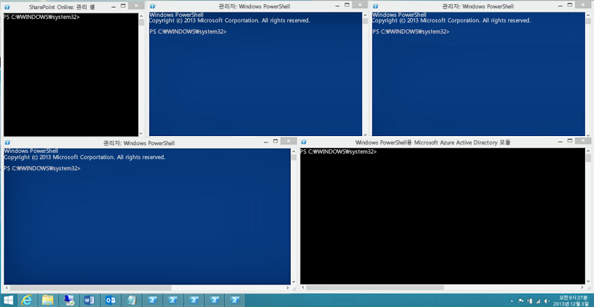
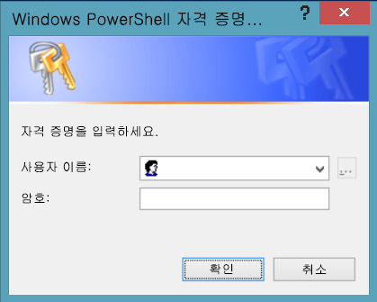
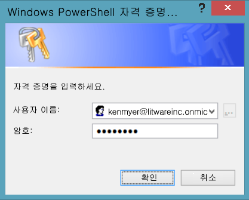
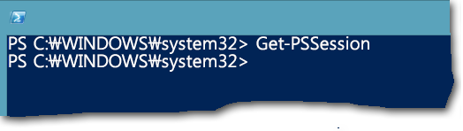

# <a name="connect-to-all-office-365-services-in-a-single-windows-powershell-window"></a><span data-ttu-id="5f66a-103">단일 Windows PowerShell 창에서 모든 Office 365 서비스에 연결 합니다.</span><span class="sxs-lookup"><span data-stu-id="5f66a-103">Connect to all Office 365 services in a single Windows PowerShell window</span></span>

 <span data-ttu-id="5f66a-104">**요약:** 별도 PowerShell 콘솔 창에서 다른 Office 365 서비스를 관리 하는 대신 모든 Office 365 서비스에 연결할 수 있으며 해당 단일 콘솔 창에서 관리할 수 있습니다.</span><span class="sxs-lookup"><span data-stu-id="5f66a-104">**Summary:** Instead of managing different Office 365 services in separate PowerShell console windows, you can connect to all Office 365 services and manage them from single console window.</span></span>
  
<span data-ttu-id="5f66a-p101">PowerShell을 사용 하 여 Office 365를 관리 하는 Office 365 관리 센터, SharePoint Online, Exchange Online, 비즈니스 온라인 용 Skype 및 보안 &amp;준수 센터입니다. 별도 Windows PowerShell 세션에 다섯 개의 서로 다른 연결 메서드를 통해 사용자의 데스크톱은 다음과 같습니다.</span><span class="sxs-lookup"><span data-stu-id="5f66a-p101">When you use PowerShell to manage Office 365, it is possible to have up to five different Windows PowerShell sessions open at the same time corresponding to Office 365 admin center, SharePoint Online, Exchange Online, Skype for Business Online, and the Security &amp; Compliance Center. With five different connection methods in separate Windows PowerShell sessions, your desktop could look like this:</span></span>
  

  
<span data-ttu-id="5f66a-p102">이 교차 서비스 관리에 대 한 이러한 5 개의 창 사이에서 데이터를 교환할 수 없습니다 때문에 Office 365를 관리 하기 위한 최적의있지 않습니다. 이 항목에서는 Office 365, 비즈니스 Online, Exchange Online, SharePoint Online 용 Skype 및 보안을 관리할 수 있는 Windows PowerShell의 단일 인스턴스를 사용 하는 방법을 설명 &amp; 준수 센터입니다.</span><span class="sxs-lookup"><span data-stu-id="5f66a-p102">This is not optimal for managing Office 365 because you can't exchange data among those five windows for cross-service management. This topic describes how to use a single instance of Windows PowerShell from which you can manage Office 365, Skype for Business Online, Exchange Online, SharePoint Online, and the Security &amp; Compliance Center.</span></span>
  
## <a name="before-you-begin"></a><span data-ttu-id="5f66a-110">시작하기 전에</span><span class="sxs-lookup"><span data-stu-id="5f66a-110">Before you begin</span></span>
<span data-ttu-id="5f66a-111"><a name="BeforeYouBegin"> </a></span><span class="sxs-lookup"><span data-stu-id="5f66a-111"></span></span>

<span data-ttu-id="5f66a-112">모든 Office 365에서 Windows PowerShell의 단일 인스턴스를 관리할 수 있습니다를 하기 전에 다음 필수 구성 요소를 고려:</span><span class="sxs-lookup"><span data-stu-id="5f66a-112">Before you can manage all of Office 365 from a single instance of Windows PowerShell, consider the following prerequisites:</span></span>
  
- <span data-ttu-id="5f66a-p103">Office 365 작동 또는 학교 계정을 사용 하는 이러한 절차에 대 한 요구를 Office 365 관리자 역할의 구성원 이어야 합니다. 자세한 내용은 [Office 365에 대 한 관리자 역할](https://go.microsoft.com/fwlink/p/?LinkId=532367)을 참조 하십시오. 이 Office 365 PowerShell에 대 한, 다른 모든 Office 365 서비스에 대 한 반드시 필요 합니다.</span><span class="sxs-lookup"><span data-stu-id="5f66a-p103">The Office 365 work or school account that you use for these procedures needs to be a member of an Office 365 admin role. For more information, see [About Office 365 admin roles](https://go.microsoft.com/fwlink/p/?LinkId=532367). This a requirement for Office 365 PowerShell, not necessarily for all other Office 365 services.</span></span>
    
- <span data-ttu-id="5f66a-116">다음 Windows 버전을 사용할 수 있습니다.</span><span class="sxs-lookup"><span data-stu-id="5f66a-116">You can use the following 64-bit versions of Windows:</span></span>
    
  - <span data-ttu-id="5f66a-117">Windows 10</span><span class="sxs-lookup"><span data-stu-id="5f66a-117">Windows 10</span></span>
    
  - <span data-ttu-id="5f66a-118">Windows 8.1 또는 Windows 8</span><span class="sxs-lookup"><span data-stu-id="5f66a-118">Windows 8.1 or Windows 8</span></span>
    
  - <span data-ttu-id="5f66a-119">Windows Server 2016</span><span class="sxs-lookup"><span data-stu-id="5f66a-119">Windows Server 2016</span></span>
    
  - <span data-ttu-id="5f66a-120">Windows Server 2012 R2 또는 Windows Server 2012</span><span class="sxs-lookup"><span data-stu-id="5f66a-120">Windows Server 2012 R2 or Windows Server 2012</span></span>
    
  - <span data-ttu-id="5f66a-121">Windows 7 SP1(서비스 팩 1)\*</span><span class="sxs-lookup"><span data-stu-id="5f66a-121">Windows 7 Service Pack 1 (SP1)\*</span></span>
    
  - <span data-ttu-id="5f66a-122">Windows Server 2008 R2 SP1\*</span><span class="sxs-lookup"><span data-stu-id="5f66a-122">Windows Server 2008 R2 SP1\*</span></span>
    
    * <span data-ttu-id="5f66a-p104">Microsoft.NET Framework 4.5를 설치 해야 합니다. _x_ 하 고 다음 중 하나는 Windows Management Framework 3.0 또는 Windows 관리 프레임 워크 4.0 합니다. 자세한 내용은 [.NET Framework를 설치](https://go.microsoft.com/fwlink/p/?LinkId=257868) 하 고 [Windows Management Framework 3.0](https://go.microsoft.com/fwlink/p/?LinkId=272757) 또는 [Windows Management Framework 4.0](https://go.microsoft.com/fwlink/p/?LinkId=391344)을 참조 하십시오.</span><span class="sxs-lookup"><span data-stu-id="5f66a-p104">You need to install the Microsoft .NET Framework 4.5. _x_ and then either the Windows Management Framework 3.0 or the Windows Management Framework 4.0. For more information, see [Installing the .NET Framework](https://go.microsoft.com/fwlink/p/?LinkId=257868) and [Windows Management Framework 3.0](https://go.microsoft.com/fwlink/p/?LinkId=272757) or [Windows Management Framework 4.0](https://go.microsoft.com/fwlink/p/?LinkId=391344).</span></span>
    
    <span data-ttu-id="5f66a-126">비즈니스 온라인 모듈 및 Office 365 모듈 중 하나는 Skype에 대 한 요구 사항으로 인해 64 비트 버전의 Windows 사용 해야 합니다.</span><span class="sxs-lookup"><span data-stu-id="5f66a-126">You need to use a 64-bit version of Windows because of the requirements for the Skype for Business Online module and one of the Office 365 modules.</span></span>
    
- <span data-ttu-id="5f66a-127">Office 365, SharePoint Online 및 비즈니스 온라인 용 Skype에 필요한 모듈을 설치 해야 합니다.</span><span class="sxs-lookup"><span data-stu-id="5f66a-127">You need to install the modules that are required for Office 365, SharePoint Online, and Skype for Business Online:</span></span>
    
  - [<span data-ttu-id="5f66a-128">Microsoft 온라인 서비스 로그인 도우미 IT 전문가 위한 RTW</span><span class="sxs-lookup"><span data-stu-id="5f66a-128">Microsoft Online Service Sign-in Assistant for IT Professionals RTW</span></span>](https://go.microsoft.com/fwlink/p/?LinkId=286152)
    
  - [<span data-ttu-id="5f66a-129">Windows Azure Active Directory에 대 한 Windows PowerShell 모듈 (64 비트 버전)</span><span class="sxs-lookup"><span data-stu-id="5f66a-129">Windows Azure Active Directory Module for Windows PowerShell (64-bit version)</span></span>](https://go.microsoft.com/fwlink/p/?linkid=236297)
    
  - [<span data-ttu-id="5f66a-130">SharePoint Online 관리 셸</span><span class="sxs-lookup"><span data-stu-id="5f66a-130">SharePoint Online Management Shell</span></span>](https://go.microsoft.com/fwlink/p/?LinkId=255251)
    
  - [<span data-ttu-id="5f66a-131">온라인으로 비즈니스 Windows PowerShell 모듈에 대 한 Skype</span><span class="sxs-lookup"><span data-stu-id="5f66a-131">Skype for Business Online, Windows PowerShell Module</span></span>](https://go.microsoft.com/fwlink/p/?LinkId=532439)
    
-  <span data-ttu-id="5f66a-p105">Windows PowerShell 스크립트를 실행 하려면 서명 된 Skype에 대 한 비즈니스 Online, Exchange Online 및 보안에 대 한 구성 해야하는 &amp; 준수 센터입니다. 이 작업을 수행 하려면 관리자 권한으로 Windows PowerShell 세션에서 다음 명령을 실행 ( **관리자 권한으로 실행**을 선택 하 여 열면 Windows PowerShell 창)입니다.</span><span class="sxs-lookup"><span data-stu-id="5f66a-p105">Windows PowerShell needs to be configured to run signed scripts for Skype for Business Online, Exchange Online, and the Security &amp; Compliance Center. To do this, run the following command in an elevated Windows PowerShell session (a Windows PowerShell window you open by selecting **Run as administrator**).</span></span>
    
  ```
  Set-ExecutionPolicy RemoteSigned
  ```

## <a name="the-short-version-instructions-without-explanations"></a><span data-ttu-id="5f66a-134">간략 한 (설명 없이 지침)</span><span class="sxs-lookup"><span data-stu-id="5f66a-134">The short version (instructions without explanations)</span></span>
<span data-ttu-id="5f66a-135"><a name="ShortVersion"> </a></span><span class="sxs-lookup"><span data-stu-id="5f66a-135"></span></span>

<span data-ttu-id="5f66a-p106">이 섹션에서는 자세한 설명 없이 연결 단계를 나타냅니다. 질문이 있거나 추가 정보를 원할 경우 항목의 나머지 부분을 읽어볼 수 있습니다. 여기에 나오는 단계 변호는 항목의 나머지에 포함된 단계 번호가 매겨진 섹션에 해당합니다.</span><span class="sxs-lookup"><span data-stu-id="5f66a-p106">This section presents the connection steps without in-depth explanations. If you have questions or want more information, you can read rest of the topic. The step numbers here match the step-numbered sections in the rest of the topic:</span></span>
  
1. <span data-ttu-id="5f66a-139">관리자 권한 ( **관리자 권한으로 실행**하는 사용)으로 Windows PowerShell을 엽니다.</span><span class="sxs-lookup"><span data-stu-id="5f66a-139">Open Windows PowerShell as an administrator (use **Run as administrator**).</span></span>
    
2. <span data-ttu-id="5f66a-140">이 명령을 실행 하 고 Office 365 작업 시간을 입력 하거나 계정 자격 증명을 학교 합니다.</span><span class="sxs-lookup"><span data-stu-id="5f66a-140">Run this command, and enter your Office 365 work or school account credentials.</span></span>
    
  ```
  $credential = Get-Credential
  ```

3. <span data-ttu-id="5f66a-141">Office 365에 연결 하려면 다음이 명령을 실행 합니다.</span><span class="sxs-lookup"><span data-stu-id="5f66a-141">Run these commands to connect to Office 365.</span></span>
    
  ```
  Import-Module MsOnline
  Connect-MsolService -Credential $credential
  ```

4. <span data-ttu-id="5f66a-p107">SharePoint Online에 연결 하려면 다음이 명령을 실행 합니다. 교체 _ \<domainhost >_ 도메인에 대 한 실제 값입니다. 예: `litwareinc.onmicrosoft.com`는 _ \<domainhost >_ 값은 `litwareinc`합니다.</span><span class="sxs-lookup"><span data-stu-id="5f66a-p107">Run these commands to connect to SharePoint Online. Replace  _\<domainhost>_ with the actual value for your domain. For example, for `litwareinc.onmicrosoft.com`, the  _\<domainhost>_ value is `litwareinc`.</span></span>
    
  ```
  Import-Module Microsoft.Online.SharePoint.PowerShell -DisableNameChecking
  Connect-SPOService -Url https://<domainhost>-admin.sharepoint.com -credential $credential
  ```

5. <span data-ttu-id="5f66a-p108">비즈니스 온라인 용 Skype 연결에 다음이 명령을 실행 합니다. 증가 하는 방법에 대 한 경고는 `WSMan NetworkDelayms` 값 처음으로 예상 되는 연결 하 고 무시 해야 합니다.</span><span class="sxs-lookup"><span data-stu-id="5f66a-p108">Run these commands to connect to Skype for Business Online. A warning about increasing the `WSMan NetworkDelayms` value is expected the first time you connect and should be ignored.</span></span>
    
  ```
  Import-Module SkypeOnlineConnector
  $sfboSession = New-CsOnlineSession -Credential $credential
  Import-PSSession $sfboSession
  ```

6. <span data-ttu-id="5f66a-147">Exchange Online에 연결 하려면 다음이 명령을 실행 합니다.</span><span class="sxs-lookup"><span data-stu-id="5f66a-147">Run these commands to connect to Exchange Online.</span></span>
    
  ```
  $exchangeSession = New-PSSession -ConfigurationName Microsoft.Exchange -ConnectionUri "https://outlook.office365.com/powershell-liveid/" -Credential $credential -Authentication "Basic" -AllowRedirection
  Import-PSSession $exchangeSession -DisableNameChecking
  ```

7. <span data-ttu-id="5f66a-148">보안에 연결 하려면 다음이 명령을 실행 &amp; 준수 센터입니다.</span><span class="sxs-lookup"><span data-stu-id="5f66a-148">Run these commands to connect to the Security &amp; Compliance Center.</span></span>
    
  ```
  $ccSession = New-PSSession -ConfigurationName Microsoft.Exchange -ConnectionUri https://ps.compliance.protection.outlook.com/powershell-liveid/ -Credential $credential -Authentication Basic -AllowRedirection
  Import-PSSession $ccSession -Prefix cc
  ```
> [!NOTE]
> <span data-ttu-id="5f66a-p109">텍스트 접두사 "참조" *모든* 보안에 추가 됩니다 &amp; 준수 센터 cmdlet 이름을 cmdlet를 실행할 수 있도록 Exchange Online 및 보안에 존재 &amp; 같은 Windows PowerShell 세션에서 준수 센터입니다. 예, **Get-rolegroup** 즉시 보안에서 **Get ccRoleGroup** &amp; 준수 센터입니다.</span><span class="sxs-lookup"><span data-stu-id="5f66a-p109">The text prefix "cc" is added to  *all*  Security &amp; Compliance Center cmdlet names so you can run cmdlets that exist in both Exchange Online and the Security &amp; Compliance Center in the same Windows PowerShell session. For example, **Get-RoleGroup** becomes **Get-ccRoleGroup** in the Security &amp; Compliance Center.</span></span>
  
<span data-ttu-id="5f66a-p110">단일 블록에 있는 모든 명령을 다음과 같습니다. 사용자 도메인 호스트의 이름을 지정 하 고 모두 한번에 실행 합니다.</span><span class="sxs-lookup"><span data-stu-id="5f66a-p110">Here are all the commands in a single block. Specify the name of your domain host, and then run them all at one time.</span></span>
  
```
$domainHost="<domain host name, such as litware for litwareinc.onmicrosoft.com>"
$credential = Get-Credential
Import-Module MsOnline
Connect-MsolService -Credential $credential
Import-Module Microsoft.Online.SharePoint.PowerShell -DisableNameChecking
Connect-SPOService -Url https://$domainHost-admin.sharepoint.com -credential $credential
Import-Module SkypeOnlineConnector
$sfboSession = New-CsOnlineSession -Credential $credential
Import-PSSession $sfboSession
$exchangeSession = New-PSSession -ConfigurationName Microsoft.Exchange -ConnectionUri "https://outlook.office365.com/powershell-liveid/" -Credential $credential -Authentication "Basic" -AllowRedirection
Import-PSSession $exchangeSession -DisableNameChecking
$ccSession = New-PSSession -ConfigurationName Microsoft.Exchange -ConnectionUri https://ps.compliance.protection.outlook.com/powershell-liveid/ -Credential $credential -Authentication Basic -AllowRedirection
Import-PSSession $ccSession -Prefix cc
```

<span data-ttu-id="5f66a-153">비즈니스 Online, Exchange Online, SharePoint Online 및 보안에 대 한 활성 세션 Skype 제거 하려면이 명령을 실행 하는 Windows PowerShell 창을 닫아야 준비가 되 면 &amp; 준수 센터:</span><span class="sxs-lookup"><span data-stu-id="5f66a-153">When you are ready to close down the Windows PowerShell window, run this command to remove the active sessions to Skype for Business Online, Exchange Online, SharePoint Online, and the Security &amp; Compliance Center:</span></span>
  
```
Remove-PSSession $sfboSession ; Remove-PSSession $exchangeSession ; Remove-PSSession $ccSession ; Disconnect-SPOService
```

## <a name="the-long-version-instructions-with-detailed-explanations"></a><span data-ttu-id="5f66a-154">긴 버전 (명령에 대 한 세부 정보)</span><span class="sxs-lookup"><span data-stu-id="5f66a-154">The long version (instructions with detailed explanations)</span></span>
<span data-ttu-id="5f66a-155"><a name="LongVersion"> </a></span><span class="sxs-lookup"><span data-stu-id="5f66a-155"></span></span>

### <a name="step-1-open-windows-powershell-as-an-administrator"></a><span data-ttu-id="5f66a-156">관리자 권한으로 Windows PowerShell 시작</span><span class="sxs-lookup"><span data-stu-id="5f66a-156">Step 1: Open Windows PowerShell as an administrator</span></span>
<span data-ttu-id="5f66a-157"><a name="Step1"> </a></span><span class="sxs-lookup"><span data-stu-id="5f66a-157"></span></span>

<span data-ttu-id="5f66a-158">Windows 10, Windows 8, Windows 8.1, Windows Server 2016, Windows Server 2012 R2 또는 Windows Server 2012 r 2를 실행 하는 경우이 수행 합니다.</span><span class="sxs-lookup"><span data-stu-id="5f66a-158">If you're running Windows 10, Windows 8, Windows 8.1, Windows Server 2016, Windows Server 2012 R2, or Windows Server 2012 R2, do this:</span></span>
  
1. <span data-ttu-id="5f66a-159">이러한 방법 중 하나를 사용 하 여 **Windows PowerShell**에 대 한 바로 가기의 파악 합니다.</span><span class="sxs-lookup"><span data-stu-id="5f66a-159">Use any of these methods to find the shortcut for **Windows PowerShell**:</span></span>
    
  - <span data-ttu-id="5f66a-160">시작 화면에서 빈 영역을 클릭 하 고 Windows PowerShell을 입력 합니다.</span><span class="sxs-lookup"><span data-stu-id="5f66a-160">On the Start screen, click an empty area, and type Windows PowerShell.</span></span>
    
  - <span data-ttu-id="5f66a-p111">바탕 화면 또는 시작 화면에서 Windows 키 + Q를 누릅니다. 검색 참을에서 Windows PowerShell을 입력 합니다.</span><span class="sxs-lookup"><span data-stu-id="5f66a-p111">On the desktop or the Start screen, press the Windows key+Q. In the Search charm, type Windows PowerShell.</span></span>
    
  - <span data-ttu-id="5f66a-p112">바탕 화면 또는 시작 화면에서 커서를 오른쪽 위 모서리 또는 살짝 참을 표시 하려면 화면 오른쪽 가장자리에서 왼쪽으로 이동 합니다. 검색 참을 선택 하 고 Windows PowerShell을 입력 합니다.</span><span class="sxs-lookup"><span data-stu-id="5f66a-p112">On the desktop or the Start screen, move your cursor to the upper-right corner, or swipe left from the right edge of the screen to show the charms. Select the Search charm, and enter Windows PowerShell.</span></span>
    
2. <span data-ttu-id="5f66a-165">결과에서 **Windows PowerShell**마우스 오른쪽 단추로 클릭 하 고 **관리자 권한으로 실행**을 선택 합니다.</span><span class="sxs-lookup"><span data-stu-id="5f66a-165">In the results, right-click **Windows PowerShell**, and select **Run as administrator**.</span></span>
    
3. <span data-ttu-id="5f66a-166">**사용자 계정 컨트롤** 대화 상자가 나타나면 관리자 자격 증명에서 Windows PowerShell을 실행할 것임을 확인 하려면 **예** 를 선택 합니다.</span><span class="sxs-lookup"><span data-stu-id="5f66a-166">If the **User Account Control** dialog box appears, select **Yes** to verify that you want to run Windows PowerShell under administrator credentials.</span></span>
    
<span data-ttu-id="5f66a-167">Windows 7 SP1 (또는 Windows Server 2008 R2 SP1)를 실행 하는 경우이 수행 합니다.</span><span class="sxs-lookup"><span data-stu-id="5f66a-167">If you're running Windows 7 SP1 (or Windows Server 2008 R2 SP1), do this:</span></span>
  
1. <span data-ttu-id="5f66a-p113">**시작** 메뉴에서 **모든 프로그램**을 선택 > **보조** > **Windows PowerShell**합니다. **Windows PowerShell**을 마우스 오른쪽 단추로 클릭 하 고 **관리자 권한으로 실행**을 선택 합니다.</span><span class="sxs-lookup"><span data-stu-id="5f66a-p113">On the **Start** menu, select **All Programs** > **Accessories** > **Windows PowerShell**. Right-click **Windows PowerShell**, and then select **Run as administrator**.</span></span>
    
2. <span data-ttu-id="5f66a-170">**사용자 계정 컨트롤** 대화 상자가 나타나면 관리자 자격 증명에서 Windows PowerShell을 실행할 것임을 확인 하려면 **예** 를 선택 합니다.</span><span class="sxs-lookup"><span data-stu-id="5f66a-170">If the **User Account Control** dialog box appears, select **Yes** to verify that you want to run Windows PowerShell under administrator credentials.</span></span>
    
<span data-ttu-id="5f66a-p114">관리자 권한으로 Windows PowerShell을 실행 해야 합니다. 이렇게 하지 않으면 오류 메시지가 표시 하려면 다음과 같은 필요한 모듈 중 하나를 가져오려면 하려고 할 때 야 합니다.</span><span class="sxs-lookup"><span data-stu-id="5f66a-p114">You must run Windows PowerShell as an administrator. If you don't, you're going to get an error message similar to this when you try to import one of the required modules.</span></span>
  
```
The specified module 'Microsoft.Online.SharePoint.Online.PowerShell' was not loaded because no valid module file was found in any directory.
```

<span data-ttu-id="5f66a-p115">문제를 해결할 수 있는 유일한 방법은 Windows PowerShell을 닫거나 하 고 관리자 권한으로 다시 시작 하는 합니다. 관리자 권한으로 Windows PowerShell을 실행 중인 경우 이야기를 쉽고 빠르게 방법도: 프롬프트는 `PS C:\Windows\System32>`이 아니라 `PS C:\Users\YourUserName>`합니다.</span><span class="sxs-lookup"><span data-stu-id="5f66a-p115">The only way to remedy the situation is to close Windows PowerShell and restart it as an administrator. Here's a quick and easy way to tell if you're running Windows PowerShell as an administrator: the prompt is  `PS C:\Windows\System32>`, not  `PS C:\Users\YourUserName>`.</span></span>

  
### <a name="step-2-create-a-windows-powershell-credentials-object"></a><span data-ttu-id="5f66a-175">2단계: Windows PowerShell credentials 개체 만들기</span><span class="sxs-lookup"><span data-stu-id="5f66a-175">Step 2: Create a Windows PowerShell credentials object</span></span>
<span data-ttu-id="5f66a-176"><a name="Step2"> </a></span><span class="sxs-lookup"><span data-stu-id="5f66a-176"></span></span>

<span data-ttu-id="5f66a-p116">자격 증명 개체에는 Windows PowerShell에 사용자 이름과 암호를 전달 하는 암호화 방법을 제공 합니다. 자격 증명 개체를 만들려면 Windows PowerShell에서 다음 명령을 실행 합니다.</span><span class="sxs-lookup"><span data-stu-id="5f66a-p116">The credentials object provides an encrypted way to pass your user name and password to Windows PowerShell. To create a credentials object, run the following command in Windows PowerShell.</span></span>
  
```
$credential = Get-Credential
```

> [!NOTE]
>  <span data-ttu-id="5f66a-p117">`$credential`자격 증명 개체를 저장할는 변수가입니다. 변수 이름을 지정 하지 않아도 `$credential`, 있지만 이렇게 하면 되므로 보다 쉽게 기억 자격 증명 개체를 포함 하는 변수입니다. (하 고이 변수를 여러 번 다시 수는 없으므로 중요 한 점은.) 됩니다도 쉽게 사용해 예에 따라 수에 대 한이 문서는 항상 사용 하기 때문에 `$credential` 하 여 자격 증명 개체를 표시 합니다.</span><span class="sxs-lookup"><span data-stu-id="5f66a-p117">`$credential` is a variable that will store the credentials object. You don't have to name the variable `$credential`, but doing so makes it easier to remember which variable contains the credentials object. (And that's important, because we'll reuse this variable several times.) That will also make it easier for you to follow our examples, because this article will always use  `$credential` to represent the credentials object.</span></span>
  
<span data-ttu-id="5f66a-182">Windows PowerShell는 다음과 같은 대화 상자를 표시 한 다음 됩니다.</span><span class="sxs-lookup"><span data-stu-id="5f66a-182">Windows PowerShell will then display a dialog box that looks like this.</span></span>
  

  
<span data-ttu-id="5f66a-184">작업 시간을 입력 하거나 **사용자 이름** 상자에 계정 사용자 이름 (예: kenmyer@litwareinc.onmicrosoft.com); 형식 _username@domainname_ 를 사용 하 여 학교 **암호** 상자;에 암호를 입력 합니다. 한 다음 **확인**을 클릭 합니다.</span><span class="sxs-lookup"><span data-stu-id="5f66a-184">Type your work or school account user name in the **User name** box, using the format _username@domainname_ (for example, kenmyer@litwareinc.onmicrosoft.com); type your password in the **Password** box; and then click **OK**:</span></span>
  

  
<span data-ttu-id="5f66a-p118">메모를 있는 그대로 자주 대/소문자를 볼 수 없습니다 모든 종류의 자격 증명 개체가 만들어졌는지 확인 합니다. (Windows PowerShell 일반적으로 알려줍니다 작업의 잘못 된 이동 하지만 항상 알 수 없는 경우 무엇 인가 오른쪽 때.) 자격 증명 개체가 만들어졌는지 확인 하려면 Windows PowerShell에서 다음 명령을 입력 하 고 Enter 키를 누릅니다.</span><span class="sxs-lookup"><span data-stu-id="5f66a-p118">Note that, as is often the case, you won't see any sort of confirmation that the credentials object was created. (Windows PowerShell typically tells you when things go wrong but doesn't always tell you when things go right.) If you want to verify that the credentials object was created, type the following in Windows PowerShell and then press Enter.</span></span>
  
```
$credential
```

<span data-ttu-id="5f66a-188">그러면 화면에 다음과 비슷한 결과가 표시됩니다.</span><span class="sxs-lookup"><span data-stu-id="5f66a-188">You should then see something similar to this on the screen.</span></span>
  
```
UserName                               Password
--------                               --------
kenmyer@litwareinc.onmicrosoft.com     System.Security.SecureString
```

<span data-ttu-id="5f66a-p119">가지 염두 여기에 [Get-credential](https://go.microsoft.com/fwlink/p/?LinkId=389618) cmdlet만가 만들 때 자격 증명 개체입니다. 사용자를 인증 하거나 그렇지 않은 경우 사용자 이름 및 암호를 제공 올바른지를 확인 하지 않는 합니다. 예, 사용자 이름을 kenmyer@litwareinc.onmicrosoft.com 변수로 잘못 입력 한 경우를 가정해 보겠습니다. 이렇게 하면 **Get-credential** 해당 사용자 이름을 사용 하 여 자격 증명 개체를 만들고 확인 하지 않고 로드 하는 경우 해당 참조를 실제로 유효한 사용자 이름입니다. Office 365 서비스에 연결 하려고 하는 개체를 실제로 사용 될 때까지 실제로 유효한 자격 증명 개체를 만든 있는지 여부를 알 수 없습니다.</span><span class="sxs-lookup"><span data-stu-id="5f66a-p119">One thing to keep in mind here is that the [Get-Credential](https://go.microsoft.com/fwlink/p/?LinkId=389618) cmdlet only creates the credentials object; it does not authenticate you or otherwise verify that the user name and password you supplied are correct. For example, suppose you mistyped the user name as kenmyer@litwareinc.onmicrosoft.com. If you do that, **Get-Credential** will create a credentials object using that user name, and without checking to see if that is actually a valid user name. You won't know whether you have created a truly valid credentials object until you actually use that object to try to connect to the Office 365 services.</span></span>
  
### <a name="step-3-connect-to-office-365"></a><span data-ttu-id="5f66a-192">3단계: Office 365에 연결</span><span class="sxs-lookup"><span data-stu-id="5f66a-192">Step 3: Connect to Office 365</span></span>
<span data-ttu-id="5f66a-193"><a name="Step3"> </a></span><span class="sxs-lookup"><span data-stu-id="5f66a-193"></span></span>

<span data-ttu-id="5f66a-194">자체 Office 365에 연결 하 여 시작 하겠습니다.</span><span class="sxs-lookup"><span data-stu-id="5f66a-194">We'll start by connecting to Office 365 itself.</span></span> 
  
<span data-ttu-id="5f66a-p120">가장 먼저 다음을 수행 하려면 필요한 경우 Office 365 모듈 (Microsoft Azure Active Directory 모듈에 대 한 Windows PowerShell을) 가져오기 이렇게 하려면 Windows PowerShell에서이 명령을 실행 합니다.</span><span class="sxs-lookup"><span data-stu-id="5f66a-p120">The first thing we need to do here is import the Office 365 module (the Microsoft Azure Active Directory Module for Windows PowerShell). To do that, run this command in Windows PowerShell.</span></span>
  
```
Import-Module MsOnline
```

<span data-ttu-id="5f66a-197">모듈을 가져왔는지 확인하려면 다음 명령을 실행합니다.</span><span class="sxs-lookup"><span data-stu-id="5f66a-197">If you want to verify that the module was imported, run this command.</span></span>
  
```
Get-Module
```

<span data-ttu-id="5f66a-198">다음과 같은 자료를 참조 해야이 명령에서 반환 되는 모듈 목록에: `Manifest 1.0 MSOnline {Add-MsolForeignGroupToRole, Add-MsolG...}`합니다.</span><span class="sxs-lookup"><span data-stu-id="5f66a-198">Somewhere in the list of modules that are returned by this command you should see something that looks like this:  `Manifest 1.0 MSOnline {Add-MsolForeignGroupToRole, Add-MsolG...}`.</span></span>
  
<span data-ttu-id="5f66a-199">표시 되 면 `MSOnline` 는 모든 항목을 제공 하기 위해 계획에 따라 의미를 나열 합니다.</span><span class="sxs-lookup"><span data-stu-id="5f66a-199">If you see  `MSOnline` listed, that means that everything went according to plan.</span></span>
  
<span data-ttu-id="5f66a-200">자격 증명 개체를 만들고 (참조 [2 단계: Windows PowerShell 자격 증명 개체를 만들](connect-to-all-office-365-services-in-a-single-windows-powershell-window.md#Step2))와 함께 `MsOnline` 모듈을 로드는 이제에 연결할 수 Office 365 [Connect-msolservice](https://go.microsoft.com/fwlink/p/?LinkId=532375) cmdlet 및 다음 명령을 사용 하 여 합니다.</span><span class="sxs-lookup"><span data-stu-id="5f66a-200">With the credentials object created (see [Step 2: Create a Windows PowerShell credentials object](connect-to-all-office-365-services-in-a-single-windows-powershell-window.md#Step2)) and with the  `MsOnline` module loaded, we can now connect to Office 365 by using the [Connect-MsolService](https://go.microsoft.com/fwlink/p/?LinkId=532375) cmdlet and the following command.</span></span>
  
```
Connect-MsolService -Credential $credential
```

<span data-ttu-id="5f66a-p121">모든 해야 제공 하는 알림을 자격 증명 개체 ( `$credential`). 이러한 자격 증명에 따라, Office 365 자동으로 연결 해 하면 올바른 도메인입니다. **Connect-msolservice**를 실행할 때 사용자의 도메인 이름을 지정할 필요가 없습니다.</span><span class="sxs-lookup"><span data-stu-id="5f66a-p121">Notice that all you have to provide is the credentials object ( `$credential`). Based on those credentials, Office 365 will automatically connect you to the correct domain. You do not have to specify your domain name when running **Connect-MsolService**.</span></span>
  
<span data-ttu-id="5f66a-204">확인 하려면 해야 실제로 *는* 이 명령을 실행을 Office 365에 연결 합니다.</span><span class="sxs-lookup"><span data-stu-id="5f66a-204">To verify that you really  *are*  connected to Office 365, run this command.</span></span>
  
```
Get-MsolDomain
```

<span data-ttu-id="5f66a-205">그러면 다음과 비슷한 결과가 반환되어야 합니다.</span><span class="sxs-lookup"><span data-stu-id="5f66a-205">In return, you should get back something similar to this.</span></span>
  
```
Name                         Status          Authentication
----                         ------          --------------
litwareinc.onmicrosoft.com   Verified        Managed
```

### <a name="step-4-connect-to-sharepoint-online"></a><span data-ttu-id="5f66a-206">4단계: SharePoint Online에 연결</span><span class="sxs-lookup"><span data-stu-id="5f66a-206">Step 4: Connect to SharePoint Online</span></span>
<span data-ttu-id="5f66a-207"><a name="Step4"> </a></span><span class="sxs-lookup"><span data-stu-id="5f66a-207"></span></span>

<span data-ttu-id="5f66a-208">다음 명령 사용 하 여 SharePoint Online 모듈을 가져옵니다.</span><span class="sxs-lookup"><span data-stu-id="5f66a-208">Import the SharePoint Online module with the following command:</span></span>
  
```
Import-Module Microsoft.Online.SharePoint.PowerShell -DisableNameChecking
```

<span data-ttu-id="5f66a-209">_DisableNameChecking_ 스위치는이 경고를 표시 하지 않습니다.</span><span class="sxs-lookup"><span data-stu-id="5f66a-209">The  _DisableNameChecking_ switch suppresses this warning.</span></span>
  
```
WARNING: The names of some imported commands from the module 'Microsoft.Online.SharePoint.PowerShell' include unapproved verbs that might make them less discoverable. To find the commands with unapproved verbs, run the Import-Module command again with the Verbose parameter. For a list of approved verbs, type Get-Verb.
```

<span data-ttu-id="5f66a-p122">SharePoint online에 연결 하기 위해 두 가지 정보를 제공 해야: 사용자의 자격 증명 및 SharePoint Online 관리 사이트의 URL입니다. 자격 증명 부분은 쉽습니다: 변수에 이미 저장 했을 때 `$credential` (참조 [2 단계: Windows PowerShell 자격 증명 개체를 만들](connect-to-all-office-365-services-in-a-single-windows-powershell-window.md#Step2)). 관리 사이트의 URL, 것 처럼 임을 충분히도 결정을 합니다. Office 365 도메인 이름을 인스턴트 메시징 세션을 `litwareinc.onmicrosoft.com`합니다.</span><span class="sxs-lookup"><span data-stu-id="5f66a-p122">In order to connect to SharePoint Online, you need to supply two pieces of information: your credentials and the URL of your SharePoint Online admin site. The credentials part is easy: we've already stored that in the variable  `$credential` (see [Step 2: Create a Windows PowerShell credentials object](connect-to-all-office-365-services-in-a-single-windows-powershell-window.md#Step2)). As for the URL of your admin site, that's easy enough to determine, as well. Suppose your Office 365 domain name is  `litwareinc.onmicrosoft.com`.</span></span>
  
<span data-ttu-id="5f66a-214">관리 사이트 URL을 확인하려면 다음 작업을 수행합니다.</span><span class="sxs-lookup"><span data-stu-id="5f66a-214">To determine the admin site URL, do this:</span></span>
  
1. <span data-ttu-id="5f66a-215">접두사를 사용 하 여 시작 `https://`합니다.</span><span class="sxs-lookup"><span data-stu-id="5f66a-215">Start by using the prefix  `https://`.</span></span>
    
2. <span data-ttu-id="5f66a-p123">사용자의 도메인 이름의 도메인 호스트 부분을 추가 합니다. 예: `litwareinc.onmicrosoft.com`, 도메인 호스트 이름은 `litwareinc`합니다. 에 대 한 `contoso.onmicrosoft.com`, 도메인 호스트 이름은 `contoso`합니다.</span><span class="sxs-lookup"><span data-stu-id="5f66a-p123">Add the domain host portion of your domain name. For example, for  `litwareinc.onmicrosoft.com`, the domain host name is  `litwareinc`. For  `contoso.onmicrosoft.com`, the domain host name is  `contoso`.</span></span>
    
3. <span data-ttu-id="5f66a-219">앞에 오는 하이픈 (-)을 추가 `admin.sharepoint.com`합니다.</span><span class="sxs-lookup"><span data-stu-id="5f66a-219">Add a hyphen (-) followed by  `admin.sharepoint.com`.</span></span>
    
<span data-ttu-id="5f66a-220">위의 명령이 반환하는 결과는 다음과 같습니다.</span><span class="sxs-lookup"><span data-stu-id="5f66a-220">In other words:</span></span>
  
 `https://` + `litwareinc` + `-admin.sharepoint.com` = `https://litwareinc-admin.sharepoint.com`
  
<span data-ttu-id="5f66a-p124">URL을 구성한 후에 해당 URL 및 자격 증명 개체 SharePoint Online에 연결 하는데 사용할 수 있습니다. 이 예와 비슷한 명령을 사용 하 여 [Connect-sposervice](https://go.microsoft.com/fwlink/p/?LinkId=532436) cmdlet을 호출 합니다.</span><span class="sxs-lookup"><span data-stu-id="5f66a-p124">After you've constructed the URL, you can then use that URL and your credentials object to connect to SharePoint Online. Just call the [Connect-SPOService](https://go.microsoft.com/fwlink/p/?LinkId=532436) cmdlet, using a command similar to this one.</span></span>
  
```
Connect-SPOService -Url https://litwareinc-admin.sharepoint.com -credential $credential
```

<span data-ttu-id="5f66a-223">연결 된 이루어지는지를 확인 하려면 Windows PowerShell에서 다음 명령을 실행 합니다.</span><span class="sxs-lookup"><span data-stu-id="5f66a-223">To verify that the connection has been made, run the following command in Windows PowerShell.</span></span>
  
```
Get-SPOSite
```

<span data-ttu-id="5f66a-p125">그러면 모든 SharePoint Online 사이트의 목록이 있습니다. 다음은 한 예가입니다.</span><span class="sxs-lookup"><span data-stu-id="5f66a-p125">You should get a list of all your SharePoint Online sites. Here is an example:</span></span>
  
```
Url                                       Owner          Storage Quota
---                                       -----          -------------
http://litwareinc-public.sharepoint.com/                 1000
https://litwareinc.sharepoint.com/                       1000
https://litwareinc.sharepoint.com/search                 1000
```

<span data-ttu-id="5f66a-p126">Office 365 명령 (에 설명 된 것과 [3 단계: Office 365에 연결](connect-to-all-office-365-services-in-a-single-windows-powershell-window.md#Step3)) 작동 됩니다. ( **Get-msoluser**실행해봅니다 및 자신에 대 한 참조입니다.) 즉, 관리 하는 수 이제 Office 365와 SharePoint Online에서 Windows PowerShell의 동일한 인스턴스.</span><span class="sxs-lookup"><span data-stu-id="5f66a-p126">Your Office 365 commands (the ones described in [Step 3: Connect to Office 365](connect-to-all-office-365-services-in-a-single-windows-powershell-window.md#Step3)) will still work. (Try running **Get-MsolUser**, and see for yourself.) That means that you can now manage both Office 365 and SharePoint Online from the same instance of Windows PowerShell.</span></span>
  
### <a name="step-5-connect-to-skype-for-business-online"></a><span data-ttu-id="5f66a-228">5단계: 온라인 비즈니스를 위한 Skype에 연결</span><span class="sxs-lookup"><span data-stu-id="5f66a-228">Step 5: Connect to Skype for Business Online</span></span>
<span data-ttu-id="5f66a-229"><a name="Step5"> </a></span><span class="sxs-lookup"><span data-stu-id="5f66a-229"></span></span>

<span data-ttu-id="5f66a-p127">비즈니스 온라인 용 Skype 연결 (Exchange Online 또는 보안 및 &amp; 준수 센터)는 Office 365 또는 SharePoint Online에 연결 하는 다릅니다. Office 365 및 SharePoint Online cmdlet와 동일 하 게 온라인 비즈니스 및 Exchange Online cmdlet에 대 한 Skype이 컴퓨터에 설치 가져올 하지 때문입니다. 대신, 로그인 할 때마다 적절 한 cmdlet은 일시적으로 컴퓨터에 복사 합니다. 로그인 할 때 이러한 cmdlet는 다음 사용자의 컴퓨터에서 제거 됩니다.</span><span class="sxs-lookup"><span data-stu-id="5f66a-p127">Connecting to Skype for Business Online (and to Exchange Online or the Security &amp; Compliance Center) is different than connecting to Office 365 or to SharePoint Online. That's because the Skype for Business Online and Exchange Online cmdlets don't get installed on your computer like the Office 365 and the SharePoint Online cmdlets do. Instead, each time you sign in, the appropriate cmdlets are temporarily copied to your computer. When you sign off, those cmdlets are then removed from your computer.</span></span>
  
<span data-ttu-id="5f66a-p128">에 연결 하기 위해 Skype 온라인 비즈니스에 대 한 비즈니스 온라인 모듈에 대 한 Skype 가져오려면 해야 합니다. 이렇게 하려면이 명령을 실행 합니다.</span><span class="sxs-lookup"><span data-stu-id="5f66a-p128">In order to connect to Skype for Business Online, you need to import the Skype for Business Online module. To do that, run this command.</span></span>
  
```
Import-Module SkypeOnlineConnector
```

<span data-ttu-id="5f66a-236">이를 처음으로 수행하면 다음 경고 메시지가 표시될 수 있습니다. 이 경고 메시지는 무시해도 안전합니다.</span><span class="sxs-lookup"><span data-stu-id="5f66a-236">The first time you do this, you might see the following warning message, which you can safely ignore.</span></span>
  
```
WARNING: WSMan NetworkDelayms has been set to 30000 milliseconds. The previous value was 5000 milliseconds.
WARNING: To improve the performance of the Lync Online Connector, it is recommended that the network delay be set to
30000 milliseconds (30 seconds). However, you can use Set-WinRMNetworkDelayMS to change the network delay to any
integer value.
```

<span data-ttu-id="5f66a-237">모듈을 가져온 후 이 명령을 실행합니다.</span><span class="sxs-lookup"><span data-stu-id="5f66a-237">After the module has been imported, run this command.</span></span>
  
```
$sfboSession = New-CsOnlineSession -Credential $credential
```

<span data-ttu-id="5f66a-p129">원격 PowerShell 세션을 작성 했습니다. 이 경우 의미는 했을 때 Windows PowerShell의 인스턴스에 연결 된 Office 365 서버 중 하나에서 실행 합니다.</span><span class="sxs-lookup"><span data-stu-id="5f66a-p129">We have created a remote PowerShell session. In this case, that means that we've connected to an instance of Windows PowerShell running on one of the Office 365 servers.</span></span> 
  
<span data-ttu-id="5f66a-p130">Office 365에 대 한 연결 만들었고, 하지만 스크립트, cmdlet 및 비즈니스 온라인 용 Skype을 관리 하는 데 필요한 기타 항목을 다운로드 하지 않은 했습니다. 이렇게 하려면이 명령을 실행 해야 합니다.</span><span class="sxs-lookup"><span data-stu-id="5f66a-p130">Although we've made a connection to Office 365, we haven't downloaded the scripts, cmdlets, and other items needed to manage Skype for Business Online. To do that, we have to run this command.</span></span>
  
```
Import-PSSession $sfboSession
```

<span data-ttu-id="5f66a-242">Windows PowerShell 세션을 가져올 때에 다음과 같은 사용자 컴퓨터로 가져올 비즈니스 온라인 cmdlet에 대 한 모든 Skype를 보고 하는 진행률 표시줄 진행률 표시줄을 표시 됩니다.</span><span class="sxs-lookup"><span data-stu-id="5f66a-242">When you import the Windows PowerShell session, you should see a progress bar similar to the following, a progress bar that reports on all the Skype for Business Online cmdlets being imported to your computer.</span></span>
  

  
<span data-ttu-id="5f66a-244">진행률 표시줄이 사라지면 다음과 비슷한 출력이 표시됩니다.</span><span class="sxs-lookup"><span data-stu-id="5f66a-244">When the progress bar disappears, you should then see output similar to the following.</span></span>
  
```
ModuleType Version    Name               ExportedCommands
---------- -------    ----               ----------------
Script     1.0        tmp_swc5mp4v.1ck  {Copy-CsVoicePolicy, Disabl...
```

### <a name="step-6-connect-to-exchange-online"></a><span data-ttu-id="5f66a-245">6단계: Exchange Online에 연결</span><span class="sxs-lookup"><span data-stu-id="5f66a-245">Step 6: Connect to Exchange Online</span></span>
<span data-ttu-id="5f66a-246"><a name="Step6"> </a></span><span class="sxs-lookup"><span data-stu-id="5f66a-246"></span></span>

<span data-ttu-id="5f66a-247">Exchange Online을 사용한 원격 Windows PowerShell 세션을 만들고이 명령을 실행 합니다.</span><span class="sxs-lookup"><span data-stu-id="5f66a-247">Run this command, which creates a remote Windows PowerShell session with Exchange Online.</span></span>
  
```
$exchangeSession = New-PSSession -ConfigurationName Microsoft.Exchange -ConnectionUri "https://outlook.office365.com/powershell-liveid/" -Credential $credential -Authentication "Basic" -AllowRedirection
```

> [!NOTE]
> <span data-ttu-id="5f66a-p131">Exchange Online 비즈니스 Online 용 Skype에 연결 하는 명령을 보다 복잡 한에 연결 하기 위한 명령 이유는 무엇입니까? 원칙적으로 없는: 두 명령을 정확 하 게 동일한 작업을 수행 합니다. 그러나 비즈니스 온라인 팀에 대 한 Skype 만든 자체 cmdlet — **새로 CsOnlineSession** -를 숨기는 Exchange Online에 연결할 때 사용 되는 (예: _인증_ 및 _AllowRedirection_) 매개 변수 중 일부입니다. 대신 해당 정보를 직접 입력 해야 하므로, _인증_ 및 _AllowRedirection_ 매개 변수는 효과적으로 **새로 만들기 CsOnlineSession** cmdlet에 작성 됩니다. Office 365에 연결 하는 표준 [새로 PSSession](https://go.microsoft.com/fwlink/p/?LinkId=389621) cmdlet를 사용 하 여 Exchange Online 하기 때문에 Exchange Online에 연결 하는 경우 이러한 매개 변수를 입력 해야 합니다. 단점은 수행 하기 위해 약간 더 입력 해야 합니다. 장점은 다운로드 하 고 설치 하는 Exchange Online 모듈 없는입니다.</span><span class="sxs-lookup"><span data-stu-id="5f66a-p131">Why is the command for connecting to Exchange Online more complicated than the command to connect to Skype for Business Online? Technically, it's not: both commands do the exact same thing. However, the Skype for Business Online team created its own cmdlet— **New-CsOnlineSession** —that hides some of the parameters (like _Authentication_ and _AllowRedirection_) that are used when connecting to Exchange Online. Instead of requiring you to type that information yourself, the  _Authentication_ and _AllowRedirection_ parameters are effectively built in to the **New-CsOnlineSession** cmdlet. You have to type those parameters when connecting to Exchange Online because Exchange Online uses the standard [New-PSSession](https://go.microsoft.com/fwlink/p/?LinkId=389621) cmdlet to connect to Office 365. The disadvantage is that you have a little more typing to do. The advantage is that you don't have to download and install an Exchange Online module.</span></span>
  
<span data-ttu-id="5f66a-255">관련이 있는 모두는 이제 온라인 비즈니스에 대 한 Skype와 수행 했습니다 하는 것 처럼이 원격 세션을 가져오기 됩니다.</span><span class="sxs-lookup"><span data-stu-id="5f66a-255">All you have to do now is import this remote session, just like we did with Skype for Business Online.</span></span>
  
```
Import-PSSession $exchangeSession -DisableNameChecking
```

<span data-ttu-id="5f66a-256">그러면 화면에 다음과 같은 내용이 표시됩니다.</span><span class="sxs-lookup"><span data-stu-id="5f66a-256">You should see something similar to this on the screen.</span></span>
  
```
ModuleType Version  Name             ExportedCommands
---------- -------  ----             ----------------
Script     1.0      tmp_nweiqjvl.geu {Add-AvailabilityAddressSpace...
```

<span data-ttu-id="5f66a-257">이제 다음 명령을 실행합니다.</span><span class="sxs-lookup"><span data-stu-id="5f66a-257">Now try running this command.</span></span>
  
```
Get-AcceptedDomain
```

<span data-ttu-id="5f66a-258">반환, 구성 된 전자 메일 주소에 대 한 Exchange Online Office 365 도메인에 대 한 정보를 표시 됩니다.</span><span class="sxs-lookup"><span data-stu-id="5f66a-258">In return, you should see information about your Office 365 domains that are configured for email addresses in Exchange Online.</span></span>
  
```
Name            DomainName          DomainType      Default
----            ----------          ----------      -------
litwareinc.com  litwareinc.com      Authoritative   True
```

### <a name="step-7-connect-to-the-security-amp-compliance-center"></a><span data-ttu-id="5f66a-259">7 단계: 보안 연결할 &amp; 준수 센터</span><span class="sxs-lookup"><span data-stu-id="5f66a-259">Step 7: Connect to the Security &amp; Compliance Center</span></span>
<span data-ttu-id="5f66a-260"><a name="Step7"> </a></span><span class="sxs-lookup"><span data-stu-id="5f66a-260"></span></span>

<span data-ttu-id="5f66a-p132">보안 &amp; 준수 센터는 한 위치에서 규정 준수 기능을 관리 하는데 사용할 수 있는 Office 365의 서비스입니다. 자세한 내용은 [Office 365 준수 센터](http://technet.microsoft.com/library/fde83656-f136-448d-b250-6fa17b503e4e.aspx)를 참고 하십시오.</span><span class="sxs-lookup"><span data-stu-id="5f66a-p132">The Security &amp; Compliance Center is a service in Office 365 that lets you to manage compliance features from one location. For more information, see [Office 365 compliance center](http://technet.microsoft.com/library/fde83656-f136-448d-b250-6fa17b503e4e.aspx).</span></span>
  
<span data-ttu-id="5f66a-263">보안에 대 한 연결 지침 &amp; 준수 센터는 잠시 후에 볼 수 있는 추가 된 회전, 만한 Exchange Online에 대 한 이러한와 매우 유사 합니다.</span><span class="sxs-lookup"><span data-stu-id="5f66a-263">The connection instructions for the Security &amp; Compliance Center are very similar to those for Exchange Online, but with an added twist, which you'll see in a moment.</span></span>
  
<span data-ttu-id="5f66a-264">보안을 사용 하 여 원격 PowerShell 세션 만듭니다는이 명령을 실행 &amp; 준수 센터입니다.</span><span class="sxs-lookup"><span data-stu-id="5f66a-264">Run this command, which creates a remote PowerShell session with the Security &amp; Compliance Center.</span></span>
  
```
$ccSession = New-PSSession -ConfigurationName Microsoft.Exchange -ConnectionUri https://ps.compliance.protection.outlook.com/powershell-liveid/ -Credential $credential -Authentication Basic -AllowRedirection
```

<span data-ttu-id="5f66a-265">그런 후 다음 명령을 실행합니다.</span><span class="sxs-lookup"><span data-stu-id="5f66a-265">Now run this command:</span></span>
  
```
Import-PSSession $ccSession -Prefix cc
```

<span data-ttu-id="5f66a-p133">마찬가지로이 명령은 Exchange Online에 대 한 명령 기능과 매우 유사 합니다. 보안에서 승인 되지 않은 동사가 없는 있기 때문에 _DisableNameChecking_ 스위치는 필요 하지 &amp; 준수 센터입니다. 하지만 어떻습니까는 추가 `-Prefix cc` 매개 변수 및 값? 이 처럼이 명령은 대 한 추가 된 회전입니다.</span><span class="sxs-lookup"><span data-stu-id="5f66a-p133">Again, this command is very similar to the command for Exchange Online. The  _DisableNameChecking_ switch isn't required because there are no unapproved verbs in the Security &amp; Compliance Center. But what about that additional `-Prefix cc` parameter and value? That's the added twist we told you about.</span></span>
  
<span data-ttu-id="5f66a-p134">Exchange Online 및 보안 &amp; 준수 센터는 동일한 이름이 정확 하 게 하 고 동일한 기능을 제공 하는 일부 cmdlet을 공유 합니다. **Get-rolegroup** 은 한 예입니다.</span><span class="sxs-lookup"><span data-stu-id="5f66a-p134">Exchange Online and the Security &amp; Compliance Center share some cmdlets that have exactly the same names and provide the same functionality. **Get-RoleGroup** is an example.</span></span>
  
<span data-ttu-id="5f66a-p135">어떻게 해야 할까요 이름이 같은 cmdlet을 포함 하는 두 세션을 가져오려면 하려고 하는 경우? 충돌 합니다. 라는, 큰 노란색 경고 메시지를 봅니다 `WARNING: Proxy creation has been skipped for the following command:` 뒤에 사용할 수 없고 가져올 수 있는 충돌 하는 cmdlet의 목록입니다. 최종 결과? 연결 된 다음과 같은 먼저 하지만 보안에서 **Get-rolegroup** 를 실행할 수 없습니다 때문에 Exchange Online에서 **Get-rolegroup** 를 실행할 수 &amp; 준수 센터 연결 된 다음과 같은 마지막와 충돌 하는 cmdlet을 가져오려면 거부 때문입니다.</span><span class="sxs-lookup"><span data-stu-id="5f66a-p135">So what happens if you try to import two sessions that contain cmdlets with the same name? They collide. You'll get a big yellow warning message that says,  `WARNING: Proxy creation has been skipped for the following command:` followed by the list of conflicting cmdlets that couldn't be imported. The end result? You can run **Get-RoleGroup** in Exchange Online because you connected there first, but you can't run **Get-RoleGroup** in the Security &amp; Compliance Center because you connected there last and the conflicting cmdlets refused to import.</span></span>
  
<span data-ttu-id="5f66a-p136">이 문제를 처리 하는 것이 가장 편리 방법은 가져온된 보안에 임의의 텍스트 접두사를 추가 하는 &amp; 준수 센터 cmdlet입니다. 사용 하 여 해당 _접두사_ 매개 변수 값이 "참조" **Import-pssession** cmdlet에서 수행 했습니다. 가 어떤 우리? (약간) 한 보안 설정을 변경 하 여 충돌을 줄이고 해당 &amp; 이 세션에 대 한 준수 센터 cmdlet 이름입니다. 모든 가져온된 보안 &amp; 준수 센터 cmdlet은 이제 "참조"와 명사 부분은 cmdlet 이름으로 시작 (오른쪽에 "-"). 보안에 대 한 경합이 많은 **Get-rolegroup** cmdlet **Get ccRoleGroup** 즉시 하는 등 &amp; 준수 센터 Exchange Online에 대 한 **Get-rolegroup** 와 충돌 하지 않도록 합니다.</span><span class="sxs-lookup"><span data-stu-id="5f66a-p136">The easiest way to deal with this problem is to add an arbitrary text prefix to the imported Security &amp; Compliance Center cmdlets. We did that using the  _Prefix_ parameter with the value "cc" on the **Import-PSSession** cmdlet. What did that do for us? It eliminated the conflicts by (slightly) changing the Security &amp; Compliance Center cmdlet names for this session. All of the imported Security &amp; Compliance Center cmdlets now start with "cc" in the noun part of the cmdlet name (to the right of the "-"). For example, the contentious **Get-RoleGroup** cmdlet becomes **Get-ccRoleGroup** for the Security &amp; Compliance Center so it doesn't conflict with **Get-RoleGroup** for Exchange Online.</span></span>
  
<span data-ttu-id="5f66a-p137">단?  *모든*  보안 &amp; 의 "참조" 접두사가 준수 센터 cmdlet 이름-필요 하지 않은 있는 고유한 cmdlet에도 있습니다. 예, **Get-ComplianceSearch** 있어도 없는 이러한 cmdlet Exchange 온라인 **Get ccComplianceSearch** 됩니다. 단일 Windows PowerShell 세션에서 관리 하는 모든 Office 365 서비스의 혜택을 고려 하는 경우에 디자이너로 하지만 잘못 된 너무 비트 않습니다. 보안에 있는 모든 프로시저에 대 한 cmdlet 이름에 "참조"를 추가 하려면 기억 하십시오 &amp; 준수 센터입니다.</span><span class="sxs-lookup"><span data-stu-id="5f66a-p137">The downside?  *All*  Security &amp; Compliance Center cmdlet names receive the "cc" prefix—even unique cmdlets that don't need it. For example, **Get-ComplianceSearch** becomes **Get-ccComplianceSearch** even though there is no such cmdlet in Exchange Online. It's a bit of a pain, but not too bad when you consider the benefits of managing all Office 365 services in a single Windows PowerShell session. Just remember to add "cc" to the cmdlet names for all procedures in the Security &amp; Compliance Center.</span></span>
  
<span data-ttu-id="5f66a-288">그런 다음 모든 작업을 완료하면 화면에 다음과 유사한 메시지가 표시됩니다.</span><span class="sxs-lookup"><span data-stu-id="5f66a-288">If all goes well, you'll see something similar to this:</span></span>
  
```
ModuleType Version  Name             ExportedCommands
---------- -------  ----             ----------------
Script     1.0      tmp_xbbx5exr.ehm {Add-ccRoleGroupMember, Get-ccAdminAuditLogConfig, Get-ccA...
```

<span data-ttu-id="5f66a-289">이제 자유롭게 단일 Windows PowerShell 세션에서 모든 Office 365 서비스를 관리할 수는 있습니다.</span><span class="sxs-lookup"><span data-stu-id="5f66a-289">Now you are free to manage all Office 365 services in a single Windows PowerShell session.</span></span>
  
### <a name="step-8-gracefully-end-your-powershell-sessions"></a><span data-ttu-id="5f66a-290">8단계: PowerShell 세션을 정상적으로 종료</span><span class="sxs-lookup"><span data-stu-id="5f66a-290">Step 8: Gracefully end your PowerShell sessions</span></span>
<span data-ttu-id="5f66a-291"><a name="Step8"> </a></span><span class="sxs-lookup"><span data-stu-id="5f66a-291"></span></span>

<span data-ttu-id="5f66a-p138">Windows PowerShell 창을 닫으면 하는 경우 다음 15 분 정도 대 한 비즈니스 온라인 원격 연결에 대 한 사용자 Skype 활성 상태로 유지 됩니다. 모든 한 명 또는 하나의 도메인 열기를 가질 수 있다는 동시 연결 수를 제한 하는 비즈니스 온라인 용 Skype, 때문에 문제가 발생할 수 있는 합니다. 온라인 비즈니스에 대 한 Skype와 개별 관리자, 최대 세 열린 한번에 연결 하 고 도메인을 최대 9 개의 열린 연결을 가질 수 있습니다. 온라인 비즈니스에 대 한 Skype에 로그인 하 고 다음 세션을 제대로 닫지 않고를 종료 하는 경우 다음 15 분 정도 대 한 해당 세션 계속 열려 있습니다. 결과적으로,는 연결이 하나 더 적은 사용자나 도메인에서 다른 관리자에 게 사용할 수 있습니다.</span><span class="sxs-lookup"><span data-stu-id="5f66a-p138">If you just close the Windows PowerShell window, your Skype for Business Online remote connection will remain active for the next 15 minutes or so. Because Skype for Business Online limits the number of simultaneous connections that any one person or any one domain can have open, that could be a problem. With Skype for Business Online, an individual administrator can have, at most, three open connections at one time, and a domain can have a maximum of nine open connections. If you sign in to Skype for Business Online and then exit without properly closing the session, that session remains open for the next 15 minutes or so. As a result, that's one fewer connection available to you or to other administrators in your domain.</span></span>
  
<span data-ttu-id="5f66a-p139">대신, 이제는 원격 세션을 닫으려면 Skype에 대 한 비즈니스 Online, Exchange Online 및 보안에 대 한 &amp; 준수 센터 적절 하 게 합니다. 그 전에이 명령을 실행 합니다.</span><span class="sxs-lookup"><span data-stu-id="5f66a-p139">Instead, let's close the remote sessions for Skype for Business Online, Exchange Online, and the Security &amp; Compliance Center gracefully. Before we do that, run this command.</span></span>
  
```
Get-PSSession
```

<span data-ttu-id="5f66a-p140">[Get-pssession](https://go.microsoft.com/fwlink/p/?LinkId=532437) cmdlet 표시 하면 세 개 이상 원격 세션 열기 Skype 온라인 비즈니스에 대 한 표시, Exchange Online에 대 한 하나, 하나는 보안을 위해 해야 &amp; (가능한 것 보다 더 세 원격 준수 센터 세션에서 Office 365 서비스 외에도 다른 항목에 연결할이 인스턴스의 Windows PowerShell을 사용 되었는지 여부에 따라 실행). 다음에 다음과 비슷한 결과가 표시 됩니다.</span><span class="sxs-lookup"><span data-stu-id="5f66a-p140">The [Get-PSSession](https://go.microsoft.com/fwlink/p/?LinkId=532437) cmdlet should show you that you have at least three remote sessions open, one for Skype for Business Online, one for Exchange Online and one for the Security &amp; Compliance Center (it's possible you could have more than three remote sessions running, depending on whether you've used this instance of Windows PowerShell to connect to something else besides the Office 365 services). You should see something similar to the following.</span></span>
  
```
Id Name     ComputerName     State   ConfigurationName    Availability
-- ----     ------------     -----   -----------------    ------------
 1 Session1 webdir0a.onl...  Opened  Microsoft.PowerShell    Available
 2 Session2 outlook.offi...  Opened  Microsoft.Exchange      Available
 3 Session3 ps.complianc...  Opened  Microsoft.Exchange      Available
```

<span data-ttu-id="5f66a-p141">이러한 세 세션을 닫으려면, 이러한를 실행 하는 한번에 하나씩는 명령입니다. 첫번째 명령은 Skype 비즈니스 온라인 세션, 두번째 닫히고 Exchange Online 세션에 대 한 닫고 셋째 닫는 보안 &amp; 준수 센터 세션입니다.</span><span class="sxs-lookup"><span data-stu-id="5f66a-p141">To close these three sessions, run these commands one at a time. The first command closes the Skype for Business Online session, the second closes the Exchange Online session, and the third closes the Security &amp; Compliance Center session.</span></span>
  
```
Remove-PSSession $sfboSession
Remove-PSSession $exchangeSession
Remove-PSSession $ccSession
```

<span data-ttu-id="5f66a-303">이제 **Get-pssession** cmdlet을 실행 하는 경우 표시 되어야 nothing 전혀 (않은 경우 다른 원격 세션이 작동 및 실행 중).</span><span class="sxs-lookup"><span data-stu-id="5f66a-303">If you now run the **Get-PSSession** cmdlet, you should see nothing at all (unless you have other remote sessions up and running).</span></span>
  

  
> [!NOTE]
> <span data-ttu-id="5f66a-305">이 명령을 사용 하면 모든 원격 세션을 닫으려면 동시에 사용 하려는 경우: >`Get-PSSession | Remove-PSSession`</span><span class="sxs-lookup"><span data-stu-id="5f66a-305">If you'd prefer to close all your remote sessions at the same time, you can use this command: >  `Get-PSSession | Remove-PSSession`</span></span>
  
<span data-ttu-id="5f66a-306">이제 자체입니다 (예: 비즈니스 온라인 용 Skype에서 **Get-csmeetingconfiguration** ) 세션을 닫을 둘 중 하나에서 cmdlet을 실행 하려고 하면이 예와 비슷한 오류 메시지가 가져옵니다.</span><span class="sxs-lookup"><span data-stu-id="5f66a-306">If you now try running a cmdlet from any of these closed sessions (for example, **Get-CsMeetingConfiguration** in Skype for Business Online) you'll get an error message that's similar to this one.</span></span>
  
```
Get-CsMeetingConfiguration : The term 'Get-CsMeetingConfiguration' is not recognized as the name of a cmdlet, function, script file, or operable program. Check the spelling of the name, or if a path was included, verify that the path is correct and try again.
```

<span data-ttu-id="5f66a-307">때문에 해당 오류 메시지가 표시 될 우리 Skype 비즈니스 Online, Exchange Online 및 보안에 대 한 cmdlet &amp; 원격 세션을 닫을 때 준수 센터가 삭제 합니다.</span><span class="sxs-lookup"><span data-stu-id="5f66a-307">We get that error message because the cmdlets for Skype for Business Online, Exchange Online, and the Security &amp; Compliance Center were deleted when we closed the remote sessions.</span></span>
  
<span data-ttu-id="5f66a-308">SharePoint Online 세션을 닫으려면 다음이 명령을 입력 합니다.</span><span class="sxs-lookup"><span data-stu-id="5f66a-308">To close the SharePoint Online session, type this command.</span></span>
  
```
Disconnect-SPOService
```

<span data-ttu-id="5f66a-309">이제 **Get-sposite** cmdlet을 실행 하려고 하는 경우 다음과 같은 오류 메시지가 가져옵니다.</span><span class="sxs-lookup"><span data-stu-id="5f66a-309">If you now try to run the **Get-SPOSite** cmdlet, you'll get an error message like this.</span></span>
  
```
get-sposite : No connection available. Use Connect-SPOService before running this CmdLet.
```

<span data-ttu-id="5f66a-310">더이상 SharePoint Online에 연결 되어있지 않으므로 사이트 정보를 검색할 수 없습니다.</span><span class="sxs-lookup"><span data-stu-id="5f66a-310">You can't retrieve site information because you're no longer connected to SharePoint Online.</span></span>
  
<span data-ttu-id="5f66a-p142">Office 365에 대 한 연결을 것 처럼 **Connect-msolservice** cmdlet을 없지만 방법이 해당 **연결 끊기 MsolService** cmdlet 없습니다. 따라서 Office 365에 대 한 Windows PowerShell 창을 닫습니다. 그럼에도 불구 하 고 것도이 작업을 수행 하는 것이 좋습니다 제대로 제거할 수 있도록 SharePoint에서 온라인으로 Skype 비즈니스 Online, Exchange Online 및 보안에 대 한 마지막 &amp; 준수 센터입니다.</span><span class="sxs-lookup"><span data-stu-id="5f66a-p142">As for your connection to Office 365, although there's a **Connect-MsolService** cmdlet, there's no corresponding **Disconnect-MsolService** cmdlet. So for Office 365, just close the Windows PowerShell window. Nevertheless, it's still a good idea to do this last so you can properly disconnect from SharePoint Online, Skype for Business Online, Exchange Online, and the Security &amp; Compliance Center.</span></span>
  
## <a name="new-to-office-365"></a><span data-ttu-id="5f66a-314">Office 365의 새로운 기능</span><span class="sxs-lookup"><span data-stu-id="5f66a-314">New to Office 365?</span></span>
<span data-ttu-id="5f66a-315"><a name="LongVersion"> </a></span><span class="sxs-lookup"><span data-stu-id="5f66a-315"></span></span>

[!INCLUDE [LinkedIn Learning Info](../common/office/linkedin-learning-info.md)]

## <a name="see-also"></a><span data-ttu-id="5f66a-316">참고 항목</span><span class="sxs-lookup"><span data-stu-id="5f66a-316">See also</span></span>

#### 

[<span data-ttu-id="5f66a-317">Office 365 PowerShell 사용한 Office 365 관리</span><span class="sxs-lookup"><span data-stu-id="5f66a-317">Manage Office 365 with Office 365 PowerShell</span></span>](manage-office-365-with-office-365-powershell.md)
  
[<span data-ttu-id="5f66a-318">Office 365 PowerShell 시작</span><span class="sxs-lookup"><span data-stu-id="5f66a-318">Getting started with Office 365 PowerShell</span></span>](getting-started-with-office-365-powershell.md)
  
[<span data-ttu-id="5f66a-319">Office 365 PowerShell을 사용하여 SharePoint Online 관리</span><span class="sxs-lookup"><span data-stu-id="5f66a-319">Manage SharePoint Online with Office 365 PowerShell</span></span>](manage-sharepoint-online-with-office-365-powershell.md)
  
[<span data-ttu-id="5f66a-320">사용자 계정 및 Office 365 PowerShell을 사용 하 여 라이센스 관리</span><span class="sxs-lookup"><span data-stu-id="5f66a-320">Manage user accounts and licenses with Office 365 PowerShell</span></span>](manage-user-accounts-and-licenses-with-office-365-powershell.md)
  
[<span data-ttu-id="5f66a-321">Office 365에서 Windows PowerShell을 사용하여 보고서 만들기</span><span class="sxs-lookup"><span data-stu-id="5f66a-321">Use Windows PowerShell to create reports in Office 365</span></span>](use-windows-powershell-to-create-reports-in-office-365.md)

