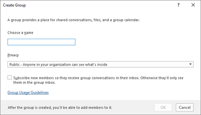

# <a name="manage-office-365-groups-with-powershell"></a>PowerShell을 사용하여 Office 365 그룹 관리
 
이 문서에서는 Microsoft PowerShell의 그룹에 대 한 일반적인 관리 작업을 수행 하는 단계를 제공 합니다. 또한 그룹에 대 한 PowerShell cmdlet도 나열 합니다. SharePoint 사이트 관리에 대 한 자세한 내용은 [PowerShell을 사용 하 여 Sharepoint Online 사이트 관리](https://docs.microsoft.com/sharepoint/manage-team-and-communication-sites-in-powershell)를 참조 하세요.

## <a name="link-to-your-office-365-groups-usage-guidelines"></a>Office 365 그룹에 연결 사용 지침
<a name="BK_LinkToGuideLines"> </a>

사용자가 [Outlook에서 그룹을 만들거나 편집할](https://support.office.com/article/04d0c9cf-6864-423c-a380-4fa858f27102.aspx)때 조직의 사용 지침에 대 한 링크를 표시할 수 있습니다. 예를 들어 그룹 이름에 특정 접두사 또는 접미사를 추가 해야 하는 경우
  
Azure Active Directory PowerShell을 사용 하 여 사용자가 조직의 Office 365 그룹에 대 한 사용 지침을 가리키도록 합니다. [그룹 설정 구성을 위한 Azure Active Directory cmdlet](https://go.microsoft.com/fwlink/?LinkID=827484) 을 확인 하 고 **디렉터리 수준에서 만들기 설정** 의 단계에 따라 사용 지침 하이퍼링크를 정의 합니다. AAD cmdlet을 실행 하면 사용자는 Outlook에서 그룹을 만들거나 편집할 때 지침에 대 한 링크를 볼 수 있습니다. 
  

  

  
## <a name="allow-users-to-send-as-the-office-365-group"></a>사용자가 Office 365 그룹으로 메일을 보낼 수 있도록 허용
<a name="BK_LinkToGuideLines"> </a>
  
Office 365 그룹을 "다른 사람 이름으로 보내기"로 설정 하려는 경우 [add-recipientpermission](https://docs.microsoft.com/powershell/module/exchange/Add-RecipientPermission) 및 [add-recipientpermission](https://docs.microsoft.com/powershell/module/exchange/Get-Recipient) cmdlet을 사용 하 여이를 구성 합니다. 이 설정을 사용 하도록 설정 하면 Office 365 그룹 사용자가 Outlook 또는 웹용 Outlook을 사용 하 여 Office 365 그룹으로 전자 메일을 보내고 회신할 수 있습니다. 사용자는 그룹으로 이동 하 여 새 전자 메일을 만들고 "다른 사람 이름으로 보내기" 필드를 그룹의 전자 메일 주소로 변경할 수 있습니다. 

([Exchange 관리 센터 에서도이 작업을 수행할 수](https://docs.microsoft.com/office365/admin/create-groups/allow-members-to-send-as-or-send-on-behalf-of-group)있습니다.)
  
*\<GroupAlias\>* 업데이트할 그룹의 별칭으로 바꾸고 *\<UserAlias\>* 사용 권한을 부여할 사용자의 별칭으로 대체 하려면 다음 스크립트를 사용 합니다. [Exchange Online PowerShell에 연결](https://docs.microsoft.com/powershell/exchange/exchange-online/connect-to-exchange-online-powershell/connect-to-exchange-online-powershell) 하 여이 스크립트를 실행 합니다.

```PowerShell
$groupAlias = "<GroupAlias>"

$userAlias = "<UserAlias>"


$groupsRecipientDetails = Get-Recipient -RecipientTypeDetails groupmailbox -Identity $groupAlias

Add-RecipientPermission -Identity $groupsRecipientDetails.Name -Trustee $userAlias -AccessRights SendAs
```

일단 cmdlet이 실행 되 면 사용자는 **보낸** 사람 필드에 그룹 전자 메일 주소를 추가 하 여 해당 그룹으로 보낼 outlook 또는 웹용 outlook으로 이동할 수 있습니다. 

## <a name="create-classifications-for-office-groups-in-your-organization"></a>조직의 Office 그룹에 대 한 분류 만들기

조직의 사용자가 Microsoft 365 그룹을 만들 때 설정할 수 있는 민감도 레이블을 만들 수 있습니다. 그룹을 분류 하려는 경우에는 이전 그룹 분류 기능 대신 민감도 레이블을 사용 하는 것이 좋습니다. 민감도 레이블 사용에 대 한 자세한 내용은 [Microsoft 팀, microsoft 365 그룹 및 SharePoint 사이트의 콘텐츠를 보호 하려면 사용 민감도 레이블을](https://docs.microsoft.com/microsoft-365/compliance/sensitivity-labels-teams-groups-sites)참조 하세요.

> [!IMPORTANT]
> 현재 분류 레이블을 사용 하는 경우 민감도 레이블이 사용 되도록 설정 되 면 그룹을 만드는 사용자는 더 이상 사용할 수 없게 됩니다.

이전 그룹 분류 기능은 계속 사용할 수 있습니다. 조직의 사용자가 Office 365 그룹을 만들 때 설정할 수 있는 분류를 만들 수 있습니다. 예를 들어 사용자가 자신이 만드는 그룹에 "Standard", "Secret" 및 "Top Secret"를 설정 하도록 허용할 수 있습니다. 그룹 분류는 기본적으로 설정 되지 않으며 사용자가이를 설정 하기 위해 만들어야 합니다. Azure Active Directory PowerShell을 사용 하 여 사용자가 Office 365 그룹에 대 한 조직의 사용 지침을 가리키도록 할 수 있습니다.
  
[그룹 설정 구성을 위한 Azure Active Directory cmdlet](https://docs.microsoft.com/azure/active-directory/users-groups-roles/groups-settings-cmdlets) 을 확인 하 고 **디렉터리 수준에서 만들기 설정** 의 단계에 따라 Office 365 그룹에 대 한 분류를 정의 합니다. 
  
```
$setting["ClassificationList"] = "Low Impact, Medium Impact, High Impact"
```

각 분류에 설명을 연결 하기 위해 *ClassificationDescriptions* settings 특성을 사용 하 여 정의할 수 있습니다.
  
```
$setting["ClassificationDescriptions"] ="Classification:Description,Classification:Description"
```

여기서 분류는 ClassificationList의 문자열과 일치 합니다.

예제:
  
```
$setting["ClassificationDescriptions"] = "Low Impact: General communication, Medium Impact: Company internal data , High Impact: Data that has regulatory requirements"
```

위의 Azure Active Directory cmdlet을 실행 하 여 분류를 설정한 후에 특정 그룹에 대 한 분류를 설정 하려면 [remove-unifiedgroup](https://docs.microsoft.com/powershell/module/exchange/Set-UnifiedGroup) cmdlet을 실행 합니다. 
  
```
Set-UnifiedGroup <LowImpactGroup@constoso.com> -Classification <LowImpact> 
```

또는 분류가 포함 된 새 그룹을 만듭니다.
  
```
New-UnifiedGroup <HighImpactGroup@constoso.com> -Classification <HighImpact> -AccessType <Public> 
```

Exchange online PowerShell을 사용 하는 방법에 대 한 자세한 내용은 exchange [online에서 powershell을 사용 하 여](https://docs.microsoft.com/powershell/exchange/exchange-online/exchange-online-powershell) 확인 하 고 [exchange Online powershell에 연결](https://docs.microsoft.com/powershell/exchange/exchange-online/connect-to-exchange-online-powershell/connect-to-exchange-online-powershell) 합니다. 
  
이러한 설정을 사용 하도록 설정 하면 그룹 소유자가 웹 및 Outlook의 Outlook에 있는 드롭다운 메뉴에서 분류를 선택 하 고 그룹 **편집** 페이지에서이를 저장할 수 있습니다. 
  

  
## <a name="hide-office-365-groups-from-gal"></a>GAL에서 Office 365 그룹 숨기기
<a name="BKMK_CreateClassification"> </a>

GAL (전체 주소 목록) 및 조직의 다른 목록에 Office 365 그룹을 표시할지 여부를 지정할 수 있습니다. 예를 들어 주소 목록에 표시 하지 않으려는 법무 부서 그룹이 있는 경우 해당 그룹이 GAL에 나타나지 않도록 할 수 있습니다. 통합 그룹 cmdlet을 실행 하 여 주소 목록에서 그룹을 다음과 같이 숨깁니다.
  
```
Set-UnifiedGroup -Identity "Legal Department" -HiddenFromAddressListsEnabled $true
```

## <a name="allow-only-internal-users-to-send-message-to-office-365-group"></a>내부 사용자만 Office 365 그룹에 메시지를 보낼 수 있도록 허용
<a name="BKMK_CreateClassification"> </a>

다른 조직의 사용자가 Office 365 그룹에 전자 메일을 보낼 수 없도록 하려면 해당 그룹의 설정을 변경 하면 됩니다. 이를 통해 내부 사용자만 그룹에 전자 메일을 보낼 수 있습니다. 외부 사용자가 해당 그룹에 메시지를 보내려고 하면 해당 그룹이 거부 됩니다.
  
다음과 같이 Remove-unifiedgroup cmdlet을 실행 하 여이 설정을 업데이트할 수 있습니다.

```
Set-UnifiedGroup -Identity "Internal senders only" -RequireSenderAuthenticationEnabled $true
```

## <a name="add-mailtips-to-the-office-365-groups"></a>Office 365 그룹에 메일 설명 추가
<a name="BKMK_CreateClassification"> </a>

보낸 사람이 Office 365 그룹에 전자 메일을 보내려고 할 때마다 메일 설명를 표시할 수 있습니다.
  
통합 그룹 cmdlet을 실행 하 여 그룹에 메일 설명를 추가 합니다.

```
Set-UnifiedGroup -Identity "MailTip Group" -MailTip "This group has a MailTip"
```

메일 설명와 함께 메일 설명에 대 한 추가 언어를 지정 하는 MailTipTranslations를 설정할 수도 있습니다. 스페인어 번역을 사용할 수 있다고 가정 하 고 다음 명령을 실행 합니다.
  
```
Set-UnifiedGroup -Identity "MailaTip Group" -MailTip "This group has a MailTip" -MailTipTranslations "@{Add="ES:Esta caja no se supervisa."
```

## <a name="change-display-name-of-the-office-365-group"></a>Office 365 그룹의 표시 이름 변경

표시 이름 Office 365 그룹의 이름을 지정 합니다. Exchange 관리 센터 또는 Office 365 관리자 포털에서이 이름을 볼 수 있습니다. Remove-unifiedgroup 명령을 실행 하 여 그룹의 표시 이름을 편집 하거나 표시 이름을 기존 Office 365 그룹에 할당할 수 있습니다.

```
Set-UnifiedGroup -Identity "mygroup@contoso.com" -DisplayName "My new group"
```

## <a name="change-the-default-setting-of-office-365-groups-for-outlook-to-public-or-private"></a>Outlook에 대 한 Office 365 그룹의 기본 설정인 공개 또는 비공개로 변경
<a name="BKMK_CreateClassification"> </a>

Outlook의 Office 365 그룹은 기본적으로 비공개로 만들어집니다. 조직에서 Office 365 그룹을 기본적으로 공용으로 생성 하려는 경우 다음 PowerShell cmdlet 구문을 사용 합니다.
  
 `Set-OrganizationConfig -DefaultGroupAccessType Public`
  
비공개로 설정 하려면 다음을 수행 합니다.
  
 `Set-OrganizationConfig -DefaultGroupAccessType Private`
  
설정을 확인 하려면 
  
 `Get-OrganizationConfig | ft DefaultGroupAccessType`
  
자세한 내용은 [set-organizationconfig](https://docs.microsoft.com/powershell/module/exchange/set-organizationconfig) 및 [Get-set-organizationconfig](https://docs.microsoft.com/powershell/module/exchange/Get-OrganizationConfig)를 참조 하십시오.
  
## <a name="office-365-groups-cmdlets"></a>Office 365 그룹 cmdlet

Office 365 그룹에서는 다음과 같은 cmdlet을 사용할 수 있습니다.
  
|**cmdlet 이름**|**설명**|
|:-----|:-----|
|[Remove-unifiedgroup](https://go.microsoft.com/fwlink/p/?LinkId=616182) <br/> |이 cmdlet을 사용 하 여 기존 Office 365 그룹을 조회 하 고 group 개체의 속성을 볼 수 있습니다.  <br/> |
|[Remove-unifiedgroup](https://go.microsoft.com/fwlink/p/?LinkId=616189) <br/> |특정 Office 365 그룹의 속성 업데이트  <br/> |
|[Remove-unifiedgroup](https://go.microsoft.com/fwlink/p/?LinkId=616183) <br/> |새 Office 365 그룹을 만듭니다. 이 cmdlet은 최소 매개 변수 집합을 제공 하며, 확장 속성에 대해 값을 설정 하려면 새 그룹을 만든 후 Remove-unifiedgroup을 사용 합니다.  <br/> |
|[Remove-unifiedgroup을 제거 합니다.](https://go.microsoft.com/fwlink/p/?LinkId=616186) <br/> |기존 Office 365 그룹 삭제  <br/> |
|[Add-unifiedgrouplinks](https://go.microsoft.com/fwlink/p/?LinkId=616194) <br/> |Office 365 그룹에 대 한 멤버 자격 및 소유자 정보 검색  <br/> |
|[Add-unifiedgrouplinks 추가](https://go.microsoft.com/fwlink/p/?LinkId=616191) <br/> |기존 Office 365 그룹에 수백 또는 수천 명의 사용자 또는 새 소유자를 추가 합니다.  <br/> |
|[Add-unifiedgrouplinks을 제거 합니다.](https://go.microsoft.com/fwlink/p/?LinkId=616195) <br/> |기존 Office 365 그룹에서 소유자 및 구성원을 제거 합니다.  <br/> |
|[UserPhoto](https://go.microsoft.com/fwlink/p/?LinkId=536510) <br/> |계정에 연결 된 사용자 사진에 대 한 정보를 확인 하는 데 사용 됩니다. Active Directory에 사용자 사진 저장  <br/> |
|[UserPhoto](https://go.microsoft.com/fwlink/p/?LinkId=536511) <br/> |사용자 사진을 계정에 연결 하는 데 사용 됩니다. Active Directory에 사용자 사진 저장  <br/> |
|[UserPhoto](https://go.microsoft.com/fwlink/p/?LinkId=536512) <br/> |Office 365 그룹의 사진 제거  <br/> |

## <a name="related-topics"></a>관련 항목

[Office 365 그룹으로 메일 그룹 업그레이드](https://docs.microsoft.com/office365/admin/manage/upgrade-distribution-lists)

[Office 365 그룹을 만들 수 있는 사용자 관리](https://docs.microsoft.com/office365/admin/create-groups/manage-creation-of-groups)

[Office 365 그룹에 대한 게스트 액세스 관리](https://support.office.com/article/bfc7a840-868f-4fd6-a390-f347bf51aff6)

[에서 정적 그룹 구성원을 동적으로 변경](https://docs.microsoft.com/azure/active-directory/users-groups-roles/groups-change-type)
