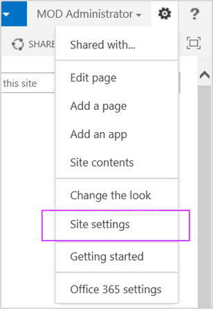

# <a name="manage-sharepoint-online-site-groups-with-office-365-powershell"></a><span data-ttu-id="711aa-103">Manage SharePoint Online site groups with Office 365 PowerShell</span><span class="sxs-lookup"><span data-stu-id="711aa-103">Manage SharePoint Online site groups with Office 365 PowerShell</span></span>

 <span data-ttu-id="711aa-104">**요약:** Office 365 PowerShell을 사용 하 여 SharePoint Online 사이트 그룹을 관리 합니다.</span><span class="sxs-lookup"><span data-stu-id="711aa-104">**Summary:** Use Office 365 PowerShell to manage SharePoint Online site groups.</span></span>
  
<span data-ttu-id="711aa-105">Microsoft 365 관리 센터를 사용할 수도 있지만 Office 365 PowerShell을 사용 하 여 SharePoint Online 사이트 그룹을 관리할 수도 있습니다.</span><span class="sxs-lookup"><span data-stu-id="711aa-105">Although you can use the Microsoft 365 admin center, you can also use Office 365 PowerShell to manage your SharePoint Online site groups.</span></span>

## <a name="before-you-begin"></a><span data-ttu-id="711aa-106">시작하기 전에</span><span class="sxs-lookup"><span data-stu-id="711aa-106">Before you begin</span></span>

<span data-ttu-id="711aa-107">이 문서의 절차를 수행 하려면 SharePoint Online에 연결 해야 합니다.</span><span class="sxs-lookup"><span data-stu-id="711aa-107">The procedures in this article require you to connect to SharePoint Online.</span></span> <span data-ttu-id="711aa-108">자세한 내용은 [SharePoint Online PowerShell에 연결을](https://docs.microsoft.com/powershell/sharepoint/sharepoint-online/connect-sharepoint-online?view=sharepoint-ps)참조 하세요.</span><span class="sxs-lookup"><span data-stu-id="711aa-108">For instructions, see [Connect to SharePoint Online PowerShell](https://docs.microsoft.com/powershell/sharepoint/sharepoint-online/connect-sharepoint-online?view=sharepoint-ps).</span></span>

## <a name="view-sharepoint-online-with-office-365-powershell"></a><span data-ttu-id="711aa-109">Office 365 PowerShell을 사용 하 여 SharePoint Online 보기</span><span class="sxs-lookup"><span data-stu-id="711aa-109">View SharePoint Online with Office 365 PowerShell</span></span>

<span data-ttu-id="711aa-110">SharePoint Online 관리 센터에는 사이트 그룹을 관리 하기 위한 사용 하기 쉬운 몇 가지 방법이 있습니다.</span><span class="sxs-lookup"><span data-stu-id="711aa-110">The SharePoint Online admin center has some easy-to-use methods for managing site groups.</span></span> <span data-ttu-id="711aa-111">예를 들어 `https://litwareinc.sharepoint.com/sites/finance` 사이트의 그룹 및 그룹 구성원을 확인 하려는 경우를 가정해 보겠습니다.</span><span class="sxs-lookup"><span data-stu-id="711aa-111">For example, suppose you want to look at the groups, and the group members, for the `https://litwareinc.sharepoint.com/sites/finance` site.</span></span> <span data-ttu-id="711aa-112">수행 해야 하는 작업은 다음과 같습니다.</span><span class="sxs-lookup"><span data-stu-id="711aa-112">Here’s what you have to do to:</span></span>

1. <span data-ttu-id="711aa-113">Microsoft 365 관리 센터에서 **리소스** > **사이트**를 클릭 한 다음 사이트의 URL을 클릭 합니다.</span><span class="sxs-lookup"><span data-stu-id="711aa-113">From the Microsoft 365 admin center, click **Resources** > **Sites**, and then click the URL of the site.</span></span>
2. <span data-ttu-id="711aa-114">사이트 모음 대화 상자에서 **이 사이트로 이동을**클릭 합니다.</span><span class="sxs-lookup"><span data-stu-id="711aa-114">In the site collection dialog box, click **Go to this site**.</span></span>
3. <span data-ttu-id="711aa-115">사이트 페이지에서 페이지 오른쪽 위 모서리에 있는 **설정** 아이콘을 클릭 한 다음 **사이트 설정을**클릭 합니다.</span><span class="sxs-lookup"><span data-stu-id="711aa-115">On the site page, click the **Settings** icon (located in the upper right-hand corner of the page) and then click **Site settings**:</span></span><br/>
<span data-ttu-id="711aa-116"></span><span class="sxs-lookup"><span data-stu-id="711aa-116"></span></span><br/>
4. <span data-ttu-id="711aa-117">사이트 설정 페이지의 **사용자 및 사용 권한**에서 **사이트 사용 권한을** 클릭 합니다.</span><span class="sxs-lookup"><span data-stu-id="711aa-117">On the Site Settings page, click **Sites permissions** under **Users and Permissions**.</span></span>

<span data-ttu-id="711aa-118">확인하려는 다음 사이트에 대해 프로세스를 반복합니다.</span><span class="sxs-lookup"><span data-stu-id="711aa-118">And then repeat the process for the next site you want to look at.</span></span>

<span data-ttu-id="711aa-119">Office 365 PowerShell을 사용 하 여 그룹 목록을 가져오려면 다음 명령 집합을 사용 합니다.</span><span class="sxs-lookup"><span data-stu-id="711aa-119">To get a list of the groups with Office 365 PowerShell, you would use the following command set:</span></span>

```
$siteURL = "https://litwareinc.sharepoint.com/sites/finance"
$x = Get-SPOSiteGroup -Site $siteURL
foreach ($y in $x)
    {
        Write-Host $y.Title -ForegroundColor "Yellow"
        Get-SPOSiteGroup -Site $siteURL -Group $y.Title | Select-Object -ExpandProperty Users
        Write-Host
    }
```

<span data-ttu-id="711aa-120">SharePoint Online 관리 셸 명령 프롬프트에서이 명령 집합을 실행 하는 방법에는 두 가지가 있습니다.</span><span class="sxs-lookup"><span data-stu-id="711aa-120">There are two ways to run this command set in the SharePoint Online Management Shell command prompt:</span></span>

- <span data-ttu-id="711aa-121">메모장 (또는 다른 텍스트 편집기)에 명령을 복사 하 고 **$siteURL** 변수의 값을 수정한 다음 명령을 선택 하 여 SharePoint Online 관리 셸 명령 프롬프트에 붙여 넣습니다.</span><span class="sxs-lookup"><span data-stu-id="711aa-121">Copy the commands into Notepad (or another text editor), modify the value of the **$siteURL** variable, select the commands, and then paste them into the SharePoint Online Management Shell command prompt.</span></span> <span data-ttu-id="711aa-122">이렇게 하면 PowerShell이 **>>** 프롬프트에서 중지 됩니다.</span><span class="sxs-lookup"><span data-stu-id="711aa-122">When you do, PowerShell will stop at a **>>** prompt.</span></span> <span data-ttu-id="711aa-123">Enter 키를 눌러 **foreach** 명령을 실행 합니다.</span><span class="sxs-lookup"><span data-stu-id="711aa-123">Press Enter to execute the **foreach** command.</span></span><br/>
- <span data-ttu-id="711aa-124">메모장 (또는 다른 텍스트 편집기)에 명령을 복사 하 고 **$siteURL** 변수의 값을 수정한 다음이 텍스트 파일을 적절 한 폴더에 이름을 지정 하 고 ps1 확장명을 사용 하 여 저장 합니다.</span><span class="sxs-lookup"><span data-stu-id="711aa-124">Copy the commands into Notepad (or another text editor), modify the value of the **$siteURL** variable, and then save this text file with a name and the .ps1 extension in a suitable folder.</span></span> <span data-ttu-id="711aa-125">다음으로, 경로와 파일 이름을 지정 하 여 SharePoint Online 관리 셸 명령 프롬프트에서 스크립트를 실행 합니다.</span><span class="sxs-lookup"><span data-stu-id="711aa-125">Next, run the script from the SharePoint Online Management Shell command prompt by specifying its path and file name.</span></span> <span data-ttu-id="711aa-126">예제 명령은 다음과 같습니다.</span><span class="sxs-lookup"><span data-stu-id="711aa-126">Here is an example command:</span></span>

```
C:\Scripts\SiteGroupsAndUsers.ps1
```

<span data-ttu-id="711aa-127">두 경우 모두에 다음과 같은 내용이 표시 됩니다.</span><span class="sxs-lookup"><span data-stu-id="711aa-127">In both cases, you should see something similar to this:</span></span>


<span data-ttu-id="711aa-129">사이트 `https://litwareinc.sharepoint.com/sites/finance`에 대해 만들어진 모든 그룹 및 해당 그룹에 할당 된 모든 사용자입니다.</span><span class="sxs-lookup"><span data-stu-id="711aa-129">These are all the groups that have been created for the site `https://litwareinc.sharepoint.com/sites/finance`, and all the users assigned to those groups.</span></span> <span data-ttu-id="711aa-130">그룹 이름은 노란색으로 되어 그룹 이름을 해당 구성원 으로부터 구분 하는 데 도움이 됩니다.</span><span class="sxs-lookup"><span data-stu-id="711aa-130">The group names are in yellow to help you separate group names from their members.</span></span>

<span data-ttu-id="711aa-131">또 다른 예로, 모든 SharePoint Online 사이트에 대 한 그룹 및 모든 그룹 구성원 자격이 나열 된 명령 집합입니다.</span><span class="sxs-lookup"><span data-stu-id="711aa-131">As another example, here is a command set that lists the groups, and all the group memberships, for all of your SharePoint Online sites.</span></span>

```
$x = Get-SPOSite
foreach ($y in $x)
    {
        Write-Host $y.Url -ForegroundColor "Yellow"
        $z = Get-SPOSiteGroup -Site $y.Url
        foreach ($a in $z)
            {
                 $b = Get-SPOSiteGroup -Site $y.Url -Group $a.Title 
                 Write-Host $b.Title -ForegroundColor "Cyan"
                 $b | Select-Object -ExpandProperty Users
                 Write-Host
            }
    }
```
    
## <a name="see-also"></a><span data-ttu-id="711aa-132">참고 항목</span><span class="sxs-lookup"><span data-stu-id="711aa-132">See also</span></span>

[<span data-ttu-id="711aa-133">SharePoint Online PowerShell에 연결</span><span class="sxs-lookup"><span data-stu-id="711aa-133">Connect to SharePoint Online PowerShell</span></span>](https://docs.microsoft.com/powershell/sharepoint/sharepoint-online/connect-sharepoint-online?view=sharepoint-ps)

[<span data-ttu-id="711aa-134">SharePoint Online 사이트를 만들고 Office 365 PowerShell을 사용하여 사용자 추가</span><span class="sxs-lookup"><span data-stu-id="711aa-134">Create SharePoint Online sites and add users with Office 365 PowerShell</span></span>](create-sharepoint-sites-and-add-users-with-powershell.md)

[<span data-ttu-id="711aa-135">Office 365 PowerShell을 사용하여 SharePoint Online 사용자 및 그룹 관리</span><span class="sxs-lookup"><span data-stu-id="711aa-135">Manage SharePoint Online users and groups with Office 365 PowerShell</span></span>](manage-sharepoint-users-and-groups-with-powershell.md)

[<span data-ttu-id="711aa-136">Office 365 PowerShell 사용한 Office 365 관리</span><span class="sxs-lookup"><span data-stu-id="711aa-136">Manage Office 365 with Office 365 PowerShell</span></span>](manage-office-365-with-office-365-powershell.md)
  
[<span data-ttu-id="711aa-137">Office 365 PowerShell 시작</span><span class="sxs-lookup"><span data-stu-id="711aa-137">Getting started with Office 365 PowerShell</span></span>](getting-started-with-office-365-powershell.md)

