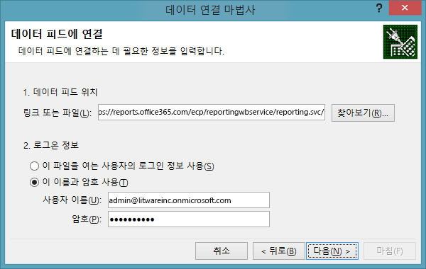
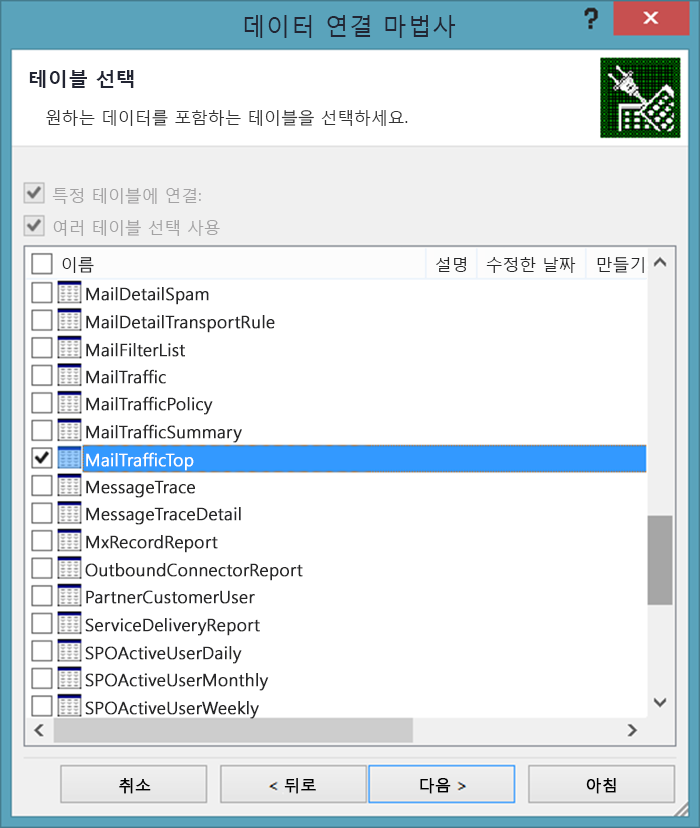
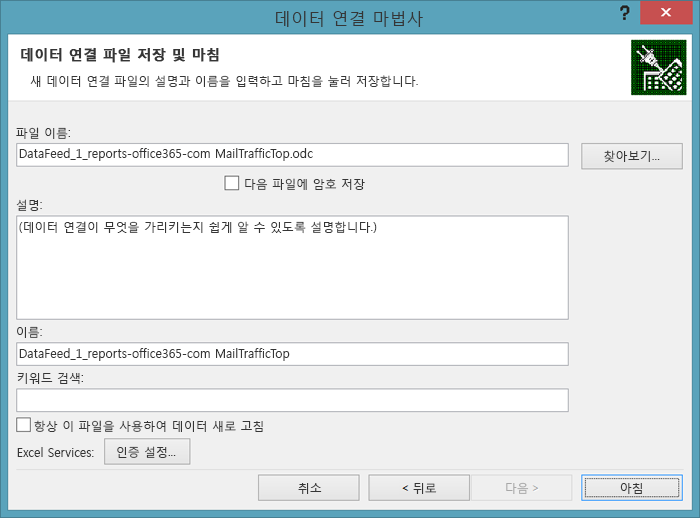
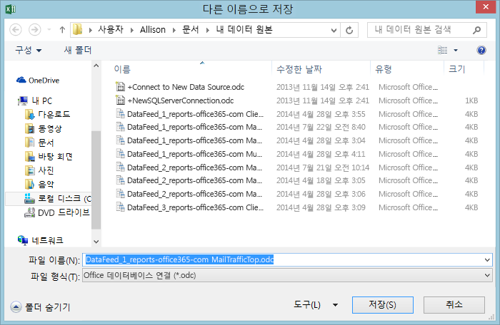
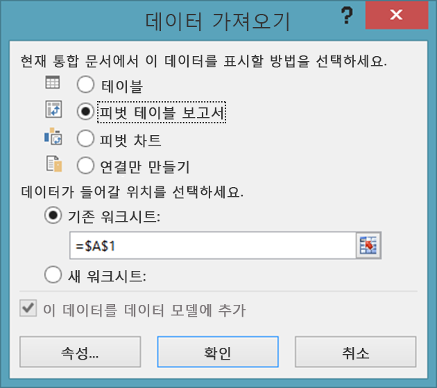
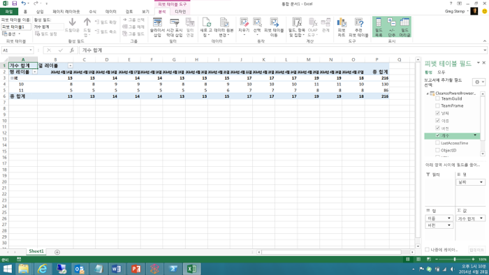

# <a name="using-excel-to-retrieve-office-365-reporting-data"></a><span data-ttu-id="3c753-103">Excel을 사용하여 Office 365 보고 데이터 검색</span><span class="sxs-lookup"><span data-stu-id="3c753-103">Using Excel to Retrieve Office 365 Reporting Data</span></span>

 <span data-ttu-id="3c753-104">**요약:** Microsoft Excel의 oData 기능을 사용하여 Office 365 배포에 대한 자세한 보고 정보를 검색합니다.</span><span class="sxs-lookup"><span data-stu-id="3c753-104">**Summary:** Use the oData feature in Microsoft Excel to retrieve detailed reporting information for your deployment of Office 365</span></span>
  
<span data-ttu-id="3c753-p101">보고는 시스템 관리의 핵심 부분입니다. Office 365 관리 센터는 미리 정의된 보고서를 다수 포함하고 있으며, 왼쪽 탐색의 **보고서** 섹션에서 액세스할 수 있습니다. 여기에는 사용 현황 보고서와 보안 및 준수 보고서가 있습니다.</span><span class="sxs-lookup"><span data-stu-id="3c753-p101">Reporting is a key part of system administration. The Office 365 Admin center includes a number of predefined reports, which you can access from the **Reports** section of the left navigation. There are usage reports and security and compliance reports.</span></span>
  
<span data-ttu-id="3c753-p102">사용할 수 있는 보고서는 사용 중인 Office 365 버전 및 사용하도록 설정한 Office 365 서비스에 따라 다릅니다. 자세한 내용은 [보고서 페이지]((https://technet.microsoft.com/ko-KR/library/office-365-reports.aspx))를 참조하세요.</span><span class="sxs-lookup"><span data-stu-id="3c753-p102">The reports available to you depend on the version of Office 365 you are using and which Office 365 services you have enabled. For more information, see the [Reports page]((https://technet.microsoft.com/ko-KR/library/office-365-reports.aspx)).</span></span>
  
<span data-ttu-id="3c753-p103">미리 정의된 관리 센터 보고서는 유용한 리소스입니다. 이 보고서를 사용하면 사서함 사용량이나 사용자가 온라인 회의에 소요한 시간(분)과 같은 사항을 쉽게 확인할 수 있습니다. 그러나 이러한 보고서는 Office 365 도메인을 자세히 분석할 때 몇 가지 제한이 있습니다.</span><span class="sxs-lookup"><span data-stu-id="3c753-p103">The pre-defined Admin center reports are an excellent resource. They make it easy to check on such things as mailbox usage or the number of minutes that your users have been spending in online conferences. However, when it comes to detailed analysis of your Office 365 domain, the reports do have their limitations.</span></span>
  
<span data-ttu-id="3c753-p104">이러한 제한을 해결하는 한 가지 방법은 Windows PowerShell 또는 다른 개발 언어를 사용하여 Office 365 보고 서비스에 액세스하여 사용자 지정 보고서를 만드는 것입니다. 사용자 지정 보고서를 사용하면 Office 365 보고 서비스에서 반환되는 데이터 및 데이터 양을 나타낼 수 있습니다. 사용자 지정 보고서를 작성하여 데이터를 정렬 및 그룹화하는 방법을 지정할 수도 있고, 해당되는 경우 이러한 데이터가 저장되는 방식을 지정할 수도 있습니다. 예를 들어 데이터를 XML 형식 또는 Excel에서 쉽게 가져올 수 있는 쉼표로 구분된 값 형식으로 저장할 수 있습니다.</span><span class="sxs-lookup"><span data-stu-id="3c753-p104">One way to work around these limitations is to use Windows PowerShell or another development language to access the Office 365 reporting service and create custom reports; custom reports give you the ability to dictate which data (and how much data) is returned from the Office 365 reporting service. By writing custom reports you can also specify how the data should be sorted and grouped, and, if applicable, how that data should be saved; for example, you can save data in XML format or in a comma-separated values format that can easily be imported in Excel.</span></span> 
  
<span data-ttu-id="3c753-p105">또한 사용자 지정 스크립트/응용 프로그램을 사용하여 Office 365 관리 센터에서는 사용할 수 없는 보고서에 액세스할 수 있습니다. 예를 들어 관리 센터는 보유하고 있는 오래된 사서함의 수를 알려줄 수는 있지만 지난 30일 동안 액세스하지 않은 사서함이 어느 것인지 알려줄 수는 없습니다. 사용자 지정 PowerShell 스크립트로는 이러한 사실을 확인할 수 있습니다. 이러한 기능을 함께 사용하면 아주 유연하게 작업할 수 있으므로 짧으면서 비교적 간단한 Windows PowerShell 스크립트만 작성하면 됩니다.</span><span class="sxs-lookup"><span data-stu-id="3c753-p105">In addition, custom scripts/applications enable you to access reports that are not available in the Office 365 Admin center. For example, the Admin center can tell you how many stale mailboxes you have, but it can't tell which mailboxes haven't been accessed in the past 30 days. That is something that a custom PowerShell script can tell you. Taken together, this represents an enormous amount of flexibility in return for having to write a short and relatively-simple Windows PowerShell script.</span></span>
  
> [!VISUAL BASIC NOTE]<span data-ttu-id="3c753-119"> Office 365 보고 서비스에 대한 자세한 내용은 [홈 페이지](https://msdn.microsoft.com/en-us/library/office/jj984325%28v=office.15%29.aspx)를 참조하세요.</span><span class="sxs-lookup"><span data-stu-id="3c753-119"> For more information, see the [home page](https://msdn.microsoft.com/en-us/library/office/jj984325%28v=office.15%29.aspx) for the Office 365 reporting service.</span></span>
  
<span data-ttu-id="3c753-p106">이 데이터를 검색하려면 일종의 코드를 작성해야 합니다. 반환되는 정보의 양과 유형을 제한해야 하는 더 큰 조직에 있는 경우 이러한 작업이 중요합니다. 그러나 규모가 좀 더 작은 조직이고 반환되는 정보의 양과 유형을 제한할 필요가 없는 경우라면 Excel 자체에서 Office 365 보고서를 여는 것을 고려할 수 있습니다.</span><span class="sxs-lookup"><span data-stu-id="3c753-p106">In order to retrieve this data, you do have to write code of some kind. That's worth it if you are a larger organization that needs to limit the amount and the type of information that gets returned. But if you're a smaller organization, and you don't need to limit the amount and type of information that gets returned, you might consider opening the Office 365 reports from within Excel itself.</span></span>
  
<span data-ttu-id="3c753-p107">하지만 몇 가지 제한 사항이 있다는 사실만 인식하면 됩니다. 먼저 데이터가 반환되기 전에는 데이터를 필터링, 정렬, 선택하거나 달리 조작할 수 없습니다. 대신 보고서에서 반환되는 기본 데이터 집합만 볼 수 있습니다. 일부 경우에는 데이터가 충분하지 않을 수 있습니다. 예를 들어 보고서가 전체 연도가 아닌 이전 달의 데이터만 반환할 수 있습니다. 이와는 대조적으로 데이터가 너무 많을 수도 있습니다. 이전 달의 데이터만 원함에도 전체 연도의 데이터가 반환될 수 있습니다.</span><span class="sxs-lookup"><span data-stu-id="3c753-p107">However, there are a few limitations here, the primary one being this: you cannot filter, sort, select, or otherwise manipulate the data that before it gets returned. Instead, you simply get back the default set of data returned by the report. In some cases that might not be enough data. For example, the report might return data for, say, only the previous month and not for the entire year. Conversely, in other cases that might be too much data: you might get back data for the entire year even though you only want data for the previous month.</span></span>
  
<span data-ttu-id="3c753-128">Excel 내에서 직접 Office 365 보고서를 열려면 다음 절차를 완료합니다.</span><span class="sxs-lookup"><span data-stu-id="3c753-128">To open an Office 365 report directly from within Excel, complete the following procedure:</span></span>
  
1. <span data-ttu-id="3c753-p108">먼저 Excel에서 새 워크시트를 엽니다. 해당 워크시트에서 **데이터** 와 **기타 원본** 을 차례로 클릭한 다음 **OData 피드** 를 클릭합니다. 이렇게 하면 **데이터 연결 마법사** 대화 상자가 표시됩니다.</span><span class="sxs-lookup"><span data-stu-id="3c753-p108">Start by opening a new worksheet in Excel. On that worksheet, click **Data**, click **From Other Sources**, and then click **From OData Data Feed**. That brings up the **Data Connection Wizard** dialog box:</span></span>
    
     
  
2. <span data-ttu-id="3c753-p109">**데이터 피드에 연결** 페이지에서 **https://reports.office365.com/ecp/reportingwebservice/reporting.svc/** 를 데이터 피드 위치로 입력합니다. 표시된 것처럼 기본 URL만 입력할 수 있고 Select, Filter 또는 Format 문은 추가할 수 없습니다. 기본 URL 이외의 항목을 입력하면 어떤 데이터도 반환되지 않으며 다음과 같은 오류 메시지가 표시됩니다.</span><span class="sxs-lookup"><span data-stu-id="3c753-p109">On the **Connect to a Data Feed** page, enter **https://reports.office365.com/ecp/reportingwebservice/reporting.svc/** as the data feed location. Note that you can only enter the base URL as shown; you cannot add any Select, Filter, or Format statements. If you enter anything but the base URL you won't get back any data; instead, you'll simply see the following error message:</span></span>
    
     
  
3. <span data-ttu-id="3c753-p110">보고 서비스 URL을 입력한 후 **로그온 자격 증명** 에서 **이 이름과 암호 사용** 을 선택합니다. **사용자 이름** 상자에 Office 365 로그온 이름(예: admin@litwareinc.onmicrosoft.com)을 입력합니다. **암호** 상자에 Office 365 로그온 암호를 입력한 후 **다음** 을 클릭합니다. Excel은 제공된 자격 증명을 사용하여 보고 서비스에 연결하려고 합니다.</span><span class="sxs-lookup"><span data-stu-id="3c753-p110">After entering the reporting service URL, select **Use this name and password** under **Log on credentials**. In the **User Name** box, enter your Office 365 logon name (for example, admin@litwareinc.onmicrosoft.com). In the **Password** box, enter your Office 365 logon password and then click **Next**. Excel will then attempt to connect to the reporting service using the supplied credentials.</span></span>
    
4. <span data-ttu-id="3c753-p111">인증을 받으면 **표 선택** 페이지가 표시됩니다. 보려는 보고서(예: **MailTrafficTop** )를 선택하고 **다음** 을 클릭합니다.</span><span class="sxs-lookup"><span data-stu-id="3c753-p111">After you have been authenticated, you'll see the **Select Tables** page. Select the report that you'd like to view (for example, **MailTrafficTop** ) and then click **Next**:</span></span>
    
     
  
    > [!NOTE]
    > <span data-ttu-id="3c753-p112">여러 보고서를 선택할 수 있습니다. 이렇게 하면 여러 표/차트가 Excel 스프레드시트에 추가됩니다. 또한 여러 보고서의 데이터를 조합하는 표/차트를 만들 수도 있습니다. 그러나 본 소개 문서에서는 이 내용을 다루지 않습니다.</span><span class="sxs-lookup"><span data-stu-id="3c753-p112">It's possible to select multiple reports; that results in multiple tables/charts being added to your Excel spreadsheet. It's even possible to create a single table/chart that combines data from multiple reports. However, we won't discuss that in this introductory article.</span></span> 
  
5. <span data-ttu-id="3c753-147">**다음** 을 클릭하면 **데이터 연결 파일 저장 및 마침** 페이지가 표시됩니다.</span><span class="sxs-lookup"><span data-stu-id="3c753-147">After clicking **Next** you'll be presented with the **Save Data Connection File and Finish** page:</span></span>
    
     
  
    <span data-ttu-id="3c753-p113">여기에는 정보를 입력하지 않아도 됩니다. 데이터를 검색하려면 **마침** 만 클릭하면 됩니다. 그러나 Excel에서 사용자가 만든 각 데이터 연결에 대한 정보를 저장한다는 사실은 기억해 두는 것이 좋습니다. 이 데이터는 **내 데이터 원본** 폴더에 저장됩니다.</span><span class="sxs-lookup"><span data-stu-id="3c753-p113">You don't have to enter any information here. All you need to do to retrieve your data is to click **Finish**. However, it's worth noting that, by default, Excel saves information about each data connection you make; this data is stored in your **My Data Sources** folder:</span></span>
    
     
  
    <span data-ttu-id="3c753-p114">이 대화 상자에는 **이름** 및 **키워드 검색** 과 같은 레이블이 붙은 텍스트 상자가 포함되어 있습니다. 이러한 옵션을 사용하여 해당 데이터 연결을 사용자 지정할 수 있습니다. 이렇게 해야 다음과 같은 전체 데이터 원본이 표시되지 않습니다.</span><span class="sxs-lookup"><span data-stu-id="3c753-p114">That's why the dialog box includes text boxes with labels like **Friendly Name** and **Search Keywords**; these options give you the chance to customize these data connections. That way you do not end up with a whole bunch of data sources that look like these:</span></span>
    
  ```
  DataFeed_1_reports-office365-com ClientSoftwareBrowserDetail.odc
DataFeed_1_reports-office365-com MailTrafficTop.odc
DataFeed_1_reports-office365-com Multiple Tables.odc
DataFeed_2_reports-office365-com MailboxActivityWeekly.odc
DataFeed_2_reports-office365-com MailTrafficTop.odc
DataFeed_3_reports-office365-com ClientSoftwareBrowserDetail.odc
  ```

<span data-ttu-id="3c753-p115">**파일에 암호 저장** 확인란을 선택하면 이러한 데이터 필드를 다시 사용할 수 있습니다. 예를 들어 데이터 연결을 **클라이언트 브라우저 보고서** 로 저장하는 경우 다음 번부터는 Office 365 도메인 액세스에 사용되는 웹 브라우저에 대한 정보를 알고 싶을 때 데이터 연결 마법사를 진행할 필요가 없습니다. 대신 Excel을 열고 **데이터** 를 클릭한 다음 **기존 원본** 을 클릭하기만 하면 됩니다. **기존 연결** 대화 상자에서 원하는 데이터 연결을 선택하고 **확인** 을 클릭합니다.</span><span class="sxs-lookup"><span data-stu-id="3c753-p115">If you select the checkbox **Save password in file**, you'll be able to reuse these data feeds. For example, suppose you save a data connection as **Client Browser Report**. The next time you want information about the web browsers being used to access your Office 365 domain you don't have to walk through the data connection wizard. Instead, all you need to do is open Excel, click **Data**, and then click **Existing Sources**. Select the desired data connection in the **Existing Connections** dialog box and then click **OK**:</span></span>
    

  
<span data-ttu-id="3c753-161">이때는 Excel에서 자동으로 해당 연결을 설정하고 데이터를 검색합니다.</span><span class="sxs-lookup"><span data-stu-id="3c753-161">At that point, Excel will make the connection for you and retrieve the data.</span></span>
    
<span data-ttu-id="3c753-p116">이러한 .ODC 파일은 일반 텍스트 XML 파일입니다. 이러한 일반 텍스트 XML 파일에는 Office 365 사용자 이름 및 암호가 포함되어 있습니다.</span><span class="sxs-lookup"><span data-stu-id="3c753-p116">Note that these .ODC files are plain-text XML files. Included in these plain-text XML files are your Office 365 user name and password:</span></span>
    
<span data-ttu-id="3c753-164">\<odc:ConnectionString>Data Source=https://reports.office365.com/ecp/reportingwebservice/reporting.svc/;Namespaces to Include=\*;Max Received Message Size=4398046511104;Integrated Security=Basic; **User ID=admin@litwareinc.onmicrosoft.com;Password=MYpassw0rd!**;Persist Security Info=false;Service Document Url=https://reports.office365.com/ecp/reportingwebservice/reporting.svc/\</odc:ConnectionString></span><span class="sxs-lookup"><span data-stu-id="3c753-164">\<odc:ConnectionString>Data Source=https://reports.office365.com/ecp/reportingwebservice/reporting.svc/;Namespaces to Include=\*;Max Received Message Size=4398046511104;Integrated Security=Basic; **User ID=admin@litwareinc.onmicrosoft.com;Password=MYpassw0rd!**;Persist Security Info=false;Service Document Url=https://reports.office365.com/ecp/reportingwebservice/reporting.svc/\</odc:ConnectionString></span></span>
    
<span data-ttu-id="3c753-p117">사용자 이름과 암호를 일반 텍스트 파일에 저장하고 싶지 않은 경우 **파일에 암호 저장** 확인란을 선택하지 않도록 합니다. 확인란을 선택하는 경우 이러한 데이터 연결을 다시 사용할 수 없게 됩니다. 사용자 이름과 암호가 없으면 Office 365는 사용자의 서비스 로그온 시도를 인증할 수 없습니다.</span><span class="sxs-lookup"><span data-stu-id="3c753-p117">If you don't like the idea of saving your user name and password in a plain-text file, then don't check the box labeled **Save password in file**. If you do that, however, keep in mind that you won't be able to reuse these data connections. That's because, without the user name and password, Office 365 will not be able to authenticate your attempt to log on to the service.</span></span>
    
6. <span data-ttu-id="3c753-168">**데이터 연결 파일 저장 및 마침** 페이지에서 **마침** 을 클릭하면 **데이터 가져오기** 대화 상자가 제공됩니다.</span><span class="sxs-lookup"><span data-stu-id="3c753-168">Click **Finish** on the **Save Data Connection File and Finish** page you'll be presented with the **Import Data** dialog box:</span></span>
    
     
  
7. <span data-ttu-id="3c753-p118">보기 옵션(예: **피벗 테이블 보고서** )을 선택하고 **확인** 을 클릭합니다. 모든 작업이 문제 없이 진행되면 데이터를 가져온 후 선택한 보기 옵션에 표시합니다.</span><span class="sxs-lookup"><span data-stu-id="3c753-p118">Select your view options (for example, **PivotTable Report** ) and then click **OK**. If all goes well, your data will be imported and be presented in whichever view option you happened to choose:</span></span>
    
     
  
<span data-ttu-id="3c753-p119">해당 데이터의 용도는 전적으로 사용자에게 달려 있습니다. 제안 사항을 보려면 [oData 데이터 피드를 사용하여 Excel Services 대시보드 만들기](https://technet.microsoft.com/en-us/library/jj873965%28v=office.15%29.aspx)를 참조하세요. 이 문서는 Office 365 보고 서비스를 사용하지는 않지만 새 대시보드에 필터 및 슬라이서를 추가하는 작업과 같은 간단한 작업에 대한 힌트를 제공합니다.</span><span class="sxs-lookup"><span data-stu-id="3c753-p119">What you do with that data is then entirely up to you. For some suggestions. take a look at [Create an Excel Services dashboard using an oData data feed](https://technet.microsoft.com/en-us/library/jj873965%28v=office.15%29.aspx). Although that article doesn't use the Office 365 reporting service, it does provide some handy hints for doing things like adding filters and slicers to your new dashboard.</span></span>
  
## <a name="see-also"></a><span data-ttu-id="3c753-177">참고 항목</span><span class="sxs-lookup"><span data-stu-id="3c753-177">See also</span></span>

#### 

[<span data-ttu-id="3c753-178">Office 365 PowerShell 사용한 Office 365 관리</span><span class="sxs-lookup"><span data-stu-id="3c753-178">Manage Office 365 with Office 365 PowerShell</span></span>](manage-office-365-with-office-365-powershell.md)
  
[<span data-ttu-id="3c753-179">Office 365 PowerShell 시작</span><span class="sxs-lookup"><span data-stu-id="3c753-179">Getting started with Office 365 PowerShell</span></span>](getting-started-with-office-365-powershell.md)
  
[<span data-ttu-id="3c753-180">Office 365에서 Windows PowerShell을 사용하여 보고서 만들기</span><span class="sxs-lookup"><span data-stu-id="3c753-180">Use Windows PowerShell to create reports in Office 365</span></span>](use-windows-powershell-to-create-reports-in-office-365.md)

