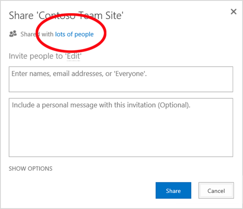

# <a name="why-you-need-to-use-powershell-for-microsoft-365"></a><span data-ttu-id="21427-103">Microsoft 365 용 PowerShell을 사용 해야 하는 이유</span><span class="sxs-lookup"><span data-stu-id="21427-103">Why you need to use PowerShell for Microsoft 365</span></span>

<span data-ttu-id="21427-104">*이 문서는 Microsoft 365 Enterprise 및 Office 365 Enterprise에 모두 적용 됩니다.*</span><span class="sxs-lookup"><span data-stu-id="21427-104">*This article applies to both Microsoft 365 Enterprise and Office 365 Enterprise.*</span></span>

<span data-ttu-id="21427-105">Microsoft 365 관리 센터를 사용 하 여 Microsoft 365 사용자 계정 및 라이선스를 관리할 수 있을 뿐만 아니라 Exchange Online, 팀 및 SharePoint Online과 같은 Microsoft 365 서비스를 관리할 수도 있습니다.</span><span class="sxs-lookup"><span data-stu-id="21427-105">With the Microsoft 365 admin center, you can not only manage your Microsoft 365 user accounts and licenses, but you can also manage your Microsoft 365 services such as Exchange Online, Teams, and SharePoint Online.</span></span> <span data-ttu-id="21427-106">그러나 PowerShell 명령을 사용 하 여 이러한 요소를 관리 하 고 속도, 자동화 및 추가 기능에 대 한 명령줄 및 스크립팅 언어 환경을 활용할 수도 있습니다.</span><span class="sxs-lookup"><span data-stu-id="21427-106">However, you can also manage these elements with PowerShell commands, taking advantage of a command-line and scripting language environment for speed, automation, and additional capability.</span></span>
  
<span data-ttu-id="21427-107">이 문서에서는 PowerShell을 사용 하 여 Microsoft 365를 관리할 수 있는 다음과 같은 방법을 보여 줍니다.</span><span class="sxs-lookup"><span data-stu-id="21427-107">In this article, we'll show you these ways in which you can use PowerShell to manage Microsoft 365:</span></span>
  
- <span data-ttu-id="21427-108">Microsoft 365 관리 센터에서 볼 수 없는 추가 정보 표시</span><span class="sxs-lookup"><span data-stu-id="21427-108">Reveal additional information that you cannot see with the Microsoft 365 admin center</span></span>
    
- <span data-ttu-id="21427-109">PowerShell로 가능한 기능 및 설정 구성</span><span class="sxs-lookup"><span data-stu-id="21427-109">Configure features and settings only possible with PowerShell</span></span>
    
- <span data-ttu-id="21427-110">대량 작업 수행</span><span class="sxs-lookup"><span data-stu-id="21427-110">Perform bulk operations</span></span>
    
- <span data-ttu-id="21427-111">데이터 필터링</span><span class="sxs-lookup"><span data-stu-id="21427-111">Filtering data</span></span>
    
- <span data-ttu-id="21427-112">데이터 인쇄 또는 저장</span><span class="sxs-lookup"><span data-stu-id="21427-112">Print or save data</span></span>
    
- <span data-ttu-id="21427-113">서비스 간 관리</span><span class="sxs-lookup"><span data-stu-id="21427-113">Manage across services</span></span>
    
<span data-ttu-id="21427-114">시작 하기 전에 Microsoft 365 용 PowerShell이 windows 기반 서비스 및 플랫폼용 명령줄 환경인 Windows PowerShell 용 모듈 집합 인지 이해 합니다.</span><span class="sxs-lookup"><span data-stu-id="21427-114">Before you begin, understand that PowerShell for Microsoft 365 is a set of modules for Windows PowerShell, a command-line environment for Windows-based services and platforms.</span></span> <span data-ttu-id="21427-115">이 환경에서는 추가 모듈로 확장 될 수 있는 명령 셸 언어를 만들고 단순 또는 복잡 한 명령이 나 스크립트를 실행 하는 방법을 제공 합니다.</span><span class="sxs-lookup"><span data-stu-id="21427-115">This environment creates a command shell language that can be extended with additional modules and provides a way to execute simple or complex commands or scripts.</span></span> <span data-ttu-id="21427-116">예를 들어 Microsoft 365 용 PowerShell 모듈을 설치 하 고 Microsoft 365 구독에 연결 하 고 나면이 명령을 실행 하 여 Microsoft Exchange Online에 대 한 모든 사용자 사서함을 나열할 수 있습니다.</span><span class="sxs-lookup"><span data-stu-id="21427-116">For example, after you install the PowerShell for Microsoft 365 modules and connect to your Microsoft 365 subscription, you can run this command to list all of the user mailboxes for Microsoft Exchange Online:</span></span>
  
```powershell
Get-Mailbox
```

<span data-ttu-id="21427-117">Microsoft 365 관리 센터를 사용 하 여 사서함 목록을 쉽게 가져올 수 있지만 모든 웹 앱에 대 한 모든 사이트의 모든 목록에 있는 항목 수를 계산 하는 작업을 쉽게 수행할 수 없습니다.</span><span class="sxs-lookup"><span data-stu-id="21427-117">Getting the list of mailboxes can also be easily done using the Microsoft 365 admin center, but counting the number of items in all of the lists for all of the sites for all of your web apps cannot be easily done.</span></span>
  
<span data-ttu-id="21427-118">Microsoft 365 용 PowerShell은 microsoft 365 관리 센터를 교체 하는 것이 아니라 Microsoft 365를 관리할 수 있는 기능을 강화 하 고 개선 하기 위한 것입니다.</span><span class="sxs-lookup"><span data-stu-id="21427-118">Please note that PowerShell for Microsoft 365 is designed to augment and enhance your ability to manage Microsoft 365, not to replace the Microsoft 365 admin center.</span></span> <span data-ttu-id="21427-119">관리자는 Microsoft 365 명령에 대해서만 PowerShell을 사용 하 여 수행할 수 있는 몇 가지 구성 프로시저가 있으므로 Microsoft 365의 PowerShell을 사용 하는 것이 좋습니다.</span><span class="sxs-lookup"><span data-stu-id="21427-119">As an administrator, you must become at least comfortable with using PowerShell for Microsoft 365 because there are some configuration procedures that can only be done with PowerShell for Microsoft 365 commands.</span></span> <span data-ttu-id="21427-120">이러한 경우 다음 방법을 이해해야 합니다.</span><span class="sxs-lookup"><span data-stu-id="21427-120">In these cases, you will be required to understand how to:</span></span>
  
- <span data-ttu-id="21427-121">Microsoft 365 용 PowerShell 모듈을 설치 합니다 (각 관리자 컴퓨터에 대해 한 번만 수행).</span><span class="sxs-lookup"><span data-stu-id="21427-121">Install the PowerShell for Microsoft 365 modules (done only once for each administrator computer).</span></span>
    
- <span data-ttu-id="21427-122">Microsoft 365 구독에 연결 (각 PowerShell 세션에 대해 한 번 수행)</span><span class="sxs-lookup"><span data-stu-id="21427-122">Connect to your Microsoft 365 subscription (done once for each PowerShell session).</span></span>
    
- <span data-ttu-id="21427-123">Microsoft 365 명령에 필요한 PowerShell을 실행 하는 데 필요한 정보를 수집 합니다.</span><span class="sxs-lookup"><span data-stu-id="21427-123">Gather the information needed to run the required PowerShell for Microsoft 365 commands.</span></span>
    
- <span data-ttu-id="21427-124">Microsoft 365 명령에 대해 PowerShell을 성공적으로 실행 합니다.</span><span class="sxs-lookup"><span data-stu-id="21427-124">Run the PowerShell for Microsoft 365 commands successfully.</span></span>
    
<span data-ttu-id="21427-125">이러한 기본 기술을 학습한 후에는 **Get-Mailbox** 명령을 사용하여 사서함 사용자를 나열할 필요도 없고, 앞에 나온 것처럼 모든 웹앱에 대한 모든 사이트의 전체 목록에 포함된 항목 수를 계산하기 위한 명령과 같은 새 명령을 만드는 방법을 알 필요도 없습니다.</span><span class="sxs-lookup"><span data-stu-id="21427-125">After learning these basic skills, you are not required to list your mailbox users with **Get-Mailbox** command, nor are you required to understand how to create a new command like the previous one to count all the items in all the lists for all of the sites for all of your web apps.</span></span> <span data-ttu-id="21427-126">Microsoft 및 관리자 커뮤니티는 필요에 따라 도움을 받을 수 있습니다.</span><span class="sxs-lookup"><span data-stu-id="21427-126">Microsoft and the community of administrators can help you with that as needed.</span></span>
  
## <a name="powershell-for-microsoft-365-can-reveal-additional-information-that-you-cannot-see-with-the-microsoft-365-admin-center"></a><span data-ttu-id="21427-127">Microsoft 365 용 PowerShell을 사용 하 여 Microsoft 365 관리 센터에서는 볼 수 없는 추가 정보를 확인할 수 있습니다.</span><span class="sxs-lookup"><span data-stu-id="21427-127">PowerShell for Microsoft 365 can reveal additional information that you cannot see with the Microsoft 365 admin center</span></span>

<span data-ttu-id="21427-128">Microsoft 365 관리 센터에는 많은 유용한 정보가 표시 되지만,이는 Microsoft 365에서 사용자, 라이선스, 사서함 및 사이트에 저장 하는 모든 가능한 정보를 표시 하는 것을 의미 하지는 않습니다.</span><span class="sxs-lookup"><span data-stu-id="21427-128">The Microsoft 365 admin center displays a lot of useful information, but that doesn't mean that it displays all the possible information that Microsoft 365 stores on users, licenses, mailboxes, and sites.</span></span> <span data-ttu-id="21427-129">다음은 Microsoft 365 관리 센터의 **사용자 및 그룹** 에 대 한 예입니다.</span><span class="sxs-lookup"><span data-stu-id="21427-129">Here is an example for **users and groups** in the Microsoft 365 admin center:</span></span>
  

  
<span data-ttu-id="21427-131">여기에는 다양한 용도로 사용자가 알아야 하는 정보가 표시됩니다.</span><span class="sxs-lookup"><span data-stu-id="21427-131">For many purposes, this displays the information you need to know.</span></span> <span data-ttu-id="21427-132">그러나 더 많은 정보가 필요한 경우도 있습니다.</span><span class="sxs-lookup"><span data-stu-id="21427-132">However, there are times when you need more.</span></span> <span data-ttu-id="21427-133">예를 들어 Microsoft 365 라이선스 (및 사용자가 사용할 수 있는 Microsoft 365 기능)는 부분적으로 해당 사용자의 지리적 위치에 따라 달라 집니다.</span><span class="sxs-lookup"><span data-stu-id="21427-133">For example, Microsoft 365 licensing (and the Microsoft 365 features available to a user) depend in part on that user's geographic location.</span></span> <span data-ttu-id="21427-134">가령 미국 사용자에 대해 확장 가능한 정책과 기능은 인도나 벨기에 사용자에 대해 확장 가능한 정책과 기능은 서로 다를 수 있습니다.</span><span class="sxs-lookup"><span data-stu-id="21427-134">The policies and features you can extend to a user who lives in the United States might not be the same as the policies and features you can extend to a user who lives in India or in Belgium.</span></span> <span data-ttu-id="21427-135">다음 단계에 따라 Microsoft 365 관리 센터를 사용 하 여 사용자의 지리적 위치를 확인할 수 있습니다.</span><span class="sxs-lookup"><span data-stu-id="21427-135">You can use the Microsoft 365 admin center to determine a user's geographic location with these steps:</span></span>
  
1. <span data-ttu-id="21427-136">사용자의 **표시 이름** 을 두 번 클릭합니다.</span><span class="sxs-lookup"><span data-stu-id="21427-136">Double-click the user's **Display Name**.</span></span>
    
2. <span data-ttu-id="21427-137">사용자 속성 표시 창에서 **세부 정보** 를 클릭합니다.</span><span class="sxs-lookup"><span data-stu-id="21427-137">In the user properties display pane, click **details**.</span></span>
    
3. <span data-ttu-id="21427-138">세부 정보 표시에서 **추가 정보**를 클릭합니다.</span><span class="sxs-lookup"><span data-stu-id="21427-138">In the details display, click **additional details**.</span></span>
    
4. <span data-ttu-id="21427-139">**국가 또는 지역** 제목이 표시될 때까지 아래쪽으로 스크롤합니다.</span><span class="sxs-lookup"><span data-stu-id="21427-139">Scroll down until you see the heading **Country or region**:</span></span>
    
     
  
5. <span data-ttu-id="21427-141">사용자의 표시 이름과 지역을 종이에 적어 두거나 복사한 다음 메모장에 붙여 넣습니다.</span><span class="sxs-lookup"><span data-stu-id="21427-141">Write the user's display name and location on a piece of paper, or copy and paste it into Notepad.</span></span> 
    
<span data-ttu-id="21427-142">각 사용자에 대해 이 절차를 반복해야 합니다.</span><span class="sxs-lookup"><span data-stu-id="21427-142">You must repeat this procedure for each user.</span></span> <span data-ttu-id="21427-143">많은 사용자에게 이 작업은 번거로울 수 있습니다.</span><span class="sxs-lookup"><span data-stu-id="21427-143">For many users, this can be a tedious task.</span></span> <span data-ttu-id="21427-144">Microsoft 365 용 PowerShell을 사용 하 여 다음 명령을 사용 하 여 모든 사용자에 대해이 정보를 표시할 수 있습니다.</span><span class="sxs-lookup"><span data-stu-id="21427-144">With PowerShell for Microsoft 365, you can display this information for all of your users with the following command:</span></span>
  
```powershell
Get-AzureADUser | Select DisplayName, UsageLocation
```


>[!Note]
><span data-ttu-id="21427-145">PowerShell Core는 Windows PowerShell용 Microsoft Azure Active Directory 모듈 및 이름에 **Msol**이 있는 cmdlet을 지원하지 않습니다.</span><span class="sxs-lookup"><span data-stu-id="21427-145">PowerShell Core does not support the Microsoft Azure Active Directory Module for Windows PowerShell module and cmdlets with **Msol** in their name.</span></span> <span data-ttu-id="21427-146">이러한 cmdlet을 계속 사용하려면 Windows PowerShell에서 이를 실행해야 합니다.</span><span class="sxs-lookup"><span data-stu-id="21427-146">To continue using these cmdlets, you must run them from Windows PowerShell.</span></span>
>

<span data-ttu-id="21427-147">다음과 같은 화면이 표시됩니다.</span><span class="sxs-lookup"><span data-stu-id="21427-147">Here is an example of the display:</span></span>
  
```powershell
DisplayName                               UsageLocation
-----------                               -------------
Bonnie Kearney                            GB
Fabrice Canel                             BR
Brian Johnson (TAILSPIN)                  US
Anne Wallace                              US
Alex Darrow                               US
David Longmuir                            BR
```

> [!TIP]
>  <span data-ttu-id="21427-148">이 PowerShell 명령을 해석 하면 다음과 같습니다. 현재 Microsoft 365 구독 ( **AzureADUser** )의 모든 사용자를 가져오고 각 사용자의 이름과 위치만 표시 합니다 ( **DisplayName, UsageLocation 선택** ).</span><span class="sxs-lookup"><span data-stu-id="21427-148">The interpretation of this PowerShell command is: Get all of the users in the current Microsoft 365 subscription ( **Get-AzureADUser** ), but only display the name and location for each user ( **Select DisplayName, UsageLocation** ).</span></span>
  
<span data-ttu-id="21427-149">PowerShell for Microsoft 365는 명령 셸 언어를 지원 하므로 **AzureADUser** 명령에서 얻은 정보를 보다 세부적으로 조작할 수 있습니다.</span><span class="sxs-lookup"><span data-stu-id="21427-149">Because PowerShell for Microsoft 365 supports a command shell language, you can further manipulate the information obtained from the **Get-AzureADUser** command.</span></span> <span data-ttu-id="21427-150">예를 들어 이러한 사용자를 위치에 따라 정렬 하 고 모든 브라질 사용자와 모든 미국 사용자를 함께 그룹화 할 수 있습니다. 명령은 다음과 같습니다.</span><span class="sxs-lookup"><span data-stu-id="21427-150">For example, maybe you'd like to sort these users by their location, grouping all the Brazilian users together, all the United States users together, etc. Here is the command:</span></span>
  
```powershell
Get-AzureADUser | Select DisplayName, UsageLocation | Sort UsageLocation, DisplayName
```

<span data-ttu-id="21427-151">다음과 같은 화면이 표시됩니다.</span><span class="sxs-lookup"><span data-stu-id="21427-151">Here is an example of the display:</span></span>
  
```powershell
DisplayName                                 UsageLocation
-----------                                 -------------
David Longmuir                              BR
Fabrice Canel                               BR
Bonnie Kearney                              GB
Alex Darrow                                 US
Anne Wallace                                US
Brian Johnson (TAILSPIN)                    US
```

> [!TIP]
>  <span data-ttu-id="21427-152">이 PowerShell 명령을 사용 하는 경우에는 현재 Microsoft 365 구독의 모든 사용자를 가져오고, 각 사용자의 이름과 위치만 표시 하 고, 위치에 따라 먼저 정렬 한 다음 이름 ( **Sort UsageLocation, DisplayName** )을 설정 합니다.</span><span class="sxs-lookup"><span data-stu-id="21427-152">The interpretation of this PowerShell command is: Get all of the users in the current Microsoft 365 subscription, but only display the name and location for each user and sort them first by their location, and then their names ( **Sort UsageLocation, DisplayName** ).</span></span>
  
<span data-ttu-id="21427-p110">추가 필터링을 사용할 수도 있습니다. 예를 들어 브라질 사용자에 대한 정보만 표시하려면 다음 명령을 사용합니다.</span><span class="sxs-lookup"><span data-stu-id="21427-p110">You can also employ additional filtering. For example, if you only want to see information about users based in Brazil, use this command:</span></span>
  
```powershell
Get-AzureADUser | Where {$_.UsageLocation -eq "BR"} | Select DisplayName, UsageLocation 
```

<span data-ttu-id="21427-155">다음과 같은 화면이 표시됩니다.</span><span class="sxs-lookup"><span data-stu-id="21427-155">Here is an example of the display:</span></span>
  
```powershell
DisplayName                                           UsageLocation
-----------                                           -------------
David Longmuir                                        BR
Fabrice Canel                                         BR
```

> [!TIP]
>  <span data-ttu-id="21427-156">이 PowerShell 명령의 해석은 다음과 같습니다. 현재 Microsoft 365 구독에서 위치가 브라질 인 모든 사용자 가져오기 ( **여기서 {$) \_ UsageLocation-eq "BR"}** )를 선택한 다음 각 사용자의 이름과 위치를 표시 합니다.</span><span class="sxs-lookup"><span data-stu-id="21427-156">The interpretation of this PowerShell command is: Get all of the users in the current Microsoft 365 subscription whose location is Brazil ( **Where {$\_.UsageLocation -eq "BR"}** ), then display the name and location for each user.</span></span>
  
 <span data-ttu-id="21427-157">**대규모 도메인 관련 참고 사항**</span><span class="sxs-lookup"><span data-stu-id="21427-157">**A Quick Note Regarding Larger Domains**</span></span>
  
<span data-ttu-id="21427-158">사용자가 수만 명인 매우 큰 도메인의 경우 이 문서에서 제시하는 몇 가지 예를 사용하면 "제한" 현상이 발생할 수 있습니다.</span><span class="sxs-lookup"><span data-stu-id="21427-158">If you have a very large domain with tens of thousands of users, trying some of the examples we show in this article could lead to "throttling."</span></span> <span data-ttu-id="21427-159">즉, 컴퓨팅 기능, 사용 가능한 네트워크 대역폭 등을 기준으로 보았을 때 사용자가 한 번에 너무 많은 작업을 수행할 수 있습니다.</span><span class="sxs-lookup"><span data-stu-id="21427-159">That means that, based on things like computing power and available network bandwidth, you're trying to do a little too much at one time.</span></span> <span data-ttu-id="21427-160">따라서 대규모 조직에서는 이러한 PowerShell 중 일부를 Microsoft 365 명령에 대 한 두 개의 명령으로 분할할 수 있습니다.</span><span class="sxs-lookup"><span data-stu-id="21427-160">Because of that, larger organizations might want to split some of these PowerShell for Microsoft 365 commands into two commands.</span></span> <span data-ttu-id="21427-161">예를 들어 이 명령 하나를 실행하면 모든 사용자 계정이 반환되고 각 사용자의 이름과 위치가 표시됩니다.</span><span class="sxs-lookup"><span data-stu-id="21427-161">For example, this one command returns all the user accounts and shows the name and location for each:</span></span>
  
```powershell
Get-AzureADUser | Select DisplayName, UsageLocation
```

<span data-ttu-id="21427-p112">소규모 도메인에서는 이 명령을 사용해도 아무런 문제가 없습니다. 그러나 대규모 조직에서는 위의 명령을 두 개의 명령, 즉 변수에 사용자 계정 정보를 저장하기 위한 명령과 필요한 정보를 표시하기 위한 명령으로 분할해야 할 수 있습니다. 예제는 다음과 같습니다.</span><span class="sxs-lookup"><span data-stu-id="21427-p112">That works great for smaller domains. In a large organization, however, you might need to split that into two commands: one command to store the user account information in a variable and another command to display the needed information. Here is an example:</span></span>
  
```powershell
$x = Get-AzureADUser
$x | Select DisplayName, UsageLocation
```

<span data-ttu-id="21427-165">이 PowerShell 명령 집합을 해석 하면 다음과 같습니다.</span><span class="sxs-lookup"><span data-stu-id="21427-165">The interpretation of this set of PowerShell commands is:</span></span>
- <span data-ttu-id="21427-166">현재 Microsoft 365 구독의 모든 사용자를 가져온 다음 해당 정보를 $x ( **$x = AzureADUser** ) 라는 변수에 저장 합니다.</span><span class="sxs-lookup"><span data-stu-id="21427-166">Get all of the users in the current Microsoft 365 subscription and store the information in a variable named $x ( **$x = Get-AzureADUser** ).</span></span>
- <span data-ttu-id="21427-167">$x 변수의 내용을 표시하지만 각 사용자의 이름과 위치만 포함합니다(**$x | Select DisplayName, UsageLocation**).</span><span class="sxs-lookup"><span data-stu-id="21427-167">Display the contents of the variable $x, but only include the name and location for each user ( **$x | Select DisplayName, UsageLocation** ).</span></span>
  
## <a name="microsoft-365-has-features-that-you-can-only-configure-with-powershell-for-microsoft-365"></a><span data-ttu-id="21427-168">Microsoft 365에는 Microsoft 365 용 PowerShell을 사용 하 여 구성할 수 있는 기능이 있습니다.</span><span class="sxs-lookup"><span data-stu-id="21427-168">Microsoft 365 has features that you can only configure with PowerShell for Microsoft 365</span></span>

<span data-ttu-id="21427-169">Microsoft 365 관리 센터는 대부분의 사용자에 게 적용 되는 가장 일반적인 또는 의미 있는 관리 작업에 대 한 액세스를 제공 하기 위한 것입니다.</span><span class="sxs-lookup"><span data-stu-id="21427-169">The Microsoft 365 admin center is intended to provide access to the most common or meaningful administrative tasks that apply to most people.</span></span> <span data-ttu-id="21427-170">즉, Microsoft 365 관리 센터는 일반적인 관리자가 도구를 사용 하 여 가장 일반적인 관리 작업을 수행할 수 있도록 설계 되었습니다.</span><span class="sxs-lookup"><span data-stu-id="21427-170">In other words, the Microsoft 365 admin center was designed so that the typical administrator could use the tool to carry out the most common management tasks.</span></span> <span data-ttu-id="21427-171">이 정의에서는 Microsoft 365 관리 센터를 사용 하 여 완료할 수 없는 몇 가지 작업이 있음을 의미 합니다.</span><span class="sxs-lookup"><span data-stu-id="21427-171">By this definition, that means that there are some tasks that can't be completed by using the Microsoft 365 admin center.</span></span>
  
<span data-ttu-id="21427-172">예를 들어 비즈니스용 Skype 온라인 관리 센터에서는 사용자 지정 모임 초대를 만들기 위한 몇 가지 옵션을 제공합니다.</span><span class="sxs-lookup"><span data-stu-id="21427-172">For example, the Skype for Business Online Admin center provides a few options for creating custom meeting invitations:</span></span>
  

  
<span data-ttu-id="21427-p114">이러한 설정을 사용하여 모임 초대를 전문적으로 개인 설정할 수 있습니다. 그러나 모임 구성 설정에는 사용자 지정 모임 초대 만들기 외에도 다양한 기능이 있습니다. 예를 들어 모임에서는 기본적으로 다음과 같은 설정이 가능합니다.</span><span class="sxs-lookup"><span data-stu-id="21427-p114">With these settings, you can add a touch of personalization and professionalism to meeting invitations. However, there's more to meeting configuration settings than simply creating custom meeting invitations. For example, by default, meetings allow:</span></span>
  
- <span data-ttu-id="21427-177">익명 사용자가 각 모임에 자동으로 입장할 수 있도록 설정</span><span class="sxs-lookup"><span data-stu-id="21427-177">Anonymous users to gain automatic entrance to each meeting.</span></span>
    
- <span data-ttu-id="21427-178">참석자가 모임을 기록하도록 설정</span><span class="sxs-lookup"><span data-stu-id="21427-178">Attendees to record the meeting.</span></span>
    
- <span data-ttu-id="21427-179">조직의 모든 사용자가 모임 참가 시 발표자로 지정되도록 설정</span><span class="sxs-lookup"><span data-stu-id="21427-179">All users from your organization to be designated as presenters when they join the meeting.</span></span>
    
<span data-ttu-id="21427-180">이러한 설정을 비즈니스용 Skype 온라인 관리 센터에서는 사용할 수 없습니다.</span><span class="sxs-lookup"><span data-stu-id="21427-180">These settings are not available from the Skype for Business Online Admin center.</span></span> <span data-ttu-id="21427-181">그러나 Microsoft 365 용 PowerShell에서이를 제어할 수 있습니다.</span><span class="sxs-lookup"><span data-stu-id="21427-181">However, you can control them from PowerShell for Microsoft 365.</span></span> <span data-ttu-id="21427-182">이러한 세 가지 설정을 사용하지 않도록 하는 명령은 다음과 같습니다.</span><span class="sxs-lookup"><span data-stu-id="21427-182">Here is a command that disables these three settings:</span></span>
  
```powershell
Set-CsMeetingConfiguration -AdmitAnonymousUsersByDefault $False -AllowConferenceRecording $False -DesignateAsPresenter "None"
```

> [!NOTE]
> <span data-ttu-id="21427-183">이 명령을 사용하려면 [비즈니스용 Skype Online PowerShell 모듈](https://www.microsoft.com/download/details.aspx?id=39366)을 설치해야 합니다.</span><span class="sxs-lookup"><span data-stu-id="21427-183">This command requires that you install the [Skype for Business Online PowerShell Module ](https://www.microsoft.com/download/details.aspx?id=39366).</span></span> 
  
> [!TIP]
>  <span data-ttu-id="21427-184">이 PowerShell 명령을 사용 하는 경우: **get-csmeetingconfiguration** (새 비즈니스용 Skype Online 모임에 대 한 설정), 익명 사용자가 모임에 자동으로 입장할 수 있도록 허용 (- **AdmitAnonymousUsersByDefault $False** ), 참석자가 모임을 녹음 하는 기능을 사용 하지 않도록 설정 (- **AllowConferenceRecording $False** ), 조직의 모든 사용자를 발표자 (- **designateaspresenter "없음"** )로 지정 하지 않도록 설정할 수 있습니다.</span><span class="sxs-lookup"><span data-stu-id="21427-184">The interpretation of this PowerShell command is: For the settings for new Skype for Business Online meetings ( **Set-CsMeetingConfiguration** ), disable allowing anonymous users to gain automatic entrance to meetings ( **-AdmitAnonymousUsersByDefault $False** ), disable the ability for attendees to record meetings ( **-AllowConferenceRecording $False** ), and do not designate all users from your organization as presenters ( **-DesignateAsPresenter "None"** ).</span></span>
  
<span data-ttu-id="21427-185">생각이 바뀌어 이러한 기본 설정을 복원하려면(모두 사용하도록 설정) 다음 명령을 실행합니다.</span><span class="sxs-lookup"><span data-stu-id="21427-185">If you change your mind and want to restore these default settings (all of them enabled), run this command:</span></span>
  
```powershell
Set-CsMeetingConfiguration -AdmitAnonymousUsersByDefault $True -AllowConferenceRecording $True -DesignateAsPresenter "Company"
```

<span data-ttu-id="21427-186">이것은 예에 불과합니다.</span><span class="sxs-lookup"><span data-stu-id="21427-186">This is just one example.</span></span> <span data-ttu-id="21427-187">관리자가 Microsoft 365 명령에 대해 PowerShell을 실행 하는 데 어려움을 갖고 있어야 하는 다른 방법이 있습니다.</span><span class="sxs-lookup"><span data-stu-id="21427-187">There are others, which is why you, as an administrator, need to be comfortable with running PowerShell for Microsoft 365 commands.</span></span>
  
## <a name="powershell-for-microsoft-365-is-great-at-carrying-out-bulk-operations"></a><span data-ttu-id="21427-188">Microsoft 365 용 PowerShell은 대량 작업을 수행 하는 데 유용 합니다.</span><span class="sxs-lookup"><span data-stu-id="21427-188">PowerShell for Microsoft 365 is great at carrying out bulk operations</span></span>

<span data-ttu-id="21427-189">이전에는 Microsoft 365 관리 센터와 같은 시각적 인터페이스는 단일 작업을 수행 해야 하는 경우에 가장 유용 합니다.</span><span class="sxs-lookup"><span data-stu-id="21427-189">Historically, visual interfaces like the Microsoft 365 admin center are most valuable when you have a single operation to perform.</span></span> <span data-ttu-id="21427-190">예를 들어 하나의 사용자 계정을 사용 하지 않도록 설정 해야 하는 경우 Microsoft 365 관리 센터를 사용 하 여 확인란을 빠르게 찾아서 지울 수 있습니다.</span><span class="sxs-lookup"><span data-stu-id="21427-190">For example, if you need to disable one user account, you can use the Microsoft 365 admin center to quickly locate and clear a checkbox.</span></span> <span data-ttu-id="21427-191">이는 PowerShell에서 비슷한 작업을 수행 하는 것 보다 간단 합니다.</span><span class="sxs-lookup"><span data-stu-id="21427-191">This can be simpler than performing a similar operation in PowerShell.</span></span>
  
<span data-ttu-id="21427-192">그러나 많은 항목을 변경 해야 하는 경우 또는 여러 항목 중에서 선택한 일부 항목은 Microsoft 365 관리 센터를 사용 하는 데 가장 적합 하지 않을 수 있습니다.</span><span class="sxs-lookup"><span data-stu-id="21427-192">But if you have to change many things or some selected things within a large set of other things, the Microsoft 365 admin center might not be the best use of your time.</span></span> <span data-ttu-id="21427-193">예를 들어 수천 개의 전화 번호에 대 한 접두사를 변경 해야 하거나 모든 SharePoint Online 사이트에서 특정 사용자 Ken Myer을 제거 해야 하는 경우 Microsoft 365 관리 센터에서이 작업을 수행 하려면 어떻게 해야 합니까?</span><span class="sxs-lookup"><span data-stu-id="21427-193">For example, if you had to change the prefix on thousands of phone numbers or you needed to remove a specific user, Ken Myer, from all of your SharePoint Online sites, how would you do that in the Microsoft 365 admin center?</span></span>
  
<span data-ttu-id="21427-194">후자의 경우 SharePoint Online 사이트는 수백 개이고 그 중에서 Ken이 구성원으로 속해 있는 사이트가 어느 것인지도 모르는 상황입니다.</span><span class="sxs-lookup"><span data-stu-id="21427-194">For the latter example, you have several hundred SharePoint Online sites and you don't know even know which ones of which Ken Meyer is a member.</span></span> <span data-ttu-id="21427-195">즉, Microsoft 365 관리 센터에서 시작한 다음 각 사이트에 대해이 절차를 수행 해야 합니다.</span><span class="sxs-lookup"><span data-stu-id="21427-195">That means you'll have to start at the Microsoft 365 admin center and then perform this procedure for each site:</span></span>
  
1. <span data-ttu-id="21427-196">사이트의 **URL** 을 클릭합니다.</span><span class="sxs-lookup"><span data-stu-id="21427-196">Click the **URL** of the site.</span></span>
    
2. <span data-ttu-id="21427-197">**사이트 모음 속성** 상자에서 **웹 사이트 주소** 링크를 클릭하여 사이트를 엽니다.</span><span class="sxs-lookup"><span data-stu-id="21427-197">In the **site collection properties** box, click the **Web Site Address** link to open the site.</span></span>
    
3. <span data-ttu-id="21427-198">사이트에서 **공유** 를 클릭합니다.</span><span class="sxs-lookup"><span data-stu-id="21427-198">On the site, click **Share**.</span></span>
    
4. <span data-ttu-id="21427-199">**공유** 대화 상자에서 사이트에 대한 사용 권한이 있는 모든 사용자를 표시하는 링크를 클릭합니다.</span><span class="sxs-lookup"><span data-stu-id="21427-199">In the **Share** dialog box click the link that shows you all the users who have permissions to the site:</span></span>
    
     
  
5. <span data-ttu-id="21427-201">**다음 사용자와 공유** 대화 상자에서 **고급** 을 클릭합니다.</span><span class="sxs-lookup"><span data-stu-id="21427-201">In the **Shared With** dialog box, click **Advanced**.</span></span>
    
6. <span data-ttu-id="21427-202">사용자 목록 아래쪽으로 스크롤하여 Ken Myer(사이트에 대한 사용 권한이 있는 사용자라고 가정함)를 찾아 선택한 다음 **사용자의 사용 권한 제거** 를 클릭합니다.</span><span class="sxs-lookup"><span data-stu-id="21427-202">Scroll down the list of users, find and select Ken Myer (assuming he has permissions to the site), and then click **Remove User Permissions**.</span></span>
    
<span data-ttu-id="21427-203">수백 개의 사이트의 경우 시간이 오래 걸릴 수 있습니다.</span><span class="sxs-lookup"><span data-stu-id="21427-203">This can take a long time for several hundred sites.</span></span>
  
<span data-ttu-id="21427-204">다른 방법은 Microsoft 365 용 PowerShell을 사용 하 여 모든 사이트에서 Ken Myer를 제거 하는 것입니다.</span><span class="sxs-lookup"><span data-stu-id="21427-204">The alternative is to use PowerShell for Microsoft 365 and the following command to remove Ken Myer from all of your sites:</span></span>
  
```powershell
Get-SPOSite | ForEach {Remove-SPOUser -Site $_.Url -LoginName "kenmyer@litwareinc.com"}
```

> [!NOTE]
> <span data-ttu-id="21427-205">이 명령을 사용 하려면 [SharePoint Online PowerShell 모듈](https://docs.microsoft.com/powershell/sharepoint/sharepoint-online/connect-sharepoint-online?view=sharepoint-ps)을 설치 해야 합니다.</span><span class="sxs-lookup"><span data-stu-id="21427-205">This command requires that you install the [SharePoint Online PowerShell module](https://docs.microsoft.com/powershell/sharepoint/sharepoint-online/connect-sharepoint-online?view=sharepoint-ps).</span></span> 
  
> [!TIP]
>  <span data-ttu-id="21427-206">이 PowerShell 명령을 해석 하면 다음과 같습니다. 현재 Microsoft 365 구독 ( **get-sposite** ) 및 각 사이트에 대해 모든 SharePoint 사이트 가져오기 ( **ForEach {Remove-spouser-site $)를 사용 하 여 액세스할 수 있는 사용자 목록에서 Ken 구 지 후을 제거 \_ 합니다. Url-LoginName "kenmyer@litwareinc.com"}** )</span><span class="sxs-lookup"><span data-stu-id="21427-206">The interpretation of this PowerShell command is:  Get all of the SharePoint sites in the current Microsoft 365 subscription ( **Get-SPOSite** ) and for each site, remove Ken Meyer from the list of users who can access it ( **ForEach {Remove-SPOUser -Site $\_.Url -LoginName "kenmyer@litwareinc.com"}** ).</span></span>
  
<span data-ttu-id="21427-207">Microsoft 365에는 모든 사이트에서 Ken 구 지 후를 제거 하는 것이 포함 되어 있으므로 (액세스 권한이 없는 경우)이 명령은 현재 액세스 권한이 없는 사이트의 오류를 표시 합니다.</span><span class="sxs-lookup"><span data-stu-id="21427-207">Because we are telling Microsoft 365 to remove Ken Meyer from every site, including those in which he does not have access, the display of this command will show errors for those sites in which he does not currently have access.</span></span> <span data-ttu-id="21427-208">이 명령에 추가 조건을 사용하여 로그인 목록에 Ken Meyer가 있는 사이트에서만 Ken Meyer를 제거할 수 있지만 나열되는 오류가 사이트 자체에는 문제가 되지 않습니다.</span><span class="sxs-lookup"><span data-stu-id="21427-208">We can use an additional condition on this command to remove Key Meyer only from the sites that have him in their login list, but the listed errors cause no harm to the sites themselves.</span></span> <span data-ttu-id="21427-209">이 명령을 실행 하는 데 몇 분 정도 걸릴 수 있습니다 (Microsoft 365 관리 센터를 사용 하는 시간이 아님).</span><span class="sxs-lookup"><span data-stu-id="21427-209">This command might take a few minutes to run against hundreds of sites, rather than hours of working through the Microsoft 365 admin center.</span></span>
  
<span data-ttu-id="21427-p121">다른 대량 작업의 예제는 다음과 같습니다. 이 명령을 사용하여 새 SharePoint 관리자인 Bonnie Kearney를 조직의 모든 사이트에 추가합니다.</span><span class="sxs-lookup"><span data-stu-id="21427-p121">Here is another bulk operation example. Use this command to add Bonnie Kearney, a new SharePoint administrator, to all of the sites in the organization:</span></span>
  
```powershell
Get-SPOSite | ForEach {Add-SPOUser -Site $_.Url -LoginName "bkearney@litwareinc.com" -Group "Members"}
```

> [!TIP]
>  <span data-ttu-id="21427-212">이 PowerShell 명령을 사용 하는 경우의 해석은 현재 Microsoft 365 구독에 있는 모든 SharePoint 사이트를 가져오고 각 사이트에 대해 Bonnie Kearney access를 사용 하도록 허용 합니다 ( **ForEach {Add-SPOUser-site $ \_ ). Url-LoginName "bkearney@litwareinc.com"-Group "Members"}** )</span><span class="sxs-lookup"><span data-stu-id="21427-212">The interpretation of this PowerShell command is:  Get all of the SharePoint sites in the current Microsoft 365 subscription and for each site, allow Bonnie Kearney access by adding her login name to the Members group of the site ( **ForEach {Add-SPOUser -Site $\_.Url -LoginName "bkearney@litwareinc.com" -Group "Members"}** ).</span></span>
  
## <a name="powershell-for-microsoft-365-is-great-at-filtering-data"></a><span data-ttu-id="21427-213">Microsoft 365 용 PowerShell은 데이터를 필터링 하는 데 유용 합니다.</span><span class="sxs-lookup"><span data-stu-id="21427-213">PowerShell for Microsoft 365 is great at filtering data</span></span>

<span data-ttu-id="21427-214">Microsoft 365 관리 센터에서는 데이터를 필터링 하 여 대상 정보 하위 집합을 빠르고 쉽게 찾을 수 있는 다양 한 방법을 제공 합니다.</span><span class="sxs-lookup"><span data-stu-id="21427-214">The Microsoft 365 admin center provides several different ways to filter your data to quickly and easily locate a targeted subset of information.</span></span> <span data-ttu-id="21427-215">예를 들어 Exchange에서는 사용자 사서함의 사실상 모든 속성을 기준으로 쉽게 필터링을 할 수 있습니다.</span><span class="sxs-lookup"><span data-stu-id="21427-215">For example, Exchange makes it easy to filter on practically any property of a user mailbox.</span></span> <span data-ttu-id="21427-216">예를 들어 다음은 Bloomington에 거주하는 모든 사용자의 사서함 목록입니다.</span><span class="sxs-lookup"><span data-stu-id="21427-216">For example, here is the list of mailboxes for all the users who live in the city of Bloomington:</span></span>
  

  
<span data-ttu-id="21427-p123">Exchange 관리 센터에서도 필터 기준을 조합할 수 있습니다. 예를 들어 Bloomington에 거주하고 재무 부서에서 일하는 모든 사용자에 대한 사서함을 찾을 수 있습니다.</span><span class="sxs-lookup"><span data-stu-id="21427-p123">The Exchange Admin center also lets you combine filter criteria. For example, you can find the mailboxes for all the people who live in Bloomington and who work in the Finance department.</span></span> 
  
<span data-ttu-id="21427-p124">그러나 Exchange 관리 센터에서는 수행할 수 있는 작업에 제한이 있습니다. 예를 들어 Bloomington이나 San Diego에 거주하는 사용자의 사서함을 찾거나 Bloomington에 거주하지 않는 모든 사용자에 대한 사서함을 찾을 수 있습니다.</span><span class="sxs-lookup"><span data-stu-id="21427-p124">However, there are limitations to what you can do in the Exchange Admin center. For example, maybe you'd like to find the mailboxes of people who live in Bloomington or San Diego, or the mailboxes for all the people who don't live in Bloomington.</span></span> 
  
<span data-ttu-id="21427-222">Microsoft 365 용 PowerShell을 사용 하 여 다음 명령을 사용 하 여 Bloomington 또는 San Diego에 거주 하는 모든 사람에 대 한 사서함 목록을 가져올 수 있습니다.</span><span class="sxs-lookup"><span data-stu-id="21427-222">With PowerShell for Microsoft 365, you can get a list of mailboxes for all the people who live in the cities of Bloomington or San Diego with this command:</span></span>
  
```powershell
Get-User | Where {$_.RecipientTypeDetails -eq "UserMailbox" -and ($_.City -eq "San Diego" -or $_.City -eq "Bloomington")} | Select DisplayName, City
```

<span data-ttu-id="21427-223">다음과 같은 화면이 표시됩니다.</span><span class="sxs-lookup"><span data-stu-id="21427-223">Here is an example of the display:</span></span>
  
```powershell
DisplayName                              City
-----------                              ----
Alex Darrow                              San Diego
Bonnie Kearney                           San Diego
Julian Isla                              Bloomington
Rob Young                                Bloomington
```

> [!TIP]
>  <span data-ttu-id="21427-224">이 PowerShell 명령을 해석 하면 다음과 같습니다. San Diego 또는 Bloomington ( **여기서 {$)의 도시에 사서함이 있는 현재 Microsoft 365 구독의 모든 사용자를 가져옵니다. \_ RecipientTypeDetails-eq "UserMailbox" and ($ \_ . 도시-eq "San Diego"- \_ 또는 $ City-eq "Bloomington")}** )를 선택한 다음 각각의 이름과 구/군/시 ( **DisplayName, city** )을 표시 합니다.</span><span class="sxs-lookup"><span data-stu-id="21427-224">The interpretation of this PowerShell command is: Get all of the users in the current Microsoft 365 subscription who have a mailbox in the cities of either San Diego or Bloomington ( **Where {$\_.RecipientTypeDetails -eq "UserMailbox" -and ($\_.City -eq "San Diego" -or $\_.City -eq "Bloomington")}** ), then display the name and city for each ( **Select DisplayName, City** ).</span></span>
  
<span data-ttu-id="21427-225">Bloomington을 제외한 모든 위치에 거주하는 사용자의 모든 사서함을 나열하려면 다음 명령을 사용합니다.</span><span class="sxs-lookup"><span data-stu-id="21427-225">To list all the mailboxes for people who live anywhere except Bloomington, here is the command:</span></span>
  
```powershell
Get-User | Where {$_.RecipientTypeDetails -eq "UserMailbox" -and $_.City -ne "Bloomington"} | Select DisplayName, City
```

<span data-ttu-id="21427-226">다음과 같은 화면이 표시됩니다.</span><span class="sxs-lookup"><span data-stu-id="21427-226">Here is an example of the display:</span></span>
  
```powershell
DisplayName                               City
-----------                               ----
MOD Administrator                         Redmond
Alex Darrow                               San Diego
Allie Bellew                              Bellevue
Anne Wallace                              Louisville
Aziz Hassouneh                            Cairo
Belinda Newman                            Charlotte
Bonnie Kearney                            San Diego
David Longmuir                            Waukesha
Denis Dehenne                             Birmingham
Garret Vargas                             Seattle
Garth Fort                                Tulsa
Janet Schorr                              Bellevue
```

> [!TIP]
>  <span data-ttu-id="21427-227">이 PowerShell 명령을 해석 하면 다음과 같습니다. Bloomington ( **여기서 {$)가 없는 사서함이 있는 현재 Microsoft 365 구독의 모든 사용자를 가져옵니다. \_ RecipientTypeDetails-eq "UserMailbox"- \_ 및 $ City-ne "Bloomington"}** )를 선택한 다음 각각에 대해 이름과 구/군/시를 표시 합니다.</span><span class="sxs-lookup"><span data-stu-id="21427-227">The interpretation of this PowerShell command is: Get all of the users in the current Microsoft 365 subscription who have a mailbox not located in the city of Bloomington ( **Where {$\_.RecipientTypeDetails -eq "UserMailbox" -and $\_.City -ne "Bloomington"}** ), then display the name and city for each.</span></span>
  
<span data-ttu-id="21427-228">또한 PowerShell 필터에서 와일드 카드 문자를 사용 하 여 이름의 일부를 일치 시킬 수도 있습니다.</span><span class="sxs-lookup"><span data-stu-id="21427-228">You can also use wildcard characters in your PowerShell filters to match part of a name.</span></span> <span data-ttu-id="21427-229">예를 들어 특정 사용자 계정을 찾아야 하는데 성이 Anderson, Henderson 또는 Jorgenson이라는 점만 기억하고 있다고 가정할 경우</span><span class="sxs-lookup"><span data-stu-id="21427-229">For example, suppose you're looking for a user account, and all you can remember is that their last name was Anderson, or maybe Henderson, or maybe it was Jorgenson.</span></span>
  
<span data-ttu-id="21427-230">검색 도구를 사용 하 고 다음과 같은 세 가지 다른 검색을 수행 하 여 Microsoft 365 관리 센터에서 해당 사용자에 추적할 수 있습니다.</span><span class="sxs-lookup"><span data-stu-id="21427-230">You could track down that user in the Microsoft 365 admin center by using the search tool and carrying out three different searches:</span></span>
  
- <span data-ttu-id="21427-231">*Anderson*  에 대해,</span><span class="sxs-lookup"><span data-stu-id="21427-231">One for  *Anderson*</span></span> 
    
- <span data-ttu-id="21427-232">*Henderson*  에 대해,</span><span class="sxs-lookup"><span data-stu-id="21427-232">One for  *Henderson*</span></span> 
    
- <span data-ttu-id="21427-233">*Jorgenson*  에 대해</span><span class="sxs-lookup"><span data-stu-id="21427-233">One for  *Jorgenson*</span></span> 
    
<span data-ttu-id="21427-234">이 세 가지 이름이 모두 "son"으로 끝나는 것 이므로 PowerShell을 통해 이름이 "son"으로 끝나는 모든 사용자를 표시할 수 있습니다.</span><span class="sxs-lookup"><span data-stu-id="21427-234">Because all three of these names end in "son", you can tell PowerShell to display all the users whose name ends in "son".</span></span> <span data-ttu-id="21427-235">해당 명령은 다음과 같습니다.</span><span class="sxs-lookup"><span data-stu-id="21427-235">Here is the command:</span></span>
  
```powershell
Get-User -Filter '{LastName -like "*son"}'
```

> [!TIP]
>  <span data-ttu-id="21427-236">이 PowerShell 명령을 사용 하는 경우에는 현재 Microsoft 365 구독의 모든 사용자를 가져오고, 성이 "son" ( **-filter ' {LastName-like " \* son"} '** 으로 끝나는 사용자만 나열 하는 필터를 사용할 수 있습니다.</span><span class="sxs-lookup"><span data-stu-id="21427-236">The interpretation of this PowerShell command is: Get all of the users in the current Microsoft 365 subscription, but use a filter that only lists the users whose last names end in "son" ( **-Filter '{LastName -like "\*son"}'** ).</span></span> <span data-ttu-id="21427-237">는 \* 문자 집합 (사용자의 성에 대 한 문자)을 나타냅니다.</span><span class="sxs-lookup"><span data-stu-id="21427-237">The \* stands for any set of characters, which are letters in the case of the user's last name.</span></span>
  
## <a name="powershell-for-microsoft-365-makes-it-easy-to-print-or-save-data"></a><span data-ttu-id="21427-238">Microsoft 365 용 PowerShell을 사용 하면 데이터를 쉽게 인쇄 하거나 저장할 수 있습니다.</span><span class="sxs-lookup"><span data-stu-id="21427-238">PowerShell for Microsoft 365 makes it easy to print or save data</span></span>

<span data-ttu-id="21427-239">Microsoft 365 관리 센터를 사용 하 여 데이터 목록을 볼 수 있습니다.</span><span class="sxs-lookup"><span data-stu-id="21427-239">The Microsoft 365 admin center lets you view lists of data.</span></span> <span data-ttu-id="21427-240">다음은 비즈니스용 Skype 온라인에 대해 사용되도록 설정된 사용자 목록을 표시하는 비즈니스용 Skype 온라인 관리 센터의 예입니다.</span><span class="sxs-lookup"><span data-stu-id="21427-240">Here is an example of the Skype for Business Online Admin center displaying a list of users who have been enabled for Skype for Business Online:</span></span>
  

  
<span data-ttu-id="21427-242">해당 정보를 파일에 저장하려면 복사한 후 문서 또는 Excel에 붙여 넣어야 합니다.</span><span class="sxs-lookup"><span data-stu-id="21427-242">To save that information to a file, you must copy and paste it into a document or Excel.</span></span> <span data-ttu-id="21427-243">두 경우 모두 복사를 위해 추가 서식이 필요할 수 있습니다.</span><span class="sxs-lookup"><span data-stu-id="21427-243">In either case, the copy might require additional formatting.</span></span> <span data-ttu-id="21427-244">또한 Microsoft 365 관리 센터에서는 표시 된 목록을 직접 인쇄 하는 방법을 제공 하지 않습니다.</span><span class="sxs-lookup"><span data-stu-id="21427-244">Additionally, the Microsoft 365 admin center does not provide a way to directly print the displayed list.</span></span>
  
<span data-ttu-id="21427-245">다행히 PowerShell을 사용 하 여 목록을 표시할 뿐만 아니라 쉽게 Excel로 가져올 수 있는 파일에 저장할 수 있습니다.</span><span class="sxs-lookup"><span data-stu-id="21427-245">Fortunately, you can use PowerShell to not only display the list, but save it to a file that can be easily imported into Excel.</span></span> <span data-ttu-id="21427-246">다음은 비즈니스용 Skype 온라인 사용자 데이터를 Excel 워크시트의 표로 쉽게 가져올 수 있는 CSV(쉼표로 구분된 값) 파일에 저장하는 예제 명령입니다.</span><span class="sxs-lookup"><span data-stu-id="21427-246">Here is an example command to save Skype for Business Online user data to a comma-separated values (CSV) file, a file that can be easily imported as a table in an Excel worksheet:</span></span>
  
```powershell
Get-CsOnlineUser | Select DisplayName, UserPrincipalName, UsageLocation | Export-Csv -Path "C:\Logs\SfBUsers.csv" -NoTypeInformation
```

<span data-ttu-id="21427-247">다음과 같은 화면이 표시됩니다.</span><span class="sxs-lookup"><span data-stu-id="21427-247">Here is an example of the display:</span></span>
  

  
> [!TIP]
>  <span data-ttu-id="21427-249">이 PowerShell 명령을 해석 하면 다음과 같습니다. 현재 Microsoft 365 구독 ( **get-csonlineuser** )의 모든 비즈니스용 Skype Online 사용자를 가져오고, 사용자 이름, UPN 및 위치 ( **DisplayName, UserPrincipalName, UsageLocation** )를 가져온 다음 이라는 csv 파일 ()에 해당SfBUsers.csv 정보를 저장 합니다 \\ \\ ( **내보내기-csv-Path "c: \\ logs \\SfBUsers.csv"-notypeinformation** ).</span><span class="sxs-lookup"><span data-stu-id="21427-249">The interpretation of this PowerShell command is: Get all of the Skype for Business Online users in the current Microsoft 365 subscription ( **Get-CsOnlineUser** ), obtain only the user name, UPN, and location ( **Select DisplayName, UserPrincipalName, UsageLocation** ), and then save that information in CSV file named C:\\Logs\\SfBUsers.csv ( **Export-Csv -Path "C:\\Logs\\SfBUsers.csv" -NoTypeInformation** ).</span></span>
  
<span data-ttu-id="21427-p131">또한 옵션을 사용하여 이 목록을 XML 파일 또는 HTML 페이지로 저장할 수도 있습니다. 실제로 추가 PowerShell 명령과 원하는 사용자 지정 서식을 사용하여 Excel 파일로 직접 저장할 수도 있습니다.</span><span class="sxs-lookup"><span data-stu-id="21427-p131">You can also use options to save this list as an XML file or as an HTML page. In fact, with additional PowerShell commands, you could save it directly as an Excel file, with any custom formatting you desire.</span></span> 
  
<span data-ttu-id="21427-252">목록을 표시 하는 PowerShell 명령의 출력을 Windows의 기본 프린터로 직접 보낼 수도 있습니다.</span><span class="sxs-lookup"><span data-stu-id="21427-252">You can also send the output of a PowerShell command that displays a list directly to the default printer in Windows.</span></span> <span data-ttu-id="21427-253">예제 명령은 다음과 같습니다.</span><span class="sxs-lookup"><span data-stu-id="21427-253">Here is an example command:</span></span>
  
```powershell
Get-CsOnlineUser | Select DisplayName, UserPrincipalName, UsageLocation | Out-Printer
```

<span data-ttu-id="21427-254">인쇄된 문서의 모양은 다음과 같습니다.</span><span class="sxs-lookup"><span data-stu-id="21427-254">Here's what your printed document will look like:</span></span>
  

  
> [!TIP]
>  <span data-ttu-id="21427-256">이 PowerShell 명령을 해석 하면 다음과 같습니다. 현재 Microsoft 365 구독의 모든 비즈니스용 Skype Online 사용자를 가져오고, 사용자 이름, UPN 및 위치만 얻은 다음 해당 정보를 기본 Windows 프린터 (전자 **프린터** )로 보냅니다.</span><span class="sxs-lookup"><span data-stu-id="21427-256">The interpretation of this PowerShell command is:  Get all of the Skype for Business Online users in the current Microsoft 365 subscription, obtain only the user name, UPN, and location, and then send that information to the default Windows printer ( **Out-Printer** ).</span></span>
  
<span data-ttu-id="21427-257">인쇄 된 문서는 PowerShell 명령 창 내에 표시 되는 것과 동일한 서식이 동일 하지만 필요한 것을 나열 하는 PowerShell 명령을 만든 후에는 |을 추가 하기만 하면 됩니다. \*\* Out-프린터\*\* 에서 작동 하도록 하드 복사본을 가져오기 위한 명령 끝까지 인쇄 합니다.</span><span class="sxs-lookup"><span data-stu-id="21427-257">The printed document has the same simple formatting as the display within the PowerShell command window, but once you have created a PowerShell command to list what you need, you just add **| Out-Printer** to the end of the command to get a hard copy to work from.</span></span>
  
## <a name="powershell-for-microsoft-365-lets-you-manage-across-server-products"></a><span data-ttu-id="21427-258">Microsoft 365 용 PowerShell을 사용 하면 서버 제품에서 관리할 수 있습니다.</span><span class="sxs-lookup"><span data-stu-id="21427-258">PowerShell for Microsoft 365 lets you manage across server products</span></span>

<span data-ttu-id="21427-259">Microsoft 365을 구성 하는 다양 한 요소가 함께 작동 하도록 설계 되었습니다.</span><span class="sxs-lookup"><span data-stu-id="21427-259">The different components that make up Microsoft 365 are designed to work together.</span></span> <span data-ttu-id="21427-260">예를 들어 Microsoft 365에 새 사용자를 추가 하는 경우 사용자의 부서 및 전화 번호로 이러한 정보를 지정 하는 경우를 예로 들 수 있습니다.</span><span class="sxs-lookup"><span data-stu-id="21427-260">For example, suppose you add a new user to Microsoft 365 and, when you do, you specify such information as the user's department and phone number.</span></span> <span data-ttu-id="21427-261">Microsoft 365 서비스 (비즈니스용 Skype Online, Exchange 또는 SharePoint Online)를 사용 하 여 사용자 정보에 액세스 하면 해당 정보를 사용할 수 있게 됩니다.</span><span class="sxs-lookup"><span data-stu-id="21427-261">That information will then be available if you access the user's information using any of the Microsoft 365 services: Skype for Business Online, Exchange, or SharePoint Online.</span></span>
  
<span data-ttu-id="21427-p134">그러나 이러한 방식은 제품군 전체에 적용되는 일반적인 정보에만 해당됩니다. 사용자의 Exchange 사서함에 대한 정보와 같은 제품 관련 정보는 일반적으로 전체 제품군 내에서 사용할 수 없스니다. 예를 들어 사용자의 사서함이 사용되도록 설정되어 있는지를 알려면 해당 정보가 Exchange 관리 센터에서만 사용할 수 있는지 확인합니다.</span><span class="sxs-lookup"><span data-stu-id="21427-p134">But that's for common information that spans the suite of products. Product-specific information-for example, information about a user's Exchange mailbox-is typically not available across the suite. For example, if you want to know if a user's mailbox is enabled or not, that information is available only in the Exchange Admin center.</span></span> 
  
<span data-ttu-id="21427-265">모든 사용자에 대해 다음 정보를 표시하는 보고서를 만들려는 경우를 가정해 보겠습니다.</span><span class="sxs-lookup"><span data-stu-id="21427-265">Suppose you'd like to make a report that shows the following information for all your users:</span></span>
  
- <span data-ttu-id="21427-266">사용자의 표시 이름</span><span class="sxs-lookup"><span data-stu-id="21427-266">The user's display name</span></span>
    
- <span data-ttu-id="21427-267">사용자에 게 Microsoft 365에 대 한 라이선스가 있는지 여부</span><span class="sxs-lookup"><span data-stu-id="21427-267">Whether the user is licensed for Microsoft 365</span></span>
    
- <span data-ttu-id="21427-268">사용자의 Exchange 사서함이 사용하도록 설정되었는지 여부</span><span class="sxs-lookup"><span data-stu-id="21427-268">Whether the user's Exchange mailbox has been enabled</span></span>
    
- <span data-ttu-id="21427-269">사용자가 비즈니스용 Skype 온라인을 사용할 수 있도록 설정되었는지 여부</span><span class="sxs-lookup"><span data-stu-id="21427-269">Whether the user is enabled for Skype for Business Online</span></span>
    
<span data-ttu-id="21427-270">현재 Microsoft 365 관리 센터를 사용 하 여 이러한 보고서를 쉽게 만들 수는 없습니다.</span><span class="sxs-lookup"><span data-stu-id="21427-270">You currently cannot use the Microsoft 365 admin center to easily produce such a report.</span></span> <span data-ttu-id="21427-271">대신 Excel 워크시트와 같은 정보를 저장 하는 별도의 문서를 만들고, Microsoft 365 관리 센터에서 사서함 정보를 가져오고, Exchange 관리 센터에서 비즈니스용 Skype Online 정보를 가져온 다음, 해당 정보를 한 부씩 인쇄 하 고 결합 해야 합니다.</span><span class="sxs-lookup"><span data-stu-id="21427-271">Instead, you'll have to create a separate document to store the information, like an Excel worksheet, and get all the user names and licensing information from the Microsoft 365 admin center, get mailbox information from the Exchange Admin center, get Skype for Business Online information from the Skype for Business Online Admin center, and then collate and combine that information.</span></span>
  
<span data-ttu-id="21427-272">다른 방법은 PowerShell 스크립트를 사용 하 여 해당 보고서를 컴파일하는 것입니다.</span><span class="sxs-lookup"><span data-stu-id="21427-272">The alternative is to use a PowerShell script to compile that report for you.</span></span>
  
<span data-ttu-id="21427-273">다음 예제 스크립트는 지금까지 이 문서에서 살펴본 명령보다 좀 더 복잡합니다.</span><span class="sxs-lookup"><span data-stu-id="21427-273">The following example script is more complicated than the commands you have seen so far in this article.</span></span> <span data-ttu-id="21427-274">그러나 PowerShell을 사용 하 여 특별히 수행 하기 어려운 정보 보기를 만들 수 있는 가능성을 보여 줍니다.</span><span class="sxs-lookup"><span data-stu-id="21427-274">But, it shows the potential of using PowerShell to create views of information that are very difficult to do otherwise.</span></span> <span data-ttu-id="21427-275">다음은 필요한 목록을 정리해서 표시할 수 있는 스크립트입니다.</span><span class="sxs-lookup"><span data-stu-id="21427-275">Here is the script that can compile and display the needed list:</span></span>
  
```powershell
$x = Get-AzureADUser

foreach ($i in $x)
    {
      $y = Get-Mailbox -Identity $i.UserPrincipalName
      $i | Add-Member -MemberType NoteProperty -Name IsMailboxEnabled -Value $y.IsMailboxEnabled

      $y = Get-CsOnlineUser -Identity $i.UserPrincipalName
      $i | Add-Member -MemberType NoteProperty -Name EnabledForSfB -Value $y.Enabled
    }

$x | Select DisplayName, IsLicensed, IsMailboxEnabled, EnabledforSfB
```

<span data-ttu-id="21427-276">다음과 같은 화면이 표시됩니다.</span><span class="sxs-lookup"><span data-stu-id="21427-276">Here is an example of the display:</span></span>
  
```powershell
DisplayName             IsLicensed   IsMailboxEnabled   EnabledForSfB
-----------             ----------   ----------------   --------------
Bonnie Kearney          True         True               True
Fabrice Canel           True         True               True
Brian Johnson           False        True               False
Anne Wallace            True         True               True
Alex Darrow             True         True               True
David Longmuir          True         True               True
Katy Jordan             False        True               False
Molly Dempsey           False        True               False
```

<span data-ttu-id="21427-277">이 PowerShell 스크립트를 해석 하면 다음과 같습니다.</span><span class="sxs-lookup"><span data-stu-id="21427-277">The interpretation of this PowerShell script is:</span></span>  

- <span data-ttu-id="21427-278">현재 Microsoft 365 구독의 모든 사용자를 가져온 다음 해당 정보를 $x ( **$x = AzureADUser** ) 라는 변수에 저장 합니다.</span><span class="sxs-lookup"><span data-stu-id="21427-278">Get all of the users in the current Microsoft 365 subscription and store the information in a variable named $x ( **$x = Get-AzureADUser** ).</span></span>
- <span data-ttu-id="21427-279">변수 $x에서 모든 사용자에 대해 실행되는 루프를 시작합니다(**foreach ($i in $x)**).</span><span class="sxs-lookup"><span data-stu-id="21427-279">Start a loop that runs over all the users in the variable named $x ( **foreach ($i in $x)** ).</span></span>  
- <span data-ttu-id="21427-280">$y라는 변수를 정의하고 이 변수에 사용자의 사서함 정보를 저장합니다(**$y = Get-Mailbox -Identity $i.UserPrincipalName**).</span><span class="sxs-lookup"><span data-stu-id="21427-280">Define a variable named $y and store the user's mailbox information in it ( **$y = Get-Mailbox -Identity $i.UserPrincipalName** ).</span></span>
- <span data-ttu-id="21427-281">IsMailBoxEnabled라는 사용자 정보에 새 속성을 추가하고 사용자 사서함의 IsMailBoxEnabled 속성 값으로 설정합니다(**$i | Add-Member -MemberType NoteProperty -Name IsMailboxEnabled -Value $y.IsMailboxEnabled**).</span><span class="sxs-lookup"><span data-stu-id="21427-281">Add a new property to the user information named IsMailBoxEnabled and set it to the value of the IsMailBoxEnabled property of the user's mailbox ( **$i | Add-Member -MemberType NoteProperty -Name IsMailboxEnabled -Value $y.IsMailboxEnabled** ).</span></span>
- <span data-ttu-id="21427-282">$y라는 변수를 정의하고 이 변수에 사용자의 비즈니스용 Skype Online 정보를 저장합니다(**$y = Get-CsOnlineUser -Identity $i.UserPrincipalName**).</span><span class="sxs-lookup"><span data-stu-id="21427-282">Define a variable named $y and store the user's Skype for Business Online information in it ( **$y = Get-CsOnlineUser -Identity $i.UserPrincipalName** ).</span></span>
- <span data-ttu-id="21427-283">EnabledForSfB라는 사용자 정보에 새 속성을 추가하고 사용자 비즈니스용 Skype Online 정보의 Enabled 속성 값으로 설정합니다(**$i | Add-Member -MemberType NoteProperty -Name EnabledForSfB -Value $y.Enabled**).</span><span class="sxs-lookup"><span data-stu-id="21427-283">Add a new property to the user information named EnabledForSfB and set it to the value of the Enabled property of the user's Skype for Business Online information ( **$i | Add-Member -MemberType NoteProperty -Name EnabledForSfB -Value $y.Enabled** ).</span></span>
- <span data-ttu-id="21427-284">사용자의 목록을 표시하지만 이름, 사용 허가 여부, 사서함 사용 가능 여부와 비즈니스용 Skype Online에 대해 사용되도록 설정되었는지 여부를 나타내는 두 개의 새 속성만 포함합니다(**$x | Select DisplayName, IsLicensed, IsMailboxEnabled, EnabledforSfB**).</span><span class="sxs-lookup"><span data-stu-id="21427-284">Display the list of users, but include only their name, whether they are licensed, and the two new properties that indicate whether their mailbox is enabled and whether they are enabled for Skype for Business Online ( **$x | Select DisplayName, IsLicensed, IsMailboxEnabled, EnabledforSfB** ).</span></span>
  
## <a name="see-also"></a><span data-ttu-id="21427-285">참고 항목</span><span class="sxs-lookup"><span data-stu-id="21427-285">See also</span></span>

[<span data-ttu-id="21427-286">Microsoft 365 용 PowerShell 시작</span><span class="sxs-lookup"><span data-stu-id="21427-286">Getting started with PowerShell for Microsoft 365</span></span>](getting-started-with-office-365-powershell.md)
  
[<span data-ttu-id="21427-287">PowerShell을 사용 하 여 Microsoft 365 사용자 계정, 라이선스 및 그룹 관리</span><span class="sxs-lookup"><span data-stu-id="21427-287">Manage Microsoft 365 user accounts, licenses, and groups with PowerShell</span></span>](manage-user-accounts-and-licenses-with-office-365-powershell.md)
  
[<span data-ttu-id="21427-288">Windows PowerShell을 사용 하 여 Microsoft 365에서 보고서 만들기</span><span class="sxs-lookup"><span data-stu-id="21427-288">Use Windows PowerShell to create reports in Microsoft 365</span></span>](use-windows-powershell-to-create-reports-in-office-365.md)

