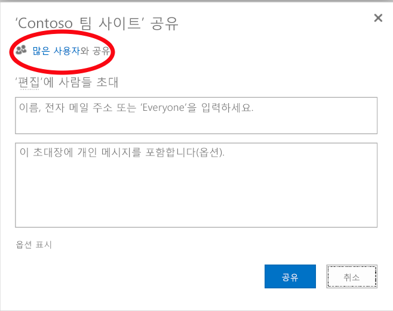
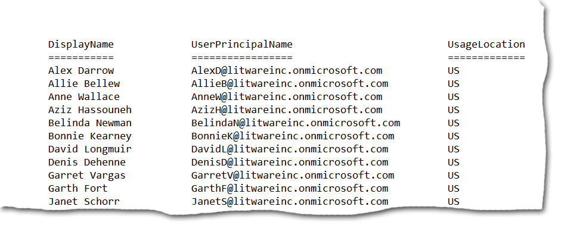

# <a name="why-you-need-to-use-office-365-powershell"></a>Office 365 PowerShell을 사용해야 하는 이유

 **요약:** 경우에 따라 효율성을 높이기 위해 또는 필요에 의해 Office 365 PowerShell을 사용하여 Office 365를 관리해야 하는 이유를 파악합니다.
  
Office 365 관리 센터를 사용하면 Office 365 사용자 계정과 라이선스뿐 아니라 Office 365 서버 제품( Exchange, 비즈니스용 Skype 온라인, SharePoint Online)을 관리할 수 있습니다. 그러나 Office 365 PowerShell 명령을 사용하여 이러한 요소를 관리할 수도 있습니다, 이 경우 속도, 자동화 및 추가 기능을 위한 명령줄 및 스크립팅 언어 환경을 활용할 수 있습니다.
  
이 문서에서는 Office 365 PowerShell을 사용하여 Office 365를 관리하는 다음과 같은 방법을 설명합니다.
  
- Office 365 PowerShell은 Office 365 관리 센터에서는 볼 수 없는 추가 정보를 제공할 수 있음
    
- Office 365에는 Office 365 PowerShell로만 구성할 수 있는 기능이 있습니다.
    
- Office 365 PowerShell은 대량 작업을 수행하는 데 유용함
    
- Office 365 PowerShell은 데이터를 필터링하는 데 유용함
    
- Office 365 PowerShell을 사용하면 데이터 쉽게 인쇄 또는 저장할 수 있음
    
- Office 365 PowerShell을 사용하여 여러 서버 제품을 관리할 수 있음
    
시작하기 전에 Office 365 PowerShell이 Windows 기반 서비스 및 플랫폼에 대한 명령줄 환경인 Windows PowerShell용 모듈 집합이라는 점을 이해하면 도움이 됩니다. 이 환경은 추가 모듈로 확장할 수 있는 명령 셸 언어를 만들고 간단하거나 복잡한 명령을 실행하는 방법을 제공합니다. 예를 들어 Office 365 PowerShell 모듈을 설치하고 Office 365 구독에 연결한 후에는 이 명령을 사용하여 Microsoft Exchange Online에 대한 모든 사용자 사서함 목록을 표시할 수 있습니다.
  
```
Get-Mailbox
```

이 명령을 실행하여 SharePoint Online의 모든 웹앱에 대한 모든 사이트의 전체 목록에 포함된 항목 수를 계산할 수도 있습니다.
  
```
Get-SPOSite -Limit All | Get-SPWeb -Limit All | % {$_.Lists} | ? {$_ -is [Microsoft.SharePoint.SPDocumentLibrary]} | % {$total+= $_.ItemCount}; $total
```

Office 365 관리 센터를 사용하여 사서함 목록을 쉽게 가져올 수도 있지만 모든 웹앱에 대한 모든 사이트의 전체 목록에 포함된 항목 수를 계산하는 일은 쉽지 않을 수 있습니다.
  
Office 365 PowerShell은 Office 365 관리 센터를 대신하는 것이 아니라 Office 365를 관리하는 능력을 강화하고 향상시키도록 고안되었습니다. Office 365 PowerShell 명령으로만 수행할 수 있는 일부 구성 절차가 있으므로 Office 365 관리자는 적어도 Office 365 PowerShell을 사용하는 데 익숙해야 합니다. 이러한 경우 다음 방법을 이해해야 합니다.
  
- Office 365 PowerShell 모듈 설치(각 관리자 컴퓨터에 대해 한번만 수행)
    
- Office 365 구독에 연결(각 PowerShell 세션에 대해 한번만 수행)
    
- 필수 Office 365 PowerShell 명령 실행에 필요한 정보 수집
    
- Office 365 PowerShell 명령을 성공적으로 실행
    
이러한 기본 기술을 학습한 후에는 **Get-Mailbox** 명령을 사용하여 사서함 사용자를 나열할 필요도 없고, 앞에 나온 것처럼 모든 웹앱에 대한 모든 사이트의 전체 목록에 포함된 항목 수를 계산하기 위한 명령과 같은 새 명령을 만드는 방법을 알 필요도 없습니다. Microsoft 및 Office 365 관리자 커뮤니티에서 필요할 때 도움을 드릴 수 있습니다.
  
## <a name="office-365-powershell-can-reveal-additional-information-that-you-cannot-see-with-the-office-365-admin-center"></a>Office 365 PowerShell은 Office 365 관리 센터에서는 볼 수 없는 추가 정보를 제공할 수 있음
<a name="reveal"> </a>

Office 365 관리 센터에는 많은 유용한 정보가 표시되지만 Office 365에서 사용자, 라이선스, 사서함 및 사이트에 대해 저장할 수 있는 모든 정보가 표시되지는 않습니다. 다음은 Office 365 관리 센터의 **사용자 및 그룹** 예입니다.
  

  
여기에는 다양한 용도로 사용자가 알아야 하는 정보가 표시됩니다. 그러나 더 많은 정보가 필요한 경우도 있습니다. 예를 들어 Office 365 라이선스 및 사용자에게 제공되는 Office 365 기능은 해당 사용자의 지리적 위치에 따라 달라집니다. 가령 미국 사용자에 대해 확장 가능한 정책과 기능은 인도나 벨기에 사용자에 대해 확장 가능한 정책과 기능은 서로 다를 수 있습니다. Office 365 관리 센터를 사용하면 다음 단계에 따라 사용자가 있는 지리적 위치를 알 수 있습니다.
  
1. 사용자의 **표시 이름** 을 두 번 클릭합니다.
    
2. 사용자 속성 표시 창에서 **세부 정보** 를 클릭합니다.
    
3. 세부 정보 표시에서 **추가 정보** 를 클릭합니다.
    
4. **국가 또는 지역** 제목이 표시될 때까지 아래쪽으로 스크롤합니다.
    
     
  
5. 사용자의 표시 이름과 지역을 종이에 적어 두거나 복사한 다음 메모장에 붙여 넣습니다. 
    
각 사용자에 대해 이 절차를 반복해야 합니다. 많은 사용자에게 이 작업은 번거로울 수 있습니다. Office 365 PowerShell을 사용하면 다음 명령을 사용하여 모든 사용자에 대해 이 정보를 표시할 수 있습니다.
  
```
Get-MsolUser | Select DisplayName, UsageLocation
```

> [!NOTE]
> 이 명령을 사용하려면 [Windows Azure Active Directory 모듈]((https://technet.microsoft.com/ko-KR/library/jj151815.aspx))을 설치해야 합니다. 
  
다음과 같은 화면이 표시됩니다.
  
```
DisplayName                               UsageLocation
-----------                               -------------
Zrinka Makovac                            US
Bonnie Kearney                            GB
Fabrice Canel                             BR
Brian Johnson (TAILSPIN)                  US
Anne Wallace                              US
Alex Darrow                               US
David Longmuir                            BR
```

> [!TIP]
>  이 Office 365 PowerShell 명령을 해석하면 다음과 같습니다. 현재 Office 365 구독의 모든 사용자를 가져오지만(**Get-MsolUser**), 각 사용자의 이름과 위치만 표시합니다(**Select DisplayName, UsageLocation**).
  
Office 365 PowerShell은 명령 셸 언어를 지원하므로 **Get-MSolUser** 명령에서 획득한 정보를 추가로 조작할 수 있습니다. 예를 들어 이러한 사용자를 위치별로 정렬하여 모든 브라질 사용자, 모든 미국 사용자 등으로 그룹화할 수 있습니다. 해당 명령은 다음과 같습니다.
  
```
Get-MsolUser | Select DisplayName, UsageLocation | Sort UsageLocation, DisplayName
```

다음과 같은 화면이 표시됩니다.
  
```
DisplayName                                 UsageLocation
-----------                                 -------------
David Longmuir                              BR
Fabrice Canel                               BR
Bonnie Kearney                              GB
Alex Darrow                                 US
Anne Wallace                                US
Brian Johnson (TAILSPIN)                    US
Zrinka Makovac                              US
```

> [!TIP]
>  이 Office 365 PowerShell 명령을 해석하면 다음과 같습니다. 현재 Office 365 구독의 모든 사용자를 가져오지만 각 사용자의 이름과 위치만 표시하고 먼저 위치별로 정렬한 후 이름별로 정렬합니다(**Sort UsageLocation, DisplayName**).
  
추가 필터링을 사용할 수도 있습니다. 예를 들어 브라질 사용자에 대한 정보만 표시하려면 다음 명령을 사용합니다.
  
```
Get-MsolUser | Where {$_.UsageLocation -eq "BR"} | Select DisplayName, UsageLocation 
```

다음과 같은 화면이 표시됩니다.
  
```
DisplayName                                           UsageLocation
-----------                                           -------------
David Longmuir                                        BR
Fabrice Canel                                         BR
```

> [!TIP]
>  이 Office 365 PowerShell 명령을 해석하면 다음과 같습니다. 현재 Office 365 구독에서 해당 위치가 브라질인 모든 사용자를 가져온 다음(**Where {$\__.UsageLocation -eq "BR"}**), 각 사용자의 이름과 위치를 표시합니다.
  
 **대규모 도메인 관련 참고 사항**
  
사용자가 수만 명인 매우 큰 도메인의 경우 이 문서에서 제시하는 몇 가지 예를 사용하면 "제한" 현상이 발생할 수 있습니다. 즉, 컴퓨팅 기능, 사용 가능한 네트워크 대역폭 등을 기준으로 보았을 때 사용자가 한 번에 너무 많은 작업을 수행할 수 있습니다. 이러한 이유 때문에 대규모 조직은 이러한 Office 365 PowerShell 명령을 두 개의 명령으로 분할하고 싶을 수도 있습니다. 예를 들어 이 명령 하나를 실행하면 모든 사용자 계정이 반환되고 각 사용자의 이름과 위치가 표시됩니다.
  
```
Get-MsolUser | Select DisplayName, UsageLocation
```

소규모 도메인에서는 이 명령을 사용해도 아무런 문제가 없습니다. 그러나 대규모 조직에서는 위의 명령을 두 개의 명령, 즉 변수에 사용자 계정 정보를 저장하기 위한 명령과 필요한 정보를 표시하기 위한 명령으로 분할해야 할 수 있습니다. 예제는 다음과 같습니다.
  
```
$x = Get-MsolUser
$x | Select DisplayName, UsageLocation
```


이 Office 365 PowerShell 명령을 해석하면 다음과 같습니다.
- 현재 Office 365 구독의 모든 사용자를 가져오고 $x 변수에 정보를 저장합니다(**$x = Get-MsolUser**).
- $x 변수의 내용을 표시하지만 각 사용자의 이름과 위치만 포함합니다(**$x | Select DisplayName, UsageLocation**).
  
## <a name="office-365-has-features-that-you-can-only-configure-with-office-365-powershell"></a>Office 365에는 Office 365 PowerShell로만 구성할 수 있는 기능이 있습니다.
<a name="only"> </a>

Office 365 관리 센터는 대부분의 사용자에 적용 되는 가장 일반적이거나 의미있는 관리 작업에 액세스할 수 있도록 하기 위해 고안되었습니다. 다시 말해서 Office 365 관리 센터는 일반적인 관리자가 가장 일반적인 관리 작업을 수행하는 데 사용할 수 있는 도구로 설계되었습니다. 따라서 기본적으로는 Office 365 관리 센터를 통해 완료할 수 없는 작업도 있습니다.
  
예를 들어 비즈니스용 Skype 온라인 관리 센터에서는 사용자 지정 모임 초대를 만들기 위한 몇 가지 옵션을 제공합니다.
  

  
이러한 설정을 사용하여 모임 초대를 전문적으로 개인 설정할 수 있습니다. 그러나 모임 구성 설정에는 사용자 지정 모임 초대 만들기 외에도 다양한 기능이 있습니다. 예를 들어 모임에서는 기본적으로 다음과 같은 설정이 가능합니다.
  
- 익명 사용자가 각 모임에 자동으로 입장할 수 있도록 설정
    
- 참석자가 모임을 기록하도록 설정
    
- 조직의 모든 사용자가 모임 참가 시 발표자로 지정되도록 설정
    
이러한 설정을 비즈니스용 Skype 온라인 관리 센터에서는 사용할 수 없습니다. 그러나 Office 365 PowerShell에서는 제어할 수 있습니다. 이러한 세 가지 설정을 사용하지 않도록 하는 명령은 다음과 같습니다.
  
```
Set-CsMeetingConfiguration -AdmitAnonymousUsersByDefault $False -AllowConferenceRecording $False -DesignateAsPresenter "None"
```

> [!NOTE]
> 이 명령을 사용하려면 [비즈니스용 Skype Online PowerShell 모듈](https://www.microsoft.com/download/details.aspx?id=39366)을 설치해야 합니다. 
  
> [!TIP]
>  이 Office 365 PowerShell 명령을 해석하면 다음과 같습니다.>  새 비즈니스용 Skype 온라인 모임 설정을 위해(**Set-CsMeetingConfiguration**) 익명 사용자가 모임에 자동으로 입장할 수 있도록 허용하는 기능을 사용하지 않도록 설정하고(**-AdmitAnonymousUsersByDefault $False**), 참석자가 모임을 기록하는 기능을 사용하지 않도록 설정하고(**-AllowConferenceRecording $False**), 조직의 모든 사용자를 발표자로 지정하지는 않도록 합니다(**-DesignateAsPresenter "None"**).
  
생각이 바뀌어 이러한 기본 설정을 복원하려면(모두 사용하도록 설정) 다음 명령을 실행합니다.
  
```
Set-CsMeetingConfiguration -AdmitAnonymousUsersByDefault $True -AllowConferenceRecording $True -DesignateAsPresenter "Company"
```

이것은 예에 불과합니다. Office 365 관리자가 Office 365 PowerShell 명령에 익숙해져야 하는 다른 이유도 있습니다.
  
## <a name="office-365-powershell-is-great-at-carrying-out-bulk-operations"></a>Office 365 PowerShell은 대량 작업을 수행하는 데 유용함
<a name="bulk"> </a>

지금까지 Office 365 관리 센터와 같은 시각적 인터페이스는 단일 작업만 수행하면 될 경우에 가장 유용합니다. 예를 들어 사용자 계정 하나를 사용하지 않도록 설정해야 하는 경우 Office 365 관리 센터를 사용하여 확인란을 빠르게 찾은 후 선택을 취소할 수 있습니다. 이 작업은 Office 365 PowerShell에서 유사한 작업을 수행하는 것보다 더 간단할 수 있습니다.
  
그렇지만 대규모 작업 내에서 많은 부분이나 선택한 일부 항목을 변경해야 할 경우 Office 365 관리 센터를 사용하는 것이 시간을 효과적으로 사용하는 데 적합하지 않을 수 있습니다. 예를 들어 수천 개의 전화 번호에 있는 내선 번호를 변경해야 하거나 모든 SharePoint Online 사이트에서 특정 사용자, Ken Myer를 제거해야 할 경우 Office 365 관리 센터에서 어떻게 이 작업을 수행할 수 있을까요?
  
후자의 경우 SharePoint Online 사이트는 수백 개이고 그 중에서 Ken이 구성원으로 속해 있는 사이트가 어느 것인지도 모르는 상황입니다. 따라서 Office 365 관리 센터에서 시작한 후 각 사이트에 대해 다음 절차를 수행해야 합니다.
  
1. 사이트의 **URL** 을 클릭합니다.
    
2. **사이트 모음 속성** 상자에서 **웹 사이트 주소** 링크를 클릭하여 사이트를 엽니다.
    
3. 사이트에서 **공유** 를 클릭합니다.
    
4. **공유** 대화 상자에서 사이트에 대한 사용 권한이 있는 모든 사용자를 표시하는 링크를 클릭합니다.
    
     
  
5. **다음 사용자와 공유** 대화 상자에서 **고급** 을 클릭합니다.
    
6. 사용자 목록 아래쪽으로 스크롤하여 Ken Myer(사이트에 대한 사용 권한이 있는 사용자라고 가정함)를 찾아 선택한 다음 **사용자의 사용 권한 제거** 를 클릭합니다.
    
수백 개의 사이트의 경우 시간이 오래 걸릴 수 있습니다.
  
또 다른 방법은 Office 365 PowerShell과 다음 명령을 사용하여 모든 사이트에서 Ken Myer를 제거하는 것입니다.
  
```
Get-SPOSite | ForEach {Remove-SPOUser -Site $_.Url -LoginName "kenmyer@litwareinc.com"}
```

> [!NOTE]
> 이 명령을 사용하려면 [SharePoint Online PowerShell에 연결]((https://technet.microsoft.com/library/fp161372.aspx))을 설치해야 합니다. 
  
> [!TIP]
>  이 Office 365 PowerShell 명령을 해석하면 다음과 같습니다. 현재 Office 365 구독에서 모든 SharePoint 사이트를 가져오고(**Get-SPOSite**) 각 사이트에 액세스할 수 있는 사용자 목록에서 Ken Meyer를 제거합니다(**ForEach {Remove-SPOUser -Site $\__.Url -LoginName "kenmyer@litwareinc.com"}**).
  
Office 365에 Key Meyer가 액세스할 수 없는 사이트를 비롯한 모든 사이트에서 Ken Meyer를 제거하도록 지정하고 있으므로 현재 액세스 권한이 없는 사이트에 대한 오류가 표시됩니다. 이 명령에 추가 조건을 사용하여 로그인 목록에 Ken Meyer가 있는 사이트에서만 Ken Meyer를 제거할 수 있지만 나열되는 오류가 사이트 자체에는 문제가 되지 않습니다. 수백 개의 사이트에 대해 이 명령을 실행하는 데 몇 분 정도 소요될 수 있지만 Office 365 관리 센터로 작업하면 몇 시간이 걸리게 됩니다.
  
다른 대량 작업의 예제는 다음과 같습니다. 이 명령을 사용하여 새 SharePoint 관리자인 Bonnie Kearney를 조직의 모든 사이트에 추가합니다.
  
```
Get-SPOSite | ForEach {Add-SPOUser -Site $_.Url -LoginName "bkearney@litwareinc.com" -Group "Members"}
```

> [!TIP]
>  이 Office 365 PowerShell 명령을 해석하면 다음과 같습니다. 현재 Office 365 구독의 모든 SharePoint 사이트를 가져오고 각 사이트의 구성원 그룹에 해당 로그인 이름을 추가하여 Bonnie Kearney의 액세스를 허용합니다(**ForEach {Add-SPOUser -Site $\__.Url -LoginName "bkearney@litwareinc.com" -Group "Members"}**).
  
## <a name="office-365-powershell-is-great-at-filtering-data"></a>Office 365 PowerShell은 데이터를 필터링하는 데 유용함
<a name="filter"> </a>

Office 365 관리 센터에서는 데이터를 필터링하여 대상 정보 하위 집합을 쉽고 빠르게 찾을 수 있는 여러 가지 방법을 제공합니다. 예를 들어 Exchange에서는 사용자 사서함의 사실상 모든 속성을 기준으로 쉽게 필터링을 할 수 있습니다. 예를 들어 다음은 Bloomington에 거주하는 모든 사용자의 사서함 목록입니다.
  

  
Exchange 관리 센터에서도 필터 기준을 조합할 수 있습니다. 예를 들어 Bloomington에 거주하고 재무 부서에서 일하는 모든 사용자에 대한 사서함을 찾을 수 있습니다. 
  
그러나 Exchange 관리 센터에서는 수행할 수 있는 작업에 제한이 있습니다. 예를 들어 Bloomington이나 San Diego에 거주하는 사용자의 사서함을 찾거나 Bloomington에 거주하지 않는 모든 사용자에 대한 사서함을 찾을 수 있습니다. 
  
Office 365 PowerShell에서 다음 명령을 사용하여 Bloomington 또는 San Diego에 거주하는 모든 사람에 대한 사서함 목록을 가져올 수 있습니다.
  
```
Get-User | Where {$_.RecipientTypeDetails -eq "UserMailbox" -and ($_.City -eq "San Diego" -or $_.City -eq "Bloomington")} | Select DisplayName, City
```

다음과 같은 화면이 표시됩니다.
  
```
DisplayName                              City
-----------                              ----
Alex Darrow                              San Diego
Bonnie Kearney                           San Diego
Julian Isla                              Bloomington
Rob Young                                Bloomington
Zrinka Makovac                           San Diego
```

> [!TIP]
>  이 Office 365 PowerShell 명령을 해석하면 다음과 같습니다. 현재 Office 365 구독에서 San Diego 또는 Bloomington에 사서함을 보유하고 있는 모든 사용자를 가져온 다음(**Where {$\_.RecipientTypeDetails -eq "UserMailbox" -and ($\_.City -eq "San Diego" -or $\__.City -eq "Bloomington")}**) 각 사용자의 이름과 도시를 표시합니다(**Select DisplayName, City**).
  
Bloomington을 제외한 모든 위치에 거주하는 사용자의 모든 사서함을 나열하려면 다음 명령을 사용합니다.
  
```
Get-User | Where {$_.RecipientTypeDetails -eq "UserMailbox" -and $_.City -ne "Bloomington"} | Select DisplayName, City
```

다음과 같은 화면이 표시됩니다.
  
```
DisplayName                               City
-----------                               ----
MOD Administrator                         Redmond
Alex Darrow                               San Diego
Allie Bellew                              Bellevue
Anne Wallace                              Louisville
Aziz Hassouneh                            Cairo
Belinda Newman                            Charlotte
Bonnie Kearney                            San Diego
David Longmuir                            Waukesha
Denis Dehenne                             Birmingham
Garret Vargas                             Seattle
Garth Fort                                Tulsa
Janet Schorr                              Bellevue
```

> [!TIP]
>  이 Office 365 PowerShell 명령을 해석하면 다음과 같습니다. Bloomington에 사서함이 없는 현재 Office 365 구독의 모든 사용자를 가져오고(**Where {$\_.RecipientTypeDetails -eq "UserMailbox" -and $\_.City -ne "Bloomington"}**) 각 사용자의 이름과 도시를 표시합니다.
  
Office 365 PowerShell 필터에 와일드카드 문자를 사용하여 이름 일부와 일치하는 항목을 찾을 수도 있습니다. 예를 들어 특정 사용자 계정을 찾아야 하는데 성이 Anderson, Henderson 또는 Jorgenson이라는 점만 기억하고 있다고 가정할 경우
  
검색 도구를 사용하고 다음 세 가지 다른 검색을 수행하여 Office 365 관리 센터에서 해당 사용자에 추적할 수 있습니다.
  
- *Anderson*  에 대해, 
    
- *Henderson*  에 대해, 
    
- *Jorgenson*  에 대해 
    
이렇나 모든 이름은 "son"으로 끝나므로 Office 365 PowerShell에 이름이 "son"으로 끝나는 모든 사용자를 표시하도록 지정할 수 있습니다. 해당 명령은 다음과 같습니다.
  
```
Get-User -Filter '{LastName -like "*son"}'
```

> [!TIP]
>  이 Office 365 PowerShell 명령을 해석하면 다음과 같습니다. 현재 Office 365 구독의 모든 사용자를 가져오지만 성이 "son"으로 끝나는 사용자만 나열하는 필터를 사용합니다(**-Filter '{LastName -like "**son"}'\**). \*는 임의의 문자 집합을 나타내며, 사용자의 성인 경우에는 글자에 해당합니다.
  
## <a name="office-365-powershell-makes-it-easy-to-print-or-save-data"></a>Office 365 PowerShell을 사용하면 데이터 쉽게 인쇄 또는 저장할 수 있음
<a name="printsave"> </a>

Office 365 관리 센터에서 데이터 목록을 볼 수 있습니다. 다음은 비즈니스용 Skype 온라인에 대해 사용되도록 설정된 사용자 목록을 표시하는 비즈니스용 Skype 온라인 관리 센터의 예입니다.
  

  
해당 정보를 파일에 저장하려면 복사한 후 문서 또는 Excel에 붙여 넣어야 합니다. 두 경우 모두 복사를 위해 추가 서식이 필요할 수 있습니다. 또한 Office 365 관리 센터에서는 표시된 목록을 바로 인쇄하는 방법을 제공하지 않습니다.
  
다행히 Office 365 PowerShell을 사용하여 목록을 표시할 수 있을뿐 아니라 Excel로 쉽게 가져올 수 있는 파일에 저장할 수도 있습니다. 다음은 비즈니스용 Skype 온라인 사용자 데이터를 Excel 워크시트의 표로 쉽게 가져올 수 있는 CSV(쉼표로 구분된 값) 파일에 저장하는 예제 명령입니다.
  
```
Get-CsOnlineUser | Select DisplayName, UserPrincipalName, UsageLocation | Export-Csv -Path "C:\\Logs\\SfBUsers.csv" -NoTypeInformation
```

다음과 같은 화면이 표시됩니다.
  

  
> [!TIP]
>  이 Office 365 PowerShell 명령을 해석하면 다음과 같습니다. 현재 Office 365 구독의 모든 비즈니스용 Skype 온라인 사용자를 가져오고(**Get-CsOnlineUser**), 사용자 이름, UPN 및 위치만 가져오고(**Select DisplayName, UserPrincipalName, UsageLocation**), C:\\Logs\\SfBUsers.csv라는 CSV 파일에 해당 정보를 저장합니다(**Export-Csv -Path "C:\\Logs\\SfBUsers.csv" -NoTypeInformation**).
  
또한 옵션을 사용하여 이 목록을 XML 파일 또는 HTML 페이지로 저장할 수도 있습니다. 실제로 추가 PowerShell 명령과 원하는 사용자 지정 서식을 사용하여 Excel 파일로 직접 저장할 수도 있습니다. 
  
Windows에서 기본 프린터에 직접 목록을 표시하는 Office 365 PowerShell 명령의 출력을 보낼 수도 있습니다. 예제 명령은 다음과 같습니다.
  
```
Get-CsOnlineUser | Select DisplayName, UserPrincipalName, UsageLocation | Out-Printer
```

인쇄된 문서의 모양은 다음과 같습니다.
  

  
> [!TIP]
>  이 Office 365 PowerShell 명령을 해석하면 다음과 같습니다. 현재 Office 365 구독의 모두 비즈니스용 Skype 온라인 사용자를 가져오고, 사용자 이름, UPN 및 위치만 가져온 다음 기본 Windows 프린터에 해당 정보를 보냅니다(**Out-Printer**).
  
인쇄된 문서는 Office 365 PowerShell 명령 창 내에 표시되는 것과 동일한 간단한 서식을 가지지만 필요한 항목만 나열하는 Office 365 PowerShell 명령을 만든 경우 명령 끝에 **| Out-Printer**만 추가하여 작업할 하드 카피를 가져올 수 있습니다.
  
## <a name="office-365-powershell-lets-you-manage-across-server-products"></a>Office 365 PowerShell을 사용하여 여러 서버 제품을 관리할 수 있음
<a name="printsave"> </a>

Office 365를 구성하는 여러 다양한 구성 요소는 함께 작동되도록 설계되어 있습니다. 예를 들어 Office 365에 새 사용자를 추가할 때는 사용자의 부서, 전화 번호 등의 정보를 지정합니다. 이러한 정보는 Office 365 서버 제품인 비즈니스용 Skype 온라인, Exchange 또는 SharePoint Online 중 하나를 사용하여 사용자 정보에 액세스하는 경우에 사용할 수 있습니다.
  
그러나 이러한 방식은 제품군 전체에 적용되는 일반적인 정보에만 해당됩니다. 사용자의 Exchange 사서함에 대한 정보와 같은 제품 관련 정보는 일반적으로 전체 제품군 내에서 사용할 수 없스니다. 예를 들어 사용자의 사서함이 사용되도록 설정되어 있는지를 알려면 해당 정보가 Exchange 관리 센터에서만 사용할 수 있는지 확인합니다. 
  
모든 사용자에 대해 다음 정보를 표시하는 보고서를 만들려는 경우를 가정해 보겠습니다.
  
- 사용자의 표시 이름
    
- 사용자에게 Office 365 사용이 허가되었는지 여부
    
- 사용자의 Exchange 사서함이 사용하도록 설정되었는지 여부
    
- 사용자가 비즈니스용 Skype 온라인을 사용할 수 있도록 설정되었는지 여부
    
현재 Office 365 관리 센터에서는 이러한 보고서를 쉽게 생성할 수 없습니다. 대신 정보를 저장하는 별도의 문서(예: Excel 워크시트)를 만들고, Office 365 관리 센터 관리 센터에서 와 모든 사용자 이름 및 라이선스 정보를 가져오고, Exchange에서 사서함 정보를 가져오고, 비즈니스용 Skype 온라인 관리 센터에서 비즈니스용 Skype 온라인 정보를 가져온 다음 해당 정보를 수집한 후 조합해야 합니다.
  
이 방법 대신 Office 365 PowerShell 스크립트를 사용하여 해당 보고서를 컴파일할 수 있습니다.
  
다음 예제 스크립트는 지금까지 이 문서에서 살펴본 명령보다 좀 더 복잡합니다. 그렇지만 Office 365 PowerShell을 사용하여 훨씬 더 어려울 수 있는 정보 보기를 만들 수 있다는 사실을 보여 줍니다. 다음은 필요한 목록을 정리해서 표시할 수 있는 스크립트입니다.
  
```
$x = Get-MsolUser

foreach ($i in $x)
    {
      $y = Get-Mailbox -Identity $i.UserPrincipalName
      $i | Add-Member -MemberType NoteProperty -Name IsMailboxEnabled -Value $y.IsMailboxEnabled

      $y = Get-CsOnlineUser -Identity $i.UserPrincipalName
      $i | Add-Member -MemberType NoteProperty -Name EnabledForSfB -Value $y.Enabled
    }

$x | Select DisplayName, IsLicensed, IsMailboxEnabled, EnabledforSfB
```

다음과 같은 화면이 표시됩니다.
  
```
DisplayName             IsLicensed   IsMailboxEnabled   EnabledForSfB
-----------             ----------   ----------------   --------------
Zrinka Makovac          True         True               True
Bonnie Kearney          True         True               True
Fabrice Canel           True         True               True
Brian Johnson           False        True               False
Anne Wallace            True         True               True
Alex Darrow             True         True               True
David Longmuir          True         True               True
Katy Jordan             False        True               False
Molly Dempsey           False        True               False
```

이 Office 365 PowerShell 스크립트를 해석하면 다음과 같습니다.  
- 현재 Office 365 구독의 모든 사용자를 가져오고 $x 변수에 정보를 저장합니다(**$x = Get-MsolUser**).
- 변수 $x에서 모든 사용자에 대해 실행되는 루프를 시작합니다(**foreach ($i in $x)**).  
- $y라는 변수를 정의하고 이 변수에 사용자의 사서함 정보를 저장합니다(**$y = Get-Mailbox -Identity $i.UserPrincipalName**).
- IsMailBoxEnabled라는 사용자 정보에 새 속성을 추가하고 사용자 사서함의 IsMailBoxEnabled 속성 값으로 설정합니다(**$i | Add-Member -MemberType NoteProperty -Name IsMailboxEnabled -Value $y.IsMailboxEnabled**).
- $y라는 변수를 정의하고 이 변수에 사용자의 비즈니스용 Skype Online 정보를 저장합니다(**$y = Get-CsOnlineUser -Identity $i.UserPrincipalName**).
- EnabledForSfB라는 사용자 정보에 새 속성을 추가하고 사용자 비즈니스용 Skype Online 정보의 Enabled 속성 값으로 설정합니다(**$i | Add-Member -MemberType NoteProperty -Name EnabledForSfB -Value $y.Enabled**).
- 사용자의 목록을 표시하지만 이름, 사용 허가 여부, 사서함 사용 가능 여부와 비즈니스용 Skype Online에 대해 사용되도록 설정되었는지 여부를 나타내는 두 개의 새 속성만 포함합니다(**$x | Select DisplayName, IsLicensed, IsMailboxEnabled, EnabledforSfB**).
  
## <a name="see-also"></a>참고 항목


#### 

[Office 365 PowerShell 시작](getting-started-with-office-365-powershell.md)
  
[사용자 계정 및 Office 365 PowerShell을 사용 하 여 라이센스 관리](manage-user-accounts-and-licenses-with-office-365-powershell.md)
  
[Office 365에서 Windows PowerShell을 사용하여 보고서 만들기](use-windows-powershell-to-create-reports-in-office-365.md)

