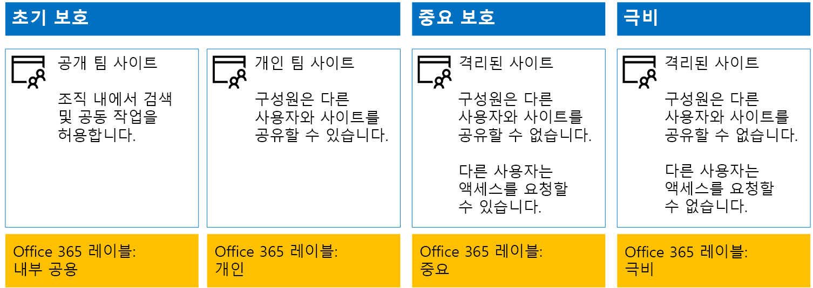
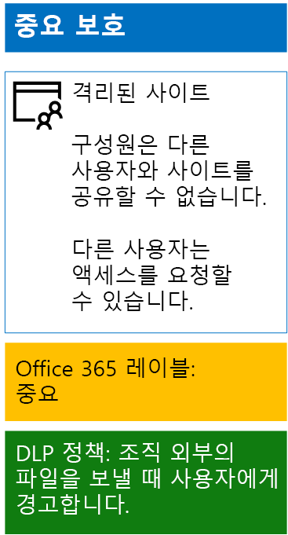
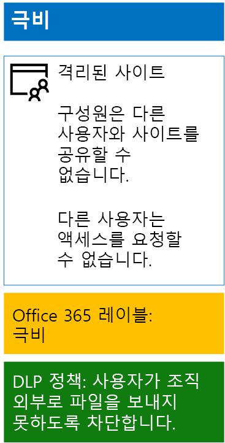

# <a name="protect-sharepoint-online-files-with-office-365-labels-and-dlp"></a>Office 365 레이블 및 DLP 사용 하 여 SharePoint Online 파일 보호

 **요약:** 정보 보호의 다양 한 수준 사용 하 여 SharePoint Online 팀 사이트에 대 한 Office 365 레이블 및 데이터 손실 방지 (DLP) 정책을 적용 합니다.
  
이 문서의 단계를 사용 하 여 디자인 하 고 Office 365 레이블 및 초기 계획, 소문자를 구분 하 고 매우 기밀 SharePoint Online 팀 사이트에 대 한 DLP 정책 배포 합니다. 이러한 세 계층의 보호 하는 방법에 대 한 자세한 내용은 [SharePoint Online 보안 사이트 및 파일을](secure-sharepoint-online-sites-and-files.md)참조 하십시오.
  
## <a name="office-365-labels-for-your-sharepoint-online-sites"></a>SharePoint Online 사이트를 위해 office 365 레이블

만들기 (영문)을 세 단계로 되며 Office 365를 할당 한 다음 SharePoint Online 팀 사이트에 레이블을 지정 합니다.
  
### <a name="phase-1-determine-the-office-365-label-names"></a>1 단계: Office 365 레이블 이름 확인

이 단계에서 4 가지 수준의 SharePoint Online 팀 사이트에 적용 된 정보 보호에 대 한 Office 365 레이블 이름을 확인할 수 있습니다. 다음 표에 각 수준에 대 한 권장된 이름입니다.
  
|**SharePoint Online 팀 사이트 보호 수준**|**레이블 이름**|
|:-----|:-----|
|초기 계획 공개  <br/> |내부 공용  <br/> |
|초기 계획 전용  <br/> |개인  <br/> |
|중요 한  <br/> |중요 한  <br/> |
|기밀  <br/> |기밀  <br/> |
   
### <a name="phase-2-create-the-office-365-labels"></a>2 단계: Office 365 레이블 만들기

이 단계에서 만들고 후 다양 한 수준의 정보 보호에 대 한 결정된 된 레이블을 게시 합니다.
  
레이블을 생성, Office 365 관리 센터 또는 Microsoft PowerShell를 사용할 수 있습니다.
  
### <a name="create-office-365-labels-with-the-office-365-admin-center"></a>Office 365 관리 센터를 사용 하 여 Office 365 레이블 만들기

1. 보안 관리자 또는 회사 관리자 역할을 가진 계정으로 사용 하 여 Office 365 포털에 로그인 합니다. 도움말을 보려면 [Office 365에 로그인 할 위치](https://support.office.com/Article/Where-to-sign-in-to-Office-365-e9eb7d51-5430-4929-91ab-6157c5a050b4)를 참조 하십시오.
    
2. **Microsoft Office 홈** 탭에서 **관리** 타일을 클릭 합니다.
    
3. 브라우저의 새 **Office 관리 센터** 탭을 클릭 **관리 센터 > 보안 &amp; 준수**합니다.
    
4. 새에서 **홈-보안 &amp; 준수** 탭 클릭 하 여 브라우저의 **분류 > 레이블**합니다.
    
5. **홈 > 레이블** 창 **레이블 만들기**를 클릭 합니다.
    
6. **이름에 레이블** 창에서 레이블의 이름을 입력 하 고 ****을 클릭 합니다.
    
7. **레이블 설정** 창에서 **다음**을 클릭 합니다.
    
8. **설정 검토** 창에서 **이 레이블 만들기**를 클릭 하 고 **닫기**를 클릭 합니다.
    
9. 프로그램 추가 레이블에 대 한 5 ~ 8 단계를 반복 합니다.
    
### <a name="create-office-365-labels-with-powershell"></a>PowerShell을 사용한 Office 365 레이블 만들기

1. [Office 365 보안 연결 &amp; 원격 PowerShell을 사용 하 여 준수 센터](http://go.microsoft.com/fwlink/?LinkID=799771&amp;clcid=0x409) 하 고 보안 관리자 또는 회사 관리자 역할이 있는 계정의 자격 증명을 지정 합니다.
    
2. 레이블 이름의 목록을 채우고 PowerShell 명령 프롬프트에서 다음이 명령을 실행 합니다.
    
  ```
  $labelNames=@(<list of label names, each enclosed in quotes and separated by commas>)
ForEach ($element in $labelNames){ New-ComplianceTag -Name $element }
  ```

다음으로 새 Office 365 레이블을 게시 하려면 다음이 단계를 사용 합니다.
  
1. **홈 > 레이블** 창 보안 &amp; 준수 센터 **게시 레이블**을 클릭 합니다.
    
2. **게시를 선택 레이블** 창에서 **게시를 선택 레이블을**클릭 합니다.
    
3. **Choose 레이블** 창에서 **추가** 클릭 하 고 모든 4 개의 레이블을 선택 합니다.
    
4. **완료**를 클릭 합니다.
    
5. **게시를 선택 레이블** 창에서 **다음**을 클릭 합니다.
    
6. **Choose 위치** 창에서 **다음**을 클릭 합니다.
    
7. **이름 정책에 따라** 창에서 **이름**레이블 사용자 집합에 대 한 이름을 입력 하 고 ****을 클릭 합니다.
    
8. **설정 검토** 창에서 **게시 레이블**를 클릭 한 다음 **닫기**를 클릭 합니다.
    
### <a name="phase-3-apply-the-office-365-labels-to-your-sharepoint-online-sites"></a>3 단계: SharePoint Online 사이트에 Office 365 레이블을 적용합니다

다음이 단계를 사용 하 여 SharePoint Online 팀 사이트의 문서 폴더에는 Office 365 레이블을 적용 합니다.
  
1. 브라우저의 **Microsoft Office 홈** 탭에서 **SharePoint** 타일을 클릭 합니다.
    
2. 브라우저에서 새 **SharePoint** 탭에 할당 하는 Office 365 레이블 필요한 사이트를 클릭 합니다.
    
3. 브라우저의 새 SharePoint 사이트 탭에서 **문서**를 클릭 합니다.
    
4. 설정 아이콘을 클릭 하 고 **라이브러리 설정**을 클릭 합니다.
    
5. **사용 권한 및 관리**, 아래에서 **이 라이브러리에 항목 레이블을 적용을**클릭 합니다.
    
6. **레이블 설정 적용**을 적절 한 레이블을 선택 하 고 **저장**을 클릭 합니다.
    
7. SharePoint Online 사이트에 대 한 탭을 닫습니다.
    
8. Office 365 레이블을 추가 SharePoint Online 사이트에 할당 하려면 3-8 단계를 반복 합니다.
    
구성 결과는 다음과 같습니다.
  

  
## <a name="dlp-policies-for-your-sharepoint-online-sites"></a>SharePoint Online 사이트에 대 한 DLP 정책

조직 외부의 SharePoint Online 중요 한 팀 사이트의 문서를 공유 하는 경우 사용자에 게 알리는 하는 DLP 정책을 구성 하려면 다음이 단계를 사용 합니다.
  
1. 브라우저에서 **Microsoft Office 홈** 탭에서 클릭 된 **보안 &amp; 준수** 바둑판식으로 배열 합니다.
    
2. 새에서 **보안 &amp; 준수** 브라우저에서 탭을 클릭 **데이터 손실 방지 > 정책**합니다.
    
3. **데이터 손실 방지** 창에서 **+ 정책 만들기를**클릭 합니다.
    
4. **서식 파일을 시작 하거나 사용자 지정 정책을 만들** 창 **사용자 지정**을 클릭 하 고 **다음**을 클릭 합니다.
    
5. **이름에 정책** 창에서 **이름**중요 한 수준 DLP 정책에 대 한 이름을 입력 하 고 ****을 클릭 합니다.
    
6. **선택 위치** 창에서 **특정 위치를 선택 합니다.**를 클릭 하 고 ****을 클릭 합니다.
    
7. 위치 목록에서 **Exchange 전자 메일** 및 **OneDrive 계정** 위치를 사용 하지 않도록 설정 하 고 ****을 클릭 합니다.
    
8. **중요 한 정보를 보호 하려면 유형의 사용자 지정** 창에서 **편집**을 클릭 합니다.
    
9. **보호 하기 위해 콘텐츠 형식 선택** 창에서 드롭다운 목록 상자에서 **추가** 클릭 하 고 **레이블**을 클릭 합니다.
    
10. **레이블** 창에서 **+ 기호 추가**클릭, **중요 한** 레이블을 선택, **추가**클릭 하 고 **완료**를 클릭 합니다.
    
11. **보호 하기 위해 콘텐츠 형식 선택** 창에서 **저장**을 클릭 합니다.
    
12. **중요 한 정보를 보호 하려면 유형의 사용자 지정** 창에서 **다음**을 클릭 합니다.
    
13. **는 중요 한 정보를 검색 하는 경우 작업을 수행 하 시겠습니까?** 창 **사용자 지정 팁 및 전자 메일을**클릭 합니다.
    
14. **사용자 지정 정책 팁 및 전자 메일 알림** 창에서 **사용자 지정 정책 팁 텍스트를**클릭 합니다.
    
15. 텍스트 상자에 입력 하거나 다음에 붙여넣습니다.
    
  - 조직 외부의 사용자와 공유 하려면 파일을 다운로드 하 고 파일을 엽니다. 파일을 다음 문서 보호를 클릭 하 고 암호를 암호화 하 고 강력한 암호를 지정 합니다. 별도 전자 메일 또는 다른 수단 통신의 암호를 보냅니다.
    
    또는 입력 하거나 조직 외부에 파일을 공유 하는 방법에 대 한 사용자가 지시 하는 정책 팁에 붙여넣습니다.
    
16. **확인**을 클릭합니다.
    
17. **는 중요 한 정보를 검색 하는 경우 작업을 수행 하 시겠습니까?** 창에서 **공유, 다른 사람을 차단 하 고 공유 내용에 대 한 액세스를 제한** 확인란의 선택을 취소 하 고 **다음**을 클릭 합니다.
    
18. **먼저 수행 정책 또는 테스트 작업을 설정 하 시겠습니까?** 창 **예, 귀하가 켜기**를 클릭 한 후에 **다음**을 클릭 합니다.
    
19. **설정 검토** 창에서 **만들기**를 클릭 한 다음 **닫기**를 클릭 합니다.
    
중요 한 SharePoint Online 팀 사이트에 대 한 결과 구성에는 다음과 같습니다.
  

  
다음으로, 다음이 단계에 따라 DLP 정책 구성 요소 (영문)가 사용 하는 조직 외부의 SharePoint Online 기밀 사항이 팀 사이트의 문서를 공유 하는 경우.
  
1. 브라우저에서 **Microsoft Office 홈** 탭에서 클릭 된 **보안 &amp; 준수** 바둑판식으로 배열 합니다.
    
2. 새에서 **보안 &amp; 준수** 브라우저에서 탭을 클릭 **데이터 손실 방지 > 정책**합니다.
    
3. **데이터 손실 방지** 창에서 **+ 정책 만들기를**클릭 합니다.
    
4. **서식 파일을 시작 하거나 사용자 지정 정책을 만들** 창 **사용자 지정**을 클릭 하 고 **다음**을 클릭 합니다.
    
5. **이름에 정책** 창에서 **이름**매우 중요 한 수준 DLP 정책에 대 한 이름을 입력 하 고 ****을 클릭 합니다.
    
6. **선택 위치** 창에서 **특정 위치를 선택 합니다.**를 클릭 하 고 ****을 클릭 합니다.
    
7. 위치 목록에서 **Exchange 전자 메일** 및 **OneDrive 계정** 위치를 사용 하지 않도록 설정 하 고 ****을 클릭 합니다.
    
8. **중요 한 정보를 보호 하려면 유형의 사용자 지정** 창에서 **편집**을 클릭 합니다.
    
9. **보호 하기 위해 콘텐츠 형식 선택** 창에서 드롭다운 목록 상자에서 **추가** 클릭 하 고 **레이블**을 클릭 합니다.
    
10. **레이블** 창에서 **+ 기호 추가**클릭, **기밀 사항이** 레이블을 선택, **추가**클릭 하 고 **완료**를 클릭 합니다.
    
11. **보호 하기 위해 콘텐츠 형식 선택** 창에서 **저장**을 클릭 합니다.
    
12. **중요 한 정보를 보호 하려면 유형의 사용자 지정** 창에서 **다음**을 클릭 합니다.
    
13. **는 중요 한 정보를 검색 하는 경우 작업을 수행 하 시겠습니까?** 창 **사용자 지정 팁 및 전자 메일을**클릭 합니다.
    
14. **사용자 지정 정책 팁 및 전자 메일 알림** 창에서 **사용자 지정 정책 팁 텍스트를**클릭 합니다.
    
15. 텍스트 상자에 입력 하거나 다음에 붙여넣습니다.
    
  - 조직 외부의 사용자와 공유 하려면 파일을 다운로드 하 고 파일을 엽니다. 파일을 다음 문서 보호를 클릭 하 고 암호를 암호화 하 고 강력한 암호를 지정 합니다. 별도 전자 메일 또는 다른 수단 통신의 암호를 보냅니다.
    
    또는 입력 하거나 조직 외부에 파일을 공유 하는 방법에 대 한 사용자가 지시 하는 정책 팁에 붙여넣습니다.
    
16. **확인**을 클릭합니다.
    
17. **는 중요 한 정보를 검색 하는 경우 작업을 수행 하 시겠습니까?** 창 **, 업무 효율성을 재정의 하려면 필요**를 선택 하 고 **다음**을 클릭 합니다.
    
18. **먼저 수행 정책 또는 테스트 작업을 설정 하 시겠습니까?** 창 **예, 귀하가 켜기**를 클릭 한 후에 **다음**을 클릭 합니다.
    
19. **설정 검토** 창에서 **만들기**를 클릭 한 다음 **닫기**를 클릭 합니다.
    
높은 기밀성 SharePoint Online 팀 사이트에 대 한 결과 구성에는 다음과 같습니다.
  

  
## <a name="next-step"></a>다음 단계

[Azure 정보 보호와 SharePoint Online 파일 보호](protect-sharepoint-online-files-with-azure-information-protection.md)
    
## <a name="see-also"></a>See Also

[SharePoint Online 사이트 및 파일의 보안](secure-sharepoint-online-sites-and-files.md)
  
[개발/테스트 환경에서 SharePoint Online 사이트 보호](secure-sharepoint-online-sites-in-a-dev-test-environment.md)
  
[정치적 캠페인, 비영리, 및 기타 민첩 한 조직에 대 한 Microsoft 보안 지침](microsoft-security-guidance-for-political-campaigns-nonprofits-and-other-agile-o.md)
  
[클라우드 채택 및 하이브리드 솔루션](cloud-adoption-and-hybrid-solutions.md)


