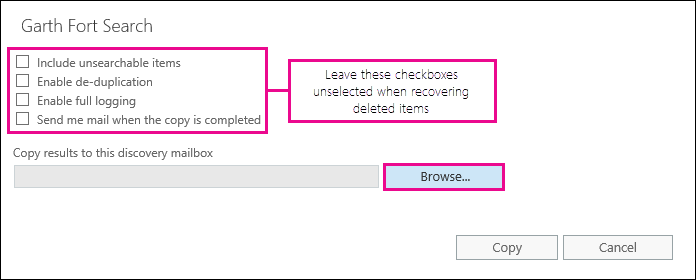

# 사용자 사서함에서 지운 편지함 복구 - 관리자 도움말Recover deleted items in a user mailbox - Admin Help

**이 문서는 관리자를 위한 것입니다. 사서함에서 삭제 된 항목을 복구 하려고 하나요?****This article is for administrators. Are you trying to recover deleted items in your own mailbox?** 다음 중 하나를 선택합니다.Try one of the following:
- [Windows용 Outlook에서 삭제된 항목 복구Recover deleted items in Outlook for Windows](https://support.office.com/article/49e81f3c-c8f4-4426-a0b9-c0fd751d48ce)
- [Outlook Web App에서 지운 편지함 또는 전자 메일 복구Recover deleted items or email in Outlook Web App](https://support.office.com/article/c3d8fc15-eeef-4f1c-81df-e27964b7edd4)
- [웹용 Outlook에서 삭제 된 전자 메일 메시지 복원Restore deleted email messages in Outlook on the web](https://support.office.com/article/a8ca78ac-4721-4066-95dd-571842e9fb11)
- [Outlook.comOutlook.com](https://go.microsoft.com/fwlink/p/?LinkID=623435)
   
사용자가 Outlook 사서함에서 항목을 영구적으로 삭제 했습니까?Did a user permanently delete items from their Outlook mailbox? 사용자가 다시 작업을 하려고 하지만 복구할 수는 없습니다.The user wants them back but can't recover them. 제거 된 항목이 사용자 사서함에서 영구적으로 제거 되지 않은 경우 해당 항목을 복구할 수 있습니다.You may be able recover the purged items if they haven't been permanently removed from the user's mailbox. Exchange Online의 원본 위치 eDiscovery 도구를 사용 하 여 삭제 된 전자 메일 및 기타 항목 (예: 연락처, 일정 약속 및 작업)을 사용자의 사서함에서 검색 합니다.You do this by using the In-Place eDiscovery tool in Exchange Online to search for deleted email and other items—and such as contacts, calendar appointments, and tasks—in a user's mailbox. 삭제 된 항목을 찾은 경우 사용자가 사서함에 항목을 다시 복원 하는 데 사용할 수 있는 PST 파일 (Outlook 데이터 파일 라고도 함)로 내보낼 수 있습니다.If you find the deleted items, you can export them to a PST file (also called an Outlook Data File), which the user can then use to restore the items back to their mailbox.
  
사용자 사서함에서 삭제 된 항목을 복구 하는 단계는 다음과 같습니다.Here are the steps for recovering deleted items in a user's mailbox. 이 작업에 소요 되는 시간이 얼마나 걸립니까?How long will this take? 복구 하려는 항목 수에 따라, 처음에 20 시간 또는 30 분 정도까지 모든 단계를 완료 하는 데 시간이 걸릴 수 있습니다.The first time might take 20 or 30 minutes to complete all the steps, depending on how many items you're trying to recover.
  
> [!NOTE]
> 이 문서에 나와 있는 단계를 수행 하려면 Office 365의 **exchange 관리자** 또는 **전역 관리자** 이거나 Exchange Online에서 조직 관리 역할 그룹의 구성원 이어야 합니다.You have to be an **Exchange administrator** or **Global administrator** in Office 365 or be a member of the Organization Management role group in Exchange Online to perform the steps in this article. 자세한 내용은 [Office 365 관리자 역할 정보](https://support.office.com/article/da585eea-f576-4f55-a1e0-87090b6aaa9d)를 참조하세요.For more information, see [About Office 365 admin roles](https://support.office.com/article/da585eea-f576-4f55-a1e0-87090b6aaa9d). 
  
## 1 단계: 자신 eDiscovery 권한 할당Step 1: Assign yourself eDiscovery permissions

첫 번째 단계는 원본 위치 eDiscovery 도구를 사용 하 여 사용자의 사서함을 검색할 수 있도록 Exchange Online에서 필요한 권한을 자신에 게 할당 하는 것입니다.The first step is to assign yourself the necessary permissions in Exchange Online so you can use the In-Place eDiscovery tool to search a user's mailbox. 이 작업은 한 번만 수행 하면 됩니다.You only have to do this once. 나중에 다른 사서함을 검색 해야 하는 경우에는이 단계를 건너뛰어도 됩니다.If you have to search another mailbox in the future, you can skip this step.
  
1. 회사 또는 학교 계정으로 [Where to sign in to Office 365 for business](https://support.office.com/article/e9eb7d51-5430-4929-91ab-6157c5a050b4)합니다.[Where to sign in to Office 365 for business](https://support.office.com/article/e9eb7d51-5430-4929-91ab-6157c5a050b4) with your work or school account. 
    
2. 앱 시작 관리자 아이콘  의 앱 시작 관리자 아이콘을 선택 하 고 **관리자**를 클릭 합니다.Select the app launcher icon  in the upper-left and click **Admin**.
    
3. Microsoft 365 관리 센터의 왼쪽 탐색 창에서 **관리 센터**를 확장 한 다음 **Exchange**를 클릭 합니다.In the left navigation in the Microsoft 365 admin center, expand **Admin centers**, and then click **Exchange**.
    
    
  
4. Exchange 관리 센터에서 **사용 권한**, **관리자 역할**을 차례로 클릭 합니다.In the Exchange admin center, click **Permissions**, and then click **Admin roles**.
    
5. 목록 보기에서 **검색 관리**를 선택 하 고 편집 아이콘 \*\*\*\*편집을 클릭 합니다.In the list view, select **Discovery Management**, and then click **Edit**.
    
    
  
6. **역할 그룹**의 **구성원**아래에서아이콘 **추가를 클릭 합니다**.In **Role Group**, under **Members**, click **Add**.
    
7. **구성원 선택**의 이름 목록에서 자신을 선택 하 고 **추가**를 클릭 한 다음 **확인**을 클릭 합니다.In **Select Members**, select yourself from the list of names, click **Add**, and then click **OK**.
    
    > [!NOTE]
    > 조직 관리 또는 TenantAdmins와 같이 구성원으로 속해 있는 그룹을 추가할 수도 있습니다.You can also add a group that you are a member of, such as Organization Management or TenantAdmins. 그룹을 추가 하는 경우에는 해당 그룹의 다른 구성원에 게 원본 위치 eDiscovery 도구를 실행 하는 데 필요한 권한이 할당 됩니다.If you add a group, other members of the group will be assigned the necessary permissions to run the In-Place eDiscovery tool. 
  
8. **역할 그룹**에서 **저장**을 클릭 합니다.In **Role Group**, click **Save**.
    
9. Office 365에서 로그 아웃 합니다.Sign out of Office 365.
    
    새 사용 권한이 적용 되려면 다음 단계를 시작 하기 전에 로그 아웃 해야 합니다.You have to sign out before you start the next step so the new permissions will take effect.
    
> [!CAUTION]
> 검색 관리 역할 그룹의 구성원은 중요 한 메시지 콘텐츠에 액세스할 수 있습니다.Members of the Discovery Management role group can access sensitive message content. 여기에는 조직의 모든 사서함 검색, 검색 결과 및 기타 사서함 항목 미리 보기, 검색 사서함에 결과 복사, PST 파일로 검색 결과 내보내기 등이 포함 됩니다.This includes searching all mailboxes in your organization, previewing the search results (and other mailbox items), copying the results to a discovery mailbox, and exporting the search results to a PST file. 
  
[Return to topReturn to top](recover-deleted-items-in-a-mailbox.md)
  
## 2 단계: 사용자 사서함에서 삭제 된 항목 검색Step 2: Search the user's mailbox for deleted items

원본 위치 eDiscovery 검색을 실행 하면 검색 하는 사서함의 복구할 수 있는 항목 폴더가 자동으로 검색에 포함 됩니다.When you run an In-Place eDiscovery search, the Recoverable Items folder in the mailbox that you search is automatically included in the search. 복구 가능한 항목 폴더는 영구 삭제 된 항목이 사서함에서 제거 (영구적으로 제거) 될 때까지 저장 되는 위치입니다.The Recoverable Items folder is where permanently deleted items are stored until they're purged (permanently removed) from the mailbox. 따라서 항목이 제거 되지 않은 경우 원본 위치 eDiscovery 도구를 사용 하 여 항목을 찾을 수 있습니다.So, if an item hasn't been purged, you should be able to find it by using the In-Place eDiscovery tool.
  
1. 회사 또는 학교 계정으로 [Where to sign in to Office 365 for business](https://support.office.com/article/e9eb7d51-5430-4929-91ab-6157c5a050b4)합니다.[Where to sign in to Office 365 for business](https://support.office.com/article/e9eb7d51-5430-4929-91ab-6157c5a050b4) with your work or school account. 
    
2. 앱 시작 관리자 아이콘  의 앱 시작 관리자 아이콘을 선택 하 고 **관리자**를 클릭 합니다.Select the app launcher icon  in the upper-left and click **Admin**.
    
3. Microsoft 365 관리 센터의 왼쪽 탐색 창에서 **admin**을 확장 한 다음 **Exchange**를 클릭 합니다.In the left navigation in the Microsoft 365 admin center, expand **Admin**, and then click **Exchange**.
    
4. Exchange 관리 센터에서 **준수 관리**를 클릭 하 고 원본 \*\* &amp; 위치 eDiscovery 유지\*\*를 클릭 한 다음 **새**을 클릭 합니다.In the Exchange admin center, click **Compliance management**, click **In-Place eDiscovery &amp; Hold**, and then click **New**.
    
    
  
5. **이름 및 설명** 페이지에서 검색의 이름 (예: 전자 메일을 복구할 사용자의 이름)과 선택적 설명을 입력 하 고 **다음**을 클릭 합니다.On the **Name and description** page, type a name for the search (such as the name of the user you're recovering email for), an optional description, and then click **Next**.
    
6. **사서함** 페이지에서 **검색할 사서함 지정**을 클릭 하 고 추가 아이콘](media/8ee52980-254b-440b-99a2-18d068de62d3.gif) **추가**.
    
    
  
7. 삭제 된 전자 메일을 복구 하려는 사용자의 이름을 찾아서 선택 하 고 **추가**를 클릭 한 다음 **확인**을 클릭 합니다.Find and select the name of the user that you're recovering the deleted email for, click **Add**, and then click **OK**.
    
8. **다음**을 클릭합니다.Click **Next**.
    
    **검색 쿼리** 페이지가 표시 됩니다.The **Search query** page is displayed. 이 기능을 통해 사용자 사서함에서 누락 된 항목을 찾는 데 도움이 되는 검색 조건을 정의할 수 있습니다.This is where you define the search criteria that will help you find the missing items in user's mailbox. 
    
9. **검색 쿼리** 페이지에서 다음 필드를 작성합니다.On the **Search query** page, complete the following fields: 
    
  - **모든 콘텐츠 포함** 사용자의 사서함에 있는 모든 콘텐츠를 검색 결과에 포함 하려면이 옵션을 선택 합니다.**Include all content** Select this option to include all content in the user's mailbox in the search results. 이 옵션을 선택하면 추가 검색 조건을 지정할 수 없습니다.If you select this option, you can't specify additional search criteria. 
    
  - **조건을 기준으로 필터링** 키워드, 시작 및 종료 날짜, 보낸 사람 및 받는 사람 주소, 메시지 유형을 포함 한 검색 조건을 지정 하려면이 옵션을 선택 합니다.**Filter based on criteria** Select this option to specify the search criteria, including keywords, start and end dates, sender and recipient addresses, and message types. 
    
    
  
|**필드****Field**|**사용할 대상 ...****Use this to...**|
|:-----|:-----|
|             |키워드, 날짜 범위, 받는 사람 및 메시지 유형을 지정 합니다.Specify keywords, date range, recipients, and message types.    |
|             |키워드나 구가 포함 된 메시지를 검색 하 고 **and** 또는 **or**과 같은 논리 연산자를 사용 합니다.Search for messages with keywords or phrases, and use logical operators such as **AND** or **OR**.    |
|             |날짜 범위 내에서 보내거나 받은 메시지를 검색 합니다.Search for messages sent or received within a date range.    |
|             |받은 메시지를 검색 하 여 특정 사용자에 게 보내거나 전송 합니다.Search for messages received from or sent to specific people.    |
|             |모든 메시지 유형을 검색 하거나 특정 항목을 선택 합니다.Search for all message types or select specific ones.    |
   
   > [!TIP]
   >  누락 된 항목을 찾기 위해 검색 쿼리를 작성 하는 방법에 대 한 몇 가지 팁은 다음과 같습니다.Here are a few tips about how to build a search query to find missing items. 원하는 내용을 찾을 수 있도록 검색 쿼리를 만드는 데 도움이 되는 정보를 사용자에 게 제공 해 봅니다.Try to get as much information from the user to help you create a search query so you can find what you're looking for. 누락 된 메시지를 찾는 방법을 확인 하려면 **모든 콘텐츠 포함** 옵션을 사용 하는 것이 좋습니다.If you are not sure how to find a missing message, consider using the **Include all content** option. 검색 결과에는 사용자가 제거한 항목을 포함 하는 숨겨진 폴더 (제거 폴더 라고 함)를 포함 하 여 사용자의 복구 가능한 항목 폴더에 있는 모든 항목이 포함 됩니다.The search results will include all items in the user's Recoverable Items folder, including the hidden folder (called the Purges folder) that contain items that have been purged by the user. 그런 다음 3 단계를 진행 하 고 결과를 검색 사서함으로 복사한 다음 숨겨진 폴더의 메시지를 볼 수 있습니다.Then you can go to Step 3, copy the results to a discovery mailbox, and look at the message in the hidden folder. 사용자가 누락 된 메시지를 처음으로 보내거나 받았는지 알 경우 **시작 날짜 지정** 및 **종료 날짜 지정** 옵션을 사용 하 여 날짜 범위를 제공 합니다.If you know approximately when the missing message was originally sent or received by the user, use the **Specify start date** and **Specify end date** options to provide a date range. 이렇게 하면 사용자가 해당 날짜 범위 내에서 보내거나 받은 모든 메시지가 반환 됩니다.This will return all messages sent or received by the user within that date range. 날짜 범위를 지정 하는 것이 실제로 검색 결과의 범위를 좁힐 수 있는 좋은 방법입니다.Specifying a date range is a really good way to narrow the search results. 누락 된 전자 메일을 보낸 사람을 알고 있으면 보낸 **사람 상자를 사용 하 여이** 발신자를 지정 합니다.If you know who sent the missing email, use the **From** box to specify this sender. 검색 결과를 다양 한 유형의 사서함 항목으로 좁히려면 **메시지 유형 선택을**클릭 하 고 **검색할 메시지 유형 선택을**클릭 한 다음 검색할 특정 메시지 유형을 선택 합니다.If you want to narrow the search results to different types of mailbox items, click **Select message types**, click **Select the message types to search**, and then choose a specific message type to search for. 예를 들어 일정 항목 또는 연락처만 검색할 수 있습니다.For example, you can search only for calendar items or contacts. 다음은 검색할 수 있는 다양 한 메시지 유형의 스크린샷입니다. 기본값은 모든 메시지 유형을 검색 하는 것입니다.Here's a screenshot of the different message types you can search for; the default is to search for all message types. 
  
   **검색 쿼리** 페이지를 완료 하면 **다음** 을 클릭 합니다.Click **Next** when you've completed the **Search query** page. 
    
10. 원본 **위치 유지 설정** 페이지에서 **마침을** 클릭 하 여 검색을 시작 합니다.On the **In-Place Hold settings** page, click **Finish** to start the search. 삭제 된 전자 메일을 복구 하기 위해 사용자의 사서함을 보류 상태로 둘 필요는 없습니다.To recover deleted email, there's no reason to place the user's mailbox on hold. 
    
    검색을 시작한 후에는 Exchange에서 지정한 조건에 따라 검색에서 반환 되는 항목의 총 크기와 개수가 표시 됩니다.After you start the search, Exchange will display an estimate of the total size and number of items that will be returned by the search based on the criteria you specified.
    
11. 방금 만든 검색을 선택 하 고 새로 **고침 새로 고침** 을 클릭 하 여 세부 정보 창에 표시 된 정보를 업데이트 합니다.Select the search you just created and click **Refresh** to update the information displayed in the details pane. **예상 완료** 상태는 검색을 완료 했음을 나타냅니다.The status of **Estimate Succeeded** indicates that the search has finished. 또한 9 단계에서 지정한 검색 조건에 따라 검색에서 찾은 총 항목 (및 해당 크기)에 대 한 예상 개수를 표시 합니다.Exchange also displays an estimate of the total number of items (and their size) found by the search based on the search criteria you specified in step 9. 
    
12. 세부 정보 창에서 **검색 결과 미리 보기** 를 클릭 하 여 찾은 항목을 봅니다.In the details pane, click **Preview search results** to view the items that were found. 이렇게 하면 찾고 있는 항목을 식별 하는 데 도움이 될 수 있습니다.This might help you identify the item(s) that you're looking for. 복구 하려는 항목을 찾은 경우 4 단계로 이동 하 여 검색 결과를 PST 파일로 내보냅니다.If you find the item(s) you're trying to recover, go to step 4 to export the search results to a PST file. 
    
    
  
13. 원하는 내용을 찾지 못한 경우 검색을 선택 하 고 편집 아이콘](media/ebd260e4-3556-4fb0-b0bb-cc489773042c.gif) **편집**, and then clicking **Search query**. 검색 조건을 변경한 다음 검색을 다시 실행 합니다.Change the search criteria and then rerun the search.
    
[Return to topReturn to top](recover-deleted-items-in-a-mailbox.md)
  
## 반드시 3 단계: 검색 결과를 검색 사서함에 복사(Optional) Step 3: Copy the search results to a discovery mailbox

검색 결과를 미리 보거나 사용자가 복구할 수 있는 항목 폴더에 있는 항목을 확인 하려면 검색 결과를 검색 사서함 이라는 특수 사서함에 복사한 다음 해당 사서함을 웹에서 Outlook에서 열 수 있습니다. o 실제 항목을 봅니다.If you can't find an items by previewing the search results or if you want to see which items are in the user's Recoverable Items folder, then you can copy the search results to a special mailbox (called a discovery mailbox) and then open that mailbox in Outlook on the web to view the actual items. 검색 결과를 복사 하는 가장 좋은 이유는 사용자의 복구 가능한 항목 폴더에 있는 항목을 볼 수 있도록 하는 것입니다.The best reason to copy the search results is so you can view the items in the user's Recoverable Items folder. 복구 하려는 항목이 제거 하위 폴더에 있을 가능성이 높습니다.More than likely, the item you're trying to recover is located in the Purges subfolder. 
  
1. Exchange 관리 센터에서 **준수 관리** \> 원본 **위치 eDiscovery &amp; 유지**로 이동 합니다.In the Exchange admin center, go to **Compliance management** \> **In-Place eDiscovery &amp; Hold**.
    
2. 검색 목록에서 2 단계에서 만든 검색을 선택 합니다.In the list of searches, select the search that you created in Step 2.
    
3. 검색 **검색을 클릭 하**고 드롭다운 목록에서 **검색 결과 복사** 를 클릭 합니다.Click **Search**, and then click **Copy search results** from the drop-down list. 
    
    
  
4. **검색 결과 복사** 페이지에서 **찾아보기를**클릭 합니다.On the **Copy Search Results** page, click **Browse**.
    
    
  
5. **표시 이름**에서 **검색 검색 사서함**을 클릭 하 고 **확인**을 클릭 합니다.Under **Display Name**, click **Discovery Search Mailbox**, and then click **OK**.
    
    
  
    > [!NOTE]
    > 검색 사서함은 Office 365 조직에 자동으로 만들어지는 기본 검색 사서함입니다.The Discovery Search Mailbox is a default discovery mailbox that is automatically created in your Office 365 organization. 
  
6. 다시 **검색 결과 복사** 페이지에서 **복사** 를 클릭 하 여 검색 결과를 검색 검색 사서함에 복사 하는 프로세스를 시작 합니다.Back on the **Copy Search Results** page, click **Copy** to start the process to copy the search results to the Discovery Search Mailbox. 
    
    
  
7. 새로고침](media/165fb3ad-38a8-4dd9-9e76-296aefd96334.png) 새로 **고침** to update the information about the copying status that is displayed in the details pane. 
    
8. 복사가 완료 되 면 **열기** 를 클릭 하 여 검색 결과를 볼 수 있는 검색 검색 사서함을 엽니다.When the copying is complete, click **Open** to open the Discovery Search Mailbox to view the search results. 
    
    
  
    검색 검색 사서함에 복사 된 검색 결과는 원본 위치 eDiscovery 검색과 이름이 같은 폴더에 배치 됩니다.The search results copied to the Discovery Search Mailbox are placed in a folder that has the same name as the In-Place eDiscovery search. 폴더를 클릭 하 여 해당 폴더의 항목을 표시할 수 있습니다.You can click a folder to display the items in that folder.
    
    
  
    검색을 실행할 때 사용자의 복구 가능한 항목 폴더도 검색 됩니다.When you run a search, the user's Recoverable Items folder is also searched. 복구 가능한 항목 폴더의 항목이 검색 조건을 충족 하는 경우 검색 결과에 포함 됩니다.That means if items in the Recoverable Items folder meet the search criteria, they are included in the search results. 삭제 폴더의 항목은 지운 편지함 폴더에서 항목을 삭제 하거나, **Shift + Delete**를 눌러 사용자가 영구적으로 삭제 한 항목입니다.Items in the Deletions folder are items that the user permanently deleted (by deleting an item from the Deleted Items folder or by selecting it and pressing **Shift+Delete**. 사용자는 Outlook 또는 웹용 Outlook에서 삭제 된 항목 복구 도구를 사용 하 여 삭제 폴더의 항목을 복구할 수 있습니다.A user can use the Recover Deleted Items tool in Outlook or Outlook on the web to recover items in the Deletions folder. 제거 폴더의 항목은 사용자가 지운 편지함 복구 도구를 사용 하 여 제거 하거나 사서함에 적용 된 정책에 의해 자동으로 제거 된 항목입니다.Items in the Purges folder are items that the user purged by using the Recover Deleted Items tool or items they were automatically purged by a policy applied to the mailbox. 두 경우 모두 관리자만 제거 폴더의 항목을 복구할 수 있습니다.In either case, only an admin can recover items in the Purges folder. 
    
    > [!TIP]
    > 사용자가 복구 가능한 항목 도구를 사용 하 여 삭제 된 항목을 찾을 수 없지만 해당 항목을 계속 복구 가능한 경우 (즉 사서함에서 영구적으로 제거 되지 않은 경우) 제거 폴더에 있을 수 있습니다.If a user can't find a deleted item using the Recoverable Items tool, but that item is still recoverable (meaning that it hasn't been permanently removed from the mailbox), it's more than likely located in the Purges folder. 따라서 사용자에 대해 복구 하려는 삭제 된 항목에 대 한 제거 폴더를 확인 해야 합니다.So, be sure to look in the Purges folder for the deleted item you're trying to recover for a user. 
  
[Return to topReturn to top](recover-deleted-items-in-a-mailbox.md)
  
## 4 단계: 검색 결과를 PST 파일로 내보내기Step 4: Export the search results to a PST file

사용자에 대해 복구 하려는 항목을 찾은 후에는 2 단계에서 실행 한 검색 결과를 PST 파일로 내보냅니다.After you find the item you're trying to recover for a user, the next step is to export the results from the search you ran in Step 2 to a PST file. 사용자는 다음 단계에서이 PST 파일을 사용 하 여 사서함으로 삭제 된 항목을 복원 합니다.The user will use this PST file in the next step to restore the deleted item to their mailbox.
  
1. Exchange 관리 센터에서 **준수 관리** \> 원본 **위치 eDiscovery &amp; 유지**로 이동 합니다.In the Exchange admin center, go to **Compliance management** \> **In-Place eDiscovery &amp; Hold**.
    
2. 검색 목록에서 2 단계에서 만든 검색을 선택 합니다.In the list of searches, select the search that you created in Step 2.
    
3. **PST 파일로 내보내기를**클릭 합니다.Click **Export to a PST file**.
    
    
  
4. EDiscovery 내보내기 도구를 설치 하 라는 메시지가 표시 되 면 **실행**을 클릭 합니다.If you're prompted to install the eDiscovery Export Tool, click **Run**.
    
5. EDiscovery PST 내보내기 도구에서 **찾아보기를** 클릭 하 여 PST 파일을 다운로드 하려는 위치를 지정 합니다.In the eDiscovery PST Export Tool, click **Browse** to specify the location where you want to download the PST file. 
    
    
  
    중복 제거를 사용 하도록 설정 하 고 검색할 수 없는 항목을 포함 하는 옵션은 무시 해도 됩니다.You can ignore the options to enable deduplication and include unsearchable items.
    
6. **시작** 을 클릭 하 여 PST 파일을 컴퓨터에 다운로드 합니다.Click **Start** to download the PST file to your computer. 
    
    **EDISCOVERY PST 내보내기 도구** 는 내보내기 프로세스에 대 한 상태 정보를 표시 합니다.The **eDiscovery PST Export Tool** displays status information about the export process. 내보내기가 완료 되 면 다운로드 한 위치에서 파일에 액세스할 수 있습니다.When the export is complete, you can access the file in the location where it was downloaded. 
    
[Return to topReturn to top](recover-deleted-items-in-a-mailbox.md)
  
## 5 단계: 복구 된 항목을 사용자의 사서함으로 복원Step 5: Restore the recovered items to the user's mailbox

마지막 단계에서는 4 단계에서 내보낸 PST 파일을 사용 하 여 복구 된 항목을 사용자의 사서함으로 복원 합니다.The final step is to use the PST file that was exported in step 4 to restore the recovered items to the user's mailbox. 사용자에 게 PST 파일을 보낸 후에는 사용자가이 단계의 나머지 부분을 수행 하 여 PST 파일을 연 다음 복구 된 항목을 해당 사서함의 다른 폴더로 이동 합니다.After you send the PST file to the user, the remainder of this step is performed by the user to open the PST file and then move the recovered items to another folder in their mailbox. 단계별 지침을 위해 [Outlook 데이터 파일 (.pst) 열기 및 닫기](https://support.office.com/article/381b776d-7511-45a0-953a-0935c79d24f2)항목에 대 한 링크를 사용자에 게 보낼 수도 있습니다.For step-by-step instructions, you can also send the user a link to this topic: [Open and close Outlook Data Files (.pst)](https://support.office.com/article/381b776d-7511-45a0-953a-0935c79d24f2). 또는 아래의 [PST 파일을 사용 하 여 삭제 된 항목을 사서함으로 복원](recover-deleted-items-in-a-mailbox.md#restoredeleteditems) 하는 링크를 사용자에 게 보내 다음 단계를 수행 하도록 할 수 있습니다.Or you can send the user a link to the [Restore deleted items to a mailbox using a PST file](recover-deleted-items-in-a-mailbox.md#restoredeleteditems) section below and ask them to perform these steps. 
  
 **사용자에 게 PST 파일 보내기****Send the PST file to the user**
  
4 단계에서 내보낸 PST 파일을 사용자에 게 보내는 것은 수행 해야 하는 마지막 단계입니다.The final step that you need to perform is sending the PST file that was exported in step 4 to the user. 이 작업을 수행 하는 방법에는 몇 가지가 있습니다.There are a few ways to do this:
  
- PST 파일을 전자 메일 메시지에 첨부 합니다.Attach the PST file to an email message. Outlook이 PST 파일을 차단 하도록 구성 된 경우 파일을 압축 한 다음 메시지에 첨부 해야 합니다.If Outlook is configured to block PST files, then you will have to zip the file and then attach it to the message. 방법은 다음과 같습니다.Here's how:
    
1. Windows 탐색기 또는 파일 탐색기에서 PST 파일로 이동 합니다.In Windows Explorer or File Explorer, browse to the PST file.
    
2. 파일을 마우스 오른쪽 단추로 클릭 한 다음 **압축 (zip) 폴더로** **보내기를** \> 선택 합니다.Right-click the file, and then select **Send to** \> **Compressed (zipped) folder**. Windows에서 새 zip 파일을 만들고 PST 파일과 동일한 이름을 제공 합니다.Windows creates a new zip file and gives it an identical name as the PST file.
    
3. 압축 된 PST 파일을 전자 메일 메시지에 첨부 하 고 사용자에 게 보내 파일을 클릭 하는 것 만으로 압축을 해제할 수 있습니다.Attach the compressed PST file to an email message and send it to the user, who can then decompress the file just by clicking it.
    
- 사용자가 액세스 하 여 검색할 수 있는 공유 폴더에 PST 파일을 복사 합니다.Copy the PST file to a shared folder that the user can access and retrieve it.
    
다음 섹션의 단계는 사용자가 사서함에 대해 삭제 된 항목을 복원 하는 과정을 수행 합니다.The steps in the next section are performed by the user to restore the deleted items to their mailbox.
  
 
**PST 파일을 사용 하 여 삭제 된 항목을 사서함으로 복원****Restore deleted items to a mailbox using a PST file**
  
PST 파일을 사용 하 여 삭제 된 항목을 복원 하려면 Outlook 데스크톱 앱을 사용 해야 합니다.You have to use the Outlook desktop app to restore a deleted item by using a PST file. Outlook Web App 또는 웹용 Outlook을 사용 하 여 PST 파일을 열 수 없습니다.You can't use Outlook Web App or Outlook on the web to open a PST file.
  
1. Outlook 2013 또는 Outlook 2016에서 **파일** 탭을 클릭 합니다.In Outlook 2013 or Outlook 2016, click the **File** tab. 
    
2. \*\*내보내기 열기 &amp; \*\*를 클릭 한 다음 **Outlook 데이터 파일 열기**를 클릭 합니다.Click **Open &amp; Export**, and then click **Open Outlook Data File**.
    
3. 관리자가 보낸 PST 파일을 저장 한 위치로 이동 합니다.Browse to the location where you saved the PST file that your administrator sent.
    
4. PST를 선택한 다음 **열기**를 클릭 합니다.Select the PST and then click **Open**.
    
    PST 파일은 Outlook의 왼쪽 탐색 모음에 표시 됩니다.The PST file appears in the left-nav bar in Outlook.
    
    
  
5. 화살표를 클릭 하 여 PST 파일 및 그 아래에 있는 폴더를 확장 하 여 복구할 항목을 찾습니다.Click the arrows to expand the PST file and the folders under it to locate the item you want to recover.
    
    
  
    > [!TIP]
    > 복구할 항목에 해당 하는 제거 프로그램 폴더를 찾습니다.Look in the Purges folder for the item you want to recover. 삭제 된 항목은로 이동 되는 숨겨진 폴더입니다.This is a hidden folder that purged items are moved to. 관리자가 복구한 항목은이 폴더에 있을 것입니다.It's likely the item that your administrator recovered is in this folder. 
  
6. 복구할 항목을 마우스 오른쪽 단추로 클릭 한 다음 **다른 폴더** **이동을** \> 클릭 합니다.Right-click the item you want to recover and then click **Move** \> **Other Folder**.
    
    
  
7. 항목을 받은 편지 함으로 이동 하려면 **받은 편지함**을 클릭 하 고 **확인**을 클릭 합니다.To move the item to your inbox, click **Inbox**, and then click **OK**.
    
    **팁:** 다른 유형의 항목을 복구 하려면 다음 중 하나를 수행 합니다.**Tip:** To recover other types of items, do one of the following: 
    
  - 일정 항목을 복구 하려면 마우스 오른쪽 단추로 클릭 하 고 **다른 폴더** \> **일정** **이동을** \> 클릭 합니다.To recover a calendar item, right-click it, and then click **Move** \> **Other Folder** \> **Calendar**.
    
  - 연락처를 복구 하려면 마우스 오른쪽 단추로 클릭 하 고 **다른 폴더** \> **대화 상대** **이동을** \> 클릭 합니다.To recover a contact, right-click it, and then click **Move** \> **Other Folder** \> **Contacts**.
    
  - 작업을 복구 하려면 마우스 오른쪽 단추로 클릭 하 고 **다른 폴더** \> **작업** **이동을** \> 클릭 합니다.To recover a task, right-click it, and then click **Move** \> **Other Folder** \> **Tasks**.
    

  
   > [!NOTE]
   > 일정 항목, 연락처 및 작업은 일정, 연락처 또는 작업 하위 폴더가 아닌 제거 폴더에 직접 저장 됩니다.Calendar items, contacts, and tasks are located directly in the Purges folder, and not in a Calendar, Contacts, or Tasks subfolder. 그러나 **형식을** 기준으로 정렬 하 여 비슷한 유형의 항목을 그룹화 할 수 있습니다.However, you can sort by **Type** to group similar types of items. 
    
8. 삭제 된 항목의 복구가 완료 되 면 왼쪽 탐색 모음에서 PST 파일을 마우스 오른쪽 단추로 클릭 하 고 **"PST 파일 이름" 닫기를**선택 합니다.When you're finished recovering deleted items, right-click the PST file in the left-nav bar and select **Close "name of PST file"**.
    
[Return to topReturn to top](recover-deleted-items-in-a-mailbox.md)
  
## 추가 정보More information

- 항목의 삭제 된 항목 보존 기간이 만료 되지 않은 경우 사용자는 영구적으로 삭제 된 항목을 복구할 수 있습니다.It might be possible for a user to recover a permanently deleted item if the deleted item retention period for the item hasn't expired. 관리자는 복구 가능한 항목 폴더의 항목을 복구할 수 있는 기간을 지정 했을 수 있습니다.As an admin you may have specified how long items in the Recoverable Items folder are available for recovery. 예를 들어 사용자의 지운 편지함 폴더에 있는 모든 항목을 30 일 동안 삭제 하는 정책이 있을 수 있으며, 사용자가 복구 가능한 항목 폴더에서 최대 14 일까 지를 복구할 수 있는 다른 정책이 있을 수도 있습니다.For example, there might be a policy that deletes anything that's been in a user's Deleted Items folder for 30 days, and another policy that lets users recover items in the Recoverable Items folder for up to another 14 days. 그러나이 14 일 후에는이 항목의 절차를 사용 하 여 사용자 사서함의 항목을 복구할 수 있습니다.However, after this 14 days, you may still be able to recover an item in a user's mailbox by using the procedures in this topic.
    
- 삭제 된 항목이 제거 되지 않았고 해당 항목의 삭제 된 항목 보존 기간이 만료 되지 않은 경우 해당 항목을 복구할 수 있습니다.Users can recover a deleted item if it hasn't been purged and if the deleted item retention period for that item hasn't expired. 사용자가 사서함에서 삭제 된 항목을 복구할 수 있도록 지원 하려면 다음 항목 중 하나를 가리킵니다.To help users recover deleted items in their mailbox, point them to one of the following topics:
    
  - [Windows용 Outlook에서 삭제된 항목 복구Recover deleted items in Outlook for Windows](https://support.office.com/article/49e81f3c-c8f4-4426-a0b9-c0fd751d48ce)
    
  - [Outlook 2010에서 삭제 된 항목 복구Recover deleted items in Outlook 2010](https://support.office.com/article/cd9dfe12-8e8c-4a21-bbbf-4bd103a3f1fe)
    
  - [Outlook Web App에서 지운 편지함 또는 전자 메일 복구Recover deleted items or email in Outlook Web App](https://support.office.com/article/c3d8fc15-eeef-4f1c-81df-e27964b7edd4)
    
  - [웹용 Outlook에서 삭제 된 전자 메일 메시지 복원Restore deleted email messages in Outlook on the web](https://support.office.com/article/a8ca78ac-4721-4066-95dd-571842e9fb11)
    
  - [Outlook에서 삭제 된 연락처 복구Recover a deleted contact in Outlook](https://support.office.com/article/51c83288-6888-4dcd-8c99-4932daabf643)
    
  - [Outlook.com에서 삭제 된 전자 메일 메시지 복원Restore deleted email messages in Outlook.com](https://go.microsoft.com/fwlink/p/?LinkID=623435)
    
[Return to topReturn to top](recover-deleted-items-in-a-mailbox.md)
  

