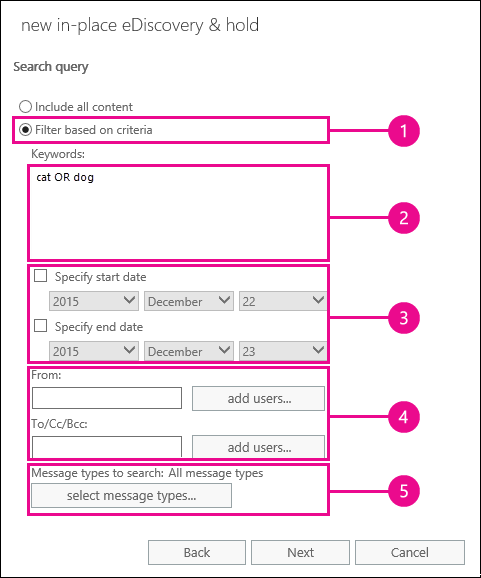

# 사용자 사서함에서 지운 편지함 복구 - 관리자 도움말

**이 문서는 관리자를 위한 것입니다. 사서함에서 삭제 된 항목을 복구 하려고 하나요?** 다음 중 하나를 선택합니다.
- [Windows용 Outlook에서 삭제된 항목 복구](https://support.office.com/article/49e81f3c-c8f4-4426-a0b9-c0fd751d48ce)
- [Outlook Web App에서 지운 편지함 또는 전자 메일 복구](https://support.office.com/article/c3d8fc15-eeef-4f1c-81df-e27964b7edd4)
- [웹용 Outlook에서 삭제 된 전자 메일 메시지 복원](https://support.office.com/article/a8ca78ac-4721-4066-95dd-571842e9fb11)
- [Outlook.com](https://go.microsoft.com/fwlink/p/?LinkID=623435)
   
사용자가 Outlook 사서함에서 항목을 영구적으로 삭제 했습니까? 사용자가 다시 작업을 하려고 하지만 복구할 수는 없습니다. 제거 된 항목이 사용자 사서함에서 영구적으로 제거 되지 않은 경우 해당 항목을 복구할 수 있습니다. Exchange Online의 원본 위치 eDiscovery 도구를 사용 하 여 삭제 된 전자 메일 및 기타 항목 (예: 연락처, 일정 약속 및 작업)을 사용자의 사서함에서 검색 합니다. 삭제 된 항목을 찾은 경우 사용자가 사서함에 항목을 다시 복원 하는 데 사용할 수 있는 PST 파일 (Outlook 데이터 파일 라고도 함)로 내보낼 수 있습니다.
  
사용자 사서함에서 삭제 된 항목을 복구 하는 단계는 다음과 같습니다. 이 작업에 소요 되는 시간이 얼마나 걸립니까? 복구 하려는 항목 수에 따라, 처음에 20 시간 또는 30 분 정도까지 모든 단계를 완료 하는 데 시간이 걸릴 수 있습니다.
  
> [!NOTE]
> 이 문서에 나와 있는 단계를 수행 하려면 Office 365의 **exchange 관리자** 또는 **전역 관리자** 이거나 Exchange Online에서 조직 관리 역할 그룹의 구성원 이어야 합니다. 자세한 내용은 [Office 365 관리자 역할 정보](https://support.office.com/article/da585eea-f576-4f55-a1e0-87090b6aaa9d)를 참조하세요. 
  
## 1 단계: 자신 eDiscovery 권한 할당

첫 번째 단계는 원본 위치 eDiscovery 도구를 사용 하 여 사용자의 사서함을 검색할 수 있도록 Exchange Online에서 필요한 권한을 자신에 게 할당 하는 것입니다. 이 작업은 한 번만 수행 하면 됩니다. 나중에 다른 사서함을 검색 해야 하는 경우에는이 단계를 건너뛰어도 됩니다.
  
1. 회사 또는 학교 계정으로 [Where to sign in to Office 365 for business](https://support.office.com/article/e9eb7d51-5430-4929-91ab-6157c5a050b4)합니다. 
    
2. 앱 시작 관리자 아이콘  의 앱 시작 관리자 아이콘을 선택 하 고 **관리자**를 클릭 합니다.
    
3. Microsoft 365 관리 센터의 왼쪽 탐색 창에서 **관리 센터**를 확장 한 다음 **Exchange**를 클릭 합니다.
    
    
  
4. Exchange 관리 센터에서 **사용 권한**, **관리자 역할**을 차례로 클릭 합니다.
    
5. 목록 보기에서 **검색 관리**를 선택 하 고 편집 아이콘 ****편집을 클릭 합니다.
    
    
  
6. **역할 그룹**의 **구성원**아래에서 ****추가를 클릭 합니다.
    
7. **구성원 선택**의 이름 목록에서 자신을 선택 하 고 **추가**를 클릭 한 다음 **확인**을 클릭 합니다.
    
    > [!NOTE]
    > 조직 관리 또는 TenantAdmins와 같이 구성원으로 속해 있는 그룹을 추가할 수도 있습니다. 그룹을 추가 하는 경우에는 해당 그룹의 다른 구성원에 게 원본 위치 eDiscovery 도구를 실행 하는 데 필요한 권한이 할당 됩니다. 
  
8. **역할 그룹**에서 **저장**을 클릭 합니다.
    
9. Office 365에서 로그 아웃 합니다.
    
    새 사용 권한이 적용 되려면 다음 단계를 시작 하기 전에 로그 아웃 해야 합니다.
    
> [!CAUTION]
> 검색 관리 역할 그룹의 구성원은 중요 한 메시지 콘텐츠에 액세스할 수 있습니다. 여기에는 조직의 모든 사서함 검색, 검색 결과 및 기타 사서함 항목 미리 보기, 검색 사서함에 결과 복사, PST 파일로 검색 결과 내보내기 등이 포함 됩니다. 
  
[Return to top](recover-deleted-items-in-a-mailbox.md#__top)
  
## 2 단계: 사용자 사서함에서 삭제 된 항목 검색

원본 위치 eDiscovery 검색을 실행 하면 검색 하는 사서함의 복구할 수 있는 항목 폴더가 자동으로 검색에 포함 됩니다. 복구 가능한 항목 폴더는 영구 삭제 된 항목이 사서함에서 제거 (영구적으로 제거) 될 때까지 저장 되는 위치입니다. 따라서 항목이 제거 되지 않은 경우 원본 위치 eDiscovery 도구를 사용 하 여 항목을 찾을 수 있습니다.
  
1. 회사 또는 학교 계정으로 [Where to sign in to Office 365 for business](https://support.office.com/article/e9eb7d51-5430-4929-91ab-6157c5a050b4)합니다. 
    
2. 앱 시작 관리자 아이콘  의 앱 시작 관리자 아이콘을 선택 하 고 **관리자**를 클릭 합니다.
    
3. Microsoft 365 관리 센터의 왼쪽 탐색 창에서 **admin**을 확장 한 다음 **Exchange**를 클릭 합니다.
    
4. Exchange 관리 센터에서 **준수 관리**를 클릭 하 고 원본 ** &amp; 위치 eDiscovery 유지**를 클릭 한 다음 **새**을 클릭 합니다.
    
    
  
5. **이름 및 설명** 페이지에서 검색의 이름 (예: 전자 메일을 복구할 사용자의 이름)과 선택적 설명을 입력 하 고 **다음**을 클릭 합니다.
    
6. **사서함** 페이지에서 **검색할 사서함 지정**을 클릭 하 고 추가 아이콘](media/8ee52980-254b-440b-99a2-18d068de62d3.gif) **추가**
  
7. 삭제 된 전자 메일을 복구 하려는 사용자의 이름을 찾아서 선택 하 고 **추가**를 클릭 한 다음 **확인**을 클릭 합니다.
    
8. **다음**을 클릭합니다.
    
    **검색 쿼리** 페이지가 표시 됩니다. 이 기능을 통해 사용자 사서함에서 누락 된 항목을 찾는 데 도움이 되는 검색 조건을 정의할 수 있습니다. 
    
9. **검색 쿼리** 페이지에서 다음 필드를 작성합니다. 
    
  - **모든 콘텐츠 포함** 사용자의 사서함에 있는 모든 콘텐츠를 검색 결과에 포함 하려면이 옵션을 선택 합니다. 이 옵션을 선택하면 추가 검색 조건을 지정할 수 없습니다. 
    
  - **조건을 기준으로 필터링** 키워드, 시작 및 종료 날짜, 보낸 사람 및 받는 사람 주소, 메시지 유형을 포함 한 검색 조건을 지정 하려면이 옵션을 선택 합니다. 
    
    
  
|**필드**|**사용할 대상 ...**|
|:-----|:-----|
|             |키워드, 날짜 범위, 받는 사람 및 메시지 유형을 지정 합니다.    |
|             |키워드나 구가 포함 된 메시지를 검색 하 고 **and** 또는 **or**과 같은 논리 연산자를 사용 합니다.    |
|             |날짜 범위 내에서 보내거나 받은 메시지를 검색 합니다.    |
|             |받은 메시지를 검색 하 여 특정 사용자에 게 보내거나 전송 합니다.    |
|             |모든 메시지 유형을 검색 하거나 특정 항목을 선택 합니다.    |
   
    > [!TIP]
    >  Here's a few tips about how to build a search query to find missing items. Try to get as much information from the user to help you create a search query so you can find what you're looking for. >  If you not sure how to find a missing message, consider using the **Include all content** option. The search results will include all items in the user's Recoverable Items folder, including the hidden folder (called the Purges folder) that contain items that have been purged by the user. Then you can go to Step 3, copy the results to a discovery mailbox, and look at the message in the hidden folder. >  If you know approximately when the missing message was originally sent or received by the user, use the **Specify start date** and **Specify end date** options to provide a date range. This will return all messages sent or received by the user within that date range. Specifying a date range is a really good way to narrow the search results. >  If you know who sent the missing email, use the **From** box to specify this sender. >  If you want to narrow the search results to different types of mailbox items, click **Select message types**, click **Select the message types to search**, and then choose a specific message type to search for. For example, you can search only for calendar items or contacts. Here's a screenshot of the different message types you can search for; the default is to search for all message types. 
  
    Click **Next** when you've completed the **Search query** page. 
    
10. 원본 **위치 유지 설정** 페이지에서 **마침을** 클릭 하 여 검색을 시작 합니다. 삭제 된 전자 메일을 복구 하기 위해 사용자의 사서함을 보류 상태로 둘 필요는 없습니다. 
    
    검색을 시작한 후에는 Exchange에서 지정한 조건에 따라 검색에서 반환 되는 항목의 총 크기와 개수가 표시 됩니다.
    
11. 방금 만든 검색을 선택 하 고 새로 **** 고침을 클릭 하 여 세부 정보 창에 표시 된 정보를 업데이트 합니다. **예상 완료** 상태는 검색을 완료 했음을 나타냅니다. 또한 9 단계에서 지정한 검색 조건에 따라 검색에서 찾은 총 항목 (및 해당 크기)에 대 한 예상 개수를 표시 합니다. 
    
12. 세부 정보 창에서 **검색 결과 미리 보기** 를 클릭 하 여 찾은 항목을 봅니다. 이렇게 하면 찾고 있는 항목을 식별 하는 데 도움이 될 수 있습니다. 복구 하려는 항목을 찾은 경우 4 단계로 이동 하 여 검색 결과를 PST 파일로 내보냅니다. 
    
    
  
13. 원하는 내용을 찾지 못한 경우 검색을 선택 하 고 편집 아이콘](media/ebd260e4-3556-4fb0-b0bb-cc489773042c.gif) **편집**
  
## 반드시 3 단계: 검색 결과를 검색 사서함에 복사

검색 결과를 미리 보거나 사용자가 복구할 수 있는 항목 폴더에 있는 항목을 확인 하려면 검색 결과를 검색 사서함 이라는 특수 사서함에 복사한 다음 해당 사서함을 웹에서 Outlook에서 열 수 있습니다. o 실제 항목을 봅니다. 검색 결과를 복사 하는 가장 좋은 이유는 사용자의 복구 가능한 항목 폴더에 있는 항목을 볼 수 있도록 하는 것입니다. 복구 하려는 항목이 제거 하위 폴더에 있을 가능성이 높습니다. 
  
1. Exchange 관리 센터에서 **준수 관리** \> 원본 **위치 eDiscovery &amp; 유지**로 이동 합니다.
    
2. 검색 목록에서 2 단계에서 만든 검색을 선택 합니다.
    
3. 검색 검색](media/c94e8591-7044-4650-a0d1-c57c0633ab4f.png)을 클릭 하 고 드롭다운 목록에서 **검색 결과 복사** 를 클릭 합니다. ****
  
4. **검색 결과 복사** 페이지에서 **찾아보기를**클릭 합니다.
    
    
  
5. **표시 이름**에서 **검색 검색 사서함**을 클릭 하 고 **확인**을 클릭 합니다.
    
    
  
    > [!NOTE]
    > 검색 사서함은 Office 365 조직에 자동으로 만들어지는 기본 검색 사서함입니다. 
  
6. 다시 **검색 결과 복사** 페이지에서 **복사** 를 클릭 하 여 검색 결과를 검색 검색 사서함에 복사 하는 프로세스를 시작 합니다. 
    
    
  
7. 새로고침](media/165fb3ad-38a8-4dd9-9e76-296aefd96334.png) 새로 **고침**
  
    검색 검색 사서함에 복사 된 검색 결과는 원본 위치 eDiscovery 검색과 이름이 같은 폴더에 배치 됩니다. 폴더를 클릭 하 여 해당 폴더의 항목을 표시할 수 있습니다.
    
    
  
    검색을 실행할 때 사용자의 복구 가능한 항목 폴더도 검색 됩니다. 복구 가능한 항목 폴더의 항목이 검색 조건을 충족 하는 경우 검색 결과에 포함 됩니다. 삭제 폴더의 항목은 지운 편지함 폴더에서 항목을 삭제 하거나, **Shift + Delete**를 눌러 사용자가 영구적으로 삭제 한 항목입니다. 사용자는 Outlook 또는 웹용 Outlook에서 삭제 된 항목 복구 도구를 사용 하 여 삭제 폴더의 항목을 복구할 수 있습니다. 제거 폴더의 항목은 사용자가 지운 편지함 복구 도구를 사용 하 여 제거 하거나 사서함에 적용 된 정책에 의해 자동으로 제거 된 항목입니다. 두 경우 모두 관리자만 제거 폴더의 항목을 복구할 수 있습니다. 
    
    > [!TIP]
    > 사용자가 복구 가능한 항목 도구를 사용 하 여 삭제 된 항목을 찾을 수 없지만 해당 항목을 계속 복구 가능한 경우 (즉 사서함에서 영구적으로 제거 되지 않은 경우) 제거 폴더에 있을 수 있습니다. 따라서 사용자에 대해 복구 하려는 삭제 된 항목에 대 한 제거 폴더를 확인 해야 합니다. 
  
[Return to top](recover-deleted-items-in-a-mailbox.md#__top)
  
## 4 단계: 검색 결과를 PST 파일로 내보내기

사용자에 대해 복구 하려는 항목을 찾은 후에는 2 단계에서 실행 한 검색 결과를 PST 파일로 내보냅니다. 사용자는 다음 단계에서이 PST 파일을 사용 하 여 사서함으로 삭제 된 항목을 복원 합니다.
  
1. Exchange 관리 센터에서 **준수 관리** \> 원본 **위치 eDiscovery &amp; 유지**로 이동 합니다.
    
2. 검색 목록에서 2 단계에서 만든 검색을 선택 합니다.
    
3. **PST 파일로 내보내기를**클릭 합니다.
    
    
  
4. EDiscovery 내보내기 도구를 설치 하 라는 메시지가 표시 되 면 **실행**을 클릭 합니다.
    
5. EDiscovery PST 내보내기 도구에서 **찾아보기를** 클릭 하 여 PST 파일을 다운로드 하려는 위치를 지정 합니다. 
    
    
  
    중복 제거를 사용 하도록 설정 하 고 검색할 수 없는 항목을 포함 하는 옵션은 무시 해도 됩니다.
    
6. **시작** 을 클릭 하 여 PST 파일을 컴퓨터에 다운로드 합니다. 
    
    **EDISCOVERY PST 내보내기 도구** 는 내보내기 프로세스에 대 한 상태 정보를 표시 합니다. 내보내기가 완료 되 면 다운로드 한 위치에서 파일에 액세스할 수 있습니다. 
    
[Return to top](recover-deleted-items-in-a-mailbox.md#__top)
  
## 5 단계: 복구 된 항목을 사용자의 사서함으로 복원

마지막 단계에서는 4 단계에서 내보낸 PST 파일을 사용 하 여 복구 된 항목을 사용자의 사서함으로 복원 합니다. 사용자에 게 PST 파일을 보낸 후에는 사용자가이 단계의 나머지 부분을 수행 하 여 PST 파일을 연 다음 복구 된 항목을 해당 사서함의 다른 폴더로 이동 합니다. 단계별 지침을 위해 [Outlook 데이터 파일 (.pst) 열기 및 닫기](https://support.office.com/article/381b776d-7511-45a0-953a-0935c79d24f2)항목에 대 한 링크를 사용자에 게 보낼 수도 있습니다. 또는 아래의 [PST 파일을 사용 하 여 삭제 된 항목을 사서함으로 복원](recover-deleted-items-in-a-mailbox.md#restoredeleteditems) 하는 링크를 사용자에 게 보내 다음 단계를 수행 하도록 할 수 있습니다. 
  
 **사용자에 게 PST 파일 보내기**
  
4 단계에서 내보낸 PST 파일을 사용자에 게 보내는 것은 수행 해야 하는 마지막 단계입니다. 이 작업을 수행 하는 방법에는 몇 가지가 있습니다.
  
- PST 파일을 전자 메일 메시지에 첨부 합니다. Outlook이 PST 파일을 차단 하도록 구성 된 경우 파일을 압축 한 다음 메시지에 첨부 해야 합니다. 방법은 다음과 같습니다.
    
1. Windows 탐색기 또는 파일 탐색기에서 PST 파일로 이동 합니다.
    
2. 파일을 마우스 오른쪽 단추로 클릭 한 다음 **압축 (zip) 폴더로** **보내기를** \> 선택 합니다. Windows에서 새 zip 파일을 만들고 PST 파일과 동일한 이름을 제공 합니다.
    
3. 압축 된 PST 파일을 전자 메일 메시지에 첨부 하 고 사용자에 게 보내 파일을 클릭 하는 것 만으로 압축을 해제할 수 있습니다.
    
- 사용자가 액세스 하 여 검색할 수 있는 공유 폴더에 PST 파일을 복사 합니다.
    
다음 섹션의 단계는 사용자가 사서함에 대해 삭제 된 항목을 복원 하는 과정을 수행 합니다.
  
 
**PST 파일을 사용 하 여 삭제 된 항목을 사서함으로 복원**
  
PST 파일을 사용 하 여 삭제 된 항목을 복원 하려면 Outlook 데스크톱 앱을 사용 해야 합니다. Outlook Web App 또는 웹용 Outlook을 사용 하 여 PST 파일을 열 수 없습니다.
  
1. Outlook 2013 또는 Outlook 2016에서 **파일** 탭을 클릭 합니다. 
    
2. **내보내기 열기 &amp; **를 클릭 한 다음 **Outlook 데이터 파일 열기**를 클릭 합니다.
    
3. 관리자가 보낸 PST 파일을 저장 한 위치로 이동 합니다.
    
4. PST를 선택한 다음 **열기**를 클릭 합니다.
    
    PST 파일은 Outlook의 왼쪽 탐색 모음에 표시 됩니다.
    
    
  
5. 화살표를 클릭 하 여 PST 파일 및 그 아래에 있는 폴더를 확장 하 여 복구할 항목을 찾습니다.
    
    
  
    > [!TIP]
    > 복구할 항목에 해당 하는 제거 프로그램 폴더를 찾습니다. 삭제 된 항목은로 이동 되는 숨겨진 폴더입니다. 관리자가 복구한 항목은이 폴더에 있을 것입니다. 
  
6. 복구할 항목을 마우스 오른쪽 단추로 클릭 한 다음 **다른 폴더** **이동을** \> 클릭 합니다.
    
    
  
7. 항목을 받은 편지 함으로 이동 하려면 **받은 편지함**을 클릭 하 고 **확인**을 클릭 합니다.
    
    **팁:** 다른 유형의 항목을 복구 하려면 다음 중 하나를 수행 합니다. 
    
  - 일정 항목을 복구 하려면 마우스 오른쪽 단추로 클릭 하 고 **다른 폴더** \> **일정** **이동을** \> 클릭 합니다.
    
  - 연락처를 복구 하려면 마우스 오른쪽 단추로 클릭 하 고 **다른 폴더** \> **대화 상대** **이동을** \> 클릭 합니다.
    
  - 작업을 복구 하려면 마우스 오른쪽 단추로 클릭 하 고 **다른 폴더** \> **작업** **이동을** \> 클릭 합니다.
    

  
    Note that calendar items, contacts, and tasks are located directly in the Purges folder, and not in a Calendar, Contacts, or Tasks subfolder. However, you can sort by **Type** to group similar types of items. 
    
8. 삭제 된 항목의 복구가 완료 되 면 왼쪽 탐색 모음에서 PST 파일을 마우스 오른쪽 단추로 클릭 하 고 **"PST 파일 이름" 닫기를**선택 합니다.
    
[Return to top](recover-deleted-items-in-a-mailbox.md#__top)
  
## 추가 정보

- 항목의 삭제 된 항목 보존 기간이 만료 되지 않은 경우 사용자는 영구적으로 삭제 된 항목을 복구할 수 있습니다. 관리자는 복구 가능한 항목 폴더의 항목을 복구할 수 있는 기간을 지정 했을 수 있습니다. 예를 들어 사용자의 지운 편지함 폴더에 있는 모든 항목을 30 일 동안 삭제 하는 정책이 있을 수 있으며, 사용자가 복구 가능한 항목 폴더에서 최대 14 일까 지를 복구할 수 있는 다른 정책이 있을 수도 있습니다. 그러나이 14 일 후에는이 항목의 절차를 사용 하 여 사용자 사서함의 항목을 복구할 수 있습니다.
    
- 삭제 된 항목이 제거 되지 않았고 해당 항목의 삭제 된 항목 보존 기간이 만료 되지 않은 경우 해당 항목을 복구할 수 있습니다. 사용자가 사서함에서 삭제 된 항목을 복구할 수 있도록 지원 하려면 다음 항목 중 하나를 가리킵니다.
    
  - [Windows용 Outlook에서 삭제된 항목 복구](https://support.office.com/article/49e81f3c-c8f4-4426-a0b9-c0fd751d48ce)
    
  - [Outlook 2010에서 삭제 된 항목 복구](https://support.office.com/article/cd9dfe12-8e8c-4a21-bbbf-4bd103a3f1fe)
    
  - [Outlook Web App에서 지운 편지함 또는 전자 메일 복구](https://support.office.com/article/c3d8fc15-eeef-4f1c-81df-e27964b7edd4)
    
  - [웹용 Outlook에서 삭제 된 전자 메일 메시지 복원](https://support.office.com/article/a8ca78ac-4721-4066-95dd-571842e9fb11)
    
  - [Outlook에서 삭제 된 연락처 복구](https://support.office.com/article/51c83288-6888-4dcd-8c99-4932daabf643)
    
  - [Outlook.com에서 삭제 된 전자 메일 메시지 복원](https://go.microsoft.com/fwlink/p/?LinkID=623435)
    
[맨 위로 돌아가기](recover-deleted-items-in-a-mailbox.md#__top)
  

