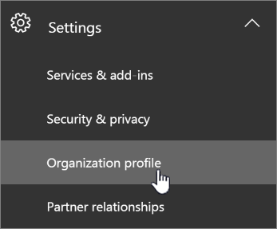

# 데이터 이동을 요청하는 방법

> [!NOTE]
> 이 페이지의 정보는 해당 지역의 새 데이터 센터가 시작 되기 전에 기존 Office 365 테 넌 트가 있었던 고객 에게만 적용 됩니다. 
  
기존 Office 365 고객은 나머지 전체 조직의 핵심 고객 데이터에 대 한 초기 마이그레이션을 요청할 자격이 있습니다.  
  
## 이동을 요청할 수 있는 시기

|**고객의 대금 청구 주소**|**요청 기간 시작**|**요청 기한**|
|:-----|:-----|:-----|
|일본    |2016년 8월 1일    |2016년 10월 31일    |
|오스트레일리아, 뉴질랜드, 피지    |2016년 8월 1일    |2016년 10월 31일    |
|인도    |2016년 8월 1일    |2016년 10월 31일    |
|캐나다    |2016년 8월 1일    |2016년 10월 31일    |
|영국    |2017년 3월 15일     |2017년 9월 15일    |
|대한민국    |2017년 5월 1일    |2017년 10월 31일    |
|프랑스    |2018년 3월 14일    |2018년 9월 15일    |
|아랍에미리트    |7 월 15 일 2019    |2020 년 1 월 31 일    |
|남아프리카 공화국    |7 월 25 일, 2019    |2020 년 1 월 31 일    |
   
## 이동을 요청하는 방법

적절 한 고객은 [관리 센터](https://aka.ms/365admin)에 페이지를 보게 되며, 그러면 핵심 고객 데이터가 새 데이터 센터 지역으로 이동 되도록 요청할 수 있습니다.  
  
Microsoft 365 관리 센터의 페이지에 액세스 하려면 왼쪽의 탐색 창에서 **설정을**확장 하 고 **조직 프로필**을 클릭 합니다.
  

  
**조직 프로필** 페이지에서 아래로 스크롤하여 **데이터 상주 옵션** 섹션으로 이동합니다. 
  

  
**다음 중 하나에 해당 하는 경우이 섹션이 표시 되지 않을 수**있습니다.
- 테 넌 트가 Office 365 이동 프로그램에 적합 하지 않습니다.  자격은 테 넌 트 등록 국가에 따라 결정 됩니다.
- Rest의 모든 핵심 고객 데이터가 이미 새 지역에 있습니다 (페이지의 데이터 위치 섹션 참조). 
  
조직에 데이터 상주 요구 사항이 있고 초기 마이그레이션을 요청 해야 하는 경우 섹션의 오른쪽 위에 있는 **옵트인** 을 클릭 합니다. Office 365 이동 프로그램에 대 한 세부 정보를 설명 하는 새 섹션이 화면 오른쪽에 표시 됩니다. **나머지 조직의 핵심 고객 데이터를 마이그레이션해야**하는 텍스트 옆의 설정/해제 단추를 선택 합니다. 그런 다음 **저장**을 클릭 합니다.
  

  
**조직에서 핵심 고객 데이터를 이동 하도록 요청** 했음을 나타내기 위해 **데이터 상주** 섹션 변경 내용에 텍스트가 표시 됩니다. 메시지 센터에도 확인 메시지가 표시 됩니다. 그러면 이동이 성공적으로 요청 되었음을 확인할 수 있습니다. 

  
## 이동 요청 후 발생하는 작업

이동을 요청한 후에는 운영 제약 조건에서 허용 하는 속도 만큼 빠르게 이동할 계획입니다. 많은 제약이 예측 불가능하기 때문에 이동의 구체적 날짜 또는 기간을 알려드릴 수 없습니다. 이동이 완료되면 알림이 표시됩니다.
  
국가에서 이동을 완료하는 데는 요청 기간이 만료된 후부터 24개월까지 걸릴 수 있습니다.
  
## Microsoft Teams

Microsoft 팀에서는 Microsoft 팀에 대 한 데이터 상주를 사용할 수 있는 지역에서 국내 데이터 센터에 이르기까지 나머지 지역의 고객 콘텐츠 마이그레이션을 아직 지원 하지 않습니다.  따라서 Microsoft 팀이 데이터 상주를 지 원하는 새로운 지역에서는 새 고객만 모든 데이터를 국가 내에 저장 합니다.  회사 위치에 대 한 Office 365 데이터 상주에 대 한 자세한 내용은 [어디에서 찾을 수 있나요?](https://products.office.com/where-is-your-data-located)   

## 이동 요청 전 선택적 작업

다음 단계를 적절히 수행합니다.
  
### IP 기반 방화벽을 사용하는 경우 새 IP 주소에 대한 허용 규칙 추가

IP 주소 대신 방화벽에 대해 DNS 필터링을 사용하는 것이 좋습니다. 필요한 새 DNS 항목은 없습니다.
  
인터넷 연결을 위해 IP 기반 방화벽을 사용하는 경우 대상 데이터 센터 지역의 새 IP 주소에 대해 허용 규칙을 추가해야 합니다. 새 데이터 센터에 대 한 IP 주소도 새 서버와 함께 [Office 365 url 및 IP 주소 범위](https://go.microsoft.com/fwlink/p/?LinkId=229631)에 지속적으로 추가 됩니다.
  
허용 규칙(허용 목록이라고도 함)을 추가하는 방법에 대한 자세한 내용은 방화벽 설명서를 참조하세요.
  
IP 주소를 추가한 후 새 데이터 센터 지역에 대한 연결을 테스트할 수 있습니다. 이 작업을 수행 하려면 새 데이터 센터 geo를 사용할 수 있는 즉시 [새로운 무료 30 일 평가판](https://go.microsoft.com/fwlink/?LinkId=522463) 테 넌 트를 만드는 것이 좋습니다. 
  
### 새 테넌트를 사용하여 테스트

이동 전에 연결을 테스트 하려는 경우 새 데이터 센터 geo를 사용할 수 있는 후 [새로운 무료 30 일 평가판 테 넌 트](https://go.microsoft.com/fwlink/?LinkId=522463) 를 설정 하 고이를 사용 하 여 Office 365를 새 데이터 센터 지역에서 호스팅하는 환경을 경험할 수 있습니다. 
  
평가판 테 넌 트를 기존 테 넌 트와 함께 사용할 수 없습니다.
  
- 사용자는 테스트를 위해 별도 평가판 계정을 사용해야 합니다.
    
- 테넌트 간에 데이터를 이동할 방법은 없습니다.
    
### 모바일 장치에서 오래된 Exchange 설정을 업데이트하도록 사용자에게 알림

사용자가 Exchange Server가 **m.outlook.com** 또는 **podxxxxx.outlook.com**로 설정 된 모바일 장치를 사용 하는 경우에는 **** [동기화 하도록 모바일 장치 설정의 지침에 따라 outlook.office365.com로 전환 하는 것이 좋습니다. ](https://support.office.com/article/c9139caf-01ab-41a0-827c-3c06ee569ed3)합니다.

## 관련 항목

[핵심 데이터를 새 Office 365 데이터 센터 지역으로 이동](moving-data-to-new-datacenter-geos.md)

[데이터 이동 일반 FAQ](data-move-faq.md)

[Microsoft Dynamics CRM Online에 대 한 새로운 데이터 센터 지역](https://go.microsoft.com/fwlink/p/?Linkid=615924)
  
[지역별 Azure services](https://azure.microsoft.com/en-us/regions/)
  

