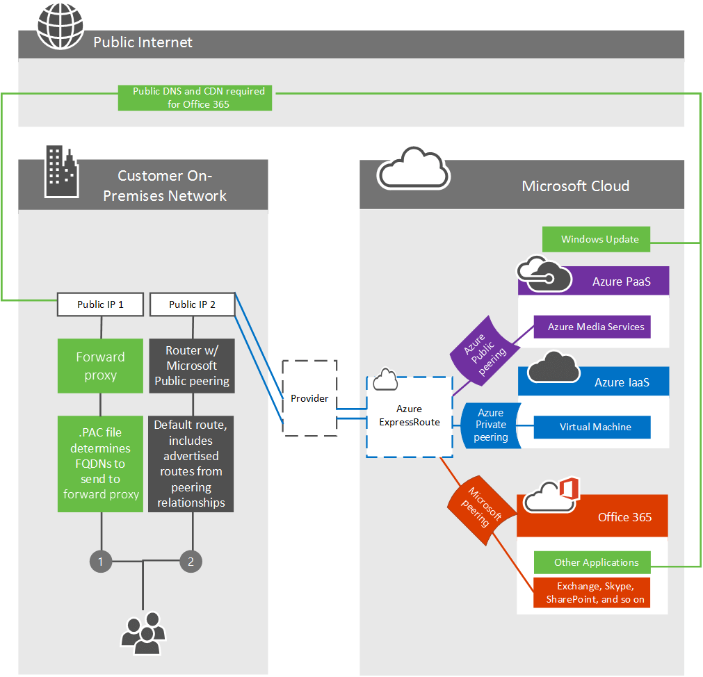

# Office 365용 ExpressRoute를 사용한 라우팅

*이 문서는 Microsoft 365 Enterprise 및 Office 365 Enterprise에 모두 적용 됩니다.*

Azure Express 경로를 사용 하 여 Office 365에 대 한 라우팅 트래픽을 올바르게 이해 하려면 핵심 Express 경로 및 [라우팅 도메인](https://azure.microsoft.com/documentation/articles/expressroute-circuit-peerings/)에 대 한 회사의 [요구 사항을](https://azure.microsoft.com/documentation/articles/expressroute-routing/) 파악 해야 합니다. 이를 통해 Office 365 고객이 의존할 수 있는 Express를 사용 하기 위한 기본이 설정 됩니다.
  
위의 문서에서 이해 해야 하는 몇 가지 주요 항목은 다음과 같습니다.
  
- Express 기반 회로는 특정 실제 인프라에 매핑되지 않지만 사용자를 대신해 서 Microsoft 및 피어 링 공급자가 단일 피어 링 위치에서 만든 논리적 연결입니다.

- 가 중 회로와 고객의 s-키 사이에는 1:1의 매핑이 있습니다.

- 각 회로는 두 개의 독립 피어 링 관계 (Azure Private 피어 링 및 Microsoft 피어 링)를 지원할 수 있습니다. Office 365에는 Microsoft 피어 링이 필요 합니다.

- 각 회로에는 모든 피어 링 관계에서 공유 되는 고정 대역폭이 있습니다.

- 모든 공용 IPv4 주소와 공용이 가능한 회로에 사용 될 수 있는 번호는 사용자가 소유 하 고 있거나 주소 범위의 소유자가 독점적으로 할당 해야 합니다.

- 가상의가 수 회로는 전역적으로 중복 되며 표준 BGP 라우팅 방법을 따릅니다. 이 때문에 활성/활성 구성에서 공급자에 대 한 egress 당 두 개의 실제 회로를 권장 하는 것이 좋습니다.

지원 되는 서비스, 비용 및 구성 세부 정보에 대 한 자세한 내용은 [FAQ 페이지](https://azure.microsoft.com/documentation/articles/expressroute-faqs/) 를 참조 하십시오. Microsoft 피어 링 지원을 제공 하는 연결 공급자 목록에 대 한 자세한 내용은 [express 기반 위치 문서](https://azure.microsoft.com/documentation/articles/expressroute-locations/) 를 참조 하세요. 또한 채널 9에서 [Office 365 교육 시리즈에 대 한](https://channel9.msdn.com/series/aer) 10 가지 Azure 데이터를 기록 하 여 개념을 보다 철저히 설명할 수 있도록 했습니다.
  
## 경로 대칭 강화

인터넷 및 Express에서 Office 365 프런트 엔드 서버에 액세스할 수 있습니다. 이러한 서버는 두 가지를 모두 사용할 수 있는 경우로이 회로를 통해 온-프레미스로 다시 라우팅하는 것이 좋습니다. 이 때문에 네트워크의 트래픽이 인터넷 회로를 통해 asymmetry 것이 좋습니다. 비대칭 경로는 상태 저장 패킷 검사를 수행 하는 장치는 다음에 오는 아웃 바운드 패킷과 다른 경로를 따르는 반환 트래픽을 차단 하는 경우에 발생 합니다.
  
인터넷 또는 Express 경로를 통해 Office 365에 대 한 연결을 시작 하는지 여부에 관계 없이 원본은 공용 라우팅할 수 있는 주소 여야 합니다. 다 수의 고객이 Microsoft와 직접 피어 링을 사용 하 여 고객 간에 중복이 가능 하다는 개인 주소를 보유 하 고 있습니다.
  
Office 365에서 온-프레미스 네트워크로의 통신이 시작 되는 시나리오는 다음과 같습니다. 네트워크 디자인을 단순화 하려면이를 인터넷 경로를 통해 라우팅하는 것이 좋습니다.
  
- Exchange Online 테 넌 트에서 온-프레미스 호스트 또는 SharePoint Online에서 온-프레미스 호스트로 보내는 SharePoint Online 메일에 대 한 메일 같은 SMTP 서비스 SMTP 프로토콜은 Express에서 공유 되는 경로 접두사 보다 광범위 하 게 사용 되며, 비트 단위를 통해 온-프레미스 SMTP 서버를 보급 하면 이러한 다른 서비스에서 오류가 발생 합니다.

- 로그인 하는 동안 ADFS를 확인 합니다.

- [Exchange Server 하이브리드 배포](https://technet.microsoft.com/library/jj200581%28v=exchg.150%29.aspx)

- [SharePoint 페더레이션 하이브리드 검색](https://technet.microsoft.com/library/dn197174.aspx)

- [SharePoint 하이브리드 BCS](https://technet.microsoft.com/library/dn197239.aspx )

- 비즈니스용 skype [하이브리드](https://technet.microsoft.com/library/jj205403.aspx) 및/또는 [비즈니스용 skype 페더레이션](https://technet.microsoft.com/library/skype-for-business-online-federation-and-public-im-conectivity.aspx)

- [비즈니스용 Skype 클라우드 커넥터](https://technet.microsoft.com/library/mt605227.aspx )입니다.

Microsoft가 이러한 양방향 트래픽 흐름을 위해 네트워크로 다시 라우팅하도록 온-프레미스 장치에 대 한 BGP 경로를 Microsoft와 공유 해야 합니다. Express를 통해 Microsoft에 경로 접두사를 보급할 때 다음과 같은 최상의 방법을 따르는 것이 좋습니다.

1) 공용 인터넷 및가 위를 통해 동일한 공용 IP 주소 경로 접두사를 알리지 않습니다. IP를 통한 Microsoft로의 접두사 보급을 라우팅하는 것은 인터넷에 전혀 보급 되지 않는 범위에서 시작 하는 것이 좋습니다. 사용 가능한 IP 주소 공간으로 인해 달성할 수 없는 경우에는 인터넷 회로 보다 더 많은 주소를 추가 하는 것이 중요 합니다.

2) 사용자 단위 회로 당 별도의 NAT IP 풀을 사용 하 고 인터넷 회로와는 별개입니다.

3) Microsoft로 보급을 알린 경로는 사용자가 네트워크에 들어오는 경로를 나타내는 것이 아니라 Microsoft 네트워크의 모든 서버에서 네트워크 트래픽을 모집 합니다. 라우팅 시나리오가 정의 되 고 팀에서 잘 이해 하는 서버에 대 한 경로만 보급 합니다. 네트워크의 여러 Express 회선에서 별도의 IP 주소 경로 접두사를 보급 합니다.
  
## Express를 통해 라우팅할 응용 프로그램 및 기능 결정

Microsoft 피어 링 라우팅 도메인을 사용 하 여 피어 링 관계를 구성 하 고 적절 한 액세스를 승인 하는 경우, Express를 통해 사용할 수 있는 모든 PaaS 및 SaaS 서비스를 볼 수 있습니다. Express로 디자인 된 Office 365 서비스는 [BGP 커뮤니티](https://aka.ms/bgpexpressroute365) 또는 [경로 필터로](https://docs.microsoft.com/azure/expressroute/how-to-routefilter-portal)관리할 수 있습니다.
  
Office 365 비디오와 같은 다른 응용 프로그램은 Office 365 응용 프로그램입니다. 그러나 Office 365 비디오는 세 가지 다른 구성 요소, 포털, 스트리밍 서비스 및 콘텐츠 배달 네트워크로 구성 됩니다. 포털은 SharePoint Online 내에서, 스트리밍 서비스는 Azure Media Services 내에 있고, 콘텐츠 배달 네트워크는 Azure CDN 내에 있습니다. 다음 표에서는 이러한 구성 요소를 간략하게 보여 줍니다.

|**구성 요소**|**기본 응용 프로그램**|**SharePoint Online BGP 커뮤니티에 포함 되어 있나요?**|**사용**|
|:-----|:-----|:-----|:-----|
|Office 365 비디오 포털    |SharePoint Online    |예    |구성, 업로드    |
|Office 365 비디오 스트리밍 서비스    |Azure Media Services    |아니요    |CDN에서 비디오를 사용할 수 없는 경우에 사용 되는 스트리밍 서비스    |
|Office 365 비디오 콘텐츠 배달 네트워크    |Azure CDN    |아니요    |비디오 다운로드/스트리밍의 기본 원본입니다. [자세한 내용은 Office 365 비디오 네트워킹](https://support.office.com/article/Office-365-Video-networking-Frequently-Asked-Questions-FAQ-2bed67a1-4052-49ff-a4ce-b7e6530eb98e)를 확인 하세요.    |

Microsoft 피어 링을 사용 하 여 사용할 수 있는 각 Office 365 기능은 [office 365 끝점 문서](https://support.office.com/article/Office-365-URLs-and-IP-address-ranges-8548a211-3fe7-47cb-abb1-355ea5aa88a2) 에 응용 프로그램 유형별 및 FQDN으로 나열 되어 있습니다. 표에서 FQDN을 사용 하는 이유는 고객이 PAC 파일 또는 기타 프록시 구성을 사용 하 여 트래픽을 관리할 수 있도록 하는 것 이며, 예제 PAC 파일에 대 한 [Office 365 끝점을 관리](https://aka.ms/manageo365endpoints) 하는 가이드를 참조 하세요.
  
어떤 경우에는 하나 이상의 하위 Fqdn이 더 높은 수준의 와일드 카드 도메인과 다르게 보급 되는 와일드 카드 도메인을 사용 했을 것입니다. 이 문제는 일반적으로 와일드 카드를 사용 하 여 인터넷에 모두 보급 되 고, 소수의 하위 집합은 인터넷에만 보급 되는 경우 또는 역방향으로 알린 서버의 긴 목록을 나타내는 경우에 발생 합니다. 차이점을 확인 하려면 아래 표를 참조 하세요.
  
이 테이블에는 인터넷에만 보급 되는 하위 Fqdn과 함께 인터넷 및 Azure Express를 모두 알리는 와일드 카드 Fqdn이 표시 됩니다.

|**Express 경로 및 인터넷 회로에 대해 보급 되는 와일드 카드 도메인**|**인터넷 회로에만 알려진 하위 FQDN**|
|:-----|:-----|
|\*. microsoftonline.com    |click.email.microsoftonline.com    portal.microsoftonline.com    provisioningapi.microsoftonline.com    adminwebservice.microsoftonline.com    |
|\*. officeapps.live.com    |nexusRules.officeapps.live.com    nexus.officeapps.live.com    odc.officeapps.live.com    odc.officeapps.live.com    cdn.odc.officeapps.live.com    ols.officeapps.live.com    ocsredir.officeapps.live.com    ocws.officeapps.live.com    ocsa.officeapps.live.com    |

일반적으로 PAC 파일은 보급 된 끝점을 대상으로 하는 네트워크 요청을 회로에 직접 전송 하 고 다른 모든 네트워크 요청을 프록시에 보내도록 하기 위한 것입니다. 다음과 같은 PAC 파일을 구성 하는 경우 다음 순서 대로 PAC 파일을 작성 합니다.
  
1. PAC 파일 맨 위의 표에 있는 두 번째 열에 하위 Fqdn을 포함 하 여 프록시 쪽으로 트래픽을 전송 합니다. [Office 365 끝점 관리](https://aka.ms/manageexpressroute365)문서에 사용할 샘플 PAC 파일을 작성 했습니다.

2. 첫 번째 섹션 아래의 [이 문서](https://aka.ms/o365endpoints) 에서 모든 사용자를 대상으로 하는 것으로 표시 된 모든 fqdn을 해당 대상 회로로 바로 전송 합니다.

3. 이러한 두 항목 아래에 다른 네트워크 끝점이 나 규칙을 포함 하 여 프록시로 트래픽을 전송 합니다.

이 표에는 Azure Express 경로 및 인터넷 회로를 알리는 하위 Fqdn과는 인터넷 회로에 게 보급 되는 와일드 카드 도메인도 표시 됩니다. 위의 PAC 파일의 경우 아래 표에 나와 있는 2 열의 Fqdn은 참조 된 링크에서 두 번째 열에 있음을 알리는 것으로 나열 되어 있으며,이는 파일의 두번째 항목 그룹에 포함 될 것을 의미 합니다.

|**인터넷 회로에만 보급 되는 와일드 카드 도메인**|**비트를 만들고 인터넷 회로에 게 보급 된 하위 FQDN**|
|:-----|:-----|
|\*. office.com    |\*. outlook.office.com    home.office.com    outlook.office.com    portal.office.com    
www.office.com
    |
|\*. office.net    |agent.office.net    |
|\*. office365.com    |outlook.office365.com    smtp.office365.com    |
|\*. outlook.com    |\*. protection.outlook.com    \*. mail.protection.outlook.com    자동 검색- \<tenant\> outlook.com    |
|\*. windows.net    |login.windows.net    |

## 인터넷 및 Express를 통한 Office 365 트래픽 라우팅

선택한 Office 365 응용 프로그램에 경로를 지정 하려면 몇 가지 주요 요인을 결정 해야 합니다.
  
1. 응용 프로그램에 필요한 대역폭의 양 기존 사용 현황 샘플링은 조직에서이를 결정할 수 있는 유일한 방법입니다.

2. 네트워크 트래픽이 네트워크에서 나갈 송신 위치를 지정 합니다. 성능에 영향을 주므로 Office 365 연결에 대 한 네트워크 대기 시간을 최소화할 수 있도록 계획 해야 합니다. 비즈니스용 Skype는 실시간 음성 및 동영상을 사용 하므로 네트워크 대기 시간이 잘못 될 가능성이 있습니다.

3. 모든 또는 네트워크 위치의 하위 집합을 통해 Express를 활용 하려는 경우

4. 선택한 네트워크 공급자가 Express를 제공 하는 위치입니다.

이러한 질문에 대 한 대답을 확인 한 후에는 대역폭과 위치 요구를 충족 하는가을 지 원하는 회로를 구축할 수 있습니다. 네트워크 계획 지원에 대 한 자세한 내용은 [Office 365 네트워크 조정 가이드](https://aka.ms/tune) 및 Microsoft가 [네트워크 성능 계획을 처리 하는 방법에 대 한 사례 연구](https://aka.ms/tunemsit)를 참조 하십시오.
  
### 예 1: 단일 지리적 위치
  
이 예는 지리적 위치가 하나인 Trey Research 라는 가상의 회사에 대 한 시나리오입니다.
  
Trey research의 직원은 회사 네트워크와 ISP 사이에 있는 아웃 바운드 프록시 쌍으로 보안 부서에서 명시적으로 허용 하는 인터넷의 서비스 및 웹 사이트에만 연결할 수 있습니다.
  
Trey Research 계획에서는 Office 365 용 Azure Express 경로를 사용 하 여 콘텐츠 배달 네트워크에 전송 되는 트래픽 같은 일부 트래픽이 Office 365 연결을 위한를 통해 라우팅할 수 없는 것으로 인식 합니다. 모든 트래픽은 기본적으로 프록시 장치에 이미 라우트 되기 때문에 이러한 요청은 이전 처럼 계속 작동 합니다. Trey research가 Azure Express 경로 지정 라우팅 요구 사항을 충족할 수 있는지 확인 한 후에는 회로를 만들고, 라우팅을 구성 하 고, 새 Express 경로를 가상 네트워크에 연결 하는 과정을 진행 합니다. 기본 Azure Express 경로 지정 구성이 완료 되 면 Trey research는 게시 하는 [#2 PAC 파일](https://aka.ms/manageo365endpoints#ID0EACAAA=2._Proxies) 을 사용 하 여 Office 365 연결에 대 한 직접적인 데이터 express를 통해 고객과 관련 된 트래픽을 라우팅합니다.
  
다음 다이어그램에 나와 있는 것 처럼, Trey Research는 라우팅 및 아웃 바운드 프록시 구성 변경의 조합을 사용 하 여 인터넷을 통해 Office 365 트래픽을 라우팅하는 요구 사항을 충족 하 고 트래픽 하위 집합을 사용할 수 있습니다.
  
1. [#2 PAC 파일](https://aka.ms/manageo365endpoints#ID0EACAAA=2._Proxies) 을 사용 하 여 Office 365 용 Azure express 경로에 대해 별도의 인터넷 송신 지점을 통해 라우팅 트래픽을 게시 합니다.

2. 클라이언트는 Trey Research의 프록시에 대 한 기본 경로를 사용 하 여 구성 됩니다.

이 예제 시나리오에서 Trey research는 아웃 바운드 프록시 장치를 사용 하 고 있습니다. 마찬가지로, Office 365에 대해 Azure Express를 사용 하지 않는 고객은이 기술을 사용 하 여 잘 알려진 높은 볼륨 끝점으로 향하는 트래픽을 검사 하는 비용에 따라 트래픽을 라우팅할 수 있습니다.
  
Exchange Online, SharePoint Online 및 비즈니스용 Skype Online의 최대 볼륨 Fqdn은 다음과 같습니다.
  

  
- outlook.office365.com, outlook.office.com

- \<tenant-name\>. sharepoint.com, \<tenant-name\> -my.sharepoint.com, \<tenant-name\> - \<app\> sharepoint.com

- \*. TCP가 아닌 트래픽에 대 한 IP 범위와 함께 Lync.com

- \*broadcast.officeapps.live.com, \* excel.officeapps.live.com, \* onenote.officeapps.live.com, \* powerpoint.officeapps.live.com, \* view.officeapps.live.com, \* visio.officeapps.live.com, \* word-edit.officeapps.live.com, \* word-view.officeapps.live.com, office.live.com

[Windows 8에서 프록시 설정 배포 및 관리](https://blogs.technet.com/b/deploymentguys/archive/2013/05/08/windows-8-supporting-proxy-services-with-static-configurations-web-hosted-pac-files-and-domain-policy-configured-proxy.aspx) 에 대해 자세히 알아보고 [Office 365이 프록시로 제한 되지 않도록](https://blogs.technet.com/b/onthewire/archive/2014/03/28/ensuring-your-office-365-network-connection-isn-t-throttled-by-your-proxy.aspx)합니다.
  
단일 Express 회로를 사용 하는 경우 Trey research에 대 한 고가용성은 제공 되지 않습니다. 대상 간 연결을 처리 하는 Trey의 중복 된에 지 장치에서 오류가 발생 하는 경우 장애 조치 (failover)를 위한 추가 Express도 회로가 제공 되지 않습니다. 이렇게 하면 인터넷에 장애 조치 (failover) 할 때 Trey research를 predicament 하 게 되는 경우 수동 다시 구성 및 경우에 따라 새 IP 주소가 필요 합니다. Trey가 고가용성을 추가 하려는 경우 가장 간단한 솔루션은 각 위치에 대 한 추가 용 회로를 추가 하 고 활성/활성 방식으로 회로를 구성 하는 것입니다.
  
## 여러 위치를 포함 하는 Office 365의 라우팅 Express 경로

마지막 시나리오에서 Office 365 트래픽을를 통한 라우팅 기능은 보다 복잡 한 라우팅 아키텍처의 토대가 됩니다. 위치 수, 해당 위치가 존재 하는 대륙 수,가 중 회로 수 등을 비롯 하 여 일부 트래픽을 인터넷으로 라우팅할 수 있으며,이를 통해 일부 트래픽이 시간 단위를 초과 해야 합니다.
  
여러 지역에서 여러 위치를 사용 하는 고객의 경우에는 다음과 같은 추가 질문을 고려해 야 합니다.
  
1. 모든 위치에서가 중 회로가 필요 합니까? 비즈니스용 Skype를 온라인으로 사용 하거나 SharePoint Online 또는 Exchange Online에 대 한 대기 시간 민감도를 고려해 야 하는 경우 각 위치에 중복 된 활성/활성 방법으로 회로를 두는 것이 좋습니다. 자세한 내용은 비즈니스용 Skype 미디어 품질 및 네트워크 연결 가이드를 참조 하세요.

2. 특정 지역에서 보 거 회로가 제공 되지 않는 경우에는 어떻게 하나요? Office 365에서 트래픽을 라우팅해야 합니까?

3. 소규모 네트워크를 여러 개 사용 하는 경우 트래픽을 통합 하는 기본 방법은 무엇입니까?

이러한 각 경우에는 고유한 네트워크를 평가 하 고 Microsoft에서 제공 하는 옵션을 사용 하는 것이 좋습니다.

|**있다는**|**평가할 네트워크 구성 요소**|
|:-----|:-----|
|두 개 이상의 위치에 있는 회로    |최소 두 개의 회로를 활성/활성 방식으로 구성 하는 것이 좋습니다.    비용, 대기 시간 및 대역폭 요구를 비교 해야 합니다.    BGP 경로 비용, PAC 파일 및 NAT를 사용 하 여 다중 회로를 사용한 라우팅을 관리 합니다.    |
|Express 경로 없이 위치에서 라우팅    |Office 365에 대 한 요청을 시작 하는 사용자에 게는 egress 및 DNS 확인이 권장 됩니다.    DNS 전달을 사용 하 여 원격 사무실이 적절 한 끝점을 검색 하도록 할 수 있습니다.    원격 사무실의 클라이언트에는 Express 회로에 대 한 액세스를 제공 하는 경로가 사용 가능 해야 합니다.    |
|Small office 통합    |사용할 수 있는 대역폭과 데이터 사용량은 신중히 비교 해야 합니다.    |

> [!NOTE]
> Microsoft는 실제 위치에 관계 없이 경로를 사용할 수 있는 경우 인터넷을 통한 Express를 선호 합니다.
  
각 고유 네트워크에 대해 이러한 각 고려 사항을 고려해 야 합니다. 예를 들면 다음과 같습니다.
  
### 예 2: 여러 지리적 위치
  
이 예는 지리적 위치가 여러 개인 Humongous 보험 이라는 가상의 회사에 대 한 시나리오입니다.
  
Humongous 보험은 전 세계의 사무실과 지리적으로 분산 되어 있습니다. Office 365에 대 한 Azure Express 경로를 구현 하 여 직접 네트워크 연결에 대 한 Office 365 트래픽을 대부분 유지 하려는 경우 또한 Humongous 보험 사무소에는 2 개의 추가 대륙도 있습니다. 대표이 가능 하지 않은 원격 사무실에 있는 직원은 Express 연결을 사용 하기 위해 기본 기능 중 하나 또는 둘 모두에 다시 라우트 해야 합니다.
  
여기서는 Office 365에서 가능한 한 빨리 Microsoft 데이터 센터에 트래픽을 전송 하는 방법을 안내 합니다. 이 예에서는 Humongous 보험이 원격 사무소에서 가능한 한 빨리 Microsoft 데이터 센터에 연결할 수 있도록 하거나, 원격 사무소에서 내부 네트워크를 통해 라우팅 해야 하는 경우에는 외부에 있는 연결을 통해 Microsoft 데이터 센터에 연결할 수 있는지 여부를 결정 해야 합니다.
  
Microsoft의 데이터 센터, 네트워크 및 응용 프로그램 아키텍처는 전역적으로 서로 다른 통신을 수행 하 고 가능한 한 가장 효율적인 방법으로 서비스를 제공 하도록 설계 되었습니다. 이는 전 세계 가장 큰 네트워크 중 하나입니다. 필요한 것 보다 더 긴 고객 네트워크에 남아 있는 Office 365에 대 한 요청을 전송 하면이 아키텍처를 활용할 수 없습니다.
  
Humongous 보험 환경에서는가 위를 통해 사용 하려는 응용 프로그램에 따라 계속 진행 해야 합니다. 예를 들어 비즈니스용 Skype Online 고객 또는 외부 비즈니스용 Skype Online 모임에 연결할 때가 중 연결을 활용 하려는 경우 비즈니스용 Skype Online 미디어 품질 및 네트워크 연결 가이드의 디자인은 세 번째 위치에 대 한 추가 Express 회로를 프로 비전 하는 것입니다. 이는 네트워킹 측면에서 더 비쌉니다. 그러나 Microsoft 데이터 센터에 배달 하기 전에 한 대륙에서 다른 전환로 요청을 라우팅하는 경우 비즈니스용 Skype 온라인 모임 및 통신 중에도 성능이 저하 되거나 사용할 수 없습니다.
  
Humongous 보험을 사용 하 고 있지 않거나 어떤 방식으로든 비즈니스용 Skype Online을 사용할 계획이 없는 경우에는 Office 365에서 거 지 연결을 사용 하 여 네트워크 트래픽을 대륙으로 전송 하는 것이 가능 하지만 불필요 한 대기 시간이 나 TCP 혼잡이 발생할 수 있습니다. 두 경우 모두 로컬 사이트에서 인터넷으로 인터넷을 전송 하는 라우팅은 Office 365에서 사용 하는 콘텐츠 배달 네트워크를 활용 하는 것이 좋습니다.
  

  
Humongous 보험이 다중 지리 전략을 계획 하는 경우 회로 규모, 회로 수, 장애 조치 (failover 등)에 대해 고려해 야 할 몇 가지 사항이 있습니다.
  
여러 지역에서 회로 사용을 시도 하는 단일 위치에서 Humongous 보험 회사는 원격 사무실에서 온 office 365에 대 한 연결을 본사에서 가장 가까운 365 회사에 전송 하 고 본사 위치에서 받은 데이터를 확인 하려고 합니다. 이를 위해 Humongous 보험은 본사 인터넷 송신 지점에서 가장 가까운 Office 365 환경에 적절 한 연결을 설정 하는 데 필요한 라운드트립 및 DNS 조회 수를 줄이기 위해 DNS 전달을 구현 합니다. 이는 클라이언트가 로컬 프런트 엔드 서버를 확인 하는 것을 방지 하 고 사용자가 연결 하는 프런트 엔드 서버가 Microsoft와의 Humongous 보험을 피어 링 하는 본사 부근에 있는지 확인 합니다. 또한 [도메인 이름에 대해 조건부 전달자를 할당 하는](https://technet.microsoft.com/library/Cc794735%28v=WS.10%29.aspx)방법에 대해서도 배울 수 있습니다.
  
이 시나리오에서 원격 사무실의 트래픽은 북미의 Office 365 프런트 엔드 인프라를 확인 하 고 Office 365을 활용 하 여 Office 365 응용 프로그램의 아키텍처에 따라 백엔드 서버에 연결 합니다. 예를 들어 Exchange Online은 북미의 연결을 종료 하 고 해당 프런트 엔드 서버는 테 넌 트를 삭제할 때마다 백 엔드 사서함 서버에 연결 합니다. 모든 서비스에는 유니캐스트 및 애니캐스트 대상으로 구성 된 광범위 하 게 배포 되는 전면 도어 서비스가 있습니다.
  
Humongous에 여러 대륙의 주요 사무실이 있는 경우 비즈니스용 Skype 온라인 등의 중요 한 응용 프로그램에 대 한 대기 시간을 줄이기 위해 지역별 활성/활성 회로를 최소한 두 개 이상 권장 됩니다. 모든 사무실이 한 대륙에 있거나 실시간 공동 작업을 사용 하 고 있지 않은 경우 통합 또는 배포 된 egress 지점이 고객 관련 의사 결정이 됩니다. 여러 회로를 사용할 수 있는 경우 BGP 라우팅을 통해 장애 조치 (failover)가 단일 회로를 사용할 수 없게 됩니다.
  
예제 [라우팅 구성](https://azure.microsoft.com/documentation/articles/expressroute-config-samples-routing/) 및를 확인 [https://azure.microsoft.com/documentation/articles/expressroute-config-samples-nat/](https://azure.microsoft.com/documentation/articles/expressroute-config-samples-nat/) 하세요.
  
## Express 경로를 사용한 선택적 라우팅

사용자 하위 집합에 대 한 외부를 테스트 하는 것과 같은 다양 한 이유로 Express를 통한 선택적 라우팅이 필요할 수도 있습니다. 고객은 다음과 같은 다양 한 도구를 사용 하 여 여러 공구 경로를 통해 Office 365 네트워크 트래픽을 선택적으로 라우팅할 수 있습니다.
  
1. **필터링/조각화** -메일 경로를 사용 하 여 BGP 경로를 서브넷 또는 라우터의 하위 집합에 대 한 Office 365로 허용 합니다. 이렇게 하면 고객 네트워크 세그먼트 또는 실제 사무실 위치로 경로가 선택적으로 라우팅됩니다. 이는 Office 365에 대 한 사용자를 위한가을 수 하는 일반적인 방법으로, BGP 장치에 구성 되어 있습니다.

2. **PAC 파일/u** t l-Office 365에서 특정 fqdn에 대 한 네트워크 트래픽을 특정 경로의 경로로 전송 합니다. 이는 [PAC 파일 배포](https://aka.ms/manageo365endpoints#ID0EACAAA=2._Proxies)로 식별 되는 클라이언트 컴퓨터 별로 경로를 선택적으로 결정 하는 것입니다.

3. **경로 필터링**  -  [경로 필터](https://docs.microsoft.com/azure/expressroute/how-to-routefilter-portal) 는 Microsoft 피어 링을 통해 지원 되는 서비스의 하위 집합을 사용 하는 방법입니다.

4. **Bgp 커뮤니티** [태그](https://aka.ms/bgpexpressroute365) 를 기반으로 하는 필터링을 통해 고객은 어떤 Office 365 응용 프로그램에서 어떤 방법으로 이동 하 고 인터넷을 통과할 지를 결정할 수 있습니다.

다음의 간단한 링크를 사용할 수 있습니다. [https://aka.ms/erorouting](https://aka.ms/erorouting)
  
## 관련 항목

[Office 365 네트워크 연결 평가](assessing-network-connectivity.md) 
  
[Office 365용 Azure ExpressRoute](azure-expressroute.md)
  
[Office 365 연결에 대한 ExpressRoute 관리](managing-expressroute-for-connectivity.md)
  
[Office 365용 ExpressRoute를 사용한 네트워크 계획](network-planning-with-expressroute.md)
  
[Office 365용 ExpressRoute 구현](implementing-expressroute.md)
  
[비즈니스용 Skype Online의 미디어 품질 및 네트워크 연결 성능](https://support.office.com/article/5fe3e01b-34cf-44e0-b897-b0b2a83f0917)
  
[비즈니스용 Skype Online의 네트워크 최적화](https://support.office.com/article/b363bdca-b00d-4150-96c3-ec7eab5a8a43)
  
[비즈니스용 Skype Online의 ExpressRoute 및 QoS](https://support.office.com/article/20c654da-30ee-4e4f-a764-8b7d8844431d)
  
[ExpressRoute를 사용하는 호출 흐름](https://support.office.com/article/413acb29-ad83-4393-9402-51d88e7561ab)
  
[Office 365 시나리오에서 (으)로의 BGP 커뮤니티 사용](bgp-communities-in-expressroute.md)
  
[초기 계획 및 성능 기록을 사용하여 Office 365 성능 조정](performance-tuning-using-baselines-and-history.md)
  
[Office 365 성능 문제 해결 계획](performance-troubleshooting-plan.md)
  
[Office 365 URL 및 IP 주소 범위](https://support.office.com/article/8548a211-3fe7-47cb-abb1-355ea5aa88a2)
  
[Office 365 네트워크 및 성능 조정](network-planning-and-performance.md)
