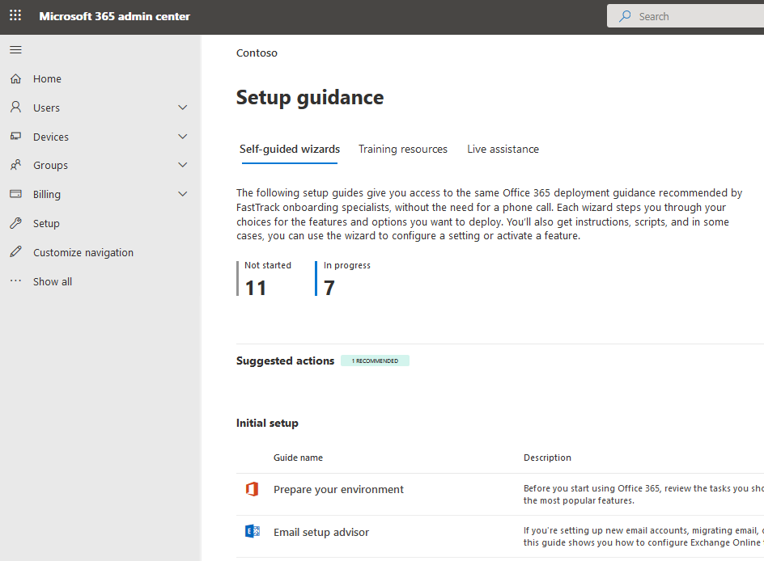

# Microsoft 365 및 Office 365 서비스용 설정 가이드Setup guides for Microsoft 365 and Office 365 services

Microsoft 365 및 Office 365 설치 가이드에서는 앱 및 서비스를 배포 하기 위한 관리자가 조정할 때 사용할 지침 및 리소스를 제공 합니다.Microsoft 365 and Office 365 setup guides give admins tailored guidance and resources for deploying apps and services. 이러한 가이드는 FastTrack 온 보 딩 전문가가 개별 상호 작용에서 공유 하는 것과 동일한 모범 사례를 사용 하 여 작성 되었으며, Microsoft 365 관리 센터 내의 모든 관리자가 사용할 수 있습니다.These guides are created using the same best practices that FastTrack onboarding specialists share in individual interactions, and they're available to all admins within the Microsoft 365 admin center. 제품 설정에 대 한 정보를 제공 하 고, 보안 기능을 사용 하며, 공동 작업 도구를 배포 하 고, 고급 배포 속도를 향상 하기 위한 스크립트를 제공They give information on product setup, enabling security features, deploying collaboration tools, and provide scripts to speed up advanced deployments.

## Microsoft 365 관리 센터에서 설치 가이드에 액세스 하는 방법How to access setup guides in the Microsoft 365 admin center

설치 가이드는 Microsoft 365 관리 센터의 [설치 지침](https://aka.ms/setupguidance) 페이지에서 액세스할 수 있습니다.The setup guides are accessible from the [Setup guidance](https://aka.ms/setupguidance) page in the Microsoft 365 admin center. 진행 상황을 추적 하 고 언제 든 지 안내선을 완성할 수 있습니다.You can keep track of the status of your progress and you have the option to return at any time to complete a guide. **설치 지침** 페이지에 연결 하려면 다음을 수행 합니다.To reach the **Setup guidance** page:

1. [관리 센터](https://admin.microsoft.com/)에서 **홈** 페이지로 이동 합니다.In the [admin center](https://admin.microsoft.com/), go to the **Home** page.

2. **교육 & 가이드** 카드를 찾습니다.Find the **Training & guides** card. 

   

3. **사용자 지정 설치 지침**을 선택 합니다.Select **Customized setup guidance**.

   

>[!NOTE]
>Microsoft 365 관리 센터에 액세스 하려면 테 넌 트 관리자 권한이 필요 합니다.Tenant administrator permissions are required to access the Microsoft 365 admin center.

## Microsoft 365 관리 센터에서 설정 가이드는 어떻게 작동 하나요?How do setup guides work in the Microsoft 365 admin center?

각 가이드에서는 구성을 변경 하는 데 사용할 수 있는 스크립트, 리소스, 문서 및 필요에 따라 단계별 지침을 제공 합니다.Each guide provides you with step-by-step instructions, resources, articles, and when needed, scripts you can use to make configuration changes. 이러한 가이드에서는 소규모 및 대규모 orgs에 대 한 특정 요구 사항을 반영 하는 선택 항목을 제공 합니다.These guides provide you with choices that reflect the specific needs of both small and large orgs. 또한 제공 되는 지침에는 신규 및 숙련 된 관리자 모두에 대 한 지원이 포함 되어 있습니다.Additionally, the guidance provided includes assistance for both new and more experienced admins.

가이드를 사용 하 여 계획 단계에서 특정 Microsoft 365 및 Office 365 기능에 대해 자세히 알아보고, 설정을 수정 하기 위한 배포를 완료 한 후에 다시 방문 합니다.You can use the guides to learn more about specific Microsoft 365 and Office 365 features during the planning phase or revisit them after you've completed a deployment to modify a setting.

## 초기 설정 가이드Guides for initial setup

### 작업 환경 준비Prepare your environment

[환경 준비](https://aka.ms/prepareyourenvironment) 가이드에서는 Microsoft 365 및 Office 365 서비스에 대 한 조직의 환경을 준비 하는 데 도움이 되는 정보를 제공 합니다.The [Prepare your environment](https://aka.ms/prepareyourenvironment) guide helps you prepare your org's environment for Microsoft 365 and Office 365 services. 목표에 관계 없이 성공적인 배포를 위해 완료 해야 하는 작업이 있습니다.Regardless of your goals, there are tasks you'll need to complete to ensure a successful deployment. 환경을 준비 하는 동안 오류가 발생 하지 않도록 하려면 도메인을 연결 하 고, 사용자를 추가 하 고, 라이선스를 할당 하 고, Exchange Online을 사용 하 여 전자 메일을 설정 하 고, Office 앱을 설치 또는 배포 하는 단계별 지침을 제공 합니다.To avoid any errors while preparing your environment, you're provided with step-by-step instructions to connect your domain, add users, assign licenses, set up email with Exchange Online, and install or deploy Office apps. 

### 전자 메일 설정 도우미Email setup advisor

[전자 메일 설정 관리자](https://aka.ms/office365setup) 는 조직에 대해 Exchange Online을 구성 하는 데 필요한 단계별 지침을 제공 합니다.The [Email setup advisor](https://aka.ms/office365setup) provides you with the step-by-step guidance needed for configuring Exchange Online for your organization. 여기에는 새 전자 메일 계정 설정, 전자 메일 마이그레이션, 전자 메일 보호 구성 등이 포함 됩니다.This includes setting up new email accounts, migrating email, and configuring email protection. 전자 메일을 설정 하려면이 관리자를 사용 하 여 조직의 현재 메일 시스템, 마이그레이션되는 사서함 수, 사용자 및 해당 액세스를 관리 하는 방법에 따라 권장 되는 마이그레이션 방법을 수신 합니다.For a successful email set up, use this advisor and you'll receive the recommended migration method based on your org's current mail system, the number of mailboxes being migrated, and how you want to manage users and their access.

### Gmail 연락처 및 일정 도우미Gmail contacts and calendar advisor

Gmail 사용자의 사서함을 Microsoft 365로 마이그레이션하는 경우 전자 메일 메시지가 마이그레이션되고 연락처 및 일정 항목은 마이그레이션되지 않습니다.When you migrate a Gmail user's mailbox to Microsoft 365, email messages are migrated, but contacts and calendar items are not. [Gmail 연락처 및 일정 관리자](https://aka.ms/gmailcontactscalendar) 는 Outlook.com, Outlook 클라이언트 또는 PowerShell과 함께 import 및 export 메서드를 사용 하 여 google 연락처 및 google 일정 항목을 Microsoft 365로 가져오는 단계를 제공 합니다.The [Gmail contacts and calendar advisor](https://aka.ms/gmailcontactscalendar) provides steps for importing Google contacts and Google calendar items to Microsoft 365 using import and export methods with Outlook.com, the Outlook client, or PowerShell.

### Microsoft 365 배포 관리자Microsoft 365 deployment advisor

[Microsoft 365 배포 관리자](https://aka.ms/microsoft365setupguide) 는 생산성 도구, 보안 정책 및 장치 관리 기능을 설정할 때 상업적 고객에 게 지침을 제공 합니다.The [Microsoft 365 deployment advisor](https://aka.ms/microsoft365setupguide) provides commercial customers with guidance when setting up productivity tools, security policies, and device management capabilities. Microsoft 365 Business Premium 또는 Microsoft 365 Enterprise 구독을 사용할 경우이 관리자를 사용 하 여 조직의 장치를 설정 및 구성할 수 있습니다.With a Microsoft 365 Business Premium or Microsoft 365 Enterprise subscription, you can use this advisor to set up and configure your organization's devices. 

사용자는 클라우드 서비스를 사용 하도록 설정 하 고, 장치를 지원 되는 최신 버전의 Windows 10으로 업데이트 하 고, 장치를 Azure Active Directory (Azure AD)에 단일 중앙 위치에 가입 하기 위한 지침 및 리소스에 대 한 액세스 권한을 수신 합니다.You'll receive guidance and access to resources to enable your cloud services, update devices to the latest supported version of Windows 10, and join devices to Azure Active Directory (Azure AD), all in one central location.

### 원격 작업 설정 가이드Remote work setup guide

[원격 작업 설정 가이드](https://aka.ms/remoteworksetup) 에서는 사용자가 원격으로 작업을 수행 하 고, 데이터가 안전 하며, 사용자의 자격 증명을 safeguarded 수 있도록 하는 데 필요한 팁과 리소스가 조직에 제공 됩니다.The [Remote work setup guide](https://aka.ms/remoteworksetup) provides organizations with the tips and resources needed to ensure your users can successfully work remotely, your data is secure, and users' credentials are safeguarded. 

원격 작업자의 장치 트래픽을 클라우드의 Microsoft 365 리소스와 조직의 네트워크 모두에 최적화 하 여 VPN 인프라에 대 한 부담을 줄이는 지침을 받을 수 있습니다.You'll receive guidance to optimize remote workers' device traffic to both Microsoft 365 resources in the cloud and your organization's network, which will reduce the strain on your VPN infrastructure. 

### Windows 가상 데스크톱 설정 가이드Windows Virtual Desktop setup guide

Windows 가상 데스크톱은 클라우드에서 실행 되는 종합적인 데스크톱 및 앱 가상화 서비스입니다.Windows Virtual Desktop is a comprehensive desktop and app virtualization service running in the cloud. 간소화 된 관리, 다중 세션 Windows 10, Microsoft 365 앱에 대 한 최적화 및 RDS (원격 데스크톱 서비스) 환경에 대 한 지원을 제공 하는 VDI (가상 데스크톱 인프라) 뿐입니다.It's the only virtual desktop infrastructure (VDI) that delivers simplified management, multi-session Windows 10, optimizations for Microsoft 365 Apps, and support for Remote Desktop Services (RDS) environments. 시간 (분)에 Windows 데스크톱 및 앱을 배포 및 확장 하 고 기본 제공 되는 보안 및 규정 준수 기능을 알아봅니다.Deploy and scale your Windows desktops and apps to Azure in minutes and get built-in security and compliance features. 

[Windows Virtual Desktop 설정 가이드](https://aka.ms/wvdsetupguide) 에서는 관리자에 게 배포, 설치 지침 및 추가 리소스에 대 한 계획 리소스와 필수 구성 요소를 제공 합니다.The [Windows Virtual Desktop setup guide](https://aka.ms/wvdsetupguide) provides administrators with planning resources and the prerequisites for deployment, setup guidance, and additional resources. 

## 보안 가이드Guides for security

### Azure AD 설정 가이드Azure AD setup guide

[AZURE AD 설정 가이드](https://aka.ms/aadpguidance) 에서는 조직에 강력한 보안 파운데이션이 있는지 확인 하는 정보를 제공 합니다.The [Azure AD setup guide](https://aka.ms/aadpguidance) provides information to ensure your org has a strong security foundation. 이 가이드에서는 관리자를 위한 azure AD (역할 기반 액세스 제어), Azure FS (온-프레미스 디렉터리에 연결) 및 Azure AD Connect Health와 같은 초기 기능을 설정 하 여 자동화 된 동기화 중에 하이브리드 id의 상태를 모니터링할 수 있도록 합니다.In this guide you’ll set up initial features, like Azure role-based access control (Azure RBAC) for admins, Azure AD Connect for your on-premises directory, and Azure AD Connect Health, so you can monitor your hybrid identity's health during automated syncs. 

또한 셀프 서비스 암호 재설정, 조건부 액세스 및 통합 된 타사 로그인 (선택적 고급 ID 보호, 사용자 프로비저닝 자동화 포함)에 대 한 필수 정보도 포함 되어 있습니다.It also includes essential information on enabling self-service password resets, conditional access and integrated third-party sign-on including optional advanced ID protection, and user provisioning automation.

### Passwordless 배포 계획Plan your passwordless deployment

사용자가 Windows Hello for Business, Microsoft Authenticator 앱 또는 보안 키와 같은 passwordless 인증 방법 중 하나를 사용 하 여 장치에 안전 하 게 액세스할 수 있도록 하는 다른 로그인 방식으로 업그레이드 합니다.Upgrade to an alternative sign-in approach that allows users to access their devices securely with one of the following passwordless authentication methods: Windows Hello for Business, Microsoft Authenticator app, or security keys. 

[Passwordless less 배포 마법사](https://aka.ms/passwordlesssetup) 를 사용 하 여 사용할 최선의 passwordless 인증 방법을 검색 하 고 배포 방법에 대 한 지침을 받습니다.Use the [Plan your passwordless deployment wizard](https://aka.ms/passwordlesssetup) to discover the best passwordless authentication methods to use and receive guidance on how to deploy them. 

### Microsoft Defender ATP (Advanced Threat Protection) advisorMicrosoft Defender Advanced Threat Protection (ATP) advisor

[Microsoft Defender Advanced Threat Protection advisor](https://aka.ms/mdatpsetup) 는 엔터프라이즈 네트워크가 고급 위협에 대해 예방, 감지, 조사 및 대응 하는 데 도움이 되는 지침을 제공 합니다.The [Microsoft Defender Advanced Threat Protection advisor](https://aka.ms/mdatpsetup) provides instructions that will help your enterprise network prevent, detect, investigate, and respond to advanced threats. 조직의 취약성에 대 한 정보를 확인 하 고 가장 적합 한 배포 패키지 및 구성 방법을 결정 합니다.Make an informed assessment of your org's vulnerability and decide which deployment package and configuration methods are best. 

>[!NOTE]
>Microsoft Volume License가 필요 합니다.A Microsoft Volume License is required for Microsoft Defender ATP.

### Exchange Online Protection 설정 가이드Exchange Online Protection setup guide

Microsoft EOP (Exchange Online Protection)는 메시징 정책 위반 으로부터 조직을 보호 하는 기능을 사용 하 여 스팸 및 맬웨어에 대 한 보호를 위한 클라우드 기반 전자 메일 필터링 서비스입니다.Microsoft Exchange Online Protection (EOP) is a cloud-based email filtering service for protection against spam and malware, with features to safeguard your organization from messaging policy violations. 

[Exchange Online Protection 설정 가이드](https://aka.ms/EOPguidance) 를 사용 하 여 세 가지 배포 시나리오 온 &mdash; -프레미스 사서함, 하이브리드 (온-프레미스 및 클라우드) 사서함 또는 조직에 적합 한 모든 클라우드 사서함을 선택 하 여 EOP를 설정 합니다 &mdash; .Use the [Exchange Online Protection setup guide](https://aka.ms/EOPguidance) to set up EOP by selecting which of the three deployment scenarios&mdash;on-premises mailboxes, hybrid (mix of on-premises and cloud) mailboxes, or all cloud mailboxes&mdash;fits your organization. 이 가이드에서는 사용자의 라이선스를 설정 및 검토 하 고, Microsoft 365 관리 센터에서 사용 권한을 할당 하 고, 보안 & 준수 센터에서 조직의 맬웨어 방지 및 스팸 정책을 구성할 수 있는 정보와 리소스를 제공 합니다.The guide provides information and resources to set up and review your user's licensing, assign permissions in the Microsoft 365 admin center, and configure your organization's anti-malware and spam policies in the Security & Compliance Center. 

### Office 365 Advanced Threat Protection advisorOffice 365 Advanced Threat Protection advisor

[Office 365 Advanced Threat Protection advisor](https://aka.ms/oatpsetup) 는 환경에서 전자 메일 메시지, 링크 및 타사 공동 작업 도구를 통해 발생할 수 있는 악의적인 위협 으로부터 조직을 보호 합니다.The [Office 365 Advanced Threat Protection advisor](https://aka.ms/oatpsetup) safeguards your organization against malicious threats that your environment might encounter through email messages, links, and third-party collaboration tools. 이 가이드에서는 조직의 요구에 맞게 advanced threat protection 계획을 준비 하 고 식별 하는 데 도움이 되는 리소스와 정보를 제공 합니다.This guide provides you with the resources and information to help you prepare and identify the advanced threat protection plan to fit your organization's needs. 

### AD FS (Active Directory Federation Services) 배포 관리자Active Directory Federation Services (AD FS) deployment advisor

[AD FS 배포 관리자](https://aka.ms/adfsguidance) 는 Microsoft 365 및 Office 365 서비스용 사용자를 인증 하는 온-프레미스 AD FS 인프라를 배포 하는 방법에 대 한 단계별 지침을 제공 합니다.The [AD FS deployment advisor](https://aka.ms/adfsguidance) provides you with step-by-step guidance on deploying an on-premises AD FS infrastructure that authenticates users for Microsoft 365 and Office 365 services. 이 가이드를 사용 하 여 조직에서 AD FS 구성 요소와 요구 사항을 검토 하 고, 배포에 필요한 SSL 인증서를 취득 및 설치 하 고, 필요한 웹 응용 프로그램 프록시 서버를 설치할 수 있습니다.With this guide your org can review AD FS components and requirements, acquire and install SSL certificates that are necessary for deployment, and install a required web application proxy server. 

## 공동 작업용 가이드Guides for collaboration

### 엔터프라이즈 배포 관리자를 위한 Microsoft 365 앱Microsoft 365 Apps for enterprise deployment advisor

[Microsoft 365 Apps 배포 관리자](https://aka.ms/OPPquickstartguide) 는 Word, Excel, PowerPoint 및 OneNote와 같은 최신 버전의 Office 제품을 실행 하는 사용자의 장치를 제공 하는 데 도움을 줍니다.The [Microsoft 365 Apps deployment advisor](https://aka.ms/OPPquickstartguide) helps you get your users' devices running the latest version of Office products like Word, Excel, PowerPoint, and OneNote. 관리 도구를 사용 하 여 엔터프라이즈 배포에 간편 하 게 설치할 수 있는 옵션이 포함 된 다양 한 배포 방법에 대 한 지침을 얻을 수 있습니다.You'll get guidance on the various deployment methods that include easy self-install options to enterprise deployments with management tools. 지침은 환경을 평가 하 고, 특정 배포 요구 사항을 파악 하 고, 필요한 지원 도구를 구현 하 여 성공적인 설치를 보장 하는 데 도움이 됩니다.The instructions will help you assess your environment, figure out your specific deployment requirements, and implement the necessary support tools to ensure a successful install. 

### 모바일 앱 설정 도우미Mobile apps setup assistant

[모바일 앱 설정 도우미](https://aka.ms/officeappguidance) 는 Windows, IOS 및 Android 모바일 장치에 Office 앱을 다운로드 하 고 설치 하기 위한 지침을 제공 합니다.The [Mobile apps setup assistant](https://aka.ms/officeappguidance) provides instructions for the download and installation of Office apps on your Windows, iOS, and Android mobile devices. 이 가이드에서는 휴대폰 및 태블릿 장치에 Microsoft 365 및 Office 365 앱을 다운로드 하 고 설치 하는 단계별 정보를 제공 합니다.This guide provides you with step-by-step information to download and install Microsoft 365 and Office 365 apps on your phone and tablet devices.

### Microsoft 팀 설정 가이드Microsoft Teams setup guide

[Microsoft 팀 설정 가이드](https://aka.ms/teamsguidance) 에서는 조직에서 팀과 개인 통신에 대 한 메시징, 통화, 오디오 또는 비디오 회의를 통해 실시간 대화를 호스트 하는 팀 작업 영역을 설정할 수 있는 지침을 제공 합니다.The [Microsoft Teams setup guide](https://aka.ms/teamsguidance) provides your organization with guidance to set up team workspaces that host real-time conversations through messaging, calls, and audio or video meetings for both team and private communication. 팀 관리 센터 내에서 Network Planner 도구 및 팀 관리자를 사용 하 여 조직의 네트워크 요구 사항을 확인 하기 위한 지침을 받을 수 있습니다.You'll receive the instructions for determining your organization's network requirements by using the Network Planner tool and the Teams advisor within the Teams admin center. 배포가 완료 되 면 팀을 사용 하 여 시작 하기 위한 유용한 리소스가 가이드에 포함 됩니다.Once your deployment is complete, the guide includes helpful resources to get started using Teams.

### SharePoint 배포 관리자SharePoint deployment advisor

[Sharepoint 배포 관리자](https://aka.ms/spoguidance) 는 sharepoint 문서 저장 및 콘텐츠 관리를 설정 하 고, 사이트를 만들고, 외부 공유를 구성 하 고, 데이터를 마이그레이션하고, 고급 설정을 구성 하는 데 도움이 됩니다.The [SharePoint deployment advisor](https://aka.ms/spoguidance) helps you set up your SharePoint document storage and content management, create sites, configure external sharing, migrate data and configure advanced settings, all to drive user engagement and communication within your organization. 콘텐츠 공유 권한 정책을 구성 하는 단계를 따르고, 마이그레이션 동기화 도구를 선택 하 고, SharePoint 환경에 대 한 보안 설정을 사용 하도록 설정 합니다.You'll follow steps for configuring your content-sharing permission policies, choose your migration sync tools, as well as enable the security settings for your SharePoint environment. 

### OneDrive 빠른 시작 가이드OneDrive quick start guide

Onedrive [설정 가이드](https://aka.ms/ODfBquickstartguide) 를 사용 하 여 onedrive 파일 저장, 공유, 공동 작업 및 동기화 기능을 시작 합니다.Use the [OneDrive setup guide](https://aka.ms/ODfBquickstartguide) to get started with OneDrive file storage, sharing, collaboration, and syncing capabilities. OneDrive에서는 사용자가 Microsoft 365 앱 파일을 동기화 하 고, 외부 공유를 구성 하 고, 사용자 데이터를 마이그레이션하고, 고급 보안 및 장치 액세스 설정을 구성할 수 있는 중앙 위치를 제공 합니다.OneDrive provides a central location where users can sync their Microsoft 365 Apps files, configure external sharing, migrate user data, and configure advanced security and device access settings. Onedrive 설정 가이드는 OneDrive 구독 또는 독립 실행형 OneDrive 계획을 사용 하 여 배포할 수 있습니다.The OneDrive setup guide can be deployed using a OneDrive subscription or a standalone OneDrive plan. 

## 고급 마법사Advanced wizards

### 구성 관리자를 사용한 전체 업그레이드In-place upgrade with Configuration Manager

Windows 7 및 Windows 8.1 장치를 최신 버전의 Windows 10으로 업그레이드 하는 경우 [Configuration Manager를 사용 하 여 전체 업그레이드 가이드](https://aka.ms/win10upgradedemo) 를 사용 합니다.Use the [In-place upgrade with Configuration Manager guide](https://aka.ms/win10upgradedemo) when upgrading Windows 7 and Windows 8.1 devices to the latest version of Windows 10. 제공 된 스크립트를 사용 하 여 필수 구성 요소를 확인 하 고 전체 업그레이드를 자동으로 구성 합니다.You'll use the script provided to check the prerequisites and automatically configure an in-place upgrade.

### 사용자에 게 Office 배포Deploy Office to your users

Office 배포 도구를 사용 하 여 설치를 사용자 지정 하는 기능을 사용 하 여 클라우드에서 Office 앱을 배포 합니다.Deploy Office apps from the cloud with the ability to customize your installation by using the Office Deployment Tool. [사용자에 게 Office 배포 가이드](https://aka.ms/proplusodt) 에서는 고급 설정을 사용 하 여 사용자 지정 된 Office 구성을 만들거나 미리 작성 된 권장 구성을 사용할 수 있습니다.The [Deploy Office to your users guide ](https://aka.ms/proplusodt) helps you create a customized Office configuration with advanced settings, or you can use a pre-built recommended configuration. 사용자가 자동 설치를 수행 하 고 있거나 사용자에 게 개별적으로 또는 대량으로 배포 하 고 있는지 여부에 관계 없이이 고급 마법사는 사용자에 게 조직에 맞게 구성 된 Office 설치를 제공 하는 단계별 지침을 제공 합니다.Whether your users are conducting a self-install or you're deploying to your users individually or in bulk, this advanced wizard provides you with step-by-step instructions to give users an Office installation tailored to your organization.

### Configuration Manager를 사용 하 여 Microsoft 365 앱 배포 및 업데이트Deploy and update Microsoft 365 Apps with Configuration Manager

Configuration Manager를 사용 하는 조직의 경우 configure [and Update microsoft 365 Apps With Configuration manager advisor](https://aka.ms/oppinstall) 를 사용 하 여 fasttrack 엔지니어가 권장 하는 모범 사례를 사용 하 여 Microsoft 365 앱 배포를 자동으로 구성 하는 스크립트를 생성할 수 있습니다.For organizations using Configuration Manager, you can use the [Deploy and update Microsoft 365 Apps with Configuration Manager advisor](https://aka.ms/oppinstall) to generate a script that will automatically configure your Microsoft 365 Apps deployment using best practices recommended by FastTrack engineers. 이 가이드를 사용 하 여 배포 그룹을 작성 하 고, Office 앱 및 기능을 사용자 지정 하 고, 동적 또는 간결한 설치를 구성한 다음 스크립트를 실행 하 여 배포를 대상으로 하는 데 필요한 응용 프로그램, 자동 배포 규칙 및 장치 모음을 만들 수 있습니다.Use this guide to build your deployment groups, customize your Office apps and features, configure dynamic or lean installations, and then run the script to create the applications, automatic deployment rules, and device collections you need to target your deployment. 

