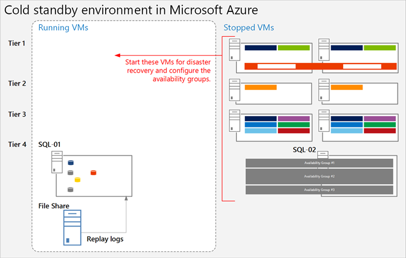
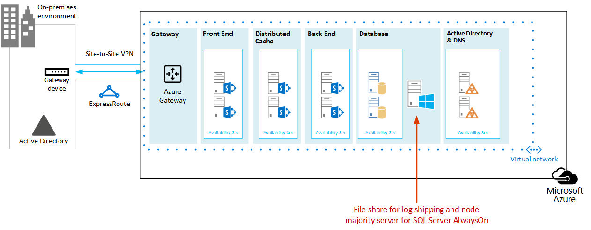

# <a name="sharepoint-server-2013-disaster-recovery-in-microsoft-azure"></a>Microsoft Azure에서 SharePoint Server 2013 재해 복구

 **요약:** Azure를 사용 하 여 온-프레미스 SharePoint 팜에 대 한 재해 복구 환경을 만들 수 있습니다. 이 문서에서는 이 솔루션을 디자인하고 구현하는 방법을 설명합니다.

 **SharePoint Server 2013 재해 복구 개요 비디오를 시청 하세요.**
> [!VIDEO https://www.microsoft.com/videoplayer/embed/1b73ec8f-29bd-44eb-aa3a-f7932784bfd9?autoplay=false]
  
 재해가 발생 하는 경우 SharePoint 온-프레미스 환경에서는 시스템을 빠르게 다시 실행 하는 것이 가장 좋습니다. Microsoft Azure에서 백업 환경이 이미 실행 되 고 있는 경우 SharePoint를 사용한 재해 복구를 통해 더 빠르고 쉽게 작업할 수 있습니다. 이 비디오에서는 SharePoint 웜 장애 조치 (failover) 환경의 주요 개념을 설명 하 고이 문서에서 사용할 수 있는 전체 세부 정보를 보완 합니다.
  
이 문서는 **Microsoft Azure의 SharePoint 재해 복구**와 같은 솔루션 모델과 함께 사용 합니다.
  
[](https://go.microsoft.com/fwlink/p/?LinkId=392555)
  
 [PDF](https://go.microsoft.com/fwlink/p/?LinkId=392555) |  [Visio](https://go.microsoft.com/fwlink/p/?LinkId=392554)
  
## <a name="use-azure-infrastructure-services-for-disaster-recovery"></a>재해 복구를 위해 Azure 인프라 서비스 사용

대부분의 조직에는 온-프레미스를 작성 하 고 유지 관리 하는 데 비용이 드는 SharePoint 용 재해 복구 환경이 없습니다. Azure 인프라 서비스는 온-프레미스 대체 보다 유연성이 크고 비용이 저렴 한 재해 복구 환경에 대 한 강력한 옵션을 제공 합니다.
  
Azure 인프라 서비스를 사용 하는 경우의 이점은 다음과 같습니다.
  
- **비용이 덜 드는 리소스** 온-프레미스 재해 복구 환경 보다 덜 리소스를 유지 관리 하 고 비용을 지불 합니다. 리소스 수는 콜드 대기, 웜 대기 또는 핫 대기 중에서 선택한 재해 복구 환경에 따라 달라 집니다.
    
- **리소스 유연성이 향상** 되었습니다. 재해가 발생 하면 복구 SharePoint 팜을 부하 요구 사항에 맞게 쉽게 확장할 수 있습니다. 리소스가 더 이상 필요 하지 않은 경우에 확장 됩니다.
    
- **낮은 데이터 센터 약정** 다른 지역의 보조 데이터 센터에 투자 하는 대신 Azure 인프라 서비스를 사용 합니다.
    
조직에 대 한 재해 복구 및 고급 옵션을 사용 하는 경우에는 보다 복잡 한 옵션을 사용 하는 것이 더 간단 합니다. 콜드, 웜 및 핫 대기 환경에 대 한 정의는 환경이 클라우드 플랫폼에서 호스팅되는 경우 약간 다릅니다. 다음 표에서는 Azure에서 SharePoint 복구 팜을 구축 하기 위한 환경에 대해 설명 합니다.
  
**표: 복구 환경**

|**복구 환경 유형**|**설명**|
|:-----|:-----|
|상태로  <br/> |전체 크기의 팜이 프로 비전 되 고, 업데이트 되며, 대기 모드에서 실행 됩니다.  <br/> |
|높음  <br/> |팜이 빌드되고 가상 컴퓨터를 실행 하 고 업데이트 하는 경우  <br/> 복구에는 콘텐츠 데이터베이스 연결, 서비스 응용 프로그램 프로 비전 및 콘텐츠 크롤링이 포함 됩니다.  <br/> 이 팜은 더 작은 버전의 프로덕션 팜 일 수 있으며 전체 사용자를 처리 하기 위해 수평 확장 됩니다.  <br/> |
|춥  <br/> |팜이 완전히 구축 되었지만 가상 컴퓨터는 중지 됩니다.  <br/> 환경 유지 관리에는 시간에 이르기까지 가상 컴퓨터를 시작 하 고, 패치, 업데이트 및 환경을 확인 하는 작업이 포함 됩니다.  <br/> 재해가 발생 한 경우 전체 환경을 시작 합니다.  <br/> |
   
조직의 복구 시간 목표 (RTOs) 및 Rpo (복구 지점 목표)를 평가 하는 것이 중요 합니다. 이러한 요구 사항에 따라 조직에 가장 적절 한 투자가 결정 됩니다.
  
이 문서의 지침에서는 웜 대기 환경을 구현 하는 방법에 대해 설명 합니다. 이러한 종류의 환경을 지원 하기 위해 추가 절차를 수행 해야 하지만이를 콜드 대기 환경에 적용할 수도 있습니다. 이 문서에서는 활성 대기 환경을 구현 하는 방법에 대해서는 설명 하지 않습니다.
  
재해 복구 솔루션에 대 한 자세한 내용은 [sharepoint 2013의 고가용성 및 재해 복구 개념](https://go.microsoft.com/fwlink/p/?LinkID=393114) 및 [sharepoint 2013에 대 한 재해 복구 전략 선택을](https://go.microsoft.com/fwlink/p/?linkid=203228)참조 하세요.
  
## <a name="solution-description"></a>솔루션 설명

웜 대기 재해 복구 솔루션에는 다음과 같은 환경이 필요 합니다.
  
- 온-프레미스 SharePoint 프로덕션 팜
    
- Azure의 복구 SharePoint 팜
    
- 두 환경 간의 사이트 간 VPN 연결
    
다음 그림에서는 이러한 세 가지 요소를 보여 줍니다.
  
**그림: Azure의 웜 대기 솔루션 요소**


  
DFSR (분산 파일 시스템 복제)을 사용한 SQL Server 로그 전달은 Azure의 복구 팜에 데이터베이스 백업 및 트랜잭션 로그를 복사 하는 데 사용 됩니다. 
  
- DFSR은 프로덕션 환경에서 복구 환경으로 로그를 전송 합니다. WAN 시나리오에서 DFSR은 Azure의 보조 서버로 직접 로그를 전달하는 것보다 더 효율적입니다.
    
- Azure의 복구 환경에서 SQL Server에 로그를 재생 합니다.
    
- 복구 연습이 수행 될 때까지 복구 환경에 로그 전달 SharePoint 콘텐츠 데이터베이스를 연결 하지 않습니다.
    
다음 단계를 수행 하 여 팜을 복구 합니다.
  
1. 로그 전달을 중지 합니다.
    
2. 기본 팜에 대 한 트래픽을 수락 하지 않습니다.
    
3. 최종 트랜잭션 로그를 재생 합니다.
    
4. 콘텐츠 데이터베이스를 팜에 연결 합니다.
    
5. 복제 된 서비스 데이터베이스에서 서비스 응용 프로그램을 복원 합니다.
    
6. 복구 팜을 가리키도록 DNS (Domain Name System) 레코드를 업데이트 합니다.
    
7. 전체 크롤링을 시작 합니다.
    
이러한 단계를 정기적으로 예행 연습 하 고 문서화 하 여 라이브 복구를 원활 하 게 실행 하는 것이 좋습니다. 콘텐츠 데이터베이스를 연결 하 고 서비스 응용 프로그램을 복원 하는 작업은 다소 시간이 걸릴 수 있으며, 일반적으로 몇 가지 수동 구성을 포함
  
복구를 수행한 후에이 솔루션은 다음 표에 나열 된 항목을 제공 합니다.
  
**표: 솔루션 복구 목표**

|**항목**|**설명**|
|:-----|:-----|
|사이트 및 콘텐츠  <br/> |사이트 및 콘텐츠는 복구 환경에서 사용할 수 있습니다.  <br/> |
|새 검색 인스턴스  <br/> |이 웜 대기 솔루션에서는 검색이 검색 데이터베이스에서 복원 되지 않습니다. 복구 팜의 검색 구성 요소는 프로덕션 팜과 마찬가지로 가능한 한 유사로 구성 됩니다. 사이트 및 콘텐츠를 복원한 후에는 전체 크롤링을 시작 하 여 검색 인덱스를 다시 작성 합니다. 사이트 및 콘텐츠를 사용할 수 있도록 크롤링이 완료 될 때까지 기다릴 필요가 없습니다.  <br/> |
|서비스  <br/> | 데이터베이스에 데이터를 저장 하는 서비스는 로그 전달 데이터베이스에서 복원 됩니다. 데이터베이스에 데이터를 저장 하지 않는 서비스도 시작 됩니다. <br/>  데이터베이스와 관련 된 모든 서비스를 복원 해야 하는 것은 아닙니다. 다음 서비스는 데이터베이스에서 복원할 필요가 없으며 장애 조치 (failover) 후에만 시작할 수 있습니다. <br/>  Usage and Health Data Collection <br/>  State Service <br/>  Word automation <br/>  데이터베이스를 사용 하지 않는 기타 모든 서비스 <br/> |
   
MCS (Microsoft 컨설팅 서비스) 또는 파트너와 함께 작업 하 여 보다 복잡 한 복구 목적을 처리할 수 있습니다. 다음 표에 요약 되어 있습니다.
  
**표: MCS 또는 파트너가 처리할 수 있는 기타 항목**

|**항목**|**설명**|
|:-----|:-----|
|사용자 지정 팜 솔루션 동기화  <br/> |가장 이상적인 방법은 복구 팜 구성이 프로덕션 팜과 동일 하 게 구성 하는 것입니다. 컨설턴트 또는 파트너와 협력 하 여 사용자 지정 팜 솔루션이 복제 되는지 여부와 두 환경을 동기화 된 상태로 유지 하는 프로세스의 상태를 평가할 수 있습니다.  <br/> |
|온-프레미스 데이터 원본에 대 한 연결  <br/> |BDC (백업 도메인 컨트롤러) 연결 및 검색 콘텐츠 원본과 같은 백 엔드 데이터 시스템에 대 한 연결을 복제 하는 것이 실용적이 지 않을 수 있습니다.  <br/> |
|검색 복원 시나리오  <br/> |엔터프라이즈 검색 배포는 비교적 고유 하 고 복잡 하기 때문에 데이터베이스 검색을 복원 하려면 더 많은 투자가 필요 합니다. 컨설턴트 또는 파트너와 협력 하 여 조직에서 필요할 수 있는 검색 복원 시나리오를 식별 하 고 구현할 수 있습니다.  <br/> |
   
이 문서에서 설명 하는 지침은 온-프레미스 팜이 이미 설계 및 배포 된 것으로 가정 합니다.
  
## <a name="detailed-architecture"></a>자세한 아키텍처

Azure의 복구 팜 구성은 다음을 비롯 하 여 온-프레미스의 프로덕션 팜과 동일 합니다.
  
- 동일한 서버 역할 표현
    
- 동일한 사용자 지정 구성
    
- 동일한 검색 구성 요소 구성
    
Azure의 환경은 더 작은 버전의 프로덕션 팜이 될 수 있습니다. 장애 조치 (failover) 후 복구 팜을 수평 확장할 계획인 경우 각 유형의 서버 역할을 초기에 표시 하는 것이 중요 합니다.
  
일부 구성은 장애 조치 (failover) 환경에서 복제 하는 것이 실용적이 지 않을 수 있습니다. 장애 조치 (failover) 팜이 예상 되는 서비스 수준을 제공 하는지 확인 하려면 장애 조치 (failover) 절차 및 환경을 테스트 해야 합니다.
  
이 솔루션은 SharePoint 팜에 대 한 특정 토폴로지를 규정 하지 않습니다. 이 솔루션의 초점은 장애 조치 팜에 Azure를 사용 하 고 두 환경 사이에 로그 전달 및 DFSR을 구현 하는 것입니다.
  
### <a name="warm-standby-environments"></a>웜 대기 환경

웜 대기 환경에서는 Azure 환경의 모든 가상 컴퓨터가 실행 되 고 있습니다. 환경이 장애 조치 (failover) 운동 또는 이벤트에 대 한 준비가 되었습니다.
  
다음 그림에서는 온-프레미스 SharePoint 팜에서 웜 대기 환경으로 구성 된 Azure 기반 SharePoint 팜에 대 한 재해 복구 솔루션을 보여 줍니다.
  
**그림: 프로덕션 팜과 웜 대기 복구 팜의 토폴로지 및 핵심 요소**


  
다음은 이 다이어그램에 대한 설명입니다.
  
- 온-프레미스 SharePoint 팜과 Azure의 웜 대기 팜과 같은 두 가지 환경이 나란히 표시 됩니다.
    
- 각 환경에는 파일 공유가 있습니다.
    
- 각 팜에는 네 개의 계층이 포함 됩니다. 고가용성을 달성 하려면 각 계층에 프런트 엔드 서비스, 분산 캐시, 백 엔드 서비스 및 데이터베이스와 같은 특정 역할에 대해 동일 하 게 구성 된 두 대의 서버 또는 가상 컴퓨터가 포함 되어 있습니다. 이 그림에서는 특정 구성 요소를 호출 하는 것은 중요 하지 않습니다. 두 팜이 동일 하 게 구성 됩니다.
    
- 네 번째 계층은 데이터베이스 계층입니다. 로그 전달은 온-프레미스 환경의 보조 데이터베이스 서버에서 동일한 환경의 파일 공유로 로그를 복사 하는 데 사용 됩니다.
    
- DFSR은 온-프레미스 환경의 파일 공유에서 Azure 환경의 파일 공유로 파일을 복사합니다.
    
- 로그 전달은 Azure 환경의 파일 공유에서 복구 환경의 SQL Server AlwaysOn 가용성 그룹에 있는 기본 복제본으로 로그를 재생합니다.
    
### <a name="cold-standby-environments"></a>콜드 대기 환경

콜드 대기 환경에서는 대부분의 SharePoint 팜 가상 컴퓨터를 종료할 수 있습니다. 각 가상 컴퓨터를 도메인과 동기화 할 수 있도록 2 주 또는 한 달 마다 가상 컴퓨터를 시작 하는 것이 좋습니다. 로그 전달 및 DFSR의 지속적인 작업을 보장 하려면 Azure 복구 환경의 다음 가상 컴퓨터를 계속 실행 해야 합니다.
  
- 파일 공유
    
- 기본 데이터베이스 서버
    
- Windows Server Active Directory 도메인 서비스 및 DNS를 실행 하는 하나 이상의 가상 컴퓨터
    
다음 그림에서는 파일 공유 가상 컴퓨터와 주 SharePoint 데이터베이스 가상 컴퓨터를 실행 하는 Azure 장애 조치 (failover) 환경을 보여 줍니다. 다른 모든 SharePoint 가상 컴퓨터는 중지 됩니다. Windows Server Active Directory 및 DNS를 실행 하는 가상 컴퓨터는 표시 되지 않습니다.
  
**그림: 실행 중인 가상 컴퓨터를 사용 하는 콜드 대기 복구 팜**


  
콜드 대기 환경으로 장애 조치 (failover) 후에는 모든 가상 컴퓨터가 시작 되 고 데이터베이스 서버의 고가용성을 달성 하는 방법을 SQL Server AlwaysOn 가용성 그룹과 같은 방식으로 구성 해야 합니다.
  
여러 저장소 그룹이 구현 된 경우 (데이터베이스가 둘 이상의 SQL Server 고가용성 집합에 분산 된 경우) 각 저장소 그룹에 대 한 기본 데이터베이스를 실행 하 여 해당 저장소 그룹과 연결 된 로그를 수락 해야 합니다.
  
### <a name="skills-and-experience"></a>기술 및 경험

이 재해 복구 솔루션에는 여러 기술이 사용 됩니다. 이러한 기술이 예상 대로 상호 작용 하도록 하기 위해 온-프레미스 및 Azure 환경의 각 구성 요소를 올바르게 설치 하 고 구성 해야 합니다. 이 솔루션을 설정 하는 사람이 나 팀에는 다음 문서에서 설명 하는 기술에 대 한 강력한 실무 지식 및 실지 훈련 기술이 제공 되는 것이 좋습니다.
  
- [DFS (분산 파일 시스템) 복제 서비스](https://go.microsoft.com/fwlink/p/?LinkId=392698)
    
- [SQL Server를 사용한 WSFC (Windows Server 장애 조치 (Failover) 클러스터링)](https://go.microsoft.com/fwlink/p/?LinkId=392701)
    
- [AlwaysOn 가용성 그룹(SQL Server)](https://go.microsoft.com/fwlink/p/?LinkId=392725)
    
- [SQL Server 데이터베이스 백업 및 복원](https://go.microsoft.com/fwlink/p/?LinkId=392728)
    
- [SharePoint Server 2013 설치 및 팜 배포](https://go.microsoft.com/fwlink/p/?LinkId=393119)
    
- [Microsoft Azure](https://go.microsoft.com/fwlink/p/?LinkId=392729)
    
마지막으로 이러한 기술과 관련 된 작업을 자동화 하는 데 사용할 수 있는 기술을 스크립팅 하는 것이 좋습니다. 사용 가능한 사용자 인터페이스를 사용 하 여이 솔루션에 설명 된 모든 작업을 완료할 수 있습니다. 그러나 수동 방법은 시간이 오래 걸리고 오류가 발생할 수 있으며 일관성 없는 결과를 제공 합니다.
  
Windows PowerShell 외에 SQL Server, SharePoint Server 및 Azure 용 Windows PowerShell 라이브러리도 있습니다. T-sql을 잊고 재해 복구 환경을 구성 및 유지 관리 하는 시간을 줄이는 데도 도움이 될 수 있습니다.
  
## <a name="disaster-recovery-roadmap"></a>재해 복구 로드맵


  
이 로드맵에서는 프로덕션 환경에 SharePoint Server 2013 팜이 이미 배포 된 것으로 가정 합니다.
  
**표: 재해 복구 로드맵**

|**작업 단계**|**설명**|
|:-----|:-----|
|1 단계  <br/> |재해 복구 환경을 디자인 합니다.  <br/> |
|2 단계  <br/> |Azure virtual network 및 VPN 연결을 만듭니다.  <br/> |
|3 단계  <br/> |Azure virtual network에 Windows Active Directory 및 도메인 이름 서비스를 배포 합니다.  <br/> |
|4 단계  <br/> |Azure에 SharePoint 복구 팜을 배포 합니다.  <br/> |
|단계 5  <br/> |팜 간에 DFSR을 설정 합니다.  <br/> |
|6 단계  <br/> |복구 팜으로의 로그 전달을 설정 합니다.  <br/> |
|단계 7  <br/> | 장애 조치 (failover) 및 복구 솔루션의 유효성을 검사 합니다. 여기에는 다음과 같은 절차 및 기술이 포함 됩니다. <br/>  로그 전달을 중지 합니다. <br/>  백업을 복원 합니다. <br/>  콘텐츠 크롤링 <br/>  서비스 복구 <br/>  DNS 레코드를 관리 합니다. <br/> |
   
## <a name="phase-1-design-the-disaster-recovery-environment"></a>1 단계: 재해 복구 환경 디자인

Sharepoint [용 Microsoft Azure 아키텍처 2013](microsoft-azure-architectures-for-sharepoint-2013.md) 의 지침을 사용 하 여 sharepoint 복구 팜을 비롯 한 재해 복구 환경을 디자인 합니다. Azure Visio 파일 [의 SharePoint 재해 복구 솔루션](https://go.microsoft.com/fwlink/p/?LinkId=392554) 에 있는 그래픽을 사용 하 여 디자인 프로세스를 시작할 수 있습니다. Azure 환경에서 작업을 시작 하기 전에 전체 환경을 디자인 하는 것이 좋습니다.
  
가상 네트워크, VPN 연결, Active Directory 및 SharePoint 팜을 디자인 하기 위해 [Microsoft Azure 아키텍처 For SharePoint 2013](microsoft-azure-architectures-for-sharepoint-2013.md) 에서 제공 하는 지침 외에도 Azure 환경에 파일 공유 역할을 추가 해야 합니다.
  
재해 복구 솔루션에서 로그 전달을 지원 하기 위해 데이터베이스 역할이 있는 서브넷에 파일 공유 가상 컴퓨터를 추가 합니다. 또한이 파일 공유는 SQL Server AlwaysOn 가용성 그룹에 대 한 노드 과반수의 세 번째 노드로 사용 됩니다. 이 구성은 SQL Server AlwaysOn 가용성 그룹을 사용 하는 표준 SharePoint 팜에 권장 되는 구성입니다. 
  
> [!NOTE]
> SQL Server AlwaysOn 가용성 그룹에 참여 하려면 데이터베이스에 대 한 필수 구성 요소를 검토 하는 것이 중요 합니다. 자세한 내용은 [AlwaysOn 가용성 그룹에 대 한 필수 구성 요소, 제한 사항 및 권장 사항을](https://go.microsoft.com/fwlink/p/?LinkId=510870)참조 하세요. 
  
**그림: 재해 복구 솔루션에 사용 되는 파일 서버 배치**


  
이 다이어그램에서는 데이터베이스 서버 역할을 포함 하는 파일 공유 가상 컴퓨터를 Azure의 동일한 서브넷에 추가 합니다. SQL Server 역할과 같은 다른 서버 역할을 포함 하는 가용성 집합에 파일 공유 가상 컴퓨터를 추가 하지 마십시오.
  
로그의 고가용성을 고려해 야 하는 경우 [SQL Server 백업 및 Azure Blob Storage Service를 사용한 복원을](https://go.microsoft.com/fwlink/p/?LinkId=393113)사용 하 여 다른 방법을 수행 하는 것이 좋습니다. 이 기능은 로그를 blob 저장소 URL에 직접 저장 하는 Azure의 새로운 기능입니다. 이 솔루션에는이 기능 사용에 대 한 지침이 포함 되어 있지 않습니다.
  
복구 팜을 디자인할 때는 성공적인 재해 복구 환경에 복구 하려는 프로덕션 팜이 정확히 반영 된다는 점을 염두에 두어야 합니다. 복구 팜의 크기는 복구 팜의 디자인, 배포 및 테스트에서 가장 중요 한 사항은 아닙니다. 팜 확장은 비즈니스 요구 사항에 따라 조직 마다 다릅니다. 축소 된 팜을 사용 하 여 잠시 중단 하거나 성능 및 용량 요구에 따라 팜 규모를 조정 해야 할 수 있습니다.
  
프로덕션 팜과 가능한 동일 하 게 복구 팜을 구성 하 여 SLA (서비스 수준 계약) 요구 사항을 충족 하 고 비즈니스를 지 원하는 데 필요한 기능을 제공 합니다. 재해 복구 환경을 디자인할 때 프로덕션 환경에 대 한 변경 관리 프로세스도 확인 합니다. 프로덕션 환경과 같은 간격으로 복구 환경을 업데이트 하 여 변경 관리 프로세스를 복구 환경으로 확장 하는 것이 좋습니다. 변경 관리 프로세스의 일환으로, 팜 구성, 응용 프로그램 및 사용자에 대 한 자세한 인벤토리를 유지 관리 하는 것이 좋습니다. 
  
## <a name="phase-2-create-the-azure-virtual-network-and-vpn-connection"></a>2 단계: Azure virtual network 및 VPN 연결 만들기

[온-프레미스 네트워크를 Microsoft Azure virtual network에 연결](connect-an-on-premises-network-to-a-microsoft-azure-virtual-network.md) azure에서 가상 네트워크를 계획 하 고 배포 하는 방법과 VPN 연결을 만드는 방법을 보여 줍니다. 다음 절차를 완료 하려면 항목의 지침을 따르세요.
  
- 가상 네트워크의 개인 IP 주소 공간을 계획 합니다.
    
- 가상 네트워크에 대 한 라우팅 인프라 변경 사항을 계획 합니다.
    
- 온-프레미스 VPN 장치에서 보내고 받는 트래픽에 대 한 방화벽 규칙을 계획 합니다.
    
- Azure에 프레미스 간 가상 네트워크를 만듭니다.
    
- 온-프레미스 네트워크와 가상 네트워크 간의 라우팅을 구성 합니다.
    
## <a name="phase-3-deploy-active-directory-and-domain-name-services-to-the-azure-virtual-network"></a>3 단계: Azure virtual network에 Active Directory 및 도메인 이름 서비스 배포

이 단계에는 다음 그림에 나와 있는 것 처럼 [SharePoint 용 Microsoft Azure 아키텍처 2013](microsoft-azure-architectures-for-sharepoint-2013.md) 에 설명 된 대로 하이브리드 시나리오에서 Windows Server Active DIRECTORY 및 DNS를 가상 네트워크에 배포 하는 작업이 포함 됩니다.
  
**그림: 하이브리드 Active Directory 도메인 구성**


  
그림에서는 두 개의 가상 컴퓨터가 같은 서브넷에 배포 됩니다. 이러한 가상 컴퓨터는 각각 Active Directory와 DNS 라는 두 개의 역할을 호스팅합니다.
  
Azure에서 Active Directory를 배포 하기 전에 [Azure 가상 컴퓨터에 Windows Server Active directory를 배포 하기 위한 지침](https://go.microsoft.com/fwlink/p/?linkid=392681)을 읽어보십시오. 이러한 지침은 솔루션에 다른 아키텍처 또는 다른 구성 설정이 필요한 지를 결정 하는 데 도움이 됩니다.
  
Azure에서 도메인 컨트롤러를 설정 하는 방법에 대 한 자세한 내용은 [Azure 가상 네트워크에서 복제본 Active Directory 도메인 컨트롤러 설치](https://go.microsoft.com/fwlink/p/?LinkId=392687)를 참조 하세요.
  
이 단계를 수행 하기 전에 가상 컴퓨터를 가상 네트워크에 배포 하지 않았습니다. Active Directory 및 DNS를 호스트 하는 가상 컴퓨터는 솔루션에 필요한 가장 큰 가상 컴퓨터 일 수 없습니다. 이러한 가상 컴퓨터를 배포 하기 전에 먼저 가상 네트워크에서 사용할 가장 큰 가상 컴퓨터를 만듭니다. 이렇게 하면 솔루션을 Azure에서 필요한 최대 크기를 허용 하는 태그에 추가할 수 있습니다. 지금은이 가상 컴퓨터를 구성할 필요가 없습니다. 간단 하 게 만들고 따로 설정 하기만 하면 됩니다. 이렇게 하지 않으면 나중에이 문서가 작성 된 시점에 문제가 되었던 더 큰 가상 컴퓨터를 만들려고 할 때 제한이 있을 수 있습니다. 
  
## <a name="phase-4-deploy-the-sharepoint-recovery-farm-in-azure"></a>4 단계: Azure에서 SharePoint 복구 팜 배포

디자인 계획에 따라 가상 네트워크에 SharePoint 팜을 배포 합니다. Azure에서 SharePoint 역할을 배포 하기 전에 [Azure 인프라 서비스에서 sharepoint 2013에 대 한 계획](https://go.microsoft.com/fwlink/p/?LinkId=400984) 을 검토 하는 것이 유용할 수 있습니다.
  
개념 증명 환경을 구축 하 여 배운 다음 사례를 고려 하십시오.
  
- Azure portal 또는 PowerShell을 사용 하 여 가상 컴퓨터를 만듭니다.
    
- Azure 및 Hyper-v에서는 동적 메모리를 지원 하지 않습니다. 이 작업은 성능 및 용량 계획에 따라 결정 해야 합니다.
    
- 가상 컴퓨터 로그온 자체가 아닌 Azure 인터페이스를 통해 가상 컴퓨터를 다시 시작 합니다. Azure 인터페이스를 사용 하는 것이 보다 효율적이 고 예측 가능 합니다.
    
- 비용을 절감 하기 위해 가상 컴퓨터를 종료 하려면 Azure 인터페이스를 사용 합니다. 가상 컴퓨터 로그온에서 종료 하는 경우 요금이 계속 계산 됩니다.
    
- 가상 컴퓨터에 대 한 명명 규칙을 사용 합니다.
    
- 가상 컴퓨터를 배포 하는 데이터 센터 위치를 주의 깊게 살펴보십시오.
    
- Azure의 자동 크기 조정 기능은 SharePoint 역할에 대해 지원 되지 않습니다.
    
- 복원 될 팜의 항목 (예: 사이트 모음)은 구성 하지 마십시오. 
    
## <a name="phase-5-set-up-dfsr-between-the-farms"></a>단계 5: 팜 간에 DFSR 설정

DFSR을 사용 하 여 파일 복제를 설정 하려면 DNS 관리 스냅인을 사용 합니다. 그러나 DFSR 설치 전에 온-프레미스 파일 서버 및 Azure 파일 서버에 로그온 하 고 Windows에서 서비스를 사용 하도록 설정 합니다.
  
서버 관리자 대시보드에서 다음 단계를 완료 합니다.
  
- 로컬 서버를 구성 합니다.
    
- **역할 및 기능 추가 마법사**를 시작 합니다.
    
- **파일 및 저장소 서비스** 노드를 엽니다.
    
- **Dfs 네임 스페이스** 및 **dfs 복제**를 선택 합니다.
    
- **다음** 을 클릭 하 여 마법사 단계를 완료 합니다.
    
다음 표에서는 DFSR 참조 문서 및 블로그 게시물에 대 한 링크를 제공 합니다.
  
**표: DFSR에 대 한 참조 문서**

|**제목**|**설명**|
|:-----|:-----|
|[복제](https://go.microsoft.com/fwlink/p/?LinkId=392732) <br/> |복제 링크가 포함 된 DFS 관리 TechNet 항목  <br/> |
|[DFS 복제: 생존 가이드](https://go.microsoft.com/fwlink/p/?LinkId=392737) <br/> |DFS 정보에 대 한 링크를 포함 하는 위 키  <br/> |
|[DFS 복제: 질문과 대답](https://go.microsoft.com/fwlink/p/?LinkId=392738) <br/> |DFS 복제 TechNet 항목  <br/> |
|[Jose 바 Reto 씨의 블로그](https://go.microsoft.com/fwlink/p/?LinkId=392739) <br/> |Microsoft의 파일 서버 팀에서 주 프로그램 관리자로 작성 한 블로그  <br/> |
|[Microsoft 파일 캐비닛 블로그의 저장소 팀](https://go.microsoft.com/fwlink/p/?LinkId=392740) <br/> |Windows Server의 파일 서비스 및 저장소 기능에 대 한 블로그  <br/> |
   
## <a name="phase-6-set-up-log-shipping-to-the-recovery-farm"></a>6 단계: 복구 팜으로의 로그 전달 설정

이 환경에서 재해 복구를 설정 하는 데 필요한 중요 한 구성 요소는 로그 전달입니다. 로그 전달을 사용 하 여 기본 데이터베이스 서버 인스턴스의 데이터베이스에 대 한 트랜잭션 로그 파일을 보조 데이터베이스 서버 인스턴스로 자동으로 보낼 수 있습니다. 로그 전달을 설정 하려면 [Configure log 전달 In SharePoint 2013](https://docs.microsoft.com/sharepoint/administration/configure-log-shipping)을 참조 하세요. 
  
> [!IMPORTANT]
> SharePoint Server의 로그 전달 지원은 특정 데이터베이스에만 사용할 수 있습니다. 자세한 내용은 [sharepoint 데이터베이스에 대해 지원 되는 고가용성 및 재해 복구 옵션 (sharepoint 2013)](https://go.microsoft.com/fwlink/p/?LinkId=393121)을 참조 하세요. 
  
## <a name="phase-7-validate-failover-and-recovery"></a>단계 7: 장애 조치 (failover) 및 복구 확인

이 마지막 단계의 목표는 재해 복구 솔루션이 계획 한 대로 작동 하는지 확인 하는 것입니다. 이 작업을 수행 하려면 프로덕션 팜을 종료 하 고 복구 팜을 대체로 시작 하는 장애 조치 (failover) 이벤트를 만듭니다. 수동으로 또는 스크립트를 사용 하 여 장애 조치 (failover) 시나리오를 시작할 수 있습니다.
  
첫 번째 단계는 팜 서비스 또는 콘텐츠에 대 한 들어오는 사용자 요청을 중지 하는 것입니다. DNS 항목을 사용 하지 않도록 설정 하거나 프런트 엔드 웹 서버를 종료 하 여이 작업을 수행할 수 있습니다. 팜이 "다운" 된 후에는 복구 팜으로 장애 조치 (failover) 할 수 있습니다.
  
### <a name="stop-log-shipping"></a>로그 전달 중지

팜 복구를 수행 하기 전에 로그 전달을 중지 해야 합니다. 먼저 Azure에서 보조 서버의 로그 전달을 중지 한 다음 기본 서버에서 온-프레미스로 중지 합니다. 먼저 보조 서버에서 로그 전달을 중지 하려면 다음 스크립트를 사용 하 여 기본 서버를 클릭 합니다. 스크립트에 있는 데이터베이스 이름은 환경에 따라 다를 수 있습니다.
  
```
-- This script removes log shipping from the server.
-- Commands must be executed on the secondary server first and then on the primary server.

SET NOCOUNT ON
DECLARE  @PriDB nvarchar(max)
,@SecDB nvarchar(250)
,@PriSrv nvarchar(250)
,@SecSrv nvarchar(250)

Set @PriDB= ''
SET @PriDB = UPPER(@PriDB)
SET @PriDB = REPLACE(@PriDB, ' ', '')
SET @PriDB = '''' + REPLACE(@PriDB, ',', ''', ''') + ''''

Set @SecDB = @PriDB

Exec ( 'Select  ''exec master..sp_delete_log_shipping_secondary_database '' + '''''''' + prm.primary_database +  ''''''''   
from msdb.dbo.log_shipping_monitor_primary prm INNER JOIN msdb.dbo.log_shipping_primary_secondaries sec  ON  prm.primary_database=sec.secondary_database
where prm.primary_database in ( ' + @PriDB + ' )')

Exec ( 'Select  ''exec master..sp_delete_log_shipping_primary_secondary '' + '''''''' + prm.Primary_Database + '''''', '''''' + sec.Secondary_Server + '''''', '''''' + sec.Secondary_database + ''''''''   
from msdb.dbo.log_shipping_monitor_primary prm INNER JOIN msdb.dbo.log_shipping_primary_secondaries sec  ON  prm.primary_database=sec.secondary_database
where prm.primary_database in ( ' + @PriDB + ' )')

Exec ( 'Select  ''exec master..sp_delete_log_shipping_primary_database '' + '''''''' + prm.primary_database +  ''''''''   
from msdb.dbo.log_shipping_monitor_primary prm INNER JOIN msdb.dbo.log_shipping_primary_secondaries sec  ON  prm.primary_database=sec.secondary_database
where prm.primary_database in ( ' + @PriDB + ' )')

Exec ( 'Select  ''exec master..sp_delete_log_shipping_secondary_primary '' + '''''''' + prm.primary_server + '''''', '''''' + prm.primary_database +  ''''''''   
from msdb.dbo.log_shipping_monitor_primary prm INNER JOIN msdb.dbo.log_shipping_primary_secondaries sec  ON  prm.primary_database=sec.secondary_database
where prm.primary_database in ( ' + @PriDB + ' )')

```

### <a name="restore-the-backups"></a>백업 복원

백업을 만든 순서 대로 복원 해야 합니다. 특정 트랜잭션 로그 백업을 복원 하려면 먼저 커밋되지 않은 트랜잭션을 롤백하지 않고 다음 이전 백업을 복원 (즉, 사용 `WITH NORECOVERY`) 해야 합니다.
  
- 전체 데이터베이스 백업 및 마지막 차등 백업-해당 백업 (있는 경우)을 특정 트랜잭션 로그 백업 이전에 복원 합니다. 가장 최근의 전체 또는 차등 데이터베이스 백업을 만들기 전에 데이터베이스에서 전체 복구 모델 또는 대량 로그 복구 모델을 사용 하 고 있었습니다.
    
- 모든 트랜잭션 로그 백업-전체 데이터베이스 백업 또는 차등 백업 후, 즉 복원 하는 경우 특정 트랜잭션 로그 백업 이전에 수행한 모든 트랜잭션 로그 백업을 복원 합니다. 로그 백업은 만들어진 순서 대로 적용 되며 로그 체인에는 어떠한 간격도 포함 되지 않습니다.
    
보조 서버의 콘텐츠 데이터베이스를 복구 하 여 사이트를 렌더링 하려면 복구 전에 모든 데이터베이스 연결을 제거 합니다. 데이터베이스를 복원 하려면 다음 SQL 문을 실행 합니다.
  
```
restore database WSS_Content with recovery

```

> [!IMPORTANT]
> T-sql을 명시적으로 사용 하는 경우에는 스크립트를 작성할 때 모든 RESTORE 문에서 **WITH NORECOVERY** 또는 **RECOVERY** 를 사용 하 여 모호성을 제거 해야 합니다. 전체 및 차등 백업이 복원 되 면 SQL Server Management Studio에서 트랜잭션 로그를 복원할 수 있습니다. 또한 로그 전달이 이미 중지 되었기 때문에 콘텐츠 데이터베이스가 대기 중 상태 이므로 상태를 모든 권한으로 변경 해야 합니다.
  
SQL Server Management Studio에서 **WSS_Content** 데이터베이스를 마우스 오른쪽 단추로 클릭 하 고 **작업** > **복원을**가리킨 다음 **트랜잭션 로그** (전체 백업을 복원 하지 않은 경우에는이 기능을 사용할 수 없음)를 클릭 합니다. 자세한 내용은[Restore a Transaction Log Backup (SQL Server)](https://go.microsoft.com/fwlink/p/?LinkId=392778)을 참조 하십시오.
  
### <a name="crawl-the-content-source"></a>콘텐츠 원본 크롤링

검색 서비스를 복원 하려면 각 콘텐츠 원본에 대해 전체 크롤링을 시작 해야 합니다. 검색 권장 사항과 같은 온-프레미스 팜의 일부 분석 정보가 손실 됩니다. 전체 크롤링을 시작 하기 전에 Windows PowerShell cmdlet **get-spenterprisesearchserviceapplication** 를 사용 하 여 로그 전달 및 복제 된 검색 관리 데이터베이스 **Search_Service__DB_<GUID>** 지정 합니다. 이 cmdlet은 검색 구성, 스키마, 관리 속성, 규칙 및 원본을 제공 하 고 다른 구성 요소의 기본 집합을 만듭니다.
  
전체 크롤링을 시작 하려면 다음 단계를 완료 합니다.
  
1. SharePoint 2013 중앙 관리에서 **응용 프로그램 관리** > **서비스 응용 프로그램** > **서비스 응용 프로그램 관리**로 이동 하 여 크롤링할 Search Service 응용 프로그램을 클릭 합니다.
    
2. **검색 관리** 페이지에서 **콘텐츠 원본을**클릭 하 고 원하는 콘텐츠 원본을 가리킨 다음 화살표를 클릭 하 고 **전체 크롤링 시작**을 클릭 합니다.
    
### <a name="recover-farm-services"></a>팜 서비스 복구

다음 표에는 로그 전달 데이터베이스를 사용 하는 서비스를 복구 하는 방법, 데이터베이스를 포함 하는 서비스는 물론 로그 전달과 함께 복원 하는 것이 권장 되지 않는 서비스가 나와 있으며 데이터베이스는 없는 서비스를 제공 합니다.
  
> [!IMPORTANT]
> 온-프레미스 SharePoint 데이터베이스를 Azure 환경으로 복원 하면 수동으로 Azure에 설치 하지 않은 SharePoint 서비스가 복구 되지 않습니다. 
  
**표: 서비스 응용 프로그램 데이터베이스 참조**

|**로그 전달 데이터베이스에서 이러한 서비스 복원**|**이러한 서비스는 데이터베이스를 포함 하지만 데이터베이스를 복원 하지 않고 이러한 서비스를 시작 하는 것이 좋습니다.**|**이러한 서비스는 데이터를 데이터베이스에 저장 하지 않습니다. 장애 조치 (failover) 후 이러한 서비스 시작**|
|:-----|:-----|:-----|
| 기계 번역 서비스 <br/>  Managed Metadata Service <br/>  Secure Store Service <br/>  사용자 프로필입니다. 프로필 및 공유 태그 데이터베이스만 지원 됩니다. 동기화 데이터베이스는 지원 되지 않습니다.) <br/>  Microsoft SharePoint Foundation 가입 설정 서비스 <br/> | Usage and Health Data Collection <br/>  State Service <br/>  Word automation <br/> | Excel Services <br/>  PerformancePoint Services <br/>  PowerPoint Conversion <br/>  Visio Graphics Service <br/>  작업 관리 <br/> |
   
다음 예제에서는 데이터베이스에서 Managed Metadata service를 복원 하는 방법을 보여 줍니다.
  
기존 Managed_Metadata_DB 데이터베이스를 사용 합니다. 이 데이터베이스는 로그를 전달 하지만 보조 팜에 활성 서비스 응용 프로그램이 없으므로 서비스 응용 프로그램이 준비 된 후에 연결 해야 합니다.
  
먼저을 사용 `New-SPMetadataServiceApplication`하 고 복원 된 `DatabaseName` 데이터베이스의 이름과 함께 스위치를 지정 합니다.
  
다음으로 다음과 같이 보조 서버에서 새 Managed Metadata Service 응용 프로그램을 구성 합니다.
  
- 이름: Managed Metadata Service
    
- 데이터베이스 서버: 배달 된 트랜잭션 로그의 데이터베이스 이름입니다.
    
- 데이터베이스 이름: Managed_Metadata_DB
    
- 응용 프로그램 풀: SharePoint 서비스 응용 프로그램 
    
### <a name="manage-dns-records"></a>DNS 레코드 관리

SharePoint 팜을 가리키도록 DNS 레코드를 수동으로 만들어야 합니다.
  
프런트 엔드 웹 서버가 여러 개인 경우에는 Windows Server 2012 또는 하드웨어 부하 분산 기능을 활용 하 여 팜의 웹 프런트 엔드 서버 간에 요청을 분산 하는 것이 적절 합니다. 또한 네트워크 부하 분산은 웹 프런트 엔드 서버 중 하나에 오류가 발생 하는 경우 다른 서버로 요청을 분산 하 여 위험을 줄이는 데 도움을 줄 수 있습니다. 
  
일반적으로 네트워크 부하 분산을 설정 하면 클러스터에 단일 IP 주소가 할당 됩니다. 그런 다음 DNS 공급자에서 클러스터를 가리키는 네트워크에 대 한 DNS 호스트 레코드를 만듭니다. (이 프로젝트에서는 온-프레미스 데이터 센터 오류가 발생 하는 경우 복구를 위해 Azure에 DNS 서버를 배치 합니다.) 예를 들어 Active Directory `https://sharepoint.contoso.com`의 dns 관리자에서 부하 분산 된 클러스터의 IP 주소를 가리키는 dns 레코드를 만들 수 있습니다.
  
SharePoint 팜에 대 한 외부 액세스의 경우 인트라넷에서 클라이언트에서 사용 하는 URL (예: `https://sharepoint.contoso.com`)이 방화벽의 외부 IP 주소를 가리키는 외부 DNS 서버에 호스트 레코드를 만들 수 있습니다. (이 예에서는 내부 DNS 서버가 외부 DNS 서버에 DNS 요청을 라우팅하는 것이 아니라 분할 DNS를 사용 하도록 `contoso.com` 설정 하 고, 요청을 SharePoint 팜 클러스터에 직접 라우트 하 여) 그런 다음 클라이언트가 찾고 있는 리소스를 찾을 수 있도록 외부 IP 주소를 온-프레미스 클러스터의 내부 IP 주소에 매핑합니다.
  
여기서는 다음과 같은 몇 가지 재해 복구 시나리오를 실행할 수 있습니다.
  
 **예제 시나리오: 온-프레미스 SharePoint 팜의 하드웨어 오류로 인해 온-프레미스 SharePoint 팜을 사용할 수 없습니다.** 이 경우 Azure SharePoint 팜에 대 한 장애 조치 (failover)를 위한 단계를 완료 한 후에는 온-프레미스 팜과 동일한 방식으로 복구 SharePoint 팜의 웹 프런트 엔드 서버에서 네트워크 부하 분산을 구성할 수 있습니다. 그런 다음 내부 DNS 공급자의 호스트 레코드를 리디렉션하여 복구 팜의 클러스터 IP 주소를 가리킬 수 있습니다. 클라이언트에서 캐시 된 DNS 레코드를 새로 고치고 복구 팜을 가리키도록 하기 위해 약간의 시간이 걸릴 수 있습니다.
  
 **예제 시나리오: 온-프레미스 데이터 센터가 완전히 손실 됩니다.** 이 시나리오는 화재 또는 홍수와 같은 자연 재해로 인해 발생할 수 있습니다. 이 경우 엔터프라이즈의 경우 다른 지역에 호스트 되는 보조 데이터 센터가 있고 자체 디렉터리 서비스와 DNS가 있는 Azure 서브넷도 있을 수 있습니다. 이전 재해 시나리오에서와 마찬가지로 내부 및 외부 DNS 레코드가 Azure SharePoint 팜을 가리키도록 리디렉션할 수 있습니다. 다시 말하지만 DNS 레코드가 전파 되는 데 약간의 시간이 걸릴 수 있습니다.
  
호스트 이름으로 된 사이트 모음을 사용 하는 경우 (예: `https://sales.contoso.com` `https://marketing.contoso.com` [host name site Collection architecture and deployment (sharepoint 2013))](https://docs.microsoft.com/SharePoint/administration/host-named-site-collection-architecture-and-deployment)sharepoint 팜의 동일한 웹 응용 프로그램에서 호스트 되는 여러 사이트 모음을 사용할 수 있는 경우, 즉 고유한 DNS 이름을 사용 하는 것이 좋습니다. 이 경우 클러스터 IP 주소를 가리키는 각 사이트 모음에 대 한 DNS 레코드를 만들 수 있습니다. 요청이 SharePoint 웹 프런트 엔드 서버에 도달 하면 해당 사이트 모음에 대 한 각 요청의 라우팅을 처리 합니다.
  
## <a name="microsoft-proof-of-concept-environment"></a>Microsoft 개념 증명 환경

이 솔루션에 대 한 개념 증명 환경을 디자인 하 고 테스트 했습니다. 테스트 환경의 디자인 목표는 고객 환경에서 찾을 수 있는 SharePoint 팜을 배포 및 복구 하는 것 이었습니다. 몇 가지 가정이 구성 되었지만 팜에서는 사용자 지정 내용을 제외한 모든 기본 기능을 제공 해야 합니다. 토폴로지는 필드 및 제품 그룹의 모범 사례 지침을 사용 하 여 고가용성을 위해 디자인 되었습니다.
  
다음 표에서는 온-프레미스 테스트 환경에 대해 만들고 구성한 Hyper-v 가상 컴퓨터에 대해 설명 합니다.
  
**표: 온-프레미스 테스트를 위한 가상 컴퓨터**

|**서버 이름**|**역할**|**구성**|
|:-----|:-----|:-----|
|DC1  <br/> |Active Directory가 있는 도메인 컨트롤러  <br/> |2 개의 프로세서  <br/> 512 MB ~ 4gb RAM  <br/> 1 x 127-GB 하드 디스크  <br/> |
|RRAS  <br/> |라우팅 및 RRAS (원격 액세스 서비스) 역할을 사용 하 여 구성 된 서버  <br/> |2 개의 프로세서  <br/> 2-8 GB의 RAM  <br/> 1 x 127-GB 하드 디스크  <br/> |
|FS1  <br/> |백업용 공유 및 DFSR에 대 한 끝점을 포함 하는 파일 서버.  <br/> |프로세서 4 개  <br/> 2-12 GB의 RAM  <br/> 1 x 127-GB 하드 디스크  <br/> 1 x 1TB 하드 디스크 (SAN)  <br/> 1 x 750-GB 하드 디스크  <br/> |
|SP-WFE1, SP-WFE2  <br/> |프런트 엔드 웹 서버  <br/> |프로세서 4 개  <br/> 16GB RAM  <br/> |
|S P-APP1, SP-APP2, SP-APP3  <br/> |응용 프로그램 서버  <br/> |프로세서 4 개  <br/> 2-16 GB의 RAM  <br/> |
|SP-SQL-HA1, SP-SQL-HA2  <br/> |데이터베이스 서버 (SQL Server 2012 AlwaysOn 가용성 그룹으로 구성 됨)에서 고가용성을 제공 합니다. 이 구성은 기본 및 보조 복제본으로 h 및 SP-1 SQL-HA1을 사용 합니다.  <br/> |프로세서 4 개  <br/> 2-16 GB의 RAM  <br/> |
   
다음 표에서는 온-프레미스 테스트 환경에 대해 프런트 엔드 웹 및 응용 프로그램 서버에 대해 만들고 구성한 Hyper-v 가상 컴퓨터의 드라이브 구성에 대해 설명 합니다.
  
**표: 온-프레미스 테스트를 위한 프런트 엔드 웹 및 응용 프로그램 서버에 대 한 가상 컴퓨터 드라이브 요구 사항**

|**드라이브 문자**|**크기**|**디렉터리 이름**|**Path**|
|:-----|:-----|:-----|:-----|
|C  <br/> |80  <br/> |시스템 드라이브  <br/> |<DriveLetter>:\\프로그램 파일\\Microsoft SQL Server\\  <br/> |
|E-learning  <br/> |80  <br/> |로그 드라이브 (40 GB)  <br/> |<DriveLetter>:\\프로그램 파일\\Microsoft SQL Server\\MSSQL10_50. MSSQLSERVER\\MSSQL\\데이터  <br/> |
|식량  <br/> |80  <br/> |페이지 (36 GB)  <br/> |<DriveLetter>:\\프로그램 파일\\Microsoft SQL Server\\MSSQL\\데이터  <br/> |
   
다음 표에서는 온-프레미스 데이터베이스 서버로 사용 되도록 작성 및 구성 된 Hyper-v 가상 컴퓨터의 드라이브 구성에 대해 설명 합니다. **데이터베이스 엔진 구성** 페이지에서 **데이터 디렉터리** 탭에 액세스 하 여 다음 표에 나와 있는 설정을 설정 하 고 확인 합니다.
  
**표: 온-프레미스 테스트를 위한 데이터베이스 서버에 대 한 가상 컴퓨터 드라이브 요구 사항**

|**드라이브 문자**|**크기**|**디렉터리 이름**|**Path**|
|:-----|:-----|:-----|:-----|
|C  <br/> |80  <br/> |데이터 루트 디렉터리  <br/> |<DriveLetter>:\\프로그램 파일\\Microsoft SQL Server\\  <br/> |
|E-learning  <br/> |500  <br/> |사용자 데이터베이스 디렉터리  <br/> |<DriveLetter>:\\프로그램 파일\\Microsoft SQL Server\\MSSQL10_50. MSSQLSERVER\\MSSQL\\데이터  <br/> |
|식량  <br/> |500  <br/> |사용자 데이터베이스 로그 디렉터리  <br/> |<DriveLetter>:\\프로그램 파일\\Microsoft SQL Server\\MSSQL10_50. MSSQLSERVER\\MSSQL\\데이터  <br/> |
|1g  <br/> |500  <br/> |Temp DB 디렉터리  <br/> |<DriveLetter>:\\프로그램 파일\\Microsoft SQL Server\\MSSQL10_50. MSSQLSERVER\\MSSQL\\데이터  <br/> |
|도움말  <br/> |500  <br/> |Temp DB 로그 디렉터리  <br/> |<DriveLetter>:\\프로그램 파일\\Microsoft SQL Server\\MSSQL10_50. MSSQLSERVER\\MSSQL\\데이터  <br/> |
   
### <a name="setting-up-the-test-environment"></a>테스트 환경 설정

각 배포 단계가 진행 되는 동안 테스트 팀은 일반적으로 온-프레미스 아키텍처를 먼저 처리 한 다음 해당 Azure 환경에서 작업 합니다. 이는 사내 프로덕션 팜이 이미 실행 되 고 있는 일반적인 실제 사례를 반영 합니다. 더 중요 한 점은 현재 프로덕션 작업 부하, 용량 및 일반적인 성능을 파악 하는 것입니다. 비즈니스 요구 사항을 충족할 수 있는 재해 복구 모델을 구축 하는 것 외에도 최소 수준의 서비스를 제공 하도록 복구 팜 서버의 크기를 조정 해야 합니다. 콜드 또는 웜 대기 환경에서 복구 팜은 일반적으로 프로덕션 팜 보다 작습니다. 복구 팜이 안정적이 고 프로덕션 환경에 있으면 팜 크기를 확장 하 여 작업 요구 사항을 충족할 수 있습니다.
  
다음과 같은 세 가지 단계를 통해 테스트 환경을 배포 했습니다.
  
- 하이브리드 인프라 설정
    
- 서버 구축
    
- SharePoint 팜 배포
    
#### <a name="set-up-the-hybrid-infrastructure"></a>하이브리드 인프라 설정

이 단계는 온-프레미스 팜과 Azure의 복구 팜에 대 한 도메인 환경을 설정 하는 과정을 포함 합니다. 테스트 팀은 Active Directory 구성과 관련 된 일반 작업 외에도 두 환경 간에 라우팅 솔루션 및 VPN 연결을 구현 했습니다.
  
#### <a name="provision-the-servers"></a>서버 구축

팜 서버 외에도 도메인 컨트롤러에 대 한 서버를 구축 하 고 RRAS 및 사이트 간 VPN을 처리 하도록 서버를 구성 해야 했습니다. 두 개의 파일 서버가 DFSR 서비스용으로 프로 비전 되었으며, 여러 클라이언트 컴퓨터가 테스터를 위해 프로 비전 되었습니다.
  
#### <a name="deploy-the-sharepoint-farms"></a>SharePoint 팜 배포

필요한 경우 환경 안정화 및 문제 해결을 간소화 하기 위해 SharePoint 팜이 두 단계로 배포 되었습니다. 첫 번째 단계에서는 각 팜이 필요한 기능을 지원 하기 위해 토폴로지의 각 계층에 대 한 최소 서버 수에 배포 되었습니다.
  
SharePoint 2013 서버를 만들기 전에 SQL Server가 설치 된 데이터베이스 서버를 만들었습니다. 이 배포가 새 배포 였 기 때문에 SharePoint를 배포 하기 전에 가용성 그룹을 만들었습니다. MCS 모범 사례 지침에 따라 세 개의 그룹을 만들었습니다. 
  
> [!NOTE]
> SharePoint 설치 전에 가용성 그룹을 만들 수 있도록 자리 표시자 데이터베이스를 만듭니다. 자세한 내용은 [CONFIGURE SQL Server 2012 AlwaysOn Availability Groups For SharePoint 2013](https://go.microsoft.com/fwlink/p/?LinkId=517626) 를 참조 하세요.
  
팜을 만들고 다음 순서 대로 추가 서버에 참가 했습니다.
  
- SP-h 및 SQL-HA1를 프로 비전 합니다.
    
- AlwaysOn을 구성 하 고 팜에 대 한 세 가지 가용성 그룹을 만듭니다. 
    
- 중앙 관리를 호스트 하기 위해 s p-APP1을 프로 비전 합니다.
    
- 배포 된 캐시를 호스트 하려면 s p-WFE1 및 s p-WFE2을 프로 비전 합니다. 
    
명령줄에서 **psconfig** 를 실행할 때 _skipRegisterAsDistributedCachehost_ 매개 변수를 사용 했습니다. 자세한 내용은 [SharePoint Server 2013의 피드 및 배포 된 캐시 서비스에 대 한 계획](https://docs.microsoft.com/sharepoint/administration/plan-for-feeds-and-the-distributed-cache-service)을 참조 하세요. 
  
복구 환경에서 다음 단계를 반복 했습니다.
  
- 프로 비전 AZ-h 및 AZ-SQL-HA1.
    
- AlwaysOn을 구성 하 고 팜에 대 한 세 가지 가용성 그룹을 만듭니다.
    
- 프로 비전 AZ-APP1 중앙 관리
    
- 배포 된 캐시를 호스트 하려면 AZ-WFE1 및 AZ-WFE2를 프로 비전 합니다.
    
배포 된 캐시를 구성 하 고 테스트 사용자를 추가 하 고 콘텐츠를 테스트 한 후에는 배포의 2 단계를 시작 했습니다. 이는 팜 아키텍처에 설명 된 고가용성 토폴로지를 지원 하기 위해 계층을 확장 하 고 팜 서버를 구성 하는 데 필요 합니다.
  
다음 표에서는 복구 팜에 대해 설정 된 가상 컴퓨터, 서브넷 및 가용성 집합에 대해 설명 합니다.
  
**표: 복구 팜 인프라**

|**서버 이름**|**역할**|**구성**|**서브넷**|**가용성 집합**|
|:-----|:-----|:-----|:-----|:-----|
|spDRAD  <br/> |Active Directory를 사용 하는 도메인 컨트롤러  <br/> |2 개의 프로세서  <br/> 512 MB ~ 4gb RAM  <br/> 1 x 127-GB 하드 디스크  <br/> |sp-ADservers  <br/> ||
|AZ-SP  <br/> |백업에 대 한 공유 및 DFSR에 대 한 끝점을 포함 하는 파일 서버  <br/> | A5 구성: <br/>  2 개의 프로세서 <br/>  14GB RAM <br/>  1 x 127-GB 하드 디스크 <br/>  1 x 135-GB 하드 디스크 <br/>  1 x 127-GB 하드 디스크 <br/>  1 x 150-GB 하드 디스크 <br/> |sp-databaseservers  <br/> |DATA_SET  <br/> |
|AZ-WFE1, AZ-WFE2  <br/> |프런트 엔드 웹 서버  <br/> | A5 구성: <br/>  2 개의 프로세서 <br/>  14GB RAM <br/>  1 x 127-GB 하드 디스크 <br/> |sp-webservers  <br/> |WFE_SET  <br/> |
|AZ-APP1, AZ-APP2, AZ-APP3  <br/> |응용 프로그램 서버  <br/> | A5 구성: <br/>  2 개의 프로세서 <br/>  14GB RAM <br/>  1 x 127-GB 하드 디스크 <br/> |sp-applicationservers  <br/> |APP_SET  <br/> |
|AZ-H, AZ-SQL-HA1  <br/> |AlwaysOn 가용성 그룹에 대 한 데이터베이스 서버 및 기본 및 보조 복제본  <br/> | A5 구성: <br/>  2 개의 프로세서 <br/>  14GB RAM <br/> |sp-databaseservers  <br/> |DATA_SET  <br/> |
   
### <a name="operations"></a>작업

테스트 팀에서 팜 환경을 안정화 하 고 기능 테스트를 완료 한 후에는 온-프레미스 복구 환경을 구성 하는 데 필요한 다음과 같은 작업을 시작 했습니다.
  
- 전체 및 차등 백업을 구성 합니다.
    
- 온-프레미스 환경과 Azure 환경 간에 트랜잭션 로그를 전송 하는 파일 서버에서 DFSR을 구성 합니다.
    
- 기본 데이터베이스 서버에서 로그 전달을 구성 합니다.
    
- 필요에 따라 로그 전달 안정화, 유효성 검사 및 문제 해결 여기에는 로그 전달 또는 DFSR 파일 동기화 오류를 발생 시키는 네트워크 대기 시간 등의 문제를 유발할 수 있는 모든 동작이 식별 되 고 문서화 된 것이 포함 됩니다.
    
### <a name="databases"></a>데이터베이스

장애 조치 (failover) 테스트에는 다음 데이터베이스가 포함 됩니다. 
  
- WSS_Content
    
- ManagedMetadata
    
- 프로필 DB
    
- 동기화 DB
    
- 소셜 DB
    
- 콘텐츠 형식 허브 (전용 콘텐츠 형식 신디케이션 허브 용 데이터베이스)
    
## <a name="troubleshooting-tips"></a>문제 해결 팁

이 섹션에서는 테스트 중에 발생 했던 문제와 해당 솔루션에 대해 설명 합니다. 
  
### <a name="using-the-term-store-management-tool-caused-the-error-the-managed-metadata-store-or-connection-is-currently-not-available"></a>용어 저장소 관리 도구를 사용 하 여 "관리 되는 메타 데이터 저장소 또는 연결을 현재 사용할 수 없습니다." 라는 오류가 발생 했습니다.

웹 응용 프로그램에서 사용 하는 응용 프로그램 풀 계정에 용어 저장소에 대 한 읽기 액세스 권한이 있는지 확인 합니다.
  
### <a name="custom-term-sets-are-not-available-in-the-site-collection"></a>사이트 모음에서 사용자 지정 용어 집합을 사용할 수 없음

콘텐츠 사이트 모음과 콘텐츠 형식 허브 간의 누락 된 서비스 응용 프로그램 연결이 있는지 확인 합니다. 또한 관리 되는 **메타 데이터- <site collection name> 연결** 속성 화면에서이 옵션이 사용 되도록 설정 되어 있는지 확인 **합니다 .이 서비스 응용 프로그램은 열 관련 용어 집합의 기본 저장 위치** 입니다.
  
### <a name="the-get-adforest-windows-powershell-command-generates-the-error-the-term-get-adforest-is-not-recognized-as-the-name-of-a-cmdlet-function-script-file-or-operable-program"></a>Get-ADForest Windows PowerShell 명령에서 "' Get-ADForest ' 용어가 cmdlet, 함수, 스크립트 파일 또는 작동 가능한 프로그램의 이름으로 인식 되지 않습니다." 라는 오류가 발생 합니다.

사용자 프로필을 설정할 때 Active Directory 포리스트 이름이 필요 합니다. 역할 및 기능 추가 마법사의 **원격 서버 관리 도구>역할 관리 도구>AD DS 및 AD LDS 도구** 섹션에서 Windows PowerShell 용 Active Directory 모듈을 사용 하도록 설정 했는지 확인 합니다. 또한 **ADForest** 를 사용 하기 전에 다음 명령을 실행 하 여 소프트웨어 종속성을 로드 하는 데 도움을 줄 수 있습니다.
  
```
Import-module servermanager
Import-module activedirectory

```

### <a name="availability-group-creation-fails-at-starting-the-alwayson_health-xevent-session-on-server-name"></a>' AlwaysOn_health ' XEvent 세션을 시작 하면 가용성 그룹 만들기가 '<server name>'에 실패 합니다.

장애 조치 (failover) 클러스터의 두 노드가 모두 "일시 중지" 또는 "중지 됨" 상태 인지 확인 합니다. 
  
### <a name="sql-server-log-shipping-job-fails-with-access-denied-error-trying-to-connect-to-the-file-share"></a>파일 공유에 연결 하는 동안 액세스 거부 오류가 발생 하 여 SQL Server 로그 전달 작업이 실패 함

SQL Server 에이전트가 기본 자격 증명이 아닌 네트워크 자격 증명으로 실행 되 고 있는지 확인 합니다.
  
### <a name="sql-server-log-shipping-job-indicates-success-but-no-files-are-copied"></a>SQL Server 로그 전달 작업이 성공을 나타내지만 파일은 복사 되지 않음

가용성 그룹에 대 한 기본 백업 기본 설정이 **보조를 선호**하기 때문에 이러한 상황이 발생 합니다. 보조 서버에서 주 서버가 아닌 가용성 그룹에 대해 로그 전달 작업을 실행 했는지 확인 합니다. 그렇지 않으면 작업이 자동으로 실패 합니다. 
  
### <a name="managed-metadata-service-or-other-sharepoint-service-fails-to-start-automatically-after-installation"></a>설치 후에 관리 되는 메타 데이터 서비스 (또는 다른 SharePoint 서비스)가 자동으로 시작 되지 않음

SharePoint Server의 성능 및 현재 부하에 따라 서비스를 시작 하는 데 몇 분 정도 걸릴 수 있습니다. 서비스에 대해 **시작** 을 수동으로 클릭 하 고, 가끔씩 서버에서 서비스를 새로 고쳐 상태를 모니터링 하는 동안 시작에 적절 한 시간을 제공 합니다. 서비스가 중지 된 상태로 유지 되는 경우 SharePoint 진단 로깅을 사용 하도록 설정 하 고 서비스를 다시 시작한 다음 로그에 오류가 있는지 확인 합니다. 자세한 내용은 [SharePoint에서 진단 로깅 구성 2013](https://docs.microsoft.com/sharepoint/administration/configure-diagnostic-logging) 을 참조 하세요.
  
### <a name="after-changing-dns-to-the-azure-failover-environment-client-browsers-continue-to-use-the-old-ip-address-for-the-sharepoint-site"></a>DNS를 Azure 장애 조치 (failover) 환경으로 변경 하 고 나면 클라이언트 브라우저에서 SharePoint 사이트의 이전 IP 주소를 계속 사용 합니다.

DNS 변경 내용이 모든 클라이언트에서 즉시 표시 되지 않을 수 있습니다. 테스트 클라이언트의 관리자 권한 명령 프롬프트에서 다음 명령을 수행한 후 사이트에 다시 액세스를 시도 합니다.
  
```
Ipconfig /flushdns
```

## <a name="additional-resources"></a>추가 리소스

[SharePoint 데이터베이스에 대해 지원되는 고가용성 및 재해 복구 옵션](https://docs.microsoft.com/sharepoint/administration/supported-high-availability-and-disaster-recovery-options-for-sharepoint-databas)
  
[SharePoint 2013에 대해 SQL Server 2012 AlwaysOn 가용성 그룹 구성](https://go.microsoft.com/fwlink/p/?LinkId=393122)
  
## <a name="see-also"></a>참고 항목

[클라우드 도입 및 하이브리드 솔루션](cloud-adoption-and-hybrid-solutions.md)


