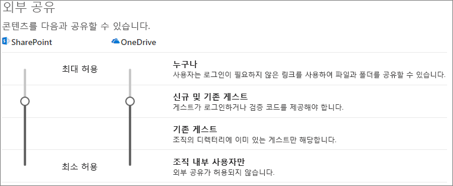
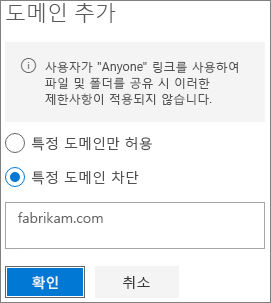

# 파일을 조직 외부의 사람들과 공유할 때 실수로 발생하는 정보 노출을 제한

파일 및 폴더를 조직 외부의 사람들과 공유할 때 기밀 정보를 우발적으로 공유하게 되는 가능성을 줄일 수 있는 다양한 옵션이 있습니다. 이 문서에서 설명하는 옵션 중에서 조직의 필요 사항에 가장 적합한 방법을 선택할 수 있습니다.

## 모든 사용자 링크 모범 사례 활용

조직의 사용자가 인증되지 않은 공유를 수행해야 하지만 인증되지 않은 사람이 콘텐츠를 수정하는 것이 우려되는 경우 [인증되지 않은 공유 모범 사례](best-practices-anonymous-sharing.md)를 읽고 조직에서의 인증되지 않은 공유 작업 방법에 대한 지침을 학습하세요.

## 모든 사용자 링크 해제

Anyone 링크는 가장 쉽게 공유하는 방법이며 사용자가 IT 부서의 통제 밖에 있는 다른 솔루션을 찾는 데 위험을 줄여주기에 *Anyone* 링크를 활성화 상태로 둘 것을 권장합니다. *Anyone*링크는 다른 사용자에게 전달될 수 있지만 파일 액세스는 링크가 있는 사용자만할 수 있습니다.

조직 외부의 사람들이 SharePoint, 그룹 또는 팀의 콘텐츠에 액세스할 때 항상 인증을 하게 하려면 *모든 사용자* 공유를 해제합니다. 이렇게 하면 사용자가 인증되지 않은 콘텐츠를 공유할 수 없게 됩니다.

*모든 사용자* 링크를 비활성화하는 경우 사용자는 여전히 *특정 사용자* 링크를 사용하여 쉽게 게스트와 공유할 수 있습니다. 이 경우 조직 외부의 모든 사람이 공유 콘텐츠에 액세스를 하려면 먼저 인증을 해야합니다.

필요에 따라 특정 사이트나 조직 전체에 대해 *Anyone* 링크를 비활성화시킬 수 있습니다.

조직에 대해 *Anyone* 링크를 해제 하려면
1. SharePoint 관리 센터의 왼쪽 탐색 창에서 **공유**를 클릭합니다.
2. SharePoint 외부 공유 설정을 **신규 및 기존 게스트**로 설정합니다. 
   
3. **저장**을 클릭합니다.

사이트에 대해 *Anyone* 링크를 해제하려면
1. SharePoint 관리 센터의 왼쪽 탐색 창에서 **사이트**를 확장시키고 **Active 사이트**를 클릭합니다.
2. 방금 생성한 팀의 사이트를 선택합니다.
3. 리본 메뉴에서 **공유**를 클릭합니다.
4. 공유가 **신규 및 기존 게스트로**설정되었는지 확인합니다. 
   
5. 변경한 내용이 있으면 **저장**을 클릭합니다.

## 도메인 필터링

도메인 허용 또는 거부 목록을 사용하여 사용자가 조직 외부의 사람들과 공유할 수 있는 도메인을 결정할 수 있습니다.

허용 목록을 사용하여 조직의 사용자가 조직 외부의 사람들과 공유할 수있는 도메인 목록을 지정할 수 있습니다. 다른 도메인으로 공유하는 것은 차단됩니다. 조직에서 특정 도메인 목록의 사람들과만 공동 작업을 하는 경우, 이 기능을 사용하여 다른 도메인과의 공유를 방지할 수 있습니다.

거부 목록을 사용하면 조직의 사용자가 조직 외부의 사람들과 공유할 수 없는 도메인 목록을 지정할 수 있습니다. 나열된 도메인과의 공유는 차단됩니다. 이는 예를 들어 조직의 콘텐츠에 액세스하지 못하도록 하려는 경우와 같이 경쟁업체가 있는 경우 유용할 수 있습니다.

이 허용 및 거부 목록은 게스트와의 공유에만 영향을 줍니다. 사용자가 이를 비활성화시키지 않은 경우 사용자는 여전히 *Anyone* 링크를 사용하여 금지된 도메인의 사람들과 계속 공유할 수 있습니다. 도메인 허용과 거부 목록을 이용하여 최상의 결과를 내기 위해서는 위에 설명한 데로 *Anyone* 링크를 비활성화할 것을 고려합니다.

조직 외부의 사람들에 대한 도메인 허용 또는 거부 목록을 설정하려면 다음을 수행합니다.
1. 왼쪽 탐색 창의 SharePoint 관리 센터에서 **공유**를 클릭합니다.
2. **외부 공유에 대한 고급 설정**에서 **도메인 별 외부 공유 제한** 확인란을 선택합니다.
3. **도메인 추가**를 클릭합니다.
4. 도메인을 차단할지를 선택하고 도메인을 입력한 후 **확인**을 클릭합니다. 
   
5. **저장**을 클릭합니다.

SharePoint 및 OneDrive 보다 상위 수준에서 도메인 별로 공유를 제한하려는 경우 Azure Active Directory의 [특정 조직에서 B2B 사용자에 대한 초청을 허용하거나 차단](https://docs.microsoft.com/azure/active-directory/b2b/allow-deny-list)할 수 있습니다. 설정이 SharePoint 및 OneDrive에 적용되도록 [Azure AD B2B 사전 검토와 Sharepoint 및 OneDrive의 통합](https://docs.microsoft.com/sharepoint/sharepoint-azureb2b-integration-preview)을 구성해야 합니다.

## 조직 외부의 사람들과 파일, 폴더 및 사이트 공유를 지정된 보안 그룹으로 제한하세요.

조직 외부의 사람과 파일, 폴더 및 사이트 공유를 특정 보안 그룹의 구성원으로 제한할 수 있습니다. 이 기능은 승인 워크플로 또는 요청 프로세스를 사용하여 외부 공유 기능을 활성화하려는 경우 유용합니다.

보안 그룹의 구성원으로 외부 공유를 제한하려면 다음을 수행합니다.
1. 왼쪽 탐색 창의 SharePoint 관리 센터에서 **공유**를 클릭합니다.
2. **기타 설정**에서. **외부 공유를 특정 보안 그룹으로 제한** 링크를 따릅니다.
3. **조직 외부에서 공유할 수 있는 사용자**에서 하나 또는 두 개의 확인란을 선택합니다: a. 인증된 사용자들과 공유할 수 있는 보안 그룹을 지정하기 위해 **선택된 보안 그룹에 있는 사용자들만 인증된 외부 사용자들과 공유하도록 합니다**b. Anyone 링크를 사용하여 인증된 사용자들과 공유할 수 있는 보안 그룹을 지정하기 위해 **선택된 보안 그룹에 있는 사용자들만 익명의 링크를 사용하여 인증된 외부 사용자들과 공유하도록 합니다**
4. **확인**을 클릭합니다.

이는 파일, 폴더, 사이트에 영향을 주지만 Office 365 그룹 또는 팀은 영향을 받지 않습니다. 구성원이 게스트를 비공개 Office 365 그룹 또는 Microsoft 팀의 비공개 팀에 초청 시 초청장이 그룹 또는 팀 소유자에게 승인을 받기 위해 전달됩니다.

## 참고 항목

[보안 게스트 공유 환경 만들기](create-a-secure-guest-sharing-environment.md)

[익명 사용자와 파일 및 폴더를 공유 하는 최상의 방법](best-practices-anonymous-sharing.md)