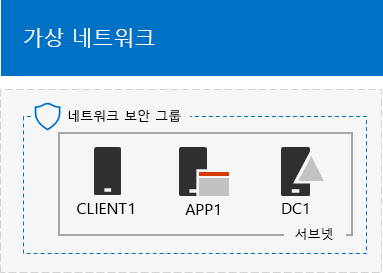

# <a name="simulated-cross-premises-virtual-network-in-azure"></a><span data-ttu-id="19824-103">시뮬레이션된 Azure의 크로스-프레미스 가상 네트워크</span><span class="sxs-lookup"><span data-stu-id="19824-103">Simulated cross-premises virtual network in Azure</span></span>

 <span data-ttu-id="19824-104">**요약:** 시뮬레이션된 프레미스 간 가상 네트워크를 Microsoft Azure에 개발/테스트 환경으로 만듭니다.</span><span class="sxs-lookup"><span data-stu-id="19824-104">**Summary:** Create a simulated cross-premises virtual network in Microsoft Azure as a dev/test environment.</span></span>
  
<span data-ttu-id="19824-p101">이 문서는 2개의 Azure 가상 네트워크를 사용하여 Microsoft Azure에 시뮬레이션된 하이브리드 클라우드 환경을 만드는 방법을 단계별로 설명합니다. 결과 구성은 다음과 같습니다.</span><span class="sxs-lookup"><span data-stu-id="19824-p101">This article steps you through creating a simulated hybrid cloud environment with Microsoft Azure using two Azure virtual networks. Here is the resulting configuration.</span></span> 
  

  
<span data-ttu-id="19824-108">Azure IaaS 하이브리드 클라우드 프로덕션 환경을 시뮬레이트하며 다음으로 구성됩니다.</span><span class="sxs-lookup"><span data-stu-id="19824-108">This simulates an Azure IaaS hybrid cloud production environment and consists of:</span></span>
  
- <span data-ttu-id="19824-109">Azure 가상 네트워크(TestLab 가상 네트워크)에서 호스트되고 시뮬레이션된 간소화된 온-프레미스 네트워크.</span><span class="sxs-lookup"><span data-stu-id="19824-109">A simulated and simplified on-premises network hosted in an Azure virtual network (the TestLab virtual network).</span></span>
    
- <span data-ttu-id="19824-110">Azure(XPrem)에서 호스트되고 시뮬레이션된 프레미스 간 가상 네트워크.</span><span class="sxs-lookup"><span data-stu-id="19824-110">A simulated cross-premises virtual network hosted in Azure (XPrem).</span></span>
    
- <span data-ttu-id="19824-111">2개의 가상 네트워크 간 VNet 피어링 관계입니다.</span><span class="sxs-lookup"><span data-stu-id="19824-111">A VNet peering relationship between the two virtual networks.</span></span>
    
- <span data-ttu-id="19824-112">XPrem 가상 네트워크의 보조 도메인 컨트롤러입니다.</span><span class="sxs-lookup"><span data-stu-id="19824-112">A secondary domain controller in the XPrem virtual network.</span></span>
    
<span data-ttu-id="19824-113">이 컨트롤러는 다음 작업을 수행할 수 있는 기본적이고 일반적인 시작 지점을 제공합니다.</span><span class="sxs-lookup"><span data-stu-id="19824-113">This provides a basis and common starting point from which you can:</span></span> 
  
- <span data-ttu-id="19824-114">시뮬레이션된 Azure IaaS 하이브리드 클라우드 환경에서 테스트 응용 프로그램을 개발하고 테스트합니다.</span><span class="sxs-lookup"><span data-stu-id="19824-114">Develop and test applications in a simulated Azure IaaS hybrid cloud environment.</span></span>
    
- <span data-ttu-id="19824-115">일부 TestLab 가상 네트워크 및 일부 XPrem 가상 네트워크 내에서 컴퓨터의 테스트 구성을 만들어서 하이브리드 클라우드 기반 IT 작업을 시뮬레이션합니다.</span><span class="sxs-lookup"><span data-stu-id="19824-115">Create test configurations of computers, some within the TestLab virtual network and some within the XPrem virtual network, to simulate hybrid cloud-based IT workloads.</span></span>
    
<span data-ttu-id="19824-116">이 개발/테스트 환경의 3가지 주요 설정 단계는 다음과 같습니다.</span><span class="sxs-lookup"><span data-stu-id="19824-116">There are three major phases to setting up this dev/test environment:</span></span>
  
1. <span data-ttu-id="19824-117">TestLab 가상 네트워크를 구성합니다.</span><span class="sxs-lookup"><span data-stu-id="19824-117">Configure the TestLab virtual network.</span></span>
    
2. <span data-ttu-id="19824-118">프레미스 간 가상 네트워크를 만듭니다.</span><span class="sxs-lookup"><span data-stu-id="19824-118">Create the cross-premises virtual network.</span></span>
    
3. <span data-ttu-id="19824-119">DC2를 구성합니다.</span><span class="sxs-lookup"><span data-stu-id="19824-119">Configure DC2.</span></span>
    
> [!NOTE]
> <span data-ttu-id="19824-120">이 구성을 위해서는 유료 Azure 구독이 필요합니다.</span><span class="sxs-lookup"><span data-stu-id="19824-120">This configuration requires a paid Azure subscription.</span></span> 
  

  
> [!TIP]
> <span data-ttu-id="19824-122">[여기](https://aka.ms/catlgstack)를 클릭하여 Office 365 테스트 랩 가이드 스택의 모든 문서에 대한 가상 맵을 확인할 수 있습니다.</span><span class="sxs-lookup"><span data-stu-id="19824-122">Click [here](https://aka.ms/catlgstack) for a visual map to all the articles in the Office 365 Test Lab Guide stack.</span></span>
  
## <a name="phase-1-configure-the-testlab-virtual-network"></a><span data-ttu-id="19824-123">1단계: TestLab 가상 네트워크 구성</span><span class="sxs-lookup"><span data-stu-id="19824-123">Phase 1: Configure the TestLab virtual network</span></span>

<span data-ttu-id="19824-124">[기본 구성 개발/테스트 환경](base-configuration-dev-test-environment.md)의 지침을 사용하여 TestLab이라는 Azure 가상 네트워크에서 DC1, APP1, CLIENT1 컴퓨터를 구성합니다.</span><span class="sxs-lookup"><span data-stu-id="19824-124">Use the instructions in [Base Configuration dev/test environment](base-configuration-dev-test-environment.md) to configure the DC1, APP1, and CLIENT1 computers in the Azure virtual network named TestLab.</span></span>
  
<span data-ttu-id="19824-125">다음은 현재 구성입니다.</span><span class="sxs-lookup"><span data-stu-id="19824-125">This is your current configuration.</span></span> 
  

  
## <a name="phase-2-create-the-xprem-virtual-network"></a><span data-ttu-id="19824-127">2단계: XPrem 가상 네트워크 만들기</span><span class="sxs-lookup"><span data-stu-id="19824-127">Phase 2: Create the XPrem virtual network</span></span>

<span data-ttu-id="19824-128">이 단계에서는 새로운 XPrem 가상 네트워크를 만들고 구성한 다음 이를 VNet 피어링을 통해 TestLab 가상 네트워크에 연결합니다.</span><span class="sxs-lookup"><span data-stu-id="19824-128">In this phase, you create and configure the new XPrem virtual network and then connect it to the TestLab virtual network with VNet peering.</span></span>
  
<span data-ttu-id="19824-129">먼저 로컬 컴퓨터에서 Azure PowerShell 프롬프트를 시작합니다.</span><span class="sxs-lookup"><span data-stu-id="19824-129">First, start an Azure PowerShell prompt on your local computer.</span></span>
  
> [!NOTE]
> <span data-ttu-id="19824-p102">다음 명령 집합은 최신 버전의 Azure PowerShell을 사용합니다. [Azure PowerShell cmdlet으로 시작](https://docs.microsoft.com/powershell/azureps-cmdlets-docs/)을 참조하세요.</span><span class="sxs-lookup"><span data-stu-id="19824-p102">The following command sets use the latest version of Azure PowerShell. See [Get started with Azure PowerShell cmdlets](https://docs.microsoft.com/powershell/azureps-cmdlets-docs/).</span></span> 
  
<span data-ttu-id="19824-132">이 명령을 사용하여 Azure 계정에 로그인합니다.</span><span class="sxs-lookup"><span data-stu-id="19824-132">Sign in to your Azure account with this command.</span></span>
  
```
Connect-AzAccount
```

<!--
> [!TIP]
> Click [here](https://gallery.technet.microsoft.com/PowerShell-commands-for-7844edd0) to get a text file that has all of the PowerShell commands in this article.
-->
  
<span data-ttu-id="19824-133">이 명령을 사용하여 구독 이름을 가져옵니다.</span><span class="sxs-lookup"><span data-stu-id="19824-133">Get your subscription name using this command.</span></span>
  
```
Get-AzSubscription | Sort Name | Select Name
```

<span data-ttu-id="19824-p103">Azure 구독을 설정합니다. \< 및 > 문자를 포함하여 따옴표 안에 있는 모든 것을 올바른 이름으로 바꿉니다.</span><span class="sxs-lookup"><span data-stu-id="19824-p103">Set your Azure subscription. Replace everything within the quotes, including the \< and > characters, with the correct names.</span></span>
  
```
$subscrName="<subscription name>"
Select-AzSubscription -SubscriptionName $subscrName
```

<span data-ttu-id="19824-136">그런 다음, 해당 명령을 통해 XPrem 가상 네트워크를 만들고 가상 보안 그룹으로 네트워크를 보호합니다.</span><span class="sxs-lookup"><span data-stu-id="19824-136">Next, create the XPrem virtual network and protect it with a network security group with these commands.</span></span>
  
```
$rgName="<name of the resource group that you used for your TestLab virtual network>"
$locName=(Get-AzResourceGroup -Name $rgName).Location
$Testnet=New-AzVirtualNetworkSubnetConfig -Name "Testnet" -AddressPrefix 192.168.0.0/24
New-AzVirtualNetwork -Name "XPrem" -ResourceGroupName $rgName -Location $locName -AddressPrefix 192.168.0.0/16 -Subnet $Testnet -DNSServer 10.0.0.4
$rule1=New-AzNetworkSecurityRuleConfig -Name "RDPTraffic" -Description "Allow RDP to all VMs on the subnet" -Access Allow -Protocol Tcp -Direction Inbound -Priority 100 -SourceAddressPrefix Internet -SourcePortRange * -DestinationAddressPrefix * -DestinationPortRange 3389
New-AzNetworkSecurityGroup -Name "Testnet" -ResourceGroupName $rgName -Location $locName -SecurityRules $rule1
$vnet=Get-AzVirtualNetwork -ResourceGroupName $rgName -Name XPrem
$nsg=Get-AzNetworkSecurityGroup -Name "Testnet" -ResourceGroupName $rgName
Set-AzVirtualNetworkSubnetConfig -VirtualNetwork $vnet -Name "Testnet" -AddressPrefix 192.168.0.0/24 -NetworkSecurityGroup $nsg
$vnet | Set-AzVirtualNetwork
```

<span data-ttu-id="19824-137">그런 다음, 해당 명령을 통해 TestLab 및 XPrem VNet 간의 VNet 피어링 관계를 만듭니다.</span><span class="sxs-lookup"><span data-stu-id="19824-137">Next, you create the VNet peering relationship between the TestLab and XPrem VNets with these commands.</span></span>
  
```
$rgName="<name of the resource group that you used for your TestLab virtual network>"
$vnet1=Get-AzVirtualNetwork -ResourceGroupName $rgName -Name TestLab
$vnet2=Get-AzVirtualNetwork -ResourceGroupName $rgName -Name XPrem
Add-AzVirtualNetworkPeering -Name TestLab2XPrem -VirtualNetwork $vnet1 -RemoteVirtualNetworkId $vnet2.Id
Add-AzVirtualNetworkPeering -Name XPrem2TestLab -VirtualNetwork $vnet2 -RemoteVirtualNetworkId $vnet1.Id
```

<span data-ttu-id="19824-138">다음은 현재 구성입니다.</span><span class="sxs-lookup"><span data-stu-id="19824-138">This is your current configuration.</span></span> 
  

  
## <a name="phase-3-configure-dc2"></a><span data-ttu-id="19824-140">3단계: DC2 구성</span><span class="sxs-lookup"><span data-stu-id="19824-140">Phase 3: Configure DC2</span></span>

<span data-ttu-id="19824-141">이 단계에서는 XPrem 가상 네트워크에 DC2 가상 컴퓨터를 만들고 복제본 도메인 컨트롤러로 구성합니다.</span><span class="sxs-lookup"><span data-stu-id="19824-141">In this phase, you create the DC2 virtual machine in the XPrem virtual network and then configure it as a replica domain controller.</span></span>
  
<span data-ttu-id="19824-p104">먼저 DC2에 대한 가상 컴퓨터를 만듭니다. 로컬 컴퓨터의 Azure PowerShell 명령 프롬프트에서 해당 명령을 실행합니다.</span><span class="sxs-lookup"><span data-stu-id="19824-p104">First, create a virtual machine for DC2. Run these commands at the Azure PowerShell command prompt on your local computer.</span></span>
  
```
$rgName="<your resource group name>"
$locName=(Get-AzResourceGroup -Name $rgName).Location
$vnet=Get-AzVirtualNetwork -Name XPrem -ResourceGroupName $rgName
$pip=New-AzPublicIpAddress -Name DC2-PIP -ResourceGroupName $rgName -Location $locName -AllocationMethod Dynamic
$nic=New-AzNetworkInterface -Name DC2-NIC -ResourceGroupName $rgName -Location $locName -SubnetId $vnet.Subnets[0].Id -PublicIpAddressId $pip.Id -PrivateIpAddress 192.168.0.4
$vm=New-AzVMConfig -VMName DC2 -VMSize Standard_A1
$cred=Get-Credential -Message "Type the name and password of the local administrator account for DC2."
$vm=Set-AzVMOperatingSystem -VM $vm -Windows -ComputerName DC2 -Credential $cred -ProvisionVMAgent -EnableAutoUpdate
$vm=Set-AzVMSourceImage -VM $vm -PublisherName MicrosoftWindowsServer -Offer WindowsServer -Skus 2016-Datacenter -Version "latest"
$vm=Add-AzVMNetworkInterface -VM $vm -Id $nic.Id
$vm=Set-AzVMOSDisk -VM $vm -Name "DC2-OS" -DiskSizeInGB 128 -CreateOption FromImage -StorageAccountType "Standard_LRS"
$diskConfig=New-AzDiskConfig -AccountType "Standard_LRS" -Location $locName -CreateOption Empty -DiskSizeGB 20
$dataDisk1=New-AzDisk -DiskName "DC2-DataDisk1" -Disk $diskConfig -ResourceGroupName $rgName
$vm=Add-AzVMDataDisk -VM $vm -Name "DC2-DataDisk1" -CreateOption Attach -ManagedDiskId $dataDisk1.Id -Lun 1
New-AzVM -ResourceGroupName $rgName -Location $locName -VM $vm
```

<span data-ttu-id="19824-144">그런 다음, 로컬 관리자 계정 이름과 암호를 사용하여 [Azure Portal](https://portal.azure.com)에서 새로운 DC2 가상 컴퓨터에 연결합니다.</span><span class="sxs-lookup"><span data-stu-id="19824-144">Next, connect to the new DC2 virtual machine from the [Azure portal](https://portal.azure.com) using its local administrator account name and password.</span></span>
  
<span data-ttu-id="19824-p105">그런 다음, 기본 연결 테스트에 트래픽을 허용하도록 Windows 방화벽 규칙을 구성합니다. DC2의 관리자 수준 Windows PowerShell 명령 프롬프트에서 해당 명령을 실행합니다.</span><span class="sxs-lookup"><span data-stu-id="19824-p105">Next, configure a Windows Firewall rule to allow traffic for basic connectivity testing. From an administrator-level Windows PowerShell command prompt on DC2, run these commands.</span></span> 
  
```
Set-NetFirewallRule -DisplayName "File and Printer Sharing (Echo Request - ICMPv4-In)" -enabled True
ping dc1.corp.contoso.com
```

<span data-ttu-id="19824-p106">ping 명령으로 인해 IP 주소 10.0.0.4에서 네 번의 성공적인 응답이 발생해야 합니다. VNet 피어링 관계 전반에 걸친 트래픽 테스트입니다.</span><span class="sxs-lookup"><span data-stu-id="19824-p106">The ping command should result in four successful replies from IP address 10.0.0.4. This is a test of traffic across the VNet peering relationship.</span></span> 
  
<span data-ttu-id="19824-149">다음으로 DC2의 Windows PowerShell 명령 프롬프트에서 이 명령을 사용하여 추가 데이터 디스크를 드라이브 문자 F:의 새로운 볼륨으로 추가합니다.</span><span class="sxs-lookup"><span data-stu-id="19824-149">Next, add the extra data disk as a new volume with the drive letter F: with this command from the Windows PowerShell command prompt on DC2.</span></span>
  
```
Get-Disk | Where PartitionStyle -eq "RAW" | Initialize-Disk -PartitionStyle MBR -PassThru | New-Partition -AssignDriveLetter -UseMaximumSize | Format-Volume -FileSystem NTFS -NewFileSystemLabel "WSAD Data"
```

<span data-ttu-id="19824-p107">그런 다음 DC2를 corp.contoso.com 도메인에 대한 복제본 도메인 컨트롤러로 구성합니다. DC2의 Windows PowerShell 명령 프롬프트에서 해당 명령을 실행합니다.</span><span class="sxs-lookup"><span data-stu-id="19824-p107">Next, configure DC2 as a replica domain controller for the corp.contoso.com domain. Run these commands from the Windows PowerShell command prompt on DC2.</span></span>
  
```
Install-WindowsFeature AD-Domain-Services -IncludeManagementTools
Install-ADDSDomainController -Credential (Get-Credential CORP\User1) -DomainName "corp.contoso.com" -InstallDns:$true -DatabasePath "F:\NTDS" -LogPath "F:\Logs" -SysvolPath "F:\SYSVOL"
```

<span data-ttu-id="19824-152">CORP\\User1 암호와 디렉터리 서비스 복원 모드(DSRM) 암호 모두를 제공하고 DC2를 다시 시작하라는 메시지가 표시됩니다.</span><span class="sxs-lookup"><span data-stu-id="19824-152">Note that you are prompted to supply both the CORP\\User1 password and a Directory Services Restore Mode (DSRM) password, and to restart DC2.</span></span> 
  
<span data-ttu-id="19824-p108">이제 XPrem에는 자체 DNS 서버(DC2)가 있으므로 이 DNS 서버를 사용하도록 XPrem 가상 네트워크를 구성해야 합니다. 로컬 컴퓨터의 Azure PowerShell 명령 프롬프트에서 해당 명령을 실행합니다.</span><span class="sxs-lookup"><span data-stu-id="19824-p108">Now that the XPrem virtual network has its own DNS server (DC2), you must configure the XPrem virtual network to use this DNS server. Run these commands from the Azure PowerShell command prompt on your local computer.</span></span>
  
```
$vnet=Get-AzVirtualNetwork -ResourceGroupName $rgName -name "XPrem"
$vnet.DhcpOptions.DnsServers="192.168.0.4" 
Set-AzVirtualNetwork -VirtualNetwork $vnet
Restart-AzVM -ResourceGroupName $rgName -Name "DC2"
```

<span data-ttu-id="19824-p109">로컬 컴퓨터의 Azure Portal에서 CORP\\User1 자격 증명을 사용하여 DC1에 연결합니다. 컴퓨터와 사용자가 로컬 도메인 컨트롤러를 사용하여 인증하도록 CORP 도메인을 구성하려면 DC1의 관리자 수준 Windows PowerShell 명령 프롬프트에서 해당 명령을 실행합니다.</span><span class="sxs-lookup"><span data-stu-id="19824-p109">From the Azure portal on your local computer, connect to DC1 with the CORP\\User1 credentials. To configure the CORP domain so that computers and users use their local domain controller for authentication, run these commands from an administrator-level Windows PowerShell command prompt on DC1.</span></span>
  
```
New-ADReplicationSite -Name "TestLab" 
New-ADReplicationSite -Name "XPrem"
New-ADReplicationSubnet -Name "10.0.0.0/8" -Site "TestLab"
New-ADReplicationSubnet -Name "192.168.0.0/16" -Site "XPrem"
```

<span data-ttu-id="19824-157">다음은 현재 구성입니다.</span><span class="sxs-lookup"><span data-stu-id="19824-157">This is your current configuration.</span></span> 
  

  
<span data-ttu-id="19824-159">시뮬레이션된 Azure 하이브리드 클라우드 환경은 이제 테스트 준비 중입니다.</span><span class="sxs-lookup"><span data-stu-id="19824-159">Your simulated Azure hybrid cloud environment is now ready for testing.</span></span>
  
## <a name="next-step"></a><span data-ttu-id="19824-160">다음 단계</span><span class="sxs-lookup"><span data-stu-id="19824-160">Next step</span></span>

<span data-ttu-id="19824-161">이 개발/테스트 환경을 사용하여 [Azure에서 호스트된 SharePoint Server 2016 인트라넷 팜](https://technet.microsoft.com/library/mt806351%28v=office.16%29.aspx)을 시뮬레이션할 수 있습니다.</span><span class="sxs-lookup"><span data-stu-id="19824-161">Use this dev/test environment to simulate a [SharePoint Server 2016 intranet farm hosted in Azure](https://technet.microsoft.com/library/mt806351%28v=office.16%29.aspx).</span></span>
  
## <a name="see-also"></a><span data-ttu-id="19824-162">참고 항목</span><span class="sxs-lookup"><span data-stu-id="19824-162">See Also</span></span>

[<span data-ttu-id="19824-163">기본 구성 개발/테스트 환경</span><span class="sxs-lookup"><span data-stu-id="19824-163">Base Configuration dev/test environment</span></span>](base-configuration-dev-test-environment.md)
  
[<span data-ttu-id="19824-164">Office 365 개발/테스트 환경</span><span class="sxs-lookup"><span data-stu-id="19824-164">Office 365 dev/test environment</span></span>](office-365-dev-test-environment.md)
  
[<span data-ttu-id="19824-165">Office 365 개발/테스트 환경용 DirSync</span><span class="sxs-lookup"><span data-stu-id="19824-165">DirSync for your Office 365 dev/test environment</span></span>](dirsync-for-your-office-365-dev-test-environment.md)
  
[<span data-ttu-id="19824-166">Office 365 개발/테스트 환경용 Advanced Threat Protection</span><span class="sxs-lookup"><span data-stu-id="19824-166">Advanced Threat Protection for your Office 365 dev/test environment</span></span>](advanced-threat-protection-for-your-office-365-dev-test-environment.md)
  
[<span data-ttu-id="19824-167">클라우드 도입 및 하이브리드 솔루션</span><span class="sxs-lookup"><span data-stu-id="19824-167">Cloud adoption and hybrid solutions</span></span>](cloud-adoption-and-hybrid-solutions.md)


