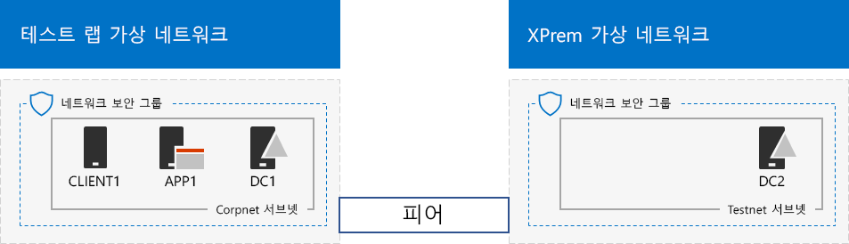
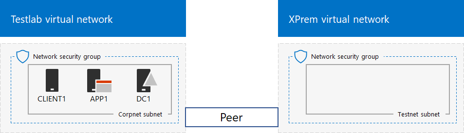

# <a name="simulated-cross-premises-virtual-network-in-azure"></a><span data-ttu-id="8d63b-103">Azure의 시뮬레이션 된 크로스-프레미스 가상 네트워크</span><span class="sxs-lookup"><span data-stu-id="8d63b-103">Simulated cross-premises virtual network in Azure</span></span>

 <span data-ttu-id="8d63b-104">**요약:** 개발/테스트 환경으로 Microsoft Azure의 시뮬레이션 된 크로스-프레미스 가상 네트워크를 만듭니다.</span><span class="sxs-lookup"><span data-stu-id="8d63b-104">**Summary:** Create a simulated cross-premises virtual network in Microsoft Azure as a dev/test environment.</span></span>
  
<span data-ttu-id="8d63b-p101">이 문서와 Microsoft Azure 두 Azure 가상 네트워크를 사용 하 여 시뮬레이션 된 하이브리드 클라우드 환경 만들기 (영문)에 대해 설명 합니다. 결과 구성은 다음과 같습니다.</span><span class="sxs-lookup"><span data-stu-id="8d63b-p101">This article steps you through creating a simulated hybrid cloud environment with Microsoft Azure using two Azure virtual networks. Here is the resulting configuration.</span></span> 
  

  
<span data-ttu-id="8d63b-108">Azure IaaS 하이브리드 클라우드 프로덕션 환경에서 시뮬레이션 하 고 구성 됩니다.</span><span class="sxs-lookup"><span data-stu-id="8d63b-108">This simulates an Azure IaaS hybrid cloud production environment and consists of:</span></span>
  
- <span data-ttu-id="8d63b-109">네트워크에 연결 시뮬레이션 된 간소화 된 온-프레미스 및 Azure 가상 네트워크 (테스트 실습 가상 네트워크)에서 호스팅됩니다.</span><span class="sxs-lookup"><span data-stu-id="8d63b-109">A simulated and simplified on-premises network hosted in an Azure virtual network (the TestLab virtual network).</span></span>
    
- <span data-ttu-id="8d63b-110">Azure (XPrem)에서 호스팅되는 시뮬레이션 된 크로스-프레미스 가상 네트워크입니다.</span><span class="sxs-lookup"><span data-stu-id="8d63b-110">A simulated cross-premises virtual network hosted in Azure (XPrem).</span></span>
    
- <span data-ttu-id="8d63b-111">두 가상 네트워크 간의 VNet 피어 링 관계입니다.</span><span class="sxs-lookup"><span data-stu-id="8d63b-111">A VNet peering relationship between the two virtual networks.</span></span>
    
- <span data-ttu-id="8d63b-112">XPrem 가상 네트워크에서 보조 도메인 컨트롤러입니다.</span><span class="sxs-lookup"><span data-stu-id="8d63b-112">A secondary domain controller in the XPrem virtual network.</span></span>
    
<span data-ttu-id="8d63b-113">이렇게 기준 및 일반적인 시작 하는 수를 가리킵니다. 제공 됩니다.</span><span class="sxs-lookup"><span data-stu-id="8d63b-113">This provides a basis and common starting point from which you can:</span></span> 
  
- <span data-ttu-id="8d63b-114">개발 및 시뮬레이션 된 Azure IaaS 하이브리드 클라우드 환경에서 응용 프로그램을 테스트 합니다.</span><span class="sxs-lookup"><span data-stu-id="8d63b-114">Develop and test applications in a simulated Azure IaaS hybrid cloud environment.</span></span>
    
- <span data-ttu-id="8d63b-115">컴퓨터, 테스트 실습 가상 네트워크 내에서 일부 및 하이브리드 클라우드 기반 IT 작업 부하를 시뮬레이션 하기 위해 XPrem 가상 네트워크 내에서 일부 테스트 구성을 만듭니다.</span><span class="sxs-lookup"><span data-stu-id="8d63b-115">Create test configurations of computers, some within the TestLab virtual network and some within the XPrem virtual network, to simulate hybrid cloud-based IT workloads.</span></span>
    
<span data-ttu-id="8d63b-116">이 개발/테스트 환경의 3가지 주요 설정 단계는 다음과 같습니다.</span><span class="sxs-lookup"><span data-stu-id="8d63b-116">There are three major phases to setting up this dev/test environment:</span></span>
  
1. <span data-ttu-id="8d63b-117">테스트 실습 가상 네트워크를 구성 합니다.</span><span class="sxs-lookup"><span data-stu-id="8d63b-117">Configure the TestLab virtual network.</span></span>
    
2. <span data-ttu-id="8d63b-118">크로스-프레미스 가상 네트워크를 만듭니다.</span><span class="sxs-lookup"><span data-stu-id="8d63b-118">Create the cross-premises virtual network.</span></span>
    
3. <span data-ttu-id="8d63b-119">D c 2를 구성 합니다.</span><span class="sxs-lookup"><span data-stu-id="8d63b-119">Configure DC2.</span></span>
    
> [!NOTE]
> <span data-ttu-id="8d63b-120">이 구성 유료 Azure 구독에 필요 합니다.</span><span class="sxs-lookup"><span data-stu-id="8d63b-120">This configuration requires a paid Azure subscription.</span></span> 
  

  
> [!TIP]
> <span data-ttu-id="8d63b-122">[여기](http://aka.ms/catlgstack)를 클릭하여 One Microsoft 클라우드 테스트 랩 가이드 스택의 모든 문서에 대한 가상 맵을 확인할 수 있습니다.</span><span class="sxs-lookup"><span data-stu-id="8d63b-122">Click [here](http://aka.ms/catlgstack) for a visual map to all the articles in the One Microsoft Cloud Test Lab Guide stack.</span></span>
  
## <a name="phase-1-configure-the-testlab-virtual-network"></a><span data-ttu-id="8d63b-123">1 단계: 테스트 실습 가상 네트워크 구성</span><span class="sxs-lookup"><span data-stu-id="8d63b-123">Phase 1: Configure the TestLab virtual network</span></span>

<span data-ttu-id="8d63b-124">[기본 구성 개발/테스트 환경](base-configuration-dev-test-environment.md) 에서 테스트 실습 라는 Azure 가상 네트워크에서 d c 1, a p p 1을 및 CLIENT1 컴퓨터를 구성 하는 지침을 따르십시오.</span><span class="sxs-lookup"><span data-stu-id="8d63b-124">Use the instructions in [Base Configuration dev/test environment](base-configuration-dev-test-environment.md) to configure the DC1, APP1, and CLIENT1 computers in the Azure virtual network named TestLab.</span></span>
  
<span data-ttu-id="8d63b-125">현재 구성입니다.</span><span class="sxs-lookup"><span data-stu-id="8d63b-125">This is your current configuration.</span></span> 
  

  
## <a name="phase-2-create-the-xprem-virtual-network"></a><span data-ttu-id="8d63b-127">2 단계: XPrem 가상 네트워크 만들기</span><span class="sxs-lookup"><span data-stu-id="8d63b-127">Phase 2: Create the XPrem virtual network</span></span>

<span data-ttu-id="8d63b-128">이 단계에서 하 고 새 XPrem 가상 네트워크 구성 만들고 VNet 피어 링으로 테스트 실습 가상 네트워크에 연결 합니다.</span><span class="sxs-lookup"><span data-stu-id="8d63b-128">In this phase, you create and configure the new XPrem virtual network and then connect it to the TestLab virtual network with VNet peering.</span></span>
  
<span data-ttu-id="8d63b-129">먼저, 로컬 컴퓨터에서 Azure PowerShell 프롬프트를 시작 합니다.</span><span class="sxs-lookup"><span data-stu-id="8d63b-129">First, start an Azure PowerShell prompt on your local computer.</span></span>
  
> [!NOTE]
> <span data-ttu-id="8d63b-p102">Azure PowerShell의 최신 버전을 사용 하는 다음 명령 집합입니다. [Azure PowerShell cmdlet 시작](https://docs.microsoft.com/en-us/powershell/azureps-cmdlets-docs/)을 참조 하십시오.</span><span class="sxs-lookup"><span data-stu-id="8d63b-p102">The following command sets use the latest version of Azure PowerShell. See [Get started with Azure PowerShell cmdlets](https://docs.microsoft.com/en-us/powershell/azureps-cmdlets-docs/).</span></span> 
  
<span data-ttu-id="8d63b-132">다음 명령 사용 하 여 Azure 계정에 로그인 합니다.</span><span class="sxs-lookup"><span data-stu-id="8d63b-132">Sign in to your Azure account with the following command.</span></span>
  
```
Login-AzureRMAccount
```

> [!TIP]
> <span data-ttu-id="8d63b-133">클릭 [여기](https://gallery.technet.microsoft.com/PowerShell-commands-for-7844edd0) 모든이 문서의 PowerShell 명령을 포함 된 텍스트 파일을 가져오도록 합니다.</span><span class="sxs-lookup"><span data-stu-id="8d63b-133">Click [here](https://gallery.technet.microsoft.com/PowerShell-commands-for-7844edd0) to get a text file that contains all of the PowerShell commands in this article.</span></span>
  
<span data-ttu-id="8d63b-134">다음 명령을 사용하여 구독 이름을 가져옵니다.</span><span class="sxs-lookup"><span data-stu-id="8d63b-134">Get your subscription name using the following command.</span></span>
  
```
Get-AzureRMSubscription | Sort Name | Select Name
```

<span data-ttu-id="8d63b-p103">Azure 구독을 설정 합니다. 교체 따옴표를 포함 하 여 입력을 내에 있는 모든 항목은 \< 및 > 올바른 이름 사용 하 여 문자입니다.</span><span class="sxs-lookup"><span data-stu-id="8d63b-p103">Set your Azure subscription. Replace everything within the quotes, including the \< and > characters, with the correct names.</span></span>
  
```
$subscrName="<subscription name>"
Get-AzureRmSubscription -SubscriptionName $subscrName | Select-AzureRmSubscription
```

<span data-ttu-id="8d63b-137">다음으로 XPrem 가상 네트워크를 만들고 이러한 명령으로 네트워크 보안 그룹과 보호 합니다.</span><span class="sxs-lookup"><span data-stu-id="8d63b-137">Next, create the XPrem virtual network and protect it with a network security group with these commands.</span></span>
  
```
$rgName="<name of the resource group that you used for your TestLab virtual network>"
$locName=(Get-AzureRmResourceGroup -Name $rgName).Location
$Testnet=New-AzureRMVirtualNetworkSubnetConfig -Name "Testnet" -AddressPrefix 192.168.0.0/24
New-AzureRMVirtualNetwork -Name "XPrem" -ResourceGroupName $rgName -Location $locName -AddressPrefix 192.168.0.0/16 -Subnet $Testnet -DNSServer 10.0.0.4
$rule1=New-AzureRMNetworkSecurityRuleConfig -Name "RDPTraffic" -Description "Allow RDP to all VMs on the subnet" -Access Allow -Protocol Tcp -Direction Inbound -Priority 100 -SourceAddressPrefix Internet -SourcePortRange * -DestinationAddressPrefix * -DestinationPortRange 3389
New-AzureRMNetworkSecurityGroup -Name "Testnet" -ResourceGroupName $rgName -Location $locName -SecurityRules $rule1
$vnet=Get-AzureRMVirtualNetwork -ResourceGroupName $rgName -Name XPrem
$nsg=Get-AzureRMNetworkSecurityGroup -Name "Testnet" -ResourceGroupName $rgName
Set-AzureRMVirtualNetworkSubnetConfig -VirtualNetwork $vnet -Name "Testnet" -AddressPrefix 192.168.0.0/24 -NetworkSecurityGroup $nsg
```

<span data-ttu-id="8d63b-138">그런 다음 이러한 명령을와 테스트 실습 및 XPrem VNets 간의 VNet 피어 링 관계를 만듭니다.</span><span class="sxs-lookup"><span data-stu-id="8d63b-138">Next, you create the VNet peering relationship between the TestLab and XPrem VNets with these commands.</span></span>
  
```
$rgName="<name of the resource group that you used for your TestLab virtual network>"
$vnet1=Get-AzureRmVirtualNetwork -ResourceGroupName $rgName -Name TestLab
$vnet2=Get-AzureRmVirtualNetwork -ResourceGroupName $rgName -Name XPrem
Add-AzureRmVirtualNetworkPeering -Name TestLab2XPrem -VirtualNetwork $vnet1 -RemoteVirtualNetworkId $vnet2.Id
Add-AzureRmVirtualNetworkPeering -Name XPrem2TestLab -VirtualNetwork $vnet2 -RemoteVirtualNetworkId $vnet1.Id
```

<span data-ttu-id="8d63b-139">현재 구성입니다.</span><span class="sxs-lookup"><span data-stu-id="8d63b-139">This is your current configuration.</span></span> 
  

  
## <a name="phase-3-configure-dc2"></a><span data-ttu-id="8d63b-141">3 단계: d c 2를 구성 합니다.</span><span class="sxs-lookup"><span data-stu-id="8d63b-141">Phase 3: Configure DC2</span></span>

<span data-ttu-id="8d63b-142">이 단계에서 d c 2 가상 컴퓨터 XPrem 가상 네트워크에서 만들고 복제 도메인 컨트롤러를 구성 합니다.</span><span class="sxs-lookup"><span data-stu-id="8d63b-142">In this phase, you create the DC2 virtual machine in the XPrem virtual network and then configure it as a replica domain controller.</span></span>
  
<span data-ttu-id="8d63b-p104">먼저 d c 2에 대 한 가상 컴퓨터를 만듭니다. Azure PowerShell 명령 프롬프트에서 로컬 컴퓨터에서 이러한 명령을 실행 합니다.</span><span class="sxs-lookup"><span data-stu-id="8d63b-p104">First, create a virtual machine for DC2. Run these commands at the Azure PowerShell command prompt on your local computer.</span></span>
  
```
$rgName="<your resource group name>"
$locName=(Get-AzureRmResourceGroup -Name $rgName).Location
$vnet=Get-AzureRMVirtualNetwork -Name XPrem -ResourceGroupName $rgName
$pip=New-AzureRMPublicIpAddress -Name DC2-PIP -ResourceGroupName $rgName -Location $locName -AllocationMethod Dynamic
$nic=New-AzureRMNetworkInterface -Name DC2-NIC -ResourceGroupName $rgName -Location $locName -SubnetId $vnet.Subnets[0].Id -PublicIpAddressId $pip.Id -PrivateIpAddress 192.168.0.4
$vm=New-AzureRMVMConfig -VMName DC2 -VMSize Standard_A1
$cred=Get-Credential -Message "Type the name and password of the local administrator account for DC2."
$vm=Set-AzureRMVMOperatingSystem -VM $vm -Windows -ComputerName DC2 -Credential $cred -ProvisionVMAgent -EnableAutoUpdate
$vm=Set-AzureRMVMSourceImage -VM $vm -PublisherName MicrosoftWindowsServer -Offer WindowsServer -Skus 2016-Datacenter -Version "latest"
$vm=Add-AzureRMVMNetworkInterface -VM $vm -Id $nic.Id
$vm=Set-AzureRmVMOSDisk -VM $vm -Name "DC2-OS" -DiskSizeInGB 128 -CreateOption FromImage -StorageAccountType "StandardLRS"
$diskConfig=New-AzureRmDiskConfig -AccountType "StandardLRS" -Location $locName -CreateOption Empty -DiskSizeGB 20
$dataDisk1=New-AzureRmDisk -DiskName "DC2-DataDisk1" -Disk $diskConfig -ResourceGroupName $rgName
$vm=Add-AzureRmVMDataDisk -VM $vm -Name "DC2-DataDisk1" -CreateOption Attach -ManagedDiskId $dataDisk1.Id -Lun 1
New-AzureRMVM -ResourceGroupName $rgName -Location $locName -VM $vm
```

<span data-ttu-id="8d63b-145">다음으로, 로컬 관리자 계정 이름과 암호를 사용 하 여 [Azure 포털](https://portal.azure.com) 에서 새 d c 2 가상 컴퓨터에 연결 합니다.</span><span class="sxs-lookup"><span data-stu-id="8d63b-145">Next, connect to the new DC2 virtual machine from the [Azure portal](https://portal.azure.com) using its local administrator account name and password.</span></span>
  
<span data-ttu-id="8d63b-p105">다음으로 기본 연결을 테스트 하는 것에 대 한 트래픽을 허용 하도록 Windows 방화벽 규칙을 구성 합니다. 프로그램 관리자 수준 Windows PowerShell 명령 프롬프트에서 d c 2에서 다음이 명령을 실행 합니다.</span><span class="sxs-lookup"><span data-stu-id="8d63b-p105">Next, configure a Windows Firewall rule to allow traffic for basic connectivity testing. From an administrator-level Windows PowerShell command prompt on DC2, run these commands.</span></span> 
  
```
Set-NetFirewallRule -DisplayName "File and Printer Sharing (Echo Request - ICMPv4-In)" -enabled True
ping dc1.corp.contoso.com
```

<span data-ttu-id="8d63b-p106">IP 주소 10.0.0.4에서에서 4 개의 성공적인 회신을 받으면 ping 명령을 발생 해야 합니다. 이것은 VNet 피어 링 관계 별 트래픽의 테스트 합니다.</span><span class="sxs-lookup"><span data-stu-id="8d63b-p106">The ping command should result in four successful replies from IP address 10.0.0.4. This is a test of traffic across the VNet peering relationship.</span></span> 
  
<span data-ttu-id="8d63b-150">그 다음 d c 2에서 Windows PowerShell 명령 프롬프트에서 추가 데이터 디스크 드라이브 문자로 f:가이 명령 사용 하 여 새 볼륨으로 추가 합니다.</span><span class="sxs-lookup"><span data-stu-id="8d63b-150">Next, add the extra data disk as a new volume with the drive letter F: with this command from the Windows PowerShell command prompt on DC2.</span></span>
  
```
Get-Disk | Where PartitionStyle -eq "RAW" | Initialize-Disk -PartitionStyle MBR -PassThru | New-Partition -AssignDriveLetter -UseMaximumSize | Format-Volume -FileSystem NTFS -NewFileSystemLabel "WSAD Data"
```

<span data-ttu-id="8d63b-p107">다음으로, corp.contoso.com 도메인에 대 한 복제 도메인 컨트롤러로 d c 2를 구성 합니다. D c 2 Windows PowerShell 명령 프롬프트에서 다음이 명령을 실행 합니다.</span><span class="sxs-lookup"><span data-stu-id="8d63b-p107">Next, configure DC2 as a replica domain controller for the corp.contoso.com domain. Run these commands from the Windows PowerShell command prompt on DC2.</span></span>
  
```
Install-WindowsFeature AD-Domain-Services -IncludeManagementTools
Install-ADDSDomainController -Credential (Get-Credential CORP\\User1) -DomainName "corp.contoso.com" -InstallDns:$true -DatabasePath "F:\\NTDS" -LogPath "F:\\Logs" -SysvolPath "F:\\SYSVOL"
```

<span data-ttu-id="8d63b-153">두는 회사를 제공 하 라는 메시지가\\User1 암호와 디렉터리 서비스 복원 모드 (DSRM) 암호를 d c 2를 다시 시작 하 고 있습니다.</span><span class="sxs-lookup"><span data-stu-id="8d63b-153">Note that you are prompted to supply both the CORP\\User1 password and a Directory Services Restore Mode (DSRM) password, and to restart DC2.</span></span> 
  
<span data-ttu-id="8d63b-p108">XPrem 가상 네트워크 부여한 후 자체 DNS 서버 (d c 2),이 DNS 서버를 사용 하 여 XPrem 가상 네트워크를 구성 해야 합니다. Azure PowerShell 명령 프롬프트에서 로컬 컴퓨터 이러한 명령을 실행 합니다.</span><span class="sxs-lookup"><span data-stu-id="8d63b-p108">Now that the XPrem virtual network has its own DNS server (DC2), you must configure the XPrem virtual network to use this DNS server. Run these commands from the Azure PowerShell command prompt on your local computer.</span></span>
  
```
$vnet=Get-AzureRmVirtualNetwork -ResourceGroupName $rgName -name "XPrem"
$vnet.DhcpOptions.DnsServers="192.168.0.4" 
Set-AzureRmVirtualNetwork -VirtualNetwork $vnet
Restart-AzureRmVM -ResourceGroupName $rgName -Name "DC2"
```

<span data-ttu-id="8d63b-p109">로컬 컴퓨터에서 Azure 포털에서 d c 1에는 회사와 연결\\User1 자격 증명입니다. 파일을 컴퓨터 및 사용자 인증에 대 한 자신의 로컬 도메인 컨트롤러를 사용할 수 있도록 CORP 도메인을 구성 하려면 d c 1에는 관리자 수준 Windows PowerShell 명령 프롬프트에서 다음이 명령을 실행 합니다.</span><span class="sxs-lookup"><span data-stu-id="8d63b-p109">From the Azure portal on your local computer, connect to DC1 with the CORP\\User1 credentials. To configure the CORP domain so that computers and users use their local domain controller for authentication, run these commands from an administrator-level Windows PowerShell command prompt on DC1.</span></span>
  
```
New-ADReplicationSite -Name "TestLab" 
New-ADReplicationSite -Name "XPrem"
New-ADReplicationSubnet -Name "10.0.0.0/8" -Site "TestLab"
New-ADReplicationSubnet -Name "192.168.0.0/16" -Site "XPrem"
```

<span data-ttu-id="8d63b-158">현재 구성입니다.</span><span class="sxs-lookup"><span data-stu-id="8d63b-158">This is your current configuration.</span></span> 
  

  
<span data-ttu-id="8d63b-160">시뮬레이션 된 Azure 하이브리드 클라우드 환경 테스트를 수행할 준비가 되었습니다.</span><span class="sxs-lookup"><span data-stu-id="8d63b-160">Your simulated Azure hybrid cloud environment is now ready for testing.</span></span>
  
## <a name="next-step"></a><span data-ttu-id="8d63b-161">다음 단계</span><span class="sxs-lookup"><span data-stu-id="8d63b-161">Next step</span></span>

<span data-ttu-id="8d63b-162">[Azure에서 호스팅되는 SharePoint Server 2016 인트라넷 팜](https://technet.microsoft.com/library/mt806351%28v=office.16%29.aspx)시뮬레이션 하기 위해이 개발/테스트 환경을 사용 합니다.</span><span class="sxs-lookup"><span data-stu-id="8d63b-162">Use this dev/test environment to simulate a [SharePoint Server 2016 intranet farm hosted in Azure](https://technet.microsoft.com/library/mt806351%28v=office.16%29.aspx).</span></span>
  
## <a name="see-also"></a><span data-ttu-id="8d63b-163">참고 항목</span><span class="sxs-lookup"><span data-stu-id="8d63b-163">See Also</span></span>

[<span data-ttu-id="8d63b-164">기본 구성 개발/테스트 환경</span><span class="sxs-lookup"><span data-stu-id="8d63b-164">Base Configuration dev/test environment</span></span>](base-configuration-dev-test-environment.md)
  
[<span data-ttu-id="8d63b-165">Office 365 개발/테스트 환경</span><span class="sxs-lookup"><span data-stu-id="8d63b-165">Office 365 dev/test environment</span></span>](office-365-dev-test-environment.md)
  
[<span data-ttu-id="8d63b-166">Office 365 개발/테스트 환경용 DirSync</span><span class="sxs-lookup"><span data-stu-id="8d63b-166">DirSync for your Office 365 dev/test environment</span></span>](dirsync-for-your-office-365-dev-test-environment.md)
  
[<span data-ttu-id="8d63b-167">Office 365 개발/테스트 환경용 Cloud App Security</span><span class="sxs-lookup"><span data-stu-id="8d63b-167">Cloud App Security for your Office 365 dev/test environment</span></span>](cloud-app-security-for-your-office-365-dev-test-environment.md)
  
[<span data-ttu-id="8d63b-168">Office 365 개발/테스트 환경용 Advanced Threat Protection</span><span class="sxs-lookup"><span data-stu-id="8d63b-168">Advanced Threat Protection for your Office 365 dev/test environment</span></span>](advanced-threat-protection-for-your-office-365-dev-test-environment.md)
  
[<span data-ttu-id="8d63b-169">클라우드 채택 및 하이브리드 솔루션</span><span class="sxs-lookup"><span data-stu-id="8d63b-169">Cloud adoption and hybrid solutions</span></span>](cloud-adoption-and-hybrid-solutions.md)


