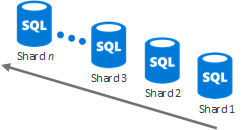

# Some assembly requiredSome assembly required

 **Summary:** Get the details on the set of cloud storage options that you can use to create your custom storage solution.**Summary:** Get the details on the set of cloud storage options that you can use to create your custom storage solution.
  
"Some assembly required " storage solutions:"Some assembly required " storage solutions:
  
- Use existing services as a starting point for your storage solution.Use existing services as a starting point for your storage solution.
    
- Require some configuration or coding.Require some configuration or coding.
    
- Can be customized to fit your needs.Can be customized to fit your needs.
    
The following sections describe the details of each "Some assembly required" storage solution.The following sections describe the details of each "Some assembly required" storage solution.
  
## Azure Content Delivery NetworkAzure Content Delivery Network

### 기능Features

- Advanced and real time analyticsAdvanced and real time analytics
    
- Robust security against DDoSRobust security against DDoS
    
- Gets content automatically from an Azure Website or Azure Cloud Service once you set up the integrationGets content automatically from an Azure Website or Azure Cloud Service once you set up the integration
    
- New partnership with AkamaiNew partnership with Akamai
    
- Can handle sudden traffic spikes and heavy loadsCan handle sudden traffic spikes and heavy loads
    
### Common usesCommon uses

- Distribute audio, video, applications, images, and other files faster and more reliably to customers by using the servers that are closest to themDistribute audio, video, applications, images, and other files faster and more reliably to customers by using the servers that are closest to them
    
### Key storage scenariosKey storage scenarios

- Manage dataManage data
    
- Manage videosManage videos
    
### 리소스Resources

For additional information, click [here](https://azure.microsoft.com/services/cdn/).For additional information, click [here](https://azure.microsoft.com/services/cdn/).
  
For cost information, click [here](https://azure.microsoft.com/pricing/details/cdn/).For cost information, click [here](https://azure.microsoft.com/pricing/details/cdn/).
  
## HdInsightHdInsight

### 기능Features

- Apache Hadoop distribution powered by the cloud A Data Lake serviceApache Hadoop distribution powered by the cloud A Data Lake service
    
- Scale to petabytes on demandScale to petabytes on demand
    
- Process unstructured and semi-structured data Develop in Java, .NET, and moreProcess unstructured and semi-structured data Develop in Java, .NET, and more
    
- Skip buying and maintaining hardwareSkip buying and maintaining hardware
    
- Connect on-premises Hadoop clusters with the cloudConnect on-premises Hadoop clusters with the cloud
    
- Flexibility to deploy arbitrary Hadoop projects through custom scripts (e.g. R, Giraph, Solr)Flexibility to deploy arbitrary Hadoop projects through custom scripts (e.g. R, Giraph, Solr)
    
### Common usesCommon uses

- Data analytics workloadsData analytics workloads
    
- In-memory data processing framework for big data (Spark)In-memory data processing framework for big data (Spark)
    
- Real-time stream processing (Storm)Real-time stream processing (Storm)
    
- Large transactional processing (OLTP) of non-relational data (HBase)Large transactional processing (OLTP) of non-relational data (HBase)
    
### Key storage scenariosKey storage scenarios

- Manage dataManage data
    
### 리소스Resources

For additional information, click [here](https://azure.microsoft.com/services/hdinsight/).For additional information, click [here](https://azure.microsoft.com/services/hdinsight/).
  
For cost information, click [here](https://azure.microsoft.com/pricing/details/hdinsight/).For cost information, click [here](https://azure.microsoft.com/pricing/details/hdinsight/).
  
## Azure SQL 데이터베이스Azure SQL Database

### 기능Features

- Optimized to reduce management and costsOptimized to reduce management and costs
    
- Automatic high availability, disaster recovery, and upgradeAutomatic high availability, disaster recovery, and upgrade
    
- Recommended for organizations managing hundreds or thousands of databases of up to 1 TB in sizeRecommended for organizations managing hundreds or thousands of databases of up to 1 TB in size
    
- Sharding techniques can split data across databases for increased storageSharding techniques can split data across databases for increased storage
    
- Stretch database with SQL Server 2016Stretch database with SQL Server 2016
    
### Common usesCommon uses

- New cloud-designed applications with relational dataNew cloud-designed applications with relational data
    
- Data processing over schematic, highly structured data sets with relationshipsData processing over schematic, highly structured data sets with relationships
    
- Spatial data or rich data typesSpatial data or rich data types
    
### Key storage scenariosKey storage scenarios

- Manage dataManage data
    
### Elastic databaseElastic database

Use the virtually unlimited resources of Azure SQL Database when:Use the virtually unlimited resources of Azure SQL Database when:
  
- The total amount of data is too large to fit within the constraints of a single database.The total amount of data is too large to fit within the constraints of a single database.
    
- The transaction throughput of the overall workload exceeds the capabilities of a single database.The transaction throughput of the overall workload exceeds the capabilities of a single database.
    
- Tenants require physical isolation from each other, so separate databases are needed for each tenant.Tenants require physical isolation from each other, so separate databases are needed for each tenant.
    
- Different sections of a database need to reside in different geographies for compliance, performance, or geopolitical reasons.Different sections of a database need to reside in different geographies for compliance, performance, or geopolitical reasons.
    
With vertical scaling, you can change Azure database performance level/edition or by using elastic database pools.With vertical scaling, you can change Azure database performance level/edition or by using elastic database pools.
  

  
With horizontal scaling, you can add new databases as needed.With horizontal scaling, you can add new databases as needed.
  

  
Click [here](https://docs.microsoft.com/azure/sql-database/sql-database-elastic-scale-introduction) for more information.Click [here](https://docs.microsoft.com/azure/sql-database/sql-database-elastic-scale-introduction) for more information.
  
### SQL Server 2016에 적용된 스트레치 데이터베이스Stretch Database with SQL Server 2016

Stretch database is a feature of SQL Server 2016 that allows you to transparently and securely move cold data, such as closed business data in a large table that contains customer order information, to a SQL Stretch database in Azure. When stretched, the contents of a SQL Server instance, a database, or even a single table is the combination of local data in SQL Server 2016 server and remote data in Azure. Data that becomes eligible for stretch is automatically moved to Azure by SQL Server 2016.Stretch database is a feature of SQL Server 2016 that allows you to transparently and securely move cold data, such as closed business data in a large table that contains customer order information, to a SQL Stretch database in Azure. When stretched, the contents of a SQL Server instance, a database, or even a single table is the combination of local data in SQL Server 2016 server and remote data in Azure. Data that becomes eligible for stretch is automatically moved to Azure by SQL Server 2016.
  

  
User queries that include the historical data are transparently forwarded to Azure SQL Stretch database. The queries do not need to be re-written, even though the table is stretched.User queries that include the historical data are transparently forwarded to Azure SQL Stretch database. The queries do not need to be re-written, even though the table is stretched.
  
Stretch database provides a cost-effective option for long-term storage and transparent access to historical data. It also solves performance and availability problems that arise when tables become very large.Stretch database provides a cost-effective option for long-term storage and transparent access to historical data. It also solves performance and availability problems that arise when tables become very large.
  
Click [here](https://msdn.microsoft.com/library/dn935011.aspx) for more information.Click [here](https://msdn.microsoft.com/library/dn935011.aspx) for more information.
  
### 리소스Resources

For additional information, click [here](http://azure.microsoft.com/services/sql-database/).For additional information, click [here](http://azure.microsoft.com/services/sql-database/).
  
For cost information, click [here](http://azure.microsoft.com/pricing/details/sql-database/).For cost information, click [here](http://azure.microsoft.com/pricing/details/sql-database/).
  
## Azure Cosmos DBAzure Cosmos DB

### 기능Features

- Guaranteed low latency, 99.99% availability SLA with limitless, elastic scale of storage and throughputGuaranteed low latency, 99.99% availability SLA with limitless, elastic scale of storage and throughput
    
- All data is globally replicated across any number of regions with transparent failover and four well-defined consistency levelsAll data is globally replicated across any number of regions with transparent failover and four well-defined consistency levels
    
- Automatically indexes all your data without requiring schemas or secondary indicesAutomatically indexes all your data without requiring schemas or secondary indices
    
- Rich SQL and JavaScript queries and multi-item transactionsRich SQL and JavaScript queries and multi-item transactions
    
### Common usesCommon uses

- IoT, Mobile and SocialIoT, Mobile and Social
    
- 게임Gaming
    
- 정품Retail
    
- Content managementContent management
    
### Key storage scenariosKey storage scenarios

- Manage dataManage data
    
### Cosmos DB vs. Azure Tables vs. Azure SQL DatabaseCosmos DB vs. Azure Tables vs. Azure SQL Database

Common attributes of Cosmos DB, Azure Table Storage, and Azure SQL Database:Common attributes of Cosmos DB, Azure Table Storage, and Azure SQL Database:
  
- 99.99 availability SLA99.99 availability SLA
    
- Fully managed database servicesFully managed database services
    
- ISO 27001, HIPAA and EU Model Clauses CompliantISO 27001, HIPAA and EU Model Clauses Compliant
    
The following table shows the uncommon attributes of Azure Cosmos DB, Azure Table Storage, and Azure SQL Database.The following table shows the uncommon attributes of Azure Cosmos DB, Azure Table Storage, and Azure SQL Database.
  

  
### 리소스Resources

자세한 내용은 [여기](http://azure.microsoft.com/services/documentdb/)합니다.For additional information, click [here](http://azure.microsoft.com/services/documentdb/).
  
For cost information, click [here](http://azure.microsoft.com/pricing/details/documentdb/).For cost information, click [here](http://azure.microsoft.com/pricing/details/documentdb/).
  
## Azure Media ServicesAzure Media Services

### 기능Features

- 라이브 및 배율로 VOD (주문형) 배달에 비디오Live and video on demand (VOD) delivery with scale
    
- Highly available encoding and streamingHighly available encoding and streaming
    
- Supports Flash, iOS, Android, HTML5, and XboxSupports Flash, iOS, Android, HTML5, and Xbox
    
- Studio-certified DRM supportStudio-certified DRM support
    
- Rich content monetizationRich content monetization
    
- Broad ecosystem of pre-integrated partnersBroad ecosystem of pre-integrated partners
    
### Common usesCommon uses

- Encode, store, and stream audio and video at scaleEncode, store, and stream audio and video at scale
    
- Real time streaming and VODReal time streaming and VOD
    
- Streamlined video content managementStreamlined video content management
    
### Key storage scenariosKey storage scenarios

- Manage videosManage videos
    
### 리소스Resources

For additional information, click [here](https://azure.microsoft.com/services/media-services/).For additional information, click [here](https://azure.microsoft.com/services/media-services/).
  
For cost information, click [here](http://azure.microsoft.com/pricing/details/media-services/).For cost information, click [here](http://azure.microsoft.com/pricing/details/media-services/).
  
## Azure 액세스 캐시Azure Redis Cache

### 기능Features

- Secure, dedicated Redis server with high-availability with data replication and failover managed by MicrosoftSecure, dedicated Redis server with high-availability with data replication and failover managed by Microsoft
    
- Recommended for any app needing high-throughputRecommended for any app needing high-throughput
    
- Available in sizes up to 530 GB and beyond (with Premium and automatic sharding)Available in sizes up to 530 GB and beyond (with Premium and automatic sharding)
    
- 지 속성 액세스 지속 되는 메모리에 캐시 된 데이터를 Azure 저장소Redis Persistence persists in-memory cached data to Azure Storage
    
- 액세스 클러스터링 최대 눈금 및 처리량을 달성할 수 있습니다.Redis Clustering allows you to achieve maximum scale and throughput
    
- Azure 가상 네트워크를 지 원하는 향상 된 보안 및 네트워크 격리Enhanced security and network isolation with Azure Virtual Network support
    
### 일반적으로 사용Common uses

- Azure Cosmos DB Azure SQL 데이터베이스 등의 모든 저장소 서비스의 데이터에 대 한 역방향 조회Reverse lookup for data in any storage service in Azure, such as Cosmos DB and Azure SQL Database
    
- Synchronized content from other data storesSynchronized content from other data stores
    
### 키 저장소 시나리오Key storage scenarios

- 데이터 캐시Cache data
    
- 처리량이 많은 응용 프로그램에 대 한 메시지 브로커Message broker for high-throughput applications
    
### 리소스Resources

자세한 내용은 [여기](http://azure.microsoft.com/services/cache/)합니다.For additional information, click [here](http://azure.microsoft.com/services/cache/).
  
비용 정보에 대 한 클릭 [여기](http://azure.microsoft.com/pricing/details/cache/)합니다.For cost information, click [here](http://azure.microsoft.com/pricing/details/cache/).
  
## Azure VM에 SQL Server 설치SQL Server on an Azure VM

### 기능Features

- SQL Server는 Azure 가상 컴퓨터에 설치 된 응용 프로그램으로 실행SQL Server running as an installed application on an Azure virtual machine
    
- SQL Server를 사용한 갤러리 이미지를 설치 하거나 직접 SQL 서버 라이선스를 가져올 사용Use a gallery image with SQL Server installed or bring your own SQL Server license
    
### 일반적으로 사용Common uses

- 응용 프로그램에 대 한 데이터를 관리 합니다.Manage data for applications
    
### 키 저장소 시나리오Key storage scenarios

- 데이터 관리Manage data
    
### 리소스Resources

자세한 내용은 [여기](http://azure.microsoft.com/services/virtual-machines/)합니다.For additional information, click [here](http://azure.microsoft.com/services/virtual-machines/).
  
비용 정보에 대 한 클릭 [여기](http://azure.microsoft.com/pricing/details/virtual-machines/)합니다.For cost information, click [here](http://azure.microsoft.com/pricing/details/virtual-machines/).
  
## StorSimpleStorSimple

### 기능Features

- 확장성, 엔터프라이즈 하이브리드 SAN 저장소 SSD HDD와 온-프레미스 하이브리드 저장소 배열에 클라우드 저장소 솔루션의 통합 된 확장으로Scalable, enterprise hybrid SAN storage with SSD and HDD in the on-premises hybrid storage array, with cloud storage as an integrated extension of the solution
    
- 인라인 중복 제거, 압축, 자동 계층으로 구성 하 고 구조화 되지 않은 암호화 및 반 구조화 된 데이터Inline deduplication, compression, automatic tiering, and encryption unstructured and semi structured data
    
- 클라우드 스냅숏을 사용 하 여 자동화 된 오프 사이트 데이터 보호Automated offsite data protection using cloud snapshots
    
- 매우 효율적이 고 위치에 관계 없이 재해 복구Highly-efficient, location-independent disaster recovery
    
- Azure의 StorSimple 가상 기기를 사용 하 여 엔터프라이즈 데이터에 대 한 데이터 모바일 기능Data mobility for enterprise data with StorSimple Virtual Appliance in Azure
    
### 일반적으로 사용Common uses

- 파일 공유, 보관 및 기타 데이터 저장소와 관련 된 데이터 증가세를 관리 합니다.Manage data growth related to file shares, archives, and other data repositories
    
- 파일 공유, 가상 컴퓨터, SQL, 및 SharePoint (원격 Blob 저장소를 사용 하 여)에 대 한 오프 사이트 데이터 보호 및 재해 복구Offsite data protection and disaster recovery for file shares, virtual machines, SQL, and SharePoint (using Remote Blob Storage)
    
- Azure의 데이터를 복제 하 고 비즈니스 민첩성 향상을 클라우드 스냅숏을 활용합니다Utilize cloud snapshots to clone data in Azure and increase business agility
    
### 키 저장소 시나리오Key storage scenarios

- 데이터 관리Manage data
    
- 공동 작업Collaborate
    
### 리소스Resources

자세한 내용은 [여기](http://azure.microsoft.com/services/storsimple/)합니다.For additional information, click [here](http://azure.microsoft.com/services/storsimple/).
  
비용 정보에 대 한 클릭 [여기](http://azure.microsoft.com/pricing/details/storsimple/)합니다.For cost information, click [here](http://azure.microsoft.com/pricing/details/storsimple/).
  
## SQL azure 데이터 웨어하우스Azure SQL Data Warehouse

### 기능Features

- 최대 동시 쿼리 32 페타바이트를 조정 하는 탄력적 데이터웨어하우스Elastic data warehouse that scales to petabytes Up to 32 concurrent queries
    
- 많은 양의 fast 사용 하 여 구조화 된 데이터 관리 분석에서 동적으로 증가 하 고 축소 compute (초)Manage large volumes of structured data with fast analytics Dynamically grow and shrink compute in seconds
    
- 투명 한 데이터 암호화를 지원합니다.Supports Transparent Data Encryption
    
- 7 일 동안 8 시간 마다 백업Backed up every 8 hours for 7 days
    
### 일반적으로 사용Common uses

- 판매 보고서Sales reports
    
- 사용 현황 보고서Usage reports
    
- 많은 양의 데이터Lots of data
    
### 키 저장소 시나리오Key storage scenarios

- 데이터 관리Manage data
    
### 리소스Resources

자세한 내용은 [여기](https://azure.microsoft.com/services/sql-data-warehouse/)합니다.For additional information, click [here](https://azure.microsoft.com/services/sql-data-warehouse/).
  
비용 정보에 대 한 클릭 [여기](https://azure.microsoft.com/pricing/details/sql-data-warehouse/)합니다.For cost information, click [here](https://azure.microsoft.com/pricing/details/sql-data-warehouse/).
  
## Azure 데이터 호수 저장소Azure Data Lake Store

### 기능Features

- 큰 데이터 분석 작업에 대 한 하이퍼 규모 리포지토리A hyper-scale repository for big data analytics workloads
    
- 클라우드를 위한 Hadoop 분산 파일 시스템A Hadoop Distributed File System for the cloud
    
- 파일 크기에 고정된 제한 없음No fixed limits on file size
    
- 계정 크기에 고정된 제한 없음No fixed limits on account size
    
- 원시 형식으로 구조화 되지 않은 및 구조화 된 데이터Unstructured and structured data in their native format
    
- 분석 성능을 향상 시키기 위해 대규모 처리량Massive throughput to increase analytic performance
    
- 높은 내구성, 가용성 및 안정성 (99.9% 엔터프라이즈급 SLA 및 24/7 지원)High durability, availability, and reliability (99.9% enterprise-grade SLA and 24/7 support)
    
- Azure Active Directory 액세스 제어Azure Active Directory access control
    
### 일반적으로 사용Common uses

- 모든 유형의 한곳에서 수집한 데이터를 저장 하려면 엔터프라이즈 수준 리포지토리Enterprise-wide repository to store every type of data collected in a single place
    
### 키 저장소 시나리오Key storage scenarios

- 데이터 관리Manage data
    
### 리소스Resources

자세한 내용은 [여기](https://azure.microsoft.com/services/data-lake-store/)합니다.For additional information, click [here](https://azure.microsoft.com/services/data-lake-store/).
  
비용 정보에 대 한 클릭 [여기](https://azure.microsoft.com/pricing/details/data-lake-store/)합니다.For cost information, click [here](https://azure.microsoft.com/pricing/details/data-lake-store/).
  
## 다음 단계Next step

클라우드 저장소를 [처음부터 작성](build-from-the-ground-up.md) 옵션을 검토 합니다.Review the [Build from the ground up](build-from-the-ground-up.md) cloud storage options.
  
## See AlsoSee Also

[엔터프라이즈 설계자 용 Microsoft 클라우드 저장소Microsoft Cloud Storage for Enterprise Architects](microsoft-cloud-storage-for-enterprise-architects.md)
  
[Microsoft 클라우드 IT 아키텍처 리소스Microsoft Cloud IT architecture resources](microsoft-cloud-it-architecture-resources.md)

[Microsoft의 엔터프라이즈 클라우드 로드맵: IT 의사 결정권자를 위한 리소스Microsoft's Enterprise Cloud Roadmap: Resources for IT Decision Makers](https://sway.com/FJ2xsyWtkJc2taRD)

