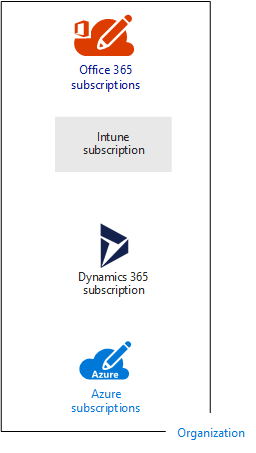
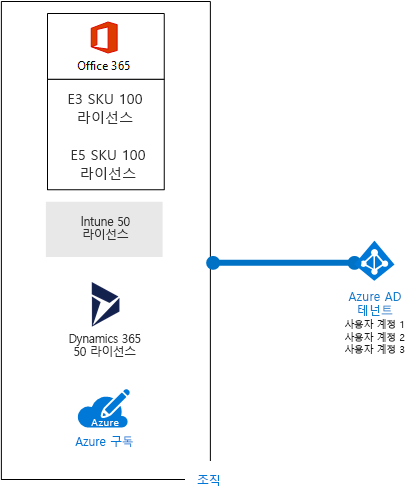

# Microsoft 클라우드 제품용 구독, 라이선스, 계정 및 테넌트Subscriptions, licenses, accounts, and tenants for Microsoft's cloud offerings

 **요약:** Microsoft의 클라우드 제품에서 조직, 구독, 라이선스, 사용자 계정 및 테넌트의 관계를 이해합니다.**Summary:** Understand the relationships of organizations, subscriptions, licenses, user accounts, and tenants across Microsoft's cloud offerings.
  
Microsoft는 해당 클라우드 제품 간에 일관된 ID 사용 및 요금 청구를 위해 조직, 구독, 라이선스 및 사용자 계정을 포함하는 계층 구조를 제공합니다.Microsoft provides a hierarchy of organizations, subscriptions, licenses, and user accounts for consistent use of identities and billing across its cloud offerings:
  
- Microsoft Office 365Microsoft Office 365
    
    자세한 내용은 [비즈니스 요금제 및 가격 책정](https://products.office.com/business/compare-office-365-for-business-plans)을 참조하세요.See [business plans and pricing](https://products.office.com/business/compare-office-365-for-business-plans) for more information.
    
- Microsoft AzureMicrosoft Azure
    
    자세한 내용은 [Azure 가격 책정](https://azure.microsoft.com/pricing/)을 참조하세요.See [Azure pricing](https://azure.microsoft.com/pricing/) for more information.
    
- Microsoft Intune 및 EMS(Enterprise Mobility + Security)Microsoft Intune and the Enterprise Mobility + Security (EMS)
    
    자세한 내용은 [Intune 가격 책정](https://www.microsoft.com/cloud-platform/microsoft-intune-pricing)을 참조하세요.See [Intune pricing](https://www.microsoft.com/cloud-platform/microsoft-intune-pricing) for more information.
    
- Microsoft Dynamics 365Microsoft Dynamics 365
    
    자세한 내용은 [Dynamics 365 가격 책정](https://dynamics.microsoft.com/)을 참조하세요.See [Dynamics 365 pricing](https://dynamics.microsoft.com/) for more information.
    
## 계층 구조의 요소Elements of the hierarchy

다음은 계층 구조의 요소입니다.Here are the elements of the hierarchy:
  
### 조직Organization

조직은 Microsoft 클라우드 서비스를 사용하는 비즈니스 엔터티를 나타내며, 일반적으로 하나 이상의 공용 DNS(Domain Name System) 도메인 이름(예: contoso.com)으로 식별됩니다. 조직은 구독을 위한 컨테이너입니다.An organization represents a business entity that is using Microsoft cloud offerings, typically identified by one or more public Domain Name System (DNS) domain names, such as contoso.com. The organization is a container for subscriptions.
  
### 구독Subscriptions

구독은 하나 이상의 Microsoft 클라우드 플랫폼 또는 서비스를 사용하기 위한 Microsoft와의 계약으로, 사용자 단위 라이선스 요금 또는 클라우드 기반 리소스 사용량을 기준으로 요금이 청구됩니다. Microsoft의 SaaS(Software as a Service) 기반 클라우드 제품(Office 365, Intune/EMS 및 Dynamics 365)에는 사용자 단위 라이선스 요금이 청구됩니다. Microsoft의 PaaS(Platform as a Service) 및 IaaS(Infrastructure as a Service) 클라우드 제품(Azure)은 클라우드 리소스 사용량을 기준으로 요금이 청구됩니다.A subscription is an agreement with Microsoft to use one or more Microsoft cloud platforms or services, for which charges accrue based on either a per-user license fee or on cloud-based resource consumption. Microsoft's Software as a Service (SaaS)-based cloud offerings (Office 365, Intune/EMS, and Dynamics 365) charge per-user license fees. Microsoft's Platform as a Service (PaaS) and Infrastructure as a Service (IaaS) cloud offerings (Azure) charge based on cloud resource consumption.
  
평가판 구독을 사용할 수도 있지만, 일정 기간이 지나거나 이용 요금이 다 사용된 후에는 구독이 만료됩니다. 평가판 구독을 유료 구독으로 변환할 수 있습니다.You can also use a trial subscription, but the subscription expires after a specific amount of time or consumption charges. You can convert a trial subscription to a paid subscription.
  
조직에서는 Microsoft의 클라우드 서비스용 구독이 여러 개 있을 수 있습니다. 그림 1에 예가 나와 있습니다.Organizations can have multiple subscriptions for Microsoft's cloud offerings. Figure 1 shows an example.
  
**그림 1: 여러 개의 조직용 구독 예****Figure 1: Example of multiple subscriptions for an organization**

  
그림 1에서는 여러 개의 Office 365 구독, 1개의 Intune 구독, Dynamics 365 구독 및 여러 개의 Azure 구독이 있는 단일 조직을 보여줍니다.Figure 1 shows a single organization that has multiple Office 365 subscriptions, an Intune subscription, a Dynamics 365 subscription, and multiple Azure subscriptions.
  
### 라이선스Licenses

Microsoft의 SaaS 클라우드 서비스의 경우 라이선스가 있으면 특정 사용자 계정이 클라우드 서비스 제품을 사용할 수 있습니다. 구독의 일부로 고정 월별 요금이 청구됩니다. 관리자는 구독의 개별 사용자 계정에 라이선스를 할당합니다. 그림 2의 예에서 Contoso Corporation에는 100개 라이선스가 있는 Office 365 Enterprise E5 구독이 있으므로 최대 100개의 개별 사용자 계정이 Enterprise E5 기능 및 서비스를 사용할 수 있습니다.For Microsoft's SaaS cloud offerings, a license allows a specific user account to use the services of the cloud offering. You are charged a fixed monthly fee as part of your subscription. Administrators assign licenses to individual user accounts in the subscription. For the example in Figure 2, the Contoso Corporation has an Office 365 Enterprise E5 subscription with 100 licenses, which allows to up to 100 individual user accounts to use Enterprise E5 features and services.
  
**그림 2: 조직을 위한 SaaS 기반 구독에 포함된 라이선스****Figure 2: Licenses within the SaaS-based subscriptions for an organization**

  
Azure PaaS 기반 클라우드 서비스의 경우 소프트웨어 라이선스가 서비스 가격에 기본적으로 포함됩니다.For Azure PaaS-based cloud services, software licenses are built into the service pricing.
  
Azure IaaS 기반 가상 머신의 경우 가상 머신 이미지에 설치되어 있는 소프트웨어 또는 이미지를 사용하기 위한 추가 라이선스가 필요할 수도 있습니다. 일부 가상 머신 이미지는 설치된 소프트웨어의 라이선스 버전을 가지며 서버에 대한 분당 요금에 해당 요금이 포함됩니다. 제공된 예제는 SQL Server 2014 및 SQL Server 2016에 대한 가상 머신 이미지입니다.For Azure IaaS-based virtual machines, additional licenses to use the software or application installed on a virtual machine image might be required. Some virtual machine images have licensed versions of software installed and the cost is included in the per-minute rate for the server. Examples are the virtual machine images for SQL Server 2014 and SQL Server 2016. 
  
일부 가상 머신 이미지에는 평가판 버전의 응용 프로그램이 설치되어 있고 평가 기간 이후에도 사용하려면 추가 소프트웨어 응용 프로그램 라이선스가 필요합니다. 예를 들어, SharePoint Server 2016 평가판 가상 머신 이미지에는 사전 설치된 SharePoint Server 2016 평가판이 포함되어 있습니다. 내역 만료일 이후에도 SharePoint Server 2016을 계속 사용하려면 Microsoft에서 SharePoint Server 2016 라이선스 및 클라이언트 라이선스를 구입해야 합니다. 이러한 청구 금액은 Azure 구독과는 별개이며, 가상 머신을 실행하는 분당 요금은 여전히 부과됩니다.Some virtual machine images have trial versions of applications installed and need additional software application licenses for use beyond the trial period. For example, the SharePoint Server 2016 Trial virtual machine image includes a trial version of SharePoint Server 2016 pre-installed. To continue using SharePoint Server 2016 after the trail expiration date, you must purchase a SharePoint Server 2016 license and client licenses from Microsoft. These charges are separate from the Azure subscription and the per-minute rate to run the virtual machine still applies.
  
### 사용자 계정User accounts

모든 Microsoft의 클라우드 서비스에 대한 사용자 계정은 사용자 계정 및 그룹을 포함하는 Azure AD(Active Directory) 테넌트에 저장됩니다. Azure AD 테넌트는 Windows 서버 기반 서비스인 Azure AD Connect를 사용하여 기존 Windows Server AD 계정과 동기화될 수 있습니다. 이것을 DirSync(디렉터리 동기화)라고 합니다.User accounts for all of Microsoft's cloud offerings are stored in an Azure Active Directory (AD) tenant, which contains user accounts and groups. An Azure AD tenant can be synchronized with your existing Windows Server AD accounts using Azure AD Connect, a Windows server-based service. This is known as directory synchronization (DirSync).
  
그림 3은 조직 계정이 포함된 일반적인 Azure 테넌트를 사용하는 조직의 여러 구독 예를 보여줍니다.Figure 3 shows an example of multiple subscriptions of an organization using a common Azure AD tenant that contains the organization's accounts.
  
**그림 3: 동일한 Azure 테넌트를 사용하는 조직의 여러 구독****Figure 3: Multiple subscriptions of an organization that use the same Azure AD tenant**

  
### 테넌트Tenants

SaaS 클라우드 제품의 경우 테넌트는 클라우드 서비스를 제공하는 서버가 보관된 지역 위치입니다. 예를 들어, Contoso Corporation은 파리 본사에 있는 15,000명의 근로자를 위해 유럽 지역에서 Office 365, EMS 및 Dynamics 365 테넌트를 호스트하도록 선택했습니다.For SaaS cloud offerings, the tenant is the regional location that houses the servers providing cloud services. For example, the Contoso Corporation chose the European region to host its Office 365, EMS, and Dynamics 365 tenants for the 15,000 workers in their Paris headquarters.
  
Azure IaaS에 호스트된 Azure PaaS 서비스 및 가상 머신 기반 워크로드는 전 세계의 모든 Azure 데이터 센터에서 테넌시를 둘 수 있습니다. Azure PaaS 앱 또는 서비스를 만들 때는 위치로 사용되고, IaaS 워크로드의 요소로도 알려진 Azure 데이터 센터를 지정할 수 있습니다.Azure PaaS services and virtual machine-based workloads hosted in Azure IaaS can have tenancy in any Azure datacenter across the world. You specify the Azure datacenter, known as the location, when you create the Azure PaaS app or service or element of an IaaS workload.
  
Azure AD 테넌트는 계정 및 그룹에 포함된 Azure AD의 특정 인스턴스입니다. Office 365, Dynamics 365 또는 Intune/EMS의 유료 또는 평가판 구독에는 무료 Azure AD 테넌트가 포함되어 있습니다. 이 Azure AD 테넌트는 다른 Azure 서비스를 포함하지 않으며, Azure 평가판 또는 유료 구독과 다릅니다.An Azure AD tenant is a specific instance of Azure AD containing accounts and groups. Paid or trial subscriptions of Office 365, Dynamics 365, or Intune/EMS include a free Azure AD tenant. This Azure AD tenant does not include other Azure services and is not the same as an Azure trial or paid subscription.
  
### 계층 구조의 요약Summary of the hierarchy

간단한 설명은 다음과 같습니다.Here is a quick recap:
  
- 하나의 조직에 구독이 여러 개일 수 있습니다.An organization can have multiple subscriptions
    
  - 하나의 구독에 라이선스가 여러 개 있을 수 있습니다.A subscription can have multiple licenses
    
  - 라이선스를 개별 사용자 계정에 할당할 수 있습니다.Licenses can be assigned to individual user accounts
    
  - 사용자 계정은 Azure AD테넌트에 저장됩니다.User accounts are stored in an Azure AD tenant
    
조직, 구독, 라이선스 및 사용자 계정의 관계를 보여주는 예제는 다음과 같습니다.Here is an example of the relationship of organizations, subscriptions, licenses, and user accounts:
  
- 공용 도메인 이름으로 식별되는 조직An organization identified by its public domain name.
    
  - 사용자 라이선스가 있는 Office 365 Enterprise E3 구독An Office 365 Enterprise E3 subscription with user licenses.
    
    사용자 라이선스가 있는 Office 365 Enterprise E5 구독An Office 365 Enterprise E5 subscription with user licenses.
    
    사용자 라이선스가 있는 EMS 구독An EMS subscription with user licenses.
    
    사용자 라이선스가 있는 Dynamics 365 구독A Dynamics 365 subscription with user licenses.
    
    여러 Azure 구독Multiple Azure subscriptions.
    
  - 일반적인 Azure AD 테넌트에 있는 조직의 사용자 계정The organization's user accounts in a common Azure AD tenant.
    
여러 Microsoft 클라우드 서비스 구독이 공통 ID 공급자의 역할을 하는 동일한 Azure 테넌트를 사용할 수 있습니다. 온-프레미스 Windows Server AD의 동기화된 계정을 포함하는 중앙 Azure AD 테넌트는 조직에 클라우드 기반 IDaaS(Identity as a Service)를 제공합니다. 이 내용은 그림 4에 나와 있습니다.Multiple Microsoft cloud offering subscriptions can use the same Azure AD tenant that acts as a common identity provider. A central Azure AD tenant that contains the synchronized accounts of your on-premises Windows Server AD provides cloud-based Identity as a Service (IDaaS) for your organization. This is shown in Figure 4.
  
**그림 4: 조직에 대한 동기화된 온-프레미스 계정 및 IDaaS****Figure 4: Synchronized on-premises accounts and IDaaS for an organization**

  
그림 4는 일반적인 Azure AD 테넌트가 Azure AD Domains Services를 사용하는 Microsoft의 SaaS 클라우드 서비스, Azure PaaS 앱 및 Azure IaaS의 가상 머신에서 사용되는 방법을 보여 줍니다. Azure AD Connect는 온-프레미스 Windows Server AD 포리스트를 Azure AD 테넌트와 동기화합니다.Figure 4 shows how a common Azure AD tenant is utilized by Microsoft's SaaS cloud offerings, Azure PaaS apps, and virtual machines in Azure IaaS that use Azure AD Domain Services. Azure AD Connect synchronizes the on-premises Windows Server AD forest with the Azure AD tenant.
  
Microsoft 클라우드 제품 간의 ID 통합에 대한 자세한 내용은 [Microsoft Cloud Identity for Enterprise Architects](https://aka.ms/cloudarchidentity)를 참조하세요.For more information about identity integration across Microsoft's cloud offerings, see [Microsoft Cloud Identity for Enterprise Architects](https://aka.ms/cloudarchidentity).
  
## 여러 Microsoft 클라우드 서비스에 대한 구독 결합Combining subscriptions for multiple Microsoft cloud offerings

다음 표에서는 한 가지 유형의 클라우드 서비스에 대한 구독이 이미 있고(첫 번째 열 아래쪽에 레이블 참조), 다른 클라우드 서비스에 대한 구독을 추가하는 경우(열 가로 방향으로) 여러 Microsoft 클라우드 서비스를 결합하는 방법을 설명합니다.The following table describes how you can combine multiple Microsoft cloud offerings based on already having a subscription for one type of cloud offering (the labels going down the first column) and adding a subscription for a different cloud offering (going across the columns).
  
||**Office 365****Office 365**|**Azure****Azure**|**Intune/EMS****Intune/EMS**|**Dynamics 365****Dynamics 365**|
|:-----|:-----|:-----|:-----|:-----|
|**Office 365****Office 365**   |해당 없음NA    |Azure Portal에서 조직에 Azure 구독을 추가합니다.You add an Azure subscription to your organization from the Azure portal.    |Office 365 포털에서 조직에 Intune/EMS 구독을 추가합니다.You add an Intune/EMS subscription to your organization from the Office 365 portal.    |Office 365 포털에서 조직에 Dynamics 365 구독을 추가합니다.You add a Dynamics 365 subscription to your organization from the Office 365 portal.    |
|**Azure****Azure**   |조직에 Office 365 구독을 추가합니다.You add an Office 365 subscription to your organization.    |해당 없음NA    |조직에 Intune/EMS 구독을 추가합니다.You add an Intune/EMS subscription to your organization.    |조직에 Dynamics 365 구독을 추가합니다.You add a Dynamics 365 subscription to your organization.    |
|**Intune/EMS****Intune/EMS**   |조직에 Office 365 구독을 추가합니다.You add an Office 365 subscription to your organization.    |Azure Portal에서 조직에 Azure 구독을 추가합니다.You add an Azure subscription to your organization from the Azure portal.    |해당 없음NA    |조직에 Dynamics 365 구독을 추가합니다.You add a Dynamics 365 subscription to your organization.    |
|**Dynamics 365****Dynamics 365**   |조직에 Office 365 구독을 추가합니다.You add an Office 365 subscription to your organization.    |Azure Portal에서 조직에 Azure 구독을 추가합니다.You add an Azure subscription to your organization from the Azure portal.    |조직에 Intune/EMS 구독을 추가합니다.You add an Intune/EMS subscription to your organization.    |해당 없음NA    |
   
Office 365 관리 센터를 사용하면 Microsoft SaaS 기반 서비스를 위해 조직에 구독을 쉽게 추가할 수 있습니다.An easy way to add subscriptions to your organization for Microsoft SaaS-based services is through the Office 365 Admin center:
  
1. 전역 관리자 계정을 사용하여 Office 365 포털([https://portal.office.com](https://portal.office.com))에 로그인하고 **관리자**를 클릭합니다.Sign in to the Office 365 portal ([https://portal.office.com](https://portal.office.com)) with your global administrator account, and then click **Admin**.
    
2. **관리 센터** 홈페이지의 왼쪽 탐색 창에서 **청구**를 클릭하고 **서비스 구매**를 클릭합니다.From the left navigation of the **Admin center** home page, click **Billing**, and then **Purchase services**.
    
3. **서비스 구매** 페이지에서 새 구독을 구입합니다.On the **Purchase services** page, purchase your new subscriptions.
    
Office 365 관리 센터는 SaaS 기반 클라우드 서비스에 대한 새 구독에 Office 365 구독의 조직 및 Azure 테넌트를 할당합니다.The Office 365 Admin center assigns the organization and Azure AD tenant of your Office 365 subscription to the new subscriptions for SaaS-based cloud offerings.
  
Office 365 구독과 동일한 조직 및 Azure 테넌트를 갖는 Azure 구독을 추가하려면To add an Azure subscription with the same organization and Azure AD tenant as your Office 365 subscription:
  
1. Office 365 전역 관리자 계정을 사용하여 Azure Portal 포털([https://portal.azure.com](https://portal.azure.com))에 로그인합니다.Sign in to the Azure portal ([https://portal.azure.com](https://portal.azure.com)) with your Office 365 global administrator account.
    
2. 왼쪽 탐색 모음에서 **구독**을 클릭하고 **추가**를 클릭합니다.In the left navigation, click **Subscriptions**, and then click **Add**.
    
3. **구독 추가** 페이지에서 서비스를 선택하고 결제 정보 및 계약을 완료합니다.On the **Add subscription** page, select an offer and complete the payment information and agreement.
    
Azure 및 Office 365 구독으로 따로 구입했으며 Azure 구독에서 Office 365 Azure AD 테넌트에 액세스하려는 경우 [Office 365 테넌트를 Azure 구독에 연결](https://channel9.msdn.com/Series/Microsoft-Azure-Tutorials/Associate-an-Office-365-tenant-with-an-Azure-subscription)의 지침을 참조하세요.If you purchased Azure and Office 365 subscriptions separately and want to access the Office 365 Azure AD tenant from your Azure subscription, see the instructions in [Associate an Office 365 tenant with an Azure subscription](https://channel9.msdn.com/Series/Microsoft-Azure-Tutorials/Associate-an-Office-365-tenant-with-an-Azure-subscription).
  
## 참고 항목See Also

[Microsoft 클라우드 IT 아키텍처 리소스Microsoft Cloud IT architecture resources](microsoft-cloud-it-architecture-resources.md)
  
[클라우드 도입 TLG(테스트 랩 가이드)Cloud adoption Test Lab Guides (TLGs)](cloud-adoption-test-lab-guides-tlgs.md)
  
[Exchange, SharePoint, 비즈니스용 Skype 및 Lync에 대한 아키텍처 모델Architectural models for SharePoint, Exchange, Skype for Business, and Lync](architectural-models-for-sharepoint-exchange-skype-for-business-and-lync.md)
  
[하이브리드 솔루션Hybrid solutions](hybrid-solutions.md)
  
