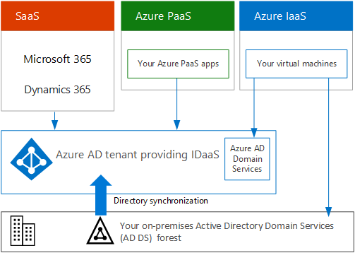

# Microsoft 클라우드 제품용 구독, 라이선스, 계정 및 테넌트Subscriptions, licenses, accounts, and tenants for Microsoft's cloud offerings

Microsoft는 해당 클라우드 제품 간에 일관된 ID 사용 및 요금 청구를 위해 조직, 구독, 라이선스 및 사용자 계정을 포함하는 계층 구조를 제공합니다.Microsoft provides a hierarchy of organizations, subscriptions, licenses, and user accounts for consistent use of identities and billing across its cloud offerings:
  
- Microsoft 365 및 Microsoft Office 365Microsoft 365 and Microsoft Office 365
- Microsoft AzureMicrosoft Azure
- Microsoft Dynamics 365Microsoft Dynamics 365

## 계층 구조의 요소Elements of the hierarchy

다음은 계층 구조의 요소입니다.Here are the elements of the hierarchy:
  
### 조직Organization

An organization represents a business entity that is using Microsoft cloud offerings, typically identified by one or more public Domain Name System (DNS) domain names, such as contoso.com.An organization represents a business entity that is using Microsoft cloud offerings, typically identified by one or more public Domain Name System (DNS) domain names, such as contoso.com. The organization is a container for subscriptions.The organization is a container for subscriptions.
  
### 구독Subscriptions

구독은 하나 혹은 이상의 Microsoft 클라우드 플랫폼 또는 서비스를 사용하기 위한 Microsoft와의 약정이며 사용자 단위 라이선스 요금이나 클라우드 기반 리소스 소비량을 기준으로 요금이 부과됩니다.A subscription is an agreement with Microsoft to use one or more Microsoft cloud platforms or services, for which charges accrue based on either a per-user license fee or on cloud-based resource consumption. 

- Microsoft의 SaaS (Software as a Service) 기반 클라우드 서비스 (Microsoft 365 및 Dynamics 365) 최종 사용자 사용권 수수료Microsoft's Software as a Service (SaaS)-based cloud offerings (Microsoft 365 and Dynamics 365) charge per-user license fees. 
- Microsoft의 서비스로서의 플랫폼 (PaaS) 및 서비스로서의 인프라 (IaaS) 클라우드 서비스는 (Azure) 클라우드 리소스 소비량을 기반으로 요금을 부과합니다.Microsoft's Platform as a Service (PaaS) and Infrastructure as a Service (IaaS) cloud offerings (Azure) charge based on cloud resource consumption.
 
You can also use a trial subscription, but the subscription expires after a specific amount of time or consumption charges.You can also use a trial subscription, but the subscription expires after a specific amount of time or consumption charges. You can convert a trial subscription to a paid subscription.You can convert a trial subscription to a paid subscription.
  
조직은 다수의 Microsoft의 클라우드 서비스를 구독할 수 있습니다.Organizations can have multiple subscriptions for Microsoft's cloud offerings. 그림 1에는 여러 Microsoft 365 구독, Dynamics 365 구독 및 여러 Azure 구독이 있는 단일 조직이 나와 있습니다.Figure 1 shows a single organization that has multiple Microsoft 365 subscriptions, a Dynamics 365 subscription, and multiple Azure subscriptions.

**그림 1: 여러 개의 조직용 구독 예****Figure 1: Example of multiple subscriptions for an organization**

  
### 라이선스Licenses

Microsoft의 SaaS 클라우드 제품의 경우 라이선스를 통해 특정 사용자 계정이 클라우드 서비스를 사용할 수 있도록 해줍니다.For Microsoft's SaaS cloud offerings, a license allows a specific user account to use the services of the cloud offering. 구독의 일부로서 구독자에게 고정 월별 요금이 청구됩니다.You are charged a fixed monthly fee as part of your subscription. 관리자는 구독의 개별 사용자 계정에 라이선스를 할당합니다.Administrators assign licenses to individual user accounts in the subscription. 그림 2의 예를 들어 Contoso Corporation에는 365 Microsoft 365 E5 기능 및 서비스를 사용 하기 위해 최대 100의 개별 사용자 계정에 대 한 100 라이선스가 포함 되어 있습니다.For the example in Figure 2, the Contoso Corporation has a Microsoft 365 E5 subscription with 100 licenses, which allows to up to 100 individual user accounts to use Microsoft 365 E5 features and services.
  
**그림 2: 조직을 위한 SaaS 기반 구독에 포함된 라이선스****Figure 2: Licenses within the SaaS-based subscriptions for an organization**

  
Azure PaaS 기반 클라우드 서비스의 경우 소프트웨어 라이선스가 서비스 가격에 기본적으로 포함됩니다.For Azure PaaS-based cloud services, software licenses are built into the service pricing.
  
For Azure IaaS-based virtual machines, additional licenses to use the software or application installed on a virtual machine image might be required.For Azure IaaS-based virtual machines, additional licenses to use the software or application installed on a virtual machine image might be required. Some virtual machine images have licensed versions of software installed and the cost is included in the per-minute rate for the server.Some virtual machine images have licensed versions of software installed and the cost is included in the per-minute rate for the server. Examples are the virtual machine images for SQL Server 2014 and SQL Server 2016.Examples are the virtual machine images for SQL Server 2014 and SQL Server 2016. 
  
Some virtual machine images have trial versions of applications installed and need additional software application licenses for use beyond the trial period.Some virtual machine images have trial versions of applications installed and need additional software application licenses for use beyond the trial period. For example, the SharePoint Server 2016 Trial virtual machine image includes a trial version of SharePoint Server 2016 pre-installed.For example, the SharePoint Server 2016 Trial virtual machine image includes a trial version of SharePoint Server 2016 pre-installed. To continue using SharePoint Server 2016 after the trial expiration date, you must purchase a SharePoint Server 2016 license and client licenses from Microsoft.To continue using SharePoint Server 2016 after the trial expiration date, you must purchase a SharePoint Server 2016 license and client licenses from Microsoft. These charges are separate from the Azure subscription and the per-minute rate to run the virtual machine still applies.These charges are separate from the Azure subscription and the per-minute rate to run the virtual machine still applies.
  
### 사용자 계정User accounts

모든 Microsoft 클라우드 서비스의 사용자 계정은 사용자 계정 및 그룹이 포함되어 있는 Azure AD (Azure 액티브 디렉터리) 테넌트에 저장됩니다.User accounts for all of Microsoft's cloud offerings are stored in an Azure Active Directory (Azure AD) tenant, which contains user accounts and groups. Azure AD 테넌트는 Windows server 기반의 서비스인 Azure AD Connect를 사용하여 기존의 AD DS (액티브 디렉터리 도메인 서비스) 계정과 동기화될 수 있습니다.An Azure AD tenant can be synchronized with your existing Active Directory Domain Services (AD DS) accounts using Azure AD Connect, a Windows server-based service. 이를 디렉터리 동기화라고 합니다.This is known as directory synchronization.
  
그림 3은 조직 계정이 포함된 일반적인 Azure 테넌트를 사용하는 조직의 여러 구독 예를 보여줍니다.Figure 3 shows an example of multiple subscriptions of an organization using a common Azure AD tenant that contains the organization's accounts.
  
**그림 3: 동일한 Azure 테넌트를 사용하는 조직의 여러 구독****Figure 3: Multiple subscriptions of an organization that use the same Azure AD tenant**

  
### 테넌트Tenants

SaaS 클라우드 제품의 경우 테 넌 트는 클라우드 서비스를 제공 하는 서버를 소유 하는 지역 위치입니다.For SaaS cloud offerings, the tenant is the regional location that houses the servers providing cloud services. 예를 들어 Contoso Corporation은 해당 파리 본사의 15000 작업자에 게 Microsoft 365, EMS 및 Dynamics 365 테 넌 트를 호스트 하기 위해 유럽 지역을 선택 했습니다.For example, the Contoso Corporation chose the European region to host its Microsoft 365, EMS, and Dynamics 365 tenants for the 15,000 workers in their Paris headquarters.
  
Azure PaaS services and virtual machine-based workloads hosted in Azure IaaS can have tenancy in any Azure datacenter across the world.Azure PaaS services and virtual machine-based workloads hosted in Azure IaaS can have tenancy in any Azure datacenter across the world. You specify the Azure datacenter, known as the location, when you create the Azure PaaS app or service or element of an IaaS workload.You specify the Azure datacenter, known as the location, when you create the Azure PaaS app or service or element of an IaaS workload.
  
Azure AD 테 넌 트는 계정과 그룹을 포함 하는 Azure AD의 특정 인스턴스입니다.An Azure AD tenant is a specific instance of Azure AD containing accounts and groups. Microsoft 365 또는 Dynamics 365의 유료 또는 평가판 구독에는 무료 Azure AD 테 넌 트가 포함 됩니다.Paid or trial subscriptions of Microsoft 365 or Dynamics 365 include a free Azure AD tenant. 이 Azure AD 테 넌 트에는 다른 Azure 서비스가 포함 되지 않으며 Azure 평가판 또는 유료 구독과 동일 하지 않습니다.This Azure AD tenant does not include other Azure services and is not the same as an Azure trial or paid subscription.
  
### 계층 구조의 요약Summary of the hierarchy

간단한 설명은 다음과 같습니다.Here is a quick recap:
  
- 하나의 조직에 구독이 여러 개일 수 있습니다.An organization can have multiple subscriptions
    
  - 하나의 구독에 라이선스가 여러 개 있을 수 있습니다.A subscription can have multiple licenses
    
  - 라이선스를 개별 사용자 계정에 할당할 수 있습니다.Licenses can be assigned to individual user accounts
    
  - 사용자 계정은 Azure AD테넌트에 저장됩니다.User accounts are stored in an Azure AD tenant
    
조직, 구독, 라이선스 및 사용자 계정의 관계를 보여주는 예제는 다음과 같습니다.Here is an example of the relationship of organizations, subscriptions, licenses, and user accounts:
  
- 공용 도메인 이름으로 식별되는 조직An organization identified by its public domain name.
    
  - 사용자 라이선스가 있는 Microsoft 365 E3 구독A Microsoft 365 E3 subscription with user licenses.
    
    사용자 라이선스가 있는 Microsoft 365 E5 구독A Microsoft 365 E5 subscription with user licenses.
    
    사용자 라이선스가 있는 Dynamics 365 구독A Dynamics 365 subscription with user licenses.
    
    여러 Azure 구독Multiple Azure subscriptions.
    
  - 일반적인 Azure AD 테넌트에 있는 조직의 사용자 계정The organization's user accounts in a common Azure AD tenant.
    
다수의 Microsoft 클라우드 서비스의 구독은 공통 ID제공자 역할을 하는 동일한 Azure AD 테넌트를 사용할 수 있습니다.Multiple Microsoft cloud offering subscriptions can use the same Azure AD tenant that acts as a common identity provider. 온-프레미스 AD DS의 동기화된 계정을 포함하는 중앙 Azure AD 테넌트는 조직에 클라우드 기반의 서비스로서의 ID (IDaaS)를 제공합니다.A central Azure AD tenant that contains the synchronized accounts of your on-premises AD DS provides cloud-based Identity as a Service (IDaaS) for your organization. 
  
**그림 4: 조직에 대한 동기화된 온-프레미스 계정 및 IDaaS****Figure 4: Synchronized on-premises accounts and IDaaS for an organization**

  
Figure 4 shows how a common Azure AD tenant is used by Microsoft's SaaS cloud offerings, Azure PaaS apps, and virtual machines in Azure IaaS that use Azure AD Domain Services.Figure 4 shows how a common Azure AD tenant is used by Microsoft's SaaS cloud offerings, Azure PaaS apps, and virtual machines in Azure IaaS that use Azure AD Domain Services. Azure AD Connect synchronizes the on-premises AD DS forest with the Azure AD tenant.Azure AD Connect synchronizes the on-premises AD DS forest with the Azure AD tenant.
  
## 여러 Microsoft 클라우드 서비스에 대한 구독 결합Combining subscriptions for multiple Microsoft cloud offerings

다음 표에서는 한 가지 유형의 클라우드 서비스에 대한 구독이 이미 있고(첫 번째 열 아래쪽에 레이블 참조), 다른 클라우드 서비스에 대한 구독을 추가하는 경우(열 가로 방향으로) 여러 Microsoft 클라우드 서비스를 결합하는 방법을 설명합니다.The following table describes how you can combine multiple Microsoft cloud offerings based on already having a subscription for one type of cloud offering (the labels going down the first column) and adding a subscription for a different cloud offering (going across the columns).
  
||**Microsoft 365****Microsoft 365**|**Azure****Azure**|**Dynamics 365****Dynamics 365**|
|:-----|:-----|:-----|:-----|:-----|
|**Microsoft 365****Microsoft 365**   |해당 없음NA    |Azure Portal에서 조직에 Azure 구독을 추가합니다.You add an Azure subscription to your organization from the Azure portal.    |Microsoft 365 관리 센터에서 조직에 Dynamics 365 구독을 추가합니다.You add a Dynamics 365 subscription to your organization from the Microsoft 365 admin center.    |
|**Azure****Azure**   |조직에 Microsoft 365 구독을 추가 합니다.You add a Microsoft 365 subscription to your organization.    |해당 없음NA    |조직에 Dynamics 365 구독을 추가합니다.You add a Dynamics 365 subscription to your organization.    |
|**Dynamics 365****Dynamics 365**   |조직에 Microsoft 365 구독을 추가 합니다.You add a Microsoft 365 subscription to your organization.    |Azure Portal에서 조직에 Azure 구독을 추가합니다.You add an Azure subscription to your organization from the Azure portal.    |해당 없음NA    |
   
관리 센터를 사용하면 Microsoft SaaS 기반 서비스를 위해 조직에 구독을 쉽게 추가할 수 있습니다.An easy way to add subscriptions to your organization for Microsoft SaaS-based services is through the admin center:
  
1. 글로벌 관리자 계정을 사용하여 Microsoft 365 관리 센터([https://admin.microsoft.com](https://admin.microsoft.com))에 로그인합니다.Sign in to the Microsoft 365 admin center ([https://admin.microsoft.com](https://admin.microsoft.com)) with your global administrator account.
    
2. **관리 센터** 홈페이지의 왼쪽 탐색 창에서 **청구**를 클릭하고 **서비스 구매**를 클릭합니다.From the left navigation of the **Admin center** home page, click **Billing**, and then **Purchase services**.
    
3. **서비스 구매** 페이지에서 새 구독을 구입합니다.On the **Purchase services** page, purchase your new subscriptions.
    
관리 센터는 SaaS 기반 클라우드 서비스에 대 한 새 구독에 대 한 Microsoft 365 구독의 조직 및 Azure 테 넌 트를 할당 합니다.The admin center assigns the organization and Azure AD tenant of your Microsoft 365 subscription to the new subscriptions for SaaS-based cloud offerings.
  
Microsoft 365 구독으로 동일한 조직 및 Azure AD 테 넌 트를 사용 하 여 Azure 구독을 추가 하려면 다음을 수행 합니다.To add an Azure subscription with the same organization and Azure AD tenant as your Microsoft 365 subscription:
  
1. [https://portal.azure.com](https://portal.azure.com)Microsoft 365 전역 관리자 계정을 사용 하 여 Azure portal ()에 로그인 합니다.Sign in to the Azure portal ([https://portal.azure.com](https://portal.azure.com)) with your Microsoft 365 global administrator account.
    
2. 왼쪽 탐색 모음에서 **구독**을 클릭하고 **추가**를 클릭합니다.In the left navigation, click **Subscriptions**, and then click **Add**.
    
3. **구독 추가** 페이지에서 서비스를 선택하고 결제 정보 및 계약을 완료합니다.On the **Add subscription** page, select an offer and complete the payment information and agreement.
    
Azure 및 Microsoft 365 구독을 별도로 구매한 경우 Azure 구독에서 Microsoft 365 Azure AD 테 넌 트에 액세스 하려면의 지침에 따라 [Azure Active Directory 테 넌 트에 기존 azure 구독을 추가](https://docs.microsoft.com/azure/active-directory/fundamentals/active-directory-how-subscriptions-associated-directory)합니다 .를 참조 하세요.If you purchased Azure and Microsoft 365 subscriptions separately and want to access the Microsoft 365 Azure AD tenant from your Azure subscription, see the instructions in [Add an existing Azure subscription to your Azure Active Directory tenant](https://docs.microsoft.com/azure/active-directory/fundamentals/active-directory-how-subscriptions-associated-directory).
 
## 참고 항목See also

[Microsoft 클라우드 IT 아키텍처 리소스Microsoft Cloud IT architecture resources](microsoft-cloud-it-architecture-resources.md)
  
[Exchange, SharePoint, 비즈니스용 Skype 및 Lync에 대한 아키텍처 모델Architectural models for SharePoint, Exchange, Skype for Business, and Lync](architectural-models-for-sharepoint-exchange-skype-for-business-and-lync.md)
  
[하이브리드 솔루션Hybrid solutions](hybrid-solutions.md)

## 다음 단계Next step

[Microsoft 365 네트워크 연결 평가Assessing Microsoft 365 network connectivity](assessing-network-connectivity.md)
  
