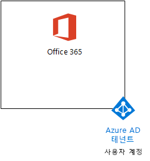
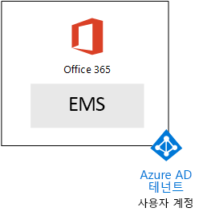
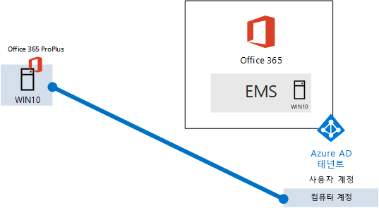

# <a name="the-microsoft-365-enterprise-devtest-environment"></a>Microsoft 365 엔터프라이즈 개발/테스트 환경

 **요약:** 이 테스트 랩 가이드를 사용 하 여 Office 365 e 5, Enterprise 이동성 + 보안 (EMS) e 5 및 Windows 10 Enterprise를 실행 하는 컴퓨터를 포함 하는 개발/테스트 환경을 만듭니다.
  
이 문서를 [Microsoft 365 Enterprise](https://www.microsoft.com/microsoft-365/enterprise)의 특징과 기능을 테스트 하려면 단순화 된 환경을 만드는 단계별 지침을 제공 합니다.
  
## <a name="phase-1-create-your-office-365-e5-subscription"></a>1 단계: Office 365 E5 구독 만들기

2 단계 및 [Office 365 개발/테스트 환경](office-365-dev-test-environment.md) 의 3 단계를 그림 1에 표시 된 것과 같이 lightweight Office 365 개발/테스트 환경 만들기의 단계를 수행 합니다.
  
**그림 1: 해당 Azure Active Directory (AD) 테 넌 트 및 사용자 계정으로 Office 365 E5 구독**


  
## <a name="phase-2-add-ems"></a>2 단계: EMS 추가

이 단계에서 EMS E5 평가판 구독에 대 한 등록 하 여 Office 365 E5 평가판 구독와 같은 조직에 추가 합니다.
  
먼저, EMS E5 평가판 구독을 추가 하 고 전역 관리자 계정에는 EMS 라이선스를 할당 합니다.
  
1. 인터넷 브라우저의 개인 인스턴스와 전역 관리자 계정 자격 증명을 사용 하 여 Office 365 포털에 로그인 합니다. 도움말을 보려면 [Office 365에 로그인 할 위치](https://support.office.com/Article/Where-to-sign-in-to-Office-365-e9eb7d51-5430-4929-91ab-6157c5a050b4)를 참조 하십시오.
    
2. **Admin** 타일을 클릭 합니다.
    
3. 왼쪽 탐색 영역에서 브라우저에서 **Office 관리 센터** 탭을 클릭 **대금 청구 > 구매 서비스**합니다.
    
4. **서비스 구매** 페이지 **Enterprise 이동성 + 보안 e 5** 항목을 찾습니다. 마우스 포인터를 올려 하 고 **무료 평가판을 시작**을 클릭 합니다.
    
5. **주문 확인** 페이지에서 **지금 시도**클릭 합니다.
    
6. **순서 확인** 페이지에서 **계속**을 클릭 합니다.
    
7. 왼쪽 탐색 영역에서 브라우저에서 **Office 365 관리 센터** 탭을 클릭 **사용자 > 활성 사용자**합니다.
    
8. 전역 관리자 계정을 클릭 하 고 **제품 라이선스**에 대 한 **편집** 을 클릭 합니다.
    
9. **제품 라이선스** 창에서 **엔터프라이즈 이동성 + 보안 e 5** **전환**에 대 한 제품 라이선스 설정, **저장** 을 클릭 하 고 두번 **닫기** 를 클릭 합니다.
    
> [!NOTE]
> Enterprise Mobility + Security E5 평가판 구독 기간은 90일입니다. 영구 개발/테스트 환경의 경우 소수의 라이선스를 사용해서 유료 구독을 새로 만듭니다. 
  
 ***3 단계를 완료 한 경우*** [Office 365 개발/테스트 환경](office-365-dev-test-environment.md) 에서는 모든 (사용자 2, 사용자 3, 4 사용자 및 사용자 5) 사용자 계정에 대해 8과 이전 절차의 9 단계를 반복 합니다.
  
개발/테스트 환경을 현재가지고 있습니다.
  
- 사용자 계정 목록과 동일한 조직 및 동일한 Azure AD 테넌트를 공유하는 Office 365 E5 Enterprise 및 EMS 평가판 구독
    
- Office 365 e 5 및 EMS e 5를 사용 하 여 모든 적절 한 사용자 계정 (전역 관리자만 또는 모든 5 개의 사용자 계정) 사용할 수 있습니다.
    
그림 2 EMS를 추가 하는 구성에 결과 보여줍니다.
  
**그림 2: EMS 평가판 구독 추가 (영문)**


  
## <a name="phase-3-create-a-windows-10-enterprise-computer"></a>3 단계: Windows 10 엔터프라이즈 컴퓨터 만들기

이 단계에서는 Windows 10 Enterprise를 실행 하는 독립 실행형 컴퓨터를 만듭니다.
  
### <a name="physical-computer"></a>실제 컴퓨터

개인 컴퓨터를 받아에 Windows 10 Enterprise를 설치 합니다. Windows 10 Enterprise 평가판 [여기](https://www.microsoft.com/evalcenter/evaluate-windows-10-enterprise)다운로드할 수 있습니다.
  
### <a name="virtual-machine"></a>가상 컴퓨터

사용자가 선택한 하이퍼바이저를 사용 하 여 가상 컴퓨터를 만들고에 Windows 10 Enterprise를 설치 합니다. Windows 10 Enterprise 평가판 [여기](https://www.microsoft.com/evalcenter/evaluate-windows-10-enterprise)다운로드할 수 있습니다.
  
### <a name="virtual-machine-in-azure"></a>Azure에 가상 컴퓨터

***Visual Studio 기반 구독 있어야***Windows 10 Enterprise에 대 한 이미지에 액세스할 수 있는 Microsoft Azure에서 Windows 10 가상 컴퓨터를 생성 합니다. 다른 유형의 평가판 및 유료 구독 등 Azure 구독에이 이미지에 대 한 액세스를 사용할 필요가 없습니다.
  
> [!NOTE]
> 다음 명령 집합 텍스트 Azure PowerShell의 최신 버전을 사용 합니다. [Azure PowerShell cmdlet 시작](https://docs.microsoft.com/powershell/azureps-cmdlets-docs/)을 참조 하십시오. 이 명령 집합 빌드 Windows 10 엔터프라이즈 가상 컴퓨터에는 WIN10 및 리소스 그룹, 사용자는 저장소 계정이 및 가상 네트워크를 포함 하 여 필요한 인프라의 모든 라는 합니다. Azure 인프라 서비스에 익숙한 사용자의 현재 배포 된 인프라에 맞게 이러한 지침에 맞게 조정 하십시오. 
  
먼저, Microsoft PowerShell 프롬프트를 시작 합니다.
  
다음 명령 사용 하 여 Azure 계정에 로그인 합니다.
  
```
Login-AzureRMAccount
```

다음 명령을 사용하여 구독 이름을 가져옵니다.
  
```
Get-AzureRMSubscription | Sort Name | Select Name
```

Azure 구독을 설정 합니다. 따옴표를 포함 하 여 입력을 내에 있는 모든 항목을 교체는 \< 및 > 올바른 이름의 문자입니다.
  
```
$subscr="<subscription name>"
Get-AzureRmSubscription -SubscriptionName $subscr | Select-AzureRmSubscription
```

다음으로 새 리소스 그룹을 만듭니다. 고유한 리소스 그룹 이름을 확인하려면 이 명령을 사용하여 기존 리소스 그룹을 나열합니다.
  
```
Get-AzureRMResourceGroup | Sort ResourceGroupName | Select ResourceGroupName
```

이러한 명령을 사용 하면 새 자원 그룹을 만듭니다. 교체 따옴표를 포함 하 여 입력을 내에 있는 모든 항목은 \< 및 > 올바른 이름 사용 하 여 문자입니다.
  
```
$rgName="<resource group name>"
$locName="<location name, such as West US>"
New-AzureRMResourceGroup -Name $rgName -Location $locName
```

리소스 관리자 기반 가상 컴퓨터 저장소 리소스 관리자 기반 계정이 필요합니다. *소문자 및 숫자를 포함 하* 여 저장소 계정에 대해 전역적으로 고유 이름을 선택 해야 합니다. 기존 저장소 계정을 나열 하려면이 명령을 사용할 수 있습니다.
  
```
Get-AzureRMStorageAccount | Sort StorageAccountName | Select StorageAccountName
```

이 명령을 사용하여 제안된 저장소 계정 이름이 고유한지 테스트할 수 있습니다.
  
```
Get-AzureRmStorageAccountNameAvailability "<proposed name>"
```

이러한 명령을 사용하여 새 테스트 환경에 대한 새 저장소 계정을 만듭니다.
  
```
$rgName="<your new resource group name>"
$saName="<storage account name>"
$locName=(Get-AzureRmResourceGroup -Name $rgName).Location
New-AzureRMStorageAccount -Name $saName -ResourceGroupName $rgName -Type Standard_LRS -Location $locName
```

다음으로 만들면 새 가상 네트워크에 연결 하 고 WIN10 가상 컴퓨터 이러한 명령을 사용 합니다. 대화 상자가 나타나면 WIN10에 대 한 이름 및 로컬 관리자 계정의 암호를 제공 하 고 이러한 안전한 위치에 저장 합니다.
  
```
$corpnetSubnet=New-AzureRMVirtualNetworkSubnetConfig -Name Corpnet -AddressPrefix 10.0.0.0/24
New-AzureRMVirtualNetwork -Name "M365Ent-TestLab" -ResourceGroupName $rgName -Location $locName -AddressPrefix 10.0.0.0/8 -Subnet $corpnetSubnet
$rule1=New-AzureRMNetworkSecurityRuleConfig -Name "RDPTraffic" -Description "Allow RDP to all VMs on the subnet" -Access Allow -Protocol Tcp -Direction Inbound -Priority 100 -SourceAddressPrefix Internet -SourcePortRange * -DestinationAddressPrefix * -DestinationPortRange 3389
New-AzureRMNetworkSecurityGroup -Name Corpnet -ResourceGroupName $rgName -Location $locName -SecurityRules $rule1
$vnet=Get-AzureRMVirtualNetwork -ResourceGroupName $rgName -Name "M365Ent-TestLab"
$nsg=Get-AzureRMNetworkSecurityGroup -Name Corpnet -ResourceGroupName $rgName
Set-AzureRMVirtualNetworkSubnetConfig -VirtualNetwork $vnet -Name Corpnet -AddressPrefix "10.0.0.0/24" -NetworkSecurityGroup $nsg
$pip=New-AzureRMPublicIpAddress -Name WIN10-PIP -ResourceGroupName $rgName -Location $locName -AllocationMethod Dynamic
$nic=New-AzureRMNetworkInterface -Name WIN10-NIC -ResourceGroupName $rgName -Location $locName -SubnetId $vnet.Subnets[0].Id -PublicIpAddressId $pip.Id
$vm=New-AzureRMVMConfig -VMName WIN10 -VMSize Standard_D1_V2
$storageAcc=Get-AzureRMStorageAccount -ResourceGroupName $rgName -Name $saName
$cred=Get-Credential -Message "Type the name and password of the local administrator account for WIN10."
$vm=Set-AzureRMVMOperatingSystem -VM $vm -Windows -ComputerName WIN10 -Credential $cred -ProvisionVMAgent -EnableAutoUpdate
$vm=Set-AzureRMVMSourceImage -VM $vm -PublisherName MicrosoftVisualStudio -Offer Windows -Skus Windows-10-N-x64 -Version "latest"
$vm=Add-AzureRMVMNetworkInterface -VM $vm -Id $nic.Id
$osDiskUri=$storageAcc.PrimaryEndpoints.Blob.ToString() + "vhds/WIN10-TestLab-OSDisk.vhd"
$vm=Set-AzureRMVMOSDisk -VM $vm -Name WIN10-TestLab-OSDisk -VhdUri $osDiskUri -CreateOption fromImage
New-AzureRMVM -ResourceGroupName $rgName -Location $locName -VM $vm
```

## <a name="phase-4-join-your-windows-10-computer-to-azure-ad"></a>4 단계: Azure AD를 Windows 10 컴퓨터를 가입 시킵니다.

실제 또는 가상 컴퓨터를 만든 Windows 10 Enterprise를 사용 하 여 구성 하 고 실행 되 고, 로컬 관리자 계정을 사용 하 여 로그인 합니다.
  
> [!NOTE]
> Azure에 가상 컴퓨터에 대 한 [다음이 지침](https://docs.microsoft.com/azure/virtual-machines/windows/connect-logon)을 사용 하 여 연결 합니다. 로컬 관리자 계정의 자격 증명을 사용 하 여 로그인 합니다. 
  
다음으로, Office 365 및 EMS 구독의 Azure AD 테 넌 트 WIN10 컴퓨터에 가입 합니다.
  
1. WIN10 컴퓨터의 바탕 화면에서 클릭 **시작 > 설정 > 계정 > 액세스 작업 또는 학교 > 연결**합니다.
    
2. **작업이 나 교육용 계정 설정** 대화 상자에서 **Azure Active Directory에이 장치에 참가**클릭 합니다.
    
3. **작업 또는 학교 계정**, Office 365 구독의 전역 관리자 계정 이름을 입력 하 고 **다음**을 클릭 합니다.
    
4. **암호 입력**전역 관리자 계정의 암호를 입력 하 고 **로그인**을 클릭 합니다.
    
5. 이 조직 있는지 확인 대화 상자가 나타나면 **참가**클릭 하 고 **완료**를 클릭 합니다.
    
6. 설정 창을 닫습니다.
    
다음으로, Office 2016 WIN10 컴퓨터에 설치
  
1. Microsoft에 지 브라우저를 열고 전역 관리자 계정 자격 증명을 사용 하 여 Office 365 포털에 로그인 합니다. 도움말을 보려면 [Office 365에 로그인 할 위치](https://support.office.com/Article/Where-to-sign-in-to-Office-365-e9eb7d51-5430-4929-91ab-6157c5a050b4)를 참조 하십시오.
    
2. **Microsoft Office 홈** 탭에서 **Office 2016 설치**를 클릭 합니다.
    
3. 수행할 작업을 함께 대화 상자가 나타나면 **실행**을 차례로 클릭 하 고 **사용자 계정 컨트롤**에 대 한 **예** 를 클릭 합니다.
    
4. Office 설치를 완료 될 때까지 기다립니다. 참조 하는 경우 **모두 설정 하 고 있는!**를 두번 **닫기** 를 클릭 합니다.
    
그림 3에는 Office 365 및 EMS 구독의 Azure AD 테 넌 트에 참가 하는 WIN10 컴퓨터를 포함 하는 결과 환경을 보여줍니다.
  
**그림 3: Azure AD 테 넌 트에 WIN10 컴퓨터 계정 추가**


  
이제 [Microsoft 365 Enterprise](https://www.microsoft.com/microsoft-365/enterprise)의 추가 기능을 테스트해 준비가 되었습니다.
  
## <a name="next-steps"></a>다음 단계

이러한 추가 문서를 사용 하 여 Microsoft 365 Enterprise의 기능에 알아보십시오.
  
- [모바일 응용 프로그램 관리 (MAM) 정책 추가](https://technet.microsoft.com/library/mt764059.aspx)
    
- [IOS 및 Android 장치 등록](https://technet.microsoft.com/library/mt743077.aspx)
    
- [구성 및 테스트 고급 보안 관리](https://technet.microsoft.com/library/mt757250.aspx)
    
- [구성 하 고 고급 위협 보호를 테스트 합니다.](https://technet.microsoft.com/library/mt490479.aspx)
    
## <a name="see-also"></a>참고 항목

[하나의 Microsoft 클라우드 개발/테스트 환경](the-one-microsoft-cloud-dev-test-environment.md)

[Microsoft 365 Enterprise 설명서](https://docs.microsoft.com/microsoft-365-enterprise/)


