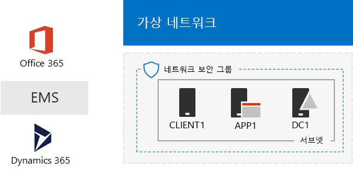
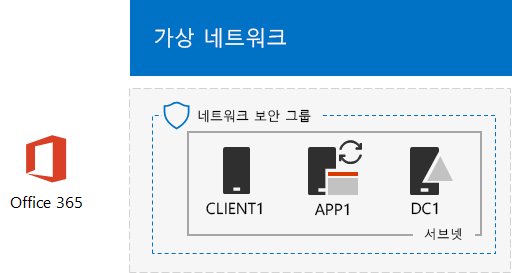
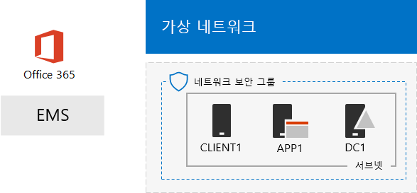

# 하나의 Microsoft 클라우드 개발/테스트 환경

 **요약:** 이 테스트 랩 가이드를 사용 하 여 Microsoft의 클라우드 서비스를 모두 포함 하는 개발/테스트 환경을 만들 수 있습니다.
  
이 문서의 지침을 시뮬레이션 된 인트라넷 Microsoft Azure 인프라 서비스에 만들고 Microsoft Office 365, Microsoft Enterprise 이동성 + 보안 (EMS) 및 Microsoft Dynamics 365 구독을 추가 합니다. 결과 단일 개발/테스트 환경에서 동시에 모든 Microsoft 클라우드 서비스를 사용 하는 간소화 된 조직입니다. 
  

  
결과 구성을 사용 하 여 사용할 수 있습니다.
  
- 통합 하 여 Azure Active Directory (AD)를 제공 하는 일반적인 identity 인프라와 같은 Microsoft의 클라우드 서비스 간에 경험이 있어야 합니다.
    
- 여러 Microsoft 클라우드 서비스를 포함 하는-종단간 시나리오를 평가 합니다.
    
- 데모, 개념 증명 또는 여러 Microsoft 클라우드 서비스를 사용 하는 개발/테스트 구성을 만듭니다.
    
- 전문적인 개발을 위한 Microsoft 클라우드 대비한을 구축 합니다.
    
## 1 단계: 시뮬레이션 된 인트라넷 연결을 만들고 Office 365에 추가

[Office 365 개발/테스트 환경에 대 한 디렉터리 동기화](dirsync-for-your-office-365-dev-test-environment.md)의 지시를 따릅니다.
  
그림 1에는 Office 365와 온-프레미스 Windows Server Active Directory (AD) 포리스트에서 Azure 인프라 서비스 및 디렉터리 동기화를 실행 하는 시뮬레이션 된 인트라넷을 포함 하 여 결과 구성을 보여줍니다.
  
**그림 1: Office 365와 Azure에서 시뮬레이트된 인트라넷**

  
> [!NOTE]
> Azure 평가판은 30 일입니다. Office 365 Enterprise e 5 평가판 구독은 쉽게 확장할 수 있습니다를 다른 30 일 하는 30 일입니다. 영구 개발/테스트 환경에 대 한 만들기 새 Azure 구독 및 라이선스 수가 적은로 새 유료 Office 365 Enterprise E5 구독을 지불 합니다. 
  
## 2 단계: EMS 추가

이 단계에서는 EMS 평가판 구독을 등록하고 Office 365 평가판 구독과 동일한 조직에 추가합니다.
  
1. 중 하나에서 브라우저와 데스크톱 컴퓨터에서 CLIENT1, 로그인에 [https://portal.office.com](https://portal.office.com) 전역 관리자 계정의 자격 증명을 사용 하 여 Office 365 포털에 또는 합니다.
    
2. **Admin** 타일을 클릭 합니다.
    
3. 왼쪽 탐색 영역에서 브라우저에서 **Office 관리 센터** 탭을 클릭 **대금 청구 > 구매 서비스**합니다.
    
4. **서비스 구매** 페이지 **Enterprise 이동성 + 보안 e 5** 항목을 찾습니다. 마우스 포인터를 올려 하 고 **무료 평가판을 시작**을 클릭 합니다.
    
5. **주문 확인** 페이지에서 **지금 시도**클릭 합니다.
    
6. **순서 확인** 페이지에서 **계속**을 클릭 합니다.
    
> [!NOTE]
> Enterprise Mobility + Security E5 평가판 구독 기간은 90일입니다. 영구 개발/테스트 환경의 경우 소수의 라이선스를 사용해서 유료 구독을 새로 만듭니다. 
  
다음으로, 엔터프라이즈 이동성 + 모든 사용자 계정에 대 한 보안 E5 라이선스 사용 하도록 설정 합니다.
  
1. 왼쪽 탐색 영역에서 브라우저에서 **Office 365 관리 센터** 탭을 클릭 **사용자 > 활성 사용자**합니다.
    
2. 전역 관리자 계정을 클릭 하 고 **제품 라이선스**에 대 한 **편집** 을 클릭 합니다.
    
3. **제품 라이선스** 창에서 **엔터프라이즈 이동성 + 보안 e 5** **전환**에 대 한 제품 라이선스 설정, **저장** 을 클릭 하 고 두번 **닫기** 를 클릭 합니다.
    
4. 다른 계정을 (User1, 사용자 2, 사용자 3, 4 사용자 및 사용자 5) 모두에 대해 2-3 단계를 수행합니다.
    
개발/테스트 환경을 현재가지고 있습니다.
  
- Azure 인프라 서비스에서 실행 되는 시뮬레이션 된 인트라넷 합니다.
    
- 사용자 계정 목록과 동일한 조직 및 동일한 Azure AD 테넌트를 공유하는 Office 365 E5 Enterprise 및 EMS 평가판 구독
    
- 모든 사용자 계정이 Office 365 E5 Enterprise 및 EMS를 사용하도록 설정
    
그림 2 EMS를 추가 하는 구성에 결과 보여줍니다.
  
**그림 2: Office 365와 EMS Azure의 시뮬레이션 된 인트라넷**

  
## 3 단계: Dynamics 365 추가

이 단계에서 Dynamics 365 평가판 구독에 대 한 등록 하 여 Office 365 및 EMS 평가판 구독와 같은 조직에 추가 합니다.
  
1. 브라우저를 사용 하는 중 하나에서 데스크톱 컴퓨터 또는 CLIENT1에서 로그인에 [https://portal.office.com](https://portal.office.com) 전역 관리자 계정의 자격 증명을 사용 하 여 Office 365 포털에 있습니다.
    
2. **Admin** 타일을 클릭 합니다.
    
3. 왼쪽 탐색 영역에서 **Office 관리 센터** 탭을 클릭 **대금 청구 > 구매 서비스**합니다.
    
4. **서비스 구매** 페이지 **Dynamics 365 계획 1 Enterprise Edition** 항목을 찾습니다. 마우스 포인터를 올려 하 고 **무료 평가판을 시작**을 클릭 합니다.
    
5. **주문 확인** 페이지에서 **지금 시도**클릭 합니다.
    
6. **순서 확인** 페이지에서 **계속**을 클릭 합니다.
    
> [!NOTE]
> Dynamics 365 계획 1 Enterprise Edition 평가판 구독은 30 일입니다. 다른 30 일에 대 한 내역 구독을 쉽게 확장할 수 있습니다. 영구 개발/테스트 환경에 대 한 만들기 새 적은 수의 라이선스를 사용 하 여 구독을 지불 합니다. 
  
전역 관리자, 사용자 2 및 3 사용자 계정에 Dynamics 365 라이선스를 할당 하 고 시스템 관리자가 있도록 하려면 다음이 단계를 사용 합니다.
  
1. **Office 관리 센터** 탭을 클릭 **사용자 > 활성 사용자**합니다.
    
2. 활성 사용자 목록에서 전역 관리자 계정을 클릭 하 고 **제품 라이선스**에 대 한 **편집** 을 클릭 합니다.
    
3. **제품 라이선스** 창에서 **전환** **Dynamics 365 계획 1 Enterprise Edition** 대 한 제품 라이선스 설정, **저장** 을 클릭 하 고 두번 **닫기** 를 클릭 합니다.
    
4. 사용자 2 및 3 사용자 계정에 대해 2-3 단계를 수행 합니다.
    
5. **Office 관리 센터** 탭을 닫습니다.
    
Dynamics 365 시스템 관리자는 사용자 2 및 3 사용자 계정을 구성 하려면 다음이 단계를 사용 합니다.
  
1. 왼쪽 탐색 영역에서 브라우저에서 **Office 관리 센터** 탭에서 **관리 센터**, 를클릭하고 **Dynamics 365**를 클릭 합니다.
    
    Dynamics 365 Dynamics 365 메뉴에 표시 되기 전에 프로 비전을 완료할 때까지 대기 해야할 수 있습니다.
    
2. Dynamics 365 탭에서 **대부분의**를 클릭 하 고 다음을 클릭 **설치를 완료 합니다.**
    
    설치가 완료 될 때까지 기다립니다.
    
    설치가 완료 되 면 내역 구독의 일부인 샘플 데이터를 기반으로 영업 활동 대시보드를 표시 합니다. **평가판 시작** 보려면 잠시 비디오를 수행 합니다. 완료 되 면 비디오 창을 닫습니다.
    
3. 위쪽 도구 모음에서 **Sales**옆에 있는 아래쪽 화살표를 클릭 하 고 **설정**, **보안**을 클릭 한 다음 합니다.
    
4. **보안** 페이지에서 **사용자**를 클릭 합니다.
    
5. 사용자의 목록에서 **사용자 2**를 클릭 합니다.
    
6. 도구 모음에서 **관리 역할**을 클릭 합니다.
    
7. **역할 관리** **시스템 관리자**클릭 한 다음 **확인**을 클릭 합니다.
    
8. 맨 위쪽에 있는 도구 모음에서 **보안**을 클릭 합니다.
    
9. 3 사용자 계정에 대해 5-8 단계를 반복 합니다.
    
10. 닫기는 **사용자: User3** 탭 합니다.
    
> [!NOTE]
> Office 365 전역 관리자 계정 Dynamics 365 시스템 관리자 역할을 자동으로 할당 되었습니다. 
  
개발/테스트 환경을 현재가지고 있습니다.
  
- Azure 인프라 서비스에서 실행 되는 시뮬레이션 된 인트라넷 합니다.
    
- Office 365 e 5 Enterprise, EMS, 및 Dynamics 365 평가판 구독 사용자 계정의 대화 목록와 같은 조직 및 동일한 Azure AD 테 넌 트를 공유 합니다.
    
- 모든 사용자 계정이 Office 365 E5 Enterprise 및 EMS를 사용하도록 설정
    
- 사용자 글로벌 엔터프라이즈 관리자, 사용자 2 및 3 사용자 계정을 Dynamics 365 사용 하 여 사용 되며 Dynamics 365 시스템 관리자가.
    
그림 3은 결과 구성을 보여줍니다.
  
**그림 3: Office 365, EMS, Dynamics 365 Azure에서 시뮬레이트된 인트라넷**

  
## 다음 단계

이제 한 Microsoft 클라우드 개발/테스트 환경 실험 수 있습니다. 실무 안내 경험에 대 한 몇가지 아이디어는 다음과 같습니다.
  
- [Office 365 응용 프로그램에 대 한 EMS에서 모바일 응용 프로그램 관리 (MAM) 정책 구성](https://technet.microsoft.com/library/mt764059.aspx)
    
- [Office 365 통합 Dynamics 365 대화 상대와의 Exchange Online 시연](https://technet.microsoft.com/library/mt798313.aspx)
    
- [서버 기반 작업 부하를 호스팅하기 위한 Azure 인프라 서비스에서 시뮬레이션 된 크로스-프레미스 네트워크를 만들기](https://technet.microsoft.com/library/mt745150.aspx)
    
## 참고 항목

[클라우드 도입 TLG(테스트 랩 가이드)](cloud-adoption-test-lab-guides-tlgs.md)
  
[Microsoft 클라우드 IT 아키텍처 리소스](microsoft-cloud-it-architecture-resources.md)
  
[하이브리드 솔루션](hybrid-solutions.md)
  
[보안 솔루션](security-solutions.md)

