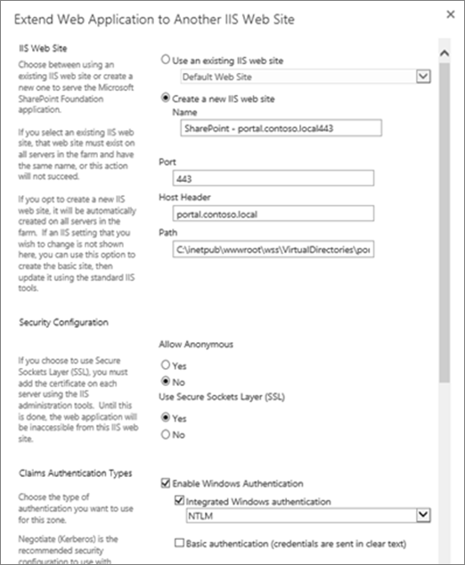

# <a name="using-azure-ad-for-sharepoint-server-authentication"></a><span data-ttu-id="2a65e-103">Azure AD를 사용 하 여 SharePoint 서버 인증을 위해</span><span class="sxs-lookup"><span data-stu-id="2a65e-103">Using Azure AD for SharePoint Server Authentication</span></span>

 <span data-ttu-id="2a65e-104">**요약:** Azure Active Directory와 SharePoint Server 2016 사용자를 인증 하는 방법에 알아봅니다.</span><span class="sxs-lookup"><span data-stu-id="2a65e-104">**Summary:** Learn how to authenticate your SharePoint Server 2016 users with Azure Active Directory.</span></span>
  
> [!NOTE]
> <span data-ttu-id="2a65e-105">이 문서는 Kirk Evans, Microsoft 보안 주체 프로그램 관리자의 작업을 기반으로 합니다.</span><span class="sxs-lookup"><span data-stu-id="2a65e-105">This article is based on the work of Kirk Evans, a Microsoft Principal Program Manager.</span></span> 

<blockquote>
<p><span data-ttu-id="2a65e-p101">이 문서는 Azure Active Directory 그래프와 상호작용 하기 위한 코드 예제를 참조 합니다. 코드 샘플을 다운로드할 수 [여기](https://github.com/kaevans/spsaml11/tree/master/scripts)합니다.</span><span class="sxs-lookup"><span data-stu-id="2a65e-p101">This article refers to code samples for interacting with Azure Active Directory Graph. You can download the code samples [here](https://github.com/kaevans/spsaml11/tree/master/scripts).</span></span></p>
</blockquote>

<span data-ttu-id="2a65e-p102">SharePoint Server 2016 쉽게 사용자를 관리 하 여 신뢰할 수 있지만 다른 사람을 관리 하는 다른 id 공급자를 사용 하 여 인증 하는 하 여 클레임 기반 인증을 사용 하 여 사용자를 인증 하는 기능을 제공 합니다. 예, Active Directory 도메인 서비스 (AD DS)를 통해 사용자 인증을 관리 하는 대신 Azure Active Directory (Azure AD)를 사용 하 여 인증에 사용자를 설정할 수 있습니다. 이렇게 하면 해당 사용자 이름에 onmicrosoft.com 접미사를 사용 하 여 클라우드 전용 사용자 인증, 사용자는 온-프레미스 디렉터리와 동기화 하 고 다른 디렉터리에서 게스트 사용자를 초대 합니다. 또한 다단계 인증 및 고급 보고 기능 등의 Azure AD 기능을 활용할 수 있습니다.</span><span class="sxs-lookup"><span data-stu-id="2a65e-p102">SharePoint Server 2016 provides the ability to authenticate users using claims-based authentication, making it easy to manage your users by authenticating them with different identity providers that you trust but someone else manages. For example, instead of managing user authentication through Active Directory Domain Services (AD DS), you could enable users to authenticate using Azure Active Directory (Azure AD). This enables authentication for cloud-only users with the onmicrosoft.com suffix in their username, users synchronized with an on-premises directory, and invited guest users from other directories. It also enables you to take advantage of Azure AD features such as multi-factor authentication and advanced reporting capabilities.</span></span>

> [!IMPORTANT]
> <span data-ttu-id="2a65e-p103">이 문서에서 설명 하는 솔루션을 사용 하 여 SharePoint Server 2013;도 수 있습니다. 그러나 염두에 SharePoint Server 2013은 메인스트림 지원 종료 거의 가득 차지 합니다. 자세한 내용은 [Microsoft 수명 주기 정책](https://support.microsoft.com/en-us/lifecycle/search?alpha=SharePoint%20Server%202013) 및 [SharePoint 2013에 대 한 제품 서비스 정책 업데이트](https://technet.microsoft.com/library/684173bb-e90a-4eb7-b268-b8d7458bc802(v=office.16).aspx)를 참조 하십시오.</span><span class="sxs-lookup"><span data-stu-id="2a65e-p103">The solution described in this article can also be used with SharePoint Server 2013; however, keep in mind that SharePoint Server 2013 is nearing the end of mainstream support. For more information, see [Microsoft Lifecycle Policy](https://support.microsoft.com/en-us/lifecycle/search?alpha=SharePoint%20Server%202013) and [Updated Product Servicing Policy for SharePoint 2013](https://technet.microsoft.com/library/684173bb-e90a-4eb7-b268-b8d7458bc802(v=office.16).aspx).</span></span>

<span data-ttu-id="2a65e-p104">이 문서에서는 Azure AD를 사용 하 여 온-프레미스 하는 대신 사용자를 인증 하는 방법을 설명 AD DS 합니다. 이 구성에서 Azure AD SharePoint Server 2016에 대 한 신뢰할 수 있는 id 공급자를 됩니다. 이 구성 추가 하는 SharePoint Server 2016 설치 자체에서 사용 하는 AD DS 인증 분리 하는 사용자 인증 방법입니다. 이 문서를 에서도 Ws-federation을 파악 해야 합니다. 자세한 내용은 [Ws-federation 이해를](https://go.microsoft.com/fwlink/p/?linkid=188052)참조 하십시오.</span><span class="sxs-lookup"><span data-stu-id="2a65e-p104">This article explains how you can use Azure AD to authenticate your users instead of your on-premises AD DS. In this configuration, Azure AD becomes a trusted identity provider for SharePoint Server 2016. This configuration adds a user authentication method that is separate from the AD DS authentication used by the SharePoint Server 2016 installation itself. To benefit from this article, you should be familiar with WS-Federation. For more information, see [Understanding WS-Federation](https://go.microsoft.com/fwlink/p/?linkid=188052).</span></span>


<span data-ttu-id="2a65e-p105">이전에이 구성은 필요 했을 페더레이션 서비스와 같은 Azure 서비스 ACS (액세스 제어) 클라우드 또는 환경에서를 호스팅하는 Active Directory Federation Services (AD FS) SAML 1.1 SAML 2.0에서 되는 토큰을 변환 합니다. 이러한 변화는 Azure AD 이제 발급 SAML 1.1 토큰을 통해 더 이상 필요 합니다. 위 다이어그램에서는이 변환을 수행 하려면 중계 장치에 대 한 요구 사항이 더 이상 인지를 보여주는이 구성에서 SharePoint 2016 사용자에 대 한 인증을 작동 하는 방식을 보여줍니다.</span><span class="sxs-lookup"><span data-stu-id="2a65e-p105">Previously, this configuration would have required a federation service such as Azure Access Control Service (ACS) in the cloud or an environment that hosts Active Directory Federation Services (AD FS) to transform tokens from SAML 2.0 to SAML 1.1. This transformation is no longer required as Azure AD now enables issuing SAML 1.1 tokens. The diagram above shows how authentication works for SharePoint 2016 users in this configuration, demonstrating that there is no longer a requirement for an intermediary to perform this transformation.</span></span>

> [!NOTE]
> <span data-ttu-id="2a65e-p106">이 구성이 작동 하는 SharePoint 팜의 Azure 가상 컴퓨터 또는 온-프레미스에서 호스팅되는 여부. 사용자 확인이 아닌 추가 방화벽 포트를 열어 자신의 브라우저에서 Azure Active Directory에 액세스할 수는 필요 하지 않습니다.</span><span class="sxs-lookup"><span data-stu-id="2a65e-p106">This configuration works whether the SharePoint farm is hosted in Azure virtual machines or on-premises. It does not require opening additional firewall ports other than ensuring users can access Azure Active Directory from their browser.</span></span>

<span data-ttu-id="2a65e-125">SharePoint 2016 내게 필요한 옵션에 대 한 정보를 [SharePoint Server 2016의 내게 필요한 옵션 지침](https://go.microsoft.com/fwlink/p/?LinkId=393123)을 참조 하십시오.</span><span class="sxs-lookup"><span data-stu-id="2a65e-125">For information about SharePoint 2016 accessibility, see [Accessibility Guidelines in SharePoint Server 2016](https://go.microsoft.com/fwlink/p/?LinkId=393123).</span></span>

## <a name="configuration-overview"></a><span data-ttu-id="2a65e-126">구성 개요</span><span class="sxs-lookup"><span data-stu-id="2a65e-126">Configuration overview</span></span>

<span data-ttu-id="2a65e-127">SharePoint Server 2016 id 공급자로 Azure AD를 사용 하 여 환경을 설정 하는 이러한 일반적인 단계를 따릅니다.</span><span class="sxs-lookup"><span data-stu-id="2a65e-127">Follow these general steps to set up your environment to use Azure AD as a SharePoint Server 2016 identity provider.</span></span>

1. <span data-ttu-id="2a65e-128">새 만들기 Azure AD 디렉터리 하거나 기존 디렉터리를 사용 합니다.</span><span class="sxs-lookup"><span data-stu-id="2a65e-128">Create a new Azure AD directory or use your existing directory.</span></span>
2. <span data-ttu-id="2a65e-129">Azure AD와 보안을 유지 하려는 웹 응용 프로그램에 대 한 영역 SSL을 사용 하도록 구성 되어있는지 확인 합니다.</span><span class="sxs-lookup"><span data-stu-id="2a65e-129">Ensure the zone for the web application that you want to secure with Azure AD is configured to use SSL.</span></span>
3. <span data-ttu-id="2a65e-130">Azure AD에 새 엔터프라이즈 응용 프로그램을 만듭니다.</span><span class="sxs-lookup"><span data-stu-id="2a65e-130">Create a new enterprise application in Azure AD.</span></span>
4. <span data-ttu-id="2a65e-131">SharePoint Server 2016에서 새 신뢰할 수 있는 id 공급자를 구성 합니다.</span><span class="sxs-lookup"><span data-stu-id="2a65e-131">Configure a new trusted identity provider in SharePoint Server 2016.</span></span>
5. <span data-ttu-id="2a65e-132">웹 응용 프로그램에 대 한 사용 권한을 설정 합니다.</span><span class="sxs-lookup"><span data-stu-id="2a65e-132">Set the permissions for the web application.</span></span>
6. <span data-ttu-id="2a65e-133">Azure AD에는 SAML 1.1 토큰 발급 정책을 추가 합니다.</span><span class="sxs-lookup"><span data-stu-id="2a65e-133">Add a SAML 1.1 token issuance policy in Azure AD.</span></span>
7. <span data-ttu-id="2a65e-134">새 공급자를 확인 합니다.</span><span class="sxs-lookup"><span data-stu-id="2a65e-134">Verify the new provider.</span></span>

<span data-ttu-id="2a65e-135">다음 섹션에서는 이러한 작업을 수행 하는 방법에 설명 합니다.</span><span class="sxs-lookup"><span data-stu-id="2a65e-135">The following sections describe how to perform these tasks.</span></span>

## <a name="step-1-create-a-new-azure-ad-directory-or-use-your-existing-directory"></a><span data-ttu-id="2a65e-136">1 단계: 새 만들기 Azure AD 디렉터리 하거나 기존 디렉터리를 사용 하 여</span><span class="sxs-lookup"><span data-stu-id="2a65e-136">Step 1: Create a new Azure AD directory or use your existing directory</span></span>

<span data-ttu-id="2a65e-p107">Azure 포털에서 ([https://portal.azure.com](https://portal.azure.com)), 새 디렉터리를 만듭니다. 조직 이름, 초기 도메인 이름 및 국가 또는 지역을 제공 합니다.</span><span class="sxs-lookup"><span data-stu-id="2a65e-p107">In the Azure Portal ([https://portal.azure.com](https://portal.azure.com)), create a new directory. Provide the organization name, initial domain name, and the country or region.</span></span>

 

 <span data-ttu-id="2a65e-p108">Microsoft Office 365 또는 Microsoft Azure 구독에 사용 되는 것과 같은 디렉터리에 이미 있는 경우 해당 디렉터리를 대신 사용할 수 있습니다. 디렉터리에 응용 프로그램을 등록할 수 있는 권한이 있어야 합니다.</span><span class="sxs-lookup"><span data-stu-id="2a65e-p108">If you already have a directory such as the one used for Microsoft Office 365 or your Microsoft Azure subscription, you can use that directory instead. You must have permissions to register applications in the directory.</span></span>

## <a name="step-2-ensure-the-zone-for-the-web-application-that-you-want-to-secure-with-azure-ad-is-configured-to-use-ssl"></a><span data-ttu-id="2a65e-142">2 단계: Azure AD와 보안을 유지 하려는 웹 응용 프로그램에 대 한 영역 SSL을 사용 하도록 구성 되었는지 확인 하십시오.</span><span class="sxs-lookup"><span data-stu-id="2a65e-142">Step 2: Ensure the zone for the web application that you want to secure with Azure AD is configured to use SSL</span></span>

<span data-ttu-id="2a65e-p109">이 문서에서 [실행을 고가용성 Azure의 SharePoint Server 2016 팜](https://docs.microsoft.com/en-us/azure/architecture/reference-architectures/sharepoint)참조 아키텍처를 사용 하 여 작성 되었습니다. [이 문서](https://docs.microsoft.com/en-us/azure/architecture/reference-architectures/sharepoint) 에서 설명 하는 솔루션을 배포 하는 데 사용 하는 기사의 함께 제공 된 스크립트는 SSL을 사용 하지 않는 사이트를 만듭니다.</span><span class="sxs-lookup"><span data-stu-id="2a65e-p109">This article was written using the reference architecture in [Run a high availability SharePoint Server 2016 farm in Azure](https://docs.microsoft.com/en-us/azure/architecture/reference-architectures/sharepoint). The article’s accompanying scripts used to deploy the solution described in [this article](https://docs.microsoft.com/en-us/azure/architecture/reference-architectures/sharepoint) create a site that does not use SSL.</span></span>  

<span data-ttu-id="2a65e-p110">SAML을 사용 하 여 응용 프로그램 SSL을 사용 하도록 구성 해야 합니다. SharePoint 웹 응용 프로그램이 SSL을 사용 하도록 구성 되지 않은, 경우 SSL에 대 한 웹 응용 프로그램을 구성 하는 새로운 자체 서명 된 인증서를 만들려면 다음 단계를 사용 합니다. 이 구성은 랩 환경에 대 한 기능만 및 프로덕션 환경에 대해 되지는지 않습니다. 프로덕션 환경에는 서명 된 인증서를 사용 해야 합니다.</span><span class="sxs-lookup"><span data-stu-id="2a65e-p110">Using SAML requires the application be configured to use SSL. If your SharePoint web application is not configured to use SSL, use the following steps to create a new self-signed certificate to configure the web application for SSL. This configuration is only meant for a lab environment and is not intended for production. Production environments should use a signed certificate.</span></span>

1. <span data-ttu-id="2a65e-p111">**중앙 관리**로 이동 > **응용 프로그램 관리** > **웹 응용 프로그램 관리**, SSL을 사용 하 여 확장 되어야 하는 웹 응용 프로그램을 선택 합니다. 웹 응용 프로그램을 선택 하 고 **확장 리본 메뉴** 단추를 클릭 합니다. 동일한 URL을 사용 하려면 포트 443 사용 하 여 SSL 사용 웹 응용 프로그램을 확장 합니다.</span><span class="sxs-lookup"><span data-stu-id="2a65e-p111">Go to **Central Administration** > **Application Management** > **Manage Web Applications**, and choose the web application that needs to be extended to use SSL. Select the web application and click the **Extend ribbon** button. Extend the web application to use the same URL but use SSL with port 443.</span></span></br><span data-ttu-id="2a65e-152"></span><span class="sxs-lookup"><span data-stu-id="2a65e-152"></span></span></br>
2. <span data-ttu-id="2a65e-153">IIS 관리자에서 **서버 인증서**를 두번클릭 합니다.</span><span class="sxs-lookup"><span data-stu-id="2a65e-153">In IIS Manager, double-click **Server Certificates**.</span></span>
3. <span data-ttu-id="2a65e-p112">**동작** 창에서 **자체 서명 된 인증서 만들기**를 클릭 합니다. 인증서 상자에 대 한 친숙 한 이름 지정에는 인증서에 대 한 친숙 한 이름을 입력 한 다음 **확인**을 클릭 합니다.</span><span class="sxs-lookup"><span data-stu-id="2a65e-p112">In the **Actions** pane, click **Create Self-Signed Certificate**. Type a friendly name for the certificate in the Specify a friendly name for the certificate box, and then click **OK**.</span></span>
4. <span data-ttu-id="2a65e-156">**사이트 바인딩 편집** 대화 상자에서 호스트 이름은 친숙 한 이름을와 동일 하 게 다음 이미지에 나와있는 것 처럼 확인 합니다.</span><span class="sxs-lookup"><span data-stu-id="2a65e-156">From the **Edit Site Binding** dialog box, ensure the host name is the same as the friendly name, as illustrated in the following image.</span></span></br><span data-ttu-id="2a65e-157"></span><span class="sxs-lookup"><span data-stu-id="2a65e-157"></span></span></br>

<span data-ttu-id="2a65e-158">각 SharePoint 팜의 웹 프런트엔드 서버에서 IIS의에서 사이트 바인딩에 대 한 인증서 구성 필요 합니다.</span><span class="sxs-lookup"><span data-stu-id="2a65e-158">Each of the web front end servers in the SharePoint farm will require configuring the certificate for the site binding in IIS.</span></span>


## <a name="step-3-create-a-new-enterprise-application-in-azure-ad"></a><span data-ttu-id="2a65e-159">3 단계: Azure AD에 새 엔터프라이즈 응용 프로그램 만들기</span><span class="sxs-lookup"><span data-stu-id="2a65e-159">Step 3: Create a new enterprise application in Azure AD</span></span>

1. <span data-ttu-id="2a65e-p113">Azure 포털에서 ([https://portal.azure.com](https://portal.azure.com)), Azure AD 디렉터리를 엽니다. **엔터프라이즈 응용 프로그램**클릭 한 다음 **새 응용 프로그램**을 클릭 합니다. **비 갤러리 응용 프로그램**을 선택 합니다. *SharePoint SAML 통합* 와 같은 이름을 제공 하 고 **추가**클릭 합니다.</span><span class="sxs-lookup"><span data-stu-id="2a65e-p113">In the Azure Portal ([https://portal.azure.com](https://portal.azure.com)), open your Azure AD directory. Click **Enterprise Applications**, then click **New application**. Choose **Non-gallery application**. Provide a name such as *SharePoint SAML Integration* and click **Add**.</span></span></br><span data-ttu-id="2a65e-164"></span><span class="sxs-lookup"><span data-stu-id="2a65e-164"></span></span></br>
2. <span data-ttu-id="2a65e-p114">응용 프로그램을 구성 하는 탐색 창의 Single sign on 링크를 클릭 합니다. **SAML 기반 sign-on** 응용 프로그램에 대 한 SAML 구성 속성을 표시 하는 **Single sign-on 모드** 드롭다운을 변경 합니다. 다음과 같은 속성으로 구성 합니다.</span><span class="sxs-lookup"><span data-stu-id="2a65e-p114">Click the Single sign-on link in the navigation pane to configure the application. Change the **Single Sign-on Mode** dropdown to **SAML-based Sign-on** to reveal the SAML configuration properties for the application. Configure with the following properties:</span></span></br>
    - <span data-ttu-id="2a65e-168">식별자:`urn:sharepoint:portal.contoso.local`</span><span class="sxs-lookup"><span data-stu-id="2a65e-168">Identifier: `urn:sharepoint:portal.contoso.local`</span></span>
    - <span data-ttu-id="2a65e-169">회신 URL:`https://portal.contoso.local/_trust/default.aspx`</span><span class="sxs-lookup"><span data-stu-id="2a65e-169">Reply URL: `https://portal.contoso.local/_trust/default.aspx`</span></span>
    - <span data-ttu-id="2a65e-170">로그온 URL:`https://portal.contoso.local/_trust/default.aspx`</span><span class="sxs-lookup"><span data-stu-id="2a65e-170">Sign-on URL: `https://portal.contoso.local/_trust/default.aspx`</span></span>
    - <span data-ttu-id="2a65e-171">사용자 Id:`user.userprincipalname`</span><span class="sxs-lookup"><span data-stu-id="2a65e-171">User Identifier: `user.userprincipalname`</span></span></br>
    - <span data-ttu-id="2a65e-172">참고: *portal.contoso.local* 보안을 유지 하려면 SharePoint 사이트의 URL로 대체 하 여 Url을 변경 해야 합니다.</span><span class="sxs-lookup"><span data-stu-id="2a65e-172">Note: Remember to change the URLs by replacing *portal.contoso.local* with the URL of the SharePoint site you want to secure.</span></span></br>
3. <span data-ttu-id="2a65e-173">다음 행을 포함 하는 표 (아래 표 1에서와 유사함)를 설정 합니다.</span><span class="sxs-lookup"><span data-stu-id="2a65e-173">Set up a table (similar to Table 1 below) that includes the following rows:</span></span></br> 
    - <span data-ttu-id="2a65e-174">영역</span><span class="sxs-lookup"><span data-stu-id="2a65e-174">Realm</span></span>
    - <span data-ttu-id="2a65e-175">인증서 파일에 서명 하는 SAML에 대 한 전체 경로</span><span class="sxs-lookup"><span data-stu-id="2a65e-175">Full path to SAML signing certificate file</span></span>
    - <span data-ttu-id="2a65e-176">( */Wsfed* */saml2* 바꿉니다) 서비스 URL SAML Single Sign-on</span><span class="sxs-lookup"><span data-stu-id="2a65e-176">SAML Single Sign-On service URL (replacing */saml2* with */wsfed*)</span></span>
    - <span data-ttu-id="2a65e-177">응용 프로그램 개체 id입니다.</span><span class="sxs-lookup"><span data-stu-id="2a65e-177">Application Object ID.</span></span> </br>
<span data-ttu-id="2a65e-178">*식별자* 값을 테이블로 (참조 아래 표 1.) *영역* 속성에 복사</span><span class="sxs-lookup"><span data-stu-id="2a65e-178">Copy the *Identifier* value into the *Realm* property into a table  (See Table 1 below.)</span></span>
4. <span data-ttu-id="2a65e-179">변경 내용을 저장합니다.</span><span class="sxs-lookup"><span data-stu-id="2a65e-179">Save your changes.</span></span>
5. <span data-ttu-id="2a65e-180">Configure 로그온 페이지에 액세스 하려면 **구성 (응용 프로그램 이름)** 링크를 클릭 합니다.</span><span class="sxs-lookup"><span data-stu-id="2a65e-180">Click the **Configure (app name)** link to access the Configure sign-on page.</span></span></br><span data-ttu-id="2a65e-181"></span><span class="sxs-lookup"><span data-stu-id="2a65e-181"></span></span></br> 
    -  <span data-ttu-id="2a65e-p115">.Cer 확장명을 가진 파일로 SAML 서명 인증서를 다운로드 하려면 **SAML 서명 인증서-원시** 링크를 클릭 합니다. 복사한 테이블에 다운로드 한 파일의 전체 경로 붙여넣습니다.</span><span class="sxs-lookup"><span data-stu-id="2a65e-p115">Click the **SAML Signing Certificate - Raw** link to download the SAML Signing Certificate as a file with the .cer extension. Copy and paste the full path to the downloaded file into your table.</span></span>
    - <span data-ttu-id="2a65e-184">복사 및 붙여넣기에 SAML Single Sign-on 서비스 URL 링크를 */wsfed* */saml2* 부분 URL 바꿉니다.</span><span class="sxs-lookup"><span data-stu-id="2a65e-184">Copy and paste the SAML Single Sign-On Service URL link into your, replacing the */saml2* portion of the URL with */wsfed*.</span></span></br>
6.  <span data-ttu-id="2a65e-p116">응용 프로그램에 대 한 **속성** 창으로 이동 합니다. 복사 하 고 개체 ID 값 3 단계에서에서 설정한 테이블에 붙여넣습니다.</span><span class="sxs-lookup"><span data-stu-id="2a65e-p116">Navigate to the **Properties** pane for the application. Copy and paste the Object ID value into the table you set up in Step 3.</span></span></br><span data-ttu-id="2a65e-187"></span><span class="sxs-lookup"><span data-stu-id="2a65e-187"></span></span></br>
7. <span data-ttu-id="2a65e-188">캡처한 값을 사용 하 여, 3 단계에서에서 설정한 테이블 아래 표 1의 형식은 있는지 확인 합니다.</span><span class="sxs-lookup"><span data-stu-id="2a65e-188">Using the values you captured, make sure the table you set up in Step 3 resembles Table 1 below.</span></span>


| <span data-ttu-id="2a65e-189">표 1: 값 캡처</span><span class="sxs-lookup"><span data-stu-id="2a65e-189">Table 1: Values captured</span></span>  |  |
|---------|---------|
|<span data-ttu-id="2a65e-190">영역</span><span class="sxs-lookup"><span data-stu-id="2a65e-190">Realm</span></span> | `urn:sharepoint:portal.contoso.local` |
|<span data-ttu-id="2a65e-191">인증서 파일에 서명 하는 SAML에 대 한 전체 경로</span><span class="sxs-lookup"><span data-stu-id="2a65e-191">Full path to SAML signing certificate file</span></span> | `C:/temp/SharePoint SAML Integration.cer`  |
|<span data-ttu-id="2a65e-192">SAML single sign-on 서비스 URL (/wsfed /saml2 바꿉니다)</span><span class="sxs-lookup"><span data-stu-id="2a65e-192">SAML single sign-on service URL (replace /saml2 with /wsfed)</span></span> | `https://login.microsoftonline.com/b1726649-b616-460d-8d20-defab80d476c/wsfed` |
|<span data-ttu-id="2a65e-193">응용 프로그램 개체 ID</span><span class="sxs-lookup"><span data-stu-id="2a65e-193">Application Object ID</span></span> | `a812f48b-d1e4-4c8e-93be-e4808c8ca3ac` |

> [!IMPORTANT]
> <span data-ttu-id="2a65e-p117">*/Wsfed*URL에서 */saml2* 값을 바꿉니다. */Saml2* 끝점 2.0 SAML 토큰에 처리 됩니다. */Wsfed* 끝점 처리 SAML 1.1 토큰을 사용 하도록 설정 하 고 SharePoint 2016 SAML 페더레이션에 필요 합니다.</span><span class="sxs-lookup"><span data-stu-id="2a65e-p117">Replace the */saml2* value in the URL with */wsfed*. The */saml2* endpoint will process SAML 2.0 tokens. The */wsfed* endpoint enables processing SAML 1.1 tokens and is required for SharePoint 2016 SAML federation.</span></span>

## <a name="step-4-configure-a-new-trusted-identity-provider-in-sharepoint-server-2016"></a><span data-ttu-id="2a65e-197">4 단계: SharePoint Server 2016에서 새 신뢰할 수 있는 id 공급자 구성</span><span class="sxs-lookup"><span data-stu-id="2a65e-197">Step 4: Configure a new trusted identity provider in SharePoint Server 2016</span></span>

<span data-ttu-id="2a65e-p118">SharePoint Server 2016 서버에 서명 하 고 SharePoint 2016 관리 셸을 엽니다. $Realm, $wsfedurl, 그리고 $filepath 표 1에서 값 입력 하 고 새 신뢰할 수 있는 id 공급자를 구성 하려면 다음 명령을 실행 합니다.</span><span class="sxs-lookup"><span data-stu-id="2a65e-p118">Sign into the SharePoint Server 2016 server and open the SharePoint 2016 Management Shell. Fill in the values of $realm, $wsfedurl, and $filepath from Table 1 and run the following commands to configure a new trusted identity provider.</span></span>

> [!TIP]
> <span data-ttu-id="2a65e-200">새로운 기능 PowerShell을 사용 하는 PowerShell 작동 하는 방법에 대 한 자세한 내용을 보려면 원하는 경우 [SharePoint PowerShell](https://docs.microsoft.com/en-us/powershell/sharepoint/overview?view=sharepoint-ps)를 참조 하십시오.</span><span class="sxs-lookup"><span data-stu-id="2a65e-200">If you're new to using PowerShell or want to learn more about how PowerShell works, see [SharePoint PowerShell](https://docs.microsoft.com/en-us/powershell/sharepoint/overview?view=sharepoint-ps).</span></span> 

```
$realm = "<Realm from Table 1>"
$wsfedurl="<SAML single sign-on service URL from Table 1>"
$filepath="<Full path to SAML signing certificate file from Table 1>"
$cert = New-Object System.Security.Cryptography.X509Certificates.X509Certificate2($filepath)
New-SPTrustedRootAuthority -Name "AzureAD" -Certificate $cert
$map = New-SPClaimTypeMapping -IncomingClaimType "http://schemas.xmlsoap.org/ws/2005/05/identity/claims/name" -IncomingClaimTypeDisplayName "name" -LocalClaimType "http://schemas.xmlsoap.org/ws/2005/05/identity/claims/upn"
$map2 = New-SPClaimTypeMapping -IncomingClaimType "http://schemas.xmlsoap.org/ws/2005/05/identity/claims/givenname" -IncomingClaimTypeDisplayName "GivenName" -SameAsIncoming
$map3 = New-SPClaimTypeMapping -IncomingClaimType "http://schemas.xmlsoap.org/ws/2005/05/identity/claims/surname" -IncomingClaimTypeDisplayName "SurName" -SameAsIncoming
$ap = New-SPTrustedIdentityTokenIssuer -Name "AzureAD" -Description "SharePoint secured by Azure AD" -realm $realm -ImportTrustCertificate $cert -ClaimsMappings $map,$map2,$map3 -SignInUrl $wsfedurl -IdentifierClaim "http://schemas.xmlsoap.org/ws/2005/05/identity/claims/name"
```

<span data-ttu-id="2a65e-201">다음으로, 응용 프로그램에 대 한 신뢰할 수 있는 id 공급자를 사용 하도록 설정 하려면 다음이 단계를 따릅니다.</span><span class="sxs-lookup"><span data-stu-id="2a65e-201">Next, follow these steps to enable the trusted identity provider for your application:</span></span>
1. <span data-ttu-id="2a65e-202">중앙 관리에서 **웹 응용 프로그램 관리** 로 이동 하 고 Azure AD와 보안을 유지 하려는 웹 응용 프로그램을 선택 합니다.</span><span class="sxs-lookup"><span data-stu-id="2a65e-202">In Central Administration, navigate to **Manage Web Application** and select the web application that you wish to secure with Azure AD.</span></span> 
2. <span data-ttu-id="2a65e-203">리본 메뉴에서 **인증 공급자** 를 클릭 하 고 사용 하려는 영역을 선택 합니다.</span><span class="sxs-lookup"><span data-stu-id="2a65e-203">In the ribbon, click **Authentication Providers** and choose the zone that you wish to use.</span></span>
3. <span data-ttu-id="2a65e-204">**신뢰할 수 있는 Id 공급자** 를 선택 하 고 *AzureAD*라는 방금 등록 식별 공급자를 선택 합니다.</span><span class="sxs-lookup"><span data-stu-id="2a65e-204">Select **Trusted Identity provider** and select the identify provider you just registered named *AzureAD*.</span></span>  
4. <span data-ttu-id="2a65e-205">로그인 페이지 URL 설정에서 **사용자 정의 페이지에서 로그인** 을 선택 하 고 "/_trust/" 값을 제공 합니다.</span><span class="sxs-lookup"><span data-stu-id="2a65e-205">On the sign-in page URL setting, select **Custom sign in page** and provide the value “/_trust/”.</span></span> 
5. <span data-ttu-id="2a65e-206">**확인**을 클릭합니다.</span><span class="sxs-lookup"><span data-stu-id="2a65e-206">Click **OK**.</span></span>


## <a name="step-5-set-the-permissions"></a><span data-ttu-id="2a65e-208">5 단계: 사용 권한 설정</span><span class="sxs-lookup"><span data-stu-id="2a65e-208">Step 5: Set the permissions</span></span>

<span data-ttu-id="2a65e-209">Azure AD에 로그인 하 고 SharePoint 액세스 사용자가 응용 프로그램에 대 한 액세스를 부여 되어야 합니다.</span><span class="sxs-lookup"><span data-stu-id="2a65e-209">The users who will log into Azure AD and access SharePoint must be granted access to the application.</span></span> 

1. <span data-ttu-id="2a65e-p119">Azure 포털에서 Azure AD 디렉터리를 엽니다. **엔터프라이즈 응용 프로그램**클릭 한 다음 **모든 응용 프로그램**을 클릭 합니다. 이전에 만든 응용 프로그램을 클릭 합니다. (SharePoint SAML 통합).</span><span class="sxs-lookup"><span data-stu-id="2a65e-p119">In the Azure Portal, open the Azure AD directory. Click **Enterprise Applications**, then click **All applications**. Click the application that you created previously (SharePoint SAML Integration).</span></span>
2. <span data-ttu-id="2a65e-213">**사용자 및 그룹을**클릭 합니다.</span><span class="sxs-lookup"><span data-stu-id="2a65e-213">Click **Users and Groups**.</span></span> 
3. <span data-ttu-id="2a65e-214">사용자 또는 Azure AD를 사용 하 여 SharePoint에 로그인 하는 권한을 가진 그룹을 추가 하려면 **사용자 추가** 클릭 합니다.</span><span class="sxs-lookup"><span data-stu-id="2a65e-214">Click **Add user** to add a user or group who will have permissions to log into SharePoint using Azure AD.</span></span>
4. <span data-ttu-id="2a65e-215">사용자 또는 그룹을 선택한 다음 **할당**을 누릅니다.</span><span class="sxs-lookup"><span data-stu-id="2a65e-215">Select the user or group then click **Assign**.</span></span>
 
<span data-ttu-id="2a65e-p120">사용자 Azure AD에 권한을 부여 하지만 사용 권한을 부여 해야 SharePoint에서 합니다. 웹 응용 프로그램에 액세스 권한을 설정 하려면 다음 단계를 사용 합니다.</span><span class="sxs-lookup"><span data-stu-id="2a65e-p120">The user has been granted permission in Azure AD, but also must be granted permission in SharePoint. Use the following steps to set the permissions to access the web application.</span></span>

1. <span data-ttu-id="2a65e-218">중앙 관리에서 **응용 프로그램 관리**를 클릭합니다.</span><span class="sxs-lookup"><span data-stu-id="2a65e-218">In Central Administration, click **Application Management**.</span></span>
2. <span data-ttu-id="2a65e-219">**응용 프로그램 관리** 페이지의 **웹 응용 프로그램** 섹션에서 **웹 응용 프로그램 관리를**클릭 합니다.</span><span class="sxs-lookup"><span data-stu-id="2a65e-219">On the **Application Management** page, in the **Web Applications** section, click **Manage web applications**.</span></span>
3. <span data-ttu-id="2a65e-220">적절 한 웹 응용 프로그램을 클릭 한 다음 **사용자 정책**을 클릭 합니다.</span><span class="sxs-lookup"><span data-stu-id="2a65e-220">Click the appropriate web application, and then click **User Policy**.</span></span>
4. <span data-ttu-id="2a65e-221">웹 응용 프로그램에 대 한 정책에서 **사용자 추가**클릭 합니다.</span><span class="sxs-lookup"><span data-stu-id="2a65e-221">In Policy for Web Application, click **Add Users**.</span></span></br><span data-ttu-id="2a65e-222"></span><span class="sxs-lookup"><span data-stu-id="2a65e-222"></span></span></br>
5. <span data-ttu-id="2a65e-223">**사용자 추가** 대화 상자에서 **영역**적절 한 영역을 클릭 하 고 **** 을 클릭 합니다.</span><span class="sxs-lookup"><span data-stu-id="2a65e-223">In the **Add Users** dialog box, click the appropriate zone in **Zones**, and then click **Next**.</span></span>
6. <span data-ttu-id="2a65e-224">**사용자 선택** 섹션에서 **웹 응용 프로그램에 대 한 정책** 대화 상자에서 **찾아보기** 아이콘을 클릭 합니다.</span><span class="sxs-lookup"><span data-stu-id="2a65e-224">In the **Policy for Web Application** dialog box, in the **Choose Users** section, click the **Browse** icon.</span></span>
7. <span data-ttu-id="2a65e-225">**찾을** 텍스트 상자에 디렉터리에 사용자에 대 한 로그인 이름을 입력 하 고 **검색**을 클릭 합니다.</span><span class="sxs-lookup"><span data-stu-id="2a65e-225">In the **Find** textbox, type the sign-in name for a user in your directory and click **Search**.</span></span> </br><span data-ttu-id="2a65e-226">예: *demouser@blueskyabove.onmicrosoft.com*합니다.</span><span class="sxs-lookup"><span data-stu-id="2a65e-226">Example: *demouser@blueskyabove.onmicrosoft.com*.</span></span>
8. <span data-ttu-id="2a65e-227">목록 보기에서 AzureAD 머리글 아래에서 name 속성을 선택 하 고 **추가** 클릭 한 다음 대화 상자를 닫으려면 **확인** 클릭 합니다.</span><span class="sxs-lookup"><span data-stu-id="2a65e-227">Under the AzureAD heading in the list view, select the name property and click **Add** then click **OK** to close the dialog.</span></span>
9. <span data-ttu-id="2a65e-228">사용 권한에서 **모든 권한**을 클릭 합니다.</span><span class="sxs-lookup"><span data-stu-id="2a65e-228">In Permissions, click **Full Control**.</span></span></br><span data-ttu-id="2a65e-229"></span><span class="sxs-lookup"><span data-stu-id="2a65e-229"></span></span></br>
10. <span data-ttu-id="2a65e-230">**마침**, **확인**을 차례로 클릭합니다.</span><span class="sxs-lookup"><span data-stu-id="2a65e-230">Click **Finish**, and then click **OK**.</span></span>

## <a name="step-6-add-a-saml-11-token-issuance-policy-in-azure-ad"></a><span data-ttu-id="2a65e-231">6 단계: Azure AD에 SAML 1.1 토큰 발급 정책 추가</span><span class="sxs-lookup"><span data-stu-id="2a65e-231">Step 6: Add a SAML 1.1 token issuance policy in Azure AD</span></span>

<span data-ttu-id="2a65e-p121">포털에서 Azure AD 응용 프로그램이 만들어지면 SAML 2.0을 사용 하 여 기본값입니다. SharePoint Server 2016 SAML 1.1 토큰 형식이 필요합니다. 다음 스크립트는 기본 SAML 2.0 정책을 제거 하 고 문제 SAML 1.1 토큰에 새 정책 추가 됩니다. 이 코드는 해당 [Azure Active Directory 그래프와 상호작용을 보여주는 샘플](https://github.com/kaevans/spsaml11/tree/master/scripts)을 다운로드 해야 합니다.</span><span class="sxs-lookup"><span data-stu-id="2a65e-p121">When the Azure AD application is created in the portal, it defaults to using SAML 2.0. SharePoint Server 2016 requires the SAML 1.1 token format. The following script will remove the default SAML 2.0 policy and add a new policy to issue SAML 1.1 tokens. This code requires downloading the accompanying [samples demonstrating interacting with Azure Active Directory Graph](https://github.com/kaevans/spsaml11/tree/master/scripts).</span></span> 


```
Import-Module <file path of Initialize.ps1> 
$objectid = "<Application Object ID from Table 1>"
$saml2policyid = Get-PoliciesAssignedToServicePrincipal -servicePrincipalId $objectid | ?{$_.displayName -EQ "TokenIssuancePolicy"} | select objectId
Remove-PolicyFromServicePrincipal -policyId $saml2policyid -servicePrincipalId $objectid
$policy = Add-TokenIssuancePolicy -DisplayName SPSAML11 -SigningAlgorithm "http://www.w3.org/2001/04/xmldsig-more#rsa-sha256" -TokenResponseSigningPolicy TokenOnly -SamlTokenVersion "1.1"
Set-PolicyToServicePrincipal -policyId $policy.objectId -servicePrincipalId $objectid
```
> <span data-ttu-id="2a65e-p122">실행 하는 것이 중요는 `Import-Module` 이 예제와 같이 명령 합니다. 이 표시 된 명령은 포함 된 종속 모듈을 로드 합니다. 성공적으로 이러한 명령을 실행 하려면 관리자 권한으로 명령 프롬프트를 열고 해야할 수 있습니다.</span><span class="sxs-lookup"><span data-stu-id="2a65e-p122">Note that it is important to run the `Import-Module` command as shown in this example. This will load a dependent module that contains the commands shown. You may need to open an elevated command prompt to successfully execute these commands.</span></span>

<span data-ttu-id="2a65e-p123">이러한 예제 PowerShell 명령을 그래프 API에 대 한 쿼리를 실행 하는 방법의 예입니다. Azure AD와 토큰 발급 정책에 대 한 자세한 내용은 [정책에 대 한 작업에 대 한 그래프 API 참조](https://msdn.microsoft.com/en-us/library/azure/ad/graph/api/policy-operations#create-a-policy)를 참조 하십시오.</span><span class="sxs-lookup"><span data-stu-id="2a65e-p123">These sample PowerShell commands are examples of how to execute queries against the Graph API. For more details on Token Issuance Policies with Azure AD, see the [Graph API reference for operations on policy](https://msdn.microsoft.com/en-us/library/azure/ad/graph/api/policy-operations#create-a-policy).</span></span>

## <a name="step-7-verify-the-new-provider"></a><span data-ttu-id="2a65e-241">7 단계: 새 공급자를 확인 하십시오.</span><span class="sxs-lookup"><span data-stu-id="2a65e-241">Step 7: Verify the new provider</span></span>

<span data-ttu-id="2a65e-p124">이전 단계에서 사용자가 구성한 웹 응용 프로그램의 URL로 브라우저를 엽니다. Azure AD에 로그인 하는 것이 리디렉션됩니다.</span><span class="sxs-lookup"><span data-stu-id="2a65e-p124">Open a browser to the URL of the web application that you configured in the previous steps. You are redirected to sign into Azure AD.</span></span>


<span data-ttu-id="2a65e-245">로그인 상태를 유지 하려는 경우가 있습니다.</span><span class="sxs-lookup"><span data-stu-id="2a65e-245">You are asked if you want to stay signed in.</span></span>


<span data-ttu-id="2a65e-247">마지막으로 테 넌 트 Azure Active Directory에서에서 사용자로 로그인 사이트에 액세스할 수 있습니다.</span><span class="sxs-lookup"><span data-stu-id="2a65e-247">Finally, you can access the site logged in as a user from your Azure Active Directory tenant.</span></span>


## <a name="managing-certificates"></a><span data-ttu-id="2a65e-249">인증서 관리</span><span class="sxs-lookup"><span data-stu-id="2a65e-249">Managing certificates</span></span>
<span data-ttu-id="2a65e-p125">것은 위의 4 단계에서 신뢰할 수 있는 id 공급자에 대해 구성 된 서명 인증서가 만료 날짜와 갱신 되기를 이해 하는 것이 중요 합니다. 인증서를 갱신 대 정보에 대 한 문서 [페더레이션 single sign-on 및 Azure Active directory에서에 대 한 관리 인증서](https://docs.microsoft.com/en-us/azure/active-directory/active-directory-sso-certs) 를 참조 하십시오. Azure AD에 인증서를 갱신 된, 로컬 파일을 다운로드 하 고 다음 스크립트를 사용 하 여 갱신 된 서명 인증서를 사용 하 여 신뢰할 수 있는 id 공급자를 구성 합니다.</span><span class="sxs-lookup"><span data-stu-id="2a65e-p125">It is important to understand that the signing certificate that was configured for the trusted identity provider in step 4 above has an expiration date and must be renewed. See the article [Manage certificates for federated single sign-on in Azure Active Directory](https://docs.microsoft.com/en-us/azure/active-directory/active-directory-sso-certs) for information on certificate renewal. Once the certificate has been renewed in Azure AD, download to a local file and use the following script to configure the trusted identity provider with the renewed signing certificate.</span></span> 

```
$filepath="<Full path to renewed SAML signing certificate file>"
$cert= New-Object System.Security.Cryptography.X509Certificates.X509Certificate2($filePath)
New-SPTrustedRootAuthority -Name "AzureAD" -Certificate $cert
Get-SPTrustedIdentityTokenIssuer "AzureAD" | Set-SPTrustedIdentityTokenIssuer -ImportTrustCertificate $cert
```
## <a name="configuring-one-trusted-identity-provider-for-multiple-web-applications"></a><span data-ttu-id="2a65e-253">여러 웹 응용 프로그램에 대 한 하나의 신뢰할 수 있는 id 공급자를 구성합니다.</span><span class="sxs-lookup"><span data-stu-id="2a65e-253">Configuring one trusted identity provider for multiple web applications</span></span>
<span data-ttu-id="2a65e-p126">구성을 단일 웹 응용 프로그램에 대해 작동 하지만 여러 웹 응용 프로그램에 대 한 동일한 신뢰할 수 있는 id 공급자를 사용 하도록 하려는 경우 추가 구성이 필요 합니다. 예는 URL을 사용 하 여 웹 응용 프로그램 확장을 가정 `https://portal.contoso.local` 이름 옆에 사용자를 인증 하 고 `https://sales.contoso.local` 도 있습니다. 이 작업을 수행 하려면 WReply 매개 변수는 제한이 회신 URL을 추가 하려면 Azure AD에서 응용 프로그램 등록을 업데이트 하는 id 공급자를 업데이트 해야 합니다.</span><span class="sxs-lookup"><span data-stu-id="2a65e-p126">The configuration works for a single web application, but needs additional configuration if you intend to use the same trusted identity provider for multiple web applications. For example, assume we had extended a web application to use the URL `https://portal.contoso.local` and now want to authenticate the users to `https://sales.contoso.local` as well. To do this, we need to update the identity provider to honor the WReply parameter and update the application registration in Azure AD to add a reply URL.</span></span>

1. <span data-ttu-id="2a65e-p127">Azure 포털에서 Azure AD 디렉터리를 엽니다. **응용 프로그램 등록**클릭 한 다음 **모든 응용 프로그램 보기**를 클릭 합니다. 이전에 만든 응용 프로그램을 클릭 합니다. (SharePoint SAML 통합).</span><span class="sxs-lookup"><span data-stu-id="2a65e-p127">In the Azure Portal, open the Azure AD directory. Click **App registrations**, then click **View all applications**. Click the application that you created previously (SharePoint SAML Integration).</span></span>
2. <span data-ttu-id="2a65e-260">**설정**을 클릭 합니다.</span><span class="sxs-lookup"><span data-stu-id="2a65e-260">Click **Settings**.</span></span>
3. <span data-ttu-id="2a65e-261">설정 블레이드 **회신 Url**을 클릭 합니다.</span><span class="sxs-lookup"><span data-stu-id="2a65e-261">In the settings blade, click **Reply URLs**.</span></span> 
4. <span data-ttu-id="2a65e-262">추가 웹 응용 프로그램에 대 한 URL을 추가 (예: `https://sales.contoso.local`) **저장**을 클릭 하 고 있습니다.</span><span class="sxs-lookup"><span data-stu-id="2a65e-262">Add the URL for the additional web application (such as `https://sales.contoso.local`) and click **Save**.</span></span> 
5. <span data-ttu-id="2a65e-263">SharePoint 서버에서 **SharePoint 2016 관리 셸** 을 열고 이전에 사용 되는 신뢰할 수 있는 id 토큰 발급자의 이름을 사용 하 여 다음 명령을 실행 합니다.</span><span class="sxs-lookup"><span data-stu-id="2a65e-263">On the SharePoint server, open the **SharePoint 2016 Management Shell** and execute the following commands, using the name of the trusted identity token issuer that you used previously.</span></span>

```
$t = Get-SPTrustedIdentityTokenIssuer "AzureAD"
$t.UseWReplyParameter=$true
$t.Update()
```
6. <span data-ttu-id="2a65e-p128">중앙 관리에서 웹 응용 프로그램으로 이동 하 고 기존의 신뢰할 수 있는 id 공급자를 사용 하도록 설정 합니다. 또한 사용자 지정 로그인 페이지로 로그인 페이지 URL을 구성 하려면 기억 `/_trust/`합니다.</span><span class="sxs-lookup"><span data-stu-id="2a65e-p128">In Central Administration, go to the web application and enable the existing trusted identity provider. Remember to also configure the sign-in page URL as a custom sign in page `/_trust/`.</span></span>
7. <span data-ttu-id="2a65e-p129">중앙 관리에서 웹 응용 프로그램을 클릭 하 고 **사용자 정책**을 선택 합니다. 이 문서의 이전에 나와있는 것 처럼 적절 한 사용 권한 가진 사용자를 추가 합니다.</span><span class="sxs-lookup"><span data-stu-id="2a65e-p129">In Central Administration, click the web application and choose **User Policy**. Add a user with the appropriate permissions as demonstrated previously in this article.</span></span>

## <a name="fixing-people-picker"></a><span data-ttu-id="2a65e-268">수정 하는 사용자 선택</span><span class="sxs-lookup"><span data-stu-id="2a65e-268">Fixing People Picker</span></span>
<span data-ttu-id="2a65e-p130">사용자가 Azure AD에서 id가 사용 하 여 SharePoint 2016에 이제 로그인 할 수 있지만 여전히 사용자 환경 향상을 위한 기회 있습니다. 예: 사용자에 대 한 검색 사용자 선택에서 여러 검색 결과 제공 합니다. 각 클레임 매핑을에서 만들어진 3 클레임 유형에 대 한 검색 결과 방법이 있습니다. 사용자 선택을 사용 하 여 사용자를 선택 하려면 사용자 이름을 정확 하 게 입력 하 고 **이름** 클레임 결과 선택 해야 합니다.</span><span class="sxs-lookup"><span data-stu-id="2a65e-p130">Users can now log into SharePoint 2016 using identities from Azure AD, but there are still opportunities for improvement to the user experience. For instance, searching for a user presents multiple search results in the people picker. There is a search result for each of the 3 claim types that were created in the claim mapping. To choose a user using the people picker, you must type their user name exactly and choose the **name** claim result.</span></span>


<span data-ttu-id="2a65e-p131">맞춤법 오류를 야기할 수 있는 값을 검색에 대 한 유효성을 검사 없이 이거나 잘못 된 실수로 선택 클레임 유형 **성** 등을 할당 하는 사용자가 클레임 합니다. 사용자가 성공적으로 리소스에 액세스 하지 못하도록 방지할 수이 합니다.</span><span class="sxs-lookup"><span data-stu-id="2a65e-p131">There is no validation on the values you search for, which can lead to misspellings or users accidentally choosing the wrong claim type to assign such as the **SurName** claim. This can prevent users from successfully accessing resources.</span></span>

<span data-ttu-id="2a65e-p132">이 시나리오를 지원 하기는 개방형 소스 SharePoint 2016에 대 한 사용자 지정 클레임 공급자를 제공 하는 [AzureCP](https://yvand.github.io/AzureCP/) 를 호출 하는 솔루션입니다. Azure AD 그래프를 사용 하 여 문제를 해결 사용자 입력 및 수행 하는 것 유효성 검사 합니다. 자세한 내용은 [AzureCP](https://yvand.github.io/AzureCP/).</span><span class="sxs-lookup"><span data-stu-id="2a65e-p132">To assist with this scenario, there is an open-source solution called [AzureCP](https://yvand.github.io/AzureCP/) that provides a custom claims provider for SharePoint 2016. It will use the Azure AD Graph to resolve what users enter and perform validation. Learn more at [AzureCP](https://yvand.github.io/AzureCP/).</span></span> 

## <a name="additional-resources"></a><span data-ttu-id="2a65e-279">추가 리소스</span><span class="sxs-lookup"><span data-stu-id="2a65e-279">Additional resources</span></span>

[<span data-ttu-id="2a65e-280">Ws-federation 이해</span><span class="sxs-lookup"><span data-stu-id="2a65e-280">Understanding WS-Federation</span></span>](https://go.microsoft.com/fwlink/p/?linkid=188052)
  
[<span data-ttu-id="2a65e-281">클라우드 채택 및 하이브리드 솔루션</span><span class="sxs-lookup"><span data-stu-id="2a65e-281">Cloud adoption and hybrid solutions</span></span>](cloud-adoption-and-hybrid-solutions.md)
  
## <a name="join-the-discussion"></a><span data-ttu-id="2a65e-282">토론 참여</span><span class="sxs-lookup"><span data-stu-id="2a65e-282">Join the discussion</span></span>

|<span data-ttu-id="2a65e-283">**연락처**</span><span class="sxs-lookup"><span data-stu-id="2a65e-283">**Contact us**</span></span>|<span data-ttu-id="2a65e-284">**설명**</span><span class="sxs-lookup"><span data-stu-id="2a65e-284">**Description**</span></span>|
|:-----|:-----|
|<span data-ttu-id="2a65e-285">**어떤 클라우드 채택 콘텐츠가 필요한가요?**</span><span class="sxs-lookup"><span data-stu-id="2a65e-285">**What cloud adoption content do you need?**</span></span> <br/> |<span data-ttu-id="2a65e-p133">여러 Microsoft 클라우드 플랫폼 및 서비스에 적용되는 클라우드 채택 콘텐츠를 만들고 있습니다. 클라우드 채택 콘텐츠에 대한 의견을 제공하거나 [cloudadopt@microsoft.com](mailto:cloudadopt@microsoft.com?Subject=[Cloud%20Adoption%20Content%20Feedback]:%20)으로 이메일을 보내서 특정 콘텐츠를 요청하세요.  </span><span class="sxs-lookup"><span data-stu-id="2a65e-p133">We are creating content for cloud adoption that spans multiple Microsoft cloud platforms and services. Let us know what you think about our cloud adoption content, or ask for specific content by sending email to [cloudadopt@microsoft.com](mailto:cloudadopt@microsoft.com?Subject=[Cloud%20Adoption%20Content%20Feedback]:%20).  </span></span><br/> |
|<span data-ttu-id="2a65e-288">**클라우드 채택 토론에 가입**</span><span class="sxs-lookup"><span data-stu-id="2a65e-288">**Join the cloud adoption discussion**</span></span> <br/> |<span data-ttu-id="2a65e-p134">클라우드 기반 솔루션에 관심이 있다면 CAAB(클라우드 채택 자문 위원회)에 가입하여 Microsoft 콘텐츠 개발자, 산업 전문가 및 전 세계 고객으로 구성된 더 크고 활발한 커뮤니티에 연결할 수 있습니다. 참가하려면 Microsoft 기술 커뮤니티의 [CAAB(Cloud Adoption Advisory Board) 영역](https://aka.ms/caab)에 본인을 회원으로 추가하고 [CAAB@microsoft.com](mailto:caab@microsoft.com?Subject=I%20just%20joined%20the%20Cloud%20Adoption%20Advisory%20Board!)에서 간단한 이메일을 보내주세요. [CAAB 블로그](https://blogs.technet.com/b/solutions_advisory_board/)에서는 누구나 커뮤니티 관련 콘텐츠를 읽을 수 있습니다. 그러나 CAAB 구성원은 새 클라우드 채택 리소스와 솔루션에 대해 설명하는 비공개 웹 세미나에 초대됩니다.  </span><span class="sxs-lookup"><span data-stu-id="2a65e-p134">If you are passionate about cloud-based solutions, consider joining the Cloud Adoption Advisory Board (CAAB) to connect with a larger, vibrant community of Microsoft content developers, industry professionals, and customers from around the globe. To join, add yourself as a member of the [CAAB (Cloud Adoption Advisory Board) space](https://aka.ms/caab) of the Microsoft Tech Community and send us a quick email at [CAAB@microsoft.com](mailto:caab@microsoft.com?Subject=I%20just%20joined%20the%20Cloud%20Adoption%20Advisory%20Board!). Anyone can read community-related content on the [CAAB blog](https://blogs.technet.com/b/solutions_advisory_board/). However, CAAB members get invitations to private webinars that describe new cloud adoption resources and solutions.  </span></span><br/> |
|<span data-ttu-id="2a65e-292">**여기에 표시된 아트 받기**</span><span class="sxs-lookup"><span data-stu-id="2a65e-292">**Get the art you see here**</span></span> <br/> |<span data-ttu-id="2a65e-p135">이 문서에 표시된 아트의 편집 가능한 복사본을 원하시면 보내드리겠습니다. 아트의 URL과 제목을 적어서 [cloudadopt@microsoft.com](mailto:cloudadopt@microsoft.com?subject=[Art%20Request]:%20)으로 요청 이메일을 보내주세요.  </span><span class="sxs-lookup"><span data-stu-id="2a65e-p135">If you want an editable copy of the art you see in this article, we'll be glad to send it to you. Email your request, including the URL and title of the art, to [cloudadopt@microsoft.com](mailto:cloudadopt@microsoft.com?subject=[Art%20Request]:%20).  </span></span><br/> |
   

