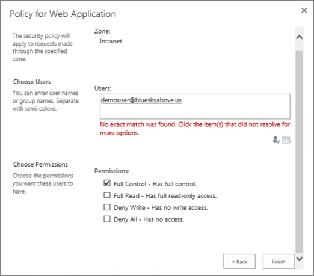

# <a name="using-azure-ad-for-sharepoint-server-authentication"></a><span data-ttu-id="9fe77-103">SharePoint Server 인증에 Azure AD를 사용</span><span class="sxs-lookup"><span data-stu-id="9fe77-103">Using Azure AD for SharePoint Server Authentication</span></span>

 <span data-ttu-id="9fe77-104">**요약:** Azure Active Directory를 사용 하 여 SharePoint Server 2016 사용자를 인증 하는 방법을 알아봅니다.</span><span class="sxs-lookup"><span data-stu-id="9fe77-104">**Summary:** Learn how to authenticate your SharePoint Server 2016 users with Azure Active Directory.</span></span> 

<blockquote>
<p><span data-ttu-id="9fe77-105">이 문서에서는 Azure Active Directory Graph와 상호 작용 하는 코드 예제를 참조 합니다.</span><span class="sxs-lookup"><span data-stu-id="9fe77-105">This article refers to code samples for interacting with Azure Active Directory Graph.</span></span> <span data-ttu-id="9fe77-106">[여기](https://github.com/kaevans/spsaml11/tree/master/scripts)에서 코드 예제를 다운로드할 수 있습니다.</span><span class="sxs-lookup"><span data-stu-id="9fe77-106">You can download the code samples [here](https://github.com/kaevans/spsaml11/tree/master/scripts).</span></span></p>
</blockquote>

<span data-ttu-id="9fe77-107">SharePoint Server 2016에서는 클레임 기반 인증을 사용 하 여 사용자를 인증할 수 있는 기능을 제공 하므로 신뢰할 수 있지만 다른 사용자가 관리 하는 다양 한 id 공급자를 사용 하 여 사용자를 인증 하 여 쉽게 관리할 수 있습니다.</span><span class="sxs-lookup"><span data-stu-id="9fe77-107">SharePoint Server 2016 provides the ability to authenticate users using claims-based authentication, making it easy to manage your users by authenticating them with different identity providers that you trust but someone else manages.</span></span> <span data-ttu-id="9fe77-108">예를 들어 AD DS (Active Directory 도메인 서비스)를 통해 사용자 인증을 관리 하는 대신 azure AD (Active directory)를 사용 하 여 인증을 사용 하도록 설정할 수 있습니다.</span><span class="sxs-lookup"><span data-stu-id="9fe77-108">For example, instead of managing user authentication through Active Directory Domain Services (AD DS), you could enable users to authenticate using Azure Active Directory (Azure AD).</span></span> <span data-ttu-id="9fe77-109">이렇게 하면 사용자 이름에 onmicrosoft.com 접미사가 있는 클라우드 전용 사용자의 인증을 사용할 수 있으며,이는 온-프레미스 디렉터리와 동기화 되며 다른 디렉터리에서 게스트 사용자에 게 초대 됩니다.</span><span class="sxs-lookup"><span data-stu-id="9fe77-109">This enables authentication for cloud-only users with the onmicrosoft.com suffix in their username, users synchronized with an on-premises directory, and invited guest users from other directories.</span></span> <span data-ttu-id="9fe77-110">또한 다단계 인증 및 고급 보고 기능과 같은 Azure AD 기능을 활용할 수 있습니다.</span><span class="sxs-lookup"><span data-stu-id="9fe77-110">It also enables you to take advantage of Azure AD features such as multi-factor authentication and advanced reporting capabilities.</span></span>

> [!IMPORTANT]
> <span data-ttu-id="9fe77-111">이 문서에서 설명 하는 해결 방법은 SharePoint Server 2013 에서도 사용할 수 있습니다. 그러나 SharePoint Server 2013은 기본 지원의 끝에 가까워졌습니다.</span><span class="sxs-lookup"><span data-stu-id="9fe77-111">The solution described in this article can also be used with SharePoint Server 2013; however, keep in mind that SharePoint Server 2013 is nearing the end of mainstream support.</span></span> <span data-ttu-id="9fe77-112">자세한 내용은 [Microsoft 수명 주기 정책](https://support.microsoft.com/en-us/lifecycle/search?alpha=SharePoint%20Server%202013) 및 [업데이트 된 제품 서비스 정책 SharePoint 2013](https://technet.microsoft.com/library/684173bb-e90a-4eb7-b268-b8d7458bc802(v=office.16).aspx)를 참조 하세요.</span><span class="sxs-lookup"><span data-stu-id="9fe77-112">For more information, see [Microsoft Lifecycle Policy](https://support.microsoft.com/en-us/lifecycle/search?alpha=SharePoint%20Server%202013) and [Updated Product Servicing Policy for SharePoint 2013](https://technet.microsoft.com/library/684173bb-e90a-4eb7-b268-b8d7458bc802(v=office.16).aspx).</span></span>

<span data-ttu-id="9fe77-113">이 문서에서는 온-프레미스 AD DS 대신 Azure AD를 사용 하 여 사용자를 인증 하는 방법에 대해 설명 합니다.</span><span class="sxs-lookup"><span data-stu-id="9fe77-113">This article explains how you can use Azure AD instead of your on-premises AD DS to authenticate your users.</span></span> <span data-ttu-id="9fe77-114">이 구성에서 Azure AD는 SharePoint Server 2016에 대 한 신뢰할 수 있는 id 공급자가 됩니다.</span><span class="sxs-lookup"><span data-stu-id="9fe77-114">In this configuration, Azure AD becomes a trusted identity provider for SharePoint Server 2016.</span></span> <span data-ttu-id="9fe77-115">이 구성은 SharePoint Server 2016 설치 자체에서 사용 하는 AD DS 인증과는 별개의 사용자 인증 방법을 추가 합니다.</span><span class="sxs-lookup"><span data-stu-id="9fe77-115">This configuration adds a user authentication method that is separate from the AD DS authentication used by the SharePoint Server 2016 installation itself.</span></span> <span data-ttu-id="9fe77-116">이 문서의 이점을 활용 하려면 WS-FEDERATION에 익숙해야 합니다.</span><span class="sxs-lookup"><span data-stu-id="9fe77-116">To benefit from this article, you should be familiar with WS-Federation.</span></span> <span data-ttu-id="9fe77-117">자세한 내용은 [WS-페더레이션 이해](https://go.microsoft.com/fwlink/p/?linkid=188052)를 참조 하세요.</span><span class="sxs-lookup"><span data-stu-id="9fe77-117">For more information, see [Understanding WS-Federation](https://go.microsoft.com/fwlink/p/?linkid=188052).</span></span> <span data-ttu-id="9fe77-118">Azure Active Directory를 사용 하 여 SharePoint 온-프레미스를 통합 하는 방법에 대 한 자세한 내용은 [전용 자습서](https://docs.microsoft.com/azure/active-directory/saas-apps/sharepoint-on-premises-tutorial)를 참조 하세요.</span><span class="sxs-lookup"><span data-stu-id="9fe77-118">For detailed information about integration of SharePoint on-premises with Azure Active Directory, see the [dedicated tutorial](https://docs.microsoft.com/azure/active-directory/saas-apps/sharepoint-on-premises-tutorial).</span></span>


<span data-ttu-id="9fe77-120">이전에는이 구성에 필요한 페더레이션 서비스 (클라우드의 ACS (액세스 제어 서비스) 또는 AD FS (Active Directory Federation Services)를 호스트 하 여 SAML 2.0에서 SAML 1.1로 토큰을 변환 하는 환경을 필요로 합니다.</span><span class="sxs-lookup"><span data-stu-id="9fe77-120">Previously, this configuration would have required a federation service such as Azure Access Control Service (ACS) in the cloud or an environment that hosts Active Directory Federation Services (AD FS) to transform tokens from SAML 2.0 to SAML 1.1.</span></span> <span data-ttu-id="9fe77-121">이제 Azure AD에서 SAML 1.1 토큰 발급을 사용 하도록 설정 하면이 변환이 더 이상 필요 하지 않습니다.</span><span class="sxs-lookup"><span data-stu-id="9fe77-121">This transformation is no longer required as Azure AD now enables issuing SAML 1.1 tokens.</span></span> <span data-ttu-id="9fe77-122">위의 다이어그램은이 구성에서 SharePoint 2016 사용자에 대 한 인증이 작동 하는 방법을 보여 주며, 중개자가이 변환을 수행 하는 데 더 이상 필요 하지 않음을 보여 줍니다.</span><span class="sxs-lookup"><span data-stu-id="9fe77-122">The diagram above shows how authentication works for SharePoint 2016 users in this configuration, demonstrating that there is no longer a requirement for an intermediary to perform this transformation.</span></span>

> [!NOTE]
> <span data-ttu-id="9fe77-123">이 구성은 SharePoint 팜이 Azure virtual machine 또는 온-프레미스에 호스트 되어 있는지 여부에 따라 작동 합니다.</span><span class="sxs-lookup"><span data-stu-id="9fe77-123">This configuration works whether the SharePoint farm is hosted in Azure virtual machines or on-premises.</span></span> <span data-ttu-id="9fe77-124">사용자가 브라우저에서 Azure Active Directory에 액세스할 수 있도록 하는 것 외에는 추가 방화벽 포트를 열 필요가 없습니다.</span><span class="sxs-lookup"><span data-stu-id="9fe77-124">It does not require opening additional firewall ports other than ensuring users can access Azure Active Directory from their browser.</span></span>

<span data-ttu-id="9fe77-125">SharePoint 2016 내게 필요한 옵션에 대 한 자세한 내용은 [Sharepoint Server 2016의 내게 필요한 옵션 지침](https://go.microsoft.com/fwlink/p/?LinkId=393123)을 참조 하세요.</span><span class="sxs-lookup"><span data-stu-id="9fe77-125">For information about SharePoint 2016 accessibility, see [Accessibility Guidelines in SharePoint Server 2016](https://go.microsoft.com/fwlink/p/?LinkId=393123).</span></span>

## <a name="configuration-overview"></a><span data-ttu-id="9fe77-126">구성 개요</span><span class="sxs-lookup"><span data-stu-id="9fe77-126">Configuration overview</span></span>

<span data-ttu-id="9fe77-127">다음의 일반적인 단계에 따라 Azure AD를 SharePoint Server 2016 id 공급자로 사용 하도록 환경을 설정 합니다.</span><span class="sxs-lookup"><span data-stu-id="9fe77-127">Follow these general steps to set up your environment to use Azure AD as a SharePoint Server 2016 identity provider.</span></span>

1. <span data-ttu-id="9fe77-128">새 Azure AD 디렉터리를 만들거나 기존 디렉터리를 사용 합니다.</span><span class="sxs-lookup"><span data-stu-id="9fe77-128">Create a new Azure AD directory or use your existing directory.</span></span>
2. <span data-ttu-id="9fe77-129">Azure AD를 사용 하 여 보안을 유지할 웹 응용 프로그램의 영역이 SSL을 사용 하도록 구성 되어 있는지 확인 합니다.</span><span class="sxs-lookup"><span data-stu-id="9fe77-129">Ensure the zone for the web application that you want to secure with Azure AD is configured to use SSL.</span></span>
3. <span data-ttu-id="9fe77-130">Azure AD에서 새 엔터프라이즈 응용 프로그램을 만듭니다.</span><span class="sxs-lookup"><span data-stu-id="9fe77-130">Create a new enterprise application in Azure AD.</span></span>
4. <span data-ttu-id="9fe77-131">SharePoint Server 2016에서 신뢰할 수 있는 id 공급자를 새로 구성 합니다.</span><span class="sxs-lookup"><span data-stu-id="9fe77-131">Configure a new trusted identity provider in SharePoint Server 2016.</span></span>
5. <span data-ttu-id="9fe77-132">웹 응용 프로그램에 대 한 사용 권한을 설정 합니다.</span><span class="sxs-lookup"><span data-stu-id="9fe77-132">Set the permissions for the web application.</span></span>
6. <span data-ttu-id="9fe77-133">Azure AD에서 SAML 1.1 토큰 발급 정책을 추가 합니다.</span><span class="sxs-lookup"><span data-stu-id="9fe77-133">Add a SAML 1.1 token issuance policy in Azure AD.</span></span>
7. <span data-ttu-id="9fe77-134">새 공급자를 확인 합니다.</span><span class="sxs-lookup"><span data-stu-id="9fe77-134">Verify the new provider.</span></span>

<span data-ttu-id="9fe77-135">다음 섹션에서는 이러한 작업을 수행 하는 방법에 대해 설명 합니다.</span><span class="sxs-lookup"><span data-stu-id="9fe77-135">The following sections describe how to perform these tasks.</span></span>

## <a name="step-1-create-a-new-azure-ad-directory-or-use-your-existing-directory"></a><span data-ttu-id="9fe77-136">1 단계: 새 Azure AD 디렉터리를 만들거나 기존 디렉터리를 사용 합니다.</span><span class="sxs-lookup"><span data-stu-id="9fe77-136">Step 1: Create a new Azure AD directory or use your existing directory</span></span>

<span data-ttu-id="9fe77-137">Azure Portal ([https://portal.azure.com](https://portal.azure.com))에서 새 디렉터리를 만듭니다.</span><span class="sxs-lookup"><span data-stu-id="9fe77-137">In the Azure Portal ([https://portal.azure.com](https://portal.azure.com)), create a new directory.</span></span> <span data-ttu-id="9fe77-138">조직 이름, 초기 도메인 이름 및 국가 또는 지역을 제공 합니다.</span><span class="sxs-lookup"><span data-stu-id="9fe77-138">Provide the organization name, initial domain name, and the country or region.</span></span>

 

 <span data-ttu-id="9fe77-140">Microsoft Office 365 또는 Microsoft Azure 구독에 사용 되는 것과 같은 디렉터리가 이미 있는 경우에는 해당 디렉터리를 대신 사용할 수 있습니다.</span><span class="sxs-lookup"><span data-stu-id="9fe77-140">If you already have a directory such as the one used for Microsoft Office 365 or your Microsoft Azure subscription, you can use that directory instead.</span></span> <span data-ttu-id="9fe77-141">디렉터리에 응용 프로그램을 등록할 수 있는 권한이 있어야 합니다.</span><span class="sxs-lookup"><span data-stu-id="9fe77-141">You must have permissions to register applications in the directory.</span></span>

## <a name="step-2-ensure-the-zone-for-the-web-application-that-you-want-to-secure-with-azure-ad-is-configured-to-use-ssl"></a><span data-ttu-id="9fe77-142">2 단계: Azure AD를 사용 하 여 보안을 유지 하려는 웹 응용 프로그램의 영역이 SSL을 사용 하도록 구성 되어 있는지 확인</span><span class="sxs-lookup"><span data-stu-id="9fe77-142">Step 2: Ensure the zone for the web application that you want to secure with Azure AD is configured to use SSL</span></span>

<span data-ttu-id="9fe77-143">이 문서는 [Azure에서 고가용성 SharePoint Server 2016 팜 실행](https://docs.microsoft.com/en-us/azure/architecture/reference-architectures/sharepoint)의 참조 아키텍처를 사용 하 여 작성 되었습니다.</span><span class="sxs-lookup"><span data-stu-id="9fe77-143">This article was written using the reference architecture in [Run a high availability SharePoint Server 2016 farm in Azure](https://docs.microsoft.com/en-us/azure/architecture/reference-architectures/sharepoint).</span></span> <span data-ttu-id="9fe77-144">[이 문서](https://docs.microsoft.com/en-us/azure/architecture/reference-architectures/sharepoint) 에서 설명 하는 솔루션을 배포 하는 데 사용 되는 문서와 함께 제공 되는 스크립트는 SSL을 사용 하지 않는 사이트를 만듭니다.</span><span class="sxs-lookup"><span data-stu-id="9fe77-144">The article’s accompanying scripts used to deploy the solution described in [this article](https://docs.microsoft.com/en-us/azure/architecture/reference-architectures/sharepoint) create a site that does not use SSL.</span></span>  

<span data-ttu-id="9fe77-145">SAML를 사용 하려면 응용 프로그램이 SSL을 사용 하도록 구성 되어 있어야 합니다.</span><span class="sxs-lookup"><span data-stu-id="9fe77-145">Using SAML requires the application be configured to use SSL.</span></span> <span data-ttu-id="9fe77-146">SharePoint 웹 응용 프로그램이 SSL을 사용 하도록 구성 되지 않은 경우 다음 단계를 수행 하 여 SSL에 맞게 웹 응용 프로그램을 구성할 새 자체 서명 된 인증서를 만듭니다.</span><span class="sxs-lookup"><span data-stu-id="9fe77-146">If your SharePoint web application is not configured to use SSL, use the following steps to create a new self-signed certificate to configure the web application for SSL.</span></span> <span data-ttu-id="9fe77-147">이 구성은 랩 환경에만 사용 되 고 프로덕션에 사용 하기 위한 것이 아닙니다.</span><span class="sxs-lookup"><span data-stu-id="9fe77-147">This configuration is only meant for a lab environment and is not intended for production.</span></span> <span data-ttu-id="9fe77-148">프로덕션 환경에서는 서명 된 인증서를 사용 해야 합니다.</span><span class="sxs-lookup"><span data-stu-id="9fe77-148">Production environments should use a signed certificate.</span></span>

1. <span data-ttu-id="9fe77-149">**중앙 관리** > **응용 프로그램 관리** > 로 이동 하 여**웹 응용 프로그램 관리**를 수행 하 고 SSL을 사용 하도록 확장 해야 하는 웹 응용 프로그램을 선택 합니다.</span><span class="sxs-lookup"><span data-stu-id="9fe77-149">Go to **Central Administration** > **Application Management** > **Manage Web Applications**, and choose the web application that needs to be extended to use SSL.</span></span> <span data-ttu-id="9fe77-150">웹 응용 프로그램을 선택 하 고 **리본 메뉴 확장** 단추를 클릭 합니다.</span><span class="sxs-lookup"><span data-stu-id="9fe77-150">Select the web application and click the **Extend ribbon** button.</span></span> <span data-ttu-id="9fe77-151">웹 응용 프로그램을 확장 하 여 동일한 URL을 사용 하지만 SSL을 포트 443와 함께 사용 합니다.</span><span class="sxs-lookup"><span data-stu-id="9fe77-151">Extend the web application to use the same URL but use SSL with port 443.</span></span><br/><span data-ttu-id="9fe77-152"></span><span class="sxs-lookup"><span data-stu-id="9fe77-152"></span></span><br/>
2. <span data-ttu-id="9fe77-153">IIS 관리자에서 **서버 인증서**를 두 번 클릭 합니다.</span><span class="sxs-lookup"><span data-stu-id="9fe77-153">In IIS Manager, double-click **Server Certificates**.</span></span>
3. <span data-ttu-id="9fe77-154">**동작** 창에서 **자체 서명된 인증서 만들기**를 클릭합니다.</span><span class="sxs-lookup"><span data-stu-id="9fe77-154">In the **Actions** pane, click **Create Self-Signed Certificate**.</span></span> <span data-ttu-id="9fe77-155">인증서 이름 지정 상자에 인증서의 이름을 입력 하 고 **확인**을 클릭 합니다.</span><span class="sxs-lookup"><span data-stu-id="9fe77-155">Type a friendly name for the certificate in the Specify a friendly name for the certificate box, and then click **OK**.</span></span>
4. <span data-ttu-id="9fe77-156">**사이트 바인딩 편집** 대화 상자에서 다음 이미지에 나와 있는 것 처럼 호스트 이름이 친숙 한 이름과 동일한 지 확인 합니다.</span><span class="sxs-lookup"><span data-stu-id="9fe77-156">From the **Edit Site Binding** dialog box, ensure the host name is the same as the friendly name, as illustrated in the following image.</span></span><br/><span data-ttu-id="9fe77-157"></span><span class="sxs-lookup"><span data-stu-id="9fe77-157"></span></span><br/>

<span data-ttu-id="9fe77-158">SharePoint 팜의 각 웹 프런트 엔드 서버는 IIS에서 사이트 바인딩에 대 한 인증서를 구성 해야 합니다.</span><span class="sxs-lookup"><span data-stu-id="9fe77-158">Each of the web front end servers in the SharePoint farm will require configuring the certificate for the site binding in IIS.</span></span>


## <a name="step-3-create-a-new-enterprise-application-in-azure-ad"></a><span data-ttu-id="9fe77-159">3 단계: Azure AD에서 새 엔터프라이즈 응용 프로그램 만들기</span><span class="sxs-lookup"><span data-stu-id="9fe77-159">Step 3: Create a new enterprise application in Azure AD</span></span>

1. <span data-ttu-id="9fe77-160">Azure Portal ([https://portal.azure.com](https://portal.azure.com))에서 azure AD 디렉터리를 엽니다.</span><span class="sxs-lookup"><span data-stu-id="9fe77-160">In the Azure Portal ([https://portal.azure.com](https://portal.azure.com)), open your Azure AD directory.</span></span> <span data-ttu-id="9fe77-161">**엔터프라이즈 응용 프로그램**을 클릭 한 다음 **새 응용 프로그램**을 클릭 합니다.</span><span class="sxs-lookup"><span data-stu-id="9fe77-161">Click **Enterprise Applications**, then click **New application**.</span></span> <span data-ttu-id="9fe77-162">**비 갤러리 응용 프로그램**을 선택 합니다.</span><span class="sxs-lookup"><span data-stu-id="9fe77-162">Choose **Non-gallery application**.</span></span> <span data-ttu-id="9fe77-163">*SHAREPOINT SAML 통합과* 같은 이름을 지정 하 고 **추가**를 클릭 합니다.</span><span class="sxs-lookup"><span data-stu-id="9fe77-163">Provide a name such as *SharePoint SAML Integration* and click **Add**.</span></span><br/><span data-ttu-id="9fe77-164"></span><span class="sxs-lookup"><span data-stu-id="9fe77-164"></span></span><br/>
2. <span data-ttu-id="9fe77-165">탐색 창에서 Single sign-on 링크를 클릭 하 여 응용 프로그램을 구성 합니다.</span><span class="sxs-lookup"><span data-stu-id="9fe77-165">Click the Single sign-on link in the navigation pane to configure the application.</span></span> <span data-ttu-id="9fe77-166">**Single Sign-on 모드** 드롭다운을 **saml 기반 로그온** 으로 변경 하 여 응용 프로그램에 대 한 SAML 구성 속성을 표시 합니다.</span><span class="sxs-lookup"><span data-stu-id="9fe77-166">Change the **Single Sign-on Mode** dropdown to **SAML-based Sign-on** to reveal the SAML configuration properties for the application.</span></span> <span data-ttu-id="9fe77-167">다음 속성을 사용 하 여 구성 합니다.</span><span class="sxs-lookup"><span data-stu-id="9fe77-167">Configure with the following properties:</span></span><br/>
    - <span data-ttu-id="9fe77-168">한정자`urn:sharepoint:portal.contoso.local`</span><span class="sxs-lookup"><span data-stu-id="9fe77-168">Identifier: `urn:sharepoint:portal.contoso.local`</span></span>
    - <span data-ttu-id="9fe77-169">회신 URL:`https://portal.contoso.local/_trust/default.aspx`</span><span class="sxs-lookup"><span data-stu-id="9fe77-169">Reply URL: `https://portal.contoso.local/_trust/default.aspx`</span></span>
    - <span data-ttu-id="9fe77-170">로그온 URL:`https://portal.contoso.local/_trust/default.aspx`</span><span class="sxs-lookup"><span data-stu-id="9fe77-170">Sign-on URL: `https://portal.contoso.local/_trust/default.aspx`</span></span>
    - <span data-ttu-id="9fe77-171">사용자 식별자:`user.userprincipalname`</span><span class="sxs-lookup"><span data-stu-id="9fe77-171">User Identifier: `user.userprincipalname`</span></span><br/>
    - <span data-ttu-id="9fe77-172">참고: 보안을 설정할 SharePoint 사이트의 URL \*\* 을 사용 하 여 url을 변경 해야 합니다.</span><span class="sxs-lookup"><span data-stu-id="9fe77-172">Note: Remember to change the URLs by replacing *portal.contoso.local* with the URL of the SharePoint site you want to secure.</span></span><br/>
3. <span data-ttu-id="9fe77-173">다음 행을 포함 하는 표 (아래 표 1과 비슷함)를 설정 합니다.</span><span class="sxs-lookup"><span data-stu-id="9fe77-173">Set up a table (similar to Table 1 below) that includes the following rows:</span></span><br/> 
    - <span data-ttu-id="9fe77-174">Realm</span><span class="sxs-lookup"><span data-stu-id="9fe77-174">Realm</span></span>
    - <span data-ttu-id="9fe77-175">SAML 서명 인증서 파일의 전체 경로입니다.</span><span class="sxs-lookup"><span data-stu-id="9fe77-175">Full path to SAML signing certificate file</span></span>
    - <span data-ttu-id="9fe77-176">SAML Sso (Single Sign-on service) URL (대체 */pr2* with */pr급지됨*)</span><span class="sxs-lookup"><span data-stu-id="9fe77-176">SAML Single Sign-On service URL (replacing */saml2* with */wsfed*)</span></span>
    - <span data-ttu-id="9fe77-177">응용 프로그램 개체 ID입니다.</span><span class="sxs-lookup"><span data-stu-id="9fe77-177">Application Object ID.</span></span> <br/>
<span data-ttu-id="9fe77-178">*Realm* 속성의 *식별자* 값을 테이블에 복사 합니다 (아래의 표 1 참조).</span><span class="sxs-lookup"><span data-stu-id="9fe77-178">Copy the *Identifier* value into the *Realm* property into a table  (See Table 1 below.)</span></span>
4. <span data-ttu-id="9fe77-179">변경 내용을 저장합니다.</span><span class="sxs-lookup"><span data-stu-id="9fe77-179">Save your changes.</span></span>
5. <span data-ttu-id="9fe77-180">**구성 (앱 이름)** 링크를 클릭 하 여 sign-on 구성 페이지에 액세스 합니다.</span><span class="sxs-lookup"><span data-stu-id="9fe77-180">Click the **Configure (app name)** link to access the Configure sign-on page.</span></span><br/><span data-ttu-id="9fe77-181"></span><span class="sxs-lookup"><span data-stu-id="9fe77-181"></span></span><br/> 
    -  <span data-ttu-id="9fe77-182">Saml 서명 **인증서-Raw** 링크를 클릭 하 여 Saml 서명 인증서를 .cer 확장명을 가진 파일로 다운로드 합니다.</span><span class="sxs-lookup"><span data-stu-id="9fe77-182">Click the **SAML Signing Certificate - Raw** link to download the SAML Signing Certificate as a file with the .cer extension.</span></span> <span data-ttu-id="9fe77-183">다운로드 한 파일의 전체 경로를 테이블에 복사 하 여 붙여넣습니다.</span><span class="sxs-lookup"><span data-stu-id="9fe77-183">Copy and paste the full path to the downloaded file into your table.</span></span>
    - <span data-ttu-id="9fe77-184">SAML Single Sign-on 서비스 URL 링크를 복사 하 여에 붙여 넣고 ( */tr급지됨*로 URL의 */p22* 부분을 교체 합니다.</span><span class="sxs-lookup"><span data-stu-id="9fe77-184">Copy and paste the SAML Single Sign-On Service URL link into your, replacing the */saml2* portion of the URL with */wsfed*.</span></span><br/>
6.  <span data-ttu-id="9fe77-185">응용 프로그램의 **속성** 창으로 이동 합니다.</span><span class="sxs-lookup"><span data-stu-id="9fe77-185">Navigate to the **Properties** pane for the application.</span></span> <span data-ttu-id="9fe77-186">3 단계에서 설정한 테이블에 개체 ID 값을 복사 하 여 붙여 넣습니다.</span><span class="sxs-lookup"><span data-stu-id="9fe77-186">Copy and paste the Object ID value into the table you set up in Step 3.</span></span><br/><span data-ttu-id="9fe77-187"></span><span class="sxs-lookup"><span data-stu-id="9fe77-187"></span></span><br/>
7. <span data-ttu-id="9fe77-188">캡처한 값을 사용 하 여 3 단계에서 설정한 테이블이 아래 표 1과 같은지 확인 합니다.</span><span class="sxs-lookup"><span data-stu-id="9fe77-188">Using the values you captured, make sure the table you set up in Step 3 resembles Table 1 below.</span></span>


| <span data-ttu-id="9fe77-189">표 1: 캡처된 값</span><span class="sxs-lookup"><span data-stu-id="9fe77-189">Table 1: Values captured</span></span>  |  |
|---------|---------|
|<span data-ttu-id="9fe77-190">Realm</span><span class="sxs-lookup"><span data-stu-id="9fe77-190">Realm</span></span> | `urn:sharepoint:portal.contoso.local` |
|<span data-ttu-id="9fe77-191">SAML 서명 인증서 파일의 전체 경로입니다.</span><span class="sxs-lookup"><span data-stu-id="9fe77-191">Full path to SAML signing certificate file</span></span> | `C:/temp/SharePoint SAML Integration.cer`  |
|<span data-ttu-id="9fe77-192">SAML single sign-on 서비스 URL (replace/pr2 with/pr급지됨)</span><span class="sxs-lookup"><span data-stu-id="9fe77-192">SAML single sign-on service URL (replace /saml2 with /wsfed)</span></span> | `https://login.microsoftonline.com/b1726649-b616-460d-8d20-defab80d476c/wsfed` |
|<span data-ttu-id="9fe77-193">응용 프로그램 개체 ID</span><span class="sxs-lookup"><span data-stu-id="9fe77-193">Application Object ID</span></span> | `a812f48b-d1e4-4c8e-93be-e4808c8ca3ac` |

> [!IMPORTANT]
> <span data-ttu-id="9fe77-194">*/Tr급지됨*URL의 */p22* 값을 바꿉니다.</span><span class="sxs-lookup"><span data-stu-id="9fe77-194">Replace the */saml2* value in the URL with */wsfed*.</span></span> <span data-ttu-id="9fe77-195">*/P22* 끝점은 SAML 2.0 토큰을 처리 합니다.</span><span class="sxs-lookup"><span data-stu-id="9fe77-195">The */saml2* endpoint will process SAML 2.0 tokens.</span></span> <span data-ttu-id="9fe77-196">*/Pr급지됨* 끝점은 saml 1.1 토큰을 처리할 수 있도록 하며 SHAREPOINT 2016 SAML 페더레이션에 필요 합니다.</span><span class="sxs-lookup"><span data-stu-id="9fe77-196">The */wsfed* endpoint enables processing SAML 1.1 tokens and is required for SharePoint 2016 SAML federation.</span></span>

## <a name="step-4-configure-a-new-trusted-identity-provider-in-sharepoint-server-2016"></a><span data-ttu-id="9fe77-197">4 단계: SharePoint Server 2016에서 신뢰할 수 있는 새 id 공급자 구성</span><span class="sxs-lookup"><span data-stu-id="9fe77-197">Step 4: Configure a new trusted identity provider in SharePoint Server 2016</span></span>

<span data-ttu-id="9fe77-198">SharePoint Server 2016 서버에 로그인 하 고 SharePoint 2016 관리 셸을 엽니다.</span><span class="sxs-lookup"><span data-stu-id="9fe77-198">Sign into the SharePoint Server 2016 server and open the SharePoint 2016 Management Shell.</span></span> <span data-ttu-id="9fe77-199">테이블 1의 $realm, $wsfedurl 및 $filepath 값을 입력 하 고 다음 명령을 실행 하 여 새 신뢰할 수 있는 id 공급자를 구성 합니다.</span><span class="sxs-lookup"><span data-stu-id="9fe77-199">Fill in the values of $realm, $wsfedurl, and $filepath from Table 1 and run the following commands to configure a new trusted identity provider.</span></span>

> [!TIP]
> <span data-ttu-id="9fe77-200">PowerShell을 처음 사용 하는 경우 또는 PowerShell 작동 방식에 대해 자세히 알아보려면 [SharePoint PowerShell](https://docs.microsoft.com/en-us/powershell/sharepoint/overview?view=sharepoint-ps)을 참조 하세요.</span><span class="sxs-lookup"><span data-stu-id="9fe77-200">If you're new to using PowerShell or want to learn more about how PowerShell works, see [SharePoint PowerShell](https://docs.microsoft.com/en-us/powershell/sharepoint/overview?view=sharepoint-ps).</span></span> 

```
$realm = "<Realm from Table 1>"
$wsfedurl="<SAML single sign-on service URL from Table 1>"
$filepath="<Full path to SAML signing certificate file from Table 1>"
$cert = New-Object System.Security.Cryptography.X509Certificates.X509Certificate2($filepath)
New-SPTrustedRootAuthority -Name "AzureAD" -Certificate $cert
$map = New-SPClaimTypeMapping -IncomingClaimType "http://schemas.xmlsoap.org/ws/2005/05/identity/claims/name" -IncomingClaimTypeDisplayName "name" -LocalClaimType "http://schemas.xmlsoap.org/ws/2005/05/identity/claims/upn"
$map2 = New-SPClaimTypeMapping -IncomingClaimType "http://schemas.xmlsoap.org/ws/2005/05/identity/claims/givenname" -IncomingClaimTypeDisplayName "GivenName" -SameAsIncoming
$map3 = New-SPClaimTypeMapping -IncomingClaimType "http://schemas.xmlsoap.org/ws/2005/05/identity/claims/surname" -IncomingClaimTypeDisplayName "SurName" -SameAsIncoming
$ap = New-SPTrustedIdentityTokenIssuer -Name "AzureAD" -Description "SharePoint secured by Azure AD" -realm $realm -ImportTrustCertificate $cert -ClaimsMappings $map,$map2,$map3 -SignInUrl $wsfedurl -IdentifierClaim "http://schemas.xmlsoap.org/ws/2005/05/identity/claims/name"
```

<span data-ttu-id="9fe77-201">다음으로, 다음 단계에 따라 응용 프로그램에 대해 신뢰할 수 있는 id 공급자를 사용 하도록 설정 합니다.</span><span class="sxs-lookup"><span data-stu-id="9fe77-201">Next, follow these steps to enable the trusted identity provider for your application:</span></span>
1. <span data-ttu-id="9fe77-202">중앙 관리에서 **웹 응용 프로그램 관리** 로 이동 하 고 Azure AD를 사용 하 여 보호할 웹 응용 프로그램을 선택 합니다.</span><span class="sxs-lookup"><span data-stu-id="9fe77-202">In Central Administration, navigate to **Manage Web Application** and select the web application that you wish to secure with Azure AD.</span></span> 
2. <span data-ttu-id="9fe77-203">리본 메뉴에서 **인증 공급자** 를 클릭 하 고 사용할 영역을 선택 합니다.</span><span class="sxs-lookup"><span data-stu-id="9fe77-203">In the ribbon, click **Authentication Providers** and choose the zone that you wish to use.</span></span>
3. <span data-ttu-id="9fe77-204">**신뢰할 수 있는 id 공급자** 를 선택 하 고 방금 등록 한 *AzureAD*이라는 식별 공급자를 선택 합니다.</span><span class="sxs-lookup"><span data-stu-id="9fe77-204">Select **Trusted Identity provider** and select the identify provider you just registered named *AzureAD*.</span></span>  
4. <span data-ttu-id="9fe77-205">로그인 페이지 URL 설정에서 **사용자 지정 로그인 페이지** 를 선택 하 고 값을 "/_trust/"로 지정 합니다.</span><span class="sxs-lookup"><span data-stu-id="9fe77-205">On the sign-in page URL setting, select **Custom sign in page** and provide the value "/_trust/".</span></span> 
5. <span data-ttu-id="9fe77-206">**확인**을 클릭합니다.</span><span class="sxs-lookup"><span data-stu-id="9fe77-206">Click **OK**.</span></span>


> [!IMPORTANT]
> <span data-ttu-id="9fe77-208">표시 된 대로 사용자 지정 로그인 페이지를 "/_trust/"로 설정 하는 것을 포함 하 여 모든 단계를 수행 하는 것이 중요 합니다.</span><span class="sxs-lookup"><span data-stu-id="9fe77-208">It is important to follow all steps, including setting the custom sign in page to "/_trust/" as shown.</span></span> <span data-ttu-id="9fe77-209">모든 단계를 따르지 않으면 구성이 제대로 작동 하지 않습니다.</span><span class="sxs-lookup"><span data-stu-id="9fe77-209">The configuration will not work correctly unless all steps are followed.</span></span>

## <a name="step-5-set-the-permissions"></a><span data-ttu-id="9fe77-210">5 단계: 사용 권한 설정</span><span class="sxs-lookup"><span data-stu-id="9fe77-210">Step 5: Set the permissions</span></span>

<span data-ttu-id="9fe77-211">Azure AD에 로그인 하 고 SharePoint에 액세스 하는 사용자에 게 응용 프로그램에 대 한 액세스 권한을 부여 해야 합니다.</span><span class="sxs-lookup"><span data-stu-id="9fe77-211">The users who will log into Azure AD and access SharePoint must be granted access to the application.</span></span> 

1. <span data-ttu-id="9fe77-212">Azure Portal에서 Azure AD 디렉터리를 엽니다.</span><span class="sxs-lookup"><span data-stu-id="9fe77-212">In the Azure Portal, open the Azure AD directory.</span></span> <span data-ttu-id="9fe77-213">**엔터프라이즈 응용 프로그램**을 클릭 한 다음 **모든 응용 프로그램**을 클릭 합니다.</span><span class="sxs-lookup"><span data-stu-id="9fe77-213">Click **Enterprise Applications**, then click **All applications**.</span></span> <span data-ttu-id="9fe77-214">이전에 만든 응용 프로그램 (SharePoint SAML 통합)을 클릭 합니다.</span><span class="sxs-lookup"><span data-stu-id="9fe77-214">Click the application that you created previously (SharePoint SAML Integration).</span></span>
2. <span data-ttu-id="9fe77-215">**사용자 및 그룹을**클릭 합니다.</span><span class="sxs-lookup"><span data-stu-id="9fe77-215">Click **Users and Groups**.</span></span> 
3. <span data-ttu-id="9fe77-216">**사용자 추가** 를 클릭 하 여 Azure AD를 사용 하 여 SharePoint에 로그인 할 수 있는 권한이 있는 사용자 또는 그룹을 추가 합니다.</span><span class="sxs-lookup"><span data-stu-id="9fe77-216">Click **Add user** to add a user or group who will have permissions to log into SharePoint using Azure AD.</span></span>
4. <span data-ttu-id="9fe77-217">사용자 또는 그룹을 선택 하 고 **할당**을 클릭 합니다.</span><span class="sxs-lookup"><span data-stu-id="9fe77-217">Select the user or group then click **Assign**.</span></span>
 
<span data-ttu-id="9fe77-218">사용자에 게 Azure AD에 대 한 권한이 부여 되었지만 SharePoint에서 사용 권한을 부여 받아야 합니다.</span><span class="sxs-lookup"><span data-stu-id="9fe77-218">The user has been granted permission in Azure AD, but also must be granted permission in SharePoint.</span></span> <span data-ttu-id="9fe77-219">다음 단계에 따라 웹 응용 프로그램에 액세스 하는 데 필요한 사용 권한을 설정 합니다.</span><span class="sxs-lookup"><span data-stu-id="9fe77-219">Use the following steps to set the permissions to access the web application.</span></span>

1. <span data-ttu-id="9fe77-220">중앙 관리에서 **응용 프로그램 관리**를 클릭합니다.</span><span class="sxs-lookup"><span data-stu-id="9fe77-220">In Central Administration, click **Application Management**.</span></span>
2. <span data-ttu-id="9fe77-221">**응용 프로그램 관리** 페이지의 **웹 응용 프로그램** 섹션에서 **웹 응용 프로그램 관리**를 클릭합니다.</span><span class="sxs-lookup"><span data-stu-id="9fe77-221">On the **Application Management** page, in the **Web Applications** section, click **Manage web applications**.</span></span>
3. <span data-ttu-id="9fe77-222">적절 한 웹 응용 프로그램을 클릭 한 다음 **사용자 정책을**클릭 합니다.</span><span class="sxs-lookup"><span data-stu-id="9fe77-222">Click the appropriate web application, and then click **User Policy**.</span></span>
4. <span data-ttu-id="9fe77-223">웹 응용 프로그램 정책에서 **사용자 추가**를 클릭 합니다.</span><span class="sxs-lookup"><span data-stu-id="9fe77-223">In Policy for Web Application, click **Add Users**.</span></span><br/><span data-ttu-id="9fe77-224"></span><span class="sxs-lookup"><span data-stu-id="9fe77-224"></span></span><br/>
5. <span data-ttu-id="9fe77-225">**사용자 추가** 대화 상자의 **영역**에서 해당 영역을 클릭 하 고 **다음**을 클릭 합니다.</span><span class="sxs-lookup"><span data-stu-id="9fe77-225">In the **Add Users** dialog box, click the appropriate zone in **Zones**, and then click **Next**.</span></span>
6. <span data-ttu-id="9fe77-226">**웹 응용 프로그램 정책** 대화 상자의 **사용자 선택** 섹션에서 **찾아보기** 아이콘을 클릭 합니다.</span><span class="sxs-lookup"><span data-stu-id="9fe77-226">In the **Policy for Web Application** dialog box, in the **Choose Users** section, click the **Browse** icon.</span></span>
7. <span data-ttu-id="9fe77-227">**찾기** 텍스트 상자에 디렉터리에 있는 사용자의 로그인 이름을 입력 하 고 **검색**을 클릭 합니다.</span><span class="sxs-lookup"><span data-stu-id="9fe77-227">In the **Find** textbox, type the sign-in name for a user in your directory and click **Search**.</span></span> <br/><span data-ttu-id="9fe77-228">예: *demouser@blueskyabove.onmicrosoft.com*.</span><span class="sxs-lookup"><span data-stu-id="9fe77-228">Example: *demouser@blueskyabove.onmicrosoft.com*.</span></span>
8. <span data-ttu-id="9fe77-229">목록 보기의 AzureAD 머리글 아래에 있는 name 속성을 선택 하 고 **추가** 를 클릭 한 다음 **확인** 을 클릭 하 여 대화 상자를 닫습니다.</span><span class="sxs-lookup"><span data-stu-id="9fe77-229">Under the AzureAD heading in the list view, select the name property and click **Add** then click **OK** to close the dialog.</span></span>
9. <span data-ttu-id="9fe77-230">사용 권한에서 **모든**권한을 클릭 합니다.</span><span class="sxs-lookup"><span data-stu-id="9fe77-230">In Permissions, click **Full Control**.</span></span><br/><span data-ttu-id="9fe77-231"></span><span class="sxs-lookup"><span data-stu-id="9fe77-231"></span></span><br/>
10. <span data-ttu-id="9fe77-232">**마침**, **확인**을 차례로 클릭합니다.</span><span class="sxs-lookup"><span data-stu-id="9fe77-232">Click **Finish**, and then click **OK**.</span></span>

## <a name="step-6-add-a-saml-11-token-issuance-policy-in-azure-ad"></a><span data-ttu-id="9fe77-233">6 단계: Azure AD에서 SAML 1.1 토큰 발급 정책 추가</span><span class="sxs-lookup"><span data-stu-id="9fe77-233">Step 6: Add a SAML 1.1 token issuance policy in Azure AD</span></span>

<span data-ttu-id="9fe77-234">포털에서 Azure AD 응용 프로그램을 만들면 기본적으로 SAML 2.0을 사용 하 게 됩니다.</span><span class="sxs-lookup"><span data-stu-id="9fe77-234">When the Azure AD application is created in the portal, it defaults to using SAML 2.0.</span></span> <span data-ttu-id="9fe77-235">SharePoint Server 2016에는 SAML 1.1 토큰 형식이 필요 합니다.</span><span class="sxs-lookup"><span data-stu-id="9fe77-235">SharePoint Server 2016 requires the SAML 1.1 token format.</span></span> <span data-ttu-id="9fe77-236">다음 스크립트는 기본 SAML 2.0 정책을 제거 하 고 SAML 1.1 토큰을 발급 하는 새 정책을 추가 합니다.</span><span class="sxs-lookup"><span data-stu-id="9fe77-236">The following script will remove the default SAML 2.0 policy and add a new policy to issue SAML 1.1 tokens.</span></span> 

> <span data-ttu-id="9fe77-237">이 코드를 사용 하려면 [Azure Active Directory Graph와 상호 작용 하는 방법을 보여 주는 샘플](https://github.com/kaevans/spsaml11/tree/master/scripts)을 다운로드 해야 합니다.</span><span class="sxs-lookup"><span data-stu-id="9fe77-237">This code requires downloading the accompanying [samples demonstrating interacting with Azure Active Directory Graph](https://github.com/kaevans/spsaml11/tree/master/scripts).</span></span> <span data-ttu-id="9fe77-238">GitHub에서 Windows 데스크톱으로 스크립트를 ZIP 파일로 다운로드 하는 경우 `MSGraphTokenLifetimePolicy.psm1` script module 파일과 `Initialize.ps1` 스크립트 파일 (속성을 마우스 오른쪽 단추로 클릭 하 고, 차단 해제, 확인을 차례로 클릭)의 차단을 해제 해야 합니다.</span><span class="sxs-lookup"><span data-stu-id="9fe77-238">If you download the scripts as a ZIP file from GitHub to a Windows desktop, make sure to unblock the `MSGraphTokenLifetimePolicy.psm1` script module file and the `Initialize.ps1` script file (right-click Properties, choose Unblock, click OK).</span></span> 
<span data-ttu-id="9fe77-239"></span><span class="sxs-lookup"><span data-stu-id="9fe77-239"></span></span>

<span data-ttu-id="9fe77-240">예제 스크립트를 다운로드 한 후에는 다음 코드를 사용 하 여 새 PowerShell 스크립트를 만들고 로컬 컴퓨터에 다운로드 `Initialize.ps1` 한 파일 경로로 자리 표시자를 대체 합니다.</span><span class="sxs-lookup"><span data-stu-id="9fe77-240">Once the sample script is downloaded, create a new PowerShell script using the following code, replacing the placeholder with the file path of the downloaded `Initialize.ps1` on your local machine.</span></span> <span data-ttu-id="9fe77-241">응용 프로그램 개체 ID 자리 표시자를 표 1에 입력 한 응용 프로그램 개체 ID로 바꿉니다.</span><span class="sxs-lookup"><span data-stu-id="9fe77-241">Replace the application object ID placeholder with the application object ID that you entered in Table 1.</span></span> <span data-ttu-id="9fe77-242">만든 후에는 PowerShell 스크립트를 실행 합니다.</span><span class="sxs-lookup"><span data-stu-id="9fe77-242">Once created, execute the PowerShell script.</span></span> 

```
function AssignSaml11PolicyToAppPrincipal
{
    Param(
        [Parameter(Mandatory=$true)]
        [string]$pathToInitializeScriptFile, 
        [Parameter(Mandatory=$true)]
        [string]$appObjectid
    )

    $folder = Split-Path $pathToInitializeScriptFile
    Push-Location $folder

    #Loads the dependent ADAL module used to acquire tokens
    Import-Module $pathToInitializeScriptFile 

    #Gets the existing token issuance policy
    $existingTokenIssuancePolicy = Get-PoliciesAssignedToServicePrincipal -servicePrincipalId $appObjectid | ?{$_.type -EQ "TokenIssuancePolicy"} 
    Write-Host "The following TokenIssuancePolicy policies are assigned to the service principal." -ForegroundColor Green
    Write-Host $existingTokenIssuancePolicy -ForegroundColor White
    $policyId = $existingTokenIssuancePolicy.objectId

    #Removes existing token issuance policy
    Write-Host "Only a single policy can be assigned to the service principal. Removing the existing policy with ID $policyId" -ForegroundColor Green
    Remove-PolicyFromServicePrincipal -policyId $policyId -servicePrincipalId $appObjectid

    #Creates a new token issuance policy and assigns to the service principal
    Write-Host "Adding the new SAML 1.1 TokenIssuancePolicy" -ForegroundColor Green
    $policy = Add-TokenIssuancePolicy -DisplayName SPSAML11 -SigningAlgorithm "http://www.w3.org/2001/04/xmldsig-more#rsa-sha256" -TokenResponseSigningPolicy TokenOnly -SamlTokenVersion "1.1"
    Write-Host "Assigning the new SAML 1.1 TokenIssuancePolicy $policy.objectId to the service principal $appObjectid" -ForegroundColor Green
    Set-PolicyToServicePrincipal -policyId $policy.objectId -servicePrincipalId $appObjectid
    Pop-Location
}

#Only edit the following two variables
$pathToInitializeScriptFile = "<file path of Initialize.ps1>"
$appObjectid = "<Application Object ID from Table 1>"

AssignSaml11PolicyToAppPrincipal $pathToInitializeScriptFile $appObjectid
```
> [!IMPORTANT]
> <span data-ttu-id="9fe77-243">PowerShell 스크립트는 서명 되지 않으며 실행 정책을 설정 하 라는 메시지가 표시 될 수 있습니다.</span><span class="sxs-lookup"><span data-stu-id="9fe77-243">The PowerShell scripts are not signed and you may be prompted to set the execution policy.</span></span> <span data-ttu-id="9fe77-244">실행 정책에 대 한 자세한 내용은 [실행 정책 정보](http://go.microsoft.com/fwlink/?LinkID=135170)를 참조 하십시오.</span><span class="sxs-lookup"><span data-stu-id="9fe77-244">For more information on execution policies, see [About Execution Policies](http://go.microsoft.com/fwlink/?LinkID=135170).</span></span> <span data-ttu-id="9fe77-245">또한 예제 스크립트에 포함 된 명령을 성공적으로 실행 하려면 관리자 권한 명령 프롬프트를 열어야 할 수도 있습니다.</span><span class="sxs-lookup"><span data-stu-id="9fe77-245">Additionally, you may need to open an elevated command prompt to successfully execute the commands contained in the sample scripts.</span></span>

<span data-ttu-id="9fe77-246">다음 예제 PowerShell 명령에는 Graph API에 대해 쿼리를 실행 하는 방법에 대 한 예가 나와 있습니다.</span><span class="sxs-lookup"><span data-stu-id="9fe77-246">These sample PowerShell commands are examples of how to execute queries against the Graph API.</span></span> <span data-ttu-id="9fe77-247">Azure AD를 사용한 토큰 발급 정책에 대 한 자세한 내용은 [policy에 대 한 작업에 대 한 GRAPH API 참조](https://msdn.microsoft.com/en-us/library/azure/ad/graph/api/policy-operations#create-a-policy)를 참조 하십시오.</span><span class="sxs-lookup"><span data-stu-id="9fe77-247">For more details on Token Issuance Policies with Azure AD, see the [Graph API reference for operations on policy](https://msdn.microsoft.com/en-us/library/azure/ad/graph/api/policy-operations#create-a-policy).</span></span>

## <a name="step-7-verify-the-new-provider"></a><span data-ttu-id="9fe77-248">7 단계: 새 공급자 확인</span><span class="sxs-lookup"><span data-stu-id="9fe77-248">Step 7: Verify the new provider</span></span>

<span data-ttu-id="9fe77-249">이전 단계에서 구성한 웹 응용 프로그램의 URL에 대 한 브라우저를 엽니다.</span><span class="sxs-lookup"><span data-stu-id="9fe77-249">Open a browser to the URL of the web application that you configured in the previous steps.</span></span> <span data-ttu-id="9fe77-250">Azure AD에 로그인 하기 위해 리디렉션됩니다.</span><span class="sxs-lookup"><span data-stu-id="9fe77-250">You are redirected to sign into Azure AD.</span></span>


<span data-ttu-id="9fe77-252">로그인 상태를 유지할 것인지 묻는 메시지가 나타납니다.</span><span class="sxs-lookup"><span data-stu-id="9fe77-252">You are asked if you want to stay signed in.</span></span>


<span data-ttu-id="9fe77-254">마지막으로 Azure Active Directory 테 넌 트에서 사용자로 로그인 한 사이트에 액세스할 수 있습니다.</span><span class="sxs-lookup"><span data-stu-id="9fe77-254">Finally, you can access the site logged in as a user from your Azure Active Directory tenant.</span></span>


## <a name="managing-certificates"></a><span data-ttu-id="9fe77-256">인증서 관리</span><span class="sxs-lookup"><span data-stu-id="9fe77-256">Managing certificates</span></span>
<span data-ttu-id="9fe77-257">위의 4 단계에서 신뢰할 수 있는 id 공급자에 대해 구성 된 서명 인증서에 만료 날짜가 있는지 이해 하 고 있어야 합니다.</span><span class="sxs-lookup"><span data-stu-id="9fe77-257">It is important to understand that the signing certificate that was configured for the trusted identity provider in step 4 above has an expiration date and must be renewed.</span></span> <span data-ttu-id="9fe77-258">인증서 갱신에 대 한 자세한 내용은 [Azure Active Directory에서 페더레이션된 single sign-on 인증서 관리](https://docs.microsoft.com/en-us/azure/active-directory/active-directory-sso-certs) 문서를 참조 하세요.</span><span class="sxs-lookup"><span data-stu-id="9fe77-258">See the article [Manage certificates for federated single sign-on in Azure Active Directory](https://docs.microsoft.com/en-us/azure/active-directory/active-directory-sso-certs) for information on certificate renewal.</span></span> <span data-ttu-id="9fe77-259">Azure AD에서 인증서가 갱신 되 면 로컬 파일에 다운로드 하 고 다음 스크립트를 사용 하 여 갱신 된 서명 인증서로 신뢰할 수 있는 id 공급자를 구성 합니다.</span><span class="sxs-lookup"><span data-stu-id="9fe77-259">Once the certificate has been renewed in Azure AD, download to a local file and use the following script to configure the trusted identity provider with the renewed signing certificate.</span></span> 

```
$filepath="<Full path to renewed SAML signing certificate file>"
$cert= New-Object System.Security.Cryptography.X509Certificates.X509Certificate2($filePath)
New-SPTrustedRootAuthority -Name "AzureAD" -Certificate $cert
Get-SPTrustedIdentityTokenIssuer "AzureAD" | Set-SPTrustedIdentityTokenIssuer -ImportTrustCertificate $cert
```
## <a name="configuring-one-trusted-identity-provider-for-multiple-web-applications"></a><span data-ttu-id="9fe77-260">여러 웹 응용 프로그램에 대해 신뢰할 수 있는 id 공급자 하나 구성</span><span class="sxs-lookup"><span data-stu-id="9fe77-260">Configuring one trusted identity provider for multiple web applications</span></span>
<span data-ttu-id="9fe77-261">구성은 단일 웹 응용 프로그램에서 작동 하지만, 여러 웹 응용 프로그램에 대해 동일한 신뢰할 수 있는 id 공급자를 사용 하려는 경우에는 추가 구성이 필요 합니다.</span><span class="sxs-lookup"><span data-stu-id="9fe77-261">The configuration works for a single web application, but needs additional configuration if you intend to use the same trusted identity provider for multiple web applications.</span></span> <span data-ttu-id="9fe77-262">예를 들어, URL `https://portal.contoso.local` 을 사용 하 여 사용자를 `https://sales.contoso.local` 인증 하기 위해 웹 응용 프로그램을 확장 했다고 가정 합시다.</span><span class="sxs-lookup"><span data-stu-id="9fe77-262">For example, assume we had extended a web application to use the URL `https://portal.contoso.local` and now want to authenticate the users to `https://sales.contoso.local` as well.</span></span> <span data-ttu-id="9fe77-263">이 작업을 수행 하려면 WReply 매개 변수를 적용 하 고 Azure AD에서 응용 프로그램 등록을 업데이트 하 여 회신 URL을 추가 하도록 id 공급자를 업데이트 해야 합니다.</span><span class="sxs-lookup"><span data-stu-id="9fe77-263">To do this, we need to update the identity provider to honor the WReply parameter and update the application registration in Azure AD to add a reply URL.</span></span>

1. <span data-ttu-id="9fe77-264">Azure Portal에서 Azure AD 디렉터리를 엽니다.</span><span class="sxs-lookup"><span data-stu-id="9fe77-264">In the Azure Portal, open the Azure AD directory.</span></span> <span data-ttu-id="9fe77-265">**앱 등록**을 클릭 하 고 **모든 응용 프로그램 보기**를 클릭 합니다.</span><span class="sxs-lookup"><span data-stu-id="9fe77-265">Click **App registrations**, then click **View all applications**.</span></span> <span data-ttu-id="9fe77-266">이전에 만든 응용 프로그램 (SharePoint SAML 통합)을 클릭 합니다.</span><span class="sxs-lookup"><span data-stu-id="9fe77-266">Click the application that you created previously (SharePoint SAML Integration).</span></span>
2. <span data-ttu-id="9fe77-267">**설정을**클릭 합니다.</span><span class="sxs-lookup"><span data-stu-id="9fe77-267">Click **Settings**.</span></span>
3. <span data-ttu-id="9fe77-268">설정 블레이드에서 **응답 url**을 클릭 합니다.</span><span class="sxs-lookup"><span data-stu-id="9fe77-268">In the settings blade, click **Reply URLs**.</span></span> 
4. <span data-ttu-id="9fe77-269">URL에 추가 된 추가 웹 응용 프로그램 `/_trust/default.aspx` 의 url (예: `https://sales.contoso.local/_trust/default.aspx`)을 추가 하 고 **저장**을 클릭 합니다.</span><span class="sxs-lookup"><span data-stu-id="9fe77-269">Add the URL for the additional web application with `/_trust/default.aspx` appended to the URL (such as `https://sales.contoso.local/_trust/default.aspx`) and click **Save**.</span></span> 
5. <span data-ttu-id="9fe77-270">SharePoint 서버에서 **sharepoint 2016 관리 셸을** 열고 이전에 사용한 신뢰할 수 있는 id 토큰 발급자의 이름을 사용 하 여 다음 명령을 실행 합니다.</span><span class="sxs-lookup"><span data-stu-id="9fe77-270">On the SharePoint server, open the **SharePoint 2016 Management Shell** and execute the following commands, using the name of the trusted identity token issuer that you used previously.</span></span>

```
$t = Get-SPTrustedIdentityTokenIssuer "AzureAD"
$t.UseWReplyParameter=$true
$t.Update()
```
6. <span data-ttu-id="9fe77-271">중앙 관리에서 웹 응용 프로그램으로 이동 하 여 기존의 신뢰할 수 있는 id 공급자를 사용 하도록 설정 합니다.</span><span class="sxs-lookup"><span data-stu-id="9fe77-271">In Central Administration, go to the web application and enable the existing trusted identity provider.</span></span> <span data-ttu-id="9fe77-272">로그인 페이지 URL을 사용자 지정 로그인 페이지로 `/_trust/`도 구성 해야 합니다.</span><span class="sxs-lookup"><span data-stu-id="9fe77-272">Remember to also configure the sign-in page URL as a custom sign in page `/_trust/`.</span></span>
7. <span data-ttu-id="9fe77-273">중앙 관리에서 웹 응용 프로그램을 클릭 하 고 **사용자 정책을**선택 합니다.</span><span class="sxs-lookup"><span data-stu-id="9fe77-273">In Central Administration, click the web application and choose **User Policy**.</span></span> <span data-ttu-id="9fe77-274">이 문서의 앞부분에서 설명한 대로 적절 한 사용 권한이 있는 사용자를 추가 합니다.</span><span class="sxs-lookup"><span data-stu-id="9fe77-274">Add a user with the appropriate permissions as demonstrated previously in this article.</span></span>

## <a name="fixing-people-picker"></a><span data-ttu-id="9fe77-275">사용자 선택 수정</span><span class="sxs-lookup"><span data-stu-id="9fe77-275">Fixing People Picker</span></span>
<span data-ttu-id="9fe77-276">이제 사용자가 Azure AD의 id를 사용 하 여 SharePoint 2016에 로그인 할 수 있지만, 사용자 환경 개선에 대 한 기회는 여전히 제공 됩니다.</span><span class="sxs-lookup"><span data-stu-id="9fe77-276">Users can now log into SharePoint 2016 using identities from Azure AD, but there are still opportunities for improvement to the user experience.</span></span> <span data-ttu-id="9fe77-277">예를 들어 사용자를 검색 하면 여러 검색 결과가 사용자 선택에 표시 됩니다.</span><span class="sxs-lookup"><span data-stu-id="9fe77-277">For instance, searching for a user presents multiple search results in the people picker.</span></span> <span data-ttu-id="9fe77-278">클레임 매핑에서 만든 3 개의 클레임 유형 각각에 대 한 검색 결과가 있습니다.</span><span class="sxs-lookup"><span data-stu-id="9fe77-278">There is a search result for each of the 3 claim types that were created in the claim mapping.</span></span> <span data-ttu-id="9fe77-279">사용자 선택 기능을 사용 하 여 한 명을 선택한 후에는 사용자 이름을 정확히 입력 하 고 **이름** 클레임 결과를 선택 해야 합니다.</span><span class="sxs-lookup"><span data-stu-id="9fe77-279">To choose a user using the people picker, you must type their user name exactly and choose the **name** claim result.</span></span>


<span data-ttu-id="9fe77-281">검색 하는 값에 대 한 유효성 검사를 수행 하지 않고, 맞춤법 오류가 발생 하거나 잘못 된 클레임 유형을 실수로 선택 하 여 **성** 클레임 등을 할당할 수 없습니다.</span><span class="sxs-lookup"><span data-stu-id="9fe77-281">There is no validation on the values you search for, which can lead to misspellings or users accidentally choosing the wrong claim type to assign such as the **SurName** claim.</span></span> <span data-ttu-id="9fe77-282">이로 인해 사용자가 리소스에 성공적으로 액세스 하지 못할 수 있습니다.</span><span class="sxs-lookup"><span data-stu-id="9fe77-282">This can prevent users from successfully accessing resources.</span></span>

<span data-ttu-id="9fe77-283">이 시나리오를 지원 하기 위해 SharePoint 2016에 대 한 사용자 지정 클레임 공급자를 제공 하는 [AzureCP](https://yvand.github.io/AzureCP/) 라는 오픈 소스 솔루션을 사용할 수 있습니다.</span><span class="sxs-lookup"><span data-stu-id="9fe77-283">To assist with this scenario, there is an open-source solution called [AzureCP](https://yvand.github.io/AzureCP/) that provides a custom claims provider for SharePoint 2016.</span></span> <span data-ttu-id="9fe77-284">Azure AD Graph를 사용 하 여 사용자가 입력 하 고 유효성 검사를 수행 하는 작업을 확인 합니다.</span><span class="sxs-lookup"><span data-stu-id="9fe77-284">It will use the Azure AD Graph to resolve what users enter and perform validation.</span></span> <span data-ttu-id="9fe77-285">자세한 내용은 [AzureCP](https://yvand.github.io/AzureCP/)을 참고 하세요.</span><span class="sxs-lookup"><span data-stu-id="9fe77-285">Learn more at [AzureCP](https://yvand.github.io/AzureCP/).</span></span> 

## <a name="additional-resources"></a><span data-ttu-id="9fe77-286">추가 리소스</span><span class="sxs-lookup"><span data-stu-id="9fe77-286">Additional resources</span></span>

[<span data-ttu-id="9fe77-287">WS-FEDERATION 이해</span><span class="sxs-lookup"><span data-stu-id="9fe77-287">Understanding WS-Federation</span></span>](https://go.microsoft.com/fwlink/p/?linkid=188052)
  
[<span data-ttu-id="9fe77-288">클라우드 도입 및 하이브리드 솔루션</span><span class="sxs-lookup"><span data-stu-id="9fe77-288">Cloud adoption and hybrid solutions</span></span>](cloud-adoption-and-hybrid-solutions.md)
  
## <a name="join-the-discussion"></a><span data-ttu-id="9fe77-289">토론 참여</span><span class="sxs-lookup"><span data-stu-id="9fe77-289">Join the discussion</span></span>

|<span data-ttu-id="9fe77-290">**연락처**</span><span class="sxs-lookup"><span data-stu-id="9fe77-290">**Contact us**</span></span>|<span data-ttu-id="9fe77-291">**설명**</span><span class="sxs-lookup"><span data-stu-id="9fe77-291">**Description**</span></span>|
|:-----|:-----|
|<span data-ttu-id="9fe77-292">**어떤 클라우드 채택 콘텐츠가 필요한가요?**</span><span class="sxs-lookup"><span data-stu-id="9fe77-292">**What cloud adoption content do you need?**</span></span> <br/> |<span data-ttu-id="9fe77-p136">여러 Microsoft 클라우드 플랫폼 및 서비스에 적용되는 클라우드 채택 콘텐츠를 만들고 있습니다. 클라우드 채택 콘텐츠에 대한 의견을 제공하거나 [cloudadopt@microsoft.com](mailto:cloudadopt@microsoft.com?Subject=[Cloud%20Adoption%20Content%20Feedback]:%20)으로 이메일을 보내서 특정 콘텐츠를 요청하세요.</span><span class="sxs-lookup"><span data-stu-id="9fe77-p136">We are creating content for cloud adoption that spans multiple Microsoft cloud platforms and services. Let us know what you think about our cloud adoption content, or ask for specific content by sending email to [cloudadopt@microsoft.com](mailto:cloudadopt@microsoft.com?Subject=[Cloud%20Adoption%20Content%20Feedback]:%20).  </span></span><br/> |
|<span data-ttu-id="9fe77-295">**클라우드 채택 토론에 가입**</span><span class="sxs-lookup"><span data-stu-id="9fe77-295">**Join the cloud adoption discussion**</span></span> <br/> |<span data-ttu-id="9fe77-p137">클라우드 기반 솔루션에 관심이 있다면 CAAB(클라우드 채택 자문 위원회)에 가입하여 Microsoft 콘텐츠 개발자, 산업 전문가 및 전 세계 고객으로 구성된 더 크고 활발한 커뮤니티에 연결할 수 있습니다. 참가하려면 Microsoft 기술 커뮤니티의 [CAAB(Cloud Adoption Advisory Board) 영역](https://aka.ms/caab)에 본인을 회원으로 추가하고 [CAAB@microsoft.com](mailto:caab@microsoft.com?Subject=I%20just%20joined%20the%20Cloud%20Adoption%20Advisory%20Board!)에서 간단한 전자 메일을 보내주세요. [CAAB 블로그](https://blogs.technet.com/b/solutions_advisory_board/)에서는 누구나 커뮤니티 관련 콘텐츠를 읽을 수 있습니다. 그러나 CAAB 구성원은 새 클라우드 채택 리소스와 솔루션에 대해 설명하는 비공개 웹 세미나에 초대됩니다.</span><span class="sxs-lookup"><span data-stu-id="9fe77-p137">If you are passionate about cloud-based solutions, consider joining the Cloud Adoption Advisory Board (CAAB) to connect with a larger, vibrant community of Microsoft content developers, industry professionals, and customers from around the globe. To join, add yourself as a member of the [CAAB (Cloud Adoption Advisory Board) space](https://aka.ms/caab) of the Microsoft Tech Community and send us a quick email at [CAAB@microsoft.com](mailto:caab@microsoft.com?Subject=I%20just%20joined%20the%20Cloud%20Adoption%20Advisory%20Board!). Anyone can read community-related content on the [CAAB blog](https://blogs.technet.com/b/solutions_advisory_board/). However, CAAB members get invitations to private webinars that describe new cloud adoption resources and solutions.  </span></span><br/> |
|<span data-ttu-id="9fe77-300">**여기에 표시된 아트 받기**</span><span class="sxs-lookup"><span data-stu-id="9fe77-300">**Get the art you see here**</span></span> <br/> |<span data-ttu-id="9fe77-p138">이 문서에 표시된 아트의 편집 가능한 복사본을 원하시면 보내드리겠습니다. 아트의 URL과 제목을 적어서 [cloudadopt@microsoft.com](mailto:cloudadopt@microsoft.com?subject=[Art%20Request]:%20)으로 요청 이메일을 보내주세요.  </span><span class="sxs-lookup"><span data-stu-id="9fe77-p138">If you want an editable copy of the art you see in this article, we'll be glad to send it to you. Email your request, including the URL and title of the art, to [cloudadopt@microsoft.com](mailto:cloudadopt@microsoft.com?subject=[Art%20Request]:%20).  </span></span><br/> |
   

