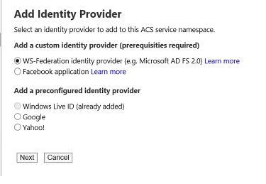
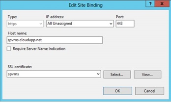
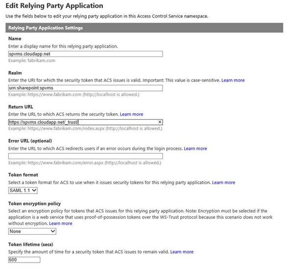
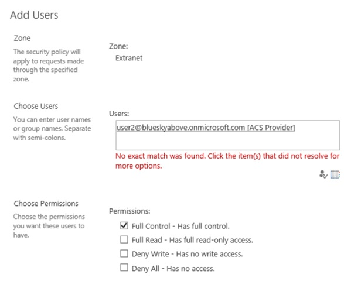

# <a name="using-microsoft-azure-active-directory-for-sharepoint-2013-authentication"></a>SharePoint 2013 인증에 대 한 Microsoft Azure Active Directory를 사용 하 여

 **요약:** Azure Active Directory를 사용 하 여 SharePoint Server 2013 사용자를 인증 하는 Azure 액세스 제어 서비스를 사용 하는 방법에 알아봅니다.
  
다른 id 공급자를 사용 하 여 인증 하는 하 여 사용자를 관리 하기 쉽습니다 될 수 있습니다. 어떻게 편리 하 게 수 신뢰할 수 있지만 다른 사람을 관리 하는 id 공급자를 사용 하는 것이 좋습니다. 예, 한 가지 유형의 사용자가 액세스 하는 클라우드에서 SharePoint Server 2013에 대 한 인증 및 온-프레미스 환경에서 SharePoint 2013 사용자에 대 한 다른 있을 수 있습니다. Azure 액세스 제어 서비스를 사용 하면 이러한 선택 가능한 있습니다. 
  
이 문서에서는 Azure 액세스 제어 서비스를 사용 하 여 온-프레미스 Active Directory 대신 Azure AD 사용한 SharePoint 2013 사용자를 인증 하는 방법을 설명 합니다. 이 구성에서 Azure AD SharePoint 2013에 대 한 신뢰할 수 있는 id 공급자를 됩니다. 이 구성 추가 하는 SharePoint 2013 설치 자체에서 사용 하는 Active Directory 인증 분리 하는 사용자 인증 방법입니다. 이 문서를 에서도 Ws-federation을 파악 해야 합니다. 자세한 내용은 [Ws-federation 이해를](https://go.microsoft.com/fwlink/p/?linkid=188052)참조 하십시오.
  
다음 그림에서는이 구성에서 SharePoint 2013 사용자에 대 한 인증을 작동 하는 방법을 보여줍니다.
  

  
이 문서에 사용 되는 예제는 Kirk Evans, Azure 최상의 센터에 대 한 Microsoft 설계자에서 제공 됩니다. 
  
SharePoint 2013 내게 필요한 옵션에 대 한 정보를 [SharePoint 2013에 대 한 내게 필요한 옵션](https://go.microsoft.com/fwlink/p/?LinkId=393123)을 참조 하십시오.
  
## <a name="configuration-overview"></a>구성 개요

SharePoint 2013 id 공급자로 Azure AD를 사용 하 여 환경을 설정 하는 이러한 일반적인 단계를 따릅니다.
  
1. 새 만들기 Azure AD 테 넌 트 및 네임 스페이스입니다.
    
2. Ws-federation id 공급자를 추가 합니다.
    
3. 신뢰 당사자 응용 프로그램으로 SharePoint를 추가 합니다.
    
4. SSL을 사용 하 여 자체 서명 된 인증서를 만듭니다.
    
5. 클레임 기반 인증에 대 한 규칙 그룹을 만듭니다.
    
6. X.509 인증서를 구성 합니다.
    
7. 클레임 매핑을 만듭니다.
    
8. 새 id 공급자에 대 한 SharePoint를 구성 합니다.
    
9. 사용 권한을 설정 합니다.
    
10. 새 공급자를 확인 합니다.
    
## <a name="create-azure-ad-tenant-and-namespace"></a>Azure AD 테 넌 트 및 네임 스페이스 만들기

새로 만들려면 다음 단계를 사용 하 여 Azure AD 테 넌 트 및 연결된 된 네임 스페이스입니다. 이 예제에서는 사용 하 여 네임 스페이스 "blueskyabove." 
  
1. Azure 관리 포털에서 **Active Directory**클릭 하 고 새 프로그램을 만들 Azure AD 테 넌 트입니다.
    
2. **액세스 제어 네임 스페이스**클릭 하 고 새 네임 스페이스를 만듭니다. 
    
3. 아래쪽 모음에서 **관리** 를 클릭 합니다. 이 위치 열려야 https://blueskyabove.accesscontrol.windows.net/v2/mgmt/web 합니다.
    
4. Windows PowerShell을 엽니다. Windows PowerShell 용 Azure cmdlet을 설치 하기 위한 필수 구성 요소는 Microsoft 온라인 서비스 모듈에 대 한 Windows PowerShell을 사용 합니다.
    
5. Windows PowerShell 명령 프롬프트에서 명령을 입력: `Connect-Msolservice`, 하 고 사용자의 자격 증명을 입력 합니다.
    
    > [!NOTE]
    > Windows PowerShell 용 Azure cmdlet을 사용 하는 방법에 대 한 자세한 내용은 [Windows PowerShell을 사용 하 여 Azure AD 관리](https://go.microsoft.com/fwlink/p/?LinkId=393124)를 참조 하십시오. 
  
6. Windows PowerShell 명령 프롬프트에서 다음 명령을 입력 합니다.
    
  ```
  Import-Module MSOnlineExtended -Force
  ```

  ```
  $replyUrl = New-MsolServicePrincipalAddresses -Address "https://blueskyabove.accesscontrol.windows.net/"
  ```

  ```
  New-MsolServicePrincipal -ServicePrincipalNames @("https://blueskyabove.accesscontrol.windows.net/") -DisplayName "BlueSkyAbove ACS Namespace" -Addresses $replyUrl
  ```

    다음 그림에서는 출력 결과를 보여줍니다.
    
     
  
## <a name="add-a-ws-federation-identity-provider-to-the-namespace"></a>네임 스페이스에 WS 페더레이션 id 공급자를 추가 합니다.

Blueskyabove 네임 스페이스에 새 WS 페더레이션 id 공급자를 추가 하려면 다음 단계를 사용 합니다.
  
1. Azure 관리 포털에서 **Active Directory**로 이동 > **액세스 제어 네임 스페이스** **새 인스턴스 만들기**를 클릭 한 다음 **관리**를 클릭 합니다.
    
2. Azure 액세스 제어 포털에서 **Id 공급자**를 클릭 > **추가**, 다음 그림에 나와있는 것 처럼 합니다.
    
     
  
3. 다음 그림에 나와있는 것 처럼 **WS 페더레이션 id 공급자**클릭 하 고 ****을 클릭 합니다.
    
     
  
4. 표시 이름 및 로그온 링크 텍스트를 작성 한 다음 **저장**을 클릭 합니다. Ws-federation 메타 데이터 URL에 대 한 https://accounts.accesscontrol.windows.net/blueskyabove.onmicrosoft.com/FederationMetadata/2007-06/FederationMetadata.xml를 입력 합니다. 다음 그림에서는 설정을 보여줍니다.
    
     
  
## <a name="add-sharepoint-as-a-relying-party-application"></a>신뢰 당사자 응용 프로그램으로 SharePoint 추가

다음 단계를 사용 하 여 신뢰 당사자 응용 프로그램으로 SharePoint를 추가 합니다.
  
신뢰 당사자 응용 프로그램 설정에 대 한 추가 정보에 대 한 [신뢰 당사자 응용 프로그램](https://go.microsoft.com/fwlink/p/?LinkId=393125)을 참조 하십시오.
  
1. Azure 액세스 제어 포털에서 **신뢰 당사자 응용 프로그램**클릭 하 고 다음 그림에 나와있는 것 처럼 다음 **추가**클릭 합니다.
    
     
  
## <a name="create-a-self-signed-certificate-to-use-for-ssl"></a>SSL을 사용 하 여 자체 서명 된 인증서 만들기

다음 단계를 사용 하 여 SSL을 통한 보안 통신을 위해 사용 하 여 새, 자체 서명 된 인증서를 만듭니다.
  
1. 다음 그림에 나와있는 것 처럼 PublishingSite,으로 동일한 URL을 사용 하려면 SSL 포트 443 함께 사용 하 여 웹 응용 프로그램을 확장 합니다.
    
     
  
2. IIS 관리자에서 **서버 인증서**를 두번클릭 합니다.
    
3. **동작** 창에서 **자체 서명 된 인증서 만들기**를 클릭 합니다. **지정 인증서에 대 한 이름** 상자에 인증서에 대 한 친숙 한 이름을 입력 한 다음 **확인**을 클릭 합니다.
    
4. **사이트 바인딩 편집** 대화 상자에서 호스트 이름은 친숙 한 이름을와 동일 하 게 다음 그림에 나와있는 것 처럼 확인 합니다.
    
     
  
     
  
5. Azure 관리 포털에서 구성 하려는 가상 컴퓨터를 클릭 하 고 **끝점**을 클릭 합니다.
    
6. **추가**클릭 하 고 다음을 클릭 **-->** (다음)에 대 한 합니다.
    
7. **이름**는 끝점에 대 한 이름을 입력 합니다.
    
8. **공용 포트** 및 **개인 포트**를 사용 하려는 포트 번호를 입력 하 고 완료를 확인 표시를 클릭 합니다. 이러한 번호는 다를 수 있습니다. 이 문서에서는에서는 사용 443, 다음 그림에 나와있는 것 처럼 합니다.
    
     
  
    > [!NOTE]
    > Azure에 가상 컴퓨터에 끝점을 추가 하는 방법에 대 한 자세한 내용은 [가상 컴퓨터에 설정를 끝점 하는 방법](https://go.microsoft.com/fwlink/p/?LinkId=393126)을 참조 하십시오. 
  
9. 다음 그림에 나와있는 것 처럼 액세스 제어 서비스 포털에서 신뢰 당사자를 추가 합니다.
    
     
  
## <a name="create-a-rule-group-for-claims-based-authentication"></a>클레임 기반 인증에 대 한 규칙 그룹 만들기

다음 단계를 사용 하 여 제어 클레임 기반 인증을 새 규칙 그룹을 만듭니다.
  
1. 왼쪽된 창에서 **규칙 그룹**클릭 한 다음 **추가**클릭 합니다.
    
2. 규칙 그룹에 대 한 이름을 입력 하 고 **저장**을 클릭 한 다음 **생성**을 클릭 한 다음 합니다. 이 문서의 목적 우리는 사용 하 여 **기본 규칙 그룹 >for spvms.cloudapp.net**다음 그림에 나와있는 것 처럼 합니다.
    
     
  
     
  
    > [!NOTE]
    > 규칙 그룹을 만드는 방법에 대 한 자세한 내용은 [규칙 그룹 및 규칙을](https://go.microsoft.com/fwlink/p/?LinkId=393128)참조 하십시오. 
  
3. 변경 하려는 규칙 그룹을 클릭 하 고을 변경 하려는 클레임 규칙을 클릭 합니다. 이 문서에서는 다음 그림과 같이 **upn**변수로 **이름** 를 전달 하는 그룹에 클레임 규칙을 추가 합니다.
    
     
  
4. **Upn**라는 기존 클레임 규칙을 삭제 하 고 다음 그림과 같이 **이름에 UPN 클레임** 규칙을 그대로 둡니다.
    
     
  
## <a name="configure-the-x509-certificate"></a>X.509 인증서를 구성 합니다.

토큰 서명을 사용 하 여 X.509 인증서를 구성 하려면 다음 단계를 사용 합니다.
  
1. 액세스 제어 서비스 창에서 **개발** **응용 프로그램의 통합**을 클릭 합니다.
    
2. **끝점 참조**Azure 테 넌 트와 연결 된 **Federation.xml** 찾은 다음 브라우저의 주소 표시줄에는 위치에 복사 합니다.
    
3. **Federation.xml** 파일에서 **RoleDescriptor** 섹션을 찾아에서 정보를 복사 된 _<X509Certificate>_ 요소를 다음 그림에 나와있는 것 처럼 합니다.
    
     
  
4. C: 드라이브의 루트에서\\, **인증서**라는 폴더를 만듭니다.
    
5. C: 폴더로 x509 인증서 정보를 저장\\인증서 파일 이름으로 **AcsTokenSigning.cer**합니다.
    
    > [!NOTE]
    > 파일 이름 확장명이.cer 저장 되어야 합니다. 
  
     
  
## <a name="create-a-claim-mapping-by-using-windows-powershell"></a>Windows PowerShell을 사용 하 여 클레임 매핑 만들기

다음 단계를 사용 하 여 Windows PowerShell을 사용 하 여 클레임 매핑을 만듭니다.
  
다음 멤버 자격이 있는지 확인합니다.
  
1. SQL Server 인스턴스에 대 한 **securityadmin** 고정 서버 역할입니다.
    
2. 업데이트 되는 모든 데이터베이스에 대 한 **db_owner** 고정된 데이터베이스 역할입니다.
    
3. Windows PowerShell cmdlet을 실행 하는 서버에서 administrators 그룹입니다.
    
관리자는 **Add-spshelladmin** cmdlet를 사용 하 여 SharePoint 2013 cmdlet을 사용 하 여 사용 권한을 부여할 수 있습니다.
  
> [!NOTE]
> 권한이 없는 경우에 설치 관리자 또는 SQL Server 관리자 권한 요청에 문의 합니다. Windows PowerShell 사용 권한에 대 한 자세한 내용은 [Add-spshelladmin](http://technet.microsoft.com/library/2ddfad84-7ca8-409e-878b-d09cb35ed4aa.aspx)을 참조 하십시오. 
  
1. **시작** 메뉴에서 **모든 프로그램**을 클릭 합니다.
    
2. **Microsoft SharePoint 2013 Products**를 클릭 합니다.
    
3. **SharePoint 2013 관리 셸**을 클릭 합니다.
    
4. Windows PowerShell 명령 프롬프트에서 클레임 매핑을 만들려면 다음 명령을 입력 합니다.
    
  ```
  $cert = New-Object System.Security.Cryptography.X509Certificates.X509Certificate2("c:\\certificates\\AcsTokenSigning.cer")
  ```

  ```
  New-SPTrustedRootAuthority -Name "ACS BlueSkyAbove Token Signing" -Certificate $cert
  ```

  ```
  $map = New-SPClaimTypeMapping -IncomingClaimType "http://schemas.xmlsoap.org/ws/2005/05/identity/claims/upn" -IncomingClaimTypeDisplayName "UPN" -SameAsIncoming
  ```

  ```
  $map2 = New-SPClaimTypeMapping -IncomingClaimType "http://schemas.xmlsoap.org/ws/2005/05/identity/claims/givenname" -IncomingClaimTypeDisplayName "GivenName" -SameAsIncoming
  ```

  ```
  $map3 = New-SPClaimTypeMapping -IncomingClaimType "http://schemas.xmlsoap.org/ws/2005/05/identity/claims/surname" -IncomingClaimTypeDisplayName "SurName" -SameAsIncoming
  ```

  ```
  $realm = "urn:sharepoint:spvms"
  ```

  ```
  $ap = New-SPTrustedIdentityTokenIssuer -Name "ACS Provider" -Description "SharePoint secured by SAML in ACS" -realm $realm -ImportTrustCertificate $cert -ClaimsMappings $map,$map2,$map3 -SignInUrl "https://blueskyabove.accesscontrol.windows.net/v2/wsfederation" -IdentifierClaim "http://schemas.xmlsoap.org/ws/2005/05/identity/claims/upn"
  ```

## <a name="configure-sharepoint-for-the-new-identity-provider"></a>새 id 공급자에 대 한 SharePoint 구성

Azure AD에 대 한 새 id 공급자에 SharePoint 설치를 구성 하려면 다음 단계를 사용 합니다.
  
1. 이 절차를 수행하는 사용자 계정이 Farm Administrators SharePoint 그룹의 구성원인지 확인합니다.
    
2. 중앙 관리의 홈페이지에서 **응용 프로그램 관리**를 클릭 합니다.
    
3. **응용 프로그램 관리** 페이지의 **웹 응용 프로그램** 섹션에서 **웹 응용 프로그램 관리를**클릭 합니다.
    
4. 적절한 웹 응용 프로그램을 클릭합니다.
    
5. 리본 메뉴에서 **인증 공급자**를 클릭 합니다.
    
6. **영역**영역의 이름을 클릭 합니다. 예: **기본값**입니다.
    
7. **인증 편집** 페이지의 **클레임 인증 유형** 섹션에서 **신뢰할 수 있는 Id 공급자**선택 하 고이 문서의 목적을 위해 **ACS 공급자**는 하는 공급자의 이름을 클릭 합니다. **확인**을 클릭 합니다.
    
8. 다음 그림에는 **신뢰할 수 있는 공급자** 설정을 보여줍니다.
    

  
## <a name="set-the-permissions"></a>사용 권한 설정

웹 응용 프로그램에 액세스 권한을 설정 하려면 다음 단계를 사용 합니다.
  
1. 중앙 관리의 홈페이지에서 **응용 프로그램 관리**를 클릭 합니다.
    
2. **응용 프로그램 관리** 페이지의 **웹 응용 프로그램** 섹션에서 **웹 응용 프로그램 관리를**클릭 합니다.
    
3. 적절 한 웹 응용 프로그램을 클릭 한 다음 **사용자 정책**을 클릭 합니다.
    
4. **웹 응용 프로그램에 대 한 정책** **사용자 추가**클릭 합니다.
    
5. **사용자 추가** 대화 상자에서 **영역**적절 한 영역을 클릭 하 고 ****을 클릭 합니다.
    
6. **사용자 추가** 대화 상자에서 typeuser2@blueskyabove.onmicrosoft.com (ACS 공급자).
    
7. **사용 권한** **모든 권한**을 클릭 합니다.
    
8. **마침**, **확인**을 차례로 클릭합니다.
    
다음 그림에서는 기존 웹 응용 프로그램의 **사용자 추가** 섹션을 보여줍니다.
  

  
## <a name="verify-the-new-provider"></a>새 공급자를 확인 합니다.

다음 단계를 사용 하 여 새 인증 공급자의 로그인 프롬프트에 나타나는지 확인 하 여 새 id 공급자가 작동 하는지 확인 합니다.
  
1. 다음 그림에 나와있는 것 처럼 **파란색 하늘 위에**라는 새 공급자를 사용 하 여 로그인 합니다.
    
     
  
## <a name="additional-resources"></a>추가 리소스

[Ws-federation 이해](https://go.microsoft.com/fwlink/p/?linkid=188052)
  
[클라우드 채택 및 하이브리드 솔루션](cloud-adoption-and-hybrid-solutions.md)
  
## <a name="join-the-discussion"></a>토론 참여

|**문의처**|**설명**|
|:-----|:-----|
|**클라우드 채택 콘텐츠 합니까 필요 합니까?** <br/> |여러 Microsoft 클라우드 플랫폼 및 서비스에 걸쳐 있는 클라우드 채택에 대 한 콘텐츠를 만듭니다. 보겠습니다 작업을 알 사용해 클라우드 채택 콘텐츠를 구상할 [cloudadopt@microsoft.com](mailto:cloudadopt@microsoft.com?Subject=[Cloud%20Adoption%20Content%20Feedback]:%20)에 전자 메일을 발송 하 여 특정 콘텐츠를 요청 합니다.<br/> |
|**클라우드 채택 토론에 참가** <br/> |클라우드 기반 솔루션에 열정을 갖고 인 경우에는 클라우드 채택 자문 보드 (CAAB) Microsoft 콘텐츠 개발자, 업계 전문가는 전세계 어디에서 고객의 더 큰, 생생한 커뮤니티와 연결할에 참가 하는 것이 좋습니다. 참가, Microsoft 기술 커뮤니티의 [CAAB (클라우드 채택 자문 위원회) 공간](https://aka.ms/caab) 의 구성원으로 자신을 추가 하 고 [CAAB@microsoft.com](mailto:caab@microsoft.com?Subject=I%20just%20joined%20the%20Cloud%20Adoption%20Advisory%20Board!)에서 빠른 전자 메일을 보내주시기 합니다. 누구나 [CAAB 블로그 (영문)](https://blogs.technet.com/b/solutions_advisory_board/)에서 커뮤니티 관련 콘텐츠를 읽을 수 있습니다. 그러나 CAAB 구성원에 게 새 클라우드 채택 리소스 및 솔루션에 설명 하는 개인 웨 초대장을 가져옵니다.<br/> |
|**여기에서 참조 하 여 아트 가져오기** <br/> |이 문서에서 참조 하는 이미지의 편집 가능한 복사본을 원하는 귀하에 게 보내야 기꺼이 표시 됩니다. URL 및 [cloudadopt@microsoft.com](mailto:cloudadopt@microsoft.com?subject=[Art%20Request]:%20)는 이미지의 제목을 포함 하 여 요청을 전자 메일로 보냅니다.<br/> |
   

