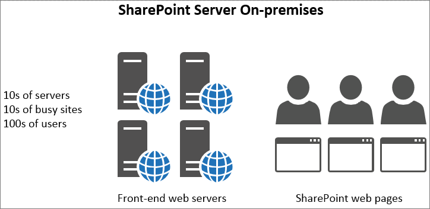

# SharePoint online에서 개체 캐시 사용Using the object cache with SharePoint Online

이 문서에서는 SharePoint Server 2013 온-프레미스 및 SharePoint Online에서 개체 캐시를 사용 하는 경우의 차이점에 대해 설명 합니다.This article explains the difference between using the object cache in SharePoint Server 2013 on-premises and SharePoint Online.
  
SharePoint Online 배포에서 개체 캐시에 의존 하는 것이 상당히 부정적으로 영향을 받습니다.There is significant negative impact of relying on the object cache in SharePoint Online deployment. SharePoint Online의 개체 캐시에 대 한 종속성은 페이지의 안정성을 줄입니다.Any dependency on object cache in SharePoint Online will reduce the reliability of your page. 
  
## SharePoint Online 및 SharePoint Server 2013 개체 캐시의 작동 방식How the SharePoint Online and SharePoint Server 2013 object cache works

SharePoint Server 2013이 온-프레미스에 호스트 되 면 고객에 게 개체 캐시를 호스트 하는 개인 프런트 엔드 웹 서버가 있는 것입니다.When SharePoint Server 2013 is hosted on-premises, the customer has private front-end web servers that host the object cache. 즉, 캐시는 한 고객 전용으로 사용 가능 하며 개체 캐시에 할당 되는 메모리의 양에 의해서만 제한 됩니다.This means the cache is dedicated to one customer and is only limited by how much memory is available and allocated to the object cache. 온-프레미스 시나리오에서는 하나의 고객만 제공 되므로 프런트 엔드 웹 서버는 일반적으로 동일한 사이트에 대 한 요청을 수행 하 게 됩니다.Because only one customer is served in the on-premises scenario the front-end web servers typically have users making requests to the same sites over and over. 즉, 캐시가 빠르게 꽉 차서 사용자가 정기적으로 요청 하는 목록 쿼리 결과 및 SharePoint 개체의 전체 상태를 유지 합니다.This means that the cache gets full quickly and remains full of the list query results and SharePoint objects that your users are requesting on a regular basis.
  

  
따라서 사용자가 페이지를 두 번 방문 하면 페이지 로드 시간이 빨라집니다.As a result, the second time a user visits a page, the page load time improves. 동일한 페이지를 네 번 이상 로드 한 후에는 페이지가 모든 프런트 엔드 웹 서버에 캐시 됩니다.After a minimum of four loads of the same page, the page is cached on all of the front-end web servers.
  
반면 SharePoint Online에는 더 많은 서버 뿐만 아니라 더 많은 사이트가 있습니다.In contrast, in SharePoint Online there are many more servers but also many more sites. 각 사용자는 캐시가 채워지지 않은 다른 프런트 엔드 웹 서버에 연결할 수 있습니다.Each user may connect to a different front-end web server that doesn't have the cache populated. 또는 캐시가 서버에 대해 채워지면 해당 프런트 엔드 웹 서버에 대 한 다음 사용자가 다른 사이트의 페이지를 요청 합니다.Or, perhaps the cache does get populated for a server, but the next user to that front-end web server requests a page from a different site. 또는 다음 사용자가 이전에 방문 했을 때와 동일한 페이지를 요청 하는 경우에도 해당 페이지가 캐시에 없는 다른 프런트 엔드 웹 서버에 로드 균형이 조정 됩니다.Or, even if the next user requests the same page as on their previous visit, they are load-balanced to a different front-end web server that doesn't have that page in its cache. 이 마지막 경우에는 캐싱이 사용자에 게 도움이 되지 않습니다.In this last case, caching doesn't help the users at all.
  
다음 그림에서 각 점은 사용자가 요청 하는 페이지와 캐시 되는 위치를 나타냅니다.In the following figure, each dot represents a page that a user is requesting and where it cached. 다양 한 색은 SaaS 인프라를 공유 하는 여러 고객을 나타냅니다.Different colors represent different customers making shared use of the SaaS infrastructure.
  

  
다이어그램에서 볼 수 있듯이 해당 페이지의 캐시 된 버전을 사용 하 여 특정 사용자가 서버를 방문 하는 것은 슬림 합니다.As you can see from the diagram, the chances of any given user hitting a server with the cached version of their page are slim. 또한 많은 사이트 간에 서버를 공유 하는 처리량이 많기 때문에 캐시에 사용 가능한 캐싱 공간이 충분 하기 때문에 캐시가 오래 지속 되지 않았습니다.Also, due to the large throughput and fact that the servers are shared between many sites, the cache doesn't last long since there is only so much space for caching available.
  
이러한 모든 이유로, 캐시 된 개체를 가져오는 사용자에 게 작업을 수행 하는 것은 SharePoint Online에서 품질 사용자 환경 및 페이지 로드 시간을 효과적으로 보장할 수 없습니다.For all of these reasons, relying on users getting cached objects is not an effective way to ensure a quality user experience and page load times in SharePoint Online.
  
## SharePoint Online에서 성능을 향상 시키기 위해 개체 캐시에 의존할 수 없는 경우에는 어떤 작업을 대신 사용 하나요?If we can't rely on the object cache to improve performance in SharePoint Online, what do we use instead?

SharePoint Online의 캐싱에 의존해 서는 안 되므로, 개체 캐시를 사용 하는 SharePoint 사용자 지정에 대 한 대체 디자인 방식을 평가 해야 합니다.Since you shouldn't rely on caching in SharePoint Online, you should evaluate alternative design approaches for SharePoint customizations that use the object cache. 즉, 사용자에 게 좋은 결과를 생성 하기 위해 개체 캐싱을 사용 하지 않는 성능 문제에 대 한 접근 방식을 사용 합니다.This means using approaches for performance issues which do not rely on the object caching in order to produce good results for users. 이 작업은이 시리즈의 다른 문서에 설명 되어 있으며 다음을 포함 합니다.This is described in some of the other articles in this series and include:
  
- [SharePoint Online에 대 한 탐색 옵션Navigation options for SharePoint Online](navigation-options-for-sharepoint-online.md)
    
- [SharePoint Online의 축소 및 묶음Minification and bundling in SharePoint Online](minification-and-bundling-in-sharepoint-online.md)
    
- [콘텐츠 배달 네트워크 사용Using content delivery networks](using-content-delivery-networks-with-sharepoint-online.md)
    
- [SharePoint Online에서 이미지 및 JavaScript 로드 지연Delay loading images and JavaScript in SharePoint Online](delay-loading-images-and-javascript-in-sharepoint-online.md)
    

